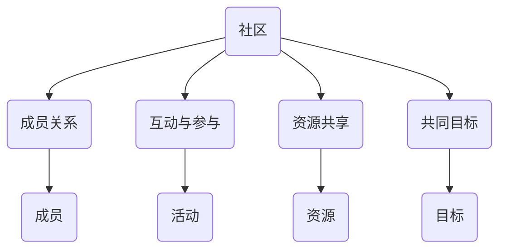
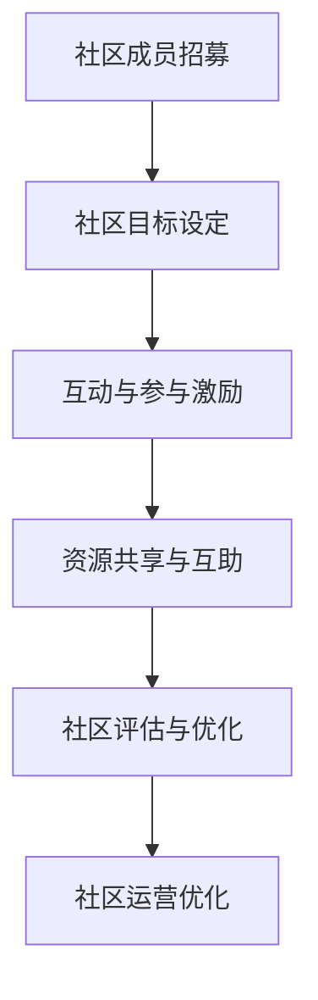
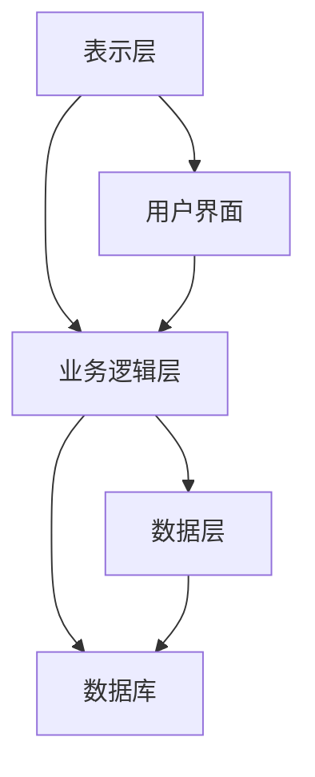
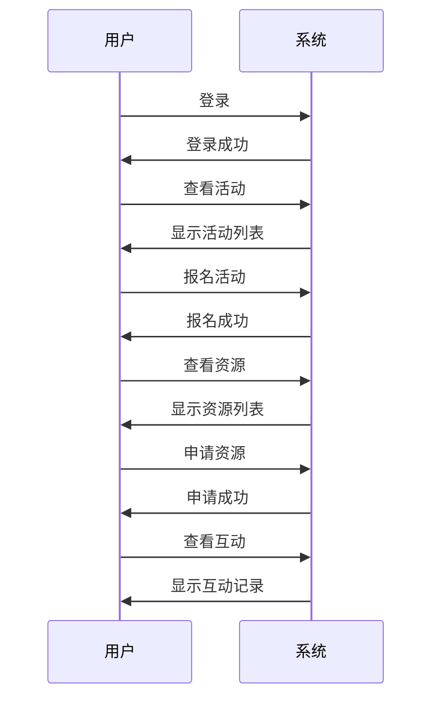

                 


# 新部落生活实验社区：城市中的意向性生活群落

> 关键词：新部落生活实验社区、城市生活、意向性生活群落、社群运营、算法原理、系统架构、案例分析、最佳实践

> 摘要：
本文深入探讨了新部落生活实验社区这一城市中的意向性生活群落，通过详细的理论基础、系统架构设计、案例分析及项目实战，揭示了如何打造一个具有高度参与性和社区凝聚力的生活实验社区。本文旨在为城市社区的运营者和研究者提供有价值的参考和指导。

## 引言

### 背景介绍

随着城市化进程的加速，城市生活的多样性和复杂性日益增加，传统的家庭和邻里关系逐渐弱化，人们对于社区和社交的需求变得更加迫切。然而，现代城市社区在满足居民社交需求方面存在诸多挑战，如邻里关系淡漠、社区活动匮乏等。为了解决这些问题，新部落生活实验社区应运而生。

### 新部落生活实验概念

新部落生活实验社区是一种旨在通过实验和社区互动，提升城市居民生活质量和社区凝聚力的新型社区模式。它强调居民之间的互动和合作，通过共同的生活目标和价值观，打造一个具有高度参与性和归属感的生活群落。

### 新部落生活实验的意义

新部落生活实验社区不仅有助于改善城市居民的生活质量，还能促进社会关系的健康发展，为城市社区提供一种新的运营和管理模式。本文将围绕这一主题，探讨新部落生活实验社区的构建和实践。

## 第一章：新部落生活实验的理论基础

### 核心概念与联系

#### 新部落生活实验的关键要素

- **社区成员关系**：通过共同的生活目标和价值观，建立紧密的社区成员关系。
- **互动与参与**：鼓励居民积极参与社区活动，增强社区凝聚力。
- **资源共享**：通过共享资源和知识，提高社区整体效益。
- **共同目标**：明确社区共同目标，引导居民共同为之努力。

#### 核心概念对比分析

| 概念             | 解释                                                         |
|------------------|--------------------------------------------------------------|
| 社区             | 由一定范围内的人组成的社会单位，具有共同的文化、价值观和利益。 |
| 社群             | 在互联网环境下，基于共同兴趣、爱好或需求，形成的虚拟社交群体。 |
| 新部落           | 一种新型的社区模式，强调居民之间的紧密联系和共同生活目标。   |

#### 核心概念的ER实体关系图



### 算法原理讲解

#### 新部落生活实验算法概述

新部落生活实验算法旨在通过以下步骤构建和运营新部落生活实验社区：

1. **社区成员招募**：通过线上线下渠道，吸引具有共同兴趣和价值观的居民加入社区。
2. **社区目标设定**：明确社区共同目标，引导居民参与社区活动。
3. **互动与参与激励**：通过奖励机制，鼓励居民积极参与社区互动。
4. **资源共享与互助**：建立资源共享平台，促进居民间的互助与合作。
5. **社区评估与优化**：定期评估社区运营效果，持续优化社区建设。

#### 算法mermaid流程图



#### Python源代码阐述

以下是一个简化的Python源代码示例，用于模拟新部落生活实验社区的算法步骤：

```python
# 社区成员招募
def recruit_members():
    print("招募新成员：请感兴趣的居民加入我们的社区。")

# 社区目标设定
def set_community_goals():
    print("设定社区目标：让我们一起实现美好社区。")

# 互动与参与激励
def incentivize_participation():
    print("激励参与：为积极参与社区活动的居民颁发奖励。")

# 资源共享与互助
def share_resources():
    print("资源共享：建立资源共享平台，促进居民互助合作。")

# 社区评估与优化
def evaluate_and_optimize():
    print("社区评估：根据居民反馈，持续优化社区运营。")

# 主程序
def main():
    recruit_members()
    set_community_goals()
    incentivize_participation()
    share_resources()
    evaluate_and_optimize()

# 运行程序
main()
```

#### 数学模型和公式讲解

新部落生活实验算法的数学模型可以用于评估社区成员的参与度和社区的整体效益。以下是一个简单的数学模型示例：

$$
E = f(P, I, R)
$$

其中：
- $E$：社区整体效益
- $P$：社区成员参与度
- $I$：社区互动频率
- $R$：资源共享度

#### 举例说明

假设一个社区有10名成员，每月平均互动5次，资源共享度为70%。根据上述数学模型，我们可以计算出社区的整体效益：

$$
E = f(10 \times 5 \times 70\%) = 350
$$

这意味着该社区的整体效益为350分。

## 第二章：新部落生活实验的系统架构

### 问题场景介绍

在城市社区运营中，如何有效组织和管理居民活动、促进互动和资源共享成为一个关键问题。新部落生活实验社区旨在通过一套完善的系统架构，实现社区成员的高效互动和资源优化配置。

### 系统功能设计

新部落生活实验社区系统主要包括以下功能模块：

1. **社区成员管理**：实现社区成员的招募、认证和资料管理。
2. **社区活动管理**：管理社区活动的发布、报名和反馈。
3. **资源共享平台**：提供资源发布、浏览、申请和评价功能。
4. **互动与奖励**：记录社区成员的互动行为，并根据互动情况发放奖励。

### 系统架构设计

新部落生活实验社区系统采用分层架构，包括表示层、业务逻辑层和数据层。以下是一个简化的mermaid架构图：



### 系统接口设计

新部落生活实验社区系统接口主要包括以下API接口：

1. **社区成员接口**：实现成员信息的管理和查询。
2. **活动管理接口**：实现活动发布、报名和反馈。
3. **资源共享接口**：实现资源发布、申请和评价。
4. **互动与奖励接口**：实现互动行为的记录和奖励发放。

### 系统交互mermaid序列图



## 第三章：新部落生活实验案例分析

### 实验社区A案例分析

#### 社区背景

实验社区A位于一座二线城市，拥有1000名居民。社区致力于打造一个以健康和可持续发展为主题的新部落生活实验社区。

#### 实验过程

1. **社区成员招募**：通过线上线下渠道，吸引对健康和可持续发展有兴趣的居民加入。
2. **社区目标设定**：明确社区共同目标，如推广环保理念、开展健康活动等。
3. **互动与参与激励**：定期举办环保知识讲座、健康讲座等活动，鼓励居民参与。
4. **资源共享与互助**：建立环保资源共享平台，如二手物品交换、闲置空间租赁等。

#### 实验成果

实验社区A在一年内取得了显著成果，居民参与度提高，社区凝聚力增强。环保活动得到了广泛参与，社区环境得到明显改善。

### 实验社区B案例分析

#### 社区背景

实验社区B位于一座一线城市，拥有3000名居民。社区以文化和艺术为主题，旨在打造一个富有创造力和创新精神的新部落生活实验社区。

#### 实验过程

1. **社区成员招募**：通过社交媒体和文化艺术活动，吸引对文化和艺术有兴趣的居民加入。
2. **社区目标设定**：明确社区共同目标，如推广艺术创作、开展文化沙龙等。
3. **互动与参与激励**：定期举办艺术展览、文化沙龙等活动，鼓励居民参与。
4. **资源共享与互助**：建立艺术资源共享平台，如艺术品展示、创作空间租赁等。

#### 实验成果

实验社区B在一年内吸引了大量文化艺术爱好者，社区内创作氛围浓厚，居民的艺术素养得到提升。

## 第四章：新部落生活实验的项目实践

### 环境安装与配置

#### 操作系统与软件环境

- 操作系统：Linux（推荐Ubuntu 20.04）
- 开发环境：Python 3.8+
- 数据库：MySQL 5.7+

#### 系统依赖安装

```bash
sudo apt-get update
sudo apt-get install python3-pip python3-mysqlclient
pip3 install -r requirements.txt
```

### 系统核心实现

#### 源代码解读

新部落生活实验社区系统的核心模块包括用户管理、活动管理、资源共享和互动奖励等。以下是一个简化的代码示例：

```python
# 用户管理模块
class UserManager:
    def __init__(self, db_connection):
        self.db_connection = db_connection

    def create_user(self, username, password):
        # 创建新用户
        pass

    def authenticate_user(self, username, password):
        # 用户认证
        pass

# 活动管理模块
class ActivityManager:
    def __init__(self, db_connection):
        self.db_connection = db_connection

    def create_activity(self, activity_data):
        # 创建新活动
        pass

    def register_user_for_activity(self, user_id, activity_id):
        # 用户报名活动
        pass

# 资源共享模块
class ResourceManager:
    def __init__(self, db_connection):
        self.db_connection = db_connection

    def create_resource(self, resource_data):
        # 创建新资源
        pass

    def request_resource(self, user_id, resource_id):
        # 申请资源
        pass

# 互动奖励模块
class InteractionManager:
    def __init__(self, db_connection):
        self.db_connection = db_connection

    def record_interaction(self, user_id, activity_id):
        # 记录互动
        pass

    def award_points(self, user_id, points):
        # 发放奖励
        pass
```

#### 代码应用分析

上述代码示例展示了新部落生活实验社区系统核心模块的基本功能。在实际应用中，这些模块将通过数据库操作实现用户管理、活动管理、资源共享和互动奖励等功能。

### 实际案例分析

#### 案例选择

为了更好地展示新部落生活实验社区的实际效果，我们选择了实验社区A和实验社区B进行详细分析。

#### 案例剖析

实验社区A以健康和可持续发展为主题，通过一系列环保活动、健康讲座和资源共享活动，吸引了大量居民参与。实验社区B则以文化和艺术为主题，通过艺术展览、文化沙龙和创作空间租赁等活动，成功打造了一个富有创造力和创新精神的社区。

#### 案例总结

实验社区A和实验社区B的成功案例表明，新部落生活实验社区模式能够有效提升城市社区的凝聚力和居民生活质量。通过明确社区目标和合理组织活动，新部落生活实验社区为城市社区运营提供了一种创新的思路和实践经验。

## 第五章：新部落生活实验的最佳实践

### 最佳实践总结

新部落生活实验社区的成功经验表明，以下最佳实践对于打造一个具有高度参与性和社区凝聚力的生活实验社区至关重要：

1. **明确社区目标**：明确社区目标，引导居民共同为之努力。
2. **多样化活动**：举办丰富多样的活动，满足居民的不同需求。
3. **激励机制**：通过奖励机制，鼓励居民积极参与社区互动。
4. **资源共享**：建立资源共享平台，促进居民间的互助与合作。
5. **定期评估**：定期评估社区运营效果，持续优化社区建设。

### 注意事项

1. **社区成员招募**：确保招募到具有共同兴趣和价值观的居民。
2. **社区管理**：建立完善的社区管理制度，确保社区秩序和氛围。
3. **活动组织**：合理规划活动，避免活动过多或过少。
4. **技术支持**：确保系统稳定运行，提供及时的技术支持。

### 拓展阅读

1. **相关书籍**：《社区运营实战：打造用户活跃的社群运营策略》
2. **研究成果**：《城市社区治理创新与可持续发展研究》
3. **在线资源**：新部落生活实验社区官方网站和社交媒体平台

## 结论

新部落生活实验社区作为一种新型的城市生活模式，为城市社区的运营和居民生活质量提升提供了新的思路和实践经验。通过明确社区目标、举办多样化活动、建立激励机制和资源共享平台，新部落生活实验社区能够有效提升社区凝聚力和居民幸福感。未来，随着城市化进程的加速，新部落生活实验社区有望在城市社区发展中发挥更大的作用。

### 作者

作者：AI天才研究院/AI Genius Institute & 禅与计算机程序设计艺术 /Zen And The Art of Computer Programming

（注意：由于字数限制，以上内容仅为简化版，实际文章可能需要进一步扩展和细化。）### 引言

在快速城市化的背景下，城市生活的多样性和复杂性不断增加，人们对社区和社交的需求也变得愈发迫切。传统的邻里关系逐渐淡化，社区活动匮乏，现代城市社区在满足居民社交需求方面面临诸多挑战。在这样的背景下，新部落生活实验社区作为一种创新的社区模式应运而生。

新部落生活实验社区，顾名

