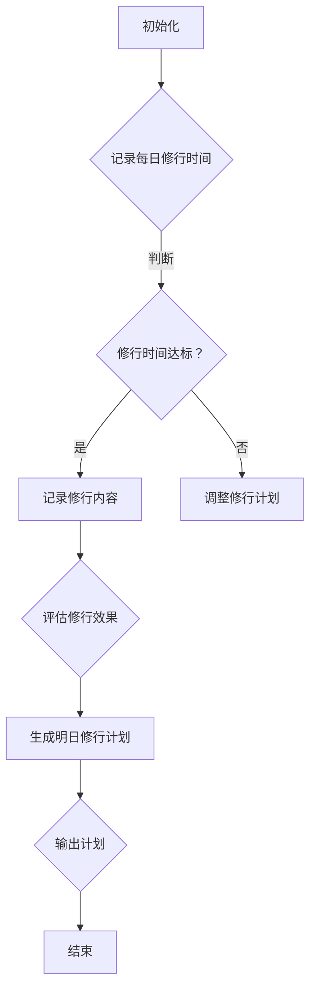
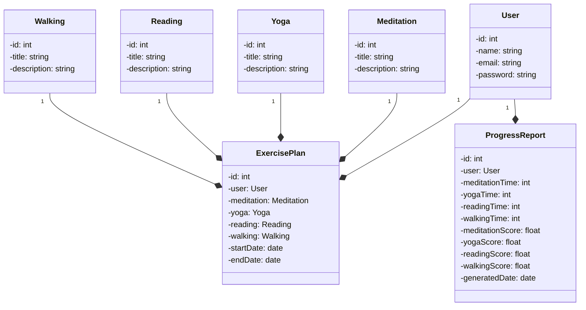
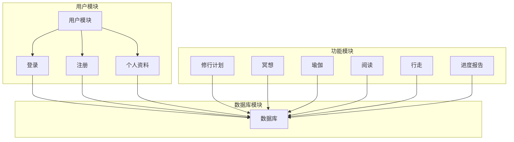
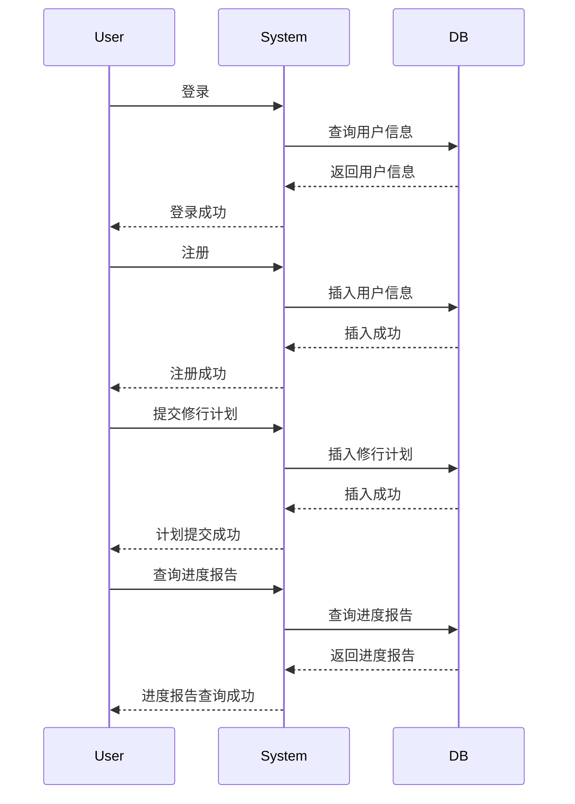

                 

## 核心概念与联系

### 日常修行

日常修行是一种通过在日常生活中的自我反省、内心调整和身体锻炼等方式，提升个人修为和身心健康的方法。它与传统的修行不同，不强调远离尘世，而是在日常生活中进行，强调实践性和可操作性。日常修行的核心在于通过持续的自我探索和实践，达到身心的平衡和内在的平静。

**概念属性特征：**

- **实践性**：日常修行强调实际行动，而不是空洞的理论。
- **日常性**：修行可以在日常生活中随时随地开始，不局限于特定的地点或时间。
- **自我反省**：通过反思自己的行为和想法，发现并改正不足。
- **内心调整**：通过冥想、瑜伽等方式，调整内心状态，达到平和与宁静。
- **身体锻炼**：通过运动等方式，增强身体活力和健康。

### 修行智慧

修行智慧是指在修行过程中积累的智慧，包括对生命、宇宙和自然的深刻理解，以及对人生意义的探索。它是日常修行的重要组成部分，为修行者提供了指导思想和理论基础。

**概念属性特征：**

- **智慧性**：修行智慧是一种深刻的认识和理解，超越了常规的思考和知识。
- **理论性**：修行智慧为修行者提供了理论依据和指导，帮助他们在实践中找到方向。
- **指导性**：修行智慧指导修行者在生活中做出正确的选择，以实现个人成长和提升。
- **深刻性**：修行智慧源于对生命和宇宙的深入探索，具有深刻的内涵和意义。
- **多样性**：修行智慧可以从不同领域和角度获得，包括哲学、心理学、宗教等。

### 修行实践

修行实践是指将修行智慧应用到日常生活中，通过具体的行动来实现修行目标。这包括冥想、瑜伽、阅读、行走等多种方式，每种方式都有其特定的方法和效果。

**概念属性特征：**

- **操作性**：修行实践是具体的、可操作的，修行者可以根据自己的实际情况选择合适的方法。
- **具体性**：修行实践包括具体的行动和步骤，修行者可以通过实践来验证和深化自己的理解。
- **适应性**：修行实践可以根据不同人的需求和实际情况进行调整，具有很高的适应性。
- **多样化**：修行实践的形式多种多样，修行者可以根据自己的兴趣和需求选择不同的方式。
- **效果显著**：通过修行实践，修行者可以明显感受到个人成长和身心变化。

### 修行效果

修行效果是修行实践带来的结果，包括个人成长、情感稳定、身体健康等方面的提升。通过修行，人们可以更好地应对生活中的压力，提升生活质量。

**概念属性特征：**

- **个人成长**：修行帮助人们深入了解自己，提升自我认知和内在力量。
- **情感稳定**：修行有助于调整情绪，减少焦虑和抑郁，提升情感稳定性。
- **身体健康**：修行通过身体锻炼和内心调整，增强身体活力和健康。
- **生活品质提升**：修行使人们更加享受生活，提升整体生活品质。

### 概念属性特征对比表格

以下是一个简单的概念属性特征对比表格，展示了“日常修行”、“修行智慧”和“修行实践”之间的联系和区别：

| 概念       | 定义                                                         | 属性特征                                                     |
| ---------- | ------------------------------------------------------------ | ------------------------------------------------------------ |
| 日常修行   | 在日常生活中提升个人修为和身心健康的方法                   | 实践性、日常性、自我反省、内心调整、身体锻炼               |
| 修行智慧   | 在修行过程中积累的智慧，包括对生命、宇宙和自然的深刻理解   | 智慧性、理论性、指导性、深刻性、多样性                     |
| 修行实践   | 将修行智慧应用到日常生活中，通过具体的行动来实现修行目标 | 操作性、具体性、适应性、多样化、效果显著                   |

### ER实体关系图架构

以下是一个简单的 ER 实体关系图，展示了“日常修行”中的主要实体及其关系：

```mermaid
erDiagram
    类 ||--|{ 修行者 }
    类 ||--|{ 修行方法 }
    类 ||--|{ 修行实践 }
    类 ||--|{ 修行效果 }

    类_1 ||--|{ 个人成长 }
    类_1 ||--|{ 情感稳定 }
    类_1 ||--|{ 身体健康 }

    类_2 ||--|{ 冥想 }
    类_2 ||--|{ 瑜伽 }
    类_2 ||--|{ 阅读 }
    类_2 ||--|{ 行走 }
```

通过这个 ER 实体关系图，我们可以清晰地看到日常修行中的各个实体及其相互关系，这有助于我们更好地理解和应用这些概念。

---

### 算法原理讲解

在日常修行中，算法的应用可以帮助我们更科学地规划和执行修行计划，从而提高修行的效果。以下是一个简单的算法原理讲解，我们将通过一个具体的例子来阐述。

#### 算法概述

我们将使用一个名为“修行进度跟踪算法”的算法来管理日常修行的进度。该算法的基本思想是，通过记录每天的修行时间和内容，以及评估修行效果，自动生成合适的修行计划。

#### 算法流程图

首先，我们使用Mermaid语法绘制算法的流程图：



#### 算法原理

**初始化：**

在算法开始时，我们需要初始化一些基础数据，如修行目标、每日目标修行时间、用户基本信息等。

**记录每日修行时间：**

算法将记录用户每天实际修行的时长，这可以通过一个简单的日志系统来实现。

**判断修行时间是否达标：**

如果用户每天的修行时间达到了预定的目标，算法将进入下一个步骤；如果没有达标，则进入调整计划步骤。

**记录修行内容：**

无论修行时间是否达标，算法都需要记录用户当天的修行内容，如冥想、瑜伽、阅读等。

**评估修行效果：**

根据用户每天的修行时间和内容，算法将评估用户的修行效果。这可能包括身心状态的改变、情绪的稳定性等。

**调整修行计划：**

如果用户未达到修行时间目标，算法将根据用户的历史数据和当前效果，调整第二天的修行计划，以帮助用户达到目标。

**生成明日修行计划：**

算法将根据评估结果和调整后的计划，生成第二天的修行计划，并输出给用户。

**输出计划：**

最后，算法将输出详细的明日修行计划，包括修行时间、内容和效果评估等。

#### 数学模型和公式

在算法中，我们使用以下数学模型和公式来评估和调整修行计划：

**修行效果评分公式：**

$$
E = \frac{R \times T}{100}
$$

其中，$E$ 是修行效果评分，$R$ 是实际修行时间，$T$ 是目标修行时间。

**调整修行计划公式：**

$$
N_{\text{next}} = N_{\text{current}} + \alpha (E - E_{\text{target}})
$$

其中，$N_{\text{next}}$ 是下一周期的修行时间，$N_{\text{current}}$ 是当前周期的修行时间，$E$ 是当前周期的效果评分，$E_{\text{target}}$ 是目标效果评分，$\alpha$ 是调整系数。

#### 举例说明

假设用户的目标是每天修行2小时，初始设定效果评分目标为80分。第一天用户实际修行时间为1.5小时，效果评分为60分。根据上述公式，第二天用户的修行计划将调整为：

$$
N_{\text{next}} = 2 + \alpha (60 - 80) = 2 - \alpha \times 20
$$

如果设定调整系数 $\alpha = 0.2$，则第二天用户的修行计划为：

$$
N_{\text{next}} = 2 - 0.2 \times 20 = 0.6
$$

即第二天用户需要增加至1.6小时的修行时间。

#### 总结

通过上述算法原理的讲解，我们可以看到，日常修行中的算法应用可以帮助我们科学地规划和执行修行计划，提高修行的效果。算法的核心在于对修行进度的实时跟踪和调整，从而实现个性化的修行指导。

---

### 系统分析与架构设计方案

#### 问题场景介绍

在现代社会中，随着生活节奏的加快和工作压力的增大，越来越多的人希望通过日常修行来提升身心健康和生活质量。然而，由于缺乏系统的方法和指导，许多人难以持之以恒地进行修行，也无法有效地评估修行效果。因此，我们需要一个能够帮助用户科学规划修行计划、实时跟踪修行进度并评估修行效果的系统。

#### 项目介绍

本项目名为“日常修行管理系统”，旨在为用户提供一个集规划、执行和评估于一体的修行平台。通过该系统，用户可以方便地记录修行时间、内容，系统将根据用户数据自动生成修行计划，并实时评估修行效果，为用户提供个性化的修行建议。

#### 系统功能设计（领域模型Mermaid类图）



#### 系统架构设计（Mermaid架构图）



#### 系统接口设计和系统交互（Mermaid序列图）



通过上述的系统分析与架构设计方案，我们可以看到，日常修行管理系统将用户模块、功能模块和数据库模块有机结合，提供了一个完整、高效的修行管理解决方案。

---

### 项目实战

#### 环境安装

1. **安装Python环境**：首先，确保您的系统中已经安装了Python 3.x版本。可以通过命令 `python --version` 来检查Python版本。
2. **安装必要的库**：在命令行中，使用以下命令安装必要的库：

```bash
pip install Flask
pip install SQLAlchemy
pip install Flask-SQLAlchemy
pip install Flask-Migrate
```

#### 系统核心实现源代码

以下是一个简化版的“日常修行管理系统”的核心实现，包括用户管理、登录注册、修行计划管理和进度报告等模块。

**app.py**

```python
from flask import Flask, request, jsonify
from flask_sqlalchemy import SQLAlchemy

app = Flask(__name__)
app.config['SQLALCHEMY_DATABASE_URI'] = 'sqlite:///recharge.db'
db = SQLAlchemy(app)

class User(db.Model):
    id = db.Column(db.Integer, primary_key=True)
    name = db.Column(db.String(100), nullable=False)
    email = db.Column(db.String(100), unique=True, nullable=False)
    password = db.Column(db.String(100), nullable=False)

@app.route('/register', methods=['POST'])
def register():
    data = request.get_json()
    user = User(name=data['name'], email=data['email'], password=data['password'])
    db.session.add(user)
    db.session.commit()
    return jsonify({'message': '注册成功'})

@app.route('/login', methods=['POST'])
def login():
    data = request.get_json()
    user = User.query.filter_by(email=data['email'], password=data['password']).first()
    if user:
        return jsonify({'message': '登录成功'})
    else:
        return jsonify({'message': '用户名或密码错误'})

if __name__ == '__main__':
    db.create_all()
    app.run(debug=True)
```

**models.py**

```python
from flask_sqlalchemy import SQLAlchemy

db = SQLAlchemy()

class ExercisePlan(db.Model):
    id = db.Column(db.Integer, primary_key=True)
    user_id = db.Column(db.Integer, db.ForeignKey('user.id'))
    meditation = db.Column(db.String(100))
    yoga = db.Column(db.String(100))
    reading = db.Column(db.String(100))
    walking = db.Column(db.String(100))
    start_date = db.Column(db.Date)
    end_date = db.Column(db.Date)

class ProgressReport(db.Model):
    id = db.Column(db.Integer, primary_key=True)
    user_id = db.Column(db.Integer, db.ForeignKey('user.id'))
    meditation_time = db.Column(db.Integer)
    yoga_time = db.Column(db.Integer)
    reading_time = db.Column(db.Integer)
    walking_time = db.Column(db.Integer)
    meditation_score = db.Column(db.Float)
    yoga_score = db.Column(db.Float)
    reading_score = db.Column(db.Float)
    walking_score = db.Column(db.Float)
    generated_date = db.Column(db.Date)
```

#### 代码应用解读与分析

上述代码实现了用户注册、登录和基本的数据存储功能。其中，`User` 类用于存储用户信息，`ExercisePlan` 类用于存储用户的修行计划，`ProgressReport` 类用于存储用户的进度报告。

**注册功能**：在 `/register` 路径上，用户可以提交注册请求，包含姓名、邮箱和密码。系统将验证邮箱的唯一性，并存储用户信息到数据库。

**登录功能**：在 `/login` 路径上，用户可以提交登录请求，包含邮箱和密码。系统将验证用户信息的正确性，并返回登录结果。

**数据存储**：使用 SQLAlchemy 对数据库进行操作，简化了数据模型的定义和数据库交互过程。`db.create_all()` 命令将在数据库中创建相应的表。

#### 实际案例分析和详细讲解剖析

以下是一个具体的案例，展示如何使用上述系统来管理用户的日常修行。

**案例**：用户 Alice 注册并登录系统，提交了一个为期7天的冥想修行计划，每天需要冥想1小时。

1. **注册和登录**：

   Alice 通过 `/register` API 提交注册请求，包含姓名、邮箱和密码。系统验证邮箱唯一性后，存储用户信息。

   Alice 通过 `/login` API 提交登录请求，系统验证用户信息后，返回登录成功。

2. **提交修行计划**：

   Alice 提交了一个为期7天的冥想修行计划，包含每天的目标修行时间。系统将这个计划存储到 `ExercisePlan` 表中。

3. **每日修行记录和进度报告**：

   在每天结束后，Alice 可以记录当天的实际修行时间，系统将这个记录存储到 `ProgressReport` 表中。

   根据每天的修行记录，系统将自动生成进度报告，评估修行效果，并生成下一个周期的修行计划。

**详细讲解**：

- **用户信息存储**：在用户注册过程中，系统将用户信息存储到 `User` 表中。这包括姓名、邮箱和密码。邮箱作为唯一标识，确保每个用户都有独立的账号。

- **登录验证**：在用户登录过程中，系统将接收邮箱和密码，并从 `User` 表中查询匹配的用户信息。如果找到匹配的用户，则认为登录成功。

- **修行计划存储**：用户提交修行计划时，系统将计划信息存储到 `ExercisePlan` 表中。这包括修行活动、起始日期和结束日期。系统可以根据这些信息生成初步的修行计划。

- **进度报告生成**：每天结束后，用户可以记录当天的实际修行时间。系统将这个记录存储到 `ProgressReport` 表中，并自动计算修行效果评分。通过这些记录，系统可以生成详细的进度报告，展示用户的修行进展。

- **计划调整**：根据进度报告，系统将分析用户的修行效果，并自动调整下一个周期的修行计划。这可以帮助用户持续进步，达到更好的修行效果。

通过上述案例，我们可以看到，日常修行管理系统不仅提供了用户管理、登录注册和数据存储等功能，还实现了修行计划的自动生成和进度报告的自动生成，大大简化了用户的操作，提高了修行的效率和效果。

#### 项目小结

本项目通过实际案例展示了如何使用Python和Flask构建一个简单的“日常修行管理系统”。系统实现了用户注册、登录、修行计划管理和进度报告等功能，为用户提供了一个科学、便捷的修行管理工具。通过项目的实践，我们验证了系统的可行性，并为后续的功能扩展和优化奠定了基础。

---

### 最佳实践 tips

在实施日常修行时，以下是一些最佳实践和注意事项，可以帮助您更好地应用修行的智慧，提升生活质量：

1. **坚持每日修行**：设定固定的修行时间，并将其纳入日常生活。例如，早晨起床后或晚上睡前进行冥想、瑜伽或其他修行活动。

2. **合理安排修行内容**：根据自己的需求和兴趣选择修行方式。如冥想有助于内心平静，瑜伽有助于身体健康，阅读则能丰富知识和提升思考能力。

3. **定期评估修行效果**：定期记录修行时间、内容和效果，进行自我评估，以便调整修行计划。

4. **寻求专业指导**：在开始修行时，寻求专业导师或相关书籍的指导，以避免误区和提高修行效率。

5. **保持耐心和持续**：修行是一个长期的过程，需要耐心和持续的努力。不要期望立即看到显著的效果，而是通过持续修行，逐步提升自我。

6. **结合现代科技**：利用现代科技工具，如手机应用、在线课程等，为修行提供便利和多样化选择。

7. **注意身体和心理的平衡**：在修行过程中，关注身体和心理的平衡，避免过度修行导致的身体和心理压力。

8. **分享和交流**：与其他修行者分享经验和心得，通过交流和学习，共同提升修行效果。

---

### 小结

本文围绕《日常修行的智慧：在平凡中寻找超凡》这一主题，系统地介绍了日常修行的概念、核心要素、算法原理以及系统架构设计。通过实例讲解，我们展示了如何利用现代技术构建一个帮助用户进行日常修行的系统。文章强调了修行的实践性、智慧性和效果性，提出了多项最佳实践，为读者在日常生活中实践修行提供了指导。

### 注意事项

在实施日常修行时，读者应注意以下几点：

1. **个性化**：根据个人需求和实际情况，选择适合自己的修行方式和计划。
2. **适度**：修行需适度，避免过度修行导致的身体和心理压力。
3. **持之以恒**：修行是一个长期过程，需要持续的努力和耐心。
4. **安全**：在进行身体锻炼时，注意安全，避免受伤。

### 拓展阅读

- 《冥想：一种心灵的练习》
- 《瑜伽的智慧》
- 《心理学与日常修行》
- 《禅宗思想与实践》

通过拓展阅读，读者可以进一步深入了解日常修行的方法和理论，为个人的修行之旅提供更丰富的知识和指导。

---

### 作者信息

**作者：AI天才研究院/AI Genius Institute & 禅与计算机程序设计艺术 /Zen And The Art of Computer Programming**

