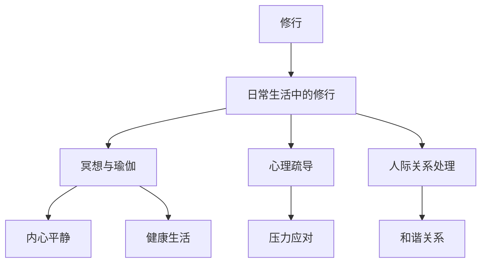

                 

# 日常生活中的修行：平凡中寻找超越

## 关键词
- 修行
- 冥想
- 瑜伽
- 心灵成长
- 精神提升

## 摘要
本文探讨了如何在日常生活中实践修行，通过冥想、瑜伽等方法，实现心灵的成长和精神的超越。文章首先介绍了修行的核心概念，随后深入分析了冥想和瑜伽的基本原理、方法与实践，最后通过实例展示了这些修行方式在生活中的应用，帮助读者在平凡的生活中寻找超越。

## 第一部分：背景介绍

### 核心概念

**修行：**  
修行是指个人通过内在的修炼和外在的行为，不断追求身心和谐、心灵成长和超越自我的一种过程。修行的方式和形式多样，包括宗教修行、哲学修行、心理修行等。在本文中，我们主要关注的是日常生活中的修行，即通过日常行为和习惯的调整，实现精神层面的修炼和成长。

**日常生活中的修行：**  
日常生活中的修行是指在日常生活场景中，通过日常行为和习惯的调整，实现精神层面的修炼和成长。这种修行方式更加贴近日常生活，更加易于实践。它包括饮食、作息、运动、冥想、瑜伽等方面的调整，旨在实现身体和心灵的平衡。

**寻找超越：**  
寻找超越是指通过修行，不断超越自我的局限，突破生活中的困境，实现精神层面的提升和成长。这种超越不仅仅是物质层面的，更是心灵层面的。通过修行，人们可以找到内心的力量，应对生活中的各种挑战。

### 问题背景

在现代社会，人们面临着越来越多的压力和困惑，内心的宁静和精神的满足变得尤为重要。传统的修行方式多集中在对佛经、道家经典的学习和实践上，对于大多数人来说，这种方式可能显得过于抽象和难以实践。因此，如何在日常生活中找到一种简单、实用的修行方式，成为许多人关心的问题。

**问题描述：**  
如何通过日常生活中的点滴实践，实现心灵的成长和精神的超越，成为这本书要探讨的核心问题。

**问题解决：**  
本书通过具体的实例和实用的方法，帮助读者在日常生活中找到修行的路径，实现心灵的成长和精神的超越。书中涵盖了如何调整日常行为和习惯，如何应对生活中的各种挑战，以及如何通过冥想、瑜伽等实践方式，达到内心的宁静和精神的满足。

**边界与外延：**  
修行的边界在于个人的内心世界，外延则涉及到日常生活、人际关系、工作压力等多个方面。修行不仅是一种个人的修炼，也是一种对社会的贡献，通过修行，个人可以实现自我提升，同时也可以影响和帮助他人。

### 概念结构与核心要素组成

- **日常行为和习惯的调整：** 包括饮食、作息、运动等方面的调整，以实现身体和心灵的平衡。
- **冥想和瑜伽：** 通过冥想和瑜伽等实践方式，实现内心的宁静和精神的满足。
- **心理疏导：** 学会应对生活中的各种压力和挑战，保持积极乐观的心态。
- **人际关系的处理：** 学会与他人建立和谐的关系，提升社交能力，实现心灵的成长。

### 表格：核心概念属性特征对比

| 核心概念       | 属性特征                                     |
|----------------|--------------------------------------------|
| 修行           | 内在修炼，精神成长，超越自我               |
| 日常生活中的修行 | 日常行为习惯调整，心灵成长                 |
| 寻找超越       | 突破困境，精神提升                         |
| 心灵成长       | 内心平和，自我提升                         |
| 社会贡献       | 个人成长，影响他人                         |

### ER实体关系图架构

### 本章小结

本章对日常生活中的修行、日常生活中的修行、寻找超越、心灵成长、社会贡献等核心概念进行了详细阐述，并分析了这些概念在现实生活中的应用和重要性。通过本章的学习，读者可以对日常生活中的修行有一个全面的认识，并为后续章节的深入学习打下基础。

## 第二部分：日常生活中的修行方法

### 第2章：冥想与内心平静

#### 2.1 冥想的基本原理与益处

**冥想的定义与历史背景：**  
冥想是一种通过专注、放松和觉察来达到精神内省和心灵平静的实践。它起源于古印度，并在佛教、印度教等宗教中有着深厚的文化背景。随着时间的推移，冥想逐渐传播到世界各地，成为许多人在日常生活中实践的心灵修炼方式。

**冥想的基本原理：**  
冥想的基本原理是通过意识的集中和内心的放松，达到精神上的平静和深度放松。具体来说，冥想通过以下几种方式实现：

- **呼吸控制：** 通过调整呼吸节奏，降低心率和血压，达到身体和心灵的放松。
- **专注焦点：** 将注意力集中在某个对象或感觉上，如呼吸、声音、视觉图像等，通过专注来减少内心杂念。
- **内心觉察：** 通过对内心活动的觉察，培养对情绪和思维变化的敏感度，增强自我意识。

**冥想的益处：**  
冥想对心理健康、生理健康和精神提升有着显著的益处：

- **心理健康：** 冥想可以减轻焦虑、抑郁等心理问题，提高情绪调节能力，增强心理韧性。
- **生理健康：** 冥想可以降低血压、减少慢性疼痛、改善睡眠质量，对身体健康有着积极的促进作用。
- **精神提升：** 冥想可以增强专注力、提高创造力，促进精神觉醒和自我认知的提升。

#### 2.2 冥想的类型与方法

**集中冥想：**

- **方法与步骤：**  
  集中冥想是通过将注意力集中在某个对象或感觉上，达到内心的平静。具体步骤如下：

  1. 选择一个安静舒适的环境。
  2. 选择一个专注的焦点，如呼吸、蜡烛、视觉图像等。
  3. 将注意力集中在专注点上，当注意力分散时，温和地将其引导回专注点。
  4. 保持专注状态，感受内心的平静和放松。

- **案例与实例：**  
  假设选择呼吸作为专注点，可以坐在舒适的椅子上，闭上眼睛，专注于呼吸的感觉。每当注意力分散时，将注意力温和地引导回呼吸。

**开放监视冥想：**

- **方法与步骤：**  
  开放监视冥想是一种不专注于特定对象，而是观察内心和外界变化的冥想方式。具体步骤如下：

  1. 选择一个安静舒适的环境。
  2. 放松身体和心灵，保持自然的呼吸。
  3. 对内心和外界的一切保持开放和觉察，不做任何判断和反应。
  4. 感受内心的起伏和外界的变化，保持平和和接纳。

- **案例与实例：**  
  假设坐在公园里，闭上眼睛，感受周围的自然环境，观察内心的感受，不做任何评判，只是平和地观察。

**动态冥想：**

- **方法与步骤：**  
  动态冥想是通过运动和呼吸的配合，达到身心合一的冥想方式。具体步骤如下：

  1. 选择一个安静舒适的环境。
  2. 进行一系列轻柔的伸展运动，如瑜伽体位法。
  3. 与运动同步，调整呼吸，感受身体的伸展和呼吸的节奏。
  4. 保持专注，感受身心的连接和平衡。

- **案例与实例：**  
  假设进行瑜伽练习，在深呼吸的同时，慢慢伸展身体，感受身体和呼吸的协调。

#### 2.3 冥想的实践与指导

**冥想的准备工作：**  
- 选择一个安静舒适的环境，确保不会被打扰。
- 穿着舒适的衣服，保持身体的放松。
- 可以选择舒适的姿势，如坐姿、躺姿等。

**冥想的时间与地点选择：**  
- 早晨或晚上是一个理想的冥想时间，因为这两个时间段的身体和心理状态较为平静。
- 选择一个安静的地点，如家中、公园等。

**冥想的呼吸技巧：**  
- 保持自然的呼吸，不要刻意调整呼吸。
- 感受呼吸的进出，将注意力集中在呼吸的感觉上。

**冥想的指导与引导：**  
- 可以通过听冥想音乐或使用冥想应用来引导冥想。
- 初学者可以从短时间（5-10分钟）的冥想开始，逐渐增加时间。
- 在冥想过程中，如果注意力分散，不要苛责自己，温和地将注意力引导回专注点。

### 第3章：瑜伽与健康生活

#### 3.1 瑜伽的历史与发展

**瑜伽的起源：**  
瑜伽起源于古代印度，据史书记载，瑜伽的历史可以追溯到公元前3000年左右。瑜伽最初是作为一种精神修炼的方式，随着时间的推移，瑜伽逐渐发展出多种流派和技巧，包括体位法、呼吸法、冥想等。

**瑜伽的发展历程：**  
在古代，瑜伽主要在印度教的寺庙中传授，随着时间的推移，瑜伽逐渐传播到其他地区。19世纪末，瑜伽开始在全球范围内普及，特别是随着西方人对瑜伽的重视，瑜伽逐渐成为一种全球性的健康生活方式。

**瑜伽在全球的流行：**  
瑜伽在全球范围内的流行主要得益于其对身心健康的益处。如今，瑜伽在各种形式下（如瑜伽工作室、健身房、线上课程等）被广泛传播，越来越多的人开始通过瑜伽来改善身心健康。

#### 3.2 瑜伽的基本概念与技巧

**瑜伽的体位法：**  
瑜伽的体位法（Asanas）是一系列姿势，通过这些姿势的练习，可以增强身体的柔韧性、力量和稳定性。常见的瑜伽体位法包括：

- **山式（Tadasana）：** 山式是瑜伽中的基础姿势，通过山式，可以增强身体的核心力量和稳定性。
- **树式（Vrikshasana）：** 树式是一种平衡姿势，通过树式，可以增强身体的核心力量和平衡感。
- **骆驼式（Ustrasana）：** 骆驼式是一种后弯姿势，通过骆驼式，可以增强背部和肩部的柔韧性。

**常见的体位法及其益处：**  
- **山式（Tadasana）：** 增强核心力量和稳定性。
- **树式（Vrikshasana）：** 提高平衡感和核心力量。
- **骆驼式（Ustrasana）：** 增强背部和肩部的柔韧性。

**练习步骤与注意事项：**  
- 练习瑜伽体位法时，应遵循以下步骤：

  1. 热身：进行适当的伸展和呼吸练习，预热身体。
  2. 选择合适的体位法：根据自己的身体状况选择适合的体位法。
  3. 保持姿势：在每个体位法中保持适当的时长，感受身体的伸展和放松。
  4. 逐步进阶：随着练习的深入，可以尝试更高级的体位法。

- 练习瑜伽体位法时，应注意以下事项：

  1. 保持正确的姿势：遵循瑜伽教练的指导，确保姿势的正确性。
  2. 避免过度用力：避免在体位法中过度用力，以免造成身体损伤。
  3. 深呼吸：在体位法中保持深呼吸，有助于放松身体和心灵。

**瑜伽的呼吸法：**  
瑜伽的呼吸法（Pranayama）是一种通过控制呼吸来调节身心状态的方法。常见的瑜伽呼吸法包括：

- **腹式呼吸（Diaphragmatic Breathing）：** 通过深吸气和深呼气，增强肺部功能，提高氧气摄入量。
- **交替呼吸（Nadi Shodhana）：** 通过交替呼吸，平衡左右脑，提高专注力和精神状态。

**呼吸法的练习步骤与注意事项：**  
- **腹式呼吸（Diaphragmatic Breathing）：** 练习步骤如下：

  1. 坐在舒适的椅子上，闭上眼睛，保持自然的呼吸。
  2. 将一只手放在胸部，另一只手放在腹部。
  3. 深吸一口气，感受腹部逐渐鼓起。
  4. 深吸一口气，感受胸部逐渐鼓起。
  5. 慢慢呼气，感受腹部逐渐收缩。

- **交替呼吸（Nadi Shodhana）：** 练习步骤如下：

  1. 坐在舒适的椅子上，闭上眼睛，保持自然的呼吸。
  2. 将一只手放在腹部，另一只手放在胸部。
  3. 深吸一口气，通过左鼻孔吸气。
  4. 深吸一口气，通过右鼻孔吸气。
  5. 慢慢呼气，通过左鼻孔呼气。
  6. 慢慢呼气，通过右鼻孔呼气。

### 本章小结

本章介绍了冥想和瑜伽的基本原理、类型与方法，以及它们在现实生活中的实践与指导。冥想通过专注、放松和觉察，帮助人们实现内心的平静和精神的提升；瑜伽通过体位法和呼吸法的练习，增强身体的柔韧性、力量和平衡感。通过冥想和瑜伽的实践，读者可以在日常生活中实现心灵的成长和精神的超越。在下一章中，我们将进一步探讨日常生活中的修行方法，帮助读者在平凡的生活中找到超越。

