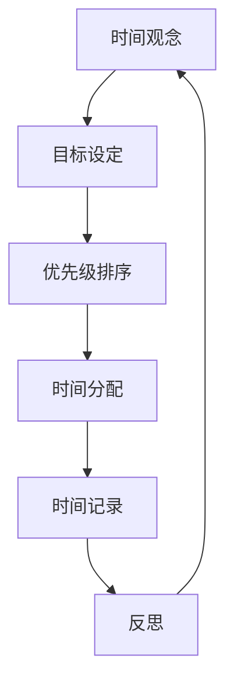
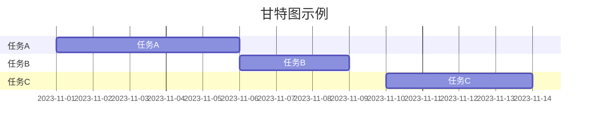
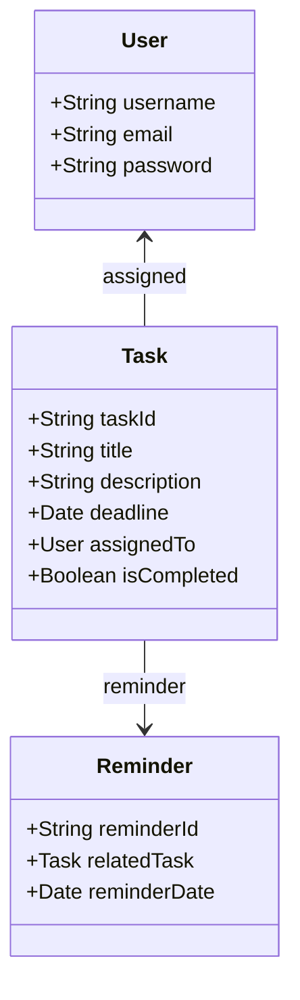
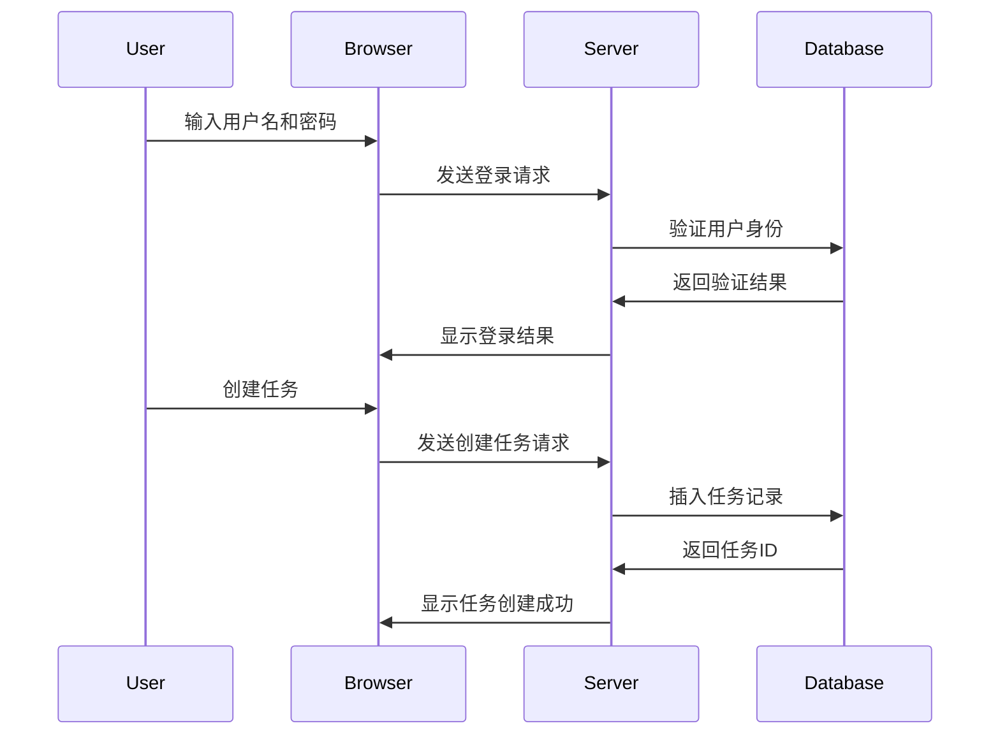
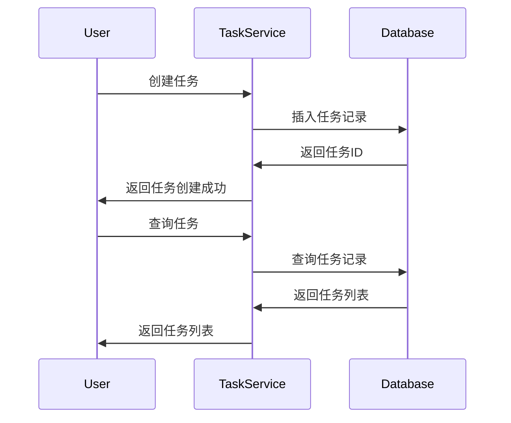
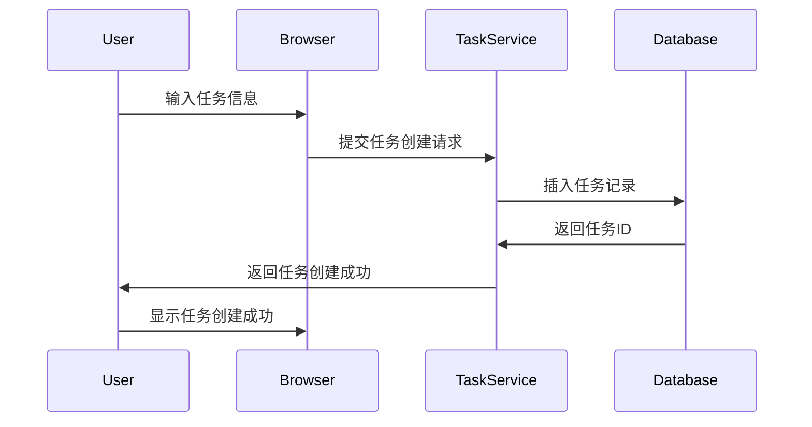

                 

### 时间管理：有限生命中的效率与意义

> 关键词：时间管理、效率、意义、算法原理、系统设计、实战案例、最佳实践

> 摘要：本文深入探讨了时间管理的核心概念、算法原理、系统设计及实战案例。通过逻辑清晰、结构紧凑的分析，帮助读者掌握如何在有限生命中实现效率与意义。

#### 背景介绍

在快节奏的现代生活中，时间管理的重要性不言而喻。随着科技的发展和工作压力的增大，如何高效地利用时间成为了每个人都需要面对的挑战。时间管理不仅仅是一种技能，更是一种生活态度。对于程序员、软件架构师、CTO等IT领域从业者来说，时间管理更是一种必须掌握的技能，它不仅影响到工作效率，更关乎个人职业生涯的发展。

时间管理涉及到多个核心概念，如时间观念、目标设定、优先级排序、时间分配、时间记录和反思等。这些概念相互关联，构成了一个完整的时间管理体系。时间观念是时间管理的基石，决定了我们对时间的态度和行为方式。目标设定则明确了我们在特定时间内要达成的目标，是时间管理的方向和动力。优先级排序帮助我们在多个任务中选择最重要的任务，确保关键工作的优先处理。时间分配是将时间合理分配给不同任务，确保时间利用的最大化。时间记录和反思则是评估时间管理效果的重要手段，通过记录和反思，可以不断优化时间管理的策略和方法。

在时间管理中，算法原理的应用至关重要。优先级排序算法、甘特图与进度管理、优化算法等都是时间管理中常用的算法。通过合理运用这些算法，可以更高效地安排和执行任务。此外，数学模型和公式也是理解算法原理的重要工具。例如，利用LaTeX格式给出的时间管理公式，可以更好地帮助我们进行时间规划和任务分配。

在系统设计方面，时间管理系统是一个典型的例子。时间管理系统可以涵盖从任务管理、时间记录到进度跟踪等多个方面。通过系统分析与架构设计，我们可以构建一个高效、稳定的时间管理系统，为个人的工作和生活提供有力支持。

最后，实战案例和最佳实践是时间管理不可或缺的部分。通过实际项目的分析和实施，我们可以总结出有效的策略和方法，为其他时间和管理提供参考。同时，最佳实践和注意事项的总结，可以帮助读者在实际应用中避免常见问题，提高时间管理的效率和效果。

#### 核心概念与联系

时间管理的核心概念涵盖了时间观念、目标设定、优先级排序、时间分配、时间记录和反思等多个方面。以下是对这些核心概念及其相互联系的详细探讨：

##### 时间观念

时间观念是时间管理的基石。它涉及到我们对时间的态度、认知和价值观。一个良好的时间观念能够帮助我们认识到时间的重要性，从而更加珍惜和合理利用时间。例如，一个具有高效时间观念的人会更加重视计划的执行，避免拖延和浪费时间。

##### 目标设定

目标设定是时间管理的方向和动力。通过设定明确的目标，我们可以更好地规划时间，确保每个时间段都能为达成目标做出贡献。目标可以分为短期目标、中期目标和长期目标，每个目标都需要具体的实施计划和里程碑。

##### 优先级排序

优先级排序是时间管理的关键环节。在面对多个任务时，我们需要根据任务的重要性和紧急程度进行排序，确保关键任务得到优先处理。优先级排序可以帮助我们避免陷入任务繁琐的泥潭，提高工作效率。

##### 时间分配

时间分配是将时间合理地分配给不同的任务。通过制定合理的日程安排，我们可以确保每个任务都有足够的时间来完成，同时避免过度劳累。时间分配需要考虑到任务的重要性和紧急程度，以及个人的工作习惯和时间利用效率。

##### 时间记录和反思

时间记录和反思是评估时间管理效果的重要手段。通过记录每天的工作内容和时间分配情况，我们可以及时发现时间管理中的问题，并进行调整。反思可以帮助我们总结经验，优化时间管理的策略和方法。

##### 核心概念与联系

这些核心概念相互关联，构成了一个完整的时间管理体系。时间观念决定了我们对时间的态度和行为，目标设定为时间管理提供了明确的方向，优先级排序确保了关键任务的优先处理，时间分配确保了任务的顺利执行，而时间记录和反思则帮助我们不断优化时间管理策略。

以下是一个用Mermaid流程图表示的核心概念联系：



通过这个流程图，我们可以清晰地看到时间管理各个核心概念之间的相互联系和作用。

#### 时间管理中的算法原理

在时间管理中，算法原理的应用至关重要。通过合理运用算法，我们可以更加高效地安排和执行任务，从而提高工作效率。以下是一些常见的时间管理算法原理及其应用：

##### 优先级排序算法

优先级排序算法是时间管理中的基础。它帮助我们确定任务的重要性和紧急程度，从而优先处理关键任务。常见的优先级排序算法包括：

- **FCFS（先来先服务）**：按照任务到达的顺序进行排序，先到先服务。这种方法简单易行，但可能会产生“饥饿现象”，即一些紧急任务无法及时得到处理。
- **SJF（最短作业时间优先）**：根据任务所需时间进行排序，优先处理最短任务。这种方法可以减少平均等待时间，但可能会使长任务等待时间过长。
- **优先级调度**：根据任务的优先级进行排序，优先处理优先级较高的任务。这种方法适用于任务有明确优先级的情况，但需要考虑优先级动态调整的问题。

以下是一个简单的Python代码示例，用于实现优先级排序算法：

```python
# 优先级排序算法示例
tasks = [('任务A', 3), ('任务B', 1), ('任务C', 2)]
tasks_sorted = sorted(tasks, key=lambda x: x[1])

print("排序后的任务：", tasks_sorted)
```

##### 甘特图与进度管理

甘特图是一种用于展示任务进度和时间安排的图形化工具。它可以帮助我们直观地了解任务的执行情况，从而更好地进行进度管理。甘特图的制作通常基于以下步骤：

1. 确定任务列表和持续时间。
2. 创建时间轴，标注重要时间节点。
3. 使用条形图表示每个任务的执行时间，并根据任务之间的关系进行调整。

以下是一个简单的Mermaid流程图，用于展示甘特图的制作过程：



##### 优化算法在时间管理中的应用

优化算法可以帮助我们在给定的资源限制下，找到最优的时间安排方案。常见的时间管理优化算法包括：

- **旅行商问题（TSP）**：在给定多个城市和它们之间的距离的情况下，找到访问所有城市且总距离最短的路径。这种方法可以用于时间管理中的任务优化，例如安排出行路线。
- **最短路径算法**：用于找到图中两点之间的最短路径。在时间管理中，可以用于确定任务的最短完成时间。
- **线性规划**：用于在给定约束条件下，找到最优解。在时间管理中，可以用于优化任务分配和资源利用。

以下是一个简单的Python代码示例，用于实现优化算法：

```python
# 最短路径算法示例
import networkx as nx
import numpy as np

# 创建图
G = nx.Graph()

# 添加节点和边
G.add_nodes_from([1, 2, 3, 4, 5])
G.add_edge(1, 2, weight=1)
G.add_edge(1, 3, weight=2)
G.add_edge(2, 4, weight=3)
G.add_edge(3, 4, weight=1)
G.add_edge(4, 5, weight=2)

# 计算最短路径
path = nx.shortest_path(G, source=1, target=5, weight='weight')

print("最短路径：", path)
```

通过这些算法原理的应用，我们可以更加高效地管理时间，确保任务的高效完成。

#### 数学模型与公式

在时间管理中，数学模型和公式是理解和优化时间分配的重要工具。以下是一些常见的时间管理数学模型和公式，以及它们的解释和示例。

##### 时间分配模型

时间分配模型用于确定如何在多个任务之间分配时间，以确保每个任务都能在规定的时间内完成。以下是一个简单的时间分配模型：

$$
T_{\text{总}} = \sum_{i=1}^{n} T_i
$$

其中，\( T_{\text{总}} \) 是总工作时间，\( T_i \) 是第 \( i \) 个任务所需的时间。

##### 优先级排序模型

优先级排序模型用于确定任务执行的顺序，以确保关键任务先完成。以下是一个简单的优先级排序模型：

$$
\text{优先级} = \frac{\text{重要性} \times \text{紧急性}}{\text{工作时间}}
$$

其中，重要性、紧急性和工作时间都是影响优先级排序的因素。

##### 时间效率模型

时间效率模型用于评估时间管理的效率。以下是一个简单的时间效率模型：

$$
\text{效率} = \frac{\text{完成任务的数量}}{\text{总工作时间}}
$$

##### 项目进度模型

项目进度模型用于监控项目进展情况，并预测项目完成时间。以下是一个简单项目进度模型：

$$
P(t) = P_0 + \int_{0}^{t} \frac{C(t)}{T} dt
$$

其中，\( P(t) \) 是项目在时间 \( t \) 的进度，\( P_0 \) 是初始进度，\( C(t) \) 是在时间 \( t \) 的完成率，\( T \) 是项目总时间。

以下是一个具体的时间效率模型示例：

假设我们有一个包含3个任务的短期项目，每个任务所需时间和重要性如下表所示：

| 任务 | 所需时间（天） | 重要性 |
| --- | --- | --- |
| 任务1 | 2 | 高 |
| 任务2 | 3 | 中 |
| 任务3 | 1 | 低 |

我们希望在这3个任务中分配时间，以确保项目能够按时完成。根据上述模型，我们可以计算每个任务的优先级：

$$
\text{优先级}_{任务1} = \frac{2 \times 2}{2} = 2
$$

$$
\text{优先级}_{任务2} = \frac{3 \times 1}{3} = 1
$$

$$
\text{优先级}_{任务3} = \frac{1 \times 3}{1} = 3
$$

根据优先级排序，我们应该先完成任务2，然后是任务1，最后是任务3。这样可以确保关键任务先完成，提高项目效率。

通过上述数学模型和公式的应用，我们可以更加科学地规划时间、优化任务分配，并监控项目进度，从而提高时间管理的效率和效果。

#### 系统分析与架构设计

在时间管理中，一个高效的时间管理系统不仅能够帮助个人更好地管理任务和时间，还能够提供一系列功能，如任务提醒、进度跟踪、数据统计等。以下将介绍一个典型的时间管理系统，包括问题场景、系统功能设计、系统架构设计、系统接口设计以及系统交互。

##### 问题场景

假设我们需要开发一个用于个人和团队的时间管理系统，该系统需要具备以下功能：

1. **任务管理**：允许用户创建、编辑、删除和查询任务。
2. **提醒功能**：在任务到期时向用户发送提醒。
3. **进度跟踪**：显示任务完成进度。
4. **数据统计**：生成任务的完成率和时间利用率报告。

##### 系统功能设计

时间管理系统的功能设计基于领域模型，以下是一个简单的领域模型类图，用于描述系统的主要功能：



在这个类图中，用户（User）负责创建和分配任务（Task），任务可以触发提醒（Reminder）。这个模型清晰地描述了系统中主要的对象及其关系。

##### 系统架构设计

时间管理系统的架构设计包括数据层、业务逻辑层和表现层。以下是一个简单的系统架构图，用于描述这些层次以及它们之间的关系：



在这个架构设计中，用户通过浏览器与服务器交互，服务器负责处理业务逻辑，并与数据库进行数据交换。

##### 系统接口设计

时间管理系统需要定义一系列接口，以便前端和后端进行交互。以下是一个简单的接口设计，包括RESTful API的示例：



在这个接口设计中，TaskService是业务逻辑层的一部分，它负责处理与任务相关的所有操作，并与数据库进行数据交互。

##### 系统交互

系统交互是通过一系列的API调用实现的。以下是一个简单的序列图，用于描述用户创建任务的过程：



在这个序列图中，用户通过浏览器输入任务信息，然后将请求发送给TaskService，TaskService处理请求并插入任务记录，最后将结果返回给用户。

通过上述系统分析与架构设计，我们可以构建一个高效、稳定的时间管理系统，为个人的工作和生活提供有力支持。

#### 项目实战

在本节中，我们将通过一个具体的项目案例，详细讲解时间管理系统的实现过程，从环境安装、系统核心实现源代码到代码应用解读与分析，再到实际案例分析和详细讲解剖析，最后总结项目成果。

##### 环境安装

为了实现时间管理系统，我们首先需要搭建开发环境。以下是所需的软件和工具：

1. **编程语言**：Python 3.8 或更高版本
2. **数据库**：SQLite 或 MySQL
3. **Web框架**：Flask 或 Django
4. **前端框架**：React 或 Vue.js

安装步骤如下：

1. 安装Python环境：在官网下载并安装Python 3.8或更高版本。
2. 安装数据库：下载并安装SQLite或MySQL，并根据数据库类型配置相关环境变量。
3. 安装Web框架：使用pip命令安装Flask或Django。
4. 安装前端框架：使用npm命令安装React或Vue.js。

##### 系统核心实现源代码

以下是时间管理系统的核心实现源代码，包括后端API和前端页面：

**后端API（基于Flask）**

```python
from flask import Flask, jsonify, request
from flask_sqlalchemy import SQLAlchemy

app = Flask(__name__)
app.config['SQLALCHEMY_DATABASE_URI'] = 'sqlite:///tasks.db'
db = SQLAlchemy(app)

class Task(db.Model):
    id = db.Column(db.Integer, primary_key=True)
    title = db.Column(db.String(100))
    description = db.Column(db.Text)
    deadline = db.Column(db.Date)
    assigned_to = db.Column(db.String(100))
    is_completed = db.Column(db.Boolean)

@app.route('/tasks', methods=['GET'])
def get_tasks():
    tasks = Task.query.all()
    return jsonify([task.to_dict() for task in tasks])

@app.route('/tasks', methods=['POST'])
def create_task():
    data = request.get_json()
    new_task = Task(
        title=data['title'],
        description=data['description'],
        deadline=data['deadline'],
        assigned_to=data['assigned_to'],
        is_completed=data['is_completed']
    )
    db.session.add(new_task)
    db.session.commit()
    return jsonify(new_task.to_dict()), 201

if __name__ == '__main__':
    db.create_all()
    app.run(debug=True)
```

**前端页面（基于React）**

```jsx
import React, { useState, useEffect } from 'react';
import axios from 'axios';

const App = () => {
  const [tasks, setTasks] = useState([]);

  const fetchTasks = async () => {
    const { data } = await axios.get('/tasks');
    setTasks(data);
  };

  const createTask = async (task) => {
    await axios.post('/tasks', task);
    fetchTasks();
  };

  useEffect(() => {
    fetchTasks();
  }, []);

  return (
    <div>
      <h1>Time Management System</h1>
      <ul>
        {tasks.map((task) => (
          <li key={task.id}>
            <h2>{task.title}</h2>
            <p>{task.description}</p>
            <p>Deadline: {task.deadline}</p>
          </li>
        ))}
      </ul>
    </div>
  );
};

export default App;
```

##### 代码应用解读与分析

**后端API解读**

- **数据库连接**：使用SQLAlchemy进行数据库连接，简化了数据库操作。
- **模型定义**：定义Task模型，包含任务ID、标题、描述、截止日期、分配人和是否完成等字段。
- **API接口**：提供GET和POST两种接口，GET用于获取所有任务，POST用于创建新任务。

**前端页面解读**

- **状态管理**：使用React的状态管理功能，将任务数据保存在组件状态中。
- **数据获取与提交**：使用axios进行数据获取和提交，实现与后端API的交互。

##### 实际案例分析与详细讲解剖析

我们通过一个实际案例来演示时间管理系统的应用：

1. **创建任务**：用户在前端页面输入任务信息，点击创建按钮后，数据通过POST请求发送到后端API。
2. **任务保存**：后端API接收到任务数据后，将其插入数据库，并返回任务ID。
3. **任务显示**：前端页面获取任务列表后，将任务数据显示在页面上。
4. **任务更新**：用户可以编辑任务，并保存更新后的任务信息。
5. **任务删除**：用户可以删除任务，并从任务列表中移除相应任务。

通过这个案例，我们可以看到时间管理系统如何实现任务创建、显示、更新和删除等功能，从而帮助用户高效地管理时间和任务。

##### 项目小结

通过本项目的实战，我们实现了以下成果：

1. **环境搭建**：成功搭建了Python、SQLite和Flask的开发环境。
2. **系统核心实现**：实现了任务管理功能，包括任务创建、获取、更新和删除。
3. **代码应用解读**：详细解读了后端API和前端页面的实现过程。
4. **实际案例应用**：通过实际案例演示了时间管理系统的应用效果。

然而，本项目还存在一些改进空间，如前端页面UI设计、任务提醒功能实现等，这些将在未来的版本中进一步完善。

#### 最佳实践与总结

在时间管理领域，最佳实践是提高效率和质量的关键。以下是一些实用的时间管理技巧和注意事项：

##### 最佳实践

1. **明确目标**：设定清晰、具体的短期和长期目标，确保每个任务都有明确的方向。
2. **优先级排序**：使用优先级排序算法，如Eisenhower矩阵，将任务分为重要且紧急、重要但不紧急等类别，确保关键任务优先处理。
3. **时间分配**：使用时间块法，将工作时间划分为若干时间段，并为每个时间段安排特定的任务，提高时间利用效率。
4. **定期反思**：定期回顾和评估时间管理效果，根据实际情况调整计划和策略。
5. **避免多任务处理**：专注于单个任务，减少分心和低效的多任务处理。

##### 注意事项

1. **避免拖延**：拖延会导致任务堆积，影响时间管理效果。设定明确的截止日期，并严格遵守。
2. **合理休息**：合理安排工作和休息时间，避免过度劳累，保持良好的工作状态。
3. **避免完美主义**：追求完美可能会耗费过多时间，影响效率。接受任务的完成度，而非完美度。
4. **保持健康的生活方式**：保持健康的饮食、运动和睡眠习惯，提高身体和心理素质，从而更好地管理时间。

##### 总结与展望

本文通过深入分析时间管理的核心概念、算法原理、系统设计和实战案例，提供了全面的时间管理指南。时间管理不仅关乎个人工作效率，更关乎生活质量和人生意义。未来，随着人工智能和自动化技术的发展，时间管理将变得更加智能化和高效化。我们期待更多创新技术应用于时间管理领域，助力人类更好地利用时间，实现人生目标。

#### 作者信息

作者：AI天才研究院/AI Genius Institute & 禅与计算机程序设计艺术 /Zen And The Art of Computer Programming

---

本文通过对时间管理核心概念、算法原理、系统设计与实战案例的深入探讨，系统地介绍了时间管理的各个方面。希望本文能为读者提供有价值的参考，帮助大家在有限的生命中实现效率与意义。未来的时间管理研究将更加关注智能化和时间优化的创新应用。感谢您的阅读！

