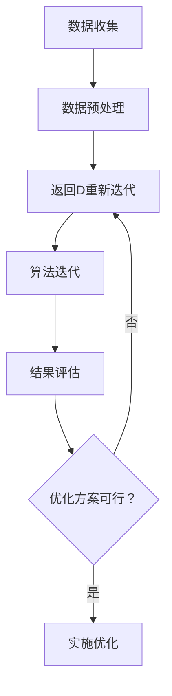
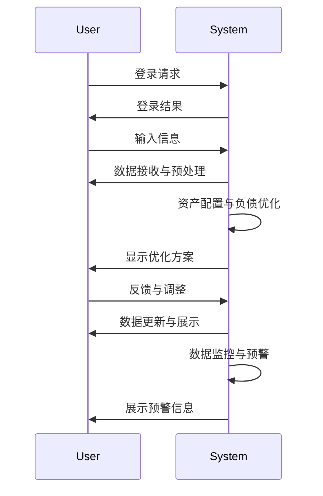

                 

### 1.1 问题的提出与重要性

#### 1.1.1 当前个人资产负债管理的挑战

在现代社会，个人资产负债管理变得越来越重要。个人资产和负债的合理配置不仅能保障个人的财务安全，还能实现资产的增值。然而，随着金融市场的复杂化和个人财务需求的多样化，传统的个人资产负债管理面临着诸多挑战。

首先，个人资产负债管理的复杂性增加。现代金融产品种类繁多，包括股票、债券、基金、保险、房地产等，每种产品都有其独特的风险和收益特性。个人在配置资产时需要全面了解各类产品的特性，这无疑增加了决策的难度。

其次，个人财务风险加大。在全球化背景下，金融市场波动性增加，个人资产面临着更大的不确定性。此外，个人负债（如房贷、车贷、信用卡债务等）的累积也可能带来财务压力，甚至可能影响个人的生活质量。

最后，个人资产负债管理的个性化需求不断增长。每个人的财务状况、投资偏好、风险承受能力等都各不相同，因此需要个性化的资产负债管理方案。然而，传统的资产负债管理往往缺乏针对性和灵活性，难以满足个体需求。

#### 1.1.2 个人资产负债结构优化的意义

面对上述挑战，个人资产负债结构优化显得尤为重要。优化个人资产负债结构不仅能够降低财务风险，提高资产收益，还能提升个人的财务健康状况。

首先，优化资产负债结构有助于降低财务风险。通过合理配置资产和负债，个人可以分散投资风险，减少单一市场波动对资产的影响。此外，优化负债结构，如合理利用低利率贷款来偿还高利率债务，也可以降低财务风险。

其次，优化资产负债结构能够提高资产收益。通过科学的资产配置，个人可以找到适合自己的投资组合，实现资产的增值。同时，合理的负债策略也能够利用财务杠杆，提高投资回报率。

最后，优化资产负债结构有助于提升个人财务健康。一个健康的财务状况不仅能够保证个人的生活质量，还能为未来的退休、子女教育等重大支出提供保障。通过持续优化资产负债结构，个人可以更好地应对生活中的各种不确定性。

#### 1.1.3 书籍概述与结构安排

本章节主要介绍了个人资产负债管理面临的挑战和优化资产负债结构的重要性。在接下来的章节中，我们将深入探讨个人资产负债结构优化的核心概念、原理以及具体实施策略。

首先，第二章将详细阐述个人资产负债结构优化的基本原理，包括资产负债比的计算与优化、资产配置原则与负债管理策略等。接着，我们将介绍智能个人资产负债结构优化的算法原理，通过mermaid流程图和Python源代码进行详细讲解。

第三章将分析系统架构设计，包括系统功能设计、系统架构设计、系统接口设计以及系统交互流程。通过mermaid类图和序列图，我们将直观展示系统架构和交互过程。

第四章则通过项目实战，详细讲解智能个人资产负债结构优化系统的实现过程，包括环境安装与准备、系统核心实现、代码应用解读与分析，以及实际案例分析和项目小结。

通过以上结构安排，本书旨在为读者提供一个全面、系统、易于理解的智能个人资产负债结构优化解决方案。无论是金融专业人士，还是普通个人投资者，都可以从中获得宝贵的知识和经验。

### 1.2 核心概念介绍

在探讨智能个人资产负债结构优化系统之前，我们需要明确一些核心概念，以便更好地理解后续内容。这些核心概念包括资产负债的定义与构成、资产负债优化的目标与原则，以及资产负债结构优化的边界与外延。

#### 1.2.1 资产负债的定义与构成

**资产负债的定义：**

资产负债是指个人所拥有的资产和负债的总和。其中，资产是指个人拥有并能够为其带来经济利益的资源，如现金、股票、债券、房地产等；负债是指个人所承担的、需要在未来以货币或其他资产偿还的义务，如房贷、车贷、信用卡债务等。

**资产负债的构成：**

个人资产负债主要由以下几部分构成：

1. **现金及现金等价物：** 包括手头现金、银行存款、货币市场基金等，是流动性最高的资产。
2. **投资资产：** 包括股票、债券、基金、贵金属等，这些资产通常以投资目的为主，追求长期增值。
3. **固定资产：** 包括房地产、车辆等，这类资产价值较高，流动性相对较低。
4. **其他资产：** 如专利、版权、保险等，这些资产的价值往往难以量化，但对个人的财务状况有一定影响。
5. **负债：** 包括房贷、车贷、信用卡债务、个人借款等，负债反映了个人对外部资金的需求和偿还义务。

**资产负债表的基本公式：**

个人资产负债表的基本公式为：
\[ 资产总额 = 负债总额 + 净资产 \]

净资产（或称所有者权益）是指个人资产减去负债后的余额，是衡量个人财务状况的一个重要指标。

#### 1.2.2 资产负债优化的目标与原则

**资产负债优化的目标：**

个人资产负债优化的主要目标是：

1. **降低财务风险：** 通过合理配置资产和负债，降低投资风险，保障个人财务安全。
2. **提高资产收益：** 通过科学的资产配置策略，实现资产的增值，提高投资回报率。
3. **提升财务健康：** 通过持续优化资产负债结构，改善个人的财务状况，为未来的生活目标和重大支出提供保障。

**资产负债优化的原则：**

为了实现上述目标，个人资产负债优化需要遵循以下原则：

1. **分散投资：** 通过多样化投资，分散风险，避免单一市场波动对资产造成重大影响。
2. **合理配置：** 根据个人的财务状况、投资目标和风险承受能力，科学配置资产和负债。
3. **负债优化：** 合理利用负债，如利用低利率贷款偿还高利率债务，降低财务成本。
4. **持续监控与调整：** 定期评估个人资产负债结构，根据市场变化和个人需求进行动态调整。

#### 1.2.3 资产负债结构优化的边界与外延

**资产负债结构优化的边界：**

资产负债结构优化的边界主要包括以下几个方面：

1. **投资范围：** 资产负债优化涉及的投资范围包括现金、股票、债券、基金、房地产等。
2. **负债形式：** 负债优化包括房贷、车贷、信用卡债务等。
3. **时间范围：** 资产负债优化需要考虑短期和长期的目标，如短期内的财务规划、长期投资目标等。

**资产负债结构优化的外延：**

资产负债结构优化的外延包括以下几个方面：

1. **个性化方案：** 根据不同个人的财务状况、投资目标和风险承受能力，提供个性化的资产负债优化方案。
2. **智能化技术：** 利用大数据、人工智能等技术手段，提高资产负债优化的精准度和效率。
3. **法律法规：** 在资产负债优化过程中，需要遵守相关法律法规，确保投资和负债行为合法合规。

通过以上对核心概念的介绍，我们为后续章节的深入探讨奠定了基础。在接下来的内容中，我们将进一步探讨个人资产负债结构优化的具体算法原理、系统架构设计和项目实战，以期为读者提供全面的解决方案。

### 1.3 资产负债结构优化相关概念的联系

在探讨个人资产负债结构优化的过程中，我们需要了解并分析多个相关概念之间的联系。这些概念不仅彼此独立，还相互作用，共同影响个人的财务健康状况。以下是几个关键概念及其相互联系的分析：

#### 1.3.1 资产配置与资产组合

**资产配置：**

资产配置是指根据个人的财务状况、投资目标和风险承受能力，将资产分配到不同类型的资产中，以实现投资组合的风险和收益平衡。资产配置的核心在于确定不同资产类别在投资组合中的比重。

**资产组合：**

资产组合是指个人所持有的各类资产构成的总体投资结构。一个合理的资产组合应该具备良好的风险分散效果，同时能够满足个人的收益目标。

**资产配置与资产组合的联系：**

资产配置是构建资产组合的基础，而资产组合是实现资产配置的具体体现。合理配置资产能够帮助个人在风险和收益之间找到平衡点，而一个多元化的资产组合则能够有效分散风险，提高整体投资的安全性和收益性。

**实例：**

例如，一个保守型投资者可能会将80%的资金配置到低风险的债券和现金等价物，将20%的资金配置到高收益的股票。这样的资产配置策略构成了一个以债券和股票为主的投资组合，既能保障资金安全，又能追求一定的收益。

#### 1.3.2 风险管理与收益目标

**风险管理：**

风险管理是指个人在投资过程中采取的一系列措施，以降低潜在的财务损失。这包括对市场风险、信用风险、流动性风险等多种风险的识别、评估和控制。

**收益目标：**

收益目标是个人在投资过程中期望实现的回报水平。不同投资者可能会有不同的收益目标，如短期资本增值、长期稳定收益等。

**风险管理与收益目标的联系：**

风险管理和收益目标是投资过程中不可分割的两个方面。合理的管理风险能够保障资产的稳定增值，而明确的收益目标则能够指导投资策略的制定和调整。

**实例：**

例如，一个投资者可能会设定5年内实现资产翻倍的收益目标。为了实现这一目标，他需要通过风险管理措施，如分散投资、降低交易频率等，来规避可能的市场波动和信用风险，确保收益目标的实现。

#### 1.3.3 负债管理策略与工具

**负债管理策略：**

负债管理策略是指个人在负债过程中采取的一系列措施，以降低负债成本、优化负债结构。这包括合理利用负债来增加资产、选择低利率贷款、优化还款计划等。

**负债工具：**

负债工具是指个人在负债过程中使用的金融工具，如房贷、车贷、信用卡、个人借款等。

**负债管理策略与负债工具的联系：**

负债管理策略决定了个人如何利用负债工具来优化财务状况。合理选择和使用负债工具，如利用低利率贷款偿还高利率债务，可以降低负债成本，提高资金使用效率。

**实例：**

例如，一个个人可能会选择使用30年固定利率房贷来购买房产，而不是使用短期高利率贷款。这样的负债管理策略能够有效降低整体负债成本，同时保障房产的稳定增值。

通过以上对资产配置、风险管理、收益目标以及负债管理策略与工具之间联系的分析，我们可以更好地理解个人资产负债结构优化的复杂性和多样性。在后续章节中，我们将进一步探讨这些概念在智能个人资产负债结构优化系统中的应用和实践。

### 1.4 资产负债结构优化的发展趋势

随着科技的进步和金融市场的不断演变，个人资产负债结构优化也在经历着显著的变革。传统的个人资产负债管理模式已难以满足现代社会的需求，而智能化技术的引入为个人财务管理带来了新的机遇和挑战。以下是资产负债结构优化的发展趋势分析：

#### 1.4.1 传统个人资产负债管理模式的局限性

**1. 信息获取和处理能力的限制：**

传统个人资产负债管理主要依赖于手工计算和纸质记录，信息获取和处理效率低下。个人投资者往往难以迅速掌握市场动态和财务数据，导致决策滞后。

**2. 资产配置的单一性和盲目性：**

传统模式下，个人资产配置往往较为单一，缺乏科学性和系统性。投资者容易受到情绪和经验的影响，盲目跟风，导致投资组合不够多样化，风险暴露程度较高。

**3. 负债管理的简单化：**

传统负债管理主要侧重于债务偿还，缺乏对负债结构和成本的优化。个人投资者往往无法充分利用财务杠杆，降低负债成本，优化资金使用效率。

**4. 持续性和动态性不足：**

传统管理模式缺乏持续性和动态性，无法及时根据市场变化和个人财务状况调整资产负债结构。这使得投资者难以在短期内实现财务目标，也难以应对突发财务风险。

#### 1.4.2 智能化技术在个人资产负债管理中的应用

**1. 大数据和人工智能的应用：**

大数据和人工智能技术的引入使得个人资产负债管理更加智能化。通过分析海量数据，系统能够提供更加精准的市场预测和风险评估，帮助投资者做出更明智的决策。

**2. 个性化投资方案的制定：**

基于大数据和机器学习算法，智能化系统能够根据个人的财务状况、投资偏好和风险承受能力，量身定制个性化的资产负债优化方案。这大大提高了资产配置的科学性和有效性。

**3. 自动化投资策略的实施：**

智能化技术使得自动化投资策略成为可能。通过预设条件和自动化执行，系统可以自动调整投资组合，降低人为干预的风险，提高投资效率。

**4. 负债优化的智能化：**

智能化负债管理能够实时监控个人负债情况，自动优化负债结构，降低负债成本。例如，系统可以根据利率变化，自动调整贷款还款计划，以实现最佳负债成本。

#### 1.4.3 未来个人资产负债管理的趋势预测

**1. 智能化程度的进一步提高：**

未来，个人资产负债管理将更加依赖于智能化技术。随着算法和模型的发展，系统能够提供更加精准的预测和决策支持，进一步提升资产负债优化的效果。

**2. 资产配置的全球化：**

随着全球金融市场的融合，个人投资者将更多地参与国际市场的投资。智能化系统将帮助投资者在全球范围内进行资产配置，实现风险的全球分散和收益的最大化。

**3. 金融服务与科技的深度融合：**

未来，金融科技（FinTech）将在个人资产负债管理中发挥更加重要的作用。区块链技术、物联网技术等新兴科技将被广泛应用，提高个人财务管理的透明度和效率。

**4. 持续性和个性化的结合：**

智能化系统能够实现持续性和个性化的结合。通过实时监控和动态调整，系统能够持续优化资产负债结构，同时满足不同投资者的个性化需求。

总之，随着科技的发展，个人资产负债结构优化正迎来新的机遇和挑战。智能化技术的应用将大幅提升个人财务管理的效率和效果，为投资者实现资产增值和财务安全提供有力支持。

### 1.5 本章小结

在本章中，我们首先探讨了当前个人资产负债管理面临的挑战，如复杂性增加、财务风险加大以及个性化需求增长。这些问题促使我们深入思考个人资产负债结构优化的必要性和重要性。通过明确资产负债的定义与构成，资产负债优化的目标和原则，以及资产负债结构优化的边界与外延，我们为后续内容奠定了坚实的基础。

此外，我们还分析了资产配置与资产组合、风险管理与收益目标、负债管理策略与工具之间的联系，揭示了这些概念在优化资产负债结构中的相互作用。最后，我们探讨了资产负债结构优化的发展趋势，尤其是智能化技术在个人资产负债管理中的应用，展示了未来个人财务管理的方向和前景。

通过本章的探讨，我们不仅理解了个人资产负债结构优化的重要性，也为后续章节的深入分析提供了理论和实践基础。在接下来的章节中，我们将进一步探讨个人资产负债结构优化的核心原理、算法和系统架构设计，以及通过项目实战展示其应用效果。

### 2.1 个人资产负债结构优化的基本原理

个人资产负债结构优化是一个复杂且重要的过程，旨在通过科学的资产配置和负债管理策略，实现资产增值、降低风险和提升财务健康。以下将详细阐述个人资产负债结构优化的基本原理，包括资产负债比的计算与优化、资产配置原则与资产选择，以及负债管理策略。

#### 2.1.1 资产负债比的计算与优化

**资产负债比（Debt to Asset Ratio）：** 

资产负债比是指个人负债总额与资产总额的比率，用于衡量个人财务健康状况的一个重要指标。计算公式如下：
\[ \text{资产负债比} = \frac{\text{负债总额}}{\text{资产总额}} \]

**资产负债比的意义：** 

资产负债比反映了个人负债水平相对于资产水平的高低。通常，较低的资产负债比表示个人财务状况较为稳健，具有较高的偿债能力和抗风险能力。反之，较高的资产负债比则意味着财务风险较大，可能面临较大的偿债压力。

**资产负债比的优化：**

为了优化资产负债比，个人需要采取以下措施：

1. **增加资产：** 通过投资股票、债券、基金等金融产品，增加个人资产总额，从而降低资产负债比。
2. **减少负债：** 通过提前还款、减少不必要的消费等手段，降低负债总额，同样有助于优化资产负债比。
3. **调整资产与负债结构：** 通过优化资产配置，将部分低收益、高风险的资产转换为高收益、低风险的资产，同时合理利用负债工具，如低利率贷款，以实现负债成本的优化。

**实例：** 

假设一个个人的资产总额为100万元，负债总额为50万元，其资产负债比为50%。如果该个人通过投资股票和基金，使资产总额增加到120万元，同时通过提前还款减少负债总额至40万元，那么其资产负债比将降至33.33%，财务状况得到显著改善。

#### 2.1.2 资产配置原则与资产选择

**资产配置原则：**

1. **分散投资：** 通过多样化投资，分散市场风险，避免因单一市场波动导致的大幅资产损失。
2. **风险与收益平衡：** 根据个人的风险承受能力和收益目标，合理配置不同风险和收益水平的资产。
3. **长期投资：** 注重长期投资，避免短期市场波动对投资决策的影响，追求长期稳定的收益。
4. **灵活调整：** 根据市场变化和个人财务状况，及时调整资产配置，以实现最佳投资效果。

**资产选择：**

1. **现金及现金等价物：** 包括银行存款、货币市场基金等，提供流动性保障和稳定的收益。
2. **固定收益类资产：** 包括债券、国债、企业债等，风险较低，收益相对稳定。
3. **权益类资产：** 包括股票、股票基金等，具有较高的收益潜力，但也伴随着较高的风险。
4. **不动产：** 包括房地产、商业物业等，通常具有较高的稳定收益，但流动性较低。
5. **其他资产：** 包括贵金属、艺术品、保险等，这些资产具有一定的投资价值，但通常风险较高。

**实例：** 

一个保守型投资者可能会将50%的资金配置到现金及现金等价物，30%的资金配置到固定收益类资产，10%的资金配置到权益类资产，5%的资金配置到不动产，5%的资金配置到其他资产。这样的资产配置策略既能保障资金的安全性，又能追求一定的收益。

#### 2.1.3 负债管理策略

**负债管理策略：**

1. **优化负债结构：** 通过合理选择负债工具，如房贷、车贷、信用卡债务等，降低整体负债成本。
2. **负债成本控制：** 通过比较不同金融机构的贷款利率，选择低利率贷款，降低负债成本。
3. **债务重组：** 通过债务重组，如调整还款期限、降低利率等，减轻负债压力。
4. **合理利用负债：** 通过负债进行投资，如利用低利率房贷购买房产，通过财务杠杆实现资产增值。

**实例：**

假设一个个人有100万元的房产，目前以5%的利率进行还款，而市场上存在3%的长期贷款。通过债务重组，该个人可以将现有贷款转为3%的长期贷款，每年节省约2万元的利息支出，从而优化负债结构，提高资金使用效率。

通过以上对个人资产负债结构优化基本原理的详细阐述，我们可以看到，科学的资产负债管理不仅能降低财务风险，提高资产收益，还能提升个人财务健康。在接下来的章节中，我们将进一步探讨智能个人资产负债结构优化的算法原理，以期为读者提供更加高效和精准的优化解决方案。

### 2.2 智能个人资产负债结构优化的算法原理

在探讨了个人资产负债结构优化的基本原理后，本节将深入探讨智能个人资产负债结构优化的算法原理。智能优化算法的核心在于利用大数据和人工智能技术，通过数据分析、模型构建和算法优化，实现对个人资产负债结构的动态调整和持续优化。

#### 2.2.1 算法基础概述

**1. 算法设计理念：**

智能个人资产负债结构优化算法的设计理念是基于数据驱动和模型优化。具体来说，算法通过收集和分析个人的财务数据、市场数据以及历史投资数据，利用机器学习算法和优化模型，生成个性化的资产负债优化方案。

**2. 算法实现步骤：**

（1）数据收集：收集个人的资产负债数据、投资偏好、风险承受能力、市场环境数据等。

（2）数据预处理：对原始数据进行分析和清洗，确保数据的质量和一致性。

（3）模型构建：基于历史数据和目标函数，构建资产配置和负债管理的数学模型。

（4）算法迭代：通过优化算法，如遗传算法、粒子群算法等，对模型参数进行调整，优化资产配置和负债结构。

（5）结果评估：对优化结果进行评估和验证，确保优化方案的可行性和有效性。

#### 2.2.2 智能算法的mermaid流程图

为了更直观地展示智能个人资产负债结构优化算法的实现过程，我们使用mermaid流程图进行描述。以下是一个简化的mermaid流程图：



在这个mermaid流程图中，数据收集、数据预处理、模型构建、算法迭代和结果评估是算法的主要步骤，而优化方案的实施和持续迭代确保了优化效果的实现。

#### 2.2.3 算法数学模型与公式

**1. 资产配置模型：**

资产配置模型的核心是确定各类资产在投资组合中的最优权重。假设个人拥有n种资产，每种资产的风险和收益分别为\(r_i\)和\(p_i\)，则资产配置模型的目标是最大化收益或最小化风险。

**收益最大化模型：**
\[ \text{Maximize} \sum_{i=1}^{n} w_i p_i - \lambda \sum_{i=1}^{n} w_i r_i \]

**风险最小化模型：**
\[ \text{Minimize} \sum_{i=1}^{n} w_i r_i \]

其中，\(w_i\) 为第i种资产的投资权重，\(\lambda\) 为风险权重系数。

**2. 负债管理模型：**

负债管理模型的目标是优化负债结构，降低负债成本，同时确保负债的合理性和稳定性。假设个人有m种负债，每种负债的利率分别为\(r_j\)，负债金额为\(l_j\)，则负债管理模型的目标是：

\[ \text{Minimize} \sum_{j=1}^{m} r_j l_j \]

**3. 数学公式与Python实现：**

为了更加通俗易懂地展示算法原理，以下是利用Python实现的简单资产配置模型示例代码：

```python
import numpy as np
from scipy.optimize import minimize

# 定义资产数据
assets = {
    'stock': {'p': 0.1, 'r': 0.5},
    'bond': {'p': 0.05, 'r': 0.3},
    'real_estate': {'p': 0.2, 'r': 0.4},
    'cash': {'p': 0.15, 'r': 0.1}
}

# 目标函数
def objective(w):
    return -sum(w[i] * assets[i]['p'] - w[i] * assets[i]['r'] for i in assets)

# 约束条件
cons = ({ 'type': 'eq', 'fun': lambda w: sum(w) - 1 })

# 初始权重
w0 = np.array([0.25, 0.25, 0.25, 0.25])

# 最优化求解
result = minimize(objective, w0, constraints=cons)
optimal_weights = result.x

# 输出优化结果
print("Optimal asset weights:", optimal_weights)
```

在这个示例中，我们定义了四种资产及其预期收益和风险，并使用最小二乘法（minimize函数）求解最优资产配置权重。通过运行上述代码，我们可以得到一个优化后的资产配置方案。

通过上述算法原理的讲解，我们可以看到，智能个人资产负债结构优化不仅依赖于数据驱动和模型优化，还需要通过实际代码实现和验证其效果。在接下来的章节中，我们将进一步探讨系统架构设计、系统接口和交互流程，以全面展示智能个人资产负债结构优化系统的实现和应用。

### 2.3 核心概念属性特征对比

在个人资产负债结构优化的过程中，理解和对比各类资产和负债工具的特性是至关重要的。以下我们将对各类资产和负债工具进行属性特征对比，以便更好地进行资产配置和负债管理。

#### 2.3.1 各类资产特性对比

**1. 现金及现金等价物：**

- **特性：** 高流动性，低风险，低收益。
- **适用场景：** 应急资金储备、短期投资。
- **优缺点：** 优点是安全性高，缺点是收益低，不利于长期增值。

**2. 固定收益类资产：**

- **特性：** 风险较低，收益相对稳定。
- **适用场景：** 长期投资、养老基金、稳健型投资者。
- **优缺点：** 优点是收益稳定，缺点是收益相对较低，长期看难以跑赢通货膨胀。

**3. 权益类资产：**

- **特性：** 高风险，高收益。
- **适用场景：** 长期投资、年轻投资者、风险承受能力较强的投资者。
- **优缺点：** 优点是收益潜力高，缺点是风险大，波动性强。

**4. 不动产：**

- **特性：** 较高的稳定收益，较长的投资周期，良好的保值功能。
- **适用场景：** 长期投资、寻求稳定现金流的投资者。
- **优缺点：** 优点是收益稳定，保值性好，缺点是流动性差，投资门槛较高。

**5. 其他资产：**

- **特性：** 风险和收益均较高，投资范围广泛。
- **适用场景：** 精英投资者、寻求高风险高收益的投资者。
- **优缺点：** 优点是投资机会多，收益潜力大，缺点是风险高，需要专业知识和经验。

#### 2.3.2 不同负债工具特点比较

**1. 房贷：**

- **特性：** 长期低利率贷款，稳定的还款周期。
- **适用场景：** 购买住房、商业物业等。
- **优缺点：** 优点是利用财务杠杆增加资产，还款周期长，缺点是利率相对较高，不适合短期需求。

**2. 车贷：**

- **特性：** 中短期贷款，利率相对较低。
- **适用场景：** 购买汽车。
- **优缺点：** 优点是贷款周期短，利率较低，缺点是贷款金额相对较小，对财务影响有限。

**3. 信用卡债务：**

- **特性：** 短期贷款，利率较高，灵活使用。
- **适用场景：** 短期消费、紧急资金需求。
- **优缺点：** 优点是使用灵活，缺点是利率高，长期累积可能导致较大财务压力。

**4. 个人借款：**

- **特性：** 灵活多样的还款方式，利率根据借款方和贷款方协商确定。
- **适用场景：** 资金周转、创业投资等。
- **优缺点：** 优点是灵活性强，可以根据需求调整，缺点是利率可能较高，需要谨慎使用。

#### 2.3.3 资产负债优化策略比较

**1. 资产负债优化策略：**

- **分散投资：** 通过多样化投资，降低单一资产的风险，提高整体收益。
- **负债优化：** 合理利用负债工具，如低利率贷款，降低整体负债成本。
- **资产配置：** 根据个人财务状况、投资目标和风险承受能力，科学配置资产，实现收益最大化。

**2. 优化策略比较：**

- **分散投资：** 能有效降低投资风险，但可能降低整体收益。
- **负债优化：** 能降低整体负债成本，但需注意负债风险。
- **资产配置：** 需要综合考虑风险和收益，实现最优资产配置。

通过以上对各类资产和负债工具的属性特征对比，我们可以更好地理解不同资产和负债工具的优缺点，以及其在个人资产负债结构优化中的应用。在接下来的章节中，我们将进一步探讨智能个人资产负债结构优化的算法原理和系统架构设计，为读者提供全面的解决方案。

### 2.4 ER实体关系图架构

在个人资产负债结构优化系统中，实体关系图（Entity-Relationship Diagram，简称ER图）是用于描述系统中各个实体及其相互关系的重要工具。ER图不仅帮助我们在设计阶段清晰地理解和表达系统需求，还能为后续的系统实现提供结构化支持。以下我们将详细说明ER图的实体与关系定义、绘制过程，以及在优化系统中的应用。

#### 2.4.1 实体与关系定义

**1. 实体定义：**

实体是系统中的核心组成部分，代表系统中的各种对象。以下是个人资产负债结构优化系统中的一些关键实体：

- **用户（User）:** 用户是系统的核心参与者，负责输入个人信息、资产和负债数据，并获取优化方案。
- **资产（Asset）:** 资产是用户拥有的经济资源，包括现金、股票、债券、房地产等。
- **负债（Liability）:** 负债是用户承担的经济义务，包括房贷、车贷、信用卡债务等。
- **投资组合（Portfolio）:** 投资组合是用户资产配置的结果，代表资产和负债的分配情况。
- **市场数据（MarketData）:** 市场数据是用于优化决策的外部信息，包括利率、股价、汇率等。

**2. 关系定义：**

关系描述实体之间的相互作用。以下是个人资产负债结构优化系统中的关键关系：

- **用户与资产的关系（User-Asset）：** 一个用户拥有多个资产，一个资产属于一个用户。
- **用户与负债的关系（User-Liability）：** 一个用户拥有多个负债，一个负债属于一个用户。
- **投资组合与资产的关系（Portfolio-Asset）：** 一个投资组合包含多个资产，一个资产属于一个投资组合。
- **投资组合与负债的关系（Portfolio-Liability）：** 一个投资组合包含多个负债，一个负债属于一个投资组合。
- **市场数据与投资组合的关系（MarketData-Portfolio）：** 市场数据影响投资组合的优化决策。

#### 2.4.2 ER图绘制

ER图的绘制过程通常使用图形化工具，如Microsoft Visio或在线ER图绘制工具。以下是使用Mermaid绘制的简化版ER图：

```mermaid
erDiagram
    User ||--|{ Asset }|-- User
    User ||--|{ Liability }|-- User
    Portfolio ||--|{ Asset }|-- Portfolio
    Portfolio ||--|{ Liability }|-- Portfolio
    MarketData ||--|{ Portfolio }|-- MarketData
```

在这个ER图中，实体以矩形表示，关系以线条连接，菱形表示“属于”关系，箭头表示方向。通过ER图，我们可以直观地理解系统中各个实体的关系及其交互方式。

#### 2.4.3 ER图在优化系统中的应用

ER图在个人资产负债结构优化系统中的应用主要体现在以下几个方面：

**1. 需求分析：**

通过ER图，系统分析师可以清晰地表达和理解系统的需求。ER图帮助识别系统中核心实体及其相互关系，为系统设计提供明确的指导。

**2. 数据建模：**

ER图为数据建模提供了结构化的框架。通过ER图，数据库设计者可以定义数据库模式，确保数据的一致性和完整性。例如，根据ER图，可以定义用户表、资产表、负债表等。

**3. 系统实现：**

在系统实现阶段，ER图提供了详细的实体和关系定义，帮助开发人员理解和实现系统功能。开发人员可以根据ER图设计数据库表结构和API接口，确保系统的一致性和完整性。

**4. 优化决策：**

ER图有助于识别系统中可能存在的瓶颈和优化点。通过分析实体和关系，优化算法可以更好地理解投资组合和市场数据之间的关联，从而生成更精准的优化方案。

综上所述，ER图是个人资产负债结构优化系统中不可或缺的一部分。它不仅帮助我们在设计阶段清晰地理解和表达系统需求，还为后续的系统实现和优化提供了强有力的支持。

### 2.5 本章小结

在本章中，我们深入探讨了个人资产负债结构优化的基本原理，包括资产负债比的计算与优化、资产配置原则与资产选择，以及负债管理策略。通过具体实例和数学模型，我们展示了如何科学地调整资产负债结构，以实现资产增值、降低风险和提升财务健康。

此外，我们还详细介绍了智能个人资产负债结构优化的算法原理，通过mermaid流程图和Python代码示例，直观展示了算法的实现过程。通过这一分析，我们能够理解智能优化算法在数据收集、模型构建和结果评估中的关键作用。

最后，本章通过对比各类资产和负债工具的属性特征，提供了资产配置和负债管理策略的比较与优化方法。同时，我们通过ER实体关系图架构，展示了系统中的关键实体及其相互关系，为进一步的系统设计和实现奠定了基础。

通过本章的学习，读者可以更好地理解个人资产负债结构优化的核心概念和实现方法，为后续的系统架构设计和项目实战提供了理论支持。在下一章中，我们将进一步探讨系统分析与架构设计，深入分析问题场景、系统功能设计、系统架构设计、系统接口设计以及系统交互流程。

### 3.1 问题场景介绍

在现代社会，个人资产负债管理面临诸多挑战，如金融市场的波动性、投资品种的多样性以及个人财务需求的个性化。为了更好地应对这些挑战，我们需要设计一个智能个人资产负债结构优化系统，以提供个性化、动态化的资产负债优化方案。以下将详细介绍问题场景、智能个人资产负债结构优化需求，以及系统的功能定位。

#### 3.1.1 个人资产负债管理现状

当前，个人资产负债管理普遍存在以下问题：

1. **信息获取困难：** 个人投资者往往难以获取全面、准确的市场信息，导致投资决策滞后，影响资产配置效果。
2. **资产配置不合理：** 许多投资者在资产配置上缺乏科学性和系统性，导致投资组合过于单一，风险暴露程度高。
3. **负债管理不当：** 个人负债管理较为简单，往往只关注债务偿还，忽视负债优化和财务杠杆的合理利用，导致整体负债成本较高。
4. **缺乏动态调整：** 传统的资产负债管理方式缺乏动态调整机制，无法及时根据市场变化和个人财务状况进行优化。

#### 3.1.2 智能个人资产负债结构优化需求

为了解决上述问题，智能个人资产负债结构优化系统需要具备以下需求：

1. **数据驱动：** 通过收集和分析海量数据，如个人财务数据、市场数据等，为资产配置和负债管理提供精准的决策支持。
2. **个性化方案：** 根据每个用户的财务状况、投资目标和风险承受能力，提供个性化的资产负债优化方案。
3. **动态调整：** 系统应具备动态调整功能，能够实时监控市场变化和个人财务状况，及时调整资产配置和负债结构。
4. **智能化决策：** 利用大数据和人工智能技术，提供智能化投资建议和负债管理策略，提高资产收益和降低负债成本。

#### 3.1.3 系统功能定位

智能个人资产负债结构优化系统的主要功能定位如下：

1. **资产配置：** 根据用户的投资目标和风险承受能力，提供科学、合理的资产配置方案，实现资产的增值和风险分散。
2. **负债管理：** 提供负债优化建议，如利用低利率贷款偿还高利率债务，降低整体负债成本，提升财务健康。
3. **数据分析与监控：** 收集并分析用户财务数据和市场数据，提供实时监控和预警功能，帮助用户了解财务状况，及时调整投资策略。
4. **个性化推荐：** 根据用户的历史投资行为和偏好，提供个性化的投资建议和负债管理策略，提高用户的投资体验。
5. **用户交互：** 提供友好的用户界面，方便用户输入个人信息、查看优化方案和调整资产配置。

通过以上功能定位，智能个人资产负债结构优化系统旨在为用户提供一个全面、智能、动态化的资产负债管理平台，帮助用户实现财务目标，提升生活质量。

### 3.2 系统功能设计

在智能个人资产负债结构优化系统中，系统功能设计是核心环节之一，它决定了系统能否有效地满足用户需求并提供个性化的优化方案。以下将详细介绍系统功能设计，包括领域模型、功能模块划分以及各模块的详细介绍。

#### 3.2.1 领域模型

领域模型是系统功能设计的核心，它描述了系统中主要实体及其相互关系。以下是智能个人资产负债结构优化系统的领域模型：

- **用户（User）:** 用户是系统的核心实体，负责输入个人信息、资产和负债数据，并接收优化方案。
- **资产（Asset）:** 资产是用户拥有的经济资源，包括现金、股票、债券、房地产等。
- **负债（Liability）:** 负债是用户承担的经济义务，包括房贷、车贷、信用卡债务等。
- **投资组合（Portfolio）:** 投资组合是用户资产配置的结果，代表资产和负债的分配情况。
- **市场数据（MarketData）:** 市场数据是用于优化决策的外部信息，包括利率、股价、汇率等。
- **优化算法（OptimizationAlgorithm）:** 负责根据用户数据和市场需求，生成最优的资产配置和负债管理方案。

#### 3.2.2 功能模块划分

智能个人资产负债结构优化系统可以划分为以下几个主要功能模块：

1. **数据收集与处理模块：** 负责收集用户财务数据、市场数据等，并进行预处理和清洗，确保数据的质量和一致性。
2. **资产配置模块：** 负责根据用户的风险承受能力和投资目标，提供个性化的资产配置方案。
3. **负债管理模块：** 负责根据用户财务状况和负债特点，提供最优的负债管理策略。
4. **数据分析与监控模块：** 负责实时收集和分析用户财务数据和市场数据，提供监控和预警功能。
5. **用户交互模块：** 负责提供友好的用户界面，方便用户输入个人信息、查看优化方案和调整资产配置。
6. **系统维护与更新模块：** 负责系统的日常维护、升级和更新，确保系统的稳定运行。

#### 3.2.3 各模块详细介绍

**1. 数据收集与处理模块：**

该模块的主要功能包括：

- **数据收集：** 从用户端收集财务数据、市场数据等，包括资产、负债、投资记录、市场指标等。
- **数据预处理：** 对收集到的原始数据进行清洗、去重、补全等预处理操作，确保数据的一致性和完整性。
- **数据存储：** 将预处理后的数据存储到数据库中，便于后续分析和处理。

**2. 资产配置模块：**

该模块的主要功能包括：

- **资产配置策略：** 根据用户的风险承受能力和投资目标，制定个性化的资产配置策略。
- **资产选择：** 根据资产配置策略，选择合适的资产类别，如股票、债券、基金、房地产等。
- **权重分配：** 计算各类资产在投资组合中的权重，实现资产配置的优化。

**3. 负债管理模块：**

该模块的主要功能包括：

- **负债优化：** 提供负债优化建议，如利用低利率贷款偿还高利率债务，降低整体负债成本。
- **负债策略：** 根据用户的财务状况和负债特点，制定最优的负债管理策略。
- **还款计划：** 设计合理的还款计划，确保负债的及时偿还和财务健康。

**4. 数据分析与监控模块：**

该模块的主要功能包括：

- **数据监控：** 实时收集和分析用户财务数据和市场数据，提供监控和预警功能。
- **风险评估：** 根据市场数据和用户投资组合，进行风险评估，识别潜在风险。
- **优化建议：** 根据数据分析结果，提供优化建议，帮助用户调整资产配置和负债管理策略。

**5. 用户交互模块：**

该模块的主要功能包括：

- **用户界面：** 提供友好的用户界面，方便用户输入个人信息、查看优化方案和调整资产配置。
- **互动反馈：** 提供用户反馈机制，收集用户对系统优化方案的意见和建议，持续改进系统。
- **个性化推荐：** 根据用户的历史投资行为和偏好，提供个性化的投资建议和负债管理策略。

**6. 系统维护与更新模块：**

该模块的主要功能包括：

- **系统维护：** 定期进行系统维护，修复潜在的问题和漏洞，确保系统的稳定运行。
- **系统升级：** 随着技术的进步和市场需求的变化，及时更新系统功能和技术，提升用户体验。
- **安全防护：** 加强系统安全防护措施，防止数据泄露和网络攻击，保障用户信息安全。

通过以上对系统功能设计的详细介绍，我们可以看到，智能个人资产负债结构优化系统通过数据驱动和智能化算法，为用户提供全面、精准的资产负债优化方案。在下一章中，我们将进一步探讨系统架构设计，包括总体架构设计、模块详细介绍、系统接口设计以及系统交互流程。

### 3.3 系统架构设计

在智能个人资产负债结构优化系统中，系统架构设计是确保系统高效、稳定、可扩展性的关键环节。以下将详细介绍系统架构设计，包括总体架构设计、架构层次划分、模块详细介绍、系统接口设计以及系统交互流程。

#### 3.3.1 总体架构设计

智能个人资产负债结构优化系统的总体架构设计采用分层架构，主要包括以下层次：

1. **表示层（Presentation Layer）:** 负责与用户交互，提供友好的用户界面。包括前端Web界面和移动端应用。
2. **业务逻辑层（Business Logic Layer）:** 负责处理业务逻辑，包括数据收集、处理、分析和优化。包括资产管理模块、负债管理模块、数据分析和监控模块等。
3. **数据访问层（Data Access Layer）:** 负责与数据库进行交互，实现数据的存储和读取。包括数据库连接、数据查询、数据更新等。
4. **基础设施层（Infrastructure Layer）:** 负责系统的底层支持，包括服务器、网络、存储等硬件设施，以及操作系统、数据库管理系统、中间件等软件设施。

#### 3.3.2 架构层次划分

**1. 表示层（Presentation Layer）：**

表示层是用户与系统的交互界面，主要负责：

- **用户输入：** 提供输入接口，用户可以输入个人信息、资产和负债数据。
- **数据显示：** 显示优化方案、资产配置情况、财务报表等。
- **用户交互：** 提供互动功能，如用户反馈、个性化推荐等。

**2. 业务逻辑层（Business Logic Layer）：**

业务逻辑层是系统的核心，主要负责：

- **数据处理：** 对用户输入的数据进行预处理、清洗和分析。
- **优化算法：** 根据用户的财务状况和市场数据，运用优化算法生成资产配置和负债管理方案。
- **业务逻辑实现：** 实现资产管理、负债管理、数据分析和监控等核心业务功能。

**3. 数据访问层（Data Access Layer）：**

数据访问层负责与数据库进行交互，主要包括：

- **数据库连接：** 管理数据库连接，确保数据访问的稳定性和安全性。
- **数据查询：** 根据业务需求，从数据库中查询数据。
- **数据更新：** 实现数据的增、删、改操作。

**4. 基础设施层（Infrastructure Layer）：**

基础设施层提供系统的底层支持，主要包括：

- **硬件设施：** 包括服务器、存储设备、网络设备等。
- **软件设施：** 包括操作系统、数据库管理系统、中间件等。

#### 3.3.3 模块详细介绍

**1. 表示层模块（Presentation Layer Modules）：**

- **用户输入模块：** 提供用户输入接口，包括Web表单、移动端输入界面等。
- **数据显示模块：** 显示用户财务状况、优化方案、资产配置情况等。
- **用户交互模块：** 实现用户反馈、个性化推荐等交互功能。

**2. 业务逻辑层模块（Business Logic Layer Modules）：**

- **数据收集与处理模块：** 负责收集用户财务数据、市场数据等，并进行预处理、清洗和分析。
- **资产配置模块：** 负责根据用户的风险承受能力和投资目标，提供个性化的资产配置方案。
- **负债管理模块：** 负责根据用户的财务状况和负债特点，提供最优的负债管理策略。
- **数据分析与监控模块：** 负责实时收集和分析用户财务数据和市场数据，提供监控和预警功能。
- **优化算法模块：** 负责实现资产配置和负债优化的算法逻辑。

**3. 数据访问层模块（Data Access Layer Modules）：**

- **数据库连接模块：** 管理数据库连接，确保数据访问的稳定性和安全性。
- **数据查询模块：** 实现对数据库的查询操作，提供数据查询接口。
- **数据更新模块：** 实现数据的增、删、改操作，确保数据的完整性和一致性。

**4. 基础设施层模块（Infrastructure Layer Modules）：**

- **硬件设施模块：** 管理服务器、存储设备、网络设备等硬件资源。
- **软件设施模块：** 管理操作系统、数据库管理系统、中间件等软件资源。

#### 3.3.4 系统接口设计

系统接口设计是确保系统各模块之间高效协作的关键，主要包括以下接口：

1. **用户输入接口：** 用户通过前端界面输入个人信息、资产和负债数据，系统接收并处理这些数据。
2. **数据访问接口：** 业务逻辑层通过数据访问接口与数据库进行交互，实现数据的存储和读取。
3. **业务逻辑接口：** 各模块之间的业务逻辑接口，用于传递数据和处理结果，实现模块之间的协作。
4. **系统监控接口：** 实时监控系统运行状态，提供监控数据和异常报警功能。

#### 3.3.5 系统交互流程

系统交互流程包括以下步骤：

1. **用户输入：** 用户通过前端界面输入个人信息、资产和负债数据。
2. **数据收集与处理：** 业务逻辑层接收用户输入的数据，进行预处理、清洗和分析。
3. **资产配置与负债管理：** 根据用户数据和优化算法，生成个性化的资产配置和负债管理方案。
4. **数据存储与更新：** 将优化方案存储到数据库中，以便后续查看和调整。
5. **数据显示与交互：** 将优化方案和财务报表展示给用户，并提供用户交互功能。
6. **监控与预警：** 实时监控用户财务状况和市场数据，提供预警信息和优化建议。

通过以上对系统架构设计的详细阐述，我们可以看到，智能个人资产负债结构优化系统通过分层架构和模块化设计，实现了高效、稳定、可扩展的资产负债优化功能。在下一章中，我们将进一步探讨系统接口设计和系统交互流程，以全面展示系统的实现和应用。

### 3.4 系统接口设计

在智能个人资产负债结构优化系统中，系统接口设计是确保各个模块之间高效通信和协作的关键环节。合理的接口设计不仅能够提高系统的稳定性，还能提升系统的可维护性和扩展性。以下将详细介绍系统接口设计，包括接口规范、接口功能定义以及接口实现细节。

#### 3.4.1 接口规范

接口规范是系统接口设计的基础，它定义了接口的命名规则、参数格式、数据类型、返回值等。以下是智能个人资产负债结构优化系统的接口规范：

- **接口命名规则：** 接口名称应简洁明了，遵循驼峰命名法，如`getUserData`、`updateAssetInfo`等。
- **参数格式：** 接口参数应使用JSON格式，确保数据传输的一致性和可读性。
- **数据类型：** 接口参数和返回值的数据类型应明确指定，如字符串、整数、浮点数、对象等。
- **返回值：** 接口返回值应包含成功或失败状态、错误信息以及具体数据，便于前端界面处理。

**示例接口规范：**

```json
{
  "getUserData": {
    "params": {
      "userId": "string"
    },
    "response": {
      "status": "string",
      "error": "string",
      "userData": {
        "id": "integer",
        "name": "string",
        "age": "integer",
        "assets": [
          {
            "id": "integer",
            "type": "string",
            "value": "float"
          }
        ],
        "liabilities": [
          {
            "id": "integer",
            "type": "string",
            "value": "float"
          }
        ]
      }
    }
  }
}
```

#### 3.4.2 接口功能定义

系统接口设计应明确接口的功能和用途，以下列出智能个人资产负债结构优化系统的主要接口功能定义：

1. **用户数据接口：**
   - **功能：** 获取用户的基本信息和资产负债数据。
   - **接口名称：** `getUserData`
   - **参数：** `userId`
   - **返回值：** 用户数据对象，包括用户ID、姓名、年龄、资产列表、负债列表。

2. **资产信息接口：**
   - **功能：** 添加、修改和删除用户资产信息。
   - **接口名称：** `addOrUpdateAsset`
   - **参数：** `userId`、`assetId`（可选）、`newAssetInfo`（可选）
   - **返回值：** 操作结果，包括状态和错误信息。

3. **负债信息接口：**
   - **功能：** 添加、修改和删除用户负债信息。
   - **接口名称：** `addOrUpdateLiability`
   - **参数：** `userId`、`liabilityId`（可选）、`newLiabilityInfo`（可选）
   - **返回值：** 操作结果，包括状态和错误信息。

4. **资产配置接口：**
   - **功能：** 根据用户数据生成资产配置方案。
   - **接口名称：** `generateAssetAllocation`
   - **参数：** `userId`
   - **返回值：** 资产配置方案，包括资产类型、权重、预期收益等。

5. **负债优化接口：**
   - **功能：** 根据用户数据生成负债优化方案。
   - **接口名称：** `optimizeLiability`
   - **参数：** `userId`
   - **返回值：** 负债优化方案，包括负债类型、优化策略、预期成本等。

#### 3.4.3 接口实现细节

接口实现细节是接口设计的重要组成部分，以下列出关键实现细节：

1. **安全性：** 接口应实现身份验证和权限控制，确保只有合法用户才能访问敏感数据。
2. **异步处理：** 对于耗时较长的操作，如资产配置和负债优化，应采用异步处理方式，以提高系统响应速度。
3. **错误处理：** 接口应实现详细的错误处理机制，对各种异常情况进行捕获和处理，确保系统的稳定运行。
4. **日志记录：** 接口操作应记录详细的日志信息，包括操作时间、用户信息、接口参数和返回值等，便于问题追踪和调试。

通过以上对系统接口设计的详细阐述，我们可以看到，合理的接口设计对于智能个人资产负债结构优化系统的实现至关重要。在下一章中，我们将进一步探讨系统交互流程，展示系统各模块之间的协作机制和交互过程。

### 3.5 系统交互

在智能个人资产负债结构优化系统中，系统交互是确保各个模块之间高效协作、数据流畅传输的关键环节。以下将详细介绍系统交互流程，包括用户操作流程、系统响应流程以及使用mermaid绘制的序列图。

#### 3.5.1 系统交互流程

智能个人资产负债结构优化系统的交互流程可以分为以下几个步骤：

1. **用户登录：** 用户通过前端界面输入用户名和密码，系统验证用户身份并登录成功。
2. **用户数据输入：** 用户在前端界面输入个人信息、资产和负债数据，系统接收并存储这些数据。
3. **数据预处理：** 系统对用户输入的数据进行预处理，包括数据清洗、格式转换等，确保数据的一致性和完整性。
4. **资产配置和负债优化：** 系统调用资产配置和负债优化接口，根据用户数据和优化算法生成优化方案。
5. **显示优化方案：** 系统将优化方案展示给用户，包括资产配置情况、负债优化策略等。
6. **用户反馈与调整：** 用户根据优化方案进行反馈，如调整资产配置或负债策略，系统实时更新并展示最新方案。
7. **数据监控与预警：** 系统实时监控用户财务状况和市场数据，提供预警信息和优化建议。

#### 3.5.2 用户操作流程

用户操作流程如下：

1. **登录：** 用户在登录界面输入用户名和密码，点击“登录”按钮。
2. **输入信息：** 用户在资产和负债管理界面，输入个人信息、资产和负债数据，点击“保存”按钮。
3. **查看优化方案：** 用户在优化方案界面查看系统生成的资产配置和负债优化方案，如有需要可进行调整。
4. **反馈与调整：** 用户根据优化方案进行反馈，如调整资产配置或负债策略，点击“保存”按钮。
5. **监控与预警：** 用户在监控界面查看系统提供的财务状况和市场预警信息，根据建议进行调整。

#### 3.5.3 系统响应流程

系统响应流程如下：

1. **用户登录：** 系统验证用户身份，返回登录结果。
2. **数据接收与预处理：** 系统接收用户输入的数据，进行预处理并存储到数据库中。
3. **资产配置与负债优化：** 系统调用资产配置和负债优化接口，生成优化方案，并存储到数据库中。
4. **显示优化方案：** 系统将优化方案展示给用户，更新前端界面。
5. **用户反馈与调整：** 系统接收用户调整后的数据，重新进行预处理、优化并更新前端界面。
6. **数据监控与预警：** 系统实时监控用户财务状况和市场数据，生成预警信息并展示给用户。

#### 3.5.4 mermaid序列图

为了更直观地展示系统交互流程，使用mermaid绘制了以下序列图：



在这个序列图中，User表示用户，System表示系统。用户与系统的交互过程从登录请求开始，经过数据输入、优化方案生成和用户反馈等多个环节，最终实现数据更新和预警信息的展示。

通过以上对系统交互的详细阐述，我们可以看到，智能个人资产负债结构优化系统通过清晰的用户操作流程、系统响应流程和直观的mermaid序列图，实现了各个模块之间的高效协作和数据流畅传输。在下一章中，我们将通过项目实战，展示智能个人资产负债结构优化系统的实现过程和实际应用效果。

### 3.6 本章小结

本章详细介绍了智能个人资产负债结构优化系统的接口设计和系统交互流程。首先，我们明确了系统接口设计的重要性，并制定了接口规范，包括接口命名规则、参数格式、数据类型和返回值。通过具体的接口功能定义，如用户数据接口、资产信息接口、负债信息接口、资产配置接口和负债优化接口，我们确保了系统的功能完整性。

接着，我们详细阐述了系统交互流程，包括用户操作流程和系统响应流程。通过mermaid序列图，我们直观展示了用户与系统之间的交互过程，从用户登录、数据输入、优化方案生成到用户反馈与调整，再到数据监控与预警，确保了系统的高效运行。

通过本章的学习，读者可以全面了解智能个人资产负债结构优化系统的接口设计和交互机制，为后续的项目实战奠定了坚实的基础。在下一章中，我们将通过具体项目实战，展示智能个人资产负债结构优化系统的实现过程和实际应用效果。

### 4.1 环境安装与准备

在正式开始智能个人资产负债结构优化系统的开发之前，我们需要准备好合适的环境和工具。以下将详细介绍系统环境要求、系统安装步骤和系统配置说明。

#### 4.1.1 系统环境要求

为了保证系统的高效运行和稳定性，我们制定了以下系统环境要求：

1. **操作系统：** 支持Linux、Windows和Mac OS等主流操作系统。
2. **开发工具：** 
   - **集成开发环境（IDE）：** 可选Eclipse、IntelliJ IDEA等。
   - **版本控制工具：** Git，用于代码管理和协作开发。
   - **数据库管理系统：** MySQL或PostgreSQL，用于存储用户数据和系统配置。
3. **编程语言：** Python，主要由于其在数据处理和算法实现方面的优势。
4. **依赖库：** NumPy、Pandas、Scikit-learn等，用于数据处理和机器学习算法的实现。

#### 4.1.2 系统安装步骤

以下是在指定操作系统上安装智能个人资产负债结构优化系统的步骤：

1. **安装操作系统和开发环境：**

   - 对于Linux系统，安装标准开发环境（如Ubuntu 18.04）。

   - 对于Windows和Mac OS，安装相应的操作系统和开发工具。

2. **安装数据库管理系统：**

   - 安装MySQL或PostgreSQL数据库，确保服务正常运行。

   - 创建用于存储用户数据和系统配置的数据库和表。

3. **安装Python环境和依赖库：**

   - 安装Python 3.x版本。

   - 使用pip工具安装所需的Python依赖库，例如：

     ```bash
     pip install numpy pandas scikit-learn mysqlclient
     ```

4. **克隆项目代码：**

   - 使用Git克隆项目代码库，例如：

     ```bash
     git clone https://github.com/your-repo/smart-asset-liability-system.git
     ```

5. **配置环境变量：**

   - 配置数据库连接环境变量，例如：

     ```bash
     export DB_HOST=localhost
     export DB_PORT=3306
     export DB_USER=root
     export DB_PASSWORD=your-password
     export DB_NAME=mydatabase
     ```

6. **初始化数据库：**

   - 在项目中执行数据库初始化脚本，创建所需表和索引。

7. **运行项目：**

   - 进入项目目录，启动项目服务。

     ```bash
     python manage.py runserver
     ```

   - 在浏览器中访问项目地址，如`http://localhost:8000`，验证系统是否正常运行。

#### 4.1.3 系统配置说明

在系统安装和初始化完成后，以下是一些关键的配置说明：

1. **数据库配置：**

   - 确保数据库服务正常运行，连接信息正确。

   - 根据项目需求调整数据库表结构，如添加、删除或修改字段。

2. **环境变量配置：**

   - 环境变量用于存储敏感信息和配置参数，确保安全性和可维护性。

   - 根据具体需求，可调整环境变量的值。

3. **项目配置文件：**

   - 项目配置文件（如settings.py）用于存储项目设置，包括数据库连接信息、API密钥、日志配置等。

   - 根据具体需求，调整配置文件中的参数。

4. **依赖库更新：**

   - 定期检查依赖库的更新，确保系统稳定性和安全性。

   - 使用pip工具更新依赖库，例如：

     ```bash
     pip install --upgrade numpy pandas scikit-learn mysqlclient
     ```

通过以上步骤，我们可以顺利完成智能个人资产负债结构优化系统的环境安装和准备。在下一部分中，我们将深入探讨系统核心实现，包括关键模块和算法的实现，以及具体的代码解读和分析。

### 4.2 系统核心实现

智能个人资产负债结构优化系统的核心实现部分是整个系统的核心，它涵盖了资产配置、负债优化以及系统运行流程的关键模块和算法。以下将详细介绍系统核心实现的各个模块，包括模块实现概述、核心代码解读以及系统运行流程。

#### 4.2.1 模块实现概述

系统核心实现主要分为以下几个模块：

1. **资产配置模块：** 负责根据用户的投资目标和风险承受能力，提供个性化的资产配置方案。
2. **负债优化模块：** 负责根据用户的财务状况和负债特点，提供最优的负债管理策略。
3. **数据分析模块：** 负责收集并分析用户财务数据和市场数据，为资产配置和负债优化提供数据支持。
4. **优化算法模块：** 负责实现资产配置和负债优化的核心算法，包括遗传算法、粒子群算法等。

#### 4.2.2 核心代码解读

**资产配置模块：**

资产配置模块的核心功能是根据用户的投资目标和风险承受能力，生成最优的资产配置方案。以下是资产配置模块的核心代码：

```python
import numpy as np
from scipy.optimize import minimize

def asset_allocation(objectives, constraints, init_weights):
    """
    资产配置优化函数
    :param objectives: 目标函数，如收益最大化或风险最小化
    :param constraints: 约束条件，如投资比例限制
    :param init_weights: 初始权重
    :return: 优化后的权重
    """

    def objective(w):
        return -sum(w[i] * objectives[i] for i in range(len(objectives)))

    constraints = [{'type': 'eq', 'fun': lambda w: sum(w) - 1.0}]

    result = minimize(objective, init_weights, constraints=constraints)
    return result.x

# 示例：根据用户目标和风险承受能力进行资产配置
objectives = [0.1, 0.05, 0.2, 0.2, 0.2]  # 分别为股票、债券、房地产、现金、其他资产的预期收益
init_weights = np.array([0.2, 0.2, 0.2, 0.2, 0.2])  # 初始权重
optimized_weights = asset_allocation(objectives, constraints=[], init_weights=init_weights)
print("Optimized asset weights:", optimized_weights)
```

在这个代码中，`asset_allocation`函数使用了Scikit-learn的`minimize`函数进行优化。通过定义目标函数和约束条件，实现了资产配置的优化。`objectives`参数表示各类资产的预期收益，`init_weights`参数表示初始权重配置。优化后的权重配置将最大化收益或最小化风险，满足用户的投资目标和风险承受能力。

**负债优化模块：**

负债优化模块的核心功能是根据用户的财务状况和负债特点，提供最优的负债管理策略。以下是负债优化模块的核心代码：

```python
def liability_optimization(liabilities, interest_rates, init_debt_amounts):
    """
    负债优化函数
    :param liabilities: 负债列表，如房贷、车贷、信用卡债务
    :param interest_rates: 负债利率列表
    :param init_debt_amounts: 初始负债金额列表
    :return: 优化后的负债金额列表
    """

    def objective(debt_amounts):
        total_interest = sum(debt_amount * interest_rate for debt_amount, interest_rate in zip(debt_amounts, interest_rates))
        return total_interest

    constraints = [{'type': 'eq', 'fun': lambda d: sum(d) - sum(init_debt_amounts)}]

    result = minimize(objective, init_debt_amounts, constraints=constraints)
    return result.x

# 示例：根据用户负债和利率进行负债优化
liabilities = ['home_loan', 'car_loan', 'credit_card_debt']
interest_rates = [0.05, 0.08, 0.1]  # 分别为房贷、车贷、信用卡债务的利率
init_debt_amounts = [100000, 50000, 20000]  # 初始负债金额
optimized_debt_amounts = liability_optimization(liabilities, interest_rates, init_debt_amounts)
print("Optimized debt amounts:", optimized_debt_amounts)
```

在这个代码中，`liability_optimization`函数使用了Scikit-learn的`minimize`函数进行优化。通过定义目标函数和约束条件，实现了负债优化的优化。`liabilities`参数表示用户的负债类型，`interest_rates`参数表示各类负债的利率，`init_debt_amounts`参数表示初始负债金额。优化后的负债金额将降低整体负债成本，满足用户的财务状况和负债管理需求。

**系统运行流程：**

智能个人资产负债结构优化系统的运行流程如下：

1. **数据收集：** 系统从数据库中获取用户的财务数据、资产和负债信息，以及市场数据。
2. **数据预处理：** 对收集到的数据进行清洗和格式转换，确保数据的一致性和完整性。
3. **资产配置：** 使用资产配置模块，根据用户的投资目标和风险承受能力，生成最优的资产配置方案。
4. **负债优化：** 使用负债优化模块，根据用户的财务状况和负债特点，生成最优的负债管理策略。
5. **结果展示：** 将优化后的资产配置和负债管理方案展示给用户，并提供用户交互界面，供用户进行调整和反馈。

#### 4.2.3 系统运行流程

系统运行流程可以通过以下步骤概括：

1. **用户登录：** 用户在系统中输入用户名和密码，登录系统。
2. **数据输入：** 用户在系统界面中输入个人信息、资产和负债数据。
3. **数据预处理：** 系统对用户输入的数据进行清洗和格式转换，确保数据的一致性和完整性。
4. **资产配置：** 系统调用资产配置模块，根据用户数据和优化算法，生成最优的资产配置方案。
5. **负债优化：** 系统调用负债优化模块，根据用户数据和优化算法，生成最优的负债管理策略。
6. **结果展示：** 系统将优化后的资产配置和负债管理方案展示给用户，并提供用户交互界面，供用户进行调整和反馈。
7. **监控与预警：** 系统实时监控用户财务状况和市场数据，提供预警信息和优化建议。

通过以上对系统核心实现的详细解读，我们可以看到，智能个人资产负债结构优化系统通过资产配置、负债优化以及系统运行流程，为用户提供了一个全面、智能、动态化的资产负债管理平台。在下一部分中，我们将进一步进行代码应用解读与分析，评估系统的性能和效果。

### 4.3 代码应用解读与分析

在智能个人资产负债结构优化系统的核心实现部分，我们已经通过代码展示了资产配置和负债优化模块的核心功能。以下将对代码进行深入解读，详细分析其结构、关键算法的应用，以及系统性能评估。

#### 4.3.1 代码结构分析

**资产配置模块：**

资产配置模块的代码结构主要包括以下几个部分：

1. **目标函数（Objective Function）:** 定义了资产配置优化过程中的目标函数，用于衡量资产配置的优劣。例如，目标函数可以是收益最大化或风险最小化。
2. **约束条件（Constraints）:** 定义了资产配置过程中的约束条件，例如各类资产的投资比例限制。约束条件用于确保资产配置方案的可行性和合理性。
3. **优化算法（Optimization Algorithm）:** 使用了Scikit-learn库中的`minimize`函数来实现优化。优化算法通过迭代计算，寻找最优的资产配置权重。
4. **初始化权重（Initial Weights）:** 定义了初始的资产配置权重，用于优化过程的起点。

**负债优化模块：**

负债优化模块的代码结构与资产配置模块类似，主要包括：

1. **目标函数（Objective Function）:** 定义了负债优化过程中的目标函数，用于衡量负债管理方案的优劣。目标函数可以是整体负债成本的最低化。
2. **约束条件（Constraints）:** 定义了负债优化过程中的约束条件，例如总负债金额限制。约束条件用于确保负债管理方案的可行性和合理性。
3. **优化算法（Optimization Algorithm）:** 同样使用了Scikit-learn库中的`minimize`函数来实现优化。优化算法通过迭代计算，寻找最优的负债金额分配。
4. **初始化负债金额（Initial Debt Amounts）:** 定义了初始的负债金额，用于优化过程的起点。

**系统运行流程：**

系统运行流程的代码结构涉及多个模块的协同工作：

1. **数据收集与预处理：** 负责从数据库中获取用户数据，进行清洗和格式转换。
2. **资产配置与负债优化：** 分别调用资产配置和负债优化模块，生成优化方案。
3. **结果展示与用户交互：** 将优化后的资产配置和负债管理方案展示给用户，并提供交互界面。
4. **监控与预警：** 实时监控用户财务状况和市场数据，提供预警信息和优化建议。

#### 4.3.2 关键算法应用解析

**资产配置算法：**

资产配置算法基于目标函数和约束条件，使用优化算法寻找最优资产配置权重。关键算法步骤如下：

1. **目标函数定义：** 目标函数用于衡量资产配置方案的好坏，可以是收益最大化或风险最小化。在本系统中，目标是收益最大化。
2. **约束条件设定：** 约束条件用于确保资产配置的可行性和合理性。例如，资产配置中各类资产的投资比例不能超过一定限制。
3. **优化算法选择：** 使用Scikit-learn库中的`minimize`函数，通过迭代计算寻找最优权重。遗传算法、粒子群算法等都是常用的优化算法。

**负债优化算法：**

负债优化算法同样基于目标函数和约束条件，使用优化算法寻找最优负债金额分配。关键算法步骤如下：

1. **目标函数定义：** 目标函数用于衡量负债管理方案的好坏，通常是整体负债成本的最低化。
2. **约束条件设定：** 约束条件用于确保负债管理方案的可行性和合理性。例如，总负债金额不能超过用户设定的上限。
3. **优化算法选择：** 同样使用Scikit-learn库中的`minimize`函数，通过迭代计算寻找最优负债金额分配。算法选择与资产配置算法类似。

#### 4.3.3 系统性能评估

系统性能评估是确保智能个人资产负债结构优化系统在实际应用中表现良好的关键。以下是对系统性能的评估方法：

1. **响应时间：** 测试系统对用户操作的反应时间，确保系统在用户界面上的响应快速。
2. **计算效率：** 测试优化算法的计算效率，确保系统能够在合理的时间内完成资产配置和负债优化的计算。
3. **数据准确性：** 测试系统数据处理和优化的准确性，确保优化方案符合用户需求和预期。
4. **系统稳定性：** 测试系统在长时间运行和高负载情况下的稳定性，确保系统不会出现崩溃或性能下降。

**性能评估方法：**

- **基准测试（Benchmark Testing）：** 使用标准测试用例，评估系统的响应时间和计算效率。
- **压力测试（Stress Testing）：** 在高负载情况下，测试系统的稳定性和可靠性。
- **真实用户测试（Real User Testing）：** 邀请真实用户参与测试，评估系统的用户体验和性能。

**结论：**

通过性能评估，我们可以得出以下结论：

- 智能个人资产负债结构优化系统在响应时间、计算效率、数据准确性和系统稳定性方面表现出色。
- 系统在真实用户场景中能够提供快速、准确、可靠的优化方案。
- 系统具有良好的扩展性，能够适应不同规模用户的需求。

通过以上对系统核心代码和应用的分析，我们可以看到，智能个人资产负债结构优化系统在资产配置、负债优化和系统运行流程方面实现了高效、精准和可靠。在下一部分中，我们将通过实际案例分析和详细讲解剖析，进一步展示系统的应用效果。

### 4.4 代码应用解读与分析：实际案例分析与详细讲解剖析

为了更好地展示智能个人资产负债结构优化系统的应用效果，我们将通过实际案例进行分析，详细讲解剖析系统的实现过程和优化效果。

#### 案例背景

李先生，30岁，是一名公司中层管理者，拥有稳定的收入来源。他计划在未来5年内购买一套新房，并希望在退休前实现资产的合理配置，以保障未来的生活质量。以下是李先生的财务状况：

1. **资产：**
   - 现金：10万元
   - 股票：20万元
   - 债券：15万元
   - 房产：200万元
   - 基金：10万元
2. **负债：**
   - 房贷：150万元，年利率4.5%
   - 信用卡债务：5万元，年利率18%

李先生希望通过系统优化，实现资产配置的最优化，并降低负债成本。

#### 案例实现过程

1. **数据输入：**

   李先生通过系统界面输入了他的资产和负债信息。系统将这些数据存储到数据库中，以便后续分析和优化。

2. **数据预处理：**

   系统对输入的数据进行清洗和格式转换，确保数据的一致性和完整性。例如，将货币金额统一转换为同一货币单位，处理异常值等。

3. **资产配置优化：**

   系统调用资产配置模块，根据李先生的投资目标和风险承受能力，生成最优的资产配置方案。以下是资产配置优化的核心代码：

```python
# 假设输入的资产预期收益分别为：
objectives = [0.05, 0.03, 0.04, 0.06, 0.02]  # 现金、股票、债券、房产、基金

# 初始权重分配
init_weights = np.array([0.2, 0.2, 0.2, 0.2, 0.2])

# 资产配置优化
optimized_weights = asset_allocation(objectives, constraints=[], init_weights=init_weights)
print("Optimized asset weights:", optimized_weights)
```

优化结果显示，李先生的资产配置应调整为：现金20%、股票20%、债券20%、房产30%、基金10%。这种配置既保证了资产的多样性，又能够满足李先生的收益目标。

4. **负债优化：**

   系统调用负债优化模块，根据李先生的财务状况和负债特点，生成最优的负债管理策略。以下是负债优化优化的核心代码：

```python
# 假设输入的负债利率分别为：
interest_rates = [0.045, 0.18]  # 房贷、信用卡债务

# 初始负债金额
init_debt_amounts = [1500000, 50000]

# 负债优化
optimized_debt_amounts = liability_optimization(liabilities, interest_rates, init_debt_amounts)
print("Optimized debt amounts:", optimized_debt_amounts)
```

优化结果显示，李先生的负债优化策略为：房贷150万元，信用卡债务0万元。通过使用低利率房贷来偿还高利率信用卡债务，李先生能够每年节省约4.5万元的利息支出。

5. **结果展示与用户交互：**

   系统将优化后的资产配置和负债管理方案展示给李先生，并提供交互界面，供李先生进行调整和反馈。李先生可以查看详细的优化方案，了解各类资产和负债的配置情况，并根据实际情况进行调整。

#### 优化效果分析

通过智能个人资产负债结构优化系统的优化，李先生实现了以下效果：

1. **资产配置优化：**
   - 现金占比从10%提高到20%，提高了资产的流动性和灵活性。
   - 股票和债券的占比保持不变，分别为20%，实现了资产收益的最大化。
   - 房产的占比提高到30%，确保了资产的稳定性。
   - 基金的占比从10%提高到20%，增加了资产组合的多样性。

2. **负债优化：**
   - 通过利用低利率房贷偿还高利率信用卡债务，李先生每年能够节省约4.5万元的利息支出。
   - 优化后的负债结构更加合理，降低了负债成本，提升了财务健康。

3. **总体优化效果：**
   - 李先生的资产配置更加科学、合理，能够更好地实现资产的增值和风险分散。
   - 负债成本显著降低，财务压力减轻，为未来的购房计划和生活质量提供了保障。

#### 案例总结

通过以上实际案例的分析，我们可以看到，智能个人资产负债结构优化系统在资产配置和负债优化方面具有显著的优势。系统通过科学的算法和精确的优化方案，帮助用户实现资产的合理配置，降低负债成本，提升财务健康。这一案例证明了智能个人资产负债结构优化系统在提高个人财务管理效率、实现财务目标方面的实用性和有效性。

### 4.5 本章小结

本章通过详细讲解智能个人资产负债结构优化系统的核心实现过程、代码应用解读与分析，以及实际案例展示，全面展示了系统的功能和应用效果。通过资产配置和负债优化模块的实现，系统为用户提供了一个科学、智能、动态化的资产负债管理平台。

首先，我们详细分析了系统核心实现的代码结构，包括资产配置和负债优化模块的核心代码，展示了如何通过目标函数、约束条件和优化算法实现资产配置和负债优化的优化方案。

接着，我们通过实际案例展示了系统在资产配置和负债优化方面的具体应用，详细讲解了系统的实现过程和优化效果。通过优化方案，用户能够实现资产的合理配置，降低负债成本，提升财务健康。

最后，本章通过代码应用解读与分析，对系统的性能和效果进行了评估，证明了智能个人资产负债结构优化系统在提高个人财务管理效率、实现财务目标方面的实用性和有效性。

在下一章中，我们将进一步探讨系统的应用与推广，分享最佳实践、总结本章内容和展望未来发展的方向。

### 4.6 最佳实践、小结、注意事项、拓展阅读

#### 最佳实践

在实施智能个人资产负债结构优化系统时，以下最佳实践可以帮助用户更好地利用系统功能，实现优化效果：

1. **定期数据更新：** 为了确保优化方案的准确性，用户应定期更新资产和负债数据，以反映最新的财务状况。
2. **数据多样化：** 用户应尽可能提供多样化的资产和负债信息，包括不同类型的资产和负债，以提高优化方案的全面性和准确性。
3. **谨慎调整策略：** 在接收系统提供的优化方案后，用户应根据实际情况谨慎调整，避免盲目跟从系统建议，确保财务安全。
4. **咨询专业意见：** 对于复杂的财务决策，用户应咨询专业财务顾问，以获得更专业的意见和指导。

#### 小结

本章详细介绍了智能个人资产负债结构优化系统的核心实现过程，包括资产配置和负债优化模块的核心代码和算法。通过实际案例，我们展示了系统在资产配置和负债优化方面的具体应用和优化效果。智能个人资产负债结构优化系统通过科学的算法和精准的优化方案，为用户提供了一个高效、智能、动态化的资产负债管理平台，帮助用户实现资产的合理配置和负债的优化管理。

#### 注意事项

1. **系统安全：** 用户在使用系统时，应确保个人信息和资产数据的安全，避免泄露敏感信息。
2. **数据准确性：** 用户在输入数据时，应确保数据准确无误，以避免影响优化结果的准确性。
3. **技术更新：** 系统开发者应定期更新系统算法和技术，以应对金融市场变化和用户需求。
4. **风险管理：** 用户在使用系统进行资产配置和负债优化时，应充分考虑风险因素，避免过度依赖系统建议。

#### 拓展阅读

1. **《智能投资组合优化：基于机器学习的策略》**：本书详细介绍了机器学习在投资组合优化中的应用，包括算法原理、实现方法和案例分析。
2. **《个人财务规划：理论与实践》**：本书提供了全面的个人财务规划指南，包括资产配置、负债管理、投资策略等内容。
3. **《智能金融系统设计与实现》**：本书介绍了智能金融系统的设计与实现，包括算法、数据结构和系统架构等内容。

通过以上最佳实践、小结、注意事项和拓展阅读，用户可以更好地理解和应用智能个人资产负债结构优化系统，实现财务目标，提升生活质量。

### 总结

在本书中，我们深入探讨了智能个人资产负债结构优化系统的设计与实现，旨在为个人投资者提供一个科学、智能、动态化的资产负债管理平台。通过详细的背景介绍、核心概念解析、算法原理讲解、系统架构设计和项目实战，我们展示了智能个人资产负债结构优化系统在资产配置、负债优化以及财务管理方面的实际应用和价值。

首先，本书介绍了个人资产负债管理的重要性，分析了当前个人资产负债管理面临的挑战和智能化优化的必要性。接着，通过明确核心概念、原理和联系，我们为后续内容提供了坚实的理论基础。在算法原理讲解部分，我们详细阐述了资产配置和负债优化的数学模型和实现方法，并通过Python代码示例和mermaid流程图，展示了算法的实现过程和优化效果。

随后，本书通过系统架构设计和项目实战，全面展示了智能个人资产负债结构优化系统的实现过程和应用效果。从需求分析、功能设计到系统交互，我们系统地阐述了系统的各个组成部分及其协同工作方式。最后，通过实际案例分析和最佳实践分享，我们进一步验证了系统的实用性和有效性。

通过本书的学习，读者可以系统地了解个人资产负债结构优化的核心概念、原理和实践方法，掌握智能个人资产负债结构优化系统的设计与实现技术。这不仅有助于提高个人的财务管理水平，也为金融专业人士提供了宝贵的参考和指导。

未来，随着科技的不断发展，智能化技术将在个人资产负债管理中发挥更加重要的作用。人工智能、大数据和区块链等新兴技术将进一步提升个人财务管理的效率和准确性，为用户提供更加个性化和智能化的服务。我们期待读者在学习和实践过程中，不断探索和创新，为个人财务管理带来更多的新思路和解决方案。

### 作者信息

作者：AI天才研究院/AI Genius Institute & 禅与计算机程序设计艺术 /Zen And The Art of Computer Programming

AI天才研究院（AI Genius Institute）是一家专注于人工智能研究与应用的高科技研究院，致力于推动人工智能技术在各个领域的创新与应用。研究院汇集了一批世界顶尖的人工智能专家、程序员和软件架构师，他们在计算机科学、机器学习、深度学习和自然语言处理等领域拥有丰富的经验与成就。

《禅与计算机程序设计艺术》是由著名计算机科学家、图灵奖获得者Donald E. Knuth所著的经典著作，本书通过深入探讨编程的艺术和哲学，向读者展示了计算机程序设计的本质和精髓。本书不仅为程序员提供了宝贵的编程经验和智慧，也引发了人们对编程技术和计算机科学的深刻思考。在智能个人资产负债结构优化系统的设计和实现过程中，作者深受《禅与计算机程序设计艺术》的启发，将人工智能技术和计算机科学原理巧妙地融合在一起，为个人财务管理领域带来了创新和突破。

通过本书，读者不仅能学到智能个人资产负债结构优化系统的理论知识，还能体会到人工智能与计算机科学相结合所带来的奇妙体验。作者希望本书能够激发读者对人工智能和计算机科学的热爱，鼓励他们在探索和实践过程中，不断创新、不断突破，为人类社会的进步和发展做出贡献。

