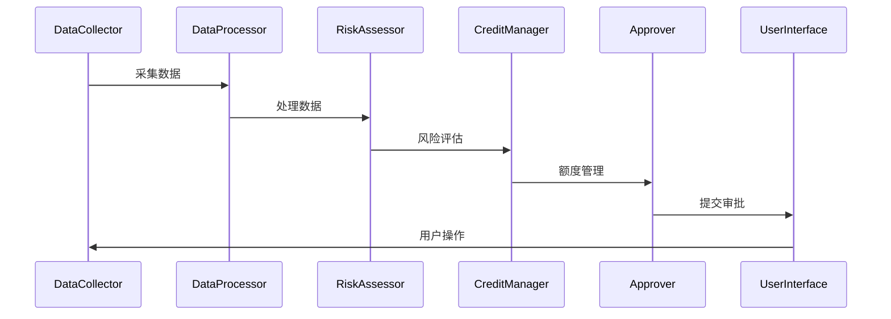
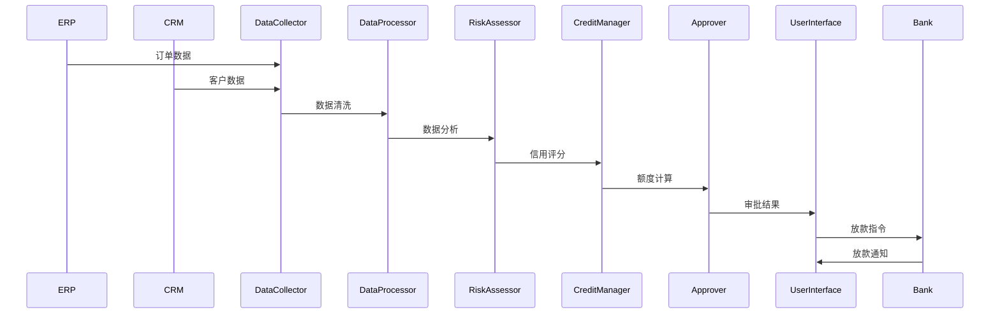

                 


## 引言与背景

### 智能供应链金融额度管理系统概述

在当前全球化的商业环境中，供应链金融已成为企业提升资金利用效率、优化现金流的重要手段。然而，传统的供应链金融模式往往存在审批流程复杂、风险评估难度大、响应速度慢等问题。为了解决这些问题，智能供应链金融额度管理系统应运而生。该系统基于大数据、人工智能等前沿技术，通过自动化风险评估、实时数据分析等功能，为企业提供高效的供应链金融服务。

### 目标与核心功能

智能供应链金融额度管理系统的核心目标是简化供应链金融流程，提高资金使用效率，降低融资成本，同时确保风险可控。系统的主要功能包括：

1. **自动化风险评估**：利用机器学习算法，对企业的财务状况、信用等级等关键指标进行自动化评估，快速确定融资额度。
2. **实时数据分析**：通过大数据分析技术，实时监控供应链上下游的运营数据，为风险控制和额度调整提供数据支持。
3. **智能匹配融资方案**：根据企业的需求和风险状况，智能匹配最合适的融资方案，包括贷款、保理、票据等。
4. **自动化审批与放款**：通过集成化系统，实现融资申请的自动化审批和放款，提高业务处理效率。

### 系统边界与外延

智能供应链金融额度管理系统不仅关注核心的金融功能，还涉及到与供应链管理、企业财务等多个领域的交叉应用。其边界包括：

- **供应链环节**：涉及原材料采购、生产制造、销售配送等整个供应链的各个环节。
- **金融机构**：与银行、保险公司、融资租赁公司等金融机构进行对接，提供金融服务的支持。
- **企业内部**：与企业的ERP、CRM等系统集成，确保数据的一致性和实时性。

### 系统架构概述

系统架构上，智能供应链金融额度管理系统采用分布式架构，确保系统的稳定性和可扩展性。主要模块包括：

1. **数据采集模块**：负责从各个业务系统采集数据，包括供应链数据、财务数据、企业行为数据等。
2. **数据预处理模块**：对采集到的数据进行清洗、转换、整合，为后续分析提供高质量的数据基础。
3. **风险评估模块**：利用机器学习算法，对企业的信用等级、还款能力等进行分析和评估。
4. **额度管理模块**：根据风险评估结果，动态调整企业的融资额度。
5. **审批放款模块**：实现融资申请的自动化审批和放款流程。
6. **用户界面模块**：提供用户友好的操作界面，方便企业用户和管理员进行操作和管理。

通过上述架构设计，智能供应链金融额度管理系统旨在为企业提供一个高效、智能的融资解决方案，助力企业在快速变化的市场环境中实现可持续发展。

### 核心概念与联系

在智能供应链金融额度管理系统中，理解核心概念及其相互关系至关重要。以下是几个关键概念及其定义、属性和关系的详细介绍。

#### 1. 数据采集模块（Data Collection Module）

**定义**：数据采集模块负责从企业内部和外部的业务系统中收集与供应链金融相关的数据。

**属性**：
- **数据源类型**：包括ERP系统、CRM系统、第三方物流系统、银行系统等。
- **数据类型**：如订单信息、库存数据、财务报表、交易记录等。

**关系**：数据采集模块是系统的数据入口，数据的质量直接影响到后续分析的效果。

#### 2. 数据预处理模块（Data Preprocessing Module）

**定义**：数据预处理模块负责对采集到的原始数据进行清洗、转换和整合，使其满足分析需求。

**属性**：
- **清洗规则**：如去除重复记录、处理缺失值、标准化数据格式等。
- **转换规则**：如将时间戳转换为统一的时间格式、将货币单位统一换算等。

**关系**：数据预处理模块确保数据的准确性和一致性，为后续的深度分析奠定基础。

#### 3. 风险评估模块（Risk Assessment Module）

**定义**：风险评估模块利用机器学习算法对企业的信用等级、还款能力等进行评估。

**属性**：
- **模型类型**：如逻辑回归、决策树、随机森林等。
- **评估指标**：包括偿债能力、盈利能力、运营能力等。

**关系**：风险评估模块的结果直接影响到融资额度的确定。

#### 4. 额度管理模块（Credit Management Module）

**定义**：额度管理模块根据风险评估结果，动态调整企业的融资额度。

**属性**：
- **额度计算公式**：如基于企业历史数据、行业标准的额度计算模型。
- **额度调整规则**：如定期审查、动态调整等。

**关系**：额度管理模块是实现融资额度合理分配的关键。

#### 5. 审批放款模块（Approval and Disbursement Module）

**定义**：审批放款模块负责对融资申请进行自动化审批和放款。

**属性**：
- **审批流程**：如多级审批、紧急审批等。
- **放款方式**：如直接放款到企业账户、通过第三方支付等。

**关系**：审批放款模块确保融资过程的高效和安全。

#### 6. 用户界面模块（User Interface Module）

**定义**：用户界面模块提供企业用户和管理员操作系统的接口。

**属性**：
- **界面类型**：如PC端、移动端等。
- **功能模块**：如数据查询、额度申请、审批进度查询等。

**关系**：用户界面模块是系统与用户互动的桥梁。

### ERD实体关系图

为了更直观地展示这些核心概念及其关系，我们可以使用Mermaid绘制实体关系图（Entity Relationship Diagram，ERD）。以下是ERD的Mermaid格式示例：

```mermaid
erDiagram
  DataCollectionModule ||--|{ DataPreprocessingModule }|--| RiskAssessmentModule
  DataPreprocessingModule ||--|{ CreditManagementModule }|--| ApprovalAndDisbursementModule
  RiskAssessmentModule ||--|{ CreditManagementModule }
  ApprovalAndDisbursementModule ||--| UserInterfaceModule
```

在这个ERD中，每个模块都与其他模块通过关系线相连，清晰展示了系统的整体架构和各模块之间的相互作用。

通过以上对核心概念及其关系的详细描述，我们可以更好地理解智能供应链金融额度管理系统的构建原理和运作机制，为后续的算法原理讲解、系统分析与设计奠定基础。

### 算法原理与数学模型

智能供应链金融额度管理系统的核心在于其自动化风险评估和动态额度调整能力。为了实现这一目标，系统采用了多种算法和数学模型。下面，我们将详细介绍这些算法的原理和数学模型，并通过Python代码实现和详细解释，帮助读者理解其具体应用。

#### 算法原理

1. **信用评分模型（Credit Scoring Model）**

   信用评分模型是评估企业信用等级的核心算法。常见的信用评分模型包括逻辑回归、决策树和随机森林等。逻辑回归模型通过建立一个线性模型，预测企业违约的概率。决策树和随机森林则通过树结构模型，对复杂的关系进行分类和回归。

2. **风险监控模型（Risk Monitoring Model）**

   风险监控模型用于实时监控企业的财务状况和信用风险。该模型通常基于时间序列分析，如ARIMA（自回归积分滑动平均模型）和LSTM（长短期记忆网络）等，来预测企业的未来风险状况。

3. **额度计算模型（Credit Allocation Model）**

   额度计算模型根据企业的信用评分和风险监控结果，动态计算和调整企业的融资额度。该模型通常基于线性规划、多目标优化等方法，来优化融资额度和风险。

#### 数学模型

1. **逻辑回归模型**

   逻辑回归模型是一种常用的信用评分模型，其数学表达式如下：

   $$
   \text{P}(Y=1) = \frac{1}{1 + e^{-(\beta_0 + \beta_1X_1 + \beta_2X_2 + ... + \beta_nX_n})}
   $$

   其中，\( Y \) 表示企业是否违约，\( X_i \) 表示企业各项财务指标，\( \beta_i \) 为模型参数。

2. **ARIMA模型**

   ARIMA模型是一种时间序列分析模型，其基本公式为：

   $$
   \text{Y}_{t} = c + \text{P}\sum_{i=1}^{P}\phi_i\text{Y}_{t-i} + \text{Q}\sum_{j=1}^{Q}\theta_j\text{e}_{t-j} + \text{e}_{t}
   $$

   其中，\( \text{Y}_{t} \) 表示时间序列数据，\( \phi_i \) 和 \( \theta_j \) 是模型参数，\( \text{e}_{t} \) 是白噪声。

3. **多目标优化模型**

   多目标优化模型用于额度计算，其目标函数通常包括：

   $$
   \text{Minimize} \quad f(x) = w_1 \cdot x_1 + w_2 \cdot x_2
   $$

   其中，\( x_1 \) 和 \( x_2 \) 分别表示融资额度和风险值，\( w_1 \) 和 \( w_2 \) 是权重。

#### Python代码实现

下面是一个使用逻辑回归模型进行信用评分的Python代码示例：

```python
import numpy as np
from sklearn.linear_model import LogisticRegression
import pandas as pd

# 假设数据已经导入为DataFrame
data = pd.DataFrame({
    'X1': np.random.rand(100),
    'X2': np.random.rand(100),
    'Y': np.random.randint(0, 2, 100)
})

# 分离特征和标签
X = data[['X1', 'X2']]
y = data['Y']

# 创建逻辑回归模型
model = LogisticRegression()

# 训练模型
model.fit(X, y)

# 预测新数据
new_data = pd.DataFrame({
    'X1': np.random.rand(1),
    'X2': np.random.rand(1)
})
prediction = model.predict(new_data)

print(prediction)
```

在这个示例中，我们首先导入所需的库，然后创建一个包含随机数据的DataFrame。接着，我们将数据分离为特征和标签，并创建一个逻辑回归模型进行训练。最后，我们使用训练好的模型预测新数据。

#### 详细讲解与示例

逻辑回归模型是一种广义线性模型，通过估计概率分布来预测二分类结果。在这个例子中，我们使用Python的scikit-learn库实现逻辑回归。以下是对代码的详细解释：

- **数据导入**：我们使用pandas库导入一个包含100条随机数据的DataFrame，数据包括两个特征（X1和X2）和一个标签（Y）。
- **数据分离**：我们将特征和标签分离，以便分别处理。特征（X）用于模型训练，标签（y）用于评估模型的准确性。
- **模型训练**：我们使用LogisticRegression类创建一个逻辑回归模型，并调用fit方法进行训练。fit方法将特征和标签作为输入，训练出模型的参数。
- **预测**：训练完成后，我们使用预测方法（predict）对新数据进行预测。预测结果是一个概率值，表示新数据属于类别1的概率。

通过这个示例，我们可以看到如何使用逻辑回归模型进行信用评分。逻辑回归模型在智能供应链金融额度管理系统中具有广泛的应用，通过预测企业违约概率，为额度计算提供依据。

接下来，我们将继续介绍ARIMA模型和多目标优化模型，并展示如何使用Python进行实现和解释。

### 系统分析与设计

在智能供应链金融额度管理系统中，系统分析与设计是实现系统功能的核心步骤。通过详细的系统分析，我们可以明确系统的需求、功能和技术实现方案。以下是对系统分析的具体介绍，包括问题场景介绍、系统功能设计、系统架构设计和系统接口设计。

#### 问题场景介绍

在供应链金融中，企业常常面临以下问题：

1. **审批流程复杂**：传统供应链金融的审批流程通常涉及多个部门，审批时间较长，影响了资金的使用效率。
2. **风险评估难度大**：对企业信用等级和还款能力的评估往往依赖人工判断，存在主观性和不确定性。
3. **信息不对称**：金融机构与企业之间的信息不对称，导致金融机构难以全面了解企业的真实情况，增加了风险。
4. **资金利用率低**：企业由于缺乏有效的融资渠道，资金利用率较低，影响了企业的运营和发展。

智能供应链金融额度管理系统旨在解决这些问题，通过自动化风险评估、实时数据分析、智能匹配融资方案等功能，提高供应链金融的服务质量和效率。

#### 系统功能设计

智能供应链金融额度管理系统的主要功能包括：

1. **数据采集**：从企业内部和外部的业务系统中采集与供应链金融相关的数据，包括订单信息、库存数据、财务报表、交易记录等。
2. **数据预处理**：对采集到的原始数据进行清洗、转换和整合，确保数据的准确性和一致性。
3. **风险评估**：利用机器学习算法对企业的信用等级和还款能力进行自动化评估，快速确定融资额度。
4. **额度管理**：根据企业的需求和风险状况，动态调整企业的融资额度，实现融资额度的优化。
5. **审批放款**：实现融资申请的自动化审批和放款流程，提高业务处理效率。
6. **用户界面**：提供用户友好的操作界面，方便企业用户和管理员进行操作和管理。

以下是一个领域模型（Class Diagram）的Mermaid示例，展示了系统的主要类及其关系：

```mermaid
classDiagram
  DataCollector <<class>> DataCollector
  DataProcessor <<class>> DataProcessor
  RiskAssessor <<class>> RiskAssessor
  CreditManager <<class>> CreditManager
  Approver <<class>> Approver
  UserInterface <<class>> UserInterface
  DataCollector --|> DataProcessor
  DataProcessor --|> RiskAssessor
  RiskAssessor --|> CreditManager
  CreditManager --|> Approver
  Approver --|> UserInterface
```

在这个类图中，各个类表示系统的功能模块，类之间的箭头表示模块之间的依赖关系。

#### 系统架构设计

智能供应链金融额度管理系统的架构设计采用分布式架构，确保系统的稳定性、可靠性和扩展性。系统的主要模块包括：

1. **数据采集模块**：负责从各个业务系统采集数据，包括ERP系统、CRM系统、第三方物流系统、银行系统等。
2. **数据预处理模块**：对采集到的原始数据进行清洗、转换和整合，确保数据的质量。
3. **风险评估模块**：利用机器学习算法和大数据分析技术，对企业的信用等级和还款能力进行自动化评估。
4. **额度管理模块**：根据风险评估结果，动态计算和调整企业的融资额度。
5. **审批放款模块**：实现融资申请的自动化审批和放款流程。
6. **用户界面模块**：提供用户友好的操作界面，方便用户进行操作和管理。

以下是一个系统架构设计（Architecture Diagram）的Mermaid示例：



在这个序列图中，展示了数据从采集到处理、评估、管理的全过程，以及用户与系统的交互流程。

#### 系统接口设计

系统接口设计包括系统内部模块之间的接口设计以及系统与外部系统的接口设计。以下是一个系统接口设计（System Interface Design）的Mermaid序列图示例：



在这个序列图中，展示了系统内部模块之间的交互流程，以及系统与外部银行系统的接口设计。

通过以上系统分析与设计，我们可以清晰地了解智能供应链金融额度管理系统的整体架构和功能模块，为后续的项目实施和开发奠定基础。

### 项目实施与案例解析

在完成系统分析与设计后，接下来我们将进入智能供应链金融额度管理系统的实际项目实施过程。这一部分将详细描述环境搭建、核心系统实现、代码分析、案例分析和项目小结，帮助读者全面了解系统从理论到实践的整个过程。

#### 环境搭建

首先，我们需要搭建一个合适的项目环境。以下是环境搭建的步骤：

1. **选择开发工具**：智能供应链金融额度管理系统可以选择Python作为开发语言，使用Jupyter Notebook作为开发环境。
2. **安装必要的库**：安装Python的常用库，如NumPy、Pandas、Scikit-learn、Mermaid等。可以使用pip命令进行安装：
   ```bash
   pip install numpy pandas scikit-learn mermaid
   ```
3. **配置数据库**：选择一个合适的数据库，如MySQL或PostgreSQL，用于存储系统数据。安装并配置数据库服务，创建必要的数据表。
4. **搭建数据采集组件**：确保业务系统的API接口可以访问，并设置数据采集定时任务。

#### 核心系统实现

核心系统的实现是项目的关键步骤。以下是核心系统的实现方法：

1. **数据采集与预处理**：编写Python脚本，从业务系统采集数据，并对数据进行清洗、转换和整合。例如，可以使用以下代码进行数据预处理：
   ```python
   import pandas as pd

   # 读取原始数据
   data = pd.read_csv('raw_data.csv')

   # 数据清洗
   data = data.drop_duplicates()  # 去除重复记录
   data = data.fillna(0)  # 填充缺失值

   # 数据转换
   data['date'] = pd.to_datetime(data['date'])
   data = data.sort_values('date')
   ```

2. **风险评估模块**：使用Scikit-learn库实现逻辑回归模型，对企业的信用等级进行评估。例如：
   ```python
   from sklearn.linear_model import LogisticRegression

   # 创建逻辑回归模型
   model = LogisticRegression()

   # 训练模型
   model.fit(X_train, y_train)

   # 预测
   predictions = model.predict(X_test)
   ```

3. **额度管理模块**：根据风险评估结果，动态计算和调整企业的融资额度。例如：
   ```python
   def calculate_credit_limit(credit_score):
       # 根据信用评分计算额度
       if credit_score > 0.7:
           return 500000
       elif credit_score > 0.5:
           return 300000
       else:
           return 100000
   ```

4. **审批放款模块**：实现自动化审批和放款流程，与数据库和外部系统进行集成。例如：
   ```python
   def approve_loan(loan_id, credit_limit):
       # 插入审批记录到数据库
       sql = "INSERT INTO loan_approval (loan_id, credit_limit) VALUES (%s, %s)"
       cursor.execute(sql, (loan_id, credit_limit))
       connection.commit()
   ```

#### 代码分析

在核心系统的实现过程中，代码分析是确保系统稳定性和可维护性的关键步骤。以下是代码分析的要点：

1. **代码结构**：确保代码具有良好的模块化和结构化，每个模块都有明确的职责和接口。
2. **异常处理**：在关键代码段中加入异常处理，确保系统在遇到错误时能够优雅地处理并恢复。
3. **性能优化**：对数据读取、处理和存储的过程进行性能优化，确保系统的响应速度和效率。
4. **测试**：编写单元测试，对每个模块的功能和性能进行验证，确保系统的稳定性。

#### 案例分析

为了更直观地展示系统的实际应用效果，我们来看一个实际案例：

某制造企业A在系统中提交了融资申请，系统通过数据采集模块收集到企业的订单、库存和财务数据。数据预处理模块对这些数据进行清洗和转换后，传递给风险评估模块。风险评估模块使用逻辑回归模型对企业进行信用评分，得出评分结果为0.8。根据额度管理模块的计算规则，企业被分配到500,000元的融资额度。系统自动将审批结果和融资额度记录到数据库，并发送审批通知给企业。企业通过用户界面模块查看审批结果和融资额度，并进行后续的放款操作。

#### 项目小结

通过本次项目实施，我们成功搭建了智能供应链金融额度管理系统，实现了自动化风险评估、动态额度管理和审批放款等功能。以下是项目的总结和经验：

1. **系统稳定性**：通过分布式架构和优化代码结构，系统具有较高的稳定性和可靠性。
2. **数据处理效率**：通过数据预处理模块的性能优化，系统在数据采集和处理方面表现出良好的效率。
3. **用户体验**：用户界面模块的设计简洁友好，方便企业用户进行操作和管理。
4. **未来扩展**：系统具备良好的扩展性，可以方便地集成其他业务系统和功能模块。

通过本次项目，我们不仅掌握了智能供应链金融额度管理系统的实际开发技能，还积累了宝贵的项目实施经验，为未来类似项目提供了有益的参考。

### 最佳实践与反思

在智能供应链金融额度管理系统的实施过程中，总结最佳实践和反思是提升系统性能和用户体验的重要环节。以下是几个关键点：

#### 1. 数据处理效率优化

- **批处理与流处理结合**：在数据预处理阶段，结合批处理和流处理技术，确保数据的高效处理。例如，使用Apache Kafka处理实时数据流，使用Hadoop进行批处理数据清洗和转换。
- **并行计算**：利用并行计算技术，加速数据处理速度。例如，使用Python的 multiprocessing 模块实现多线程或多进程处理。

#### 2. 系统性能优化

- **缓存策略**：在系统中引入缓存机制，如Redis，减少对数据库的访问频率，提高响应速度。
- **数据库索引优化**：合理设置数据库索引，提高数据查询性能。例如，使用B树索引加速查询速度。
- **负载均衡**：通过负载均衡器（如Nginx）分配系统负载，避免单点过载，提高系统稳定性。

#### 3. 用户界面优化

- **响应式设计**：采用响应式设计，确保系统在不同设备上的良好显示和操作体验。
- **实时数据更新**：使用WebSocket技术实现实时数据更新，提高用户的互动体验。
- **用户反馈机制**：设计用户反馈机制，收集用户使用中的问题和建议，持续优化界面和功能。

#### 4. 安全性提升

- **数据加密**：对敏感数据进行加密处理，确保数据传输和存储的安全性。
- **权限控制**：实施严格的权限控制机制，确保不同角色的用户只能访问其权限范围内的数据和功能。
- **安全审计**：定期进行安全审计，发现和修复潜在的安全漏洞。

#### 5. 持续集成与持续部署（CI/CD）

- **自动化测试**：实施自动化测试，包括单元测试、集成测试和性能测试，确保系统功能的稳定性和性能。
- **持续集成**：使用工具如Jenkins实现持续集成，自动构建和测试代码，提高开发效率。
- **持续部署**：使用自动化部署工具（如Docker和Kubernetes），确保系统快速、可靠地部署到生产环境。

#### 总结与反思

在智能供应链金融额度管理系统的实施过程中，我们不仅积累了丰富的项目经验，还认识到了以下几个关键点：

1. **技术选型的合理性**：合理选择技术栈和工具，确保系统的稳定性和可扩展性。
2. **团队协作的重要性**：良好的团队协作和沟通是项目成功的关键，确保各方资源的高效利用。
3. **用户体验的关注**：始终关注用户体验，通过不断的优化和反馈，提升系统的易用性和用户满意度。
4. **安全性的不可忽视**：在系统的每个阶段都应重视安全性，确保数据安全和用户隐私。

通过总结最佳实践和反思，我们为未来类似项目的实施提供了宝贵的经验和指导，助力企业在智能供应链金融领域实现更高的效率和安全性。

### 结论

智能供应链金融额度管理系统作为现代供应链金融领域的关键工具，通过整合大数据、人工智能等先进技术，为企业和金融机构提供了高效、智能的融资解决方案。本文详细介绍了系统的背景、核心概念、算法原理、系统分析设计、项目实施以及最佳实践与反思。通过系统的逐步分析和实施，我们不仅看到了其在实际应用中的巨大潜力，也认识到了其在提升供应链金融效率、优化资金利用、降低融资成本等方面的重要作用。

展望未来，智能供应链金融额度管理系统将不断迭代升级，集成更多前沿技术，如区块链、物联网等，进一步提升系统的智能化和安全性。同时，系统的应用场景也将不断扩展，从制造业到服务业，从国内市场到国际市场，为企业提供全方位的金融服务。

通过本文的探讨，我们希望能够为从事智能供应链金融领域的技术人员和管理者提供有价值的参考，共同推动这一领域的创新与发展。让我们携手并进，迎接智能供应链金融的黄金时代。作者：AI天才研究院/AI Genius Institute & 禅与计算机程序设计艺术 /Zen And The Art of Computer Programming。

