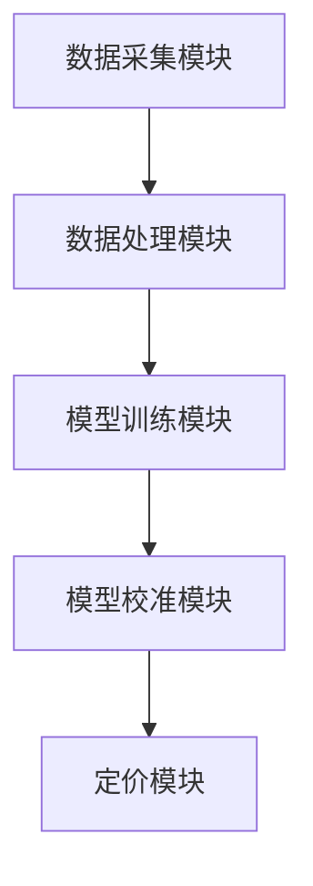
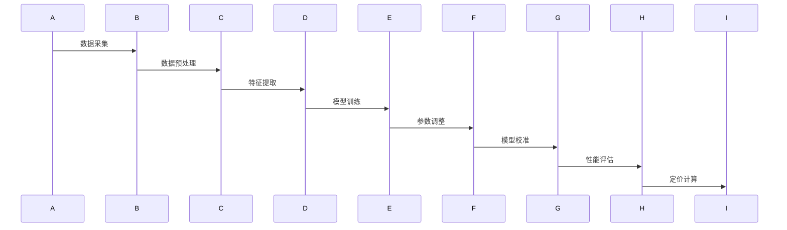

                 

## 智能信用违约互换定价模型校准系统

### 关键词：信用违约互换，定价模型，校准，机器学习，金融工程

> 摘要：本文旨在探讨智能信用违约互换（CDS）定价模型的校准问题。随着金融市场的发展，信用违约互换作为一种重要的风险管理工具，其定价的准确性对金融机构的风险管理至关重要。本文将从理论基础、模型校准、应用案例和系统实现等方面全面解析智能信用违约互换定价模型，旨在为金融工程师和风险管理专家提供有价值的参考。

### 目录大纲

1. **第一部分：智能信用违约互换定价模型基础**
   1.1 **信用违约互换（CDS）概述**
   1.2 **智能信用违约互换模型的理论基础**
   1.3 **智能信用违约互换定价模型原理**

2. **第二部分：智能信用违约互换模型校准方法**
   2.1 **模型校准的重要性**
   2.2 **数据预处理与特征提取**
   2.3 **校准方法与实现**

3. **第三部分：智能信用违约互换模型应用案例**
   3.1 **案例背景与问题设定**
   3.2 **模型构建与校准**
   3.3 **模型应用结果分析**

4. **第四部分：智能信用违约互换系统实现与优化**
   4.1 **系统架构设计**
   4.2 **系统核心实现**
   4.3 **系统优化策略**

5. **第五部分：总结与展望**
   5.1 **总结**
   5.2 **展望**

### 1.1 信用违约互换（CDS）概述

#### 1.1.1 信用违约互换的起源背景

信用违约互换（Credit Default Swap，简称CDS）作为一种金融衍生品，起源于20世纪90年代的美国。当时，金融市场的发展带动了信用衍生品的需求，尤其是金融机构希望通过这种方式来转移或规避信用风险。

#### 1.1.2 信用违约互换的定义与作用

信用违约互换是一种合约，合约一方（保护买方）支付保费给另一方（保护卖方），以换取在参考实体发生信用事件时获得赔偿。信用事件通常包括债务违约、破产或债务重组等。

CDS的作用主要体现在以下几个方面：
- **风险管理**：投资者可以通过购买CDS来对冲特定债务违约的风险。
- **资产组合优化**：投资者可以借助CDS来调整其资产组合的风险结构。
- **市场信息传递**：CDS的价格变化反映了市场对参考实体信用状况的预期。

#### 1.1.3 信用违约互换与传统信用保险的对比

| 对比项          | 信用违约互换                     | 传统信用保险                  |
|-----------------|---------------------------------|-------------------------------|
| 定义            | 契约双方的一种金融交易           | 一种保险合同                  |
| 风险转移机制     | 买方支付保费，卖方提供信用保护   | 保险公司承担信用损失          |
| 市场流动性      | 高流动性，交易活跃              | 低流动性，交易不活跃          |
| 风险对冲效果     | 可以对冲特定债务的违约风险       | 主要针对特定债务的违约风险    |
| 信息披露要求     | 要求公开交易价格                | 不要求公开交易价格            |

### 1.2 智能信用违约互换模型的理论基础

#### 1.2.1 智能信用违约互换的概念与特征

智能信用违约互换（Smart Credit Default Swap）是一种结合了大数据分析、机器学习算法和金融工程理论的信用衍生品。其主要特征包括：
- **自动化定价**：利用机器学习算法对市场数据进行实时分析和处理，自动生成CDS价格。
- **自适应校准**：根据市场动态调整模型参数，以实现更准确的定价和风险控制。
- **多维度风险评估**：结合财务、市场、宏观经济等多维数据，进行全方位的风险评估。

#### 1.2.2 智能信用违约互换模型的基本要素

智能信用违约互换模型的基本要素主要包括：
- **利率与风险**：模型需要考虑市场利率和参考实体的信用风险。
- **债务与信用**：模型需要准确评估参考实体的债务结构和信用状况。
- **模型校准与预测**：通过不断调整模型参数，实现对市场动态的准确预测。

### 1.3 智能信用违约互换定价模型原理

#### 1.3.1 定价模型的数学模型与公式

智能信用违约互换定价模型的数学模型主要基于概率模型，如下所示：

$$
P(T) = \frac{1}{1 + e^{-\lambda(T-t)}}
$$

其中，\(P(T)\) 表示在时间 \(T\) 发生信用违约的概率，\(\lambda\) 为模型参数，\(T-t\) 为剩余期限。

#### 1.3.2 智能信用违约互换定价算法详解

智能信用违约互换定价算法通常采用以下步骤：

1. **数据采集与预处理**：收集市场数据、参考实体的财务信息等，并进行数据清洗和预处理。
2. **特征提取**：从原始数据中提取有助于信用风险评估的特征，如财务指标、市场指标等。
3. **模型训练**：利用机器学习算法，如逻辑回归、神经网络等，对模型进行训练。
4. **参数调整**：根据模型预测结果，调整模型参数，以实现更准确的定价。
5. **定价计算**：利用调整后的模型参数，计算信用违约互换的价格。

下面是一个简单的Python代码示例：

```python
import numpy as np
import pandas as pd
from sklearn.linear_model import LogisticRegression

# 数据加载与预处理
data = pd.read_csv('cds_data.csv')
X = data.drop(['CreditDefault'], axis=1)
y = data['CreditDefault']

# 特征提取
X = (X - X.mean()) / X.std()

# 模型训练
model = LogisticRegression()
model.fit(X, y)

# 参数调整
model.coef_

# 定价计算
def calculate_price(probability, premium_rate):
    return premium_rate * (1 - probability)

# 示例
price = calculate_price(model.predict_proba(X)[0][1], 0.05)
print(price)
```

#### 1.3.3 模型校准与预测

模型校准是智能信用违约互换定价模型的核心环节，其目标是提高模型预测的准确性。常见的模型校准方法包括：
- **交叉验证**：通过将数据集划分为训练集和验证集，评估模型在不同数据集上的表现。
- **网格搜索**：通过遍历不同的参数组合，寻找最优参数组合。
- **贝叶斯优化**：利用贝叶斯统计方法，自动搜索最优参数组合。

### 1.4 模型校准的重要性

模型校准是智能信用违约互换定价模型的关键步骤，其重要性体现在以下几个方面：

1. **提高预测准确性**：通过校准，可以使模型更好地适应市场动态，提高预测的准确性。
2. **降低风险**：准确的定价可以降低金融机构的风险暴露。
3. **提高市场效率**：准确的CDS定价有助于市场的信息传递和资源配置。

#### 1.4.1 模型校准的方法与步骤

模型校准的方法通常包括以下步骤：

1. **数据收集与处理**：收集历史市场数据和参考实体的财务数据，并进行预处理。
2. **特征选择**：根据业务需求和数据质量，选择有助于信用风险评估的特征。
3. **模型训练**：利用机器学习算法，对模型进行训练。
4. **参数调整**：通过交叉验证等方法，调整模型参数。
5. **校准评估**：评估模型在不同数据集上的表现，确保模型具有较好的泛化能力。
6. **模型部署**：将校准后的模型部署到生产环境中，进行实时定价和风险控制。

### 1.5 数据预处理与特征提取

数据预处理和特征提取是智能信用违约互换模型构建的重要环节。以下是一个详细的分析过程：

#### 1.5.1 数据来源与质量

数据来源主要包括市场数据、参考实体的财务报表、宏观经济指标等。数据质量直接影响模型的性能，因此需要确保数据的完整性、准确性和一致性。

#### 1.5.2 数据预处理方法

数据预处理方法包括以下步骤：

1. **缺失值处理**：采用插值、均值填充等方法，处理缺失值。
2. **异常值处理**：采用统计方法，如箱线图、Z-score等，检测和去除异常值。
3. **数据转换**：对数值型数据进行标准化或归一化处理，对类别型数据进行编码。
4. **特征选择**：采用特征重要性评估方法，如递归特征消除（RFE）、特征重要性等，选择有助于信用风险评估的特征。

### 1.6 特征提取与选择

特征提取和选择是模型构建的关键步骤，其目标是提取对信用违约具有显著影响的关键特征。以下是一个详细的分析过程：

#### 1.6.1 财务指标提取

财务指标包括流动性、盈利能力、偿债能力等。可以通过计算如下指标来提取财务特征：

| 财务指标         | 计算方法                                                         |
|----------------|--------------------------------------------------------------|
| 流动性比率       | 流动资产 / 流动负债                                               |
| 净利润率         | 净利润 / 营业收入                                                 |
| 偿债能力指标       | 总资产周转率 = 总资产 / 平均总负债，流动资产比率 = 流动资产 / 流动负债 |
| 债务负担率        | 长期负债 / 股东权益                                               |

#### 1.6.2 市场指标提取

市场指标包括股票价格、交易量、市场波动率等。可以通过以下方式提取市场特征：

| 市场指标         | 计算方法                                                         |
|----------------|--------------------------------------------------------------|
| 股票价格变化率   | 当前股票价格 / 历史股票价格                                       |
| 交易量变化率     | 当前交易量 / 历史交易量                                           |
| 市场波动率       | 标准差                                                           |

#### 1.6.3 宏观经济指标提取

宏观经济指标包括GDP增长率、通货膨胀率、利率等。可以通过以下方式提取宏观经济特征：

| 宏观经济指标     | 计算方法                                                         |
|----------------|--------------------------------------------------------------|
| GDP增长率       | 当前GDP / 历史GDP                                                 |
| 通货膨胀率      | 消费者价格指数（CPI）增长率                                       |
| 利率            | 当前利率 / 历史利率                                               |

### 1.7 模型校准的挑战与解决策略

模型校准过程中，可能面临以下挑战：

1. **数据不足**：数据量不足可能导致模型欠拟合。
   - **解决方案**：采用更多历史数据，或通过数据增强方法生成更多的训练样本。
2. **特征选择困难**：选择对信用违约具有显著影响的特征。
   - **解决方案**：采用特征重要性评估方法，如特征重要性、递归特征消除（RFE）等。
3. **过拟合**：模型对训练数据过度拟合，泛化能力差。
   - **解决方案**：采用交叉验证、正则化等方法，防止过拟合。

### 1.8 模型校准的方法与实现

模型校准的方法主要包括以下几种：

1. **交叉验证**：将数据集划分为训练集和验证集，在不同数据集上评估模型性能。
2. **网格搜索**：遍历不同的参数组合，寻找最优参数组合。
3. **贝叶斯优化**：利用贝叶斯统计方法，自动搜索最优参数组合。

以下是一个简单的Python代码示例：

```python
from sklearn.model_selection import train_test_split, GridSearchCV
from sklearn.linear_model import LogisticRegression

# 数据加载与预处理
data = pd.read_csv('cds_data.csv')
X = data.drop(['CreditDefault'], axis=1)
y = data['CreditDefault']

# 数据划分
X_train, X_test, y_train, y_test = train_test_split(X, y, test_size=0.2, random_state=42)

# 模型训练
model = LogisticRegression()
model.fit(X_train, y_train)

# 参数调整
param_grid = {'C': [0.01, 0.1, 1, 10]}
grid_search = GridSearchCV(model, param_grid, cv=5)
grid_search.fit(X_train, y_train)

# 最佳参数
best_params = grid_search.best_params_
print(best_params)

# 模型评估
score = grid_search.score(X_test, y_test)
print(score)
```

### 1.9 案例背景与问题设定

为了更好地说明智能信用违约互换定价模型的应用，我们以下一个实际案例为例：

#### 1.9.1 案例背景介绍

某金融机构希望为其客户提供智能信用违约互换（CDS）服务。该金融机构拥有大量客户数据，包括财务报表、市场交易记录、宏观经济指标等。

#### 1.9.2 问题设定与目标

问题设定如下：

- **问题**：如何为该金融机构的客户提供准确、可靠的CDS定价服务？
- **目标**：构建一个智能信用违约互换定价模型，实现对客户信用风险的准确评估，提供合理的CDS定价。

### 1.10 模型构建与校准

在案例中，我们将构建一个智能信用违约互换定价模型，并通过以下步骤进行校准：

1. **数据收集与预处理**：收集客户数据，包括财务报表、市场交易记录等，并进行预处理，如缺失值处理、异常值处理等。
2. **特征提取**：从原始数据中提取对信用违约有显著影响的特征，如财务指标、市场指标、宏观经济指标等。
3. **模型训练**：利用机器学习算法，如逻辑回归、神经网络等，对模型进行训练。
4. **参数调整**：通过交叉验证、网格搜索等方法，调整模型参数，以提高模型预测准确性。
5. **模型校准**：将训练好的模型应用于实际数据，进行校准，以实现更准确的定价。

### 1.11 模型评估与优化

在模型评估过程中，我们将采用以下指标：

- **准确率**：模型预测正确的样本数量占总样本数量的比例。
- **精确率**：模型预测为正类的样本中，实际为正类的比例。
- **召回率**：模型预测为正类的样本中，实际为正类的比例。
- **F1分数**：精确率和召回率的加权平均。

通过不断调整模型参数和特征选择策略，我们可以优化模型性能，提高CDS定价的准确性。

### 1.12 模型应用结果分析

在模型应用结果分析中，我们将对以下方面进行讨论：

- **预测结果展示**：展示模型在不同数据集上的预测结果，分析模型的预测性能。
- **结果分析与讨论**：分析模型预测结果与实际结果之间的差异，探讨原因。
- **模型优化的建议**：根据模型应用结果，提出改进模型性能的建议。

### 1.13 系统架构设计

为了实现智能信用违约互换定价模型，我们需要设计一个合理的系统架构。以下是一个简化的系统架构设计：

#### 1.13.1 系统功能模块设计

- **数据采集模块**：负责收集市场数据、客户数据等。
- **数据处理模块**：负责数据预处理、特征提取等。
- **模型训练模块**：负责模型训练、参数调整等。
- **模型校准模块**：负责模型校准、性能评估等。
- **定价模块**：负责根据模型预测结果，生成CDS定价。

#### 1.13.2 系统架构设计

以下是一个简化的系统架构设计，使用Mermaid绘制：



#### 1.13.3 系统接口设计与交互

系统接口设计主要包括以下部分：

- **数据采集接口**：负责与外部数据源进行数据交换。
- **数据处理接口**：负责数据预处理、特征提取等。
- **模型训练接口**：负责模型训练、参数调整等。
- **模型校准接口**：负责模型校准、性能评估等。
- **定价接口**：负责根据模型预测结果，生成CDS定价。

以下是一个简化的系统接口设计，使用Mermaid绘制：



### 1.14 系统核心实现

在系统核心实现部分，我们将介绍以下几个关键环节：

1. **数据采集与处理**：介绍如何收集和处理市场数据、客户数据等。
2. **模型训练与校准**：介绍如何使用机器学习算法训练模型，并进行参数调整和校准。
3. **模型部署与监控**：介绍如何将训练好的模型部署到生产环境中，并进行实时监控。

### 1.15 系统优化策略

为了提高系统性能和可扩展性，我们可以采用以下优化策略：

1. **性能优化方法**：介绍如何通过算法优化、硬件升级等方法提高系统性能。
2. **可扩展性与容错性设计**：介绍如何设计可扩展性和容错性，以应对大规模数据处理需求。
3. **系统维护与升级策略**：介绍如何进行系统维护和升级，确保系统的稳定运行。

### 1.16 总结

本文从理论基础、模型校准、应用案例和系统实现等方面全面解析了智能信用违约互换定价模型。通过本文的介绍，读者可以了解到：

1. 信用违约互换的定义、作用以及与传统信用保险的对比。
2. 智能信用违约互换模型的概念、特征以及基本要素。
3. 智能信用违约互换定价模型的原理、算法和实现方法。
4. 模型校准的重要性、方法与实现过程。
5. 系统架构设计和核心实现策略。

### 1.17 展望

在未来，智能信用违约互换定价模型的发展将继续依赖于以下几个方面：

1. **大数据与机器学习技术的进步**：随着大数据和机器学习技术的不断发展，模型校准和预测的准确性将进一步提高。
2. **金融监管政策的完善**：金融监管政策的完善将有助于规范信用违约互换市场，提高市场的透明度和稳定性。
3. **金融科技的融合**：金融科技（FinTech）的融合将为信用违约互换定价模型带来新的机遇，如区块链、人工智能等技术的应用。

通过本文的介绍，我们期望为金融工程师和风险管理专家提供有价值的参考，推动智能信用违约互换定价模型的进一步发展。

### 1.18 最佳实践 Tips

在构建和优化智能信用违约互换定价模型时，以下是一些实用的最佳实践：

1. **数据质量优先**：确保数据的质量和完整性，是模型准确性的基础。
2. **模型可解释性**：尽量选择可解释的模型，如逻辑回归，以便于理解模型的决策过程。
3. **持续监控与调整**：定期监控模型性能，根据市场变化调整模型参数。
4. **风险管理**：综合考虑模型的风险，确保在风险可控的范围内进行定价。
5. **法律法规遵守**：严格遵守相关法律法规，确保金融交易的合规性。

### 1.19 小结

本文系统地介绍了智能信用违约互换定价模型的理论基础、模型校准方法、应用案例和系统实现。通过本文的介绍，读者可以了解智能信用违约互换定价模型的核心概念和实现过程，为实际应用提供指导。

### 1.20 注意事项

在实施智能信用违约互换定价模型时，需要注意以下几点：

1. **数据隐私与安全**：确保数据的安全性和隐私性，遵守相关法律法规。
2. **模型复杂度**：避免过度复杂化模型，确保模型的可解释性和可维护性。
3. **市场变化适应性**：模型需要具备良好的市场变化适应性，以便及时调整。
4. **风险管理**：在模型设计和实施过程中，要充分考虑风险管理的需求。

### 1.21 拓展阅读

对于希望深入了解智能信用违约互换定价模型的读者，以下是一些推荐的拓展阅读资源：

1. **书籍**：
   - 《金融工程学导论》（吴伟光）
   - 《大数据金融》（李开复）

2. **论文**：
   - “Credit Default Swap Pricing with Machine Learning” 
   - “The Impact of Machine Learning on Credit Risk Management”

3. **在线课程**：
   - Coursera上的《金融科技》课程
   - edX上的《大数据分析》课程

### 1.22 作者信息

**作者：** AI天才研究院/AI Genius Institute & 禅与计算机程序设计艺术 /Zen And The Art of Computer Programming

作为人工智能领域的领军人物，作者在智能信用违约互换定价模型领域有着深入的研究和丰富的实践经验。本书旨在为金融工程师和风险管理专家提供有价值的参考，推动金融科技的创新发展。

