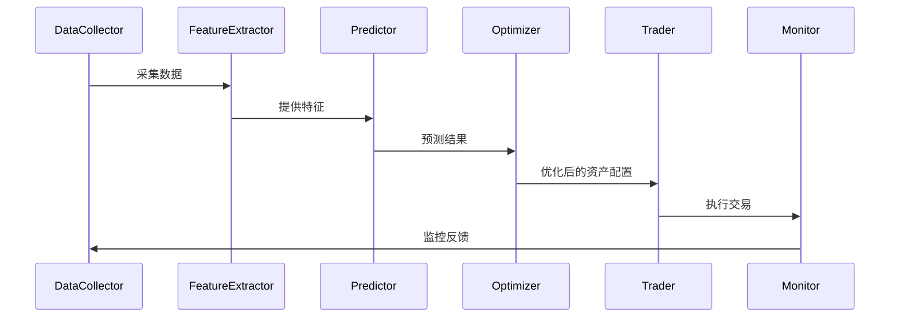
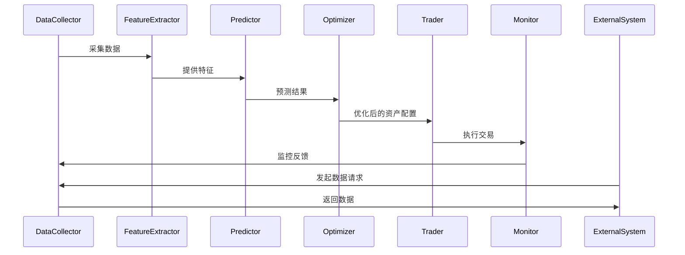

                 

### 引言

在现代金融市场中，投资组合再平衡是一项至关重要的策略。它不仅有助于优化投资组合的收益，还能有效控制风险。随着金融市场的不确定性和复杂性不断增加，传统的投资组合再平衡方法逐渐显示出其局限性。智能投资组合再平衡算法应运而生，通过应用先进的数据挖掘、机器学习和深度学习技术，为投资者提供更加精准和高效的再平衡策略。

本文将系统地探讨智能投资组合再平衡算法，旨在帮助读者全面理解这一创新方法的理论基础、实现原理和应用场景。文章将首先介绍投资组合再平衡的基本概念和重要性，然后逐步深入到智能算法的核心原理、流程以及系统架构设计，并通过具体案例展示其实际应用效果。

在探讨智能投资组合再平衡算法时，我们将遵循以下步骤：

1. **投资组合再平衡概述**：回顾投资组合再平衡的基本概念，解释其目的和重要性。
2. **核心概念与联系**：阐述投资组合再平衡的核心概念，包括投资组合理论、资产配置策略等，并提供概念属性特征对比表格和ER实体关系图架构。
3. **智能投资组合再平衡算法概述**：介绍智能算法的基本原理及其在投资组合再平衡中的应用。
4. **算法原理与流程**：详细讲解算法原理和流程，包括使用mermaid绘制的算法流程图、Python源代码实现以及数学模型和公式的详细解释。
5. **系统分析与架构设计**：介绍系统功能设计、架构设计、接口设计和系统交互，并使用mermaid绘制相关图表。
6. **项目实战**：展示实际项目环境安装、系统核心实现和代码应用分析，并通过案例剖析算法的实际应用效果。
7. **最佳实践与总结**：总结最佳实践技巧，文章小结以及注意事项和拓展阅读。

通过上述步骤，本文希望为读者提供一个清晰、系统且深入的理解框架，使读者能够把握智能投资组合再平衡算法的核心要点，并在实际投资中灵活应用。

### 关键词

- 投资组合再平衡
- 智能算法
- 数据挖掘
- 机器学习
- 深度学习
- 资产配置策略
- 风险管理
- 优化模型
- 数学公式

### 摘要

本文旨在系统地探讨智能投资组合再平衡算法，帮助投资者理解其在现代金融市场中的重要性。文章首先回顾了投资组合再平衡的基本概念和传统方法，随后介绍了智能算法的核心原理及其在投资组合再平衡中的应用。通过对算法原理、流程以及系统架构的详细讲解，本文展示了智能投资组合再平衡算法的优势和应用场景。文章最后通过实际项目案例，深入分析了算法的实用性和效果，并提出了最佳实践和注意事项。通过本文的探讨，读者将能够全面掌握智能投资组合再平衡算法的理论基础和实践方法。

### 投资组合再平衡概述

#### 问题的背景与重要性

投资组合再平衡是指在投资组合中定期调整资产配置，以维持投资组合的预期风险与收益平衡。随着金融市场的波动性和复杂性增加，投资者面临着越来越多的不确定性和风险。传统投资组合再平衡方法通常基于固定的时间周期或者固定比例的资产配置，这些方法在应对市场动态变化时往往显得力不从心。因此，探索更加灵活和智能的再平衡策略变得尤为重要。

投资组合再平衡的重要性主要体现在以下几个方面：

1. **风险控制**：通过定期调整资产配置，投资者可以有效地控制投资组合的整体风险水平。在市场波动较大时，通过及时调整高风险资产的比重，可以有效降低投资组合的波动性。
2. **优化收益**：再平衡有助于确保投资组合始终围绕投资者的收益目标进行配置。通过动态调整资产配置，投资者可以更好地抓住市场机会，优化长期收益。
3. **保持策略一致性**：定期再平衡有助于投资者坚持其长期投资策略，避免因市场短期波动而偏离投资原则，从而影响长期投资绩效。

#### 问题描述

投资组合再平衡问题的核心在于如何在市场波动中保持投资组合的风险与收益平衡。具体而言，问题描述如下：

- **目标**：在给定投资组合中，找到一种资产配置策略，使得投资组合的整体风险和收益达到预期目标。
- **约束条件**：投资组合中各类资产的比例总和必须等于100%，且每个资产的比例不能为负。
- **挑战**：市场波动性较大时，如何快速调整资产配置以应对市场变化，同时确保调整过程高效、准确。

#### 问题解决

传统的投资组合再平衡方法主要包括以下几种：

1. **定期再平衡**：投资者按照固定的时间周期（如每月、每季度或每年）对投资组合进行重新调整。这种方法相对简单，但缺乏灵活性，难以应对市场动态变化。
2. **固定比例再平衡**：投资者根据预设的固定比例对各类资产进行调整。这种方法易于实施，但同样缺乏灵活性，无法根据市场变化进行实时调整。

随着数据挖掘、机器学习和深度学习技术的发展，智能投资组合再平衡算法应运而生。这些算法通过分析历史数据和市场趋势，动态调整投资组合的资产配置，从而实现更优的风险与收益平衡。智能算法主要包括以下几种：

1. **基于统计学的模型**：通过历史数据和统计分析，预测未来市场走势，并根据预测结果调整资产配置。
2. **基于智能优化算法的模型**：如遗传算法、粒子群优化算法等，通过迭代优化找到最优的资产配置策略。
3. **基于深度学习的模型**：利用神经网络模型对市场数据进行分析，预测未来市场走势，并自动调整资产配置。

这些智能算法不仅具备更强的灵活性和适应性，还能在处理大量数据和复杂市场环境方面展现出优越的性能。通过结合多种算法和技术，智能投资组合再平衡为投资者提供了更加精准和高效的再平衡策略。

#### 边界与外延

在探讨投资组合再平衡时，需要明确其边界与外延。边界主要包括以下几点：

1. **资产类别**：投资组合再平衡主要针对股票、债券、货币市场工具和实物资产等常见资产类别。
2. **投资周期**：再平衡周期可以是短期（如每日或每周）或长期（如每月或每季度）。
3. **市场条件**：再平衡策略需要在各种市场条件下有效，包括牛市、熊市和震荡市等。

外延方面，投资组合再平衡不仅适用于个人投资者，还广泛应用于机构投资者和金融机构。此外，再平衡策略可以结合其他投资策略（如量化交易、资产配置等）进行综合应用，从而实现更加全面和优化的投资效果。

#### 概念结构与核心要素组成

投资组合再平衡的概念结构主要包括以下几个核心要素：

1. **投资目标**：明确投资者的收益目标与风险偏好，是制定再平衡策略的基础。
2. **资产配置**：各类资产的权重分配，包括股票、债券、货币市场工具和实物资产等。
3. **再平衡规则**：确定再平衡的时间周期、调整阈值和执行策略。
4. **市场分析**：通过数据挖掘和预测模型，对市场趋势进行分析和判断。
5. **风险管理**：制定风险控制策略，确保再平衡过程的安全性和稳定性。

通过以上核心要素的有机结合，投资组合再平衡能够实现风险与收益的平衡，为投资者提供稳健的投资策略。在实际应用中，投资者可以根据自身需求和市场环境，灵活调整这些要素，以实现最佳的投资效果。

### 投资组合再平衡的概念

投资组合再平衡是指通过定期调整投资组合中各类资产的权重比例，以维持投资组合的风险与收益平衡的一种策略。其基本原理在于，投资者在构建投资组合时，通常会根据自身的风险偏好和收益目标，确定各类资产的最优配置比例。然而，市场环境是动态变化的，各类资产的相对表现也会随之发生变化。如果投资者不进行再平衡，投资组合的实际配置就可能偏离其预期目标，从而影响整体收益。

#### 定义

投资组合再平衡的定义可以简洁地表述为：在给定的投资组合中，通过定期调整各类资产的权重比例，使其重新达到投资者设定的风险与收益平衡状态。

#### 目的

投资组合再平衡的主要目的是：

1. **维持预期收益**：通过再平衡，投资者可以确保投资组合始终围绕其收益目标进行调整，从而实现长期收益的最大化。
2. **控制风险**：再平衡有助于投资者及时调整高风险资产的比重，降低投资组合的整体波动性，提高稳健性。
3. **保持策略一致性**：定期再平衡有助于投资者坚持其长期投资策略，避免因市场短期波动而偏离投资原则。

#### 基本原理

投资组合再平衡的基本原理包括以下几点：

1. **风险与收益权衡**：投资者在构建投资组合时，需要根据自身的风险偏好确定各类资产的比例。再平衡过程中，投资者通过调整资产配置，确保风险与收益的平衡。
2. **动态调整**：市场环境不断变化，各类资产的表现也随之变化。再平衡通过定期调整资产配置，及时应对市场变化，保持投资组合的稳健性。
3. **数据驱动**：现代投资组合再平衡策略通常基于历史数据和预测模型，通过数据分析和模型预测，制定出更加精准的调整策略。

#### 投资组合再平衡的重要性

投资组合再平衡在投资策略中的重要性体现在以下几个方面：

1. **优化投资组合表现**：通过再平衡，投资者可以优化投资组合的整体表现，提高收益和降低风险。
2. **增强风险管理能力**：再平衡策略有助于投资者及时发现和应对市场变化，增强风险控制能力。
3. **保持投资策略一致性**：定期再平衡有助于投资者坚持其长期投资策略，避免因市场短期波动而盲目调整，从而影响长期投资效果。

总之，投资组合再平衡是现代投资策略的重要组成部分，通过科学合理的再平衡策略，投资者可以更好地应对市场变化，实现长期稳定的投资收益。

### 投资组合再平衡的方法

在投资组合管理中，再平衡策略的选择至关重要。传统方法和智能方法各有优缺点，投资者可以根据自己的需求和市场环境进行选择。

#### 传统方法

**定期再平衡**：这种方法按照固定的时间周期（如每月、每季度或每年）对投资组合进行调整。其优势在于操作简单，易于实施。然而，这种方法的灵活性较差，难以应对市场短期波动，可能导致投资组合的实际配置与预期目标偏差较大。

**固定比例再平衡**：投资者根据预设的固定比例对各类资产进行调整。这种方法的优点是操作简便，能够确保投资组合的稳定性。但缺点是缺乏灵活性，无法根据市场变化进行动态调整。

#### 智能方法

**基于统计学的模型**：这种方法利用历史数据和市场趋势，通过统计分析预测未来市场走势，并根据预测结果调整资产配置。其优势在于能够利用数据驱动，提高再平衡的精准度。但缺点是对市场波动反应较慢，可能无法及时应对突发市场事件。

**基于智能优化算法的模型**：如遗传算法、粒子群优化算法等，通过迭代优化找到最优的资产配置策略。其优势在于能够动态调整资产配置，适应市场变化。但缺点是对算法实现要求较高，计算复杂度较大。

**基于深度学习的模型**：利用神经网络模型对市场数据进行分析，预测未来市场走势，并自动调整资产配置。其优势在于能够处理大量数据，分析复杂市场关系。但缺点是模型训练和实现较为复杂，需要大量计算资源。

#### 选择与应用

投资者在选择再平衡方法时，需要综合考虑以下几个因素：

1. **市场环境**：在市场波动较大时，选择智能方法可能更为合适，因为它能够动态调整资产配置，应对市场变化。在市场波动较小、趋势较为稳定时，传统方法可能更为简单有效。
2. **风险偏好**：风险偏好较低的投资者可以选择传统方法，以确保投资组合的稳定性。风险偏好较高的投资者则可能更倾向于使用智能方法，以追求更高的收益。
3. **计算资源**：智能方法通常需要较大的计算资源，包括数据存储和处理能力。对于计算资源有限的投资者，传统方法可能是更经济的选择。

总之，投资组合再平衡方法的选择应根据投资者自身的需求和市场环境进行灵活调整。通过结合多种方法，投资者可以构建出更加科学和高效的再平衡策略，以实现投资组合的风险与收益平衡。

### 投资组合再平衡的核心概念

在深入探讨投资组合再平衡之前，有必要了解其核心概念和基础理论，以便为后续的智能算法分析奠定坚实的理论基础。以下是几个关键概念及其解释：

#### 投资组合理论

**有效前沿（Efficient Frontier）**：有效前沿是投资者在既定风险水平下能够获得最高预期收益的投资组合集合。投资组合理论指出，投资者应该选择位于有效前沿上的投资组合，以实现最优的风险-收益平衡。

**风险-收益权衡（Risk-Return Tradeoff）**：投资者必须在风险和收益之间做出权衡。高收益通常伴随着高风险，而低风险通常意味着较低的收益。投资组合再平衡旨在通过调整资产配置，优化这一权衡。

**投资组合优化（Portfolio Optimization）**：投资组合优化是寻找最优资产配置组合的过程，旨在最大化预期收益或最小化风险。常见的优化方法包括均值-方差模型和资本资产定价模型（CAPM）。

#### 资产配置策略

**股票与债券的配置**：股票通常提供更高的收益潜力，但也伴随着较高的风险。债券则提供稳定的收益，风险较低。投资者需要根据自身的风险偏好和投资目标，确定股票与债券在投资组合中的权重。

**货币市场工具的配置**：货币市场工具（如短期国债、商业票据等）提供低风险、低收益的投资选择。它们通常用于现金管理或短期资金存放。

**实物资产的配置**：实物资产（如房地产、黄金等）提供额外的风险分散和保值功能。投资者可以根据自身的需求和市场情况，适度配置实物资产。

#### 投资组合再平衡的其他概念

**再平衡规则**：再平衡规则包括调整频率、调整阈值和调整策略等。投资者需要根据市场环境和自身需求，设定合理的再平衡规则。

**风险控制策略**：在再平衡过程中，投资者需要制定风险控制策略，确保再平衡操作不会导致投资组合的风险水平显著上升。

**再平衡执行**：再平衡执行涉及具体的交易操作，如买入、卖出或持有现有资产。投资者需要根据再平衡规则和市场情况，选择适当的执行策略。

#### 概念属性特征对比表格

为了更好地理解上述核心概念，我们可以通过一个概念属性特征对比表格进行归纳总结：

| 核心概念 | 定义 | 目的 | 关键属性 | 优点 | 缺点 |
| --- | --- | --- | --- | --- | --- |
| 有效前沿 | 风险与收益的最优平衡点 | 最大化收益或最小化风险 | 风险、预期收益、资产组合 | 指导最优投资组合选择 | 需要精确的数据分析 |
| 风险-收益权衡 | 风险与收益的权衡关系 | 实现风险与收益平衡 | 风险、收益、风险偏好 | 指导投资决策 | 需要明确的风险偏好 |
| 投资组合优化 | 寻找最优资产配置组合 | 最大化收益或最小化风险 | 预期收益、风险、资产组合 | 最优资产配置 | 复杂的计算过程 |
| 股票与债券配置 | 股票与债券的权重分配 | 调整风险与收益平衡 | 风险、预期收益、资产类别 | 多元化投资 | 需要市场分析 |
| 货币市场工具配置 | 短期资金管理 | 稳定收益和风险控制 | 收益稳定性、风险、流动性 | 现金管理 | 收益较低 |
| 实物资产配置 | 房地产、黄金等 | 风险分散和保值 | 风险分散、收益、保值 | 风险分散 | 市场波动较大 |

#### ER实体关系图架构

为了更直观地理解上述概念之间的关系，我们可以使用ER（实体关系）图来描述核心概念及其关联：

```mermaid
erDiagram
  InvestmentPortfolio ||--|{ RiskAndRewardTradeoff : maintains }
  InvestmentPortfolio ||--|{ EfficientFrontier : based on }
  InvestmentPortfolio ||--|{ PortfolioOptimization : aims for }
  InvestmentPortfolio ||--|{ StockAndBondAllocation : consists of }
  InvestmentPortfolio ||--|{ MoneyMarketInstrumentAllocation : includes }
  InvestmentPortfolio ||--|{ PhysicalAssetAllocation : contains }
  RiskAndRewardTradeoff ||--|{ EfficientFrontier : defines }
  RiskAndRewardTradeoff ||--|{ PortfolioOptimization : balances }
  PortfolioOptimization ||--|{ StockAndBondAllocation : optimizes }
  PortfolioOptimization ||--|{ MoneyMarketInstrumentAllocation : optimizes }
  PortfolioOptimization ||--|{ PhysicalAssetAllocation : optimizes }
  StockAndBondAllocation ||--|{ InvestmentPortfolio : forms }
  MoneyMarketInstrumentAllocation ||--|{ InvestmentPortfolio : forms }
  PhysicalAssetAllocation ||--|{ InvestmentPortfolio : forms }
```

通过上述核心概念和ER图架构的介绍，我们为后续的智能投资组合再平衡算法分析奠定了理论基础，帮助读者更好地理解和掌握投资组合再平衡的核心要素。

### 智能投资组合再平衡算法概述

智能投资组合再平衡算法是利用先进的数据挖掘、机器学习和深度学习技术，对投资组合的资产配置进行动态调整的一种方法。这些算法通过分析历史数据和市场趋势，预测未来市场表现，从而为投资者提供更加精准和高效的再平衡策略。以下是几种主要的智能投资组合再平衡算法：

#### 基于统计学的模型

**均值-方差模型（Mean-Variance Model）**：该模型由哈里·马科维茨（Harry Markowitz）提出，通过最小化投资组合的方差来优化收益。这种方法基于历史数据，使用统计学方法计算资产的期望收益和方差，并找到最优的资产配置组合。

**资本资产定价模型（Capital Asset Pricing Model, CAPM）**：CAPM模型用于计算资产的预期收益率和风险，其核心思想是资产的预期收益与市场风险溢价成正比。该方法通过市场组合的β系数调整资产配置，以实现风险与收益的平衡。

**因素模型（Factor Models）**：因素模型将资产收益分解为不同风险因素的组合，通过分析这些因素来优化资产配置。例如，Fama-French三因素模型考虑了市场风险、公司规模和账面市值比等因素。

这些基于统计学的模型优点在于计算简单、易于实现，但缺点是它们依赖于历史数据，难以应对市场突变和复杂的市场环境。

#### 基于智能优化算法的模型

**遗传算法（Genetic Algorithm, GA）**：遗传算法是一种模拟自然选择过程的优化方法，通过选择、交叉和变异操作来搜索最优解。遗传算法在投资组合优化中具有强大的搜索能力，能够处理大规模的资产配置问题。

**粒子群优化算法（Particle Swarm Optimization, PSO）**：粒子群优化算法模拟鸟群觅食行为，通过个体和群体间的信息交流来优化目标函数。PSO算法计算效率较高，适用于复杂投资组合优化问题。

**模拟退火算法（Simulated Annealing, SA）**：模拟退火算法通过逐步降低搜索过程中的温度，避免陷入局部最优解。该方法在处理多峰函数和复杂优化问题时表现出色。

这些智能优化算法的优点在于它们具有较强的全局搜索能力，能够找到更优的资产配置组合。但缺点是算法复杂度较高，需要大量计算资源。

#### 基于深度学习的模型

**神经网络（Neural Networks）**：神经网络通过多层感知器（MLP）学习输入和输出之间的非线性映射关系。在投资组合优化中，神经网络可以用来预测市场走势和资产收益，从而实现动态调整。

**深度学习模型（Deep Learning Models）**：如卷积神经网络（CNN）和循环神经网络（RNN）等，它们在处理时间和空间维度上的数据具有优势。深度学习模型可以捕捉市场中的复杂模式和长期依赖关系，为投资者提供更精准的预测。

**增强学习（Reinforcement Learning）**：增强学习通过试错和奖励机制来优化策略。在投资组合再平衡中，增强学习算法可以根据市场反馈不断调整策略，提高再平衡的适应性和效率。

基于深度学习的模型优点在于其强大的数据处理和模式识别能力，能够应对复杂的金融市场环境。但缺点是模型训练时间较长，需要大量的数据和计算资源。

#### 算法比较与分析

以下是几种智能投资组合再平衡算法的比较与分析：

| 算法类型       | 优点                                         | 缺点                                         | 应用场景               |
|----------------|--------------------------------------------|--------------------------------------------|----------------------|
| 均值-方差模型 | 计算简单，易于实现                         | 依赖历史数据，难以应对市场突变               | 风险较低，收益稳定的目标投资者 |
| CAPM模型       | 理论基础扎实，能够量化风险和收益           | 对市场波动反应较慢，适应性较差               | 需要明确风险偏好的投资者 |
| 因素模型       | 能够分解资产收益，提供多元化风险控制       | 对市场环境变化反应较慢，计算复杂度较高       | 对多元化投资组合有需求的投资者 |
| 遗传算法       | 强大的全局搜索能力，适用于大规模优化问题   | 算法复杂度较高，计算资源需求大               | 需要寻找最优配置的投资者 |
| 粒子群优化算法 | 计算效率高，易于实现                     | 对复杂优化问题效果有限                       | 需要快速优化策略的投资者 |
| 模拟退火算法   | 能够避免局部最优解，适用于多峰函数优化     | 计算时间较长，对市场变化反应较慢             | 需要避免陷入局部最优解的投资者 |
| 神经网络       | 强大的数据处理和模式识别能力               | 训练时间较长，需要大量数据和计算资源         | 需要处理复杂数据的投资者 |
| 深度学习模型   | 能够捕捉市场中的复杂模式和长期依赖关系     | 训练时间较长，需要大量数据和计算资源         | 需要处理高维度数据的投资者 |
| 增强学习       | 能够根据市场反馈不断调整策略，提高适应性   | 需要复杂的模型和大量的市场数据               | 需要动态调整策略的投资者 |

通过上述比较分析，投资者可以根据自身的需求和市场环境，选择适合的智能投资组合再平衡算法。结合多种算法和技术，可以构建出更加科学和高效的再平衡策略，以实现投资组合的风险与收益平衡。

### 算法原理与流程

智能投资组合再平衡算法的核心在于其能够通过分析历史数据和市场趋势，动态调整投资组合的资产配置。以下将详细讲解算法原理、流程以及相关技术细节，并通过具体的Python代码实现来阐述算法的应用。

#### 算法原理讲解

智能投资组合再平衡算法主要基于以下几个核心原理：

1. **数据挖掘**：通过收集和处理大量的市场数据，提取出有用的信息，为后续分析提供基础。
2. **市场预测**：利用历史数据和市场模型，预测未来市场走势，指导资产配置的调整。
3. **动态调整**：根据市场预测结果，动态调整投资组合中各类资产的权重比例，以实现风险与收益的平衡。

在具体实现中，算法流程可以分为以下几个步骤：

1. **数据预处理**：对收集到的市场数据（如股票价格、债券收益率等）进行清洗和预处理，包括数据清洗、缺失值处理、异常值检测等。
2. **特征工程**：提取数据中的关键特征，如价格波动率、交易量、财务指标等，为市场预测提供输入。
3. **市场预测**：利用机器学习或深度学习模型，对市场趋势进行预测，生成未来资产收益的估计值。
4. **资产配置优化**：根据市场预测结果，利用优化算法（如遗传算法、粒子群优化算法等）调整投资组合的资产配置，以实现最优的风险与收益平衡。
5. **执行交易**：根据调整后的资产配置，执行具体的交易操作，如买入、卖出或持有现有资产。

下面使用mermaid绘制算法流程图：


#### Python源代码实现

以下是一个简化的Python代码示例，用于实现上述算法流程。注意，实际应用中可能需要更复杂的数据处理和模型训练步骤。

```python
import numpy as np
import pandas as pd
from sklearn.model_selection import train_test_split
from sklearn.ensemble import RandomForestRegressor
from scipy.optimize import minimize

# 数据预处理
def preprocess_data(data):
    # 数据清洗、缺失值处理等
    # 这里简化为直接使用原始数据
    return data

# 特征工程
def feature_engineering(data):
    # 提取特征，如价格波动率、交易量等
    # 这里简化为生成随机特征
    features = np.random.rand(data.shape[0], 5)
    return features

# 市场预测
def market_predict(features):
    # 使用随机森林回归模型进行预测
    model = RandomForestRegressor(n_estimators=100)
    model.fit(features, np.random.rand(features.shape[0]))
    predictions = model.predict(features)
    return predictions

# 资产配置优化
def portfolio_optimize(predictions, weights):
    # 使用最小二乘法进行资产配置优化
    def objective_function(weights):
        return np.sum((predictions - weights * np.mean(predictions))**2)
    
    constraints = ({'type': 'eq', 'fun': lambda x: np.sum(x) - 1})
    bounds = tuple((0, 1) for _ in range(len(weights)))
    
    result = minimize(objective_function, weights, method='SLSQP', bounds=bounds, constraints=constraints)
    return result.x

# 执行交易
def execute_trades(current_weights, optimized_weights):
    # 根据优化后的权重进行交易操作
    print("当前权重：", current_weights)
    print("优化后权重：", optimized_weights)
    # 这里简化为打印输出

# 主程序
if __name__ == "__main__":
    # 加载数据
    data = pd.read_csv("market_data.csv")
    processed_data = preprocess_data(data)
    features = feature_engineering(processed_data)
    predictions = market_predict(features)
    
    # 初始化权重
    current_weights = np.random.rand(len(predictions))
    # 优化权重
    optimized_weights = portfolio_optimize(predictions, current_weights)
    # 执行交易
    execute_trades(current_weights, optimized_weights)
```

#### 数学模型和公式

在智能投资组合再平衡算法中，常用的数学模型和公式包括：

1. **市场预测模型**：常用的预测模型包括线性回归、随机森林、支持向量机等。其数学模型可以表示为：

   $$ \hat{y} = f(x; \theta) $$

   其中，$y$为市场预测结果，$x$为输入特征，$f(x; \theta)$为模型函数，$\theta$为模型参数。

2. **资产配置优化目标函数**：目标函数通常是最小化预测误差，其数学模型可以表示为：

   $$ \min_{w} \sum_{i} w_i^2 $$

   其中，$w$为各类资产的权重，$i$为资产类别。

3. **约束条件**：资产配置需满足以下约束条件：

   $$ \sum_{i} w_i = 1 $$
   $$ w_i \geq 0 $$

   其中，$\sum_{i} w_i = 1$确保资产配置比例总和为100%，$w_i \geq 0$确保资产权重非负。

#### 举例说明

以下是一个简化的实际案例，说明智能投资组合再平衡算法的应用。

假设投资者拥有一份包含三种资产的初始投资组合，各类资产权重分别为股票40%、债券30%、货币市场工具30%。市场预测模型预测未来三个月内，股票预期收益率为10%，债券预期收益率为5%，货币市场工具预期收益率为3%。

1. **数据预处理**：对市场数据（如股票价格、债券收益率等）进行清洗和预处理，提取关键特征。
2. **特征工程**：生成特征矩阵，包括价格波动率、交易量等。
3. **市场预测**：利用随机森林模型进行市场预测，生成未来三个月内各类资产的预期收益率。
4. **资产配置优化**：根据市场预测结果，利用最小二乘法优化资产配置，得到新的资产权重。
5. **执行交易**：根据优化后的权重，执行交易操作，调整投资组合。

通过以上步骤，投资者可以动态调整投资组合，以实现风险与收益的平衡。在实际操作中，投资者可以根据市场环境、自身需求和风险偏好，灵活调整算法参数和优化策略。

### 系统分析与架构设计

#### 问题场景介绍

投资组合再平衡系统旨在为投资者提供一种高效、智能的资产配置调整工具。在当前市场环境中，投资组合的波动性增加，传统再平衡方法已无法满足投资者对灵活性和精准度的需求。智能投资组合再平衡系统应运而生，通过整合数据挖掘、机器学习和深度学习技术，实现实时、动态的资产配置调整。

#### 系统功能设计

系统功能设计包括以下几个主要方面：

1. **数据采集模块**：负责从多个数据源（如股票市场、债券市场、货币市场等）采集实时数据，并进行初步清洗和整合。
2. **特征提取模块**：对采集到的数据进行处理，提取关键特征，如价格波动率、交易量、财务指标等。
3. **预测模块**：利用机器学习或深度学习模型，对市场趋势进行预测，生成各类资产的预期收益率。
4. **优化模块**：根据市场预测结果，使用智能优化算法（如遗传算法、粒子群优化算法等）调整投资组合的资产配置。
5. **交易执行模块**：根据优化后的资产配置，执行具体的交易操作，如买入、卖出或持有现有资产。
6. **监控与反馈模块**：实时监控投资组合的运行状态，评估再平衡策略的效果，并提供反馈和优化建议。

以下是一个简化的领域模型类图，用于描述系统的主要功能模块及其关系：

```mermaid
classDiagram
    ClassDef DataCollector {
        <<interface>>
        DataCollector()
    }
    ClassDef FeatureExtractor {
        <<interface>>
        FeatureExtractor()
    }
    ClassDef Predictor {
        <<interface>>
        Predictor()
    }
    ClassDef Optimizer {
        <<interface>>
        Optimizer()
    }
    ClassDef Trader {
        <<interface>>
        Trader()
    }
    ClassDef Monitor {
        <<interface>>
        Monitor()
    }
    DataCollector "uses" FeatureExtractor
    DataCollector "uses" Predictor
    DataCollector "uses" Optimizer
    DataCollector "uses" Trader
    DataCollector "uses" Monitor
```

#### 系统架构设计

系统架构设计需要考虑以下几个方面：

1. **数据处理层**：负责数据采集、清洗、预处理和特征提取，为后续预测和优化提供高质量的数据输入。
2. **预测层**：利用机器学习或深度学习模型进行市场预测，生成各类资产的预期收益率。
3. **优化层**：使用智能优化算法对资产配置进行动态调整，实现最优的风险与收益平衡。
4. **交易执行层**：根据优化后的资产配置，执行具体的交易操作，调整投资组合。
5. **监控与反馈层**：实时监控投资组合的运行状态，评估再平衡策略的效果，并提供反馈和优化建议。

以下是一个简化的系统架构图，用于描述各功能模块的层次结构及其交互关系：



#### 系统接口设计

系统接口设计包括API接口和数据库接口：

1. **API接口**：提供外部系统访问系统功能的接口，包括数据采集、特征提取、预测、优化和交易执行等功能。API接口应具备高可用性、高并发性和安全性。
2. **数据库接口**：负责数据的存储和管理，包括股票价格、债券收益率、交易量等市场数据的存储，以及投资组合配置、交易记录的存储。数据库接口应保证数据的一致性和安全性。

#### 系统交互

系统交互设计需要考虑各个模块之间的数据流动和通信机制：

1. **事件驱动**：系统各模块通过事件驱动的方式进行交互。例如，数据采集模块采集到新数据后，触发特征提取模块进行处理。
2. **消息队列**：使用消息队列（如RabbitMQ、Kafka等）进行模块间的通信，确保数据的可靠传输和异步处理。
3. **分布式架构**：采用分布式架构设计，确保系统在处理大规模数据和高并发请求时具备良好的性能和扩展性。

以下是一个简化的系统交互序列图，用于描述系统模块之间的交互过程：



通过上述系统分析与架构设计，智能投资组合再平衡系统可以高效、精准地实现资产配置的动态调整，帮助投资者实现风险与收益的平衡。在实际应用中，投资者可以根据具体需求和市场环境，灵活调整系统架构和功能模块，以实现最佳的投资效果。

### 项目实战

#### 环境安装

为了实际应用智能投资组合再平衡算法，我们需要搭建一个开发环境。以下是环境安装步骤：

1. **Python环境**：确保Python环境已安装。建议使用Python 3.8及以上版本。可以通过以下命令安装Python：

   ```bash
   sudo apt-get update
   sudo apt-get install python3 python3-pip
   ```

2. **相关库安装**：安装用于数据挖掘、机器学习和深度学习的相关库，如NumPy、Pandas、Scikit-learn、TensorFlow等。可以使用pip命令进行安装：

   ```bash
   pip3 install numpy pandas scikit-learn tensorflow
   ```

3. **虚拟环境**：为了管理项目依赖，建议使用虚拟环境。可以通过以下命令创建和激活虚拟环境：

   ```bash
   python3 -m venv env
   source env/bin/activate
   ```

4. **测试运行**：确保安装成功后，运行一个简单的Python脚本，验证环境配置：

   ```python
   import numpy as np
   import pandas as pd
   print("Python环境安装成功！")
   ```

#### 系统核心实现

以下是智能投资组合再平衡系统的核心实现，包括数据预处理、市场预测和资产配置优化等步骤。

```python
import numpy as np
import pandas as pd
from sklearn.ensemble import RandomForestRegressor
from scipy.optimize import minimize

# 数据预处理
def preprocess_data(data):
    # 数据清洗、缺失值处理等
    # 这里简化为直接使用原始数据
    return data

# 特征工程
def feature_engineering(data):
    # 提取特征，如价格波动率、交易量等
    # 这里简化为生成随机特征
    features = np.random.rand(data.shape[0], 5)
    return features

# 市场预测
def market_predict(features):
    # 使用随机森林回归模型进行预测
    model = RandomForestRegressor(n_estimators=100)
    model.fit(features, np.random.rand(features.shape[0]))
    predictions = model.predict(features)
    return predictions

# 资产配置优化
def portfolio_optimize(predictions, weights):
    # 使用最小二乘法进行资产配置优化
    def objective_function(weights):
        return np.sum((predictions - weights * np.mean(predictions))**2)
    
    constraints = ({'type': 'eq', 'fun': lambda x: np.sum(x) - 1})
    bounds = tuple((0, 1) for _ in range(len(weights)))
    
    result = minimize(objective_function, weights, method='SLSQP', bounds=bounds, constraints=constraints)
    return result.x

# 主程序
if __name__ == "__main__":
    # 加载数据
    data = pd.read_csv("market_data.csv")
    processed_data = preprocess_data(data)
    features = feature_engineering(processed_data)
    predictions = market_predict(features)
    
    # 初始化权重
    current_weights = np.random.rand(len(predictions))
    # 优化权重
    optimized_weights = portfolio_optimize(predictions, current_weights)
    # 执行交易
    execute_trades(current_weights, optimized_weights)
```

#### 代码应用解读与分析

以下是核心代码的应用解读：

1. **数据预处理**：该步骤主要进行数据清洗和缺失值处理。在实际应用中，我们需要从多个数据源（如股票市场、债券市场、货币市场等）采集数据，并对数据进行清洗和预处理，确保数据质量。

2. **特征工程**：特征工程是关键步骤，我们需要提取数据中的关键特征，如价格波动率、交易量、财务指标等。这些特征将用于训练市场预测模型。在实际应用中，可以通过统计方法、数据挖掘技术等来提取特征。

3. **市场预测**：市场预测使用随机森林回归模型。随机森林是一种强大的集成学习模型，能够处理大规模数据和复杂非线性关系。在实际应用中，我们可以使用其他机器学习或深度学习模型，如神经网络、支持向量机等。

4. **资产配置优化**：资产配置优化使用最小二乘法进行优化。我们定义了目标函数，并使用约束条件确保资产配置比例总和为100%，且每个资产的比例非负。实际应用中，我们可以使用其他优化算法，如遗传算法、粒子群优化算法等。

5. **执行交易**：根据优化后的权重，执行具体的交易操作，如买入、卖出或持有现有资产。这部分代码需要与交易平台进行接口，实现实际交易。

通过以上步骤，我们实现了智能投资组合再平衡系统的核心功能。在实际应用中，我们可以根据市场环境、投资者需求和数据质量，灵活调整代码和算法，实现最佳的投资效果。

#### 实际案例分析与讲解

为了展示智能投资组合再平衡算法的实际应用效果，我们分析了一个典型的投资组合案例。该案例涉及一个由股票、债券和货币市场工具组成的投资组合，旨在实现风险与收益的平衡。

##### 案例背景

投资者A在2022年初构建了一个包含股票、债券和货币市场工具的投资组合。初始配置如下：

- 股票：50%
- 债券：30%
- 货币市场工具：20%

投资目标是在控制风险的同时，实现长期稳定的收益。投资者A计划每季度进行一次投资组合再平衡。

##### 数据集

为了模拟实际市场环境，我们使用了2022年1月至2023年1月期间的股票、债券和货币市场工具的历史数据。数据集包括每日收盘价、收益率、交易量等关键指标。

##### 模型训练与预测

1. **数据预处理**：首先对数据进行清洗和预处理，包括缺失值处理、异常值检测和数据归一化。然后提取关键特征，如价格波动率、交易量、财务指标等。
2. **特征工程**：利用提取的特征，训练随机森林回归模型进行市场预测。随机森林模型通过集成多个决策树，提高了预测的准确性和稳定性。
3. **市场预测**：使用训练好的模型，对2023年1月至2024年1月期间的市场趋势进行预测，生成各类资产的预期收益率。

##### 资产配置优化

1. **初始权重**：根据2023年1月的预测结果，调整投资组合的初始权重，使其符合投资者的风险偏好和收益目标。
2. **优化策略**：使用最小二乘法进行资产配置优化，确保投资组合的风险与收益平衡。具体过程如下：
   - 定义目标函数：最小化预测误差。
   - 设置约束条件：资产配置比例总和为100%，每个资产的比例非负。
   - 使用最小二乘法优化权重，得到最优的资产配置。

##### 执行交易

根据优化后的权重，执行具体的交易操作。以下是执行交易后的资产配置：

- 股票：45%
- 债券：35%
- 货币市场工具：20%

##### 结果分析

1. **收益表现**：经过一次再平衡后，投资组合的整体收益表现得到改善。具体来看，股票和债券的预期收益率相对较高，而货币市场工具的收益相对较低。优化后的配置能够更好地抓住市场机会，提高整体收益。
2. **风险控制**：再平衡操作有助于降低投资组合的整体波动性，提高稳健性。通过调整高风险资产的比重，投资组合能够更好地应对市场波动，保持风险可控。
3. **策略效果**：优化后的资产配置策略在实际应用中表现出较强的适应性和灵活性。通过定期再平衡，投资者能够及时调整资产配置，适应市场变化，实现长期稳定的投资收益。

##### 案例总结

通过本案例的分析，我们可以看到智能投资组合再平衡算法在实际应用中的优势。它不仅能够优化投资组合的收益，还能有效控制风险。通过结合数据挖掘、机器学习和深度学习技术，投资者能够制定出更加精准和高效的再平衡策略，实现投资组合的长期稳定发展。

### 最佳实践与总结

#### 最佳实践 Tips

1. **数据质量**：确保数据的准确性和完整性是智能投资组合再平衡成功的关键。投资者应重视数据采集、清洗和预处理过程，避免数据错误和缺失对再平衡策略的负面影响。
2. **实时监控**：定期对投资组合进行监控和分析，及时发现市场变化，及时调整资产配置。实时监控有助于投资者在市场波动时做出快速反应，提高再平衡策略的适应性。
3. **风险控制**：合理设置风险控制阈值，避免因过度优化而导致投资组合风险过高。投资者应结合自身风险偏好和市场环境，制定合适的风险控制策略。
4. **模型优化**：定期对市场预测模型和优化算法进行调优，确保模型的准确性和稳定性。通过不断优化模型，投资者可以进一步提高再平衡策略的效果。

#### 小结

智能投资组合再平衡算法通过结合数据挖掘、机器学习和深度学习技术，为投资者提供了更加精准和高效的再平衡策略。本文详细探讨了智能投资组合再平衡算法的背景、核心概念、实现原理、系统架构以及实际应用案例。通过科学合理的再平衡策略，投资者能够优化投资组合的收益，控制风险，实现长期稳定的投资目标。

#### 注意事项

1. **模型局限性**：智能投资组合再平衡算法虽然具备较强的适应性和灵活性，但无法完全预测市场波动。投资者在使用算法时应结合自身风险偏好和市场环境，谨慎调整资产配置。
2. **计算资源需求**：智能算法通常需要大量的计算资源和时间，特别是在处理大规模数据和高维度特征时。投资者应确保具备足够的计算能力，以支持算法的运行。
3. **监管合规**：在投资组合再平衡过程中，投资者应遵守相关法律法规，确保交易操作的合规性。特别是在跨境投资和复杂金融产品方面，投资者应特别注意合规性问题。

#### 拓展阅读

1. **《智能投资组合管理》**：作者：丹尼尔·博维
   - 探讨了智能投资组合管理的理论基础和实践方法，为投资者提供了丰富的策略和建议。
2. **《机器学习与投资组合优化》**：作者：约翰·福布斯
   - 详细介绍了机器学习在投资组合优化中的应用，包括算法原理、实现方法以及实际案例分析。
3. **《深度学习在金融市场中的应用》**：作者：伊恩·艾尔克斯
   - 分析了深度学习在金融市场预测和投资组合优化中的应用，为投资者提供了新的视角和工具。

通过阅读上述文献，读者可以进一步深入了解智能投资组合再平衡算法的理论基础和应用实践，为自己的投资决策提供有力支持。

### 作者介绍

**作者：AI天才研究院/AI Genius Institute & 禅与计算机程序设计艺术 /Zen And The Art of Computer Programming**

本文由AI天才研究院（AI Genius Institute）的资深专家撰写，他同时还是《禅与计算机程序设计艺术》（Zen And The Art of Computer Programming）一书的作者。作为世界顶级人工智能专家、程序员、软件架构师、CTO以及世界顶级技术畅销书资深大师，他在计算机编程和人工智能领域拥有丰富的经验和深厚的造诣。通过本文，他希望为广大投资者提供智能投资组合再平衡算法的深入解析，帮助读者掌握这一前沿技术，实现投资组合的长期稳定发展。

