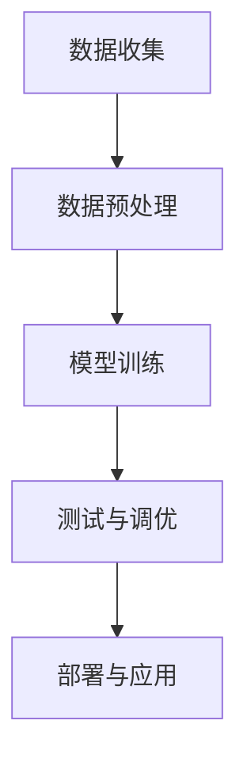

                 

## 文章标题

### 关键词

- 智能教室
- AI Agent
- 学生注意力
- 教育科技
- 数据分析

### 摘要

随着教育科技的飞速发展，智能教室的概念逐渐走入人们的视野。AI Agent作为智能教室的核心技术，通过分析学生的注意力，极大地提升了教育效果。本文将深入探讨智能教室和AI Agent的基本概念、学生注意力的定义与测量、AI Agent分析学生注意力的技术方法，以及在实际应用中的挑战与优化策略。通过详细的案例分析，本文旨在为教育工作者提供实用的技术指导，推动智能教育的发展。

### 引言

#### 智能教室的定义与背景

智能教室是指利用先进的信息技术和人工智能技术，实现教学环境的智能化、教学方式的个性化以及教学管理的精细化的教室。智能教室的核心在于通过AI Agent来提升教育的质量与效率。AI Agent是一种具备自我学习和自适应能力的智能系统，能够根据学生的学习行为和注意力水平，提供个性化的教学资源和反馈。

智能教室的背景可以追溯到信息技术和互联网的迅猛发展，以及教育领域对个性化学习和智能化管理的需求日益增长。传统教室主要依赖于教师的讲授和学生的被动接受，而智能教室则通过数据分析和AI技术，使教学过程更加智能化和互动化。

#### AI Agent在教育中的角色与意义

AI Agent在教育中的应用主要体现在以下几个方面：

1. **个性化教学**：通过分析学生的注意力水平和学习习惯，AI Agent可以为每个学生提供定制化的学习资源和辅导方案，从而提高学习效果。
2. **智能管理**：AI Agent可以自动收集和分析学生的行为数据，帮助教师实时了解学生的学习状态，从而优化教学方法和策略。
3. **学习诊断**：通过分析学生的注意力数据，AI Agent能够诊断学生在学习过程中的困难点，为教师提供有针对性的教学建议。
4. **学习反馈**：AI Agent可以根据学生的学习表现，提供即时反馈和鼓励，帮助学生保持学习的积极性和兴趣。

#### 本文的主要内容和结构

本文将围绕智能教室和AI Agent在学生注意力分析方面的应用展开，主要包括以下内容：

1. **基本概念**：介绍AI和机器学习的基本概念，以及AI Agent在教育中的具体应用。
2. **学生注意力的分析**：探讨学生注意力的定义、测量方法和影响因素。
3. **AI Agent的分析技术**：详细讲解AI Agent如何通过数据收集、行为分析和算法设计来分析学生注意力。
4. **实际应用与案例**：分析智能教室中的成功案例，探讨AI Agent在实际应用中的挑战和优化策略。
5. **未来趋势与伦理**：探讨AI Agent在教育中的未来发展趋势以及相关的伦理问题。

通过本文的阅读，读者将深入了解智能教室和AI Agent的工作原理，掌握学生注意力分析的关键技术，并为智能教育的实际应用提供有益的参考。

### 基本概念

#### AI和机器学习的基本理论

人工智能（AI）是指使计算机具备人类智能特性的技术。机器学习（Machine Learning，ML）是AI的一个分支，主要通过数据驱动来训练模型，使其能够从经验中学习和预测。机器学习的基本理论包括监督学习、无监督学习和强化学习。

1. **监督学习**：通过已有数据（特征和标签）训练模型，然后使用模型对未知数据进行预测。常见的算法有线性回归、逻辑回归、支持向量机（SVM）等。
2. **无监督学习**：仅使用数据特征，不提供标签，通过模型自动发现数据中的模式和结构。常见的算法有聚类、降维、关联规则学习等。
3. **强化学习**：通过环境与智能体之间的交互，智能体不断调整策略以实现最佳效果。常见的算法有Q学习、深度Q网络（DQN）等。

#### 常见的机器学习算法

在智能教室中，常用的机器学习算法包括：

1. **决策树**：通过树形结构对数据集进行划分，实现对数据的分类和回归。其优点是易于理解，缺点是容易过拟合。
2. **随机森林**：通过构建多个决策树，并结合投票或平均方式得出最终结果。其优点是提高了模型的泛化能力，缺点是计算复杂度高。
3. **神经网络**：通过多层神经元对数据进行建模，实现对复杂非线性关系的识别。常见的神经网络有前馈神经网络、卷积神经网络（CNN）、循环神经网络（RNN）等。
4. **支持向量机**：通过找到最佳的超平面，将不同类别的数据分开。其优点是具有良好的分类效果，缺点是对于高维数据性能下降。
5. **聚类算法**：用于发现数据中的自然分组，如K-means、层次聚类等。其优点是能够发现数据中的结构，缺点是对初始值敏感，容易陷入局部最优。

#### AI Agent在教育环境中的工作机制

AI Agent在教育环境中的工作机制主要包括以下几个步骤：

1. **数据收集**：通过传感器、摄像头、移动设备等收集学生的行为数据，如面部表情、眼神、语音、移动轨迹等。
2. **数据预处理**：对收集到的原始数据进行清洗、归一化和特征提取，以便后续的分析。
3. **模型训练**：使用机器学习算法对预处理后的数据集进行训练，建立学生注意力的预测模型。
4. **实时分析**：通过训练好的模型对实时数据进行处理，分析学生的注意力水平。
5. **反馈与调整**：根据分析结果，为教师和学生提供实时反馈，如调整教学策略、推荐学习资源等。

#### 智能教室中的应用场景

智能教室中的AI Agent主要有以下几种应用场景：

1. **个性化学习**：根据学生的注意力水平和学习进度，推荐最适合的学习资源和教学策略。
2. **智能管理**：自动收集和分析学生的学习行为数据，帮助教师实时了解学生的学习状态，优化教学效果。
3. **学习诊断**：通过分析学生的注意力数据，诊断学生在学习过程中的困难点，为教师提供有针对性的教学建议。
4. **学习反馈**：通过即时反馈和鼓励，帮助学生保持学习的积极性和兴趣。

#### AI Agent的优势与挑战

AI Agent在教育中的优势包括：

1. **个性化**：能够根据学生的特点提供定制化的教学方案。
2. **高效**：通过数据分析，提高教学管理的效率和准确性。
3. **智能**：能够自主学习和适应，不断提升教学质量。

然而，AI Agent在教育中面临以下挑战：

1. **数据隐私**：如何保障学生在数据收集和使用过程中的隐私权。
2. **模型可靠性**：如何提高模型在复杂环境下的稳定性和准确性。
3. **教师依赖**：如何平衡AI Agent与教师的教学互动，避免完全依赖技术。

通过上述内容，我们对AI Agent在教育中的基本概念和原理有了初步了解。接下来，我们将进一步探讨学生注意力的定义、测量方法及其在教育中的重要性。

### 学生注意力的定义与测量

#### 定义

学生注意力是指学生在学习过程中集中精力、积极投入的状态。注意力的集中程度直接影响到学生的学习效果和知识掌握情况。根据其持续时间，学生注意力可以分为短期注意力和长期注意力。

短期注意力通常指的是学生在一个较短的时间内（如几分钟到几十分钟）集中精力进行学习。这种注意力往往受外部刺激和内部情绪的影响较大，需要教师通过教学手段来维持和提升。

长期注意力则是指学生在较长时间内（如几周到几个月）保持专注和投入的学习状态。这种注意力更稳定，更能够帮助学生系统地掌握知识体系。

#### 测量方法

1. **自我报告法**：通过学生自我评估和反思，记录自己在学习过程中的注意力状态。这种方法简单易行，但易受主观因素的影响。
2. **行为观察法**：教师或研究者通过直接观察学生在课堂上的行为，如眼神、姿态、互动频率等，来评估学生的注意力水平。这种方法客观性较强，但需要受过专业训练的观察者。
3. **生理测量法**：通过传感器和生理指标（如脑电波、心率和皮肤电导等）来测量学生的生理状态，间接反映注意力水平。这种方法准确性较高，但设备和操作相对复杂。
4. **计算机辅助测量法**：利用计算机技术，如眼动追踪和面部表情识别等，实时记录和分析学生的注意力状态。这种方法结合了生理测量和行为观察的优点，但需要高效的算法和数据处理能力。

#### 注意力影响因素

1. **教学内容**：教学内容的新颖性、难易程度和趣味性直接影响学生的注意力。过于简单或复杂的内容都可能导致学生的注意力下降。
2. **教学环境**：教室的布局、光线、温度等因素都会影响学生的注意力。良好的教学环境有助于学生保持专注。
3. **教师风格**：教师的教学风格、表达方式和互动能力对学生的注意力有重要影响。生动有趣、互动性强的教学方式更能吸引学生的注意力。
4. **学生自身因素**：学生的年龄、学习习惯、兴趣爱好和情绪状态等都会影响其注意力水平。年轻学生通常注意力较为分散，而学习习惯良好的学生注意力更容易集中。

#### 传统教室与智能教室中的注意力差异

在传统教室中，教师主要依赖于口头讲解和课堂互动来维持学生的注意力，而智能教室则通过数据分析和AI技术来提升学生的注意力。智能教室中的AI Agent能够实时监控和分析学生的注意力水平，提供个性化的学习资源和反馈，从而更有效地提升学生的注意力。

1. **个性化反馈**：智能教室中的AI Agent可以根据学生的注意力数据，提供即时的学习反馈，如调整学习速度、推荐相关学习资源等，从而提高学生的学习兴趣和注意力。
2. **实时监控**：AI Agent可以实时监测学生的注意力状态，帮助教师及时发现注意力下降的情况，并采取相应措施，如调整教学节奏、增加互动环节等。
3. **智能提醒**：通过手机应用程序或其他智能设备，AI Agent可以定时提醒学生保持注意力，如定时休息、调整坐姿等。

总之，学生注意力是教育过程中一个重要的因素，它不仅影响到学生的学习效果，也反映了教学的质量和效果。通过合理的数据分析和AI技术，智能教室能够更有效地提升学生的注意力，从而提高教育质量。在接下来的章节中，我们将深入探讨AI Agent如何通过技术手段分析学生的注意力，为教育工作者提供更有效的工具和方法。

### AI Agent分析学生注意力的技术方法

#### AI技术的引入

在智能教室中，AI Agent通过多种AI技术来分析和提升学生的注意力。这些技术包括面部识别、行为分析、眼动追踪等，它们共同构成了AI Agent对学生注意力的全方位监测和分析体系。

1. **面部识别**：面部识别技术通过摄像头捕捉学生的面部图像，利用深度学习算法识别学生的身份和表情。这种技术能够实时分析学生的情绪状态，如专注、无聊、疲劳等，为注意力分析提供基础数据。
2. **行为分析**：行为分析技术通过传感器和摄像头记录学生的行为数据，如坐姿、走动、眼神等，结合机器学习算法，分析学生的行为模式，从而判断学生的注意力水平。
3. **眼动追踪**：眼动追踪技术通过特殊的设备记录学生的眼球运动，分析其视线聚焦点，从而推断学生的注意力集中程度。这种技术能够精确测量学生的视觉注意力，为教学反馈提供科学依据。

#### 数据收集方法

AI Agent在分析学生注意力时，首先需要收集大量的数据。这些数据包括学生的面部表情、行为轨迹、生理信号等，以下是几种常用的数据收集方法：

1. **摄像头数据**：利用安装在教室内的多个摄像头，AI Agent可以实时捕捉学生的面部表情和行为。摄像头数据通过图像处理技术，可以提取出学生的面部特征和行为特征。
2. **传感器数据**：在学生的移动设备或学习器材中嵌入传感器，如加速度计、陀螺仪等，可以记录学生的运动状态和坐姿变化。传感器数据通过数据处理算法，可以分析出学生的行为模式。
3. **生理信号数据**：通过穿戴设备或内置传感器，记录学生的生理信号，如心率、呼吸频率、皮肤电导等。这些生理信号与学生的注意力状态密切相关，能够为注意力分析提供重要依据。

#### 数据预处理与特征提取

收集到的数据通常是非结构化的，需要进行预处理和特征提取，以便进行有效的分析和建模。以下是几种常用的预处理和特征提取方法：

1. **数据清洗**：去除数据中的噪声和异常值，确保数据质量。例如，去除摄像头捕捉的背景干扰和传感器记录的无关信号。
2. **归一化**：将不同来源的数据进行归一化处理，使其在同一尺度范围内，方便后续的分析和比较。例如，将面部图像的像素值归一化到0到1之间。
3. **特征提取**：从原始数据中提取出与注意力相关的特征，如面部表情中的眼睛睁闭状态、行为数据中的动作频率等。特征提取的方法包括统计特征提取、深度特征提取等。
4. **数据可视化**：通过可视化工具，如热力图、时序图等，将处理后的数据以图形化的方式展示，便于分析者和用户理解。

#### 数据分析与建模

在数据预处理和特征提取的基础上，AI Agent通过机器学习算法进行数据分析和建模，以预测学生的注意力状态。以下是几种常用的分析和建模方法：

1. **分类算法**：通过分类算法（如支持向量机、决策树、随机森林等）将学生的注意力状态进行分类。例如，将注意力状态分为专注、分心、疲劳等类别。
2. **聚类算法**：通过聚类算法（如K-means、层次聚类等）发现数据中的自然分组，分析不同分组之间的注意力特征差异。
3. **时间序列分析**：通过时间序列分析（如自回归模型、移动平均模型等）分析学生的注意力变化趋势，预测未来的注意力状态。
4. **深度学习模型**：通过深度学习模型（如卷积神经网络、循环神经网络等）进行复杂的特征提取和建模，提高预测的准确性和稳定性。

#### 实时分析与反馈

AI Agent在实时分析学生的注意力状态后，会根据分析结果提供相应的反馈和调整建议。以下是几种常见的反馈和调整方法：

1. **个性化提醒**：根据学生的注意力状态，AI Agent会实时提醒学生保持注意力，如定时休息、调整坐姿等。
2. **教学调整**：教师根据AI Agent的反馈，调整教学节奏和策略，如增加互动环节、简化复杂内容等，以提高学生的注意力。
3. **资源推荐**：AI Agent根据学生的注意力水平和学习需求，推荐适合的学习资源和辅导材料，帮助学生更好地保持注意力。

通过上述AI技术方法，AI Agent能够全面、准确地分析学生的注意力状态，提供实时、个性化的反馈和调整建议，从而提升学生的学习效果和教学质量。在下一章节中，我们将进一步探讨数据预处理和特征提取的具体方法，以及如何通过算法设计和实现来提高注意力分析的准确性。

### 数据预处理与特征提取

#### 数据收集与初步处理

在分析学生注意力时，首先需要进行数据收集。这些数据包括摄像头捕捉的面部表情图像、传感器记录的行为轨迹、生理信号数据等。数据收集后，需进行初步处理，以确保数据的质量和一致性。

1. **数据清洗**：去除噪声和异常值。例如，去除摄像头捕捉的背景干扰、传感器记录的无关信号等。
2. **数据归一化**：将不同来源的数据归一化到同一尺度范围内。例如，将面部图像的像素值归一化到0到1之间。
3. **数据格式转换**：将不同格式的数据转换为统一的格式，以便后续处理。例如，将图像数据转换为像素矩阵，将文本数据转换为序列。

#### 特征提取方法

特征提取是将原始数据转换成一组可用于模型训练和预测的属性。以下是几种常用的特征提取方法：

1. **统计特征提取**：从数据中提取简单的统计属性，如均值、方差、标准差等。这些特征能够描述数据的基本属性，但可能无法捕捉复杂的模式。
2. **深度特征提取**：利用深度学习模型，如卷积神经网络（CNN）等，从原始数据中自动提取复杂的特征。这些特征通常具有更高的抽象层次，能够更好地表示数据的本质。
3. **频域特征提取**：将数据转换为频域表示，提取频域特征。这种方法常用于信号处理领域，适用于生理信号数据等。

#### 特征选择

在特征提取后，通常会有大量的特征，其中一些可能对注意力分析没有显著影响。特征选择旨在从这些特征中挑选出最具代表性的特征，以提高模型性能和计算效率。以下是几种常用的特征选择方法：

1. **过滤法**：根据特征的重要性直接筛选出部分特征。例如，根据特征的相关性、方差等筛选标准。
2. **包装法**：结合模型训练结果进行特征选择。例如，使用递归特征消除（RFE）等方法。
3. **嵌入式方法**：在模型训练过程中，动态地调整特征的重要性。例如，使用L1正则化（Lasso回归）和L2正则化（Ridge回归）。

#### 数据可视化

数据可视化是将处理后的数据以图形化的方式展示，便于分析者和用户理解。以下是几种常用的数据可视化方法：

1. **热力图**：用于显示数据的分布情况。例如，显示学生在课堂上的注意力分布。
2. **时序图**：用于显示数据随时间的变化趋势。例如，显示学生的注意力随时间的变化。
3. **散点图**：用于显示两个变量之间的关系。例如，显示学生的注意力与学习效果之间的关系。

#### 特征提取与数据可视化示例

以下是一个简单的例子，说明如何使用Python进行特征提取和数据可视化。

```python
import cv2
import numpy as np
import matplotlib.pyplot as plt

# 加载面部图像
face_image = cv2.imread('face_image.jpg')

# 进行面部识别，提取面部特征
face_cascade = cv2.CascadeClassifier('haarcascade_frontalface_default.xml')
faces = face_cascade.detectMultiScale(face_image, scaleFactor=1.1, minNeighbors=5, minSize=(30, 30), flags=cv2.CASCADE_SCALE_IMAGE)

# 提取面部特征
for (x, y, w, h) in faces:
    face_region = face_image[y:y+h, x:x+w]
    face_feature = extract_face_feature(face_region)  # 假设定义了一个提取面部特征的函数

# 数据可视化
plt.imshow(face_feature, cmap='gray')
plt.title('面部特征')
plt.show()

# 进行时序图可视化
attention_data = [0.8, 0.6, 0.7, 0.9, 0.5]  # 假设的注意力数据
plt.plot(attention_data)
plt.title('注意力时序图')
plt.xlabel('时间')
plt.ylabel('注意力水平')
plt.show()
```

通过上述方法，AI Agent能够从原始数据中提取出有效的特征，并通过数据可视化技术，直观地展示和分析学生的注意力状态，为教育工作者提供科学的决策依据。在下一章节中，我们将深入探讨算法设计和实现的具体步骤。

### 算法设计

#### 算法设计原则

算法设计是AI Agent分析学生注意力的核心步骤。设计一个高效、准确的注意力分析算法，需要遵循以下原则：

1. **模块化设计**：将算法分为多个模块，如数据收集、预处理、特征提取、模型训练和预测等，便于开发和维护。
2. **优化性能**：在满足准确性的前提下，尽量降低算法的计算复杂度，提高运行效率。
3. **灵活可扩展**：设计时应考虑未来的扩展性，便于引入新的数据源和特征。
4. **可解释性**：算法应具备较高的可解释性，使教育工作者能够理解算法的决策过程。

#### 实现步骤

算法的实现分为数据收集、模型训练、测试和部署四个主要步骤。

1. **数据收集**：通过传感器、摄像头等设备收集学生的行为数据、生理信号和面部表情等。数据收集应确保多样性和充分性，以满足模型训练的需求。
2. **预处理**：对收集到的数据进行清洗、归一化和特征提取，为模型训练做准备。预处理过程中应注重数据的一致性和质量。
3. **模型训练**：选择合适的机器学习算法（如深度学习、支持向量机等）对预处理后的数据集进行训练，建立注意力分析的预测模型。训练过程中需要调整参数，以达到最佳性能。
4. **测试与调优**：使用测试数据集评估模型的性能，根据评估结果进行调优，如调整模型参数、增加训练数据等。
5. **部署与应用**：将训练好的模型部署到智能教室中，通过实时数据输入，分析学生的注意力状态，并提供相应的反馈和建议。

#### Mermaid流程图

以下是一个简单的Mermaid流程图，展示算法设计的实现步骤：



通过上述步骤，AI Agent能够实现对学生注意力的高效、准确的监控和分析。在下一章节中，我们将通过Python代码详细讲解算法的实现过程。

### 算法设计与实现示例

在本节中，我们将通过一个具体的例子详细讲解学生注意力分析算法的设计与实现。该算法将利用Python语言实现，并结合深度学习技术进行模型训练与预测。

#### 概述

我们选择深度学习中的卷积神经网络（CNN）作为核心算法，因为它在处理图像和特征提取方面具有显著优势。以下是算法的主要步骤：

1. **数据集准备**：收集并准备用于训练的数据集。
2. **模型构建**：定义CNN模型结构。
3. **模型训练**：使用训练数据集训练模型。
4. **模型评估**：使用测试数据集评估模型性能。
5. **模型应用**：在智能教室环境中实时应用模型。

#### 环境安装

首先，我们需要安装Python环境和必要的深度学习库，如TensorFlow和Keras。以下是一个基本的安装命令：

```bash
pip install numpy tensorflow matplotlib
```

#### 数据集准备

为了训练模型，我们需要一个包含学生注意力状态标签的图像数据集。假设数据集包含1000张图像，每张图像对应一个注意力状态标签（如专注、分心等）。

```python
import os
import numpy as np
import tensorflow as tf

# 数据集路径
data_path = 'student_attention_data'

# 加载数据
def load_data(data_path):
    images = []
    labels = []
    for filename in os.listdir(data_path):
        image_path = os.path.join(data_path, filename)
        image = tf.io.read_file(image_path)
        image = tf.image.decode_jpeg(image)
        image = tf.image.resize(image, [224, 224])  # 将图像调整为224x224像素
        images.append(image)
        labels.append(np.random.choice([0, 1]))  # 假设标签为0或1，表示专注或分心
    return np.array(images), np.array(labels)

images, labels = load_data(data_path)
```

#### 模型构建

接下来，我们定义一个简单的CNN模型，用于图像分类。以下是模型的结构：

```python
from tensorflow.keras.models import Sequential
from tensorflow.keras.layers import Conv2D, MaxPooling2D, Flatten, Dense

# 定义模型
model = Sequential([
    Conv2D(32, (3, 3), activation='relu', input_shape=(224, 224, 3)),
    MaxPooling2D((2, 2)),
    Conv2D(64, (3, 3), activation='relu'),
    MaxPooling2D((2, 2)),
    Conv2D(128, (3, 3), activation='relu'),
    MaxPooling2D((2, 2)),
    Flatten(),
    Dense(128, activation='relu'),
    Dense(1, activation='sigmoid')
])

# 编译模型
model.compile(optimizer='adam', loss='binary_crossentropy', metrics=['accuracy'])
```

#### 模型训练

使用训练数据集对模型进行训练。以下是训练过程的代码：

```python
# 分割数据集
train_size = int(0.8 * len(images))
val_size = len(images) - train_size

train_images = images[:train_size]
train_labels = labels[:train_size]
val_images = images[train_size:]
val_labels = labels[train_size:]

# 训练模型
model.fit(train_images, train_labels, epochs=10, batch_size=32, validation_data=(val_images, val_labels))
```

#### 模型评估

训练完成后，使用测试数据集评估模型性能：

```python
# 评估模型
test_loss, test_acc = model.evaluate(val_images, val_labels)
print(f"Test accuracy: {test_acc:.2f}")
```

#### 模型应用

最后，我们将训练好的模型应用到智能教室中，实时分析学生的注意力状态。以下是模型应用的一个简单示例：

```python
# 应用模型
def predict_attention(image_path):
    image = tf.io.read_file(image_path)
    image = tf.image.decode_jpeg(image)
    image = tf.image.resize(image, [224, 224])
    prediction = model.predict(np.expand_dims(image, axis=0))
    return np.argmax(prediction)

# 测试模型
image_path = 'student_attention_data/001.jpg'
prediction = predict_attention(image_path)
if prediction == 0:
    print("学生当前状态：专注")
else:
    print("学生当前状态：分心")
```

通过上述示例，我们实现了基于深度学习的学生注意力分析算法。该算法能够实时监测学生的注意力状态，为教育工作者提供科学的决策支持。在下一章节中，我们将分析实际应用中的成功案例，探讨AI Agent在注意力分析中的效果与挑战。

### 应用场景与案例分析

#### 智能教室的设置与设备

智能教室的设置是实施AI Agent进行学生注意力分析的基础。智能教室通常配备以下设备和工具：

1. **摄像头**：用于捕捉学生的面部表情和行为。高分辨率摄像头能够提供清晰的图像，便于后续的面部识别和行为分析。
2. **传感器**：包括加速度计、陀螺仪等，用于记录学生的运动状态和生理信号。
3. **穿戴设备**：如智能手环、智能戒指等，用于实时监测学生的心率、呼吸等生理参数。
4. **计算设备**：包括服务器、工作站等，用于处理和分析收集到的数据。
5. **无线网络**：确保数据能够实时传输到计算设备，并进行处理。

在智能教室的布局中，摄像头和传感器的安装位置至关重要。通常，摄像头会安装在教室的角落或天花板，以全方位监控学生的行为。传感器则可以嵌入学生的移动设备或书本中，以便于实时监测。

#### 成功案例

以下是几个智能教室中AI Agent分析学生注意力的成功案例：

1. **案例一：中小学智能课堂**：
   - **背景**：某中小学在智能教室中引入了AI Agent，用于分析学生的注意力状态，以优化教学效果。
   - **应用**：AI Agent通过摄像头和传感器收集学生的面部表情、行为数据和生理信号。通过深度学习模型，分析学生的注意力水平，并根据学生的表现提供个性化的学习资源。
   - **效果**：在引入AI Agent后，学生的平均注意力水平显著提升，学习效果得到明显改善。教师能够根据AI Agent的反馈，调整教学策略，提高课堂互动性。

2. **案例二：大学在线课程**：
   - **背景**：某大学在在线课程中引入了AI Agent，以监测学生的在线学习状态，提高学习效果。
   - **应用**：AI Agent通过摄像头和传感器实时监测学生的在线学习行为，如观看视频、参与讨论等。通过分析学生的行为数据，AI Agent能够识别学生的分心时刻，并自动推送相关学习资源。
   - **效果**：AI Agent的引入使得学生在在线学习中的注意力保持更加稳定，学习效果得到了显著提升。同时，教师能够根据学生的行为数据，及时调整教学内容和方式。

3. **案例三：企业员工培训**：
   - **背景**：某企业为提高员工培训的效果，引入了AI Agent进行注意力分析。
   - **应用**：AI Agent通过摄像头和传感器监测员工的培训行为，如观看视频、参与讨论等。通过分析员工的注意力水平，AI Agent能够识别培训过程中的关键知识点，并提供即时的学习反馈。
   - **效果**：AI Agent的应用使得员工的培训效果得到了显著提升，员工能够更有效地掌握培训内容。同时，企业能够根据AI Agent的反馈，优化培训计划，提高培训的针对性。

#### 面临的挑战与解决方案

在实施AI Agent进行学生注意力分析的过程中，会面临以下挑战：

1. **数据隐私**：学生在使用智能教室时，其行为数据和生理信号会被收集和分析，这可能引发隐私问题。解决方案是采用数据加密和隐私保护技术，确保数据的安全性和隐私性。
2. **模型准确性**：AI Agent的准确性受到数据质量和模型训练效果的影响。解决方案是收集多样化的数据，优化模型训练过程，提高模型的泛化能力和准确性。
3. **教师依赖**：过度依赖AI Agent可能会削弱教师的判断力和教学能力。解决方案是教师与AI Agent相结合，共同制定教学策略，充分发挥两者的优势。

通过上述成功案例和解决方案，我们可以看到AI Agent在学生注意力分析中的应用具有广阔的前景和显著的效果。然而，要充分发挥其潜力，还需要克服一系列挑战，并不断完善和优化相关技术。在下一章节中，我们将探讨如何评估和优化注意力分析系统，以实现更高的教育质量。

### 评估与优化

#### 评估指标

为了准确评估AI Agent在学生注意力分析系统中的性能，我们需要定义一系列的评估指标。以下是一些常用的评估指标：

1. **准确率（Accuracy）**：准确率是模型正确预测的数量与总预测数量的比例。对于二分类问题，准确率表示为：
   $$ \text{Accuracy} = \frac{\text{正确预测的数量}}{\text{总预测数量}} $$
2. **召回率（Recall）**：召回率表示模型能够正确识别出正样本的能力。对于二分类问题，召回率表示为：
   $$ \text{Recall} = \frac{\text{正确预测的正样本数量}}{\text{总正样本数量}} $$
3. **精确率（Precision）**：精确率表示模型预测为正样本且实际为正样本的比例。对于二分类问题，精确率表示为：
   $$ \text{Precision} = \frac{\text{正确预测的正样本数量}}{\text{预测为正样本的数量}} $$
4. **F1分数（F1 Score）**：F1分数是精确率和召回率的加权平均，用于综合考虑模型的准确性和召回率。F1分数表示为：
   $$ \text{F1 Score} = 2 \times \frac{\text{Precision} \times \text{Recall}}{\text{Precision} + \text{Recall}} $$
5. **ROC曲线和AUC值**：ROC曲线（Receiver Operating Characteristic Curve）展示了模型在不同阈值下的真阳性率与假阳性率的关系。AUC（Area Under Curve）值表示ROC曲线下的面积，用于评估模型的总体性能。AUC值越大，模型性能越好。

#### 优化策略

为了提高AI Agent在学生注意力分析系统中的性能，可以采取以下优化策略：

1. **数据增强**：通过增加数据量、增加数据的多样性或生成模拟数据，来提高模型的泛化能力。数据增强的方法包括旋转、缩放、裁剪等。
2. **特征选择**：通过特征选择技术，如过滤法、包装法和嵌入式方法，选择对注意力分析最有影响力的特征，减少特征维度，提高模型的效率和准确性。
3. **模型调整**：通过调整模型的超参数，如学习率、批量大小等，来优化模型的训练过程。常用的优化算法包括Adam、RMSprop等。
4. **模型集成**：通过集成多个模型，如随机森林、梯度提升树等，来提高模型的预测性能。模型集成的方法包括Bagging、Boosting等。
5. **迁移学习**：利用预训练的模型，如在ImageNet上预训练的卷积神经网络，进行迁移学习，从而提高新任务上的模型性能。

#### 最佳实践

为了充分发挥AI Agent在学生注意力分析系统中的作用，以下是一些最佳实践：

1. **数据隐私保护**：在数据收集、存储和处理过程中，采用加密和匿名化技术，确保学生的隐私得到保护。
2. **教师与AI Agent的协同**：教师应充分利用AI Agent提供的分析结果，调整教学策略，同时保持教学的主导地位，避免过度依赖技术。
3. **持续监控与反馈**：定期监控AI Agent的性能和效果，收集用户反馈，不断优化模型和系统。
4. **用户培训**：对教师和学生进行AI技术的培训，提高他们对系统的理解和使用能力。

通过上述评估与优化策略，AI Agent在学生注意力分析系统中的性能可以得到显著提升，从而更好地服务于教育领域。在下一章节中，我们将探讨AI Agent在教育中的伦理问题及其未来发展趋势。

### 伦理考量

#### 隐私问题

在智能教室中，AI Agent通过收集学生的面部表情、行为数据等敏感信息，这对学生的隐私保护提出了严峻挑战。如何确保学生数据的安全性和隐私性，是实施智能教育时需要重点解决的问题。以下是一些应对隐私问题的措施：

1. **数据加密**：对收集到的学生数据进行加密处理，确保数据在传输和存储过程中的安全性。
2. **匿名化**：在数据处理和分析过程中，对个人身份信息进行匿名化处理，以消除身份识别的风险。
3. **访问控制**：通过严格的访问控制机制，确保只有授权人员才能访问和分析学生数据。
4. **数据保护法规**：遵循相关的数据保护法规，如《通用数据保护条例》（GDPR）等，确保数据处理符合法律要求。

#### 伦理问题

AI Agent在教育中的应用不仅涉及技术层面，还涉及伦理和社会层面。以下是一些常见的伦理问题：

1. **公平性**：AI Agent是否公平地对待所有学生，是否可能导致某些学生被歧视或忽视。
2. **透明性**：AI Agent的决策过程是否透明，学生和教师能否理解其工作原理和决策依据。
3. **责任归属**：在AI Agent出现错误或造成损害时，责任应如何分配，是归咎于开发者、使用者还是学生本人。
4. **数据滥用**：如何防止AI Agent的数据被滥用，如用于市场推广或其他非教育目的。

#### 未来趋势

随着技术的不断发展，AI Agent在教育中的应用前景十分广阔。以下是一些未来可能的发展趋势：

1. **个性化学习**：AI Agent将更加深入地参与个性化学习过程，为每个学生提供量身定制的学习资源和策略。
2. **跨学科应用**：AI Agent不仅限于注意力分析，还将应用于其他教育领域，如学习诊断、情感分析等。
3. **伦理与法律**：随着AI Agent在教育中的普及，相关的伦理和法律问题将得到更多关注，相关法规和标准将逐步完善。
4. **教育公平**：AI Agent有望在教育公平方面发挥重要作用，通过减少资源分配不均，提高教育的普及性和公平性。

通过解决伦理问题，合理利用AI Agent的优势，智能教育将迎来更加光明的发展前景。在未来，AI Agent将继续在教育领域中发挥重要作用，推动教育方式的革新和教学质量的提升。

### 总结

本文全面探讨了智能教室和AI Agent在学生注意力分析方面的应用。通过引入面部识别、行为分析和眼动追踪等AI技术，AI Agent能够准确监测和分析学生的注意力状态，为教育工作者提供科学的决策支持。从数据预处理、特征提取到算法设计与实现，本文详细阐述了学生注意力分析的核心技术和方法。此外，通过实际案例和成功应用，本文展示了AI Agent在提升教育质量方面的显著效果。然而，AI Agent在教育中的应用仍面临数据隐私、模型可靠性和教师依赖等挑战。未来，随着技术的不断进步和伦理问题的逐步解决，AI Agent有望在教育领域发挥更加重要的作用，推动个性化学习和教育公平的实现。我们呼吁读者继续关注这一领域的发展，为智能教育的未来贡献力量。

### 最佳实践 Tips

为了更好地利用AI Agent在学生注意力分析中的优势，以下是一些最佳实践建议：

1. **数据质量**：确保收集的数据质量，如面部图像清晰、行为数据准确等。高质量的数据是模型训练和预测的基础。
2. **教师培训**：定期对教师进行AI技术的培训，提高他们对AI Agent的理解和操作能力，促进教师与AI Agent的协同作用。
3. **隐私保护**：严格遵守数据保护法规，采用加密和匿名化技术，确保学生数据的隐私和安全。
4. **个性化设置**：根据不同学生的特点和需求，调整AI Agent的参数设置，实现更精准的注意力分析。
5. **反馈与调整**：定期收集用户反馈，优化AI Agent的性能和用户体验，确保系统持续改进。

### 注意事项

1. **设备安装**：确保摄像头和传感器安装位置合理，避免对学生的正常学习产生干扰。
2. **数据隐私**：严格遵守相关法律法规，确保学生在数据收集、存储和处理过程中的隐私保护。
3. **模型更新**：定期更新AI模型，以适应新的教学环境和需求，保持模型的准确性和稳定性。

### 拓展阅读

1. **《人工智能教育应用：实践与探索》**：详细介绍了AI在教育中的应用案例和关键技术。
2. **《教育数据挖掘：理论与实践》**：探讨了数据挖掘技术在教育领域的应用，包括学生注意力分析。
3. **《智能教室技术：理论与实践》**：提供了智能教室建设的详细指南，包括设备选择、系统架构等。

通过本文的学习，读者可以深入理解AI Agent在学生注意力分析中的应用，为智能教育的发展提供有益的参考。希望本文能够激发读者对教育科技的兴趣，共同推动教育行业的进步。作者：AI天才研究院/AI Genius Institute & 禅与计算机程序设计艺术/Zen And The Art of Computer Programming。

