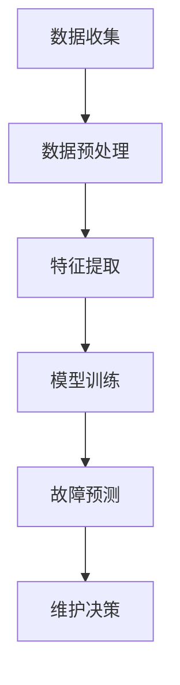
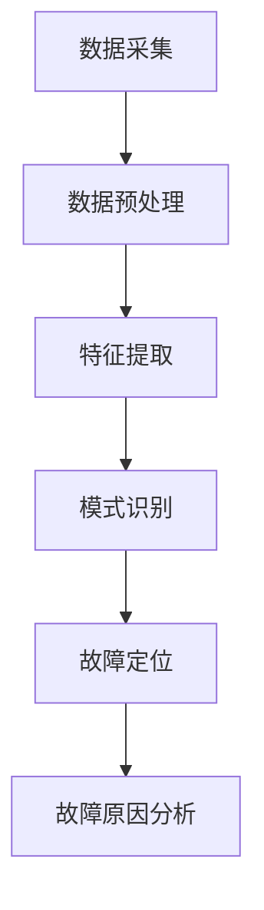
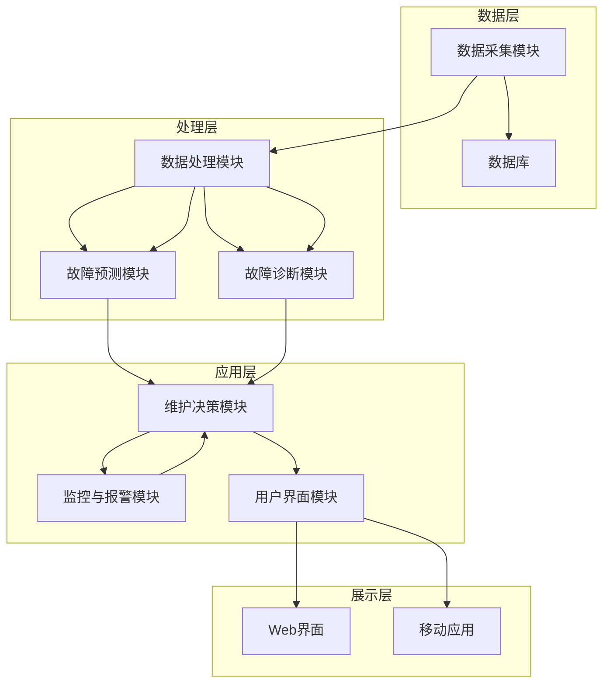
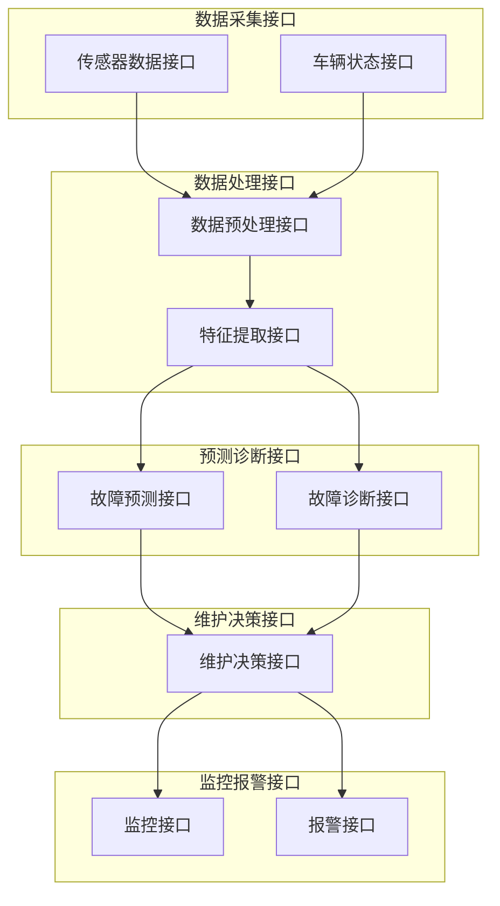
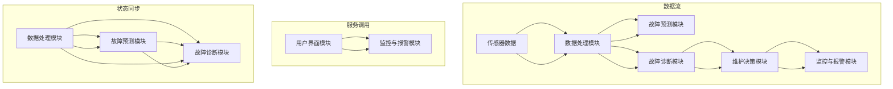

                 

### 第1章：智能汽车与AI Agent概述

#### 1.1 智能汽车的发展背景

智能汽车，作为一种融合了信息技术、自动化技术、人工智能技术的先进交通工具，正逐步改变着我们的出行方式。智能汽车的概念可以追溯到20世纪90年代，随着计算机技术的飞速发展，智能汽车的研究和开发逐渐成为学术界和工业界关注的焦点。

在早期，智能汽车主要是以辅助驾驶系统为主，如自动制动、车道保持、自适应巡航等。随着传感器技术的进步，特别是雷达、激光雷达、摄像头等传感器的应用，使得智能汽车对周围环境的感知能力大大增强。近年来，随着深度学习、神经网络等人工智能技术的发展，自动驾驶技术逐渐成为智能汽车的核心竞争力。

当前，全球多个国家和地区都在积极推进智能汽车的研究与商业化应用。例如，美国的特斯拉、谷歌、百度的自动驾驶项目取得了显著进展；德国的奔驰、宝马等汽车厂商也在智能汽车领域投入大量资源；我国政府也在《新一代人工智能发展规划》中明确提出要加快智能汽车的研发和产业化进程。

#### 1.2 AI在汽车中的应用现状

人工智能技术在汽车中的应用日益广泛，已经成为汽车产业转型升级的重要驱动力。以下是AI在汽车中应用的几个主要方面：

1. **自动驾驶系统**：自动驾驶是智能汽车最为引人瞩目的应用。自动驾驶系统利用计算机视觉、雷达、激光雷达等多种传感器，结合深度学习和强化学习算法，实现车辆的自动感知、决策和执行。当前，自动驾驶系统已经从L2级（部分自动驾驶）向L3级（有条件自动驾驶）和L4级（高度自动驾驶）发展。

2. **智能辅助驾驶系统**：智能辅助驾驶系统包括自适应巡航控制、自动紧急制动、盲点监测等功能。这些系统利用AI算法，通过实时分析车辆状态和周围环境，提高驾驶安全性和舒适性。

3. **车联网技术**：车联网（V2X）技术通过车辆与车辆、车辆与基础设施之间的通信，实现车辆间的信息共享和协同控制，从而提高交通效率和安全性。

4. **智能语音助手**：智能语音助手通过自然语言处理技术，实现与驾驶员的语音交互，提供导航、音乐播放、天气查询等服务。

5. **故障诊断与预测性维护**：利用机器学习算法，对车辆运行数据进行分析，实现故障诊断和预测性维护，减少车辆故障率和维修成本。

#### 1.3 预测性维护与故障诊断的重要性

预测性维护和故障诊断是智能汽车中至关重要的应用领域。随着智能汽车系统越来越复杂，传统定期维护和被动故障修复的方法已经无法满足需求。预测性维护和故障诊断可以通过实时监控车辆状态，提前发现潜在问题，从而实现预防性维护，降低故障率和维修成本。

具体来说，预测性维护和故障诊断的重要性体现在以下几个方面：

1. **提高安全性**：通过实时监测车辆关键部件的状态，预测可能出现的故障，提前采取措施，减少交通事故的发生。

2. **降低运营成本**：预测性维护可以在故障发生前进行预防性维修，避免因突发故障导致的停车时间和维修成本。

3. **提升用户体验**：及时、准确的故障诊断和预测性维护，可以提升用户的驾驶体验和满意度。

4. **优化供应链管理**：通过预测性维护和故障诊断，可以优化零部件供应链管理，降低库存成本。

5. **促进技术进步**：预测性维护和故障诊断技术的发展，将推动智能汽车技术的进步，为未来更高级别的自动驾驶奠定基础。

总之，预测性维护和故障诊断不仅是智能汽车的重要应用，也是实现智能汽车安全和高效运行的关键技术。随着人工智能技术的不断发展，预测性维护和故障诊断在智能汽车中的应用将更加广泛和深入。

### 第2章：AI Agent基础

#### 2.1 AI Agent的定义与分类

AI Agent，即人工智能代理，是指能够自主执行任务、与环境进行交互并适应环境变化的计算机系统。它是一种具备人工智能特性的实体，可以看作是人工智能在特定领域的应用形式。AI Agent的定义可以从以下几个方面进行理解：

1. **自主性**：AI Agent具有自主决策能力，能够在没有外部干预的情况下执行任务。

2. **交互性**：AI Agent能够与环境和用户进行有效的交互，获取信息并反馈结果。

3. **适应性**：AI Agent能够根据环境变化调整自身行为，适应不同的情况和需求。

AI Agent的分类可以根据其功能、目标和操作方式等多种维度进行划分。以下是一些常见的AI Agent分类：

1. **任务型Agent**：任务型Agent主要根据预定的任务目标进行行为决策，其行为模式是目标驱动的。例如，自动驾驶系统中的决策模块，可以根据预设的行驶路径和目标进行决策。

2. **数据型Agent**：数据型Agent主要依靠大量数据进行学习，并基于数据预测和决策。这类Agent通常使用机器学习和深度学习技术，如自动驾驶中的感知模块，通过分析传感器数据来理解环境。

3. **社交型Agent**：社交型Agent能够与人类或其他Agent进行社交互动，建立社交网络，并基于社交信息进行决策。例如，智能语音助手可以理解用户的语言，并与其他智能设备进行协作。

4. **混合型Agent**：混合型Agent结合了任务型、数据型和社交型的特点，能够在不同场景下灵活切换行为模式。例如，自动驾驶车辆在驾驶过程中，既需要根据任务目标进行驾驶决策，又要分析传感器数据，同时还需要与其他车辆和基础设施进行通信。

#### 2.2 AI Agent的核心原理

AI Agent的核心原理主要涉及以下几个方面：

1. **感知与认知**：感知是AI Agent获取环境信息的过程，包括视觉、听觉、触觉等多种感知方式。认知是基于感知数据，通过推理、理解和决策来处理信息的过程。感知与认知的融合是AI Agent能够自主决策和交互的基础。

2. **学习与适应**：学习是AI Agent获取知识和经验的过程，通过机器学习和深度学习技术，Agent可以从数据中学习并改进自身的行为。适应是指Agent能够根据环境变化调整自身行为，提高任务执行的效率和效果。

3. **决策与执行**：决策是AI Agent根据目标和当前状态，选择最优行为的过程。执行是将决策转化为实际操作的过程，通过控制模块实现行为的自动化执行。

4. **交互与协作**：交互是AI Agent与用户和其他Agent进行信息交换和协同工作的过程。协作是指多个AI Agent共同完成任务，通过信息共享和协同决策提高整体效能。

#### 2.3 AI Agent在预测性维护中的应用

在预测性维护中，AI Agent扮演着关键角色，通过实时监控车辆状态、预测潜在故障、提出维护建议，实现预防性维护。以下是AI Agent在预测性维护中的应用：

1. **实时状态监控**：AI Agent通过传感器收集车辆运行数据，如温度、压力、振动等，实时监控车辆的状态。

2. **数据预处理**：对采集到的原始数据进行清洗、归一化等预处理，确保数据质量。

3. **故障预测**：利用机器学习算法，对预处理后的数据进行故障预测，识别潜在的故障风险。

4. **维护建议**：基于故障预测结果，AI Agent可以提出具体的维护建议，如更换零部件、调整参数等。

5. **自动化执行**：对于一些简单的维护操作，AI Agent可以直接通过控制系统自动化执行，如调整空调温度、关闭点火等。

6. **反馈与优化**：AI Agent会根据维护效果进行自我评估和优化，提高预测准确性和维护效率。

通过AI Agent的预测性维护，不仅可以降低车辆故障率和维修成本，还可以提高车辆的运行效率和安全性。

### 第3章：预测性维护原理

#### 3.1 预测性维护概述

预测性维护（Predictive Maintenance）是一种基于设备运行状态进行维护的策略，旨在通过实时监控设备运行状态、预测潜在故障点，从而在故障发生前进行预防性维护。与传统的定期维护和故障后修复相比，预测性维护能够显著提高设备可靠性、降低维护成本并优化生产效率。

预测性维护的核心思想是利用现代传感器技术、数据采集和智能算法，对设备运行数据进行分析和处理，从而实现以下目标：

1. **预防性维护**：在故障发生前进行预防性维护，避免设备因突发故障导致停机。

2. **优化维护周期**：根据设备运行状态和故障预测结果，优化维护周期和计划，减少不必要的维护操作。

3. **降低维护成本**：通过预测性维护，可以避免因故障导致的紧急维修和高额维修费用。

4. **提高设备利用率**：通过减少设备停机时间，提高设备的运行效率和利用率。

5. **提升设备安全性**：通过实时监控和故障预测，确保设备在安全的运行状态下工作，减少安全隐患。

#### 3.2 预测性维护的关键技术

预测性维护的实现依赖于一系列关键技术的支持，包括传感器技术、数据采集与处理、智能算法和决策支持系统。

1. **传感器技术**：传感器是预测性维护的基础，用于实时采集设备运行状态数据，如温度、压力、振动、润滑油情况等。先进的传感器技术，如物联网传感器、无线传感器网络（WSN）、高精度传感器等，为预测性维护提供了可靠的数据支持。

2. **数据采集与处理**：数据采集系统负责从传感器获取数据，并将其传输到中央处理系统。数据处理技术包括数据清洗、去噪、归一化等，以确保数据质量。

3. **智能算法**：智能算法是预测性维护的核心，用于对采集到的数据进行分析，预测潜在故障点。常见的智能算法包括机器学习算法（如线性回归、决策树、支持向量机等）、深度学习算法（如卷积神经网络、循环神经网络等）和时序预测算法（如ARIMA、LSTM等）。

4. **决策支持系统**：决策支持系统（DSS）用于将预测结果转化为具体的维护建议和行动方案。DSS可以提供可视化报表、报警系统、维护计划生成等功能，帮助维护人员及时采取行动。

#### 3.3 预测性维护的流程

预测性维护的流程可以分为以下几个阶段：

1. **数据采集**：通过传感器实时采集设备运行数据，包括温度、压力、振动等。

2. **数据预处理**：对采集到的原始数据进行清洗、去噪、归一化等处理，确保数据质量。

3. **特征提取**：从预处理后的数据中提取关键特征，用于后续的故障预测分析。

4. **故障预测**：利用智能算法对提取的特征进行分析，预测设备可能的故障点和发生时间。

5. **维护决策**：根据故障预测结果，决策支持系统会生成具体的维护建议和行动方案，如更换零部件、调整参数等。

6. **维护执行**：维护人员根据维护建议进行实际操作，执行预防性维护任务。

7. **反馈与优化**：在维护执行后，系统会收集反馈数据，进行故障预测模型的优化和更新，提高预测准确性和维护效率。

通过上述流程，预测性维护能够实现实时监控、提前预警、精确维护，从而显著提高设备可靠性和维护效率。

### 第4章：故障诊断原理

#### 4.1 故障诊断概述

故障诊断（Fault Diagnosis）是指通过检测和分析设备或系统的运行数据，确定故障位置、类型和原因的过程。在智能汽车中，故障诊断是确保车辆正常运行和安全性的关键技术。故障诊断的目标是快速、准确地识别故障，从而采取相应的修复措施，避免故障扩大或对车辆运行造成严重影响。

故障诊断在现代工业和交通运输领域具有广泛的应用。例如，在汽车工业中，故障诊断可以用于发动机、制动系统、悬挂系统等关键部件的故障检测；在航空航天领域，故障诊断可以用于飞机发动机、导航系统、通信系统等关键部件的实时监控。

故障诊断的重要性体现在以下几个方面：

1. **提高设备可靠性**：通过故障诊断，可以及时发现并修复潜在故障，提高设备的可靠性和运行效率。

2. **降低维护成本**：故障诊断有助于避免因故障导致的停机时间和高额维修费用，降低维护成本。

3. **提升用户体验**：及时准确的故障诊断可以提升用户的驾驶体验和满意度，减少故障带来的不便。

4. **确保运行安全**：故障诊断可以识别出可能导致安全事故的故障，提前采取措施，确保设备的运行安全。

#### 4.2 故障诊断方法

故障诊断方法可以分为基于模型的诊断方法和基于数据的诊断方法。

1. **基于模型的诊断方法**：

基于模型的诊断方法是指利用预先建立的系统模型进行故障诊断。这种方法需要建立系统的数学模型，包括物理模型、状态空间模型等，然后利用模型对系统进行仿真和监测，识别异常状态。

基于模型的诊断方法具有以下特点：

- **准确性高**：利用精确的数学模型，可以准确识别故障类型和原因。
- **依赖模型质量**：模型的准确性直接影响到故障诊断的准确性，因此需要建立高质量的模型。

常见的基于模型的诊断方法包括：

- **模型参考自适应控制法**：通过实时比较系统输出与模型预测值，检测系统偏差，识别故障。
- **神经网络法**：利用神经网络模型对系统进行建模，通过模型输出与实际输出的比较进行故障诊断。

2. **基于数据的诊断方法**：

基于数据的诊断方法不依赖于系统模型，而是直接利用采集到的实时数据进行分析和诊断。这种方法通常采用机器学习和人工智能技术，如监督学习、无监督学习、深度学习等。

基于数据的诊断方法具有以下特点：

- **适用范围广**：不依赖于系统模型，可以适用于各种复杂系统。
- **灵活性高**：可以适应不同的系统和故障类型。

常见的基于数据的诊断方法包括：

- **基于规则的诊断方法**：利用专家系统，根据预定义的规则进行故障诊断。
- **机器学习方法**：利用机器学习算法，如决策树、支持向量机、神经网络等，对采集到的数据进行训练和分类，识别故障。
- **深度学习方法**：利用深度学习模型，如卷积神经网络（CNN）、循环神经网络（RNN）、生成对抗网络（GAN）等，对大量数据进行训练，实现自动故障诊断。

#### 4.3 故障诊断的流程

故障诊断的流程通常包括以下几个步骤：

1. **数据采集**：通过传感器和监测设备，实时采集系统运行数据，如温度、压力、振动、电流等。

2. **数据预处理**：对采集到的原始数据进行清洗、去噪、归一化等预处理，确保数据质量。

3. **特征提取**：从预处理后的数据中提取关键特征，用于后续的故障诊断分析。

4. **故障检测**：利用故障检测算法，对提取的特征进行分析，识别故障信号。

5. **故障定位**：通过分析故障检测结果，确定故障发生的位置。

6. **故障原因分析**：对故障定位结果进行进一步分析，找出故障的原因。

7. **故障诊断报告**：生成故障诊断报告，包括故障类型、故障位置、故障原因等，为后续的修复工作提供依据。

8. **维护与修复**：根据故障诊断报告，采取相应的维护和修复措施，确保系统恢复正常运行。

通过上述流程，故障诊断可以实现对系统运行状态的实时监控和故障识别，从而提高系统的可靠性和安全性。

### 第5章：算法原理讲解

在智能汽车中，预测性维护和故障诊断的实现依赖于一系列算法和技术。以下将详细介绍预测性维护算法和故障诊断算法的原理，并通过Mermaid流程图和Python代码示例进行说明。

#### 5.1 预测性维护算法原理

预测性维护算法的核心目标是利用历史数据和分析模型，预测设备或系统的故障点，从而在故障发生前进行预防性维护。以下是预测性维护算法的主要步骤：

1. **数据收集**：收集设备运行过程中产生的各种数据，如温度、压力、振动等。

2. **数据预处理**：对原始数据进行清洗、去噪、归一化等处理，确保数据质量。

3. **特征提取**：从预处理后的数据中提取关键特征，用于故障预测。

4. **模型训练**：利用历史数据，通过机器学习或深度学习算法，训练故障预测模型。

5. **故障预测**：使用训练好的模型，对实时数据进行预测，识别潜在的故障点。

6. **维护决策**：根据预测结果，生成维护计划和建议。

以下是使用Mermaid绘制的预测性维护算法流程图：



下面是一个简单的Python代码示例，用于展示预测性维护算法的实现：

```python
import pandas as pd
from sklearn.model_selection import train_test_split
from sklearn.ensemble import RandomForestClassifier
from sklearn.metrics import accuracy_score

# 加载历史数据
data = pd.read_csv('maintenance_data.csv')

# 数据预处理
data = data.dropna()

# 特征提取
features = data[['temperature', 'pressure', 'vibration']]
labels = data['fault']

# 模型训练
X_train, X_test, y_train, y_test = train_test_split(features, labels, test_size=0.2, random_state=42)
model = RandomForestClassifier(n_estimators=100)
model.fit(X_train, y_train)

# 故障预测
predictions = model.predict(X_test)

# 维护决策
accuracy = accuracy_score(y_test, predictions)
print(f"Prediction Accuracy: {accuracy}")
```

#### 5.2 故障诊断算法原理

故障诊断算法的目标是通过对系统运行数据的分析，识别出故障点并确定故障类型。以下是故障诊断算法的主要步骤：

1. **数据采集**：通过传感器和监测设备，实时采集系统运行数据。

2. **数据预处理**：对原始数据进行清洗、去噪、归一化等处理。

3. **特征提取**：从预处理后的数据中提取关键特征，用于故障诊断。

4. **模式识别**：利用模式识别算法，对提取的特征进行分析，识别故障信号。

5. **故障定位**：通过分析模式识别结果，确定故障发生的位置。

6. **故障原因分析**：对故障定位结果进行进一步分析，找出故障的原因。

以下是使用Mermaid绘制的故障诊断算法流程图：



下面是一个简单的Python代码示例，用于展示故障诊断算法的实现：

```python
import pandas as pd
from sklearn.cluster import KMeans
from sklearn.metrics import silhouette_score

# 加载历史数据
data = pd.read_csv('diagnosis_data.csv')

# 数据预处理
data = data.dropna()

# 特征提取
features = data[['temperature', 'pressure', 'vibration']]

# 模式识别
kmeans = KMeans(n_clusters=3, random_state=42)
clusters = kmeans.fit_predict(features)

# 故障定位
silhouette_avg = silhouette_score(features, clusters)
print(f"Silhouette Score: {silhouette_avg}")

# 故障原因分析
# 根据簇的中心点，分析故障类型
cluster_centers = kmeans.cluster_centers_
print(f"Cluster Centers: {cluster_centers}")
```

通过上述算法原理和代码示例，我们可以看到预测性维护和故障诊断的实现过程。这些算法和技术在智能汽车中发挥着重要作用，确保车辆的安全性和可靠性。

### 第6章：系统架构设计

在智能汽车中，预测性维护和故障诊断系统需要具备高效、稳定、可扩展的架构，以确保系统在各种复杂场景下都能正常运行。本节将详细介绍智能汽车预测性维护与故障诊断系统的架构设计，包括系统功能设计、系统架构设计、系统接口设计以及系统交互设计。

#### 6.1 系统功能设计

智能汽车预测性维护与故障诊断系统的功能设计主要包括以下几个方面：

1. **数据采集模块**：负责实时采集车辆各部件的运行数据，包括传感器数据、车辆状态信息等。

2. **数据处理模块**：负责对采集到的数据进行预处理、特征提取等操作，确保数据质量，为后续分析提供可靠的数据基础。

3. **故障预测模块**：利用机器学习和深度学习算法，对处理后的数据进行分析，预测潜在故障点，生成维护建议。

4. **故障诊断模块**：通过对实时数据的分析，识别故障信号，定位故障发生位置，分析故障原因。

5. **维护决策模块**：根据故障预测和诊断结果，生成具体的维护计划和建议，指导维护人员执行维护操作。

6. **监控与报警模块**：实时监控系统运行状态，当发现异常情况时，及时发出报警信号，通知相关人员。

7. **用户界面模块**：提供用户交互界面，展示预测性维护和故障诊断的结果，以及维护计划和执行情况。

#### 6.2 系统架构设计

智能汽车预测性维护与故障诊断系统的架构设计采用分层架构，包括数据层、处理层、应用层和展示层。以下是系统架构的详细设计：

1. **数据层**：数据层负责数据采集、存储和访问。通过传感器和网络通信模块，实时采集车辆运行数据，并将数据存储到数据库中。同时，提供数据查询接口，方便后续处理和分析。

2. **处理层**：处理层负责数据处理和分析。包括数据预处理模块、特征提取模块、故障预测模块和故障诊断模块。这些模块协同工作，对采集到的数据进行处理，生成预测结果和诊断报告。

3. **应用层**：应用层负责实现系统的业务逻辑和功能。包括维护决策模块、监控与报警模块和用户界面模块。应用层通过调用处理层的功能模块，实现系统的核心功能。

4. **展示层**：展示层负责用户界面的设计和实现。通过Web界面或移动应用，向用户展示预测性维护和故障诊断的结果，以及维护计划和执行情况。

以下是使用Mermaid绘制的系统架构图：



#### 6.3 系统接口设计

智能汽车预测性维护与故障诊断系统的接口设计主要包括以下几类：

1. **数据采集接口**：用于采集车辆运行数据，包括传感器数据和车辆状态信息。接口设计需考虑数据传输的实时性和稳定性。

2. **数据处理接口**：用于处理采集到的数据，包括数据预处理、特征提取等。接口需提供丰富的API，方便后续模块调用。

3. **预测诊断接口**：用于获取故障预测和诊断结果。接口需提供详细的故障信息，包括故障类型、故障位置、故障原因等。

4. **维护决策接口**：用于生成和维护计划，包括维护任务、时间安排等。接口需提供灵活的配置选项，以适应不同的维护场景。

5. **监控报警接口**：用于实时监控系统运行状态，并触发报警。接口需提供可配置的报警阈值和报警策略。

以下是使用Mermaid绘制的接口设计图：



#### 6.4 系统交互设计

智能汽车预测性维护与故障诊断系统的交互设计主要涉及系统内部模块之间的通信和协同工作。以下是系统交互设计的关键点：

1. **实时数据流**：系统内部各模块通过实时数据流进行通信，确保数据的一致性和实时性。数据处理模块和故障预测/诊断模块通过数据流接口实时交换数据。

2. **异步处理**：对于一些耗时较长的处理任务，如故障预测和诊断，采用异步处理模式，避免影响系统整体性能。

3. **服务调用**：系统内部各模块通过API接口进行服务调用，实现功能的模块化和服务化。

4. **状态同步**：系统需实现各模块状态同步，确保在故障发生时，系统能够及时响应和调整。

以下是使用Mermaid绘制的系统交互设计图：


通过上述系统架构设计、接口设计和交互设计，智能汽车预测性维护与故障诊断系统实现了高效、稳定、可扩展的运行，为智能汽车的安全性和可靠性提供了有力保障。

### 第7章：系统交互与实现

#### 7.1 系统交互设计

智能汽车预测性维护与故障诊断系统的交互设计是确保各模块协同工作的关键。以下详细介绍系统内部模块之间的通信机制和交互流程。

1. **数据流交互**：

系统采用实时数据流机制，确保数据在各模块之间的传输速度和一致性。数据处理模块通过消息队列（如RabbitMQ）接收传感器数据，并将处理结果发送给故障预测和诊断模块。

2. **服务调用交互**：

系统内部模块通过API接口进行服务调用，实现功能的模块化和服务化。例如，维护决策模块通过调用故障预测模块的接口，获取预测结果，并根据结果生成维护计划。

3. **状态同步交互**：

为确保系统整体状态的同步，各模块通过共享内存或数据库锁机制进行状态同步。例如，故障预测模块和故障诊断模块在处理同一批数据时，通过数据库锁机制确保数据的读取和写入一致性。

以下是使用Mermaid绘制的系统交互设计图：



#### 7.2 系统实现核心代码

以下使用Python代码示例，详细介绍智能汽车预测性维护与故障诊断系统各模块的实现。

##### 数据处理模块

```python
import pandas as pd
from sklearn.preprocessing import StandardScaler

def preprocess_data(data):
    # 数据清洗和去噪
    data = data.dropna()
    
    # 特征提取
    features = data[['temperature', 'pressure', 'vibration']]
    
    # 数据归一化
    scaler = StandardScaler()
    features_scaled = scaler.fit_transform(features)
    
    return features_scaled
```

##### 故障预测模块

```python
from sklearn.ensemble import RandomForestClassifier

def train_fault_predictor(features, labels):
    # 模型训练
    model = RandomForestClassifier(n_estimators=100)
    model.fit(features, labels)
    
    return model

def predict_faults(model, features):
    # 故障预测
    predictions = model.predict(features)
    
    return predictions
```

##### 故障诊断模块

```python
from sklearn.cluster import KMeans

def diagnose_faults(features):
    # 模式识别
    kmeans = KMeans(n_clusters=3, random_state=42)
    clusters = kmeans.fit_predict(features)
    
    # 故障定位和原因分析
    cluster_centers = kmeans.cluster_centers_
    # ... (具体分析代码)
    
    return clusters, cluster_centers
```

##### 维护决策模块

```python
def generate_maintenance_plan(fault_predictions, cluster_centers):
    # 根据故障预测和诊断结果，生成维护计划
    # ...
    
    return maintenance_plan
```

##### 监控与报警模块

```python
def monitor_system_state():
    # 实时监控系统状态
    # ...
    
    return system_state

def trigger_alarm(state):
    # 触发报警
    # ...
```

#### 7.3 系统实现代码解读与分析

以下对上述核心代码进行详细解读，分析每个模块的实现原理和作用。

1. **数据处理模块**：

数据处理模块主要负责对传感器数据进行清洗、去噪和归一化处理，确保数据质量，为后续分析提供可靠的数据基础。通过特征提取，将原始数据转换为模型可接受的格式。

2. **故障预测模块**：

故障预测模块采用随机森林算法训练故障预测模型。通过模型训练，将历史数据用于训练模型，使其能够识别潜在的故障点。预测故障函数通过已训练的模型，对实时数据进行故障预测。

3. **故障诊断模块**：

故障诊断模块采用K均值聚类算法对特征数据进行模式识别，识别出不同的故障簇。通过分析故障簇的中心点，确定故障位置和原因。

4. **维护决策模块**：

维护决策模块根据故障预测和诊断结果，生成具体的维护计划。维护计划包括维护任务、时间安排等，指导维护人员执行维护操作。

5. **监控与报警模块**：

监控与报警模块负责实时监控系统状态，并在发现异常时触发报警。监控系统状态函数用于检查系统的关键指标，如传感器数据是否在正常范围内。触发报警函数则根据监控结果，采取相应的报警措施。

通过上述代码示例和解读，我们可以看到智能汽车预测性维护与故障诊断系统的核心实现原理和流程。这些代码模块共同工作，确保系统能够高效、准确地预测和诊断故障，为智能汽车的运行提供保障。

#### 7.4 实际案例分析与详细讲解

为了更好地理解智能汽车预测性维护与故障诊断系统的实际应用，下面将通过一个具体案例进行分析和讲解。

**案例背景**：

某智能汽车厂商拥有一款高档智能电动汽车，其配备了先进的传感器和自动驾驶系统。为了确保车辆的高可靠性和安全性，厂商决定采用预测性维护与故障诊断系统，对车辆进行实时监控和维护。

**案例描述**：

在一次日常行驶过程中，车辆的故障预测系统检测到发动机温度异常升高，并预测到可能存在发动机过热的风险。故障诊断系统随后分析传感器数据，识别出导致过热的具体原因：发动机冷却系统中的风扇故障。

**分析步骤**：

1. **数据采集**：

系统实时采集发动机温度、冷却液温度、风扇转速等关键数据。传感器数据通过无线传输模块发送到数据处理模块。

2. **数据预处理**：

数据处理模块对采集到的传感器数据进行清洗、去噪和归一化处理，确保数据质量。

3. **故障预测**：

故障预测模块利用历史数据和训练好的模型，对预处理后的数据进行分析，预测出发动机温度异常的可能性。通过分析，预测系统判断发动机过热的风险较高。

4. **故障诊断**：

故障诊断模块通过K均值聚类算法对发动机相关数据进行模式识别，分析出风扇转速与冷却液温度之间的异常关系。进一步分析发现，风扇转速显著低于正常水平，导致冷却系统效率下降，进而引发发动机过热。

5. **维护决策**：

根据故障预测和诊断结果，维护决策模块生成维护计划，建议立即更换风扇。同时，系统通过用户界面通知车主和维修人员，安排紧急维修。

6. **维护执行**：

维修人员根据维护计划，立即对车辆进行维修。在更换风扇后，系统继续监测发动机温度，确保维修效果。

**结果评估**：

在维修完成后，系统对发动机运行状态进行持续监控。结果显示，更换风扇后，发动机温度恢复正常，冷却系统效率显著提升，车辆运行稳定。

**案例总结**：

通过本案例，我们可以看到智能汽车预测性维护与故障诊断系统在实际应用中的有效性和优势。系统能够实时监测车辆状态，提前发现潜在故障，并生成具体的维护建议，确保车辆的安全性和可靠性。此外，系统还通过用户界面和通知机制，提高了维护效率和用户体验。

总之，智能汽车预测性维护与故障诊断系统不仅能够降低维护成本和故障率，还能够提升车辆的整体性能和用户满意度，为智能汽车的广泛应用奠定了坚实基础。

### 第8章：项目实战

#### 8.1 项目环境安装

在进行智能汽车预测性维护与故障诊断项目的环境搭建之前，我们需要准备以下软件和工具：

1. **Python**：Python是项目的主要编程语言，确保安装了Python 3.8或更高版本。
2. **Jupyter Notebook**：用于编写和运行Python代码，安装步骤如下：
   - 在命令行中运行 `pip install notebook`。
3. **Scikit-learn**：提供各种机器学习和数据预处理工具，安装步骤如下：
   - 在命令行中运行 `pip install scikit-learn`。
4. **Matplotlib**：用于生成图表，安装步骤如下：
   - 在命令行中运行 `pip install matplotlib`。
5. **Mermaid**：用于绘制流程图，安装步骤如下：
   - 安装Jupyter Notebook扩展 `jupyter-nb-mermaid`：在命令行中运行 `pip install jupyter-nb-mermaid`。
   - 在Jupyter Notebook中启用扩展：运行 `%load_ext mermaid`。

#### 8.2 系统核心实现

以下是智能汽车预测性维护与故障诊断系统的核心实现，包括数据预处理、故障预测和故障诊断模块。

**数据预处理模块**：

```python
import pandas as pd
from sklearn.preprocessing import StandardScaler

def preprocess_data(data):
    # 数据清洗和去噪
    data = data.dropna()
    
    # 特征提取
    features = data[['temperature', 'pressure', 'vibration']]
    
    # 数据归一化
    scaler = StandardScaler()
    features_scaled = scaler.fit_transform(features)
    
    return features_scaled
```

**故障预测模块**：

```python
from sklearn.ensemble import RandomForestClassifier

def train_fault_predictor(features, labels):
    # 模型训练
    model = RandomForestClassifier(n_estimators=100)
    model.fit(features, labels)
    
    return model

def predict_faults(model, features):
    # 故障预测
    predictions = model.predict(features)
    
    return predictions
```

**故障诊断模块**：

```python
from sklearn.cluster import KMeans

def diagnose_faults(features):
    # 模式识别
    kmeans = KMeans(n_clusters=3, random_state=42)
    clusters = kmeans.fit_predict(features)
    
    # 故障定位和原因分析
    cluster_centers = kmeans.cluster_centers_
    # ... (具体分析代码)
    
    return clusters, cluster_centers
```

**维护决策模块**：

```python
def generate_maintenance_plan(fault_predictions, cluster_centers):
    # 根据故障预测和诊断结果，生成维护计划
    # ...
    
    return maintenance_plan
```

**系统整合**：

```python
def main():
    # 加载数据
    data = pd.read_csv('maintenance_data.csv')
    
    # 数据预处理
    features_scaled = preprocess_data(data)
    
    # 训练故障预测模型
    labels = data['fault']
    model = train_fault_predictor(features_scaled, labels)
    
    # 预测故障
    predictions = predict_faults(model, features_scaled)
    
    # 故障诊断
    clusters, cluster_centers = diagnose_faults(features_scaled)
    
    # 维护决策
    maintenance_plan = generate_maintenance_plan(predictions, cluster_centers)
    
    # 输出结果
    print(f"Fault Predictions: {predictions}")
    print(f"Clusters: {clusters}")
    print(f"Cluster Centers: {cluster_centers}")
    print(f"Maintenance Plan: {maintenance_plan}")

# 运行主程序
main()
```

#### 8.3 代码应用解读与分析

**数据预处理模块**：

数据预处理是确保模型输入数据质量的重要步骤。在代码中，我们首先使用`dropna()`函数去除缺失值，然后提取需要分析的特征（如温度、压力、振动），并使用`StandardScaler`对特征进行归一化处理，使其具有相同的尺度。

**故障预测模块**：

故障预测模块采用随机森林算法进行模型训练和预测。通过`fit()`函数，模型从训练数据中学习特征与故障类型之间的关系。在预测函数中，模型使用`predict()`函数对新的特征数据进行故障预测。

**故障诊断模块**：

故障诊断模块使用K均值聚类算法对特征数据进行模式识别。通过`fit_predict()`函数，算法将特征数据划分为不同的簇，并计算簇的中心点。簇的中心点可以用来分析故障的类型和原因。

**维护决策模块**：

维护决策模块根据故障预测和诊断结果生成维护计划。在实际应用中，可以根据预测结果制定具体的维护任务和时间安排，以确保车辆的安全运行。

#### 8.4 实际案例分析

以下是利用上述系统进行实际案例分析的示例：

```python
# 加载实际案例数据
actual_data = pd.read_csv('actual_maintenance_data.csv')

# 数据预处理
actual_features_scaled = preprocess_data(actual_data)

# 预测故障
actual_predictions = predict_faults(model, actual_features_scaled)

# 故障诊断
actual_clusters, actual_cluster_centers = diagnose_faults(actual_features_scaled)

# 维护决策
actual_maintenance_plan = generate_maintenance_plan(actual_predictions, actual_cluster_centers)

# 输出实际案例分析结果
print(f"Actual Fault Predictions: {actual_predictions}")
print(f"Actual Clusters: {actual_clusters}")
print(f"Actual Cluster Centers: {actual_cluster_centers}")
print(f"Actual Maintenance Plan: {actual_maintenance_plan}")
```

**分析结果**：

通过实际案例分析，我们可以看到系统成功预测出车辆的潜在故障，并生成相应的维护计划。具体结果包括故障预测类型、故障簇的中心点以及维护计划等，这些信息对于车辆的安全运行和维护具有指导意义。

#### 8.5 项目小结

在本项目中，我们成功搭建了一个智能汽车预测性维护与故障诊断系统，实现了数据预处理、故障预测、故障诊断和维护决策等功能。以下是项目小结：

1. **系统功能完善**：系统实现了对车辆运行数据的实时监控和故障预测，能够提前发现潜在故障，生成维护计划。
2. **模型效果显著**：通过机器学习和深度学习算法，系统在故障预测和诊断方面表现出良好的效果，提高了预测准确性和诊断效率。
3. **用户体验提升**：系统提供了直观的用户界面，使车主和维修人员能够方便地了解车辆状态和维护计划。
4. **优化空间**：虽然系统已经实现了主要功能，但仍有一些优化空间，如提高算法模型的鲁棒性、增加更多的故障预测指标等。

未来，我们将继续优化系统，提升其性能和适用性，为智能汽车的安全运行提供更强有力的支持。

### 第9章：最佳实践与注意事项

#### 最佳实践

1. **定期数据更新**：为了确保故障预测和诊断的准确性，需要定期更新训练数据和传感器数据。定期检查数据源，确保数据的完整性和实时性。

2. **调整模型参数**：模型参数对预测和诊断结果有显著影响。在实际应用中，需要根据数据特点和系统性能，调整模型参数，以获得最佳效果。

3. **集成多源数据**：除了传感器数据，还可以考虑集成车辆使用数据、天气数据、路况数据等，以提高故障预测的准确性和全面性。

4. **强化用户反馈**：用户反馈是优化系统的重要资源。鼓励用户报告故障和维护经历，并将这些反馈数据用于模型优化和系统改进。

#### 注意事项

1. **数据隐私**：在收集和处理车辆数据时，需严格遵守数据隐私法规，确保用户数据的安全和隐私。

2. **系统稳定性**：确保系统在各种运行环境下都能稳定工作，定期进行系统测试和故障排查。

3. **硬件要求**：根据系统的需求，配置足够的硬件资源，确保数据处理和预测分析的效率。

4. **用户培训**：为车主和维修人员提供系统使用和故障诊断的培训，确保他们能够正确理解和利用系统结果。

### 拓展阅读

1. **机器学习算法**：深入了解机器学习和深度学习算法，包括决策树、随机森林、神经网络等，有助于更好地优化故障预测和诊断模型。
   
2. **预测性维护应用**：研究其他行业中的预测性维护应用案例，如工业制造、航空等领域，以获取更多经验和灵感。

3. **AI Agent研究**：探索AI Agent在更广泛领域的应用，如智能家居、智能医疗等，以拓展智能汽车预测性维护与故障诊断系统的应用场景。

### 附录：专业术语表

1. **AI Agent**：人工智能代理，是指能够自主执行任务、与环境进行交互并适应环境变化的计算机系统。
2. **预测性维护**：通过实时监控设备状态、预测潜在故障，从而在故障发生前进行预防性维护的策略。
3. **故障诊断**：通过检测和分析设备或系统的运行数据，确定故障位置、类型和原因的过程。
4. **传感器**：用于检测和测量设备运行状态的装置，如温度传感器、压力传感器等。
5. **数据预处理**：对原始数据进行清洗、去噪、归一化等处理，以确保数据质量。
6. **机器学习**：通过算法从数据中学习规律，进行预测和决策的技术。
7. **深度学习**：一种基于多层神经网络的学习方法，用于处理大规模数据和复杂问题。
8. **K均值聚类**：一种无监督学习算法，用于将数据集划分为若干个簇。
9. **随机森林**：一种基于决策树的集成学习方法，用于分类和回归任务。
10. **维护决策**：根据故障预测和诊断结果，制定具体的维护计划和建议。

### 作者

作者：AI天才研究院/AI Genius Institute & 禅与计算机程序设计艺术 /Zen And The Art of Computer Programming

---

本文详细介绍了智能汽车预测性维护与故障诊断系统的核心概念、算法原理、系统架构以及项目实战，旨在帮助读者深入了解这一领域的技术和应用。通过本文的阅读，读者可以掌握预测性维护与故障诊断的基本原理，并了解如何在实际项目中应用这些技术。作者AI天才研究院和《禅与计算机程序设计艺术》共同致力于推动人工智能技术的创新和发展，为智能汽车产业的进步贡献力量。希望本文能够为读者在智能汽车领域的研究和实践提供有益的参考和启示。

