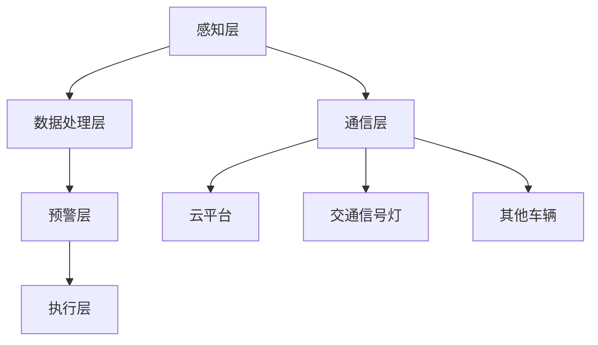

                 

### 文章关键词

- 智能汽车
- AI Agent
- 驾驶行为分析
- 安全预警
- 自动驾驶技术
- 车联网
- 感知系统
- 决策系统
- 控制系统
- 深度学习
- 计算机视觉
- 强化学习
- 激光雷达
- GPS
- 超声波传感器

### 摘要

本文旨在深入探讨智能汽车中AI Agent的驾驶行为分析与安全预警技术。通过梳理智能汽车的发展背景，解析AI Agent的基本原理和应用场景，本文详细介绍了驾驶行为数据的采集与分析方法，核心算法及其实现过程。在此基础上，文章重点探讨了安全预警系统的构建与实现，并通过具体实践案例分析了智能汽车安全预警的挑战和未来发展。本文旨在为智能汽车技术的发展提供有价值的参考和启示。

## 第1章：智能汽车的发展背景与现状

### 1.1 智能汽车的起源与发展历程

智能汽车的概念起源于20世纪末，最初是由汽车制造商和科技公司共同探索的一种创新汽车形式。随着信息技术和通信技术的飞速发展，智能汽车逐步从概念走向现实。

- **20世纪80年代**：自动泊车系统首次出现在豪华车型中，这标志着智能汽车技术的初步萌芽。早期技术主要依赖于机械传感器和简单的电子控制系统。
- **20世纪90年代**：自动驾驶技术开始在实验室阶段取得突破。例如，卡内基梅隆大学的“Navlab”项目展示了自动驾驶技术的初步成果。这一时期，雷达和激光雷达等传感器技术开始应用于自动驾驶研究中。
- **21世纪初**：随着互联网的普及，智能汽车开始与互联网技术相结合，形成了车联网（Internet of Vehicles，IoV）的概念。这一时期，谷歌等科技公司启动了自动驾驶汽车项目，标志着自动驾驶技术向实用化迈进。
- **2010年后**：智能汽车进入快速发展期。特斯拉等公司开始在量产车上应用自动驾驶技术，推动了智能汽车产业的快速发展。同时，自动驾驶技术逐渐从实验室走向市场，L2级别（部分自动驾驶）的智能汽车开始普及。
- **2020年至今**：智能汽车技术不断成熟，自动驾驶技术逐步从L2级别向L3级别（有条件自动驾驶）和L4级别（高度自动驾驶）发展。各国政府和车企纷纷加大对智能汽车的投资，智能汽车市场呈现出蓬勃发展的态势。

### 1.2 智能汽车的核心技术

智能汽车的核心技术主要包括自动驾驶技术、车联网技术、智能传感器技术、人工智能技术等。

- **自动驾驶技术**：自动驾驶技术是智能汽车的核心，它依赖于感知系统、决策系统和控制系统。感知系统通过摄像头、激光雷达、雷达等传感器收集车辆周围环境的信息，决策系统根据感知信息做出行驶决策，控制系统则执行这些决策。自动驾驶技术的成熟度是衡量智能汽车智能化水平的重要指标。
- **车联网技术**：车联网技术实现了车辆之间的通信，提高了交通效率，降低了事故率。车联网技术包括车辆与基础设施之间的通信（V2I）、车辆与车辆之间的通信（V2V）以及车辆与行人、路况等外部元素的通信（V2P/V2X）。车联网技术不仅提升了驾驶体验，还具有重要的安全和社会效益。
- **智能传感器技术**：智能传感器技术在智能汽车中扮演着关键角色，如激光雷达、摄像头、超声波传感器等。这些传感器可以感知车辆周围的环境，为自动驾驶系统和车联网系统提供必要的数据支持。随着传感器技术的不断发展，其精度和可靠性也在不断提升。
- **人工智能技术**：人工智能技术是智能汽车的“大脑”，它通过深度学习、计算机视觉、强化学习等方法对大量数据进行处理和分析，实现对驾驶行为的理解和预测。人工智能技术在自动驾驶、车联网、智能传感器等领域有着广泛的应用，极大地提升了智能汽车的智能化水平。

### 1.3 智能汽车行业的挑战与机遇

智能汽车行业面临着诸多挑战，同时也充满了机遇。

- **技术挑战**：自动驾驶技术尚未完全成熟，尤其是在复杂环境和极端条件下的可靠性需要进一步提升。此外，智能传感器技术和人工智能技术的研发也需要不断投入和突破。
- **法规与标准**：全球范围内尚未形成统一的智能汽车法规和标准，这给智能汽车的推广和应用带来了障碍。各国政府和国际组织需要制定合理的法规和标准，以确保智能汽车的安全和可靠性。
- **商业模式**：智能汽车的商业模式仍在探索中，如何通过智能汽车为车主和汽车行业带来真正的价值是一个亟待解决的问题。同时，如何实现智能汽车的盈利也是一个重要课题。
- **数据安全与隐私**：智能汽车大量采集和传输数据，涉及用户隐私和信息安全。如何保护用户数据的安全和隐私，避免数据泄露和滥用，是一个重要的挑战。

然而，智能汽车行业也充满了机遇：

- **市场潜力**：随着汽车保有量的不断增加，智能汽车市场具有巨大的发展潜力。预计未来几年，智能汽车市场将保持高速增长，为汽车行业带来新的机遇。
- **技术创新**：智能汽车技术的不断进步将推动整个汽车行业的转型升级，为消费者带来更安全、更便捷、更智能的驾驶体验。
- **产业链升级**：智能汽车的发展将带动相关产业链的升级，如传感器、芯片、软件、云计算等领域的快速发展。
- **社会效益**：智能汽车有望提高交通效率，减少交通事故，改善环境质量，为社会带来积极的影响。

总之，智能汽车行业既面临着挑战，也充满了机遇。随着技术的不断进步和法规标准的完善，智能汽车有望在未来成为汽车行业的重要发展方向，为人类带来更加美好的出行体验。

### 1.4 智能汽车与AI Agent的关系

智能汽车与AI Agent之间有着紧密的联系。AI Agent是智能汽车的核心组成部分，它通过感知、决策和执行，实现自动驾驶功能。下面，我们将详细探讨AI Agent在智能汽车中的应用原理。

#### 2.1 AI Agent的定义与特点

AI Agent是一种智能体，它能够感知环境、制定计划并采取行动，以实现特定的目标。AI Agent具有以下特点：

- **自主性**：AI Agent能够自主地感知环境，并独立做出决策。
- **适应性**：AI Agent能够根据环境变化调整自己的行为，具备良好的适应性。
- **学习性**：AI Agent通过学习和经验积累，不断提高自己的性能和决策能力。
- **协作性**：AI Agent能够与其他AI Agent或人类协作，共同完成任务。

#### 2.2 AI Agent的基本架构

AI Agent的基本架构通常包括感知模块、决策模块和执行模块。

- **感知模块**：感知模块负责收集环境信息，如使用摄像头、激光雷达、雷达等传感器，获取车辆周围的道路、交通标志、行人和其他车辆等信息。
- **决策模块**：决策模块根据感知模块提供的信息，结合预先设定的规则和算法，对当前环境进行理解和分析，并制定出相应的行驶策略。决策模块的核心是AI算法，如深度学习、强化学习等。
- **执行模块**：执行模块根据决策模块的指令，控制车辆的制动、加速、转向等操作，使车辆按照预定策略行驶。

#### 2.3 AI Agent的核心算法

AI Agent的核心算法主要包括深度学习、计算机视觉、强化学习等。

- **深度学习**：深度学习是一种机器学习方法，通过多层神经网络对大量数据进行训练，从而实现对复杂模式的识别和理解。在智能汽车中，深度学习算法常用于图像识别、语音识别等任务。
- **计算机视觉**：计算机视觉是人工智能的一个重要分支，它使计算机能够像人类一样感知和理解视觉信息。在智能汽车中，计算机视觉算法用于识别道路标志、行人和其他车辆等。
- **强化学习**：强化学习是一种通过试错学习，从环境中获取奖励信号，不断调整自身策略，以实现最优目标的方法。在智能汽车中，强化学习算法常用于路径规划、决策制定等任务。

#### 2.4 AI Agent在驾驶行为分析中的应用

AI Agent在驾驶行为分析中发挥着重要作用，它能够通过感知模块收集驾驶行为数据，通过决策模块对驾驶行为进行分析和预测，并通过执行模块对驾驶行为进行优化。

- **驾驶行为数据采集**：AI Agent通过摄像头、雷达等传感器，实时采集车辆行驶过程中的各种数据，如速度、加速度、转向角度等。
- **驾驶行为数据分析**：AI Agent利用计算机视觉和深度学习算法，对采集到的驾驶行为数据进行分析，识别出异常驾驶行为，如急刹车、急加速、偏离车道等。
- **驾驶行为预测与优化**：AI Agent通过强化学习算法，根据历史驾驶数据和当前环境信息，预测未来可能的驾驶行为，并制定出最优的驾驶策略，以优化驾驶行为，提高行驶安全性。

综上所述，AI Agent在智能汽车中具有广泛的应用前景。通过感知、决策和执行，AI Agent能够实现自动驾驶功能，提高行驶安全性，改善驾驶体验。随着人工智能技术的不断发展，AI Agent在智能汽车中的应用将更加深入和广泛。

### 第2章：驾驶行为数据的采集与分析

驾驶行为数据的采集与分析是智能汽车AI Agent实现精准驾驶行为分析和预测的基础。在这一章中，我们将详细探讨驾驶行为数据的来源、处理与预处理方法，以及驾驶行为特征提取的步骤和技术。

#### 3.1 驾驶行为数据的来源

驾驶行为数据的来源主要包括以下几种：

- **车内传感器数据**：车内传感器数据是驾驶行为数据的主要来源，包括速度传感器、加速度传感器、转向传感器、制动传感器等。这些传感器能够实时监测车辆的行驶状态和驾驶员的操作行为。
- **车外传感器数据**：车外传感器数据包括摄像头、激光雷达、雷达等，用于监测车辆周围的环境信息，如道路状况、交通标志、行人、其他车辆等。
- **车载记录仪**：车载记录仪可以记录车辆行驶过程中的视频和音频数据，用于分析和回放驾驶行为。
- **车联网数据**：车联网数据包括车辆与基础设施、其他车辆、行人之间的通信数据，如交通信号、道路拥堵情况等。

#### 3.2 驾驶行为数据的处理与预处理

驾驶行为数据在采集后需要进行处理与预处理，以提高数据质量和分析效率。以下是一些常见的处理与预处理方法：

- **数据清洗**：数据清洗是数据预处理的重要步骤，主要目的是去除数据中的噪声和异常值。常见的方法包括缺失值填补、异常值检测与剔除等。
- **数据归一化**：数据归一化是将不同特征的数据进行标准化处理，使其具有相同的尺度，从而避免特征之间的影响。常用的归一化方法有最小-最大缩放、Z-score标准化等。
- **数据降维**：数据降维是将高维数据转化为低维数据，以减少计算量和数据存储空间。常见的方法有主成分分析（PCA）、线性判别分析（LDA）等。
- **数据增强**：数据增强是通过生成新的数据样本，提高模型的泛化能力和鲁棒性。常见的方法有数据变换、合成数据生成等。

#### 3.3 驾驶行为特征提取

驾驶行为特征提取是将原始驾驶行为数据转化为可用于分析和建模的特征表示。以下是一些常见的驾驶行为特征提取方法：

- **时序特征**：时序特征包括速度、加速度、转向角度等随时间变化的特征。这些特征可以用于分析驾驶员的操作行为和驾驶风格。
- **静态特征**：静态特征包括车辆的位置、速度、车道宽度、道路曲率等。这些特征可以用于分析车辆在道路上的状态和周围环境。
- **动态特征**：动态特征包括车辆的行驶轨迹、转向行为、制动行为等。这些特征可以用于分析驾驶员的动态驾驶行为和驾驶意图。
- **高维特征**：高维特征包括图像、视频、雷达等传感器数据提取的特征。这些特征可以用于深度学习和计算机视觉任务，如车道线检测、行人检测等。

通过驾驶行为数据的采集与分析，AI Agent能够全面了解驾驶员的驾驶行为，为驾驶行为分析和预测提供可靠的数据基础。同时，特征提取技术的不断发展，也为驾驶行为分析和预测提供了更多的可能性。接下来，我们将进一步探讨驾驶行为分析的核心算法及其应用。

### 第3章：驾驶行为分析的核心算法

驾驶行为分析的核心算法是实现智能汽车AI Agent对驾驶行为进行识别、预测和优化的关键。在本章中，我们将详细探讨驾驶行为识别算法、驾驶行为预测算法和驾驶行为优化算法，包括这些算法的基本原理、应用场景和具体实现。

#### 4.1 驾驶行为识别算法

驾驶行为识别算法的目标是识别驾驶员在特定时刻的驾驶行为，如加速、减速、急刹车、急转弯等。以下是一些常用的驾驶行为识别算法：

- **支持向量机（SVM）**：SVM是一种监督学习算法，通过找到最佳的超平面，将不同驾驶行为的数据点进行分类。SVM在驾驶行为识别中具有良好的分类性能，但需要大量训练数据和参数调优。
- **决策树**：决策树是一种基于树结构的分类算法，通过一系列的判断规则，将驾驶行为数据分类。决策树算法简单易懂，但易过拟合，需要剪枝处理。
- **神经网络**：神经网络，尤其是深度神经网络（DNN），在驾驶行为识别中具有强大的表达能力和非线性建模能力。通过多层感知器（MLP）和卷积神经网络（CNN），可以实现对复杂驾驶行为的精确识别。

**应用场景**：驾驶行为识别算法广泛应用于智能汽车的驾驶行为分析系统中，如驾驶员状态监测、驾驶行为评分、危险驾驶预警等。

**实现示例**：
```python
from sklearn.svm import SVC
from sklearn.model_selection import train_test_split
from sklearn.metrics import accuracy_score

# 示例数据
X = ...  # 特征数据
y = ...  # 标签数据（0表示正常驾驶，1表示异常驾驶）

# 数据划分
X_train, X_test, y_train, y_test = train_test_split(X, y, test_size=0.2, random_state=42)

# 创建SVM模型并训练
model = SVC(kernel='linear')
model.fit(X_train, y_train)

# 测试模型
y_pred = model.predict(X_test)
accuracy = accuracy_score(y_test, y_pred)
print(f"Accuracy: {accuracy}")
```

#### 4.2 驾驶行为预测算法

驾驶行为预测算法的目标是预测驾驶员在未来的某个时刻会采取何种驾驶行为，如加速、减速、转向等。以下是一些常用的驾驶行为预测算法：

- **时间序列预测**：时间序列预测算法，如ARIMA、LSTM等，可以捕捉驾驶行为的时间序列特性。ARIMA（自回归积分滑动平均模型）适用于线性时间序列数据，而LSTM（长短时记忆网络）可以处理非线性时间序列数据。
- **马尔可夫决策过程（MDP）**：MDP是一种基于概率的预测算法，通过定义状态和动作空间，利用奖励函数来预测未来的驾驶行为。MDP在驾驶行为预测中具有较高的灵活性和可解释性。
- **增强学习**：增强学习，如Q学习、深度Q网络（DQN）等，通过试错学习和奖励机制来优化驾驶策略。增强学习在驾驶行为预测中具有自适应性和高效性。

**应用场景**：驾驶行为预测算法广泛应用于智能汽车的自动驾驶系统中，如路径规划、自动驾驶决策、驾驶行为优化等。

**实现示例**：
```python
import numpy as np
from keras.models import Sequential
from keras.layers import LSTM, Dense

# 示例数据
X = ...  # 输入数据
y = ...  # 输出数据

# 模型构建
model = Sequential()
model.add(LSTM(50, activation='relu', input_shape=(X.shape[1], X.shape[2])))
model.add(Dense(1))
model.compile(optimizer='adam', loss='mse')

# 训练模型
model.fit(X, y, epochs=200, batch_size=32, verbose=0)

# 预测
X_pred = ...  # 预测输入数据
y_pred = model.predict(X_pred)
```

#### 4.3 驾驶行为优化算法

驾驶行为优化算法的目标是通过调整驾驶策略，实现驾驶行为的优化，提高行驶安全性和舒适性。以下是一些常用的驾驶行为优化算法：

- **遗传算法**：遗传算法是一种基于自然进化的优化算法，通过交叉、变异和选择等操作，找到最优的驾驶策略。遗传算法在驾驶行为优化中具有全局搜索能力和高效性。
- **粒子群优化（PSO）**：粒子群优化是一种基于群体智能的优化算法，通过粒子之间的信息共享和更新，找到最优的驾驶策略。PSO算法在驾驶行为优化中具有简单性和鲁棒性。
- **深度强化学习**：深度强化学习通过深度神经网络和增强学习算法，实现驾驶行为的自主优化。深度强化学习在驾驶行为优化中具有高效性和灵活性。

**应用场景**：驾驶行为优化算法广泛应用于智能汽车的自动驾驶系统和驾驶行为分析系统中，如能量管理、路径规划、驾驶策略优化等。

**实现示例**：
```python
import numpy as np
from deap import base, creator, tools, algorithms

# 示例参数
creator.create("FitnessMax", base.Fitness, weights=(1.0,))
creator.create("Individual", list, fitness=creator.FitnessMax)

# 粒子群优化工具
toolbox = base.Toolbox()
toolbox.register("attr_bool", np.random.randint, 0, 2)
toolbox.register("individual", tools.initRepeat, creator.Individual, toolbox.attr_bool, n=100)
toolbox.register("population", tools.initRepeat, list, toolbox.individual)
toolbox.register("evaluate", ... )  # 评估函数
toolbox.register("mate", tools.cxTwoPoint)
toolbox.register("mutate", tools.mutFlipBit, indpb=0.05)
toolbox.register("select", tools.selTournament, tournsize=3)

# 进化过程
pop = toolbox.population(n=50)
NGEN = 100
for gen in range(NGEN):
    offspring = algorithms.varAnd(pop, toolbox, cxpb=0.5, mutpb=0.2)
    fits = toolbox.evaluate(offspring)
    for fit, ind in zip(fits, offspring):
        ind.fitness.values = fit
    pop = toolbox.select(offspring, k=len(pop))
    print(f"Gen: {gen+1}, Best Fit: {max(fit.values)}")
```

通过驾驶行为识别、预测和优化算法的应用，智能汽车AI Agent能够实现对驾驶行为的全面理解和优化，提高行驶安全性和舒适性。随着算法的不断发展和优化，驾驶行为分析技术将在智能汽车领域发挥越来越重要的作用。

### 第4章：AI Agent在驾驶行为分析中的实践应用

在智能汽车领域，AI Agent的驾驶行为分析技术已经取得了显著的应用成果。本章节将介绍一些典型的实践应用场景，详细讲解AI Agent在驾驶行为分析中的具体实现过程，并通过实际案例进行分析和讲解，最后总结项目经验和挑战。

#### 5.1 实践应用场景介绍

AI Agent在驾驶行为分析中的实践应用场景主要包括：

- **驾驶员行为监测**：通过AI Agent监测驾驶员的驾驶行为，如疲劳驾驶、分心驾驶等，提供预警和干预措施，提高行车安全性。
- **自动驾驶决策**：在自动驾驶系统中，AI Agent负责对道路环境进行感知和驾驶行为分析，制定出最优的驾驶策略，确保车辆安全、舒适地行驶。
- **交通流量分析**：AI Agent通过分析车辆行驶数据，实时监测和预测交通流量，为交通管理和规划提供数据支持。
- **车辆安全预警**：AI Agent对车辆状态和驾驶行为进行实时监控，识别潜在的安全隐患，提前预警并采取相应措施，防止事故发生。

#### 5.2 AI Agent在驾驶行为分析中的应用实现

以下是一个基于自动驾驶决策的AI Agent应用实例，介绍其实现过程：

**1. 数据采集**：
- **传感器数据**：通过车载传感器（如摄像头、激光雷达、超声波传感器等）采集车辆周围的环境数据。
- **车辆状态数据**：包括车速、加速度、转向角度、制动情况等。

**2. 数据预处理**：
- **数据清洗**：去除噪声和异常值，如遮挡的摄像头图像、异常的传感器数据等。
- **数据归一化**：对传感器数据进行归一化处理，使其具备相同的量纲。

**3. 驾驶行为特征提取**：
- **时序特征**：提取车速、加速度等时序特征。
- **静态特征**：提取车辆位置、车道宽度、道路曲率等静态特征。
- **动态特征**：提取行驶轨迹、转向行为等动态特征。

**4. 驾驶行为识别与预测**：
- **驾驶行为识别**：利用深度学习模型（如卷积神经网络、循环神经网络等）对驾驶行为进行识别。
- **驾驶行为预测**：利用时间序列预测模型（如LSTM、GRU等）对未来的驾驶行为进行预测。

**5. 驾驶策略制定**：
- **路径规划**：利用A*算法或其他路径规划算法，为自动驾驶车辆制定最优行驶路径。
- **驾驶策略优化**：利用强化学习算法，根据当前环境和驾驶行为预测结果，优化驾驶策略。

**6. 驾驶行为优化与控制**：
- **执行模块**：根据优化后的驾驶策略，控制车辆的加速、减速、转向等操作。

#### 5.3 实践案例分析与讲解

**案例一：驾驶员行为监测**

某自动驾驶公司开发了一套驾驶员行为监测系统，通过AI Agent实时监测驾驶员的驾驶行为。以下是其实现过程：

- **数据采集**：通过车内摄像头和加速度传感器，实时采集驾驶员的面部表情和身体姿态数据。
- **特征提取**：提取驾驶员的面部表情特征（如眼睛闭合程度、嘴角状态等）和身体姿态特征（如头部倾斜角度、身体前倾程度等）。
- **驾驶行为识别**：利用卷积神经网络（CNN）模型，对驾驶员的表情和姿态特征进行识别，判断驾驶员是否处于疲劳驾驶或分心驾驶状态。
- **预警与干预**：当识别到驾驶员处于疲劳驾驶或分心驾驶状态时，系统会通过语音提醒或座椅振动等方式进行预警，提醒驾驶员休息或专注驾驶。

**案例分析**：
该系统通过AI Agent实现了对驾驶员驾驶行为的实时监测和预警，有效提高了驾驶安全性。但需要注意的是，该系统的准确性和可靠性依赖于传感器数据的精确度和模型的鲁棒性，未来需要进一步优化。

**案例二：自动驾驶决策**

某自动驾驶汽车制造商开发了一套自动驾驶决策系统，通过AI Agent实现车辆在复杂环境下的自主驾驶。以下是其实现过程：

- **数据采集**：通过车载激光雷达、摄像头、GPS等传感器，实时采集车辆周围的道路、交通标志、行人等信息。
- **特征提取**：提取道路信息（如车道线、交通标志等）、车辆信息（如车速、位置等）和行人信息（如位置、速度等）。
- **驾驶行为识别与预测**：利用深度学习模型，对道路、车辆和行人信息进行识别和预测，判断当前驾驶环境和驾驶行为。
- **路径规划与策略优化**：利用A*算法和强化学习算法，制定最优行驶路径和驾驶策略。
- **执行模块**：根据优化后的驾驶策略，控制车辆的加速、减速、转向等操作。

**案例分析**：
该系统通过AI Agent实现了在复杂环境下的自动驾驶决策，提高了驾驶安全性和舒适性。然而，自动驾驶系统的鲁棒性和适应性仍是一个挑战，尤其是在极端天气条件和复杂路况下。

#### 5.4 项目小结与未来展望

通过以上实践案例分析，可以看出AI Agent在驾驶行为分析中的应用具有广泛的前景和巨大的潜力。然而，实现一个高效、可靠的驾驶行为分析系统仍面临诸多挑战：

- **数据质量**：传感器数据的准确性和可靠性直接影响驾驶行为分析的效果，未来需要进一步优化传感器技术和数据处理算法。
- **算法优化**：深度学习模型和强化学习算法的性能仍需提升，以应对复杂多变的驾驶环境。
- **系统集成**：驾驶行为分析系统需要与其他系统（如控制系统、决策系统等）高效集成，实现协同工作。

未来，随着人工智能技术的不断进步和智能汽车市场的不断发展，驾驶行为分析技术将变得更加成熟和普及，为智能汽车的安全、舒适驾驶提供更有力的技术支撑。

### 第5章：智能汽车安全预警系统的构建

智能汽车安全预警系统是保障驾驶安全的重要技术手段，通过实时监控车辆状态和环境信息，提前预警潜在的安全风险。在本章中，我们将探讨安全预警系统的设计原则、功能模块和架构设计，并通过具体的实现与部署方法，分析安全预警系统的实现过程。

#### 6.1 安全预警系统的设计原则

智能汽车安全预警系统的设计应遵循以下原则：

- **实时性**：预警系统需实时监测车辆状态和环境信息，确保在发现潜在风险时能够及时响应。
- **可靠性**：预警系统应具备高可靠性，能够准确识别并预警真实的安全风险，避免误报和漏报。
- **适应性**：预警系统应具备良好的适应性，能够应对不同驾驶环境、不同车型和不同驾驶员的特点。
- **可扩展性**：预警系统应具备良好的可扩展性，以便在未来随着技术的发展和需求的变化进行功能扩展和性能提升。

#### 6.2 安全预警系统的功能模块

智能汽车安全预警系统通常包括以下功能模块：

- **数据采集模块**：负责采集车辆传感器数据和外部环境信息，如车速、加速度、转向角度、路况信息等。
- **数据处理模块**：对采集到的数据进行预处理、清洗和特征提取，以便后续分析和预警。
- **预警算法模块**：采用机器学习和深度学习算法，对处理后的数据进行实时分析和预测，识别潜在的安全风险。
- **预警决策模块**：根据预警算法的结果，制定相应的预警策略，如警报、语音提示、座椅震动等。
- **执行模块**：根据预警决策模块的指令，控制车辆的制动、转向等操作，采取相应的安全措施。

#### 6.3 安全预警系统的架构设计

智能汽车安全预警系统的架构设计主要包括以下几个方面：

- **感知层**：包括各种传感器，如摄像头、激光雷达、超声波传感器等，用于实时采集车辆状态和环境信息。
- **数据处理层**：包括数据采集模块、数据处理模块和数据处理算法，负责对感知层采集到的数据进行处理和分析。
- **预警层**：包括预警算法模块和预警决策模块，负责根据处理后的数据识别潜在的安全风险，并制定预警策略。
- **执行层**：包括执行模块，负责根据预警决策模块的指令，控制车辆的制动、转向等操作，确保驾驶安全。
- **通信层**：包括车联网模块，负责实现车辆与外部系统的通信，如与其他车辆、交通信号灯、云平台等。

以下是一个智能汽车安全预警系统的架构图：



#### 6.4 安全预警系统的实现与部署

**实现过程**：

1. **数据采集**：通过摄像头、激光雷达、超声波传感器等设备，实时采集车辆状态和环境信息。
2. **数据处理**：对采集到的数据进行分析、清洗和特征提取，将原始数据转化为可用于分析的格式。
3. **预警算法**：利用机器学习和深度学习算法，对处理后的数据进行分析，识别潜在的安全风险。
4. **预警决策**：根据预警算法的结果，制定预警策略，如警报、语音提示、座椅震动等。
5. **执行**：根据预警决策的指令，控制车辆的制动、转向等操作，确保驾驶安全。

**部署过程**：

1. **硬件部署**：在车辆中安装相应的传感器和执行模块，确保系统能够实时采集和处理数据。
2. **软件部署**：在车辆中安装预警系统的软件模块，包括数据采集、处理、预警算法和执行等模块。
3. **集成测试**：在车辆上对预警系统进行集成测试，确保各个模块之间能够协同工作，实现实时预警和执行。
4. **上线运行**：将预警系统部署到实际车辆中，进行长时间运行测试，验证系统的可靠性和稳定性。

#### 6.5 安全预警实践案例分析

**案例一：疲劳驾驶预警**

某自动驾驶公司开发了一套疲劳驾驶预警系统，通过AI Agent监测驾驶员的驾驶行为和面部表情，实时判断驾驶员是否处于疲劳状态。以下是其实现过程：

- **数据采集**：通过车内摄像头，实时采集驾驶员的面部表情和身体姿态数据。
- **数据处理**：对采集到的数据进行分析、清洗和特征提取，提取驾驶员的面部表情特征和姿态特征。
- **预警算法**：利用卷积神经网络（CNN）模型，对驾驶员的表情和姿态特征进行识别，判断驾驶员是否处于疲劳状态。
- **预警决策**：当识别到驾驶员处于疲劳状态时，系统会通过语音提醒或座椅振动等方式进行预警，提醒驾驶员休息。
- **执行**：根据预警决策的指令，控制车辆的制动、减速等操作，确保驾驶安全。

**案例分析**：

该疲劳驾驶预警系统通过AI Agent实现了对驾驶员驾驶行为的实时监测和预警，有效提高了驾驶安全性。然而，系统的准确性依赖于传感器数据的精确度和模型的鲁棒性，未来需要进一步优化。

**案例二：碰撞预警**

某智能汽车制造商开发了一套碰撞预警系统，通过AI Agent监测车辆周围的障碍物和交通环境，实时判断是否会发生碰撞事故。以下是其实现过程：

- **数据采集**：通过激光雷达、摄像头和雷达等设备，实时采集车辆周围的障碍物和交通环境数据。
- **数据处理**：对采集到的数据进行分析、清洗和特征提取，提取障碍物的位置、速度和大小等信息。
- **预警算法**：利用深度学习模型，对处理后的数据进行分析，预测是否会发生碰撞事故。
- **预警决策**：当预测到可能发生碰撞时，系统会通过警报、语音提示等方式进行预警，提醒驾驶员采取避让措施。
- **执行**：根据预警决策的指令，控制车辆的制动、转向等操作，避免碰撞事故的发生。

**案例分析**：

该碰撞预警系统通过AI Agent实现了对车辆周围环境的实时监测和预警，有效降低了碰撞事故的风险。然而，系统在复杂路况和恶劣天气条件下的表现仍需进一步验证和优化。

通过以上实践案例分析，可以看出智能汽车安全预警系统在驾驶安全方面具有重要意义。未来，随着人工智能技术的不断进步和智能汽车市场的不断发展，安全预警系统将变得更加成熟和普及，为智能汽车的驾驶安全提供更有力的技术保障。

### 第6章：安全预警算法与实践

在智能汽车安全预警系统中，算法是实现预警功能的核心。本章将详细介绍安全预警算法的原理和实现过程，并通过具体实例展示算法的实际应用。

#### 7.1 预警算法的原理

安全预警算法主要分为两类：基于规则的方法和基于数据驱动的方法。

- **基于规则的方法**：这种方法依赖于预先定义的规则和阈值，通过判断输入数据的特征是否超过这些规则和阈值来触发预警。常见的规则包括速度阈值、距离阈值、转向角度阈值等。例如，如果车辆在高速公路上行驶速度超过120公里/小时，系统将触发超速预警。
- **基于数据驱动的方法**：这种方法利用机器学习和深度学习算法，从大量的历史数据中学习出潜在的预警模式。常见的算法包括决策树、支持向量机（SVM）、神经网络（NN）、循环神经网络（RNN）和卷积神经网络（CNN）等。

#### 7.2 预警算法的实现

以下是一个基于深度学习的碰撞预警算法的实现示例：

**1. 数据准备**：
首先，需要收集大量的车辆行驶数据和环境数据，包括车速、加速度、转向角度、周围障碍物的位置和速度等。这些数据将用于训练和测试预警模型。

**2. 数据预处理**：
对收集到的数据进行清洗、归一化和特征提取。例如，可以将车速、加速度等数值特征进行归一化处理，将图像数据转换为灰度图像，提取出障碍物的位置、大小等特征。

**3. 模型构建**：
使用卷积神经网络（CNN）来构建预警模型。CNN可以有效地处理图像数据，提取出图像中的潜在特征。

```python
from keras.models import Sequential
from keras.layers import Conv2D, MaxPooling2D, Flatten, Dense

model = Sequential()
model.add(Conv2D(32, (3, 3), activation='relu', input_shape=(128, 128, 3)))
model.add(MaxPooling2D(pool_size=(2, 2)))
model.add(Flatten())
model.add(Dense(64, activation='relu'))
model.add(Dense(1, activation='sigmoid'))

model.compile(optimizer='adam', loss='binary_crossentropy', metrics=['accuracy'])
```

**4. 模型训练**：
使用预处理后的数据对模型进行训练。这里使用的是二分类问题，即判断是否会发生碰撞。

```python
from sklearn.model_selection import train_test_split

X = ...  # 特征数据
y = ...  # 标签数据（0表示不会发生碰撞，1表示会发生碰撞）

X_train, X_test, y_train, y_test = train_test_split(X, y, test_size=0.2, random_state=42)

model.fit(X_train, y_train, epochs=10, batch_size=32, validation_data=(X_test, y_test))
```

**5. 模型评估**：
评估模型在测试集上的表现，通过准确率、召回率、F1分数等指标来衡量。

```python
from sklearn.metrics import classification_report

y_pred = model.predict(X_test)
y_pred = (y_pred > 0.5)

print(classification_report(y_test, y_pred))
```

#### 7.3 安全预警系统的实现与部署

**实现过程**：

1. **传感器数据采集**：通过车载传感器（如摄像头、激光雷达、超声波传感器等）实时采集车辆状态和环境数据。
2. **数据处理**：对采集到的数据进行分析、清洗和特征提取，将原始数据转化为可用于分析的格式。
3. **预警算法**：使用训练好的模型对处理后的数据进行实时分析和预测，识别潜在的安全风险。
4. **预警决策**：根据预警算法的结果，制定相应的预警策略，如警报、语音提示、座椅震动等。
5. **执行模块**：根据预警决策的指令，控制车辆的制动、转向等操作，采取相应的安全措施。

**部署过程**：

1. **硬件部署**：在车辆中安装相应的传感器和执行模块，确保系统能够实时采集和处理数据。
2. **软件部署**：在车辆中安装预警系统的软件模块，包括数据采集、处理、预警算法和执行等模块。
3. **集成测试**：在车辆上对预警系统进行集成测试，确保各个模块之间能够协同工作，实现实时预警和执行。
4. **上线运行**：将预警系统部署到实际车辆中，进行长时间运行测试，验证系统的可靠性和稳定性。

#### 7.4 实践案例分析

**案例一：紧急制动预警**

某智能汽车制造商开发了一套紧急制动预警系统，通过AI Agent实时监测车辆状态和环境信息，预测是否会发生紧急制动情况。以下是其实现过程：

- **数据采集**：通过车载传感器（如加速度传感器、激光雷达等）实时采集车辆状态和环境数据。
- **数据处理**：对采集到的数据进行清洗、归一化和特征提取，提取出车速、加速度、周围障碍物的位置和速度等特征。
- **预警算法**：使用卷积神经网络（CNN）模型，对处理后的数据进行分析，预测是否会发生紧急制动。
- **预警决策**：当模型预测到可能发生紧急制动时，系统会通过警报、语音提示等方式进行预警。
- **执行模块**：根据预警决策的指令，控制车辆的制动系统，采取紧急制动措施。

**案例分析**：

该紧急制动预警系统通过AI Agent实现了对车辆状态和环境信息的实时监测和预警，有效降低了紧急制动事故的风险。然而，系统的预警准确性依赖于传感器数据的准确性和模型的鲁棒性，未来需要进一步优化。

**案例二：行人碰撞预警**

某自动驾驶公司开发了一套行人碰撞预警系统，通过AI Agent实时监测车辆周围的行人信息，预测是否会发生行人碰撞事故。以下是其实现过程：

- **数据采集**：通过车载摄像头和激光雷达实时采集车辆周围的行人信息。
- **数据处理**：对采集到的行人图像进行预处理和特征提取，提取出行人的位置、速度和大小等特征。
- **预警算法**：使用卷积神经网络（CNN）模型，对处理后的行人数据进行实时分析和预测，预测是否会发生行人碰撞。
- **预警决策**：当模型预测到可能发生行人碰撞时，系统会通过警报、语音提示等方式进行预警。
- **执行模块**：根据预警决策的指令，控制车辆的制动、转向等操作，避免行人碰撞事故的发生。

**案例分析**：

该行人碰撞预警系统通过AI Agent实现了对车辆周围行人信息的实时监测和预警，有效提高了行驶安全性。然而，系统的准确性依赖于行人检测和识别技术的鲁棒性，未来需要进一步优化和改进。

通过以上实践案例分析，可以看出安全预警算法在智能汽车安全预警系统中具有重要作用。未来，随着人工智能技术的不断进步，安全预警算法将变得更加高效、准确，为智能汽车的安全驾驶提供更有力的技术支持。

### 第7章：智能汽车安全预警的挑战与未来发展

智能汽车安全预警系统在提高驾驶安全性和舒适性方面具有重要作用，但其发展仍面临诸多挑战。本章将探讨智能汽车安全预警系统在当前和未来可能面临的挑战，分析这些挑战的解决方案，并展望安全预警技术的未来发展。

#### 8.1 智能汽车安全预警的挑战

**1. 技术挑战**

- **传感器精度和可靠性**：安全预警系统依赖于各种传感器（如摄像头、激光雷达、超声波传感器等）来获取车辆状态和环境信息。传感器的精度和可靠性直接影响到预警系统的准确性和稳定性。如何在复杂环境下提高传感器的性能是一个重要的技术挑战。
- **算法性能和鲁棒性**：预警算法需要处理大量的数据，并从中提取出有效的特征，以识别潜在的安全风险。算法的性能和鲁棒性对于预警系统的可靠运行至关重要。如何设计高效、鲁棒的预警算法是当前面临的一个重要问题。

**2. 法规与标准**

- **法规不完善**：全球范围内，智能汽车安全预警系统的法规和标准尚未完善。不同国家和地区的法规和标准存在差异，这给智能汽车安全预警系统的推广和应用带来了困难。如何制定统一的、合理的法规和标准是亟待解决的问题。
- **数据隐私与安全**：智能汽车安全预警系统需要收集和存储大量的车辆行驶数据和环境数据，这涉及用户隐私和信息安全。如何保护用户数据的安全和隐私，避免数据泄露和滥用，是一个重要的挑战。

**3. 商业模式**

- **盈利模式**：智能汽车安全预警系统需要大量的研发投入和维护成本，但如何实现盈利是一个重要的商业模式挑战。如何通过智能汽车安全预警系统为车主和汽车行业带来真正的价值，是一个重要的商业问题。

#### 8.2 智能汽车安全预警的解决方案

**1. 技术解决方案**

- **提高传感器性能**：通过不断研发和优化传感器技术，提高传感器的精度和可靠性。例如，开发更高分辨率的摄像头、更先进的激光雷达和超声波传感器等。
- **优化预警算法**：通过改进机器学习和深度学习算法，提高预警算法的性能和鲁棒性。例如，采用更复杂的神经网络结构、引入更多数据增强技术等。

**2. 法规解决方案**

- **制定统一标准**：各国政府和国际组织应共同努力，制定统一的智能汽车安全预警系统法规和标准，以促进智能汽车安全预警系统的推广和应用。
- **数据隐私保护**：应建立健全的数据隐私保护机制，确保用户数据的合法、安全使用。例如，通过数据加密、匿名化处理等技术，保护用户隐私。

**3. 商业模式解决方案**

- **多元化盈利模式**：通过多种盈利模式，为智能汽车安全预警系统实现盈利。例如，通过广告、增值服务、保险合作等方式，实现商业模式的多元化。
- **技术创新与价值创造**：通过技术创新，提高智能汽车安全预警系统的性能和价值，为车主和汽车行业带来真正的价值。例如，通过提高预警准确性、降低事故率等，提升用户体验和汽车品牌价值。

#### 8.3 智能汽车安全预警的未来发展趋势

**1. 技术发展**

- **多传感器融合**：随着传感器技术的发展，未来智能汽车安全预警系统将实现多传感器融合，提高预警系统的准确性和稳定性。例如，结合摄像头、激光雷达、超声波传感器等多种传感器，实现更全面的感知能力。
- **深度学习与强化学习**：深度学习和强化学习等先进算法的不断发展，将进一步提高智能汽车安全预警系统的性能和智能水平。例如，通过深度学习算法实现更精确的环境感知和驾驶行为分析，通过强化学习算法实现更智能的驾驶策略优化。

**2. 法规与标准**

- **国际法规统一**：随着智能汽车安全预警系统的普及，国际间对智能汽车安全预警系统的法规和标准将逐步统一，促进智能汽车安全预警系统的全球推广。
- **数据隐私保护法规**：随着数据隐私保护意识的提高，各国将不断完善数据隐私保护法规，确保智能汽车安全预警系统的合法、安全使用。

**3. 商业模式**

- **多元化盈利模式**：随着智能汽车市场的不断发展，智能汽车安全预警系统的盈利模式将更加多元化。例如，通过广告、增值服务、保险合作等方式，实现多种盈利模式。
- **用户价值创造**：通过智能汽车安全预警系统，为车主和汽车行业带来真正的价值，提高用户体验和汽车品牌价值。

总之，智能汽车安全预警系统在提高驾驶安全性和舒适性方面具有重要作用，但其发展仍面临诸多挑战。通过技术创新、法规完善和商业模式创新，智能汽车安全预警系统有望在未来实现更高的性能和更广泛的应用。

### 总结

智能汽车的安全预警系统是保障驾驶安全的重要技术手段，通过实时监测车辆状态和环境信息，提前预警潜在的安全风险。本文系统地介绍了智能汽车安全预警系统的设计原则、功能模块、架构设计以及预警算法的实现与部署。我们分析了传感器精度、算法性能、法规与标准、商业模式等方面的挑战，并提出了解决方案。

未来，随着人工智能技术的不断发展，智能汽车安全预警系统将变得更加高效、准确，为智能汽车的驾驶安全提供更有力的技术支持。我们期待智能汽车安全预警系统能够为人类带来更安全、更舒适的驾驶体验。

### 扩展阅读

- **智能汽车安全预警相关论文**：推荐阅读《智能汽车安全预警系统设计与应用》、《基于深度学习的智能汽车安全预警算法研究》等论文，深入了解智能汽车安全预警技术的最新研究成果。
- **智能汽车安全预警系统开发指南**：推荐阅读《智能汽车安全预警系统开发指南》一书，系统学习智能汽车安全预警系统的设计、开发和部署流程。
- **智能汽车安全预警系统标准与法规**：关注国际汽车工程师协会（SAE）和国际标准化组织（ISO）等机构发布的智能汽车安全预警系统标准和法规，了解相关法规和标准的最新动态。

