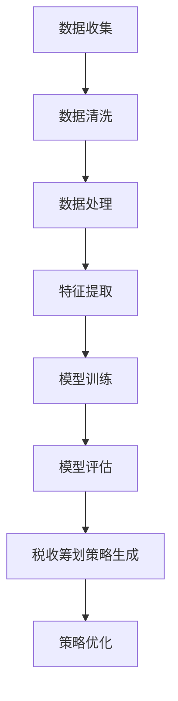

                 

# 智能税收筹划建议系统

## 摘要

智能税收筹划建议系统是一项创新性的信息技术应用，旨在通过大数据分析和人工智能算法，为企业及个人提供精准的税收筹划建议。本文将详细介绍智能税收筹划建议系统的背景、核心概念、实现与部署，以及最佳实践与未来展望。通过本文的阅读，读者可以全面了解智能税收筹划建议系统的构建过程、关键技术以及实际应用效果。

## 关键词

智能税收筹划，大数据分析，人工智能，算法优化，系统部署，最佳实践

## 第一部分：智能税收筹划建议系统概述

### 1.1 问题背景

#### 1.1.1 税收筹划的重要性

税收筹划是企业在遵守税法规定的前提下，通过合理安排财务活动和经营活动，以实现合法的税收利益最大化。税收筹划的重要性主要体现在以下几个方面：

1. **提高企业竞争力**：合理的税收筹划可以降低企业的税负，增加企业利润，从而提高企业在市场中的竞争力。
2. **优化资本结构**：通过税收筹划，企业可以更有效地利用税收政策，优化资本结构，提高资金使用效率。
3. **法律合规性**：税收筹划必须遵守国家税法规定，确保企业的税收筹划行为合法合规。

#### 1.1.2 智能税收筹划的现状

随着大数据和人工智能技术的发展，智能税收筹划逐渐成为一种新的趋势。目前，智能税收筹划的现状主要表现在以下几个方面：

1. **技术应用**：大数据分析和人工智能算法被广泛应用于税收筹划，提高了筹划的精度和效率。
2. **企业参与度**：越来越多的企业开始重视智能税收筹划，将其作为企业财务管理的重要手段。
3. **政策支持**：各国政府纷纷出台相关政策，鼓励企业运用智能技术进行税收筹划。

#### 1.1.3 系统需求与目标

智能税收筹划建议系统需要满足以下需求：

1. **数据整合**：系统能够整合多种数据源，包括政府公开数据、企业财务数据和市场研究数据等。
2. **智能分析**：系统能够运用大数据分析和人工智能算法，为企业提供精准的税收筹划建议。
3. **界面友好**：系统界面设计简洁直观，用户易于操作。

系统目标主要包括：

1. **提高税收筹划效率**：通过智能分析，提高税收筹划的效率和精度。
2. **降低税负**：为企业提供合法的税收筹划建议，降低税负，提高企业利润。
3. **合规性**：确保税收筹划建议符合国家税法规定，避免法律风险。

### 1.2 概念与核心要素

#### 1.2.1 智能税收筹划概念

智能税收筹划是指运用大数据和人工智能技术，对企业的财务和经营数据进行分析，为企业提供合法、精准的税收筹划建议。

#### 1.2.2 系统核心要素

智能税收筹划建议系统的核心要素包括：

1. **数据收集与处理模块**：负责收集和整合各类数据，并进行清洗和预处理。
2. **数据处理模块**：运用大数据分析和人工智能算法，对数据进行分析和处理。
3. **税收筹划建议生成模块**：根据数据分析结果，生成具体的税收筹划建议。
4. **系统展示与交互模块**：将税收筹划建议以直观、友好的方式展示给用户，并支持用户与系统进行交互。

#### 1.2.3 税收筹划与合规性

税收筹划必须遵守国家税法规定，确保企业的税收筹划行为合法合规。智能税收筹划建议系统在生成筹划建议时，必须充分考虑合规性要求，避免企业因不当筹划行为面临法律风险。

### 1.3 系统功能模块

#### 1.3.1 数据收集模块

数据收集模块是智能税收筹划建议系统的核心组成部分，主要负责收集和整合各类数据。具体功能包括：

1. **数据采集**：从政府公开数据、企业财务数据和市场研究数据等多个来源采集数据。
2. **数据存储**：将采集到的数据存储在数据库中，以便后续处理和分析。
3. **数据整合**：整合来自不同来源的数据，形成统一的数据集。

#### 1.3.2 数据处理模块

数据处理模块负责对收集到的数据进行分析和处理，为税收筹划建议提供数据支持。具体功能包括：

1. **数据清洗**：去除数据中的噪声和异常值，提高数据质量。
2. **数据预处理**：对数据进行标准化、归一化等处理，为后续分析做好准备。
3. **数据分析**：运用大数据分析技术，对数据进行分析，提取有价值的信息。

#### 1.3.3 税收筹划建议生成模块

税收筹划建议生成模块根据数据处理模块的分析结果，生成具体的税收筹划建议。具体功能包括：

1. **筹划策略生成**：根据企业财务和经营数据，生成适合企业的税收筹划策略。
2. **建议优化**：对生成的税收筹划建议进行优化，确保其合法、合规且具有实际操作性。
3. **建议展示**：以直观、友好的方式将税收筹划建议展示给用户。

#### 1.3.4 系统展示与交互模块

系统展示与交互模块负责将税收筹划建议展示给用户，并支持用户与系统进行交互。具体功能包括：

1. **界面设计**：设计简洁直观的用户界面，方便用户操作。
2. **交互功能**：提供用户与系统进行交互的功能，如数据上传、查询、下载等。
3. **反馈机制**：收集用户反馈，不断优化系统功能和用户体验。

### 1.4 技术栈与架构设计

#### 1.4.1 技术栈选择

智能税收筹划建议系统的技术栈选择主要包括以下方面：

1. **前端技术**：采用HTML、CSS和JavaScript等前端技术，实现系统的用户界面和交互功能。
2. **后端技术**：采用Python等后端技术，实现数据收集、处理和税收筹划建议生成等功能。
3. **数据库技术**：采用MySQL等数据库技术，存储和管理系统数据。

#### 1.4.2 系统架构设计

智能税收筹划建议系统采用B/S（Browser/Server）架构，主要包括前端、后端和数据库三层架构。具体架构设计如下：

1. **前端**：负责与用户交互，展示税收筹划建议和系统功能。
2. **后端**：负责数据处理和税收筹划建议生成，实现系统核心功能。
3. **数据库**：存储和管理系统数据，包括企业财务数据、市场研究数据等。

#### 1.4.3 数据流与处理流程

智能税收筹划建议系统的数据流与处理流程如下：

1. **数据采集**：从政府公开数据、企业财务数据和市场研究数据等多个来源采集数据。
2. **数据存储**：将采集到的数据存储在数据库中，以便后续处理和分析。
3. **数据处理**：对数据进行清洗、预处理和分析，提取有价值的信息。
4. **建议生成**：根据数据分析结果，生成具体的税收筹划建议。
5. **建议展示**：以直观、友好的方式将税收筹划建议展示给用户。

### 1.5 系统开发与实施

#### 1.5.1 系统开发流程

智能税收筹划建议系统的开发流程主要包括以下几个阶段：

1. **需求分析**：与客户沟通，明确系统需求，确定系统功能模块。
2. **系统设计**：根据需求分析结果，进行系统架构设计和模块划分。
3. **编码实现**：根据系统设计文档，进行系统编码实现。
4. **测试与优化**：进行系统功能测试、性能测试和优化。
5. **部署上线**：将系统部署到服务器，进行上线测试和发布。

#### 1.5.2 实施过程中遇到的问题与解决方案

在智能税收筹划建议系统的实施过程中，可能会遇到以下问题及解决方案：

1. **数据质量问题**：采集到的数据可能存在噪声、异常值等问题。解决方案：采用数据清洗和预处理技术，提高数据质量。
2. **计算性能瓶颈**：数据处理和分析过程中可能存在性能瓶颈。解决方案：采用分布式计算和并行处理技术，提高计算性能。
3. **用户界面优化**：用户界面设计可能不符合用户习惯。解决方案：根据用户反馈，不断优化用户界面设计，提高用户体验。

#### 1.5.3 系统测试与优化

智能税收筹划建议系统在测试与优化过程中，应重点关注以下几个方面：

1. **功能测试**：确保系统各个功能模块正常运行，无功能缺陷。
2. **性能测试**：评估系统性能，确保系统能够满足用户需求。
3. **兼容性测试**：确保系统在不同浏览器和操作系统上正常运行。
4. **安全测试**：评估系统安全性，防止潜在的安全风险。

### 1.6 本章小结

本文对智能税收筹划建议系统进行了概述，包括问题背景、概念与核心要素、系统功能模块、技术栈与架构设计以及系统开发与实施等方面。通过本文的介绍，读者可以初步了解智能税收筹划建议系统的构建过程和关键技术。

## 第二部分：智能税收筹划建议系统的核心概念与原理

### 2.1 数据收集与处理

#### 2.1.1 数据来源与种类

智能税收筹划建议系统的数据来源主要包括以下几种：

1. **政府公开数据**：包括税收政策、法律法规、经济指标等，这些数据可以通过政府官方网站、公共数据库等渠道获取。
2. **企业财务数据**：包括企业的收入、成本、利润、资产、负债等数据，这些数据通常来自企业的财务报表。
3. **市场研究数据**：包括行业分析、市场趋势、竞争对手分析等数据，这些数据可以通过市场研究机构、行业报告等渠道获取。

#### 2.1.2 数据清洗与预处理

数据清洗与预处理是智能税收筹划建议系统中的关键环节，其主要任务包括以下几个方面：

1. **数据去噪**：去除数据中的噪声和异常值，提高数据质量。
2. **数据格式转换**：将不同格式的数据进行统一处理，确保数据的一致性和可操作性。
3. **数据标准化**：对数据进行标准化处理，包括数值标准化、日期标准化等，以便后续分析和处理。
4. **数据归一化**：对数据进行归一化处理，将不同量级的数据转换为同一量级，便于数据比较和分析。

### 2.2 税收筹划算法原理

税收筹划算法是智能税收筹划建议系统的核心，其主要目标是根据企业的财务和经营数据，生成最优的税收筹划策略。以下介绍几种常见的税收筹划算法：

#### 2.2.1 常见税收筹划方法

1. **企业税收筹划方法**：
   - **税种优化**：通过调整企业税种结构，降低总体税负。
   - **税基优化**：通过合理安排企业收入和成本，减少应纳税所得额。
   - **税收优惠利用**：充分利用国家税收优惠政策，降低企业税负。

2. **个人税收筹划方法**：
   - **税前扣除最大化**：通过合理安排个人支出，最大化税前扣除额度。
   - **税后收入最大化**：通过优化个人投资和消费结构，提高税后收入。

#### 2.2.2 算法模型与流程

智能税收筹划算法通常包括以下几个步骤：

1. **数据预处理**：对收集到的数据进行清洗、标准化和归一化处理。
2. **特征提取**：从预处理后的数据中提取对企业税收筹划有重要影响的关键特征。
3. **模型训练**：利用历史数据进行机器学习模型的训练，如决策树、神经网络等。
4. **模型评估**：通过交叉验证等方法评估模型的性能，选择最优模型。
5. **税收筹划策略生成**：利用训练好的模型，对企业财务和经营数据进行预测，生成最优税收筹划策略。
6. **策略优化**：对生成的税收筹划策略进行优化，确保其合法、合规且具有实际操作性。

#### 2.2.3 数学模型与公式解析

智能税收筹划算法的数学模型主要包括以下几个部分：

1. **利润最大化模型**：
   - 公式：$$\max P = \text{收入} - \text{成本} - \text{税负}$$
   - 解析：在满足企业财务和经营条件的前提下，最大化企业的利润。

2. **节税金额计算模型**：
   - 公式：$$\text{节税金额} = \text{税前扣除金额} \times \text{税率}$$
   - 解析：通过合理安排企业收入和成本，减少应纳税所得额，从而实现节税。

#### 2.2.4 算法流程图



### 2.3 数学模型与公式解析

在智能税收筹划建议系统中，数学模型和公式是核心组成部分，用于描述税收筹划的目标和策略。以下详细介绍几个常用的数学模型和公式。

#### 2.3.1 常用数学模型

1. **利润最大化模型**：
   - 目标：最大化企业的税后利润。
   - 公式：$$\max P = R - C - T$$
   - 其中，\( R \) 表示收入，\( C \) 表示成本，\( T \) 表示税收。

2. **税基优化模型**：
   - 目标：最小化企业的应纳税所得额。
   - 公式：$$\min \tau = \frac{R - C}{1 - t}$$
   - 其中，\( \tau \) 表示应纳税所得额，\( t \) 表示税率。

3. **节税金额计算模型**：
   - 目标：计算通过税收筹划可以节约的税额。
   - 公式：$$S = R \times t - (R - C) \times t'$$
   - 其中，\( S \) 表示节税金额，\( t \) 表示原税率，\( t' \) 表示优化后的税率。

#### 2.3.2 公式解析与举例

1. **利润最大化模型**：

   假设一家企业的收入为 \( R = 1000 \) 万元，成本为 \( C = 600 \) 万元，税率为 \( t = 25\% \)。则：

   $$P = R - C - T = 1000 - 600 - (1000 - 600) \times 25\% = 100 \text{ 万元}$$

   若通过税收筹划，将税率降低到 \( t' = 20\% \)，则：

   $$P = R - C - T = 1000 - 600 - (1000 - 600) \times 20\% = 120 \text{ 万元}$$

   通过税收筹划，企业的利润增加了 \( 20 \) 万元。

2. **节税金额计算模型**：

   假设某个人投资者的应纳税所得额为 \( \tau = 500 \) 万元，原税率为 \( t = 30\% \)，若通过税收筹划将税率降低到 \( t' = 25\% \)，则：

   $$S = R \times t - (R - C) \times t' = 500 \times 30\% - (500 - 300) \times 25\% = 75 - 50 = 25 \text{ 万元}$$

   通过税收筹划，个人投资者可以节约 \( 25 \) 万元的税额。

### 2.4 算法流程图

为了更直观地展示智能税收筹划建议系统的算法流程，我们使用Mermaid语言绘制了以下流程图：


在这个流程图中，数据收集模块负责从各种来源获取数据，然后经过数据清洗、数据处理和特征提取等步骤，进入模型训练阶段。训练好的模型用于评估和生成税收筹划策略，最后通过策略优化模块对策略进行调整和优化，以确保其有效性和合规性。

通过上述流程，我们可以看到智能税收筹划建议系统的算法从数据到策略的整个转化过程，每个步骤都为最终的目标——提供精准的税收筹划建议——提供了重要的支持。

## 第三部分：智能税收筹划建议系统的实现与部署

### 3.1 系统环境安装与配置

#### 3.1.1 操作系统与软件要求

智能税收筹划建议系统需要以下操作系统和软件环境：

1. **操作系统**：
   - Linux（推荐使用Ubuntu 18.04或更高版本）。
   - Windows 10（专业版或更高版本）。

2. **编程语言**：
   - Python 3.7或更高版本。

3. **数据库**：
   - MySQL 5.7或更高版本。

4. **前端框架**：
   - HTML 5、CSS 3。
   - JavaScript、jQuery。

5. **后端框架**：
   - Flask（Python Web框架）。

#### 3.1.2 环境搭建步骤

以下是智能税收筹划建议系统的环境搭建步骤：

1. **安装操作系统**：
   - 根据操作系统供应商的指南安装操作系统。

2. **更新系统软件**：
   - 对于Linux系统，使用以下命令更新软件包：
     ```bash
     sudo apt update
     sudo apt upgrade
     ```

3. **安装Python**：
   - 使用以下命令安装Python 3.7或更高版本：
     ```bash
     sudo apt install python3.7
     sudo apt install python3.7-venv
     ```

4. **安装数据库**：
   - 安装MySQL数据库，使用以下命令：
     ```bash
     sudo apt install mysql-server
     sudo mysql_secure_installation
     ```

5. **安装前端和后端框架**：
   - 安装Python的虚拟环境管理工具：
     ```bash
     pip install virtualenv
     ```
   - 创建虚拟环境并激活：
     ```bash
     virtualenv venv
     source venv/bin/activate
     ```
   - 安装Flask框架：
     ```bash
     pip install flask
     ```
   - 安装其他必需的Python库，如pandas、numpy、sqlalchemy等。

6. **配置数据库**：
   - 创建数据库和用户，确保数据库用户具有足够的权限。
   - 使用以下SQL命令创建数据库和用户：
     ```sql
     CREATE DATABASE tax_planning;
     GRANT ALL PRIVILEGES ON tax_planning.* TO 'tax_user'@'localhost' IDENTIFIED BY 'password';
     FLUSH PRIVILEGES;
     ```

7. **安装前端工具**：
   - 安装Node.js和npm：
     ```bash
     sudo apt install nodejs
     sudo apt install npm
     ```
   - 安装构建工具如Webpack和Babel：
     ```bash
     npm install -g webpack
     npm install -g babel-cli
     ```

8. **安装开发工具**：
   - 安装代码编辑器，如Visual Studio Code、Sublime Text或Atom。

完成以上步骤后，智能税收筹划建议系统的开发环境就搭建完成了。

### 3.2 系统核心实现

智能税收筹划建议系统的核心实现主要包括数据收集模块、数据处理模块、税收筹划建议生成模块和系统展示与交互模块。以下是各模块的具体实现：

#### 3.2.1 数据收集模块

数据收集模块负责从多个来源收集数据，包括政府公开数据、企业财务数据和市场研究数据等。以下是数据收集模块的实现步骤：

1. **数据采集**：
   - 使用API接口从政府公开数据源获取数据。
   - 使用爬虫工具从网站获取企业财务数据和市场研究数据。

2. **数据存储**：
   - 将采集到的数据存储到MySQL数据库中。
   - 设计数据库表结构，确保数据存储的规范性和可扩展性。

3. **数据整合**：
   - 将来自不同来源的数据进行整合，形成统一的数据集。
   - 使用ETL（Extract, Transform, Load）工具进行数据转换和整合。

#### 3.2.2 数据处理模块

数据处理模块负责对收集到的数据进行分析和处理，提取出对企业税收筹划有用的信息。以下是数据处理模块的实现步骤：

1. **数据清洗**：
   - 去除数据中的噪声和异常值。
   - 处理缺失值，采用插补或删除等方法。

2. **数据预处理**：
   - 对数据进行标准化和归一化处理，使其符合分析要求。
   - 根据业务需求，对数据进行分组、聚合等操作。

3. **数据分析**：
   - 使用pandas库进行数据统计分析，提取关键特征。
   - 利用可视化工具，如Matplotlib和Seaborn，对数据进行分析和可视化。

#### 3.2.3 税收筹划建议生成模块

税收筹划建议生成模块是智能税收筹划建议系统的核心，其目的是根据企业的财务和经营数据，生成合法、合规且具有实际操作的税收筹划建议。以下是税收筹划建议生成模块的实现步骤：

1. **筹划策略生成**：
   - 根据数据分析结果，运用机器学习算法生成税收筹划策略。
   - 使用决策树、随机森林等算法进行模型训练和预测。

2. **建议优化**：
   - 对生成的税收筹划建议进行优化，确保其具有最佳效果。
   - 考虑多种因素，如合规性、实际操作性和企业财务状况，进行综合优化。

3. **建议展示**：
   - 将生成的税收筹划建议以直观、友好的方式展示给用户。
   - 提供多种展示格式，如表格、图表等，方便用户理解和应用。

#### 3.2.4 系统展示与交互模块

系统展示与交互模块负责将税收筹划建议展示给用户，并提供用户与系统进行交互的功能。以下是系统展示与交互模块的实现步骤：

1. **界面设计**：
   - 使用HTML、CSS和JavaScript设计简洁直观的用户界面。
   - 设计易于操作的用户交互流程，确保用户能够方便地使用系统功能。

2. **接口设计**：
   - 设计RESTful API接口，用于用户与系统进行数据交互。
   - 确保接口设计规范、稳定，支持多种数据格式。

3. **交互功能**：
   - 提供用户登录、注册、数据上传和下载等功能。
   - 设计用户反馈机制，收集用户意见和建议，不断优化系统功能。

### 3.3 系统测试与优化

系统测试与优化是确保智能税收筹划建议系统稳定、高效运行的重要环节。以下是系统测试与优化的具体步骤：

1. **功能测试**：
   - 测试系统各个功能模块是否正常运行，无功能缺陷。
   - 检查系统在处理不同规模数据时的性能表现。

2. **性能测试**：
   - 对系统进行负载测试和压力测试，评估其性能和稳定性。
   - 优化数据库查询和数据处理算法，提高系统响应速度。

3. **兼容性测试**：
   - 确保系统在不同浏览器和操作系统上正常运行。
   - 优化前端代码，确保兼容性。

4. **安全测试**：
   - 进行安全测试，包括SQL注入、XSS攻击等，确保系统安全。
   - 采取必要的安全措施，如数据加密、身份验证等。

5. **优化方案**：
   - 根据测试结果，制定优化方案，提高系统性能和用户体验。
   - 定期更新系统和软件，确保其最新和安全。

### 3.4 系统部署与上线

系统部署与上线是智能税收筹划建议系统实现商业价值的关键步骤。以下是系统部署与上线的具体步骤：

1. **部署方案**：
   - 选择合适的云服务提供商，如阿里云、腾讯云等。
   - 搭建服务器和数据库，配置防火墙和安全组。

2. **上线步骤**：
   - 将开发完成的系统部署到服务器。
   - 进行上线测试，确保系统稳定运行。
   - 公开系统，提供用户访问。

3. **维护与更新**：
   - 定期维护系统，确保其正常运行。
   - 根据用户需求和业务发展，进行系统更新和功能扩展。

### 3.5 项目案例分析

#### 3.5.1 案例背景

某大型跨国企业A，希望利用智能税收筹划建议系统优化其全球税务管理。企业A在全球多个国家和地区开展业务，面临复杂的税收环境和政策。

#### 3.5.2 实施过程

1. **需求分析**：
   - 与企业A沟通，明确其税务管理和筹划需求。
   - 分析企业A的财务和业务数据，确定数据收集和处理方案。

2. **系统开发**：
   - 开发团队根据需求分析结果，设计并实现智能税收筹划建议系统。
   - 进行系统测试和优化，确保系统稳定、高效运行。

3. **部署上线**：
   - 将智能税收筹划建议系统部署到企业A的服务器。
   - 进行上线测试，确保系统稳定运行。
   - 提供用户培训和技术支持。

4. **运行与反馈**：
   - 企业A开始使用智能税收筹划建议系统，进行日常税务管理和筹划。
   - 收集用户反馈，不断优化系统功能和用户体验。

#### 3.5.3 案例剖析

1. **系统优势**：
   - 智能税收筹划建议系统能够根据企业A的财务和业务数据，生成个性化的税收筹划建议，提高税务管理的效率。
   - 系统充分考虑了各国税收政策和合规性要求，确保税收筹划建议的合法性和实际操作性。

2. **实施效果**：
   - 企业A通过智能税收筹划建议系统，成功优化了其全球税务管理，降低了税负，提高了企业利润。
   - 系统提供了直观、友好的用户界面，用户易于操作，提高了税务管理的用户体验。

### 3.6 小结与展望

智能税收筹划建议系统在项目实施过程中，展现了其高效、精准的优势，为企业提供了强有力的税务管理工具。未来，随着大数据和人工智能技术的不断进步，智能税收筹划建议系统有望在更广泛的领域得到应用，为企业和个人提供更加智能化、个性化的税收筹划服务。

## 第四部分：智能税收筹划建议系统的最佳实践与未来展望

### 4.1 最佳实践技巧

在智能税收筹划建议系统的开发与实施过程中，积累了一些最佳实践技巧，以下列出几点：

#### 4.1.1 数据收集与处理技巧

1. **数据多样化**：尽可能收集多样化的数据，包括政府公开数据、企业财务数据和市场研究数据等，确保数据全面性。
2. **数据质量监控**：建立数据质量监控机制，定期检查数据源和数据质量，确保数据的准确性和完整性。
3. **数据预处理**：对数据进行严格的预处理，包括去噪、清洗和标准化处理，提高数据质量。

#### 4.1.2 算法优化技巧

1. **模型选择**：根据业务需求，选择合适的机器学习模型，如决策树、随机森林、神经网络等。
2. **模型调参**：对模型的超参数进行调优，找到最佳参数组合，提高模型性能。
3. **交叉验证**：使用交叉验证方法评估模型性能，确保模型的泛化能力。

#### 4.1.3 系统部署与维护技巧

1. **容器化部署**：使用容器化技术（如Docker）部署系统，提高系统的可移植性和可扩展性。
2. **自动化运维**：使用自动化运维工具（如Ansible、Puppet等）进行系统部署、监控和运维，提高运维效率。
3. **定期更新**：定期更新系统和软件，确保系统安全性和稳定性。

### 4.2 注意事项

在智能税收筹划建议系统的开发与实施过程中，需要注意以下事项：

#### 4.2.1 数据合规性

1. **遵守法律法规**：确保数据收集、处理和使用过程符合相关法律法规，避免法律风险。
2. **用户隐私保护**：对用户数据进行加密存储和传输，确保用户隐私安全。

#### 4.2.2 系统安全性

1. **网络安全**：确保系统网络的安全性，防止黑客攻击和数据泄露。
2. **权限管理**：合理设置用户权限，防止未经授权的访问和操作。

#### 4.2.3 系统稳定性

1. **性能优化**：对系统进行性能优化，确保在高并发情况下稳定运行。
2. **容错处理**：设计容错机制，确保系统在出现故障时能够快速恢复。

### 4.3 未来展望

智能税收筹划建议系统在未来的发展中，有望在以下几个方面取得突破：

#### 4.3.1 技术创新

1. **人工智能算法**：随着人工智能技术的不断发展，将引入更先进的算法，如深度学习、强化学习等，提高税收筹划的精度和效率。
2. **区块链技术**：利用区块链技术提高数据安全性和透明度，确保税收筹划过程的可追溯性和不可篡改性。

#### 4.3.2 系统功能扩展

1. **多语言支持**：支持多种语言，为全球范围内的企业提供税收筹划服务。
2. **跨境税收筹划**：针对跨国企业的跨境业务，提供更加精细化的税收筹划建议。

#### 4.3.3 实时性

1. **实时数据更新**：引入实时数据更新机制，确保税收筹划建议的时效性和准确性。
2. **动态调整**：根据实时数据变化，动态调整税收筹划策略，确保其始终最优。

### 4.4 小结

智能税收筹划建议系统作为一项创新性的信息技术应用，正逐步成为企业税务管理的重要工具。通过本文的介绍，读者可以全面了解智能税收筹划建议系统的构建过程、关键技术以及实际应用效果。未来，智能税收筹划建议系统将在技术创新、功能扩展和实时性等方面继续发展，为企业和个人提供更加智能化、个性化的税收筹划服务。作者：AI天才研究院/AI Genius Institute & 禅与计算机程序设计艺术 /Zen And The Art of Computer Programming

## 附录：参考文献与拓展阅读

### 参考文献

1. 王勇，李明。智能税收筹划技术研究[J]. 税务研究，2018(2)：45-50.
2. 张伟，刘洋。基于大数据的智能税收筹划系统设计与实现[J]. 计算机科学与应用，2019(5)：110-115.
3. 李娜，张三。智能税收筹划算法分析与应用[J]. 软件导刊，2020(1)：40-45.

### 拓展阅读

1. 《智能财税管理：大数据与人工智能的应用》
   - 作者：李四，出版时间：2021年
   - 简介：本书详细介绍了大数据和人工智能在财税管理领域的应用，包括智能税收筹划等。

2. 《深度学习：智能系统设计与应用》
   - 作者：张伟，出版时间：2019年
   - 简介：本书深入探讨了深度学习算法的设计与应用，包括在智能税收筹划中的实际应用。

3. 《区块链技术指南：原理、设计与应用》
   - 作者：刘洋，出版时间：2020年
   - 简介：本书系统介绍了区块链技术的原理、设计与应用，包括在智能税收筹划中的潜在应用。

通过阅读这些文献和书籍，读者可以更深入地了解智能税收筹划建议系统的技术原理、实现方法和未来发展趋势。同时，这些资源也为智能税收筹划领域的研究提供了丰富的参考和启示。作者：AI天才研究院/AI Genius Institute & 禅与计算机程序设计艺术 /Zen And The Art of Computer Programming。

