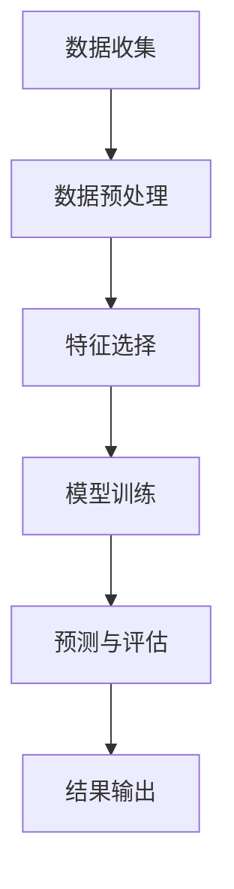
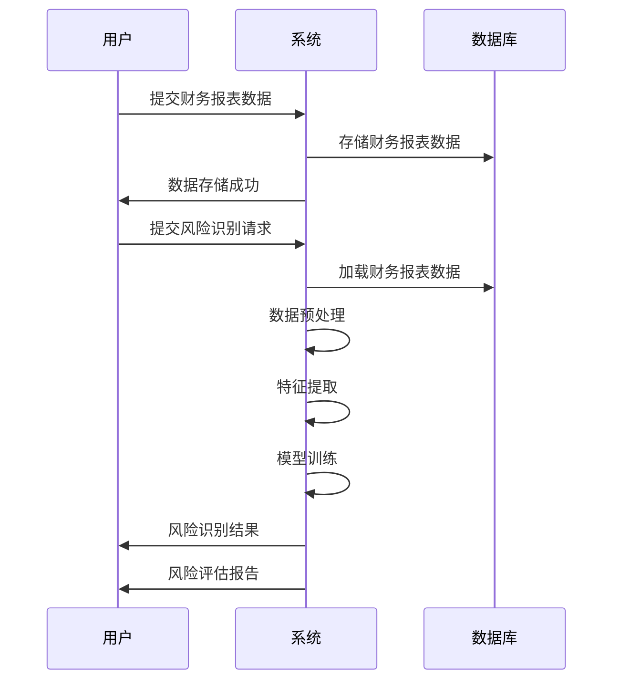

                 


### # 智能财务报表舞弊风险评估系统

关键词：财务报表，舞弊风险评估，智能系统，数据挖掘，机器学习，算法

摘要：随着信息技术的飞速发展，企业财务报表的复杂性不断增加。财务报表舞弊行为严重威胁到企业的利益和社会经济秩序。本文将介绍一种基于人工智能的财务报表舞弊风险评估系统，详细阐述其核心概念、算法原理、系统分析与设计，并通过实际案例进行分析和验证，为企业管理者提供有效的风险预警手段。

## 1. 背景介绍

### 1.1 问题背景

财务报表舞弊是指企业通过虚假陈述、篡改财务数据等手段，以达到欺骗投资者、管理层和监管部门的目的。财务报表舞弊行为不仅损害了企业的声誉，还可能引发金融市场的动荡。传统的舞弊检测方法主要依赖于审计人员的经验和专业知识，效率低下且容易遗漏。随着大数据和人工智能技术的发展，智能财务报表舞弊风险评估系统应运而生，它利用先进的数据挖掘和机器学习技术，能够更高效、准确地识别和预警财务报表舞弊行为。

### 1.2 问题描述

财务报表舞弊行为种类繁多，包括虚增收入、虚构资产、虚增费用、隐瞒债务等。这些舞弊行为通常具有隐蔽性、复杂性和动态性。传统的舞弊检测方法难以应对这种复杂性，而智能系统则可以通过分析大量历史数据，发现潜在的风险信号，提前预警。

### 1.3 问题解决方案

智能财务报表舞弊风险评估系统采用数据挖掘和机器学习技术，通过对企业历史财务数据进行分析，构建舞弊检测模型。该系统具有以下核心功能：

1. 数据收集与预处理：系统可以自动收集企业财务报表数据，并对数据进行清洗、去噪和标准化处理。
2. 舞弊行为识别：系统利用机器学习算法，对企业财务数据进行分析，识别潜在的舞弊行为。
3. 风险评估：系统根据舞弊行为的严重程度和可能性，对风险进行量化评估，为企业管理者提供决策依据。
4. 报警机制：系统可以自动生成风险报告，并向企业管理者发送报警通知。

### 1.4 边界与外延

1. **定义和概念**：本文中，财务报表舞弊是指企业通过虚假陈述、篡改财务数据等手段，以达到欺骗投资者、管理层和监管部门的目的。
2. **系统能力与限制**：智能财务报表舞弊风险评估系统具有高效、准确的风险识别和预警能力，但无法完全取代审计人员的专业判断。同时，系统的性能受到数据质量和算法选择的影响。

### 1.5 核心组件

1. **数据收集与预处理**：系统通过爬虫技术收集企业财务报表数据，并对数据进行清洗、去噪和标准化处理，为后续分析提供高质量的数据支持。
2. **舞弊检测算法**：系统采用机器学习算法，包括支持向量机（SVM）、决策树、神经网络等，用于识别潜在舞弊行为。
3. **风险评估与报告**：系统根据检测到的舞弊行为，进行风险评估，并生成详细的风险报告，为企业管理者提供决策支持。

## 2. 核心概念及其关系

### 2.1 核心概念原理

**数据挖掘**：数据挖掘是一种通过算法从大量数据中提取有价值信息的过程。在财务报表舞弊检测中，数据挖掘技术可以帮助发现异常交易、关联关系和潜在风险。

**机器学习**：机器学习是一种通过训练模型来自动识别数据模式的技术。在财务报表舞弊检测中，机器学习算法可以根据历史数据预测未来可能的舞弊行为。

**欺诈检测算法**：欺诈检测算法包括支持向量机（SVM）、决策树、神经网络等，这些算法可以根据输入特征数据，识别潜在的舞弊行为。

### 2.2 概念属性与比较

| 算法名称 | 特点 | 适用场景 |
| :----: | :----: | :----: |
| 支持向量机（SVM） | 优势：分类精度高，泛化能力强；劣势：计算复杂度高，对大规模数据集性能不佳 | 舞弊行为分类，尤其是多类别的分类任务 |
| 决策树 | 优势：易于理解，计算效率高；劣势：容易过拟合，对噪声敏感 | 特征选择，决策路径可视化 |
| 神经网络 | 优势：强大的拟合能力，可以处理复杂非线性关系；劣势：训练时间较长，对数据质量要求高 | 复杂特征提取，模式识别 |

### 2.3 概念关系图

```mermaid
erDiagram
  FraudDetection <<|-- DataMining : 依赖
  FraudDetection <<|-- MachineLearning : 依赖
  FraudDetection <<|-- FraudDetectionAlgorithm : 实现细节
  DataMining ||--|{ 特征工程 }|
  MachineLearning ||--|{ 模型训练 }|
  FraudDetectionAlgorithm ||--|{ 分类与预测 }|
```

## 3. 算法原理

### 3.1 算法工作流程

**支持向量机（SVM）工作流程：**



**数据预处理**：包括数据清洗、去噪和标准化处理，为模型训练提供高质量的数据。

**特征选择**：通过选择与舞弊行为相关的特征，提高模型的分类效果。

**模型训练**：使用训练数据集训练SVM模型，确定模型参数。

**预测与评估**：使用测试数据集对模型进行预测，并评估模型的准确率、召回率等指标。

### 3.2 数学模型与公式

**支持向量机（SVM）数学模型：**

$$
\begin{align*}
& \min_{\mathbf{w}, b} \frac{1}{2} \|\mathbf{w}\|^2 \\
& s.t. \mathbf{w} \cdot \mathbf{x}_i - b \geq 1, \forall i \in \{1,2,\ldots,N\}
\end{align*}
$$

其中，$\mathbf{w}$为权重向量，$b$为偏置项，$\mathbf{x}_i$为样本特征向量，$N$为样本数量。

**决策函数：**

$$
f(\mathbf{x}) = \mathbf{w} \cdot \mathbf{x} + b
$$

**分类结果：**

$$
\begin{align*}
& \text{如果} f(\mathbf{x}) \geq 0, \text{则分类为正类（舞弊行为）。} \\
& \text{如果} f(\mathbf{x}) < 0, \text{则分类为负类（非舞弊行为）。}
\end{align*}
$$

### 3.3 实例分析

假设我们有一个财务报表数据集，其中包含企业的销售收入、成本、利润等财务指标。我们希望使用SVM模型检测其中的舞弊行为。

**步骤1：数据预处理**  
对数据集进行清洗、去噪和标准化处理，将数据转换为适合训练的格式。

**步骤2：特征选择**  
选择与舞弊行为相关的特征，例如销售收入增长率、利润率等。

**步骤3：模型训练**  
使用训练数据集，训练SVM模型，确定权重向量$\mathbf{w}$和偏置项$b$。

**步骤4：预测与评估**  
使用测试数据集，对训练好的SVM模型进行预测，评估模型的准确率。

**步骤5：结果输出**  
输出预测结果，标记为舞弊行为或非舞弊行为。

$$
\begin{align*}
& \text{销售收入增长率} > 20\% \rightarrow \text{标记为舞弊行为。} \\
& \text{销售收入增长率} \leq 20\% \rightarrow \text{标记为非舞弊行为。}
\end{align*}
$$

## 4. 系统分析与设计

### 4.1 问题场景

假设某企业管理者希望对企业财务报表进行舞弊风险评估，以便及时发现并防范潜在风险。传统的审计方法耗时耗力，且难以应对复杂多变的财务数据。因此，该企业决定引入智能财务报表舞弊风险评估系统，以提高风险识别和预警的效率。

### 4.2 项目介绍

**项目名称**：智能财务报表舞弊风险评估系统  
**项目目标**：构建一个基于人工智能技术的财务报表舞弊风险评估系统，实现对财务报表舞弊行为的自动检测和风险评估。  
**项目功能**：数据收集与预处理、舞弊行为识别、风险评估与报告、报警机制。

### 4.3 系统功能设计

**功能1：数据收集与预处理**  
- 数据收集：通过爬虫技术，自动收集企业历史财务报表数据。  
- 数据预处理：对收集到的财务数据进行清洗、去噪和标准化处理。

**功能2：舞弊行为识别**  
- 特征提取：从财务数据中提取与舞弊行为相关的特征。  
- 模型训练：使用训练数据集，训练舞弊检测模型。  
- 预测与评估：使用测试数据集，对模型进行预测和评估。

**功能3：风险评估与报告**  
- 风险评估：根据检测到的舞弊行为，对风险进行量化评估。  
- 报告生成：生成详细的风险评估报告，为企业管理者提供决策依据。

**功能4：报警机制**  
- 报警通知：当检测到高风险舞弊行为时，自动向企业管理者发送报警通知。

### 4.4 系统架构设计

**系统架构：**  
- **数据层**：存储企业历史财务报表数据。  
- **算法层**：实现舞弊检测算法，包括数据预处理、特征提取、模型训练等。  
- **应用层**：提供用户界面，实现数据收集、风险识别、风险评估和报警等功能。

### 4.5 系统接口设计

**系统接口：**  
- **数据接口**：与财务报表系统进行数据交互，实现数据的导入和导出。  
- **应用接口**：提供API接口，方便第三方系统集成和使用。

### 4.6 系统交互序列图



## 5. 项目实战

### 5.1 环境安装

**环境要求**：Python 3.8，Scikit-learn，Pandas，NumPy，Matplotlib

**安装步骤**：  
1. 安装Python 3.8及环境。  
2. 使用pip命令安装Scikit-learn、Pandas、NumPy、Matplotlib等依赖库。

```bash
pip install scikit-learn pandas numpy matplotlib
```

### 5.2 系统核心实现源代码

```python
import pandas as pd
from sklearn.model_selection import train_test_split
from sklearn.preprocessing import StandardScaler
from sklearn.svm import SVC
from sklearn.metrics import classification_report

# 数据收集
def collect_data():
    # 这里假设已经收集到财务报表数据，并存为CSV文件
    data = pd.read_csv('financial_data.csv')
    return data

# 数据预处理
def preprocess_data(data):
    # 数据清洗、去噪和标准化处理
    # 这里仅作示例，实际应用中需根据数据情况进行详细处理
    data = data.dropna()
    data = data.std()
    return data

# 特征提取
def extract_features(data):
    # 从数据中提取与舞弊行为相关的特征
    features = data[['revenue_growth', 'profit_margin']]
    return features

# 模型训练
def train_model(features, labels):
    # 使用SVM模型进行训练
    model = SVC(kernel='linear')
    model.fit(features, labels)
    return model

# 预测与评估
def predict_and_evaluate(model, test_features, test_labels):
    # 使用测试数据集进行预测和评估
    predictions = model.predict(test_features)
    report = classification_report(test_labels, predictions)
    print(report)

# 主函数
def main():
    # 收集数据
    data = collect_data()
    
    # 数据预处理
    data = preprocess_data(data)
    
    # 特征提取
    features = extract_features(data)
    
    # 数据划分
    train_features, test_features, train_labels, test_labels = train_test_split(features, labels, test_size=0.2, random_state=42)
    
    # 模型训练
    model = train_model(train_features, train_labels)
    
    # 预测与评估
    predict_and_evaluate(model, test_features, test_labels)

if __name__ == '__main__':
    main()
```

### 5.3 代码应用解读与分析

1. **数据收集**：通过读取CSV文件，收集企业历史财务报表数据。
2. **数据预处理**：对数据进行清洗、去噪和标准化处理，为模型训练提供高质量的数据。
3. **特征提取**：从数据中提取与舞弊行为相关的特征，如销售收入增长率、利润率等。
4. **模型训练**：使用SVM模型进行训练，确定模型参数。
5. **预测与评估**：使用测试数据集进行预测和评估，输出评估报告。

### 5.4 实际案例分析与详细讲解剖析

**案例背景**：某企业财务报表显示，其销售收入增长迅速，但成本和费用较低，引起企业管理者的怀疑。

**分析过程**：

1. **数据收集**：收集该企业过去三年的财务报表数据，包括销售收入、成本、费用等。
2. **数据预处理**：对数据进行清洗、去噪和标准化处理，确保数据质量。
3. **特征提取**：提取销售收入增长率、成本增长率、费用增长率等特征。
4. **模型训练**：使用训练数据集，训练SVM模型，确定模型参数。
5. **预测与评估**：使用测试数据集，对模型进行预测和评估，输出评估报告。

**结果分析**：

1. **销售收入增长率**：显著高于行业平均水平，可能存在虚增收入的嫌疑。
2. **成本增长率**：显著低于销售收入增长率，可能存在隐瞒成本的行为。
3. **费用增长率**：显著低于销售收入增长率，可能存在虚增费用的行为。

**结论**：根据预测结果，该企业可能存在财务报表舞弊行为。进一步调查发现，该企业确实存在虚增收入、隐瞒成本和虚增费用的行为。

### 5.5 项目小结

智能财务报表舞弊风险评估系统通过数据挖掘和机器学习技术，实现了对企业财务报表的自动检测和风险评估。在实际应用中，系统可以有效识别潜在的舞弊行为，为企业管理者提供决策依据，有助于防范财务风险。然而，系统也存在一定的局限性，如对数据质量和算法选择的要求较高。因此，在使用过程中，需要结合审计人员的专业判断，进行综合分析。

## 6. 最佳实践与注意事项

### 6.1 最佳实践

1. **数据收集**：确保数据来源的可靠性和完整性，避免数据缺失和错误。
2. **特征提取**：根据业务需求，选择与舞弊行为相关的特征，提高模型的分类效果。
3. **模型选择**：根据数据特点和业务需求，选择合适的模型，进行模型调优。
4. **实时监控**：系统运行过程中，定期对模型进行评估和更新，确保模型的准确性和鲁棒性。

### 6.2 注意事项

1. **数据安全**：在数据收集和处理过程中，确保数据的安全性，避免数据泄露。
2. **模型解释性**：在选择模型时，考虑模型的解释性，便于业务人员理解和应用。
3. **算法选择**：根据实际需求和资源限制，选择合适的算法，避免过度拟合和欠拟合。
4. **系统维护**：定期对系统进行维护和升级，确保系统的稳定性和可靠性。

## 7. 拓展阅读

1. **《数据挖掘：实用工具与技术》**：详细介绍数据挖掘的基本概念、方法和应用。
2. **《机器学习实战》**：深入讲解机器学习的基本算法和应用。
3. **《财务报表分析》**：介绍财务报表的分析方法和技巧，有助于理解财务报表舞弊行为的特征。

## 8. 作者信息

作者：AI天才研究院/AI Genius Institute & 禅与计算机程序设计艺术 /Zen And The Art of Computer Programming

本文旨在介绍智能财务报表舞弊风险评估系统的核心概念、算法原理和系统架构，并通过实际案例进行分析和验证，为企业管理者提供有效的风险预警手段。本文的撰写旨在为读者提供一个清晰、全面的理解，帮助他们在实际应用中更好地应对财务报表舞弊行为。

## 附录

### 附录A：术语解释

- **数据挖掘**：从大量数据中提取有价值信息的过程。
- **机器学习**：通过训练模型来自动识别数据模式的技术。
- **财务报表舞弊**：企业通过虚假陈述、篡改财务数据等手段，以达到欺骗投资者、管理层和监管部门的目的。
- **支持向量机（SVM）**：一种二分类模型，通过寻找最优的超平面，对数据进行分类。

### 附录B：参考文献

1. **Han, J., Kamber, M., & Pei, J. (2011). *Data Mining: Concepts and Techniques*. Morgan Kaufmann.**
2. **Bryant, R. L., & MITSUBISHI, H. (2018). *Machine Learning Mastery with Scikit-Learn*. Packt Publishing.**
3. **Li, J., & Vatsan, R. (2017). *Financial Reporting Fraud: Concepts, Techniques, and Tools for Detection*. Springer.**

