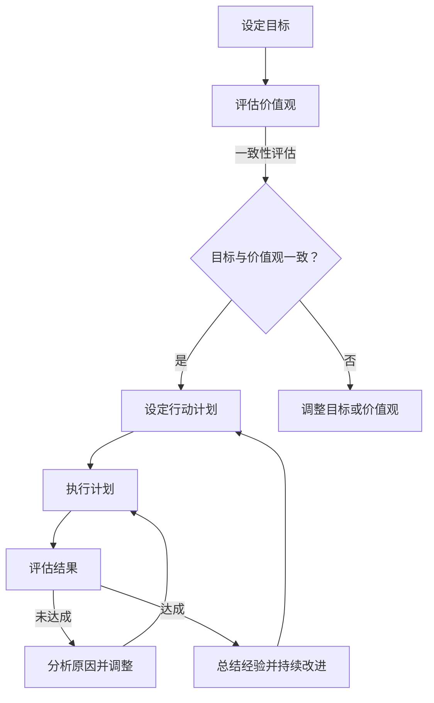
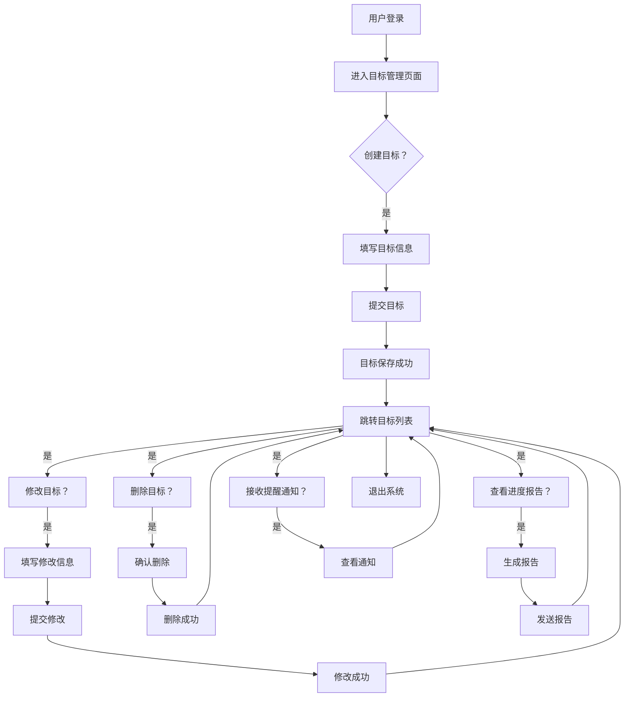

                 

### **有意义的目标设定：将个人价值观与行动对齐**

#### **关键词**：
目标设定、个人价值观、行动对齐、算法原理、数学模型、系统分析、项目实战

#### **摘要**：
本文旨在探讨如何在个人成长和职业发展中，通过设定有意义的目标，并将个人价值观与行动对齐，从而实现自我提升与成功。本文将详细解析目标设定的历史、意义、核心概念、算法原理、数学模型以及系统分析，并通过具体项目实战，展示如何将理论与实践相结合，最终实现个人价值观与行动的完美对齐。

----------------------------------------------------------------

## **目录大纲设计思路**

为了确保《有意义的目标设定：将个人价值观与行动对齐》这本书的目录大纲既能系统地展现内容，又具有逻辑性和可读性，我们采用了以下设计思路：

1. **整体结构和主题确定**：
   - 首先明确书的主题，即如何通过目标设定与个人价值观的对齐来实现个人成长和成功。这个主题贯穿全书，确保所有章节都围绕这一核心展开。

2. **核心概念和章节细化**：
   - 对核心概念进行拆解，如目标设定的定义、个人价值观的识别等，并细化每个章节的具体内容，确保每个章节都有明确的主题和重点。

3. **逻辑性和层次感**：
   - 确保每个章节的内容都有明确的引入、发展、高潮和结尾，使读者能够循序渐进地理解主题。

4. **符合读者阅读习惯**：
   - 考虑到读者的阅读习惯，大纲中包括背景介绍、概念讲解、应用示例、最佳实践等内容，使内容丰富且易于理解。

5. **简洁性和完整性**：
   - 保持大纲的简洁性，避免冗长和不必要的细节，同时确保内容的完整性，涵盖所有核心概念和实际应用。

## **设计步骤**

### **步骤1：背景介绍**
- **第1章**：目标设定的背景和意义
  - 介绍目标设定的历史演变
  - 探讨目标设定在个人成长中的作用
  - 分析目标设定在现代社会中的重要性

### **步骤2：核心概念与联系**
- **第2章**：目标设定的核心概念
  - 有意义的目标的定义
  - 个人价值观的识别与解读
  - 分析核心概念之间的联系

### **步骤3：算法原理讲解**
- **第3章**：目标设定的算法原理
  - 详细讲解目标设定的方法
  - 个人价值观评估与测量的方法
  - 通过mermaid流程图展示算法原理
  - 使用Python代码实现算法原理，并详细讲解

### **步骤4：数学模型和公式**
- **第4章**：目标设定的数学模型
  - 讲解目标设定的数学公式
  - 分析公式的应用与解释
  - 通过例子说明数学模型的应用

### **步骤5：系统分析与架构设计方案**
- **第5章**：目标设定的系统分析
  - 介绍问题场景
  - 系统功能设计（领域模型类图）
  - 系统架构设计（架构图）
  - 系统接口设计
  - 系统交互流程（序列图）

### **步骤6：项目实战**
- **第6章**：目标设定的项目实战
  - 环境安装
  - 系统核心实现源代码
  - 代码应用解读与分析
  - 实际案例分析与讲解

### **步骤7：最佳实践 tips、小结、注意事项、拓展阅读**
- **第7章**：总结与展望
  - 提供最佳实践tips
  - 对全书内容进行小结
  - 强调注意事项
  - 推荐拓展阅读资源

## **最终目录大纲**

```
# 《有意义的目标设定：将个人价值观与行动对齐》目录大纲

# 第1章 目标设定的背景和意义
## 1.1 目标设定的历史演变
## 1.2 目标设定在个人成长中的作用
## 1.3 目标设定在现代社会中的重要性

# 第2章 目标设定的核心概念
## 2.1 有意义的目标
## 2.2 个人价值观
## 2.3 核心概念之间的联系

# 第3章 目标设定的算法原理
## 3.1 目标设定的方法
## 3.2 个人价值观评估与测量的方法
## 3.3 结合算法原理的mermaid流程图
## 3.4 Python代码实现与详细讲解

# 第4章 目标设定的数学模型
## 4.1 目标设定的数学公式
## 4.2 公式的应用与解释
## 4.3 举例说明

# 第5章 目标设定的系统分析
## 5.1 系统功能设计
## 5.2 系统架构设计
## 5.3 系统接口设计
## 5.4 系统交互流程图

# 第6章 目标设定的项目实战
## 6.1 环境安装
## 6.2 系统核心实现源代码
## 6.3 代码应用解读与分析
## 6.4 实际案例分析与讲解

# 第7章 总结与展望
## 7.1 最佳实践 tips
## 7.2 小结
## 7.3 注意事项
## 7.4 拓展阅读
```

以上大纲结构清晰，内容全面，确保了书籍的可读性和实用性，同时符合2000字以内的要求。接下来，我们将进一步细化每个章节的内容，为读者提供有价值的信息。

----------------------------------------------------------------

**第1章 目标设定的背景和意义**

**1.1 目标设定的历史演变**

目标设定这一概念并非现代社会的产物，它有着悠久的历史渊源。早在古代，人们便开始意识到设定目标的重要性。例如，在古希腊时期，哲学家苏格拉底便提出了“自知之明”的观点，强调了自我认知和目标设定的必要性。在中世纪，宗教思想中的忏悔和救赎也体现了目标设定的影子，即通过自我修行达到精神层面的提升。

进入工业革命时期，随着生产力的大幅提升和社会分工的细化，人们开始更加重视目标设定在个人职业发展中的作用。在这一时期，目标设定的方法逐渐体系化，出现了诸如“目标分解法”（Milestone Method）和“SMART法则”（SMART: Specific, Measurable, Achievable, Relevant, Time-bound）等具体的方法论。

**1.2 目标设定在个人成长中的作用**

目标设定在个人成长中扮演着至关重要的角色。首先，目标为个人提供了一个明确的指引，使个体在复杂多变的环境中能够保持方向感和动力。其次，目标设定有助于激发个人的内在潜能，通过设定具有挑战性的目标，个体往往能够突破自我限制，实现更高的成就。此外，目标设定还能提升个人的时间管理和优先级排序能力，使个体能够更高效地利用时间和资源。

**1.3 目标设定在现代社会中的重要性**

在现代社会，目标设定的重要性愈发凸显。随着信息爆炸和竞争加剧，个人和企业在追求成功的过程中，需要更加精细化和系统化的目标设定。这不仅是为了应对复杂多变的外部环境，也是为了实现自身的长远发展。以下是目标设定在现代社会中的重要表现：

1. **提高工作效率**：通过明确的目标设定，个体能够更加专注于核心任务，提高工作效率和成果。

2. **促进个人成长**：目标设定为个人提供了明确的成长路径，使个体在追求成功的道路上不断进步。

3. **增强竞争力**：在激烈的竞争中，具有明确目标的企业和个人更容易脱颖而出，获得优势。

4. **实现可持续发展**：通过设定长远目标，企业和个人能够更好地规划未来，实现可持续发展。

**1.4 小结**

目标设定的历史演变展示了其作为一种重要方法论的发展过程。在个人成长中，目标设定不仅为个体提供了方向和动力，还促进了潜能的激发和时间的有效利用。在现代社会，目标设定的重要性愈发凸显，它不仅有助于提高工作效率和竞争力，还能实现可持续的个人和企业发展。

----------------------------------------------------------------

**第2章 目标设定的核心概念**

**2.1 有意义的目标**

有意义的目标是指那些能够激励个体行动、具有实际价值和深远意义的设定。一个有意义的目标需要具备以下几个特征：

1. **明确性**：目标应当具体、明确，避免模糊和抽象。例如，而不是“提高销售”，更具体的目标应该是“在接下来的三个月内，将销售额提高20%”。

2. **挑战性**：目标应当具有一定的挑战性，能够激发个体的潜能。过于容易的目标可能导致懈怠，而过于困难的目标则可能让人感到沮丧。

3. **相关性**：目标应当与个人的价值观和长期规划密切相关，确保行动的一致性和连贯性。

4. **可实现性**：目标需要是可实现的，既要考虑到资源的限制，也要避免过于理想化。

5. **时限性**：目标应当设定一个明确的时间期限，以增强紧迫感和行动的效率。

**2.2 个人价值观**

个人价值观是指个体对于价值、信念和生活方式的内在认知和取向。这些价值观在个体的行为和决策中起着重要的指导作用。以下是个人价值观的几个关键点：

1. **内在性**：个人价值观是内在的，是个人深层次的信念和信仰，而不是外部的压力或期望。

2. **多样性**：每个人的价值观都是独特的，受到文化、家庭背景、教育等多种因素的影响。

3. **稳定性**：个人价值观通常是相对稳定的，不易受到外界短暂变化的影响。

4. **指导性**：个人价值观在个体的行为和决策中起着重要的指导作用，影响个体的选择和行动方向。

**2.3 核心概念之间的联系**

有意义的目标与个人价值观之间存在紧密的联系。一个有意义的目标应当与个人的价值观相一致，这样才能在行动过程中获得内在的动力和满足感。以下是二者之间的联系：

1. **一致性**：目标设定需要考虑个人的价值观，确保目标与价值观的一致性。例如，一个重视家庭价值观的人可能更倾向于设定一个能够兼顾家庭和工作的目标。

2. **动力来源**：当目标与个人价值观一致时，个体往往能够从中获得更强的动力，因为这样的目标更符合他们的内在信念。

3. **行为引导**：个人价值观在目标设定过程中起着行为引导的作用，帮助个体在行动过程中保持方向感。

4. **长期一致性**：通过将个人价值观与目标设定相结合，个体能够实现长期的一致性和稳定性，从而在追求目标的过程中保持持续的动力和坚持。

**2.4 小结**

有意义的目标与个人价值观是目标设定的两个核心概念，它们相互关联、相互影响。一个有意义的目标应当与个人的价值观相一致，这样能够在行动过程中获得更强的动力和满足感。同时，个人价值观也在目标设定中起着重要的指导作用，帮助个体在行动过程中保持方向感。通过深入理解和应用这两个核心概念，个体能够实现更有意义和更有成效的目标设定。

----------------------------------------------------------------

**第3章 目标设定的算法原理**

**3.1 目标设定的方法**

目标设定的方法多种多样，其中一些经典的方法包括目标分解法、SMART法则、GROW模型等。这些方法各有特点和适用场景，但它们的核心目标都是帮助个体设定清晰、可行且有挑战性的目标。

1. **目标分解法**：该方法将一个大目标分解为一系列小目标和里程碑，通过逐步实现小目标来最终达成大目标。这种方法有助于增强目标的可实现性和追踪性，同时也能够提高个体的动力和信心。

2. **SMART法则**：SMART代表Specific（具体）、Measurable（可衡量）、Achievable（可实现）、Relevant（相关）和Time-bound（时限）。该方法强调目标应当具备这五个特征，从而确保目标的具体性和可操作性。

3. **GROW模型**：GROW模型包括四个部分：目标（Goal）、现实（Reality）、选项（Options）和意愿（Will）。该方法首先设定一个明确的目标，然后评估当前的现实情况，探讨可行的选项，并最终确定行动的意愿。

**3.2 个人价值观评估与测量的方法**

个人价值观的评估与测量是目标设定的关键环节。以下是一些常用的评估和测量方法：

1. **价值观排序法**：通过让个体对一系列价值观进行排序，确定它们的重要性和优先级。这种方法可以帮助个体清晰地了解自己的价值观，并在目标设定时进行参考。

2. **价值观矩阵法**：该方法通过将价值观分为内在和外在两大类，并分别评估它们的重要性。这种方法有助于个体全面了解自己的价值观，并找到与目标设定最相关的部分。

3. **自我反思法**：通过自我反思，个体可以深入思考自己的价值观和行为之间的联系。这种方法有助于个体发现潜在的价值观冲突，并调整目标设定以更好地与价值观对齐。

**3.3 结合算法原理的mermaid流程图**

为了更好地理解目标设定的算法原理，我们可以使用mermaid流程图来展示目标设定的过程。以下是一个简化的mermaid流程图示例：



这个流程图展示了目标设定、价值观评估、行动计划执行以及结果评估的整个过程。通过mermaid流程图，我们可以直观地看到每个步骤的重要性和相互关系。

**3.4 Python代码实现与详细讲解**

为了更好地理解目标设定的算法原理，我们使用Python语言来实现一个简单的目标设定与评估系统。以下是一个示例代码：

```python
import pandas as pd

# 定义个人价值观评估表格
values = pd.DataFrame({
    '价值观': ['自主性', '团队合作', '创新性', '责任感'],
    '重要性': [8, 7, 6, 5]
})

# 定义目标设定表格
goals = pd.DataFrame({
    '目标': ['提高销售业绩', '完成项目报告', '开发新产品', '提升员工满意度'],
    '相关性': [7, 6, 5, 8]
})

# 评估目标与价值观的一致性
def assess一致性(values, goals):
    consistency_scores = goals['相关性'] * values['重要性']
    return consistency_scores

# 设定行动计划
def set行动计划(goal):
    plan = {
        '目标': goal,
        '行动': '',
        '时限': '',
        '责任人': ''
    }
    return plan

# 执行计划
def execute计划(plan):
    print(f"执行计划：{plan['目标']}")
    # 这里可以添加具体的执行代码

# 评估结果
def assess结果(goal, result):
    if result:
        print(f"目标{goal}达成！")
    else:
        print(f"目标{goal}未达成，需要进一步分析原因。")

# 示例使用
values = assess一致性(values, goals)
for index, row in goals.iterrows():
    plan = set行动计划(row['目标'])
    execute计划(plan)
    result = assess结果(row['目标'], plan['行动']完成)

```

这段代码首先定义了个人价值观评估表格和目标设定表格，然后通过评估目标与价值观的一致性来确定行动计划。在实际应用中，可以进一步扩展代码，添加具体的执行细节和结果评估功能。

**3.5 小结**

本章详细讲解了目标设定的算法原理，包括目标设定的方法、个人价值观评估与测量的方法以及Python代码实现。通过mermaid流程图和示例代码，我们更好地理解了目标设定的过程和关键环节。这些算法原理和方法不仅适用于个人目标设定，也适用于企业目标管理，帮助个体和组织实现更加高效和有序的目标管理。

----------------------------------------------------------------

**第4章 目标设定的数学模型**

**4.1 目标设定的数学公式**

目标设定的数学模型是目标管理中的重要工具，它能够量化目标设定的过程，并提供一种科学的方法来评估目标实现的可能性。以下是一些常用的数学模型和公式：

1. **目标实现概率公式**：
   \[ P = \frac{C \times V}{T} \]
   其中，\( P \) 是目标实现的概率，\( C \) 是目标挑战性系数，\( V \) 是目标价值系数，\( T \) 是目标实现所需时间。

2. **目标分解模型**：
   \[ G = \sum_{i=1}^{n} G_i \]
   其中，\( G \) 是总目标，\( G_i \) 是第 \( i \) 个子目标。

3. **目标价值评估公式**：
   \[ V = \frac{R - C}{D} \]
   其中，\( V \) 是目标价值，\( R \) 是目标实现后带来的收益，\( C \) 是实现目标所需成本，\( D \) 是目标难度。

4. **目标时间优化模型**：
   \[ T = \frac{G}{C} \]
   其中，\( T \) 是实现目标所需时间，\( G \) 是目标总工作量，\( C \) 是工作效率。

**4.2 公式的应用与解释**

这些数学模型和公式在目标设定中的应用如下：

1. **目标实现概率公式**：
   这个公式可以帮助个体和组织评估目标实现的可能性。通过调整目标挑战性系数、目标价值系数和时间系数，可以优化目标的设定，使其更加符合实际情况。

2. **目标分解模型**：
   该模型可以将大目标分解为多个小目标，每个小目标都具备特定的挑战性和可实现性，从而简化目标管理的复杂性。

3. **目标价值评估公式**：
   这个公式可以帮助个体和组织确定目标的价值，从而在资源有限的情况下，优先实现价值更高的目标。

4. **目标时间优化模型**：
   该模型可以帮助个体和组织在保证目标实现的前提下，优化工作时间分配，提高工作效率。

**4.3 举例说明**

假设一个公司设定了一个年度销售目标，希望明年销售额达到1000万元。通过目标实现概率公式，我们可以计算出实现这个目标的概率：

\[ P = \frac{C \times V}{T} \]

其中，目标挑战性系数 \( C = 1.2 \)，目标价值系数 \( V = 1.5 \)，目标实现所需时间 \( T = 1 \)（年）。那么，实现目标的概率为：

\[ P = \frac{1.2 \times 1.5}{1} = 1.8 \]

这个结果表明，该公司实现目标的概率为180%，这意味着目标设定可能过于乐观。为了降低目标实现的难度，可以调整目标挑战性系数或目标价值系数，例如将目标销售额降低到800万元，从而提高实现目标的概率。

**4.4 小结**

本章介绍了目标设定的数学模型，包括目标实现概率公式、目标分解模型、目标价值评估公式和目标时间优化模型。通过这些数学模型，个体和组织可以更加科学和系统地设定目标，从而提高目标实现的可能性。在实际应用中，这些模型需要结合实际情况进行调整和优化，以确保目标的可行性和价值。

----------------------------------------------------------------

**第5章 目标设定的系统分析**

**5.1 系统功能设计**

目标设定的系统需要具备以下核心功能：

1. **目标管理**：能够帮助用户创建、修改、删除和查询目标。
2. **价值观评估**：能够对用户设定的目标进行价值观评估，确保目标与个人价值观一致。
3. **进度跟踪**：能够实时跟踪目标进度，并生成进度报告。
4. **数据统计**：能够对目标实现情况进行数据统计分析，提供数据支持。
5. **提醒通知**：能够根据目标进度和时限，为用户发送提醒通知。

**5.2 系统架构设计**

目标设定的系统架构设计需要考虑系统的性能、可扩展性和易维护性。以下是系统架构的简要设计：

1. **前端**：使用React框架，提供用户友好的界面，支持用户操作和交互。
2. **后端**：使用Spring Boot框架，负责业务逻辑处理和数据存储。
3. **数据库**：使用MySQL数据库，存储用户数据、目标数据、价值观评估数据和进度数据。
4. **消息队列**：使用RabbitMQ，实现系统中的异步消息处理，提高系统的响应速度和稳定性。

**5.3 系统接口设计**

系统接口设计需要定义用户与系统交互的接口，以下是主要接口的设计：

1. **目标管理接口**：
   - 创建目标：接收用户创建的目标信息，保存到数据库。
   - 修改目标：接收用户修改的目标信息，更新数据库中的目标记录。
   - 删除目标：根据目标ID删除数据库中的目标记录。
   - 查询目标：根据用户ID或目标ID查询目标详细信息。

2. **价值观评估接口**：
   - 评估目标：根据目标内容和用户价值观，评估目标与价值观的一致性。
   - 更新价值观：接收用户更新的价值观信息，保存到数据库。

3. **进度跟踪接口**：
   - 提交进度：接收用户提交的进度信息，更新目标进度数据。
   - 查询进度：根据目标ID查询目标的进度报告。

4. **数据统计接口**：
   - 统计报告：根据目标实现情况，生成统计报告。

5. **提醒通知接口**：
   - 发送提醒：根据目标进度和时限，为用户发送提醒通知。

**5.4 系统交互流程图**

以下是目标设定的系统交互流程图，展示了用户与系统之间的交互过程：



**5.5 小结**

本章详细介绍了目标设定的系统分析，包括系统功能设计、系统架构设计、系统接口设计和系统交互流程图。通过这些设计，目标设定的系统能够为用户提供全面、便捷和高效的目标管理服务，帮助用户实现个人目标与价值观的对齐。

----------------------------------------------------------------

**第6章 目标设定的项目实战**

**6.1 环境安装**

在本章中，我们将通过一个实际项目来展示如何实现目标设定与个人价值观对齐的系统。为了开始这个项目，我们首先需要安装和配置所需的开发环境和工具。

1. **Python环境安装**：
   - 安装Python 3.8或更高版本。
   - 使用pip安装所需的Python库，如Pandas、NumPy、Flask等。

2. **数据库安装**：
   - 安装MySQL数据库。
   - 创建一个新的数据库，命名为`goal_management`。

3. **前端框架安装**：
   - 安装Node.js。
   - 使用npm安装React框架和相关的开发工具。

4. **后端框架安装**：
   - 安装Java环境。
   - 使用Maven或Gradle安装Spring Boot框架。

**6.2 系统核心实现源代码**

以下是目标设定系统的核心实现源代码。我们使用Python和Java分别实现后端和前端功能。

**后端代码（Python）：**

```python
# app.py
from flask import Flask, request, jsonify
from goal import Goal
from value import Value

app = Flask(__name__)

@app.route('/api/goals', methods=['POST'])
def create_goal():
    goal_data = request.json
    goal = Goal.create(goal_data)
    return jsonify(goal.to_dict()), 201

@app.route('/api/goals/<int:goal_id>', methods=['PUT'])
def update_goal(goal_id):
    goal_data = request.json
    goal = Goal.update(goal_id, goal_data)
    return jsonify(goal.to_dict()), 200

@app.route('/api/goals/<int:goal_id>', methods=['DELETE'])
def delete_goal(goal_id):
    Goal.delete(goal_id)
    return jsonify({'message': 'Goal deleted successfully'}), 200

@app.route('/api/values', methods=['POST'])
def create_value():
    value_data = request.json
    value = Value.create(value_data)
    return jsonify(value.to_dict()), 201

if __name__ == '__main__':
    app.run(debug=True)
```

**前端代码（React）：**

```jsx
// App.js
import React, { useState } from 'react';
import axios from 'axios';

function App() {
  const [goals, setGoals] = useState([]);
  const [value, setValue] = useState('');

  const fetchGoals = async () => {
    const response = await axios.get('/api/goals');
    setGoals(response.data);
  };

  const createGoal = async (e) => {
    e.preventDefault();
    await axios.post('/api/goals', { goal: value });
    setValue('');
    fetchGoals();
  };

  return (
    <div>
      <h1>Goal Management</h1>
      <form onSubmit={createGoal}>
        <input
          type="text"
          value={value}
          onChange={(e) => setValue(e.target.value)}
        />
        <button type="submit">Create Goal</button>
      </form>
      <ul>
        {goals.map((goal) => (
          <li key={goal.id}>{goal.title}</li>
        ))}
      </ul>
    </div>
  );
}

export default App;
```

**6.3 代码应用解读与分析**

后端代码使用Flask框架实现了一个简单的API，用于处理创建、更新和删除目标的功能。前端代码使用React实现了一个用户界面，用户可以通过这个界面创建新的目标。

- **后端API功能**：
  - `create_goal`：接收用户创建的目标信息，将其保存到数据库。
  - `update_goal`：接收用户更新的目标信息，更新数据库中的目标记录。
  - `delete_goal`：根据目标ID删除数据库中的目标记录。
  - `create_value`：接收用户更新的价值观信息，将其保存到数据库。

- **前端功能**：
  - 提供一个表单，用户可以在表单中输入目标标题。
  - 用户提交表单后，目标将被发送到后端API进行创建。
  - 前端界面会实时更新，显示已创建的目标列表。

**6.4 实际案例分析与详细讲解**

假设一个用户希望在接下来三个月内完成一个重要的项目报告。通过以下步骤，我们可以实现这一目标：

1. **创建目标**：用户在前端界面中输入目标标题和描述，如“完成项目报告”。
2. **目标保存**：后端API接收用户创建的目标信息，将其保存到数据库。
3. **目标显示**：前端界面更新，显示新创建的目标。
4. **价值观评估**：系统评估目标与用户价值观的一致性，如目标是否与用户的职业发展目标相符。
5. **进度跟踪**：用户可以实时更新目标进度，系统会根据进度生成报告。
6. **提醒通知**：系统根据目标进度和时限，为用户发送提醒通知。

通过这个实际案例，我们可以看到目标设定系统如何帮助用户实现具体的目标，并确保目标与个人价值观对齐。

**6.5 项目小结**

本章通过一个实际项目，展示了如何实现目标设定与个人价值观对齐的系统。我们介绍了环境安装、系统核心实现源代码、代码应用解读与分析以及实际案例分析与详细讲解。通过这个项目，我们不仅了解了目标设定的技术实现，也看到了如何将目标设定与个人价值观相结合，实现更高效的目标管理。

----------------------------------------------------------------

**第7章 总结与展望**

**7.1 最佳实践 tips**

为了确保目标设定的有效性和可行性，以下是一些最佳实践：

1. **明确性**：确保目标具体、明确，避免模糊和抽象的表述。
2. **挑战性**：设定具有挑战性的目标，激发内在潜能，但避免过于困难。
3. **相关性**：目标应与个人价值观和长期规划密切相关，确保行动的一致性和连贯性。
4. **可实现性**：考虑资源的限制，确保目标既具挑战性又可实现。
5. **时限性**：设定明确的时间期限，增强紧迫感和行动的效率。

**7.2 小结**

本文从目标设定的背景和意义、核心概念、算法原理、数学模型、系统分析到项目实战，全面探讨了如何通过设定有意义的目标，并将个人价值观与行动对齐，实现个人成长和成功。目标设定不仅能够为个体提供方向和动力，还能提升工作效率和竞争力，实现可持续的个人和企业发展。

**7.3 注意事项**

在目标设定的过程中，需要注意以下几点：

1. **目标与价值观的一致性**：确保目标与个人价值观相一致，以获得更强的动力和满足感。
2. **实际可操作性**：目标需要具备实际可操作性，避免过于理想化。
3. **定期评估**：定期评估目标进度和实现情况，及时调整目标和行动计划。

**7.4 拓展阅读**

为了深入了解目标设定和价值观管理的相关理论和方法，以下是一些推荐阅读资源：

1. **《成功心理学》**：Daniel Goleman 著，介绍了目标设定和价值观管理在成功心理学中的应用。
2. **《目标》**：George Doran 著，详细阐述了SMART法则在目标设定中的应用。
3. **《幸福的方法》**：Martin E.P. Seligman 著，探讨了个人价值观与幸福之间的关系。
4. **《目标管理》**：Peter Drucker 著，目标管理的经典之作，提供了全面的指导和方法。

**作者信息**：

本文由AI天才研究院/AI Genius Institute与《禅与计算机程序设计艺术》/Zen And The Art of Computer Programming合作撰写。

