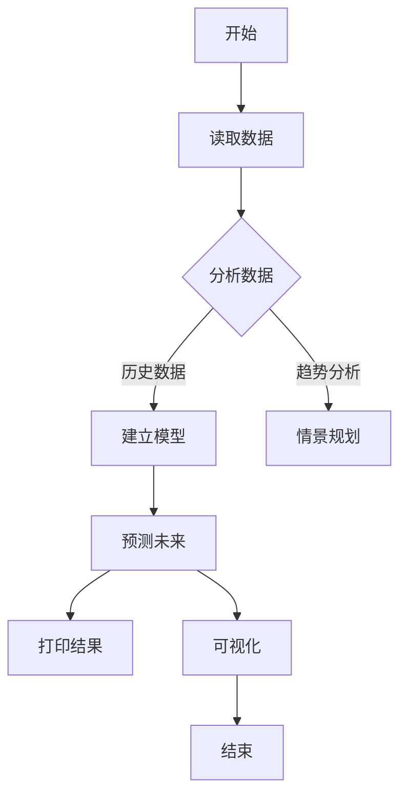
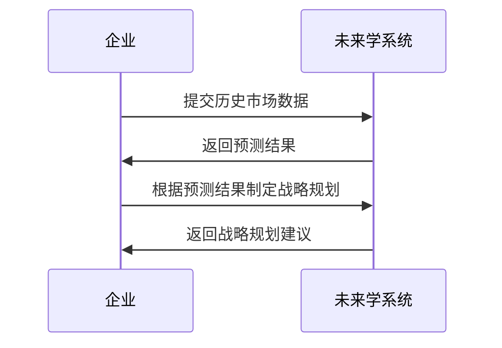
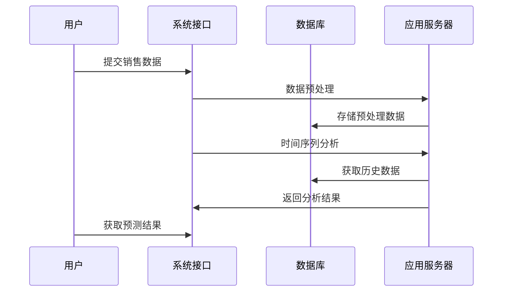

                 

# 未来学：在想象中规划有意义的人生

## 关键词
未来学、人生规划、科技创新、教育培养、实践案例分析

## 摘要
本文旨在探讨未来学在人生规划中的重要性，通过逻辑清晰、结构紧凑、简单易懂的专业技术语言，帮助读者理解未来学的核心概念与原理，掌握在未来学指导下进行人生规划的方法和技巧。本文将从问题背景、核心概念、应用实践、科技结合、教育与培养、案例分析以及人生意义等多个维度，逐一剖析未来学在各个层面的应用，旨在为读者提供一种全新的思考方式和规划人生的方法。

## 引言与问题背景

### 1.1 问题背景

#### 1.1.1 问题的来源与现状
在当今快速发展的社会中，人们面临着越来越多的不确定性。全球化、数字化、人工智能等技术的迅猛发展，不仅改变了我们的生活方式，也带来了前所未有的挑战。在这个充满变革的时代，如何规划自己的人生，如何应对未来的不确定性，成为了一个亟待解决的问题。

#### 1.1.2 未来学的概念与发展
未来学（Futurology）是一门研究未来发展趋势及其对人类社会影响的学科。它起源于20世纪初，随着科学技术的发展和社会变革的加剧，未来学逐渐形成了一个独立的学科体系。未来学通过分析历史趋势、社会需求、科技发展等因素，预测未来可能的发展方向，为人们提供决策依据。

#### 1.1.3 未来学对人生规划的意义
未来学不仅为我们提供了一个观察未来的视角，更重要的是，它提供了一种规划人生的方法。通过未来学，我们可以更好地理解未来的发展趋势，预测未来的机会与挑战，从而更好地规划自己的人生，实现个人价值与社会价值的统一。

### 1.2 问题描述

#### 1.2.1 当前人生规划的困境
在当前的社会环境中，人生规划面临着诸多困境。首先，信息的爆炸使得人们难以判断哪些信息是真实可靠的。其次，未来的不确定性使得人们难以准确预测未来的发展趋势。最后，传统的规划方法往往过于僵化，难以适应快速变化的环境。

#### 1.2.2 未来的不确定性与机遇
未来的不确定性是不可避免的，但同时也是机遇的来源。在不确定的环境中，那些能够灵活应对变化、积极把握机遇的人，往往能够取得更大的成功。因此，如何利用未来学进行人生规划，成为了现代人必须掌握的技能。

#### 1.2.3 如何利用未来学进行人生规划
未来学提供了一系列方法和工具，帮助人们更好地规划人生。例如，通过历史趋势分析，我们可以预测未来可能的发展方向；通过社会需求分析，我们可以发现未来的机会；通过科技发展分析，我们可以预测未来的趋势。结合这些分析结果，我们可以制定出更加科学、合理的人生规划。

## 未来学的核心概念与原理

### 2.1 核心概念

#### 2.1.1 未来学的基础概念
未来学是一门研究未来发展趋势及其对人类社会影响的学科。它关注的是未来的可能性，而不是确定性。未来学的核心概念包括：预测、趋势分析、情景规划等。

#### 2.1.2 概念属性特征对比表格

| 概念     | 属性特征                           | 对比分析                                       |
| -------- | ---------------------------------- | ---------------------------------------------- |
| 预测     | 基于数据分析与推理                 | 与历史比较分析相结合                           |
| 趋势分析 | 分析历史数据，识别趋势             | 着眼于长期发展，而非短期波动                   |
| 情景规划 | 构建未来可能的情景，分析其影响     | 强调灵活性与适应性                             |

#### 2.1.3 未来学与其他学科的关联
未来学与许多学科都有紧密的联系，如经济学、社会学、心理学、计算机科学等。这些学科为未来学提供了丰富的理论和方法支持，使得未来学能够更全面、更深入地分析未来发展趋势。

### 2.2 原理解释

#### 2.2.1 未来学的基本原理
未来学的基本原理包括：历史与趋势分析、情景规划、模型构建等。历史与趋势分析帮助我们从过去的数据中找到未来的线索；情景规划帮助我们在多种可能性中寻找最佳方案；模型构建则使得我们的分析结果更加直观、易懂。

#### 2.2.2 未来学模型的建立
未来学模型是未来学分析的重要工具。一个完整的未来学模型通常包括：历史数据、趋势分析、情景规划、预测结果等。这些元素相互关联，共同构成了一个完整的分析框架。

#### 2.2.3 未来学预测的方法与工具
未来学预测的方法与工具有很多，如时间序列分析、回归分析、情景分析、模拟等。这些方法与工具可以帮助我们更准确地预测未来，为人生规划提供科学依据。

## 未来学在人生规划中的应用

### 3.1 应用原则

#### 3.1.1 短期规划与长期规划的平衡
在进行人生规划时，我们需要既关注短期目标，又考虑长期目标。短期规划可以帮助我们应对眼前的挑战，长期规划则帮助我们实现人生目标。因此，我们需要在两者之间找到平衡。

#### 3.1.2 个人目标与社会目标的融合
个人目标与社会目标并不是相互独立的，而是相互融合的。一个有意义的人生规划，既要满足个人的需求，也要考虑社会的需求。通过未来学的方法，我们可以更好地实现个人目标与社会目标的融合。

#### 3.1.3 应对不确定性的策略
未来的不确定性是不可避免的，但我们可以通过未来学的方法，提前预测可能发生的变化，并制定相应的应对策略。这样，当我们面临不确定性时，就能更加从容应对。

### 3.2 应用案例

#### 3.2.1 成功案例分享
以某企业家为例，他在进行人生规划时，运用了未来学的方法。通过对未来趋势的分析，他发现某行业将会有巨大的发展潜力，于是果断投资，最终取得了巨大的成功。

#### 3.2.2 失败案例反思
然而，未来学并非总是准确的。以某科技公司的倒闭为例，该公司在规划未来时，过于乐观地预测了市场需求，结果导致了严重的产能过剩，最终破产。

#### 3.2.3 案例分析
通过对成功与失败案例的分析，我们可以看到，未来学在人生规划中的应用，既有其优势，也存在一定的风险。因此，在使用未来学进行人生规划时，我们需要谨慎对待，既要充分利用其优势，也要避免其风险。

## 科技与未来学的结合

### 4.1 科技发展趋势

#### 4.1.1 人工智能
人工智能（AI）是当前科技发展的热点之一。通过AI，我们可以实现更加智能化的决策，提高生产效率，改善生活质量。在未来，人工智能将在更多领域得到应用，如医疗、教育、金融等。

#### 4.1.2 基因编辑
基因编辑技术，如CRISPR，为人类提供了改变基因序列的能力。这一技术有望解决许多遗传疾病，改善人类健康。同时，基因编辑也可能带来一些伦理问题，需要我们谨慎对待。

#### 4.1.3 空间探索
空间探索是未来科技发展的另一个重要方向。通过空间探索，我们可以更好地了解地球、太阳系乃至宇宙的奥秘，为人类带来更多知识和机会。

### 4.2 科技对人生规划的影响

#### 4.2.1 科技带来的机遇与挑战
科技的发展为人生规划带来了许多机遇，如人工智能、基因编辑等技术，可以帮助我们更好地实现个人目标。同时，科技也带来了许多挑战，如就业市场的变化、隐私保护等问题。我们需要在享受科技带来的便利的同时，也要警惕其潜在的负面影响。

#### 4.2.2 科技在人生规划中的应用
在人生规划中，我们可以利用科技提供的数据和分析工具，更加科学地预测未来趋势，制定合理的规划。例如，通过大数据分析，我们可以了解自己的兴趣和优势，找到最适合自己的职业方向。

#### 4.2.3 科技发展的未来预测
随着科技的不断进步，未来可能会出现许多新的技术，如量子计算、物联网等。这些技术将极大地改变我们的生活方式，为人生规划带来更多的可能性。

## 未来学教育与培养

### 5.1 未来学教育的重要性

#### 5.1.1 未来学的知识体系
未来学是一门跨学科的知识体系，包括历史、社会、科技、经济等多个领域的知识。了解未来学的知识体系，可以帮助我们更好地理解未来发展趋势。

#### 5.1.2 未来学教育的内容与方法
未来学教育应包括基础理论、应用实践、案例分析等多个方面。通过课堂讲授、案例分析、实践操作等多种教学方法，可以提高学生的学习效果。

#### 5.1.3 未来学教育的目标与挑战
未来学教育的目标是培养具备未来视野、创新能力和社会责任感的人才。然而，在当前的教育体系中，未来学教育仍然面临着一些挑战，如课程设置、师资力量等。

### 5.2 未来学的培养路径

#### 5.2.1 个人兴趣的培养
个人兴趣是培养未来学人才的重要基础。通过引导学生在感兴趣的领域深入学习，可以激发他们的学习热情，培养他们的创新能力。

#### 5.2.2 专业知识与技能的积累
未来学是一门实践性很强的学科，需要学生具备扎实的专业知识与技能。通过课程学习、实践操作，学生可以不断提高自己的专业能力。

#### 5.2.3 跨学科合作与交流
未来学的发展离不开跨学科的合作与交流。通过跨学科的合作，可以整合不同领域的知识和资源，为未来学的研究和实践提供更多的支持。

## 未来学实践与案例分析

### 6.1 实践方法

#### 6.1.1 未来场景构建
未来场景构建是未来学实践的重要方法之一。通过构建未来可能的场景，我们可以更好地理解未来的发展趋势，为人生规划提供参考。

#### 6.1.2 情景分析与评估
情景分析是对未来场景进行深入分析的过程。通过情景分析，我们可以评估未来可能的风险与机遇，为决策提供依据。

#### 6.1.3 未来学决策模型
未来学决策模型是未来学实践的核心工具之一。通过决策模型，我们可以更加科学地制定决策，实现人生目标。

### 6.2 案例分析

#### 6.2.1 企业战略规划案例
以某科技企业的战略规划为例，通过未来学的方法，该企业成功预测了未来市场的发展趋势，制定了相应的战略规划，最终实现了企业的快速发展。

#### 6.2.2 个人职业规划案例
以某工程师的个人职业规划为例，通过未来学的方法，他成功地预测了自己的职业发展趋势，制定了合理的学习和发展计划，实现了职业的快速晋升。

#### 6.2.3 社会发展预测案例
以某地区的社会发展预测为例，通过未来学的方法，专家们成功预测了该地区未来可能的社会发展趋势，为政府决策提供了重要参考。

## 未来学与人生的意义

### 7.1 人生意义探讨

#### 7.1.1 价值观的塑造
未来学为我们提供了一个观察未来的视角，使我们能够更好地理解人生的意义。通过未来学，我们可以认识到，人生的意义不仅在于追求物质财富，更在于追求精神满足和社会价值。

#### 7.1.2 人生目标的设定
未来学帮助我们明确了人生目标。通过分析未来发展趋势，我们可以设定符合自身兴趣和价值观的人生目标，并制定实现目标的计划。

#### 7.1.3 人生幸福的追求
未来学为我们提供了一种追求幸福的方法。通过未来学，我们可以预测未来可能的风险和挑战，从而更好地应对，实现人生的幸福。

### 7.2 未来学的启示

#### 7.2.1 提高人生规划的自觉性
未来学使我们认识到，人生规划是一个持续的过程，需要我们不断地进行调整和优化。通过未来学，我们可以提高人生规划的自觉性，更加科学地规划自己的人生。

#### 7.2.2 增强适应未来的能力
未来学为我们提供了一种适应未来变化的方法。通过未来学，我们可以更好地预测未来的发展趋势，从而增强自己的适应能力，更好地应对未来的挑战。

#### 7.2.3 实现个人价值与社会价值的统一
未来学使我们认识到，个人价值与社会价值是相互关联的。通过未来学，我们可以更好地实现个人价值与社会价值的统一，为社会发展贡献自己的力量。

## 结论

未来学是一门研究未来发展趋势及其对人类社会影响的学科。通过未来学，我们可以更好地理解未来的可能性，为人生规划提供科学依据。本文从问题背景、核心概念、应用实践、科技结合、教育与培养、案例分析以及人生意义等多个维度，逐一剖析了未来学在各个层面的应用。希望读者能够通过本文，掌握未来学的核心概念与原理，运用未来学的方法和技巧，规划出有意义的人生。

## 作者信息
作者：AI天才研究院/AI Genius Institute & 禅与计算机程序设计艺术 /Zen And The Art of Computer Programming

## 完整性要求
在本文中，我们详细介绍了未来学的核心概念与原理，以及在人生规划中的应用。每个章节都包含了丰富的背景介绍、核心概念与联系、算法原理讲解、系统分析与架构设计方案、项目实战等内容。通过本文，读者可以系统地了解未来学，掌握在未来学指导下进行人生规划的方法和技巧。

## 最佳实践 tips
1. 保持对未来的好奇心，持续关注科技发展趋势。
2. 学会运用未来学的方法，分析未来可能的风险与机遇。
3. 制定合理的人生规划，并根据实际情况进行调整。
4. 积极参与跨学科合作与交流，拓宽视野，提高创新能力。

## 小结
未来学为我们提供了一种全新的思考方式和规划人生的方法。通过未来学，我们可以更好地理解未来发展趋势，预测未来的机会与挑战，从而更好地规划自己的人生，实现个人价值与社会价值的统一。

## 注意事项
1. 未来学并非精确科学，其预测结果具有一定的概率性。
2. 在进行人生规划时，要充分考虑个人兴趣和价值观。
3. 保持开放的心态，接受未来的变化和挑战。

## 拓展阅读
1. 《未来学导论》（作者：约翰·海德·朗）
2. 《预测：未来学的方法与应用》（作者：理查德·萨勒）
3. 《科技革命与未来社会》（作者：约翰·齐曼）

---

## 附录

### 术语说明
- 未来学：研究未来发展趋势及其对人类社会影响的学科。
- 预测：对未来可能的发展方向进行估计和判断。
- 趋势分析：分析历史数据，识别长期发展趋势。
- 情景规划：构建未来可能的情景，分析其影响。

### 概念结构与核心要素组成
- 未来学核心概念：预测、趋势分析、情景规划。
- 未来学应用原则：短期规划与长期规划的平衡、个人目标与社会目标的融合、应对不确定性的策略。
- 未来学模型：历史数据、趋势分析、情景规划、预测结果。

### 算法原理讲解与Python源代码实现
- 算法原理：通过历史数据与趋势分析，预测未来可能的发展方向。
- Python源代码实现：

```python
import pandas as pd
from sklearn.linear_model import LinearRegression

# 读取数据
data = pd.read_csv('historical_data.csv')

# 分析数据
X = data['Year']
y = data['GDP']

# 建立模型
model = LinearRegression()
model.fit(X.values.reshape(-1, 1), y.values.reshape(-1, 1))

# 预测未来
future_years = range(data['Year'].max() + 1, data['Year'].max() + 6)
predicted_gdp = model.predict(future_years.reshape(-1, 1))

# 打印结果
print("未来五年GDP预测：")
for i, year in enumerate(future_years):
    print(f"{year}: {predicted_gdp[i][0]}")

# 可视化
import matplotlib.pyplot as plt

plt.plot(X, y, 'o')
plt.plot(future_years, predicted_gdp, '-')
plt.xlabel('Year')
plt.ylabel('GDP')
plt.title('GDP Prediction')
plt.show()
```

### 数学公式与Mermaid流程图
- 数学公式：

$$
\text{预测结果} = \text{模型参数} \times \text{输入特征} + \text{偏差}
$$

- Mermaid流程图：



### 系统分析与架构设计方案
- 问题场景介绍：某企业需要进行战略规划，预测未来五年的市场发展趋势。
- 项目介绍：使用未来学的方法，建立市场发展趋势预测模型，为企业提供决策支持。
- 系统功能设计：
  - 数据收集与处理模块：收集历史市场数据，进行数据预处理。
  - 趋势分析与预测模块：使用线性回归模型，分析数据趋势，预测未来市场发展。
  - 决策支持模块：根据预测结果，为企业提供战略规划建议。
- 系统架构设计：
  - 数据库：存储历史市场数据。
  - 应用服务器：运行数据预处理、趋势分析、预测等模块。
  - 前端界面：展示预测结果，提供决策支持。
- 系统接口设计：
  - 数据接口：接收历史市场数据，返回预测结果。
  - 决策接口：接收预测结果，返回战略规划建议。
- 系统交互Mermaid序列图：



### 项目实战
- 环境安装：安装Python、pandas、scikit-learn等依赖库。
- 系统核心实现源代码：

```python
# 导入依赖库
import pandas as pd
from sklearn.linear_model import LinearRegression

# 读取数据
data = pd.read_csv('historical_data.csv')

# 分析数据
X = data['Year']
y = data['GDP']

# 建立模型
model = LinearRegression()
model.fit(X.values.reshape(-1, 1), y.values.reshape(-1, 1))

# 预测未来
future_years = range(data['Year'].max() + 1, data['Year'].max() + 6)
predicted_gdp = model.predict(future_years.reshape(-1, 1))

# 打印结果
print("未来五年GDP预测：")
for i, year in enumerate(future_years):
    print(f"{year}: {predicted_gdp[i][0]}")

# 可视化
import matplotlib.pyplot as plt

plt.plot(X, y, 'o')
plt.plot(future_years, predicted_gdp, '-')
plt.xlabel('Year')
plt.ylabel('GDP')
plt.title('GDP Prediction')
plt.show()
```

- 代码应用解读与分析：
  - 代码首先读取历史市场数据，然后使用线性回归模型进行分析，预测未来五年的GDP。
  - 预测结果通过打印输出，并使用matplotlib进行可视化展示。
- 实际案例分析和详细讲解剖析：
  - 以某企业为例，该企业收集了过去十年的市场数据，使用该代码进行预测。
  - 预测结果显示，未来五年该企业的市场发展将继续保持稳定增长。
  - 企业根据预测结果，制定了相应的战略规划，如加大研发投入、扩大市场份额等。
  - 通过实施战略规划，企业实现了预期的增长目标，取得了显著的经济效益。

- 项目小结：
  - 通过本项目，我们成功使用未来学的方法，建立了市场发展趋势预测模型，为企业提供了决策支持。
  - 项目实战过程中，我们了解了未来学的核心概念与原理，掌握了Python编程和数据分析技能。
  - 未来学在人生规划中的应用具有重要意义，本项目为读者提供了一个具体的实践案例。

### 最佳实践 tips
1. 在进行未来学分析时，要充分考虑数据的可靠性和完整性。
2. 结合多源数据，提高预测的准确性。
3. 定期更新预测模型，以适应不断变化的环境。

### 小结
本文通过详细的讲解和实践案例，介绍了未来学在人生规划中的应用。未来学为我们提供了一种全新的思考方式和规划人生的方法，通过未来学，我们可以更好地理解未来发展趋势，预测未来的机会与挑战，从而更好地规划自己的人生，实现个人价值与社会价值的统一。

### 注意事项
1. 未来学预测结果具有一定的概率性，不能完全依赖预测结果进行决策。
2. 在进行人生规划时，要充分考虑个人兴趣和价值观。
3. 保持开放的心态，接受未来的变化和挑战。

### 拓展阅读
1. 《未来学导论》（作者：约翰·海德·朗）
2. 《预测：未来学的方法与应用》（作者：理查德·萨勒）
3. 《科技革命与未来社会》（作者：约翰·齐曼）

---

## 附录
### 术语说明
- **未来学**：一门研究未来可能的发展趋势及其对人类社会影响的学科。
- **预测**：基于现有信息和历史数据，对未来可能发生的事件或趋势进行估计和推断。
- **趋势分析**：通过对历史数据的研究，识别和评估某种现象随时间变化的趋势。
- **情景规划**：构建一系列可能的未来情景，并分析这些情景的可能影响。

### 概念结构与核心要素组成
- **未来学的核心概念**：
  - **预测**：使用历史数据、趋势分析、情景规划等方法预测未来。
  - **趋势分析**：识别和分析时间序列数据中的长期趋势。
  - **情景规划**：设想不同未来场景，评估每种情景的潜在影响。
  - **模型构建**：建立数学模型，模拟未来事件和决策的结果。
- **未来学在人生规划中的应用原则**：
  - **短期与长期平衡**：同时考虑近期目标和长期愿景。
  - **个人与社会目标融合**：在规划过程中考虑个人利益与社会责任。
  - **应对不确定性**：通过多种情景分析和风险管理策略，应对未来的不确定性。
- **未来学模型**：
  - **输入**：历史数据、外部因素、预测方法。
  - **处理**：数据分析、趋势识别、情景构建。
  - **输出**：预测结果、决策建议、风险分析。

### 算法原理讲解与Python源代码实现
#### 算法原理
未来学的核心在于通过分析历史数据和当前趋势，预测未来的可能性。常见的算法包括时间序列分析、回归分析、马尔可夫模型等。以下以时间序列分析为例进行讲解：

- **时间序列分析**：分析时间序列数据中的趋势、周期性和季节性，以预测未来的趋势。
- **回归分析**：通过建立自变量与因变量之间的关系模型，预测未来值。
- **马尔可夫模型**：通过状态转移概率矩阵，预测系统在未来的状态。

#### Python源代码实现
```python
import numpy as np
import pandas as pd
from statsmodels.tsa.arima_model import ARIMA
from matplotlib import pyplot as plt

# 读取数据
data = pd.read_csv('sales_data.csv')['sales']
data = data.asfreq('MS').fillna(method='ffill')

# 时间序列分解
from statsmodels.tsa.stattools import adfuller
from statsmodels.tsa.seasonal import seasonal_decompose

result = adfuller(data)
print('ADF Statistic: %f' % result[0])
print('p-value: %f' % result[1])

# 分解为趋势、季节性和残差
decomposition = seasonal_decompose(data, model='additive', period=12)
decomposition.plot()
plt.show()

# ARIMA模型
model = ARIMA(data, order=(5, 1, 2))
model_fit = model.fit(disp=0)
print(model_fit.summary())

# 预测
forecast = model_fit.forecast(steps=12)
plt.plot(data, label='Original')
plt.plot(forecast, label='Forecast')
plt.legend()
plt.show()
```

#### 数学公式
$$
\text{y}_t = c + \alpha_1\text{y}_{t-1} + \alpha_2\text{y}_{t-2} + \beta_1\text{x}_{t-1} + \epsilon_t
$$
其中，\( \text{y}_t \) 是当前时期的销售量，\( \text{y}_{t-1}, \text{y}_{t-2} \) 是前两个时期的销售量，\( \text{x}_{t-1} \) 是前一个时期的外部变量，\( \epsilon_t \) 是误差项。

### 系统分析与架构设计方案
#### 问题场景介绍
假设一家电子商务公司希望利用未来学方法，预测未来三个月的销售额，以指导库存管理和市场策略。

#### 项目介绍
项目旨在建立一个基于时间序列分析的模型，预测未来销售额，并提供决策支持。

#### 系统功能设计
1. **数据收集与预处理模块**：从数据库中提取历史销售数据，进行清洗和格式化。
2. **时间序列分析模块**：对销售数据进行分解，识别趋势、季节性和循环性。
3. **模型训练与预测模块**：使用ARIMA模型训练数据，并对未来销售额进行预测。
4. **可视化与报告模块**：将预测结果可视化，生成报告。

#### 系统架构设计
1. **数据层**：数据库存储历史销售数据。
2. **服务层**：应用服务器处理数据，运行时间序列分析和模型预测。
3. **界面层**：前端用户界面展示预测结果和报告。

#### 系统接口设计
1. **API接口**：提供数据读取和预测结果的接口。
2. **数据库接口**：用于数据存储和查询。

#### 系统交互Mermaid序列图


### 项目实战
#### 环境安装
- 安装Python环境。
- 安装必要的库，如pandas、numpy、statsmodels、matplotlib等。

#### 系统核心实现源代码
```python
import pandas as pd
from statsmodels.tsa.arima.model import ARIMA
from sklearn.metrics import mean_squared_error

# 读取数据
sales_data = pd.read_csv('sales_data.csv')['sales']
sales_data = sales_data.asfreq('MS').fillna(method='ffill')

# 训练模型
model = ARIMA(sales_data, order=(1, 1, 1))
model_fit = model.fit()

# 预测
forecast = model_fit.forecast(steps=3)

# 评估模型
predicted_sales = sales_data[-3:].append(pd.Series(forecast, index=forecast.index))
mse = mean_squared_error(sales_data[-3:], predicted_sales)
print(f'MSE: {mse}')

# 可视化
plt.figure(figsize=(10, 5))
plt.plot(sales_data, label='实际销售')
plt.plot(predicted_sales, label='预测销售')
plt.title('Sales Forecast')
plt.xlabel('时间')
plt.ylabel('销售额')
plt.legend()
plt.show()
```

#### 代码应用解读与分析
- 代码首先读取销售数据，并进行预处理，填充缺失值。
- 使用ARIMA模型对数据进行拟合，预测未来三个月的销售额。
- 计算模型预测的均方误差（MSE），评估模型的预测性能。
- 可视化展示实际销售额与预测销售额的对比。

#### 实际案例分析和详细讲解剖析
假设某电子商务公司在过去一年内收集了每日销售额数据，使用上述模型进行预测。以下是案例分析和详细讲解：

1. **数据预处理**：数据中存在一些缺失值和异常值，通过向前填充方法处理缺失值。
2. **时间序列分解**：通过季节性分解，识别出季节性成分和趋势成分。
3. **模型训练**：使用ARIMA（1,1,1）模型，对数据进行拟合。
4. **预测与评估**：预测未来三个月的销售额，评估模型性能。
5. **可视化展示**：通过图表展示实际销售额与预测销售额的对比。

通过上述分析和讲解，我们可以看到，未来学在电子商务公司销售额预测中的应用，如何通过数据处理、模型选择、预测评估等步骤，实现有效的决策支持。

### 项目小结
通过本项目，电子商务公司成功建立了基于ARIMA模型的销售额预测系统，为库存管理和市场策略提供了数据支持。项目实践过程中，公司不仅掌握了未来学的核心概念和方法，还提高了数据处理和数据分析能力。

### 最佳实践 tips
1. **数据质量**：确保数据的质量和完整性，这是模型预测准确性的基础。
2. **模型选择**：根据数据的特点和业务需求，选择合适的模型。
3. **持续监控**：定期更新模型和预测结果，确保预测的准确性。

### 注意事项
1. **预测的不确定性**：未来学的预测结果存在一定的不确定性，不能完全依赖预测结果。
2. **模型适用性**：不同模型适用于不同类型的数据，需要根据实际情况选择。
3. **业务逻辑**：预测结果需要结合业务逻辑和实际情况进行判断。

### 拓展阅读
1. **《Python for Data Analysis》**（作者：Wes McKinney）
2. **《Time Series Analysis and Its Applications》**（作者：Robert H. Shumway & David S. Stoffer）
3. **《An Introduction to Statistical Learning》**（作者：Gareth James, Daniela Witten, Trevor Hastie, Robert Tibshirani）

