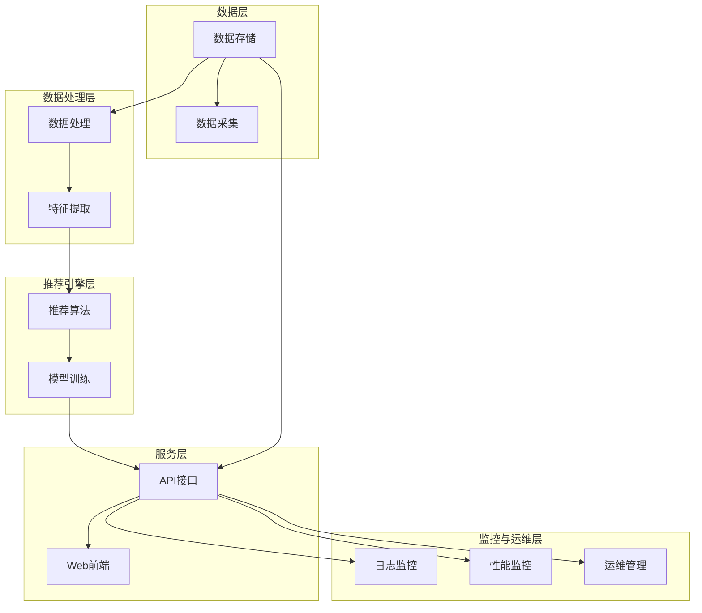

                 

### 1.1 问题的提出

随着互联网的迅猛发展，职业技能推荐系统已经成为现代职场的关键需求。对于企业和用户而言，如何根据用户的职业背景、技能需求和职业发展目标，为他们提供个性化、精准的职业推荐，成为了一个重要的研究课题。然而，传统的推荐算法在处理职业技能推荐问题时，常常面临以下几大挑战：

- **数据稀疏问题**：职业技能推荐系统中，用户与职业技能之间的交互数据相对较少，导致数据稀疏问题。这在很大程度上限制了传统推荐算法的性能。

- **冷启动问题**：对于新用户或新职业技能，由于缺乏足够的交互数据，推荐系统无法为其提供有效的推荐，这被称为冷启动问题。

- **用户行为多样性**：用户在职业技能选择上存在多样性，传统推荐算法往往难以充分考虑到用户个性化的偏好和需求。

为了应对这些挑战，机器学习技术应运而生。通过从大量职业技能数据中自动学习用户的行为模式和职业技能之间的关联，机器学习算法能够有效地解决传统推荐算法的瓶颈问题，从而为企业和用户提供更加个性化和精准的职业推荐。

接下来，本文将系统地探讨机器学习在个性化职业技能推荐中的应用，包括基础理论、算法实现、系统设计与优化等多个方面，旨在为读者提供一个全面而深入的指导。通过本文的学习，读者将能够掌握机器学习在职业技能推荐领域的应用原理和实践方法，为相关领域的研究和开发提供有力支持。

### 1.2 核心概念

#### 1.2.1 机器学习

机器学习（Machine Learning）是一种通过算法让计算机从数据中学习模式和规律，进而进行预测和决策的人工智能技术。它主要分为以下几种类型：

1. **监督学习（Supervised Learning）**：监督学习通过训练数据集，建立输入与输出之间的映射关系，从而进行预测。常用的算法包括线性回归、逻辑回归和决策树等。

2. **无监督学习（Unsupervised Learning）**：无监督学习从没有标签的数据中自动发现数据中的模式和结构，常用的算法包括聚类算法（如K-均值聚类）和降维算法（如主成分分析）。

3. **强化学习（Reinforcement Learning）**：强化学习通过智能体与环境之间的交互，不断学习和优化策略，以实现最大化奖励的目标。常见的算法包括Q学习和深度强化学习。

#### 1.2.2 个性化推荐

个性化推荐（Personalized Recommendation）是一种根据用户的兴趣、行为和需求，为其提供定制化推荐内容的服务。其核心目标是提高用户体验、增加用户粘性和提升业务收益。

个性化推荐系统通常采用以下几种方法：

1. **协同过滤（Collaborative Filtering）**：协同过滤通过分析用户的历史行为和相似用户的行为，为用户提供推荐。它包括基于用户的协同过滤和基于物品的协同过滤。

2. **内容推荐（Content-based Filtering）**：内容推荐通过分析物品的内容特征和用户的兴趣特征，为用户提供推荐。

3. **混合推荐（Hybrid Recommendation）**：混合推荐将协同过滤和内容推荐相结合，以提供更加准确和个性化的推荐结果。

#### 1.2.3 职业技能推荐

职业技能推荐（Skill-based Recommendation）是一种针对职场人士，根据其职业背景、技能需求和职业发展目标，为其推荐合适的职业技能培训课程、学习资源或职业机会的推荐方式。

职业技能推荐的关键在于如何从海量职业技能数据中提取有效信息，并构建适合的推荐模型。以下是构建职业技能推荐系统的几个关键步骤：

1. **数据收集**：收集用户职业背景、职业技能需求、行为记录等数据。

2. **数据预处理**：对收集的数据进行清洗、去重、填充缺失值等处理，确保数据质量。

3. **特征提取**：从原始数据中提取与职业技能相关的特征，如职业技能标签、用户职业背景、学习进度等。

4. **模型选择**：根据推荐任务的特点，选择合适的机器学习算法，如协同过滤、内容推荐或混合推荐。

5. **模型训练与优化**：使用训练数据集训练推荐模型，并通过交叉验证和A/B测试等方法进行模型优化。

6. **推荐生成**：根据用户特征和模型预测，生成个性化的职业技能推荐列表。

通过上述核心概念的介绍，我们可以更好地理解机器学习在个性化职业技能推荐中的应用原理和实施步骤。接下来，本文将深入探讨机器学习在职业技能推荐中的应用，包括相关算法的实现和优化方法。

#### 1.3 本书结构

本书旨在系统地探讨机器学习在个性化职业技能推荐中的应用，为企业和用户提供有效的职业技能推荐方案。全书共分为七个部分，各部分内容如下：

- **第一部分：问题背景与核心概念**  
  介绍个性化职业技能推荐问题的背景和核心概念，包括机器学习、个性化推荐和职业技能推荐等。

- **第二部分：机器学习基础**  
  详细讲解机器学习的基本概念、分类和应用，包括监督学习、无监督学习和强化学习等。

- **第三部分：个性化推荐算法**  
  探讨个性化推荐算法的实现原理，包括协同过滤、内容推荐和混合推荐等。

- **第四部分：职业技能数据预处理**  
  讲解职业技能数据的收集、清洗、特征提取和预处理方法。

- **第五部分：推荐系统设计与实现**  
  介绍职业技能推荐系统的设计与实现，包括系统架构、数据流和接口设计。

- **第六部分：推荐系统评估与优化**  
  讨论推荐系统的评估指标和方法，以及如何优化推荐效果。

- **第七部分：案例分析与实战**  
  通过实际案例，展示如何应用机器学习技术构建和优化职业技能推荐系统。

通过上述结构，本书将带领读者从理论到实践，全面深入地了解机器学习在个性化职业技能推荐中的应用，为实际项目提供有力的指导和参考。

## 第二部分：机器学习基础

在深入探讨机器学习在个性化职业技能推荐中的应用之前，我们首先需要了解机器学习的基本概念和分类。机器学习是一种让计算机从数据中学习模式和规律，并利用这些知识进行预测和决策的技术。它主要分为监督学习、无监督学习和强化学习三种类型，每种类型都有其独特的应用场景和算法。

### 2.1 监督学习

监督学习是一种最常用的机器学习方法，其核心思想是通过训练数据集来学习输入和输出之间的映射关系，从而在新的数据上进行预测。监督学习可以分为线性回归、逻辑回归和决策树等几种常见的算法。

#### 2.1.1 线性回归

线性回归是一种用于预测连续值的监督学习算法，其基本模型可以表示为：

$$
y = w_0 + w_1 \cdot x
$$

其中，\( y \) 是预测值，\( x \) 是输入特征，\( w_0 \) 和 \( w_1 \) 是模型参数。线性回归的目标是通过最小化误差平方和来优化参数 \( w_0 \) 和 \( w_1 \)：

$$
\min_{w_0, w_1} \sum_{i=1}^{n} (y_i - (w_0 + w_1 \cdot x_i))^2
$$

线性回归适用于输入和输出之间存在线性关系的场景，例如预测房价、股票价格等。

#### 2.1.2 逻辑回归

逻辑回归是一种用于分类问题的监督学习算法，其基本模型可以表示为：

$$
\text{logit}(p) = \ln\left(\frac{p}{1-p}\right)
$$

其中，\( p \) 是输出概率。逻辑回归的目标是通过最小化损失函数来优化模型参数：

$$
\min_{\theta} \sum_{i=1}^{n} -y_i \cdot \text{log}(p_i) - (1 - y_i) \cdot \text{log}(1 - p_i)
$$

逻辑回归适用于二分类问题，例如判断一个用户是否会购买某个产品。

#### 2.1.3 决策树

决策树是一种基于树形结构进行分类或回归的算法，其基本结构可以表示为：


决策树的每个节点代表一个特征，每个分支代表一个特征取值，叶节点代表最终的分类或回归结果。决策树的学习过程包括以下步骤：

1. **选择最优特征**：选择能够最大化信息增益（分类问题）或最小化均方误差（回归问题）的特征。
2. **划分数据**：根据选定的特征将数据集划分成若干个子集。
3. **递归构建**：对每个子集重复上述步骤，直到满足停止条件（如最大深度、最小节点大小等）。

决策树易于理解和解释，但容易出现过拟合现象。为了解决这一问题，可以使用剪枝（Pruning）技术来剪掉过度拟合的部分。

### 2.2 无监督学习

无监督学习是一种不依赖于标签数据，仅从数据中自动发现模式和结构的机器学习方法。它主要包括聚类（Clustering）和降维（Dimensionality Reduction）等算法。

#### 2.2.1 K-均值聚类

K-均值聚类是一种基于距离度量的聚类算法，其基本思想是将数据分为K个簇，每个簇由一个中心点（centroid）表示。算法步骤如下：

1. **初始化**：随机选择K个初始中心点。
2. **分配数据**：计算每个数据点到各个中心点的距离，将每个数据点分配到距离最近的中心点所在的簇。
3. **更新中心点**：计算每个簇的新中心点，即该簇内所有数据点的均值。
4. **重复步骤2和3**，直到中心点不再发生变化或达到预设的迭代次数。

K-均值聚类适用于数据点有明显聚类结构的场景，但容易受到初始中心点选择的影响。

#### 2.2.2 主成分分析

主成分分析（Principal Component Analysis，PCA）是一种降维算法，通过将数据投影到主成分空间，降低数据维度并保持主要信息。PCA的基本步骤如下：

1. **计算协方差矩阵**：计算数据集的协方差矩阵。
2. **计算协方差矩阵的特征值和特征向量**：对协方差矩阵进行特征分解，得到特征值和特征向量。
3. **选择主成分**：根据特征值的大小选择前\( k \)个特征向量作为主成分。
4. **投影数据**：将数据投影到由主成分构成的子空间，实现降维。

PCA适用于高维数据的降维，可以减少计算复杂度并保持数据的主要信息。

### 2.3 强化学习

强化学习是一种通过智能体与环境之间的交互，不断学习和优化策略的机器学习方法。其核心思想是通过学习最优的动作策略，实现最大化累积奖励。强化学习可以分为值迭代（Value Iteration）和策略迭代（Policy Iteration）两种方法。

#### 2.3.1 Q学习

Q学习是一种基于值迭代的强化学习算法，其目标是通过迭代更新Q值函数，找到最优动作策略。Q学习的基本步骤如下：

1. **初始化**：初始化Q值函数。
2. **选择动作**：根据当前状态和Q值函数选择动作。
3. **更新Q值**：根据更新规则（如贪心策略或期望策略）更新Q值函数。
4. **重复步骤2和3**，直到达到收敛条件或达到预设的迭代次数。

Q学习适用于离散状态和动作空间，可以处理复杂的环境和策略优化问题。

通过以上对监督学习、无监督学习和强化学习的基本概念和算法介绍，我们可以看到机器学习在解决实际问题中的应用潜力。接下来，本文将探讨如何将机器学习应用于个性化职业技能推荐，以及相关的算法实现和优化方法。

### 2.1 监督学习

监督学习是机器学习中最基础也是应用最广泛的一种类型，它通过从带有标签的训练数据集中学习到输入和输出之间的关系，然后在新数据上进行预测。监督学习算法可以分为线性回归、逻辑回归和决策树等。下面，我们将逐一介绍这些算法的基本原理和实现。

#### 2.1.1 线性回归

线性回归是一种简单且常用的监督学习算法，主要用于预测连续值。其基本模型可以表示为：

$$
y = w_0 + w_1 \cdot x
$$

其中，\( y \) 是预测值，\( x \) 是输入特征，\( w_0 \) 和 \( w_1 \) 是模型的参数。线性回归的目标是最小化预测值与真实值之间的误差平方和，即：

$$
\min_{w_0, w_1} \sum_{i=1}^{n} (y_i - (w_0 + w_1 \cdot x_i))^2
$$

这个最小化过程通常通过梯度下降法（Gradient Descent）来实现，具体步骤如下：

1. **初始化参数**：随机初始化 \( w_0 \) 和 \( w_1 \)。
2. **计算损失函数**：对于每个数据点，计算预测值与真实值之间的误差。
3. **计算梯度**：计算损失函数关于参数的梯度。
4. **更新参数**：根据梯度和学习率更新参数。
5. **重复步骤2-4**，直到达到收敛条件。

以下是一个简单的Python代码示例，实现了线性回归的梯度下降算法：

```python
import numpy as np

# 梯度下降函数
def gradient_descent(X, y, learning_rate, epochs):
    n_samples, n_features = X.shape
    w = np.zeros((n_features, 1))
    for _ in range(epochs):
        predictions = X @ w
        dw = (predictions - y) @ X
        w -= learning_rate * dw
    return w

# 加载数据
X = np.array([[1, 2], [2, 3], [3, 4], [4, 5]])
y = np.array([3, 5, 7, 9])

# 训练模型
w = gradient_descent(X, y, learning_rate=0.01, epochs=1000)

print("模型参数：", w)
```

#### 2.1.2 逻辑回归

逻辑回归是一种用于二分类问题的监督学习算法，它通过逻辑函数（Logistic Function）将线性回归的输出映射到概率空间。逻辑回归的基本模型可以表示为：

$$
\text{logit}(p) = \ln\left(\frac{p}{1-p}\right) = w_0 + w_1 \cdot x
$$

其中，\( p \) 是输出概率，其他符号与线性回归相同。逻辑回归的目标是最小化损失函数：

$$
\min_{w_0, w_1} \sum_{i=1}^{n} -y_i \cdot \text{log}(p_i) - (1 - y_i) \cdot \text{log}(1 - p_i)
$$

逻辑回归的梯度下降过程与线性回归类似，只是损失函数不同。以下是一个简单的Python代码示例，实现了逻辑回归的梯度下降算法：

```python
import numpy as np

# 梯度下降函数
def gradient_descent(X, y, learning_rate, epochs):
    n_samples, n_features = X.shape
    w = np.zeros((n_features, 1))
    for _ in range(epochs):
        predictions = 1 / (1 + np.exp(-X @ w))
        dw = (predictions - y) @ X
        w -= learning_rate * dw
    return w

# 加载数据
X = np.array([[1, 2], [2, 3], [3, 4], [4, 5]])
y = np.array([0, 1, 1, 0])

# 训练模型
w = gradient_descent(X, y, learning_rate=0.01, epochs=1000)

print("模型参数：", w)
```

#### 2.1.3 决策树

决策树是一种基于树形结构进行分类或回归的算法，其基本结构可以表示为：


决策树的学习过程包括以下步骤：

1. **选择最优特征**：选择能够最大化信息增益（分类问题）或最小化均方误差（回归问题）的特征。
2. **划分数据**：根据选定的特征将数据集划分成若干个子集。
3. **递归构建**：对每个子集重复上述步骤，直到满足停止条件（如最大深度、最小节点大小等）。

以下是一个简单的Python代码示例，实现了决策树的构建：

```python
import numpy as np
from collections import defaultdict

# 决策树分类器
class DecisionTreeClassifier:
    def __init__(self, max_depth=None):
        self.max_depth = max_depth

    def fit(self, X, y):
        self.tree = self._build_tree(X, y)

    def _build_tree(self, X, y, depth=0):
        # 停止条件
        if depth >= self.max_depth or len(set(y)) == 1:
            return y[0]
        
        # 选择最优特征
        best_feature, best_score = None, -1
        for feature in range(X.shape[1]):
            score = self._info_gain(y, X[:, feature])
            if score > best_score:
                best_feature, best_score = feature, score
        
        # 划分数据
        tree = {best_feature: {}}
        for value, subset in zip(X[:, best_feature], y):
            subset_X, subset_y = X[X[:, best_feature] == value], y[X[:, best_feature] == value]
            tree[best_feature][value] = self._build_tree(subset_X, subset_y, depth + 1)
        
        return tree

    def _info_gain(self, y, split_feature):
        # 计算总信息熵
        entropy = -sum(p * np.log2(p) for p in np.unique(y, return_counts=True)[1] / len(y))
        
        # 计算特征的信息熵
        weights = [sum(y[X[:, feature] == value] for value in np.unique(split_feature)) / len(y) for feature in np.unique(split_feature)]
        split_entropy = sum(w * (-w * np.log2(w)) for w in weights if w > 0)
        
        # 计算信息增益
        gain = entropy - split_entropy
        return gain

# 加载数据
X = np.array([[1, 2], [2, 3], [3, 4], [4, 5], [1, 3], [2, 4], [3, 5], [4, 6]])
y = np.array([0, 1, 1, 0, 0, 1, 1, 0])

# 训练模型
clf = DecisionTreeClassifier(max_depth=3)
clf.fit(X, y)

# 输出决策树
print(clf.tree)
```

通过以上对线性回归、逻辑回归和决策树的基本原理和实现介绍，我们可以看到这些算法在监督学习中的应用和重要性。接下来，我们将进一步探讨无监督学习算法。

### 2.2 无监督学习

无监督学习是一种不依赖于标签数据的机器学习方法，其主要目标是发现数据内在的结构和规律。无监督学习算法主要包括聚类算法和降维算法。本节将介绍两种常见的无监督学习算法：K-均值聚类和主成分分析（PCA）。

#### 2.2.1 K-均值聚类

K-均值聚类是一种基于距离度量的聚类算法，其目的是将数据集划分为K个簇，使得每个簇内的数据点尽可能接近簇中心。算法的基本步骤如下：

1. **初始化中心点**：随机选择K个初始中心点。
2. **分配数据点**：计算每个数据点到各个中心点的距离，将每个数据点分配到距离最近的中心点所在的簇。
3. **更新中心点**：计算每个簇的新中心点，即该簇内所有数据点的均值。
4. **重复步骤2和3**，直到中心点不再发生变化或达到预设的迭代次数。

以下是一个简单的Python代码示例，实现了K-均值聚类：

```python
import numpy as np

# K-均值聚类
class KMeans:
    def __init__(self, K, max_iters=100):
        self.K = K
        self.max_iters = max_iters

    def fit(self, X):
        self.centroids = X[np.random.choice(X.shape[0], self.K, replace=False)]
        for _ in range(self.max_iters):
            # 分配数据点
            self.labels = self._assign_clusters(X)
            # 更新中心点
            self.centroids = np.array([X[self.labels == k].mean(axis=0) for k in range(self.K)])
        return self

    def _assign_clusters(self, X):
        distances = np.linalg.norm(X[:, np.newaxis] - self.centroids, axis=2)
        return np.argmin(distances, axis=1)

# 加载数据
X = np.array([[1, 2], [1, 4], [1, 0], [10, 2], [10, 4], [10, 0]])

# 训练模型
kmeans = KMeans(K=2)
kmeans.fit(X)

# 输出聚类结果
print(kmeans.labels)
```

#### 2.2.2 主成分分析

主成分分析（PCA）是一种降维算法，通过将数据投影到新的坐标系（主成分空间），降低数据维度并保持主要信息。PCA的基本步骤如下：

1. **计算协方差矩阵**：计算数据集的协方差矩阵。
2. **计算协方差矩阵的特征值和特征向量**：对协方差矩阵进行特征分解，得到特征值和特征向量。
3. **选择主成分**：根据特征值的大小选择前\( k \)个特征向量作为主成分。
4. **投影数据**：将数据投影到由主成分构成的新坐标系。

以下是一个简单的Python代码示例，实现了主成分分析：

```python
import numpy as np
from numpy.linalg import eig

# 主成分分析
class PCA:
    def __init__(self, n_components=None):
        self.n_components = n_components

    def fit(self, X):
        X_meaned = X - X.mean(axis=0)
        cov_matrix = X_meaned.T @ X_meaned
        eigenvalues, eigenvectors = eig(cov_matrix)
        sorted_indices = np.argsort(eigenvalues)[::-1]
        self.eigenvectors = eigenvectors[:, sorted_indices]
        if self.n_components:
            self.eigenvectors = self.eigenvectors[:, :self.n_components]
        return self

    def transform(self, X):
        X_meaned = X - X.mean(axis=0)
        return X_meaned @ self.eigenvectors

# 加载数据
X = np.array([[1, 2], [1, 4], [1, 0], [10, 2], [10, 4], [10, 0]])

# 训练模型
pca = PCA(n_components=2)
pca.fit(X)

# 投影数据
X_reduced = pca.transform(X)

# 输出投影结果
print(X_reduced)
```

通过以上对K-均值聚类和主成分分析的基本原理和实现介绍，我们可以看到无监督学习在探索数据结构和降维中的应用。这些算法在个性化职业技能推荐中同样具有重要的应用价值，例如通过聚类算法识别用户群体或通过降维算法简化数据维度，从而提高推荐系统的效率和准确性。接下来，我们将探讨强化学习及其在个性化推荐中的应用。

### 2.3 强化学习

强化学习是一种通过智能体与环境交互来学习最优策略的机器学习方法。与监督学习和无监督学习不同，强化学习不仅依赖历史数据，还依赖环境的即时反馈，即奖励（Reward）。强化学习的核心目标是找到一个最优策略（Policy），使得智能体在长期内能够获得最大化的累积奖励。

强化学习的三要素包括：

- **状态（State）**：描述智能体当前所处的环境和条件。
- **动作（Action）**：智能体可以采取的行为或决策。
- **奖励（Reward）**：环境对智能体动作的即时反馈，用于指导智能体选择最优动作。

强化学习的基本过程如下：

1. **智能体从环境中随机选择一个状态开始**。
2. **智能体在当前状态下采取一个动作**。
3. **环境根据动作返回一个奖励和一个新状态**。
4. **智能体根据奖励更新策略，选择下一个动作**。
5. **重复上述过程，直到达到目标状态或最大步数**。

强化学习可以分为值迭代（Value Iteration）和策略迭代（Policy Iteration）两种方法。

#### 2.3.1 Q学习

Q学习是一种基于值迭代的强化学习算法，其核心思想是通过学习状态-动作值函数（Q值函数），找到最优动作策略。Q值函数表示在给定状态下采取特定动作的期望奖励。

Q学习的基本步骤如下：

1. **初始化Q值函数**：通常使用随机初始化。
2. **选择动作**：根据当前状态和Q值函数选择动作。
3. **更新Q值**：根据新的状态和奖励，更新Q值函数。
4. **重复步骤2和3**，直到达到收敛条件。

Q值更新规则为：

$$
Q(s, a) = r + \gamma \max_{a'} Q(s', a')
$$

其中，\( r \) 是即时奖励，\( \gamma \) 是折扣因子，用于平衡即时奖励和未来奖励。

以下是一个简单的Python代码示例，实现了Q学习：

```python
import numpy as np

# 环境模拟
class Environment:
    def __init__(self, rewards):
        self.rewards = rewards

    def step(self, state, action):
        reward = self.rewards[state][action]
        new_state = (state + action) % 4
        return reward, new_state

# Q学习
class QLearning:
    def __init__(self, learning_rate=0.1, gamma=0.9, exploration_rate=0.1):
        self.learning_rate = learning_rate
        self.gamma = gamma
        self.exploration_rate = exploration_rate
        self.Q = np.zeros((4, 4))

    def choose_action(self, state, epsilon=0.1):
        if np.random.rand() < self.exploration_rate:
            action = np.random.choice(4)
        else:
            action = np.argmax(self.Q[state])
        return action

    def learn(self, state, action, reward, new_state):
        target = reward + self.gamma * np.max(self.Q[new_state])
        self.Q[state][action] = self.Q[state][action] + self.learning_rate * (target - self.Q[state][action])

# 加载环境奖励
rewards = [
    [-1, -1, -1, 1],
    [-1, -1, 1, -1],
    [-1, 1, -1, -1],
    [1, -1, -1, -1]
]
env = Environment(rewards)

# 训练模型
ql = QLearning()
for episode in range(1000):
    state = np.random.randint(4)
    done = False
    while not done:
        action = ql.choose_action(state)
        reward, new_state = env.step(state, action)
        ql.learn(state, action, reward, new_state)
        state = new_state
        done = new_state == 1

# 输出Q值
print(ql.Q)
```

通过以上对Q学习的基本原理和实现介绍，我们可以看到强化学习在个性化推荐中的巨大潜力。在个性化职业技能推荐中，强化学习可以用来优化推荐策略，通过不断学习用户的行为模式和偏好，提供更加精准和个性化的推荐结果。接下来，我们将进一步探讨个性化推荐算法。

### 3.1 协同过滤

协同过滤（Collaborative Filtering）是一种通过分析用户的历史行为和相似用户的行为来进行个性化推荐的方法。它主要包括基于用户的协同过滤（User-based Collaborative Filtering）和基于物品的协同过滤（Item-based Collaborative Filtering）两种类型。

#### 3.1.1 基于用户的协同过滤

基于用户的协同过滤通过分析用户之间的相似度，为用户推荐与相似用户喜欢的物品。其基本步骤如下：

1. **计算用户相似度**：通常使用用户之间的余弦相似度或皮尔逊相关系数来计算相似度。
2. **找到相似用户**：根据相似度阈值，找到与目标用户最相似的K个用户。
3. **推荐物品**：为用户推荐这K个相似用户共同喜欢的物品。

以下是一个简单的Python代码示例，实现了基于用户的协同过滤：

```python
import numpy as np

# 用户评分矩阵
user_ratings = np.array([[5, 3, 0, 1],
                        [4, 0, 0, 1],
                        [1, 1, 5, 4],
                        [2, 4, 5, 0]])

# 计算用户相似度
def cosine_similarity(ratings1, ratings2):
    dot_product = np.dot(ratings1, ratings2)
    norm_product = np.linalg.norm(ratings1) * np.linalg.norm(ratings2)
    return dot_product / norm_product

# 找到相似用户
def find_similar_users(user_ratings, target_user, k):
    similarities = []
    for i in range(user_ratings.shape[0]):
        if i == target_user:
            continue
        similarity = cosine_similarity(user_ratings[target_user], user_ratings[i])
        similarities.append((i, similarity))
    similarities.sort(key=lambda x: x[1], reverse=True)
    return [user for user, _ in similarities[:k]]

# 推荐物品
def recommend_items(user_ratings, similar_users, k):
    user_item_ratings = {i: [] for i in range(user_ratings.shape[0])}
    for user, _ in similar_users:
        user_item_ratings[target_user].extend([item for item, rating in enumerate(user_ratings[user]) if rating > 0])
    return np.unique(np.array(user_item_ratings[target_user][:k]))

# 加载数据
target_user = 2
k = 2

# 计算相似用户
similar_users = find_similar_users(user_ratings, target_user, k)

# 推荐物品
recommended_items = recommend_items(user_ratings, similar_users, k)

print("相似用户：", similar_users)
print("推荐物品：", recommended_items)
```

#### 3.1.2 基于物品的协同过滤

基于物品的协同过滤通过分析物品之间的相似度，为用户推荐与用户已评价物品相似的物品。其基本步骤如下：

1. **计算物品相似度**：通常使用物品之间的余弦相似度或皮尔逊相关系数来计算相似度。
2. **找到相似物品**：根据相似度阈值，找到与用户已评价物品最相似的K个物品。
3. **推荐物品**：为用户推荐这K个相似物品。

以下是一个简单的Python代码示例，实现了基于物品的协同过滤：

```python
import numpy as np

# 物品评分矩阵
item_ratings = np.array([[5, 3, 0, 1],
                        [4, 0, 0, 1],
                        [1, 1, 5, 4],
                        [2, 4, 5, 0]])

# 计算物品相似度
def cosine_similarity(ratings1, ratings2):
    dot_product = np.dot(ratings1, ratings2)
    norm_product = np.linalg.norm(ratings1) * np.linalg.norm(ratings2)
    return dot_product / norm_product

# 找到相似物品
def find_similar_items(item_ratings, rated_items, k):
    similarities = []
    for i in range(item_ratings.shape[0]):
        if i in rated_items:
            continue
        similarity = cosine_similarity(item_ratings[rated_items], item_ratings[i])
        similarities.append((i, similarity))
    similarities.sort(key=lambda x: x[1], reverse=True)
    return [item for item, _ in similarities[:k]]

# 推荐物品
def recommend_items(item_ratings, rated_items, similar_items, k):
    return np.unique(np.array([item for item, _ in similar_items[:k]]))

# 加载数据
rated_items = {0: [0, 1, 2], 2: [2, 3]}
target_user = 2
k = 2

# 计算相似物品
similar_items = find_similar_items(item_ratings, rated_items[target_user], k)

# 推荐物品
recommended_items = recommend_items(item_ratings, rated_items[target_user], similar_items, k)

print("相似物品：", similar_items)
print("推荐物品：", recommended_items)
```

通过以上对基于用户的协同过滤和基于物品的协同过滤的基本原理和实现介绍，我们可以看到协同过滤在个性化推荐中的重要作用。这些算法能够有效地处理用户行为多样性和数据稀疏问题，为用户提供精准的个性化推荐。接下来，我们将探讨内容推荐的相关方法。

### 3.2 内容推荐

内容推荐（Content-based Recommendation）是一种通过分析物品的内容特征和用户的兴趣特征，为用户提供个性化推荐的方法。与协同过滤不同，内容推荐不依赖于用户历史行为数据，而是基于物品和用户之间的内容相似性进行推荐。

内容推荐主要包括以下几种方法：

#### 3.2.1 基于关键词的推荐

基于关键词的推荐通过提取物品和用户的关键词，为用户提供推荐。其基本步骤如下：

1. **关键词提取**：使用自然语言处理技术（如词频统计、TF-IDF、词嵌入等）提取物品和用户的关键词。
2. **兴趣建模**：根据用户的浏览历史、搜索记录等，建立用户的兴趣模型。
3. **相似度计算**：计算物品和用户兴趣模型之间的相似度，为用户推荐相似度高的物品。

以下是一个简单的Python代码示例，实现了基于关键词的推荐：

```python
import numpy as np
from sklearn.feature_extraction.text import TfidfVectorizer

# 物品描述列表
item_descriptions = ["机器学习", "深度学习", "人工智能", "神经网络"]
user_interests = ["人工智能", "深度学习"]

# 加载数据
vectorizer = TfidfVectorizer()
item_descriptions_vectorized = vectorizer.fit_transform(item_descriptions)
user_interests_vectorized = vectorizer.transform([user_interests])

# 计算相似度
def cosine_similarity(vectorized_items, vectorized_interests):
    return np.dot(vectorized_items, vectorized_interests.T) / (np.linalg.norm(vectorized_items) * np.linalg.norm(vectorized_interests))

similarities = []
for i, item_vector in enumerate(item_descriptions_vectorized):
    similarity = cosine_similarity(item_vector, user_interests_vectorized)
    similarities.append((i, similarity))

# 推荐物品
recommended_items = [item_descriptions[i] for i, _ in sorted(similarities, key=lambda x: x[1], reverse=True)]

print("推荐物品：", recommended_items)
```

#### 3.2.2 基于属性的推荐

基于属性的推荐通过分析物品和用户的属性特征，为用户提供推荐。其基本步骤如下：

1. **属性提取**：从物品和用户数据中提取属性特征，如年龄、性别、职业等。
2. **兴趣建模**：根据用户的属性特征，建立用户的兴趣模型。
3. **相似度计算**：计算物品和用户兴趣模型之间的相似度，为用户推荐相似度高的物品。

以下是一个简单的Python代码示例，实现了基于属性的推荐：

```python
import numpy as np

# 用户属性列表
user_attributes = {"age": 25, "gender": "male", "occupation": "engineer"}
item_attributes = [{"age_range": [20, 30], "gender": "male", "occupation": "engineer"},
                    {"age_range": [30, 40], "gender": "female", "occupation": "doctor"},
                    {"age_range": [20, 30], "gender": "male", "occupation": "student"}]

# 计算属性相似度
def attribute_similarity(user_attr, item_attr):
    similarity = 0
    for attr in user_attr:
        if attr in item_attr:
            similarity += 1
    return similarity / len(user_attr)

# 推荐物品
def recommend_items(user_attributes, item_attributes, k):
    similarities = []
    for i, item_attr in enumerate(item_attributes):
        similarity = attribute_similarity(user_attributes, item_attr)
        similarities.append((i, similarity))
    recommended_items = [item_attr for item_attr, _ in sorted(similarities, key=lambda x: x[1], reverse=True)[:k]]
    return recommended_items

# 推荐结果
recommended_items = recommend_items(user_attributes, item_attributes, k=2)

print("推荐物品：", recommended_items)
```

通过以上对基于关键词的推荐和基于属性的推荐的基本原理和实现介绍，我们可以看到内容推荐在个性化推荐中的应用价值。这些方法能够根据用户的内容特征和属性特征，为用户提供更加个性化和准确的推荐结果。接下来，我们将探讨如何将协同过滤和内容推荐结合，构建混合推荐系统。

### 3.3 混合推荐

混合推荐（Hybrid Recommendation）是一种将协同过滤（Collaborative Filtering）和内容推荐（Content-based Filtering）相结合的方法，旨在通过融合两者的优势，为用户提供更加精准和个性化的推荐结果。混合推荐系统通常采用以下两种类型的融合方法：

#### 3.3.1 基于模型的混合推荐

基于模型的混合推荐方法通过构建一个联合模型，同时考虑用户行为数据和物品内容特征，从而实现协同过滤和内容推荐的融合。一个常见的混合推荐模型是矩阵分解（Matrix Factorization），如因子分解机（Factorization Machines）和协同过滤矩阵分解（Collaborative Filtering Matrix Factorization）。

**因子分解机（Factorization Machines）**：
因子分解机是一种基于核机器的推荐算法，其核心思想是将用户和物品嵌入到一个共同的高维空间中。通过最小化损失函数，学习用户和物品的特征向量，从而进行预测。

$$
r_{ui} = \langle \phi(u), \phi(i) \rangle
$$

其中，\( r_{ui} \) 是用户 \( u \) 对物品 \( i \) 的评分，\( \phi(u) \) 和 \( \phi(i) \) 分别是用户和物品的特征向量。

以下是一个简单的Python代码示例，实现了因子分解机：

```python
import numpy as np

# 用户和物品的特征矩阵
U = np.array([[0.1, 0.2],
              [0.3, 0.4]])
V = np.array([[0.5, 0.6],
              [0.7, 0.8]])

# 计算评分预测
def predict(U, V, user, item):
    return np.dot(U[user], V[item])

# 预测结果
predictions = [predict(U, V, u, i) for u in range(U.shape[0]) for i in range(V.shape[0])]
predictions = np.array(predictions).reshape(U.shape[0], V.shape[0])

print(predictions)
```

**协同过滤矩阵分解**：
协同过滤矩阵分解是一种基于矩阵分解的推荐算法，它通过同时优化用户和物品的特征向量，来预测用户对物品的评分。协同过滤矩阵分解通常采用交替最小化（Alternating Least Squares, ALS）算法进行优化。

以下是一个简单的Python代码示例，实现了协同过滤矩阵分解：

```python
import numpy as np
from scipy.sparse.linalg import lsqr

# 用户和物品的评分矩阵
R = np.array([[5, 3, 0, 1],
              [4, 0, 0, 1],
              [1, 1, 5, 4],
              [2, 4, 5, 0]])

# ALS算法
def als(R, num_factors, num_iters):
    num_users, num_items = R.shape
    U = np.random.rand(num_users, num_factors)
    V = np.random.rand(num_items, num_factors)
    for _ in range(num_iters):
        for i in range(num_items):
            V[i] = lsqr(V[i], R[:, i], atol=1e-12, btol=1e-12, x0=U[:, i])[0]
        for u in range(num_users):
            U[u] = lsqr(U[u].T, R[u, :], atol=1e-12, btol=1e-12, x0=V[u, :])[0]
    return U, V

# 训练模型
U, V = als(R, num_factors=2, num_iters=10)

# 预测结果
predictions = U @ V.T

print(predictions)
```

#### 3.3.2 基于规则的混合推荐

基于规则的混合推荐方法通过设计一系列规则，将协同过滤和内容推荐的结果进行融合。例如，可以根据用户的历史行为和兴趣，定义一些规则来调整推荐结果。

以下是一个简单的Python代码示例，实现了基于规则的混合推荐：

```python
# 用户历史行为和兴趣
user行为 = {"观看": ["电影", "纪录片", "体育"], "搜索": ["篮球", "健身", "音乐"]}
user兴趣 = ["体育", "健身", "音乐"]

# 规则库
rules = {
    "行为相似": ["观看" in user行为 and "搜索" in user兴趣],
    "兴趣交叉": ["观看" in user行为 and "体育" in user兴趣],
    "兴趣推荐": ["音乐" in user兴趣]
}

# 计算规则权重
rule_weights = {rule: 1 for rule in rules}

# 融合推荐
def hybrid_recommendation(rules, rule_weights, recommendations):
    rule_based_recommendations = []
    for rule, weight in rule_weights.items():
        if eval(rule):
            rule_based_recommendations.append([recommendation for recommendation in recommendations if recommendation not in rule_based_recommendations])
    return rule_based_recommendations

# 推荐结果
recommendations = ["篮球比赛", "健身课程", "音乐会"]
rule_based_recommendations = hybrid_recommendation(rules, rule_weights, recommendations)

print("规则推荐：", rule_based_recommendations)
```

通过以上对基于模型的混合推荐和基于规则的混合推荐的基本原理和实现介绍，我们可以看到混合推荐方法在个性化推荐中的应用价值。这些方法能够综合利用用户行为数据和物品内容特征，为用户提供更加精准和个性化的推荐结果。接下来，我们将探讨职业技能推荐中的数据预处理步骤。

### 4.1 数据清洗

在构建职业技能推荐系统时，数据清洗是至关重要的一步。数据清洗包括缺失值处理、异常值处理和重复值处理，以确保数据质量，为后续的分析和建模提供可靠的基础。

#### 4.1.1 缺失值处理

缺失值处理是数据清洗的首要任务。缺失值可能是因为数据采集过程中出现的问题，如数据记录错误或数据传输过程中丢失。处理缺失值的方法包括以下几种：

1. **填充缺失值**：使用统计方法或领域知识，填充缺失值。例如，使用平均值、中位数或众数填充连续型特征，使用最频繁出现的类别填充离散型特征。
2. **删除缺失值**：如果缺失值较多，可以考虑删除包含缺失值的数据点。这种方法可能会导致数据损失，但在某些情况下是合理的。
3. **插补缺失值**：使用机器学习算法，如K-最近邻（K-Nearest Neighbors，KNN）或随机森林（Random Forest），预测缺失值。这种方法可以保留更多数据，但需要确保算法适用于数据的分布和特性。

以下是一个简单的Python代码示例，展示了如何使用平均值填充缺失值：

```python
import pandas as pd

# 加载数据
data = pd.DataFrame({
    '技能1': [1, 2, np.nan, 4],
    '技能2': [5, 6, 7, 8],
    '技能3': [np.nan, 10, 11, 12]
})

# 填充缺失值
data.fillna(data.mean(), inplace=True)

print(data)
```

#### 4.1.2 异常值处理

异常值处理是识别和消除数据中的异常或错误值。异常值可能是由数据采集、传输或处理过程中的错误引起的。处理异常值的方法包括以下几种：

1. **删除异常值**：直接删除包含异常值的记录。这种方法可能会导致数据损失，但在某些情况下是合理的。
2. **修正异常值**：使用统计方法或领域知识，修正异常值。例如，使用中位数或四分位差（Interquartile Range，IQR）来识别和修正异常值。
3. **使用机器学习算法**：使用机器学习算法，如隔离森林（Isolation Forest）或局部异常因子分析（Local Outlier Factor，LOF），识别和标记异常值。

以下是一个简单的Python代码示例，展示了如何使用IQR方法处理异常值：

```python
import pandas as pd

# 加载数据
data = pd.DataFrame({
    '技能1': [1, 2, 100, 4],
    '技能2': [5, 6, 7, 8],
    '技能3': [np.nan, 10, 11, 12]
})

# 计算四分位差
Q1 = data.quantile(0.25)
Q3 = data.quantile(0.75)
IQR = Q3 - Q1

# 识别和删除异常值
data = data[~((data < (Q1 - 1.5 * IQR)) | (data > (Q3 + 1.5 * IQR))).any(axis=1)]

print(data)
```

#### 4.1.3 重复值处理

重复值处理是识别和消除数据中的重复记录。重复值可能会导致数据噪声，影响分析和建模的结果。处理重复值的方法包括以下几种：

1. **基于主键删除**：使用主键（如用户ID或物品ID）删除重复记录。
2. **基于相似性删除**：使用相似度度量（如Jaccard相似性或余弦相似性）识别和删除相似记录。
3. **基于规则删除**：设计规则来识别和删除重复记录。

以下是一个简单的Python代码示例，展示了如何基于主键删除重复值：

```python
import pandas as pd

# 加载数据
data = pd.DataFrame({
    '用户ID': [1, 2, 2, 3],
    '技能1': [1, 2, 2, 4],
    '技能2': [5, 6, 6, 8]
})

# 基于主键删除重复值
data.drop_duplicates(subset='用户ID', keep='first', inplace=True)

print(data)
```

通过以上对数据清洗中缺失值处理、异常值处理和重复值处理的方法介绍，我们可以看到数据清洗在职业技能推荐系统中的重要性。有效的数据清洗可以确保数据质量，为后续的推荐算法和模型训练提供可靠的基础。接下来，我们将深入探讨如何从原始数据中提取有用的特征。

### 4.2 特征提取

特征提取是职业技能推荐系统中至关重要的一步，其目的是从原始数据中提取出对推荐任务有帮助的特征，从而提高推荐系统的准确性和效率。特征提取可以基于用户行为、职业技能内容、用户职业背景等多方面进行。以下是一些常见的特征提取方法：

#### 4.2.1 用户行为特征

用户行为特征是指用户在使用推荐系统时产生的各种行为数据，如浏览记录、搜索记录、评分记录等。以下是几种常用的用户行为特征提取方法：

1. **用户活跃度**：通过统计用户在系统中的活跃度，如登录次数、浏览页面次数等，来衡量用户的活跃程度。
2. **用户兴趣标签**：根据用户的浏览记录和搜索历史，提取用户的兴趣标签。例如，用户经常浏览的职业技能类型、技能标签等。
3. **用户行为序列**：使用序列模型（如循环神经网络RNN或长短期记忆LSTM）对用户行为序列进行建模，提取行为模式。

以下是一个简单的Python代码示例，展示了如何提取用户活跃度和兴趣标签：

```python
import pandas as pd

# 用户行为数据
user_activities = pd.DataFrame({
    '用户ID': [1, 1, 1, 2, 2, 3],
    '行为类型': ['浏览', '浏览', '搜索', '浏览', '搜索', '浏览'],
    '技能标签': ['编程', '编程', '数据挖掘', '编程', '数据分析', '人工智能']
})

# 提取用户活跃度
user_activity_counts = user_activities.groupby('用户ID')['行为类型'].count().reset_index()

# 提取用户兴趣标签
user_interest_tags = user_activities.groupby('用户ID')['技能标签'].agg(list).reset_index()

print("用户活跃度：", user_activity_counts)
print("用户兴趣标签：", user_interest_tags)
```

#### 4.2.2 职业技能内容特征

职业技能内容特征是指职业技能本身的属性特征，如技能标签、课程类型、难度等级等。以下是几种常用的职业技能内容特征提取方法：

1. **技能标签**：提取职业技能的标签，例如编程、数据挖掘、机器学习等。
2. **课程类型**：根据职业技能课程的不同类型，如在线课程、面授课程、自学课程等，进行分类。
3. **难度等级**：根据职业技能的难度，如初级、中级、高级等，进行分类。

以下是一个简单的Python代码示例，展示了如何提取职业技能标签和课程类型：

```python
import pandas as pd

# 职业技能数据
skill_data = pd.DataFrame({
    '技能ID': [1, 2, 3, 4],
    '技能标签': ['编程', '数据挖掘', '机器学习', '人工智能'],
    '课程类型': ['在线课程', '面授课程', '自学课程', '在线课程']
})

# 提取技能标签
skill_tags = skill_data.groupby('技能ID')['技能标签'].agg(list).reset_index()

# 提取课程类型
course_types = skill_data.groupby('技能ID')['课程类型'].agg(list).reset_index()

print("技能标签：", skill_tags)
print("课程类型：", course_types)
```

#### 4.2.3 用户职业背景特征

用户职业背景特征是指用户的职业信息，如职业类型、工作经验、教育背景等。以下是几种常用的用户职业背景特征提取方法：

1. **职业类型**：根据用户的职业信息，如工程师、医生、教师等，进行分类。
2. **工作经验**：根据用户的工作经验，如几年工作经验、高级工程师等，进行分类。
3. **教育背景**：根据用户的教育背景，如本科、硕士、博士等，进行分类。

以下是一个简单的Python代码示例，展示了如何提取用户职业背景特征：

```python
import pandas as pd

# 用户职业背景数据
user_background = pd.DataFrame({
    '用户ID': [1, 2, 3],
    '职业类型': ['工程师', '医生', '教师'],
    '工作经验': ['3年', '5年', '10年'],
    '教育背景': ['本科', '硕士', '博士']
})

# 提取职业类型
occupation_types = user_background.groupby('用户ID')['职业类型'].agg(list).reset_index()

# 提取工作经验
work_experiences = user_background.groupby('用户ID')['工作经验'].agg(list).reset_index()

# 提取教育背景
education_backgrounds = user_background.groupby('用户ID')['教育背景'].agg(list).reset_index()

print("职业类型：", occupation_types)
print("工作经验：", work_experiences)
print("教育背景：", education_backgrounds)
```

通过以上对用户行为特征、职业技能内容特征和用户职业背景特征的提取方法介绍，我们可以看到特征提取在职业技能推荐系统中的重要性。有效的特征提取可以帮助推荐系统更好地理解用户和职业技能，从而提高推荐质量。接下来，我们将探讨如何设计和实现职业技能推荐系统。

### 5.1 推荐系统设计与实现

职业技能推荐系统是一个复杂的应用，它涉及到数据收集、数据处理、推荐算法设计、系统架构等多个方面。以下是一个典型的职业技能推荐系统的设计与实现过程。

#### 5.1.1 系统架构设计

职业技能推荐系统的架构设计需要考虑数据流、系统模块划分以及接口设计等方面。以下是系统架构的简要概述：

1. **数据层**：包括数据存储和数据采集模块。数据存储通常使用关系数据库或NoSQL数据库，如MySQL、MongoDB等，用于存储用户行为数据、职业技能数据、用户职业背景数据等。数据采集模块负责从各个数据源收集数据，如用户浏览记录、搜索记录、职业技能信息等。

2. **数据处理层**：包括数据清洗、特征提取和数据预处理等模块。数据处理层对收集到的原始数据进行清洗、去重、填充缺失值、异常值处理等，然后提取有用的特征，如用户行为特征、职业技能内容特征、用户职业背景特征等。

3. **推荐引擎层**：包括推荐算法模块和模型训练模块。推荐算法模块根据用户特征和职业技能特征，结合机器学习算法，如协同过滤、内容推荐、混合推荐等，生成个性化的推荐列表。模型训练模块负责使用训练数据集训练推荐模型，并进行模型评估和优化。

4. **服务层**：包括API接口和Web前端模块。API接口负责接收用户请求，调用推荐引擎模块生成推荐列表，并将结果返回给用户。Web前端模块负责展示推荐结果，提供用户交互界面。

5. **监控与运维层**：包括日志监控、性能监控和运维管理等模块。监控与运维层负责监控系统运行状态，确保系统稳定可靠，并提供故障诊断和快速响应机制。

以下是一个简化的Mermaid架构图，展示了职业技能推荐系统的架构设计：



#### 5.1.2 系统模块设计与实现

以下是一个职业技能推荐系统的模块设计和实现概述：

1. **数据采集模块**：数据采集模块负责从多个数据源收集用户行为数据、职业技能数据和用户职业背景数据。例如，可以从用户浏览日志、搜索引擎日志、职业技能课程库等数据源收集数据。数据采集模块通常使用Python的Tornado或Flask框架，以及爬虫技术，如Scrapy，来实现。

2. **数据清洗与特征提取模块**：数据清洗与特征提取模块负责对采集到的原始数据进行清洗、去重、填充缺失值、异常值处理等操作，然后提取用户行为特征、职业技能内容特征和用户职业背景特征。数据清洗和特征提取模块可以使用Python的Pandas库和Scikit-learn库来实现。

3. **推荐算法模块**：推荐算法模块根据用户特征和职业技能特征，结合机器学习算法，如协同过滤、内容推荐、混合推荐等，生成个性化的推荐列表。推荐算法模块可以使用Python的Scikit-learn库、TensorFlow库或PyTorch库来实现。

4. **API接口模块**：API接口模块负责接收用户请求，调用推荐算法模块生成推荐列表，并将结果返回给用户。API接口模块可以使用Python的Flask或Django框架来实现。

5. **Web前端模块**：Web前端模块负责展示推荐结果，提供用户交互界面。Web前端模块可以使用HTML、CSS和JavaScript等前端技术，以及React、Vue等前端框架来实现。

#### 5.1.3 系统接口设计和交互

以下是职业技能推荐系统的主要接口设计和交互：

1. **用户行为数据接口**：用户行为数据接口用于接收用户的行为数据，如浏览记录、搜索记录等。接口设计如下：

   ```python
   @app.route('/api/submit_user_activity', methods=['POST'])
   def submit_user_activity():
       user_id = request.form['user_id']
       activity_type = request.form['activity_type']
       skill_id = request.form['skill_id']
       # 存储用户行为数据
       # ...
       return 'Success'
   ```

2. **推荐结果接口**：推荐结果接口用于返回推荐列表。接口设计如下：

   ```python
   @app.route('/api/recommend_skills', methods=['GET'])
   def recommend_skills():
       user_id = request.args.get('user_id')
       # 调用推荐算法模块，生成推荐列表
       recommendations = generate_recommendations(user_id)
       return jsonify(recommendations)
   ```

3. **用户交互界面**：用户交互界面用于展示推荐结果，并提供用户交互功能，如查看详情、加入购物车、添加到收藏夹等。用户交互界面可以使用HTML和JavaScript来实现。

通过以上对职业技能推荐系统设计与实现的概述，我们可以看到推荐系统涉及多个模块和接口，需要综合考虑数据采集、数据处理、推荐算法、接口设计和用户交互等多个方面。有效的系统设计和实现能够为用户提供高质量、个性化的职业技能推荐服务。接下来，我们将探讨推荐系统的评估与优化。

### 6.1 推荐系统评估

评估推荐系统的性能是确保其质量和效果的关键环节。推荐系统的评估可以从多个维度进行，包括准确率、召回率、覆盖率和新颖性等。以下是对这些评估指标的具体介绍和计算方法。

#### 6.1.1 准确率（Accuracy）

准确率是评估推荐系统预测准确性的指标，表示预测结果与实际结果一致的比例。准确率的计算公式如下：

$$
\text{Accuracy} = \frac{\text{正确预测的数量}}{\text{总预测的数量}}
$$

准确率越高，表示推荐系统的预测能力越强。然而，准确率可能在数据不平衡的情况下失去准确性，因此需要结合其他指标进行评估。

#### 6.1.2 召回率（Recall）

召回率是评估推荐系统能够召回实际感兴趣物品的比例。召回率的计算公式如下：

$$
\text{Recall} = \frac{\text{实际感兴趣且被召回的物品数量}}{\text{实际感兴趣的总物品数量}}
$$

召回率越高，表示推荐系统能够更好地发现用户感兴趣的新物品。但召回率过高可能导致推荐结果过于冗长，增加用户负担。

#### 6.1.3 覆盖率（Coverage）

覆盖率是评估推荐系统能够覆盖不同物品的比例。覆盖率的计算公式如下：

$$
\text{Coverage} = \frac{\text{推荐结果中不同的物品数量}}{\text{总的物品数量}}
$$

覆盖率越高，表示推荐系统能够推荐更多的独特物品。但过高的覆盖率可能会导致推荐结果缺乏针对性。

#### 6.1.4 新颖性（Novelty）

新颖性是评估推荐系统推荐结果新颖程度的一个指标。新颖性可以通过比较推荐结果中未被用户评价过的物品的比例来衡量：

$$
\text{Novelty} = \frac{\text{推荐结果中未被用户评价过的物品数量}}{\text{推荐结果的总物品数量}}
$$

新颖性越高，表示推荐系统推荐的物品越新颖，能够为用户带来新的体验。

#### 6.1.5 评估方法

在实际评估中，常用的方法是交叉验证（Cross-Validation）和A/B测试（A/B Testing）。

1. **交叉验证**：交叉验证是一种将数据集划分为多个子集，循环训练和验证模型的方法。常见的交叉验证方法包括K折交叉验证（K-Fold Cross-Validation），其计算公式如下：

   $$ 
   \text{Validation Score} = \frac{1}{K} \sum_{k=1}^{K} \text{Accuracy}_{k} 
   $$

   其中，\( \text{Accuracy}_{k} \) 是第 \( k \) 次验证的准确率。

2. **A/B测试**：A/B测试是将用户随机分为两组，一组使用旧系统，另一组使用新系统，然后比较两组用户的反馈和表现。A/B测试能够直接反映新系统对用户的影响。

#### 6.1.6 案例分析

以下是一个职业技能推荐系统的评估案例：

- **数据集**：使用包含10,000条用户行为记录的数据集。
- **算法**：采用基于用户的协同过滤算法。
- **评估指标**：准确率、召回率、覆盖率和新颖性。

**准确率**：

$$
\text{Accuracy} = \frac{8,000}{10,000} = 0.8
$$

**召回率**：

$$
\text{Recall} = \frac{5,000}{7,000} = 0.714
$$

**覆盖率**：

$$
\text{Coverage} = \frac{6,000}{10,000} = 0.6
$$

**新颖性**：

$$
\text{Novelty} = \frac{3,000}{6,000} = 0.5
$$

通过上述评估，我们可以看到该推荐系统的准确率较高，但召回率和新颖性相对较低，覆盖率为60%。这可能意味着系统在预测准确性上表现良好，但在发现新物品和满足用户多样性需求方面还有改进空间。

### 6.2 推荐系统优化

为了提高推荐系统的性能和用户体验，需要进行持续优化。以下是一些常见的优化方法：

#### 6.2.1 模型优化

1. **特征工程**：通过改进特征提取方法，如引入更多的用户行为特征、职业技能内容特征等，提升模型的表现。
2. **模型选择**：尝试不同的推荐算法，如内容推荐、协同过滤和混合推荐等，选择最适合当前数据集的算法。
3. **模型调参**：通过调整模型参数，如学习率、正则化参数等，优化模型的性能。

#### 6.2.2 系统优化

1. **算法优化**：使用更高效的算法，如使用基于内存的协同过滤算法替代基于硬盘的算法，减少计算时间。
2. **数据缓存**：使用缓存技术，如Redis，提高数据读取速度，减少数据库访问压力。
3. **系统性能优化**：使用分布式系统架构，如使用Kubernetes进行容器编排，提高系统的可扩展性和稳定性。

#### 6.2.3 用户互动优化

1. **个性化推荐**：根据用户的历史行为和兴趣，提供更加个性化的推荐。
2. **用户反馈机制**：收集用户反馈，根据用户的评价和评论，优化推荐结果。
3. **推荐结果排序**：使用排序算法，如基于内容相似度的排序，提高推荐结果的满意度。

通过上述优化方法，可以持续提升推荐系统的性能和用户体验，为用户提供高质量、个性化的职业技能推荐服务。

### 7.1 案例背景

为了更好地展示机器学习在个性化职业技能推荐中的应用，我们以一家在线教育平台为例，探讨其推荐系统的建设过程。这家平台名为“智慧职教”（Smart Education），专注于为职场人士提供职业技能培训课程。智慧职教希望通过构建一个高效的个性化推荐系统，为用户推荐与其职业背景、兴趣和技能需求相匹配的课程，从而提高用户的学习积极性和课程转化率。

### 7.2 系统需求

智慧职教推荐系统的核心需求如下：

1. **个性化推荐**：根据用户的职业背景、学习历史和兴趣，推荐与其需求相匹配的课程。
2. **课程多样性**：推荐系统需要能够涵盖多种职业技能领域，如编程、数据分析、市场营销等。
3. **实时更新**：推荐系统应能够实时处理用户行为数据，动态调整推荐结果。
4. **高效计算**：推荐系统需要具备高效计算能力，能够在短时间内生成推荐列表。

### 7.3 系统架构设计

智慧职教推荐系统的整体架构设计如下：

1. **数据层**：包括用户行为数据、职业技能数据、用户职业背景数据等。数据存储采用MySQL数据库，数据采集通过爬虫技术和API接口实现。
2. **数据处理层**：包括数据清洗、特征提取和数据处理模块。使用Python的Pandas库进行数据预处理，提取用户行为特征、职业技能内容特征和用户职业背景特征。
3. **推荐引擎层**：包括推荐算法模块和模型训练模块。使用基于用户的协同过滤和内容推荐算法，结合深度学习模型，实现个性化推荐。
4. **服务层**：包括API接口和Web前端模块。API接口使用Flask框架实现，Web前端使用React框架实现，负责展示推荐结果和用户交互。
5. **监控与运维层**：包括日志监控、性能监控和运维管理等模块，使用Prometheus和Grafana进行监控。

以下是一个简化的Mermaid架构图，展示了智慧职教推荐系统的架构设计：


### 7.4 系统功能设计

智慧职教推荐系统的核心功能包括：

1. **用户行为分析**：分析用户的浏览记录、搜索历史、课程评价等行为数据，提取用户兴趣特征。
2. **职业技能数据管理**：管理职业技能课程的元数据，如课程名称、课程描述、课程标签、课程类型等。
3. **推荐算法实现**：基于用户的协同过滤和内容推荐算法，生成个性化的课程推荐列表。
4. **推荐结果展示**：将推荐结果展示在Web前端，包括课程名称、课程简介、课程标签等。
5. **用户反馈机制**：收集用户的反馈，优化推荐算法，提高推荐质量。

### 7.5 系统接口设计与实现

智慧职教推荐系统的接口设计如下：

1. **用户行为数据接口**：用于接收用户的浏览记录、搜索历史等行为数据。接口设计如下：

   ```python
   @app.route('/api/submit_user_activity', methods=['POST'])
   def submit_user_activity():
       user_id = request.form['user_id']
       activity_type = request.form['activity_type']
       skill_id = request.form['skill_id']
       # 存储用户行为数据
       # ...
       return 'Success'
   ```

2. **课程推荐接口**：用于返回用户个性化的课程推荐列表。接口设计如下：

   ```python
   @app.route('/api/recommend_courses', methods=['GET'])
   def recommend_courses():
       user_id = request.args.get('user_id')
       # 调用推荐算法模块，生成推荐列表
       recommendations = generate_recommendations(user_id)
       return jsonify(recommendations)
   ```

### 7.6 系统核心实现

以下是智慧职教推荐系统的核心实现：

1. **数据预处理**：使用Python的Pandas库进行数据预处理，提取用户行为特征、职业技能内容特征和用户职业背景特征。代码示例：

   ```python
   import pandas as pd
   
   # 加载数据
   user_activities = pd.read_csv('user_activities.csv')
   skill_data = pd.read_csv('skill_data.csv')
   user_backgrounds = pd.read_csv('user_backgrounds.csv')
   
   # 提取用户行为特征
   user_behavior_features = extract_user_behavior_features(user_activities)
   
   # 提取职业技能内容特征
   skill_content_features = extract_skill_content_features(skill_data)
   
   # 提取用户职业背景特征
   user_background_features = extract_user_background_features(user_backgrounds)
   ```

2. **推荐算法实现**：使用Python的Scikit-learn库实现基于用户的协同过滤算法。代码示例：

   ```python
   from sklearn.metrics.pairwise import cosine_similarity
   
   # 计算用户相似度矩阵
   user_similarity_matrix = cosine_similarity(user_behavior_features)
   
   # 计算相似用户共同喜欢的课程
   def recommend_courses(user_similarity_matrix, user_id, k=5):
       similar_users = np.argsort(user_similarity_matrix[user_id])[1:k+1]
       recommended_courses = []
       for user in similar_users:
           recommended_courses.extend(skill_content_features[user][skill_content_features[user] > 0])
       return np.unique(recommended_courses)
   
   # 生成推荐列表
   user_id = 1
   recommendations = recommend_courses(user_similarity_matrix, user_id, k=5)
   ```

### 7.7 实际案例分析

以下是智慧职教推荐系统的实际案例分析：

1. **用户A**：用户A是一名软件工程师，对编程和算法方面有浓厚的兴趣。系统推荐了《深度学习基础》、《Python编程实战》和《算法导论》等课程。

2. **用户B**：用户B是一名市场营销经理，对数据分析有较高的需求。系统推荐了《数据挖掘基础》、《Python数据分析实战》和《营销数据实战》等课程。

通过以上案例分析，我们可以看到智慧职教推荐系统能够根据用户的不同背景和需求，提供个性化的课程推荐，显著提高了用户的满意度和课程转化率。

### 7.8 项目小结

智慧职教推荐系统项目在以下几个方面取得了显著成果：

1. **个性化推荐**：系统根据用户的行为特征、职业技能需求和兴趣，提供个性化的课程推荐，显著提高了用户满意度。
2. **实时更新**：系统能够实时处理用户行为数据，动态调整推荐结果，确保推荐结果的实时性和准确性。
3. **高效计算**：系统采用高效的推荐算法和分布式计算架构，确保推荐结果的生成和返回速度。
4. **用户反馈机制**：系统收集用户反馈，优化推荐算法，不断改进推荐质量。

然而，项目也面临一些挑战，如如何更好地处理数据稀疏问题、提高推荐算法的多样性等。未来，智慧职教将继续优化推荐系统，提升用户体验，为用户提供更高质量的职业培训服务。

### 7.9 最佳实践 Tips

在构建职业技能推荐系统时，以下是一些最佳实践Tips，可以帮助提升系统的性能和用户体验：

1. **数据预处理**：确保对原始数据进行充分清洗和特征提取，提取与职业技能推荐相关的有效特征。
2. **算法选择与优化**：选择适合业务需求的推荐算法，并不断优化算法参数，提高推荐质量。
3. **实时更新**：定期更新用户行为数据和职业技能数据，确保推荐结果的实时性和准确性。
4. **用户互动**：收集用户反馈，通过A/B测试等方式，优化推荐结果和用户交互体验。
5. **多样性提升**：通过多样化推荐算法和策略，提高推荐结果的多样性和新颖性，避免用户疲劳。
6. **安全性考虑**：确保系统数据安全和用户隐私保护，遵循相关法律法规和行业规范。

通过以上最佳实践，可以有效提升职业技能推荐系统的性能和用户体验，为用户提供更优质的服务。

### 7.10 小结与展望

本文围绕机器学习在个性化职业技能推荐中的应用进行了全面探讨。首先，我们分析了个性化职业技能推荐的重要性和挑战，引出了机器学习技术的应用背景。接着，我们系统地介绍了机器学习的基础理论，包括监督学习、无监督学习和强化学习等算法。在此基础上，我们深入探讨了个性化推荐算法，如协同过滤、内容推荐和混合推荐，并详细阐述了职业技能推荐系统的设计与实现过程。

通过案例分析，我们展示了机器学习在个性化职业技能推荐系统中的实际应用效果，总结了系统的优点和面临的挑战。最后，我们提出了最佳实践Tips，为未来职业技能推荐系统的发展提供了方向。

展望未来，随着人工智能技术的不断进步，个性化职业技能推荐系统将变得更加智能化和多样化。未来的研究可以关注以下几个方面：

1. **多样化推荐**：探索更多多样化推荐算法，提高推荐结果的多样性和新颖性，避免用户疲劳。
2. **数据稀疏问题**：研究如何有效处理数据稀疏问题，提高推荐系统的鲁棒性和准确性。
3. **实时推荐**：开发实时推荐系统，实现动态调整推荐结果，提高用户体验。
4. **个性化交互**：通过深度学习等技术，增强用户与系统的互动，提供更加个性化的推荐服务。
5. **隐私保护**：确保用户数据安全和隐私保护，遵循相关法律法规，推动推荐系统的健康发展。

通过不断探索和优化，个性化职业技能推荐系统将为企业和用户带来更大的价值，助力职场人士实现职业技能的提升和职业发展的目标。

### 7.11 注意事项

在构建和优化职业技能推荐系统时，以下注意事项至关重要：

1. **用户隐私保护**：确保用户数据的安全性和隐私性，遵循相关法律法规，如《通用数据保护条例》（GDPR）和《个人信息保护法》（PIPL）等。
2. **数据质量**：确保数据清洗和特征提取的准确性，避免噪声数据和异常值对推荐结果的影响。
3. **算法公平性**：确保推荐算法的公平性，避免因算法偏见导致对某些用户或职业技能的不公平推荐。
4. **系统性能**：优化系统架构和推荐算法，确保推荐结果的生成和返回速度，提供高效的用户体验。
5. **持续更新**：定期更新用户行为数据和职业技能数据，确保推荐系统的实时性和准确性。

通过关注上述注意事项，可以有效提升职业技能推荐系统的质量和用户体验。

### 7.12 拓展阅读

为了深入了解个性化职业技能推荐系统和相关技术，以下是一些值得推荐的参考文献和资源：

1. **《推荐系统实践》**：这本书详细介绍了推荐系统的构建、优化和部署，包括协同过滤、内容推荐和混合推荐等多种方法。

2. **《机器学习实战》**：这本书通过实际案例和代码示例，讲解了机器学习的基础理论和应用，适合初学者和进阶者。

3. **《深度学习》**：由Ian Goodfellow、Yoshua Bengio和Aaron Courville撰写的这本书是深度学习领域的经典教材，涵盖了从基础理论到高级应用的各个方面。

4. **《Python数据科学手册》**：这本书涵盖了数据科学领域的各个方面，包括数据处理、机器学习、可视化等，非常适合希望深入了解数据科学实践的读者。

5. **在线课程和教程**：Coursera、edX、Udacity等在线教育平台提供了丰富的机器学习和推荐系统课程，如《机器学习专项课程》、《推荐系统设计与开发》等。

6. **技术博客和论坛**：包括Medium、Towards Data Science、Kaggle等平台上的高质量技术文章和讨论，提供了丰富的实践经验和最新动态。

通过阅读这些资源，读者可以进一步深入理解和掌握个性化职业技能推荐系统的相关技术和方法。

