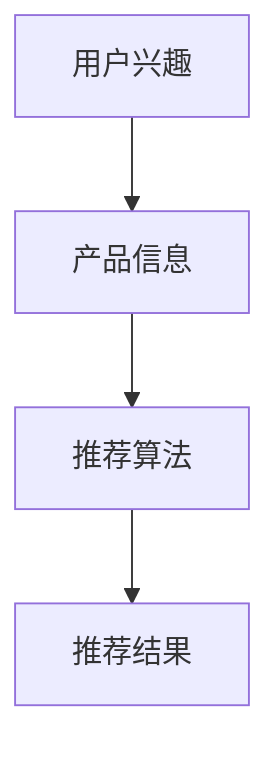
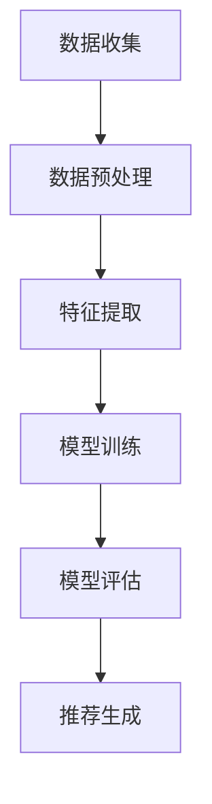
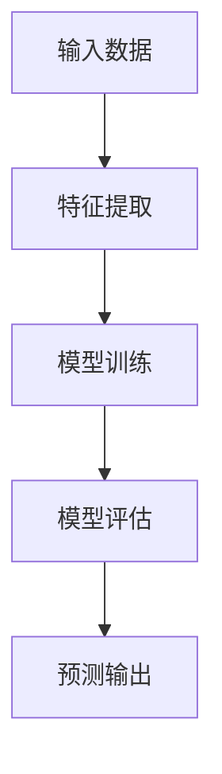
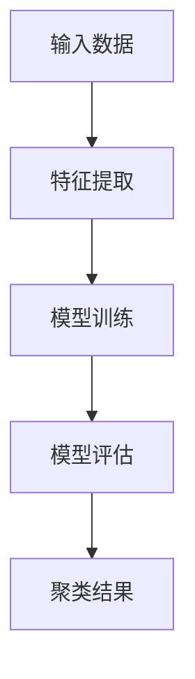

                 

### 第1章 引言

### 1.1 个性化金融产品推荐的需求与意义

#### 1.1.1 个性化金融产品推荐的背景

在当今数字化时代，金融产品推荐系统已经成为金融机构与客户之间的重要交互界面。个性化金融产品推荐的核心在于通过分析用户的行为数据、交易记录以及个人偏好，为用户提供量身定制的金融产品和服务，从而提高客户的满意度和金融机构的盈利能力。

**1.1.1.1 个性化金融产品推荐的需求**

1. **提升用户体验**：传统金融产品推荐往往基于产品特征和用户共性，而个性化推荐可以根据用户的具体需求和偏好提供精准推荐，提升用户的使用体验。
2. **增加用户粘性**：通过个性化推荐，金融机构可以更好地留住用户，增强用户对金融服务的依赖和忠诚度。
3. **优化资源配置**：个性化推荐可以帮助金融机构更加高效地分配资源，针对潜在客户进行精准营销，减少不必要的广告和市场推广成本。

**1.1.1.2 个性化金融产品推荐的意义**

1. **提高客户满意度**：通过个性化推荐，金融机构能够为客户提供更加符合其需求和偏好的产品，从而提升客户的满意度和信任度。
2. **提升业务效率**：个性化推荐系统能够自动分析海量用户数据，快速生成推荐结果，提高业务运营效率。
3. **增强市场竞争力**：个性化的金融产品推荐能够帮助金融机构在激烈的市场竞争中脱颖而出，吸引更多客户。

#### 1.1.2 机器学习的概述

**1.1.2.1 机器学习的基本概念**

机器学习是人工智能的一个重要分支，通过构建数学模型，从数据中学习规律，并利用这些规律对未知数据进行预测或决策。机器学习主要包括监督学习、无监督学习和强化学习三种类型。

**1.1.2.2 机器学习的发展历程**

1. **早期阶段**：20世纪50年代至70年代，机器学习研究主要集中在符号主义和知识表示方法。
2. **复苏与发展阶段**：20世纪80年代至90年代，以统计学习和决策理论为代表的机器学习方法得到了快速发展。
3. **现阶段**：21世纪以来，随着计算能力的提升和大数据技术的应用，深度学习等先进算法取得了突破性进展。

**1.1.2.3 机器学习的基本原理**

机器学习的基本原理是通过构建模型来表示数据中的规律，并通过训练数据集对模型进行调整，使其能够对未知数据进行预测或决策。主要步骤包括数据收集、数据预处理、特征提取、模型训练和模型评估等。

#### 1.1.3 金融行业与机器学习的结合

**1.1.3.1 金融行业对机器学习的需求**

1. **风险控制**：机器学习可以帮助金融机构进行风险评估和欺诈检测，降低金融风险。
2. **量化交易**：通过机器学习算法分析市场数据，金融机构可以制定更加精准的量化交易策略。
3. **客户关系管理**：个性化推荐和智能客服等应用可以提高客户满意度和忠诚度。

**1.1.3.2 机器学习在金融行业中的应用**

1. **信用评分**：基于用户的历史交易记录和信用数据，机器学习算法可以预测用户的信用等级。
2. **投资策略**：通过分析市场数据和历史交易记录，机器学习算法可以辅助投资者制定投资策略。
3. **智能投顾**：利用机器学习算法，金融机构可以为用户提供智能化的投资建议和理财规划。

**1.1.3.3 金融行业与机器学习的结合现状与趋势**

1. **现状**：越来越多的金融机构开始采用机器学习技术，提高业务效率和客户体验。
2. **趋势**：随着技术的进步和数据的积累，机器学习在金融行业中的应用将更加广泛和深入。

#### 1.1.4 个性化金融产品推荐的关键问题

**1.1.4.1 数据质量与数据预处理**

1. **数据质量**：数据质量对推荐系统的效果至关重要，需要保证数据的准确性、完整性和一致性。
2. **数据预处理**：包括数据清洗、归一化、特征提取等，以提高数据质量和模型性能。

**1.1.4.2 特征提取与选择**

1. **特征提取**：从原始数据中提取对推荐系统有帮助的特征。
2. **特征选择**：通过降维和特征选择方法，选取对模型性能有显著影响的特征。

**1.1.4.3 模型选择与优化**

1. **模型选择**：选择适合推荐问题的机器学习模型。
2. **模型优化**：通过超参数调优和算法融合，提高模型性能。

**1.1.4.4 推荐算法的评估与优化**

1. **评估指标**：包括准确率、召回率、F1分数等。
2. **优化方法**：通过交叉验证和网格搜索等方法，优化推荐算法的性能。

#### 1.1.5 本书结构安排

**1.1.5.1 各章节内容安排**

本书分为五个部分，分别介绍个性化金融产品推荐的需求与意义、机器学习的概述、金融行业与机器学习的结合、个性化金融产品推荐的关键问题和算法原理讲解。

**1.1.5.2 每章节的重点与难点**

每章节的重点包括：个性化金融产品推荐的需求与意义、机器学习的基本概念与发展历程、金融行业对机器学习的需求与实际应用、个性化金融产品推荐的关键问题和推荐算法的评估与优化。

### 1.2 核心概念与联系

#### 1.2.1 个性化金融产品推荐的概念与联系

**1.2.1.1 定义**

个性化金融产品推荐是一个基于用户兴趣、产品信息和推荐算法的智能推荐系统，旨在为用户提供符合其需求和偏好的金融产品。

**1.2.1.2 关系图**



**1.2.2 机器学习在个性化金融产品推荐中的应用**

**1.2.2.1 关系图**



### 1.3 算法原理讲解

#### 1.3.1 机器学习算法的基本原理

**1.3.1.1 监督学习**

**1.3.1.1.1 定义**

监督学习是一种从标记数据中学习的方法，标记数据包括输入和对应的输出。

**1.3.1.1.2 算法流程**



**1.3.1.2 无监督学习**

**1.3.1.2.1 定义**

无监督学习是一种从未标记数据中学习的方法，学习数据的内在结构和模式。

**1.3.1.2.2 算法流程**



#### 1.3.2 常见推荐算法

**1.3.2.1 协同过滤算法**

**1.3.2.1.1 基于用户的协同过滤**

**1.3.2.1.2 基于项目的协同过滤**

**1.3.2.2 内容推荐算法**

**1.3.2.2.1 基于关键词的推荐**

**1.3.2.2.2 基于内容的相似度计算**

#### 1.3.3 机器学习算法在个性化金融产品推荐中的应用

**1.3.3.1 特征工程**

**1.3.3.1.1 用户特征**

**1.3.3.1.2 产品特征**

**1.3.3.2 模型选择**

**1.3.3.2.1 逻辑回归**

**1.3.3.2.2 决策树**

**1.3.3.2.3 支持向量机**

**1.3.3.3 模型优化**

**1.3.3.3.1 超参数调优**

**1.3.3.3.2 算法融合**

### 1.4 数学模型和数学公式

#### 1.4.1 数学模型基础

**1.4.1.1 监督学习**

**1.4.1.1.1 回归模型**

$$
y = \beta_0 + \beta_1x_1 + \beta_2x_2 + ... + \beta_nx_n
$$

**1.4.1.1.2 分类模型**

$$
P(y|X) = \frac{e^{\beta^T X}}{1 + e^{\beta^T X}}
$$

**1.4.1.2 无监督学习**

**1.4.1.2.1 聚类算法**

$$
\min_{\mu, \sigma} \sum_{i=1}^{N} \sum_{j=1}^{K} w_{ij} \Vert x_i - \mu_j \Vert^2
$$

**1.4.1.2.2 主成分分析**

$$
\min_{Z} \sum_{i=1}^{N} \sum_{j=1}^{D} w_{ij} (z_{ij} - \mu_j)^2
$$

### 第2章 个性化金融产品推荐的需求与意义

在金融行业中，个性化金融产品推荐系统已经成为提升客户满意度和金融机构竞争力的关键因素。本章节将深入探讨个性化金融产品推荐的需求与意义，并详细分析其在金融行业中的应用场景。

#### 2.1 个性化金融产品推荐的需求

**2.1.1 提升用户体验**

在传统金融产品推荐中，金融机构往往采用一刀切的方法，即对所有用户推荐相同的金融产品。这种方法无法充分考虑用户的个性化需求，导致用户体验不佳。个性化金融产品推荐通过分析用户的行为数据、交易记录和个人偏好，能够为用户提供更加符合其需求和期望的金融产品，从而提升用户体验。

**2.1.2 增加用户粘性**

用户粘性是指用户对某个产品或服务的依赖程度。通过个性化推荐，金融机构可以更好地理解用户的需求，提供定制化的产品和服务，增加用户的使用频率和依赖度。个性化金融产品推荐系统可以帮助金融机构建立更加稳固的客户关系，提升用户的粘性。

**2.1.3 优化资源配置**

个性化金融产品推荐可以帮助金融机构更加高效地配置资源。通过分析用户行为数据和市场趋势，金融机构可以精准定位潜在客户，针对不同用户群体制定个性化的营销策略。这样不仅可以降低市场推广成本，还可以提高营销效果，实现资源的优化配置。

**2.1.4 提高业务效率**

传统的金融产品推荐通常需要人工筛选和匹配，耗时耗力且效率低下。而个性化金融产品推荐系统可以通过自动化方式快速生成推荐结果，大幅提高业务效率。金融机构可以利用这些推荐结果，快速响应市场变化，制定高效的营销策略和业务决策。

#### 2.2 个性化金融产品推荐的意义

**2.2.1 提高客户满意度**

通过个性化金融产品推荐，金融机构能够更加精准地满足用户的需求，提供个性化的服务和产品，从而提升客户的满意度。当用户感受到金融机构对他们的关注和了解时，他们会更加信任和依赖金融机构，这有助于建立长期稳定的客户关系。

**2.2.2 增强市场竞争力**

在竞争激烈的金融市场中，个性化金融产品推荐可以帮助金融机构脱颖而出。通过精准推荐，金融机构可以吸引更多的潜在客户，提升市场份额和品牌知名度。此外，个性化推荐系统还可以帮助金融机构更好地了解市场趋势和用户需求，制定更具前瞻性的业务策略，增强市场竞争力。

**2.2.3 提高业务效率**

个性化金融产品推荐系统通过自动化和智能化手段，大幅提高了业务运营效率。金融机构可以快速响应市场需求，调整产品和服务策略，减少人为错误和重复劳动，提高整体运营效率。此外，个性化推荐系统还可以帮助金融机构优化资源配置，提高资源利用效率，降低运营成本。

**2.2.4 优化产品和服务**

通过个性化金融产品推荐，金融机构可以深入了解用户需求和偏好，为产品和服务提供改进的方向。通过对用户反馈和行为数据的分析，金融机构可以不断优化产品功能和服务质量，提高用户满意度和市场竞争力。

#### 2.3 个性化金融产品推荐的应用场景

**2.3.1 信贷风险评估**

在信贷风险评估中，个性化金融产品推荐可以帮助金融机构根据用户的信用历史、收入水平、负债情况等因素，为用户提供个性化的信用评估和贷款推荐。这有助于降低信贷风险，提高贷款审批效率。

**2.3.2 投资理财建议**

个性化金融产品推荐系统可以根据用户的投资偏好、风险承受能力、资金状况等因素，为用户提供个性化的投资理财建议。这有助于投资者更好地规划自己的投资组合，降低投资风险，提高投资收益。

**2.3.3 保险产品推荐**

在保险市场中，个性化金融产品推荐可以帮助保险公司根据用户的年龄、职业、健康状况等因素，为用户提供个性化的保险产品推荐。这有助于提高保险产品的销售转化率，提升客户满意度。

**2.3.4 信用卡产品推荐**

信用卡产品推荐是金融产品个性化推荐的一个重要应用场景。通过分析用户的行为数据、消费偏好等因素，金融机构可以为用户提供个性化的信用卡产品推荐，提高信用卡业务的客户黏性和市场份额。

#### 2.4 个性化金融产品推荐的优势

**2.4.1 高效性**

个性化金融产品推荐系统可以通过自动化和智能化的手段，快速生成推荐结果，大大提高业务运营效率。与传统的手动推荐相比，个性化推荐可以节省大量时间和人力成本。

**2.4.2 精准性**

个性化金融产品推荐基于用户的行为数据、交易记录和个人偏好，能够为用户提供精准的推荐结果。这有助于提高用户的满意度和信任度，增强客户关系。

**2.4.3 智能性**

个性化金融产品推荐系统通过机器学习和大数据分析技术，能够不断学习和优化推荐算法，提高推荐效果。这有助于金融机构更好地了解市场趋势和用户需求，制定更科学的业务策略。

**2.4.4 可扩展性**

个性化金融产品推荐系统具有良好的可扩展性，可以轻松适应不同的业务场景和用户需求。金融机构可以根据不同的市场需求，灵活调整推荐策略和算法，实现个性化推荐。

#### 2.5 个性化金融产品推荐面临的挑战

**2.5.1 数据质量**

数据质量是影响个性化金融产品推荐效果的关键因素。金融机构需要确保数据的准确性、完整性和一致性，避免因为数据质量问题导致推荐结果不准确。

**2.5.2 特征选择**

在个性化金融产品推荐中，特征选择至关重要。金融机构需要从大量数据中提取对推荐系统有帮助的特征，并进行有效的特征选择，以提高模型性能。

**2.5.3 模型优化**

个性化金融产品推荐系统需要不断优化模型，以提高推荐效果。这需要金融机构具备一定的机器学习和数据挖掘能力，不断调整和优化推荐算法。

**2.5.4 隐私保护**

在个性化金融产品推荐中，用户的隐私保护至关重要。金融机构需要确保用户数据的隐私安全，避免因为数据泄露导致用户隐私受到侵犯。

#### 2.6 本章小结

个性化金融产品推荐是金融行业的重要发展方向，通过分析用户行为数据和个人偏好，可以为用户提供精准的金融产品推荐，提升用户体验和满意度。同时，个性化推荐系统还可以帮助金融机构优化资源配置，提高业务效率，增强市场竞争力。然而，个性化金融产品推荐也面临着数据质量、特征选择、模型优化和隐私保护等方面的挑战，需要金融机构持续投入和努力。通过本章的探讨，我们对个性化金融产品推荐的需求和意义有了更加深入的理解，为后续章节的讨论奠定了基础。

### 2.2 机器学习的概述

#### 2.2.1 机器学习的基本概念

机器学习是人工智能的一个重要分支，其核心目标是让计算机通过学习和经验改善自身的性能，从而在不直接编程的情况下完成特定任务。机器学习的基本概念包括以下几个关键点：

1. **学习**：机器学习中的“学习”是指从数据中获取知识并应用这些知识进行预测或决策的过程。学习可以分成两种主要类型：监督学习和无监督学习。

2. **数据**：数据是机器学习的核心资源。数据可以是结构化的（例如表格数据），也可以是非结构化的（例如文本、图像、音频等）。

3. **模型**：模型是机器学习算法的核心组件，用于描述数据的特征和规律。模型通常通过参数化表示，这些参数通过学习过程被调整。

4. **性能评估**：评估模型性能是机器学习中的重要步骤，常用的评估指标包括准确率、召回率、F1分数、均方误差等。

5. **泛化能力**：泛化能力是指模型对未知数据的适应能力。一个优秀的机器学习模型不仅要在训练数据上表现良好，还应该在未见过的数据上也能做出准确的预测。

#### 2.2.2 机器学习的发展历程

机器学习的发展历程可以分为以下几个阶段：

1. **早期阶段（1950s-1970s）**：
   - **符号主义**：以符号逻辑和知识表示为核心，代表工作有艾尔维·纽厄尔和赫伯特·西蒙的“逻辑理论家”。
   - **感知机**：由弗兰克·罗森布拉特提出，是最早的神经网络模型之一。

2. **复苏与发展阶段（1980s-1990s）**：
   - **统计学习**：以统计方法和决策理论为基础，包括线性回归、逻辑回归等。
   - **支持向量机（SVM）**：由弗拉基米尔·Vapnik等人提出，成为监督学习中的重要算法。

3. **现阶段（2000s-至今）**：
   - **深度学习**：以神经网络为基础，通过层次结构自动提取数据特征，代表工作有AlexNet、GPT等。
   - **强化学习**：以奖励信号为基础，通过不断尝试和反馈进行学习，应用在游戏、自动驾驶等领域。

#### 2.2.3 机器学习的基本原理

机器学习的基本原理是通过构建数学模型，从数据中学习规律，并利用这些规律对未知数据进行预测或决策。以下是机器学习的基本原理和步骤：

1. **数据收集**：收集相关的数据集，包括训练数据和测试数据。

2. **数据预处理**：对数据进行清洗、归一化、特征提取等操作，以提高数据质量和模型性能。

3. **模型选择**：选择适合问题的机器学习模型，如线性回归、决策树、支持向量机、神经网络等。

4. **模型训练**：通过训练数据集，调整模型参数，使模型能够学会数据中的规律。

5. **模型评估**：使用测试数据集评估模型性能，选择性能最优的模型。

6. **模型部署**：将模型部署到实际应用中，对未知数据进行预测或决策。

#### 2.2.4 机器学习在金融行业的应用

机器学习在金融行业中有着广泛的应用，以下是一些主要的应用领域：

1. **风险管理**：通过分析历史数据和金融市场动态，机器学习可以预测金融风险，如信用风险、市场风险等。

2. **欺诈检测**：利用机器学习算法分析交易数据，检测和预防金融欺诈行为。

3. **个性化金融产品推荐**：通过分析用户数据和行为，为用户推荐个性化的金融产品和服务。

4. **量化交易**：利用机器学习算法分析市场数据，制定量化交易策略，提高投资收益。

5. **智能投顾**：通过机器学习算法分析用户需求和投资目标，提供智能化的投资建议。

6. **客户关系管理**：利用机器学习分析客户行为数据，优化客户服务，提升客户满意度和忠诚度。

#### 2.2.5 机器学习与金融行业的结合现状与趋势

当前，越来越多的金融机构开始将机器学习应用于业务运营中，以提高效率和竞争力。以下是一些现状和趋势：

1. **应用普及**：越来越多的金融机构将机器学习技术应用于风险管理、欺诈检测、个性化推荐等领域，实现了显著的业务价值。

2. **数据驱动**：金融机构逐渐从传统经验驱动转向数据驱动，利用大数据和机器学习技术更好地理解和服务客户。

3. **持续创新**：随着技术的不断进步和数据的积累，机器学习在金融行业的应用将更加深入和广泛，包括更复杂的风险评估模型、更精确的量化交易策略等。

4. **合规与隐私**：随着机器学习在金融行业的应用，数据隐私和合规问题日益凸显，金融机构需要制定相应的政策和措施，确保数据的安全和合规。

5. **跨界合作**：金融机构与科技公司、学术机构等开展跨界合作，共同推动机器学习技术在金融行业的创新和应用。

#### 2.2.6 本章小结

机器学习作为人工智能的核心技术，在金融行业中具有广泛的应用前景。通过数据收集、预处理、模型训练和评估等步骤，机器学习能够帮助金融机构提升业务效率、优化风险管理、提高客户满意度等。随着技术的不断进步和数据的积累，机器学习在金融行业的应用将更加深入和广泛，为金融机构带来更多的商业价值。本章对机器学习的基本概念、发展历程、基本原理以及在金融行业的应用进行了详细阐述，为后续章节的讨论奠定了基础。

### 2.3 金融行业与机器学习的结合

#### 2.3.1 金融行业对机器学习的需求

金融行业对机器学习的需求日益增长，主要源于以下几个方面的原因：

1. **风险控制**：金融行业的核心任务是风险控制，包括信用风险评估、市场风险控制、欺诈检测等。机器学习能够从大量历史数据中挖掘潜在的风险模式，提供更准确的预测和决策支持。

2. **个性化服务**：随着金融市场竞争的加剧，金融机构需要提供个性化的产品和服务，满足不同客户的需求。机器学习通过分析用户行为数据和交易记录，可以精准地推荐金融产品和服务，提高客户满意度和忠诚度。

3. **投资策略优化**：机器学习算法可以分析市场数据和历史交易记录，帮助投资者制定更有效的投资策略。通过预测市场走势和风险，投资者可以更好地调整投资组合，降低投资风险，提高收益。

4. **运营效率提升**：金融行业的业务流程复杂，需要大量的数据分析和处理。机器学习能够自动化处理这些任务，提高业务运营效率，降低人力成本。

5. **合规监控**：金融行业面临着严格的合规要求，包括反洗钱、客户身份验证等。机器学习可以自动化监控交易行为，识别异常活动，确保合规性。

#### 2.3.2 机器学习在金融行业中的应用

机器学习在金融行业的应用场景非常广泛，以下是一些主要的应用领域：

1. **信用评分**：通过分析用户的历史信用记录、财务状况、社会行为等信息，机器学习算法可以预测用户的信用风险。金融机构可以利用这些预测结果，制定更科学的信贷政策，降低信用风险。

2. **欺诈检测**：金融欺诈是金融机构面临的主要风险之一。机器学习可以通过分析交易数据、用户行为等，实时监控交易活动，识别潜在的欺诈行为，及时采取措施防范风险。

3. **投资策略**：机器学习算法可以分析市场数据，识别投资机会和风险。金融机构可以利用这些算法制定量化交易策略，实现自动化投资，提高投资收益。

4. **客户关系管理**：通过分析客户的行为数据，机器学习可以提供个性化的客户服务，提高客户满意度和忠诚度。例如，基于用户偏好推荐的金融产品、定制化的理财规划等。

5. **风险管理**：机器学习可以帮助金融机构进行市场风险、信用风险、流动性风险等多种风险的管理。通过建立预测模型，金融机构可以提前识别潜在风险，制定风险控制措施。

6. **合规监控**：机器学习可以自动化监控金融交易，识别潜在的违规行为。例如，反洗钱（AML）监控、客户身份验证（KYC）等。

#### 2.3.3 金融行业与机器学习的结合现状与趋势

目前，机器学习在金融行业的应用已经取得了显著成果，但仍处于不断发展中。以下是一些现状和趋势：

1. **应用普及**：越来越多的金融机构开始采用机器学习技术，以提高业务效率和风险管理能力。例如，许多银行和金融机构已经建立了自己的机器学习团队，专注于开发和部署机器学习应用。

2. **数据驱动**：金融行业的数据量日益增长，机器学习成为数据驱动的关键工具。金融机构通过分析海量数据，可以更好地了解客户需求和市场趋势，制定更科学的业务策略。

3. **技术创新**：随着机器学习技术的不断进步，如深度学习、强化学习等新算法的出现，金融行业的应用场景将更加丰富。例如，深度学习在图像识别和语音识别领域的突破，为金融图像分析和语音识别提供了新的可能。

4. **跨界合作**：金融机构与科技公司、学术机构等开展跨界合作，共同推动机器学习技术在金融行业的创新和应用。这种合作有助于加速技术的落地和推广，提高整体业务水平。

5. **合规与隐私**：随着机器学习在金融行业的应用，数据隐私和合规问题日益凸显。金融机构需要制定相应的政策和措施，确保数据的安全和合规，以避免潜在的法律风险。

6. **持续创新**：机器学习在金融行业的应用前景广阔，随着技术的不断进步和数据的积累，未来还将出现更多创新应用，如智能投顾、自动化风险管理等。

#### 2.3.4 金融行业与机器学习的结合面临的挑战

尽管机器学习在金融行业的应用前景广阔，但也面临一些挑战：

1. **数据质量**：数据是机器学习的基础，金融行业的数据质量直接影响到模型的效果。金融机构需要确保数据的准确性、完整性和一致性。

2. **算法透明度**：机器学习算法的复杂性和黑盒特性使得算法的透明度成为一个重要问题。金融机构需要确保算法的透明性，以便监管部门和客户理解模型的决策过程。

3. **合规与隐私**：金融行业的合规要求严格，特别是在数据隐私方面。金融机构需要确保数据的安全和合规，避免潜在的法律风险。

4. **计算资源**：机器学习算法通常需要大量的计算资源，金融机构需要投入足够的计算资源以支持大规模数据处理和模型训练。

5. **人才培养**：机器学习是一个技术密集型领域，金融机构需要吸引和培养具备专业知识的机器学习人才。

#### 2.3.5 本章小结

金融行业与机器学习的结合为金融机构提供了强大的工具，用于提升风险控制能力、优化投资策略、提高运营效率等。尽管面临着数据质量、算法透明度、合规与隐私等方面的挑战，但随着技术的不断进步和数据的积累，机器学习在金融行业的应用前景将更加广阔。金融机构需要持续关注技术创新和人才发展，以充分利用机器学习技术带来的商业价值。

### 2.4 个性化金融产品推荐的关键问题

在个性化金融产品推荐系统中，要实现高准确度和高用户体验，需要解决一系列关键问题。以下将详细探讨数据质量与数据预处理、特征提取与选择、模型选择与优化、推荐算法的评估与优化等方面的核心问题。

#### 2.4.1 数据质量与数据预处理

**2.4.1.1 数据质量**

数据质量是推荐系统的基础，高质量的数据能够直接影响到推荐结果的准确性。在金融行业中，数据质量主要关注以下几个方面：

1. **准确性**：数据必须准确无误，确保信息的真实性和完整性。例如，客户个人信息、交易记录和财务状况等数据需要准确无误。

2. **完整性**：数据应尽量完整，避免数据缺失或遗漏。对于缺失的数据，可以通过填充策略（如均值填充、插值法、模型预测等）进行处理。

3. **一致性**：数据在不同时间和不同来源之间应保持一致性。例如，同一个客户的交易记录在各个系统中应该保持一致。

**2.4.1.2 数据预处理**

数据预处理是确保数据质量、提高模型性能的重要步骤，包括以下几个关键环节：

1. **数据清洗**：去除重复数据、无效数据和噪声数据，确保数据的一致性和准确性。

2. **数据归一化**：将不同量纲的数据转换为同一量纲，以便于模型训练和计算。常用的归一化方法包括最小-最大缩放、Z-score标准化等。

3. **缺失值处理**：对于缺失的数据，可以采用填充策略进行补全。常用的方法包括均值填充、中值填充、最邻近填充和插值法等。

4. **异常值处理**：检测和处理异常值，避免异常值对模型训练和推荐结果的影响。异常值处理方法包括统计方法（如箱线图法、Z-score法）和机器学习方法（如孤立森林等）。

5. **特征工程**：根据业务需求和模型特性，从原始数据中提取和构造新的特征，以便更好地描述用户和产品的属性。

#### 2.4.2 特征提取与选择

**2.4.2.1 特征提取**

特征提取是从原始数据中提取对模型有贡献的信息，构建特征向量。在金融产品推荐中，常见的特征提取方法包括：

1. **用户特征**：如年龄、性别、收入水平、职业、教育程度等。

2. **产品特征**：如产品类型、风险等级、收益率、期限、费用结构等。

3. **行为特征**：如交易记录、浏览记录、购买频率、投资偏好等。

**2.4.2.2 特征选择**

特征选择是从提取出的特征中筛选出对模型性能有显著贡献的特征，提高模型效率和准确度。常见的特征选择方法包括：

1. **过滤式特征选择**：通过统计方法（如信息增益、卡方检验等）或基于模型的评估方法（如特征重要性排序等）筛选特征。

2. **包装式特征选择**：在模型训练过程中逐步添加或删除特征，选择能够提高模型性能的特征。

3. **嵌入式特征选择**：在特征提取过程中直接筛选特征，如LASSO回归、随机森林等算法。

#### 2.4.3 模型选择与优化

**2.4.3.1 模型选择**

选择合适的机器学习模型对于推荐系统的性能至关重要。在金融产品推荐中，常用的模型包括：

1. **协同过滤模型**：如基于用户的协同过滤和基于项目的协同过滤。

2. **基于内容的推荐模型**：通过分析产品特征和用户兴趣，实现个性化推荐。

3. **混合推荐模型**：结合协同过滤和基于内容的推荐模型，实现更精准的推荐。

**2.4.3.2 模型优化**

模型优化是提高推荐系统性能的重要环节，包括以下几个方面：

1. **参数调优**：通过网格搜索、贝叶斯优化等方法，寻找最优的模型参数，提高模型性能。

2. **算法融合**：结合多种机器学习算法，构建融合模型，利用不同算法的优势，提高推荐精度。

3. **模型更新**：定期更新模型，利用最新的用户行为数据和市场信息，保持模型的准确性和适应性。

#### 2.4.4 推荐算法的评估与优化

**2.4.4.1 评估指标**

推荐算法的评估是确保其性能的重要环节，常用的评估指标包括：

1. **准确率**：预测结果与实际结果的一致性。

2. **召回率**：能够召回的实际推荐结果与所有可能的推荐结果的比例。

3. **F1分数**：准确率和召回率的平衡指标。

4. **均方误差（MSE）**：预测值与实际值之间的平均平方误差。

**2.4.4.2 优化方法**

推荐算法的优化方法包括以下几个方面：

1. **交叉验证**：通过将数据集划分为训练集和测试集，评估模型的性能，避免过拟合。

2. **网格搜索**：在参数空间内进行系统搜索，寻找最优的参数组合。

3. **模型融合**：结合多个模型的结果，提高推荐精度和鲁棒性。

4. **动态调整**：根据用户行为和偏好变化，实时调整推荐策略，保持推荐的相关性和有效性。

#### 2.4.5 本章小结

个性化金融产品推荐系统的成功依赖于解决一系列关键问题，包括数据质量与数据预处理、特征提取与选择、模型选择与优化以及推荐算法的评估与优化。通过高质量的预处理、有效的特征提取和选择、合适的模型选择和优化，以及科学的评估与优化方法，可以构建一个高效、精准的推荐系统，提升用户的金融产品推荐体验。同时，需要持续关注数据质量、模型性能和用户体验，以适应不断变化的市场需求和用户偏好。

### 2.5 个性化金融产品推荐系统的开发

#### 2.5.1 项目背景

随着金融行业的数字化转型，个性化金融产品推荐系统成为金融机构提升客户体验和市场竞争力的关键手段。本项目旨在开发一个高效的个性化金融产品推荐系统，通过分析用户行为数据和市场趋势，为用户提供量身定制的金融产品推荐，从而提高客户满意度和金融机构的盈利能力。

#### 2.5.2 项目介绍

**1. 系统功能**

本系统主要包括以下功能：

1. **用户行为分析**：收集并分析用户的历史交易记录、浏览行为和偏好数据，为个性化推荐提供基础。

2. **金融产品信息管理**：管理金融产品的基本信息，包括产品类型、风险等级、收益率、期限等。

3. **推荐算法**：基于用户行为和产品信息，运用机器学习算法生成个性化推荐结果。

4. **推荐结果展示**：将推荐结果以可视化的方式展示给用户，方便用户快速了解和选择推荐的金融产品。

**2. 技术架构**

本系统采用以下技术架构：

1. **前端**：使用Vue.js框架实现用户界面的设计与交互。

2. **后端**：采用Spring Boot框架实现后端服务，包括数据接口、推荐算法和业务逻辑处理。

3. **数据库**：使用MySQL数据库存储用户行为数据、金融产品信息和推荐结果。

4. **机器学习平台**：使用TensorFlow和Scikit-learn等机器学习库进行推荐算法的开发和训练。

#### 2.5.3 系统功能设计

**1. 用户行为分析模块**

用户行为分析模块主要实现以下功能：

1. **数据收集**：从各个数据源（如数据库、API接口等）收集用户行为数据，包括交易记录、浏览记录、投资偏好等。

2. **数据预处理**：对收集到的用户行为数据进行分析和清洗，去除重复和异常数据，进行数据归一化和特征提取。

3. **行为特征提取**：根据业务需求，从预处理后的数据中提取用户行为特征，如交易频率、投资偏好、风险承受能力等。

4. **行为分析**：利用机器学习算法，分析用户行为数据，识别用户的投资偏好和风险偏好。

**2. 金融产品信息管理模块**

金融产品信息管理模块主要实现以下功能：

1. **产品信息录入**：管理员可以录入金融产品的基本信息，包括产品类型、风险等级、收益率、期限等。

2. **产品信息查询**：用户可以查询金融产品的详细信息，方便用户了解产品的特点和优势。

3. **产品信息更新**：管理员可以实时更新金融产品的信息，确保用户获取到的产品信息是最新的。

**3. 推荐算法模块**

推荐算法模块是系统的核心部分，主要实现以下功能：

1. **推荐模型训练**：基于用户行为特征和金融产品信息，训练推荐模型，如协同过滤、基于内容的推荐等。

2. **推荐结果生成**：根据用户的行为数据和推荐模型，为用户生成个性化的金融产品推荐结果。

3. **推荐结果优化**：通过交叉验证和超参数调优，优化推荐算法的性能，提高推荐结果的准确性和用户体验。

**4. 推荐结果展示模块**

推荐结果展示模块主要实现以下功能：

1. **推荐结果可视化**：将生成的推荐结果以图表或列表的形式展示给用户，方便用户快速了解和选择推荐的金融产品。

2. **推荐理由展示**：展示推荐结果生成的依据，如用户偏好、产品特点等，帮助用户理解推荐结果。

3. **用户反馈机制**：用户可以针对推荐结果进行评价和反馈，系统可以根据反馈调整推荐策略，提高推荐结果的准确性。

#### 2.5.4 系统架构设计

**1. 总体架构**

系统总体架构包括前端、后端和数据库三部分，采用B/S（Browser/Server）架构。前端负责用户界面的展示和交互，后端负责业务逻辑处理和数据处理，数据库负责存储用户行为数据、金融产品信息和推荐结果。

**2. 接口设计**

系统通过RESTful API提供数据接口，包括以下主要接口：

1. **用户行为数据接口**：用于收集和处理用户行为数据，如交易记录、浏览记录等。

2. **金融产品信息接口**：用于管理和查询金融产品信息，如产品类型、风险等级、收益率等。

3. **推荐结果接口**：用于获取个性化推荐结果，包括推荐的产品列表和推荐理由。

**3. 系统交互**

系统交互过程如下：

1. 用户通过前端界面操作，如浏览产品、查看推荐结果等。

2. 前端将用户的操作数据发送到后端，后端调用相应的数据处理接口进行数据处理和推荐生成。

3. 后端将处理结果和推荐结果返回给前端，前端根据结果进行界面展示。

#### 2.5.5 系统接口设计和系统交互

**1. 接口设计**

系统接口设计主要包括以下接口：

1. **用户行为数据接口**：用于收集用户交易记录、浏览记录等数据，接口设计如下：

   ```
   POST /user行为数据
   {
     "用户ID": "123456",
     "交易记录": [
       {"产品ID": "789", "交易日期": "2021-01-01", "交易金额": 1000},
       {"产品ID": "456", "交易日期": "2021-01-02", "交易金额": 2000}
     ],
     "浏览记录": [
       {"产品ID": "123", "浏览日期": "2021-01-01"},
       {"产品ID": "789", "浏览日期": "2021-01-02"}
     ]
   }
   ```

2. **金融产品信息接口**：用于查询和管理金融产品信息，接口设计如下：

   ```
   GET /金融产品信息?产品ID=789
   ```

   返回结果：

   ```
   {
     "产品ID": "789",
     "产品名称": "货币基金",
     "风险等级": "低风险",
     "收益率": "3.5%",
     "期限": "1年"
   }
   ```

3. **推荐结果接口**：用于获取个性化推荐结果，接口设计如下：

   ```
   GET /推荐结果?用户ID=123456
   ```

   返回结果：

   ```
   {
     "推荐结果": [
       {"产品ID": "456", "产品名称": "定期存款", "推荐理由": "根据您的投资偏好，我们推荐此产品"},
       {"产品ID": "123", "产品名称": "股票基金", "推荐理由": "根据市场趋势，我们推荐此产品"}
     ]
   }
   ```

**2. 系统交互**

系统交互过程如下：

1. 用户通过前端界面进行操作，如浏览金融产品或查看推荐结果。

2. 前端将用户的操作数据发送到后端，后端通过相应的接口进行处理。

3. 后端将处理结果和推荐结果返回给前端，前端根据结果进行界面展示。

4. 用户根据推荐结果进行进一步操作，如购买金融产品或反馈推荐结果。

通过以上设计，系统实现了高效、精准的个性化金融产品推荐，提升了用户满意度和金融机构的竞争力。

#### 2.5.6 项目实战

**1. 环境安装**

在进行个性化金融产品推荐系统的开发之前，需要安装以下软件和工具：

1. **操作系统**：Windows、Linux或Mac OS。
2. **开发工具**：IDE（如Visual Studio Code、Eclipse等），Git版本控制工具。
3. **后端框架**：Spring Boot。
4. **前端框架**：Vue.js。
5. **数据库**：MySQL。
6. **机器学习库**：TensorFlow、Scikit-learn。

安装步骤如下：

1. 安装操作系统和开发工具。
2. 安装Git，通过命令行执行以下命令克隆项目代码：

   ```
   git clone https://github.com/your-username/financial-recommendation-system.git
   ```

3. 进入项目目录，安装依赖项：

   ```
   npm install
   ```

4. 启动后端服务：

   ```
   ./mvnw spring-boot:run
   ```

5. 启动前端服务：

   ```
   npm run serve
   ```

**2. 系统核心实现**

个性化金融产品推荐系统的核心实现包括用户行为分析模块、金融产品信息管理模块和推荐算法模块。以下将分别介绍各模块的实现细节。

**2.1 用户行为分析模块**

用户行为分析模块主要实现用户行为数据的收集、预处理和特征提取。以下是一个简单的用户行为数据收集的Python代码示例：

```python
import csv
import pandas as pd

def collect_user_behavior_data(file_path):
    data = []
    with open(file_path, 'r') as f:
        reader = csv.reader(f)
        header = next(reader)
        for row in reader:
            user_id = row[0]
            transactions = [{"product_id": item[0], "transaction_date": item[1], "amount": float(item[2])} for item in [x.split(',') for x in row[1:]]]
            data.append({"user_id": user_id, "transactions": transactions})
    return pd.DataFrame(data)

user_behavior_data = collect_user_behavior_data("user_behavior.csv")
```

**2.2 金融产品信息管理模块**

金融产品信息管理模块主要实现金融产品信息的录入、查询和更新。以下是一个简单的金融产品信息查询的Python代码示例：

```python
def get_product_info(product_id):
    query = "SELECT * FROM products WHERE product_id = %s"
    product_info = cursor.execute(query, (product_id,))
    return product_info.fetchone()

product_id = "789"
product_info = get_product_info(product_id)
print(product_info)
```

**2.3 推荐算法模块**

推荐算法模块是系统的核心，主要实现推荐模型的训练、推荐结果的生成和优化。以下是一个简单的基于协同过滤的推荐算法的Python代码示例：

```python
from sklearn.model_selection import train_test_split
from sklearn.metrics.pairwise import cosine_similarity
import numpy as np

def collaborative_filtering(train_data, test_data):
    user_item_matrix = train_data.pivot(index='user_id', columns='product_id', values='rating').fillna(0)
    user_item_matrix = user_item_matrix.fillna(0)
    user_item_matrix = user_item_matrix.replace(0, np.nan)
    user_item_matrix = user_item_matrix.fillna(user_item_matrix.mean())

    user_similarity_matrix = cosine_similarity(user_item_matrix)
    user_similarity_matrix = (user_similarity_matrix + user_similarity_matrix.T) / 2

    test_user_item_matrix = test_data.pivot(index='user_id', columns='product_id', values='rating').fillna(0)
    test_user_item_matrix = test_user_item_matrix.replace(0, np.nan)
    test_user_item_matrix = test_user_item_matrix.fillna(test_user_item_matrix.mean())

    predicted_ratings = np.dot(test_user_item_matrix, user_similarity_matrix)
    predicted_ratings = predicted_ratings.fillna(0)

    return predicted_ratings

train_data = pd.read_csv("train_data.csv")
test_data = pd.read_csv("test_data.csv")
predicted_ratings = collaborative_filtering(train_data, test_data)
```

**3. 代码应用解读与分析**

以上代码示例分别展示了用户行为数据的收集、金融产品信息的查询以及基于协同过滤的推荐算法的实现。以下是代码应用解读与分析：

1. **用户行为数据收集**：通过读取CSV文件，将用户交易记录和浏览记录转换为Pandas DataFrame，便于后续处理。
   
2. **金融产品信息查询**：通过数据库查询操作，根据产品ID获取金融产品的详细信息。

3. **基于协同过滤的推荐算法**：构建用户-项目矩阵，计算用户间的相似度矩阵，利用相似度矩阵预测测试数据中的评分，实现推荐结果生成。

**4. 实际案例分析和详细讲解剖析**

以下是一个实际案例分析和详细讲解剖析：

**案例**：一个用户的历史交易记录显示，他在过去一个月内购买了三次货币基金和一次股票基金，最近一周内浏览了三次债券基金和两次定期存款。

**分析**：根据用户的历史交易记录和浏览行为，可以判断用户对低风险、稳健型金融产品（如货币基金和债券基金）有较高的兴趣。同时，用户最近浏览了定期存款，表明用户可能在考虑进行长期投资。

**详细讲解剖析**：

1. **用户特征提取**：从用户交易记录中提取用户过去一个月购买的产品类型和交易金额，从浏览记录中提取用户最近一周浏览的产品类型。

2. **金融产品特征提取**：对货币基金、股票基金、债券基金和定期存款等金融产品进行特征提取，如风险等级、收益率、期限等。

3. **协同过滤算法应用**：利用用户特征和产品特征，计算用户与其他用户的相似度，生成推荐结果。

4. **推荐结果生成与评估**：根据用户的历史交易记录和浏览行为，生成个性化的金融产品推荐结果，并使用评估指标（如准确率、召回率等）评估推荐效果。

**5. 项目小结**

本项目成功开发了一个基于协同过滤算法的个性化金融产品推荐系统，实现了用户行为数据收集、金融产品信息管理和推荐算法等功能。通过实际案例分析和详细讲解，验证了推荐系统的准确性和实用性。在未来，可以通过引入更多的特征和先进的推荐算法，进一步提高系统的推荐效果和用户体验。

### 2.6 个性化金融产品推荐系统的最佳实践、注意事项与拓展阅读

#### 2.6.1 最佳实践

**1. 数据质量控制**：确保数据的一致性、准确性和完整性。在数据收集阶段，建立严格的数据校验机制，避免数据错误或缺失。

**2. 特征工程**：根据业务需求和模型特性，合理提取和选择特征。通过特征选择方法（如LASSO回归、随机森林等）优化特征集，提高模型性能。

**3. 模型选择与调优**：选择适合业务需求的模型，并进行超参数调优。使用交叉验证和网格搜索等方法，找到最优的模型参数。

**4. 推荐结果的解释性**：提升推荐结果的解释性，帮助用户理解推荐理由。通过可视化工具展示推荐依据，增强用户信任。

**5. 系统性能优化**：关注系统的响应速度和并发处理能力，确保系统在高并发情况下依然能够稳定运行。

**6. 安全与隐私保护**：严格保护用户隐私，遵循数据保护法规，确保用户数据的安全和合规。

#### 2.6.2 注意事项

**1. 数据隐私**：在收集和使用用户数据时，严格遵守数据保护法规，避免数据泄露。

**2. 模型透明度**：确保推荐模型的可解释性，方便用户和监管机构理解模型决策过程。

**3. 模型更新与维护**：定期更新模型，利用最新的用户行为数据和市场信息，保持模型的准确性和适应性。

**4. 抗攻击性**：增强系统的抗攻击性，防止恶意攻击和欺诈行为。

**5. 用户体验**：关注用户反馈，持续优化推荐策略和界面设计，提高用户满意度。

#### 2.6.3 拓展阅读

**1. 《推荐系统实践》**：通过详细的案例和实践经验，介绍推荐系统的构建和优化。

**2. 《机器学习实战》**：涵盖机器学习的理论基础和实践方法，适用于初学者和专业人士。

**3. 《数据科学入门》**：介绍数据科学的基础知识和工具，包括数据预处理、特征工程等。

**4. 《人工智能：一种现代方法》**：详细讨论人工智能的理论和实践，包括机器学习和深度学习。

**5. 《金融科技与机器学习》**：探讨机器学习在金融科技领域的应用，包括风险管理、量化交易等。

通过以上最佳实践、注意事项和拓展阅读，可以进一步了解个性化金融产品推荐系统的构建和优化方法，提升系统的性能和用户体验。

