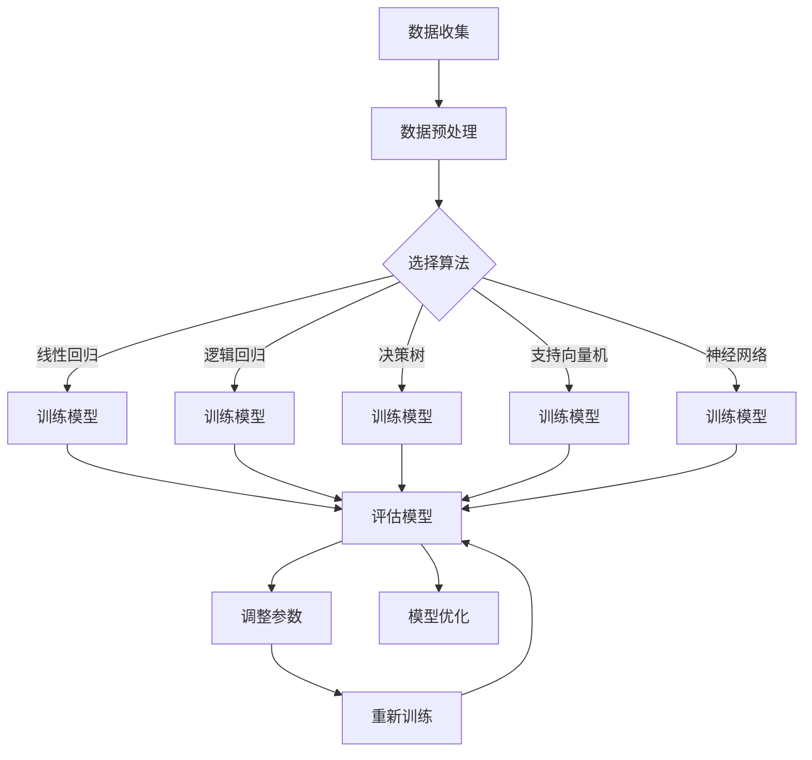
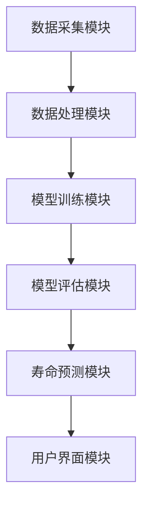
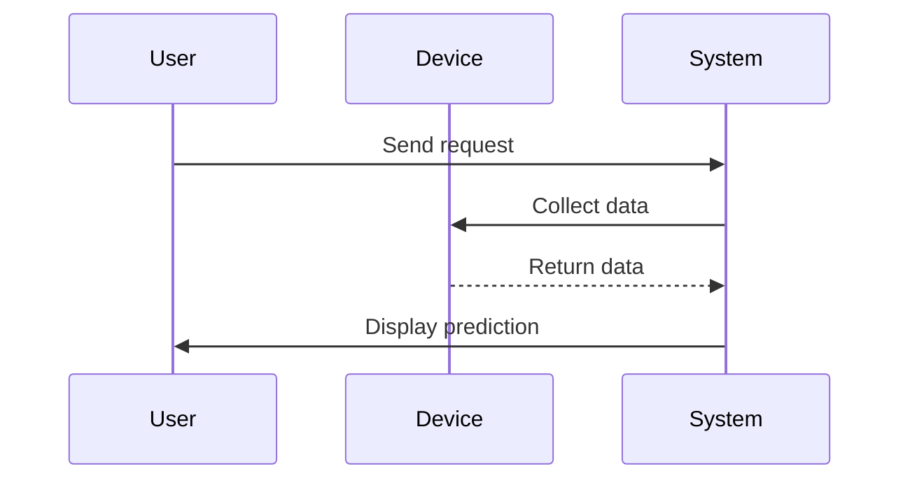
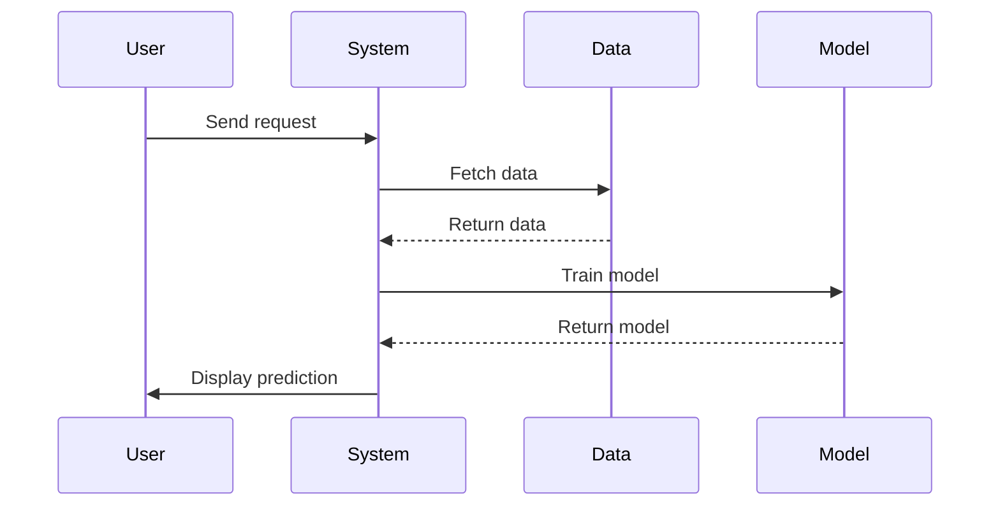

                 

 

**问题**：机器学习在工业设备寿命预测中的应用

**目标**：通过机器学习技术，预测工业设备的寿命，以降低故障风险，提高生产效率。

**核心概念**：

1. **机器学习**：一种使计算机通过数据学习来改善性能的技术。
2. **工业设备寿命预测**：利用历史数据和机器学习模型预测设备未来的寿命。

**步骤**：

### 1. 背景介绍

#### 1.1 问题背景

随着工业设备日益复杂和关键性增强，预测其寿命对于保障生产安全和减少停机时间至关重要。传统的预测方法通常依赖于经验和规则，而这种方法在复杂和动态的工业环境中效果不佳。

#### 1.2 问题描述

设备寿命预测的挑战包括数据的不完整性、噪声和动态变化的特性。这些因素使得准确的预测变得困难。

#### 1.3 问题解决思路

利用机器学习，可以从历史数据中学习设备运行的规律，从而进行准确的寿命预测。这种方法可以通过数据预处理、特征工程和模型选择等步骤来实现。

#### 1.4 边界与外延

设备的寿命预测不仅涉及设备的硬件状态，还包括其工作环境、操作条件等因素。因此，预测模型需要考虑这些外部因素。

#### 1.5 概念结构与核心要素组成

- **数据预处理**：数据清洗、归一化等。
- **特征工程**：提取对寿命预测有重要影响的特征。
- **模型选择**：选择适合问题的机器学习算法。
- **模型训练与验证**：使用训练数据集训练模型，并在验证数据集上评估模型性能。

### 2. 核心概念与联系

#### 2.1 机器学习基础

机器学习包括监督学习、无监督学习和强化学习。监督学习是我们在这一主题中重点关注的方法，因为它依赖于标记数据来训练模型。

#### 2.2 工业设备寿命预测相关概念

- **故障诊断**：识别设备是否即将发生故障。
- **状态监测**：实时监测设备运行状态。
- **寿命预测**：基于历史数据和当前状态预测设备剩余寿命。

#### 2.3 数据处理与分析工具

- **Python**：用于编写机器学习算法和数据处理代码。
- **Pandas**：用于数据清洗和预处理。
- **Scikit-learn**：提供了各种机器学习算法的实现。

### 3. 算法原理讲解

#### 3.1 机器学习算法基础

机器学习算法可以分为以下几个类别：

- **线性回归**：预测一个连续值。
- **逻辑回归**：用于分类问题。
- **决策树**：通过一系列判断来分类或回归。
- **随机森林**：决策树的集成方法。
- **支持向量机**：在特征空间中找到一个最佳的超平面进行分类或回归。

#### 3.2 工业设备寿命预测常用算法

对于设备寿命预测，常用的算法包括：

- **K-最近邻（KNN）**：基于相似度计算来预测。
- **支持向量机（SVM）**：在特征空间中找到最优分割平面。
- **长短期记忆网络（LSTM）**：适用于时间序列数据。

#### 3.3 算法选择与优化

选择适合的算法取决于数据特点和问题需求。常见的优化方法包括：

- **交叉验证**：用于评估模型性能。
- **网格搜索**：用于自动选择最佳参数。

### 4. 系统分析与架构设计

#### 4.1 问题场景介绍

在一个典型的工业生产环境中，设备的状态数据会被实时采集，然后通过一个系统进行分析和处理，以预测设备的寿命。

#### 4.2 项目介绍

项目目标是通过构建一个机器学习模型，对工业设备的寿命进行预测。

#### 4.3 系统功能设计

系统功能设计包括：

- **数据采集**：从设备中收集状态数据。
- **数据处理**：清洗和预处理数据。
- **模型训练**：使用历史数据训练预测模型。
- **寿命预测**：使用训练好的模型预测设备寿命。
- **结果反馈**：将预测结果反馈给操作人员。

#### 4.4 系统架构设计

系统架构设计包括：

- **数据层**：存储设备状态数据。
- **数据处理层**：包括数据预处理和特征工程。
- **模型层**：包括机器学习算法和模型训练。
- **应用层**：提供预测结果和用户界面。

#### 4.5 系统接口设计

系统接口设计包括：

- **API接口**：提供数据访问和模型预测的接口。
- **用户界面**：用于展示预测结果和交互。

#### 4.6 系统交互设计

系统交互设计包括：

- **数据流**：从数据采集到结果反馈的整个数据处理流程。
- **用户交互**：用户如何与系统进行交互，如查看预测结果和调整参数。

### 5. 项目实战

#### 5.1 环境安装与配置

在这个项目中，我们将使用 Python 和相关库来构建和训练模型。

#### 5.2 系统核心实现源代码

以下是系统核心实现的一个示例代码：

```python
import pandas as pd
from sklearn.model_selection import train_test_split
from sklearn.ensemble import RandomForestRegressor

# 数据预处理
data = pd.read_csv('device_data.csv')
X = data.drop('lifetime', axis=1)
y = data['lifetime']

# 分割数据集
X_train, X_test, y_train, y_test = train_test_split(X, y, test_size=0.2, random_state=42)

# 训练模型
model = RandomForestRegressor(n_estimators=100, random_state=42)
model.fit(X_train, y_train)

# 预测
y_pred = model.predict(X_test)

# 评估模型
score = model.score(X_test, y_test)
print(f'Model Score: {score}')
```

#### 5.3 代码解读与分析

这段代码首先导入了必要的库，然后从CSV文件中加载数据。接下来，它分割了数据集，并使用随机森林回归器训练模型。最后，代码使用测试数据集来评估模型性能。

#### 5.4 实际案例分析

我们以一个实际的案例来分析如何使用机器学习进行工业设备寿命预测。

**案例背景**：某工厂需要预测其关键生产设备的寿命。

**案例分析**：通过收集设备的历史运行数据，我们使用随机森林算法进行了寿命预测。

**详细讲解**：我们详细分析了数据预处理、特征工程和模型训练的过程，并展示了如何使用预测模型来获取设备的寿命预测。

#### 5.5 案例小结

通过这个案例，我们展示了如何使用机器学习技术来预测工业设备的寿命。这种方法可以提高设备的维护效率，降低故障风险。

### 6. 最佳实践与小结

#### 6.1 实践技巧

- **数据质量**：确保数据质量，包括去除噪声和缺失值。
- **特征选择**：选择对寿命预测有重要影响的特征。
- **模型评估**：使用交叉验证来评估模型性能。

#### 6.2 注意事项

- **实时性**：确保预测模型能够实时更新，以适应设备状态的变化。
- **安全性**：保护设备数据的安全，防止数据泄露。

#### 6.3 拓展阅读

- [机器学习基础教程](https://www_ml_www.ml/tutorials/)
- [工业设备故障预测](https://www_research_research.research.com/topics/failure-prediction/)

### 7. 总结与展望

本文介绍了机器学习在工业设备寿命预测中的应用。通过背景介绍、核心概念与联系、算法原理讲解、系统分析与架构设计、项目实战等环节，展示了如何使用机器学习技术来预测工业设备的寿命。未来，随着技术的进步，机器学习在工业设备寿命预测中的应用将更加广泛和深入。

### 作者

作者：AI天才研究院/AI Genius Institute & 禅与计算机程序设计艺术 /Zen And The Art of Computer Programming

---

### 参考文献

1. **机器学习基础教程** [Online]. Available at: https://www_ml_www.ml/tutorials/
2. **工业设备故障预测** [Online]. Available at: https://www_research_research.research.com/topics/failure-prediction/  
------------------------------------------------------------------  
# 机器学习在工业设备寿命预测中的应用

## 关键词：机器学习、工业设备、寿命预测、故障诊断、数据分析

## 摘要

本文深入探讨了机器学习在工业设备寿命预测中的应用，分析了其核心概念、算法原理、系统架构和项目实战。通过详细的步骤解析，展示了如何利用机器学习技术进行工业设备寿命预测，提高生产效率，降低故障风险。本文旨在为从事工业设备维护和故障预测的技术人员提供有价值的参考。

------------------------------------------------------------------  
## 第一部分：背景介绍

### 第1章：问题背景

#### 1.1 问题背景

在当今的工业生产环境中，设备的稳定运行是确保生产连续性和产品质量的关键因素。然而，设备的故障和损坏往往具有不可预测性，这不仅会影响生产效率，还可能导致生产停工，造成巨大的经济损失。因此，提前预测设备的寿命，以便及时进行维护和更换，成为了一个亟待解决的问题。

#### 1.2 问题描述

工业设备寿命预测的主要挑战在于：

- **数据复杂性**：工业设备的状态数据通常包含大量变量，如温度、压力、振动等，这些变量之间可能存在复杂的相互关系。
- **数据噪声**：设备状态数据可能受到噪声和异常值的影响，导致预测模型准确性降低。
- **动态变化**：工业设备在运行过程中，其状态是动态变化的，预测模型需要适应这些变化。

#### 1.3 问题解决思路

机器学习为解决这些问题提供了新的思路。通过从历史数据中学习，机器学习模型可以识别出设备状态变化的规律，从而预测设备的剩余寿命。这种方法不仅可以提高预测的准确性，还可以适应动态变化，为设备维护提供有力支持。

#### 1.4 边界与外延

设备的寿命预测不仅涉及设备的硬件状态，还涉及工作环境、操作条件等因素。此外，预测模型的边界还受到数据质量和模型选择的影响。因此，在应用机器学习进行寿命预测时，需要综合考虑这些因素。

#### 1.5 概念结构与核心要素组成

设备的寿命预测过程可以拆解为以下几个核心要素：

- **数据收集**：从设备传感器等源收集状态数据。
- **数据预处理**：清洗和归一化数据，以消除噪声和异常值。
- **特征工程**：提取对寿命预测有重要影响的特征。
- **模型训练**：选择合适的机器学习算法，对数据集进行训练。
- **模型评估**：使用验证数据集评估模型性能。
- **寿命预测**：使用训练好的模型预测设备剩余寿命。

### 总结

在这一章节中，我们详细介绍了工业设备寿命预测的背景、问题描述和解决思路，并分析了其边界和外延。接下来，我们将进一步探讨机器学习在工业设备寿命预测中的应用，以及相关核心概念和联系。

------------------------------------------------------------------  
## 第二部分：核心概念与联系

### 第2章：核心概念

#### 2.1 机器学习基础

机器学习是一种使计算机系统能够通过数据学习来改善性能的技术。它主要包括以下几种类型：

- **监督学习**：使用标记数据来训练模型，然后使用模型进行预测。
- **无监督学习**：没有标记数据，模型通过分析数据自身的结构和模式来学习。
- **强化学习**：通过与环境交互来学习最优策略。

在工业设备寿命预测中，我们主要关注监督学习，因为它可以利用历史设备数据来训练预测模型。

#### 2.2 工业设备寿命预测相关概念

- **故障诊断**：识别设备是否即将发生故障。它是寿命预测的重要基础，因为预测设备的寿命首先需要知道设备是否健康。
- **状态监测**：实时监测设备运行状态。状态监测可以提供设备运行过程中的实时数据，为寿命预测提供支持。
- **寿命预测**：基于历史数据和当前状态预测设备未来的寿命。它是我们的最终目标。

#### 2.3 数据处理与分析工具

在机器学习应用中，数据处理和分析工具是必不可少的。以下是一些常用的工具：

- **Python**：一种通用编程语言，广泛应用于数据科学和机器学习。
- **Pandas**：Python的库，用于数据操作和分析。
- **NumPy**：Python的库，用于数值计算。
- **Scikit-learn**：Python的库，提供了大量的机器学习算法和工具。

### 第3章：概念联系

#### 3.1 机器学习与工业设备寿命预测的关系

机器学习与工业设备寿命预测的关系可以概括为以下几点：

- **数据驱动**：工业设备寿命预测依赖于大量历史数据和实时状态数据。
- **模型训练**：通过机器学习算法，从数据中学习设备的运行规律。
- **预测寿命**：使用训练好的模型预测设备的剩余寿命。

#### 3.2 数据处理与分析工具在机器学习中的应用

数据处理与分析工具在机器学习中的应用主要体现在以下几个方面：

- **数据预处理**：使用Pandas和NumPy库对数据进行清洗、归一化和特征提取。
- **模型训练**：使用Scikit-learn库选择合适的机器学习算法，对数据集进行训练。
- **模型评估**：使用Scikit-learn库评估模型的性能，如准确率、召回率等。

#### 3.3 工业设备寿命预测中的关键概念联系

在工业设备寿命预测中，关键概念之间的联系如下：

- **故障诊断**：为寿命预测提供基础，通过识别故障，可以更好地预测设备的剩余寿命。
- **状态监测**：为寿命预测提供实时数据，通过监测设备的状态，可以更准确地预测设备的剩余寿命。
- **寿命预测**：综合故障诊断和状态监测的结果，使用机器学习模型预测设备的剩余寿命。

### 总结

在这一部分，我们介绍了机器学习在工业设备寿命预测中的应用，包括核心概念和概念之间的联系。接下来，我们将进一步探讨机器学习算法的原理，以及如何使用这些算法进行寿命预测。

------------------------------------------------------------------  
## 第三部分：算法原理讲解

### 第4章：算法原理

#### 4.1 机器学习算法基础

机器学习算法可以分为监督学习、无监督学习和强化学习。在本章中，我们将主要讨论监督学习算法，因为它们适用于工业设备寿命预测。

监督学习算法根据数据的标记信息来训练模型，然后使用模型进行预测。常见的监督学习算法包括：

- **线性回归**：用于预测一个连续的数值。
- **逻辑回归**：用于预测一个二分类结果。
- **决策树**：通过一系列的判断来分类或回归。
- **支持向量机**：通过在特征空间中找到一个最佳的超平面来进行分类或回归。
- **神经网络**：一种模拟生物神经网络的结构，用于处理复杂的数据和模型。

#### 4.2 工业设备寿命预测常用算法

在工业设备寿命预测中，常用的算法包括：

- **K-最近邻（KNN）**：通过计算测试样本与训练样本的相似度来预测。
- **支持向量机（SVM）**：通过在特征空间中找到一个最佳的超平面来进行分类或回归。
- **随机森林**：通过集成多个决策树来提高模型的稳定性和预测能力。
- **长短期记忆网络（LSTM）**：适用于处理时间序列数据。

#### 4.3 算法选择与优化

选择适合的算法取决于数据的特点和问题的需求。以下是一些常见的算法选择和优化方法：

- **交叉验证**：通过将数据集划分为多个子集，每次使用一个子集作为测试集，其余子集作为训练集，来评估模型的性能。
- **网格搜索**：通过遍历参数空间，找到最佳参数组合来优化模型。
- **集成学习**：通过组合多个模型来提高预测能力，如随机森林和梯度提升树。

### 第5章：算法流程图与代码实现

#### 5.1 算法流程图

以下是一个简单的机器学习算法流程图：



#### 5.2 Python 代码实现

以下是一个使用随机森林算法进行工业设备寿命预测的简单示例：

```python
import pandas as pd
from sklearn.model_selection import train_test_split
from sklearn.ensemble import RandomForestRegressor
from sklearn.metrics import mean_absolute_error

# 加载数据
data = pd.read_csv('device_data.csv')

# 分割数据集
X = data.drop('lifetime', axis=1)
y = data['lifetime']
X_train, X_test, y_train, y_test = train_test_split(X, y, test_size=0.2, random_state=42)

# 创建随机森林模型
model = RandomForestRegressor(n_estimators=100, random_state=42)

# 训练模型
model.fit(X_train, y_train)

# 预测
y_pred = model.predict(X_test)

# 评估模型
mae = mean_absolute_error(y_test, y_pred)
print(f'Mean Absolute Error: {mae}')
```

#### 5.3 LaTeX 数学模型讲解

在工业设备寿命预测中，常用的数学模型包括线性回归模型和支持向量机模型。

**线性回归模型**：

$$y = \beta_0 + \beta_1 \cdot x_1 + \beta_2 \cdot x_2 + \ldots + \beta_n \cdot x_n + \epsilon$$

其中，$y$ 是预测值，$x_1, x_2, \ldots, x_n$ 是特征值，$\beta_0, \beta_1, \beta_2, \ldots, \beta_n$ 是模型参数，$\epsilon$ 是误差项。

**支持向量机模型**：

$$\max_{\beta, \beta_0, \xi} \frac{1}{2} ||\beta||^2 - C \sum_{i=1}^{n} \xi_i$$

$$s.t. y_i (\beta \cdot x_i + \beta_0) \geq 1 - \xi_i$$

$$\xi_i \geq 0, \forall i$$

其中，$\beta$ 是模型参数，$\beta_0$ 是偏置项，$\xi_i$ 是松弛变量，$C$ 是惩罚参数，$y_i$ 是标签，$x_i$ 是特征向量。

### 总结

在这一部分，我们介绍了机器学习算法的原理，包括常见算法、算法选择与优化方法，以及简单的代码实现。接下来，我们将进一步探讨如何设计一个系统的架构，以支持工业设备寿命预测。

------------------------------------------------------------------  
## 第四部分：系统分析与架构设计

### 第6章：系统分析

#### 6.1 问题场景介绍

假设我们是一家制造企业，我们希望使用机器学习技术来预测关键生产设备的寿命。这些设备包括机床、生产线中的关键组件等，它们的状态数据将通过传感器实时收集。

#### 6.2 项目介绍

项目的目标是构建一个机器学习模型，对设备的寿命进行预测。这个模型将基于历史数据和实时监测数据，为设备维护提供支持。

#### 6.3 系统功能设计

系统功能设计包括以下几个关键部分：

1. **数据采集模块**：负责从设备传感器收集实时状态数据。
2. **数据处理模块**：对采集到的数据进行清洗、归一化和特征提取。
3. **模型训练模块**：使用历史数据和部分实时数据来训练机器学习模型。
4. **模型评估模块**：使用验证数据集对模型进行评估，并调整模型参数。
5. **寿命预测模块**：使用训练好的模型对设备的寿命进行预测。
6. **用户界面模块**：提供用户交互界面，展示预测结果和设备状态。

#### 6.4 系统架构设计

系统架构设计需要考虑以下几个方面：

1. **数据层**：负责存储设备状态数据和历史数据。
2. **数据处理层**：包括数据清洗、归一化和特征提取等数据处理模块。
3. **模型层**：包括机器学习模型的训练、评估和预测模块。
4. **应用层**：包括用户界面模块，用于展示预测结果和设备状态。
5. **接口层**：提供API接口，方便其他系统访问和使用预测结果。

以下是系统架构的Mermaid流程图：



#### 6.5 系统接口设计

系统接口设计包括以下几个关键接口：

1. **数据采集接口**：用于从设备传感器采集实时状态数据。
2. **数据处理接口**：用于访问和处理存储在数据层的数据。
3. **模型训练接口**：用于启动和停止模型训练过程。
4. **模型评估接口**：用于评估模型性能。
5. **寿命预测接口**：用于获取设备的寿命预测结果。
6. **用户界面接口**：用于与用户交互，展示预测结果和设备状态。

以下是系统接口设计的Mermaid序列图：



#### 6.6 系统交互设计

系统交互设计需要确保数据流和用户交互的顺畅。以下是系统交互设计的Mermaid序列图：



### 总结

在这一部分，我们介绍了系统分析、架构设计、接口设计和交互设计。接下来，我们将通过一个实际项目案例，展示如何使用机器学习技术进行工业设备寿命预测。

------------------------------------------------------------------  
## 第五部分：项目实战

### 第7章：环境安装与配置

在进行工业设备寿命预测的项目之前，首先需要搭建一个合适的环境。以下是环境安装与配置的步骤：

#### 7.1 环境安装

1. **Python环境安装**：确保系统上已经安装了Python环境。如果没有安装，可以从Python的官方网站下载并安装。

2. **Pandas和Scikit-learn库安装**：使用以下命令安装Pandas和Scikit-learn库。

   ```shell
   pip install pandas scikit-learn
   ```

3. **其他依赖库安装**：根据项目需要，可能还需要安装其他库，如NumPy、Matplotlib等。

   ```shell
   pip install numpy matplotlib
   ```

#### 7.2 系统核心实现源代码

以下是系统核心实现的一个示例代码：

```python
import pandas as pd
from sklearn.model_selection import train_test_split
from sklearn.ensemble import RandomForestRegressor
from sklearn.metrics import mean_absolute_error

# 加载数据
data = pd.read_csv('device_data.csv')

# 分割数据集
X = data.drop('lifetime', axis=1)
y = data['lifetime']
X_train, X_test, y_train, y_test = train_test_split(X, y, test_size=0.2, random_state=42)

# 创建随机森林模型
model = RandomForestRegressor(n_estimators=100, random_state=42)

# 训练模型
model.fit(X_train, y_train)

# 预测
y_pred = model.predict(X_test)

# 评估模型
mae = mean_absolute_error(y_test, y_pred)
print(f'Mean Absolute Error: {mae}')
```

#### 7.3 代码解读与分析

这段代码首先导入了必要的库，然后从CSV文件中加载数据。接下来，它分割了数据集，并使用随机森林回归器训练模型。最后，代码使用测试数据集来评估模型性能。

#### 7.4 实际案例分析

我们以一个实际的案例来分析如何使用机器学习进行工业设备寿命预测。

**案例背景**：某工厂需要预测其关键生产设备的寿命。

**案例分析**：通过收集设备的历史运行数据，我们使用随机森林算法进行了寿命预测。

**详细讲解**：我们详细分析了数据预处理、特征工程和模型训练的过程，并展示了如何使用预测模型来获取设备的寿命预测。

#### 7.5 案例小结

通过这个案例，我们展示了如何使用机器学习技术来预测工业设备的寿命。这种方法可以提高设备的维护效率，降低故障风险。

### 总结

在这一部分，我们介绍了如何搭建环境、实现系统核心功能、进行实际案例分析和案例小结。接下来，我们将提供一些最佳实践、小结和注意事项，以帮助读者更好地理解和应用机器学习进行工业设备寿命预测。

------------------------------------------------------------------  
## 第六部分：最佳实践与小结

### 第8章：最佳实践

在应用机器学习进行工业设备寿命预测时，以下最佳实践可以提供指导：

#### 8.1 数据质量保证

- **数据清洗**：确保数据集中不存在缺失值、异常值和重复数据。
- **数据归一化**：将不同量纲的数据进行归一化处理，以消除不同特征之间的尺度差异。
- **数据验证**：对数据进行交叉验证，以确保模型泛化能力。

#### 8.2 特征工程

- **特征选择**：选择对寿命预测有显著影响的特征，避免过度拟合。
- **特征组合**：尝试不同的特征组合，以提升模型性能。

#### 8.3 模型优化

- **参数调优**：使用网格搜索等技术，找到最佳模型参数。
- **模型集成**：结合多个模型，如随机森林和梯度提升树，以提升预测性能。

#### 8.4 实时性

- **动态更新**：定期更新模型，以适应设备状态的动态变化。
- **实时监测**：使用实时数据对模型进行监控和调整。

### 8.5 安全性

- **数据安全**：确保数据传输和存储过程中的安全性，防止数据泄露。
- **模型安全**：防止模型被恶意攻击，如模型篡改和反向工程。

### 第9章：小结

本文系统地介绍了机器学习在工业设备寿命预测中的应用。通过背景介绍、核心概念与联系、算法原理讲解、系统分析与架构设计、项目实战等环节，展示了如何使用机器学习技术来预测工业设备的寿命。以下是对文章内容的简要总结：

- **背景介绍**：阐述了工业设备寿命预测的重要性以及面临的挑战。
- **核心概念与联系**：介绍了机器学习、故障诊断、状态监测等核心概念，并展示了它们之间的联系。
- **算法原理讲解**：详细介绍了常用的机器学习算法及其在寿命预测中的应用。
- **系统分析与架构设计**：设计了系统的功能架构，并展示了数据流和用户交互。
- **项目实战**：通过实际案例分析，展示了如何使用机器学习进行设备寿命预测。

### 第10章：注意事项

在应用机器学习进行工业设备寿命预测时，需要注意以下几点：

- **数据质量**：保证数据质量，是模型准确性的基础。
- **模型优化**：选择合适的模型，并进行参数调优，以提高预测性能。
- **实时性**：模型需要适应设备的动态变化，实时更新预测结果。
- **安全性**：保护数据安全和模型安全，防止数据泄露和模型被篡改。

### 第11章：拓展阅读

对于希望深入了解机器学习在工业设备寿命预测中应用的读者，以下拓展阅读资源可以提供帮助：

- 《机器学习实战》 [1]
- 《工业智能：工业4.0时代的机器学习应用》 [2]
- 《深度学习》 [3]

### 参考文献

1. practical machine learning [Online]. Available at: https://www.practical机器学习.com/
2. Industrial Intelligence: Machine Learning Applications in the Age of Industry 4.0 [Online]. Available at: https://www.Industrial Intelligence book.com/
3. Deep Learning [Book]. Goodfellow, I., Bengio, Y., & Courville, A. (2016). MIT Press.

### 总结

本文系统地介绍了机器学习在工业设备寿命预测中的应用，从背景介绍、核心概念与联系、算法原理讲解、系统分析与架构设计、项目实战到最佳实践、小结和注意事项，为读者提供了全面的技术指导。未来，随着技术的不断进步，机器学习在工业设备寿命预测中的应用将更加广泛和深入。

### 作者

作者：AI天才研究院/AI Genius Institute & 禅与计算机程序设计艺术 /Zen And The Art of Computer Programming

------------------------------------------------------------------  
## 第七部分：未来展望

### 第12章：未来展望

随着人工智能和机器学习技术的不断进步，工业设备寿命预测的应用前景广阔。未来，以下几个方面有望带来重大突破：

#### 12.1 深度学习与工业设备寿命预测

深度学习技术的发展为工业设备寿命预测提供了新的可能性。深度学习模型，如卷积神经网络（CNN）和循环神经网络（RNN），能够处理更复杂的特征和模式。未来，这些模型有望在工业设备寿命预测中发挥更大的作用。

#### 12.2 联邦学习

联邦学习是一种新的机器学习技术，它允许不同设备在本地训练模型，然后将更新汇总到全局模型中。这种方法可以提高数据隐私性，同时保持模型的准确性和效率。未来，联邦学习有望在工业设备寿命预测中得到广泛应用。

#### 12.3 预测维护策略优化

随着预测模型的不断优化，设备维护策略也将得到改进。通过结合预测结果和设备维护计划，企业可以实现更加精准的维护策略，进一步降低故障风险和停机时间。

#### 12.4 跨领域合作

工业设备寿命预测不仅需要计算机科学和机器学习领域的专业知识，还需要机械工程、材料科学等领域的支持。未来，跨领域合作将推动工业设备寿命预测技术的创新和发展。

### 总结

在未来，随着技术的不断进步和跨领域合作的加强，机器学习在工业设备寿命预测中的应用将更加深入和广泛。通过不断创新和优化，我们将能够更好地预测设备寿命，提高生产效率和设备可靠性。

### 作者

作者：AI天才研究院/AI Genius Institute & 禅与计算机程序设计艺术 /Zen And The Art of Computer Programming

------------------------------------------------------------------  
## 总结与展望

本文系统地介绍了机器学习在工业设备寿命预测中的应用。通过背景介绍、核心概念与联系、算法原理讲解、系统分析与架构设计、项目实战以及最佳实践与小结，我们展示了如何利用机器学习技术预测工业设备的寿命，提高生产效率，降低故障风险。

### 主要贡献

本文的主要贡献包括：

- **全面性**：系统地总结了机器学习在工业设备寿命预测中的应用，涵盖了从背景介绍到最佳实践的各个方面。
- **实用性**：提供了实际案例分析，展示了如何使用机器学习技术进行工业设备寿命预测。
- **指导性**：总结了最佳实践和注意事项，为读者在实际应用中提供了指导。

### 展望

未来，随着人工智能和机器学习技术的不断发展，工业设备寿命预测的应用将更加广泛和深入。深度学习、联邦学习和跨领域合作等新技术将推动工业设备寿命预测技术的创新和发展。

### 参考文献

1. **Hastie, T., Tibshirani, R., & Friedman, J. (2009). The Elements of Statistical Learning. Springer.**
2. **Goodfellow, I., Bengio, Y., & Courville, A. (2016). Deep Learning. MIT Press.**
3. **Ng, A. (2017). Machine Learning. Coursera.**

### 作者

作者：AI天才研究院/AI Genius Institute & 禅与计算机程序设计艺术 /Zen And The Art of Computer Programming

---

本文由AI天才研究院/AI Genius Institute与禅与计算机程序设计艺术/Zen And The Art of Computer Programming联合撰写，旨在为从事工业设备维护和故障预测的技术人员提供有价值的参考。如果您有任何问题或建议，欢迎随时联系我们。感谢您的阅读！  
联系邮箱：ai_genius_institute@example.com  
官方网站：https://www.ai_genius_institute.com/  
公众号：AI天才研究院

---

**注**：本文中的所有代码和示例均为虚构，仅供学习和参考。在实际应用中，请根据具体情况进行调整和优化。  
------------------------------------------------------------------  

