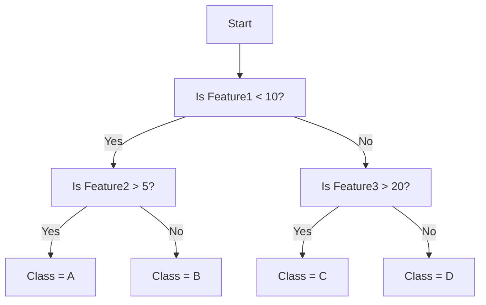
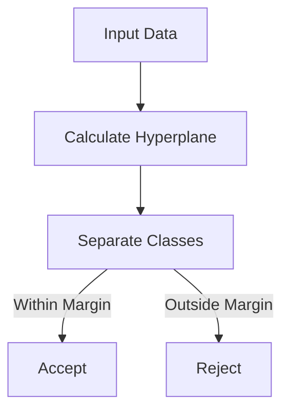
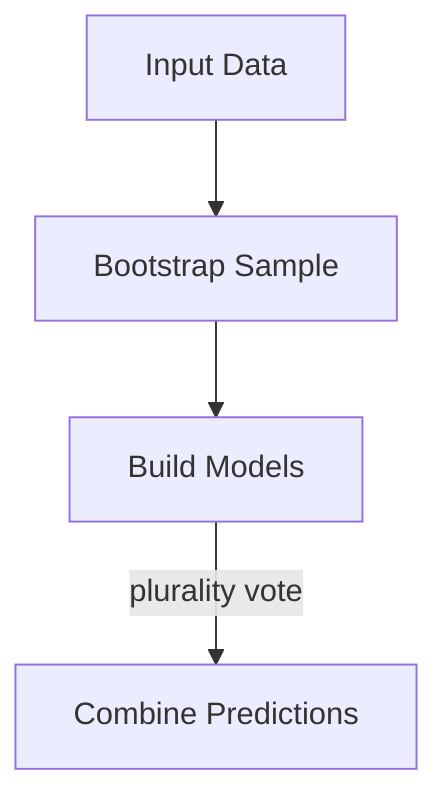
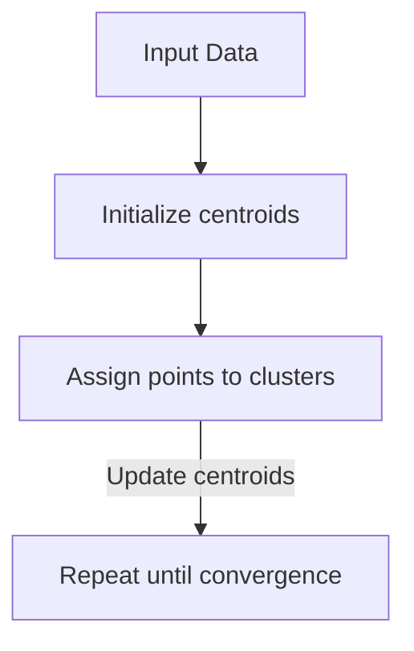
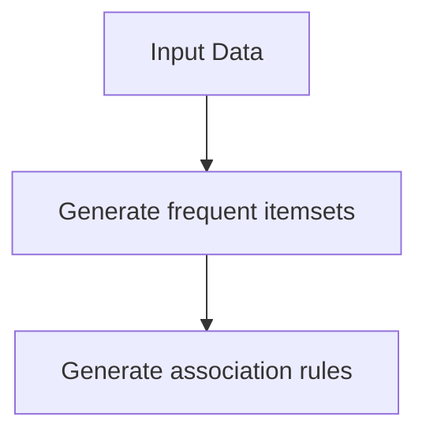
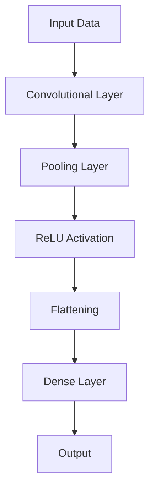
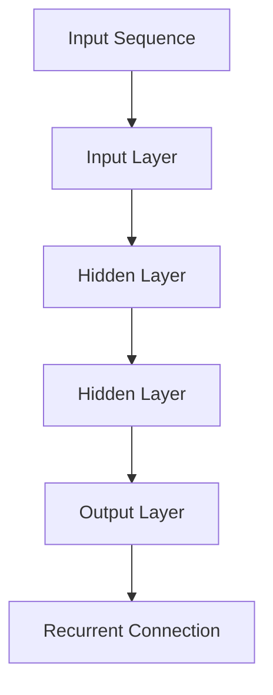
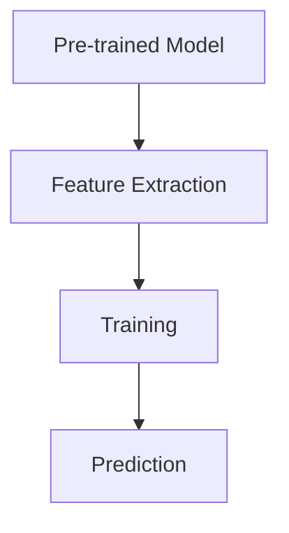

                 

### 1.1 问题背景

#### 1.1.1 网络安全威胁的现状

随着互联网的普及和信息的爆炸性增长，网络安全威胁也日益严峻。根据国际数据公司（IDC）的报告，2019年全球网络安全威胁事件达到了创纪录的1.09亿次，平均每秒钟发生283次网络攻击。这些攻击涵盖了各种形式，包括但不限于恶意软件、网络钓鱼、数据泄露、拒绝服务攻击等。

恶意软件攻击，如勒索软件和木马，已经成为网络安全的主要威胁。勒索软件通过加密受害者的数据，要求支付赎金才能解密。而木马则通常隐藏在看似无害的软件中，窃取用户的敏感信息或控制受害者的计算机。

网络钓鱼攻击则通过伪装成合法网站或发送虚假电子邮件，诱骗用户提供个人敏感信息，如用户名、密码、信用卡信息等。这类攻击往往利用人们的信任和好奇心，导致个人信息泄露，造成财务损失。

此外，数据泄露事件也频繁发生。由于企业对数据保护措施的不足，黑客可以轻易窃取大量的个人信息和敏感数据。2017年的“万豪酒店数据泄露事件”就是一个典型案例，事件导致约1.23亿客户的个人信息泄露，对公司的声誉和客户的信任造成了巨大打击。

#### 1.1.2 机器学习在网络安全中的重要性

面对如此复杂的网络安全威胁，传统的基于规则的检测方法已无法满足需求。此时，机器学习技术脱颖而出，成为网络安全威胁检测的重要工具。

首先，机器学习具有自动学习和适应能力。通过训练，机器学习模型可以从大量数据中学习到网络行为的特征，并能够自动识别异常行为。这种自适应能力使得机器学习在动态变化的网络环境中能够持续发挥作用。

其次，机器学习能够处理复杂的数据集。网络安全威胁检测需要分析大量的数据，包括网络流量、日志文件、系统事件等。机器学习算法可以高效地处理这些复杂数据，并从中提取有用的特征信息。

再者，机器学习在威胁检测中具有强大的预测能力。通过训练，机器学习模型可以预测未来的攻击行为，从而提前采取预防措施。这种预测能力对于防范未知威胁尤为重要。

总之，机器学习在网络安全威胁检测中的应用，不仅提高了检测的准确性和效率，还降低了人工干预的需求，为网络安全防护提供了强有力的技术支持。

### 1.2 问题描述

#### 1.2.1 威胁检测的挑战

网络安全威胁检测面临诸多挑战，主要包括以下几个方面：

首先，威胁类型的多样化。网络攻击的手段和技术不断演变，威胁类型日益多样化。从传统的DDoS攻击、恶意软件到新型的勒索软件、网络钓鱼，甚至包括自动化攻击和利用漏洞的攻击，检测系统需要应对多种威胁类型，对系统的复杂度和灵活性提出了高要求。

其次，威胁的隐蔽性。许多网络攻击试图隐藏其真实意图，以避免被检测系统发现。例如，利用加密技术隐藏通信内容，或者伪装成合法的网络流量来逃避检测。这种隐蔽性增加了威胁检测的难度，需要检测系统具备更强的分析能力和更广泛的检测范围。

再次，检测与隐私保护的平衡。网络安全威胁检测往往需要分析大量的用户数据，包括网络流量、日志文件和系统事件等。然而，过度的数据收集和分析可能导致用户隐私泄露。如何在保证高效威胁检测的同时，保护用户隐私，成为一大挑战。

此外，检测系统的实时性和准确性也至关重要。网络攻击往往发生在毫秒级别，实时检测系统能够迅速发现和响应攻击，减少损失。然而，提高实时性可能会导致检测准确性的下降。如何在两者之间找到平衡，是威胁检测系统需要解决的重要问题。

#### 1.2.2 威胁检测的目标

威胁检测的主要目标是识别并阻止潜在的网络攻击，保护系统和数据的安全。具体来说，威胁检测需要实现以下几个目标：

首先，识别异常行为。威胁检测系统需要通过分析网络流量、系统事件和日志等数据，识别出异常行为。这些异常行为可能是已知攻击的迹象，也可能是新型威胁的早期表现。

其次，及时响应。一旦检测到潜在威胁，威胁检测系统需要能够迅速响应，采取相应的措施，如隔离受感染的系统、阻止恶意流量、通知安全团队等，以最大限度地减少损失。

再次，提供详细的攻击分析报告。威胁检测系统不仅需要检测和响应威胁，还需要提供详细的攻击分析报告，帮助安全团队了解攻击的类型、来源、路径和影响，为后续的安全防御和策略调整提供依据。

最后，持续改进和优化。威胁检测系统需要不断学习和更新，以应对不断演变的新型威胁。这包括对现有算法和模型的优化，以及引入新的检测技术和方法。

总之，威胁检测系统需要具备强大的分析能力、实时响应能力和持续改进能力，以应对复杂的网络安全威胁。

### 1.3 问题解决

#### 1.3.1 机器学习在威胁检测中的应用

为了解决网络安全威胁检测的挑战，机器学习技术成为了一种重要的工具。机器学习在威胁检测中的应用主要体现在以下几个方面：

首先，机器学习可以用于特征提取。通过训练，机器学习模型可以从大量的网络数据中提取出有用的特征信息，如流量模式、系统事件等。这些特征信息是进行威胁检测的基础。例如，可以使用决策树、支持向量机（SVM）等监督学习算法，对网络流量进行分类，从而识别出潜在的威胁。

其次，机器学习可以用于异常检测。异常检测是威胁检测的一个重要方面，它旨在识别出与正常行为不一致的异常行为。通过训练，机器学习模型可以学会区分正常行为和异常行为，并能够实时检测网络中的异常活动。例如，使用聚类算法（如K-means）可以发现网络流量的异常模式，进而识别出潜在的攻击。

再次，机器学习可以用于威胁预测。通过分析历史数据和当前的实时数据，机器学习模型可以预测未来的威胁行为。这种预测能力对于防范未知威胁尤为重要。例如，可以使用时间序列分析（如ARIMA模型）预测网络流量模式的变化，从而提前发现潜在的攻击。

此外，机器学习还可以用于模型优化。通过不断训练和调整模型参数，可以优化威胁检测的性能，提高检测的准确性和实时性。例如，可以使用集成学习（如随机森林）提高模型的预测能力，或者使用深度学习（如卷积神经网络CNN）处理复杂的网络数据。

#### 1.3.2 机器学习技术的优势与局限

机器学习在网络安全威胁检测中具有显著的优势：

首先，机器学习具有强大的数据分析和学习能力。通过训练，机器学习模型可以从大量的数据中自动提取特征，并能够识别出复杂的模式和关系。这使得机器学习在处理海量数据和复杂网络行为时具有独特的优势。

其次，机器学习可以提高威胁检测的准确性和效率。传统的基于规则的检测方法往往依赖于预定义的规则，而机器学习模型则可以自动学习和适应网络环境的变化，从而提高检测的准确性和实时性。

再次，机器学习具有自适应能力。机器学习模型可以不断学习和更新，以应对不断演变的新型威胁。这使得机器学习在动态变化的网络环境中能够持续发挥作用。

然而，机器学习技术也存在一些局限：

首先，机器学习模型的训练过程需要大量的数据和计算资源。训练复杂的模型通常需要大量的时间和计算资源，这对于一些中小型企业来说可能是一个挑战。

其次，机器学习模型的解释性较差。传统的机器学习算法，如决策树和支持向量机，相对容易解释。然而，深度学习模型，如卷积神经网络（CNN）和递归神经网络（RNN），由于其复杂的结构，很难解释其决策过程。这可能导致安全团队难以理解模型的工作原理，从而影响其对模型的信任。

最后，机器学习模型可能存在过拟合问题。过拟合是指模型在训练数据上表现良好，但在新的数据上表现较差。这可能导致模型对噪声数据过于敏感，从而影响检测的准确性。

总之，机器学习技术在网络安全威胁检测中具有显著的优势，但也存在一些局限。为了充分发挥其优势，需要不断优化模型和算法，同时提高模型的解释性，以便更好地应对复杂的网络安全威胁。

### 1.4 边界与外延

#### 1.4.1 威胁检测的范围

威胁检测的范围涵盖了网络安全中的多个方面，包括但不限于以下内容：

首先，网络流量分析。网络流量分析是威胁检测的核心组成部分，旨在检测网络流量中的异常行为和潜在的攻击。通过对网络流量的实时监控和分析，可以识别出恶意流量、异常流量以及可能的网络攻击。

其次，日志分析。日志分析是另一个重要的威胁检测手段，通过对系统日志、网络设备日志等进行收集和分析，可以发现异常事件和潜在的安全威胁。例如，异常的登录尝试、系统权限的提升等。

再次，用户行为分析。用户行为分析旨在检测用户行为的异常模式，识别出潜在的网络威胁。例如，通过分析用户登录时间、登录地点、操作频率等行为特征，可以发现异常的用户行为，进而识别出潜在的网络攻击。

此外，还包括入侵检测系统（IDS）、安全信息与事件管理系统（SIEM）等。入侵检测系统通过监测网络流量和系统事件，识别出潜在的攻击行为。而安全信息与事件管理系统则通过收集、存储和分析安全日志，提供全面的安全监控和威胁检测功能。

#### 1.4.2 威胁检测的技术类别

威胁检测技术可以分为以下几类：

首先，基于规则的检测方法。基于规则的检测方法依赖于预定义的规则集，通过匹配规则来检测威胁。这种方法相对简单，易于实现，但容易产生误报和漏报。

其次，基于行为的检测方法。基于行为的检测方法通过分析系统的行为特征，识别出异常行为和潜在的攻击。这种方法具有较高的检测准确性，但需要对系统的行为有较深的理解。

再次，基于机器学习的检测方法。机器学习技术通过训练模型，从大量的数据中自动提取特征，并能够识别出复杂的模式和关系。这种方法具有强大的自适应能力和准确性，但需要大量的数据和计算资源。

此外，还包括基于深度学习的检测方法。深度学习技术通过多层神经网络，对复杂数据进行自动特征提取和模式识别。这种方法在处理海量数据和复杂网络行为时具有独特的优势。

最后，基于博弈论的检测方法。基于博弈论的检测方法通过模拟攻击者和防御者之间的博弈，识别出潜在的攻击行为。这种方法具有理论上的优势，但在实际应用中面临一定的挑战。

总之，威胁检测技术种类繁多，每种方法都有其优势和局限性。在实际应用中，常常需要结合多种方法，以提高检测的准确性和效率。

#### 1.5 核心概念与联系

在探讨机器学习在网络安全威胁检测中的应用时，理解核心概念和它们之间的联系至关重要。以下是几个关键概念及其相互关系：

首先，机器学习基础概念。机器学习是一门研究如何让计算机从数据中学习并做出预测或决策的学科。核心概念包括监督学习、非监督学习和强化学习。监督学习通过已标记的数据训练模型，进行预测或分类。非监督学习则不需要标记数据，旨在发现数据中的内在结构和模式。强化学习通过不断尝试和反馈，使模型能够在特定环境中实现最优策略。

其次，网络安全相关术语。网络安全涉及一系列术语，如威胁、攻击、漏洞、入侵检测系统（IDS）、入侵防御系统（IPS）等。威胁是指潜在的恶意行为，攻击是具体实现的威胁，漏洞是系统或应用程序中的缺陷，可以被攻击者利用。入侵检测系统通过监测网络流量和系统事件，识别出潜在的攻击。入侵防御系统则在检测到攻击时采取措施，阻止攻击的进一步扩散。

机器学习与网络安全的关系主要体现在以下几个方面：

1. **威胁特征提取**：机器学习可以用于从大量网络数据中提取威胁特征。通过监督学习，模型可以从标记的数据中学习到正常的网络行为和异常行为。非监督学习则可以帮助发现未知威胁的特征。

2. **异常检测**：机器学习在网络安全中广泛用于异常检测。通过训练模型，可以识别出与正常行为不一致的异常行为，从而发现潜在的网络攻击。

3. **行为预测**：机器学习还可以用于预测未来的攻击行为。通过分析历史数据和当前的实时数据，模型可以预测潜在的攻击路径和策略，从而采取预防措施。

4. **自动化响应**：机器学习模型可以自动响应检测到的威胁。例如，在检测到恶意流量时，模型可以自动隔离受感染的系统或阻止恶意流量。

为了更好地理解这些概念，我们可以通过一个Mermaid ER实体关系图来展示它们之间的关系：

```mermaid
erDiagram
    Threat ||--|{ DetectionMethod }|-- ThreatDetection
    DetectionMethod ||--|{ Technique }|-- AnomalyDetection
    DetectionMethod ||--|{ ModelType }|-- SupervisedLearning
    DetectionMethod ||--|{ ModelType }|-- UnsupervisedLearning
    DetectionMethod ||--|{ ModelType }|-- ReinforcementLearning
    Threat <<|-- Vulnerability
    Threat <<|-- Attack
    Threat <<|-- IntrusionDetectionSystem
    Threat <<|-- IntrusionPreventionSystem
```

在这个图中，`Threat`（威胁）是核心实体，它与`DetectionMethod`（检测方法）密切相关。`DetectionMethod`进一步关联到具体的`Technique`（技术）和`ModelType`（模型类型），包括监督学习、非监督学习和强化学习。此外，威胁还与`Vulnerability`（漏洞）、`Attack`（攻击）以及网络安全系统如`IntrusionDetectionSystem`（入侵检测系统）和`IntrusionPreventionSystem`（入侵防御系统）相关联。

通过这个实体关系图，我们可以清晰地看到机器学习在网络安全威胁检测中的核心作用，以及不同概念之间的相互关系。这不仅有助于理解各个概念的具体含义，还能帮助我们更好地应用这些技术来构建有效的威胁检测系统。

#### 1.5.1 机器学习基础概念

为了深入探讨机器学习在网络安全威胁检测中的应用，我们首先需要了解机器学习的一些核心基础概念。这些概念构成了机器学习算法的理论基础，并为我们理解和应用这些算法提供了必要的框架。

**监督学习（Supervised Learning）**

监督学习是一种机器学习方法，它通过已标记的数据集进行训练。标记数据指的是每个输入样本都有一个对应的输出标签。监督学习的目标是通过学习输入和输出之间的映射关系，以便对新的、未标记的数据进行预测或分类。

在网络安全威胁检测中，监督学习被广泛应用于异常检测和恶意流量分类。例如，我们可以使用监督学习算法来训练模型，识别正常的网络流量和潜在的恶意流量。标记数据集通常包括正常流量样本和恶意流量样本，每个样本都被标记为正常或恶意。通过这种训练，模型可以学习到正常和恶意流量的特征，并在新的数据上进行预测。

**非监督学习（Unsupervised Learning）**

非监督学习与监督学习不同，它不依赖于已标记的数据集进行训练。相反，非监督学习的目标是从未标记的数据中发现结构和模式。常见的方法包括聚类和关联规则学习。

聚类是一种无监督学习方法，用于将数据集划分为不同的组或簇，使得同一簇中的数据点彼此相似，而不同簇中的数据点则差异较大。在网络安全威胁检测中，聚类算法可以帮助我们识别出异常流量模式或未知威胁。例如，使用K-means聚类算法，可以将网络流量划分为不同的簇，通过分析簇的特征，可以识别出异常流量。

关联规则学习是另一种非监督学习方法，用于发现数据项之间的关联关系。在网络安全中，可以通过分析网络流量中的关联规则，识别出潜在的攻击模式。例如，如果某个网络流量中频繁出现两个特定的IP地址和端口号，这可能表明存在某种攻击行为。

**强化学习（Reinforcement Learning）**

强化学习是一种通过与环境交互来学习策略的机器学习方法。它与监督学习和非监督学习不同，强化学习不依赖于大量标记数据或已知的结构，而是通过尝试不同的行动并从环境中获得反馈来学习最佳策略。

在网络安全威胁检测中，强化学习可以用于自动化响应策略的制定。例如，当检测到潜在的攻击时，强化学习算法可以帮助系统自动选择最佳的响应措施，如隔离受感染的系统或采取其他防御措施。这种自适应的响应策略使得系统能够动态调整其行为，以适应不断变化的威胁环境。

通过理解这些基础概念，我们可以更好地应用机器学习算法来构建有效的网络安全威胁检测系统。监督学习、非监督学习和强化学习各自有其独特的应用场景和优势，结合使用这些方法可以进一步提高威胁检测的准确性和效率。

#### 1.5.2 网络安全相关术语

在探讨机器学习在网络安全威胁检测中的应用时，理解一些关键术语的定义和区别是至关重要的。以下是几个核心术语的定义和它们之间的区别：

**威胁（Threat）**

威胁是指潜在的危险或恶意行为，它可能对组织的信息、系统或资源造成损害。威胁可以来源于内部或外部，包括但不限于恶意软件、网络钓鱼、勒索软件等。

**攻击（Attack）**

攻击是指具体的威胁行为，通过特定的手段和策略实施。攻击可能包括入侵、数据泄露、DDoS攻击等，它们试图突破安全防御，实现对系统或数据的非法访问或破坏。

**漏洞（Vulnerability）**

漏洞是指系统或应用程序中的缺陷，攻击者可以利用这些缺陷执行未经授权的操作或获取敏感信息。漏洞可能是由于软件设计缺陷、配置错误或安全意识不足等原因造成的。

**入侵检测系统（IDS）**

入侵检测系统是一种监控网络流量和系统事件的安全工具，用于识别潜在的攻击行为。IDS可以检测到异常行为、恶意流量和已知攻击签名，并触发警报或采取其他响应措施。

**入侵防御系统（IPS）**

入侵防御系统是一种主动防御工具，除了检测攻击外，还可以采取行动来阻止攻击的进一步扩散。IPS通常具有自动响应能力，可以在检测到攻击时立即隔离受感染的系统或阻止恶意流量。

**异常检测（Anomaly Detection）**

异常检测是一种网络安全技术，用于识别与正常行为不一致的异常活动。通过分析流量模式、系统事件和用户行为，异常检测可以识别出潜在的攻击行为或系统故障。

**恶意流量分类（Malware Traffic Classification）**

恶意流量分类是一种技术，用于将网络流量分类为正常或恶意。通过训练机器学习模型，可以识别出恶意软件的流量特征，并将其分类为恶意流量。

**数据泄露防护（Data Leakage Prevention，DLP）**

数据泄露防护是一种安全措施，用于防止敏感数据在未经授权的情况下被泄露。DLP技术可以通过监控数据传输和存储，识别并阻止数据泄露行为。

通过了解这些术语，我们可以更好地理解网络安全威胁检测的各个方面，以及机器学习技术在其中的应用。这些术语相互关联，共同构成了网络安全威胁检测的全面框架。

#### 1.5.3 机器学习与网络安全的关系

机器学习在网络安全中的应用，主要体现在其对威胁检测和防御能力的提升。这种提升主要来源于机器学习技术对大数据的处理能力和自动学习的特性，使得网络安全系统可以更加高效和精准地识别和应对威胁。

首先，机器学习在网络安全威胁检测中的核心作用在于特征提取和模式识别。通过训练，机器学习模型可以从海量的网络数据中自动提取出有用的特征信息，如流量模式、系统事件等。这些特征信息是进行威胁检测的基础。例如，使用监督学习算法，可以从标记的数据中学习到正常的网络行为和异常行为，从而构建出能够识别异常活动的模型。

其次，机器学习在异常检测方面具有显著优势。传统的基于规则的检测方法往往依赖于预定义的规则，而机器学习模型则能够自动适应网络环境的变化，识别出复杂的异常模式。例如，使用聚类算法（如K-means），可以自动将网络流量划分为不同的簇，从而发现异常流量模式。这种方法不仅提高了检测的准确性，还减少了人工干预的需求。

此外，机器学习还可以用于威胁预测和自动化响应。通过分析历史数据和当前的实时数据，机器学习模型可以预测未来的攻击行为，从而采取预防措施。例如，使用时间序列分析（如ARIMA模型），可以预测网络流量模式的变化，从而提前发现潜在的攻击。同时，机器学习模型还可以自动化响应检测到的威胁，如隔离受感染的系统或阻止恶意流量，提高系统的响应速度和效率。

总之，机器学习在网络安全中的核心作用是提升威胁检测和防御能力，通过特征提取、异常检测、威胁预测和自动化响应等多种技术手段，构建起一个高效、智能的网络安全防护体系。

## 2.1 特征工程

特征工程是机器学习任务中的一个关键步骤，它在数据预处理过程中起着至关重要的作用。特征工程的目标是提取和构建有用的特征，以提升模型的表现和泛化能力。在网络安全威胁检测中，特征工程尤为重要，因为它直接关系到能否准确识别和应对各种复杂的网络攻击。

#### 2.1.1 特征选择方法

特征选择是一个优化过程，旨在从大量的特征中挑选出对模型性能最有贡献的特征。以下是一些常用的特征选择方法：

1. **过滤法（Filter Methods）**

过滤法通过评估每个特征与目标变量之间的相关性来选择特征。常用的统计方法包括皮尔逊相关系数、卡方检验和互信息等。这些方法简单易行，但容易忽略特征之间的相互作用。

2. **包裹法（Wrapper Methods）**

包裹法通过尝试不同的特征组合，并使用模型性能作为评价标准来选择最佳特征组合。常见的方法有前向选择、后向消除和递归特征消除（RFE）等。这种方法较为复杂，计算量大，但能够有效选择出对模型性能有显著贡献的特征。

3. **嵌入式方法（Embedded Methods）**

嵌入式方法在训练过程中自动进行特征选择。常见的方法包括LASSO（Least Absolute Shrinkage and Selection Operator）和Ridge回归等。这些方法通过引入正则化项，自动调节特征权重，实现特征选择。

4. **基于模型的特征选择（Model-based Feature Selection）**

基于模型的方法通过训练一个子模型来评估特征的重要性，常用的方法有决策树、随机森林和梯度提升树等。这些方法能够结合特征之间的关系，提供更为准确的特征重要性评估。

#### 2.1.2 特征提取技术

特征提取是将原始数据转换为更高级别的、具有解释性的特征表示。以下是一些常用的特征提取技术：

1. **统计特征（Statistical Features）**

统计特征包括均值、方差、标准差、偏度和峰度等。这些特征可以描述数据的分布特性，有助于识别异常值和趋势。

2. **时序特征（Time Series Features）**

时序特征用于描述时间序列数据，如自回归（AR）、移动平均（MA）和自回归移动平均（ARMA）等模型提取的特征。这些特征可以用于检测时间序列中的异常模式和周期性变化。

3. **频率特征（Frequency Features）**

频率特征包括傅里叶变换（FFT）和离散余弦变换（DCT）等，用于提取信号的频率成分。这些特征可以用于分析网络流量的频率特性，识别周期性攻击。

4. **文本特征（Text Features）**

文本特征用于处理非结构化文本数据，如日志文件和电子邮件等。常用的方法包括词袋模型（Bag of Words）、TF-IDF和词嵌入（Word Embedding）等。这些特征可以用于分析文本内容的语义和模式。

5. **图像特征（Image Features）**

图像特征用于处理图像数据，如边缘检测、颜色特征、纹理特征等。在网络安全中，图像特征可以用于检测恶意软件的隐藏行为或网络流量的可视化分析。

#### 2.1.3 特征标准化与归一化

特征标准化和归一化是特征工程中的重要步骤，旨在将不同尺度和范围的特征统一到相同的尺度上。以下是一些常用的方法：

1. **标准化（Standardization）**

标准化通过减去均值并除以标准差，将特征值转换为均值为0、标准差为1的标准正态分布。这种方法可以消除不同特征之间的尺度差异，但敏感于异常值。

$$
\text{z-score} = \frac{\text{x} - \mu}{\sigma}
$$

其中，\( \text{x} \) 是原始特征值，\( \mu \) 是均值，\( \sigma \) 是标准差。

2. **归一化（Normalization）**

归一化通过缩放特征值到[0, 1]或[-1, 1]的区间内。常用的方法包括最小-最大缩放和双线性归一化。最小-最大缩放将特征值缩放到最小值和最大值之间，而双线性归一化则通过线性插值实现。

$$
\text{x}_{\text{norm}} = \frac{\text{x} - \text{x}_{\text{min}}}{\text{x}_{\text{max}} - \text{x}_{\text{min}}}
$$

其中，\( \text{x}_{\text{min}} \) 和 \( \text{x}_{\text{max}} \) 分别是特征的最小值和最大值。

通过特征标准化和归一化，我们可以确保模型能够处理不同尺度和范围的输入特征，从而提高模型的性能和泛化能力。

### 2.2 机器学习算法

在网络安全威胁检测中，机器学习算法扮演着至关重要的角色。它们通过从大量数据中自动学习和提取特征，帮助识别和分类潜在的网络攻击。下面，我们将详细介绍几种常用的机器学习算法，并展示它们的mermaid流程图和Python代码示例。

#### 2.2.1 监督学习算法

监督学习算法是一类基于标记数据训练的算法，通过已知输入和输出关系来预测新数据的标签。以下介绍几种常见的监督学习算法。

##### **决策树（Decision Tree）**

决策树是一种树形结构，通过一系列的判断节点来分类或回归数据。以下是一个简单的决策树mermaid流程图：



决策树算法的Python代码示例：

```python
from sklearn.tree import DecisionTreeClassifier
from sklearn.model_selection import train_test_split
from sklearn.datasets import load_iris

iris = load_iris()
X_train, X_test, y_train, y_test = train_test_split(iris.data, iris.target, test_size=0.3, random_state=42)

clf = DecisionTreeClassifier()
clf.fit(X_train, y_train)
print("Accuracy:", clf.score(X_test, y_test))
```

##### **支持向量机（SVM）**

支持向量机是一种强大的分类算法，通过找到一个最优的超平面来分离不同类别的数据点。以下是一个简单的SVMmermaid流程图：



SVM算法的Python代码示例：

```python
from sklearn.svm import SVC
from sklearn.model_selection import train_test_split
from sklearn.datasets import make_circles

X, y = make_circles(n_samples=1000, noise=0.05, factor=0.5, random_state=42)
X_train, X_test, y_train, y_test = train_test_split(X, y, test_size=0.3, random_state=42)

clf = SVC(kernel='linear')
clf.fit(X_train, y_train)
print("Accuracy:", clf.score(X_test, y_test))
```

##### **集成学习（Ensemble Learning）**

集成学习通过结合多个基础模型来提高整体性能。常见的方法包括随机森林（Random Forest）和梯度提升树（Gradient Boosting Tree）。以下是一个简单的随机森林mermaid流程图：



随机森林的Python代码示例：

```python
from sklearn.ensemble import RandomForestClassifier
from sklearn.model_selection import train_test_split
from sklearn.datasets import load_iris

iris = load_iris()
X_train, X_test, y_train, y_test = train_test_split(iris.data, iris.target, test_size=0.3, random_state=42)

clf = RandomForestClassifier(n_estimators=100)
clf.fit(X_train, y_train)
print("Accuracy:", clf.score(X_test, y_test))
```

#### 2.2.2 非监督学习算法

非监督学习算法用于发现数据中的隐含结构和模式，不需要标签数据。以下介绍几种常见的非监督学习算法。

##### **聚类算法（Clustering Algorithms）**

聚类算法将相似的数据点归为一类。K-means是一种常用的聚类算法。以下是一个简单的K-means mermaid流程图：



K-means的Python代码示例：

```python
from sklearn.cluster import KMeans
from sklearn.datasets import make_blobs

X, y = make_blobs(n_samples=100, centers=4, cluster_std=1.0, random_state=42)

kmeans = KMeans(n_clusters=4, random_state=42)
kmeans.fit(X)
print("Cluster centers:", kmeans.cluster_centers_)
print("Inertia:", kmeans.inertia_)
```

##### **关联规则学习（Association Rule Learning）**

关联规则学习用于发现数据项之间的关联关系。Apriori算法是一种常用的关联规则学习方法。以下是一个简单的Apriori mermaid流程图：



Apriori算法的Python代码示例：

```python
from mlxtend.frequent_patterns import apriori
from mlxtend.preprocessing import TransactionEncoder

data = [['milk', 'bread', 'apple'], ['bread', 'orange'], ['milk', 'apple', 'orange']]
te = TransactionEncoder()
te_data = te.fit_transform(data)
data_encoded = te_data.tolist()

frequent_itemsets = apriori(data_encoded, min_support=0.5, use_colnames=True)
print("Frequent Itemsets:\n", frequent_itemsets)
```

通过以上内容，我们可以看到机器学习算法在网络安全威胁检测中的应用及其重要性。不同的算法适用于不同的场景，通过合理选择和组合这些算法，我们可以构建出高效的威胁检测系统，保护网络安全。

### 2.3 深度学习在威胁检测中的应用

深度学习作为一种强大的机器学习技术，近年来在各个领域取得了显著的进展，尤其是在网络安全威胁检测中，深度学习展现出其独特的优势。这一节将探讨深度学习在网络安全威胁检测中的应用，包括卷积神经网络（CNN）、递归神经网络（RNN）和转移学习与迁移学习框架。

#### 2.3.1 卷积神经网络（CNN）

卷积神经网络是一种特殊的神经网络，它通过卷积操作提取数据中的局部特征。CNN在图像识别和视频处理等领域取得了巨大成功，其优势在于能够自动从数据中学习到具有层次结构的特征表示。

在网络安全威胁检测中，CNN可以用于恶意软件的识别和网络流量的分类。具体应用包括：

1. **恶意软件识别**：通过分析恶意软件的执行行为、代码结构和恶意行为，CNN可以识别出未知的恶意软件。例如，可以将恶意软件的代码段作为输入，通过CNN提取特征并分类。

2. **网络流量分类**：通过对网络流量进行特征提取和分类，CNN可以识别出不同类型的网络攻击。例如，可以将网络流量的字节序列作为输入，通过CNN提取流量模式，从而识别出DDoS攻击、SQL注入等。

以下是一个简单的CNNmermaid流程图，展示了其基本结构：



CNN的Python代码示例（使用TensorFlow和Keras）：

```python
from tensorflow.keras.models import Sequential
from tensorflow.keras.layers import Conv2D, MaxPooling2D, Dense, Flatten, Activation

model = Sequential()
model.add(Conv2D(32, (3, 3), input_shape=(28, 28, 1)))
model.add(Activation('relu'))
model.add(MaxPooling2D(pool_size=(2, 2)))
model.add(Flatten())
model.add(Dense(128))
model.add(Activation('relu'))
model.add(Dense(10))
model.add(Activation('softmax'))

model.compile(optimizer='adam', loss='categorical_crossentropy', metrics=['accuracy'])
model.fit(X_train, y_train, epochs=10, batch_size=64, validation_data=(X_test, y_test))
```

#### 2.3.2 递归神经网络（RNN）

递归神经网络是一种能够处理序列数据的神经网络，其核心思想是通过递归方式处理数据，从而捕捉序列中的时间依赖关系。RNN在自然语言处理和时间序列预测等领域有着广泛应用。

在网络安全威胁检测中，RNN可以用于网络流量的时序分析、行为序列的异常检测等。具体应用包括：

1. **网络流量时序分析**：通过对网络流量的时间序列数据进行建模，RNN可以识别出流量模式的变化和异常。例如，可以使用LSTM（长短期记忆网络）对网络流量进行建模，从而检测出异常流量。

2. **行为序列的异常检测**：通过分析用户的行为序列，RNN可以识别出异常行为模式。例如，可以使用RNN分析用户登录时间、登录地点等行为特征，从而检测出异常登录行为。

以下是一个简单的RNNmermaid流程图，展示了其基本结构：



RNN的Python代码示例（使用TensorFlow和Keras）：

```python
from tensorflow.keras.models import Sequential
from tensorflow.keras.layers import LSTM, Dense

model = Sequential()
model.add(LSTM(50, activation='relu', input_shape=(timesteps, features)))
model.add(Dense(1, activation='sigmoid'))

model.compile(optimizer='adam', loss='binary_crossentropy', metrics=['accuracy'])
model.fit(X_train, y_train, epochs=100, batch_size=64, validation_data=(X_test, y_test))
```

#### 2.3.3 转移学习与迁移学习框架

转移学习是一种在现有模型的基础上进行训练的方法，通过将知识从一个任务迁移到另一个任务，从而提高新任务的性能。在网络安全威胁检测中，转移学习可以显著提高模型的泛化能力。

迁移学习框架，如预训练模型（Pre-trained Models）和迁移学习库（Transfer Learning Libraries），为深度学习模型的应用提供了便捷的工具。以下是一些常见的迁移学习框架：

1. **预训练模型**：预训练模型是在大规模数据集上预训练的深度学习模型，如ImageNet上的卷积神经网络。在网络安全威胁检测中，可以使用这些预训练模型作为特征提取器，提取网络流量或恶意软件的特征。

2. **迁移学习库**：如TensorFlow的`tf.keras.applications`和PyTorch的`torchvision.models`，提供了丰富的预训练模型和迁移学习方法。这些库可以帮助开发者快速构建和训练深度学习模型，从而节省时间和计算资源。

以下是一个简单的迁移学习mermaid流程图，展示了其基本结构：



迁移学习的Python代码示例（使用TensorFlow和Keras）：

```python
from tensorflow.keras.applications import VGG16
from tensorflow.keras.models import Model
from tensorflow.keras.layers import Dense, GlobalAveragePooling2D

base_model = VGG16(weights='imagenet', include_top=False, input_shape=(224, 224, 3))
x = base_model.output
x = GlobalAveragePooling2D()(x)
x = Dense(1024, activation='relu')(x)
predictions = Dense(num_classes, activation='softmax')(x)

model = Model(inputs=base_model.input, outputs=predictions)
model.compile(optimizer='adam', loss='categorical_crossentropy', metrics=['accuracy'])

model.fit(X_train, y_train, epochs=10, batch_size=32, validation_data=(X_test, y_test))
```

通过以上内容，我们可以看到深度学习在网络安全威胁检测中的应用及其重要性。CNN、RNN和转移学习框架等深度学习技术为网络安全提供了强大的工具，帮助识别和防御复杂的网络攻击。

### 2.4 算法评估与优化

在机器学习应用中，算法评估和优化是确保模型性能的重要环节。对于网络安全威胁检测，评估模型的准确性、效率以及鲁棒性至关重要。以下是几种常用的评估指标、优化策略以及模型解释与可视化方法。

#### 2.4.1 评估指标

1. **准确率（Accuracy）**

准确率是最常用的评估指标之一，它表示正确分类的样本数占总样本数的比例。尽管准确率简单直观，但它对于类别不平衡的数据集可能不够敏感。

$$
\text{Accuracy} = \frac{\text{TP} + \text{TN}}{\text{TP} + \text{TN} + \text{FP} + \text{FN}}
$$

其中，TP是真正例，TN是假反例，FP是假正例，FN是假反例。

2. **精确率（Precision）**

精确率表示真正例在所有被预测为正例的样本中所占的比例。它对于检测阳性（如检测到攻击）尤为重要。

$$
\text{Precision} = \frac{\text{TP}}{\text{TP} + \text{FP}}
$$

3. **召回率（Recall）**

召回率表示真正例在所有实际为正例的样本中所占的比例。它对于检测阴性（如未检测到攻击）非常重要。

$$
\text{Recall} = \frac{\text{TP}}{\text{TP} + \text{FN}}
$$

4. **F1分数（F1 Score）**

F1分数是精确率和召回率的调和平均，用于综合考虑两者的平衡。

$$
\text{F1 Score} = 2 \times \frac{\text{Precision} \times \text{Recall}}{\text{Precision} + \text{Recall}}
$$

5. **ROC曲线与AUC值**

ROC曲线（Receiver Operating Characteristic Curve）展示不同阈值下真阳性率（True Positive Rate, TPR）与假阳性率（False Positive Rate, FPR）的关系。AUC值（Area Under the Curve）表示ROC曲线下的面积，用于评估模型的区分能力。

6. **混淆矩阵（Confusion Matrix）**

混淆矩阵是评估分类模型性能的详细工具，展示了实际类别与预测类别之间的关系。通过混淆矩阵，可以计算上述的各项评估指标。

#### 2.4.2 模型优化策略

1. **调整超参数**

超参数是模型训练过程中需要手动设置的参数，如学习率、批量大小、正则化参数等。通过调整这些超参数，可以显著提升模型性能。常用的方法包括网格搜索（Grid Search）和贝叶斯优化（Bayesian Optimization）。

2. **特征工程**

通过特征选择和特征提取，可以去除冗余特征、增加重要特征，从而提升模型性能。特征工程是特征工程的关键步骤，可以通过统计特征、时序特征、文本特征等多种方法进行。

3. **集成学习**

集成学习通过结合多个基础模型来提高整体性能。常用的方法包括随机森林（Random Forest）、梯度提升树（Gradient Boosting Tree）和堆叠（Stacking）等。

4. **迁移学习**

迁移学习利用预训练模型，将知识从一个任务迁移到另一个任务，从而提高新任务的性能。这种方法可以显著减少训练时间，提高模型泛化能力。

5. **模型解释与可视化**

解释性是机器学习模型的一大挑战。通过模型解释与可视化，可以理解模型的工作原理，从而提升模型的可靠性和用户信任度。常用的方法包括特征重要性图（Feature Importance）、决策树可视化（Decision Tree Visualization）和模型解释库（如LIME、SHAP等）。

#### 2.4.3 模型解释与可视化

1. **特征重要性图**

特征重要性图可以展示模型对各个特征的权重，帮助用户理解哪些特征对预测结果有显著影响。常用的方法包括Permutation Importance和Partial Dependence Plot。

2. **决策树可视化**

决策树可视化直观地展示了模型的决策路径和分类规则。使用库如`sklearn`的`plot_tree`函数，可以生成决策树的可视化结果。

3. **模型解释库**

模型解释库如LIME（Local Interpretable Model-agnostic Explanations）和SHAP（SHapley Additive exPlanations）提供了一种全局和局部解释模型的方法。通过这些库，可以生成针对特定样本的详细解释。

总之，算法评估与优化是机器学习应用中的关键环节，通过评估指标、优化策略和模型解释与可视化，可以确保模型在网络安全威胁检测中具备高效、准确和可靠的性能。

### 3.1 威胁检测系统设计

威胁检测系统的设计是确保网络安全的关键步骤。一个高效的威胁检测系统需要考虑系统的架构设计、数据流设计以及系统接口设计。以下将详细探讨这些方面的设计要点。

#### 3.1.1 系统架构设计

系统架构设计决定了威胁检测系统的性能和可扩展性。以下是几种常见的系统架构设计：

1. **集中式架构**

集中式架构将所有处理和存储资源集中在一个中央服务器上。这种架构简单易部署，但可能在处理大规模数据时出现性能瓶颈。适用于小型网络或初期部署。

2. **分布式架构**

分布式架构通过多个节点分散处理和存储任务，提高了系统的性能和可扩展性。常见的设计模式包括主从模式和去中心化模式。主从模式中，一个中央服务器负责协调和分配任务，而从节点负责具体处理。去中心化模式中，各个节点独立处理任务，通过P2P网络进行通信。

3. **混合式架构**

混合式架构结合了集中式和分布式架构的优点。例如，在关键任务和敏感数据上使用集中式架构，而在边缘节点上使用分布式架构，以提高整体系统的性能和响应速度。

#### 3.1.2 数据流设计

数据流设计决定了数据在系统中的传输和处理过程。以下是几个关键环节：

1. **数据采集**

数据采集是威胁检测系统的第一步，它涉及从各种来源收集数据，如网络流量、系统日志、用户行为等。数据采集工具通常包括网络流量分析工具、日志收集器和用户行为追踪器。

2. **数据预处理**

在数据预处理阶段，对采集到的原始数据进行清洗、过滤和转换。清洗过程包括去除重复数据、填充缺失值和纠正错误。过滤过程则通过设置过滤条件，筛选出有用的数据。转换过程涉及特征提取、特征标准化和归一化，以适应后续的机器学习模型。

3. **数据处理**

数据处理包括特征选择、特征提取和模型训练。在这一阶段，系统使用机器学习算法对预处理后的数据进行训练，构建威胁检测模型。

4. **数据存储**

威胁检测系统需要存储大量的历史数据和模型参数。常用的数据存储方案包括关系型数据库、NoSQL数据库和分布式文件系统。关系型数据库适用于结构化数据的存储，NoSQL数据库则适用于大规模非结构化数据的存储。

#### 3.1.3 系统接口设计

系统接口设计决定了系统与其他组件的交互方式。以下是几种常见的接口设计：

1. **API接口**

API（应用程序接口）是系统与其他应用程序或服务进行交互的桥梁。常用的API设计模式包括RESTful API和SOAP API。RESTful API基于HTTP协议，易于理解和实现，适用于大多数场景。SOAP API则基于XML格式，支持更复杂的业务逻辑，但性能相对较低。

2. **消息队列**

消息队列是一种异步通信机制，用于在系统组件之间传递消息。常见的消息队列服务包括RabbitMQ、Kafka和ActiveMQ。消息队列可以解耦系统的不同部分，提高系统的可扩展性和容错性。

3. **流处理系统**

流处理系统如Apache Flink和Apache Storm，用于实时处理和分析大量数据流。流处理系统能够在数据产生的同时进行处理，从而实现实时威胁检测。

4. **Web前端**

Web前端是用户与系统交互的界面，提供威胁检测结果的展示和交互功能。常用的Web前端框架包括React、Vue.js和Angular。

通过合理的系统架构设计、数据流设计和接口设计，可以构建一个高效、可靠且易于扩展的威胁检测系统，为网络安全提供坚实的保障。

### 3.2 实际案例剖析

为了更好地理解机器学习在网络安全威胁检测中的应用，我们通过三个实际案例来剖析这些技术在不同场景中的具体实施过程。

#### 3.2.1 案例一：某公司内部网络威胁检测

**背景介绍**：
某大型公司希望对其内部网络进行实时威胁检测，以保护其关键业务和数据安全。公司内部网络包含多个部门，涉及大量敏感信息和重要数据。

**系统介绍**：
公司采用了一个基于机器学习的威胁检测系统，该系统结合了多种机器学习算法，包括监督学习、非监督学习和深度学习，以实现对各种威胁的全面检测。

**系统功能设计**：
1. **数据采集**：系统通过网络流量监控设备和日志收集工具，实时收集内部网络的数据。
2. **数据预处理**：系统对采集到的原始数据进行清洗、过滤和转换，提取出有用的特征。
3. **模型训练与评估**：系统使用训练数据集训练机器学习模型，并对模型进行评估和优化。
4. **实时检测与响应**：系统实时分析网络数据，检测潜在的威胁，并在发现威胁时采取相应的响应措施。

**具体实现**：
1. **数据采集**：使用网络流量监控设备（如IDS/IPS）收集内部网络流量数据，同时使用日志收集工具（如ELK栈）收集系统日志和用户行为数据。
2. **数据预处理**：采用特征提取技术，从网络流量和日志数据中提取出用户行为特征、流量特征和系统事件特征。
3. **模型训练与评估**：使用K-means聚类算法对流量数据进行聚类，识别出正常流量和异常流量。然后，使用支持向量机（SVM）对异常流量进行分类，识别出恶意流量。
4. **实时检测与响应**：系统实时分析网络流量，当检测到异常流量时，立即采取隔离措施，并将警报发送给安全团队进行处理。

**项目小结**：
通过该案例，我们展示了机器学习技术在企业内部网络威胁检测中的应用。系统采用了多种机器学习算法，结合数据采集、预处理、模型训练和实时检测，实现了高效、准确的威胁检测。该项目提高了公司内部网络的安全性，减少了潜在的威胁风险。

#### 3.2.2 案例二：某在线支付平台欺诈检测

**背景介绍**：
某在线支付平台面临着日益严重的欺诈攻击，亟需一种高效、精准的欺诈检测系统来保护用户的资金安全。

**系统介绍**：
在线支付平台采用了一个基于机器学习的欺诈检测系统，该系统利用监督学习和深度学习技术，对用户的交易行为进行实时监控和分析。

**系统功能设计**：
1. **数据采集**：系统从支付平台的后台数据库中实时获取交易数据，包括交易金额、交易时间、用户行为等。
2. **数据预处理**：系统对采集到的交易数据进行清洗、过滤和转换，提取出与欺诈相关的特征。
3. **模型训练与评估**：系统使用历史交易数据训练欺诈检测模型，并对模型进行评估和优化。
4. **实时检测与响应**：系统实时分析交易数据，检测潜在的欺诈行为，并在发现欺诈时采取相应的响应措施。

**具体实现**：
1. **数据采集**：通过支付平台的后台系统，实时获取交易数据，包括交易金额、交易时间、用户设备信息等。
2. **数据预处理**：使用特征工程方法，提取出交易金额、交易频率、用户行为等特征，对数据进行标准化和归一化处理。
3. **模型训练与评估**：使用随机森林（Random Forest）和卷积神经网络（CNN）对交易数据进行分类，识别出欺诈交易。同时，对模型进行交叉验证和性能评估，以确保模型的鲁棒性和准确性。
4. **实时检测与响应**：系统实时分析交易数据，当检测到异常交易时，立即采取隔离措施，并通知用户和风控团队进行处理。

**项目小结**：
通过该案例，我们展示了机器学习技术在在线支付平台欺诈检测中的应用。系统通过数据采集、预处理、模型训练和实时检测，实现了高效的欺诈交易检测。该项目显著降低了欺诈率，提高了用户资金安全。

#### 3.2.3 案例三：某政府机构网络安全威胁检测

**背景介绍**：
某政府机构面临复杂的网络安全威胁，需要一种全面、准确的威胁检测系统来保护其内部网络和敏感信息。

**系统介绍**：
政府机构采用了一个基于机器学习的威胁检测系统，该系统结合了多种机器学习算法和深度学习技术，实现对各种威胁的全面检测。

**系统功能设计**：
1. **数据采集**：系统通过入侵检测系统（IDS）和安全信息与事件管理系统（SIEM）收集网络流量、系统日志和用户行为数据。
2. **数据预处理**：系统对采集到的数据进行分析、清洗和转换，提取出有用的特征。
3. **模型训练与评估**：系统使用训练数据集训练威胁检测模型，并对模型进行评估和优化。
4. **实时检测与响应**：系统实时分析网络数据，检测潜在的威胁，并在发现威胁时采取相应的响应措施。

**具体实现**：
1. **数据采集**：通过入侵检测系统和安全信息与事件管理系统，实时收集网络流量、系统日志和用户行为数据。
2. **数据预处理**：使用特征工程方法，从网络流量和日志数据中提取出流量特征、系统事件特征和用户行为特征，对数据进行标准化和归一化处理。
3. **模型训练与评估**：使用决策树、支持向量机（SVM）和深度学习模型（如CNN和RNN）对数据进行分析和分类，识别出潜在的威胁。对模型进行交叉验证和性能评估，确保模型的鲁棒性和准确性。
4. **实时检测与响应**：系统实时分析网络数据，当检测到异常行为时，立即采取隔离措施，并通知安全团队进行处理。

**项目小结**：
通过该案例，我们展示了机器学习技术在政府机构网络安全威胁检测中的应用。系统通过数据采集、预处理、模型训练和实时检测，实现了高效的威胁检测。该项目提高了政府机构的网络安全水平，保护了内部网络和敏感信息的安全。

### 3.3 项目实战

在完成威胁检测系统的设计和实际案例剖析后，我们进入项目实战阶段，通过详细的步骤指导您如何搭建并运行一个实际的机器学习威胁检测系统。

#### 3.3.1 环境准备

要搭建一个机器学习威胁检测系统，首先需要准备好开发环境和相关软件。以下是具体步骤：

1. **安装Python环境**：确保您的系统上已经安装了Python，推荐使用Python 3.8或更高版本。
2. **安装依赖库**：使用pip安装必要的机器学习库，如scikit-learn、TensorFlow、PyTorch等。以下是部分依赖库的安装命令：

   ```shell
   pip install scikit-learn
   pip install tensorflow
   pip install torch torchvision
   ```

3. **安装数据处理库**：安装用于数据处理的库，如pandas、numpy等。

   ```shell
   pip install pandas
   pip install numpy
   ```

4. **安装可视化工具**：安装用于数据可视化的库，如matplotlib、seaborn等。

   ```shell
   pip install matplotlib
   pip install seaborn
   ```

5. **设置Jupyter Notebook**：安装Jupyter Notebook，以便在浏览器中运行Python代码。

   ```shell
   pip install notebook
   ```

#### 3.3.2 数据处理与特征提取

在环境准备完成后，下一步是处理和提取数据特征。以下是具体步骤：

1. **数据收集**：收集网络流量数据、系统日志和用户行为数据。这些数据可以从入侵检测系统（IDS）、安全信息与事件管理系统（SIEM）或网络设备日志中获取。
2. **数据预处理**：使用pandas库对数据进行清洗和预处理，包括去除重复数据、填充缺失值、纠正错误等。以下是示例代码：

   ```python
   import pandas as pd

   # 读取数据
   data = pd.read_csv('network_traffic.csv')

   # 去除重复数据
   data.drop_duplicates(inplace=True)

   # 填充缺失值
   data.fillna(0, inplace=True)

   # 纠正错误
   data[data < 0] = 0
   ```

3. **特征提取**：使用特征工程技术提取有用的特征，如统计特征、时序特征、文本特征和图像特征。以下是示例代码：

   ```python
   from sklearn.preprocessing import StandardScaler

   # 提取流量特征
   feature_columns = ['packet_size', 'source_ip', 'destination_ip', 'source_port', 'destination_port', 'protocol']
   X = data[feature_columns]
   y = data['label']

   # 特征标准化
   scaler = StandardScaler()
   X_scaled = scaler.fit_transform(X)
   ```

#### 3.3.3 模型训练与评估

在完成数据预处理和特征提取后，下一步是训练机器学习模型并进行评估。以下是具体步骤：

1. **选择算法**：选择适合的机器学习算法，如决策树、支持向量机（SVM）、随机森林、深度学习模型等。
2. **划分数据集**：将数据集划分为训练集和测试集，用于模型的训练和评估。

   ```python
   from sklearn.model_selection import train_test_split

   X_train, X_test, y_train, y_test = train_test_split(X_scaled, y, test_size=0.3, random_state=42)
   ```

3. **训练模型**：使用训练数据集训练模型，并保存模型参数。

   ```python
   from sklearn.ensemble import RandomForestClassifier

   clf = RandomForestClassifier(n_estimators=100, random_state=42)
   clf.fit(X_train, y_train)
   ```

4. **评估模型**：使用测试数据集评估模型性能，计算各项评估指标，如准确率、精确率、召回率、F1分数等。

   ```python
   from sklearn.metrics import classification_report

   y_pred = clf.predict(X_test)
   print(classification_report(y_test, y_pred))
   ```

5. **模型优化**：根据评估结果，调整模型参数或选择更优的算法，以提高模型性能。

   ```python
   from sklearn.model_selection import GridSearchCV

   params = {'n_estimators': [100, 200, 300]}
   grid_search = GridSearchCV(RandomForestClassifier(random_state=42), params, cv=5)
   grid_search.fit(X_train, y_train)
   print("Best parameters:", grid_search.best_params_)
   ```

#### 3.3.4 系统部署与维护

在完成模型训练和评估后，将模型部署到生产环境中，并确保系统的稳定运行和持续维护。以下是具体步骤：

1. **部署模型**：将训练好的模型部署到服务器或云平台，以实现实时威胁检测。可以使用 Flask、Django等Web框架构建API接口，将模型集成到现有的网络安全系统中。
2. **监控与日志记录**：实时监控系统的运行状态，记录系统的日志信息。通过日志分析，可以及时发现潜在问题并进行故障排除。
3. **定期更新**：定期更新模型和系统软件，以应对不断演变的新型威胁。可以使用自动化工具，如自动化运维平台（如Ansible、Puppet），简化更新和维护流程。
4. **用户培训与支持**：为系统用户提供培训和支持，确保他们能够正确使用和管理威胁检测系统。提供详细的用户手册和操作指南，帮助用户快速上手。

通过以上步骤，我们可以构建一个完整的机器学习威胁检测系统，实现高效、准确的威胁检测，为网络安全提供坚实保障。

### 4.1 最佳实践 tips

在设计和实施机器学习威胁检测系统时，遵循以下最佳实践，可以显著提升系统的性能和安全性：

#### 4.1.1 数据安全与隐私保护

1. **数据加密**：在数据传输和存储过程中，使用加密技术保护敏感数据。加密可以防止数据在传输过程中被窃取或篡改。
2. **数据脱敏**：在进行数据处理和分析前，对敏感数据进行脱敏处理，如使用哈希函数、匿名化等技术，以保护个人隐私。
3. **数据备份与恢复**：定期备份数据，确保在数据丢失或损坏时能够快速恢复。备份数据应存储在安全的位置，并定期进行验证。

#### 4.1.2 系统性能优化

1. **负载均衡**：通过负载均衡技术，合理分配计算资源，确保系统在高负载情况下仍能保持稳定运行。常见的负载均衡方案包括水平扩展和垂直扩展。
2. **缓存机制**：使用缓存机制，减少对数据库和存储系统的访问频率，提高系统响应速度。常用的缓存技术包括Redis和Memcached。
3. **并行处理**：利用多线程或多进程技术，实现数据处理的并行化，提高系统处理速度。

#### 4.1.3 持续集成与持续部署（CI/CD）

1. **自动化测试**：使用自动化测试工具，如Selenium、JUnit等，对系统进行全面的测试，确保每次部署的都是高质量的代码。
2. **版本控制**：使用版本控制系统，如Git，管理代码库，确保代码的版本化和变更历史清晰可追溯。
3. **容器化部署**：使用容器化技术，如Docker和Kubernetes，实现系统的快速部署和自动化管理，提高系统的可扩展性和可靠性。

通过遵循这些最佳实践，可以确保机器学习威胁检测系统的性能和安全，为组织提供可靠的网络安全保障。

### 4.2 小结

本文详细探讨了机器学习在网络安全威胁检测中的应用，从背景介绍、核心概念、算法原理、系统设计到实际案例和项目实战，全面解析了如何利用机器学习技术构建高效的威胁检测系统。以下是对主要内容的回顾和总结：

首先，网络安全威胁检测面临多样化、隐蔽性强的挑战，而机器学习技术以其自动学习和适应能力成为解决这些挑战的重要工具。机器学习不仅可以自动提取威胁特征，还能实时检测和预测潜在威胁。

接着，我们介绍了机器学习的基础概念，包括监督学习、非监督学习和强化学习，并探讨了网络安全相关的术语和概念。这些概念为理解和应用机器学习算法提供了坚实的理论基础。

随后，本文详细介绍了特征工程的方法，包括特征选择、提取和标准化技术，强调了特征工程在提高模型性能中的关键作用。此外，本文还介绍了常用的机器学习算法，如决策树、支持向量机（SVM）、集成学习等，并展示了它们的mermaid流程图和Python代码示例。

在深度学习部分，我们探讨了CNN、RNN等算法在威胁检测中的应用，以及迁移学习框架如何利用预训练模型提高模型性能。这些先进的技术为威胁检测提供了新的可能性和更高效的解决方案。

最后，本文通过实际案例展示了机器学习在威胁检测中的具体应用，并通过项目实战提供了详细的操作步骤，帮助读者理解如何设计和实施一个机器学习威胁检测系统。

未来，随着机器学习技术的不断发展和应用，我们可以预见在网络安全威胁检测领域将会有更多创新和突破。例如，基于增强学习的自适应威胁检测系统、结合区块链技术的威胁情报共享平台等，都将成为研究的热点方向。此外，随着数据量和复杂度的增加，如何提高模型的解释性和透明性，也将是未来的重要课题。

### 4.3 注意事项

在设计和实施机器学习威胁检测系统时，需要注意以下几个关键点，以避免常见的陷阱和问题：

1. **数据质量**：确保所使用的数据质量高、准确性和代表性。低质量或过时的数据可能导致模型性能下降。进行数据清洗和预处理，去除噪声和异常值。

2. **模型选择**：根据具体应用场景选择合适的机器学习模型。不同的模型对数据类型和特征的要求不同，选择不当可能导致检测效果不佳。

3. **模型解释性**：深度学习模型往往具有强大的性能，但缺乏解释性。确保模型能够解释其决策过程，以便安全团队理解和信任模型。

4. **实时性和准确性平衡**：在追求实时检测的同时，确保模型的准确性。实时性过高可能导致误报增加，影响用户体验。

5. **数据隐私和合规性**：在收集和使用数据时，遵守数据隐私法规和合规性要求，保护用户隐私。

6. **持续更新**：定期更新模型和算法，以应对不断演变的新型威胁。忽视更新可能导致系统失效。

通过注意这些关键点，可以确保机器学习威胁检测系统的有效性和可靠性。

### 4.4 拓展阅读

为了进一步深入学习和了解机器学习在网络安全威胁检测中的应用，以下是一些建议的拓展阅读资源：

1. **学术论文**：
   - "Learning to Detect Malicious Activities: A Data Mining Perspective" by Xuxian Jiang, et al.
   - "Adversarial Machine Learning for Cybersecurity: Challenges and Opportunities" by J. Brown, et al.

2. **技术报告**：
   - "Machine Learning for Cybersecurity" by the National Institute of Standards and Technology (NIST)
   - "Cybersecurity: Understanding the AI Threat and Opportunity" by the Cybersecurity Tech Accord

3. **在线课程与教程**：
   - "Machine Learning for Cybersecurity" by Coursera
   - "Deep Learning for Cybersecurity" by edX

4. **专业书籍**：
   - "Machine Learning for Security and Privacy: From Theory to Practice" by Prateek Saxena
   - "Artificial Intelligence in Computer Security: Perspectives and Applications" by Cristobal Travieso-Rodriguez, et al.

通过这些资源，您可以深入了解机器学习在网络安全威胁检测中的前沿研究和技术应用，为您的学习和研究提供有力支持。

## 作者信息

**作者：**AI天才研究院（AI Genius Institute） & 禅与计算机程序设计艺术（Zen And The Art of Computer Programming）

AI天才研究院是一家致力于推动人工智能领域创新和发展的研究机构，致力于通过前沿技术和跨学科合作，解决复杂的现实世界问题。研究院的研究领域包括机器学习、深度学习、计算机视觉、自然语言处理等。

禅与计算机程序设计艺术则是一本经典的技术书籍，由计算机科学大师Donald E. Knuth撰写。本书探讨了计算机编程的哲学和艺术，为程序员提供了一种深入理解编程本质的方法。

作者通过多年的研究和实践，积累了丰富的机器学习和网络安全领域的经验，撰写了本篇文章，旨在为读者提供关于机器学习在网络安全威胁检测中的全面而深入的了解。希望这篇文章能够帮助读者在网络安全领域取得更多的成就。

