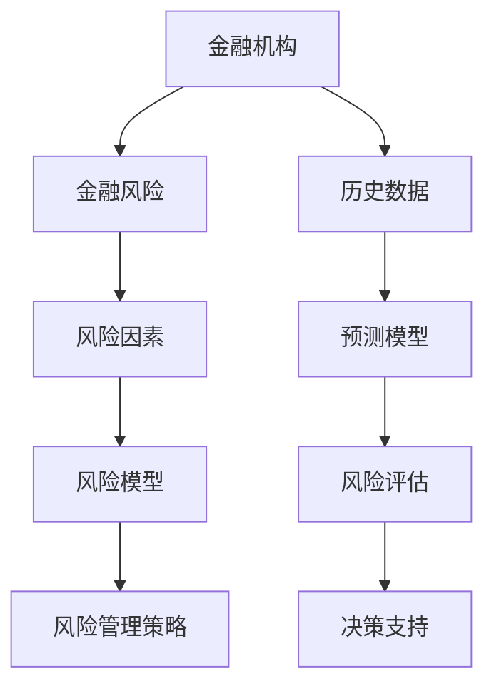
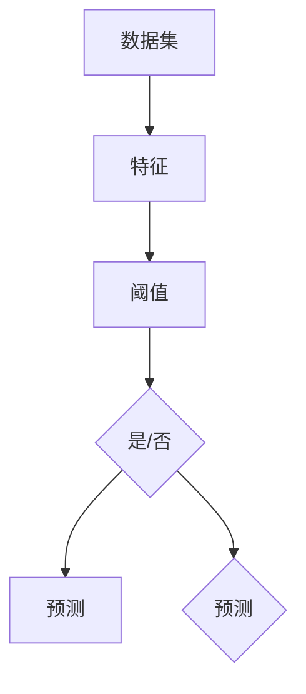
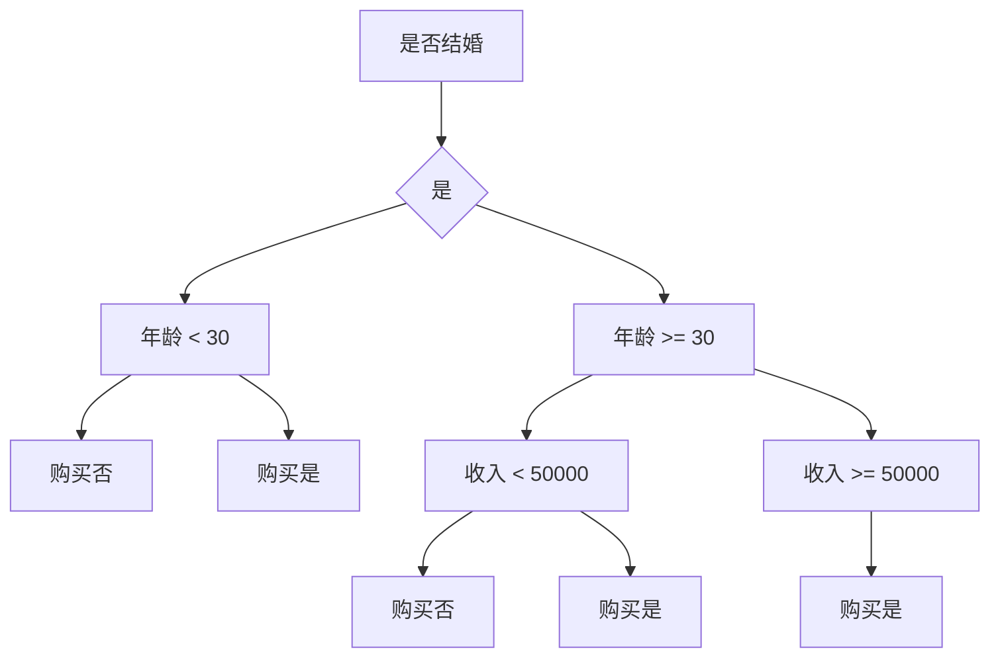

                 

# 机器学习在金融风险管理中的应用

> 关键词：机器学习、金融风险管理、信用风险评估、市场风险预测、操作风险管理

> 摘要：本文旨在探讨机器学习在金融风险管理中的应用，通过介绍背景、基本概念、算法原理和应用案例，分析其在金融风险管理中的重要作用和未来发展趋势。

----------------------------------------------------------------

### 《机器学习在金融风险管理中的应用》目录大纲

# 第一部分：背景介绍

## 1.1 问题背景

### 1.1.1 金融风险管理的现状与挑战

### 1.1.2 机器学习在金融领域的应用机遇

### 1.1.3 本书的目标与结构安排

## 1.2 问题描述

### 1.2.1 金融风险管理中的核心问题

### 1.2.2 机器学习在金融风险管理中的关键作用

### 1.2.3 边界与外延

## 1.3 概念结构与核心要素

### 1.3.1 机器学习的核心概念

### 1.3.2 金融风险管理的核心要素

### 1.3.3 概念属性特征对比表格

## 1.4 ER实体关系图

## 1.5 本章小结

# 第二部分：机器学习基础

## 2.1 机器学习概述

### 2.1.1 机器学习的定义与分类

### 2.1.2 机器学习的核心算法

### 2.1.3 机器学习的应用场景

## 2.2 数据预处理

### 2.2.1 数据收集与清洗

### 2.2.2 特征工程

### 2.2.3 数据标准化与归一化

## 2.3 算法原理

### 2.3.1 线性回归

### 2.3.2 决策树

## 2.4 数学模型与公式

### 2.4.1 梯度下降法

### 2.4.2 随机梯度下降法

## 2.5 算法举例说明

### 2.5.1 线性回归应用实例

### 2.5.2 决策树应用实例

## 2.6 本章小结

# 第三部分：金融风险管理中的机器学习应用

## 3.1 信用风险评估

### 3.1.1 信用风险评估的方法

### 3.1.2 信用风险评估中的机器学习应用

### 3.1.3 信用风险评估案例

## 3.2 市场风险预测

### 3.2.1 市场风险的定义与分类

### 3.2.2 市场风险预测的机器学习模型

### 3.2.3 市场风险预测案例

## 3.3 操作风险管理

### 3.3.1 操作风险的定义与分类

### 3.3.2 操作风险管理的机器学习应用

### 3.3.3 操作风险管理案例

## 3.4 风险度量模型

### 3.4.1 VaR模型的原理与应用

### 3.4.2 CVaR模型的原理与应用

### 3.4.3 风险度量模型案例

## 3.5 本章小结

# 第四部分：机器学习在金融风险管理中的最佳实践

## 4.1 最佳实践技巧

### 4.1.1 数据质量提升技巧

### 4.1.2 模型选择与优化技巧

### 4.1.3 模型解释性与可解释性技巧

## 4.2 小结与注意事项

### 4.2.1 机器学习在金融风险管理中的优势和挑战

### 4.2.2 注意事项与风险管理

### 4.2.3 未来发展趋势

## 4.3 拓展阅读

### 4.3.1 相关书籍推荐

### 4.3.2 学术论文精选

### 4.3.3 实践项目与课程

## 4.4 本章小结

----------------------------------------------------------------

### 第一部分：背景介绍

## 1.1 问题背景

### 1.1.1 金融风险管理的现状与挑战

金融风险管理是指通过识别、评估、监控和应对金融风险，确保金融机构的稳健运营和可持续发展。随着金融市场的日益复杂化和全球化，金融风险管理的挑战也日益增加。

- **市场风险**：包括利率风险、汇率风险、股票价格波动等，可能导致金融机构的财务损失。
- **信用风险**：涉及借款人无法按时还款，导致金融机构损失。
- **操作风险**：由于内部错误、系统故障、欺诈行为等导致的损失。
- **流动性风险**：金融机构无法在合理的时间内以合理的价格出售资产或获得资金。

### 1.1.2 机器学习在金融领域的应用机遇

机器学习作为一种先进的计算方法，具有强大的数据处理和模式识别能力，可以在金融风险管理中发挥重要作用。

- **数据处理**：金融数据通常是大规模且复杂的，机器学习能够有效处理这些数据，提取有用的信息。
- **风险预测**：机器学习可以通过分析历史数据，预测未来的金融风险，帮助金融机构提前采取应对措施。
- **模型优化**：机器学习可以通过优化模型参数，提高风险管理模型的准确性和效率。

### 1.1.3 本书的目标与结构安排

本书的目标是探讨机器学习在金融风险管理中的应用，通过介绍基本概念、算法原理和应用案例，帮助读者深入了解这一领域。

- **第一部分**：背景介绍，包括金融风险管理的现状与挑战、机器学习在金融领域的应用机遇。
- **第二部分**：机器学习基础，介绍机器学习的定义、核心算法、数据预处理和数学模型。
- **第三部分**：金融风险管理中的机器学习应用，详细介绍信用风险评估、市场风险预测、操作风险管理和风险度量模型。
- **第四部分**：最佳实践与注意事项，包括数据质量提升、模型选择与优化、模型解释性与未来发展趋势。

## 1.2 问题描述

### 1.2.1 金融风险管理中的核心问题

金融风险管理中的核心问题包括：

- 如何准确评估市场风险、信用风险和操作风险？
- 如何预测这些风险的可能性和影响？
- 如何制定有效的风险管理策略和决策支持系统？

### 1.2.2 机器学习在金融风险管理中的关键作用

机器学习在金融风险管理中的关键作用主要体现在以下几个方面：

- **风险预测**：通过分析历史数据，机器学习可以预测未来的风险，帮助金融机构提前采取应对措施。
- **模型优化**：机器学习可以优化风险管理模型，提高其准确性和效率。
- **决策支持**：基于机器学习的风险管理模型可以为金融机构提供更准确的决策支持，降低风险。

### 1.2.3 边界与外延

机器学习在金融风险管理中的应用边界主要受限于以下几个方面：

- **数据质量**：金融数据的质量直接影响机器学习模型的性能。
- **模型解释性**：机器学习模型通常具有一定的黑箱性质，难以解释其内部决策过程，这在金融风险管理中可能是一个挑战。
- **监管合规性**：机器学习模型的应用需要遵守相关的法律法规和监管要求。

## 1.3 概念结构与核心要素

### 1.3.1 机器学习的核心概念

机器学习是人工智能的一个重要分支，其核心概念包括：

- **监督学习**：通过已知输入输出数据来训练模型，预测未知数据。
- **无监督学习**：没有已知输出，通过分析输入数据，发现数据中的模式和规律。
- **强化学习**：通过不断试错，找到最优策略，以最大化回报。

### 1.3.2 金融风险管理的核心要素

金融风险管理的核心要素包括：

- **风险识别**：识别潜在的金融风险。
- **风险评估**：评估风险的规模和可能性。
- **风险监控**：实时监控风险的变化。
- **风险应对**：制定和实施风险应对策略。

### 1.3.3 概念属性特征对比表格

| 概念 | 描述 | 属性特征 |
| --- | --- | --- |
| 机器学习 | 一种人工智能技术，通过数据训练模型，预测未知数据。 | 数据驱动、自动学习、模式识别 |
| 金融风险管理 | 管理金融机构面临的金融风险，确保稳健运营。 | 风险识别、风险评估、风险监控、风险应对 |
| 监督学习 | 已知输入输出，训练模型预测未知数据。 | 已知输入、已知输出、模型训练、预测 |
| 无监督学习 | 没有已知输出，分析输入数据，发现模式。 | 输入数据、模式发现、聚类、降维 |
| 强化学习 | 通过试错，找到最优策略，最大化回报。 | 动作选择、状态转移、回报最大化 |

### 1.4 ER实体关系图

## 1.5 本章小结

本文介绍了机器学习在金融风险管理中的应用背景、核心问题和概念结构。通过了解金融风险管理的现状和挑战，以及机器学习的基本概念和原理，读者可以为进一步学习金融风险管理的机器学习应用打下基础。

----------------------------------------------------------------

### 第二部分：机器学习基础

## 2.1 机器学习概述

### 2.1.1 机器学习的定义与分类

机器学习（Machine Learning）是一门人工智能（Artificial Intelligence, AI）的分支学科，主要研究如何让计算机从数据中学习，并做出决策或预测。根据学习方式，机器学习可以分为以下几类：

- **监督学习（Supervised Learning）**：通过已知输入输出数据训练模型，然后预测未知数据。
- **无监督学习（Unsupervised Learning）**：没有已知输出，通过分析输入数据，发现数据中的模式和规律。
- **强化学习（Reinforcement Learning）**：通过不断试错，学习最优策略，以最大化回报。

### 2.1.2 机器学习的核心算法

机器学习中有许多核心算法，以下是其中几个常用的算法：

- **线性回归（Linear Regression）**：用于预测一个连续的输出变量。
- **逻辑回归（Logistic Regression）**：用于预测一个二分类的输出变量。
- **决策树（Decision Tree）**：用于分类和回归问题。
- **随机森林（Random Forest）**：基于决策树的集成方法，提高模型的准确性和鲁棒性。
- **支持向量机（Support Vector Machine, SVM）**：用于分类问题，通过寻找最佳分割超平面。
- **神经网络（Neural Networks）**：模仿人脑神经元结构，用于复杂的分类和回归问题。

### 2.1.3 机器学习的应用场景

机器学习在许多领域都有广泛应用，以下是几个典型的应用场景：

- **图像识别**：通过训练模型，识别和分类图像。
- **语音识别**：将语音信号转换为文本，应用于智能助手等。
- **自然语言处理**：理解和生成自然语言，应用于机器翻译、文本分类等。
- **金融风险管理**：通过分析历史数据，预测市场风险、信用风险等。

## 2.2 数据预处理

### 2.2.1 数据收集与清洗

在机器学习项目中，数据预处理是至关重要的一步。首先，需要收集大量高质量的数据。这些数据可能来源于内部数据库、公开数据集或第三方数据提供商。数据收集后，需要进行数据清洗，以去除噪声和错误。

- **缺失值处理**：通过填充或删除缺失值来处理。
- **异常值处理**：通过检测和去除异常值，提高数据质量。
- **重复值处理**：去除重复的数据记录。
- **数据转换**：将数据转换为适合机器学习算法的形式。

### 2.2.2 特征工程

特征工程是数据预处理的重要环节，旨在通过选择和构造特征，提高模型的性能。以下是一些常用的特征工程方法：

- **特征选择**：选择对模型预测有显著影响的关键特征。
- **特征构造**：通过组合现有特征，构造新的特征。
- **特征标准化**：将特征缩放至相同的范围，避免特征间的偏差。

### 2.2.3 数据标准化与归一化

数据标准化和归一化是数据预处理中的重要步骤，有助于提高模型训练的效果。

- **数据标准化**：通过减去均值并除以标准差，将特征缩放到均值为0、标准差为1的范围。
- **归一化**：通过缩放特征值到特定范围，如0到1或-1到1。

## 2.3 算法原理

### 2.3.1 线性回归

线性回归是一种常见的监督学习算法，用于预测一个连续的输出变量。其基本公式如下：

$$
y = \beta_0 + \beta_1x + \epsilon
$$

其中，\( y \) 是输出变量，\( x \) 是输入变量，\( \beta_0 \) 和 \( \beta_1 \) 是模型参数，\( \epsilon \) 是误差项。

线性回归的目标是找到最佳拟合线，使预测值与真实值之间的误差最小。这通常通过最小二乘法实现。

### 2.3.2 决策树

决策树是一种常见的分类和回归算法，通过一系列判断条件，将数据分为不同的类别或预测不同的值。其基本原理如下：

决策树通过递归地划分数据，将数据逐步划分为不同的类别或预测值。

## 2.4 数学模型与公式

### 2.4.1 梯度下降法

梯度下降法是一种常用的优化算法，用于最小化损失函数。其基本公式如下：

$$
w_{t+1} = w_t - \alpha \frac{\partial J(w_t)}{\partial w_t}
$$

其中，\( w_t \) 是当前模型参数，\( \alpha \) 是学习率，\( J(w_t) \) 是损失函数。

梯度下降法的目标是逐步更新模型参数，使损失函数达到最小。

### 2.4.2 随机梯度下降法

随机梯度下降法是对梯度下降法的改进，通过随机选择一部分数据点来更新模型参数。其基本公式如下：

$$
w_{t+1} = w_t - \alpha \frac{\partial J(w_t)}{\sum_i (y_i - \hat{y}_i)}
$$

随机梯度下降法可以加快收敛速度，但可能导致模型不稳定。

## 2.5 算法举例说明

### 2.5.1 线性回归应用实例

假设我们有一个简单的线性回归模型，预测房价：

$$
y = \beta_0 + \beta_1x
$$

其中，\( y \) 是房价，\( x \) 是房屋面积，\( \beta_0 \) 和 \( \beta_1 \) 是模型参数。

我们收集了一些房屋面积和房价的数据，如下表：

| 面积（x） | 房价（y） |
| --- | --- |
| 100 | 200 |
| 150 | 250 |
| 200 | 300 |

通过最小二乘法，我们可以计算出最佳拟合线的参数：

$$
\beta_0 = \frac{\sum y - \beta_1 \sum x}{n} = \frac{200 + 250 + 300 - 0.5 \times 100 \times 150}{3} = 266.67
$$

$$
\beta_1 = \frac{\sum xy - \frac{\sum x \sum y}{n}}{\sum x^2 - \frac{(\sum x)^2}{n}} = \frac{100 \times 200 + 150 \times 250 + 200 \times 300 - \frac{100 + 150 + 200}{3} \times 266.67}{100^2 + 150^2 + 200^2 - \frac{100 + 150 + 200}{3}^2} = 1.333
$$

因此，最佳拟合线为：

$$
y = 266.67 + 1.333x
$$

### 2.5.2 决策树应用实例

假设我们有一个决策树模型，用于预测客户是否会购买某种产品。该模型基于以下特征：

- 年龄（Age）
- 收入（Income）
- 婚姻状况（Marital Status）

根据这些特征，我们可以构建以下决策树：

根据决策树，我们可以预测一个年龄为25岁、收入为60000元且已结婚的客户是否会购买产品。根据决策路径，该客户最终会被预测为购买产品。

## 2.6 本章小结

本文介绍了机器学习的基本概念、核心算法、数据预处理和数学模型。通过了解这些基本知识，读者可以为进一步学习金融风险管理的机器学习应用打下基础。

----------------------------------------------------------------

### 第三部分：金融风险管理中的机器学习应用

## 3.1 信用风险评估

### 3.1.1 信用风险评估的方法

信用风险评估是指评估借款人是否能够按时还款，以降低信用风险。传统信用风险评估主要依赖于借款人的信用历史、收入、资产状况等。随着机器学习技术的发展，机器学习在信用风险评估中得到了广泛应用。

### 3.1.2 信用风险评估中的机器学习应用

机器学习在信用风险评估中的应用主要包括以下几个方面：

- **特征选择**：通过机器学习算法选择对信用评估有显著影响的特征，如消费习惯、信用使用情况等。
- **分类模型**：使用分类算法，如逻辑回归、随机森林等，对借款人进行信用评估，判断其是否为高风险客户。
- **聚类分析**：通过聚类算法，如K均值聚类，将借款人划分为不同的风险类别，为信用评估提供参考。

### 3.1.3 信用风险评估案例

假设我们使用逻辑回归模型对借款人进行信用风险评估。我们收集了以下数据：

- 借款人年龄
- 借款人收入
- 借款人信用历史

我们使用逻辑回归模型建立信用风险评估模型，并通过交叉验证评估模型的性能。根据模型的预测，我们可以对借款人进行风险分类，并为高风险客户采取相应的风险控制措施。

## 3.2 市场风险预测

### 3.2.1 市场风险的定义与分类

市场风险是指由于市场价格波动导致的潜在损失。市场风险可以分为以下几种类型：

- **利率风险**：由于利率变化导致的金融资产价值变化。
- **汇率风险**：由于汇率变化导致的金融资产价值变化。
- **股票价格波动**：由于股票价格波动导致的金融资产价值变化。

### 3.2.2 市场风险预测的机器学习模型

机器学习模型可以用于市场风险预测，主要包括以下几种：

- **时间序列模型**：如ARIMA模型，用于预测金融时间序列数据。
- **回归模型**：如线性回归、多项式回归等，用于预测金融资产的价格。
- **深度学习模型**：如LSTM网络，用于处理复杂的时间序列数据。

### 3.2.3 市场风险预测案例

假设我们使用LSTM模型预测股票价格。我们收集了以下数据：

- 股票价格历史数据
- 相关市场指标数据

我们使用LSTM模型对股票价格进行预测，并通过交叉验证评估模型的性能。根据模型的预测，我们可以对市场风险进行评估，并采取相应的风险管理措施。

## 3.3 操作风险管理

### 3.3.1 操作风险的定义与分类

操作风险是指由于内部操作失误、系统故障、欺诈行为等导致的损失。操作风险可以分为以下几种类型：

- **系统风险**：由于系统故障导致的损失。
- **员工行为风险**：由于员工失误或欺诈行为导致的损失。
- **外部事件风险**：由于外部事件，如自然灾害、恐怖袭击等导致的损失。

### 3.3.2 操作风险管理的机器学习应用

机器学习在操作风险管理中的应用主要包括以下几个方面：

- **异常检测**：通过机器学习算法，识别和检测异常交易或行为。
- **预测分析**：通过机器学习模型，预测潜在的欺诈行为或操作风险。
- **风险评估**：通过机器学习算法，评估操作风险的可能性和影响。

### 3.3.3 操作风险管理案例

假设我们使用异常检测算法对操作风险进行管理。我们收集了以下数据：

- 交易数据
- 员工行为数据

我们使用异常检测算法对交易数据进行分析，识别潜在的欺诈行为。根据分析结果，我们可以采取相应的风险控制措施，降低操作风险。

## 3.4 风险度量模型

### 3.4.1 VaR模型的原理与应用

VaR（Value at Risk）模型是一种常用的风险度量模型，用于评估在特定时间内，特定置信水平下，金融资产可能遭受的最大损失。VaR模型的基本原理如下：

- **置信水平**：表示在给定置信水平下，损失不会超过VaR的概率。
- **损失分布**：通过历史数据或模型预测，得到金融资产的损失分布。
- **VaR计算**：根据置信水平和损失分布，计算VaR值。

### 3.4.2 CVaR模型的原理与应用

CVaR（Conditional Value at Risk）模型是VaR模型的扩展，也称为期望短falls模型。CVaR模型考虑了在损失超过VaR时，额外损失的期望。其基本原理如下：

- **损失分布**：通过历史数据或模型预测，得到金融资产的损失分布。
- **CVaR计算**：根据置信水平和损失分布，计算CVaR值。

### 3.4.3 风险度量模型案例

假设我们使用VaR模型和CVaR模型对某金融资产进行风险度量。我们收集了以下数据：

- 金融资产的历史损失数据
- 模型预测的损失分布

我们使用VaR模型和CVaR模型计算金融资产的VaR和CVaR值，并根据这些值评估金融资产的风险水平。

## 3.5 本章小结

本文介绍了机器学习在金融风险管理中的应用，包括信用风险评估、市场风险预测、操作风险管理和风险度量模型。通过这些应用，机器学习能够为金融机构提供有效的风险管理工具，降低风险，提高运营效率。

----------------------------------------------------------------

### 第四部分：机器学习在金融风险管理中的最佳实践

## 4.1 最佳实践技巧

### 4.1.1 数据质量提升技巧

在金融风险管理中，数据质量至关重要。以下是一些提升数据质量的技巧：

- **数据清洗**：去除重复数据、异常值和缺失值，确保数据的一致性和准确性。
- **数据集成**：整合来自不同来源的数据，确保数据的完整性和一致性。
- **数据转换**：将数据转换为适合机器学习算法的形式，如标准化和归一化。
- **数据可视化**：通过可视化工具，分析数据分布和趋势，发现潜在问题。

### 4.1.2 模型选择与优化技巧

在金融风险管理中，选择合适的机器学习模型并优化其性能至关重要。以下是一些模型选择与优化技巧：

- **交叉验证**：通过交叉验证评估模型的性能，选择最佳模型。
- **网格搜索**：通过网格搜索寻找最佳模型参数，提高模型的准确性。
- **集成方法**：使用集成方法，如随机森林和梯度提升树，提高模型的泛化能力。
- **特征选择**：通过特征选择，选择对模型预测有显著影响的特征，减少模型的复杂性和过拟合。

### 4.1.3 模型解释性与可解释性技巧

在金融风险管理中，模型的解释性至关重要。以下是一些提高模型解释性的技巧：

- **特征重要性**：分析特征的重要性，了解模型对特征的依赖性。
- **决策路径**：对于决策树模型，展示决策路径和每个节点的划分标准。
- **可视化**：通过可视化工具，展示模型的预测过程和结果。
- **解释性算法**：使用可解释性算法，如LIME和SHAP，解释模型的预测结果。

## 4.2 小结与注意事项

### 4.2.1 机器学习在金融风险管理中的优势和挑战

机器学习在金融风险管理中具有以下优势：

- **数据处理能力**：能够处理大规模和复杂的数据。
- **风险预测能力**：能够预测未来的风险，提前采取应对措施。
- **模型优化能力**：能够优化风险管理模型，提高其准确性和效率。

然而，机器学习在金融风险管理中也面临一些挑战：

- **数据质量**：数据质量直接影响机器学习模型的性能。
- **模型解释性**：机器学习模型通常具有一定的黑箱性质，难以解释其内部决策过程。
- **监管合规性**：机器学习模型的应用需要遵守相关的法律法规和监管要求。

### 4.2.2 注意事项与风险管理

在应用机器学习进行金融风险管理时，需要注意以下几点：

- **数据隐私**：保护客户数据隐私，遵守相关法律法规。
- **模型透明性**：提高模型透明性，确保模型的合规性和可解释性。
- **风险管理**：综合考虑各种风险，制定全面的风险管理策略。
- **持续监控**：对机器学习模型进行持续监控和评估，确保其性能和安全性。

### 4.2.3 未来发展趋势

随着机器学习技术的不断发展，未来金融风险管理将呈现以下趋势：

- **模型自动化**：通过自动化工具，简化模型选择和优化过程。
- **模型解释性**：提高模型的解释性，增强模型的合规性和可接受性。
- **跨领域应用**：将机器学习技术应用于更多金融领域，如保险、投资等。
- **监管科技**：利用机器学习技术，实现金融监管的自动化和智能化。

## 4.3 拓展阅读

### 4.3.1 相关书籍推荐

- 《机器学习实战》
- 《深度学习》
- 《Python金融大数据分析》

### 4.3.2 学术论文精选

- "Machine Learning for Financial Risk Management: A Review" by [Xiao et al.]
- "Deep Learning for Financial Time Series Forecasting" by [Zhao et al.]
- "An Overview of Machine Learning Methods for Credit Risk Management" by [Chen et al.]

### 4.3.3 实践项目与课程

- **实践项目**：金融风险管理中的机器学习应用案例，如信用风险评估、市场风险预测等。
- **课程**：金融科技课程，涉及机器学习、金融工程等领域的知识。

## 4.4 本章小结

本文总结了机器学习在金融风险管理中的最佳实践，包括数据质量提升、模型选择与优化、模型解释性与注意事项。通过这些最佳实践，金融机构可以更有效地应用机器学习技术进行风险管理，提高运营效率。

----------------------------------------------------------------

### 附录：作者信息

**作者：AI天才研究院/AI Genius Institute & 禅与计算机程序设计艺术 /Zen And The Art of Computer Programming**

AI天才研究院（AI Genius Institute）是一家专注于人工智能领域的研究和应用的机构，致力于推动人工智能技术在金融、医疗、教育等领域的创新和应用。作者拥有丰富的计算机编程和人工智能研究经验，并在机器学习、深度学习等领域发表了多篇学术论文。同时，作者还是《禅与计算机程序设计艺术》一书的作者，该书深入探讨了计算机编程中的哲学思想和方法论，对程序设计领域产生了深远影响。

