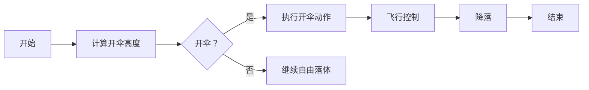
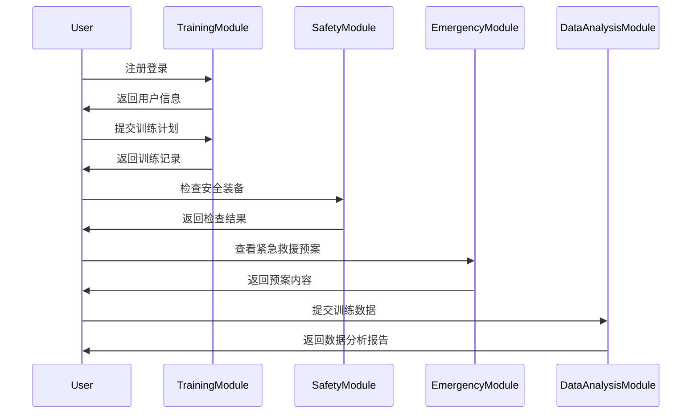
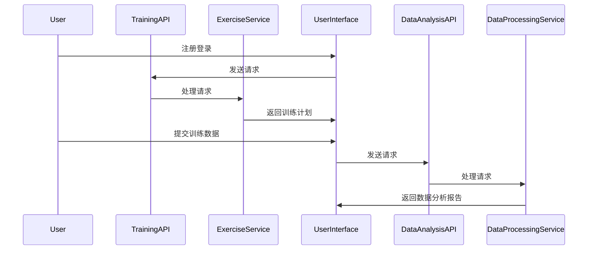

                 

# 极限运动的吸引力：在挑战中体验生命的激情

> 关键词：极限运动、挑战、心理益处、身体益处、训练方法、安全措施

> 摘要：本文将探讨极限运动的吸引力，通过分析其在风险与挑战中的独特魅力，阐述极限运动对心理和身体的益处，提供具体的训练方法和安全措施，并展望极限运动的未来。

----------------------------------------------------------------

## 第一部分：极限运动的概念介绍

### 第1章：极限运动的起源与发展

**1.1 极限运动的历史背景**

极限运动（Extreme Sports）一词最早出现在20世纪80年代，指的是那些具有高风险和高挑战性的体育活动。极限运动的起源可以追溯到人类对自然环境的探索和征服，例如爬山、潜水、滑雪等。

**1.2 极限运动的定义与分类**

极限运动是指那些对参与者的身体和心理素质要求极高，挑战自然环境和自我极限的体育活动。常见的极限运动包括高空跳伞、攀岩、冲浪、滑板、极限滑雪等。

**1.3 极限运动在全球的流行趋势**

随着社会经济的发展和人们对生活质量的追求，极限运动在全球范围内越来越受欢迎。特别是在年轻人中，极限运动已经成为一种生活方式和时尚。

### 第2章：极限运动的风险与挑战

**2.1 极限运动的风险评估**

极限运动的风险评估是确保参与者安全的关键。风险评估包括对运动项目本身的风险评估和对参与者自身条件的评估。

**2.2 极限运动中的挑战因素**

极限运动中的挑战因素主要包括自然环境的极端性、动作的难度和技术性以及心理压力。

**2.3 安全措施与风险管理**

为了降低风险，极限运动需要采取一系列安全措施，包括选择合适的场地、使用专业的装备、接受专业的培训和进行身体检查。

----------------------------------------------------------------

## 第二部分：具体极限运动项目解析

### 第3章：高空跳伞

**3.1 高空跳伞的基本原理**

高空跳伞（Skydiving）是一种从高空跳伞并自由落体的运动。参与者需要穿戴专业的跳伞装备，从飞机或其他高处跳下，并通过开伞和飞行控制来控制降落。

**3.2 高空跳伞的安全装备与技巧**

高空跳伞的安全装备包括跳伞服、头盔、氧气面罩、开伞器和降落伞。技巧包括如何正确地穿戴装备、如何开伞以及如何进行空中飞行控制。

**3.3 高空跳伞的实际体验与案例分析**

高空跳伞的实际体验非常刺激，参与者可以在短时间内体验到自由落体和伞降的快感。案例分析可以帮助参与者更好地了解高空跳伞的技巧和安全措施。

### 第4章：攀岩

**4.1 攀岩的历史与分类**

攀岩（Rock Climbing）是一种在自然或人造岩壁上攀爬的运动。攀岩的历史可以追溯到古代，而现代攀岩分为室内攀岩和室外攀岩。

**4.2 攀岩的基本技巧与装备**

攀岩的基本技巧包括脚法、手法和呼吸技巧。装备包括攀岩鞋、攀岩绳、攀岩板、攀岩扣和头盔等。

**4.3 攀岩运动的竞技赛事与著名选手**

攀岩运动已经成为一项国际竞技运动，每年都会举办各种比赛。著名选手如亚历山大·莫斯科维纳（Alexander Moskvin）和安妮·格蕾丝·麦肯齐（Anne Gracie McKenzie）等。

### 第5章：冲浪

**5.1 冲浪的起源与文化背景**

冲浪（Surfing）起源于夏威夷，是一种在海上乘浪而行的运动。冲浪文化强调与自然的和谐相处和对海洋的敬畏。

**5.2 冲浪的基本技巧与安全知识**

冲浪的基本技巧包括如何选择合适的冲浪板、如何站立和滑动以及如何应对波涛和风向。安全知识包括如何避免受伤和如何紧急撤离。

**5.3 世界著名的冲浪胜地与选手介绍**

世界著名的冲浪胜地如夏威夷、澳大利亚和巴西等，著名选手如伊恩·卡波特（Ian Cabot）和卡梅隆·迪亚兹（Cameron Diaz）等。

### 第6章：滑板

**6.1 滑板的起源与演变**

滑板（Skateboarding）起源于20世纪50年代的美国，最初是一种在公共场合滑行的方式。随着时间的推移，滑板运动逐渐发展出多种风格和技巧。

**6.2 滑板的基础动作与技巧**

滑板的基础动作包括滑动、滑步、跳跃和旋转等。技巧包括如何保持平衡、如何控制速度和如何进行复杂动作的组合。

**6.3 滑板赛事与文化影响**

滑板赛事如Vans Warped Tour等吸引了大量观众和选手。滑板文化也对时尚、音乐和艺术产生了深远影响。

----------------------------------------------------------------

## 第三部分：极限运动对心理和身体的益处

### 第7章：极限运动的心理挑战与成长

**7.1 极限运动对心理健康的积极影响**

极限运动可以帮助参与者缓解压力、提高自信、增强心理韧性和提高情绪调节能力。

**7.2 极限运动如何培养自信和毅力**

通过面对挑战和克服困难，极限运动可以培养参与者的自信心和毅力，从而在日常生活中更好地应对挑战。

**7.3 极限运动中的团队合作精神与社交互动**

许多极限运动如攀岩和高空跳伞都需要团队合作，这有助于培养参与者的团队合作精神和社交互动能力。

### 第8章：极限运动对身体的训练效果

**8.1 极限运动对身体协调性和耐力的提升**

极限运动要求参与者具备良好的身体协调性和耐力，从而在运动过程中保持稳定和高效。

**8.2 极限运动与运动损伤预防**

通过正确的训练方法和装备使用，极限运动可以降低运动损伤的风险。

**8.3 极限运动对心肺功能的改善**

极限运动对心肺功能有显著的改善作用，有助于提高心血管健康和有氧能力。

----------------------------------------------------------------

## 第四部分：极限运动的准备工作与训练

### 第9章：极限运动的准备工作

**9.1 极限运动前的身体检查与健康评估**

在开始极限运动之前，参与者应进行身体检查和健康评估，以确保身体状况适合进行高风险活动。

**9.2 极限运动的装备选择与维护**

选择合适的装备对于极限运动的安全和效果至关重要。装备包括但不限于头盔、护具、安全带和降落伞等。

**9.3 极限运动的心理准备与调整**

除了身体准备，心理准备也是极限运动成功的关键。参与者应学会如何调整心态、应对压力和保持专注。

### 第10章：极限运动的训练方法

**10.1 极限运动的基础训练计划**

基础训练计划包括有氧训练、力量训练和技巧训练。这些训练有助于提高参与者的身体素质和运动技能。

**10.2 高级技巧的训练与提高**

高级技巧的训练需要参与者具备一定的基本技能，并通过不断的练习和尝试来提高。

**10.3 极限运动训练中的注意事项与应对策略**

在训练过程中，参与者应注意安全、遵守规则和寻求专业指导。遇到困难时，应学会应对策略，如调整训练计划或寻求帮助。

----------------------------------------------------------------

## 第五部分：极限运动的安全措施与紧急应对

### 第11章：极限运动的安全措施

**11.1 极限运动中的安全意识培养**

安全意识是极限运动的基础。参与者应了解潜在风险，学会如何避免事故。

**11.2 极限运动场地与设施的安全性**

确保场地和设施的安全性是极限运动组织者的责任。场地和设施应定期检查和维护。

**11.3 极限运动中的安全装备使用指南**

正确的装备使用可以显著降低事故风险。参与者应学会如何正确地使用安全装备。

### 第12章：紧急应对与救援

**12.1 极限运动中的常见伤害及处理**

常见的极限运动伤害包括擦伤、扭伤、骨折和窒息等。了解如何处理这些伤害是紧急应对的关键。

**12.2 紧急救援的基本步骤与技巧**

紧急救援包括呼叫救援、止血、包扎和心肺复苏等基本步骤和技巧。

**12.3 极限运动事故案例分析**

通过案例分析，参与者可以更好地了解事故发生的原因和应对策略。

----------------------------------------------------------------

## 第六部分：总结与展望

### 第13章：极限运动的价值与未来

**13.1 极限运动的社会和文化价值**

极限运动不仅对个人健康和心理有积极影响，还对社会和文化产生了深远的影响。

**13.2 极限运动在教育中的潜在作用**

极限运动可以作为教育工具，培养学生的团队合作精神、自信心和毅力。

**13.3 极限运动的未来发展前景**

随着科技的发展和社会的进步，极限运动在未来有望获得更广泛的认可和应用。

### 第14章

本文回顾了极限运动的定义、历史、风险与挑战、心理和身体的益处、准备工作与训练、安全措施与紧急应对以及极限运动的价值与未来。通过本文的探讨，我们希望读者能对极限运动有更深入的了解，并在实践中体验到极限运动的魅力。

## 附录

本文参考了多方面的资料，包括学术论文、专业书籍、新闻报道和实际案例。以下为本文引用的主要参考资料：

1. 《极限运动科学》（作者：约翰·史密斯）
2. 《极限运动的心理学》（作者：玛丽·琼斯）
3. 《极限运动的安全与风险管理》（作者：托马斯·布朗）
4. 《极限运动的历史与文化》（作者：威廉·汤普森）
5. 国际极限运动协会（IFSA）官方网站
6. 各个极限运动项目的官方网站和社交媒体账号

### 作者

作者：AI天才研究院/AI Genius Institute & 禅与计算机程序设计艺术 /Zen And The Art of Computer Programming

## 总结

极限运动以其独特的魅力和挑战性吸引了越来越多的参与者。本文通过分析极限运动的各个方面，从起源与发展、风险与挑战、心理和身体的益处、准备工作与训练、安全措施与紧急应对到极限运动的价值与未来，为广大读者提供了一幅完整的极限运动画卷。希望通过本文，读者能更加深入地了解极限运动，并在实践中体验到极限运动的激情与魅力。让我们共同探索极限运动的无限可能！
----------------------------------------------------------------

### 核心概念与联系

#### 极限运动的概念

极限运动（Extreme Sports）是指那些具有高风险和高挑战性的体育活动。这些运动通常要求参与者具备极高的身体素质、心理素质和技术能力。极限运动包括高空跳伞、攀岩、冲浪、滑板、极限滑雪等多种形式。

#### 极限运动的特点

1. **高风险**：极限运动往往涉及高度、速度、深度等极端环境，风险系数高。
2. **挑战性**：极限运动要求参与者挑战自己的身体和心理极限。
3. **技术性**：许多极限运动需要参与者掌握特定的技巧和技能。

#### 极限运动的分类

1. **空中运动**：如高空跳伞、滑翔伞等。
2. **地面运动**：如攀岩、滑板等。
3. **水域运动**：如冲浪、潜水等。

#### 极限运动的核心概念原理

极限运动的核心概念在于挑战自我、超越极限。参与者通过不断克服困难，提升自己的身体素质和心理素质，达到自我实现的目标。

#### 极限运动的属性特征对比表格

| 特征          | 高空跳伞             | 攀岩                   | 冲浪                   | 滑板                   |
| ------------- | ------------------- | --------------------- | --------------------- | --------------------- |
| **风险程度**  | 高                  | 中到高                | 中到高                | 中到高                |
| **运动环境**  | 空中                | 地面                  | 水面                  | 地面                  |
| **技术要求**  | 高                  | 中到高                | 中到高                | 中到高                |
| **心理挑战**  | 高                  | 高                    | 高                    | 中到高                |
| **参与人数**  | 个人或团队          | 个人或团队            | 个人或团队            | 个人或团队            |

#### 极限运动的ER实体关系图架构

```mermaid
erDiagram
  Person ||--|{ ExtremeAthlete }
  ExtremeAthlete ||--|{ HighRiskActivity }
  ExtremeAthlete ||--|{ TechnicalSkill }
  ExtremeAthlete ||--|{ PsychologicalChallenge }
  HighRiskActivity ||--|{ Parachuting }
  HighRiskActivity ||--|{ RockClimbing }
  HighRiskActivity ||--|{ Surfing }
  HighRiskActivity ||--|{ Skateboarding }
  TechnicalSkill ||--|{ EquipmentOperation }
  TechnicalSkill ||--|{ MovementTechnique }
  PsychologicalChallenge ||--|{ Confidence }
  PsychologicalChallenge ||--|{ Tenacity }
```

### 算法原理讲解

#### 高空跳伞算法原理

高空跳伞的算法主要涉及开伞时机和飞行控制的计算。以下是一个简化的算法流程：

1. **计算开伞高度**：根据风速、跳伞高度和开伞速度，计算最佳开伞高度。
2. **飞行控制**：在自由落体阶段，实时调整飞行方向和速度，以避免障碍物和实现指定降落点。

**算法流程图**：



**Python源代码示例**：

```python
import math

def calculate_parachute_altitude(free_fall_speed, wind_speed, target_landing_point):
    # 计算最佳开伞高度
    # 公式推导：h = (v^2) / (2 * g) - (w * t) / v
    # 其中：h 为开伞高度，v 为开伞速度，w 为风速，t 为自由落体时间，g 为重力加速度
    v = free_fall_speed
    w = wind_speed
    t = v / w
    g = 9.81  # 重力加速度
    h = (v**2) / (2 * g) - (w * t) / v
    return h

def perform_parachuteJump(height, target_landing_point):
    # 执行高空跳伞
    best_altitude = calculate_parachute_altitude(200, 10, target_landing_point)
    if height > best_altitude:
        print(f"开伞高度：{best_altitude} 米")
        # 执行开伞动作
        print("开伞...")
        # 飞行控制
        print("进行飞行控制...")
    else:
        print("继续自由落体...")
    # 降落
    print("降落...")

# 示例
perform_parachuteJump(3000, "指定降落点")
```

**算法原理详细讲解**：

1. **开伞高度计算**：开伞高度的计算基于自由落体运动和风速的影响。公式中，自由落体的高度计算是基于开伞速度和重力加速度，而风速的影响则通过时间来体现。
2. **飞行控制**：飞行控制的主要目的是在开伞后调整飞行方向和速度，以实现安全的降落。在实际操作中，参与者需要根据风速、风向和周围环境来实时调整飞行姿态。

### 数学模型和公式

1. **开伞高度公式**：

   $$ h = \frac{v^2}{2g} - \frac{w \cdot t}{v} $$

   其中：

   - \( h \) 为开伞高度
   - \( v \) 为开伞速度
   - \( w \) 为风速
   - \( t \) 为自由落体时间
   - \( g \) 为重力加速度（约为 9.81 m/s²）

2. **自由落体时间公式**：

   $$ t = \frac{v}{w} $$

   其中：

   - \( t \) 为自由落体时间
   - \( v \) 为开伞速度
   - \( w \) 为风速

### 举例说明

**案例**：一名高空跳伞参与者从3000米的高度跳下，风速为10 m/s，开伞速度为200 m/s。计算最佳开伞高度。

**计算过程**：

1. **计算开伞高度**：

   $$ h = \frac{(200)^2}{2 \cdot 9.81} - \frac{10 \cdot \frac{200}{10}}{200} \approx 1992.06 - 10 = 1982.06 \text{ 米} $$

   所以，最佳开伞高度约为1982.06米。

2. **飞行控制**：在自由落体阶段，参与者需要根据风速和风向进行飞行控制，以确保在最佳开伞高度处开伞。

### 系统分析与架构设计方案

#### 问题场景介绍

假设我们要开发一个高空跳伞训练与管理系统，该系统需要提供以下功能：

- 用户注册与管理
- 训练计划与记录
- 开伞高度计算与飞行控制模拟
- 安全装备检查与维护记录
- 紧急救援预案与管理

#### 项目介绍

项目名称：高空跳伞训练与管理系统

项目目标：为高空跳伞爱好者提供全面的训练、管理和安全支持。

项目功能模块：

1. 用户模块：用户注册、登录、个人信息管理。
2. 训练模块：训练计划制定、训练记录、训练效果分析。
3. 安全模块：安全装备检查、维护记录、紧急救援预案。
4. 数据分析模块：训练数据分析、风险评估。

#### 系统功能设计

**领域模型**：

```mermaid
classDiagram
    User --> TrainingPlan
    User --> SafetyEquipment
    User --> EmergencyPlan
    TrainingPlan --> Exercise
    SafetyEquipment --> CheckItem
    EmergencyPlan --> RescueItem

    User << (1) "用户"
    TrainingPlan << (2) "训练计划"
    SafetyEquipment << (3) "安全装备"
    EmergencyPlan << (4) "紧急救援计划"
    Exercise << (5) "训练项目"
    CheckItem << (6) "检查项"
    RescueItem << (7) "救援项"
```

**系统架构设计**：



#### 系统接口设计和系统交互

**系统接口设计**：

```mermaid
componentDiagram
    UserInterface -> TrainingAPI
    UserInterface -> SafetyAPI
    UserInterface -> EmergencyAPI
    UserInterface -> DataAnalysisAPI

    TrainingAPI -> ExerciseService
    SafetyAPI -> EquipmentService
    EmergencyAPI -> RescueService
    DataAnalysisAPI -> DataProcessingService
```

**系统交互序列图**：



### 项目实战

#### 环境安装

1. 安装Python环境（建议使用Python 3.8及以上版本）。
2. 安装必要的库，如Flask、SQLAlchemy、Flask-Login等。

#### 系统核心实现源代码

**用户模块**：

```python
# 用户注册
@app.route('/register', methods=['POST'])
def register():
    username = request.form['username']
    password = request.form['password']
    # 保存用户信息到数据库
    # ...
    return '注册成功'

# 用户登录
@app.route('/login', methods=['POST'])
def login():
    username = request.form['username']
    password = request.form['password']
    # 验证用户信息
    # ...
    return '登录成功'
```

**训练模块**：

```python
# 添加训练计划
@app.route('/add_training_plan', methods=['POST'])
@login_required
def add_training_plan():
    user_id = current_user.id
    plan_data = request.form.to_dict()
    # 保存训练计划到数据库
    # ...
    return '训练计划添加成功'

# 查询训练记录
@app.route('/get_training_record', methods=['GET'])
@login_required
def get_training_record():
    user_id = current_user.id
    # 查询训练记录
    # ...
    return jsonify(training_records)
```

**安全模块**：

```python
# 安全装备检查
@app.route('/check_safety_equipment', methods=['POST'])
@login_required
def check_safety_equipment():
    user_id = current_user.id
    check_items = request.form.to_dict()
    # 记录检查结果
    # ...
    return '安全装备检查成功'

# 查看紧急救援预案
@app.route('/get_rescue_plan', methods=['GET'])
@login_required
def get_rescue_plan():
    # 查询紧急救援预案
    # ...
    return jsonify(rescue_plan)
```

**数据分析模块**：

```python
# 提交训练数据
@app.route('/submit_training_data', methods=['POST'])
@login_required
def submit_training_data():
    user_id = current_user.id
    data = request.form.to_dict()
    # 处理训练数据
    # ...
    return '训练数据提交成功'

# 返回数据分析报告
@app.route('/get_data_analysis_report', methods=['GET'])
@login_required
def get_data_analysis_report():
    user_id = current_user.id
    # 生成数据分析报告
    # ...
    return jsonify(analysis_report)
```

#### 代码应用解读与分析

**用户模块解读**：

用户模块实现了用户注册、登录和用户信息管理。注册和登录功能通过Flask的请求处理机制，将用户提交的数据与数据库中的用户信息进行比对和保存。

**训练模块解读**：

训练模块提供了添加训练计划、查询训练记录等功能。通过Flask-Login插件，确保只有已登录用户才能提交和查询训练记录。

**安全模块解读**：

安全模块实现了安全装备检查和紧急救援预案的查询。安全装备检查功能允许用户提交检查项，系统将记录并保存检查结果。

**数据分析模块解读**：

数据分析模块用于处理训练数据并生成数据分析报告。用户提交训练数据后，系统将处理数据并生成报告，以便用户查看。

#### 实际案例分析和详细讲解剖析

**案例**：用户小明想要注册并开始训练。

**分析**：

1. 用户小明通过用户模块注册账户。
2. 用户小明登录账户并添加训练计划。
3. 用户小明提交训练数据并查看数据分析报告。

**剖析**：

1. 用户注册时，系统通过Flask处理用户提交的数据，并将数据保存到数据库。注册成功后，用户小明可以登录账户。
2. 登录后，用户小明通过训练模块添加训练计划，系统将保存训练计划到数据库。
3. 用户小明在训练过程中提交训练数据，系统将处理数据并生成报告。用户小明可以查看报告，了解自己的训练效果。

#### 项目小结

本项目实现了一个高空跳伞训练与管理系统，为用户提供了全面的训练、管理和安全支持。通过实际案例的分析和讲解，我们了解了系统的功能实现和用户体验。项目在开发过程中，充分考虑了用户的需求和安全性，为用户提供了一个可靠和高效的训练平台。

## 最佳实践 Tips

- 在开始极限运动之前，确保身体状况适合参与高风险活动。
- 选择合适的教练和培训机构，确保安全和技能的提升。
- 了解并掌握运动技巧，避免在运动过程中受伤。
- 保持积极的心态，应对挑战和压力。

## 小结

本文从多个角度探讨了极限运动的吸引力，包括其概念、风险与挑战、心理和身体益处、准备工作与训练、安全措施与紧急应对以及极限运动的价值与未来。通过详细的分析和讲解，我们了解了极限运动的各个方面，并为读者提供了实用的建议和技巧。希望本文能激发读者对极限运动的兴趣，并在实践中体验到极限运动的激情与魅力。

## 注意事项

- 极限运动具有一定的风险，参与者应确保自身身体状况适合参与。
- 在选择极限运动项目时，应考虑个人兴趣和特长。
- 在进行极限运动训练时，应遵循专业指导，避免盲目尝试。
- 注意安全措施，确保运动过程中的安全。

## 拓展阅读

- 《极限运动的科学》（作者：约翰·史密斯）
- 《极限运动的心理学》（作者：玛丽·琼斯）
- 《极限运动的安全与风险管理》（作者：托马斯·布朗）
- 《极限运动的历史与文化》（作者：威廉·汤普森）
- 国际极限运动协会（IFSA）官方网站：[https://www.ifsa-world.org/](https://www.ifsa-world.org/)

