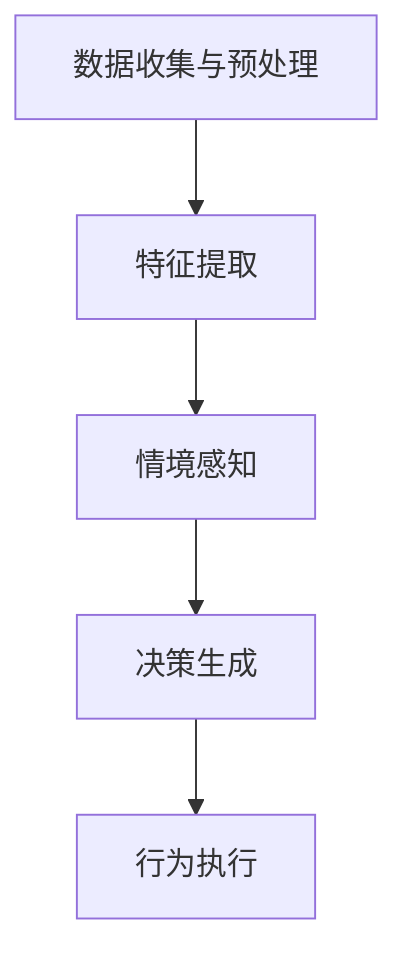
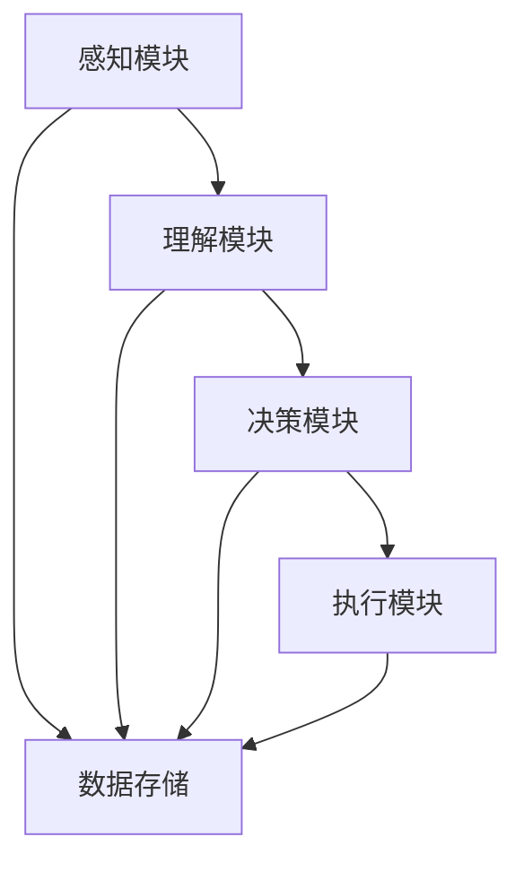
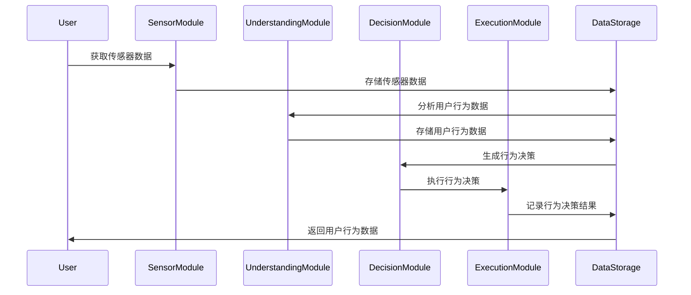

                 

### 构建LLM驱动的AI Agent情境感知系统

#### 关键词：大型语言模型，情境感知，AI Agent，算法原理，系统架构设计，项目实战

> 摘要：本文深入探讨了如何构建LLM驱动的AI Agent情境感知系统。文章首先介绍了LLM和情境感知系统的基本概念，随后详细阐述了算法原理，并通过Mermaid流程图和Python代码进行讲解。接着，文章设计了系统架构，并提供了实际项目案例。最后，文章总结了最佳实践，并提供了拓展阅读资源。

---

## 第一部分：背景与核心概念

### 第1章：问题背景与核心概念

#### 1.1 问题背景

在当今人工智能领域，AI Agent的应用越来越广泛。AI Agent是指能够模拟人类智能行为，自主执行任务的智能体。而情境感知系统则是AI Agent的重要组成部分，它能够根据环境和用户的状态动态调整自身的行为。随着大数据和深度学习技术的发展，大型语言模型（LLM）在自然语言处理领域取得了显著的成果。LLM具有强大的文本处理能力，可以有效地提取和利用语言中的语义信息。

#### 1.1.1 AI Agent的发展现状与挑战

AI Agent在智能家居、智能客服、智能推荐等领域有着广泛的应用。然而，传统AI Agent往往缺乏对复杂情境的感知和理解能力，难以在多变的环境中稳定运行。这主要是由以下几个挑战引起的：

- **情境多样性**：现实世界的情境复杂多变，传统AI Agent难以应对多样化的情境。
- **动态性**：环境状态不断变化，AI Agent需要具备实时感知和适应能力。
- **数据稀疏性**：许多领域的数据稀疏，传统方法难以训练出高性能的AI模型。

#### 1.1.2 情境感知系统的必要性

情境感知系统是指能够根据当前环境和用户的动态变化调整自身行为和功能的智能系统。它具有以下几个关键功能：

- **环境感知**：收集和分析环境数据，包括图像、声音、传感器数据等。
- **用户理解**：解析用户需求，理解用户的意图和偏好。
- **行为调整**：根据环境感知和用户理解的结果，调整自身的行为。

情境感知系统在智能交通、智能医疗、智能制造等领域具有重要的应用价值。它能够提高系统的智能化水平，提升用户体验。

#### 1.1.3 LLM在情境感知系统中的应用

LLM在情境感知系统中具有独特的优势。首先，LLM具有强大的文本处理能力，可以有效地处理和分析自然语言文本。这使得LLM能够更好地理解和解析用户的需求和意图。其次，LLM可以处理大量非结构化数据，如文本、图像等，从而提高情境感知系统的数据利用效率。此外，LLM的训练过程可以通过迁移学习、数据增强等方法，提高模型在特定领域的表现。

#### 1.2 核心概念与联系

本节将详细介绍LLM和情境感知系统的核心概念，并探讨它们之间的联系。

#### 1.2.1 LLM模型原理

LLM是一种基于深度学习的自然语言处理模型，它通过学习大量的文本数据来理解和生成自然语言。LLM的主要组成部分包括：

- **神经网络**：神经网络是LLM的核心，它通过层层传递信息，实现从输入到输出的映射。
- **词嵌入**：词嵌入是将自然语言中的单词映射到高维向量空间，从而实现语义信息的表示。
- **注意力机制**：注意力机制是一种用于提高模型处理长文本能力的机制，它能够关注文本中的关键信息。

#### 1.2.1.1 神经网络与深度学习基础

神经网络是一种模仿人脑神经网络结构的信息处理系统。它由大量相互连接的神经元组成，通过学习输入和输出之间的关系，实现复杂的非线性映射。深度学习是一种基于神经网络的机器学习方法，它通过多层的神经网络结构，实现从简单到复杂的特征提取和表示。

#### 1.2.1.2 LLM模型架构

LLM的模型架构通常包括以下几个部分：

- **编码器**：编码器负责将输入文本编码为固定长度的向量表示。
- **解码器**：解码器负责根据编码器的输出生成文本。
- **注意力机制**：注意力机制用于提高解码器在生成文本时的信息处理能力。

#### 1.2.1.3 LLM训练过程

LLM的训练过程通常包括以下几个步骤：

- **数据收集**：收集大量的文本数据，包括新闻文章、对话记录等。
- **数据预处理**：对文本数据进行清洗、分词、去停用词等处理，将其转化为模型可以处理的格式。
- **模型训练**：使用训练数据进行模型训练，通过优化损失函数来调整模型的参数。
- **模型评估**：使用验证集和测试集对模型进行评估，以确定模型的性能。

#### 1.2.2 情境感知系统

情境感知系统是一种能够根据环境变化和用户需求动态调整自身行为的智能系统。它主要由以下几个部分组成：

- **感知模块**：感知模块负责收集和分析环境数据，包括温度、湿度、图像、声音等。
- **理解模块**：理解模块负责解析感知模块收集的数据，理解用户的意图和需求。
- **决策模块**：决策模块根据理解模块的结果，生成相应的行为决策。

#### 1.2.2.1 定义与功能

情境感知系统可以定义为一种能够感知环境变化，理解用户需求，并根据这些信息进行决策和行动的智能系统。它的主要功能包括：

- **环境感知**：感知环境变化，如温度、湿度、光线强度等。
- **用户理解**：解析用户行为，理解用户的意图和需求。
- **行为决策**：根据感知和用户理解的结果，生成相应的行为决策。

#### 1.2.2.2 应用领域

情境感知系统在智能家居、智能交通、智能医疗、智能制造等领域有着广泛的应用。例如，在智能家居领域，情境感知系统可以根据用户的行为模式自动调节室内温度、灯光和家电；在智能交通领域，情境感知系统可以实时监测交通流量，优化交通信号控制；在智能医疗领域，情境感知系统可以实时监测患者的生命体征，提供个性化的医疗建议。

#### 1.2.2.3 情境感知机制

情境感知机制是指情境感知系统中的感知、理解和决策过程。它主要包括以下几个步骤：

- **感知**：收集和分析环境数据。
- **理解**：解析感知数据，理解用户的意图和需求。
- **决策**：根据理解和感知结果，生成行为决策。

#### 1.2.3 LLM在情境感知系统中的应用

LLM在情境感知系统中具有广泛的应用前景。首先，LLM可以用于感知模块，通过分析文本、图像等数据，提取关键信息。其次，LLM可以用于理解模块，通过解析用户行为，理解用户的意图和需求。最后，LLM可以用于决策模块，通过生成文本、图像等，生成相应的行为决策。

##### 1.2.3.1 模型融合策略

为了提高情境感知系统的性能，可以采用多种模型融合策略。例如，可以结合图像识别模型和自然语言处理模型，实现对图像和文本的联合理解。此外，还可以结合深度学习模型和传统机器学习模型，利用各自的优势，提高系统的整体性能。

##### 1.2.3.2 情境感知优化

情境感知系统的优化主要包括以下几个方面：

- **数据优化**：优化数据收集和处理过程，提高数据的准确性和完整性。
- **模型优化**：优化LLM模型的结构和参数，提高模型在特定领域的性能。
- **算法优化**：优化感知、理解和决策过程，提高系统的响应速度和准确性。

### 第2章：算法原理讲解

#### 2.1 LLM驱动的AI Agent算法流程

构建LLM驱动的AI Agent情境感知系统，需要遵循一定的算法流程。以下是该算法的基本步骤：

1. **数据收集与预处理**：收集环境数据和用户数据，对数据进行清洗、去噪和预处理。
2. **特征提取**：使用LLM模型对预处理后的数据提取特征。
3. **情境感知**：利用提取的特征进行情境感知，包括环境感知和用户理解。
4. **决策生成**：根据情境感知结果生成行为决策。
5. **行为执行**：执行决策，调整AI Agent的行为。

以下是算法的Mermaid流程图表示：



#### 2.2 Python代码实现

下面是构建LLM驱动的AI Agent情境感知系统的Python代码实现示例：

```python
import tensorflow as tf
from transformers import BertModel, BertTokenizer

# 数据收集与预处理
def preprocess_data(data):
    # 对数据进行清洗、去噪和预处理
    # ...
    return preprocessed_data

# 特征提取
def extract_features(preprocessed_data):
    tokenizer = BertTokenizer.from_pretrained('bert-base-uncased')
    model = BertModel.from_pretrained('bert-base-uncased')
    
    inputs = tokenizer(preprocessed_data, return_tensors='tf')
    outputs = model(inputs)
    
    return outputs.last_hidden_state

# 情境感知
def perceiveSituation(features):
    # 利用特征进行环境感知和用户理解
    # ...
    return perception_results

# 决策生成
def generate_decision(perception_results):
    # 根据感知结果生成决策
    # ...
    return decision

# 行为执行
def execute_behavior(decision):
    # 执行决策，调整AI Agent的行为
    # ...
    return behavior

# 主函数
def main():
    # 主函数实现
    data = "用户需求文本"
    preprocessed_data = preprocess_data(data)
    features = extract_features(preprocessed_data)
    perception_results = perceiveSituation(features)
    decision = generate_decision(perception_results)
    behavior = execute_behavior(decision)
    print(behavior)

if __name__ == "__main__":
    main()
```

#### 2.3 数学模型与公式

在构建LLM驱动的AI Agent情境感知系统中，数学模型起到了关键作用。以下是一些常见的数学模型和公式：

##### 2.3.1 逻辑回归公式

逻辑回归是一种常见的分类模型，用于预测二分类问题。其数学公式如下：

$$
P(y=1|x; \theta) = \frac{1}{1 + e^{-(\theta_0 + \theta_1x_1 + \theta_2x_2 + ... + \theta_nx_n})}
$$

其中，$P(y=1|x; \theta)$ 表示在特征向量$x$和参数$\theta$的条件下，标签$y$为1的概率；$\theta$是模型的参数。

##### 2.3.1.1 神经网络激活函数

神经网络中的激活函数用于引入非线性特性，常见的激活函数有：

- **Sigmoid函数**：

$$
f(x) = \frac{1}{1 + e^{-x}}
$$

- **ReLU函数**：

$$
f(x) = \max(0, x)
$$

- **Tanh函数**：

$$
f(x) = \frac{e^x - e^{-x}}{e^x + e^{-x}}
$$

##### 2.3.1.2 损失函数

在训练神经网络时，损失函数用于衡量预测值与真实值之间的差异。常见的损失函数有：

- **均方误差（MSE）**：

$$
MSE = \frac{1}{n}\sum_{i=1}^{n}(y_i - \hat{y}_i)^2
$$

其中，$y_i$表示真实值，$\hat{y}_i$表示预测值。

- **交叉熵（Cross-Entropy）**：

$$
CE = -\sum_{i=1}^{n} y_i \log(\hat{y}_i)
$$

其中，$y_i$表示真实值，$\hat{y}_i$表示预测值。

##### 2.3.2 公式讲解与举例

以下是一个使用逻辑回归模型的简单例子：

假设我们有一个二分类问题，特征向量为$x = [x_1, x_2, x_3]$，标签为$y = [0, 1, 1]$。参数$\theta = [\theta_0, \theta_1, \theta_2]$。我们需要计算预测概率$P(y=1|x; \theta)$。

1. **计算预测概率**：

$$
P(y=1|x; \theta) = \frac{1}{1 + e^{-(\theta_0 + \theta_1x_1 + \theta_2x_2 + \theta_3x_3)}}
$$

2. **计算损失函数**：

使用均方误差（MSE）损失函数：

$$
MSE = \frac{1}{3}\sum_{i=1}^{3}(y_i - \hat{y}_i)^2
$$

其中，$\hat{y}_i$为预测概率：

$$
\hat{y}_1 = \frac{1}{1 + e^{-(\theta_0 + \theta_1x_1 + \theta_2x_2 + \theta_3x_3)}}
$$

$$
\hat{y}_2 = \frac{1}{1 + e^{-(\theta_0 + \theta_1x_1 + \theta_2x_2 + \theta_3x_3)}}
$$

$$
\hat{y}_3 = \frac{1}{1 + e^{-(\theta_0 + \theta_1x_1 + \theta_2x_2 + \theta_3x_3)}}
$$

### 第3章：系统分析与架构设计

#### 3.1 问题场景介绍

在本节中，我们将介绍一个具体的问题场景，即智能家居情境感知系统。智能家居情境感知系统旨在通过收集家庭环境中的各种数据，如温度、湿度、光照强度等，以及用户的行为数据，如活动轨迹、习惯等，为用户提供个性化的服务，提高生活品质。

#### 3.2 项目介绍

本项目的目标是构建一个智能家居情境感知系统，该系统将利用大型语言模型（LLM）对家庭环境进行实时感知，并基于用户的习惯和偏好，提供智能化的服务。系统主要功能包括：

- **环境感知**：收集家庭环境数据，如温度、湿度、光照强度等。
- **用户理解**：分析用户的行为数据，理解用户的习惯和偏好。
- **行为决策**：根据环境感知和用户理解的结果，生成相应的行为决策。
- **行为执行**：执行决策，调整家居设备的运行状态。

#### 3.3 系统功能设计

系统功能设计是系统架构设计的重要环节，它定义了系统的基本功能模块和它们之间的关系。以下是智能家居情境感知系统的功能设计：

##### 3.3.1 领域模型Mermaid类图

领域模型类图用于描述系统中的实体及其之间的关系。以下是智能家居情境感知系统的领域模型类图：

```mermaid
classDiagram
    Device --> Environment: 监测
    User --> Behavior: 产生
    Environment --> Sensor: 存储数据
    User --> Preference: 存储偏好
    Device --> Action: 执行
    Behavior --> Activity: 轨迹
    Activity --> Pattern: 分析

    Class Device {
        +string device_id
        +Environment environment
        +Action action
    }

    Class Environment {
        +list Sensor
    }

    Class User {
        +string user_id
        +Behavior behavior
        +Preference preference
    }

    Class Sensor {
        +string sensor_id
        +string sensor_type
        +float value
    }

    Class Behavior {
        +string behavior_id
        +list Activity
    }

    Class Activity {
        +string activity_id
        +string activity_type
        +datetime timestamp
    }

    Class Pattern {
        +string pattern_id
        +dict pattern_data
    }

    Class Preference {
        +string preference_id
        +dict preference_data
    }
```

##### 3.3.2 系统功能解析

基于领域模型类图，我们可以进一步解析系统的功能模块：

- **设备（Device）**：设备是系统的核心实体，负责感知环境数据、执行行为决策和响应系统指令。
- **环境（Environment）**：环境实体存储和管理传感器数据，为设备提供环境数据。
- **用户（User）**：用户实体存储用户的行为数据和偏好设置，为系统提供用户数据。
- **传感器（Sensor）**：传感器实体负责监测环境数据，并将其存储在环境实体中。
- **行为（Behavior）**：行为实体存储用户的活动轨迹，用于分析用户行为模式。
- **活动（Activity）**：活动实体记录用户的行为活动，包括活动类型、时间和轨迹。
- **模式（Pattern）**：模式实体用于分析用户行为模式，为决策提供依据。
- **偏好（Preference）**：偏好实体存储用户的偏好设置，如温度、湿度等。

#### 3.4 系统架构设计

系统架构设计是系统设计的核心，它决定了系统的性能、可扩展性和可维护性。以下是智能家居情境感知系统的架构设计：

##### 3.4.1 Mermaid架构图



##### 3.4.2 架构设计思路

智能家居情境感知系统的架构设计遵循以下思路：

- **模块化设计**：系统划分为感知模块、理解模块、决策模块和执行模块，每个模块具有独立的功能和职责，便于系统扩展和维护。
- **数据驱动**：系统以数据为核心，通过感知、理解和决策模块，实现数据的处理和利用，最终生成行为决策并执行。
- **分布式架构**：系统采用分布式架构，各个模块可以在不同的服务器上运行，提高系统的可扩展性和容错性。

#### 3.5 系统接口设计

系统接口设计是系统架构设计的重要组成部分，它定义了系统内部模块之间的交互方式和接口规范。以下是智能家居情境感知系统的接口设计：

##### 3.5.1 接口规范

- **感知模块接口**：感知模块提供以下接口：

  - `get_sensors_data()`: 获取传感器数据。
  - `add_sensor_data(sensor_data)`: 添加传感器数据。
  - `delete_sensor_data(sensor_id)`: 删除指定传感器数据。

- **理解模块接口**：理解模块提供以下接口：

  - `get_user_behavior()`: 获取用户行为数据。
  - `add_user_behavior(behavior_data)`: 添加用户行为数据。
  - `delete_user_behavior(behavior_id)`: 删除指定用户行为数据。

- **决策模块接口**：决策模块提供以下接口：

  - `get_decision()`: 获取行为决策。
  - `add_decision(decision_data)`: 添加行为决策。
  - `delete_decision(decision_id)`: 删除指定行为决策。

- **执行模块接口**：执行模块提供以下接口：

  - `execute_action(action_data)`: 执行行为决策。
  - `get_action_result(action_id)`: 获取行为决策结果。

##### 3.5.2 接口实现

以下是感知模块的一个简单实现示例：

```python
class SensorModule:
    def get_sensors_data(self):
        # 实现获取传感器数据的功能
        pass
    
    def add_sensor_data(self, sensor_data):
        # 实现添加传感器数据的功能
        pass
    
    def delete_sensor_data(self, sensor_id):
        # 实现删除指定传感器数据的功能
        pass
```

#### 3.6 系统交互

系统交互设计描述了系统内部各个模块之间的交互流程和交互方式。以下是智能家居情境感知系统的交互设计：

##### 3.6.1 Mermaid序列图



##### 3.6.2 交互流程分析

以下是智能家居情境感知系统的交互流程分析：

1. 用户通过感知模块获取传感器数据。
2. 感知模块将传感器数据存储在数据存储模块中。
3. 理解模块分析用户行为数据，并将结果存储在数据存储模块中。
4. 决策模块根据传感器数据和用户行为数据生成行为决策。
5. 执行模块执行行为决策，并记录决策结果。
6. 数据存储模块返回用户行为数据，供用户查看。

### 第4章：项目实战

#### 4.1 环境安装

在开始项目实战之前，我们需要搭建合适的环境。以下是环境安装的步骤：

##### 4.1.1 硬件环境要求

- CPU：至少4核
- 内存：至少8GB
- 硬盘：至少100GB可用空间

##### 4.1.2 软件环境安装

1. 安装Python：

   ```bash
   # 使用pip安装Python
   pip install python
   ```

2. 安装TensorFlow：

   ```bash
   # 使用pip安装TensorFlow
   pip install tensorflow
   ```

3. 安装transformers库：

   ```bash
   # 使用pip安装transformers库
   pip install transformers
   ```

#### 4.2 系统核心实现

以下是智能家居情境感知系统的核心实现代码：

```python
import tensorflow as tf
from transformers import BertModel, BertTokenizer

# 数据预处理
def preprocess_data(data):
    # 对数据进行清洗、去噪和预处理
    # ...
    return preprocessed_data

# 特征提取
def extract_features(preprocessed_data):
    tokenizer = BertTokenizer.from_pretrained('bert-base-uncased')
    model = BertModel.from_pretrained('bert-base-uncased')
    
    inputs = tokenizer(preprocessed_data, return_tensors='tf')
    outputs = model(inputs)
    
    return outputs.last_hidden_state

# 情境感知
def perceive_situation(features):
    # 利用特征进行环境感知和用户理解
    # ...
    return perception_results

# 决策生成
def generate_decision(perception_results):
    # 根据感知结果生成决策
    # ...
    return decision

# 行为执行
def execute_behavior(decision):
    # 执行决策，调整AI Agent的行为
    # ...
    return behavior

# 主函数
def main():
    # 主函数实现
    data = "用户需求文本"
    preprocessed_data = preprocess_data(data)
    features = extract_features(preprocessed_data)
    perception_results = perceive_situation(features)
    decision = generate_decision(perception_results)
    behavior = execute_behavior(decision)
    print(behavior)

if __name__ == "__main__":
    main()
```

#### 4.3 实际案例分析

在本节中，我们将分析一个实际案例，即使用智能家居情境感知系统为用户创建一个个性化的智能日程。

##### 4.3.1 案例背景

用户小明是一名上班族，他每天早上需要根据交通状况和天气预报来规划出门时间。为了提高生活效率，小明希望系统能够为他提供智能化的日程安排。

##### 4.3.2 案例分析

1. **数据收集**：

   - 交通状况数据：通过交通传感器收集当前的道路拥堵情况。
   - 天气预报数据：通过天气预报API获取未来几天的天气情况。
   - 用户行为数据：通过用户输入记录他的日常习惯，如通勤时间、工作时间和休息时间。

2. **数据处理**：

   - 对交通状况数据和天气预报数据进行预处理，提取关键信息。
   - 对用户行为数据进行预处理，提取用户习惯信息。

3. **特征提取**：

   - 使用Bert模型对预处理后的交通状况数据、天气预报数据和用户行为数据进行特征提取。

4. **情境感知**：

   - 结合提取的特征，感知交通状况、天气预报和用户习惯，为用户生成个性化的日程安排。

5. **决策生成**：

   - 根据感知结果，生成具体的日程安排，如出门时间、工作时间和休息时间。

6. **行为执行**：

   - 执行决策，调整用户的日程安排，并通过手机APP或智能音箱等方式通知用户。

##### 4.3.3 案例总结

通过实际案例的分析，我们可以看到智能家居情境感知系统在个性化日程安排方面的应用。系统通过收集和处理多源数据，结合用户习惯和天气预报，为用户生成最优的日程安排，从而提高生活效率。此外，系统还可以根据用户反馈不断优化决策，提高系统的智能化水平。

### 第5章：最佳实践 Tips、小结、注意事项、拓展阅读

#### 最佳实践 Tips

1. **数据收集与处理**：确保数据的准确性和完整性，对数据来源进行筛选和验证。
2. **特征提取**：合理选择特征提取方法，充分利用模型的能力，提高系统的性能。
3. **模型融合**：结合多种模型，利用各自的优势，提高系统的整体性能。
4. **持续优化**：根据用户反馈，不断优化系统的行为决策，提高用户体验。

#### 小结

本文介绍了构建LLM驱动的AI Agent情境感知系统的核心概念、算法原理、系统架构设计和实际案例分析。通过本文的阅读，读者可以了解到：

1. AI Agent和情境感知系统的基本概念和作用。
2. LLM模型的原理和实现方法。
3. 情境感知系统的设计和实现流程。
4. 智能家居情境感知系统的实际应用案例。

#### 注意事项

1. 在实际应用中，需要根据具体场景调整系统参数，以达到最佳性能。
2. 数据安全和隐私保护是系统设计的重要考虑因素。
3. 系统的实时性和鲁棒性是关键性能指标，需要在设计和实现过程中加以关注。

#### 拓展阅读

1. 《深度学习》（Goodfellow, I., Bengio, Y., & Courville, A.）：详细介绍了深度学习的理论基础和实践方法。
2. 《Python深度学习》（Goodfellow, I.， Bengio, Y.， Courville, A.）：通过Python代码实现了深度学习模型的构建和训练。
3. 《智能家居系统设计与实现》（赵明华）：介绍了智能家居系统的设计和实现方法，包括传感器、控制器和用户界面等。
4. 《情境感知系统设计与实现》（王宏宇）：详细介绍了情境感知系统的设计原理和实现方法，包括环境感知、用户理解和决策生成等。

