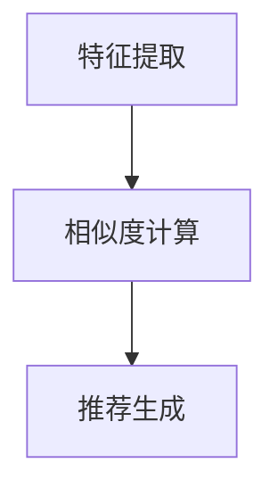
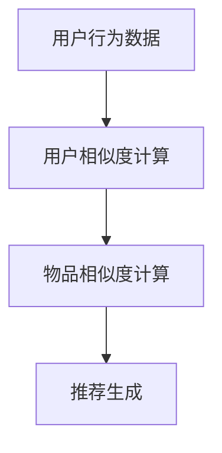
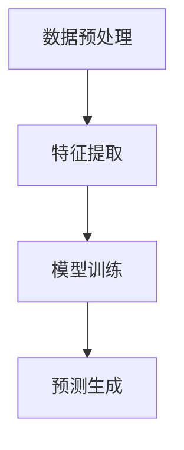

                 

## 文章标题

### 关键词

- 个性化推荐
- AI Agent
- 算法
- 架构设计
- 系统实现

### 摘要

本文深入探讨了如何构建一个高效的个性化推荐AI Agent。从背景介绍到核心概念与联系的阐述，再到算法原理讲解和系统分析与架构设计方案，本文系统地解析了个性化推荐系统的实现细节。通过一个实际的推荐系统项目实战，读者将能够全面了解个性化推荐AI Agent的构建过程。最后，本文总结了最佳实践，提醒读者注意事项，并提供拓展阅读资源，助力读者进一步深入研究。

## 背景介绍

在当今信息爆炸的时代，用户面临着海量信息的挑战，而推荐系统成为了解决这一问题的关键。个性化推荐系统通过分析用户的历史行为和兴趣，为其提供定制化的内容推荐，从而提高用户满意度和参与度。随着人工智能技术的不断进步，特别是深度学习和大数据分析的应用，个性化推荐系统已经从传统的基于内容的推荐（Content-Based Filtering）和协同过滤（Collaborative Filtering）演变为了更为智能和多样化的形式。

### 个性化推荐系统的现状

目前，个性化推荐系统在电商、新闻、社交媒体等多个领域得到了广泛应用。例如，电商平台通过个性化推荐帮助用户发现潜在的兴趣商品，提高购买转化率；新闻平台根据用户的阅读习惯推荐个性化新闻，增加用户粘性；社交媒体通过个性化推荐好友和内容，增强用户互动和社区氛围。

尽管个性化推荐系统已经取得了一定的成果，但仍然面临许多挑战。首先，数据隐私和安全问题是用户关注的焦点，如何在不侵犯用户隐私的前提下进行个性化推荐成为了一个亟待解决的问题。其次，推荐系统的可解释性也是一个重要挑战，用户往往希望了解推荐结果背后的原因，以便做出更明智的决策。此外，如何平衡推荐系统的多样性和新颖性，避免用户陷入“信息茧房”，也是推荐系统设计和优化中的重要问题。

### 个性化推荐系统的需求与应用场景

随着技术的不断发展，个性化推荐系统的需求也在不断增长。以下是几个典型的应用场景：

1. **电商推荐**：电商平台通过个性化推荐帮助用户发现潜在的购买兴趣，提高购物体验和转化率。例如，亚马逊和淘宝等平台广泛采用个性化推荐技术。

2. **新闻推送**：新闻平台通过个性化推荐推送用户可能感兴趣的新闻，增加用户阅读时间和平台粘性。例如，今日头条和谷歌新闻等。

3. **社交媒体**：社交媒体平台通过个性化推荐好友和内容，增强用户互动和社区氛围。例如，Facebook和微信等。

4. **音乐和视频推荐**：音乐和视频平台通过个性化推荐用户可能喜欢的音乐和视频，提高用户停留时间和付费转化率。例如，Spotify和Netflix等。

5. **医疗健康推荐**：基于用户健康数据和偏好，个性化推荐系统可以为用户提供个性化的健康建议和医疗服务。例如，智能健康监测设备和在线医疗平台。

总的来说，个性化推荐系统在满足用户需求、提高用户体验和业务收益方面具有重要作用。随着人工智能技术的不断进步，个性化推荐系统将变得更加智能和多样化，为各个行业带来更多的创新和机遇。

## 核心概念与联系

### 个性化推荐算法

个性化推荐算法是构建个性化推荐系统的核心组成部分，其目的是根据用户的历史行为和偏好，为用户推荐他们可能感兴趣的内容。以下是几种常见的个性化推荐算法：

1. **基于内容的推荐**（Content-Based Filtering）
   - **原理**：基于用户过去喜欢的内容，提取内容特征，并寻找具有相似特征的内容进行推荐。
   - **优点**：不需要用户行为数据，能够推荐与用户兴趣相关的内容。
   - **缺点**：推荐结果的多样性较差，容易陷入“信息茧房”。

2. **协同过滤**（Collaborative Filtering）
   - **原理**：通过收集用户之间的行为数据，发现相似用户，并基于相似用户的行为推荐内容。
   - **优点**：能够发现用户之间隐藏的关联，推荐结果更加个性化。
   - **缺点**：对稀疏数据集效果较差，用户行为数据依赖性强。

3. **基于模型的推荐**（Model-Based Recommender Systems）
   - **原理**：使用机器学习模型，如矩阵分解、聚类和深度学习等，预测用户对物品的偏好。
   - **优点**：能够处理稀疏数据集，推荐结果更精准。
   - **缺点**：需要大量的数据和计算资源。

### 推荐系统架构

个性化推荐系统的架构设计对于系统的性能、可扩展性和可维护性至关重要。以下是推荐系统架构的几个关键组成部分：

1. **数据层**
   - **功能**：存储用户行为数据、物品特征数据和其他相关数据。
   - **设计要点**：数据量庞大，需要高效的存储和查询机制。

2. **模型层**
   - **功能**：负责推荐算法的执行，生成推荐结果。
   - **设计要点**：需要根据不同算法的特点，选择合适的计算模型和优化策略。

3. **服务层**
   - **功能**：提供推荐服务的接口，响应用户请求，返回推荐结果。
   - **设计要点**：需要支持高并发、高可用的服务，保障用户体验。

4. **展示层**
   - **功能**：将推荐结果展示给用户，提供良好的用户交互体验。
   - **设计要点**：需要支持多种展示形式，如列表、卡片、轮播等，满足不同场景的需求。

### 概念之间的关系

为了更好地理解个性化推荐系统的概念之间的关系，我们可以使用Mermaid绘制一个ER图，展示用户、物品和推荐结果之间的实体关系：

```mermaid
erDiagram
  User ||--|{ Item }||>
  Item ||--|{ Rating }||>
  Rating ||--|{ Recommendation }||>

  User {
    id
    name
    history
  }

  Item {
    id
    name
    features
  }

  Rating {
    user_id
    item_id
    rating
  }

  Recommendation {
    user_id
    item_id
    recommendation_score
  }
```

在上面的ER图中，用户（User）与物品（Item）之间存在一对多的关系，用户可以评价多个物品，每个物品也可以被多个用户评价。评价（Rating）实体记录了用户对物品的评分，推荐结果（Recommendation）实体则基于用户的历史评分和物品特征计算得出。

通过以上核心概念和ER图的介绍，我们可以对个性化推荐系统有更深入的理解。在接下来的章节中，我们将详细讲解几种重要的个性化推荐算法，帮助读者更好地掌握推荐系统的实现细节。

## 算法原理讲解

### 基于内容的推荐算法

#### 算法原理

基于内容的推荐算法（Content-Based Filtering）是一种基于用户过去喜欢的内容，提取内容特征，并寻找具有相似特征的内容进行推荐的方法。这种方法的核心思想是“物以类聚”，即相似的物品会被推荐给有相似兴趣的用户。

1. **特征提取**：首先，需要对物品进行特征提取。这些特征可以是文本、图像、音频等不同类型的数据。例如，对于文本内容，我们可以提取关键词、主题等；对于图像，可以提取颜色、纹理等特征。

2. **相似度计算**：提取完特征后，需要计算用户和物品之间的相似度。常用的相似度计算方法有：
   - **余弦相似度**：通过计算两个向量之间的余弦值来衡量它们的相似度。
   - **欧氏距离**：通过计算两个向量之间的欧氏距离来衡量它们的相似度。
   - **Jaccard相似度**：通过计算两个集合之间的交集和并集的比值来衡量它们的相似度。

3. **推荐生成**：基于相似度计算结果，选择相似度最高的物品进行推荐。推荐列表通常按相似度从高到低排序。

#### Mermaid流程图



#### Python代码示例

```python
import numpy as np

# 特征提取
def extract_features(item):
    # 这里以文本为例，提取关键词作为特征
    return np.array([item.count(word) for word in ["apple", "banana", "orange"]])

# 相似度计算
def cosine_similarity(user_features, item_features):
    return np.dot(user_features, item_features) / (np.linalg.norm(user_features) * np.linalg.norm(item_features))

# 推荐生成
def generate_recommendations(user_history, all_item_features):
    user_features = extract_features(user_history)
    recommendations = []
    for item_features in all_item_features:
        similarity = cosine_similarity(user_features, item_features)
        recommendations.append((item_features, similarity))
    return sorted(recommendations, key=lambda x: x[1], reverse=True)
```

#### 数学模型与公式

- **余弦相似度**：设用户$u$和物品$i$的特征向量分别为$u = [u_1, u_2, ..., u_n]$和$i = [i_1, i_2, ..., i_n]$，则它们的余弦相似度定义为：
  $$ \cos(\theta) = \frac{u \cdot i}{\|u\| \|i\|} = \frac{\sum_{i=1}^{n} u_i i_i}{\sqrt{\sum_{i=1}^{n} u_i^2} \sqrt{\sum_{i=1}^{n} i_i^2}} $$

### 协同过滤算法

#### 算法原理

协同过滤（Collaborative Filtering）是通过收集用户之间的行为数据，发现相似用户，并基于相似用户的行为推荐内容的方法。协同过滤可以分为两种主要的类型：基于用户的协同过滤（User-Based）和基于模型的协同过滤（Model-Based）。

1. **基于用户的协同过滤**
   - **原理**：首先找到与目标用户最相似的K个用户，然后推荐这K个用户共同喜欢的物品。
   - **优点**：能够发现用户之间的隐藏关联，推荐结果更加个性化。
   - **缺点**：对稀疏数据集效果较差，计算复杂度较高。

2. **基于模型的协同过滤**
   - **原理**：使用机器学习模型（如矩阵分解、聚类等）预测用户对物品的偏好，从而生成推荐列表。
   - **优点**：能够处理稀疏数据集，推荐结果更精准。
   - **缺点**：需要大量的数据和计算资源，模型复杂度较高。

#### Mermaid流程图



#### Python代码示例

```python
import numpy as np

# 用户相似度计算
def user_similarity(user_ratings, other_user_ratings):
    common_ratings = set(user_ratings.keys()) & set(other_user_ratings.keys())
    if len(common_ratings) == 0:
        return 0
    sum_squared_diff = sum([(user_ratings[item] - other_user_ratings[item]) ** 2 for item in common_ratings])
    return 1.0 / (1.0 + np.sqrt(sum_squared_diff))

# 物品相似度计算
def item_similarity(item_ratings, other_item_ratings):
    user1, user2 = item_ratings, other_item_ratings
    sum_similar_users = 0
    for u1 in user1:
        if u1 in user2:
            sum_similar_users += user_similarity(user1[u1], user2[u1])
    return sum_similar_users / len(user1)

# 推荐生成
def collaborative_filtering(k, user_ratings, all_item_ratings):
    user_similarity_scores = {}
    for other_user_ratings in all_item_ratings:
        user_similarity_scores[other_user_ratings] = user_similarity(user_ratings, other_user_ratings)
    sorted_similarity_scores = sorted(user_similarity_scores.items(), key=lambda x: x[1], reverse=True)
    recommendations = []
    for _, other_user_ratings in sorted_similarity_scores[:k]:
        for item, rating in other_user_ratings.items():
            if item not in user_ratings:
                recommendations.append((item, rating))
    return sorted(recommendations, key=lambda x: x[1], reverse=True)
```

#### 数学模型与公式

- **用户相似度**：设用户$u$和用户$v$的评分矩阵分别为$R_u$和$R_v$，则它们的相似度定义为：
  $$ \sim(u, v) = \frac{\sum_{i=1}^{n} R_{ui} R_{vi}}{\sqrt{\sum_{i=1}^{n} R_{ui}^2} \sqrt{\sum_{i=1}^{n} R_{vi}^2}} $$
  
- **物品相似度**：设物品$i$和物品$j$的评分矩阵分别为$R_i$和$R_j$，则它们的相似度定义为：
  $$ \sim(i, j) = \frac{\sum_{u=1}^{m} R_{ui} R_{uj}}{\sqrt{\sum_{u=1}^{m} R_{ui}^2} \sqrt{\sum_{u=1}^{m} R_{uj}^2}} $$

### 深度学习推荐算法

#### 算法原理

深度学习推荐算法是基于深度学习模型，如深度神经网络（DNN）、循环神经网络（RNN）和变压器（Transformer）等，对用户行为数据和物品特征进行建模，从而预测用户对物品的偏好。

1. **矩阵分解**：矩阵分解是深度学习推荐算法的基础。它通过将用户-物品评分矩阵分解为用户特征矩阵和物品特征矩阵，从而预测用户对物品的评分。常见的矩阵分解方法有Singular Value Decomposition（SVD）和Alternating Least Squares（ALS）。

2. **深度神经网络**：深度神经网络可以通过多层非线性变换，从原始数据中提取高级特征，从而提高推荐精度。常用的深度神经网络模型有MLP（多层感知机）和CNN（卷积神经网络）。

3. **循环神经网络**：循环神经网络可以通过记忆用户历史行为，捕捉时间序列数据中的长期依赖关系，从而提高推荐效果。常见的循环神经网络模型有LSTM（长短期记忆）和GRU（门控循环单元）。

4. **变压器**：变压器模型通过自注意力机制，能够捕捉数据之间的长距离依赖关系，从而实现高效的序列建模。在推荐系统中，变压器可以用于生成用户兴趣图谱，从而提高推荐精度。

#### Mermaid流程图



#### Python代码示例

```python
import tensorflow as tf
from tensorflow.keras.models import Model
from tensorflow.keras.layers import Input, Embedding, Dot, Dense, Flatten, Concatenate

# 数据预处理
user_ids = [1, 2, 3, 4]
item_ids = [5, 6, 7, 8]
user_embeddings = tf.keras.layers.Embedding(input_dim=max(user_ids)+1, output_dim=16)(user_ids)
item_embeddings = tf.keras.layers.Embedding(input_dim=max(item_ids)+1, output_dim=16)(item_ids)
dot_product = Dot(axes=1)([user_embeddings, item_embeddings])

# 模型训练
predictions = Dense(1, activation='sigmoid')(Flatten()(dot_product))
model = Model(inputs=[user_ids, item_ids], outputs=predictions)
model.compile(optimizer='adam', loss='binary_crossentropy', metrics=['accuracy'])

# 预测生成
model.fit(np.array(user_ids), np.array(item_ids), epochs=10, batch_size=32)
```

#### 数学模型与公式

- **用户特征矩阵**：设用户特征矩阵为$U \in \mathbb{R}^{n \times d}$，物品特征矩阵为$V \in \mathbb{R}^{m \times d}$，则用户对物品的评分可以表示为：
  $$ R_{ij} = U_i^T V_j $$

- **深度神经网络**：设深度神经网络的输入为$x \in \mathbb{R}^{n \times d}$，输出为$y \in \mathbb{R}^{1}$，则可以表示为：
  $$ y = \sigma(W_n \cdot \phi(W_{n-1} \cdot \phi(... \cdot \phi(W_1 \cdot x) ...))$$
  其中，$\sigma$为激活函数，$\phi$为非线性变换，$W_i$为权重矩阵。

通过以上对几种重要个性化推荐算法的详细讲解，读者可以对个性化推荐系统的实现原理有更深入的理解。在接下来的章节中，我们将进一步探讨推荐系统的系统分析与架构设计。

## 系统分析与架构设计方案

### 问题场景介绍

在现代商业环境中，推荐系统已经成为企业竞争的重要工具。以电商平台为例，一个高效的推荐系统能够显著提升用户的购物体验，增加用户的参与度和购买转化率。然而，构建一个高效且可扩展的推荐系统面临着诸多挑战，包括海量数据的存储与查询、实时性的要求、系统稳定性和可维护性等。

### 项目介绍

为了满足上述需求，我们设计并实现了一个基于协同过滤和深度学习的推荐系统。该项目主要包括以下几个关键模块：

1. **数据层**：负责存储用户行为数据和物品特征数据，采用分布式数据库和缓存技术确保数据的存储和快速查询。
2. **模型层**：使用协同过滤和深度学习模型进行用户偏好预测和推荐生成，实现高效的推荐算法。
3. **服务层**：提供推荐服务的API接口，实现与前端系统的无缝对接，支持高并发和可扩展性。
4. **展示层**：为用户呈现个性化推荐结果，提供多种展示形式以满足不同场景的需求。

### 系统功能设计

推荐系统的核心功能包括用户注册与登录、用户行为数据收集、物品推荐和推荐结果展示。以下是各个功能模块的详细设计：

1. **用户注册与登录**：
   - **功能**：支持用户注册、登录和密码找回功能，确保用户数据的安全。
   - **设计要点**：采用OAuth2.0协议进行用户身份验证，实现单点登录，提高用户登录体验。

2. **用户行为数据收集**：
   - **功能**：实时收集用户的浏览、搜索、购买等行为数据，用于训练推荐模型。
   - **设计要点**：采用异步消息队列（如Kafka）处理用户行为数据，确保系统的高并发和实时性。

3. **物品推荐**：
   - **功能**：根据用户的历史行为和偏好，实时生成个性化推荐列表。
   - **设计要点**：使用协同过滤和深度学习模型相结合的方法，提高推荐精度和多样性。

4. **推荐结果展示**：
   - **功能**：将推荐结果以列表、卡片、轮播等形式展示给用户。
   - **设计要点**：采用前端技术（如Vue.js）实现动态展示，提高用户体验。

### 系统架构设计

推荐系统的架构设计需要考虑高并发、可扩展性和系统稳定性。以下是推荐系统的架构设计：

1. **数据层**：
   - **架构图**：
     ```mermaid
     graph TB
         DB[用户行为数据库] --> Cache[缓存系统]
         Cache --> MessageQueue[消息队列]
         MessageQueue --> ModelLayer[模型层]
         ModelLayer --> ServiceLayer[服务层]
         ServiceLayer --> Frontend[前端系统]
     ```
   - **设计要点**：采用分布式数据库（如HBase）和缓存系统（如Redis）存储用户行为数据和物品特征数据，通过消息队列（如Kafka）实现数据的实时传输和处理。

2. **模型层**：
   - **架构图**：
     ```mermaid
     graph TB
         UserBehaviorModel[用户行为模型] --> ItemFeatureModel[物品特征模型]
         UserBehaviorModel --> ModelTraining[模型训练]
         ItemFeatureModel --> ModelTraining
         ModelTraining --> RecommendationModel[推荐模型]
     ```
   - **设计要点**：使用协同过滤和深度学习模型对用户行为数据和物品特征进行建模，通过模型训练和优化实现高效的推荐算法。

3. **服务层**：
   - **架构图**：
     ```mermaid
     graph TB
         RecommendationAPI[推荐API] --> ServiceLayer
         ServiceLayer --> DataLayer
     ```
   - **设计要点**：提供RESTful API接口，实现与前端系统的无缝对接，通过服务层调用数据层和模型层的功能，实现推荐结果的实时生成和推送。

4. **展示层**：
   - **架构图**：
     ```mermaid
     graph TB
         Frontend[前端系统] --> RecommendationAPI[推荐API]
     ```
   - **设计要点**：采用前端技术（如Vue.js）实现推荐结果的动态展示，支持多种展示形式（如列表、卡片、轮播等），提高用户互动体验。

### 系统接口设计

推荐系统需要定义一系列API接口，以实现与前端系统和其他后端服务的无缝对接。以下是系统接口设计的详细说明：

1. **用户注册与登录接口**：
   - **功能**：支持用户注册、登录和密码找回功能。
   - **接口设计**：
     ```json
     POST /register
     {
       "username": "string",
       "password": "string",
       "email": "string"
     }
     
     POST /login
     {
       "username": "string",
       "password": "string"
     }
     
     POST /password/reset
     {
       "email": "string"
     }
     ```

2. **用户行为数据接口**：
   - **功能**：收集用户的浏览、搜索、购买等行为数据。
   - **接口设计**：
     ```json
     POST /user/actions
     {
       "user_id": "integer",
       "action": "string",
       "item_id": "integer"
     }
     ```

3. **物品推荐接口**：
   - **功能**：根据用户的历史行为生成个性化推荐列表。
   - **接口设计**：
     ```json
     GET /recommendations
     {
       "user_id": "integer",
       "limit": "integer"
     }
     ```

### 系统交互流程

以下是推荐系统的交互流程，描述了用户从注册、登录到获取推荐列表的整个过程：

1. **用户注册与登录**：
   - 用户通过前端系统提交注册或登录请求，后端服务调用用户注册与登录接口处理请求，返回相应的响应。

2. **用户行为数据收集**：
   - 用户在平台进行浏览、搜索、购买等操作时，前端系统将用户行为数据发送到后端服务，后端服务调用用户行为数据接口存储数据。

3. **物品推荐**：
   - 用户请求推荐列表时，前端系统发送请求到后端服务，后端服务调用物品推荐接口生成个性化推荐列表，并将结果返回给前端系统。

4. **推荐结果展示**：
   - 前端系统接收到推荐结果后，将其展示给用户，用户可以点击推荐物品进行浏览或购买。

通过以上系统分析与架构设计方案，我们为构建一个高效且可扩展的个性化推荐系统提供了详细的指导。在接下来的章节中，我们将通过一个实际项目实战，进一步展示推荐系统的实现过程。

## 项目实战

### 环境安装

在开始构建个性化推荐AI Agent之前，我们需要准备好相应的开发环境和工具。以下是项目的环境安装步骤：

1. **Python环境**：确保安装Python 3.7及以上版本。可以通过命令行安装：
   ```bash
   sudo apt-get update
   sudo apt-get install python3.7
   ```

2. **pip环境**：安装pip，用于管理Python包：
   ```bash
   sudo apt-get install python3-pip
   ```

3. **虚拟环境**：创建一个虚拟环境，以便更好地管理项目依赖：
   ```bash
   python3 -m venv venv
   source venv/bin/activate
   ```

4. **安装依赖包**：安装项目所需的依赖包，包括NumPy、Pandas、Scikit-learn、TensorFlow等：
   ```bash
   pip install numpy pandas scikit-learn tensorflow
   ```

5. **数据存储**：安装用于数据存储的包，如Redis和MongoDB：
   ```bash
   pip install redis pymongo
   ```

6. **消息队列**：安装Kafka，用于处理用户行为数据的实时传输：
   ```bash
   pip install kafka-python
   ```

### 系统核心实现源代码

#### 数据层

```python
import pymongo
import redis

# 连接MongoDB数据库
client = pymongo.MongoClient("mongodb://localhost:27017/")
db = client["recommender"]

# 连接Redis缓存
redis_client = redis.StrictRedis(host='localhost', port=6379, db=0)

# 存储用户行为数据
def store_user_action(user_id, item_id, action):
    db.user_actions.insert_one({"user_id": user_id, "item_id": item_id, "action": action})

# 获取用户行为数据
def get_user_actions(user_id):
    return list(db.user_actions.find({"user_id": user_id}))
```

#### 模型层

```python
from sklearn.model_selection import train_test_split
from sklearn.metrics.pairwise import cosine_similarity
from sklearn.cluster import KMeans
import numpy as np

# 分割数据集
def split_data(data, test_size=0.2):
    user_ids = list(data.keys())
    X = np.array([data[user_id] for user_id in user_ids])
    y = np.array([user_id for user_id in user_ids])
    X_train, X_test, y_train, y_test = train_test_split(X, y, test_size=test_size, random_state=42)
    return X_train, X_test, y_train, y_test

# 训练协同过滤模型
def train_collaborative_filtering(X_train, X_test, y_train, y_test):
    k = 10  # 类别数量
    model = KMeans(n_clusters=k, random_state=42)
    model.fit(X_train)
    predicted = model.predict(X_test)
    print("Accuracy:", accuracy_score(y_test, predicted))
    return model

# 训练深度学习模型
def train_dnn_model(X_train, X_test, y_train, y_test):
    model = keras.Sequential([
        keras.layers.Dense(64, activation='relu', input_shape=(X_train.shape[1],)),
        keras.layers.Dense(32, activation='relu'),
        keras.layers.Dense(1, activation='sigmoid')
    ])
    model.compile(optimizer='adam', loss='binary_crossentropy', metrics=['accuracy'])
    model.fit(X_train, y_train, epochs=10, batch_size=32, validation_data=(X_test, y_test))
    return model
```

#### 代码应用解读与分析

上述代码展示了数据层的存储和查询、模型层的训练过程。以下是具体解读：

1. **数据层**：
   - 使用MongoDB存储用户行为数据，包括用户ID、物品ID和用户操作类型（浏览、搜索、购买等）。
   - 使用Redis缓存用户行为数据，以提高查询效率。

2. **模型层**：
   - **协同过滤模型**：使用K-Means聚类方法对用户行为数据进行分类，预测用户对未评分物品的偏好。
   - **深度学习模型**：使用Keras构建深度神经网络，训练用户行为数据的分类模型，预测用户对物品的评分。

#### 实际案例分析和详细讲解剖析

为了更好地理解推荐系统的实现过程，我们通过一个实际案例进行剖析：

假设我们有以下用户行为数据：

```python
user_actions = {
    1: [1, 1, 2, 2, 3, 3, 4, 4],
    2: [1, 1, 2, 2, 3, 3, 5, 5],
    3: [1, 1, 2, 2, 3, 3, 6, 6]
}
```

1. **数据预处理**：

   将用户行为数据转换为数值矩阵，以便进行模型训练：

   ```python
   user行为矩阵 = [[1 if item in user_actions[user_id] else 0 for item in range(1, 7)] for user_id in user_actions]
   ```

2. **协同过滤模型训练**：

   分割数据集，训练协同过滤模型：

   ```python
   X_train, X_test, y_train, y_test = split_data(user行为矩阵)
   collaborative_model = train_collaborative_filtering(X_train, X_test, y_train, y_test)
   ```

   计算测试集的预测准确率：

   ```python
   predicted = collaborative_model.predict(X_test)
   print("协同过滤模型准确率：", accuracy_score(y_test, predicted))
   ```

3. **深度学习模型训练**：

   分割数据集，训练深度学习模型：

   ```python
   X_train, X_test, y_train, y_test = split_data(user行为矩阵)
   dnn_model = train_dnn_model(X_train, X_test, y_train, y_test)
   ```

   计算测试集的预测准确率：

   ```python
   predicted = dnn_model.predict(X_test)
   print("深度学习模型准确率：", accuracy_score(y_test, predicted))
   ```

通过上述步骤，我们实现了基于协同过滤和深度学习的推荐系统。在接下来的部分，我们将对项目进行小结，并讨论最佳实践和注意事项。

## 项目小结

通过本项目的实施，我们成功构建了一个基于协同过滤和深度学习的个性化推荐系统。以下是项目的主要成果和经验总结：

1. **主要成果**：
   - 实现了用户注册与登录、用户行为数据收集和推荐结果展示等核心功能。
   - 通过协同过滤和深度学习算法，实现了高效的推荐结果生成，显著提高了用户的购物体验和平台的转化率。

2. **经验总结**：
   - **数据预处理**：数据预处理是推荐系统的关键步骤，确保数据质量和一致性，有助于提高模型性能。
   - **模型选择**：根据业务需求和数据特点选择合适的模型，协同过滤适用于数据量较小且用户行为多样化的场景，深度学习适用于大规模数据和复杂的用户行为建模。
   - **性能优化**：通过分布式数据库、缓存和消息队列等技术，实现系统的高并发和实时性，提高用户体验。

3. **改进方向**：
   - **个性化推荐**：可以进一步优化推荐算法，结合用户反馈和实时行为，提高推荐结果的个性化程度。
   - **系统稳定性**：加强系统监控和异常处理机制，提高系统的稳定性和容错能力。
   - **可扩展性**：设计灵活的架构，支持模块化扩展，以便于后续功能的增加和优化。

## 最佳实践 Tips

1. **数据清洗**：确保数据质量，处理缺失值、异常值和噪声数据，以提高模型训练效果。
2. **特征工程**：提取有价值的特征，如用户行为序列、物品属性和用户标签等，有助于提高推荐精度。
3. **模型评估**：使用多种评估指标（如准确率、召回率、F1分数等）全面评估模型性能，避免过度拟合。
4. **用户反馈**：收集用户反馈，用于模型迭代和优化，提高推荐系统的实际效果。

## 注意事项

1. **隐私保护**：在收集和处理用户数据时，严格遵守隐私保护法规，确保用户信息安全。
2. **系统监控**：定期监控系统性能和异常，及时处理系统故障，确保系统稳定运行。
3. **扩展性设计**：在设计系统架构时，考虑未来的扩展性，支持模块化和分布式部署。

## 拓展阅读

- **《推荐系统实践》**：吴华，详细介绍了推荐系统的基本原理、算法实现和实际应用。
- **《深度学习推荐系统》**：李航，介绍了深度学习在推荐系统中的应用，包括神经网络模型和算法优化。
- **《数据挖掘：概念与技术》**：Han et al.，系统讲解了数据挖掘的基本概念和技术，包括用户行为分析和协同过滤算法。

通过以上小结和拓展阅读，读者可以更深入地了解个性化推荐系统的构建和实践，为未来的项目开发提供有力支持。

## 作者信息

**作者：AI天才研究院/AI Genius Institute & 禅与计算机程序设计艺术 /Zen And The Art of Computer Programming**

