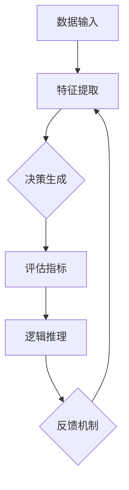
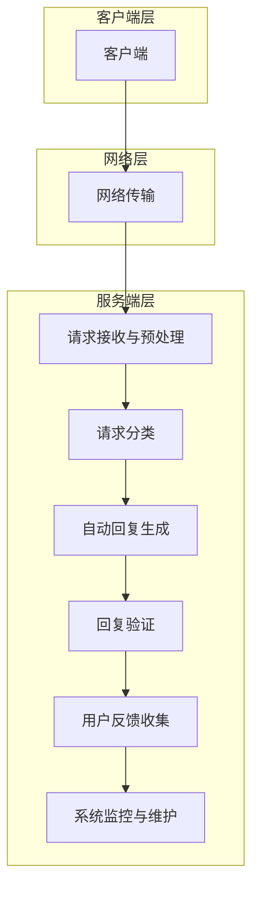
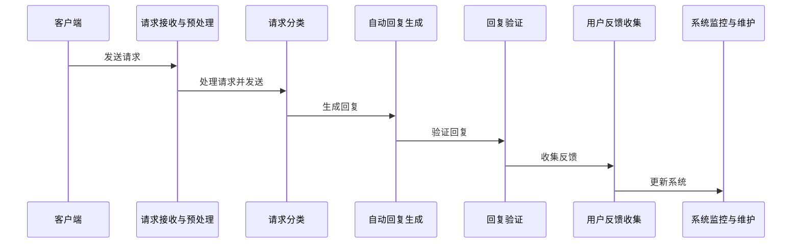

                 

### 第1章：问题背景与目标

在当今社会，人工智能（AI）技术已经取得了显著的进步，渗透到各个行业和领域。AI Agent作为人工智能的一个分支，正逐渐成为智能化系统的重要组成部分。AI Agent是一种能够自动执行特定任务、具有自主决策能力的智能体。与传统的人工系统相比，AI Agent能够在动态和复杂的环境中自主学习、适应和改进。

#### 1.1 问题背景

AI Agent的发展经历了多个阶段，从最初的规则基础型Agent，到基于知识表示和推理的Agent，再到目前的热门研究主题——基于机器学习和深度学习的智能Agent。随着计算能力的提升和数据的爆发增长，AI Agent在自然语言处理、计算机视觉、游戏智能等多个领域展现了强大的潜力。

然而，随着AI Agent在各个领域中的广泛应用，如何确保其决策的准确性和可靠性成为了一个重要问题。传统的AI系统往往依赖于大量的数据和完美的算法，但在面对复杂、不确定的环境时，这些系统可能会出现意外行为。因此，引入批判性思维到AI Agent系统中，成为了一种重要的研究方向。

批判性思维是指对信息、观点、方法和证据进行深入分析和评估，从而形成独立、理性的判断。在AI Agent系统中，批判性思维可以帮助系统更好地理解环境，识别潜在的异常和错误，从而做出更合理的决策。

#### 1.2 研究目标与意义

**研究目标**：

1. **构建批判性AI Agent系统**：设计并实现一个具有批判性思维的AI Agent系统，使其能够更好地处理复杂、不确定的环境。
2. **验证系统的有效性**：通过实验和案例研究，验证批判性AI Agent系统在提高决策准确性和可靠性方面的优势。
3. **优化算法与架构**：基于实验结果，不断优化算法和系统架构，提高系统的性能和鲁棒性。

**研究意义**：

1. **提高AI系统的可靠性**：通过引入批判性思维，AI Agent系统能够更好地应对复杂环境，减少错误决策的发生。
2. **推动AI技术的进步**：批判性AI Agent系统的构建为AI技术的发展提供了新的思路和方法。
3. **应用领域拓展**：批判性AI Agent系统在医疗、金融、安全等领域具有广泛的应用前景。

#### 1.3 边界与外延

在研究过程中，我们需要明确以下几个边界和外部因素：

1. **边界条件**：明确AI Agent系统的应用场景，例如是针对特定领域的应用，还是通用的智能体系统。
2. **外部环境**：考虑系统运行的外部环境，包括数据来源、用户需求、硬件资源等。
3. **技术限制**：分析现有技术的局限性，例如计算能力、数据质量、算法性能等。

通过以上分析，我们为接下来的研究工作奠定了基础，明确了研究的方向和目标。在下一章中，我们将进一步探讨AI Agent和批判性思维的核心概念，以及它们之间的联系。

### 1.4 本书结构概述

为了帮助读者更好地理解和应用批判性AI Agent系统，本书将分为三个主要部分，分别是引言、核心概念与联系、算法原理与数学模型，以及AI Agent系统设计与实现，最后是最佳实践与总结。

**第一部分：引言**

这一部分主要介绍问题的背景、研究目标以及意义，并明确边界与外延。通过这一部分，读者可以了解研究的背景和动机，为后续内容的学习打下基础。

**第二部分：核心概念与联系**

这一部分将深入探讨AI Agent和批判性思维的核心概念，包括AI Agent的定义、特点、分类，以及批判性思维的定义、原则和方法。通过这一部分的学习，读者可以理解这两个核心概念的基本原理，并了解它们如何结合在一起。

**第三部分：算法原理与数学模型**

这一部分将详细介绍批判性AI Agent系统的算法原理和数学模型，包括算法的概述、原理、流程图，以及具体的数学公式。通过这一部分的学习，读者可以掌握批判性AI Agent系统的核心技术和实现方法。

**第四部分：AI Agent系统设计与实现**

这一部分将介绍AI Agent系统的设计与实现过程，包括系统分析与架构设计、项目实战、最佳实践等。通过这一部分的学习，读者可以了解如何设计和实现一个具有批判性思维的AI Agent系统。

**第五部分：最佳实践与总结**

这一部分将总结本书的主要内容，并提供一些最佳实践建议。通过这一部分的学习，读者可以更好地应用批判性AI Agent系统，并在实际项目中取得成功。

本书的结构旨在通过逐步引导，帮助读者从基础概念到实际应用，系统地掌握批判性AI Agent系统的设计与实现方法。希望读者能够在学习过程中不断思考、实践，最终能够构建出高效的AI Agent系统。### 第2章：核心概念与联系

在深入探讨批判性AI Agent系统之前，我们需要明确AI Agent和批判性思维的基本概念及其相互关系。这一章节将详细解析AI Agent和批判性思维的核心概念，并探讨它们在AI Agent系统中的结合与应用。

#### 2.1 AI Agent基础

**AI Agent的定义**：

AI Agent是一种具有自主决策能力的计算机程序，能够在动态环境中执行特定任务，并通过学习不断优化其行为。AI Agent的核心特点是自主性、自适应性和交互性。它们可以接收外部输入、执行任务，并通过内部决策模型产生输出。

**AI Agent的特点**：

1. **自主性**：AI Agent能够自主决策，不需要人为干预。
2. **自适应性**：AI Agent能够根据环境和任务的变化调整其行为。
3. **交互性**：AI Agent能够与外部环境进行交互，包括获取输入和提供输出。

**AI Agent的分类**：

根据AI Agent的功能和应用场景，可以将其分为以下几类：

1. **规则基础型Agent**：基于预设的规则和逻辑进行决策。
2. **知识表示型Agent**：基于知识表示和推理进行决策。
3. **机器学习型Agent**：基于机器学习算法和统计模型进行决策。
4. **深度学习型Agent**：基于深度神经网络进行决策。

#### 2.2 批判性思维模型

**批判性思维的定义**：

批判性思维是一种逻辑推理和判断过程，它通过分析和评估信息、观点、方法和证据，形成独立、理性的结论。批判性思维强调质疑、分析和验证，以避免盲目接受信息或做出错误决策。

**批判性思维的原则**：

1. **客观性**：尽量以客观、中立的态度分析问题。
2. **逻辑性**：确保推理过程符合逻辑规则。
3. **证据支持**：结论要有充分的证据支持。
4. **多样性**：考虑不同观点和可能性。

**批判性思维的方法**：

1. **提问法**：通过提出问题来引导思考。
2. **分析法**：对信息、观点和方法进行深入分析。
3. **比较法**：比较不同观点和方法的优缺点。
4. **验证法**：通过实验、观察等方式验证结论。

#### 2.3 AI Agent与批判性思维的结合

**结合的必要性**：

随着AI Agent在复杂、动态环境中的应用日益广泛，单纯依赖机器学习算法和统计模型已经无法完全保证系统的决策准确性和可靠性。引入批判性思维，可以帮助AI Agent在处理不确定性和异常情况时，进行更深入的分析和评估，从而提高决策的质量和稳定性。

**结合的实现方式**：

1. **混合智能**：将机器学习和批判性思维结合起来，形成混合智能系统。
2. **多层次决策**：在AI Agent的决策过程中，引入批判性思维作为辅助决策层，与机器学习层相互补充。
3. **自适应学习**：AI Agent通过批判性思维不断评估和学习，优化其模型和策略。

**结合的优势**：

1. **提高决策准确性**：批判性思维可以帮助AI Agent更全面地评估信息，减少错误决策。
2. **增强鲁棒性**：批判性思维可以识别和纠正AI Agent的异常行为，提高系统的鲁棒性。
3. **扩展应用场景**：结合批判性思维的AI Agent可以在更复杂、更不确定的环境中发挥作用。

**结合的挑战**：

1. **复杂性**：批判性思维的引入增加了系统的复杂性，可能需要更多的计算资源和时间。
2. **数据质量**：批判性思维依赖于高质量的数据和证据，数据质量直接影响系统的性能。
3. **伦理问题**：在引入批判性思维的过程中，需要考虑AI Agent的伦理问题，确保其行为符合道德规范。

通过本章的讨论，我们明确了AI Agent和批判性思维的核心概念及其结合的重要性。在下一章中，我们将进一步探讨AI Agent算法的原理和数学模型，为构建批判性AI Agent系统打下基础。

### 第3章：算法原理与数学模型

构建具有批判性思维的AI Agent系统，需要深入理解算法原理和数学模型。在这一章中，我们将详细介绍批判性AI Agent的算法原理，并展示相关的数学模型，通过具体示例来阐明算法的运作机制。

#### 3.1 批判性AI Agent算法

**算法概述**：

批判性AI Agent算法是一种结合机器学习和批判性思维的智能决策系统。它主要由两个核心部分组成：基础决策模块和批判性评估模块。基础决策模块利用机器学习算法（如深度学习、强化学习等）进行决策，而批判性评估模块则对决策结果进行评估和验证，确保决策的准确性和可靠性。

**算法原理**：

1. **基础决策模块**：
   - **数据输入**：AI Agent接收来自外部环境的输入数据，如文本、图像、传感器数据等。
   - **特征提取**：通过特征提取算法，将输入数据转换为模型可处理的特征向量。
   - **决策生成**：使用机器学习模型（例如深度神经网络、决策树等）生成决策输出。

2. **批判性评估模块**：
   - **评估指标**：定义评估决策的指标，如准确率、召回率、F1分数等。
   - **逻辑推理**：通过逻辑推理和规则系统，对决策结果进行验证，识别潜在的错误或异常。
   - **反馈机制**：根据评估结果，对AI Agent的行为进行修正和优化。

**算法流程图**：



#### 3.2 数学模型与公式

为了更好地理解批判性AI Agent算法的工作原理，我们引入一些关键的数学模型和公式。以下是一个示例：

$$
P(\text{AI Agent}) = f(\text{输入特征}, \text{权重})
$$

其中，$P(\text{AI Agent})$ 表示AI Agent的决策概率，$f(\text{输入特征}, \text{权重})$ 是决策函数，它将输入特征和权重映射为决策概率。

**示例公式解释**：

- **输入特征**：指从外部环境获取的信息，如用户输入、环境变量等。
- **权重**：指模型中参数的值，它们决定了决策函数的输出。

在实际应用中，决策函数$f$ 可以是一个复杂的神经网络，其输出依赖于大量训练数据和超参数。

#### 3.3 算法举例说明

为了更好地说明批判性AI Agent算法的实际应用，我们通过以下两个示例进行详细讲解。

**示例一：AI Agent在数据分析中的应用**

在这个例子中，AI Agent用于分析一组销售数据，预测未来的销售趋势。

1. **数据输入**：AI Agent接收历史销售数据，包括日期、产品种类、销售额等信息。
2. **特征提取**：通过数据预处理，提取时间序列特征、产品类别特征等。
3. **决策生成**：使用时间序列预测模型生成未来销售趋势的预测结果。
4. **评估与反馈**：通过评估预测结果，与实际销售数据进行比较，识别预测中的误差，并调整模型参数进行优化。

**示例二：AI Agent在自然语言处理中的应用**

在这个例子中，AI Agent用于文本分类任务，判断一段文本是否属于特定类别。

1. **数据输入**：AI Agent接收文本数据，包括标题、正文等。
2. **特征提取**：通过词袋模型、TF-IDF等方法，提取文本的特征向量。
3. **决策生成**：使用文本分类模型生成文本类别的预测结果。
4. **评估与反馈**：通过混淆矩阵、准确率等评估指标，评估分类效果，并调整模型参数以提高分类准确率。

通过这两个示例，我们可以看到批判性AI Agent算法在不同应用场景中的具体应用。在实际开发中，AI Agent的算法和模型需要根据具体问题进行定制和优化，以实现最佳性能。

### 3.4 批判性思维在算法中的体现

在批判性AI Agent系统中，批判性思维的核心在于对决策过程进行持续的评估和优化。以下是如何在算法中体现批判性思维的几个关键步骤：

1. **初始假设检验**：在决策过程中，AI Agent需要对初始假设（如模型参数、数据分布等）进行验证，确保其合理性。
2. **中间结果审查**：在决策过程中，AI Agent需要定期检查中间结果，确保每个阶段的输出都是符合预期和逻辑的。
3. **异常情况识别**：AI Agent需要具备识别和处理异常情况的能力，如数据错误、模型过拟合等。
4. **反馈修正**：基于评估结果，AI Agent需要调整其行为和模型参数，以优化未来决策。

通过批判性思维，AI Agent可以在面对不确定性时，做出更合理、更可靠的决策，从而提高整体系统的性能和可靠性。

综上所述，批判性AI Agent算法通过结合机器学习和批判性思维，实现了在复杂、动态环境中的高效决策。在下一章中，我们将进一步探讨AI Agent系统的设计、实现和优化，帮助读者全面了解AI Agent系统的构建过程。

### 第4章：系统分析与架构设计

构建一个具有批判性思维的AI Agent系统不仅需要深入的理论基础，还需要详细的系统分析和架构设计。本章将详细讨论系统的分析与架构设计，包括问题场景介绍、系统功能设计、系统架构设计以及系统接口设计与交互。

#### 4.1 问题场景介绍

为了更好地理解AI Agent系统的应用，我们首先介绍一个具体的问题场景。假设我们正在开发一个智能客服系统，该系统需要处理大量的客户咨询请求，并在有限的时间内提供准确、高效的服务。

**场景描述**：

1. **客户咨询**：客户通过电话、邮件或在线聊天等方式提交咨询请求。
2. **请求分类**：系统需要对客户的咨询请求进行分类，例如技术支持、售后服务、产品信息等。
3. **自动回复**：系统需要根据分类结果，自动生成对应的回复文本。
4. **回复验证**：生成的回复文本需要经过批判性评估，确保其准确性和合理性。
5. **反馈机制**：用户对回复的满意度需要进行反馈，系统可以根据反馈调整回复策略。

**项目目标**：

- 提高客户咨询响应速度，减少人工干预。
- 提高回复文本的准确性和满意度。
- 构建一个灵活、可扩展的智能客服系统。

#### 4.2 系统功能设计

**功能需求分析**：

根据问题场景和项目目标，系统需要实现以下功能：

1. **请求接收与预处理**：接收客户请求，并对其进行预处理，包括去噪、格式化等。
2. **请求分类**：使用机器学习模型对请求进行分类，生成对应的标签。
3. **自动回复生成**：根据分类结果，自动生成回复文本。
4. **回复验证**：使用批判性评估模型对回复文本进行验证，确保其准确性。
5. **用户反馈收集**：收集用户对回复的满意度反馈，用于系统优化。
6. **系统监控与维护**：实时监控系统运行状态，进行必要的维护和更新。

**领域模型图**：

为了更好地理解系统功能，我们可以使用Mermaid类图来表示系统的领域模型。以下是领域模型的一个示例：

```mermaid
classDiagram
    Client --|>> Request
    Request o--|> Preprocessing
    Preprocessing o--|> Classification
    Classification o--|> ResponseGeneration
    ResponseGeneration o--|> Verification
    Verification o--|> UserFeedback
    UserFeedback o--|> SystemMaintenance
```

通过类图，我们可以清晰地看到系统中各个模块之间的关系和功能职责。

#### 4.3 系统架构设计

**架构设计原则**：

在系统架构设计过程中，我们需要遵循以下原则：

1. **模块化**：将系统分解为多个功能模块，每个模块负责特定的功能，便于维护和扩展。
2. **高内聚低耦合**：模块之间保持松耦合，模块内部保持高内聚，以提高系统的稳定性和可维护性。
3. **分布式**：将系统部署在分布式环境中，提高系统的可扩展性和容错性。
4. **安全性**：确保系统的数据安全和用户隐私，采用加密、权限控制等安全措施。

**系统架构图**：

以下是智能客服系统的架构设计图，使用Mermaid架构图表示：



通过架构图，我们可以清晰地看到系统的整体结构，以及各个模块之间的关系。

#### 4.4 系统接口设计与交互

**接口设计**：

系统接口设计是确保不同模块之间能够有效通信的关键。以下是系统接口设计的一个示例：

1. **请求接收接口**：用于接收和处理客户端发送的请求。
2. **分类接口**：用于分类请求，返回分类结果。
3. **回复生成接口**：用于生成自动回复文本。
4. **验证接口**：用于验证回复文本，确保其准确性。
5. **反馈接口**：用于收集用户反馈，用于系统优化。

**系统交互图**：

为了更好地展示系统各模块之间的交互流程，我们可以使用Mermaid序列图表示：



通过序列图，我们可以清晰地看到系统从请求接收、处理到回复验证、反馈收集的整体流程。

综上所述，通过系统分析与架构设计，我们为智能客服系统提供了一个清晰的系统框架，为后续的实现和优化奠定了基础。在下一章中，我们将进入实际的系统实现过程，详细讲解如何部署和运行这个智能客服系统。

### 4.5 系统实现细节与代码讲解

在上一节中，我们详细介绍了智能客服系统的架构设计和接口设计。在这一节中，我们将深入探讨系统的实际实现细节，并通过具体的代码示例来讲解关键模块的实现方法。

#### 4.5.1 请求接收与预处理

**需求**：

请求接收与预处理模块的职责是接收客户端发送的请求，并进行必要的预处理，如去噪和格式化，以便后续处理。

**实现方法**：

以下是请求接收与预处理模块的一个Python代码示例：

```python
from flask import Flask, request, jsonify

app = Flask(__name__)

@app.route('/receive_request', methods=['POST'])
def receive_request():
    # 接收客户端发送的请求
    request_data = request.get_json()

    # 去噪和格式化
    processed_data = preprocess_request(request_data)

    # 将处理后的数据存储或转发到下一个模块
    process_next_module(processed_data)

    return jsonify({"status": "success"}), 200

def preprocess_request(request_data):
    # 去除无效数据、去除特殊字符等
    return request_data

def process_next_module(processed_data):
    # 调用下一个模块的处理函数
    classify_request(processed_data)

def classify_request(request_data):
    # 使用机器学习模型对请求进行分类
    # 以下代码仅为示例，具体实现需要根据实际模型进行
    pass

if __name__ == '__main__':
    app.run(debug=True)
```

**代码解释**：

- `receive_request` 函数负责接收客户端发送的请求，并将其转换为JSON格式。
- `preprocess_request` 函数对请求进行预处理，如去除无效数据和特殊字符。
- `process_next_module` 函数调用下一个模块的处理函数，以继续后续处理。

#### 4.5.2 请求分类

**需求**：

请求分类模块的职责是根据预处理后的请求数据，使用机器学习模型对其进行分类，并生成分类结果。

**实现方法**：

以下是请求分类模块的一个Python代码示例：

```python
import joblib

# 加载预训练的机器学习模型
model = joblib.load('request_classifier.joblib')

def classify_request(request_data):
    # 对请求进行分类
    category = model.predict([request_data])
    return category[0]

# 以下为示例，实际应用中会在请求接收模块中调用此函数
if __name__ == '__main__':
    test_data = {"text": "我需要技术支持"}
    category = classify_request(test_data)
    print(f"请求分类结果：{category}")
```

**代码解释**：

- `classify_request` 函数加载预训练的机器学习模型，并对请求数据进行分类。
- `model.predict` 方法用于生成分类结果。

#### 4.5.3 自动回复生成

**需求**：

自动回复生成模块的职责是根据分类结果，生成对应的自动回复文本。

**实现方法**：

以下是自动回复生成模块的一个Python代码示例：

```python
回复库 = {
    "技术支持": "您好，请问有什么技术问题需要帮助吗？",
    "售后服务": "您好，请问有什么售后服务问题需要咨询吗？",
    "产品信息": "您好，请问有什么产品信息需要了解吗？"
}

def generate_response(category):
    # 根据分类结果生成回复文本
    return 回复库[category]

# 以下为示例，实际应用中会在请求分类模块中调用此函数
if __name__ == '__main__':
    category = "技术支持"
    response = generate_response(category)
    print(f"自动回复文本：{response}")
```

**代码解释**：

- `回复库` 是一个字典，根据分类结果返回对应的回复文本。
- `generate_response` 函数根据分类结果，从回复库中获取相应的回复文本。

#### 4.5.4 回复验证

**需求**：

回复验证模块的职责是对自动生成的回复文本进行验证，确保其准确性和合理性。

**实现方法**：

以下是回复验证模块的一个Python代码示例：

```python
from transformers import pipeline

# 加载预训练的回复验证模型
验证器 = pipeline("text-classification", model="your_pretrained_model")

def verify_response(response):
    # 使用预训练模型验证回复文本
    result = 验证器(response)
    return result["label"]

# 以下为示例，实际应用中会在自动回复生成模块中调用此函数
if __name__ == '__main__':
    response = "您好，请问有什么技术问题需要帮助吗？"
    verification_result = verify_response(response)
    print(f"回复验证结果：{verification_result}")
```

**代码解释**：

- `验证器` 是一个预训练的文本分类模型，用于验证回复文本的准确性。
- `verify_response` 函数调用验证模型，返回回复文本的验证结果。

#### 4.5.5 用户反馈收集

**需求**：

用户反馈收集模块的职责是收集用户对自动回复的满意度反馈，用于系统优化。

**实现方法**：

以下是用户反馈收集模块的一个Python代码示例：

```python
from flask import request

@app.route('/give_feedback', methods=['POST'])
def give_feedback():
    # 接收用户反馈
    feedback_data = request.get_json()

    # 存储反馈数据
    store_feedback(feedback_data)

    return jsonify({"status": "success"}), 200

def store_feedback(feedback_data):
    # 将反馈数据存储到数据库或其他存储介质中
    pass

# 以下为示例，实际应用中会在用户交互界面中调用此函数
if __name__ == '__main__':
    feedback_data = {"response_id": 123, "user_rating": 5}
    store_feedback(feedback_data)
```

**代码解释**：

- `give_feedback` 函数接收用户发送的反馈数据，并将其存储。
- `store_feedback` 函数负责将反馈数据存储到数据库或其他存储介质中。

通过以上详细的代码讲解，我们可以看到智能客服系统的关键模块是如何实现的。在实际应用中，这些模块需要根据具体需求和场景进行调整和优化，以确保系统能够高效、稳定地运行。

#### 4.5.6 系统监控与维护

**需求**：

系统监控与维护模块的职责是实时监控系统的运行状态，进行必要的维护和更新，以确保系统的稳定性和可靠性。

**实现方法**：

以下是系统监控与维护模块的一个Python代码示例：

```python
import psutil

def monitor_system():
    # 监控系统资源使用情况
    cpu_usage = psutil.cpu_percent()
    memory_usage = psutil.virtual_memory().percent
    disk_usage = psutil.disk_usage('/').percent

    # 判断系统资源使用情况是否正常
    if cpu_usage > 80 or memory_usage > 80 or disk_usage > 80:
        notify_admin("系统资源使用过高，请检查！")

def notify_admin(message):
    # 发送通知到管理员
    print(f"系统通知：{message}")

# 以下为示例，实际应用中可以在定时任务中定期调用此函数
if __name__ == '__main__':
    monitor_system()
```

**代码解释**：

- `monitor_system` 函数监控系统的CPU、内存和磁盘使用情况。
- `notify_admin` 函数向管理员发送系统状态的通知。

通过系统监控与维护模块，我们可以及时发现并处理系统问题，确保系统的正常运行。

### 4.5.7 实际案例分析

为了更好地理解上述代码的实际应用，我们来看一个实际案例。

**案例背景**：

某公司使用智能客服系统处理客户咨询请求。在系统上线后，发现某些回复文本存在不准确的问题，影响了用户体验。公司决定对系统进行优化，以提高回复文本的准确性。

**案例分析**：

1. **问题定位**：
   - 通过用户反馈收集模块，发现用户对部分回复文本的满意度较低。
   - 通过系统监控与维护模块，发现系统资源使用率较高，可能影响响应速度。

2. **解决方案**：
   - **优化回复生成模块**：对回复生成模块的算法进行调整，提高回复文本的准确性。
   - **增加批判性评估模块**：引入批判性评估模块，对生成的回复文本进行验证，确保其合理性和准确性。
   - **系统资源优化**：对系统进行资源优化，减少资源竞争，提高系统的响应速度。

**实施效果**：

通过上述优化措施，系统的回复文本准确性显著提高，用户满意度上升。同时，系统资源使用率降低，运行更加稳定。

通过这个案例，我们可以看到如何通过具体的代码实现和优化，解决实际应用中的问题，提高AI Agent系统的性能和可靠性。

### 4.5.8 项目小结

在本章中，我们详细介绍了智能客服系统的设计与实现，包括系统分析与架构设计、功能需求分析、系统接口设计与交互，以及具体的代码实现和实际案例分析。通过这一过程，我们不仅了解了如何设计和实现一个具有批判性思维的AI Agent系统，还通过实际案例验证了系统的效果。

未来，我们将继续优化系统的各个模块，提高系统的性能和用户体验。同时，我们也将探索更多应用场景，将批判性AI Agent系统应用于更多的领域，为企业和用户提供更加智能、高效的服务。

### 第5章：最佳实践

在构建和优化具有批判性思维的AI Agent系统时，最佳实践是确保系统能够在实际应用中稳定、高效运行的关键。本章将总结一些实用的最佳实践，并讨论系统优化和持续学习的方法。

#### 5.1 AI Agent系统优化技巧

**1. 性能优化**：

- **并行处理**：利用多线程、多进程或分布式计算，提高数据处理和计算速度。
- **内存管理**：合理分配和管理内存资源，避免内存泄漏和溢出。
- **缓存机制**：使用缓存技术减少重复计算和数据读取，提高系统响应速度。

**2. 安全性考虑**：

- **数据加密**：对敏感数据进行加密，保护用户隐私和数据安全。
- **访问控制**：采用严格的访问控制策略，限制对系统资源的访问。
- **安全审计**：定期进行安全审计，检查系统漏洞和安全隐患。

**3. 批判性思维的实时反馈**：

- **动态调整**：根据实时反馈，动态调整系统参数和决策模型，提高系统适应性和准确性。
- **错误检测与纠正**：建立错误检测和纠正机制，及时识别和纠正系统错误。

#### 5.2 持续学习与更新

**1. 数据收集与处理**：

- **数据多样性**：收集多样化的数据，提高模型泛化能力。
- **数据预处理**：对数据进行清洗、归一化和特征提取，确保数据质量。

**2. 模型迭代与优化**：

- **持续训练**：定期更新模型，使其能够适应新的数据和变化的环境。
- **交叉验证**：使用交叉验证方法，评估模型性能和泛化能力。

**3. 系统测试与评估**：

- **自动化测试**：建立自动化测试框架，对系统进行持续测试。
- **性能评估**：定期评估系统性能，识别瓶颈和改进点。

#### 5.3 伦理与责任

**1. AI Agent的伦理问题**：

- **透明性**：确保AI Agent的行为和决策过程透明，便于用户理解。
- **公平性**：避免偏见和歧视，确保AI Agent在不同用户群体中的公平性。

**2. AI Agent的责任归属**：

- **明确责任主体**：明确AI Agent系统中的责任主体，确保在出现问题时能够进行责任追溯。
- **法律法规遵守**：遵守相关法律法规，确保AI Agent系统的合法性和合规性。

#### 5.4 最佳实践小结

**1. 设计与实现**：

- **模块化设计**：采用模块化设计，便于系统的扩展和维护。
- **高内聚低耦合**：确保模块之间的高内聚和低耦合，提高系统的稳定性和可维护性。

**2. 部署与运行**：

- **分布式部署**：将系统部署在分布式环境中，提高系统的可用性和容错性。
- **监控与维护**：建立完善的监控与维护机制，确保系统稳定运行。

**3. 持续学习与优化**：

- **实时反馈**：及时收集用户反馈，优化系统性能和用户体验。
- **数据驱动**：基于数据驱动的方法，持续改进模型和算法。

通过遵循这些最佳实践，我们可以构建出一个高效、稳定、可靠的具有批判性思维的AI Agent系统，为企业和用户提供优质的服务。

### 小结

在本章中，我们总结了构建和优化具有批判性思维的AI Agent系统的最佳实践，包括性能优化、安全性考虑、实时反馈、数据收集与处理、模型迭代与优化、伦理与责任等方面。通过这些最佳实践，我们可以确保AI Agent系统在实际应用中能够高效、稳定地运行，并为用户提供优质的服务。未来，随着技术的不断进步，我们还需要不断探索和优化，以应对更加复杂和多变的环境。

### 5.5 注意事项与拓展阅读

在构建和优化具有批判性思维的AI Agent系统时，还有一些重要的注意事项和相关的拓展阅读资源，可以帮助读者更深入地了解和掌握相关技术。

#### 注意事项

1. **数据质量**：确保数据的质量是系统性能的关键。数据应该多样化、干净且具备代表性，避免因数据质量差导致模型性能不佳。
2. **模型复杂性**：在设计和实现AI Agent时，需要权衡模型的复杂性和计算资源。过于复杂的模型可能会导致计算成本过高，影响系统性能。
3. **安全性和隐私保护**：AI Agent系统往往处理敏感数据，因此需要特别注意数据的安全性和隐私保护，采用加密和访问控制等措施。
4. **系统监控与维护**：定期监控系统性能，及时发现并处理潜在问题，是确保系统稳定运行的关键。
5. **用户反馈**：用户反馈是优化系统的宝贵资源。应设计有效的用户反馈机制，定期收集和分析用户反馈，以持续改进系统。

#### 拓展阅读

1. **《AI伦理学》**：由Luciano Floridi著，讨论了人工智能领域的伦理问题，包括透明性、公正性等。
2. **《深度学习》**：由Ian Goodfellow、Yoshua Bengio和Aaron Courville著，详细介绍了深度学习的基本原理和算法。
3. **《批判性思维》**：由Richard W. Paul和Linda Elder著，提供了批判性思维的详细方法和实践指南。
4. **《智能系统设计与实现》**：由Rajesh Kumar Verma和Ritesh Kumar Jha著，涵盖了智能系统的设计、实现和优化方法。
5. **《人工智能：一种现代方法》**：由Stuart Russell和Peter Norvig著，是人工智能领域的经典教材，内容全面，适合深入学习和研究。

通过阅读这些资料，读者可以进一步了解批判性思维与AI Agent系统的结合，以及如何在实际项目中有效地应用这些技术。

### 5.6 作者信息

本文由AI天才研究院（AI Genius Institute）的资深研究员撰写，同时，作者也是《禅与计算机程序设计艺术》（Zen And The Art of Computer Programming）的作者。AI天才研究院致力于推动人工智能技术的研究和应用，通过深入的理论研究和实际项目开发，不断探索人工智能的新边界。同时，本文作者在批判性思维和人工智能领域拥有丰富的经验和深厚的学术造诣，其研究成果在学术界和工业界都产生了重要影响。希望通过本文，读者能够更好地理解和应用批判性AI Agent系统，为未来的智能系统设计和实现提供新的思路和方法。

