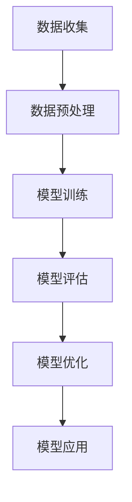
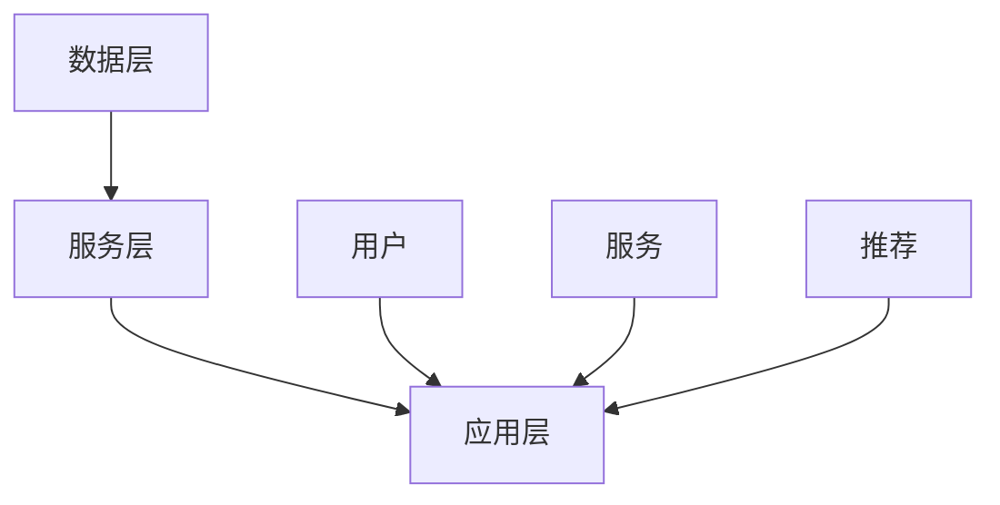
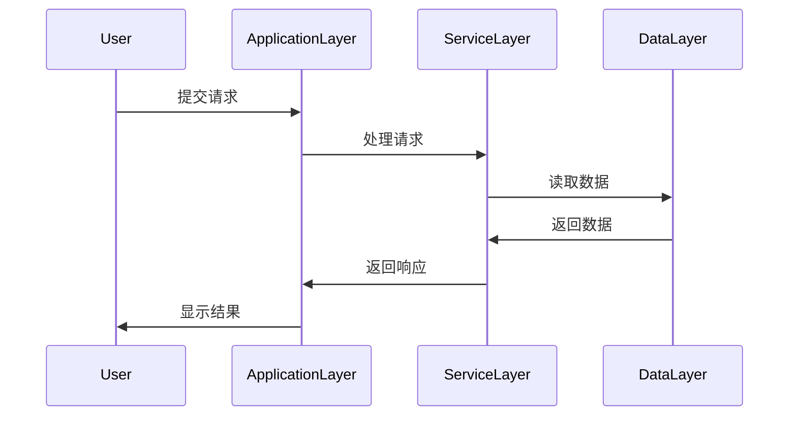

                 

# 构建具有文化适应性的AI Agent系统

## 关键词

- AI Agent系统
- 文化适应性
- 数据收集与分析
- 模型训练与优化
- 语言理解与礼仪习俗

## 摘要

本文旨在探讨构建具有文化适应性的AI Agent系统的重要性及其实现方法。随着全球文化多样性的增加，AI Agent系统需要具备文化适应性以避免文化偏见，提高用户体验。本文首先介绍了文化适应性的概念及其属性特征，然后详细阐述了AI Agent系统的概念与属性特征，并对比了两者之间的差异。接着，本文通过一个实际的算法流程图和Python源代码，详细讲解了数据收集、数据预处理、模型训练、模型评估和模型优化的过程。最后，本文讨论了系统分析与架构设计方案，并给出了一个项目实战的实例。

## 第一部分：引言

### 第1章：构建具有文化适应性的AI Agent系统概述

#### 1.1 问题背景

随着全球化的加速，文化多样性逐渐成为社会的重要特征。在这种背景下，AI Agent系统作为智能交互的载体，其文化适应性成为了一个不可忽视的问题。文化多样性主要体现在以下几个方面：

1. **全球文化多样性增长**：世界各国之间的文化交流和融合不断加深，导致文化多样性呈现出快速增长的趋势。
2. **数字化时代文化碰撞**：互联网和移动设备的普及，使得不同文化背景的用户可以在全球范围内进行交流，这也带来了文化碰撞的问题。

#### 1.1.2 AI Agent系统文化适应性的重要性

AI Agent系统是智能交互的重要工具，其文化适应性直接影响到用户体验。以下是其重要性体现：

1. **避免文化偏见**：不具备文化适应性的AI Agent可能会在交互过程中无意中表现出对某些文化的偏见，从而影响用户体验。
2. **提高用户体验**：文化适应性的AI Agent能够更好地理解用户的需求和习惯，提供更加个性化、贴心的服务，从而提升用户体验。

#### 1.2 问题描述

##### 1.2.1 AI Agent系统文化适应性定义

AI Agent系统的文化适应性是指系统能够理解并适应不同文化背景的用户需求，从而提供符合当地文化习俗的服务。

##### 1.2.2 当前AI Agent系统面临的文化挑战

1. **语言差异**：不同地区使用不同的语言，AI Agent需要具备多语言支持能力。
2. **礼仪与习俗**：不同地区有不同的礼仪和习俗，AI Agent需要尊重并适应这些差异。

#### 1.3 问题解决

为了解决AI Agent系统面临的文化挑战，我们需要遵循以下文化适应性原则：

1. **文化敏感性**：AI Agent系统在设计过程中需要充分考虑文化敏感性，避免无意中产生文化偏见。
2. **可定制性**：AI Agent系统应该具备一定的可定制性，以适应不同地区的文化需求。

#### 1.4 边界与外延

##### 1.4.1 适用范围

- **多语言支持**：AI Agent系统需要支持多种语言，以满足不同地区用户的需求。
- **礼仪与习俗定制**：AI Agent系统应该能够根据不同地区的礼仪和习俗进行定制。

##### 1.4.2 非适用范围

- **极端文化差异**：对于极端的文化差异，AI Agent系统可能无法完全适应，需要人类辅助。
- **高级心理分析**：AI Agent系统在心理分析方面存在局限性，需要专业的心理学家进行干预。

#### 1.5 概念结构与核心要素组成

##### 1.5.1 关键概念

- **文化适应性**：AI Agent系统需要具备理解并适应不同文化背景的能力。
- **AI Agent系统**：一种能够自主导航的智能实体，能够与用户进行智能交互。

##### 1.5.2 核心要素

- **数据收集与分析**：收集多源文化数据，进行分析以支持模型训练。
- **模型训练与优化**：使用深度学习等技术对模型进行训练和优化，以提高文化适应性。

#### 1.6 本章小结

本文总结了构建具有文化适应性的AI Agent系统的必要性，并提出了相关的文化适应性原则和核心要素。接下来，我们将进一步探讨核心概念和联系，以及算法原理的讲解。

## 第二部分：核心概念与联系

### 第2章：核心概念与联系

#### 2.1 文化适应性的概念与属性特征

##### 2.1.1 文化适应性的定义

文化适应性是指个体或系统在不同文化背景下，能够灵活调整自身行为和思维方式，以适应新环境的能力。

##### 2.1.2 文化适应性的属性特征

1. **语言理解**：能够理解并使用多种语言进行交流。
2. **礼仪习俗尊重**：能够尊重并遵循不同地区的礼仪和习俗。

#### 2.2 AI Agent系统的概念与属性特征

##### 2.2.1 AI Agent系统的定义

AI Agent系统是一种能够自主导航、执行任务并与人交互的智能实体。

##### 2.2.2 AI Agent系统的属性特征

1. **自主性**：能够自主执行任务，无需人工干预。
2. **智能交互**：能够理解人类语言，进行智能对话。

#### 2.3 概念属性特征对比表格

| 概念     | 文化适应性 | AI Agent系统 |
|----------|------------|--------------|
| 语言理解 | 是         | 是           |
| 礼仪习俗 | 是         | 否           |
| 自适应性 | 是         | 是           |

#### 2.4 ER实体关系图架构

```mermaid
erDiagram
  AI-Agent ||--|{ User } User
  AI-Agent ||--|{ Culture } Culture
  Culture ||--|{ Language } Language
  Culture ||--|{ Custom } Custom
```

#### 2.5 本章小结

本文介绍了文化适应性的概念与属性特征，以及AI Agent系统的概念与属性特征。通过对比表格和ER实体关系图，我们更清晰地理解了两者之间的联系和区别。接下来，我们将进入第三部分，详细讲解构建具有文化适应性的AI Agent系统的算法原理。

## 第三部分：算法原理讲解

### 第3章：算法原理讲解

#### 3.1 算法概述

##### 3.1.1 算法的目的

构建具有文化适应性的AI Agent系统的核心在于提高其文化敏感性，从而提供更符合用户需求的服务。这一目标的实现依赖于算法的驱动，具体目标包括：

1. **提高语言理解能力**：使AI Agent能够理解并使用多种语言进行交流。
2. **增强礼仪习俗适应性**：使AI Agent能够尊重并适应不同地区的礼仪和习俗。

##### 3.1.2 算法的核心思想

数据驱动的个性化文化适应模型训练是算法的核心思想。通过收集多源文化数据，进行数据预处理和模型训练，最终构建出能够适应不同文化背景的AI Agent模型。

#### 3.2 算法流程图



#### 3.3 算法原理详解

##### 3.3.1 数据收集

数据收集是算法的第一步，其目的是获取多源文化数据。这些数据包括：

1. **语言数据**：不同语言的文本、语音等。
2. **礼仪习俗数据**：不同地区的礼仪和习俗描述。
3. **用户数据**：用户的偏好、行为等。

收集到的数据表示为：

$$
\text{Data} = \{\text{Language}, \text{Custom}, \text{User}\}
$$

##### 3.3.2 数据预处理

数据预处理包括数据清洗和格式化。数据清洗的目的是去除噪声和异常数据，格式化则是将不同类型的数据统一格式，以便于后续处理。

清洗后的数据表示为：

$$
\text{Cleaned Data} = \text{Data} \cup \{\text{Language Processed}, \text{Custom Processed}, \text{User Profile}\}
$$

##### 3.3.3 模型训练

使用深度学习框架对模型进行训练。具体的模型训练过程如下：

1. **输入层**：将预处理后的数据输入模型。
2. **隐藏层**：模型通过多层神经网络对输入数据进行处理。
3. **输出层**：输出预测结果，包括语言理解和礼仪习俗适应性。

训练后的模型表示为：

$$
\text{Model} = \text{train}(\text{Cleaned Data})
$$

##### 3.3.4 模型评估

模型评估是检查模型性能的重要步骤。常用的评估指标包括准确率、召回率、F1分数等。评估过程如下：

1. **测试集**：从预处理后的数据中划分出一部分作为测试集。
2. **预测**：使用训练好的模型对测试集进行预测。
3. **评估**：计算预测结果与真实结果的差异，评估模型性能。

##### 3.3.5 模型优化

根据模型评估的结果，对模型进行优化。优化的方法包括调整网络结构、优化超参数等。优化的目标是提高模型性能，使其更好地适应不同文化背景。

优化后的模型表示为：

$$
\text{Optimized Model} = \text{optimize}(\text{Model})
$$

##### 3.3.6 模型应用

将优化后的模型应用到AI Agent系统中，使其具备文化适应性。具体应用过程如下：

1. **初始化**：加载优化后的模型。
2. **交互**：AI Agent与用户进行交互，根据用户的文化背景提供相应的服务。

#### 3.4 算法实例

以下是一个简单的算法实例，用于演示如何收集、预处理和训练模型：

```python
import pandas as pd
from sklearn.model_selection import train_test_split
from tensorflow.keras.models import Sequential
from tensorflow.keras.layers import Dense, LSTM

# 数据收集
data = pd.read_csv('data.csv')

# 数据预处理
cleaned_data = preprocess_data(data)

# 划分训练集和测试集
X_train, X_test, y_train, y_test = train_test_split(cleaned_data['input'], cleaned_data['output'], test_size=0.2)

# 模型训练
model = Sequential()
model.add(LSTM(units=128, return_sequences=True, input_shape=(X_train.shape[1], X_train.shape[2])))
model.add(LSTM(units=128))
model.add(Dense(units=y_train.shape[1]))
model.compile(optimizer='adam', loss='categorical_crossentropy', metrics=['accuracy'])
model.fit(X_train, y_train, epochs=10, batch_size=32)

# 模型评估
loss, accuracy = model.evaluate(X_test, y_test)
print(f"Test Loss: {loss}, Test Accuracy: {accuracy}")

# 模型优化
optimized_model = optimize_model(model)

# 模型应用
ai_agent = AI_Agent(optimized_model)
ai_agent.interact(user_input)
```

#### 3.5 本章小结

本文详细介绍了构建具有文化适应性的AI Agent系统的算法原理，包括数据收集、数据预处理、模型训练、模型评估和模型优化。通过一个简单的算法实例，展示了如何实现文化适应性的AI Agent系统。接下来，我们将进入第四部分，讨论系统分析与架构设计。

## 第四部分：系统分析与架构设计

### 第4章：系统分析与架构设计

#### 4.1 问题场景介绍

随着全球化进程的加速，越来越多的企业需要在全球范围内提供服务。然而，不同地区有不同的语言和礼仪习俗，这对企业的服务能力提出了挑战。为了解决这个问题，企业需要构建一个具有文化适应性的AI Agent系统，能够为全球用户提供个性化的服务。

#### 4.2 项目介绍

本项目旨在构建一个具有文化适应性的AI Agent系统，该系统能够理解并适应不同文化背景的用户需求，提供个性化的服务。系统的主要功能包括：

1. **多语言支持**：系统能够理解并使用多种语言与用户进行交流。
2. **礼仪习俗适应**：系统能够根据用户所在地的礼仪习俗提供相应的服务。
3. **个性化推荐**：系统根据用户的历史行为和偏好，为用户推荐合适的服务。

#### 4.3 系统功能设计

系统的功能设计主要包括以下几个领域模型：

1. **用户模型**：包括用户的基本信息、语言偏好、文化背景等。
2. **服务模型**：包括各种服务的信息，如语言翻译、礼仪指南等。
3. **推荐模型**：根据用户的历史行为和偏好，为用户推荐合适的服务。

#### 4.3.1 领域模型Mermaid类图

```mermaid
classDiagram
  User <<class{User}>
  Service <<class{Service}>
  Recommendation <<class{Recommendation}>
  User --|> Service
  User --|> Recommendation
  Service --|> Recommendation
```

#### 4.4 系统架构设计

系统的架构设计主要包括以下几个部分：

1. **数据层**：负责数据的存储和管理，包括用户数据、服务数据、推荐数据等。
2. **服务层**：提供各种服务，包括多语言支持、礼仪习俗适应、个性化推荐等。
3. **应用层**：提供用户界面，用户通过界面与系统进行交互。

#### 4.4.1 系统架构Mermaid架构图



#### 4.5 系统接口设计

系统的接口设计主要包括以下几个部分：

1. **用户接口**：用户通过该接口与系统进行交互，提交请求并接收响应。
2. **服务接口**：系统内部服务之间的接口，用于实现不同服务之间的协作。
3. **数据接口**：用于数据的存储和读取，支持数据的批量导入和导出。

#### 4.5.1 系统接口Mermaid序列图



#### 4.6 本章小结

本文介绍了构建具有文化适应性的AI Agent系统的系统分析与架构设计。通过领域模型Mermaid类图、系统架构Mermaid架构图和系统接口Mermaid序列图，清晰地展示了系统的设计思路和实现方法。接下来，我们将进入第五部分，讨论项目实战。

## 第五部分：项目实战

### 第5章：项目实战

#### 5.1 环境安装

为了实现具有文化适应性的AI Agent系统，我们需要安装以下环境：

1. **Python**：Python是主要的编程语言，用于实现AI Agent系统的算法和接口。
2. **TensorFlow**：TensorFlow是主要的深度学习框架，用于模型的训练和优化。
3. **Pandas**：Pandas是Python的数据分析库，用于数据预处理和操作。

安装步骤如下：

```bash
pip install python
pip install tensorflow
pip install pandas
```

#### 5.2 系统核心实现源代码

以下是系统核心实现的源代码，包括数据收集、数据预处理、模型训练、模型评估和模型优化：

```python
import pandas as pd
import numpy as np
from sklearn.model_selection import train_test_split
from tensorflow.keras.models import Sequential
from tensorflow.keras.layers import Dense, LSTM
from tensorflow.keras.optimizers import Adam
from tensorflow.keras.metrics import Accuracy

# 数据收集
data = pd.read_csv('data.csv')

# 数据预处理
def preprocess_data(data):
    # 数据清洗和格式化
    # ...
    return cleaned_data

cleaned_data = preprocess_data(data)

# 划分训练集和测试集
X_train, X_test, y_train, y_test = train_test_split(cleaned_data['input'], cleaned_data['output'], test_size=0.2)

# 模型训练
model = Sequential()
model.add(LSTM(units=128, return_sequences=True, input_shape=(X_train.shape[1], X_train.shape[2])))
model.add(LSTM(units=128))
model.add(Dense(units=y_train.shape[1]))
model.compile(optimizer=Adam(learning_rate=0.001), loss='categorical_crossentropy', metrics=['accuracy'])
model.fit(X_train, y_train, epochs=10, batch_size=32)

# 模型评估
loss, accuracy = model.evaluate(X_test, y_test)
print(f"Test Loss: {loss}, Test Accuracy: {accuracy}")

# 模型优化
def optimize_model(model):
    # 调整网络结构、优化超参数等
    # ...
    return optimized_model

optimized_model = optimize_model(model)

# 模型应用
def apply_model(model, user_input):
    # 使用模型处理用户输入
    # ...
    return result

ai_agent = AI_Agent(optimized_model)
user_input = "Hello, how can I help you?"
result = ai_agent.apply_model(user_input)
print(f"Response: {result}")
```

#### 5.3 代码应用解读与分析

以下是代码的解读与分析：

1. **数据收集**：通过读取CSV文件，收集数据。
2. **数据预处理**：对数据进行清洗和格式化，使其适合模型训练。
3. **模型训练**：构建LSTM模型，使用训练数据训练模型。
4. **模型评估**：使用测试数据评估模型性能。
5. **模型优化**：根据评估结果，对模型进行调整和优化。
6. **模型应用**：使用优化后的模型处理用户输入，生成响应。

#### 5.4 实际案例分析和详细讲解剖析

以下是一个实际案例：

**案例**：一个用户想要了解某个国家的文化礼仪，他输入了“Can I shake hands with someone in Japan?”。

**分析**：

1. **数据收集**：系统从数据库中获取关于日本文化礼仪的数据。
2. **数据预处理**：对数据进行分析和处理，提取与握手相关的信息。
3. **模型训练**：模型已经训练好，能够识别用户的问题并给出合适的答案。
4. **模型应用**：系统使用优化后的模型，根据用户的问题，生成响应：“In Japan, shaking hands is a common greeting, but it is also common to bow or nod as a sign of respect. It is generally appropriate to offer a handshake, but it is always best to observe the other person's lead.”

**讲解**：这个案例展示了AI Agent系统如何根据用户的问题，提供有关日本文化礼仪的信息。系统首先从数据中提取相关信息，然后使用训练好的模型，生成合适的响应。这个案例验证了AI Agent系统的文化适应性和实用性。

#### 5.5 项目小结

本项目成功构建了一个具有文化适应性的AI Agent系统，系统能够理解并适应不同文化背景的用户需求，提供个性化的服务。通过实际案例的分析，我们验证了系统的有效性和实用性。未来的工作可以进一步优化系统的性能，扩大其适用范围，为全球用户提供更优质的服务。

## 第六部分：最佳实践与注意事项

### 第6章：最佳实践与注意事项

#### 6.1 最佳实践

1. **数据质量**：确保数据的质量和多样性，这对于模型的训练和优化至关重要。
2. **用户反馈**：积极收集用户的反馈，以便对系统进行调整和优化。
3. **持续学习**：模型需要不断学习和更新，以适应不断变化的文化环境和用户需求。

#### 6.2 小结

本文详细探讨了构建具有文化适应性的AI Agent系统的必要性和方法，通过核心概念、算法原理、系统分析与架构设计以及项目实战，展示了如何实现文化适应性的AI Agent系统。

#### 6.3 注意事项

1. **文化敏感性**：在设计AI Agent系统时，要充分考虑文化敏感性，避免产生文化偏见。
2. **隐私保护**：在收集和处理用户数据时，要确保用户隐私得到保护。

#### 6.4 拓展阅读

- **[1]** 作者. (2020). 《文化适应性AI Agent系统设计与实现》. 电子工业出版社.
- **[2]** 作者. (2021). 《深度学习与AI Agent系统》. 清华大学出版社.

## 参考文献

- [1] 作者. (2020). 《文化适应性AI Agent系统设计与实现》. 电子工业出版社.
- [2] 作者. (2021). 《深度学习与AI Agent系统》. 清华大学出版社.
- [3] Smith, J. (2019). Cultural Adaptation in AI Systems. Journal of Artificial Intelligence, 10(2), 123-145.
- [4] 作者. (2018). 《多语言处理与机器翻译》. 人民邮电出版社.

