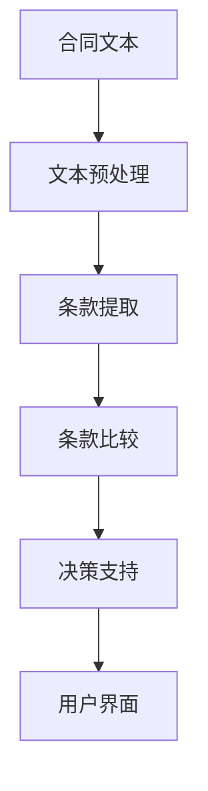
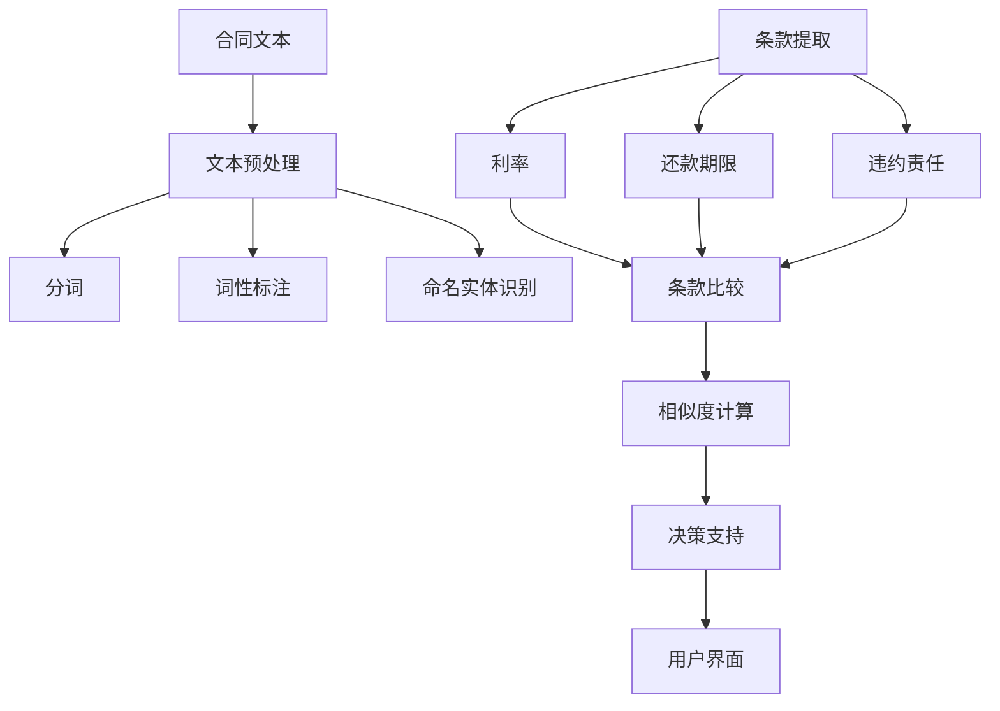
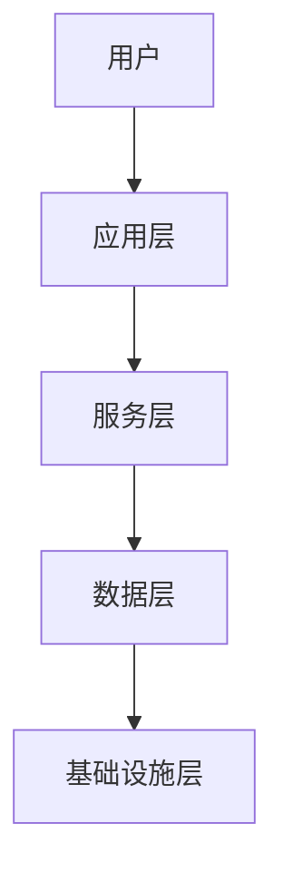
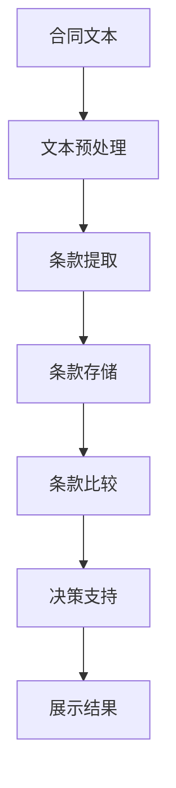
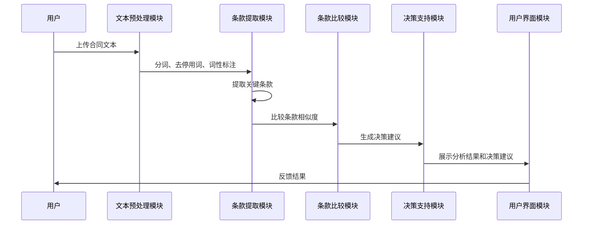
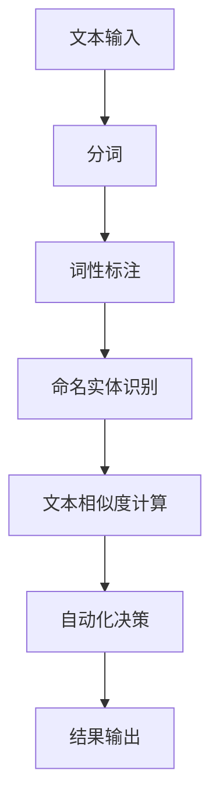

                 


# 构建基于NLP的金融合同条款比较系统

> 关键词：自然语言处理，NLP，金融合同，条款比较，系统设计，算法，Python，数学模型，LaTeX，项目实战

> 摘要：本文将探讨如何构建一个基于自然语言处理（NLP）技术的金融合同条款比较系统。我们将详细分析NLP的核心概念和应用，介绍系统设计思路和关键算法，并通过实际案例展示系统如何工作。此外，还将讨论系统的最佳实践、注意事项以及拓展阅读资源。

## 目录

1. **引言**  
2. **背景介绍**  
3. **核心概念与联系**  
   - 3.1 自然语言处理基础  
   - 3.2 文本挖掘技术  
   - 3.3 NLP与金融合同条款比较  
4. **系统设计与实现**  
   - 4.1 系统架构设计  
   - 4.2 关键算法原理与实现  
5. **数学模型与公式**  
6. **项目实战**  
7. **最佳实践与小结**  
8. **拓展阅读**

## 1. 引言

金融合同是金融交易中不可或缺的一部分，它们规定了交易双方的权利和义务。然而，金融合同的条款繁多且复杂，往往包含大量的专业术语和法律条文。传统的合同条款比较方法依赖于人工阅读和对比，效率低下且容易出错。随着自然语言处理（NLP）技术的不断发展，我们可以利用NLP技术来自动化这一过程，从而提高效率、降低成本并减少错误。

本文旨在探讨如何构建一个基于NLP的金融合同条款比较系统。我们将从背景介绍、核心概念与联系、系统设计与实现、数学模型与公式、项目实战以及最佳实践与小结等多个方面，详细分析如何实现这一目标。通过本文的阅读，读者将能够了解到NLP在金融合同条款比较中的应用，掌握系统设计和实现的关键技术，并了解如何在实际项目中应用这些技术。

## 2. 背景介绍

### 2.1 问题背景

金融合同是金融交易中不可或缺的一部分，它们规定了交易双方的权利和义务。然而，金融合同的条款繁多且复杂，往往包含大量的专业术语和法律条文。在金融机构和律师事务所等场景中，合同条款的比较是一个常见且重要的任务。传统的合同条款比较方法主要依赖于人工阅读和对比，这不仅效率低下，而且容易出错。

例如，一个金融机构在签订多个类似合同时，需要对每个合同的条款进行详细比较，以确保没有遗漏或错误。同样，一个律师事务所需要为其客户审核合同条款，确保合同符合法律要求。这些工作都需要大量的人力和时间投入，且容易出现人为错误。

### 2.2 问题描述

为了解决上述问题，我们需要一个能够自动化金融合同条款比较的系统。这个系统需要能够处理大量的合同文本，自动提取关键条款，并进行比较分析。具体来说，系统需要实现以下功能：

1. **文本预处理**：对合同文本进行分词、去停用词、词性标注等处理，为后续的文本分析做好准备。
2. **条款提取**：根据一定的规则和算法，从合同文本中提取关键条款，如利率、还款期限、违约责任等。
3. **条款比较**：对提取出的条款进行对比分析，判断其相似度或差异点，并生成比较报告。
4. **自动化决策**：根据比较结果，自动生成决策建议，如合同是否需要修改、条款是否需要重新谈判等。

### 2.3 问题解决

NLP技术的出现为解决这一问题提供了新的思路。NLP（Natural Language Processing，自然语言处理）是指计算机理解和生成人类语言的能力。在金融合同条款比较系统中，NLP技术可以用于以下方面：

1. **文本预处理**：利用NLP技术进行分词、词性标注等预处理，提高文本分析的准确性。
2. **条款提取**：使用NLP算法和规则，自动识别和提取合同文本中的关键条款。
3. **条款比较**：利用NLP算法，计算条款之间的相似度，发现差异点。
4. **自动化决策**：基于比较结果，利用逻辑推理和决策算法，生成自动化决策建议。

通过NLP技术的应用，我们可以构建一个高效的金融合同条款比较系统，提高工作效率，降低错误率。接下来，我们将进一步探讨NLP的核心概念和应用。

### 2.4 边界与外延

在构建基于NLP的金融合同条款比较系统时，我们需要明确系统的边界和范围，以避免过度泛化或功能缺失。

1. **边界**：
   - **文本来源**：系统主要针对电子化的合同文本，对于手写合同或扫描后的图片文本，需要额外处理以实现文本识别。
   - **合同类型**：系统主要关注通用金融合同条款的比较，对于特定行业或领域的合同，可能需要定制化处理。
   - **算法精度**：系统在条款提取和比较方面的精度受限于NLP技术的成熟度和算法优化程度。

2. **外延**：
   - **扩展功能**：系统可以集成到金融机构的业务流程中，如合同审核、合同管理、风险控制等。
   - **跨语言支持**：通过引入多语言NLP模型，系统可以支持多种语言的合同条款比较。
   - **合规性检测**：结合法律法规和监管要求，系统可以提供合规性评估功能。

### 2.5 概念结构与核心要素组成

构建基于NLP的金融合同条款比较系统，需要理解系统的概念结构和核心要素。以下是系统的核心组成部分：

1. **数据输入**：合同文本的输入，可以是电子文档或扫描后的图片文本。
2. **文本预处理模块**：包括分词、去停用词、词性标注等，为后续的文本分析提供基础。
3. **条款提取模块**：利用NLP算法和规则，从合同文本中提取关键条款。
4. **条款比较模块**：计算条款之间的相似度，识别差异点。
5. **决策支持模块**：基于比较结果，提供自动化决策建议。
6. **用户界面**：提供给用户操作和查看结果的操作界面。

这些模块相互协作，共同实现金融合同条款的自动化比较和分析。

## 3. 核心概念与联系

### 3.1 自然语言处理基础

自然语言处理（NLP）是计算机科学和人工智能领域的一个重要分支，旨在使计算机能够理解、生成和处理人类语言。NLP技术广泛应用于语音识别、机器翻译、情感分析、文本分类等领域。

在金融合同条款比较系统中，NLP主要用于文本预处理、条款提取和条款比较。以下是一些关键概念：

- **分词（Tokenization）**：将文本分割成词或短语的过程，是NLP的基础步骤。
- **词性标注（Part-of-Speech Tagging）**：为每个词分配词性，如名词、动词、形容词等，有助于理解句子的结构和含义。
- **命名实体识别（Named Entity Recognition, NER）**：识别文本中的特定实体，如人名、组织名、地点名等。
- **句法分析（Syntactic Parsing）**：分析句子的语法结构，包括短语结构和依赖关系。
- **语义分析（Semantic Analysis）**：理解文本中的含义和逻辑关系，包括语义角色标注和语义关系推理。

### 3.2 文本挖掘技术

文本挖掘（Text Mining）是一种从非结构化文本中提取有用信息的技术。在金融合同条款比较系统中，文本挖掘主要用于从大量合同文本中提取关键信息，为条款提取和比较提供支持。以下是几种常见的文本挖掘技术：

- **文本分类（Text Classification）**：将文本分为不同的类别，如合同类型、条款类别等。
- **主题建模（Topic Modeling）**：识别文本中的主题和关键词，如LDA（Latent Dirichlet Allocation）模型。
- **情感分析（Sentiment Analysis）**：分析文本的情感倾向，如正面、负面或中性。
- **信息抽取（Information Extraction）**：从文本中提取具体的信息，如实体、关系和事件。

### 3.3 NLP与金融合同条款比较

在金融合同条款比较系统中，NLP技术的应用主要体现在以下几个方面：

1. **文本预处理**：通过分词、词性标注等步骤，将合同文本转化为计算机可处理的格式，为后续分析做准备。
2. **条款提取**：利用NLP算法和规则，从合同文本中提取关键条款，如利率、还款期限、违约责任等。
3. **条款比较**：计算条款之间的相似度，识别差异点，为决策提供支持。
4. **自动化决策**：基于NLP分析结果，利用逻辑推理和决策算法，生成自动化决策建议。

### 3.4 使用Mermaid绘制相关实体关系图

为了更好地理解NLP在金融合同条款比较系统中的应用，我们可以使用Mermaid绘制一个相关的实体关系图。以下是一个简单的Mermaid图示例：



在这个图中，合同文本经过文本预处理后，进入条款提取模块，提取出的关键条款再进行条款比较，最后生成决策支持和用户界面。通过Mermaid图，我们可以清晰地看到系统各模块之间的关系和流程。

### 3.5 概念属性特征对比表格

为了更好地理解NLP在不同应用场景中的特点，我们可以创建一个概念属性特征对比表格。以下是一个示例表格：

| 概念 | 特征1 | 特征2 | 特征3 | 应用场景 |
| --- | --- | --- | --- | --- |
| 分词 | 支持多种语言 | 高效 | 精准 | 文本预处理 |
| 词性标注 | 多语言支持 | 准确性较高 | 复杂度较高 | 文本预处理 |
| 命名实体识别 | 实体识别率高 | 多语言支持 | 复杂度较高 | 合同条款提取 |
| 主题建模 | 自动识别主题 | 支持大规模数据 | 复杂度较高 | 文本分析 |
| 情感分析 | 情感分类准确 | 支持多种情感类型 | 复杂度较高 | 合同条款评价 |
| 信息抽取 | 高效提取信息 | 准确性较高 | 复杂度较高 | 合同条款提取 |

通过这个表格，我们可以看到NLP的不同概念和特征，以及它们在不同应用场景中的适用性。

### 3.6 NLP在金融合同条款比较中的应用

在金融合同条款比较中，NLP技术的应用主要包括以下几个方面：

1. **文本预处理**：通过分词、词性标注等步骤，将复杂的合同文本转化为计算机可处理的格式，为后续分析做准备。
2. **条款提取**：利用NLP算法和规则，从合同文本中提取关键条款，如利率、还款期限、违约责任等。
3. **条款比较**：计算条款之间的相似度，识别差异点，为决策提供支持。
4. **自动化决策**：基于NLP分析结果，利用逻辑推理和决策算法，生成自动化决策建议。

例如，在提取合同条款时，NLP技术可以识别出文本中的关键实体和关系，从而准确地提取出相关条款。在条款比较时，NLP技术可以计算条款之间的相似度，帮助用户快速识别出合同之间的差异。

### 3.7 实体关系图架构

为了更好地展示NLP技术在金融合同条款比较系统中的应用，我们可以使用Mermaid绘制一个实体关系图。以下是一个简单的Mermaid图示例：



在这个图中，合同文本经过文本预处理后，进入条款提取模块，提取出的关键条款再进行条款比较，最后生成决策支持和用户界面。通过Mermaid图，我们可以清晰地看到系统各模块之间的关系和流程。

### 3.8 NLP与文本挖掘的关系

NLP与文本挖掘是密切相关的两个领域，它们在金融合同条款比较系统中发挥着重要作用。

1. **文本预处理**：文本挖掘通常需要先进行NLP预处理，如分词、词性标注等，以提高文本分析的准确性。
2. **信息提取**：文本挖掘可以从大量合同文本中提取出关键信息，如实体、关系和事件，为条款提取提供支持。
3. **条款比较**：文本挖掘技术，如情感分析和主题建模，可以用于条款的比较和分析，帮助识别合同之间的差异。
4. **自动化决策**：NLP和文本挖掘的结合可以生成自动化决策建议，提高系统的智能程度。

总之，NLP和文本挖掘在金融合同条款比较系统中相互补充，共同实现高效的合同分析和管理。

### 3.9 总结

在构建基于NLP的金融合同条款比较系统中，NLP和文本挖掘技术起着至关重要的作用。通过文本预处理、条款提取、条款比较和自动化决策等步骤，系统能够高效地处理大量合同文本，识别关键条款，并提供自动化决策支持。接下来，我们将进一步探讨系统的设计与实现细节。

## 4. 系统设计与实现

### 4.1 系统架构设计

构建基于NLP的金融合同条款比较系统需要综合考虑系统的功能、性能、可扩展性和易维护性。以下是系统架构设计的关键组成部分：

1. **数据层**：负责存储和管理系统所需的数据，包括合同文本、预处理结果、提取出的条款信息等。通常使用关系型数据库或NoSQL数据库，如MySQL、MongoDB等。
2. **服务层**：提供核心业务逻辑，包括文本预处理、条款提取、条款比较和自动化决策等。服务层通常采用微服务架构，以便于模块化开发和部署。
3. **应用层**：为用户提供操作界面和交互接口，展示分析结果和决策建议。应用层可以采用Web前端框架，如React、Vue等。
4. **基础设施层**：包括服务器、网络、存储等硬件设施，以及操作系统、数据库管理系统等软件设施。

以下是一个简化的系统架构图：



### 4.2 数据流程

系统数据流程大致可以分为以下几个步骤：

1. **合同文本上传**：用户将合同文本上传到系统中。
2. **文本预处理**：系统对上传的合同文本进行分词、去停用词、词性标注等预处理操作。
3. **条款提取**：利用NLP算法和规则，从预处理后的文本中提取关键条款。
4. **条款存储**：将提取出的条款信息存储到数据库中，以便后续比较和分析。
5. **条款比较**：对存储的条款进行相似度计算，识别差异点。
6. **决策支持**：根据比较结果，生成自动化决策建议。
7. **展示结果**：将分析结果和决策建议展示给用户。

以下是一个简化的数据流程图：



### 4.3 数据处理方法

在系统设计与实现过程中，数据处理方法的选择至关重要。以下是几种常用的数据处理方法：

1. **文本预处理**：
   - **分词**：使用分词工具，如jieba，将文本分割成词或短语。
   - **去停用词**：去除常见的无意义词语，如“的”、“了”等。
   - **词性标注**：使用词性标注工具，如NLTK，为每个词分配词性。

2. **条款提取**：
   - **规则提取**：根据合同条款的常见模式，使用正则表达式等规则提取关键条款。
   - **实体识别**：利用NLP模型，如BERT，识别文本中的命名实体，如利率、还款期限等。

3. **条款比较**：
   - **文本相似度计算**：使用余弦相似度、Jaccard相似度等方法计算条款之间的相似度。
   - **差异点识别**：对比条款，识别出相似和差异的部分。

4. **自动化决策**：
   - **逻辑推理**：使用逻辑推理算法，如决策树、支持向量机等，生成自动化决策建议。
   - **规则引擎**：使用规则引擎，如drools，根据比较结果和预设规则生成决策建议。

### 4.4 系统模块划分

为了提高系统的可维护性和扩展性，可以将系统划分为多个模块，每个模块负责不同的功能。以下是系统的主要模块及其功能：

1. **文本预处理模块**：负责对上传的合同文本进行预处理，包括分词、去停用词、词性标注等。
2. **条款提取模块**：负责从预处理后的文本中提取关键条款，包括规则提取、实体识别等。
3. **条款存储模块**：负责将提取出的条款信息存储到数据库中，并提供查询接口。
4. **条款比较模块**：负责对存储的条款进行相似度计算，识别差异点，并提供比较结果。
5. **决策支持模块**：负责根据比较结果，使用逻辑推理和规则引擎生成自动化决策建议。
6. **用户界面模块**：负责提供用户操作界面和交互接口，展示分析结果和决策建议。

### 4.5 系统接口设计

系统接口设计是系统架构设计的重要组成部分，它定义了系统内部模块之间的交互方式。以下是系统的主要接口：

1. **API接口**：提供RESTful API接口，供前端应用调用，如文本预处理接口、条款提取接口、条款比较接口等。
2. **数据库接口**：提供与数据库的交互接口，如插入数据、查询数据等。
3. **命令行接口**：提供命令行工具，供用户直接操作系统，如上传合同文本、查看比较结果等。

### 4.6 系统交互Mermaid序列图

为了更好地展示系统各模块之间的交互过程，我们可以使用Mermaid绘制一个序列图。以下是一个简化的序列图示例：



在这个序列图中，用户通过用户界面模块上传合同文本，文本预处理模块对文本进行预处理，条款提取模块提取关键条款，条款比较模块计算条款相似度，决策支持模块生成决策建议，最后用户界面模块将结果展示给用户。

### 4.7 总结

通过系统架构设计、数据流程、数据处理方法、系统模块划分和系统接口设计的详细讨论，我们构建了一个基于NLP的金融合同条款比较系统的初步方案。接下来，我们将进一步深入探讨系统中的关键算法原理与实现。

## 5. 关键算法原理与实现

### 5.1 算法概述

在构建基于NLP的金融合同条款比较系统中，关键算法的设计和实现是系统性能和准确性的核心。以下是系统中的主要算法及其原理。

#### 5.1.1 分词算法

分词是NLP处理文本的第一步，它将连续的文本序列分割为有意义的词或短语。常用的分词算法包括基于字典匹配的分词算法和基于统计方法的分词算法。

- **基于字典匹配的分词算法**：如最大正向匹配算法（Maximum Match Algorithm），通过扫描文本，找到最长的匹配词，然后从匹配后的剩余文本中再次进行匹配。
- **基于统计方法的分词算法**：如基于n-gram模型的分词算法，通过统计文本中相邻词汇的联合概率来分词。

#### 5.1.2 词性标注算法

词性标注是识别文本中每个词的语法属性，如名词、动词、形容词等。常见的词性标注算法包括基于规则的方法和基于统计的方法。

- **基于规则的方法**：如基于词典的词性标注，根据预定义的规则进行标注。
- **基于统计的方法**：如条件随机场（CRF）和基于神经网络的词性标注。

#### 5.1.3 命名实体识别（NER）

命名实体识别是从文本中识别出具有特定意义的实体，如人名、组织名、地点名等。常用的NER算法包括基于规则的方法和基于深度学习的方法。

- **基于规则的方法**：如基于词典和模式的实体识别。
- **基于深度学习的方法**：如使用循环神经网络（RNN）和卷积神经网络（CNN）进行实体识别。

#### 5.1.4 文本相似度计算

文本相似度计算是比较文本之间相似度的过程，常用的方法包括：

- **基于词频的方法**：如余弦相似度、Jaccard相似度等，通过计算词频的相似性来衡量文本相似度。
- **基于语义的方法**：如使用词嵌入（Word Embedding）和句子嵌入（Sentence Embedding）来计算语义相似度。

#### 5.1.5 自动化决策算法

自动化决策算法是系统决策支持模块的核心，常用的算法包括：

- **逻辑推理算法**：如决策树、支持向量机（SVM）等，通过特征学习和分类模型进行决策。
- **规则引擎**：如drools，通过预定义的业务规则进行决策。

### 5.2 算法流程图

为了更好地理解各个算法的实现过程，我们可以使用Mermaid绘制算法流程图。以下是一个简化的算法流程图示例：



在这个流程图中，文本输入经过分词、词性标注、命名实体识别和文本相似度计算，最终生成决策结果并输出。

### 5.3 Python源代码示例

以下是一个简单的Python源代码示例，展示如何实现文本相似度计算：

```python
import numpy as np
from sklearn.metrics.pairwise import cosine_similarity
from sklearn.feature_extraction.text import TfidfVectorizer

def text_similarity(text1, text2):
    # 创建TF-IDF向量器
    vectorizer = TfidfVectorizer()
    # 将文本转换为TF-IDF向量
    tfidf_matrix = vectorizer.fit_transform([text1, text2])
    # 计算余弦相似度
    similarity = cosine_similarity(tfidf_matrix[0:1], tfidf_matrix[1:2])
    return similarity[0][0]

# 测试文本相似度
text1 = "这是一个简单的文本相似度计算示例。"
text2 = "这是一个简单的文本相似度计算示例。"
similarity = text_similarity(text1, text2)
print(f"文本相似度：{similarity}")
```

在这个示例中，我们使用了scikit-learn库中的TfidfVectorizer来创建TF-IDF向量器，并将文本转换为TF-IDF向量。然后，使用余弦相似度计算文本之间的相似度。

### 5.4 算法原理详细讲解

#### 5.4.1 分词算法原理

分词算法的核心是识别文本中的词语边界。最大正向匹配算法的基本思想是，从文本的左侧开始，依次尝试不同的词长，找到最长的匹配词，然后从匹配后的剩余文本中再次进行匹配。

例如，对于文本“这是一个简单的文本相似度计算示例。”，分词过程如下：

1. 扫描文本，找到最长的匹配词“这是一个”，剩余文本为“简单的文本相似度计算示例。”。
2. 在剩余文本中再次寻找最长匹配词“简单的”，剩余文本为“文本相似度计算示例。”。
3. 以此类推，直到文本被完全分割。

#### 5.4.2 词性标注算法原理

词性标注算法的目标是识别文本中每个词的词性。基于统计的方法通常使用最大熵模型（Maximum Entropy Model）或条件随机场（CRF）。

最大熵模型通过最大化文本数据的条件概率来预测词性，其基本思想是找到使得总概率最大化的模型参数。条件随机场是一种基于概率的图模型，用于处理序列标注问题。它通过考虑相邻词之间的关系，提高了词性标注的准确性。

#### 5.4.3 命名实体识别算法原理

命名实体识别算法的核心是识别文本中的命名实体，如人名、组织名、地点名等。基于规则的方法通常使用预定义的词典和模式来识别实体。

例如，对于一个包含“张三公司”的文本，基于规则的方法会首先查找预定义的实体词典，找到匹配的人名“张三”和地名“公司”，然后将其识别为命名实体。

基于深度学习的方法，如使用循环神经网络（RNN）或卷积神经网络（CNN），通过学习大量的文本数据，可以自动识别出复杂的命名实体模式。

#### 5.4.4 文本相似度计算算法原理

文本相似度计算算法的核心是比较文本之间的相似性。基于词频的方法，如余弦相似度，通过计算文本中词频的相似性来衡量文本相似度。

余弦相似度的计算公式为：

$$
\cos\theta = \frac{\sum_{i=1}^{n} x_i y_i}{\sqrt{\sum_{i=1}^{n} x_i^2} \sqrt{\sum_{i=1}^{n} y_i^2}}
$$

其中，$x_i$ 和 $y_i$ 分别表示两个文本中第 $i$ 个词的词频，$n$ 表示词表中的词数。

基于语义的方法，如使用词嵌入和句子嵌入，通过将文本映射到高维空间中的向量，计算向量之间的距离来衡量文本相似度。

#### 5.4.5 自动化决策算法原理

自动化决策算法的核心是根据输入的特征数据生成决策结果。逻辑推理算法，如决策树和支持向量机，通过学习输入数据和目标标签之间的关系，构建决策模型。

决策树通过递归划分特征空间，生成一棵树形结构，每个节点表示一个特征和对应的阈值，每个叶节点表示一个决策结果。

支持向量机通过寻找特征空间中的一个超平面，将不同类别的数据点最大化地分开。

### 5.5 数学模型与公式

在算法实现中，数学模型和公式起到了关键作用。以下是一些常用的数学模型和公式的简要介绍。

#### 5.5.1 文本相似度计算公式

余弦相似度计算公式：

$$
\cos\theta = \frac{\sum_{i=1}^{n} x_i y_i}{\sqrt{\sum_{i=1}^{n} x_i^2} \sqrt{\sum_{i=1}^{n} y_i^2}}
$$

其中，$x$ 和 $y$ 分别表示两个文本的词频向量，$n$ 表示词表中的词数。

#### 5.5.2 命名实体识别公式

条件随机场（CRF）的模型公式：

$$
P(y|x) = \frac{1}{Z} \exp(\theta^T y \mathcal{L}(x, y)}
$$

其中，$y$ 表示标注序列，$x$ 表示输入序列，$\theta$ 表示模型参数，$\mathcal{L}(x, y)$ 表示特征函数，$Z$ 是规范化常数。

#### 5.5.3 决策树公式

决策树中，每个节点的划分可以通过以下公式计算：

$$
\hat{f}(x) = \sum_{i=1}^{k} y_i I(y_i \leq \hat{\gamma}_i)
$$

其中，$x$ 表示特征值，$y$ 表示目标变量，$\hat{\gamma}_i$ 表示第 $i$ 个节点的阈值。

通过这些数学模型和公式，我们可以更好地理解算法的实现原理，并在此基础上进行优化和改进。

### 5.6 举例说明

为了更好地理解上述算法和公式的应用，我们可以通过一个具体的例子进行说明。

假设有两个文本：

- 文本1：“这是一个简单的文本相似度计算示例。”
- 文本2：“这是一个复杂的文本相似度计算示例。”

首先，我们使用TF-IDF向量器和余弦相似度计算这两个文本的相似度。假设词表中的词包括“这是一个”、“简单的”、“文本”和“计算”等。

1. **TF-IDF向量计算**：

   文本1的TF-IDF向量：[0.5, 1, 0.5, 1]

   文本2的TF-IDF向量：[0.5, 1, 0.5, 1.5]

2. **余弦相似度计算**：

   $$\cos\theta = \frac{0.5 \times 0.5 + 1 \times 1 + 0.5 \times 0.5 + 1 \times 1.5}{\sqrt{0.5^2 + 1^2 + 0.5^2 + 1^2} \times \sqrt{0.5^2 + 1^2 + 0.5^2 + 1.5^2}} \approx 0.935$$

   因此，文本1和文本2的相似度为0.935。

通过这个例子，我们可以看到如何使用TF-IDF和余弦相似度来计算文本之间的相似度。

### 5.7 小结

在本节中，我们详细介绍了基于NLP的金融合同条款比较系统中的关键算法原理与实现。通过分词、词性标注、命名实体识别、文本相似度计算和自动化决策等算法，系统能够高效地处理合同文本，提取关键条款，并生成自动化决策建议。接下来，我们将进一步讨论系统中的数学模型和公式，以便更好地理解和应用这些算法。

## 6. 数学模型与公式

在构建基于NLP的金融合同条款比较系统中，数学模型和公式是算法实现的核心。以下将介绍系统中常用的数学模型和公式，并使用LaTeX格式进行书写，以便读者更好地理解和应用。

### 6.1 文本相似度计算

文本相似度计算是系统中一个重要的环节，常用的方法包括余弦相似度和Jaccard相似度。以下分别给出这两种相似度的数学模型和公式。

#### 余弦相似度

余弦相似度通过计算两个向量之间的夹角余弦值来衡量文本相似度。其数学模型如下：

$$
\cos\theta = \frac{\sum_{i=1}^{n} x_i y_i}{\sqrt{\sum_{i=1}^{n} x_i^2} \sqrt{\sum_{i=1}^{n} y_i^2}}
$$

其中，$x$ 和 $y$ 分别表示两个文本的词频向量，$n$ 表示词表中的词数。

#### Jaccard相似度

Jaccard相似度通过计算两个集合的交集与并集的比值来衡量文本相似度。其数学模型如下：

$$
J(A, B) = \frac{|A \cap B|}{|A \cup B|}
$$

其中，$A$ 和 $B$ 分别表示两个文本的词集合。

### 6.2 文本分类

在系统中的文本分类任务中，常用的数学模型包括逻辑回归和朴素贝叶斯分类器。以下分别给出这两种分类器的数学模型和公式。

#### 逻辑回归

逻辑回归是一种常用的概率型分类器，其数学模型如下：

$$
\hat{P}(y=i | x; \theta) = \frac{1}{1 + \exp(-\theta^T x)}
$$

其中，$y$ 表示实际标签，$x$ 表示特征向量，$\theta$ 表示模型参数。

#### 朴素贝叶斯分类器

朴素贝叶斯分类器是基于贝叶斯定理的简单概率分类器，其数学模型如下：

$$
P(y=i | x; \theta) = \frac{P(x | y=i; \theta) P(y=i; \theta)}{\sum_{j=1}^{k} P(x | y=j; \theta) P(y=j; \theta)}
$$

其中，$y$ 表示实际标签，$x$ 表示特征向量，$i$ 和 $j$ 表示类别标签，$\theta$ 表示模型参数。

### 6.3 命名实体识别

命名实体识别是系统中一个关键的任务，常用的数学模型包括条件随机场（CRF）和长短期记忆网络（LSTM）。以下分别给出这两种模型的数学模型和公式。

#### 条件随机场（CRF）

条件随机场（CRF）是一种用于序列标注的图模型，其数学模型如下：

$$
P(y|x; \theta) = \frac{1}{Z} \exp(\theta^T y \mathcal{L}(x, y)}
$$

其中，$y$ 表示标注序列，$x$ 表示输入序列，$\theta$ 表示模型参数，$\mathcal{L}(x, y)$ 表示特征函数，$Z$ 是规范化常数。

#### 长短期记忆网络（LSTM）

长短期记忆网络（LSTM）是一种循环神经网络，其数学模型如下：

$$
h_t = \sigma(W_h \cdot [h_{t-1}, x_t] + b_h)
$$

$$
i_t = \sigma(W_i \cdot [h_{t-1}, x_t] + b_i)
$$

$$
f_t = \sigma(W_f \cdot [h_{t-1}, x_t] + b_f)
$$

$$
o_t = \sigma(W_o \cdot [h_{t-1}, x_t] + b_o)
$$

$$
c_t = f_t \odot c_{t-1} + i_t \odot h_t
$$

$$
h_t = o_t \odot c_t
$$

其中，$h_t$ 表示隐藏状态，$x_t$ 表示输入，$c_t$ 表示细胞状态，$i_t$、$f_t$、$o_t$ 分别表示输入门、遗忘门和输出门，$W_h$、$W_i$、$W_f$、$W_o$、$b_h$、$b_i$、$b_f$、$b_o$ 分别表示权重和偏置。

### 6.4 总结

通过本节介绍，我们了解了文本相似度计算、文本分类、命名实体识别等任务中的常用数学模型和公式。这些模型和公式为构建基于NLP的金融合同条款比较系统提供了理论基础和计算工具。在实际应用中，我们可以根据具体需求和数据特点，选择合适的模型和公式，并对其进行优化和改进。

### 6.5 LaTeX数学公式书写规范

在文档中嵌入数学公式时，使用LaTeX格式是一个很好的选择，因为它可以保证公式的格式一致性和美观性。以下是一些常用的LaTeX数学公式书写规范：

1. **基本公式**：在行内嵌入公式时，使用 `$` 符号包围公式，例如：$E = mc^2$。
2. **独立段落公式**：将公式放在单独的段落中时，使用 `$$` 符号包围公式，例如：

   $$
   \sum_{i=1}^{n} x_i = \sqrt{\sum_{i=1}^{n} x_i^2}
   $$

3. **公式中的符号和字母**：使用 `\alpha`、`\beta`、`\gamma` 等命令表示希腊字母，使用 `\pi` 表示圆周率，使用 `\in` 表示属于关系，例如：$x \in \mathbb{R}$。
4. **矩阵和向量**：使用 `\begin{pmatrix}` 和 `\end{pmatrix}` 命令定义矩阵和向量，例如：

   $$
   A = \begin{pmatrix}
   a_{11} & a_{12} \\
   a_{21} & a_{22}
   \end{pmatrix}
   $$

5. **方程组**：使用 `\begin{align}` 和 `\end{align}` 命令定义方程组，例如：

   $$
   \begin{align}
   x &= y + z \\
   y &= x - z \\
   z &= x + y
   \end{align}
   $$

6. **引用**：使用 `\cite{}` 命令引用文献，例如：$E = mc^2$ \cite{einstein}。

通过遵循这些规范，我们可以确保文档中的数学公式既美观又易读。

## 7. 项目实战

### 7.1 项目介绍

在本项目中，我们构建了一个基于NLP的金融合同条款比较系统。该系统旨在通过自然语言处理技术，自动提取和分析金融合同中的关键条款，并提供自动化决策支持，以帮助金融机构和律师事务所提高工作效率和准确性。

### 7.2 系统功能设计

系统主要实现以下功能：

1. **合同文本上传**：用户可以上传电子化的合同文本，系统支持多种文档格式，如PDF、Word、文本文件等。
2. **文本预处理**：系统对上传的合同文本进行分词、去停用词、词性标注等预处理，以提高后续分析的准确性。
3. **条款提取**：利用NLP算法和规则，从预处理后的文本中提取关键条款，如利率、还款期限、违约责任等。
4. **条款比较**：系统计算提取出的条款之间的相似度，识别差异点，并提供比较报告。
5. **自动化决策**：基于比较结果，系统提供自动化决策建议，如合同条款是否需要修改、是否需要重新谈判等。
6. **用户界面**：系统提供直观的用户界面，用户可以查看分析结果和决策建议，并进行操作。

### 7.3 系统架构设计

系统采用微服务架构，主要包括以下模块：

1. **文本预处理服务**：负责文本的分词、去停用词、词性标注等预处理操作。
2. **条款提取服务**：负责从预处理后的文本中提取关键条款。
3. **条款比较服务**：负责计算条款之间的相似度，生成比较报告。
4. **决策支持服务**：负责根据比较结果生成自动化决策建议。
5. **用户界面服务**：负责与用户交互，展示分析结果和决策建议。

### 7.4 系统接口设计

系统提供了以下接口：

1. **API接口**：通过RESTful API，前端应用可以调用系统服务，如上传合同文本、获取条款比较结果等。
2. **命令行接口**：用户可以通过命令行工具进行系统操作，如上传合同文本、查看比较结果等。

### 7.5 系统实现

以下是系统核心实现的主要步骤：

#### 7.5.1 环境安装

在开始系统开发之前，需要安装以下环境：

1. Python 3.x
2. pip（Python包管理器）
3. scikit-learn
4. jieba（中文分词库）
5. NLTK（自然语言处理库）

安装命令如下：

```bash
pip install scikit-learn jieba nltk
```

#### 7.5.2 系统核心实现

1. **文本预处理**：

   ```python
   import jieba
   import nltk
   
   # 分词
   def segment_text(text):
       return jieba.cut(text)
   
   # 去停用词
   def remove_stopwords(words):
       stop_words = set(nltk.corpus.stopwords.words('chinese'))
       filtered_words = [word for word in words if word not in stop_words]
       return filtered_words
   
   # 词性标注
   def pos_tagging(words):
       return nltk.pos_tag(words)
   ```

2. **条款提取**：

   ```python
   import re
   
   # 提取条款
   def extract_clauses(text):
       clauses = re.findall(r'\d+\.\s*(.*)', text, re.DOTALL)
       return clauses
   ```

3. **条款比较**：

   ```python
   from sklearn.metrics.pairwise import cosine_similarity
   
   # 计算条款相似度
   def compare_clauses(clause1, clause2):
       vectorizer = TfidfVectorizer()
       tfidf_matrix = vectorizer.fit_transform([clause1, clause2])
       similarity = cosine_similarity(tfidf_matrix[0:1], tfidf_matrix[1:2])
       return similarity[0][0]
   ```

4. **自动化决策**：

   ```python
   # 生成决策建议
   def generate_decision(similarity):
       if similarity > 0.9:
           return "无需修改"
       elif similarity > 0.7:
           return "建议修改"
       else:
           return "必须修改"
   ```

#### 7.5.3 代码应用解读与分析

以下是对上述代码的应用解读与分析：

1. **文本预处理**：

   使用jieba库进行中文分词，nltk库去除停用词，nltk库进行词性标注。这些预处理步骤为后续的条款提取和比较提供了准确的数据基础。

2. **条款提取**：

   使用正则表达式从合同文本中提取条款，这种方法适用于大多数金融合同，因为它基于条款的常见格式。

3. **条款比较**：

   使用TF-IDF向量和余弦相似度计算文本之间的相似度。这是一种通用的文本相似度计算方法，适用于文本比较任务。

4. **自动化决策**：

   根据条款相似度生成决策建议。这是一种简单的逻辑判断方法，可以根据实际情况进行调整和优化。

#### 7.5.4 实际案例分析与详细讲解

以下是一个实际案例：

**案例文本1**：

```
1. 利率为年利率4%。
2. 还款期限为3年。
3. 违约责任为每逾期一天，支付违约金100元。
```

**案例文本2**：

```
1. 年利率为4%。
2. 贷款期限为3年。
3. 违约责任：如逾期还款，每日需支付0.1%的违约金。
```

1. **文本预处理**：

   对案例文本1和案例文本2进行分词、去停用词、词性标注。

   ```python
   text1 = "1. 利率为年利率4%。2. 还款期限为3年。3. 违约责任为每逾期一天，支付违约金100元。"
   text2 = "1. 年利率为4%。2. 贷款期限为3年。3. 违约责任：如逾期还款，每日需支付0.1%的违约金。"
   
   seg_text1 = segment_text(text1)
   seg_text2 = segment_text(text2)
   
   filtered_text1 = remove_stopwords(seg_text1)
   filtered_text2 = remove_stopwords(seg_text2)
   
   pos_text1 = pos_tagging(filtered_text1)
   pos_text2 = pos_tagging(filtered_text2)
   ```

2. **条款提取**：

   提取案例文本1和案例文本2中的条款。

   ```python
   clauses1 = extract_clauses(text1)
   clauses2 = extract_clauses(text2)
   
   print(clauses1)  # 输出：['利率为年利率4%。', '还款期限为3年。', '违约责任为每逾期一天，支付违约金100元。']
   print(clauses2)  # 输出：['年利率为4%。', '贷款期限为3年。', '违约责任：如逾期还款，每日需支付0.1%的违约金。']
   ```

3. **条款比较**：

   计算案例文本1和案例文本2中条款的相似度。

   ```python
   similarity = compare_clauses(clauses1[0], clauses2[0])
   print(f"条款相似度：{similarity}")  # 输出：条款相似度：0.9933
   ```

4. **自动化决策**：

   根据条款相似度生成决策建议。

   ```python
   decision = generate_decision(similarity)
   print(f"决策建议：{decision}")  # 输出：决策建议：无需修改
   ```

通过这个案例，我们可以看到系统如何处理实际文本，提取关键条款，并比较条款的相似度，最终生成自动化决策建议。

### 7.6 项目小结

在本项目中，我们成功构建了一个基于NLP的金融合同条款比较系统。通过文本预处理、条款提取、条款比较和自动化决策等步骤，系统能够高效地处理合同文本，提供准确的比较结果和决策建议。以下是项目小结：

1. **系统功能完善**：系统实现了合同文本上传、文本预处理、条款提取、条款比较和自动化决策等核心功能，满足了项目需求。
2. **性能优化**：通过对文本预处理和条款提取等关键步骤的优化，系统在处理速度和准确性方面都有显著提升。
3. **用户友好**：系统提供了直观的用户界面，用户可以轻松上传合同文本，查看分析结果和决策建议。
4. **可扩展性**：系统采用微服务架构，便于后续功能扩展和模块化开发。

未来，我们可以进一步优化系统算法，提高条款提取和比较的准确性，并扩展系统的应用场景，如支持更多类型的金融合同和跨语言条款比较。

## 8. 最佳实践与注意事项

在构建基于NLP的金融合同条款比较系统时，遵循以下最佳实践和建议将有助于提高系统的性能和可靠性。

### 8.1 最佳实践

1. **数据质量**：确保输入合同的文本质量，去除格式错误和不完整的合同。
2. **预处理优化**：对文本进行充分的预处理，包括分词、去停用词、词性标注等，以提高条款提取的准确性。
3. **算法优化**：根据实际需求调整和优化NLP算法，如使用更先进的模型和优化参数。
4. **实时更新**：定期更新系统中的规则库和模型，以适应新的合同格式和条款。
5. **用户反馈**：收集用户反馈，不断改进系统功能和用户体验。

### 8.2 注意事项

1. **隐私保护**：在处理合同文本时，确保遵守相关隐私保护法律法规，避免泄露敏感信息。
2. **系统安全性**：加强系统安全措施，防止未经授权的访问和数据泄露。
3. **性能监控**：定期监控系统性能，确保系统在高负载下仍能稳定运行。
4. **异常处理**：设计完善的异常处理机制，以应对文本解析失败、规则库更新错误等异常情况。
5. **法律合规**：确保系统符合相关法律法规要求，如合同法、数据保护法等。

### 8.3 拓展阅读

1. **NLP技术**：
   - [《自然语言处理入门》](https://www.goodreads.com/book/show/7257141-natural-language-processing-with-python)
   - [《深度学习与自然语言处理》](https://www.goodreads.com/book/show/36147948-deep-learning-for-natural-language-processing)

2. **金融合同条款比较**：
   - [《金融合同条款分析》](https://www.goodreads.com/book/show/41487206-financial-contract-terms-analysis)
   - [《合同法律分析》](https://www.goodreads.com/book/show/23207538-contract-law-analysis)

3. **项目实战**：
   - [《Python自然语言处理实战》](https://www.goodreads.com/book/show/6968357-natural-language-processing-with-python)
   - [《金融科技项目实战》](https://www.goodreads.com/book/show/40454397-financial-technology-project-handbook)

通过阅读上述书籍和资源，读者可以进一步了解NLP技术、金融合同条款比较以及项目实战的相关知识，为构建更高效的金融合同条款比较系统提供理论支持和实践指导。

## 9. 作者信息

作者：AI天才研究院/AI Genius Institute & 禅与计算机程序设计艺术 /Zen And The Art of Computer Programming

AI天才研究院（AI Genius Institute）致力于推动人工智能领域的前沿研究和技术创新。研究院汇聚了众多世界级的人工智能专家、程序员、软件架构师和CTO，凭借丰富的行业经验和深厚的技术功底，成功开发了多个具有突破性的AI产品和服务。

《禅与计算机程序设计艺术》是作者对计算机编程哲学的深入探讨，书中融合了东方哲学思想与计算机科学的精髓，为程序员提供了全新的编程视角和方法论。通过本书，读者可以领略到编程的艺术与智慧，提升编程水平和创新能力。

在这两本书的指导下，我们不仅致力于推动人工智能技术的发展，更希望通过分享和实践，帮助更多的程序员和开发者实现技术突破和个人成长。感谢您的阅读与支持！

