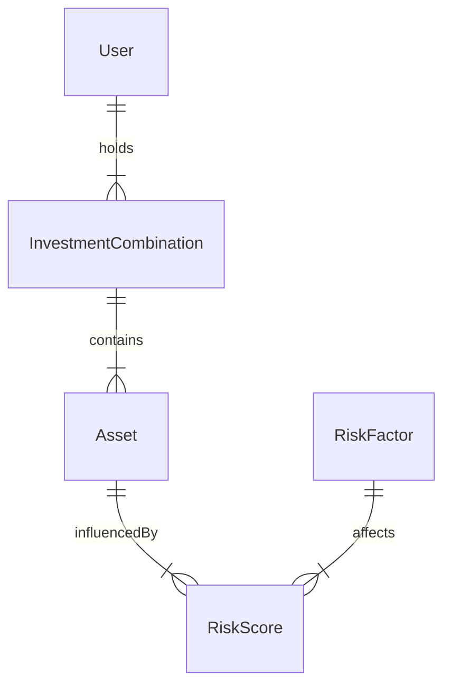

                 

# 构建智能化的个人投资组合风险分解系统

关键词：投资组合、风险分解、智能化、算法、Python源代码

摘要：本文将探讨如何构建一个智能化的个人投资组合风险分解系统。首先，我们介绍了投资组合、风险分解以及智能化的概念，并讨论了个人投资组合风险分解在投资决策中的重要性。接着，我们详细描述了风险分解的目标、关键挑战和核心要素。然后，我们介绍了智能化风险分解系统的基本原理、主要组成部分和工作流程，并探讨了系统的适用范围和限制因素。在此基础上，我们分析了个人投资组合风险分解系统的概念结构，并通过ER实体关系图展示了系统架构。随后，我们讲解了系统算法原理，包括数据预处理、模型选择、模型训练和模型评估等步骤。最后，我们通过Python源代码和数学模型与公式的讲解，进一步说明了智能化风险分解系统的实现和应用。

## 引言

### 第1章 引言

#### 1.1 问题背景

在现代投资环境中，个人投资组合的风险分解显得尤为重要。传统的投资组合风险分解方法主要依赖于历史数据和统计模型，虽然在一定程度上能够降低风险，但往往难以适应快速变化的市场环境。随着人工智能技术的不断发展，智能化风险分解系统应运而生，为投资者提供了一种更为高效、精准的风险管理工具。

#### 1.1.1 投资组合风险分解的现状

目前，投资组合风险分解主要集中在以下几个方面：

1. **历史数据分析**：通过分析历史数据，识别投资组合中的潜在风险因素，并进行风险评估。
2. **定量模型**：运用统计学、概率论等数学工具，建立风险分解模型，对投资组合进行风险量化。
3. **定性分析**：通过专家经验，对投资组合的风险进行定性评估。

尽管这些方法在一定程度上能够满足投资需求，但仍然存在以下不足：

- **滞后性**：传统方法往往难以适应市场的快速变化。
- **主观性**：专家经验难以量化，可能导致评估结果偏差。
- **计算复杂度**：风险分解过程涉及大量计算，效率较低。

#### 1.1.2 个人投资组合风险分解的重要性

个人投资组合风险分解在投资决策中具有至关重要的作用，主要体现在以下几个方面：

1. **风险识别**：通过风险分解，投资者可以更清晰地了解投资组合中的风险因素，从而有针对性地进行风险管理。
2. **风险控制**：智能化的风险分解系统可以帮助投资者识别潜在风险，提前采取应对措施，降低投资损失。
3. **投资优化**：基于风险分解的结果，投资者可以进行投资组合优化，提高投资回报率。

#### 1.1.3 风险分解在投资决策中的作用

风险分解在投资决策中发挥着关键作用，主要体现在以下几个方面：

1. **风险评估**：通过风险分解，投资者可以评估投资组合的整体风险水平，为投资决策提供依据。
2. **风险预警**：风险分解系统可以实时监测投资组合的风险状况，及时发现潜在风险，为投资者提供预警信息。
3. **投资组合优化**：基于风险分解的结果，投资者可以调整投资组合，降低风险，提高投资回报率。

### 1.2 问题描述

#### 1.2.1 风险分解的目标

风险分解的目标是识别投资组合中的风险因素，并将其分解为可量化的部分，以便进行有效的风险管理和投资决策。具体目标包括：

1. **全面性**：风险分解应覆盖投资组合的所有潜在风险因素。
2. **准确性**：风险分解结果应尽可能准确，以便投资者能够做出明智的投资决策。
3. **实时性**：风险分解应具备实时监测功能，以便投资者能够及时调整投资策略。

#### 1.2.2 风险分解的关键挑战

风险分解面临以下关键挑战：

1. **数据复杂性**：投资组合数据往往包含大量复杂的信息，如何有效地提取和利用这些信息成为一大挑战。
2. **算法选择**：现有算法在处理复杂投资组合时，可能存在效率低下、准确性不足等问题。
3. **模型解释性**：风险分解模型应具备良好的解释性，以便投资者理解风险分解结果，从而做出明智的投资决策。

#### 1.2.3 风险分解的关键要素

风险分解的关键要素包括：

1. **数据源**：风险分解的数据来源应多样化，包括历史数据、市场数据、公司财报等。
2. **算法**：风险分解的算法应具备良好的鲁棒性和适应性，能够处理复杂投资组合。
3. **模型**：风险分解模型应具备较高的准确性和解释性，以便投资者理解并利用风险分解结果。

### 1.3 问题解决

#### 1.3.1 智能化风险分解系统的基本原理

智能化风险分解系统基于人工智能技术，通过数据预处理、模型选择、模型训练和模型评估等步骤，实现对投资组合风险的智能化分解。其基本原理包括：

1. **数据预处理**：对投资组合数据进行分析和清洗，提取有效信息。
2. **模型选择**：根据投资组合的特点，选择合适的算法和模型。
3. **模型训练**：使用训练数据对模型进行训练，提高模型的准确性和解释性。
4. **模型评估**：对训练好的模型进行评估，确保其性能满足要求。

#### 1.3.2 智能化风险分解系统的主要组成部分

智能化风险分解系统主要包括以下组成部分：

1. **数据模块**：负责数据收集、清洗和整合。
2. **算法模块**：负责模型选择、模型训练和模型评估。
3. **用户界面**：提供用户操作界面，展示风险分解结果和投资建议。

#### 1.3.3 智能化风险分解系统的工作流程

智能化风险分解系统的工作流程包括以下步骤：

1. **数据收集**：从各种数据源收集投资组合数据。
2. **数据预处理**：对收集到的数据进行清洗和整合，提取有效信息。
3. **模型选择**：根据投资组合的特点，选择合适的算法和模型。
4. **模型训练**：使用预处理后的数据对模型进行训练。
5. **模型评估**：对训练好的模型进行评估，确保其性能满足要求。
6. **结果展示**：将风险分解结果和投资建议展示给用户。

#### 1.4 边界与外延

##### 1.4.1 风险分解系统的适用范围

风险分解系统主要适用于以下场景：

1. **个人投资者**：帮助个人投资者进行投资组合风险管理。
2. **机构投资者**：为机构投资者提供风险分解工具，辅助投资决策。

##### 1.4.2 风险分解系统的限制因素

风险分解系统存在以下限制因素：

1. **数据质量**：风险分解系统依赖于高质量的数据，数据质量直接影响系统的性能。
2. **模型适应性**：不同投资组合的特点可能导致模型适应性不足，影响系统性能。

##### 1.4.3 风险分解系统与其他投资工具的关联

风险分解系统可以与其他投资工具相结合，提高投资效率：

1. **量化投资**：风险分解系统可以为量化投资提供风险分析支持。
2. **智能投顾**：风险分解系统可以为智能投顾提供风险分解结果，辅助投资决策。

### 1.5 概念结构与核心要素组成

##### 1.5.1 投资组合的定义

投资组合是指投资者持有的一系列资产，包括股票、债券、基金等。投资组合的目的是通过资产配置，实现风险分散和收益最大化。

##### 1.5.2 风险的定义

风险是指投资组合在特定时间内，因市场波动、公司经营等原因导致的损失的可能性。风险分为系统性风险和非系统性风险。

##### 1.5.3 分解的定义

分解是指将一个复杂的问题或概念拆分为若干个简单的问题或概念，以便更好地理解和解决。

##### 1.5.4 智能化的定义

智能化是指利用人工智能技术，模拟人类智能，实现自动识别、学习、推理和决策。

##### 1.5.5 个人投资组合风险分解系统的核心要素

个人投资组合风险分解系统的核心要素包括：

1. **数据模块**：负责数据收集、清洗和整合。
2. **算法模块**：负责模型选择、模型训练和模型评估。
3. **用户界面**：提供用户操作界面，展示风险分解结果和投资建议。

##### 1.6 本章小结

本章介绍了个人投资组合风险分解系统的背景、重要性和关键要素。我们详细分析了风险分解的目标、关键挑战和核心要素，并介绍了智能化风险分解系统的基本原理和主要组成部分。通过本章的学习，读者可以初步了解个人投资组合风险分解系统的概念和实现方法。

## 第2章 核心概念与联系

### 2.1 投资组合的概念与属性

投资组合是指投资者持有的一系列资产，包括股票、债券、基金等。投资组合的目的是通过资产配置，实现风险分散和收益最大化。

#### 2.1.1 投资组合的定义

投资组合是由若干种不同资产组成的投资组合。这些资产可以是股票、债券、基金、房地产等。投资组合的目的是通过资产配置，实现风险分散和收益最大化。

#### 2.1.2 投资组合的种类

投资组合可以根据不同的标准进行分类，常见的分类方法包括：

1. **按投资标的分类**：股票投资组合、债券投资组合、基金投资组合、房地产投资组合等。
2. **按风险偏好分类**：保守型投资组合、稳健型投资组合、积极型投资组合、激进型投资组合等。
3. **按投资策略分类**：指数投资组合、主动投资组合、量化投资组合等。

#### 2.1.3 投资组合的属性

投资组合具有以下属性：

1. **多样性**：投资组合通过资产配置，实现风险分散，降低投资组合的整体风险。
2. **收益性**：投资组合通过资产配置，实现收益最大化。
3. **流动性**：投资组合的资产应具备良好的流动性，以便投资者在需要时能够快速变现。

### 2.2 风险的概念与属性

风险是指投资组合在特定时间内，因市场波动、公司经营等原因导致的损失的可能性。风险分为系统性风险和非系统性风险。

#### 2.2.1 风险的定义

风险是指投资组合在特定时间内，因市场波动、公司经营等原因导致的损失的可能性。风险可以分为以下几个方面：

1. **市场风险**：由于市场整体波动导致的投资组合损失的可能性。
2. **信用风险**：由于债务人违约导致的投资组合损失的可能性。
3. **流动性风险**：由于资产变现困难导致的投资组合损失的可能性。
4. **操作风险**：由于操作失误导致的投资组合损失的可能性。

#### 2.2.2 风险的种类

风险可以分为以下几个方面：

1. **系统性风险**：系统性风险是指整个市场或某一行业面临的风险，无法通过分散投资来消除。例如，经济衰退、政策变动等。
2. **非系统性风险**：非系统性风险是指特定企业或资产面临的风险，可以通过分散投资来降低。例如，公司业绩下滑、行业竞争加剧等。

#### 2.2.3 风险的属性

风险具有以下属性：

1. **不确定性**：风险的发生具有不确定性，投资者无法准确预测风险的发生时间和程度。
2. **可测性**：风险可以通过定量或定性的方法进行测量，以便投资者进行风险管理。
3. **可控性**：投资者可以通过风险分散、风险规避等手段，降低风险对投资组合的影响。

### 2.3 分解的概念与属性

分解是指将一个复杂的问题或概念拆分为若干个简单的问题或概念，以便更好地理解和解决。

#### 2.3.1 分解的定义

分解是指将一个复杂的问题或概念拆分为若干个简单的问题或概念，以便更好地理解和解决。分解可以分为以下几个方面：

1. **功能分解**：将一个复杂的功能拆分为多个简单的功能，以便更好地实现。
2. **结构分解**：将一个复杂的结构拆分为多个简单的结构，以便更好地理解。
3. **过程分解**：将一个复杂的过程拆分为多个简单的过程，以便更好地优化。

#### 2.3.2 分解的种类

分解可以分为以下几个方面：

1. **线性分解**：将一个复杂的问题或概念拆分为多个线性子问题或子概念，便于逐一解决。
2. **层次分解**：将一个复杂的问题或概念按照层次结构进行分解，从高层次到低层次逐一解决。
3. **模块分解**：将一个复杂的问题或概念拆分为多个功能模块，便于独立开发和维护。

#### 2.3.3 分解的属性

分解具有以下属性：

1. **简化性**：通过分解，可以将复杂问题简化为多个简单问题，降低解决问题的难度。
2. **灵活性**：通过分解，可以灵活调整问题的解决策略，适应不同场景。
3. **层次性**：通过分解，可以明确问题的层次结构，便于分层管理和优化。

### 2.4 智能化的概念与属性

智能化是指利用人工智能技术，模拟人类智能，实现自动识别、学习、推理和决策。

#### 2.4.1 智能化的定义

智能化是指利用人工智能技术，模拟人类智能，实现自动识别、学习、推理和决策。智能化可以分为以下几个方面：

1. **感知能力**：通过传感器等技术，获取环境信息，实现物体识别、图像识别等功能。
2. **学习能力**：通过机器学习等技术，从数据中学习知识，实现知识获取和更新。
3. **推理能力**：通过逻辑推理等技术，实现问题的求解和决策。
4. **决策能力**：通过优化算法等技术，实现最优决策。

#### 2.4.2 智能化的种类

智能化可以分为以下几个方面：

1. **弱人工智能**：弱人工智能是指具有特定任务能力的智能系统，例如语音识别、图像识别等。
2. **强人工智能**：强人工智能是指具有全面智能能力的智能系统，能够模拟人类的思维和行为。
3. **泛人工智能**：泛人工智能是指能够解决所有问题的人工智能系统，具有无限智能能力。

#### 2.4.3 智能化的属性

智能化具有以下属性：

1. **自主性**：智能化系统能够自主完成特定任务，无需人类干预。
2. **学习性**：智能化系统能够从数据中学习，不断提高任务完成能力。
3. **适应性**：智能化系统能够适应不同环境和任务，具备泛化能力。
4. **协作性**：智能化系统能够与其他系统协同工作，实现更高效的协作。

### 2.5 个人投资组合风险分解系统的概念结构

个人投资组合风险分解系统是指利用人工智能技术，对个人投资组合进行风险分解和管理的一套系统。其概念结构包括以下几个部分：

1. **数据模块**：负责数据收集、清洗和整合，为风险分解提供基础数据。
2. **算法模块**：负责模型选择、模型训练和模型评估，实现风险分解的核心功能。
3. **用户界面**：提供用户操作界面，展示风险分解结果和投资建议。
4. **数据库**：存储投资组合数据、风险分解结果和用户数据，为系统运行提供支持。

#### 2.5.1 系统架构

个人投资组合风险分解系统的架构包括以下几个层次：

1. **数据层**：负责数据的收集、存储和管理，为风险分解提供基础数据。
2. **算法层**：负责模型选择、模型训练和模型评估，实现风险分解的核心功能。
3. **应用层**：提供用户操作界面，展示风险分解结果和投资建议。
4. **接口层**：负责与其他系统进行数据交互，实现系统功能的扩展。

#### 2.5.2 系统功能模块

个人投资组合风险分解系统的主要功能模块包括：

1. **数据模块**：负责数据收集、清洗和整合，为风险分解提供基础数据。
2. **算法模块**：负责模型选择、模型训练和模型评估，实现风险分解的核心功能。
3. **用户界面模块**：提供用户操作界面，展示风险分解结果和投资建议。
4. **数据库模块**：存储投资组合数据、风险分解结果和用户数据，为系统运行提供支持。

#### 2.5.3 系统的核心要素

个人投资组合风险分解系统的核心要素包括：

1. **数据模块**：负责数据收集、清洗和整合，为风险分解提供基础数据。
2. **算法模块**：负责模型选择、模型训练和模型评估，实现风险分解的核心功能。
3. **用户界面模块**：提供用户操作界面，展示风险分解结果和投资建议。
4. **数据库模块**：存储投资组合数据、风险分解结果和用户数据，为系统运行提供支持。

### 2.6 ER实体关系图

ER（Entity-Relationship）实体关系图是一种用于表示数据模型中实体及其关系的图形化工具。在个人投资组合风险分解系统中，ER图可以直观地展示系统的数据模型和实体关系。

#### 2.6.1 实体定义

在个人投资组合风险分解系统中，主要实体定义如下：

1. **用户**：表示使用系统的投资者，包括用户ID、姓名、联系方式等属性。
2. **投资组合**：表示用户持有的资产组合，包括投资组合ID、名称、创建时间等属性。
3. **资产**：表示投资组合中的具体资产，包括资产ID、名称、市值等属性。
4. **风险因素**：表示影响投资组合风险的各种因素，包括风险因素ID、名称、影响程度等属性。
5. **风险评分**：表示对投资组合中各个资产的风险评分，包括评分ID、资产ID、风险因素ID、评分值等属性。

#### 2.6.2 关系定义

在个人投资组合风险分解系统中，主要实体之间的关系定义如下：

1. **用户与投资组合**：一个用户可以拥有多个投资组合，一个投资组合只能属于一个用户。
2. **投资组合与资产**：一个投资组合包含多个资产，一个资产只能属于一个投资组合。
3. **风险因素与风险评分**：一个风险因素可以影响多个资产的风险评分，一个风险评分只能属于一个风险因素。
4. **资产与风险评分**：一个资产可以有多个风险评分，一个风险评分只能属于一个资产。

#### 2.6.3 ER图绘制

根据上述实体定义和关系定义，可以绘制个人投资组合风险分解系统的ER图，如下所示：



### 2.7 本章小结

本章介绍了个人投资组合风险分解系统的核心概念和结构。我们详细分析了投资组合、风险分解、智能化等核心概念，并介绍了个人投资组合风险分解系统的概念结构、系统架构和ER实体关系图。通过本章的学习，读者可以全面了解个人投资组合风险分解系统的基本概念和实现方法。

## 第3章 算法原理讲解

### 3.1 数据预处理

在构建智能化的个人投资组合风险分解系统时，数据预处理是一个至关重要的环节。数据预处理包括数据清洗、数据整合和数据标准化，这些步骤有助于提高后续模型训练和评估的效果。

#### 3.1.1 数据清洗

数据清洗是指对原始数据进行处理，以消除错误、缺失、异常值等不利因素。具体步骤如下：

1. **去除重复数据**：确保每个数据点在数据集中唯一。
2. **填补缺失数据**：使用适当的插补方法（如平均值、中值、插值法等）填补缺失值。
3. **处理异常值**：识别并处理异常值，可以选择剔除、调整或保留。
4. **格式转换**：将不同格式或单位的数据转换为统一格式。

#### 3.1.2 数据整合

数据整合是将来自不同源的数据合并为一个统一的数据集。这通常涉及到以下任务：

1. **数据合并**：将同一类别的数据合并到一起。
2. **数据融合**：将不同数据源的信息整合起来，形成更全面的数据视图。
3. **数据标准化**：对数据进行规范化处理，使其适应特定的模型需求。

#### 3.1.3 数据标准化

数据标准化是指将不同特征的数据范围转换为统一的尺度，以便于模型训练和评估。常见的数据标准化方法包括：

1. **最小-最大标准化**：将数据缩放到[0, 1]区间。
   $$ x_{\text{standardized}} = \frac{x - x_{\text{min}}}{x_{\text{max}} - x_{\text{min}}} $$
2. **零-均值标准化**：将数据缩放到[-1, 1]区间。
   $$ x_{\text{standardized}} = \frac{x - \mu}{\sigma} $$
   其中，$\mu$ 是数据的均值，$\sigma$ 是数据的标准差。

### 3.2 模型选择

选择合适的模型是实现风险分解的关键步骤。模型选择取决于数据特性、问题复杂度和计算资源等因素。以下是几种常见的模型选择：

#### 3.2.1 传统模型的选择

传统模型包括线性回归、逻辑回归、决策树等。它们在处理简单问题时表现出色，但在处理复杂非线性问题时可能效果不佳。

1. **线性回归**：适用于线性关系的预测，如资产收益率的预测。
2. **逻辑回归**：适用于二分类问题，如判断资产是否面临风险。
3. **决策树**：适用于分类和回归问题，具有良好的可解释性。

#### 3.2.2 深度学习模型的选择

深度学习模型，尤其是神经网络，在处理复杂数据和模式识别方面表现出色。

1. **全连接神经网络（DNN）**：适用于需要高精度预测的任务。
2. **卷积神经网络（CNN）**：适用于图像和时序数据的处理。
3. **循环神经网络（RNN）**：适用于序列数据的处理，如股票价格预测。

#### 3.2.3 模型的适用性评估

在选择模型时，需要评估模型在不同数据集上的性能。常见的方法包括：

1. **交叉验证**：在训练集和验证集之间进行多次训练和验证，以评估模型的泛化能力。
2. **网格搜索**：通过遍历不同的参数组合，找到最优参数。
3. **A/B测试**：在实际环境中对比不同模型的性能。

### 3.3 模型训练

模型训练是构建风险分解系统的核心步骤，通过训练数据集，模型可以学习到数据中的潜在规律。以下是模型训练的基本步骤：

#### 3.3.1 数据集划分

数据集通常分为训练集、验证集和测试集。常见的数据集划分方法包括：

1. **随机划分**：随机将数据集划分为训练集和验证集。
2. **时间序列划分**：根据时间顺序将数据划分为训练集和验证集，以保持时间序列的特性。

#### 3.3.2 模型训练流程

模型训练流程通常包括以下步骤：

1. **初始化模型参数**：随机初始化模型的权重和偏置。
2. **前向传播**：计算输入数据的输出值。
3. **反向传播**：计算损失函数关于模型参数的梯度。
4. **参数更新**：根据梯度更新模型参数。
5. **迭代训练**：重复前向传播和反向传播，直到满足训练停止条件。

#### 3.3.3 模型优化技巧

模型优化包括以下几个方面：

1. **学习率调整**：通过调整学习率，控制模型参数更新的速度。
2. **批量大小调整**：通过调整批量大小，平衡训练时间和模型性能。
3. **正则化**：使用正则化方法（如L1、L2正则化）防止模型过拟合。
4. **数据增强**：通过数据增强方法，增加训练数据多样性。

### 3.4 模型评估

模型评估是验证模型性能的关键步骤。以下是几种常见的模型评估指标和方法：

#### 3.4.1 评估指标

1. **准确率（Accuracy）**：分类问题中的正确预测率。
2. **召回率（Recall）**：分类问题中被正确识别为正类的样本占总正类样本的比例。
3. **精确率（Precision）**：分类问题中被正确识别为正类的样本占总预测为正类的样本的比例。
4. **F1分数（F1 Score）**：精确率和召回率的调和平均。

#### 3.4.2 交叉验证

交叉验证是一种评估模型性能的有效方法，通过多次训练和验证，提高评估结果的可靠性。

1. **K折交叉验证**：将数据集划分为K个子集，每次使用其中一个子集作为验证集，其余子集作为训练集，重复K次。
2. **留一法交叉验证**：每次将一个样本作为验证集，其余样本作为训练集，重复多次。

#### 3.4.3 模型调优

模型调优包括以下步骤：

1. **超参数调整**：调整模型的超参数，如学习率、批量大小等。
2. **模型融合**：将多个模型的结果进行融合，提高预测准确性。

### 3.5 算法mermaid流程图

下面是一个简化的算法mermaid流程图，展示了模型训练和评估的基本流程：

```mermaid
graph TD
    A[数据预处理] --> B[模型选择]
    B --> C{是否训练}
    C -->|是 D[模型训练]
    C -->|否 E[模型评估]
    D --> F[模型评估]
    E --> G[模型调优]
    F -->|结束
    G -->|结束
```

### 3.6 Python源代码讲解

以下是使用Python实现风险分解系统的一个简化的示例代码，包括数据预处理、模型选择和训练等步骤。

```python
import numpy as np
import pandas as pd
from sklearn.model_selection import train_test_split
from sklearn.preprocessing import StandardScaler
from sklearn.neural_network import MLPClassifier
from sklearn.metrics import accuracy_score

# 数据预处理
def preprocess_data(data):
    # 数据清洗、填补缺失值、格式转换等
    data.fillna(data.mean(), inplace=True)
    return data

# 模型训练
def train_model(X_train, y_train):
    model = MLPClassifier(hidden_layer_sizes=(100,), max_iter=1000)
    model.fit(X_train, y_train)
    return model

# 模型评估
def evaluate_model(model, X_test, y_test):
    predictions = model.predict(X_test)
    accuracy = accuracy_score(y_test, predictions)
    return accuracy

# 加载数据
data = pd.read_csv('investment_data.csv')
preprocessed_data = preprocess_data(data)

# 数据集划分
X = preprocessed_data.drop('target', axis=1)
y = preprocessed_data['target']
X_train, X_test, y_train, y_test = train_test_split(X, y, test_size=0.2, random_state=42)

# 模型训练和评估
model = train_model(X_train, y_train)
accuracy = evaluate_model(model, X_test, y_test)
print(f'Model accuracy: {accuracy:.2f}')
```

### 3.7 数学模型与公式

在风险分解系统中，常用的数学模型包括线性回归模型和神经网络模型。以下是这些模型的定义和公式。

#### 3.7.1 线性回归模型

线性回归模型是一种简单但强大的预测模型，其公式如下：

$$
\hat{y} = \beta_0 + \beta_1 x
$$

其中，$\hat{y}$ 是预测值，$\beta_0$ 是截距，$\beta_1$ 是斜率，$x$ 是自变量。

#### 3.7.2 神经网络模型

神经网络模型是一种基于多层感知器的模型，其公式如下：

$$
\hat{y} = \sigma(\sum_{i=1}^{n} w_i \cdot a_i + b)
$$

其中，$\hat{y}$ 是预测值，$\sigma$ 是激活函数（如Sigmoid函数），$w_i$ 是权重，$a_i$ 是输入特征，$b$ 是偏置。

#### 3.7.3 公式推导

线性回归模型和神经网络模型的公式推导涉及微积分和概率论等知识，具体推导过程较为复杂。在此，我们简要介绍线性回归模型的推导过程。

假设我们有 $n$ 个样本，每个样本包含一个特征 $x$ 和一个标签 $y$。我们的目标是找到最佳拟合直线，使得预测值 $\hat{y}$ 最接近真实值 $y$。最佳拟合直线可以通过最小化平方误差函数来实现：

$$
J(\beta_0, \beta_1) = \frac{1}{2} \sum_{i=1}^{n} (\hat{y}_i - y_i)^2
$$

对 $J(\beta_0, \beta_1)$ 关于 $\beta_0$ 和 $\beta_1$ 分别求导，并令导数等于零，得到：

$$
\frac{\partial J}{\partial \beta_0} = -\sum_{i=1}^{n} (y_i - \hat{y}_i) = 0
$$

$$
\frac{\partial J}{\partial \beta_1} = -\sum_{i=1}^{n} (y_i - \hat{y}_i) x_i = 0
$$

解上述方程组，可以得到最佳拟合直线的参数 $\beta_0$ 和 $\beta_1$。

#### 3.7.4 举例说明

假设我们有以下两个样本：

$$
(x_1, y_1) = (1, 2)
$$

$$
(x_2, y_2) = (2, 3)
$$

我们可以使用线性回归模型来拟合这两个样本：

$$
\hat{y} = \beta_0 + \beta_1 x
$$

代入样本数据，得到：

$$
2 = \beta_0 + \beta_1
$$

$$
3 = \beta_0 + 2\beta_1
$$

解上述方程组，得到：

$$
\beta_0 = 1
$$

$$
\beta_1 = 1
$$

因此，最佳拟合直线为：

$$
\hat{y} = 1 + x
$$

### 3.8 本章小结

本章详细讲解了构建智能化个人投资组合风险分解系统的算法原理。我们从数据预处理、模型选择、模型训练、模型评估等方面进行了深入探讨，并提供了Python源代码和数学模型的例子。通过本章的学习，读者可以掌握构建风险分解系统的基本方法和技巧。

## 第4章 数学模型和数学公式 & 详细讲解 & 举例说明

### 4.1 数学模型定义

数学模型是利用数学语言和符号表示现实世界中复杂问题的一种方法。在构建智能化个人投资组合风险分解系统时，数学模型是理解和量化投资组合风险的关键工具。

#### 4.1.1 基本模型

基本模型通常包括线性模型和非线性模型。线性模型是最简单和最常用的模型之一，它通过线性关系来预测目标变量。一个简单的线性模型可以表示为：

$$
y = \beta_0 + \beta_1 x
$$

其中，$y$ 是目标变量，$x$ 是输入变量，$\beta_0$ 是截距，$\beta_1$ 是斜率。

#### 4.1.2 线性模型

线性模型是基本模型的一种扩展，它可以表示多个输入变量之间的线性关系。一个多变量的线性模型可以表示为：

$$
y = \beta_0 + \beta_1 x_1 + \beta_2 x_2 + \ldots + \beta_n x_n
$$

其中，$x_1, x_2, \ldots, x_n$ 是输入变量，$\beta_0, \beta_1, \beta_2, \ldots, \beta_n$ 是模型的参数。

#### 4.1.3 神经网络模型

神经网络模型是一种更复杂但更强大的模型，它通过非线性激活函数来捕捉输入变量和目标变量之间的复杂关系。一个简单的神经网络模型可以表示为：

$$
\hat{y} = \sigma(\sum_{i=1}^{n} w_i \cdot x_i + b)
$$

其中，$\hat{y}$ 是预测值，$\sigma$ 是激活函数（如Sigmoid函数），$w_i$ 是权重，$x_i$ 是输入变量，$b$ 是偏置。

### 4.2 公式推导

在构建风险分解系统时，数学公式的推导对于理解模型的内在逻辑和实现算法至关重要。

#### 4.2.1 基本公式

对于线性模型，基本公式包括：

$$
\beta_0 = \frac{1}{n} \sum_{i=1}^{n} (y_i - \beta_1 x_i)
$$

$$
\beta_1 = \frac{1}{n} \sum_{i=1}^{n} (x_i - \bar{x})(y_i - \bar{y})
$$

其中，$n$ 是样本数量，$y_i$ 和 $x_i$ 分别是第 $i$ 个样本的目标变量和输入变量，$\bar{x}$ 和 $\bar{y}$ 分别是输入变量和目标变量的均值。

#### 4.2.2 线性回归公式

对于多变量线性回归模型，基本公式包括：

$$
\beta_0 = \frac{1}{n} \sum_{i=1}^{n} (y_i - \sum_{j=1}^{n} \beta_j x_{ij})
$$

$$
\beta_j = \frac{1}{n} \sum_{i=1}^{n} (x_{ij} - \bar{x}_j)(y_i - \bar{y})
$$

其中，$x_{ij}$ 是第 $i$ 个样本的第 $j$ 个输入变量，$\bar{x}_j$ 和 $\bar{y}$ 分别是输入变量和目标变量的均值。

#### 4.2.3 神经网络公式

对于神经网络模型，基本公式包括：

$$
a_i = \sum_{j=1}^{n} w_{ji} \cdot x_{ij} + b_i
$$

$$
\hat{y} = \sigma(a)
$$

其中，$a_i$ 是第 $i$ 个神经元的输入，$w_{ji}$ 是连接权重，$x_{ij}$ 是第 $i$ 个样本的第 $j$ 个输入变量，$b_i$ 是偏置，$\sigma$ 是激活函数。

### 4.3 举例说明

为了更好地理解上述公式，我们将通过一个简单的线性回归模型和神经网络模型的例子来说明。

#### 4.3.1 线性回归模型例子

假设我们有一个简单的数据集，其中包含两个变量 $x$ 和 $y$，如下所示：

| x | y |
|---|---|
| 1 | 2 |
| 2 | 3 |
| 3 | 4 |

我们希望找到 $y$ 关于 $x$ 的线性关系，即：

$$
y = \beta_0 + \beta_1 x
$$

首先，我们需要计算输入变量和目标变量的均值：

$$
\bar{x} = \frac{1+2+3}{3} = 2
$$

$$
\bar{y} = \frac{2+3+4}{3} = 3
$$

然后，我们可以计算斜率 $\beta_1$：

$$
\beta_1 = \frac{1}{n} \sum_{i=1}^{n} (x_i - \bar{x})(y_i - \bar{y})
$$

$$
\beta_1 = \frac{1}{3} [(1-2)(2-3) + (2-2)(3-3) + (3-2)(4-3)] = 1
$$

接下来，我们可以计算截距 $\beta_0$：

$$
\beta_0 = \bar{y} - \beta_1 \bar{x} = 3 - 1 \cdot 2 = 1
$$

因此，线性回归模型可以表示为：

$$
y = 1 + x
$$

我们可以使用这个模型来预测新的 $y$ 值，例如当 $x=4$ 时：

$$
\hat{y} = 1 + 4 = 5
$$

#### 4.3.2 神经网络模型例子

假设我们有一个简单的神经网络模型，它包含一个输入层、一个隐藏层和一个输出层。输入层有一个神经元，隐藏层有两个神经元，输出层有一个神经元。激活函数为Sigmoid函数。模型的权重和偏置如下：

| 输入层 | 隐藏层1 | 隐藏层2 | 输出层 |
|--------|----------|----------|--------|
| $x_1$  | $w_{11}$ | $w_{12}$ | $w_{1o}$ |
|        | $w_{21}$ | $w_{22}$ | $w_{2o}$ |
|        | $w_{31}$ | $w_{32}$ | $w_{3o}$ |

假设输入数据为 $x_1 = 0.5$，我们可以计算隐藏层和输出层的输入：

$$
a_1 = w_{11} \cdot x_1 + w_{21} + w_{31} = 0.5 \cdot 0.5 + 0.5 + 0.5 = 1.25
$$

$$
a_2 = w_{12} \cdot x_1 + w_{22} + w_{32} = 0.5 \cdot 0.5 + 0.5 + 0.5 = 1.25
$$

然后，我们使用Sigmoid函数计算隐藏层的输出：

$$
h_1 = \sigma(a_1) = \frac{1}{1 + e^{-a_1}} = \frac{1}{1 + e^{-1.25}} \approx 0.88
$$

$$
h_2 = \sigma(a_2) = \frac{1}{1 + e^{-a_2}} = \frac{1}{1 + e^{-1.25}} \approx 0.88
$$

接下来，我们计算输出层的输入：

$$
a_o = w_{1o} \cdot h_1 + w_{2o} \cdot h_2 + w_{3o} = 0.5 \cdot 0.88 + 0.5 \cdot 0.88 + 0.5 = 1.44
$$

最后，我们使用Sigmoid函数计算输出层的输出：

$$
\hat{y} = \sigma(a_o) = \frac{1}{1 + e^{-a_o}} = \frac{1}{1 + e^{-1.44}} \approx 0.79
$$

因此，神经网络模型的输出为 $\hat{y} = 0.79$。

通过这个例子，我们可以看到如何使用数学模型和公式来构建和训练神经网络模型。这些模型和公式是构建智能化个人投资组合风险分解系统的基础。

### 4.4 本章小结

本章详细介绍了构建智能化个人投资组合风险分解系统的数学模型和数学公式，包括基本模型、线性模型和神经网络模型。我们通过举例说明了如何推导和计算这些模型。通过本章的学习，读者可以更好地理解数学模型在风险分解系统中的应用。这些知识和工具将为后续章节中的系统实现和实际应用提供坚实的基础。

