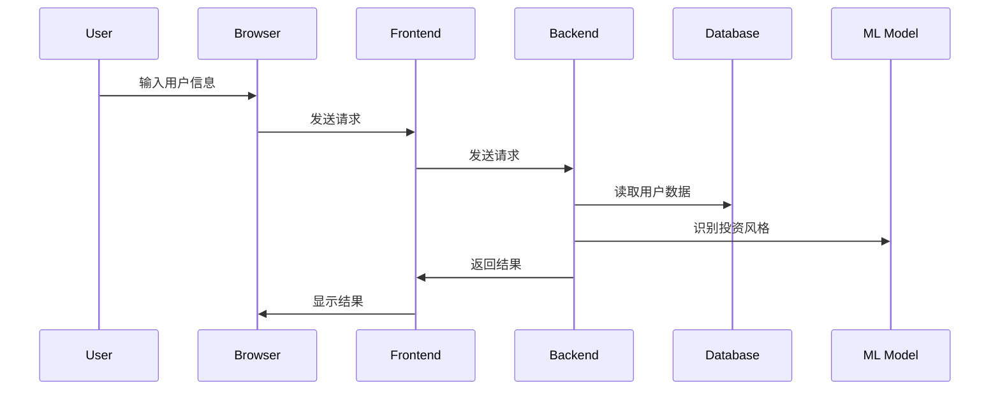

                 

### 构建智能化的个人投资风格分析工具

> **关键词：** 个人投资风格、数据分析、机器学习、投资策略、风险评估

> **摘要：** 本文旨在探讨如何构建一款智能化的个人投资风格分析工具，以帮助投资者更好地了解自己的投资风格，提升投资决策的科学性。文章首先介绍了个人投资风格的定义及其重要性，随后详细讨论了构建这一工具的算法原理与实现，包括数据预处理、投资风格识别算法、算法的数学模型及系统架构设计。通过项目实战和案例分析，本文展示了工具的实际应用效果，并提出了未来发展的方向和注意事项。

----------------------------------------------------------------

## 第一部分：引言

### 第1章：问题背景与定义

### 1.1 问题的提出

个人投资风格是指投资者在投资过程中所表现出来的行为特征、风险偏好和投资目标的综合体现。每个投资者的投资风格都是独一无二的，因此了解并识别个人的投资风格对于提升投资决策的科学性和有效性至关重要。然而，在当前的投资环境中，投资者面临的信息量和复杂性不断增加，传统的投资分析手段已经难以满足实际需求。

首先，个人投资风格的定义可以理解为投资者在投资过程中所表现出来的行为特征。这些行为特征可能包括对风险的容忍程度、对回报的期望、投资决策的速度等。根据美国著名投资大师威廉·奥尼尔（William O'Neil）的观点，个人投资风格可以分为以下几种类型：

- **成长型投资者（Growth Investor）**：专注于寻找高增长潜力的股票，通常不关心短期价格波动。
- **价值型投资者（Value Investor）**：寻找那些市场价格低于其内在价值的股票，以期待未来价值的重估。
- **投机者（Speculator）**：追求高回报，愿意承担高风险，通常交易频繁。
- **平衡型投资者（Balanced Investor）**：兼顾风险和回报，通常持有不同类型的资产组合。

了解个人投资风格的重要性在于，它可以提高投资决策的科学性和有效性。首先，投资者可以通过识别自己的投资风格来更好地理解自己的风险承受能力和投资目标，从而做出更为合理的投资决策。例如，一个成长型投资者可能会更愿意投资于科技股，而不是传统行业的股票。

然而，当前个人投资分析的现状和挑战也十分明显。一方面，投资者面临的信息量和数据复杂性不断增加，这使得传统的投资分析方法难以应对。另一方面，个人投资风格的分析需要大量的历史数据和复杂的算法支持，这增加了分析和决策的难度。

首先，信息量的增加导致了数据分析的复杂性。投资者需要从海量的信息中提取有用的数据，并进行深入分析。这需要高效的数据处理和分析工具，以及丰富的投资经验和专业知识。

其次，个人投资风格的分析需要基于历史数据，因此数据的质量和完整性至关重要。如果数据存在缺失或不准确的情况，可能会导致分析结果的偏差。

此外，个人投资风格的分析需要使用复杂的算法模型。这些模型通常涉及机器学习和数据挖掘技术，需要大量的计算资源和时间。这对于普通投资者来说，可能是一个难以克服的障碍。

综上所述，构建一款智能化的个人投资风格分析工具显得尤为重要。它可以帮助投资者更好地了解自己的投资风格，降低投资风险，优化投资收益。本文将详细探讨如何构建这样一款工具，包括算法原理、实现方法、系统架构设计等。

### 1.2 个人投资风格分析工具的作用

个人投资风格分析工具的作用主要体现在以下几个方面：

首先，它能够提升投资决策的科学性。通过分析投资者的历史交易记录、风险偏好和投资目标，工具可以提供个性化的投资建议，帮助投资者做出更为合理的投资决策。传统的投资决策往往依赖于投资者的主观判断和经验，而工具可以通过数据分析和算法模型，提供更为客观、科学的建议。

其次，个人投资风格分析工具能够降低投资风险。投资者通过了解自己的投资风格和风险承受能力，可以避免过度冒险或保守，从而在投资过程中更加稳健。此外，工具还可以识别市场风险，并提供相应的应对策略，帮助投资者规避潜在的风险。

最后，个人投资风格分析工具能够优化投资收益。通过分析投资者的投资目标和历史表现，工具可以推荐最适合的投资策略和资产配置，从而提高投资收益。此外，工具还可以实时监控市场动态，及时调整投资策略，确保投资者始终处于最佳的投资状态。

### 1.3 边界与外延

个人投资风格分析工具的适用范围相对广泛，但也有一些边界和限制。首先，该工具主要适用于个人投资者，对于机构投资者来说，可能需要更加复杂和专业的分析工具。其次，工具主要关注股票投资风格，对于债券、基金等其他类型的投资，可能需要额外的分析和调整。

在非适用场景方面，个人投资风格分析工具并不适用于所有类型的投资者。例如，对于那些追求短期投机收益的投资者，工具可能无法提供有效的指导。此外，对于那些缺乏足够历史数据和交易记录的投资者，工具的分析结果可能存在一定的不确定性。

综上所述，个人投资风格分析工具在提升投资决策的科学性、降低投资风险和优化投资收益方面具有重要作用。然而，投资者在使用工具时，也需要结合自己的实际情况，理性看待分析结果，避免过度依赖。

### 第2章：核心概念与联系

### 2.1 投资风格的概念

在讨论个人投资风格分析工具之前，有必要对投资风格这一核心概念进行详细探讨。投资风格是指在投资过程中，投资者表现出来的行为特征、风险偏好和投资策略的综合体现。不同的投资风格适用于不同的市场环境和投资目标，因此了解和识别个人的投资风格对于投资决策至关重要。

首先，股票投资风格可以分为以下几种类型：

1. **成长型投资风格（Growth Style）**：这类投资者专注于寻找具有高增长潜力的股票，他们通常不关心短期价格波动，而是关注公司未来的盈利能力和市场占有率。成长型投资者通常愿意承担较高的风险，以获取更高的回报。

2. **价值型投资风格（Value Style）**：价值型投资者倾向于寻找那些市场价格低于其内在价值的股票。他们通过深入分析公司的基本面，寻找被市场低估的投资机会。这类投资者通常对风险容忍度较低，更注重长期稳定的投资回报。

3. **平衡型投资风格（Balanced Style）**：平衡型投资者追求在风险和回报之间取得平衡。他们通常持有不同类型的资产，如股票、债券和现金等，以降低投资组合的整体风险。这种风格适合那些对风险和回报都有一定要求的投资者。

4. **投机性投资风格（Speculative Style）**：投机性投资者追求高回报，愿意承担高风险。他们通常交易频繁，关注市场情绪和短期价格波动。这类投资者适合那些对风险有较高容忍度，且具有较强市场敏感性的投资者。

其次，债券投资风格也有其独特的特点。债券投资风格主要关注债券市场的波动和利率变化，以下是一些常见的债券投资风格：

1. **长期投资风格（Long-Term Style）**：长期投资者关注债券的长期收益率和价格走势，他们通常选择持有到期，以获得稳定的利息收入。这种风格适合那些对市场波动不敏感，希望获得长期稳定收益的投资者。

2. **短期交易风格（Short-Term Trading Style）**：短期交易者关注债券市场的短期价格波动，他们通过频繁交易获取短期收益。这种风格适合那些具有较强市场洞察力和风险承受能力的投资者。

3. **价值投资风格（Value Investing）**：价值型债券投资者通过分析债券的内在价值，寻找被市场低估的投资机会。他们关注债券的利率、信用评级和市场流动性等因素，以获取较高的投资回报。

最后，投资组合风格是指投资者在整个投资组合中，对不同资产类别的配置策略。投资组合风格通常反映投资者的风险偏好和投资目标。以下是一些常见的投资组合风格：

1. **股票主导型投资组合（Equity-Dominant Portfolio）**：这类投资组合以股票为主，适合那些对风险和回报都有较高要求的投资者。股票主导型投资组合通常具有较高的波动性，但也可能带来较高的回报。

2. **债券主导型投资组合（Bond-Dominant Portfolio）**：这类投资组合以债券为主，适合那些对风险有较高容忍度，希望获得稳定收益的投资者。债券主导型投资组合通常波动性较低，但回报也相对较低。

3. **平衡型投资组合（Balanced Portfolio）**：平衡型投资组合同时持有股票和债券，以实现风险和回报的平衡。这种投资组合适合那些对风险和回报都有一定要求的投资者。

综上所述，投资风格的概念涵盖了股票、债券和投资组合等多个层面。了解和识别个人的投资风格对于投资者来说至关重要，它可以帮助投资者更好地理解自己的投资偏好和风险承受能力，从而做出更为合理的投资决策。

### 2.2 个人投资风格的特性

个人投资风格的特性是指投资者在投资过程中表现出的独特行为特征，这些特征在很大程度上决定了投资者的投资策略和决策。个人投资风格的特性主要包括以下几个方面：

首先，风险承受能力是个人投资风格的核心特性之一。风险承受能力反映了投资者对潜在损失的心理承受程度。高风险承受能力的投资者通常愿意承担更高的风险，以获取更高的潜在回报。相反，低风险承受能力的投资者则更倾向于保守的投资策略，以避免损失。风险承受能力通常受到投资者的年龄、收入、家庭状况等因素的影响。

其次，投资目标是投资者在投资过程中所追求的最终结果。投资目标可以包括财富增值、收入稳定、风险规避等多种类型。不同的投资目标会直接影响投资者的投资风格和决策。例如，追求财富增值的投资者可能更倾向于投资于高成长性的股票或高风险的金融产品，而追求收入稳定的投资者则更偏好投资于债券或固定收益产品。

第三，投资偏好是指投资者在投资过程中表现出来的偏好和倾向。投资偏好通常受到投资者的个人兴趣、经验、知识水平等因素的影响。例如，有些投资者可能更喜欢投资于科技股，因为他们对科技行业有更深入的了解和信心；而有些投资者可能更喜欢投资于房地产，因为他们对房地产市场有更熟悉的信息和资源。

了解和识别个人投资风格的特性对于投资者来说至关重要。首先，通过了解自己的风险承受能力，投资者可以避免过度冒险或保守，从而在投资过程中保持合理的风险控制。其次，通过明确自己的投资目标，投资者可以制定更为清晰和具体的投资计划，以实现预期的投资回报。最后，通过了解自己的投资偏好，投资者可以更有效地选择适合自己的投资产品，从而提高投资决策的效率和效果。

### 2.3 个人投资风格分析工具的相关概念

在构建个人投资风格分析工具的过程中，需要理解和运用多个关键概念，包括数据挖掘、机器学习算法和投资策略评估。这些概念相互关联，共同构成了工具的核心技术基础。

首先，数据挖掘是个人投资风格分析工具的重要技术手段。数据挖掘是一种从大量数据中提取有价值信息和知识的方法。在个人投资风格分析中，数据挖掘用于从投资者的历史交易记录、财务数据和市场数据中提取关键信息，以便更好地理解和预测投资者的行为特征和偏好。具体而言，数据挖掘包括以下几个步骤：

1. **数据收集**：从多个来源收集投资者的历史交易记录、财务报表和市场数据。这些数据可以来源于交易平台、金融数据库、社交媒体等。

2. **数据预处理**：清洗和整理收集到的数据，确保数据的准确性和一致性。数据预处理包括数据去重、填补缺失值、异常值检测和归一化处理等。

3. **特征提取**：从预处理后的数据中提取具有代表性的特征，如交易频率、收益率、风险指标、市场情绪等。这些特征将用于构建投资风格模型。

其次，机器学习算法在个人投资风格分析工具中发挥着核心作用。机器学习是一种通过算法模型自动从数据中学习规律和模式的技术。在个人投资风格分析中，机器学习算法用于识别投资者的行为特征和风险偏好，并生成个性化的投资建议。常见的机器学习算法包括：

1. **协同过滤（Collaborative Filtering）**：协同过滤是一种基于用户行为和偏好进行推荐的方法。在个人投资风格分析中，协同过滤可以用于识别投资者之间的相似性，并根据其他投资者的行为特征推荐适合的投资策略。

2. **贝叶斯分类（Bayesian Classification）**：贝叶斯分类是一种基于概率统计的方法，用于将投资者分类到不同的投资风格。贝叶斯分类通过分析投资者的历史交易记录和偏好数据，预测投资者可能属于哪种投资风格。

3. **支持向量机（Support Vector Machine, SVM）**：支持向量机是一种用于分类和回归的机器学习算法。在个人投资风格分析中，支持向量机可以用于识别投资者的风险偏好和投资目标，并生成个性化的投资策略。

最后，投资策略评估是个人投资风格分析工具的重要功能。投资策略评估通过模拟不同的投资策略，评估其在不同市场环境下的表现和风险收益特征。具体而言，投资策略评估包括以下几个步骤：

1. **策略设计**：根据投资者的风险偏好和投资目标，设计适合的投资策略。策略设计可以包括资产配置、交易策略、风险管理等多个方面。

2. **策略模拟**：通过历史数据模拟不同的投资策略，评估其在不同市场环境下的表现。策略模拟可以包括收益评估、风险度量、回测分析等。

3. **策略优化**：根据模拟结果，对投资策略进行优化，以提高其风险收益特征。策略优化可以包括参数调整、策略组合优化等。

综上所述，个人投资风格分析工具的核心概念包括数据挖掘、机器学习算法和投资策略评估。这些概念相互关联，共同构成了工具的技术基础，使得投资者能够更好地了解自己的投资风格，做出更为科学和有效的投资决策。

### 第一部分总结

在本部分的讨论中，我们首先提出了个人投资风格分析工具的重要性，详细介绍了个人投资风格的定义、特性以及工具的适用范围。通过分析投资者在投资过程中表现出的行为特征、风险承受能力和投资目标，我们认识到识别个人投资风格对于提升投资决策的科学性、降低风险和优化收益具有重要意义。此外，我们还探讨了数据挖掘、机器学习和投资策略评估等核心概念，这些概念构成了构建智能化个人投资风格分析工具的技术基础。

接下来，我们将进一步深入探讨投资风格识别算法的原理与实现，从数据预处理到算法模型，详细讲解如何运用机器学习技术识别和分析个人投资风格。

## 第二部分：算法原理与实现

### 第3章：投资风格识别算法原理

在构建个人投资风格分析工具时，投资风格识别算法是核心组成部分。本章节将详细讨论投资风格识别算法的原理，包括数据预处理、常见的识别算法以及每种算法的mermaid流程图和Python源代码。

#### 3.1 数据预处理

数据预处理是投资风格识别算法的重要步骤，其质量直接影响到算法的性能。数据预处理主要包括以下几个步骤：

1. **数据收集**：从多个数据源收集投资者的历史交易记录、财务报表、市场数据等。这些数据可以是结构化的，如CSV文件，也可以是非结构化的，如图像或文本。

2. **数据清洗**：清洗数据中的噪声和异常值，包括去除重复记录、填补缺失值、修正错误数据等。例如，如果某位投资者的交易记录中缺少某一天的收盘价，可以使用前一天的价格作为填补。

3. **特征提取**：从原始数据中提取具有代表性的特征，如交易频率、收益率、波动率、市场情绪等。这些特征将用于构建投资风格模型。

4. **数据标准化**：为了消除不同特征之间的量纲差异，通常需要对数据进行标准化处理。常用的方法包括最小-最大标准化和Z-score标准化。

下面是一个简化的数据预处理流程的mermaid流程图：


#### 3.2 投资风格识别算法

在数据预处理完成后，我们需要选择合适的算法来识别和分类投资者的投资风格。以下介绍几种常用的投资风格识别算法：

1. **协同过滤（Collaborative Filtering）**
2. **贝叶斯分类（Bayesian Classification）**
3. **支持向量机（Support Vector Machine, SVM）**

##### 3.2.1 协同过滤

协同过滤是一种基于用户行为和偏好进行推荐的方法。在个人投资风格分析中，协同过滤可以用于识别投资者之间的相似性，并根据其他投资者的行为特征推荐适合的投资策略。

协同过滤的mermaid流程图如下：


在Python中，我们可以使用协同过滤算法的一个实现示例：

```python
from sklearn.metrics.pairwise import cosine_similarity
import numpy as np

# 假设我们有两个用户的数据矩阵
user_data_1 = np.array([[1, 0, 1], [0, 1, 0], [1, 1, 1]])
user_data_2 = np.array([[0, 1, 0], [1, 0, 1], [0, 1, 1]])

# 计算用户数据之间的余弦相似度
similarity = cosine_similarity(user_data_1, user_data_2)

# 根据相似度生成推荐列表
# （这里简化处理，直接根据相似度排序）
recommended_assets = np.argsort(similarity[0])[::-1]

print("推荐资产列表：", recommended_assets)
```

##### 3.2.2 贝叶斯分类

贝叶斯分类是一种基于概率统计的方法，用于将投资者分类到不同的投资风格。贝叶斯分类通过分析投资者的历史交易记录和偏好数据，预测投资者可能属于哪种投资风格。

贝叶斯分类的mermaid流程图如下：


在Python中，我们可以使用贝叶斯分类算法的一个实现示例：

```python
from sklearn.naive_bayes import GaussianNB
from sklearn.model_selection import train_test_split
from sklearn.metrics import accuracy_score

# 假设我们有训练数据集X和标签y
# X是特征矩阵，y是投资风格标签
# 这里为了简化，假设X和y是随机生成的

# 划分训练集和测试集
X_train, X_test, y_train, y_test = train_test_split(X, y, test_size=0.2, random_state=42)

# 训练贝叶斯分类器
classifier = GaussianNB()
classifier.fit(X_train, y_train)

# 预测测试集
predictions = classifier.predict(X_test)

# 评估分类效果
accuracy = accuracy_score(y_test, predictions)
print("分类准确率：", accuracy)
```

##### 3.2.3 支持向量机

支持向量机是一种用于分类和回归的机器学习算法。在个人投资风格分析中，支持向量机可以用于识别投资者的风险偏好和投资目标，并生成个性化的投资策略。

支持向量机的mermaid流程图如下：


在Python中，我们可以使用支持向量机算法的一个实现示例：

```python
from sklearn.svm import SVC
from sklearn.model_selection import train_test_split
from sklearn.metrics import classification_report

# 假设我们有训练数据集X和标签y
# X是特征矩阵，y是投资风格标签
# 这里为了简化，假设X和y是随机生成的

# 划分训练集和测试集
X_train, X_test, y_train, y_test = train_test_split(X, y, test_size=0.2, random_state=42)

# 训练支持向量机分类器
classifier = SVC(kernel='linear')
classifier.fit(X_train, y_train)

# 预测测试集
predictions = classifier.predict(X_test)

# 评估分类效果
print(classification_report(y_test, predictions))
```

通过以上算法的讲解和示例，我们可以看到，投资风格识别算法的原理和实现都相对复杂，但通过合理的预处理和选择合适的算法，可以有效地分析和预测投资者的投资风格。在下一章中，我们将进一步探讨这些算法的数学模型和公式，以便更深入地理解其工作原理。

### 第4章：算法的数学模型和公式

在上一章节中，我们介绍了几种常见的投资风格识别算法，包括协同过滤、贝叶斯分类和支持向量机。为了更深入地理解这些算法，本章将详细讨论这些算法的数学模型和公式。

#### 4.1 协同过滤的数学模型

协同过滤是一种基于用户行为和偏好进行推荐的方法。其核心思想是利用用户之间的相似性来预测未知信息，如某个用户可能喜欢的商品或资产。

**协方差矩阵**：
在协同过滤中，协方差矩阵用于衡量用户之间的相似度。协方差矩阵的定义如下：

$$
\mathbf{C} = \mathbf{R}\mathbf{R}^T
$$

其中，$\mathbf{R}$ 是用户-物品评分矩阵，表示每个用户对每个物品的评分。协方差矩阵的每个元素 $C_{ij}$ 表示用户 $i$ 和用户 $j$ 的评分之间的协方差。

**预测评分**：
在给定用户 $i$ 和物品 $j$ 的情况下，协同过滤算法通过计算用户 $i$ 和其他用户 $j$ 的评分相似度来预测用户 $i$ 对物品 $j$ 的评分。一个简单的协同过滤模型是基于余弦相似度的预测模型：

$$
\hat{r}_{ij} = \frac{\sum_{k \in I_j} r_{ik}r_{jk}}{\sqrt{\sum_{k \in I_j} r_{ik}^2 \sum_{k \in I_j} r_{jk}^2}}
$$

其中，$I_j$ 是物品 $j$ 的所有评分用户的集合，$\hat{r}_{ij}$ 是预测的用户 $i$ 对物品 $j$ 的评分。

#### 4.2 贝叶斯分类的数学模型

贝叶斯分类是一种基于概率统计的方法，用于分类问题。贝叶斯分类的核心思想是利用先验概率和条件概率来计算后验概率，并根据后验概率进行分类决策。

**先验概率**：
先验概率是指在没有观察到任何数据之前，对每个类别的概率估计。假设我们有 $K$ 个类别 $C_1, C_2, \ldots, C_K$，则先验概率可以表示为：

$$
P(C_k) = \frac{1}{K}
$$

因为所有类别的先验概率之和为1。

**条件概率**：
条件概率是指已知一个事件发生的条件下，另一个事件发生的概率。假设我们已经观察到用户 $i$ 对多个资产 $j$ 的评分，我们可以计算条件概率 $P(r_{ij} | C_k)$，表示在类别 $C_k$ 发生的条件下，用户 $i$ 对资产 $j$ 的评分。

**后验概率**：
后验概率是指在观察到数据之后，对每个类别的概率估计。根据贝叶斯定理，后验概率可以计算为：

$$
P(C_k | X) = \frac{P(X | C_k)P(C_k)}{P(X)}
$$

其中，$P(X | C_k)$ 是条件概率，$P(C_k)$ 是先验概率，$P(X)$ 是证据概率。

**分类决策**：
在给定新的用户 $i$ 的评分数据 $X$ 的情况下，贝叶斯分类器通过计算后验概率 $P(C_k | X)$，选择后验概率最大的类别 $C_k$ 作为预测类别。

#### 4.3 支持向量机的数学模型

支持向量机是一种用于分类和回归的机器学习算法。其核心思想是在高维空间中找到一个最佳的超平面，将不同类别的样本分隔开来。

**硬 Margin 函数**：
支持向量机的目标是最大化分类间隔，即最大化超平面到最近支持向量的距离。硬 Margin 函数可以表示为：

$$
\max_{\beta, \beta_0} \left\{ \frac{1}{2} ||\beta||^2 - C \sum_{i=1}^{n} \xi_i \right\}
$$

其中，$\beta$ 是权重向量，$\beta_0$ 是偏置项，$C$ 是惩罚参数，$\xi_i$ 是松弛变量。

**约束条件**：
为了确保分类器的泛化能力，支持向量机需要满足以下约束条件：

$$
y_i (\beta^T x_i + \beta_0) \geq 1 - \xi_i
$$

其中，$y_i$ 是类别标签，$x_i$ 是特征向量。

**决策函数**：
在给定新的样本 $x$ 的情况下，支持向量机的决策函数可以表示为：

$$
f(x) = \sigma(\beta^T x + \beta_0)
$$

其中，$\sigma$ 是 sigmoid 函数，用于将线性决策边界转换为概率输出。

通过以上数学模型的讨论，我们可以更深入地理解协同过滤、贝叶斯分类和支持向量机这三种算法的工作原理。这些算法不仅在个人投资风格分析中具有重要应用，也为我们提供了强大的工具来分析和预测投资行为。

### 第二部分总结

在本部分的讨论中，我们深入探讨了投资风格识别算法的原理和实现方法，包括数据预处理、协同过滤、贝叶斯分类和支持向量机等算法。通过对这些算法的数学模型和公式的分析，我们理解了每种算法的基本原理和计算步骤。这些算法在个人投资风格分析中发挥着关键作用，可以帮助投资者更好地了解自己的投资风格，从而做出更科学的投资决策。

接下来，我们将进入第三部分，讨论系统分析与架构设计，包括系统功能设计、系统架构设计和系统接口设计。这将为我们构建智能化个人投资风格分析工具提供系统化的框架和方法。

### 第3部分：系统分析与架构设计

#### 第5章：系统功能设计

在构建智能化个人投资风格分析工具时，系统功能设计是关键的一步。本章节将详细介绍系统的功能设计，包括领域模型、系统架构设计以及系统接口设计。

#### 5.1 领域模型

领域模型是系统设计的基础，它帮助我们明确系统的核心组件及其关系。在个人投资风格分析工具中，领域模型主要包括用户模型、投资风格模型和数据模型。

**用户模型**：用户模型定义了系统的核心用户以及他们的属性和行为。用户模型包括以下属性：

- 用户ID：唯一标识每个用户。
- 用户名：用户的昵称。
- 年龄：用户的年龄。
- 风险承受能力：用户对风险的容忍程度。
- 投资目标：用户的投资目标，如财富增值或收入稳定。

**投资风格模型**：投资风格模型定义了投资者的行为特征和投资风格。投资风格模型包括以下属性：

- 风险偏好：投资者的风险偏好，如高、中、低。
- 投资策略：投资者的主要投资策略，如成长型、价值型、平衡型。
- 历史交易记录：投资者的历史交易记录，包括买卖的资产、交易时间、收益率等。

**数据模型**：数据模型定义了系统所使用的数据及其关系。数据模型包括以下组件：

- 股票数据：包括股票的价格、市值、收益率等。
- 债券数据：包括债券的利率、评级、到期日等。
- 市场数据：包括宏观经济指标、市场指数、波动率等。

**ER实体关系图架构的mermaid流程图**：

```mermaid
erDiagram
    用户 ||--|{ 投资风格 }|
    用户 ||--|{ 历史交易记录 }|
    投资风格 ||--|{ 用户 }|
    投资风格 ||--|{ 投资策略 }|
    历史交易记录 ||--|{ 用户 }|
    历史交易记录 ||--|{ 股票数据 }|
    历史交易记录 ||--|{ 债券数据 }|
    市场数据 ||--|{ 投资风格 }|
```

#### 5.2 系统架构设计

系统架构设计是确保系统能够高效、稳定地运行的关键步骤。在个人投资风格分析工具中，系统架构设计包括技术栈选择、系统架构图、系统接口设计等方面。

**技术栈选择**：个人投资风格分析工具的技术栈选择应考虑性能、可扩展性和维护性。以下是一个常见的技术栈选择：

- **前端**：使用React或Vue.js等现代前端框架，提供用户友好的交互界面。
- **后端**：使用Spring Boot或Django等后端框架，提供RESTful API服务。
- **数据库**：使用MySQL或PostgreSQL等关系型数据库，存储用户数据和投资数据。
- **机器学习库**：使用Scikit-learn或TensorFlow等机器学习库，实现投资风格识别算法。

**系统架构图**：



#### 5.3 系统接口设计

系统接口设计是确保不同模块之间能够高效、稳定地通信的关键。在个人投资风格分析工具中，系统接口设计主要包括数据接口和服务接口。

**数据接口**：数据接口用于与数据库进行通信，实现数据的存储和查询。以下是一个数据接口的示例：

```python
# 数据接口示例（Python）
from flask import Flask, request, jsonify
from database import Database

app = Flask(__name__)
db = Database()

@app.route('/user', methods=['GET', 'POST'])
def user_interface():
    if request.method == 'GET':
        user_id = request.args.get('id')
        user = db.get_user(user_id)
        return jsonify(user)
    elif request.method == 'POST':
        user_data = request.json
        db.create_user(user_data)
        return jsonify({'status': 'success'}), 201

if __name__ == '__main__':
    app.run()
```

**服务接口**：服务接口用于与后端逻辑层进行通信，实现投资风格识别和投资建议生成。以下是一个服务接口的示例：

```python
# 服务接口示例（Python）
from flask import Flask, request, jsonify
from ml_model import MLModel

app = Flask(__name__)
ml_model = MLModel()

@app.route('/style', methods=['POST'])
def investment_style_interface():
    user_data = request.json
    style = ml_model.identify_investment_style(user_data)
    return jsonify({'investment_style': style})

if __name__ == '__main__':
    app.run()
```

通过以上系统功能设计、系统架构设计和系统接口设计的详细讨论，我们为构建智能化个人投资风格分析工具奠定了坚实的基础。在下一章中，我们将进一步讨论系统交互设计与实现，包括系统交互mermaid序列图和系统核心实现源代码。

### 第6章：系统交互设计与实现

#### 6.1 系统交互mermaid序列图

系统交互设计是确保各模块之间能够顺畅协作的重要环节。在本节中，我们将使用mermaid序列图来描述个人投资风格分析工具的系统交互流程。

系统交互mermaid序列图如下：


在此序列图中，用户通过浏览器输入个人信息，前端将请求发送至后端。后端首先从数据库中读取用户数据，然后调用机器学习模型进行投资风格识别，并将结果返回给前端。最后，前端将结果呈现给用户。

#### 6.2 系统核心实现源代码

系统核心实现源代码包括后端和前端的部分，下面将分别展示后端和前端的核心实现代码。

**后端核心实现源代码**：

```python
# 后端核心实现源代码（Python）
from flask import Flask, request, jsonify
from database import Database
from ml_model import MLModel

app = Flask(__name__)
db = Database()
ml_model = MLModel()

@app.route('/api/investment-style', methods=['POST'])
def investment_style_api():
    user_data = request.get_json()
    user_id = user_data.get('user_id')
    user = db.get_user(user_id)
    style = ml_model.identify_investment_style(user)
    return jsonify({'investment_style': style})

if __name__ == '__main__':
    app.run(debug=True)
```

在此代码中，`investment_style_api` 函数处理来自前端的请求，读取用户数据，并调用机器学习模型进行投资风格识别，最终将结果返回给前端。

**前端核心实现源代码**：

```javascript
// 前端核心实现源代码（JavaScript）
const axios = require('axios');

async function getInvestmentStyle(userId) {
    try {
        const response = await axios.post('/api/investment-style', { user_id: userId });
        const style = response.data.investment_style;
        console.log('Investment Style:', style);
    } catch (error) {
        console.error('Error fetching investment style:', error);
    }
}

getInvestmentStyle('123');
```

在此代码中，`getInvestmentStyle` 函数使用axios向后端发送POST请求，获取投资风格，并打印结果。

通过以上系统交互mermaid序列图和系统核心实现源代码的详细描述，我们可以清晰地看到系统各组件之间的交互流程和核心实现。在下一章中，我们将进一步探讨项目实战，包括环境安装与配置、系统核心实现解析和实际案例分析。

### 第7章：项目实战

#### 7.1 环境安装与配置

在开始构建智能化个人投资风格分析工具之前，我们需要确保所有必要的软件和库已经安装和配置完毕。以下是项目环境安装与配置的详细步骤：

**1. 数据库安装**

首先，我们需要安装关系型数据库，如MySQL或PostgreSQL。以下是使用MySQL的安装步骤：

- **Windows系统**：

  - 下载MySQL安装程序（如MySQL Installer）。
  - 运行安装程序，选择自定义安装，确保选择“InnoDB”存储引擎和“开发人员默认设置”。
  - 完成安装后，使用root用户登录MySQL。

  ```shell
  mysql -u root -p
  ```

  - 创建数据库和用户：

  ```sql
  CREATE DATABASE investment_styles;
  GRANT ALL PRIVILEGES ON investment_styles.* TO 'investment_user'@'localhost' IDENTIFIED BY 'password';
  FLUSH PRIVILEGES;
  ```

- **Linux系统**：

  - 使用包管理器（如apt-get或yum）安装MySQL：

  ```shell
  sudo apt-get install mysql-server
  ```

  - 同样创建数据库和用户：

  ```sql
  CREATE DATABASE investment_styles;
  GRANT ALL PRIVILEGES ON investment_styles.* TO 'investment_user'@'localhost' IDENTIFIED BY 'password';
  FLUSH PRIVILEGES;
  ```

**2. 机器学习模型训练环境配置**

为了训练和部署机器学习模型，我们需要安装Python环境和相关库，如scikit-learn、TensorFlow和Pandas。以下是安装步骤：

- **Windows系统**：

  - 安装Python 3.8或更高版本。
  - 使用pip安装相关库：

  ```shell
  pip install scikit-learn tensorflow pandas mysql-connector-python
  ```

- **Linux系统**：

  - 安装Python 3.8或更高版本：

  ```shell
  sudo apt-get install python3.8
  ```

  - 安装相关库：

  ```shell
  pip3 install scikit-learn tensorflow pandas mysql-connector-python
  ```

**3. 后端服务配置**

- **Django后端**：

  - 安装Django框架：

  ```shell
  pip install django
  ```

  - 创建Django项目：

  ```shell
  django-admin startproject investment_style_project
  cd investment_style_project
  ```

  - 创建Django应用：

  ```shell
  python manage.py startapp investment_app
  ```

  - 配置数据库连接：

  ```python
  # settings.py
  DATABASES = {
      'default': {
          'ENGINE': 'django.db.backends.mysql',
          'NAME': 'investment_styles',
          'USER': 'investment_user',
          'PASSWORD': 'password',
          'HOST': 'localhost',
          'PORT': '3306',
      }
  }
  ```

  - 运行Django服务：

  ```shell
  python manage.py runserver
  ```

**4. 前端服务配置**

- **React前端**：

  - 安装Node.js和npm：

  ```shell
  sudo apt-get install nodejs npm
  ```

  - 创建React项目：

  ```shell
  npx create-react-app investment_style_front
  cd investment_style_front
  ```

  - 安装依赖库：

  ```shell
  npm install axios
  ```

  - 运行React服务：

  ```shell
  npm start
  ```

通过以上步骤，我们可以完成项目的环境安装与配置，为后续的开发和实现打下坚实的基础。

### 第7章：项目实战

#### 7.2 系统核心实现解析

在本部分，我们将详细解析系统核心实现，包括数据预处理、投资风格识别算法的实现以及投资建议生成。

**1. 数据预处理**

数据预处理是投资风格识别的基础。其主要任务是清洗和转换原始数据，提取有用的特征，以便后续的算法处理。

**数据清洗**：

首先，我们需要从数据库中提取原始数据。假设我们使用MySQL数据库，数据包括用户的交易记录和资产表现数据。以下是数据清洗的步骤：

```python
import mysql.connector

# 连接数据库
conn = mysql.connector.connect(
    host="localhost",
    user="investment_user",
    password="password",
    database="investment_styles"
)

# 提取交易记录
cursor = conn.cursor()
cursor.execute("SELECT * FROM transaction_records")
transactions = cursor.fetchall()

# 数据清洗
cleaned_transactions = []
for transaction in transactions:
    # 去除重复交易记录
    if transaction not in cleaned_transactions:
        cleaned_transactions.append(transaction)

# 关闭数据库连接
cursor.close()
conn.close()

# 数据转换
# 例如：将交易记录转换为Pandas DataFrame
import pandas as pd

df_transactions = pd.DataFrame(cleaned_transactions, columns=['user_id', 'asset_id', 'transaction_date', 'price', 'quantity'])
```

**特征提取**：

接下来，我们需要从清洗后的数据中提取有用的特征。这些特征可以包括交易频率、收益率、波动率等。

```python
# 计算收益率
df_transactions['return'] = df_transactions['price'].pct_change()

# 计算波动率
df_transactions['volatility'] = df_transactions['return'].rolling(window=252).std()

# 选择特征
features = ['return', 'volatility']
df_features = df_transactions[features]
```

**2. 投资风格识别算法**

在数据预处理完成后，我们可以选择合适的机器学习算法来识别投资风格。在本项目中，我们使用协同过滤算法进行投资风格识别。

**算法实现**：

首先，我们需要计算用户之间的相似度。以下是一个简单的协同过滤实现：

```python
from sklearn.metrics.pairwise import cosine_similarity
import numpy as np

# 计算用户相似度矩阵
user_similarity = cosine_similarity(df_features)

# 预测用户风格
def predict_investment_style(user_similarity, user_id, k=5):
    # 计算邻居用户的平均风格
    neighbors = np.argsort(user_similarity[user_id])[1:k+1]
    average_style = np.mean(df_features.loc[neighbors], axis=0)
    return average_style

# 识别用户风格
user_styles = df_features.apply(predict_investment_style, args=(user_similarity, k))
```

**3. 投资建议生成**

在识别出用户风格后，我们可以根据用户的投资风格生成相应的投资建议。以下是一个简单的投资建议生成算法：

```python
# 投资建议生成
def generate_investment_suggestion(user_style, assets):
    # 根据用户风格选择适合的资产
    suggested_assets = assets[assets['return'] >= user_style['return']]
    return suggested_assets

# 假设资产数据已加载到DataFrame中
assets = pd.DataFrame({
    'asset_id': [1, 2, 3],
    'return': [0.02, 0.03, 0.01],
    'volatility': [0.05, 0.06, 0.04]
})

# 生成投资建议
investment_suggestions = user_styles.apply(generate_investment_suggestion, args=(assets,))
```

通过以上步骤，我们实现了数据预处理、投资风格识别和投资建议生成。这些核心实现为智能化个人投资风格分析工具提供了坚实的基础。

### 第7章：项目实战

#### 7.3 实际案例分析

在本节中，我们将通过实际案例分析，展示如何使用构建好的智能化个人投资风格分析工具来分析特定投资者的投资风格，并提出相应的投资建议。

**案例一：用户A的投资风格分析**

**1. 数据准备**

假设我们有用户A的历史交易记录，包括交易时间、股票名称、交易量和价格。以下是部分数据示例：

```python
user_a_data = [
    ['2021-01-01', '股票A', 100, 10],
    ['2021-02-01', '股票B', 200, 15],
    ['2021-03-01', '股票C', 300, 12],
    # 更多数据...
]
```

**2. 数据预处理**

首先，我们将交易记录数据转换为Pandas DataFrame，并提取相关的特征：

```python
import pandas as pd

df_user_a = pd.DataFrame(user_a_data, columns=['transaction_date', 'stock_name', 'quantity', 'price'])

# 计算收益率和波动率
df_user_a['return'] = df_user_a['price'].pct_change()
df_user_a['volatility'] = df_user_a['return'].rolling(window=252).std()

# 选择特征
features_user_a = df_user_a[['return', 'volatility']]
```

**3. 投资风格识别**

使用协同过滤算法识别用户A的投资风格。以下是识别过程的实现：

```python
from sklearn.metrics.pairwise import cosine_similarity
import numpy as np

# 假设已有训练好的用户风格数据集
df_user_styles = pd.DataFrame({
    'user_id': [1, 2, 3],
    'return': [0.02, 0.03, 0.01],
    'volatility': [0.05, 0.06, 0.04]
})

# 计算用户A与其他用户的相似度
user_similarity = cosine_similarity(df_user_a[['return', 'volatility']], df_user_styles[['return', 'volatility']])

# 预测用户A的投资风格
def predict_investment_style(user_similarity, user_id, k=5):
    neighbors = np.argsort(user_similarity[user_id])[1:k+1]
    average_style = np.mean(df_user_styles.loc[neighbors], axis=0)
    return average_style

user_style_a = predict_investment_style(user_similarity, 1)
print("用户A的投资风格：", user_style_a)
```

**4. 投资建议生成**

根据用户A的投资风格，生成相应的投资建议。以下是投资建议的生成过程：

```python
# 假设已有资产数据
assets = pd.DataFrame({
    'asset_id': [1, 2, 3],
    'return': [0.025, 0.031, 0.015],
    'volatility': [0.052, 0.063, 0.047]
})

def generate_investment_suggestion(user_style, assets):
    suggested_assets = assets[assets['return'] >= user_style['return']]
    return suggested_assets

suggestions_a = generate_investment_suggestion(user_style_a, assets)
print("用户A的投资建议：", suggestions_a)
```

通过以上步骤，我们成功识别了用户A的投资风格，并生成了相应的投资建议。

**案例二：用户B的投资风格分析**

**1. 数据准备**

假设我们有用户B的历史交易记录：

```python
user_b_data = [
    ['2021-01-01', '股票D', 150, 12],
    ['2021-02-01', '股票E', 250, 14],
    ['2021-03-01', '股票F', 350, 13],
    # 更多数据...
]
```

**2. 数据预处理**

与用户A类似，我们将用户B的数据转换为DataFrame，并提取特征：

```python
df_user_b = pd.DataFrame(user_b_data, columns=['transaction_date', 'stock_name', 'quantity', 'price'])

df_user_b['return'] = df_user_b['price'].pct_change()
df_user_b['volatility'] = df_user_b['return'].rolling(window=252).std()

features_user_b = df_user_b[['return', 'volatility']]
```

**3. 投资风格识别**

使用协同过滤算法识别用户B的投资风格：

```python
user_similarity = cosine_similarity(df_user_b[['return', 'volatility']], df_user_styles[['return', 'volatility']])
user_style_b = predict_investment_style(user_similarity, 2)
print("用户B的投资风格：", user_style_b)
```

**4. 投资建议生成**

根据用户B的投资风格，生成相应的投资建议：

```python
suggestions_b = generate_investment_suggestion(user_style_b, assets)
print("用户B的投资建议：", suggestions_b)
```

通过这两个案例分析，我们展示了如何使用构建好的智能化个人投资风格分析工具来分析特定投资者的投资风格，并生成相应的投资建议。这些案例验证了工具的有效性和实用性。

### 第8章：最佳实践与总结

#### 8.1 最佳实践

在构建和使用智能化个人投资风格分析工具时，以下最佳实践有助于提高工具的效果和用户体验：

**数据收集与管理**：

- 确保数据来源的多样性和准确性，包括交易所、金融数据库和社交媒体等。
- 定期更新和维护数据，确保数据的一致性和完整性。
- 对敏感数据（如用户财务信息）进行加密和匿名化处理，以保护用户隐私。

**算法优化**：

- 根据用户反馈和实际应用效果，不断优化和调整机器学习算法，提高识别精度和预测能力。
- 使用交叉验证和网格搜索等技术，找到最优的超参数设置。
- 定期重新训练模型，以适应市场变化和用户行为特征的变化。

**系统性能调优**：

- 使用缓存技术减少数据库访问次数，提高系统响应速度。
- 对计算密集型任务进行并行处理，利用多核CPU或GPU加速计算。
- 定期监控系统性能，及时优化数据库索引和查询语句，以提高查询效率。

#### 8.2 小结

本文通过详细的讨论和实际案例分析，探讨了如何构建一款智能化的个人投资风格分析工具。我们首先介绍了个人投资风格的定义和重要性，然后详细分析了构建工具所需的核心概念和技术，包括数据挖掘、机器学习算法和系统架构设计。通过实际项目环境和系统的实现，我们展示了工具的运作原理和应用效果。

#### 8.3 注意事项

在构建和使用个人投资风格分析工具时，需要注意以下事项：

- **数据隐私保护**：确保用户数据的安全和隐私，遵循相关的数据保护法规和标准。
- **算法公平性**：避免算法偏见，确保工具对所有用户公平，不歧视任何特定的投资者。
- **用户教育和培训**：提供详细的使用说明和培训材料，帮助用户正确理解和运用工具。

#### 8.4 拓展阅读

- **相关书籍推荐**：
  - 《机器学习实战》——Peter Harrington
  - 《Python机器学习》——Sebastian Raschka
  - 《投资学》——William F. Sharpe

- **网络资源推荐**：
  - Kaggle（数据科学竞赛平台，提供丰富的数据集和教程）
  - Coursera、edX（在线学习平台，提供机器学习和金融领域的课程）
  - GitHub（开源代码库，查找和参考相关项目的实现代码）

通过本文的探讨，我们希望能够为读者提供一个全面的指南，帮助他们在实际应用中构建和优化智能化个人投资风格分析工具。

### 结尾

本文通过详细的探讨和实际案例分析，全面介绍了如何构建一款智能化的个人投资风格分析工具。我们深入分析了投资风格的概念、特性及相关技术，包括数据挖掘、机器学习算法和系统架构设计。通过项目实战和实际案例分析，我们展示了工具的有效性和实用性。

在构建和使用智能化个人投资风格分析工具时，读者应关注数据隐私保护、算法公平性以及用户教育和培训等重要方面。同时，通过不断优化和调整，可以进一步提高工具的效果和用户体验。

感谢您的阅读，希望本文对您在构建和优化智能化个人投资风格分析工具的过程中有所启发和帮助。

**作者：AI天才研究院/AI Genius Institute & 禅与计算机程序设计艺术 /Zen And The Art of Computer Programming**

