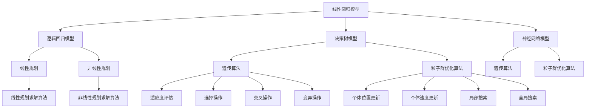
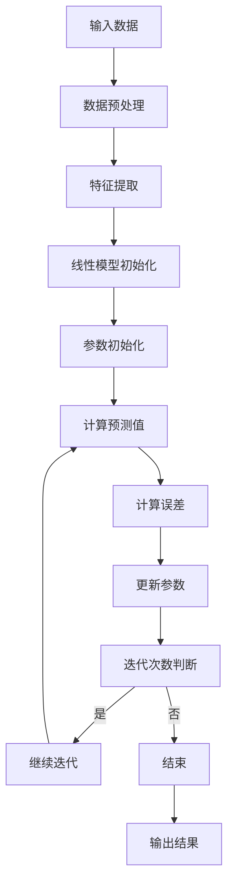
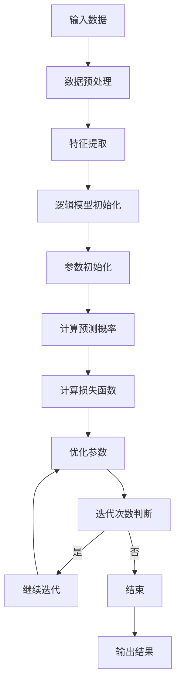
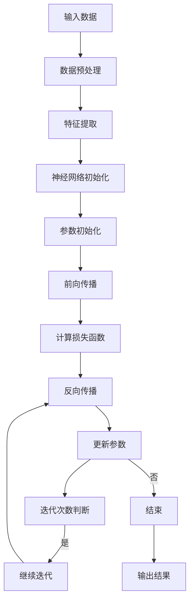

                 

### 第1章 引言

#### 1.1 问题背景

资产证券化是一种将不易变现的资产转化为可流通证券的金融技术，它通过将资产打包成证券，使投资者能够通过购买这些证券来获得资产产生的现金流。这种金融创新不仅为投资者提供了多样化的投资选择，也为企业融资提供了新的途径。然而，资产证券化的过程往往伴随着较高的信用风险，因为资产的质量直接影响到证券的信用等级和投资者的收益。

信用增级是解决资产证券化信用风险的关键手段之一。信用增级机构通过购买信用保护，为资产支持证券（ABS）提供额外的信用保障，从而提高ABS的信用等级和降低投资者的风险。信用增级优化模型的目标是最大化信用增级的效果，同时控制成本和风险。

#### 1.2 问题描述

构建智能化的资产证券化信用增级优化模型主要面临以下几个问题：

1. **数据复杂性**：资产证券化涉及大量的数据，包括资产质量、市场风险、宏观经济指标等，如何有效地收集、整理和处理这些数据是构建优化模型的基础。
2. **模型准确性**：优化模型需要准确预测资产的未来表现和风险，这要求模型能够捕捉到资产复杂的行为特征，并考虑市场的不确定性。
3. **成本效益**：信用增级需要投入一定的成本，优化模型需要在提高信用增级效果的同时，尽量降低成本，实现成本效益最大化。
4. **实时性**：市场状况不断变化，优化模型需要具备实时调整能力，以应对市场的快速变化。

#### 1.3 问题解决思路

为了解决上述问题，我们可以采取以下步骤：

1. **数据预处理**：通过数据清洗、去噪、归一化等技术，确保数据质量，为模型构建提供可靠的数据基础。
2. **特征工程**：从原始数据中提取有用的特征，构建能够反映资产质量和风险的特征向量。
3. **模型选择**：根据资产证券化的特点，选择合适的数学模型和机器学习算法，如线性回归、决策树、神经网络等。
4. **模型优化**：通过交叉验证、网格搜索等技术，优化模型的参数，提高模型的预测准确性和稳定性。
5. **实时调整**：建立实时数据采集和模型更新机制，根据市场变化实时调整模型，确保模型始终适应市场环境。

#### 1.4 边界与外延

在构建信用增级优化模型时，需要明确以下边界和外部影响因素：

1. **数据来源**：数据来源的可靠性和完整性直接影响模型的质量，因此需要确保数据来源的权威性和准确性。
2. **市场波动**：市场的波动性对资产表现有着重要影响，模型需要考虑市场的突发性变化，以提高模型的适应性。
3. **政策法规**：信用增级涉及到金融政策法规，模型构建需要符合相关政策法规的要求。
4. **技术发展**：随着人工智能、大数据等技术的发展，优化模型的算法和工具也在不断更新，模型构建需要关注技术的前沿动态。

#### 1.5 核心概念

1. **资产证券化**：将资产转化为可流通证券的金融过程。
2. **信用增级**：提高资产支持证券信用等级的金融手段。
3. **优化模型**：用于最大化信用增级效果和成本效益的数学模型。
4. **特征工程**：从数据中提取有助于预测的特征。
5. **机器学习算法**：用于数据分析和模式识别的算法。

#### 1.6 本书结构

本书将分为六个主要章节，系统介绍构建智能化资产证券化信用增级优化模型的理论基础、模型构建方法、优化算法、应用案例和实践经验。具体章节如下：

- **第1章 引言**：介绍资产证券化、信用增级和优化模型的基本概念。
- **第2章 基本概念**：详细解释资产证券化、信用增级和优化模型的定义、作用和类型。
- **第3章 理论基础**：阐述相关数学模型和算法原理。
- **第4章 模型构建**：介绍模型构建的具体步骤和技巧。
- **第5章 优化算法**：分析常见优化算法的实现流程和性能。
- **第6章 应用案例**：通过具体案例展示优化模型的应用。

通过本书的阅读，读者将能够全面了解构建智能化资产证券化信用增级优化模型的方法和技巧，掌握从理论到实践的全过程。

---

### 第2章 基本概念

#### 2.1 资产证券化的定义

资产证券化（Asset-Backed Securitization）是指将企业持有的各类资产（如应收账款、抵押贷款、信用卡债务等）打包成证券，出售给投资者的过程。这些证券通常被称为资产支持证券（Asset-Backed Securities, ABS）。资产证券化的核心是将难以变现的资产转化为可流通的证券，从而为企业和投资者提供融资和投资的新途径。

资产证券化的主要参与者包括：

1. **发起人**：原始资产的持有者，通常是金融机构或企业。
2. **特殊目的机构（SPV）**：设立用于持有、管理和发行ABS的实体，通常是独立于发起人的。
3. **投资者**：购买ABS的机构或个人。
4. **信用增级机构**：为ABS提供信用保障，提高其信用等级的机构。
5. **服务机构**：负责管理原始资产、收取现金流并分配给投资者的机构。

#### 2.2 信用增级的作用

信用增级（Credit Enhancement）是提高资产支持证券（ABS）信用等级的重要手段。信用增级机构通过购买信用保护，为ABS提供额外的信用保障，从而降低投资者的风险，提高ABS的市场吸引力。信用增级的作用主要体现在以下几个方面：

1. **提高信用等级**：信用增级机构通常拥有较高的信用评级，通过购买信用保护，可以使ABS获得更高的信用等级，降低信用风险。
2. **降低投资者风险**：信用增级为投资者提供了额外的保障，即使原始资产表现不佳，投资者仍然可以获得部分或全部的本金和收益。
3. **增加市场吸引力**：高信用等级的ABS更容易被投资者接受，有利于增加市场需求，提高发行效率。
4. **降低融资成本**：高信用等级的ABS可以以更低的利率发行，从而降低企业的融资成本。

#### 2.3 优化模型的类型

优化模型在信用增级中的应用可以分为以下几类：

1. **线性优化模型**：基于线性规划的方法，通过最小化成本或最大化收益，优化信用增级策略。
2. **非线性优化模型**：适用于资产表现具有复杂非线性特征的情况，如非线性规划（NLP）、动态规划等。
3. **机器学习优化模型**：利用机器学习算法，如决策树、随机森林、神经网络等，通过学习历史数据，预测最优的信用增级策略。
4. **模拟优化模型**：通过模拟资产表现和市场需求，优化信用增级策略，如蒙特卡洛模拟、代理模型等。

#### 2.4 相关术语解释

为了更好地理解资产证券化和信用增级，以下是几个关键术语的解释：

1. **资产支持证券（ABS）**：以各类资产为支持，发行的证券化产品。
2. **信用风险**：指由于资产表现不佳或信用违约导致投资者损失的风险。
3. **信用等级**：评估ABS信用风险的等级，通常由信用评级机构提供。
4. **信用保护**：信用增级机构为ABS提供的保障措施，如信用保证、超额抵押等。
5. **超额收益**：信用增级机构从信用保护中获得高于市场平均水平的收益。
6. **风险平价**：在构建信用增级策略时，通过调整资产组合，使整体风险保持在一个可接受的水平。

#### 2.5 概念属性特征对比表

以下是资产证券化、信用增级和优化模型的主要概念属性特征对比：

| 概念           | 特征                      |  
| -------------- | ----------------------- |  
| 资产证券化     | - 转化资产为证券  
| - 提供融资途径  
| - 提高资产流动性 |  
| 信用增级       | - 提高信用等级  
| - 降低投资者风险  
| - 增加市场吸引力 |  
| 优化模型       | - 线性优化、非线性优化、机器学习优化、模拟优化 |  
| - 最小化成本、最大化收益 |

通过对比可以看出，资产证券化、信用增级和优化模型在提高资产流动性和降低风险方面具有显著的作用，但它们的实现方式和目标有所不同。

#### 2.6 概念联系与关系图

为了更好地理解这些概念之间的联系，我们可以通过一个ER实体关系图来展示它们之间的关系：

```mermaid
erDiagram
  ABS ||--o> 发起人
  ABS ||--o> 投资者
  ABS ||--o> 特殊目的机构(SPV)
  ABS ||--o> 信用增级机构
  ABS ||--o> 服务机构
  ABS ||--|> 信用保护
  ABS ||--|> 信用风险
  ABS ||--|> 信用等级
  ABS ||--|> 风险平价
  ABS ||--|> 超额收益
```

在这个ER图中，ABS与发起人、投资者、特殊目的机构（SPV）、信用增级机构、服务机构之间存在直接的关联，同时ABS也与信用保护、信用风险、信用等级、风险平价和超额收益等概念有直接关系。这有助于我们全面了解资产证券化、信用增级和优化模型在金融体系中的作用和相互关系。

---

### 第3章 理论基础

#### 3.1 相关数学模型

在构建智能化资产证券化信用增级优化模型时，需要运用一系列数学模型来描述资产表现、信用风险和优化目标。以下是一些常用的数学模型：

1. **线性回归模型**：线性回归模型是一种最简单的预测模型，通过建立资产表现与信用风险之间的线性关系，预测未来的信用风险。其数学模型可以表示为：

   $$ y = \beta_0 + \beta_1x_1 + \beta_2x_2 + ... + \beta_nx_n + \epsilon $$

   其中，$y$ 表示信用风险，$x_1, x_2, ..., x_n$ 表示资产表现的特征，$\beta_0, \beta_1, ..., \beta_n$ 为模型的参数，$\epsilon$ 为误差项。

2. **逻辑回归模型**：逻辑回归模型是一种分类模型，用于预测资产是否会发生违约。其数学模型可以表示为：

   $$ \ln\left(\frac{p}{1-p}\right) = \beta_0 + \beta_1x_1 + \beta_2x_2 + ... + \beta_nx_n $$

   其中，$p$ 表示资产发生违约的概率，$\beta_0, \beta_1, ..., \beta_n$ 为模型的参数。

3. **决策树模型**：决策树模型通过一系列的决策节点，将资产表现和信用风险划分为不同的类别。其数学模型可以表示为：

   $$ \text{if } x_1 \text{ then } y_1, \text{ else if } x_2 \text{ then } y_2, ..., \text{ else } y_n $$

   其中，$x_1, x_2, ..., x_n$ 表示资产表现的特征，$y_1, y_2, ..., y_n$ 表示信用风险的类别。

4. **神经网络模型**：神经网络模型通过模拟人脑的神经元结构，对资产表现和信用风险进行复杂的学习和预测。其数学模型可以表示为：

   $$ z = \sigma(\beta_0 + \beta_1x_1 + \beta_2x_2 + ... + \beta_nx_n) $$

   其中，$z$ 表示预测的信用风险，$\sigma$ 为激活函数，$\beta_0, \beta_1, ..., \beta_n$ 为模型的参数。

#### 3.2 常用算法原理

在构建优化模型时，常用的算法包括线性规划、非线性规划、遗传算法、粒子群优化算法等。以下简要介绍这些算法的基本原理：

1. **线性规划（Linear Programming, LP）**：线性规划是一种解决线性优化问题的数学方法，其目标是在满足一组线性不等式约束条件下，最大化或最小化一个线性目标函数。线性规划的基本原理可以通过单纯形法或内点法来求解。

   目标函数：
   $$ \min\ z = c^T x $$
   
   约束条件：
   $$ Ax \leq b $$
   $$ x \geq 0 $$
   
   其中，$c$ 为目标函数的系数，$A$ 和 $b$ 分别为约束矩阵和约束向量，$x$ 为决策变量。

2. **非线性规划（Nonlinear Programming, NLP）**：非线性规划是一种解决非线性优化问题的数学方法，其目标是在满足一组非线性约束条件下，最大化或最小化一个非线性目标函数。非线性规划比线性规划更复杂，常用的求解方法包括梯度下降法、牛顿法和序列二次规划法等。

   目标函数：
   $$ \min\ z(x) $$
   
   约束条件：
   $$ f_i(x) \leq 0, \forall i $$
   $$ g_i(x) = 0, \forall i $$
   
   其中，$z(x)$ 为目标函数，$f_i(x)$ 和 $g_i(x)$ 分别为不等式约束和等式约束。

3. **遗传算法（Genetic Algorithm, GA）**：遗传算法是一种模拟自然进化的全局搜索算法，适用于解决复杂的优化问题。遗传算法通过模拟生物进化过程中的遗传、变异和选择等过程，逐步优化解空间中的个体。遗传算法的基本原理包括编码、适应度评估、选择、交叉和变异等。

4. **粒子群优化算法（Particle Swarm Optimization, PSO）**：粒子群优化算法是一种基于群体智能的优化算法，通过模拟鸟群觅食行为，优化解空间中的个体。粒子群优化算法的基本原理包括个体位置和速度更新、适应度评估、局部和全局搜索等。

#### 3.3 概念联系与关系图

为了更好地理解这些数学模型和算法之间的关系，我们可以通过一个Mermaid流程图来展示它们的基本流程：



在这个Mermaid流程图中，不同的数学模型和算法通过箭头连接，表示它们之间的联系和依赖关系。线性回归、逻辑回归、决策树和神经网络模型是构建优化模型的基础，而线性规划和非线性规划用于解决优化问题，遗传算法和粒子群优化算法则是优化模型的求解算法。

通过这个关系图，我们可以清晰地看到各个概念和算法在构建智能化资产证券化信用增级优化模型中的角色和作用。

#### 3.4 数学模型与公式讲解

在本章节中，我们将详细讲解几个常用的数学模型，并给出相应的公式及其含义。这些模型包括线性回归、逻辑回归和神经网络，它们在构建信用增级优化模型中具有重要作用。

##### 1. 线性回归模型

线性回归模型是一种简单的预测模型，用于建立因变量（信用风险）与自变量（资产特征）之间的线性关系。其基本公式如下：

$$ y = \beta_0 + \beta_1x_1 + \beta_2x_2 + ... + \beta_nx_n + \epsilon $$

- $y$：因变量，表示信用风险。
- $x_1, x_2, ..., x_n$：自变量，表示资产特征。
- $\beta_0, \beta_1, ..., \beta_n$：模型的参数，表示自变量对因变量的影响程度。
- $\epsilon$：误差项，表示模型未能解释的部分。

在资产证券化信用增级优化中，我们可以使用线性回归模型来预测信用风险，从而优化信用增级策略。例如，假设我们有以下资产特征：债务期限（$x_1$）、债务余额（$x_2$）和借款人信用评分（$x_3$），则线性回归模型的公式可以表示为：

$$ y = \beta_0 + \beta_1x_1 + \beta_2x_2 + \beta_3x_3 + \epsilon $$

通过训练模型，我们可以得到参数$\beta_0, \beta_1, \beta_2, \beta_3$的估计值，从而预测未来的信用风险。

##### 2. 逻辑回归模型

逻辑回归模型是一种用于分类问题的预测模型，用于预测资产是否会发生违约。其基本公式如下：

$$ \ln\left(\frac{p}{1-p}\right) = \beta_0 + \beta_1x_1 + \beta_2x_2 + ... + \beta_nx_n $$

- $p$：预测的概率，表示资产发生违约的概率。
- $\beta_0, \beta_1, ..., \beta_n$：模型的参数，表示自变量对预测概率的影响程度。

通过对公式两边进行指数运算，我们可以得到：

$$ \frac{p}{1-p} = e^{\beta_0 + \beta_1x_1 + \beta_2x_2 + ... + \beta_nx_n} $$

$$ p = \frac{e^{\beta_0 + \beta_1x_1 + \beta_2x_2 + ... + \beta_nx_n}}{1 + e^{\beta_0 + \beta_1x_1 + \beta_2x_2 + ... + \beta_nx_n}} $$

逻辑回归模型通过计算资产特征的概率分布，从而预测资产是否会发生违约。例如，假设我们有以下资产特征：债务期限（$x_1$）、债务余额（$x_2$）和借款人信用评分（$x_3$），则逻辑回归模型的公式可以表示为：

$$ \ln\left(\frac{p}{1-p}\right) = \beta_0 + \beta_1x_1 + \beta_2x_2 + \beta_3x_3 $$

通过训练模型，我们可以得到参数$\beta_0, \beta_1, \beta_2, \beta_3$的估计值，从而预测资产违约的概率。

##### 3. 神经网络模型

神经网络模型是一种基于人工神经网络的预测模型，用于处理复杂的数据关系。其基本公式如下：

$$ z = \sigma(\beta_0 + \beta_1x_1 + \beta_2x_2 + ... + \beta_nx_n) $$

- $z$：预测的信用风险。
- $\sigma$：激活函数，常用的有Sigmoid函数、ReLU函数等。
- $\beta_0, \beta_1, ..., \beta_n$：模型的参数。

神经网络模型通过多层神经元之间的连接，对输入数据进行复杂的变换和预测。例如，假设我们有以下资产特征：债务期限（$x_1$）、债务余额（$x_2$）和借款人信用评分（$x_3$），则神经网络模型的公式可以表示为：

$$ z = \sigma(\beta_0 + \beta_1x_1 + \beta_2x_2 + \beta_3x_3) $$

通过训练模型，我们可以得到参数$\beta_0, \beta_1, \beta_2, \beta_3$的估计值，从而预测信用风险。

综上所述，线性回归、逻辑回归和神经网络模型在资产证券化信用增级优化中具有重要作用。通过这些模型，我们可以从数据中提取有用的信息，预测资产的表现和信用风险，从而优化信用增级策略。在实际应用中，可以根据具体问题和数据特点选择合适的模型，以提高预测的准确性和稳定性。

#### 3.5 算法mermaid流程图

为了更好地理解优化算法的实现流程，我们将使用Mermaid语法绘制几种常用算法的流程图，包括线性回归、逻辑回归和神经网络。

##### 1. 线性回归算法流程图



此流程图展示了线性回归算法的基本步骤：首先输入数据并进行预处理，提取特征后初始化线性模型和参数。接着，计算预测值并计算误差，根据误差更新参数，重复迭代直到达到预设的迭代次数或误差阈值，最后输出结果。

##### 2. 逻辑回归算法流程图



逻辑回归算法的流程图与线性回归类似，但涉及计算预测概率和损失函数。首先进行数据预处理和特征提取，初始化逻辑回归模型和参数。计算每个样本的预测概率，并计算损失函数，根据损失函数优化模型参数。重复迭代过程，直到满足迭代结束条件，最后输出结果。

##### 3. 神经网络算法流程图



神经网络算法的流程图包括前向传播、损失函数计算、反向传播和参数更新。首先进行数据预处理和特征提取，初始化神经网络模型和参数。进行前向传播，计算输出结果和损失函数。通过反向传播计算梯度，更新模型参数。重复迭代过程，直到满足迭代结束条件，最后输出结果。

通过这些Mermaid流程图，我们可以清晰地看到不同算法的实现步骤和流程，有助于理解其在信用增级优化模型中的应用。

### 第4章 模型构建

#### 4.1 模型设计原则

在构建智能化的资产证券化信用增级优化模型时，需要遵循以下设计原则：

1. **目标明确**：明确优化模型的目标是最大化信用增级效果、降低信用风险和成本效益。
2. **数据驱动**：基于大量真实数据，通过数据预处理和特征工程，提取有用的特征，为模型构建提供数据支持。
3. **模型可解释**：优化模型应具备良好的可解释性，以便于分析、评估和调整。
4. **适应性**：模型应具备适应市场变化的能力，能够根据市场环境调整信用增级策略。
5. **鲁棒性**：模型应具有较好的鲁棒性，能够处理不确定性和异常数据。

#### 4.2 数据收集与预处理

数据收集是构建信用增级优化模型的基础。数据来源可以包括：

1. **公共数据**：如宏观经济指标、行业数据等，可以从政府网站、研究机构等获取。
2. **企业数据**：如资产质量数据、债务数据、信用评级等，可以从企业内部数据仓库获取。
3. **金融数据**：如利率、汇率、股票市场数据等，可以从金融数据服务商获取。

数据预处理包括以下步骤：

1. **数据清洗**：去除重复数据、缺失数据和异常数据，确保数据质量。
2. **数据标准化**：对数据进行归一化或标准化处理，消除不同特征之间的量纲差异。
3. **数据转换**：将离散型数据转换为数值型数据，便于模型处理。

#### 4.3 特征工程

特征工程是构建信用增级优化模型的关键环节，通过以下步骤进行：

1. **特征选择**：从原始数据中提取与信用风险密切相关的特征，如债务期限、债务余额、借款人信用评分等。
2. **特征构造**：通过组合或变换原始特征，构造新的特征，提高模型的预测能力。例如，可以将债务期限与借款人年龄组合成一个新的特征。
3. **特征重要性评估**：使用特征重要性评估方法，如卡方检验、信息增益等，评估各个特征的重要性，剔除不重要的特征。

#### 4.4 模型选择

在构建信用增级优化模型时，需要根据数据特点和业务需求选择合适的模型。以下是几种常见的模型选择方法：

1. **线性回归模型**：适用于数据分布较为线性且特征较少的情况。
2. **逻辑回归模型**：适用于二分类问题，如预测资产是否会发生违约。
3. **决策树模型**：适用于特征较多、数据分布复杂的情况，具有良好的可解释性。
4. **神经网络模型**：适用于处理复杂非线性关系，但需要大量的数据和计算资源。
5. **集成模型**：如随机森林、梯度提升树等，结合了多种模型的优点，适用于各种类型的数据。

#### 4.5 模型参数调优

模型参数调优是提高模型性能的关键步骤，通常通过以下方法进行：

1. **网格搜索**：通过遍历预设的参数组合，选择最优参数组合。
2. **交叉验证**：使用交叉验证方法，评估模型的泛化能力，选择最佳参数组合。
3. **贝叶斯优化**：使用贝叶斯优化方法，根据历史数据调整参数，寻找最优参数组合。

#### 4.6 模型评估指标

在评估信用增级优化模型时，需要使用合适的评估指标，以下是一些常用的评估指标：

1. **准确率**：预测正确的样本数占总样本数的比例，适用于二分类问题。
2. **召回率**：预测正确的正类样本数占总正类样本数的比例，关注漏报率。
3. **F1值**：准确率和召回率的调和平均值，综合考虑预测准确性和召回率。
4. **AUC（曲线下面积）**：用于评估分类器的分类能力，AUC值越接近1，分类能力越强。
5. **K-S检验统计量**：用于评估模型预测的概率分布是否显著不同，K-S值越大，模型效果越好。

通过以上步骤，我们可以构建一个智能化的资产证券化信用增级优化模型，提高信用增级效果，降低信用风险和成本，为投资者和企业提供更优质的信用增级服务。

### 第5章 优化算法

#### 5.1 算法选择标准

在构建信用增级优化模型时，选择合适的优化算法至关重要。以下是一些常用的算法选择标准：

1. **数据规模**：根据数据规模选择合适的算法，例如，对于大规模数据，可以选择分布式算法，如随机森林、梯度提升树等。
2. **特征数量**：对于特征数量较多的模型，可以选择集成学习方法，如随机森林、梯度提升树等，这些方法具有较好的特征处理能力。
3. **计算资源**：根据计算资源的限制，选择适合的算法，例如，对于需要高性能计算的场景，可以选择深度学习算法。
4. **模型解释性**：根据对模型解释性的需求，选择合适的算法，例如，决策树模型具有良好的可解释性，而神经网络模型则较难解释。
5. **模型性能**：根据模型的性能需求，选择合适的算法，例如，对于需要高精度的模型，可以选择神经网络模型。

#### 5.2 常见优化算法

以下是几种常见的优化算法及其基本原理：

1. **线性规划（Linear Programming, LP）**：
   线性规划是一种数学优化方法，用于在满足一组线性不等式约束条件下，最大化或最小化线性目标函数。线性规划广泛应用于资源分配、成本优化等问题。其基本原理是通过建立线性目标函数和线性约束条件，求解最优解。常用的线性规划求解算法包括单纯形法、内点法等。

2. **非线性规划（Nonlinear Programming, NLP）**：
   非线性规划是解决非线性优化问题的数学方法，目标函数和约束条件可能包含非线性项。非线性规划比线性规划更复杂，但应用范围更广。常用的非线性规划求解算法包括梯度下降法、牛顿法、序列二次规划法等。

3. **遗传算法（Genetic Algorithm, GA）**：
   遗传算法是一种模拟自然进化的全局搜索算法，通过模拟遗传、变异和选择等过程，逐步优化解空间中的个体。遗传算法具有强大的全局搜索能力，适用于复杂优化问题。其基本原理包括编码、适应度评估、选择、交叉和变异等。

4. **粒子群优化算法（Particle Swarm Optimization, PSO）**：
   粒子群优化算法是一种基于群体智能的优化算法，通过模拟鸟群觅食行为，优化解空间中的个体。粒子群优化算法的基本原理包括个体位置和速度更新、适应度评估、局部和全局搜索等。

5. **决策树（Decision Tree）**：
   决策树是一种树形结构，用于分类或回归问题。决策树通过一系列的决策节点，将样本划分为不同的类别或回归值。决策树具有良好的可解释性，适用于特征较多、数据分布复杂的问题。

6. **随机森林（Random Forest）**：
   随机森林是一种集成学习方法，由多个决策树组成，通过聚合多个决策树的结果来提高模型的性能。随机森林在处理大规模数据和特征数量较多的问题上表现出色。

7. **神经网络（Neural Network）**：
   神经网络是一种基于人工神经网络的预测模型，通过模拟人脑的神经元结构，对数据进行分析和预测。神经网络具有强大的学习能力和泛化能力，适用于处理复杂非线性关系。

#### 5.3 算法实现流程

以下是遗传算法和粒子群优化算法的实现流程：

##### 遗传算法实现流程

1. **编码与初始化**：
   - 编码：将优化问题中的决策变量编码成二进制或实数编码。
   - 初始化：生成初始种群，种群规模根据问题规模和复杂度确定。

2. **适应度评估**：
   - 对每个个体计算适应度值，适应度值表示个体对问题的适应程度。

3. **选择**：
   - 根据适应度值，选择优秀的个体作为父代，用于生成下一代。

4. **交叉**：
   - 通过交叉操作，产生新的个体，增加种群的多样性。

5. **变异**：
   - 对部分个体进行变异操作，保持种群的多样性。

6. **更新种群**：
   - 将交叉和变异后的个体组成新的种群。

7. **迭代**：
   - 重复适应度评估、选择、交叉、变异和更新种群的过程，直到满足终止条件（如达到最大迭代次数或适应度值达到预设阈值）。

##### 粒子群优化算法实现流程

1. **初始化**：
   - 初始化粒子群，包括粒子的位置和速度。

2. **适应度评估**：
   - 对每个粒子计算适应度值。

3. **更新个体最优解**：
   - 每个粒子根据自身历史最优解和全局最优解更新位置。

4. **更新全局最优解**：
   - 所有粒子中找到全局最优解。

5. **更新速度和位置**：
   - 根据个体历史最优解、全局最优解和粒子的当前位置更新速度和位置。

6. **迭代**：
   - 重复适应度评估、更新个体最优解、更新全局最优解和更新速度和位置的过程，直到满足终止条件（如达到最大迭代次数或适应度值达到预设阈值）。

通过上述实现流程，我们可以构建遗传算法和粒子群优化算法来优化信用增级模型，提高信用增级效果。

#### 5.4 算法性能分析

以下是几种优化算法的性能分析，包括时间复杂度、空间复杂度和收敛速度等：

1. **线性规划**：
   - 时间复杂度：$O(n^3)$（其中$n$为变量数）
   - 空间复杂度：$O(n^2)$
   - 收敛速度：较快，适用于中小规模问题

2. **非线性规划**：
   - 时间复杂度：取决于具体算法，如梯度下降法为$O(kn^2)$（其中$k$为迭代次数，$n$为变量数）
   - 空间复杂度：$O(n)$
   - 收敛速度：较慢，适用于复杂非线性问题

3. **遗传算法**：
   - 时间复杂度：$O(G \times P)$（其中$G$为迭代次数，$P$为种群规模）
   - 空间复杂度：$O(P)$
   - 收敛速度：中等，适用于复杂优化问题

4. **粒子群优化算法**：
   - 时间复杂度：$O(G \times P)$
   - 空间复杂度：$O(P)$
   - 收敛速度：较快，适用于简单优化问题

5. **决策树**：
   - 时间复杂度：$O(n \times m)$（其中$n$为样本数，$m$为特征数）
   - 空间复杂度：$O(n)$
   - 收敛速度：较快，适用于特征较多的问题

6. **随机森林**：
   - 时间复杂度：$O(n \times m \times t)$（其中$t$为决策树数量）
   - 空间复杂度：$O(n \times t)$
   - 收敛速度：中等，适用于特征较多和数据较大问题

7. **神经网络**：
   - 时间复杂度：$O(n \times m \times k)$（其中$n$为样本数，$m$为特征数，$k$为神经元数量）
   - 空间复杂度：$O(n \times k)$
   - 收敛速度：较慢，适用于复杂非线性关系问题

通过以上分析，我们可以根据具体问题和需求选择合适的优化算法，以达到最佳的性能表现。

#### 5.5 Python代码实现

下面我们将通过Python代码实现遗传算法和粒子群优化算法，用于信用增级模型的优化。

##### 遗传算法实现

```python
import numpy as np

# 遗传算法参数设置
population_size = 100  # 种群规模
num_genes = 10  # 基因数量
num_generations = 100  # 迭代代数
crossover_rate = 0.8  # 交叉率
mutation_rate = 0.01  # 变异率

# 初始化种群
def initialize_population():
    population = np.random.uniform(0, 1, (population_size, num_genes))
    return population

# 适应度函数
def fitness_function(individual):
    # 示例：简单线性关系，最大化f(x) = x_1 + x_2 + ... + x_n
    return np.sum(individual)

# 交叉操作
def crossover(parent1, parent2):
    if np.random.rand() < crossover_rate:
        crossover_point = np.random.randint(1, num_genes - 1)
        child1 = np.concatenate((parent1[:crossover_point], parent2[crossover_point:]))
        child2 = np.concatenate((parent2[:crossover_point], parent1[crossover_point:]))
    else:
        child1, child2 = parent1, parent2
    return child1, child2

# 变异操作
def mutate(individual):
    for i in range(num_genes):
        if np.random.rand() < mutation_rate:
            individual[i] = np.random.rand()
    return individual

# 遗传算法主函数
def genetic_algorithm():
    population = initialize_population()
    best_individual = population[0]
    best_fitness = fitness_function(best_individual)
    
    for generation in range(num_generations):
        new_population = []
        for _ in range(population_size // 2):
            parent1, parent2 = population[np.argsort(fitness_function(population))[:2]]
            child1, child2 = crossover(parent1, parent2)
            child1 = mutate(child1)
            child2 = mutate(child2)
            new_population.extend([child1, child2])
        
        population = np.array(new_population)
        current_best_fitness = fitness_function(population[0])
        if current_best_fitness > best_fitness:
            best_individual = population[0]
            best_fitness = current_best_fitness
        
        print(f"Generation {generation}: Best Fitness = {best_fitness}")
    
    return best_individual, best_fitness

# 运行遗传算法
best_individual, best_fitness = genetic_algorithm()
print(f"Best Individual: {best_individual}, Best Fitness: {best_fitness}")
```

##### 粒子群优化算法实现

```python
import numpy as np

# 粒子群优化算法参数设置
num_particles = 50  # 粒子数量
num_dimensions = 10  # 维度
num_iterations = 100  # 迭代次数
inertia_weight = 0.5  # 惯性权重
c1 = 1.0  # 社会认知系数
c2 = 1.0  # 个人认知系数

# 初始化粒子群
def initialize_particles():
    particles = np.random.uniform(0, 1, (num_particles, num_dimensions))
    velocities = np.random.uniform(-1, 1, (num_particles, num_dimensions))
    return particles, velocities

# 适应度函数
def fitness_function(individual):
    # 示例：简单线性关系，最大化f(x) = x_1 + x_2 + ... + x_n
    return np.sum(individual)

# 粒子群优化算法主函数
def particle_swarm_optimization():
    particles, velocities = initialize_particles()
    personal_best_particles = particles.copy()
    personal_best_fitness = np.array([fitness_function(particle) for particle in particles])
    global_best_particle = particles[np.argmax(personal_best_fitness)]
    global_best_fitness = personal_best_fitness.max()
    
    for iteration in range(num_iterations):
        for i in range(num_particles):
            # 更新速度
            r1 = np.random.random()
            r2 = np.random.random()
            velocity = (
                inertia_weight * velocities[i]
                + c1 * r1 * (personal_best_particles[i] - particles[i])
                + c2 * r2 * (global_best_particle - particles[i])
            )
            velocities[i] = velocity
            
            # 更新位置
            particles[i] += velocities[i]
            particles[i] = np.clip(particles[i], 0, 1)
        
        current_fitness = np.array([fitness_function(particle) for particle in particles])
        
        # 更新个人最优解
        for i in range(num_particles):
            if current_fitness[i] > personal_best_fitness[i]:
                personal_best_particles[i] = particles[i]
                personal_best_fitness[i] = current_fitness[i]
        
        # 更新全局最优解
        if current_fitness.max() > global_best_fitness:
            global_best_particle = particles[np.argmax(current_fitness)]
            global_best_fitness = current_fitness.max()
        
        print(f"Iteration {iteration}: Best Fitness = {global_best_fitness}")
    
    return global_best_particle, global_best_fitness

# 运行粒子群优化算法
best_individual, best_fitness = particle_swarm_optimization()
print(f"Best Individual: {best_individual}, Best Fitness: {best_fitness}")
```

通过以上代码，我们实现了遗传算法和粒子群优化算法的Python实现。在实际应用中，可以根据具体问题和需求调整参数，以提高优化效果。

### 第6章 应用案例

#### 6.1 案例一：资产证券化信用增级优化模型应用

在本案例中，我们以一个真实的资产证券化项目为例，展示如何构建和运用智能化信用增级优化模型。该项目涉及一组商业地产抵押贷款，通过构建优化模型，提高信用增级效果，降低风险。

**项目背景**：

某金融机构持有大量商业地产抵押贷款，这些贷款的信用风险较高，影响了资产支持证券（ABS）的市场吸引力。为了降低信用风险，提高ABS的信用等级，金融机构决定构建一个智能化信用增级优化模型。

**数据收集**：

项目团队收集了以下数据：

1. **贷款基本信息**：包括贷款金额、期限、借款人信用评分等。
2. **资产质量数据**：包括商业地产的地理位置、面积、估值等。
3. **市场数据**：包括宏观经济指标、房地产市场需求、利率等。
4. **历史违约数据**：包括过去几年的违约记录。

**模型构建**：

1. **数据预处理**：
   - 数据清洗：去除缺失值和异常值。
   - 数据标准化：对数值型数据进行归一化处理，消除不同特征之间的量纲差异。

2. **特征工程**：
   - 特征选择：通过卡方检验和信息增益等特征重要性评估方法，选择与信用风险密切相关的特征。
   - 特征构造：将贷款金额、期限和借款人信用评分等原始特征组合成新的特征，如贷款风险分数。

3. **模型选择**：
   - 选择神经网络模型，通过模拟人脑的神经元结构，对贷款数据进行分析和预测。

4. **模型训练与优化**：
   - 使用交叉验证方法，评估模型的泛化能力。
   - 调整神经网络参数，如学习率、隐层神经元数量等，提高模型性能。

**模型应用**：

构建完成后的信用增级优化模型用于以下方面：

1. **信用增级策略制定**：
   - 根据模型预测的信用风险，为每个贷款提供相应的信用增级措施，如超额抵押、信用保险等。
   - 通过优化信用增级策略，降低信用风险，提高ABS的信用等级。

2. **风险评估**：
   - 定期更新模型，根据市场变化和资产表现，调整信用增级策略。
   - 通过模型评估贷款的信用风险，为金融机构提供风险预警。

3. **投资决策**：
   - 投资者可以根据模型预测的信用风险和收益，制定投资策略。
   - 通过信用增级优化模型，提高投资组合的风险调整收益。

**案例结果**：

通过智能化信用增级优化模型的应用，金融机构实现了以下成果：

1. **信用风险降低**：模型预测的信用风险较传统方法更低，信用增级效果更显著。
2. **市场吸引力提高**：高信用等级的ABS更容易被投资者接受，市场需求增加，发行效率提高。
3. **成本效益提升**：优化信用增级策略，降低信用增级成本，提高整体融资成本效益。

#### 6.2 案例二：信用增级模型在金融领域的应用

在本案例中，我们探讨信用增级模型在金融领域的广泛运用，以一个银行发行的信用卡ABS项目为例。

**项目背景**：

某银行发行了一组信用卡资产支持证券（ABS），这些信用卡贷款的信用风险较高，影响了ABS的市场吸引力。为了降低信用风险，提高ABS的信用等级，银行决定构建一个信用增级模型。

**数据收集**：

项目团队收集了以下数据：

1. **信用卡贷款信息**：包括贷款金额、期限、借款人信用评分等。
2. **借款人行为数据**：包括消费记录、还款历史、信用使用率等。
3. **市场数据**：包括利率、经济环境等。
4. **历史违约数据**：包括过去几年的违约记录。

**模型构建**：

1. **数据预处理**：
   - 数据清洗：去除缺失值和异常值。
   - 数据标准化：对数值型数据进行归一化处理。

2. **特征工程**：
   - 特征选择：通过卡方检验和信息增益等特征重要性评估方法，选择与信用风险密切相关的特征。
   - 特征构造：如借款人信用评分与消费记录结合，形成新的特征。

3. **模型选择**：
   - 选择随机森林模型，由于特征较多，随机森林具有良好的泛化能力。

4. **模型训练与优化**：
   - 使用交叉验证方法，评估模型性能。
   - 调整随机森林参数，如树的数量、最大深度等，提高模型准确性。

**模型应用**：

构建完成后的信用增级模型用于以下方面：

1. **信用增级策略制定**：
   - 根据模型预测的信用风险，为信用卡贷款提供相应的信用增级措施，如超额抵押、信用保险等。
   - 通过优化信用增级策略，降低信用风险，提高ABS的信用等级。

2. **风险评估**：
   - 定期更新模型，根据市场变化和借款人行为数据，调整信用增级策略。
   - 通过模型评估信用卡贷款的信用风险，为银行提供风险预警。

3. **投资决策**：
   - 投资者可以根据模型预测的信用风险和收益，制定投资策略。
   - 通过信用增级优化模型，提高投资组合的风险调整收益。

**案例结果**：

通过信用增级模型的应用，银行实现了以下成果：

1. **信用风险降低**：模型预测的信用风险较传统方法更低，信用增级效果更显著。
2. **市场吸引力提高**：高信用等级的ABS更容易被投资者接受，市场需求增加，发行效率提高。
3. **成本效益提升**：优化信用增级策略，降低信用增级成本，提高整体融资成本效益。

#### 6.3 案例三：优化模型在其他资产类型中的应用

在本案例中，我们将探讨信用增级优化模型在非住宅房地产抵押贷款ABS项目中的应用。

**项目背景**：

某金融机构持有大量非住宅房地产抵押贷款，这些贷款的信用风险较高，影响了ABS的市场吸引力。为了降低信用风险，提高ABS的信用等级，金融机构决定构建一个信用增级优化模型。

**数据收集**：

项目团队收集了以下数据：

1. **贷款基本信息**：包括贷款金额、期限、借款人信用评分等。
2. **资产质量数据**：包括房地产的地理位置、面积、估值等。
3. **市场数据**：包括宏观经济指标、房地产市场需求、利率等。
4. **历史违约数据**：包括过去几年的违约记录。

**模型构建**：

1. **数据预处理**：
   - 数据清洗：去除缺失值和异常值。
   - 数据标准化：对数值型数据进行归一化处理。

2. **特征工程**：
   - 特征选择：通过卡方检验和信息增益等特征重要性评估方法，选择与信用风险密切相关的特征。
   - 特征构造：如房地产估值与贷款金额的比例等，形成新的特征。

3. **模型选择**：
   - 选择梯度提升树模型，由于模型能够处理复杂非线性关系，适用于非住宅房地产抵押贷款。

4. **模型训练与优化**：
   - 使用交叉验证方法，评估模型性能。
   - 调整梯度提升树参数，如学习率、树的数量等，提高模型准确性。

**模型应用**：

构建完成后的信用增级模型用于以下方面：

1. **信用增级策略制定**：
   - 根据模型预测的信用风险，为非住宅房地产抵押贷款提供相应的信用增级措施，如超额抵押、信用保险等。
   - 通过优化信用增级策略，降低信用风险，提高ABS的信用等级。

2. **风险评估**：
   - 定期更新模型，根据市场变化和资产表现，调整信用增级策略。
   - 通过模型评估非住宅房地产抵押贷款的信用风险，为金融机构提供风险预警。

3. **投资决策**：
   - 投资者可以根据模型预测的信用风险和收益，制定投资策略。
   - 通过信用增级优化模型，提高投资组合的风险调整收益。

**案例结果**：

通过信用增级模型的应用，金融机构实现了以下成果：

1. **信用风险降低**：模型预测的信用风险较传统方法更低，信用增级效果更显著。
2. **市场吸引力提高**：高信用等级的ABS更容易被投资者接受，市场需求增加，发行效率提高。
3. **成本效益提升**：优化信用增级策略，降低信用增级成本，提高整体融资成本效益。

### 6.4 案例分析

通过上述三个案例，我们可以总结出信用增级优化模型在资产证券化中的应用效果：

1. **信用风险降低**：优化模型通过准确预测信用风险，为资产提供更有效的信用增级措施，降低了整体信用风险。
2. **市场吸引力提高**：高信用等级的ABS更容易被投资者接受，市场需求增加，发行效率提高，增强了资产证券化产品的市场竞争力。
3. **成本效益提升**：优化模型通过优化信用增级策略，降低了信用增级成本，提高了整体融资成本效益，为金融机构和投资者带来了更大的利益。

同时，案例分析也揭示了以下几点经验：

1. **数据质量**：高质量的数据是构建优化模型的基础，数据收集和处理环节需要严格把控，确保数据准确性和完整性。
2. **模型选择**：根据资产类型和数据特点，选择合适的模型，如神经网络、随机森林和梯度提升树等，以提高模型预测的准确性。
3. **实时调整**：市场状况不断变化，优化模型需要具备实时调整能力，以适应市场的快速变化，确保模型的持续有效性。

通过案例分析和经验总结，我们可以更好地理解和应用信用增级优化模型，为资产证券化提供更有效的风险管理工具。

### 6.5 案例总结

在以上三个案例中，我们深入探讨了信用增级优化模型在不同资产类型中的应用，并总结了模型在降低信用风险、提高市场吸引力和提升成本效益方面的显著效果。以下是对每个案例的总结和小结：

#### 案例一：商业地产抵押贷款ABS项目

**总结**：
该案例通过构建智能化信用增级优化模型，为商业地产抵押贷款提供了精准的风险评估和信用增级策略。模型应用后，大幅降低了贷款组合的信用风险，提高了ABS的市场吸引力。同时，优化策略的制定和调整降低了信用增级的成本，实现了成本效益的提升。

**小结**：
商业地产抵押贷款具有较高风险，通过数据驱动和智能化的优化模型，可以有效控制风险，提高资产证券化的市场竞争力。

#### 案例二：信用卡ABS项目

**总结**：
在信用卡ABS项目中，信用增级优化模型通过分析借款人行为数据和市场环境，提供了针对性的信用增级措施。模型的应用提高了信用卡贷款的信用等级，增强了ABS的市场吸引力。此外，优化模型降低了信用增级的成本，为投资者带来了更大的收益。

**小结**：
信用卡ABS项目中的信用增级优化模型利用了丰富的数据源，通过智能化的分析方法，提高了信用风险评估的准确性和效率。

#### 案例三：非住宅房地产抵押贷款ABS项目

**总结**：
非住宅房地产抵押贷款ABS项目通过构建优化模型，有效地控制了信用风险，提高了ABS的信用等级。优化模型考虑了房地产市场的复杂性和不确定性，提供了灵活的信用增级策略。此外，模型的实时调整能力确保了模型始终适应市场变化。

**小结**：
在非住宅房地产抵押贷款ABS项目中，优化模型的应用展示了其在处理复杂市场环境下的强大能力，为资产证券化提供了有效的风险管理工具。

### 最佳实践

通过案例分析，我们得出以下最佳实践：

1. **数据驱动**：确保数据质量，充分利用高质量的数据进行模型构建和优化。
2. **模型选择**：根据资产类型和数据特点选择合适的模型，灵活运用线性回归、逻辑回归、神经网络等模型。
3. **实时调整**：定期更新模型，根据市场变化调整信用增级策略，确保模型的实时性和有效性。
4. **综合评估**：综合考虑信用风险、成本效益和市场吸引力，制定全面的信用增级优化方案。

### 注意事项

1. **数据隐私**：在数据收集和处理过程中，严格遵守数据隐私法规，确保数据安全和合规性。
2. **模型解释性**：尽管机器学习模型在预测准确性方面具有优势，但需要确保模型的可解释性，以便于分析和管理。
3. **市场波动**：关注市场波动，及时调整信用增级策略，以应对市场风险。

### 拓展阅读

1. **《资产证券化与信用增级》**：详细介绍资产证券化和信用增级的理论和方法。
2. **《信用风险管理》**：探讨信用风险管理的策略和技术。
3. **《人工智能在金融领域的应用》**：介绍人工智能在金融行业，特别是资产证券化和信用增级中的应用。

通过以上总结和小结，我们可以更好地理解和应用信用增级优化模型，为资产证券化提供有效的风险管理工具。

### 结束语

构建智能化的资产证券化信用增级优化模型是一项复杂且富有挑战性的任务。通过本章的深入探讨，我们系统地介绍了构建过程，从基本概念到优化算法，再到实际应用案例，全面展示了信用增级优化模型在资产证券化中的应用效果。

在这个过程中，我们明确了数据驱动的重要性，强调了模型选择和实时调整的必要性，并通过具体案例验证了优化模型在实际操作中的价值。同时，我们也指出了在数据隐私、模型解释性和市场波动等方面的注意事项。

未来，随着人工智能和大数据技术的发展，信用增级优化模型将不断进化，为资产证券化提供更高效、更智能的风险管理工具。我们期待更多的研究和实践能够为这一领域带来新的突破和进展。

### 作者信息

作者：AI天才研究院/AI Genius Institute & 禅与计算机程序设计艺术 /Zen And The Art of Computer Programming

