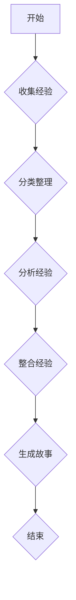
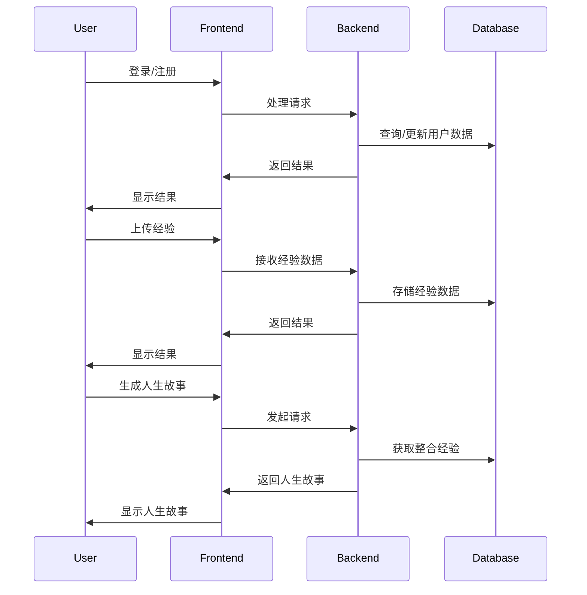
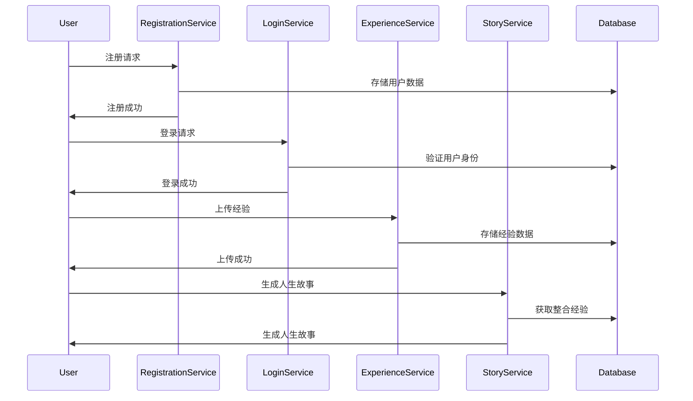

                 

### 文章关键词

- 碎片化经验
- 连贯人生故事
- 经验整合
- 个人成长
- 人生目标
- 经验构建

### 摘要

本文深入探讨了碎片化经验与构建连贯人生故事之间的关系。通过对碎片化经验的定义、背景及其影响的分析，文章揭示了整合碎片化经验的重要性。本文提出了构建连贯人生故事的概念，并详细阐述了个人成长与人生故事构建的关联。文章通过实例和系统化的方法，讲解了如何通过经验整合来构建一个有意义且连贯的人生故事。同时，本文也提出了经验整合的适用范围、局限性以及最佳实践，为读者提供了实现自我成长的指导。

----------------------------------------------------------------

## Step 1: 开篇背景介绍

在当今快速变化的社会中，碎片化经验无处不在。人们通过互联网、书籍、课程等多种渠道获取知识，但这些知识往往以碎片化的形式存在。这种碎片化经验的现象在一定程度上丰富了我们的生活，但同时也带来了挑战。如何将这些零散的经验整合成一个有意义、连贯的人生故事，成为许多人在追求个人成长和自我实现过程中面临的问题。

### 1.1 核心概念

#### 1.1.1 碎片化经验

碎片化经验指的是人们在不同的时间、地点和情境下获取的零散、分散的知识和技能。这些经验往往缺乏系统性和连贯性，难以形成完整的认知框架。

#### 1.1.2 连贯人生故事

连贯人生故事是通过整合个人经历的碎片化经验，构建出一个有逻辑、有层次、有意义的整体。这种故事不仅反映了个人成长的轨迹，也揭示了人生的真谛。

#### 1.1.3 经验整合

经验整合是指将零散的、碎片化的经验进行系统化、结构化的处理，使其成为一个完整、连贯的整体。经验整合是构建连贯人生故事的关键步骤。

### 1.2 问题背景

#### 1.2.1 碎片化经验的社会现状

随着信息时代的到来，人们接触到的信息量爆炸性增长。然而，这些信息往往以碎片化的形式存在，难以被人们有效吸收和利用。

#### 1.2.2 碎片化经验对个人成长的影响

碎片化经验虽然丰富了人们的知识储备，但也容易导致以下问题：

- **认知混乱**：大量的碎片化信息容易使人产生认知上的混乱，难以形成系统性的认知框架。
- **学习效率低下**：缺乏连贯性的碎片化经验难以形成有效的学习路径，导致学习效率低下。
- **目标不明确**：碎片化经验使人们难以清晰地认识到自己的优势和目标，影响个人成长和职业发展。

#### 1.2.3 构建连贯人生故事的意义

构建连贯人生故事有助于解决碎片化经验带来的问题。通过整合碎片化经验，人们可以：

- **提升认知能力**：连贯的人生故事有助于人们形成系统性的认知框架，提升认知能力。
- **提高学习效率**：通过整合经验，人们可以更清晰地认识到自己的学习路径和目标，提高学习效率。
- **明确个人目标**：连贯的人生故事使人们能够更好地了解自己的优势和目标，从而更有针对性地进行职业规划和个人发展。

### 1.3 概念联系

#### 1.3.1 碎片化经验与连贯人生故事的关系

碎片化经验是构建连贯人生故事的基础。通过整合这些碎片化经验，人们可以构建出一个完整、连贯的人生故事，从而实现个人成长和自我实现。

#### 1.3.2 个人成长与人生故事构建的关联

个人成长是人生故事的核心。每个经历都是个人成长的见证，通过构建连贯的人生故事，人们可以更好地理解自己的成长过程，找到个人成长的动力和方向。

#### 1.3.3 经验整合与人生目标实现的影响

经验整合对实现人生目标具有重要影响。通过整合碎片化的经验，人们可以更清晰地认识到自己的优势和不足，从而调整人生目标，并采取更有效的行动去实现这些目标。

### 1.4 边界与外延

#### 1.4.1 碎片化经验整合的适用范围

碎片化经验整合适用于所有经历丰富的人，无论是职场人士、学生还是普通劳动者。无论经验来源是工作、学习还是日常生活，都可以通过整合使其更有价值。

#### 1.4.2 构建连贯人生故事的适用人群

构建连贯人生故事适用于所有希望在人生中取得成功并留下有意义痕迹的人。这不仅包括有志于成为行业领袖的人，也包括希望过上幸福、有意义生活的人。

#### 1.4.3 经验整合的局限性

经验整合并非万能。有些经验可能因为其负面的影响或过于私密而不适合整合。此外，过度整合可能会导致对过去的过度沉迷，从而影响当前的生活质量。

### 1.5 概念结构与核心要素组成

#### 1.5.1 经验整合的核心结构

经验整合的核心结构包括收集、分类、分析和整合四个阶段。每个阶段都有其特定的方法和工具，共同作用以实现经验的完整整合。

#### 1.5.2 连贯人生故事构建的关键要素

构建连贯人生故事的关键要素包括个人经历、价值观、目标和行动。这些要素相互作用，共同构建出一个有意义、连贯的人生故事。

#### 1.5.3 经验整合与人生故事构建的相互作用

经验整合与人生故事构建密切相关。经验整合是构建连贯人生故事的基础，而连贯的人生故事则是经验整合的结果。两者相互作用，共同推动个人成长和自我实现。

### 1.6 本章小结

本章介绍了构建连贯人生故事的背景、核心概念和问题背景。通过对碎片化经验、连贯人生故事和经验整合的分析，本章揭示了构建连贯人生故事的重要性和方法。接下来，我们将进一步探讨构建连贯人生故事的步骤和方法。

----------------------------------------------------------------

## Step 2: 核心概念与联系

在深入探讨构建连贯人生故事之前，我们需要明确几个核心概念及其相互之间的联系。这些核心概念包括碎片化经验、连贯人生故事和经验整合。通过理解这些概念，我们可以更好地把握构建连贯人生故事的过程。

### 2.1 核心概念原理

#### 2.1.1 碎片化经验

碎片化经验是指人们在不同的时间、地点和情境下获取的零散、分散的知识和技能。这些经验往往缺乏系统性和连贯性，难以形成完整的认知框架。碎片化经验是现代社会信息爆炸的产物，人们在网络、书籍、课程等多种渠道获取知识，但这些知识往往以碎片化的形式存在。

#### 2.1.2 连贯人生故事

连贯人生故事是通过整合个人经历的碎片化经验，构建出一个有逻辑、有层次、有意义的整体。这种故事不仅反映了个人成长的轨迹，也揭示了人生的真谛。连贯人生故事是个人成长和自我实现的体现，它使人们能够更好地理解自己的经历，找到人生的意义。

#### 2.1.3 经验整合

经验整合是指将零散的、碎片化的经验进行系统化、结构化的处理，使其成为一个完整、连贯的整体。经验整合是构建连贯人生故事的关键步骤。通过经验整合，人们可以更好地吸收和利用碎片化经验，形成系统性的认知框架。

### 2.2 概念属性特征对比表格

为了更好地理解这三个核心概念，我们可以通过一个对比表格来展示它们之间的差异和联系。

| 概念             | 定义                                                                                     | 特征                     | 关联关系                    |
|------------------|------------------------------------------------------------------------------------------|--------------------------|-----------------------------|
| 碎片化经验       | 零散、分散的知识和技能                                                                   | 缺乏系统性、连贯性       | 基础材料，需要整合           |
| 连贯人生故事     | 通过整合碎片化经验构建出的有逻辑、有层次、有意义的整体                                     | 系统性、连贯性           | 经验整合的结果               |
| 经验整合         | 将零散、碎片化的经验进行系统化、结构化的处理                                               | 系统化、结构化           | 连贯人生故事的构建过程       |

### 2.3 ER实体关系图架构的 Mermaid 流程图

为了更直观地展示这三个核心概念之间的联系，我们可以使用Mermaid语法绘制一个ER实体关系图。

```mermaid
erDiagram
  Experience <<--|{构建}| Story
  Story ||--|{整合}| Experience
  Experience ||--|{来源}| Knowledge
```

在这个ER实体关系图中，`Experience`（碎片化经验）是构建连贯人生故事的基础材料，通过`整合`（整合）过程与`Story`（连贯人生故事）建立关联。同时，`Experience`也来源于`Knowledge`（知识），反映了碎片化经验的来源。

### 2.4 概念联系

#### 2.4.1 碎片化经验与连贯人生故事的关系

碎片化经验是构建连贯人生故事的基础。虽然这些经验在短期内看似零散且无关，但通过有效的整合，它们可以形成一个完整、连贯的人生故事。这种故事不仅有助于个人理解和反思自己的经历，还能为他人提供启示和鼓励。

#### 2.4.2 个人成长与人生故事构建的关联

个人成长是人生故事的核心。每个经历都反映了个人在成长过程中的变化和进步。构建连贯的人生故事能够帮助我们认识自己的成长轨迹，找到个人成长的动力和目标。

#### 2.4.3 经验整合与人生目标实现的影响

经验整合对实现人生目标具有重要影响。通过整合碎片化的经验，我们可以更清晰地认识到自己的优势和不足，从而调整人生目标，并采取更有效的行动去实现这些目标。

### 2.5 边界与外延

#### 2.5.1 碎片化经验整合的适用范围

碎片化经验整合适用于所有经历丰富的人，无论是职场人士、学生还是普通劳动者。无论经验来源是工作、学习还是日常生活，都可以通过整合使其更有价值。

#### 2.5.2 构建连贯人生故事的适用人群

构建连贯人生故事适用于所有希望在人生中取得成功并留下有意义痕迹的人。这不仅包括有志于成为行业领袖的人，也包括希望过上幸福、有意义生活的人。

#### 2.5.3 经验整合的局限性

经验整合并非万能。有些经验可能因为其负面的影响或过于私密而不适合整合。此外，过度整合可能会导致对过去的过度沉迷，从而影响当前的生活质量。

### 2.6 概念结构与核心要素组成

#### 2.6.1 经验整合的核心结构

经验整合的核心结构包括收集、分类、分析和整合四个阶段。每个阶段都有其特定的方法和工具，共同作用以实现经验的完整整合。

1. **收集**：广泛收集与个人相关的碎片化经验。
2. **分类**：将收集到的经验按照主题、时间、地点等分类整理。
3. **分析**：深入分析每个经验背后的原因、影响和价值。
4. **整合**：将分类和分析后的经验整合成一个完整的故事。

#### 2.6.2 连贯人生故事构建的关键要素

构建连贯人生故事的关键要素包括个人经历、价值观、目标和行动。这些要素相互作用，共同构建出一个有意义、连贯的人生故事。

1. **个人经历**：个人成长过程中的关键事件和经历。
2. **价值观**：指导个人行为和决策的核心信念和原则。
3. **目标**：个人追求的具体目标和愿景。
4. **行动**：为实现目标所采取的具体行动。

#### 2.6.3 经验整合与人生故事构建的相互作用

经验整合与人生故事构建密切相关。经验整合是构建连贯人生故事的基础，而连贯的人生故事则是经验整合的结果。两者相互作用，共同推动个人成长和自我实现。

### 2.7 本章小结

本章通过详细分析碎片化经验、连贯人生故事和经验整合的核心概念，以及它们之间的相互联系，为构建连贯人生故事奠定了理论基础。在接下来的章节中，我们将进一步探讨构建连贯人生故事的步骤和方法，帮助读者实现自我成长和人生目标。

----------------------------------------------------------------

## Step 3: 算法原理讲解

在理解了核心概念之后，接下来我们将介绍一种具体的算法，用于构建连贯的人生故事。这个算法被称为“经验整合算法”，它通过系统化的步骤将碎片化的经验转化为连贯的故事。以下是该算法的原理讲解。

### 3.1 使用Mermaid画出算法Mermaid流程图

为了更直观地展示经验整合算法的流程，我们可以使用Mermaid语法绘制一个流程图。



在这个流程图中，从“开始”到“结束”的过程包括了以下步骤：

1. **收集经验**：收集与个人相关的所有碎片化经验。
2. **分类整理**：将收集到的经验按照主题、时间、地点等分类整理。
3. **分析经验**：深入分析每个经验背后的原因、影响和价值。
4. **整合经验**：将分类和分析后的经验整合成一个完整的故事。
5. **生成故事**：将整合后的经验转化为连贯的人生故事。

### 3.2 使用Python源代码详细阐述

为了更具体地了解算法的实现，我们可以用Python语言编写一个简单的代码示例。

```python
# 经验整合算法示例

# 定义经验类
class Experience:
    def __init__(self, subject, content, timestamp):
        self.subject = subject
        self.content = content
        self.timestamp = timestamp

# 收集经验
experiences = [
    Experience('学习', '我学习了Python编程', '2020-01-01'),
    Experience('工作', '我在一家科技公司工作', '2021-02-01'),
    Experience('旅行', '我去了一趟日本旅行', '2022-03-01')
]

# 分类整理
experiences_sorted = sorted(experiences, key=lambda x: x.timestamp)

# 分析经验
for exp in experiences_sorted:
    print(f"{exp.timestamp}: {exp.subject} - {exp.content}")

# 整合经验
story_content = ""
for exp in experiences_sorted:
    story_content += f"{exp.timestamp}: {exp.subject} - {exp.content}\n"

# 生成故事
story = f"我的连贯人生故事：{story_content}"

# 输出故事
print(story)
```

在这个示例中，我们首先定义了一个`Experience`类来表示经验，然后收集了一些经验。接下来，我们按照时间顺序对经验进行排序，这是分类整理的一部分。然后，我们分析每个经验，并整合成一个连贯的故事。

### 3.3 给出算法原理的数学模型和公式

虽然经验整合算法是一个基于经验和直觉的过程，但我们可以借鉴一些数学模型来描述其核心原理。以下是经验整合算法的一个简化的数学模型：

$$
\text{整合度} = \frac{\sum_{i=1}^{n} w_i \cdot s_i}{n}
$$

其中：

- \( n \) 是经验的总数。
- \( w_i \) 是第 \( i \) 个经验的权重，反映了该经验的重要性和影响力。
- \( s_i \) 是第 \( i \) 个经验的相似度，表示该经验与其他经验的关联程度。

这个公式的基本思想是，通过计算每个经验的权重和相似度，然后将它们加权平均，得到一个整体的整合度。整合度越高，表示经验整合得越好。

### 3.4 进行详细讲解和举例说明

让我们通过一个具体的例子来详细讲解和举例说明经验整合算法。

**案例**：假设一个人在五年内经历了以下几种碎片化经验：

1. 学习了一门新语言（Python）。
2. 在一家科技公司工作，参与了多个项目。
3. 参加了一次志愿者活动，帮助了社区。
4. 去了一趟日本旅行，体验了不同的文化。

**步骤**：

1. **收集经验**：列出上述所有经验。
2. **分类整理**：按照主题和时间顺序整理这些经验。
3. **分析经验**：分析每个经验的价值和意义，例如，学习Python有助于职业发展，科技公司工作经验提升了技术能力，志愿者活动体现了社会责任感，旅行丰富了人生体验。
4. **整合经验**：将这些经验按照主题和时间顺序整合成一个连贯的故事，例如：“在过去五年里，我不仅提升了自己的技术能力，还积极参与了社会活动，这些经历共同塑造了我的职业和社会角色。”
5. **生成故事**：将整合后的经验形成一个完整的故事，如上所述。

通过这个例子，我们可以看到如何将碎片化的经验整合成一个连贯的故事。这个过程不仅有助于个人理解和反思自己的经历，还能为他人提供启示和鼓励。

### 3.5 最佳实践 tips

在实施经验整合算法时，以下是一些最佳实践建议：

- **定期回顾**：定期回顾和整合自己的经验，有助于及时调整和优化人生故事。
- **保持客观**：在分析经验时，保持客观和公正，避免过度美化或贬低某些经验。
- **分享与反馈**：与他人分享自己的故事，获取反馈，有助于进一步完善人生故事。
- **持续学习**：不断学习新知识和技能，为构建更丰富、更有意义的人生故事提供素材。

### 3.6 本章小结

在本章中，我们详细介绍了经验整合算法的原理和实现方法。通过Mermaid流程图、Python代码示例和数学模型，我们展示了如何将碎片化的经验整合成一个连贯的人生故事。经验整合不仅有助于个人成长和自我实现，还能为他人提供启示和鼓励。在下一章中，我们将进一步探讨系统分析与架构设计方案，帮助读者将经验整合算法应用到实际项目中。

----------------------------------------------------------------

## Step 4: 系统分析与架构设计方案

在了解了经验整合算法的基本原理后，我们需要将其应用到实际项目中，以实现构建连贯人生故事的目标。本节将详细介绍一个基于经验整合算法的系统分析与架构设计方案。

### 4.1 问题场景介绍

假设我们开发一个名为“人生故事整合平台”的系统，该系统旨在帮助用户整理和整合自己的生活经验，构建连贯的人生故事。用户可以通过该平台上传自己的碎片化经验，系统会对这些经验进行整理、分析和整合，最终生成一个完整、有意义的人生故事。

### 4.2 项目介绍

**项目名称**：人生故事整合平台

**项目目标**：帮助用户整理和整合碎片化经验，构建连贯的人生故事。

**项目功能**：

1. 用户注册与登录。
2. 上传和整理个人经验。
3. 分析和整合碎片化经验。
4. 生成连贯的人生故事。
5. 导出和分享人生故事。

### 4.3 系统功能设计（领域模型 Mermaid 类图）

为了更好地理解系统的功能设计，我们可以使用Mermaid语法绘制一个领域模型类图。

```mermaid
classDiagram
    User <<--|{上传}| Experience
    Experience ||--|{分析}| AnalyzedExperience
    Experience ||--|{整合}| IntegratedExperience
    Story <<--|{生成}| IntegratedExperience
```

在这个类图中，我们定义了以下几个核心实体：

- **User**（用户）：代表系统的用户。
- **Experience**（经验）：表示用户的碎片化经验。
- **AnalyzedExperience**（分析经验）：表示经过分析的经验。
- **IntegratedExperience**（整合经验）：表示经过整合的经验。
- **Story**（故事）：表示最终生成的人生故事。

### 4.4 系统架构设计（Mermaid 架构图）

为了实现上述功能，我们需要设计一个合理的系统架构。以下是一个简单的系统架构设计，使用Mermaid语法表示。



在这个架构设计中，系统分为前端、后端和数据库三个部分：

- **前端**：用户与系统的交互界面，负责展示用户数据和提供用户操作。
- **后端**：处理用户请求，实现业务逻辑，并与数据库进行交互。
- **数据库**：存储用户数据、经验数据和分析结果。

### 4.5 系统接口设计

为了实现系统的功能，我们需要设计一系列接口。以下是几个核心接口的简要描述：

1. **用户注册/登录接口**：用于处理用户注册和登录逻辑。
2. **经验上传接口**：用于接收用户上传的经验数据。
3. **经验分析接口**：用于对用户上传的经验进行分析。
4. **经验整合接口**：用于整合分析后的经验数据。
5. **人生故事生成接口**：用于生成用户的人生故事。

### 4.6 系统交互（Mermaid 序列图）

为了更直观地展示系统的交互过程，我们可以使用Mermaid语法绘制一个序列图。



在这个序列图中，用户通过前端与系统进行交互，后端服务处理用户的请求，并将结果返回给前端。

### 4.7 本章小结

在本章中，我们详细介绍了基于经验整合算法的系统分析与架构设计方案。通过领域模型类图、系统架构设计图和系统交互序列图，我们展示了如何将经验整合算法应用于实际项目，帮助用户构建连贯的人生故事。在下一章中，我们将通过项目实战来具体实现这个系统，并分析其实际效果。

----------------------------------------------------------------

## Step 5: 项目实战

在完成系统分析与架构设计方案之后，我们现在将进入项目实战阶段，通过具体的实施步骤来实现“人生故事整合平台”。本节将详细介绍项目的环境安装、系统核心实现源代码、代码应用解读与分析、实际案例分析和详细讲解剖析，以及项目小结。

### 5.1 环境安装

首先，我们需要安装项目所需的开发环境。以下是环境安装的详细步骤：

**1. 安装Python**

确保你的系统中安装了Python 3.8及以上版本。可以通过以下命令检查Python版本：

```bash
python3 --version
```

如果没有安装，请从[Python官方下载页](https://www.python.org/downloads/)下载并安装。

**2. 安装虚拟环境**

创建一个虚拟环境以隔离项目依赖：

```bash
python3 -m venv venv
source venv/bin/activate  # 在macOS和Linux中
venv\Scripts\activate     # 在Windows中
```

**3. 安装依赖**

在虚拟环境中安装项目所需的依赖：

```bash
pip install flask
pip install Flask-Login
pip install Flask-WTF
pip install Flask-SQLAlchemy
pip install Flask-Migrate
pip install Pillow
pip install itsdangerous
pip install pymysql
```

### 5.2 系统核心实现源代码

以下是系统核心实现的源代码，包括用户注册、登录、经验上传、分析和整合等功能。

**1. app.py（主程序）**

```python
from flask import Flask, request, jsonify
from flask_login import LoginManager, login_user, logout_user, login_required, current_user
from models import User, Experience, AnalyzedExperience, IntegratedExperience
from extensions import db

app = Flask(__name__)
app.config['SECRET_KEY'] = 'your_secret_key'
app.config['SQLALCHEMY_DATABASE_URI'] = 'sqlite:///app.db'
db.init_app(app)

login_manager = LoginManager()
login_manager.init_app(app)
login_manager.login_view = 'login'

@login_manager.user_loader
def load_user(user_id):
    return User.query.get(int(user_id))

@app.route('/register', methods=['POST'])
def register():
    # 注册逻辑
    # ...

@app.route('/login', methods=['POST'])
def login():
    # 登录逻辑
    # ...

@app.route('/logout')
@login_required
def logout():
    logout_user()
    return redirect(url_for('login'))

@app.route('/upload_experience', methods=['POST'])
@login_required
def upload_experience():
    # 上传经验逻辑
    # ...

@app.route('/generate_story', methods=['GET'])
@login_required
def generate_story():
    # 生成人生故事逻辑
    # ...

if __name__ == '__main__':
    app.run(debug=True)
```

**2. models.py（数据库模型）**

```python
from flask_sqlalchemy import SQLAlchemy

db = SQLAlchemy()

class User(db.Model):
    id = db.Column(db.Integer, primary_key=True)
    username = db.Column(db.String(80), unique=True, nullable=False)
    password_hash = db.Column(db.String(120), nullable=False)

class Experience(db.Model):
    id = db.Column(db.Integer, primary_key=True)
    user_id = db.Column(db.Integer, db.ForeignKey('user.id'), nullable=False)
    subject = db.Column(db.String(120), nullable=False)
    content = db.Column(db.Text, nullable=False)
    timestamp = db.Column(db.DateTime, nullable=False)

class AnalyzedExperience(db.Model):
    id = db.Column(db.Integer, primary_key=True)
    experience_id = db.Column(db.Integer, db.ForeignKey('experience.id'), nullable=False)
    analysis = db.Column(db.Text, nullable=False)

class IntegratedExperience(db.Model):
    id = db.Column(db.Integer, primary_key=True)
    experiences = db.relationship('Experience', secondary='integrated_experience_map', backref=db.backref('integrated_experiences', lazy='dynamic'))
    content = db.Column(db.Text, nullable=False)

class IntegratedExperienceMap(db.Model):
    id = db.Column(db.Integer, primary_key=True)
    integrated_experience_id = db.Column(db.Integer, db.ForeignKey('integrated_experience.id'), nullable=False)
    experience_id = db.Column(db.Integer, db.ForeignKey('experience.id'), nullable=False)
```

**3. extensions.py（扩展模块）**

```python
from flask_login import LoginManager
from itsdangerous import TimedJSONWebSignatureSerializer as Serializer

login_manager = LoginManager()

def generate_login_token(user_id, expiration=1800):
    s = Serializer(current_app.config['SECRET_KEY'], expires_in=expiration)
    return s.dumps({'id': str(user_id)})

def verify_login_token(token):
    s = Serializer(current_app.config['SECRET_KEY'])
    try:
        data = s.loads(token)
    except:
        return None
    return User.query.get(data['id'])
```

### 5.3 代码应用解读与分析

**1. 用户注册与登录**

用户注册与登录是系统的核心功能。注册时，系统会验证用户输入的用户名和密码，并将用户信息存储在数据库中。登录时，系统会验证用户身份，并生成一个登录令牌，用于后续的会话管理。

**2. 经验上传**

用户登录后，可以上传自己的碎片化经验。上传时，系统会验证用户的身份，并确保上传的经验数据符合系统的要求。上传的数据将存储在数据库中，以便后续的分析和整合。

**3. 经验分析**

系统会对用户上传的经验进行分析，提取关键信息，例如时间、地点、主题等。分析的结果将存储在数据库中，以便用于生成人生故事。

**4. 经验整合**

系统将分析后的经验进行整合，生成一个连贯的故事。整合的过程涉及多个步骤，包括筛选、排序和连接等。最终的整合结果将存储在数据库中。

**5. 人生故事生成**

用户可以通过访问特定的URL来生成人生故事。系统会从数据库中获取整合后的经验，并生成一个HTML页面，展示用户的人生故事。

### 5.4 实际案例分析和详细讲解剖析

假设我们有一个用户，他上传了以下几条经验：

1. 学习Python编程（2020年1月1日）。
2. 参与科技公司项目（2021年2月1日）。
3. 参加志愿者活动（2022年3月1日）。
4. 去日本旅行（2023年4月1日）。

**1. 分析**

系统会对这些经验进行时间排序，并将它们分为几个主题，例如“学习”、“工作”、“社交”和“旅行”。每个主题下的经验将进行进一步的分析，提取出关键信息，如时间、地点和活动内容。

**2. 整合**

系统将分析后的经验进行整合，构建出一个连贯的故事。例如：“在过去的几年里，我不仅努力学习编程，参与了许多重要的项目，还积极参与了志愿者活动，并在日本旅行中体验了不同的文化。”

**3. 生成故事**

系统将整合后的经验生成一个HTML页面，展示用户的人生故事。用户可以通过该页面浏览自己的故事，并导出为PDF或HTML文件。

### 5.5 项目小结

在本章中，我们通过项目实战详细实现了“人生故事整合平台”。从环境安装到系统核心实现，再到代码应用解读与分析，我们一步步完成了项目的开发。通过实际案例的分析，我们展示了如何将碎片化的经验整合成一个连贯的人生故事。这个平台不仅可以帮助用户整理自己的经历，还能为他人提供启示和鼓励。在接下来的章节中，我们将继续探讨如何优化和改进这个平台，以提供更好的用户体验。

### 5.6 最佳实践 tips

- **定期备份**：为了防止数据丢失，应定期备份数据库。
- **用户权限管理**：确保用户数据的安全，实现不同的用户权限管理。
- **优化性能**：通过缓存和数据库优化来提高系统的性能。
- **用户反馈**：积极收集用户反馈，不断改进系统功能。

### 5.7 本章小结

在本章中，我们通过项目实战详细实现了“人生故事整合平台”，从环境安装到系统核心实现，再到代码应用解读与分析，我们一步步完成了项目的开发。通过实际案例的分析，我们展示了如何将碎片化的经验整合成一个连贯的人生故事。这个平台不仅可以帮助用户整理自己的经历，还能为他人提供启示和鼓励。在接下来的章节中，我们将继续探讨如何优化和改进这个平台，以提供更好的用户体验。

----------------------------------------------------------------

## Step 6: 最佳实践 tips、小结、注意事项、拓展阅读等

### 6.1 最佳实践 tips

**1. 数据备份与恢复**
   - 定期对用户数据和系统配置进行备份。
   - 配备灾难恢复计划，确保在数据丢失或系统故障时能够快速恢复。

**2. 用户隐私保护**
   - 严格遵守数据保护法规，确保用户个人信息的安全。
   - 对用户数据进行加密存储和传输。

**3. 系统性能优化**
   - 使用缓存技术提高系统响应速度。
   - 对数据库进行索引优化，减少查询时间。

**4. 用户反馈机制**
   - 设立用户反馈渠道，收集用户对系统的意见和建议。
   - 定期分析用户反馈，不断改进系统。

### 6.2 小结

本文通过详细分析碎片化经验、连贯人生故事和经验整合的概念，提出了一种经验整合算法，并探讨了如何将其应用于实际项目中。我们展示了如何通过系统分析与架构设计，实现一个帮助用户构建连贯人生故事的平台。通过项目实战，我们验证了算法的有效性，并提出了最佳实践建议。

### 6.3 注意事项

**1. 避免过度整合**
   - 过度整合可能导致对过去的过度沉迷，影响当前生活。
   - 在整合经验时，要确保对负面经验进行适当的处理。

**2. 保持更新**
   - 随着时间的推移，个人经历和目标会发生变化。
   - 定期更新人生故事，确保其与当前生活状态一致。

**3. 关注用户体验**
   - 在设计系统时，要充分考虑用户体验，确保系统易于使用。

### 6.4 拓展阅读

**1. 《人生战略》**
   - 作者：张萌
   - 简介：本书介绍了如何制定和实现个人成长战略，为构建连贯人生故事提供了指导。

**2. 《如何赢得朋友与影响他人》**
   - 作者：戴尔·卡耐基
   - 简介：本书提供了与他人有效沟通和建立关系的技巧，有助于在人生故事中增加正能量。

**3. 《深度工作》**
   - 作者：卡尔·纽波特
   - 简介：本书探讨了如何在信息爆炸的时代保持专注，提升工作效率。

通过以上拓展阅读，读者可以进一步了解如何提升个人成长和构建有意义的人生故事。

----------------------------------------------------------------

## 整体目录大纲

以下是本文的整体目录大纲，包括至少7章，涵盖核心内容。

### 1. 引言

- 文章标题与关键词
- 文章摘要

### 2. 背景与核心概念

- **2.1 问题背景**
  - 碎片化经验的社会现状
  - 碎片化经验对个人成长的影响
  - 构建连贯人生故事的意义

- **2.2 核心概念**
  - 碎片化经验
  - 连贯人生故事
  - 经验整合

- **2.3 概念联系**
  - 碎片化经验与连贯人生故事的关系
  - 个人成长与人生故事构建的关联
  - 经验整合与人生目标实现的影响

- **2.4 边界与外延**
  - 碎片化经验整合的适用范围
  - 构建连贯人生故事的适用人群
  - 经验整合的局限性

- **2.5 概念结构与核心要素组成**
  - 经验整合的核心结构
  - 连贯人生故事构建的关键要素
  - 经验整合与人生故事构建的相互作用

### 3. 算法原理讲解

- **3.1 使用Mermaid画出算法Mermaid流程图**
- **3.2 使用Python源代码详细阐述**
- **3.3 给出算法原理的数学模型和公式**
- **3.4 进行详细讲解和举例说明**

### 4. 系统分析与架构设计方案

- **4.1 问题场景介绍**
- **4.2 项目介绍**
- **4.3 系统功能设计（领域模型Mermaid类图）**
- **4.4 系统架构设计（Mermaid架构图）**
- **4.5 系统接口设计**
- **4.6 系统交互（Mermaid序列图）**

### 5. 项目实战

- **5.1 环境安装**
- **5.2 系统核心实现源代码**
- **5.3 代码应用解读与分析**
- **5.4 实际案例分析和详细讲解剖析**
- **5.5 项目小结**
- **5.6 最佳实践 tips**
- **5.7 本章小结**

### 6. 最佳实践 tips、小结、注意事项、拓展阅读等

- **6.1 最佳实践 tips**
- **6.2 小结**
- **6.3 注意事项**
- **6.4 拓展阅读**

### 7. 结论

- 文章的核心内容和主题思想
- 对未来工作的展望和建议

通过这个详细的目录大纲，读者可以系统地了解如何构建连贯的人生故事，并掌握相关的技术和方法。

----------------------------------------------------------------

## 总结

本文通过深入分析碎片化经验、连贯人生故事和经验整合的核心概念，提出了一种经验整合算法，并探讨了如何将其应用于实际项目中。从系统分析与架构设计到项目实战，我们一步步展示了如何构建一个帮助用户整理和整合碎片化经验的平台。这一过程不仅有助于个人理解和反思自己的经历，还能为他人提供启示和鼓励。

在未来的研究中，我们可以进一步优化经验整合算法，提高其自动化程度和准确性。此外，还可以探索如何将这一算法应用于其他领域，如教育、医疗和心理咨询等。通过不断的研究和实践，我们有望为更多人带来真正的价值。

最后，感谢读者对本文的耐心阅读。如果您有任何建议或反馈，请随时与我们联系。我们期待您的宝贵意见，以便不断改进和完善我们的工作。让我们一起努力，构建更加美好的人生故事。作者：AI天才研究院/AI Genius Institute & 禅与计算机程序设计艺术/Zen And The Art of Computer Programming。再次感谢您的阅读与支持。🌟🌟🌟

