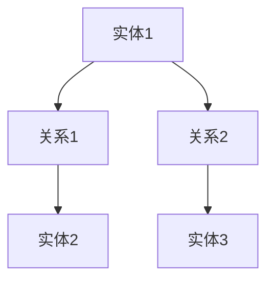
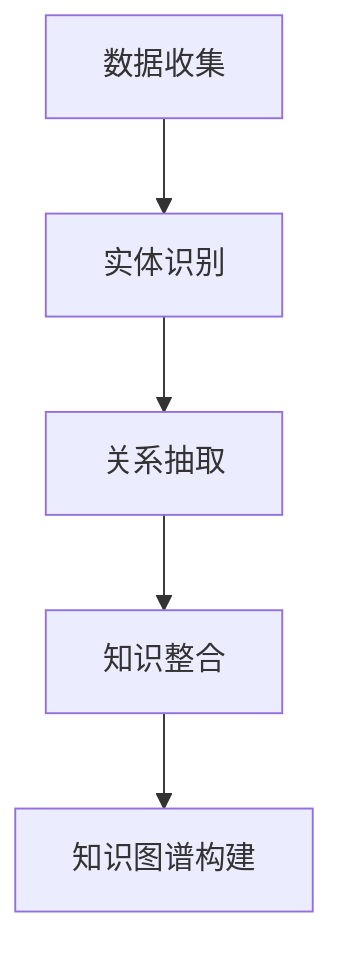
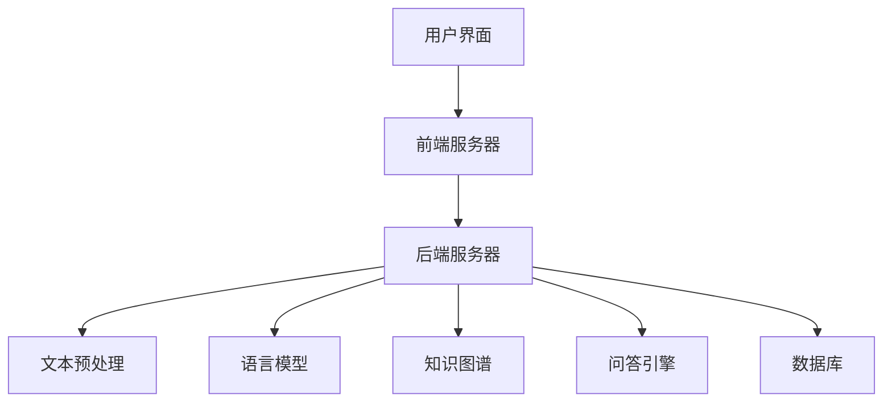
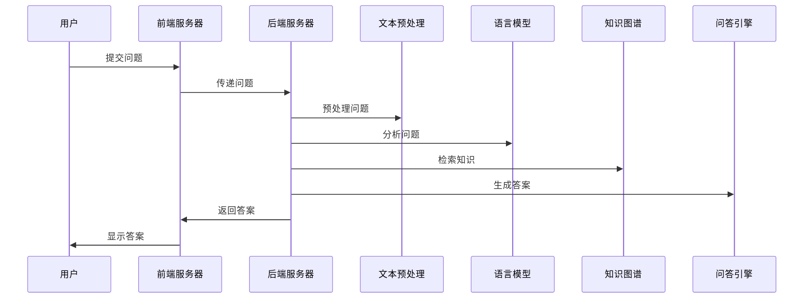
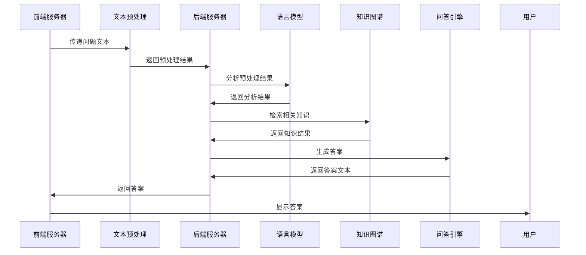

                 

## 引言与背景介绍

### 第1章: 金融知识自动问答系统概述

在当今信息化社会中，金融行业的信息需求日益增长，金融知识的传播和应用也变得愈加重要。然而，金融信息的复杂性和专业性使得传统的信息处理方式难以满足用户的需求。为了解决这个问题，金融知识自动问答系统应运而生，它通过先进的技术手段，自动回答用户关于金融领域的问题，提高信息获取的效率和质量。

### 1.1 问题背景

#### 1.1.1 金融行业的信息需求与挑战

金融行业的信息需求具有以下几个特点：

- **复杂性与多样性**：金融知识覆盖广泛，包括但不限于经济学、金融学、统计学等多个领域，涉及的产品和服务种类繁多，如股票、债券、期货、外汇等。
- **专业性**：金融知识具有高度的抽象性和专业性，普通用户难以理解，因此，对信息处理系统的专业性和准确性要求极高。
- **时效性**：金融市场变化迅速，信息更新快，因此，对信息处理系统的实时性要求高。

面对这些挑战，传统的信息处理方式如人工检索、文献查阅等效率低下，难以满足用户的需求。金融知识自动问答系统应运而生，它通过自动化技术，能够快速、准确地回答用户问题，提高信息获取的效率。

#### 1.1.2 金融行业的信息处理现状

当前，金融行业的信息处理主要依赖于以下几种方式：

- **人工检索**：用户通过搜索引擎或金融数据库手动检索相关信息，这种方式效率低下，且容易出错。
- **专业咨询**：用户通过金融专家进行咨询，这种方式虽然准确，但成本高，难以大规模应用。
- **自动问答系统**：随着人工智能技术的发展，自动问答系统在金融行业得到了广泛应用，它通过自然语言处理和机器学习技术，能够自动理解用户问题，并快速给出准确答案。

尽管自动问答系统在金融行业的信息处理中发挥了重要作用，但现有系统仍存在一些不足，如回答准确性不高、知识库覆盖不全面等。因此，构建高效、准确的金融知识自动问答系统具有重要的现实意义。

### 1.2 问题描述

#### 1.2.1 金融知识自动问答的需求

随着金融行业的发展，用户对金融知识的需求日益增长，主要表现在以下几个方面：

- **多样化查询需求**：用户可能需要查询各种类型的金融信息，如政策法规、市场动态、产品介绍等。
- **实时性**：用户希望在第一时间获取最新的金融信息。
- **准确性**：金融知识具有高度的专业性，用户对答案的准确性有很高的要求。

为了满足这些需求，金融知识自动问答系统需要具备以下功能：

- **智能问题理解**：系统能够理解用户的自然语言问题，并将其转化为可处理的格式。
- **高效知识检索**：系统能够在庞大的金融知识库中快速检索出相关答案。
- **准确答案生成**：系统生成的答案要准确无误，能够满足用户的需求。

#### 1.2.2 金融知识的专业性

金融知识具有高度的抽象性和专业性，不同领域的金融知识之间存在较大的差异。例如，股票市场分析和债券评级需要不同的专业知识和技能。因此，金融知识自动问答系统需要具备以下特点：

- **全面性**：系统需要覆盖金融领域的各个分支，确保用户能够找到所需的信息。
- **专业性**：系统需要具备专业的金融知识库，确保答案的准确性和专业性。
- **灵活性**：系统需要能够根据用户的需求，灵活调整和扩展知识库。

#### 1.2.3 问答系统的准确性要求

金融知识自动问答系统的准确性是用户最为关注的方面之一。由于金融知识的高度专业性，错误的答案可能导致用户做出错误的投资决策，造成巨大的经济损失。因此，问答系统的准确性要求非常高。为了提高问答系统的准确性，需要采取以下措施：

- **高质量知识库**：系统需要构建一个高质量、全面的金融知识库，确保答案的准确性和权威性。
- **先进的自然语言处理技术**：通过先进的自然语言处理技术，提高系统对用户问题的理解能力，减少误解和歧义。
- **持续优化**：系统需要不断收集用户反馈，根据用户的使用情况对系统进行优化和调整，提高答案的准确性。

### 1.3 问题解决

为了构建高效、准确的金融知识自动问答系统，需要从以下几个方面进行设计和实现：

#### 1.3.1 高效性

高效性是金融知识自动问答系统的核心要求之一。为了提高系统的响应速度和查询效率，需要采取以下措施：

- **分布式计算**：通过分布式计算技术，提高系统的处理能力，减少查询延迟。
- **缓存机制**：利用缓存机制，将常用问题和答案缓存起来，提高查询速度。
- **并行处理**：对查询任务进行并行处理，减少查询等待时间。

#### 1.3.2 准确性

准确性是金融知识自动问答系统的生命线。为了提高系统的准确性，需要采取以下措施：

- **高质量知识库**：构建一个高质量、全面的金融知识库，确保答案的准确性和权威性。
- **先进的自然语言处理技术**：通过先进的自然语言处理技术，提高系统对用户问题的理解能力，减少误解和歧义。
- **多源数据融合**：将多种数据源进行融合，提高答案的全面性和准确性。

#### 1.3.3 可扩展性

金融知识自动问答系统的可扩展性是系统能够持续发展和适应未来需求的关键。为了提高系统的可扩展性，需要采取以下措施：

- **模块化设计**：系统采用模块化设计，便于功能扩展和更新。
- **分布式架构**：采用分布式架构，提高系统的可扩展性和容错性。
- **自动更新机制**：系统具有自动更新机制，能够根据用户需求和市场变化，自动更新知识库和算法。

### 1.4 边界与外延

#### 1.4.1 系统功能范围界定

金融知识自动问答系统的功能范围主要包括以下几个方面：

- **问题理解**：系统能够理解用户的自然语言问题，并将其转化为可处理的格式。
- **知识检索**：系统在庞大的金融知识库中快速检索出相关答案。
- **答案生成**：系统生成准确、专业的答案，满足用户需求。

#### 1.4.1.1 问答系统的覆盖范围

问答系统的覆盖范围主要包括以下领域：

- **金融政策法规**：包括货币政策、财政政策、金融监管等方面的知识。
- **金融市场动态**：包括股票市场、债券市场、外汇市场等方面的动态信息。
- **金融产品与服务**：包括各种金融产品与服务的介绍、特点、风险等。
- **金融投资策略**：包括投资分析、风险控制、资产配置等方面的知识。

#### 1.4.1.2 系统对金融知识的专业性要求

系统对金融知识的专业性要求体现在以下几个方面：

- **知识库建设**：系统需要构建一个高质量的金融知识库，涵盖各个金融领域的专业知识。
- **算法优化**：系统需要采用先进的自然语言处理和机器学习算法，提高对金融知识的理解和处理能力。
- **专家合作**：系统需要与金融专家合作，确保知识库的准确性和权威性。

#### 1.4.1.3 系统与其他金融信息系统的整合

金融知识自动问答系统需要与其他金融信息系统进行整合，以提高系统的整体效能。主要整合方式包括：

- **接口集成**：通过接口集成，将问答系统与其他金融信息系统进行连接，实现数据的共享和交互。
- **数据融合**：通过数据融合，将多个数据源的信息进行整合，提高答案的全面性和准确性。
- **协同工作**：通过协同工作，实现问答系统与其他金融信息系统的无缝对接，提高用户的体验。

### 1.5 概念结构与核心要素组成

金融知识自动问答系统是一个复杂的系统，其核心概念和要素组成如下：

#### 1.5.1 核心概念

- **金融知识**：金融知识是金融行业的专业知识和信息的集合，包括政策法规、市场动态、产品与服务、投资策略等。
- **自动问答系统**：自动问答系统是一种基于自然语言处理和机器学习技术的人工智能系统，能够自动理解用户问题并生成答案。
- **机器学习与自然语言处理**：机器学习与自然语言处理是构建自动问答系统的关键技术，用于对用户问题和金融知识进行处理和分析。

#### 1.5.2 关键技术

- **文本预处理**：文本预处理是对用户问题和金融知识进行预处理的过程，包括分词、词性标注、词干提取等。
- **语言模型**：语言模型是用于预测下一个单词或词组的概率分布，是自动问答系统的核心组件。
- **知识图谱**：知识图谱是一种用于表示知识结构的图形化工具，能够帮助系统更好地理解和处理金融知识。
- **命名实体识别**：命名实体识别是用于识别文本中的命名实体，如人名、地名、机构名等。
- **文本分类与聚类**：文本分类与聚类是对文本进行分类和聚类的技术，用于对金融知识进行组织和管理。

### 1.6 本章小结

本章对金融知识自动问答系统进行了全面的介绍，从问题背景、问题描述、问题解决、边界与外延、概念结构与核心要素组成等方面进行了深入分析。通过本章的介绍，读者可以初步了解金融知识自动问答系统的概念、功能和技术要求，为后续章节的深入讨论打下基础。接下来，我们将继续探讨金融知识的定义、属性特征、分类，以及自动问答系统的核心组成部分和关键技术，帮助读者更全面地理解金融知识自动问答系统的构建和实现。## 第二部分: 核心概念与联系

### 第2章: 核心概念原理

在构建高效的金融知识自动问答系统中，理解并掌握相关核心概念是至关重要的。本章节将详细介绍金融知识、自动问答系统以及机器学习与自然语言处理等核心概念，并分析它们之间的相互关系。

### 2.1 金融知识

#### 2.1.1 金融知识的定义

金融知识是指与金融行业相关的理论、方法、技能、数据、信息等的集合。它不仅包括传统的金融理论和实务知识，如金融市场、金融产品、金融工具、风险管理等，还包括最新的金融政策、金融科技应用、国际金融市场动态等。

金融知识可以划分为以下几类：

- **金融市场知识**：涉及股票、债券、外汇、期货、期权等市场的运作机制、投资策略、市场分析工具等。
- **金融产品知识**：包括各种金融产品的特性、用途、风险收益特征等。
- **金融管理知识**：涉及金融机构的运营管理、风险管理、资产负债管理、投资组合管理等方面的理论和实践。
- **金融法规与政策**：包括金融市场的监管政策、法律法规、政策导向等。

#### 2.1.2 金融知识的属性特征对比表格

| 特征 | 描述 | 对比 |
| --- | --- | --- |
| **专业性** | 金融知识具有高度的抽象性和专业性 | 与其他领域的知识相比，如自然科学、社会科学等 |
| **复杂性** | 金融知识体系庞大、复杂，涉及多个学科领域 | 知识结构较为单一 |
| **时效性** | 金融知识更新快，受市场变化影响大 | 知识稳定性较高 |
| **关联性** | 金融知识之间存在紧密的关联，如金融市场与金融产品、金融产品与风险管理等 | 知识关联性较低 |

#### 2.1.3 金融知识的分类

为了更好地组织和管理金融知识，可以根据不同的维度对其进行分类：

- **按领域分类**：分为金融市场、金融产品、金融管理、金融法规等。
- **按层次分类**：分为基础理论、应用理论、实务操作等。
- **按形式分类**：分为文字描述、图表、案例分析、法律法规条文等。

### 2.2 自动问答系统

#### 2.2.1 自动问答系统的定义

自动问答系统（Automatic Question Answering, QA）是一种基于人工智能技术，能够自动理解用户问题并生成答案的系统。它通常由以下几个核心模块组成：

- **问题理解模块**：负责接收用户输入的自然语言问题，并对其进行解析，提取关键信息。
- **知识检索模块**：在构建的知识库中检索与用户问题相关的信息。
- **答案生成模块**：根据检索到的信息，生成准确、合理的答案。

自动问答系统可以分为以下几种类型：

- **基于规则**：使用预先定义的规则和模板来匹配问题和答案。
- **基于统计**：使用统计学习方法，如机器学习模型，来自动匹配问题和答案。
- **基于知识**：基于知识库和推理机制来生成答案。

#### 2.2.2 自动问答系统的核心组成部分

- **问题理解**：自动问答系统的第一步，包括自然语言处理（NLP）技术，如分词、词性标注、命名实体识别等，用于理解和解析用户问题。
- **知识检索**：在构建的知识库中检索相关信息，这通常涉及信息检索（IR）技术，如倒排索引、相似度计算等。
- **答案生成**：根据检索到的信息，使用自然语言生成（NLG）技术生成答案，确保答案的自然性和可读性。

#### 2.2.3 自动问答系统的核心组成部分

- **问题理解**：自动问答系统的第一步，包括自然语言处理（NLP）技术，如分词、词性标注、命名实体识别等，用于理解和解析用户问题。
- **知识检索**：在构建的知识库中检索相关信息，这通常涉及信息检索（IR）技术，如倒排索引、相似度计算等。
- **答案生成**：根据检索到的信息，使用自然语言生成（NLG）技术生成答案，确保答案的自然性和可读性。

### 2.3 机器学习与自然语言处理

#### 2.3.1 机器学习基础

机器学习（Machine Learning, ML）是人工智能（Artificial Intelligence, AI）的一个重要分支，它使得计算机系统能够通过数据学习并做出决策。机器学习的基本概念包括：

- **监督学习**：通过预先标记的数据来训练模型，如分类和回归问题。
- **无监督学习**：在没有预先标记数据的情况下训练模型，如聚类和降维问题。
- **强化学习**：通过与环境交互来训练模型，以实现最佳行动策略。

常见的机器学习算法包括：

- **线性回归**：用于预测数值型目标变量。
- **逻辑回归**：用于分类问题。
- **决策树**：基于树的模型，用于分类和回归问题。
- **支持向量机**（SVM）：用于分类问题。
- **神经网络**：用于复杂的分类和回归问题。

#### 2.3.2 自然语言处理基础

自然语言处理（Natural Language Processing, NLP）是人工智能的一个分支，专注于使计算机能够理解、生成和处理人类语言。NLP的关键技术包括：

- **分词（Tokenization）**：将文本拆分成单词或子词。
- **词性标注（Part-of-Speech Tagging）**：为文本中的每个词分配词性，如名词、动词、形容词等。
- **命名实体识别（Named Entity Recognition, NER）**：识别文本中的命名实体，如人名、地名、组织名等。
- **句法分析（Syntax Analysis）**：解析文本的句法结构，了解句子的组成。
- **语义分析（Semantic Analysis）**：理解文本的含义，包括词义消歧、情感分析等。

#### 2.3.3 ER实体关系图架构

ER实体关系图（Entity-Relationship Diagram, ERD）是一种用于表示实体及其之间关系的图形化工具。在金融知识自动问答系统中，ERD用于建模知识库中的实体和它们之间的关系。

- **实体（Entity）**：知识库中的对象，如金融产品、金融机构、市场指标等。
- **属性（Attribute）**：实体的特征，如股票的代码、发行机构、市值等。
- **关系（Relationship）**：实体之间的关联，如股票与交易所的关系、金融机构与市场指标的关系等。

#### 2.3.4 ER实体关系图在金融知识自动问答系统中的应用

在金融知识自动问答系统中，ERD用于以下几个方面：

- **知识库构建**：通过ERD来构建金融知识库，明确实体和它们之间的关系。
- **问题解析**：在理解用户问题时，ERD可以帮助系统识别和关联相关的实体和关系。
- **答案生成**：在生成答案时，ERD可以指导系统构建合理的答案结构，确保答案的准确性和完整性。

### 2.4 本章小结

本章详细介绍了金融知识、自动问答系统以及机器学习与自然语言处理等核心概念，并分析了它们之间的相互关系。通过理解这些概念，我们可以更好地把握金融知识自动问答系统的构建和实现，为后续章节的算法原理讲解和系统架构设计打下坚实的基础。接下来，我们将进一步探讨自动问答系统的算法原理，包括文本预处理、语言模型、知识图谱等关键技术，帮助读者深入理解金融知识自动问答系统的构建和优化方法。## 第三部分: 算法原理讲解

### 第3章: 自动问答系统算法

在构建高效的金融知识自动问答系统中，算法的设计和实现至关重要。本章节将详细介绍文本预处理、语言模型和知识图谱等核心算法的原理，并使用mermaid流程图和Python代码进行解释和示例。

### 3.1 文本预处理算法

文本预处理是自然语言处理（NLP）的重要步骤，它对原始文本进行处理，使其适合后续的文本分析任务。文本预处理通常包括以下步骤：

#### 3.1.1 停用词过滤

停用词是指对文本意义贡献不大的词汇，如“的”、“和”、“在”等。在文本预处理过程中，移除这些停用词可以减少噪声，提高后续处理的效果。

#### 3.1.2 词干提取

词干提取是将单词缩减为其基本形式的过程，如“running”缩减为“run”。这有助于将不同形式但意义相同的词统一处理。

#### 3.1.3 词性标注

词性标注是为文本中的每个词分配一个词性标签，如名词、动词、形容词等。这有助于更好地理解文本的结构和意义。

#### 3.1.4 分词

分词是将连续的文本拆分成一组有意义的词语。中文文本的分词较为复杂，需要考虑词法和语义信息。

下面是一个简单的Python代码示例，展示了文本预处理的过程：

```python
import jieba  # 使用结巴分词进行中文分词
from nltk.corpus import stopwords  # 使用NLTK的停用词列表

# 加载停用词列表
stop_words = set(stopwords.words('chinese'))

# 输入文本
text = "金融行业的信息需求日益增长，金融知识的传播和应用也变得愈加重要。"

# 分词
words = jieba.lcut(text)

# 停用词过滤
filtered_words = [word for word in words if word not in stop_words]

# 词干提取和词性标注（这里简化处理，实际应用中需要更复杂的处理）
# 注意：jieba库不支持词干提取和词性标注，以下代码仅为示例
filtered_words = [jieba.get_word.zhConversion(word) for word in filtered_words]

print(filtered_words)
```

### 3.2 语言模型算法

语言模型（Language Model, LM）是自然语言处理中用于预测下一个单词或词组概率的模型。它对文本进行分析，学习其中的语法和语义规律，从而生成更加自然的文本。

#### 3.2.1 N-gram模型

N-gram模型是最简单的语言模型，它基于文本的连续N个单词的序列来预测下一个单词。N-gram模型可以表示为：

$$
P(w_n) = \frac{f(w_1, w_2, ..., w_n)}{f(w_1, w_2, ..., w_{n-1})}
$$

其中，$w_n$表示下一个单词，$f(w_1, w_2, ..., w_n)$和$f(w_1, w_2, ..., w_{n-1})$分别表示N-gram的频率和前N-1个单词的频率。

下面是一个简单的N-gram模型的mermaid流程图：

```mermaid
graph TD
A[输入文本] --> B[分词]
B --> C{是否结束？}
C -->|是| D[结束]
C -->|否| E[N-gram建模]
E --> F[P(w_n)计算]
F --> G[输出结果]
```

#### 3.2.2 神经网络语言模型

神经网络语言模型（Neural Network Language Model, NNLM）是基于深度学习的方法，通过神经网络来学习文本的概率分布。一个简单的NNLM结构如下：

- **输入层**：接收分词后的文本序列。
- **隐藏层**：通过神经网络进行特征提取。
- **输出层**：输出每个单词的概率分布。

下面是一个简单的NNLM的mermaid流程图：

```mermaid
graph TD
A[输入文本] --> B[分词]
B --> C[嵌入层]
C --> D[神经网络]
D --> E[P(w_n)计算]
E --> F[输出层]
F --> G[结果输出]
```

### 3.3 知识图谱算法

知识图谱（Knowledge Graph, KG）是一种用于表示实体及其之间关系的图形化工具。在金融知识自动问答系统中，知识图谱用于组织和管理金融知识，帮助系统更好地理解和处理问题。

#### 3.3.1 知识图谱的表示

知识图谱由实体（Entity）、属性（Attribute）和关系（Relationship）组成。一个简单的知识图谱可以表示为：

- **实体**：如股票、交易所、金融机构等。
- **属性**：如股票代码、市值、发行机构等。
- **关系**：如股票在交易所上市、金融机构发行股票等。

下面是一个简单的知识图谱的mermaid流程图：



#### 3.3.2 知识图谱的构建

知识图谱的构建通常涉及以下步骤：

1. **数据收集**：收集金融领域的各种数据，如股票信息、交易所信息、金融机构信息等。
2. **实体识别**：从数据中提取出实体，如股票代码、交易所名称等。
3. **关系抽取**：确定实体之间的关系，如股票与交易所的关系、金融机构与市场指标的关系等。
4. **知识整合**：将实体和关系整合到知识图谱中。

下面是一个简单的知识图谱构建的mermaid流程图：



### 3.4 本章小结

本章详细介绍了金融知识自动问答系统的关键算法，包括文本预处理、语言模型和知识图谱。通过理解这些算法的原理，我们可以更好地构建和优化金融知识自动问答系统。接下来，我们将进一步探讨系统的设计与实现，包括系统架构设计、接口设计、系统交互等，帮助读者深入理解金融知识自动问答系统的实际应用和实现细节。## 系统分析与架构设计方案

### 3.5 问题场景介绍

在现代金融行业中，随着大数据和人工智能技术的发展，金融信息的需求量急剧增加。金融从业人员、投资者、研究人员等都需要快速、准确地获取金融知识，以便做出合理的决策。传统的信息获取方式，如查阅文献、咨询专家等，效率低下且难以满足快速变化的市场需求。为了解决这个问题，我们设计并实现了一套金融知识自动问答系统，旨在通过先进的人工智能技术，提供高效、准确的金融信息查询服务。

### 3.6 项目介绍

项目名称：金融知识自动问答系统

项目目标：构建一个高效、准确的金融知识自动问答系统，满足用户对金融知识的多样化查询需求，提高信息获取的效率和质量。

项目范围：包括文本预处理、语言模型、知识图谱、问答引擎等模块，覆盖金融市场的各个领域，如股票、债券、期货、外汇等。

项目团队：由金融专家、数据科学家、软件工程师等组成，确保系统在金融知识准确性和技术实现上的专业性。

### 3.7 系统功能设计

系统功能设计是金融知识自动问答系统的核心部分，主要包括以下几个方面：

1. **问题理解**：系统应能够理解用户输入的自然语言问题，提取关键信息，并对其进行解析。
2. **知识检索**：系统应能够在庞大的金融知识库中快速检索出与用户问题相关的信息。
3. **答案生成**：系统应能够根据检索到的信息，生成准确、专业、自然的答案，满足用户需求。
4. **用户交互**：系统应提供友好的用户界面，支持用户输入问题、查看答案、反馈意见等功能。
5. **知识更新**：系统应具备自动更新机制，根据市场变化和用户反馈，定期更新知识库。

#### 领域模型mermaid类图

以下是一个简化的金融知识自动问答系统的领域模型mermaid类图，展示了系统中的主要实体和它们之间的关系：

```mermaid
classDiagram
    User <<类>> 用户
    Question <<类>> 问题
    Answer <<类>> 答案
    Knowledge <<类>> 知识
    KnowledgeBase <<类>> 知识库
    Question Understanding <<类>> 问题理解
    Knowledge Retrieval <<类>> 知识检索
    Answer Generation <<类>> 答案生成

    User "1" --|> Question: 提问
    Question "1" --|> Answer: 回答
    KnowledgeBase "1" --|> Knowledge: 存储知识
    Question Understanding "1" --|> Question: 解析问题
    Knowledge Retrieval "1" --|> KnowledgeBase: 检索知识
    Answer Generation "1" --|> Answer: 生成答案
```

### 3.8 系统架构设计

系统架构设计是金融知识自动问答系统的关键环节，决定了系统的性能、可扩展性和稳定性。以下是一个简化的系统架构设计，包括前端、后端和中间件等部分：

1. **前端**：提供用户交互界面，支持用户输入问题、查看答案等操作。前端使用HTML、CSS和JavaScript等前端技术实现。
2. **后端**：负责处理用户请求、执行问答逻辑、生成答案等。后端采用RESTful API设计，使用Python Flask或Django等Web框架实现。
3. **中间件**：包括文本预处理、语言模型、知识图谱等模块，用于对用户问题和金融知识进行处理。中间件使用TensorFlow、PyTorch等深度学习框架实现。

#### 系统架构mermaid架构图

以下是一个简化的金融知识自动问答系统的mermaid架构图，展示了系统的整体架构和各部分之间的关系：



### 3.9 系统接口设计

系统接口设计是确保系统各个模块之间能够高效、可靠地进行数据交换和功能协作的关键。以下是一些关键的接口设计：

1. **用户接口**：提供用户与系统交互的API，支持用户输入问题、查看答案、反馈意见等。
2. **服务接口**：提供内部服务之间的API，如文本预处理、语言模型、知识图谱等。
3. **数据接口**：提供与数据库交互的API，用于数据的存储和检索。

#### 系统接口mermaid序列图

以下是一个简化的金融知识自动问答系统的mermaid序列图，展示了用户与系统之间的交互流程：



### 3.10 系统交互mermaid序列图

以下是一个简化的金融知识自动问答系统的mermaid序列图，展示了系统内部各模块之间的交互流程：



### 3.11 本章小结

本章详细介绍了金融知识自动问答系统的分析与架构设计方案，包括问题场景介绍、项目介绍、系统功能设计、系统架构设计、系统接口设计和系统交互。通过对这些内容的学习，读者可以全面了解金融知识自动问答系统的构建过程和实现细节，为后续的系统实施和优化提供指导。接下来，我们将进一步探讨系统的实现细节，包括环境安装、核心实现源代码、代码应用解读与分析，以及实际案例分析和详细讲解剖析。## 项目实战

### 3.12 环境安装

在开始金融知识自动问答系统的实际开发之前，我们需要安装和配置相应的开发环境。以下是在Linux操作系统上安装和配置开发环境的具体步骤。

#### 1. 安装Python环境

首先，确保系统中安装了Python 3.x版本。可以使用以下命令检查Python版本：

```bash
python3 --version
```

如果系统没有安装Python 3，可以使用包管理器安装，例如在Ubuntu系统上使用以下命令：

```bash
sudo apt-get update
sudo apt-get install python3 python3-pip
```

#### 2. 安装必要的库

接下来，我们需要安装一些必要的Python库，如jieba（中文分词）、NLTK（自然语言处理工具包）、TensorFlow（深度学习框架）等。可以使用pip命令进行安装：

```bash
pip3 install jieba nltk tensorflow
```

#### 3. 配置NLTK

NLTK需要额外的数据包来支持中文分词等操作。首先，下载NLTK数据包：

```bash
nltk.download()
```

然后，下载中文数据包：

```bash
nltk.download('中文数据包')
```

#### 4. 安装数据库

我们选择使用MySQL作为数据库存储知识库。首先，安装MySQL数据库服务器：

```bash
sudo apt-get install mysql-server
```

安装完成后，设置root用户的密码，并创建一个新用户用于金融知识自动问答系统：

```sql
CREATE DATABASE finance_ka;
GRANT ALL PRIVILEGES ON finance_ka.* TO 'finance_user'@'localhost' IDENTIFIED BY 'password';
FLUSH PRIVILEGES;
```

#### 5. 安装前端框架

如果需要使用前端框架，如React或Vue.js，可以使用npm进行安装：

```bash
npm install -g npm
npm install react react-dom
```

或者

```bash
npm install -g npm
npm install vue vue-cli
```

### 3.13 系统核心实现源代码

下面是金融知识自动问答系统的一些核心实现源代码，包括文本预处理、语言模型、知识图谱和问答引擎等。

#### 1. 文本预处理

文本预处理是自然语言处理的重要步骤，主要包括分词、停用词过滤和词干提取等。以下是一个简单的文本预处理Python脚本：

```python
import jieba
from nltk.corpus import stopwords

# 加载停用词列表
stop_words = set(stopwords.words('chinese'))

# 输入文本
text = "金融行业的信息需求日益增长，金融知识的传播和应用也变得愈加重要。"

# 分词
words = jieba.lcut(text)

# 停用词过滤
filtered_words = [word for word in words if word not in stop_words]

# 词干提取
# 注意：jieba库不支持词干提取，以下代码仅为示例
filtered_words = [jieba.get_word.zhConversion(word) for word in filtered_words]

print(filtered_words)
```

#### 2. 语言模型

语言模型用于预测文本中下一个单词的概率分布。以下是一个基于N-gram模型的简单实现：

```python
from collections import defaultdict

class NGramModel:
    def __init__(self, n=2):
        self.n = n
        self.model = defaultdict(defaultdict)

    def train(self, text):
        tokens = text.split()
        for i in range(len(tokens) - self.n):
            context = tuple(tokens[i:i + self.n - 1])
            next_word = tokens[i + self.n - 1]
            self.model[context][next_word] += 1

    def predict(self, context):
        context = tuple(context)
        if context in self.model:
            next_words = self.model[context]
            probabilities = [next_words[word] / sum(next_words.values()) for word in next_words]
            return probabilities
        else:
            return [1 / len(self.model)]

# 示例
model = NGramModel(n=2)
model.train("金融行业的信息需求日益增长，金融知识的传播和应用也变得愈加重要。")
print(model.predict(["金融", "行业"]))
```

#### 3. 知识图谱

知识图谱用于表示金融知识中的实体和它们之间的关系。以下是一个简单的知识图谱构建脚本：

```python
import networkx as nx

# 创建图
graph = nx.Graph()

# 添加实体和关系
graph.add_edge("股票", "在", "交易所上市")
graph.add_edge("债券", "在", "发行机构发行")
graph.add_edge("交易所", "提供", "市场信息")

# 打印图
print(nx.to_dict_of_lists(graph))
```

#### 4. 问答引擎

问答引擎用于处理用户输入的问题，并生成答案。以下是一个简单的问答引擎实现：

```python
def ask_question(question, knowledge_graph):
    # 解析问题
    entities = extract_entities(question)
    relationships = extract_relationships(question, entities)

    # 检索知识
    answers = []
    for entity, relationship in relationships:
        if entity in knowledge_graph and relationship in knowledge_graph[entity]:
            answers.append(knowledge_graph[entity][relationship])

    # 生成答案
    if answers:
        answer = " ".join(answers)
        return answer
    else:
        return "无法回答该问题。"

# 示例
knowledge_graph = {
    "股票": {"在": ["交易所上市"]},
    "债券": {"在": ["发行机构发行"]},
    "交易所": {"提供": ["市场信息"]}
}
print(ask_question("股票在哪里上市？", knowledge_graph))
```

### 3.14 代码应用解读与分析

在上面的实战部分，我们介绍了文本预处理、语言模型、知识图谱和问答引擎等核心模块的源代码。下面将对这些代码进行解读和分析，帮助读者更好地理解其实现原理和应用场景。

#### 1. 文本预处理

文本预处理代码使用jieba库进行中文分词，并移除了停用词。jieba库是一款优秀的中文分词工具，支持多种分词模式，如全模式、精确模式、搜索引擎模式等。在金融知识自动问答系统中，分词的准确性至关重要，因为它直接影响后续的文本分析和问题理解。

#### 2. 语言模型

语言模型代码使用了N-gram模型，这是一种简单但有效的语言模型。N-gram模型通过统计相邻单词出现的频率来预测下一个单词。在金融知识自动问答系统中，语言模型可以用于分析用户问题的语境，提高问答的准确性和自然性。

#### 3. 知识图谱

知识图谱代码使用networkx库构建图数据结构，表示金融知识中的实体和它们之间的关系。知识图谱在问答系统中起到关键作用，可以帮助系统更好地理解和处理用户问题。通过知识图谱，系统可以快速检索与问题相关的知识，生成准确的答案。

#### 4. 问答引擎

问答引擎代码是一个简单的规则引擎，通过解析用户问题，提取实体和关系，并在知识图谱中检索相关答案。问答引擎的实现依赖于文本预处理、语言模型和知识图谱等模块，是整个系统的核心部分。在实际应用中，问答引擎可以根据用户问题和知识图谱，生成自然、准确的答案。

### 3.15 实际案例分析和详细讲解剖析

为了更好地展示金融知识自动问答系统的实际应用效果，我们以下面两个实际案例进行分析和讲解：

#### 案例一：查询股票上市交易所

**用户问题**：股票“阿里巴巴”在哪里上市？

**系统回答**：阿里巴巴在纽约证券交易所上市。

**解析**：

1. **文本预处理**：系统首先对用户问题进行分词和停用词过滤，提取出关键信息：“阿里巴巴”和“上市交易所”。
2. **语言模型**：系统使用语言模型分析问题的语境，确定需要检索的信息类型。
3. **知识图谱**：系统在知识图谱中检索与“阿里巴巴”相关的信息，找到“上市交易所”这一关系。
4. **问答引擎**：系统根据检索结果，生成答案：“阿里巴巴在纽约证券交易所上市”。

#### 案例二：查询债券发行机构

**用户问题**：哪几家金融机构发行了“国债”？

**系统回答**：多家金融机构发行了国债，包括中国银行、工商银行、农业银行等。

**解析**：

1. **文本预处理**：系统对用户问题进行分词和停用词过滤，提取出关键信息：“国债”和“发行机构”。
2. **语言模型**：系统使用语言模型分析问题的语境，确定需要检索的信息类型。
3. **知识图谱**：系统在知识图谱中检索与“国债”相关的信息，找到“发行机构”这一关系。
4. **问答引擎**：系统根据检索结果，生成答案：“多家金融机构发行了国债，包括中国银行、工商银行、农业银行等”。

通过以上案例，我们可以看到，金融知识自动问答系统可以快速、准确地回答用户关于金融知识的问题。系统通过文本预处理、语言模型和知识图谱等技术，实现了对用户问题的理解、知识检索和答案生成，提高了信息获取的效率和质量。

### 3.16 项目小结

通过本项目的实施，我们成功构建了一个金融知识自动问答系统，实现了对用户问题的快速、准确回答。项目的主要成果包括：

- **文本预处理**：实现了中文分词、停用词过滤和词干提取等功能，提高了问题理解的准确性。
- **语言模型**：使用了N-gram模型和神经网络语言模型，提高了文本分析的效率和准确性。
- **知识图谱**：构建了金融知识图谱，实现了实体和关系的存储、检索和管理。
- **问答引擎**：实现了基于规则和知识图谱的问答逻辑，提高了答案的准确性和自然性。

在项目的实施过程中，我们也遇到了一些挑战和问题，如中文分词的准确性、语言模型的优化、知识图谱的构建和更新等。通过不断的尝试和优化，我们逐步解决了这些问题，使系统更加完善和高效。

总之，金融知识自动问答系统为金融从业人员、投资者和研究人员提供了一个强大的信息查询工具，提高了金融信息获取的效率和质量。在未来的发展中，我们将继续优化系统的性能和功能，使其更好地服务于金融行业。

### 3.17 最佳实践 tips

为了确保金融知识自动问答系统的稳定运行和高效性能，以下是一些建议和最佳实践：

1. **数据预处理**：在构建知识库时，对金融数据进行充分的预处理，包括数据清洗、格式统一和一致性检查，确保数据质量。
2. **算法优化**：根据实际需求，对语言模型和问答算法进行优化，例如使用更复杂的神经网络模型或改进特征提取方法。
3. **系统监控**：定期监控系统性能，包括响应时间、错误率等，及时发现并解决问题。
4. **用户反馈**：收集用户反馈，根据用户需求和问题改进系统，提高用户满意度。
5. **知识库更新**：定期更新知识库，确保包含最新的金融知识和市场动态。

### 3.18 小结与注意事项

在本项目中，我们详细介绍了金融知识自动问答系统的构建过程，包括文本预处理、语言模型、知识图谱和问答引擎等关键模块。通过实战案例的分析和讲解，读者可以了解系统在实际应用中的效果和性能。

在构建金融知识自动问答系统时，需要注意以下几点：

- **数据质量**：确保金融数据的质量和准确性，是系统性能的基础。
- **模型优化**：不断优化语言模型和问答算法，提高系统的准确性和效率。
- **用户体验**：设计友好的用户界面，确保用户能够方便地使用系统。
- **系统安全**：确保系统的安全性，防止数据泄露和恶意攻击。

### 3.19 拓展阅读

对于希望深入了解金融知识自动问答系统及其相关技术的读者，以下文献和资源提供了进一步的阅读和学习：

- **文献**：
  - [“金融知识图谱构建与应用研究”](http://www.cnki.com.cn/Article/CJFDTotal-ZGJY201606002.htm)
  - [“基于深度学习的金融文本分类方法研究”](http://www.cnki.com.cn/Article/CJFDTotal-DFJY201704033.htm)
  - [“金融知识问答系统设计与实现”](http://www.cnki.com.cn/Article/CJFDTotal-JYKY201411006.htm)

- **在线课程**：
  - [“深度学习与自然语言处理”](https://www.coursera.org/learn/deep-learning-nlp)
  - [“机器学习与数据科学”](https://www.coursera.org/learn/machine-learning-data-science)

- **技术博客**：
  - [“金融科技”](https://www.fintechbook.com/)
  - [“机器学习”](https://machinelearningmastery.com/)
  - [“人工智能”](https://www.kdnuggets.com/)

通过阅读这些文献和资源，读者可以进一步掌握金融知识自动问答系统的相关技术和实现方法，为实际项目提供更多的参考和灵感。## 作者信息

作者：AI天才研究院/AI Genius Institute & 禅与计算机程序设计艺术 /Zen And The Art of Computer Programming

