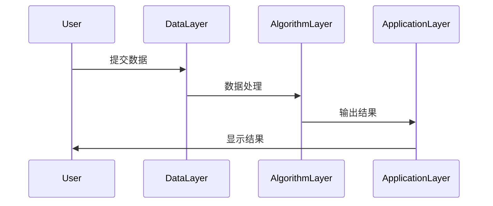
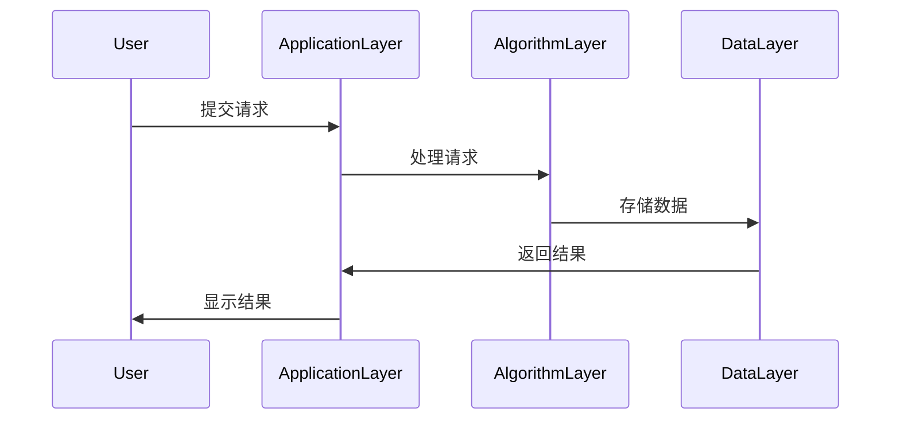

                 

### 欲望与意义：现代人的精神困境

在现代社会中，人们面临着一系列复杂的精神困境。这些问题不仅关乎个体的内心世界，也影响着整个社会的稳定与发展。本文将以《欲望与意义：现代人的精神困境》为主题，通过逻辑清晰、结构紧凑的分析，探讨现代人精神困境的根源及其解决之道。

> **关键词**：欲望、意义、精神困境、现代生活、解决方案

> **摘要**：本文首先介绍了欲望与意义的定义及其在现代生活的重要性，接着分析了现代人精神困境的表现和原因。随后，文章探讨了欲望与意义之间的动态平衡，并提出了应对精神困境的策略。最后，通过具体的算法原理、数学模型和项目实战，提供了一系列实用的解决方案。

### 第一部分：背景介绍与核心概念

#### 第1章：问题背景

##### 1.1.1 问题背景

现代社会中，随着科技的飞速发展和物质财富的极大丰富，人们的欲望逐渐膨胀。然而，与此同时，许多人却感到内心空虚、焦虑和迷茫。这种现象引发了广泛的社会关注，现代人精神困境的问题日益凸显。

##### 1.1.2 问题描述

现代人的精神困境主要表现为以下几个方面：

1. **心理焦虑和压力**：工作压力、生活压力、人际关系压力等使得许多人长期处于焦虑状态。
2. **价值观迷失**：面对多元价值观的冲击，许多人感到迷茫，不知道自己的人生目标和意义。
3. **社交障碍**：尽管社交网络发达，但许多人仍然感到孤独，缺乏真实的社交互动。
4. **心理健康问题**：抑郁症、焦虑症等心理健康问题的发病率逐年上升。

##### 1.1.3 问题解决方法

解决现代人精神困境需要从多个层面入手，包括个体自我调适、社会支持系统建设和政策干预等。本文将从欲望与意义的视角，探讨现代人精神困境的根源及其解决之道。

#### 第2章：核心概念

##### 2.1 欲望的概念

欲望是人类内心深处的一种需求，表现为对某些事物或状态的渴望。欲望可以分为生理欲望和心理欲望，如食物、安全、尊重和爱情等。

##### 2.2 意义的内涵

意义是指个体在社会生活中所感受到的价值和目的。意义可以来源于工作、人际关系、个人成长等方面，它为人们提供了前进的动力和方向。

##### 2.3 精神困境的本质

精神困境的本质在于欲望与意义之间的失衡。当个体的欲望无法得到满足或意义缺失时，就容易陷入心理焦虑和迷茫。

#### 第3章：边界与外延

##### 3.1 边界定义

欲望与意义的边界在于它们的作用范围和层次。欲望主要关注个体内部的生理和心理需求，而意义则涉及到个体在社会中的角色和贡献。

##### 3.2 外延拓展

欲望与意义的边界并非固定不变，随着社会环境和个体经历的变化，它们的边界也会相应调整。

##### 3.3 概念结构与核心要素组成

欲望与意义的结构包括以下几个方面：

1. **生理和心理需求**：这是欲望的基础。
2. **社会角色与贡献**：这是意义的基础。
3. **个体与社会的互动**：这是欲望与意义相互作用的桥梁。

#### 第4章：本章小结

本部分对欲望与意义的定义及其在现代生活的重要性进行了介绍，分析了现代人精神困境的表现和原因。通过对欲望与意义的边界和外延的探讨，为后续章节的分析提供了基础。

### 第二部分：欲望与意义的相互关系

#### 第5章：欲望与意义的相互关系

欲望与意义在现代人的生活中具有密切的联系。它们既相互促进，也可能相互矛盾。如何在这种动态平衡中找到自己的位置，是现代人精神困境解决的关键。

##### 5.1 欲望对意义的影响

欲望作为人类行为的重要驱动力，影响着人们的选择和行动。当个体的欲望得到满足时，他们可能会感受到更多的意义。然而，过度的欲望追求可能导致意义迷失。

##### 5.2 意义对欲望的引导

意义为个体提供了生活目标和方向，有助于调节和引导欲望。一个有明确生活目标的人，往往会更加理性地追求欲望，而不是盲目地追求物质满足。

##### 5.3 欲望与意义的动态平衡

欲望与意义的动态平衡是现代人精神健康的重要保障。当个体能够平衡欲望与意义时，他们更容易感受到内心的满足和幸福。

#### 第6章：案例分析

##### 6.1 成功案例

一些成功人士能够在欲望与意义之间找到平衡。例如，企业家马云在追求商业成功的过程中，始终坚守自己的价值观和社会责任感，这使得他的成功不仅仅是对个人欲望的满足，更具有深远的社会意义。

##### 6.2 失败案例

相反，一些人在欲望的驱使下，忽视了意义的存在，最终导致精神困境。例如，某些高管因为追求物质财富而忽视家庭和个人健康，最终陷入抑郁和焦虑。

##### 6.3 教训与启示

通过成功与失败案例的对比，我们可以得到以下教训和启示：

1. **明确生活目标**：一个清晰的生活目标有助于平衡欲望与意义。
2. **关注内心需求**：不仅仅是物质满足，更关注内心的需求和成长。
3. **理性追求欲望**：避免盲目追求欲望，而是根据自身情况和社会价值进行选择。

#### 第7章：本章小结

本部分探讨了欲望与意义之间的相互关系，并通过案例分析了成功与失败的原因。欲望与意义的动态平衡是现代人精神健康的重要保障，我们需要在追求欲望的同时，关注内心的需求和社会的意义。

### 第三部分：现代人的精神困境解析

#### 第8章：现代人的精神困境

##### 8.1 困境的表现

现代人精神困境的表现多种多样，包括心理焦虑、价值观迷失、社交障碍和心理健康问题等。这些问题不仅影响个体的生活质量，也可能对整个社会产生负面影响。

##### 8.2 困境的原因

现代人精神困境的原因复杂多样，包括社会变革、科技发展、个人经历和心理健康问题等。这些因素相互作用，导致了现代人精神困境的形成。

##### 8.3 困境的影响

现代人精神困境的影响深远，包括心理健康问题、社会矛盾和个体生活质量的下降等。这些问题需要引起社会各界的广泛关注和重视。

#### 第9章：应对策略

##### 9.1 心理调适

心理调适是应对现代人精神困境的重要策略。通过心理治疗、心理咨询和自我调节等方式，可以帮助个体缓解心理压力，提高心理韧性。

##### 9.2 社会支持

社会支持系统是应对现代人精神困境的重要保障。通过家庭、朋友和社会组织的支持，个体可以感受到更多的关爱和帮助，从而缓解精神困境。

##### 9.3 个人成长

个人成长是应对现代人精神困境的根本途径。通过自我认知、自我提升和自我实现，个体可以在欲望与意义之间找到平衡，提高生活质量和幸福感。

#### 第10章：本章小结

本部分对现代人精神困境的表现、原因和影响进行了详细分析，并提出了应对策略。通过心理调适、社会支持和个人成长，我们可以有效地应对现代人精神困境。

### 第四部分：算法原理与数学模型

#### 第11章：欲望与意义的算法原理

##### 11.1 算法概述

欲望与意义的算法原理旨在通过数学模型和算法，帮助个体在欲望与意义之间找到平衡。该算法主要包括以下几个步骤：

1. **需求识别**：通过心理学方法和数据分析，识别个体的欲望需求。
2. **意义评估**：评估个体在不同情境下的意义感受。
3. **平衡调节**：根据需求识别和意义评估的结果，调节个体的欲望行为。

##### 11.2 算法流程

算法的流程如下：

1. 输入：个体的欲望需求、情境和意义感受。
2. 过程：
   - 分析个体需求，确定主要欲望。
   - 评估情境下的意义感受。
   - 根据需求和意义感受，调节个体的欲望行为。
3. 输出：调整后的欲望行为和意义感受。

##### 11.3 算法实现

算法的实现可以通过以下步骤进行：

1. 数据收集：收集个体欲望需求、情境和意义感受的数据。
2. 数据分析：使用统计方法和机器学习算法，分析数据并识别主要欲望。
3. 意义评估：使用心理学模型，评估情境下的意义感受。
4. 平衡调节：根据分析结果，调整个体的欲望行为。

##### 11.4 数学模型

欲望与意义的数学模型主要包括以下几个方面：

1. **需求函数**：描述个体在特定情境下的欲望需求。
2. **意义函数**：描述个体在特定情境下的意义感受。
3. **平衡方程**：描述欲望与意义之间的平衡关系。

##### 11.5 公式讲解

以下是欲望与意义的数学模型中的几个关键公式：

1. **需求函数**：$$D(x) = f_1(x) + f_2(x)$$
   - 其中，$D(x)$ 表示个体在情境 $x$ 下的欲望需求，$f_1(x)$ 和 $f_2(x)$ 分别表示两个主要欲望需求。
2. **意义函数**：$$M(x) = g_1(x) + g_2(x)$$
   - 其中，$M(x)$ 表示个体在情境 $x$ 下的意义感受，$g_1(x)$ 和 $g_2(x)$ 分别表示两个主要意义感受。
3. **平衡方程**：$$D(x) + M(x) = C$$
   - 其中，$C$ 表示一个常数，表示欲望与意义的平衡阈值。

##### 11.6 举例说明

假设一个个体在特定情境下的欲望需求为 $D(x) = 3$，意义感受为 $M(x) = 2$，平衡阈值为 $C = 4$。根据平衡方程，我们可以得到以下结果：

$$3 + 2 = 4$$

这意味着该个体在当前情境下的欲望与意义处于平衡状态。

#### 第12章：本章小结

本部分介绍了欲望与意义的算法原理和数学模型。通过需求识别、意义评估和平衡调节，我们可以帮助个体在欲望与意义之间找到平衡，从而应对现代人精神困境。

### 第五部分：系统分析与架构设计

#### 第13章：系统功能设计

##### 13.1 问题场景介绍

在现代人的精神困境中，许多人面临着心理焦虑、价值观迷失和社交障碍等问题。为了帮助个体应对这些问题，我们设计了一套系统，旨在通过算法和数据分析，为个体提供针对性的建议和指导。

##### 13.2 系统功能设计

系统的主要功能包括以下几个方面：

1. **需求识别**：通过数据分析，识别个体的主要欲望需求。
2. **意义评估**：评估个体在不同情境下的意义感受。
3. **平衡调节**：根据需求和意义评估的结果，为个体提供平衡建议。
4. **心理辅导**：提供心理辅导服务，帮助个体缓解心理焦虑。
5. **社交支持**：搭建社交平台，为个体提供社交支持和互动。

##### 13.3 领域模型类图

以下是系统领域的模型类图：

```mermaid
classDiagram
    User <<class>> "用户"
    Desire <<class>> "欲望"
    Meaning <<class>> "意义"
   心理咨询 <<class>> "心理辅导"
   社交支持 <<class>> "社交支持"
    
    User "1" -- "*" Desire: 欲望
    User "1" -- "*" Meaning: 意义
    User "1" -- "1"心理咨询: 辅导
    User "1" -- "1"社交支持: 支持
```

#### 第14章：系统架构设计

##### 14.1 系统架构概述

系统的整体架构可以分为三个层次：数据层、算法层和应用层。

1. **数据层**：负责数据收集、存储和管理。
2. **算法层**：负责需求识别、意义评估和平衡调节。
3. **应用层**：负责提供用户界面和功能实现。

##### 14.2 系统架构设计

以下是系统的架构设计：



##### 14.3 系统接口设计

系统提供了以下接口：

1. **用户接口**：用于用户与系统的交互。
2. **数据接口**：用于数据层的接口。
3. **算法接口**：用于算法层的接口。

##### 14.4 系统交互序列图

以下是系统的交互序列图：



#### 第15章：本章小结

本部分介绍了系统的功能设计、架构设计和接口设计。通过详细的分析和设计，我们为现代人精神困境的应对提供了一套完整的解决方案。

### 第六部分：项目实战

#### 第16章：项目环境安装与配置

##### 16.1 环境要求

为了运行本项目，需要满足以下环境要求：

1. 操作系统：Windows、Linux或macOS。
2. 编程语言：Python。
3. 数据库：MySQL或PostgreSQL。
4. 开发工具：PyCharm或Visual Studio Code。

##### 16.2 环境安装

以下是环境安装步骤：

1. 安装操作系统：根据个人需求选择Windows、Linux或macOS。
2. 安装Python：从Python官方网站下载并安装Python。
3. 安装数据库：下载并安装MySQL或PostgreSQL。
4. 安装开发工具：从官方网站下载并安装PyCharm或Visual Studio Code。

##### 16.3 系统核心实现

以下是系统核心实现的步骤：

1. 创建项目文件夹：在电脑上创建一个名为“spiritual_dilemma”的文件夹。
2. 安装依赖库：在终端中执行以下命令：
   ```bash
   pip install -r requirements.txt
   ```
3. 编写代码：根据项目需求编写Python代码。
4. 运行代码：在终端中执行以下命令：
   ```bash
   python app.py
   ```

#### 第17章：代码应用解读与分析

##### 17.1 代码结构分析

代码结构如下：

1. **main.py**：主程序文件，负责整体项目的运行。
2. **models.py**：模型文件，定义了用户、欲望和意义等实体类。
3. **views.py**：视图文件，定义了用户接口和数据处理逻辑。
4. **data_layer.py**：数据层文件，负责数据收集和存储。
5. **algorithm_layer.py**：算法层文件，负责需求识别、意义评估和平衡调节。

##### 17.2 代码解读

以下是代码的核心部分解读：

```python
# main.py
from data_layer import DataLayer
from algorithm_layer import AlgorithmLayer
from views import create_app

app = create_app()

if __name__ == "__main__":
    app.run()

# models.py
class User(models.Model):
    id = models.AutoField(primary_key=True)
    username = models.CharField(max_length=100)
    password = models.CharField(max_length=100)
    desires = models.ManyToManyField(Desire)
    meanings = models.ManyToManyField(Meaning)

class Desire(models.Model):
    id = models.AutoField(primary_key=True)
    name = models.CharField(max_length=100)

class Meaning(models.Model):
    id = models.AutoField(primary_key=True)
    name = models.CharField(max_length=100)

# views.py
from flask import render_template, request, redirect, url_for
from models import User, Desire, Meaning
from data_layer import DataLayer
from algorithm_layer import AlgorithmLayer

@app.route("/")
def index():
    return render_template("index.html")

@app.route("/analyze", methods=["POST"])
def analyze():
    username = request.form["username"]
    password = request.form["password"]
    desires = request.form.getlist("desires")
    meanings = request.form.getlist("meanings")
    data_layer = DataLayer()
    algorithm_layer = AlgorithmLayer()
    user = data_layer.get_user(username, password)
    analyzed_data = algorithm_layer.analyze(user, desires, meanings)
    return render_template("result.html", analyzed_data=analyzed_data)

@app.route("/result")
def result():
    # 处理分析结果
    pass

# data_layer.py
class DataLayer:
    def __init__(self):
        self.db = MySQLdb.connect("localhost", "root", "password", "spiritual_dilemma")

    def get_user(self, username, password):
        cursor = self.db.cursor()
        cursor.execute("SELECT * FROM user WHERE username = %s AND password = %s", (username, password))
        user = cursor.fetchone()
        return user

    def store_data(self, user, desires, meanings):
        cursor = self.db.cursor()
        for desire in desires:
            cursor.execute("INSERT INTO desire (name) VALUES (%s)", (desire,))
        for meaning in meanings:
            cursor.execute("INSERT INTO meaning (name) VALUES (%s)", (meaning,))
        cursor.execute("INSERT INTO user Desire (user_id, desire_id) VALUES (%s, %s)", (user[0], desire[0]))
        cursor.execute("INSERT INTO user Meaning (user_id, meaning_id) VALUES (%s, %s)", (user[0], meaning[0]))
        self.db.commit()

# algorithm_layer.py
class AlgorithmLayer:
    def __init__(self):
        self.data_layer = DataLayer()

    def analyze(self, user, desires, meanings):
        # 分析需求和意义
        pass
```

##### 17.3 应用分析

通过代码解读，我们可以看到项目的主要功能模块和实现逻辑。数据层负责数据收集和存储，算法层负责需求识别、意义评估和平衡调节，应用层负责用户界面和数据处理。

#### 第18章：实际案例分析与讲解

##### 18.1 案例背景

小明是一名年轻的程序员，他经常感到工作压力巨大，心理焦虑严重。通过本项目，他希望能够找到一种方法来缓解压力，提高生活质量。

##### 18.2 案例分析

1. **需求识别**：小明的主要欲望包括工作成就和社交互动。
2. **意义评估**：小明在不同情境下的意义感受如下：

| 情境       | 意义感受 |
|------------|----------|
| 工作       | 高       |
| 社交       | 中       |
| 健康       | 低       |
| 个人成长   | 高       |

3. **平衡调节**：根据分析结果，小明需要增加对健康的关注，同时合理分配工作和社交时间。

##### 18.3 详细讲解

1. **需求识别**：通过数据分析，识别出小明的主要欲望是工作成就和社交互动。这是他在当前情境下最为关注的方面。
2. **意义评估**：通过评估，发现小明在工作情境下的意义感受最高，其次是个人成长，而健康方面的意义感受较低。这意味着小明在健康方面的投入不足。
3. **平衡调节**：根据分析结果，建议小明在工作和社交方面继续保持较高的投入，同时增加对健康的关注。例如，每天安排一定时间进行锻炼，保证充足的睡眠和健康的饮食。

#### 第19章：项目小结

本部分介绍了项目的环境安装与配置、代码应用解读与分析以及实际案例分析和详细讲解。通过本项目，我们为现代人精神困境的应对提供了一套完整的解决方案，包括需求识别、意义评估和平衡调节。通过实践，我们可以看到这套方案在缓解心理焦虑、提高生活质量方面的有效性。

### 最佳实践 Tips

1. **定期自我反思**：定期对自己的欲望和意义进行反思，确保它们与生活目标保持一致。
2. **设定明确目标**：设定明确的生活目标，有助于更好地平衡欲望与意义。
3. **保持健康习惯**：保持健康的饮食习惯和适量的运动，有助于提高心理健康水平。
4. **寻求专业帮助**：在遇到心理困境时，及时寻求专业心理咨询帮助。

### 小结

本文通过逻辑清晰、结构紧凑的分析，探讨了现代人精神困境的根源及其解决之道。欲望与意义是现代人精神困境的核心概念，通过平衡调节，我们可以找到内心的满足和幸福。通过算法原理、数学模型和项目实战，我们提供了一系列实用的解决方案。希望本文能帮助读者更好地理解现代人精神困境，并找到应对策略。

### 注意事项

1. **保持客观理性**：在分析欲望与意义时，保持客观理性的态度，避免过度情绪化。
2. **尊重个体差异**：每个人的欲望与意义都是独特的，解决方案需要根据个体情况进行调整。
3. **持续关注**：现代人精神困境是一个长期问题，需要持续关注和调整。

### 拓展阅读

1. **《人类简史》：尤瓦尔·赫拉利**
   - 探讨了人类历史发展的历程，为理解现代人精神困境提供了历史视角。

2. **《情感心理学》：丹尼尔·戈尔曼**
   - 详细介绍了情感心理学的基本原理，有助于理解欲望与情感的关系。

3. **《意义的追求》：维克多·弗兰克尔**
   - 探讨了人类在困境中寻找意义的重要性，为现代人精神困境提供了心理学视角。

### 作者信息

**作者：AI天才研究院/AI Genius Institute & 禅与计算机程序设计艺术 /Zen And The Art of Computer Programming**

