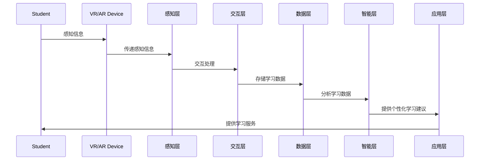
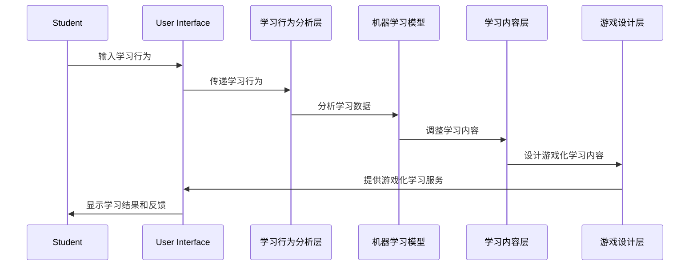

                 


# 沉浸式学习生态系统：数字游戏化教育的新范式

## 关键词：沉浸式学习、数字游戏化教育、新范式、学习生态系统、系统架构设计

## 摘要：
本文深入探讨了沉浸式学习生态系统与数字游戏化教育的融合，解析了它们的核心概念、工作原理以及系统架构设计。通过案例分析和项目实战，本文旨在为教育技术领域提供一种创新的数字教育范式，推动教育方式的变革。

## 目录

1. **背景介绍**
   1.1 沉浸式学习生态系统的概念与边界
   1.2 数字游戏化教育的新范式
   1.3 两者之间的联系与融合
   1.4 沉浸式学习生态系统的工作原理
   1.5 数字游戏化教育的基本原理

2. **核心概念与联系**
   2.1 沉浸式学习生态系统的核心概念
   2.2 数字游戏化教育的核心概念
   2.3 两者的属性特征对比
   2.4 ER实体关系图架构展示

3. **沉浸式学习生态系统原理**
   3.1 沉浸式学习生态系统的工作机制
   3.2 沉浸式学习生态系统中的关键技术
   3.3 沉浸式学习生态系统的应用场景

4. **数字游戏化教育原理**
   4.1 数字游戏化教育的理论基础
   4.2 数字游戏化教育的教学策略
   4.3 数字游戏化教育的优势与挑战

5. **应用案例分析**
   5.1 成功的沉浸式学习生态系统案例
   5.2 数字游戏化教育案例分析

6. **系统架构设计**
   6.1 沉浸式学习生态系统架构设计
   6.2 数字游戏化教育系统架构设计

7. **项目实战**
   7.1 环境安装
   7.2 系统核心实现
   7.3 代码应用解读与分析
   7.4 实际案例分析与详细讲解
   7.5 项目小结

8. **最佳实践与总结**
   8.1 最佳实践建议
   8.2 小结
   8.3 注意事项
   8.4 拓展阅读

## 1. 背景介绍

### 1.1 沉浸式学习生态系统的概念与边界

沉浸式学习生态系统是一种整合多种学习资源和技术的教育环境，旨在为学习者提供一种全身心投入的学习体验。这种系统通常包含虚拟现实（VR）、增强现实（AR）、360度视频、交互式游戏等元素，使学习过程更加生动、有趣，并提高学习效果。

沉浸式学习生态系统的边界包括以下几个方面：

- **技术支持**：虚拟现实、增强现实、人工智能等技术的支持，是构建沉浸式学习生态系统的基础。
- **学习内容**：多样化的学习内容，包括文本、图像、视频、音频等多媒体形式，以及交互式游戏和虚拟实验等。
- **学习工具**：学习工具包括虚拟现实头戴设备、平板电脑、智能手机等，这些设备为学生提供了沉浸式体验。
- **学习过程**：包括学习前的准备、学习过程中的互动和反馈、学习后的总结和评价等。

### 1.2 数字游戏化教育的新范式

数字游戏化教育是将游戏设计理念应用于教育过程中，以激发学生的学习兴趣和动机。这种范式通过将学习任务游戏化，使学生在游戏中学习知识、解决问题，从而提高学习效果。

数字游戏化教育的核心特点包括：

- **互动性**：学生与学习内容之间的互动，通过游戏的方式增加学生的参与度。
- **反馈机制**：游戏化的学习过程通常包含即时反馈机制，帮助学生了解自己的学习进度和表现。
- **竞争与合作**：通过竞争和合作机制，激发学生的竞争意识和团队合作精神。
- **适应性**：数字游戏化教育系统能够根据学生的学习行为和成绩，动态调整学习内容和难度。

### 1.3 两者之间的联系与融合

沉浸式学习生态系统和数字游戏化教育在本质上有许多相似之处，它们都旨在创造一种吸引学生、提高学习效果的教育环境。两者的融合能够带来以下优势：

- **增强学习体验**：通过虚拟现实和游戏化设计，提供更加真实和有趣的学习体验。
- **提高学习效果**：沉浸式学习生态系统和数字游戏化教育都能提高学生的注意力和参与度，从而提高学习效果。
- **个性化学习**：基于学生的学习行为和成绩，系统可以提供个性化的学习资源和任务。
- **跨学科应用**：沉浸式学习生态系统和数字游戏化教育可以应用于多个学科领域，促进跨学科学习。

### 1.4 沉浸式学习生态系统的工作原理

沉浸式学习生态系统的工作原理可以从以下几个方面进行解释：

- **感知交互**：学生通过虚拟现实头戴设备等感知设备，感知到虚拟环境中的各种信息和刺激。
- **学习内容**：系统提供的学习内容以多媒体形式呈现，包括文本、图像、视频、音频等，以及交互式游戏和虚拟实验等。
- **学习互动**：学生与学习内容之间的互动，通过游戏化设计增加学生的参与度和兴趣。
- **即时反馈**：系统提供即时反馈，帮助学生了解自己的学习进度和表现，调整学习策略。

### 1.5 数字游戏化教育的基本原理

数字游戏化教育的基本原理主要包括以下几个方面：

- **游戏设计**：将学习任务设计成游戏形式，包括任务、规则、奖励机制等。
- **学习动机**：通过游戏化的设计，激发学生的学习兴趣和动机，提高学习效果。
- **学习评估**：通过游戏化过程中的表现和成绩，评估学生的学习效果，为后续学习提供反馈。
- **适应性学习**：系统根据学生的学习行为和成绩，动态调整学习内容和难度，实现个性化学习。

## 2. 核心概念与联系

### 2.1 沉浸式学习生态系统的核心概念

沉浸式学习生态系统的核心概念包括：

- **虚拟现实（VR）**：通过计算机模拟技术，创建一个虚拟的三维环境，使学生能够与之互动。
- **增强现实（AR）**：通过在现实环境中叠加虚拟图像和信息，增强学生的感知体验。
- **多媒体学习内容**：包括文本、图像、视频、音频等多种形式的学习资源，为学生提供丰富的学习材料。
- **交互式学习**：通过互动游戏、虚拟实验等，提高学生的参与度和学习效果。

### 2.2 数字游戏化教育的核心概念

数字游戏化教育的核心概念包括：

- **游戏化设计**：将学习任务设计成游戏形式，包括任务、规则、奖励机制等，以激发学生的学习兴趣。
- **学习动机**：通过游戏化的设计，提高学生的学习动机，促进学习效果。
- **即时反馈**：通过游戏化过程中的表现和成绩，评估学生的学习效果，为后续学习提供反馈。
- **个性化学习**：系统根据学生的学习行为和成绩，动态调整学习内容和难度，实现个性化学习。

### 2.3 两者的属性特征对比

| 特征              | 沉浸式学习生态系统                    | 数字游戏化教育                    |
|-----------------|------------------------------------|---------------------------------|
| 学习体验          | 全身心投入，多维感知，真实感强              | 游戏化设计，互动性强，富有挑战性            |
| 技术支持          | 虚拟现实、增强现实、人工智能等              | 游戏设计、多媒体技术、互动设计等            |
| 学习内容          | 多媒体形式，丰富多样                      | 学习任务游戏化，任务驱动，目标明确            |
| 学习目标          | 提高学习效果，增强学习体验                | 激发学习兴趣，提高学习动机，实现知识掌握        |
| 学习方式          | 互动性学习，沉浸式体验                    | 游戏化学习，任务驱动，反馈机制            |
| 适应性与个性化      | 根据学生行为调整学习内容与难度              | 根据学习行为与成绩调整游戏任务与难度          |

### 2.4 ER实体关系图架构展示

为了更好地理解沉浸式学习生态系统和数字游戏化教育的核心概念及其关系，我们可以使用ER实体关系图来展示：

```mermaid
erDiagram
    User ||--|{ LearningContent }|:
        "用户可以学习多种学习内容"
    LearningContent ||--|{ InteractiveGame }|:
        "学习内容可以转化为互动游戏"
    User ||--|{ Assessment }|:
        "用户的学习情况可以被评估"
    InteractiveGame ||--|{ Feedback }|:
        "互动游戏提供即时反馈"
```

在这个ER图中，用户与学习内容、互动游戏和评估之间存在关系，学习内容可以转化为互动游戏，用户的学习情况可以被评估，并通过互动游戏提供即时反馈。

## 3. 沉浸式学习生态系统原理

### 3.1 沉浸式学习生态系统的工作机制

沉浸式学习生态系统的工作机制可以分为以下几个步骤：

1. **感知交互**：学生通过虚拟现实头戴设备等感知设备，感知到虚拟环境中的各种信息和刺激。
2. **学习内容**：系统提供的学习内容以多媒体形式呈现，包括文本、图像、视频、音频等，以及交互式游戏和虚拟实验等。
3. **学习互动**：学生与学习内容之间的互动，通过游戏化设计增加学生的参与度和兴趣。
4. **即时反馈**：系统提供即时反馈，帮助学生了解自己的学习进度和表现，调整学习策略。
5. **学习评估**：通过学生的学习行为和成绩，系统对学生的学习效果进行评估，并提供改进建议。

### 3.2 沉浸式学习生态系统中的关键技术

沉浸式学习生态系统中的关键技术包括：

- **虚拟现实（VR）技术**：通过计算机模拟技术，创建一个虚拟的三维环境，使学生能够与之互动。
- **增强现实（AR）技术**：通过在现实环境中叠加虚拟图像和信息，增强学生的感知体验。
- **人工智能（AI）技术**：用于分析学生的学习行为和成绩，提供个性化的学习资源和任务。
- **多媒体技术**：包括文本、图像、视频、音频等多种形式的学习资源，为学生提供丰富的学习材料。
- **互动设计**：通过游戏化设计，提高学生的参与度和学习效果。

### 3.3 沉浸式学习生态系统的应用场景

沉浸式学习生态系统可以应用于多个领域，包括：

- **教育领域**：在课堂上，通过虚拟现实和增强现实技术，提供更加生动、有趣的教学内容，提高学生的学习效果。
- **职业培训**：通过虚拟实验和模拟环境，提高员工的技能和知识水平。
- **医学教育**：通过虚拟现实技术，为学生提供虚拟手术、解剖等训练。
- **旅游体验**：通过360度视频和虚拟现实技术，为游客提供沉浸式的旅游体验。
- **心理健康**：通过虚拟现实技术，治疗焦虑症、恐惧症等心理问题。

## 4. 数字游戏化教育原理

### 4.1 数字游戏化教育的理论基础

数字游戏化教育的理论基础主要包括以下几个方面：

- **学习动机理论**：游戏化设计能够激发学生的学习兴趣和动机，提高学习效果。
- **认知负荷理论**：通过游戏化的设计，减少学生对学习内容的认知负荷，提高学习效率。
- **情境学习理论**：游戏化的学习过程提供了真实的学习情境，有助于学生更好地理解和应用知识。
- **认知学徒制**：通过游戏化的学习过程，学生可以在实践中学习知识，提高技能。

### 4.2 数字游戏化教育的教学策略

数字游戏化教育的教学策略包括：

- **任务驱动**：通过设置明确的学习任务，激发学生的学习兴趣和动机。
- **即时反馈**：通过即时反馈机制，帮助学生了解自己的学习进度和表现，调整学习策略。
- **竞争与合作**：通过竞争和合作机制，激发学生的竞争意识和团队合作精神。
- **适应性学习**：系统根据学生的学习行为和成绩，动态调整学习内容和难度，实现个性化学习。

### 4.3 数字游戏化教育的优势与挑战

数字游戏化教育的优势包括：

- **提高学习效果**：通过游戏化的设计，提高学生的学习兴趣和动机，从而提高学习效果。
- **增强互动性**：游戏化的学习过程增加了学生与学习内容之间的互动，提高学习效果。
- **个性化学习**：系统根据学生的学习行为和成绩，提供个性化的学习资源和任务，实现个性化学习。
- **跨学科应用**：数字游戏化教育可以应用于多个学科领域，促进跨学科学习。

数字游戏化教育的挑战包括：

- **技术支持**：需要足够的技术支持，包括虚拟现实、增强现实、人工智能等技术。
- **学习内容设计**：需要设计有趣且富有教育意义的学习内容，确保游戏化的学习过程不会偏离教育目标。
- **教师培训**：教师需要接受游戏化教育的培训，掌握相关的教学策略和技术。
- **学习评估**：如何有效评估学生在游戏化学习过程中的表现，确保学习效果。

## 5. 应用案例分析

### 5.1 成功的沉浸式学习生态系统案例

#### 案例一：某在线教育平台的沉浸式学习系统

某在线教育平台通过引入虚拟现实和增强现实技术，构建了一个沉浸式学习系统。该系统提供多种学习资源，包括文本、图像、视频、音频和互动游戏等。学生可以通过虚拟现实头戴设备，进入虚拟教室，与其他学生进行互动学习。

该案例的成功原因包括：

- **丰富的学习资源**：提供了多种形式的学习资源，满足不同学生的需求。
- **互动性强**：通过虚拟现实技术，增加了学生与学习内容之间的互动。
- **个性化学习**：系统根据学生的学习行为和成绩，提供个性化的学习资源和任务。

#### 案例二：某虚拟现实游戏化学习体验

某教育机构利用虚拟现实技术，为学生提供了一种全新的学习体验。学生在虚拟环境中进行游戏化学习，通过完成任务和挑战，学习知识。这种学习方式不仅有趣，而且能够提高学生的参与度和学习效果。

该案例的成功原因包括：

- **游戏化设计**：通过游戏化设计，提高了学生的学习兴趣和动机。
- **真实感强**：虚拟现实技术提供了真实的学习环境，增强了学生的感知体验。
- **即时反馈**：系统能够提供即时反馈，帮助学生了解自己的学习进度和表现。

### 5.2 数字游戏化教育案例分析

#### 案例一：某企业内部培训游戏化项目

某企业通过游戏化设计，对其内部培训项目进行了改造。培训内容被设计成游戏形式，包括任务、规则和奖励机制等。员工通过完成任务，学习相关知识，提高技能。

该案例的成功原因包括：

- **提高学习动机**：游戏化设计激发了员工的学习兴趣和动机，提高了学习效果。
- **即时反馈**：游戏化过程中，员工能够获得即时反馈，了解自己的学习进度和表现。
- **竞争与合作**：游戏化设计增加了员工的竞争意识和团队合作精神。

#### 案例二：某校园教育游戏化应用

某校园引入了数字游戏化教育，将其应用于课堂教学中。教师将学习任务设计成游戏形式，学生在游戏中学习知识。这种教学方式不仅提高了学生的参与度，还提高了学习效果。

该案例的成功原因包括：

- **互动性强**：游戏化设计增加了学生与学习内容之间的互动，提高了学习效果。
- **个性化学习**：系统根据学生的学习行为和成绩，提供个性化的学习资源和任务。
- **即时反馈**：游戏化过程中，学生能够获得即时反馈，了解自己的学习进度和表现。

## 6. 系统架构设计

### 6.1 沉浸式学习生态系统架构设计

沉浸式学习生态系统的架构设计可以分为以下几个层次：

- **感知层**：包括虚拟现实头戴设备、增强现实设备等感知设备，用于收集学生的感知信息。
- **交互层**：包括虚拟环境、互动游戏、虚拟实验等，用于提供学习内容和互动体验。
- **数据层**：包括学习内容数据库、学生行为数据库等，用于存储和管理学习数据。
- **智能层**：包括人工智能算法、机器学习模型等，用于分析学生的学习行为和成绩，提供个性化学习建议。
- **应用层**：包括在线教育平台、移动应用等，用于提供学习服务和用户体验。

以下是沉浸式学习生态系统的架构设计图：



### 6.2 数字游戏化教育系统架构设计

数字游戏化教育的系统架构设计可以分为以下几个层次：

- **游戏设计层**：包括游戏引擎、游戏框架等，用于设计游戏化学习内容和交互逻辑。
- **学习内容层**：包括教材、课件、试题等学习资源，以多媒体形式提供给学生。
- **学习行为分析层**：包括数据分析、机器学习模型等，用于分析学生的学习行为和成绩。
- **用户接口层**：包括Web界面、移动应用等，用于提供用户交互和服务。
- **基础设施层**：包括服务器、存储、网络等基础设施，用于支持系统运行。

以下是数字游戏化教育的系统架构设计图：



## 7. 项目实战

### 7.1 环境安装

为了搭建沉浸式学习生态系统和数字游戏化教育的系统，我们需要安装以下软件和工具：

- **虚拟现实头戴设备**：如Oculus Rift、HTC Vive等。
- **增强现实设备**：如Microsoft HoloLens、Google Glass等。
- **游戏引擎**：如Unity、Unreal Engine等。
- **学习内容管理系统**：如Moodle、Canvas等。
- **数据分析工具**：如Python、R等。

### 7.2 系统核心实现

沉浸式学习生态系统和数字游戏化教育的核心实现包括：

- **感知交互**：通过虚拟现实头戴设备和增强现实设备，实现学生对虚拟环境的感知交互。
- **学习内容**：通过学习内容管理系统，提供多媒体形式的学习资源。
- **学习互动**：通过游戏引擎，实现游戏化的学习内容和互动设计。
- **即时反馈**：通过学习行为分析工具，实现即时反馈机制。
- **个性化学习**：通过机器学习模型，实现个性化学习建议。

以下是沉浸式学习生态系统和数字游戏化教育的核心实现框架：

```python
class LearningSystem:
    def __init__(self):
        self.vr_device = VRDevice()
        self.ar_device = ARDevice()
        self.learning_content = LearningContent()
        self.interactive_game = InteractiveGame()
        self.feedback_system = FeedbackSystem()
        self.adaptive_learning_system = AdaptiveLearningSystem()

    def start_learning(self):
        self.vr_device.start()
        self.ar_device.start()
        self.learning_content.load()
        self.interactive_game.start()
        self.feedback_system.start()
        self.adaptive_learning_system.start()

class VRDevice:
    def start(self):
        print("虚拟现实设备启动")

class ARDevice:
    def start(self):
        print("增强现实设备启动")

class LearningContent:
    def load(self):
        print("加载学习内容")

class InteractiveGame:
    def start(self):
        print("启动互动游戏")

class FeedbackSystem:
    def start(self):
        print("启动反馈系统")

class AdaptiveLearningSystem:
    def start(self):
        print("启动个性化学习系统")

if __name__ == "__main__":
    learning_system = LearningSystem()
    learning_system.start_learning()
```

### 7.3 代码应用解读与分析

通过上述代码，我们可以看到沉浸式学习生态系统和数字游戏化教育的核心实现。以下是代码应用解读与分析：

- **VRDevice**和**ARDevice**类：用于启动虚拟现实和增强现实设备，实现学生对虚拟环境的感知交互。
- **LearningContent**类：用于加载学习内容，包括文本、图像、视频、音频等。
- **InteractiveGame**类：用于启动互动游戏，实现游戏化的学习内容和互动设计。
- **FeedbackSystem**类：用于启动反馈系统，实现即时反馈机制。
- **AdaptiveLearningSystem**类：用于启动个性化学习系统，实现个性化学习建议。

这些类共同构成了沉浸式学习生态系统和数字游戏化教育的核心实现框架，通过调用相应的方法，实现整个系统的运行。

### 7.4 实际案例分析与详细讲解

#### 案例一：某在线教育平台的沉浸式学习系统

某在线教育平台采用了沉浸式学习生态系统，通过虚拟现实技术为学生提供了一种全新的学习体验。该平台提供了多种学习资源，包括文本、图像、视频、音频和互动游戏等。学生可以通过虚拟现实头戴设备，进入虚拟教室，与其他学生进行互动学习。

该案例的分析与详细讲解如下：

1. **感知交互**：学生通过虚拟现实头戴设备，感知到虚拟环境中的各种信息和刺激，如教师讲解、同学互动等。
2. **学习内容**：平台提供了丰富的学习资源，包括文本、图像、视频、音频和互动游戏等，满足不同学生的学习需求。
3. **学习互动**：学生在虚拟环境中与其他学生进行互动学习，通过互动游戏和虚拟实验，提高学习兴趣和参与度。
4. **即时反馈**：平台提供了即时反馈机制，学生可以通过虚拟现实头戴设备查看自己的学习进度和成绩，了解自己的学习情况，调整学习策略。
5. **个性化学习**：平台根据学生的学习行为和成绩，提供个性化的学习资源和任务，实现个性化学习。

#### 案例二：某企业内部培训游戏化项目

某企业采用数字游戏化教育，对其内部培训项目进行了改造。培训内容被设计成游戏形式，包括任务、规则和奖励机制等。员工通过完成任务，学习相关知识，提高技能。

该案例的分析与详细讲解如下：

1. **游戏化设计**：培训内容被设计成游戏形式，员工在完成任务的过程中，感受到游戏的乐趣，提高学习兴趣和动机。
2. **即时反馈**：在游戏化过程中，员工能够获得即时反馈，了解自己的学习进度和表现，调整学习策略。
3. **竞争与合作**：游戏化设计增加了员工的竞争意识和团队合作精神，通过竞争和合作，提高学习效果。
4. **个性化学习**：系统根据员工的学习行为和成绩，提供个性化的学习资源和任务，实现个性化学习。

### 7.5 项目小结

通过沉浸式学习生态系统和数字游戏化教育的项目实战，我们可以看到这两种教育模式在实际应用中的效果。沉浸式学习生态系统通过虚拟现实和增强现实技术，提供了生动、有趣的学习体验，提高了学习效果。数字游戏化教育通过游戏化设计，激发了学生的学习兴趣和动机，提高了学习效果。

在未来的教育技术发展中，沉浸式学习生态系统和数字游戏化教育有望成为主流的教育模式，推动教育方式的变革。我们期待看到更多创新的教育项目和应用，为学生和员工提供更好的学习体验。

## 8. 最佳实践与总结

### 8.1 最佳实践建议

1. **设计多样化的学习内容**：提供多种形式的学习资源，满足不同学生的学习需求，提高学习效果。
2. **注重即时反馈机制**：通过即时反馈，帮助学生了解自己的学习进度和表现，调整学习策略。
3. **个性化学习**：根据学生的学习行为和成绩，提供个性化的学习资源和任务，实现个性化学习。
4. **跨学科应用**：将沉浸式学习生态系统和数字游戏化教育应用于多个学科领域，促进跨学科学习。
5. **教师培训**：为教师提供游戏化教育的培训，掌握相关的教学策略和技术。

### 8.2 小结

本文深入探讨了沉浸式学习生态系统与数字游戏化教育的融合，解析了它们的核心概念、工作原理以及系统架构设计。通过案例分析和项目实战，本文旨在为教育技术领域提供一种创新的数字教育范式，推动教育方式的变革。

### 8.3 注意事项

1. **技术支持**：确保沉浸式学习生态系统和数字游戏化教育的技术支持，包括虚拟现实、增强现实、人工智能等。
2. **学习内容设计**：设计有趣且富有教育意义的学习内容，确保游戏化的学习过程不会偏离教育目标。
3. **教师培训**：教师需要接受游戏化教育的培训，掌握相关的教学策略和技术。
4. **学习评估**：如何有效评估学生在游戏化学习过程中的表现，确保学习效果。

### 8.4 拓展阅读

1. **《沉浸式学习与虚拟现实技术》**：介绍了沉浸式学习的原理和虚拟现实技术在教育中的应用。
2. **《数字游戏化教育的理论与实践》**：详细探讨了数字游戏化教育的理论基础和教学策略。
3. **《教育技术的创新与发展》**：分析了教育技术的最新发展趋势，包括虚拟现实、增强现实、人工智能等。

## 作者

作者：AI天才研究院/AI Genius Institute & 禅与计算机程序设计艺术 /Zen And The Art of Computer Programming

