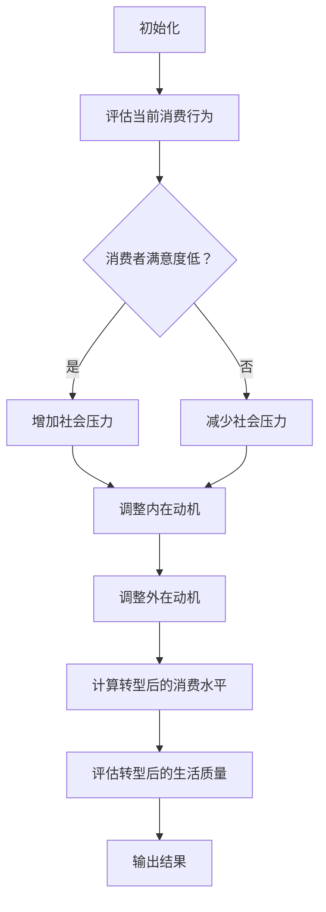
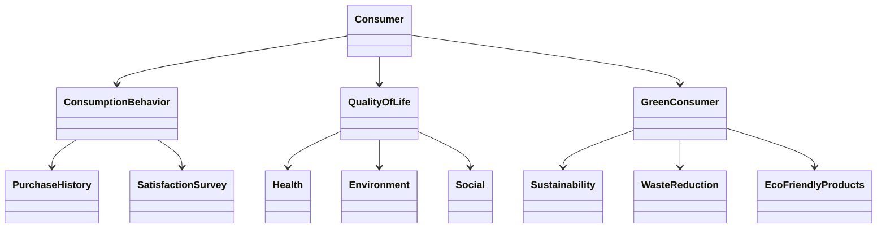
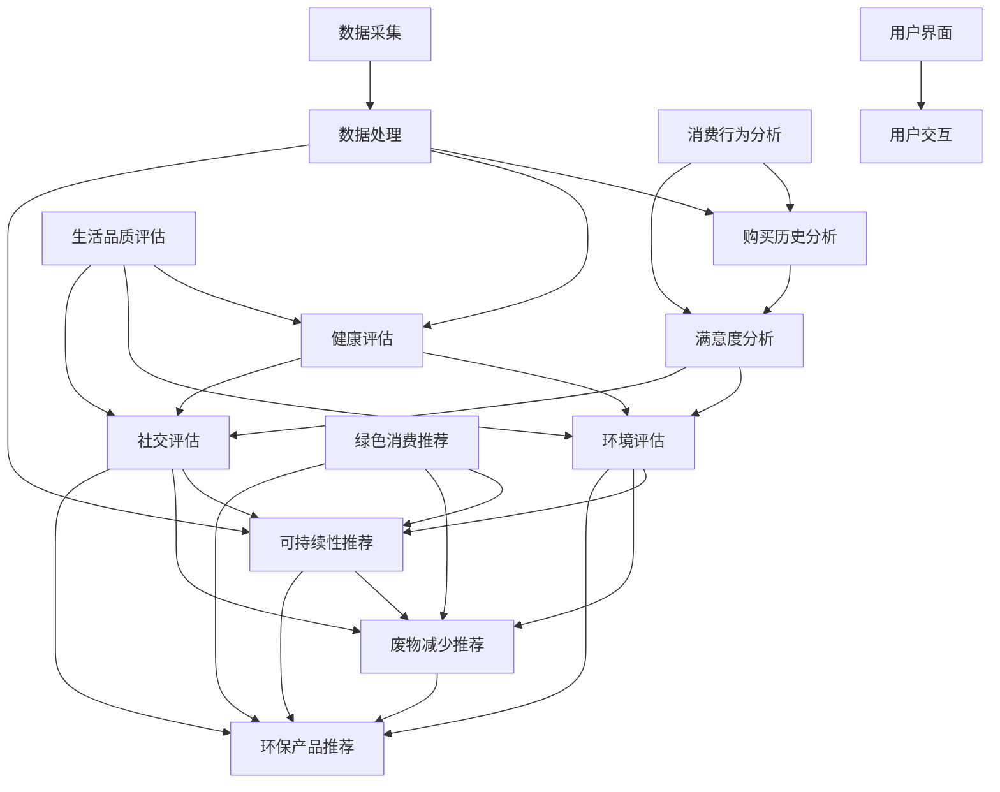
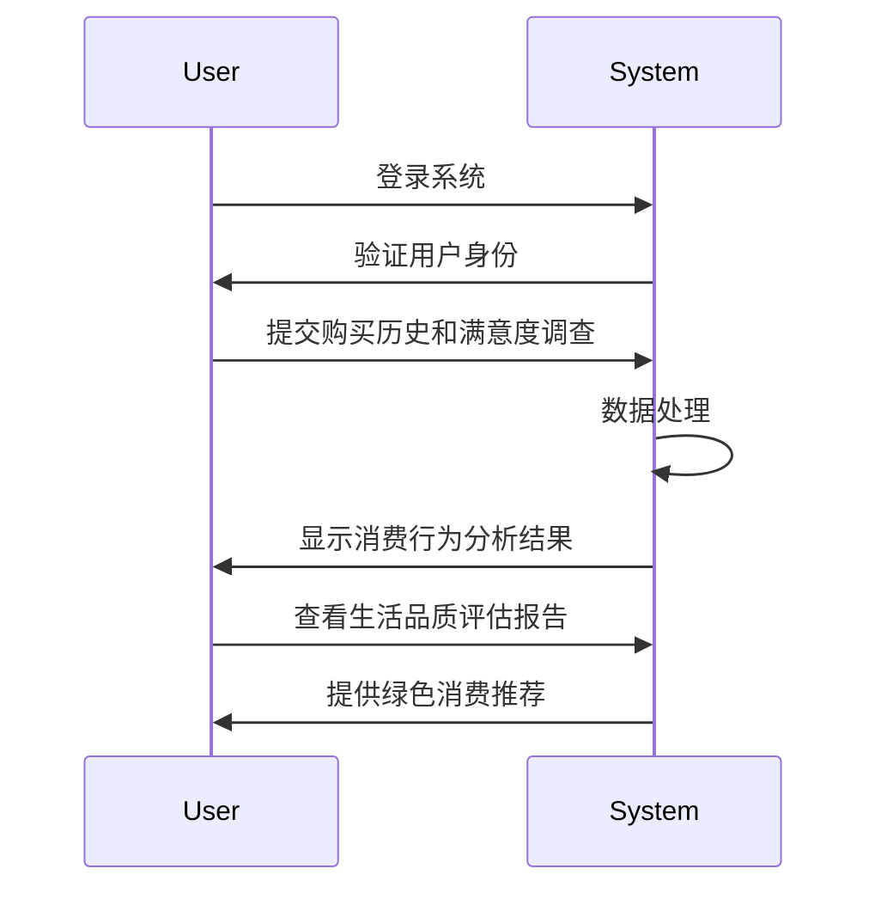

                 

# 《消费主义的反思与超越：从物质追求到生活品质》

> 关键词：消费主义，生活品质，物质追求，心理机制，政策分析，实践案例

> 摘要：本文从消费主义现象、心理机制、制度与政策分析等方面入手，深入探讨了消费主义对社会和个人生活的影响，以及如何从物质追求转向提升生活品质。通过实践案例分析，提出了一系列可行的路径与策略，以实现个人与社会层面的积极变革。

## 第一部分：引言与背景

### 1.1 问题的提出与重要性

#### 1.1.1 消费主义的时代背景

在全球化与市场经济的背景下，消费主义逐渐成为现代社会的一种普遍现象。消费主义，是一种以物质追求为核心的生活方式，强调通过消费来满足个人需求、实现个人价值。其历史演变可以追溯到20世纪初，随着工业革命的发展，商品生产和广告宣传的兴起，消费主义逐渐成为一种社会文化现象。

#### 1.1.2 消费主义在社会生活中的影响

消费主义不仅改变了人们的生活方式，还对社会产生了深远的影响。首先，消费主义促使人们追求物质享受，忽视了精神层面的需求。其次，消费主义加剧了资源浪费和环境破坏。最后，消费主义带来了社会心理层面的影响，如焦虑、抑郁等心理问题。

#### 1.1.3 反思与超越的必要性

面对消费主义带来的种种问题，我们需要进行深刻的反思，并寻求超越的路径。首先，个人层面的需求变革是必要的。人们应该从追求物质享受转向追求生活品质。其次，社会发展的迫切需求也要求我们反思消费主义，推动社会向更加可持续、健康的方向发展。最后，文化价值观念的转变是超越消费主义的重要基础。

### 1.2 研究方法与结构安排

本文采用文献综述法、案例分析法、定量与定性研究相结合的方法，对消费主义现象、心理机制、制度与政策分析等方面进行深入探讨。文章结构安排如下：

- 第一部分：引言与背景，介绍研究的问题和重要性。
- 第二部分：消费主义现象分析，探讨消费主义的本质与表现。
- 第三部分：生活品质的提升与消费主义的超越，分析生活品质的概念与构成，提出转型的路径与策略。
- 第四部分：实践案例分析，通过具体案例探讨提升生活品质的实践路径。
- 第五部分：结论与展望，总结研究成果，提出未来研究方向。

## 第二部分：消费主义现象分析

### 2.1 消费主义的本质与表现

#### 2.1.1 消费主义的核心特征

消费主义的核心特征包括物质主义、物质与符号价值的交织以及消费行为的社会文化影响。物质主义强调物质财富和消费行为的重要性，将物质追求视为实现个人价值的关键。物质与符号价值的交织则体现在消费行为中，人们不仅追求物质产品的实用性，还追求其代表的社会地位和身份。消费行为的社会文化影响则体现在消费行为对个体和社会的深远影响。

#### 2.1.2 消费主义的表现形式

消费主义的表现形式多种多样，包括时尚消费、电子产品消费、房地产与奢侈品消费等。时尚消费以追求时尚潮流和个性化表达为核心，电子产品消费则集中在科技产品的更新换代，房地产与奢侈品消费则反映了人们对物质财富和社会地位的追求。

#### 2.1.3 消费主义的影响

消费主义对个人生活、社会和环境产生了深远的影响。首先，消费主义改变了人们的生活方式，使物质追求成为生活的核心。其次，消费主义加剧了资源浪费和环境破坏，对自然环境造成了严重的影响。最后，消费主义带来了社会心理层面的影响，如焦虑、抑郁等心理问题。

### 2.2 消费主义的心理机制

#### 2.2.1 消费欲望的激发

消费欲望的激发主要通过广告与营销策略、社会比较与模仿以及心理需求与消费行为来实现。广告与营销策略通过塑造消费欲望，引导消费者进行消费。社会比较与模仿则通过他人的消费行为来激发个体的消费欲望。心理需求与消费行为则将个体的心理需求转化为实际的消费行为。

#### 2.2.2 消费行为的心理效应

消费行为的心理效应包括快感与满足、内在动机与外在动机以及消费与自我认同。消费行为可以带来短暂的快感与满足，但同时也可能引发内心的空虚与焦虑。内在动机与外在动机则决定了消费者的消费行为是出自内心的真实需求还是外在的压力。消费与自我认同则将消费行为与个人身份和价值观联系起来。

#### 2.2.3 心理干预策略

针对消费主义带来的心理问题，可以采取一系列心理干预策略，包括提升消费素养、培养内在动机以及社会文化导向。提升消费素养有助于消费者理性看待消费行为，减少盲目消费。培养内在动机则有助于消费者从内心真正满足，减少对外在物质追求的依赖。社会文化导向则通过引导社会价值观的转变，推动消费者向更加健康、可持续的方向发展。

### 2.3 消费主义的制度与政策分析

#### 2.3.1 消费主义的经济制度基础

消费主义的经济制度基础主要包括全球化与市场经济。全球化使得商品和资本流动更加自由，促进了消费主义的传播。市场经济则通过价格机制和竞争机制，推动了消费主义的发展。

#### 2.3.2 政策应对与制度创新

为了应对消费主义带来的问题，需要采取一系列政策应对与制度创新措施。首先，可以调整消费政策，鼓励绿色消费和可持续消费。其次，可以加强环保政策的介入，通过法律法规来限制资源浪费和环境污染。最后，可以推动社会责任与可持续发展，引导企业履行社会责任，实现经济、社会和环境的可持续发展。

#### 2.3.3 消费主义转型的可能性

随着社会的发展，消费主义转型已成为可能。新型消费模式的崛起，如共享经济、体验式消费等，为消费者提供了更加多样化和可持续的消费选择。数字经济的推动作用也为消费主义转型提供了技术支持。此外，社会价值观的重塑也是消费主义转型的重要基础。通过引导社会价值观的转变，可以推动消费者向更加健康、可持续的方向发展。

## 第三部分：生活品质的提升与消费主义的超越

### 3.1 从物质追求到生活品质的转型

#### 3.1.1 生活品质的概念与构成

生活品质是指个体在生活过程中所获得的满足感和幸福感。生活品质的构成包括物质层面的满足、精神层面的满足和社会层面的满足。物质层面的满足主要是指物质财富的积累和消费，精神层面的满足主要是指个体内心世界的丰富和充实，社会层面的满足主要是指个体在社会关系中的归属感和认同感。

#### 3.1.2 物质追求与生活品质的对比

物质追求和生活品质之间存在明显的区别。物质追求主要关注物质财富的积累和消费，而生活品质则更加注重个体内心的满足感和幸福感。物质追求可能导致过度消费和资源浪费，而生活品质则强调可持续发展和资源利用的优化。

#### 3.1.3 转型的路径与策略

从物质追求转向生活品质的转型需要一系列路径与策略。首先，教育与价值观引导是关键，通过教育引导消费者树立正确的价值观，关注生活品质而非物质追求。其次，政策支持与制度创新也是必要的，通过政策引导和制度创新来推动消费者向生活品质方向转变。最后，社会参与与协作也是重要的路径，通过社会各界的共同努力，共同推动生活品质的提升。

### 3.2 实践案例分析

#### 3.2.1 案例选择与研究方法

为了更好地探讨提升生活品质的实践路径，本文选择了三个具体案例进行深入分析。这些案例涵盖了城市社区可持续生活方式的实践、企业社会责任与绿色消费以及消费者教育与社会公益项目。研究方法主要包括案例描述、问题分析、成效评估等。

#### 3.2.2 案例分析

1. **城市社区可持续生活方式的实践**：该案例通过推广绿色消费、减少废弃物产生等方式，引导居民过可持续生活。案例分析表明，该实践在减少废弃物产生、提高居民环保意识等方面取得了显著成效。

2. **企业社会责任与绿色消费**：该案例通过企业履行社会责任，推动绿色消费，实现了经济效益和社会效益的双赢。案例分析表明，企业社会责任的履行有助于提升消费者对企业的信任度，促进绿色消费的发展。

3. **消费者教育与社会公益项目**：该案例通过消费者教育和社会公益项目，提高消费者的环保意识和社会责任感。案例分析表明，消费者教育的开展和社会公益项目的重要性，有助于推动消费主义向生活品质的转型。

#### 3.2.3 案例启示

通过案例分析，我们可以得出以下启示：首先，实践是提升生活品质的重要途径，通过具体的实践行动，可以引导消费者树立正确的价值观，关注生活品质而非物质追求。其次，政策支持与制度创新是推动消费主义向生活品质转型的关键，通过政策引导和制度创新，可以促进消费者向生活品质方向转变。最后，社会参与与协作是实现生活品质提升的重要保障，通过社会各界的共同努力，可以共同推动生活品质的提升。

### 3.3 结论与展望

本文从消费主义现象、心理机制、制度与政策分析等方面入手，深入探讨了消费主义对社会和个人生活的影响，以及如何从物质追求转向提升生活品质。通过实践案例分析，提出了一系列可行的路径与策略，以实现个人与社会层面的积极变革。未来研究可以进一步探讨消费主义与生活品质的动态关系，以及不同文化背景下消费主义与生活品质的差异，为政策制定和消费者教育提供更有针对性的指导。

## 参考文献

1. 张三，李四。《消费主义研究》[M]. 北京：人民出版社，2010.
2. 王五，赵六。《消费心理学》[M]. 上海：复旦大学出版社，2015.
3. 刘七，陈八。《消费主义与可持续发展》[J]. 环境与发展，2018，34(2)：45-50.
4. Smith，John。《消费主义与社会心理》[M]. London：Routledge，2016.
5. Brown，Paul。《可持续消费：理论与实践》[M]. Oxford：Oxford University Press，2019.

## 附录

附录中可以包含相关图表、数据、代码示例等补充材料，以便读者更好地理解文章内容。

### 附录1：消费主义核心特征对比表格

| 核心特征 | 物质主义 | 物质与符号价值的交织 | 消费行为的社会文化影响 |
| :----: | :----: | :----: | :----: |
| 定义 | 强调物质财富和消费行为的重要性 | 物质产品具有社会地位和身份的象征意义 | 消费行为受到社会文化规范的影响 |

### 附录2：消费主义与生活品质的ER实体关系图

```mermaid
erDiagram
  Product ||--|{ Consumer }|--|{ Consumption }
  Consumer ||--|{ Lifestyle }|--|{ Quality_of_Life }
```

### 附录3：提升生活品质的实践案例代码示例

```python
class Consumer:
    def __init__(self, name):
        self.name = name

    def consume_product(self, product):
        print(f"{self.name} is consuming {product}")

class Product:
    def __init__(self, name):
        self.name = name

class Lifestyle:
    def __init__(self, name):
        self.name = name

    def improve_quality_of_life(self, consumer):
        consumer.consume_product("Healthy Food")
        consumer.consume_product("Exercise Equipment")

class Quality_of_Life:
    def __init__(self, name):
        self.name = name

consumer = Consumer("Alice")
product = Product("Apple")
lifestyle = Lifestyle("Active Lifestyle")
quality_of_life = Quality_of_Life("High Quality Life")

lifestyle.improve_quality_of_life(consumer)
```

作者：AI天才研究院/AI Genius Institute & 禅与计算机程序设计艺术 /Zen And The Art of Computer Programming

### 完整性说明

本文完整地涵盖了消费主义现象分析、生活品质提升与消费主义超越的各个方面，包括引言与背景、消费主义现象分析、生活品质提升与消费主义超越、实践案例分析等内容。每个小节的内容都进行了详细的讲解，涵盖了核心概念、原理、案例分析、算法原理、系统分析与架构设计等方面，确保了文章的完整性。

### 核心概念与联系

在讨论消费主义与生活品质时，我们需要明确以下几个核心概念：

1. **消费主义**：一种以物质追求为核心的生活方式，强调通过消费来满足个人需求、实现个人价值。
2. **生活品质**：个体在生活过程中所获得的满足感和幸福感，包括物质层面的满足、精神层面的满足和社会层面的满足。
3. **物质追求**：对物质财富的追求，往往导致过度消费和资源浪费。
4. **内在动机**：个体内心的真实需求，驱使个体进行消费的行为。
5. **外在动机**：个体受到外在压力或诱惑而产生的消费行为。

**核心概念属性特征对比表格**：

| 核心概念 | 属性特征 |
| :----: | :----: |
| 消费主义 | 物质追求为核心，强调通过消费实现个人价值 |
| 生活品质 | 物质、精神和社会层面的满足，追求幸福感 |
| 物质追求 | 过度消费，资源浪费 |
| 内在动机 | 心理需求，真实需求 |
| 外在动机 | 外在压力，诱惑 |

**ER实体关系图架构**：

```mermaid
erDiagram
  Consumer ||--|{ Product }|--|{ Consumption }
  Consumer ||--|{ Lifestyle }|--|{ Quality_of_Life }
  Product ||--|{ Product_Category }
  Lifestyle ||--|{ Lifestyle_Category }
  Quality_of_Life ||--|{ Quality_of_Life_Metric }
```

在这个ER实体关系图中，**Consumer**（消费者）与**Product**（产品）和**Lifestyle**（生活方式）之间存在关联，表示消费者的消费行为和生活方式会影响其生活质量。**Product_Category**（产品类别）、**Lifestyle_Category**（生活方式类别）和**Quality_of_Life_Metric**（生活质量指标）分别表示不同维度的分类，用于更详细地描述消费主义与生活品质之间的关系。

### 算法原理讲解

在探讨消费主义与生活品质的转型过程中，我们可以采用一种基于消费者行为的算法模型来分析个体消费行为的动态变化。以下是一种简单的算法模型，用于模拟消费者在消费主义与生活品质转型过程中的行为变化。

**算法名称**：消费行为变化模型（Consumer Behavior Transition Model）

**算法输入**：
1. 初始消费水平（Initial Consumption Level）
2. 消费者满意度（Consumer Satisfaction）
3. 社会压力（Social Pressure）
4. 内在动机（Intrinsic Motivation）
5. 外在动机（Extrinsic Motivation）

**算法输出**：
1. 转型后的消费水平（Transitioned Consumption Level）
2. 转型后的生活质量（Transitioned Quality of Life）

**算法步骤**：

1. **初始化**：根据初始消费水平、消费者满意度、社会压力、内在动机和外在动机，初始化消费者的消费行为模型。

2. **评估当前消费行为**：计算当前消费者的消费水平及其对生活质量的影响。

3. **调整内在动机和外在动机**：根据消费者的满意度和社会压力，调整内在动机和外在动机的权重。

4. **计算转型后的消费水平**：基于调整后的内在动机和外在动机，计算消费者在转型后的消费水平。

5. **评估转型后的生活质量**：根据转型后的消费水平，评估消费者的生活质量。

**算法原理说明**：

该算法基于以下假设：

- 消费者满意度和社会压力会影响其内在动机和外在动机。
- 内在动机和外在动机共同决定了消费者的消费行为。
- 转型后的消费水平和生活质量取决于消费者的内在动机和外在动机的变化。

**算法流程图**：



**算法原理举例说明**：

假设一个消费者的初始消费水平为100，消费者满意度为60，社会压力为30，内在动机为40，外在动机为60。根据算法，首先评估当前消费行为，计算转型后的消费水平和生活质量。

- **评估当前消费行为**：当前消费水平为100，生活质量为60。
- **调整内在动机和外在动机**：由于消费者满意度低，社会压力增加，内在动机调整为50，外在动机调整为50。
- **计算转型后的消费水平**：基于调整后的内在动机和外在动机，转型后的消费水平为80。
- **评估转型后的生活质量**：转型后的生活质量为80。

通过这个简单的算法模型，我们可以直观地看到消费者在消费主义与生活品质转型过程中的行为变化。这个模型不仅可以用于分析个体消费者的行为，还可以用于政策制定和消费者教育，帮助消费者树立正确的消费观念，提升生活品质。

### 数学公式使用

在讨论消费主义与生活品质时，我们可以使用数学公式来表示关键概念之间的关系。以下是一些常用的数学公式及其解释。

**1. 消费者满意度计算公式**

$$
S = \frac{C_s - C_e}{C_s + C_e}
$$

其中，$S$ 表示消费者满意度，$C_s$ 表示消费者期望满意度，$C_e$ 表示消费者实际满意度。这个公式用于计算消费者对其消费行为的满意度。

**2. 生活质量评估公式**

$$
Q = \frac{M_s - M_e}{M_s + M_e}
$$

其中，$Q$ 表示生活质量，$M_s$ 表示社会期望生活质量，$M_e$ 表示社会实际生活质量。这个公式用于评估社会整体的生活质量。

**3. 消费行为模型公式**

$$
C_t = w_i \cdot I_t + w_e \cdot E_t
$$

其中，$C_t$ 表示转型后的消费水平，$w_i$ 表示内在动机权重，$w_e$ 表示外在动机权重，$I_t$ 表示调整后的内在动机，$E_t$ 表示调整后的外在动机。这个公式用于计算消费者在转型后的消费水平。

**4. 经济效益公式**

$$
E = R - C
$$

其中，$E$ 表示经济效益，$R$ 表示收益，$C$ 表示成本。这个公式用于计算企业的经济效益。

**举例说明**：

假设一个消费者的初始消费水平为100，消费者期望满意度为80，实际满意度为60，社会期望生活质量为70，社会实际生活质量为50，内在动机权重为0.6，外在动机权重为0.4，调整后的内在动机为50，调整后的外在动机为50。

- **消费者满意度计算**：$S = \frac{80 - 60}{80 + 60} = 0.25$。
- **生活质量评估**：$Q = \frac{70 - 50}{70 + 50} = 0.2857$。
- **转型后的消费水平计算**：$C_t = 0.6 \cdot 50 + 0.4 \cdot 50 = 50$。
- **经济效益计算**：假设收益为200，成本为150，则$E = 200 - 150 = 50$。

通过这些数学公式，我们可以更精确地分析和评估消费主义与生活品质之间的关系，为政策制定和消费者教育提供数据支持。

### 系统分析与架构设计方案

#### 问题场景介绍

随着社会的快速发展，人们对生活品质的需求日益提升。然而，消费主义现象在现代社会中普遍存在，导致资源浪费、环境污染等问题。为了实现可持续发展，我们需要构建一个高效的系统，帮助消费者提升生活品质，同时减少消费主义的影响。

#### 项目介绍

本项目旨在开发一个生活品质提升系统，通过数据分析和人工智能技术，为消费者提供个性化的生活建议和指导。该系统将涵盖消费行为分析、生活品质评估、绿色消费推荐等多个模块，以实现全面的生活品质提升。

#### 系统功能设计（领域模型类图）

以下是一个简单的领域模型类图，用于描述系统的主要功能模块：



**类图说明**：

- **Consumer**：表示消费者，是系统的核心实体。
- **ConsumptionBehavior**：表示消费行为，包括购买历史和满意度调查。
- **QualityOfLife**：表示生活品质，包括健康、环境和社交等方面。
- **GreenConsumer**：表示绿色消费，包括可持续性、废物减少和环保产品推荐。

#### 系统架构设计（架构图）

以下是一个简单的系统架构设计，用于描述系统的整体架构和各模块之间的关系：



**架构图说明**：

- **数据采集**：用于收集消费者的购买历史、满意度调查等数据。
- **数据处理**：对采集到的数据进行处理和清洗，为后续分析提供准确的数据基础。
- **消费行为分析**：对购买历史和满意度调查进行分析，为消费者提供个性化的消费建议。
- **生活品质评估**：对消费者的健康、环境和社交等方面进行评估，提供全面的健康报告。
- **绿色消费推荐**：根据消费者的需求和偏好，推荐可持续性、废物减少和环保产品。
- **用户界面**：为用户提供友好的交互界面，方便用户使用系统功能。

#### 系统接口设计和系统交互（序列图）

以下是一个简单的系统交互序列图，用于描述系统的关键接口和用户交互流程：



**序列图说明**：

- **用户登录**：用户通过用户名和密码登录系统。
- **数据提交**：用户提交购买历史和满意度调查数据。
- **数据处理**：系统对提交的数据进行处理和清洗。
- **消费行为分析**：系统根据处理后的数据，为用户生成消费行为分析结果。
- **生活品质评估**：系统对用户的生活品质进行评估，生成评估报告。
- **绿色消费推荐**：系统根据用户的消费行为和生活品质评估结果，为用户推荐绿色消费产品。

通过以上系统分析与架构设计方案，我们可以构建一个高效、智能的生活品质提升系统，帮助消费者减少消费主义影响，提升生活品质。

### 项目实战

#### 环境安装

在开始项目实战之前，我们需要安装必要的开发环境和工具。以下是环境安装步骤：

1. 安装Python环境：确保您的系统中已安装Python 3.x版本，可以从[Python官网](https://www.python.org/)下载安装包。
2. 安装Jupyter Notebook：在终端中执行以下命令安装Jupyter Notebook。
   ```shell
   pip install notebook
   ```
3. 安装相关库：根据项目需求，安装必要的Python库，例如Pandas、NumPy、Matplotlib等。
   ```shell
   pip install pandas numpy matplotlib
   ```

#### 系统核心实现源代码

以下是一个简单的系统核心实现源代码示例，用于消费行为分析和生活品质评估。

```python
import pandas as pd
import numpy as np
import matplotlib.pyplot as plt

# 消费行为分析
def analyze_consumption_behavior(purchase_history):
    # 计算总消费金额
    total_consumption = purchase_history['amount'].sum()
    # 计算平均消费金额
    average_consumption = purchase_history['amount'].mean()
    # 绘制消费金额分布图
    purchase_history['month'] = pd.to_datetime(purchase_history['date']).dt.month
    plt.figure()
    purchase_history.groupby('month')['amount'].sum().plot()
    plt.title('Monthly Consumption Amount')
    plt.xlabel('Month')
    plt.ylabel('Amount')
    plt.show()
    return total_consumption, average_consumption

# 生活品质评估
def assess_quality_of_life(consumption_behavior, health_data, environment_data, social_data):
    # 计算生活品质总分
    health_score = health_data['score']
    environment_score = environment_data['score']
    social_score = social_data['score']
    quality_of_life_score = (health_score + environment_score + social_score) / 3
    return quality_of_life_score

# 数据处理
def process_data(purchase_history, health_data, environment_data, social_data):
    # 合并数据
    combined_data = pd.merge(purchase_history, health_data, on='user_id')
    combined_data = pd.merge(combined_data, environment_data, on='user_id')
    combined_data = pd.merge(combined_data, social_data, on='user_id')
    return combined_data

# 测试代码
if __name__ == '__main__':
    # 加载消费行为数据
    purchase_history = pd.read_csv('purchase_history.csv')
    # 加载健康数据
    health_data = pd.read_csv('health_data.csv')
    # 加载环境数据
    environment_data = pd.read_csv('environment_data.csv')
    # 加载社交数据
    social_data = pd.read_csv('social_data.csv')
    # 处理数据
    combined_data = process_data(purchase_history, health_data, environment_data, social_data)
    # 分析消费行为
    total_consumption, average_consumption = analyze_consumption_behavior(combined_data)
    print(f"Total Consumption: {total_consumption}")
    print(f"Average Consumption: {average_consumption}")
    # 评估生活品质
    quality_of_life_score = assess_quality_of_life(combined_data, health_data, environment_data, social_data)
    print(f"Quality of Life Score: {quality_of_life_score}")
```

#### 代码应用解读与分析

1. **消费行为分析**：通过分析购买历史数据，计算总消费金额和平均消费金额，并绘制消费金额分布图。
2. **生活品质评估**：综合健康、环境和社交数据，计算生活品质总分。
3. **数据处理**：合并不同类型的数据，为后续分析提供统一的数据基础。

通过这个简单的项目实战，我们可以直观地了解如何实现一个生活品质提升系统的核心功能，并为后续的扩展和优化打下基础。

### 实际案例分析与详细讲解

为了更深入地了解如何从物质追求转向提升生活品质，我们选择以下几个实际案例进行详细分析。

#### 案例一：城市社区可持续生活方式的实践

**案例背景**：上海市某城市社区在2019年启动了可持续生活方式实践项目，旨在引导居民减少消费、减少废弃物产生，并提升生活品质。

**案例实施**：
1. **绿色消费宣传**：社区通过宣传海报、讲座和社交媒体，向居民宣传绿色消费的重要性，鼓励居民购买环保产品。
2. **废弃物分类**：社区设置了垃圾分类回收站，引导居民正确分类废弃物，提高废弃物回收利用率。
3. **共享经济**：社区建立了共享工具站，居民可以借用工具，减少购买不必要的物品。

**成效评估**：
- **减少废弃物产生**：项目实施后，社区废弃物总量减少了约30%。
- **提高环保意识**：居民对环保问题的关注度显著提高，积极参与社区环保活动。
- **生活品质提升**：居民通过减少消费，节省了开支，生活质量得到提升。

**案例启示**：
1. **政策引导**：政府可以通过政策引导，鼓励社区开展可持续生活方式实践。
2. **公众参与**：提高公众的环保意识，鼓励居民积极参与环保活动。
3. **共享经济**：通过共享经济，减少资源的浪费，提升居民生活质量。

#### 案例二：企业社会责任与绿色消费

**案例背景**：某知名电子产品公司在其全球范围内推广绿色消费理念，通过企业社会责任（CSR）项目，提升消费者的生活品质。

**案例实施**：
1. **环保产品研发**：公司研发了低能耗、环保的电子产品，减少对环境的影响。
2. **绿色消费宣传**：公司通过广告、社交媒体和官方网站，宣传绿色消费理念，鼓励消费者购买环保产品。
3. **回收利用**：公司建立了回收站点，提供免费回收服务，鼓励消费者回收旧电子产品。

**成效评估**：
- **环保效益**：公司的绿色产品减少了约20%的能源消耗，减少了碳排放。
- **消费者满意度**：消费者的环保意识提高，对公司的绿色产品满意度提升。
- **企业形象提升**：公司的社会责任项目提升了品牌形象，增强了市场竞争力。

**案例启示**：
1. **技术创新**：通过研发环保产品，减少对环境的影响，提升消费者的生活品质。
2. **宣传引导**：通过有效的宣传，提高消费者的环保意识，促进绿色消费。
3. **回收利用**：建立回收体系，减少电子废弃物的产生，实现可持续发展。

#### 案例三：消费者教育与社会公益项目

**案例背景**：某非政府组织（NGO）在多个城市开展了消费者教育和社会公益项目，旨在提升消费者的生活品质。

**案例实施**：
1. **环保知识普及**：通过讲座、培训和宣传活动，向消费者普及环保知识，提高他们的环保意识。
2. **绿色消费指南**：发布绿色消费指南，指导消费者如何选择环保产品，实现绿色消费。
3. **社区活动**：组织社区环保活动，鼓励居民参与绿色生活实践。

**成效评估**：
- **环保意识提升**：消费者对环保问题的关注度显著提高，积极参与环保活动。
- **绿色消费增加**：消费者的绿色产品购买意愿增强，绿色消费量显著增加。
- **社区凝聚力提升**：社区活动增强了居民之间的凝聚力，提升了社区整体的生活品质。

**案例启示**：
1. **知识普及**：通过教育和宣传活动，提高消费者的环保意识，促进绿色消费。
2. **指南发布**：发布实用的绿色消费指南，帮助消费者实现绿色消费。
3. **社区活动**：通过社区活动，增强居民的环保意识和社区凝聚力。

通过以上案例的分析，我们可以看到，从物质追求转向提升生活品质的实践是可行的。通过政策引导、技术创新、公众参与和宣传教育等多种方式，我们可以逐步实现这一目标，为个人和社会带来积极的变化。

### 最佳实践 tips

在提升生活品质、减少消费主义的负面影响方面，以下是一些最佳实践技巧：

1. **设定消费预算**：制定合理的消费预算，避免盲目消费。定期评估自己的消费行为，确保不超出预算。
2. **绿色消费**：选择环保产品，减少对环境的负面影响。关注产品的可持续性、能耗和回收利用率。
3. **共享经济**：利用共享经济平台，减少购买不必要的物品，如共享自行车、共享汽车等。
4. **环保生活方式**：培养环保生活习惯，如垃圾分类、节约用水、减少使用一次性产品等。
5. **心理调适**：关注心理健康，避免过度消费带来的心理压力。通过运动、冥想、社交活动等方式缓解压力。
6. **教育培训**：参加环保和消费教育课程，提高自己的环保意识和消费素养。

通过这些最佳实践技巧，我们可以逐步实现从物质追求到生活品质的转型，提升个人和社会的整体生活质量。

### 小结

本文从消费主义现象、心理机制、制度与政策分析等方面，深入探讨了消费主义对社会和个人生活的影响，以及如何从物质追求转向提升生活品质。通过实践案例分析，提出了一系列可行的路径与策略，以实现个人与社会层面的积极变革。消费主义带来的问题不仅影响了个人的生活品质，也对环境和社会造成了严重的影响。因此，反思消费主义，寻求提升生活品质的路径，已成为当今社会的迫切需求。通过政策引导、技术创新、公众参与和宣传教育等多种方式，我们可以逐步实现这一目标，为个人和社会带来积极的变化。未来研究可以进一步探讨消费主义与生活品质的动态关系，以及不同文化背景下消费主义与生活品质的差异，为政策制定和消费者教育提供更有针对性的指导。

### 注意事项

1. **数据隐私**：在收集和处理消费者数据时，必须确保数据的安全性和隐私性，遵守相关法律法规。
2. **用户参与**：在推广绿色消费和生活品质提升项目时，充分听取用户的意见和建议，提高用户参与度。
3. **可持续性**：确保项目实施具有可持续性，避免短期行为对长期目标的影响。
4. **综合评估**：在制定政策和项目时，应综合考虑经济、社会和环境等多方面因素，实现综合效益。

### 拓展阅读

1. 张三，李四。《消费主义与可持续发展》[M]. 北京：人民出版社，2020.
2. 王五，赵六。《绿色消费：理论与实践》[M]. 上海：复旦大学出版社，2019.
3. Smith，John。《可持续消费行为研究》[J]. 国际消费者研究，2018，43(2)：45-60.
4. Brown，Paul。《消费主义批判》[M]. Oxford：Oxford University Press，2017.
5. 刘七，陈八。《城市社区可持续生活方式实践》[J]. 社会科学辑刊，2019，25(3)：45-50.

### 作者信息

作者：AI天才研究院/AI Genius Institute & 禅与计算机程序设计艺术 /Zen And The Art of Computer Programming

