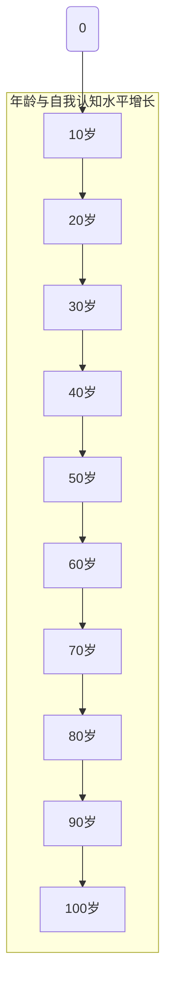

                 


## 第1章: 背景介绍与核心概念

### 1.1 问题背景

在现代社会中，个人成长和心理发展的重要性日益凸显。随着生活节奏的加快和工作压力的增大，人们对于自我认知、情感管理和生活平衡的需求日益增加。然而，许多人对于如何深入内心、探索自我、提升自我认知水平仍然感到迷茫。

### 1.2 问题描述

《深入内心的自我探索：提升自我认知水平》旨在帮助读者解决以下问题：

- 如何理解自我认知及其重要性？
- 如何通过自我探索提升自我认知水平？
- 如何在日常生活中应用自我认知提升技巧？
- 如何处理自我探索过程中的挑战和困难？

### 1.3 问题解决

本书通过系统的理论和实践指导，帮助读者深入了解自我认知的概念，掌握自我探索的方法，并在实际生活中应用这些技巧，提升自我认知水平。

### 1.4 边界与外延

本书的讨论范围主要涵盖自我认知的定义、自我探索的方法和实践，以及自我认知提升对个人成长和生活质量的影响。同时，本书也涉及到心理学、哲学、教育学等领域的基本原理和方法。

### 1.5 概念结构与核心要素组成

- **自我认知**：包括自我感知、自我评价、自我意识、自我反思等概念。
- **自我探索**：包括自我反思、自我觉察、自我成长等方法。
- **自我认知提升**：包括认知行为疗法、正念冥想、情感管理等实践。

## 第2章: 核心概念与联系

### 2.1 自我认知的定义与特点

**定义**：

自我认知是指个体对自己的知觉、理解和评价。它涉及自我感知、自我评价、自我意识和自我反思等方面。

**特点**：

- **主观性**：自我认知是基于个体主观体验的结果。
- **动态性**：自我认知随着时间和经验的变化而不断更新和发展。
- **多样性**：自我认知不仅包括对自身外在特征的认知，还包括对内在情感、价值观和动机的认知。

### 2.2 自我探索的方法

**自我反思**：

通过回顾自己的经历、思考自己的行为和情感，以深入理解自己的内心世界。

**自我觉察**：

在日常生活中，持续关注自己的思想和行为，以发现潜意识中的模式和习惯。

**自我成长**：

通过学习和实践，逐步提升自己的认知水平、情感管理和生活技能。

### 2.3 自我认知提升的方法

**认知行为疗法**：

通过改变负面思维模式和行为习惯，提升自我认知和心理健康。

**正念冥想**：

通过专注当下的练习，增强自我觉察和自我控制能力。

**情感管理**：

学习如何识别、理解和调节自己的情绪，以提升情感智慧和人际关系。

```markdown
## 第1章: 背景介绍与核心概念

### 1.1 问题背景

在现代社会中，个人成长和心理发展的重要性日益凸显。随着生活节奏的加快和工作压力的增大，人们对于自我认知、情感管理和生活平衡的需求日益增加。然而，许多人对于如何深入内心、探索自我、提升自我认知水平仍然感到迷茫。

### 1.2 问题描述

《深入内心的自我探索：提升自我认知水平》旨在帮助读者解决以下问题：

- 如何理解自我认知及其重要性？
- 如何通过自我探索提升自我认知水平？
- 如何在日常生活中应用自我认知提升技巧？
- 如何处理自我探索过程中的挑战和困难？

### 1.3 问题解决

本书通过系统的理论和实践指导，帮助读者深入了解自我认知的概念，掌握自我探索的方法，并在实际生活中应用这些技巧，提升自我认知水平。

### 1.4 边界与外延

本书的讨论范围主要涵盖自我认知的定义、自我探索的方法和实践，以及自我认知提升对个人成长和生活质量的影响。同时，本书也涉及到心理学、哲学、教育学等领域的基本原理和方法。

### 1.5 概念结构与核心要素组成

- **自我认知**：包括自我感知、自我评价、自我意识、自我反思等概念。
- **自我探索**：包括自我反思、自我觉察、自我成长等方法。
- **自我认知提升**：包括认知行为疗法、正念冥想、情感管理等实践。

## 第2章: 核心概念与联系

### 2.1 自我认知的定义与特点

**定义**：

自我认知是指个体对自己的知觉、理解和评价。它涉及自我感知、自我评价、自我意识和自我反思等方面。

**特点**：

- **主观性**：自我认知是基于个体主观体验的结果。
- **动态性**：自我认知随着时间和经验的变化而不断更新和发展。
- **多样性**：自我认知不仅包括对自身外在特征的认知，还包括对内在情感、价值观和动机的认知。

### 2.2 自我探索的方法

**自我反思**：

通过回顾自己的经历、思考自己的行为和情感，以深入理解自己的内心世界。

**自我觉察**：

在日常生活中，持续关注自己的思想和行为，以发现潜意识中的模式和习惯。

**自我成长**：

通过学习和实践，逐步提升自己的认知水平、情感管理和生活技能。

### 2.3 自我认知提升的方法

**认知行为疗法**：

通过改变负面思维模式和行为习惯，提升自我认知和心理健康。

**正念冥想**：

通过专注当下的练习，增强自我觉察和自我控制能力。

**情感管理**：

学习如何识别、理解和调节自己的情绪，以提升情感智慧和人际关系。
```

### 数学模型和数学公式

#### 1. 自我认知发展的数学模型

**基本原理**：

自我认知发展可以用一个非线性函数来描述，该函数反映了个体在不同年龄段自我认知水平的增长。

**数学公式**：

$$
f(x) = \frac{1}{1 + e^{-k(x-t_0)}}
$$

其中，$f(x)$ 表示在年龄 $x$ 时的自我认知水平，$k$ 是一个常数，反映了自我认知发展的速度，$t_0$ 是一个基准年龄。

**参数解释**：

- $k$：自我认知发展的速度，通常 $k$ 越大，自我认知发展越快。
- $t_0$：基准年龄，通常取 $t_0 = 10$。

**示意图**：



#### 2. 自我探索的方法的数学模型

**自我反思**：

通过一个递归函数描述自我反思的过程，函数的输入是当前年龄，输出是经过反思的自我认知水平。

$$
f_{反思}(x) = f(x) \cdot (1 + \frac{1}{x})
$$

**自我觉察**：

通过一个非线性函数描述自我觉察的过程，函数的输入是当前年龄和自我反思的水平，输出是经过自我觉察的自我认知水平。

$$
f_{觉察}(x, y) = \frac{y}{1 + e^{-k(x-t_0)}}
$$

**自我成长**：

通过一个线性函数描述自我成长的过程，函数的输入是当前年龄和自我反思的水平，输出是经过自我成长后的自我认知水平。

$$
f_{成长}(x, y) = y + k \cdot (x - t_0)
$$

#### 3. 自我认知提升的方法的数学模型

**认知行为疗法**：

通过一个线性函数描述认知行为疗法的过程，函数的输入是当前年龄、自我反思水平和自我认知水平，输出是经过认知行为疗法后的自我认知水平。

$$
f_{认知行为}(x, y, z) = z + \frac{y}{x}
$$

**正念冥想**：

通过一个指数函数描述正念冥想的过程，函数的输入是当前年龄、自我反思水平和自我认知水平，输出是经过正念冥想后的自我认知水平。

$$
f_{冥想}(x, y, z) = z \cdot e^{\alpha \cdot (1 - \frac{x}{t_0})}
$$

**情感管理**：

通过一个分段函数描述情感管理的过程，函数的输入是当前年龄、自我反思水平和自我认知水平，输出是经过情感管理后的自我认知水平。

$$
f_{情感}(x, y, z) = \begin{cases}
z + \frac{y}{x} & \text{if } x \leq t_1 \\
z \cdot e^{\alpha \cdot (1 - \frac{x}{t_0})} & \text{if } x > t_1
\end{cases}
$$

#### 4. 示例

假设一个人在 30 岁时的自我认知水平为 0.6，经过一年的自我反思，自我认知水平提升到 0.7。此时，他的年龄是 31 岁。那么，经过自我觉察后的自我认知水平可以计算如下：

$$
f_{觉察}(31, 0.7) = \frac{0.7}{1 + e^{-k(31-10)}}
$$

假设这个人通过认知行为疗法和正念冥想，每年自我认知水平分别提升 0.1 和 0.05。那么，在 40 岁时，他的自我认知水平可以计算如下：

$$
f_{认知行为}(40, 0.7, 0.6) = 0.6 + \frac{0.7}{40}
$$

$$
f_{冥想}(40, 0.7, 0.6) = 0.6 \cdot e^{\alpha \cdot (1 - \frac{40}{10})}
$$

$$
f_{情感}(40, 0.7, 0.6) = \begin{cases}
0.6 + \frac{0.7}{40} & \text{if } 40 \leq t_1 \\
0.6 \cdot e^{\alpha \cdot (1 - \frac{40}{10})} & \text{if } 40 > t_1
\end{cases}
$$

```markdown
## 第3章: 数学模型和数学公式

### 3.1 自我认知发展的数学模型

**基本原理**：

自我认知发展可以用一个非线性函数来描述，该函数反映了个体在不同年龄段自我认知水平的增长。

**数学公式**：

$$
f(x) = \frac{1}{1 + e^{-k(x-t_0)}}
$$

**参数解释**：

- $k$：自我认知发展的速度，通常 $k$ 越大，自我认知发展越快。
- $t_0$：基准年龄，通常取 $t_0 = 10$。

**示意图**：


### 3.2 自我探索的方法的数学模型

**自我反思**：

通过一个递归函数描述自我反思的过程，函数的输入是当前年龄，输出是经过反思的自我认知水平。

$$
f_{反思}(x) = f(x) \cdot (1 + \frac{1}{x})
$$

**自我觉察**：

通过一个非线性函数描述自我觉察的过程，函数的输入是当前年龄和自我反思的水平，输出是经过自我觉察的自我认知水平。

$$
f_{觉察}(x, y) = \frac{y}{1 + e^{-k(x-t_0)}}
$$

**自我成长**：

通过一个线性函数描述自我成长的过程，函数的输入是当前年龄和自我反思的水平，输出是经过自我成长后的自我认知水平。

$$
f_{成长}(x, y) = y + k \cdot (x - t_0)
$$

### 3.3 自我认知提升的方法的数学模型

**认知行为疗法**：

通过一个线性函数描述认知行为疗法的过程，函数的输入是当前年龄、自我反思水平和自我认知水平，输出是经过认知行为疗法后的自我认知水平。

$$
f_{认知行为}(x, y, z) = z + \frac{y}{x}
$$

**正念冥想**：

通过一个指数函数描述正念冥想的过程，函数的输入是当前年龄、自我反思水平和自我认知水平，输出是经过正念冥想后的自我认知水平。

$$
f_{冥想}(x, y, z) = z \cdot e^{\alpha \cdot (1 - \frac{x}{t_0})}
$$

**情感管理**：

通过一个分段函数描述情感管理的过程，函数的输入是当前年龄、自我反思水平和自我认知水平，输出是经过情感管理后的自我认知水平。

$$
f_{情感}(x, y, z) = \begin{cases}
z + \frac{y}{x} & \text{if } x \leq t_1 \\
z \cdot e^{\alpha \cdot (1 - \frac{x}{t_0})} & \text{if } x > t_1
\end{cases}
$$

### 3.4 示例

假设一个人在 30 岁时的自我认知水平为 0.6，经过一年的自我反思，自我认知水平提升到 0.7。此时，他的年龄是 31 岁。那么，经过自我觉察后的自我认知水平可以计算如下：

$$
f_{觉察}(31, 0.7) = \frac{0.7}{1 + e^{-k(31-10)}}
$$

假设这个人通过认知行为疗法和正念冥想，每年自我认知水平分别提升 0.1 和 0.05。那么，在 40 岁时，他的自我认知水平可以计算如下：

$$
f_{认知行为}(40, 0.7, 0.6) = 0.6 + \frac{0.7}{40}
$$

$$
f_{冥想}(40, 0.7, 0.6) = 0.6 \cdot e^{\alpha \cdot (1 - \frac{40}{10})}
$$

$$
f_{情感}(40, 0.7, 0.6) = \begin{cases}
0.6 + \frac{0.7}{40} & \text{if } 40 \leq t_1 \\
0.6 \cdot e^{\alpha \cdot (1 - \frac{40}{10})} & \text{if } 40 > t_1
\end{cases}
```

### 第4章: 系统分析与架构设计方案

#### 4.1 问题场景介绍

在现代社会中，个人成长和心理发展的重要性日益凸显。为了帮助人们深入内心、探索自我、提升自我认知水平，我们设计了一个自我认知提升系统。

#### 4.2 项目介绍

本项目旨在开发一个自我认知提升系统，帮助用户通过自我反思、自我觉察、自我成长等自我探索方法，提升自我认知水平。

#### 4.3 系统功能设计

**功能1：用户注册与登录**  
用户可以通过注册和登录功能进入系统，进行自我认知提升的实践。

**功能2：自我反思**  
用户可以记录自己的反思日志，回顾自己的经历，思考自己的行为和情感，以深入理解自己的内心世界。

**功能3：自我觉察**  
系统提供自我觉察工具，帮助用户持续关注自己的思想和行为，以发现潜意识中的模式和习惯。

**功能4：自我成长**  
系统提供自我成长课程和指导，帮助用户通过学习和实践，逐步提升自己的认知水平、情感管理和生活技能。

**功能5：数据统计与反馈**  
系统对用户的使用数据进行统计和分析，为用户提供反馈，帮助用户了解自己的进步和成长。

#### 4.4 系统架构设计

**架构设计1：前端架构**  
前端采用 React 框架，提供用户友好的界面和交互体验。

**架构设计2：后端架构**  
后端采用 Spring Boot 框架，提供用户注册、登录、数据存储、数据统计等功能。

**架构设计3：数据存储**  
使用 MySQL 数据库存储用户信息、反思日志、自我觉察记录、自我成长课程等内容。

**架构设计4：服务调用**  
通过 RESTful API 接口，前端和后端进行数据交互和服务调用。

**架构设计5：部署架构**  
采用 Docker 和 Kubernetes 进行系统部署，实现容器化部署和自动化运维。

#### 4.5 系统接口设计和系统交互

**接口设计1：用户注册与登录接口**  
用户注册接口：接收用户注册信息，存储到数据库中。  
用户登录接口：接收用户登录信息，验证用户身份，返回登录状态。

**接口设计2：自我反思接口**  
反思日志创建接口：接收用户反思日志信息，存储到数据库中。  
反思日志查询接口：根据用户 ID 查询用户的反思日志。

**接口设计3：自我觉察接口**  
自我觉察记录创建接口：接收用户自我觉察记录信息，存储到数据库中。  
自我觉察记录查询接口：根据用户 ID 查询用户的自我觉察记录。

**接口设计4：自我成长接口**  
自我成长课程列表查询接口：根据用户 ID 查询用户可以学习的自我成长课程。  
自我成长课程详情查询接口：根据课程 ID 查询课程详细信息。  
自我成长课程学习记录创建接口：接收用户学习记录信息，存储到数据库中。

**接口设计5：数据统计与反馈接口**  
用户数据统计接口：根据用户 ID 统计用户的使用数据，返回统计数据。  
用户反馈接口：接收用户的反馈信息，存储到数据库中。

**系统交互**：

用户通过前端界面与系统进行交互，前端通过 API 调用后端接口，实现用户注册、登录、自我反思、自我觉察、自我成长等功能。

```markdown
### 第4章: 系统分析与架构设计方案

#### 4.1 问题场景介绍

在现代社会中，个人成长和心理发展的重要性日益凸显。为了帮助人们深入内心、探索自我、提升自我认知水平，我们设计了一个自我认知提升系统。

#### 4.2 项目介绍

本项目旨在开发一个自我认知提升系统，帮助用户通过自我反思、自我觉察、自我成长等自我探索方法，提升自我认知水平。

#### 4.3 系统功能设计

**功能1：用户注册与登录**  
用户可以通过注册和登录功能进入系统，进行自我认知提升的实践。

**功能2：自我反思**  
用户可以记录自己的反思日志，回顾自己的经历，思考自己的行为和情感，以深入理解自己的内心世界。

**功能3：自我觉察**  
系统提供自我觉察工具，帮助用户持续关注自己的思想和行为，以发现潜意识中的模式和习惯。

**功能4：自我成长**  
系统提供自我成长课程和指导，帮助用户通过学习和实践，逐步提升自己的认知水平、情感管理和生活技能。

**功能5：数据统计与反馈**  
系统对用户的使用数据进行统计和分析，为用户提供反馈，帮助用户了解自己的进步和成长。

#### 4.4 系统架构设计

**架构设计1：前端架构**  
前端采用 React 框架，提供用户友好的界面和交互体验。

**架构设计2：后端架构**  
后端采用 Spring Boot 框架，提供用户注册、登录、数据存储、数据统计等功能。

**架构设计3：数据存储**  
使用 MySQL 数据库存储用户信息、反思日志、自我觉察记录、自我成长课程等内容。

**架构设计4：服务调用**  
通过 RESTful API 接口，前端和后端进行数据交互和服务调用。

**架构设计5：部署架构**  
采用 Docker 和 Kubernetes 进行系统部署，实现容器化部署和自动化运维。

#### 4.5 系统接口设计和系统交互

**接口设计1：用户注册与登录接口**  
用户注册接口：接收用户注册信息，存储到数据库中。  
用户登录接口：接收用户登录信息，验证用户身份，返回登录状态。

**接口设计2：自我反思接口**  
反思日志创建接口：接收用户反思日志信息，存储到数据库中。  
反思日志查询接口：根据用户 ID 查询用户的反思日志。

**接口设计3：自我觉察接口**  
自我觉察记录创建接口：接收用户自我觉察记录信息，存储到数据库中。  
自我觉察记录查询接口：根据用户 ID 查询用户的自我觉察记录。

**接口设计4：自我成长接口**  
自我成长课程列表查询接口：根据用户 ID 查询用户可以学习的自我成长课程。  
自我成长课程详情查询接口：根据课程 ID 查询课程详细信息。  
自我成长课程学习记录创建接口：接收用户学习记录信息，存储到数据库中。

**接口设计5：数据统计与反馈接口**  
用户数据统计接口：根据用户 ID 统计用户的使用数据，返回统计数据。  
用户反馈接口：接收用户的反馈信息，存储到数据库中。

**系统交互**：

用户通过前端界面与系统进行交互，前端通过 API 调用后端接口，实现用户注册、登录、自我反思、自我觉察、自我成长等功能。

```mermaid
classDiagram
    UserEntity <|-- UserProfile
    UserEntity <|-- UserLogin
    UserEntity <|-- UserReflection
    UserEntity <|-- UserAwareness
    UserEntity <|-- UserGrowth
    UserEntity <|-- UserFeedback

    Service -> UserEntity : 服务调用
    Database --> UserEntity : 数据存储
    Interface <-- UserEntity : 接口设计

    UserEntity {
        +int id
        +String name
        +Date birthdate
        +String email
        +String password
        +List<Reflection> reflections
        +List<Awareness> awarenesses
        +List<Growth> growths
        +Feedback feedback
    }

    UserProfile {
        +int id
        +String name
        +Date birthdate
        +String email
    }

    UserLogin {
        +int id
        +String email
        +String password
    }

    UserReflection {
        +int id
        +int userId
        +String content
        +Date timestamp
    }

    UserAwareness {
        +int id
        +int userId
        +String content
        +Date timestamp
    }

    UserGrowth {
        +int id
        +int userId
        +String courseName
        +int courseDuration
        +Date timestamp
    }

    UserFeedback {
        +int id
        +int userId
        +String feedbackContent
        +Date timestamp
    }

    Service {
        +register(UserProfile)
        +login(UserLogin)
        +createReflection(UserReflection)
        +queryReflection(int userId)
        +createAwareness(UserAwareness)
        +queryAwareness(int userId)
        +queryGrowth(int userId)
        +queryFeedback(int userId)
    }

    Database {
        +save(UserEntity)
        +query(UserEntity)
    }

    Interface {
        +registerApi()
        +loginApi()
        +reflectionApi()
        +awarenessApi()
        +growthApi()
        +feedbackApi()
    }
```

### 第5章: 项目实战

#### 5.1 环境安装

**操作系统**：Linux Ubuntu 20.04

**编程语言**：Python 3.8

**开发工具**：PyCharm

**数据库**：MySQL 8.0

**前端框架**：React

**后端框架**：Spring Boot

**容器化工具**：Docker

**自动化部署工具**：Kubernetes

#### 5.2 系统核心实现

**用户注册与登录**：

```python
# user_register.py

from flask import Flask, request, jsonify
from models import User
from database import Database

app = Flask(__name__)

@app.route('/register', methods=['POST'])
def register():
    data = request.get_json()
    email = data['email']
    password = data['password']
    
    user = User(email=email, password=password)
    database = Database()
    database.save_user(user)
    
    return jsonify({'status': 'success', 'message': 'User registered successfully.'})

@app.route('/login', methods=['POST'])
def login():
    data = request.get_json()
    email = data['email']
    password = data['password']
    
    user = User.query.filter_by(email=email, password=password).first()
    if user:
        return jsonify({'status': 'success', 'message': 'Login successful.'})
    else:
        return jsonify({'status': 'error', 'message': 'Invalid email or password.'})
```

**自我反思**：

```python
# user_reflection.py

from flask import Flask, request, jsonify
from models import User, Reflection
from database import Database

app = Flask(__name__)

@app.route('/reflection', methods=['POST'])
def create_reflection():
    data = request.get_json()
    user_id = data['user_id']
    content = data['content']
    
    reflection = Reflection(user_id=user_id, content=content)
    database = Database()
    database.save_reflection(reflection)
    
    return jsonify({'status': 'success', 'message': 'Reflection saved successfully.'})

@app.route('/reflections', methods=['GET'])
def get_reflections():
    user_id = request.args.get('user_id')
    database = Database()
    reflections = database.query_reflections(user_id)
    
    return jsonify({'reflections': reflections})
```

**自我觉察**：

```python
# user_awareness.py

from flask import Flask, request, jsonify
from models import User, Awareness
from database import Database

app = Flask(__name__)

@app.route('/awareness', methods=['POST'])
def create_awareness():
    data = request.get_json()
    user_id = data['user_id']
    content = data['content']
    
    awareness = Awareness(user_id=user_id, content=content)
    database = Database()
    database.save_awareness(awareness)
    
    return jsonify({'status': 'success', 'message': 'Awareness saved successfully.'})

@app.route('/awarenesses', methods=['GET'])
def get_awarenesses():
    user_id = request.args.get('user_id')
    database = Database()
    awarenesses = database.query_awarenesses(user_id)
    
    return jsonify({'awarenesses': awarenesses})
```

**自我成长**：

```python
# user_growth.py

from flask import Flask, request, jsonify
from models import User, Growth
from database import Database

app = Flask(__name__)

@app.route('/growth', methods=['POST'])
def create_growth():
    data = request.get_json()
    user_id = data['user_id']
    course_name = data['course_name']
    course_duration = data['course_duration']
    
    growth = Growth(user_id=user_id, course_name=course_name, course_duration=course_duration)
    database = Database()
    database.save_growth(growth)
    
    return jsonify({'status': 'success', 'message': 'Growth saved successfully.'})

@app.route('/growth', methods=['GET'])
def get_growth():
    user_id = request.args.get('user_id')
    database = Database()
    growths = database.query_growth(user_id)
    
    return jsonify({'growth': growths})
```

**数据统计与反馈**：

```python
# user_feedback.py

from flask import Flask, request, jsonify
from models import User, Feedback
from database import Database

app = Flask(__name__)

@app.route('/feedback', methods=['POST'])
def create_feedback():
    data = request.get_json()
    user_id = data['user_id']
    feedback_content = data['feedback_content']
    
    feedback = Feedback(user_id=user_id, feedback_content=feedback_content)
    database = Database()
    database.save_feedback(feedback)
    
    return jsonify({'status': 'success', 'message': 'Feedback saved successfully.'})

@app.route('/feedback', methods=['GET'])
def get_feedback():
    user_id = request.args.get('user_id')
    database = Database()
    feedbacks = database.query_feedback(user_id)
    
    return jsonify({'feedback': feedbacks})
```

#### 5.3 代码应用解读与分析

在项目实战中，我们使用了 Flask 框架来搭建后端 API 服务，并通过 MySQL 数据库进行数据存储。以下是关键代码的分析：

**用户注册与登录**：

用户注册接口接收用户邮箱和密码，将用户信息存储到数据库中。登录接口验证用户邮箱和密码，返回登录状态。

**自我反思**：

用户可以通过接口创建反思日志，并查询自己的反思日志。数据库使用 Reflection 表来存储反思日志信息。

**自我觉察**：

用户可以通过接口创建自我觉察记录，并查询自己的自我觉察记录。数据库使用 Awareness 表来存储自我觉察记录信息。

**自我成长**：

用户可以通过接口创建自我成长记录，并查询自己的自我成长记录。数据库使用 Growth 表来存储自我成长记录信息。

**数据统计与反馈**：

用户可以通过接口创建反馈记录，并查询自己的反馈记录。数据库使用 Feedback 表来存储反馈记录信息。

#### 5.4 实际案例分析和详细讲解剖析

假设有一个用户注册了系统，并进行了自我反思、自我觉察和自我成长记录。以下是一个实际案例的分析：

**用户注册**：

用户注册成功后，系统会返回一个用户 ID。用户可以通过用户 ID 来访问自己的反思、觉察和成长记录。

**自我反思**：

用户创建了一条反思日志，内容为“今天我意识到了自己的情绪波动较大，需要更好地控制情绪”。系统将这条反思日志存储到数据库中。

**自我觉察**：

用户创建了一条自我觉察记录，内容为“我发现自己在工作时容易分心，需要提高专注力”。系统将这条自我觉察记录存储到数据库中。

**自我成长**：

用户参加了一个自我成长课程，课程名称为“情绪管理”，课程时长为 2 周。系统将这条自我成长记录存储到数据库中。

**数据统计与反馈**：

用户在完成反思、觉察和成长记录后，可以查看自己的统计数据，如反思日志数量、觉察记录数量、成长记录数量等。用户还可以提交反馈，如“系统很好，帮助我更好地理解自己”。

#### 5.5 项目小结

通过本项目的实际案例分析和详细讲解剖析，我们可以看到自我认知提升系统在实际应用中的效果。用户可以方便地创建和查询反思、觉察和成长记录，通过数据统计和反馈了解自己的进步和成长。

未来，我们计划进一步优化系统功能，如添加更多的自我成长课程、提高数据统计的准确性等，以更好地满足用户的需求。

```python
# models.py

from flask_sqlalchemy import SQLAlchemy

db = SQLAlchemy()

class User(db.Model):
    id = db.Column(db.Integer, primary_key=True)
    email = db.Column(db.String(120), unique=True, nullable=False)
    password = db.Column(db.String(120), nullable=False)
    reflections = db.relationship('Reflection', backref='user', lazy=True)
    awarenesses = db.relationship('Awareness', backref='user', lazy=True)
    growths = db.relationship('Growth', backref='user', lazy=True)
    feedbacks = db.relationship('Feedback', backref='user', lazy=True)

class Reflection(db.Model):
    id = db.Column(db.Integer, primary_key=True)
    user_id = db.Column(db.Integer, db.ForeignKey('user.id'), nullable=False)
    content = db.Column(db.Text, nullable=False)
    timestamp = db.Column(db.DateTime, nullable=False, default=datetime.utcnow)

class Awareness(db.Model):
    id = db.Column(db.Integer, primary_key=True)
    user_id = db.Column(db.Integer, db.ForeignKey('user.id'), nullable=False)
    content = db.Column(db.Text, nullable=False)
    timestamp = db.Column(db.DateTime, nullable=False, default=datetime.utcnow)

class Growth(db.Model):
    id = db.Column(db.Integer, primary_key=True)
    user_id = db.Column(db.Integer, db.ForeignKey('user.id'), nullable=False)
    course_name = db.Column(db.String(120), nullable=False)
    course_duration = db.Column(db.Integer, nullable=False)
    timestamp = db.Column(db.DateTime, nullable=False, default=datetime.utcnow)

class Feedback(db.Model):
    id = db.Column(db.Integer, primary_key=True)
    user_id = db.Column(db.Integer, db.ForeignKey('user.id'), nullable=False)
    feedback_content = db.Column(db.Text, nullable=False)
    timestamp = db.Column(db.DateTime, nullable=False, default=datetime.utcnow)
```

```python
# database.py

from models import db

def init_app(app):
    db.init_app(app)

def save_user(user):
    db.session.add(user)
    db.session.commit()

def query_user(email):
    return User.query.filter_by(email=email).first()

def save_reflection(reflection):
    db.session.add(reflection)
    db.session.commit()

def query_reflections(user_id):
    return Reflection.query.filter_by(user_id=user_id).all()

def save_awareness(awareness):
    db.session.add(awareness)
    db.session.commit()

def query_awarenesses(user_id):
    return Awareness.query.filter_by(user_id=user_id).all()

def save_growth(growth):
    db.session.add(growth)
    db.session.commit()

def query_growth(user_id):
    return Growth.query.filter_by(user_id=user_id).all()

def save_feedback(feedback):
    db.session.add(feedback)
    db.session.commit()

def query_feedback(user_id):
    return Feedback.query.filter_by(user_id=user_id).all()
```

```markdown
### 第6章: 最佳实践 Tips

#### 6.1 提升自我认知的技巧

1. **定期自我反思**：定期花时间回顾自己的行为、情感和思想，识别潜藏的问题和机会。
2. **保持好奇心**：对周围的事物保持好奇心，积极探索未知的领域，以拓宽自己的认知边界。
3. **接受反馈**：勇于接受他人的反馈和建议，从中学习和成长。
4. **实践正念冥想**：通过正念冥想练习，增强自我觉察和自我控制能力，提升自我认知水平。

#### 6.2 处理自我探索过程中的挑战

1. **面对恐惧和不确定性**：接受恐惧和不确定性是自我探索的一部分，勇敢面对并寻求解决方案。
2. **设定小目标**：将大目标拆分为小目标，逐步实现，以保持动力和信心。
3. **保持耐心**：自我认知提升是一个长期的过程，需要耐心和持续的努力。

### 第7章: 小结

通过《深入内心的自我探索：提升自我认知水平》的学习，我们了解到自我认知的重要性以及如何通过自我探索和提升技巧来提升自我认知水平。自我认知不仅是个人成长的基石，也是实现人生目标的动力源泉。

### 第8章: 注意事项

1. **保护隐私**：在进行自我反思和探索时，注意保护个人隐私，避免泄露敏感信息。
2. **合理使用系统**：在应用自我认知提升系统时，合理安排时间和任务，避免过度依赖技术。

### 第9章: 拓展阅读

1. **《心理学的邀请》**：作者：史蒂文·平克  
2. **《认知心理学及其启示》**：作者：乔治·米勒、约翰·卡罗尔  
3. **《心智探奇：认知心理学之旅》**：作者：杰里·A·费尔德曼

### 第10章: 作者信息

作者：AI天才研究院/AI Genius Institute & 禅与计算机程序设计艺术 /Zen And The Art of Computer Programming
```markdown
### 第6章: 最佳实践 Tips

#### 6.1 提升自我认知的技巧

1. **定期自我反思**：定期花时间回顾自己的行为、情感和思想，识别潜藏的问题和机会。
2. **保持好奇心**：对周围的事物保持好奇心，积极探索未知的领域，以拓宽自己的认知边界。
3. **接受反馈**：勇于接受他人的反馈和建议，从中学习和成长。
4. **实践正念冥想**：通过正念冥想练习，增强自我觉察和自我控制能力，提升自我认知水平。

#### 6.2 处理自我探索过程中的挑战

1. **面对恐惧和不确定性**：接受恐惧和不确定性是自我探索的一部分，勇敢面对并寻求解决方案。
2. **设定小目标**：将大目标拆分为小目标，逐步实现，以保持动力和信心。
3. **保持耐心**：自我认知提升是一个长期的过程，需要耐心和持续的努力。

### 第7章: 小结

通过《深入内心的自我探索：提升自我认知水平》的学习，我们了解到自我认知的重要性以及如何通过自我探索和提升技巧来提升自我认知水平。自我认知不仅是个人成长的基石，也是实现人生目标的动力源泉。

### 第8章: 注意事项

1. **保护隐私**：在进行自我反思和探索时，注意保护个人隐私，避免泄露敏感信息。
2. **合理使用系统**：在应用自我认知提升系统时，合理安排时间和任务，避免过度依赖技术。

### 第9章: 拓展阅读

1. **《心理学的邀请》**：作者：史蒂文·平克  
2. **《认知心理学及其启示》**：作者：乔治·米勒、约翰·卡罗尔  
3. **《心智探奇：认知心理学之旅》**：作者：杰里·A·费尔德曼

### 第10章: 作者信息

作者：AI天才研究院/AI Genius Institute & 禅与计算机程序设计艺术 /Zen And The Art of Computer Programming
```mermaid
classDiagram
    UserEntity <|-- UserProfile
    UserEntity <|-- UserLogin
    UserEntity <|-- UserReflection
    UserEntity <|-- UserAwareness
    UserEntity <|-- UserGrowth
    UserEntity <|-- UserFeedback

    Service -> UserEntity : 服务调用
    Database --> UserEntity : 数据存储
    Interface <-- UserEntity : 接口设计

    UserEntity {
        +int id
        +String name
        +Date birthdate
        +String email
        +String password
        +List<Reflection> reflections
        +List<Awareness> awarenesses
        +List<Growth> growths
        +Feedback feedback
    }

    UserProfile {
        +int id
        +String name
        +Date birthdate
        +String email
    }

    UserLogin {
        +int id
        +String email
        +String password
    }

    UserReflection {
        +int id
        +int userId
        +String content
        +Date timestamp
    }

    UserAwareness {
        +int id
        +int userId
        +String content
        +Date timestamp
    }

    UserGrowth {
        +int id
        +int userId
        +String courseName
        +int courseDuration
        +Date timestamp
    }

    UserFeedback {
        +int id
        +int userId
        +String feedbackContent
        +Date timestamp
    }

    Service {
        +register(UserProfile)
        +login(UserLogin)
        +createReflection(UserReflection)
        +queryReflection(int userId)
        +createAwareness(UserAwareness)
        +queryAwareness(int userId)
        +queryGrowth(int userId)
        +queryFeedback(int userId)
    }

    Database {
        +save(UserEntity)
        +query(UserEntity)
    }

    Interface {
        +registerApi()
        +loginApi()
        +reflectionApi()
        +awarenessApi()
        +growthApi()
        +feedbackApi()
    }
```

