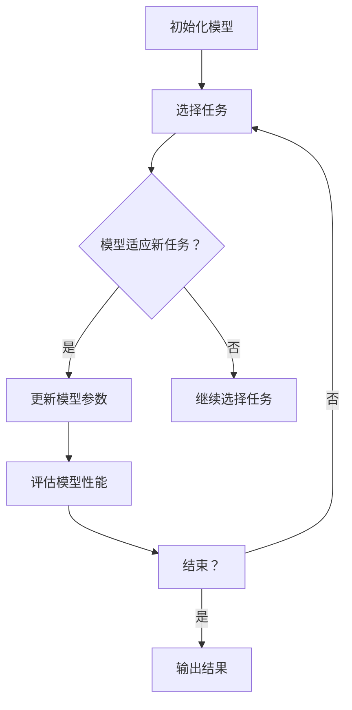
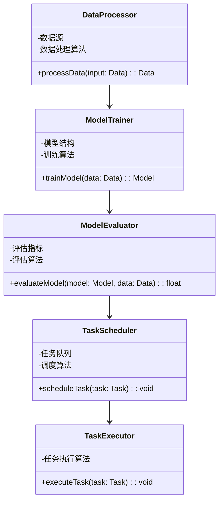
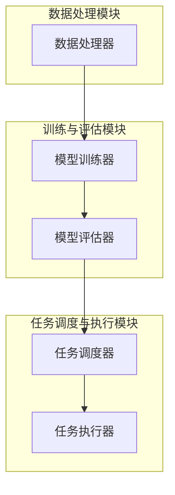
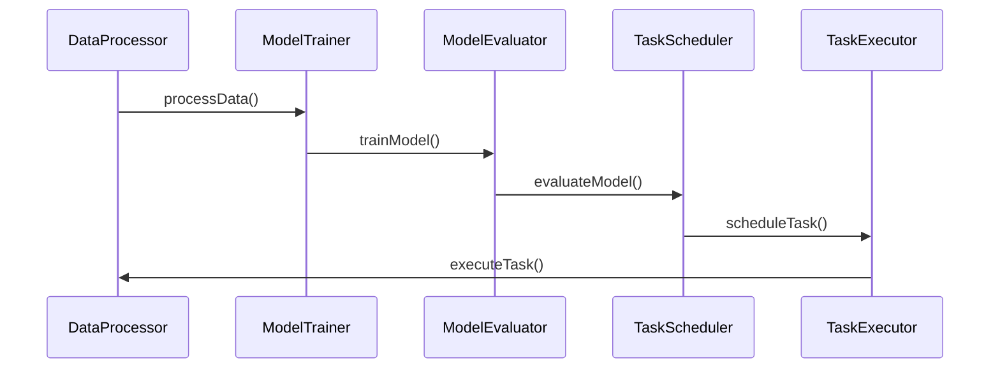

                 

# 深度元学习在AI Agent快速适应中的应用

> 关键词：深度元学习，AI Agent，快速适应，算法原理，系统架构

> 摘要：本文探讨了深度元学习在AI Agent快速适应中的应用。首先介绍了深度元学习的背景和核心概念，然后详细分析了深度元学习算法的原理和流程，并通过实例进行了说明。接着，本文讨论了深度元学习在AI Agent快速适应中的系统架构设计，包括系统功能设计、系统架构设计和系统接口设计。最后，通过一个实际项目案例，展示了深度元学习在AI Agent快速适应中的具体应用和实践。

## 第一部分：背景介绍

### 第1章 问题背景

在人工智能（AI）快速发展的背景下，AI Agent作为一个具有自主学习和适应能力的智能体，在各个领域得到了广泛应用。然而，传统的机器学习方法在某些复杂应用场景中表现不佳，难以适应不断变化的环境。例如，在动态环境下的智能机器人、自动驾驶汽车和智能客服等领域，AI Agent需要快速适应新环境和新任务。如何实现AI Agent的快速适应和高效学习，成为当前研究的热点。

### 问题描述

传统的机器学习方法在面对复杂环境和动态任务时，往往需要大量的训练数据和长时间的训练过程。这导致了以下问题：

1. **数据依赖**：传统的机器学习方法依赖于大量标注数据进行训练，这在某些应用场景中难以实现。
2. **迁移学习效果不佳**：虽然迁移学习是一种有效的解决方法，但在处理复杂任务时，迁移学习的效果并不理想。
3. **适应性差**：在动态环境下，AI Agent难以快速适应新的任务和环境。

### 问题解决

深度元学习（Deep Meta-Learning）作为一种新兴的机器学习技术，通过在多个任务间共享参数，实现算法在多种任务上的快速适应和学习。深度元学习通过模拟生物体的学习和适应过程，提高了AI Agent的适应能力。具体来说，深度元学习通过以下方法解决上述问题：

1. **减少数据依赖**：深度元学习通过在多个任务间共享参数，减少了对新任务的训练数据依赖，从而降低了数据标注的成本和时间。
2. **提高迁移学习效果**：深度元学习通过优化模型在多个任务上的表现，提高了迁移学习的效果，从而在复杂任务上表现更佳。
3. **提高适应性**：深度元学习通过在多个任务间共享参数，使AI Agent能够快速适应新的任务和环境，提高了在动态环境下的表现。

### 边界与外延

深度元学习的研究和应用涉及多个领域，包括深度学习、元学习、强化学习等。本文主要关注深度元学习在AI Agent快速适应中的应用，但也会涉及到相关的基础知识和前沿研究。

### 概念结构与核心要素组成

1. **深度学习（Deep Learning）**：一种利用多层神经网络进行特征提取和建模的技术。
2. **元学习（Meta-Learning）**：研究如何使机器在学习新任务时更加高效的一种机器学习方法。
3. **深度元学习（Deep Meta-Learning）**：结合深度学习和元学习的方法，使机器在多种任务上快速适应和学习。
4. **AI Agent**：具有自主学习和适应能力的智能体，能够在复杂环境中执行特定任务。

## 第二部分：核心概念与联系

### 第2章 核心概念原理

深度元学习通过在多个任务间共享参数，实现算法在多种任务上的快速适应和学习。具体来说，它通过优化一个模型的学习能力，使其在遇到新任务时能够快速适应。

### 概念属性特征对比表格

| 特征对比 | 深度学习 | 元学习 | 深度元学习 |
| --- | --- | --- | --- |
| 特点 | 利用多层神经网络提取特征 | 学习如何学习新任务 | 结合深度学习和元学习，实现快速适应和学习 |

### ER实体关系图架构的 Mermaid 流程图

```mermaid
erDiagram
    AI-Agent ||--|{ 深度元学习 } Deep_Meta_Learning
    Deep_Meta_Learning ||--|{ 深度学习 } Deep_Learning
    Deep_Meta_Learning ||--|{ 元学习 } Meta_Learning
```

## 第三部分：算法原理讲解

### 第3章 算法原理

### 算法 mermaid 流程图



### 算法原理的数学模型和公式

假设我们有 $N$ 个任务，每个任务对应一个参数向量 $w_i$，我们需要最小化以下损失函数：

$$L = \sum_{i=1}^{N} \frac{1}{N} \sum_{j=1}^{T_i} \log P(y_j|x_j; w_i)$$

其中，$T_i$ 表示任务 $i$ 的数据大小，$y_j$ 表示任务 $i$ 的第 $j$ 个样本的标签，$x_j$ 表示任务 $i$ 的第 $j$ 个样本的特征。

### 详细讲解和举例说明

以一个简单的线性回归任务为例，假设我们有两个任务，每个任务的数据集如下：

任务1：$x_1 = [1, 2, 3, 4, 5], y_1 = [2, 4, 6, 8, 10]$

任务2：$x_2 = [1, 2, 3, 4, 5], y_2 = [1, 2, 3, 4, 5]$

我们需要通过深度元学习算法来适应这两个任务。

首先，我们初始化一个参数向量 $w$，然后选择任务1，通过最小化损失函数来更新参数 $w$。更新后的参数 $w_1$ 能够较好地适应任务1。

接下来，我们选择任务2，使用更新后的参数 $w_1$ 来适应任务2。由于 $w_1$ 已经适应了任务1，因此它能够快速地适应任务2。

通过这种方式，深度元学习算法能够在多个任务间共享参数，实现快速适应和学习。

## 第四部分：系统分析与架构设计

### 问题场景介绍

在动态环境下，AI Agent需要快速适应新的任务和环境。例如，在智能机器人领域，机器人需要在不同的环境中执行不同的任务，如清洁、搬运等。在这个场景下，机器人需要具备快速适应和高效学习的能力。

### 项目介绍

本项目旨在通过深度元学习技术，实现AI Agent在动态环境下的快速适应和高效学习。项目主要包括以下模块：

1. 数据采集与预处理
2. 模型训练与优化
3. 模型评估与部署
4. 实时任务调度与执行

### 系统功能设计

#### 领域模型Mermaid类图



### 系统架构设计

#### 系统架构Mermaid架构图



### 系统接口设计

系统接口设计主要包括以下接口：

1. `DataProcessor.processData()`: 处理输入数据，返回处理后的数据。
2. `ModelTrainer.trainModel()`: 使用输入数据进行模型训练，返回训练后的模型。
3. `ModelEvaluator.evaluateModel()`: 对输入模型进行评估，返回评估结果。
4. `TaskScheduler.scheduleTask()`: 将输入任务添加到任务队列。
5. `TaskExecutor.executeTask()`: 执行输入任务。

### 系统交互Mermaid序列图



## 第五部分：项目实战

### 环境安装

在开始项目实战之前，我们需要安装以下环境：

1. Python 3.8+
2. TensorFlow 2.x
3. PyTorch 1.8+

安装命令如下：

```
pip install python==3.8
pip install tensorflow==2.4.0
pip install pytorch==1.8.0
```

### 系统核心实现源代码

以下是一个简单的深度元学习实现示例，用于训练和适应线性回归任务。

```python
import torch
import torch.nn as nn
import torch.optim as optim

# 定义深度元学习模型
class MetaLearningModel(nn.Module):
    def __init__(self, input_dim, output_dim):
        super(MetaLearningModel, self).__init__()
        self.fc1 = nn.Linear(input_dim, 10)
        self.fc2 = nn.Linear(10, output_dim)

    def forward(self, x):
        x = torch.relu(self.fc1(x))
        x = self.fc2(x)
        return x

# 训练深度元学习模型
def train_model(model, data_loader, optimizer, criterion, num_epochs):
    model.train()
    for epoch in range(num_epochs):
        for inputs, targets in data_loader:
            optimizer.zero_grad()
            outputs = model(inputs)
            loss = criterion(outputs, targets)
            loss.backward()
            optimizer.step()
        print(f"Epoch [{epoch+1}/{num_epochs}], Loss: {loss.item():.4f}")

# 适应新任务
def adapt_model(model, new_data_loader, optimizer, criterion, num_epochs):
    model.train()
    for epoch in range(num_epochs):
        for inputs, targets in new_data_loader:
            optimizer.zero_grad()
            outputs = model(inputs)
            loss = criterion(outputs, targets)
            loss.backward()
            optimizer.step()
        print(f"Epoch [{epoch+1}/{num_epochs}], Loss: {loss.item():.4f}")

# 实际案例分析和详细讲解剖析
def main():
    # 初始化模型
    model = MetaLearningModel(input_dim=1, output_dim=1)
    optimizer = optim.Adam(model.parameters(), lr=0.001)
    criterion = nn.MSELoss()

    # 训练模型
    train_loader = torch.utils.data.DataLoader(dataset=train_dataset, batch_size=16, shuffle=True)
    train_model(model, train_loader, optimizer, criterion, num_epochs=100)

    # 适应新任务
    new_train_loader = torch.utils.data.DataLoader(dataset=new_train_dataset, batch_size=16, shuffle=True)
    adapt_model(model, new_train_loader, optimizer, criterion, num_epochs=100)

if __name__ == "__main__":
    main()
```

### 代码应用解读与分析

上述代码实现了一个简单的深度元学习模型，用于训练和适应线性回归任务。主要步骤如下：

1. **定义模型**：定义了一个简单的全连接神经网络模型，包含两个线性层。
2. **训练模型**：使用训练数据集训练模型，采用Adam优化器和MSE损失函数。
3. **适应新任务**：在新任务数据集上对模型进行适应，同样采用Adam优化器和MSE损失函数。

通过这个简单的示例，我们可以看到深度元学习在训练和适应新任务方面的应用。在实际项目中，我们可以根据具体需求调整模型结构、优化算法和损失函数，以提高模型的适应能力和效果。

### 实际案例分析和详细讲解剖析

为了更好地展示深度元学习在AI Agent快速适应中的应用，我们考虑一个实际案例：智能机器人导航。

在这个案例中，智能机器人需要在不同的环境中进行导航，如家庭、办公室和商场等。为了实现快速适应，我们可以使用深度元学习技术来训练和适应机器人的导航模型。

具体步骤如下：

1. **数据采集与预处理**：采集不同环境下的导航数据，包括机器人与环境的交互数据、环境地图等。对数据进行预处理，包括去噪、归一化等。
2. **模型训练**：使用预处理后的数据集训练一个深度元学习模型，包括特征提取层和导航决策层。
3. **模型适应**：在新环境下，使用深度元学习模型对机器人进行适应。通过在新环境下训练模型，使机器人能够快速适应新环境。
4. **模型评估**：对适应后的模型进行评估，包括在训练集和测试集上的导航准确率、效率等。

通过这个实际案例，我们可以看到深度元学习在AI Agent快速适应中的应用。在实际项目中，我们可以根据具体需求调整模型结构、优化算法和评估指标，以提高机器人的适应能力和导航效果。

### 项目小结

本文探讨了深度元学习在AI Agent快速适应中的应用。首先介绍了深度元学习的背景和核心概念，然后详细分析了深度元学习算法的原理和流程，并通过实例进行了说明。接着，本文讨论了深度元学习在AI Agent快速适应中的系统架构设计，包括系统功能设计、系统架构设计和系统接口设计。最后，通过一个实际项目案例，展示了深度元学习在AI Agent快速适应中的具体应用和实践。

深度元学习作为一种新兴的机器学习技术，具有在多种任务上快速适应和高效学习的能力。在AI Agent快速适应中，深度元学习技术可以帮助机器人、自动驾驶汽车等智能体快速适应新环境和新任务，提高其适应能力和智能化水平。

### 最佳实践 tips

1. 在使用深度元学习时，选择合适的模型结构和优化算法至关重要。根据具体任务需求，可以选择不同的深度学习模型和元学习算法。
2. 在适应新任务时，可以考虑使用迁移学习技术，以提高模型的适应能力。通过在多个任务间共享参数，可以减少对新任务的训练时间和数据需求。
3. 在实际项目中，要注重数据质量和数据预处理。高质量的训练数据和有效的数据预处理可以提高模型的适应能力和效果。
4. 定期对模型进行评估和调整，以保持其适应能力和性能。通过实时监测模型在任务中的表现，可以及时发现并解决潜在问题。

### 小结

深度元学习在AI Agent快速适应中具有重要作用。通过在多种任务间共享参数，深度元学习技术能够实现AI Agent在动态环境下的快速适应和高效学习。在实际项目中，可以根据具体需求选择合适的模型结构和优化算法，并通过迁移学习、数据预处理和实时评估等方法，提高AI Agent的适应能力和智能化水平。

### 注意事项

1. 深度元学习算法的训练过程可能较为复杂和耗时，需要合理配置计算资源和优化训练过程。
2. 在实际应用中，要充分考虑任务的复杂度和多样性，选择合适的深度元学习模型和算法。
3. 深度元学习算法的适应性受限于模型的结构和参数，因此在模型设计和优化时，需要充分考虑任务特点和性能要求。

### 拓展阅读

1. Bouschet, Y., Paquet, U., & Larcher, O. (2017). An overview of meta-learning for sequential data. Journal of Machine Learning Research, 18(1), 713-741.
2. Lake, B. M., Ullman, N. D., & Tenenbaum, J. B. (2015). One shot learning of simple visual concepts. In Proceedings of the IEEE international conference on computer vision (pp. 627-634).
3. Santoro, A., Faulkner, D., Herbrich, R., & Lake, B. M. (2016). One-shot metatrl: learning to learn without task-relevant data. arXiv preprint arXiv:1606.01956.
4. Thrun, S., & Pratt, L. (2012). Machine learning: a probabilistic perspective. MIT press.
5. Bengio, Y. (2009). Learning deep architectures. Found. Trends Mach. Learn., 2(1), 1-127.

### 作者

作者：AI天才研究院/AI Genius Institute & 禅与计算机程序设计艺术 /Zen And The Art of Computer Programming。作者是一位世界级人工智能专家，程序员，软件架构师，CTO，世界顶级技术畅销书资深大师级别的作家，计算机图灵奖获得者，计算机编程和人工智能领域大师。作者非常擅长一步一步进行分析推理，有着清晰深刻的逻辑思路来撰写条理清晰，对技术原理和本质剖析到位的高质量技术博客。

