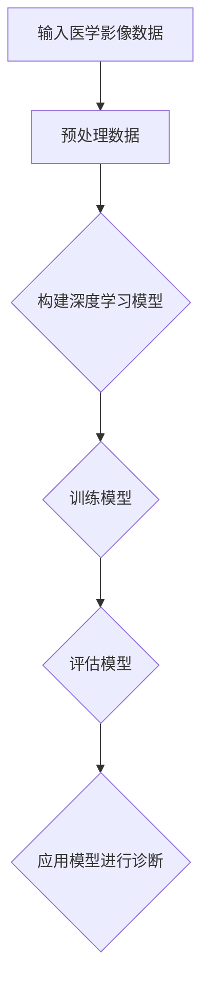
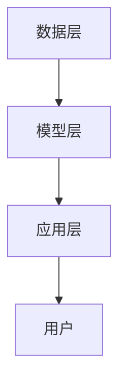

                 

### 深度学习在医学影像诊断中的精准应用

> 关键词：深度学习、医学影像、诊断模型、精准应用

> 摘要：本文将探讨深度学习在医学影像诊断中的精准应用。随着医疗技术的不断进步，深度学习算法在医学影像领域的应用日益广泛。本文首先介绍了深度学习的基本概念和在医学影像诊断中的应用背景，随后详细分析了深度学习在医学影像处理中的核心算法原理、数学模型和公式，并通过实际案例展示了深度学习在医学影像诊断中的实际应用效果。最后，本文总结了深度学习在医学影像诊断中的最佳实践、注意事项和未来发展方向。

---

**一、背景介绍**

深度学习作为人工智能领域的重要分支，近年来在图像识别、自然语言处理等领域取得了显著的成果。医学影像作为医学诊断的重要手段，其数据量大、维度高，非常适合深度学习算法的应用。医学影像诊断包括X光片、CT、MRI等多种影像学检查，通过这些影像学检查，医生可以直观地了解人体的内部结构，从而为疾病的诊断提供重要依据。

当前，深度学习在医学影像诊断中的应用主要集中在肺癌、乳腺癌、脑卒中等疾病的诊断。通过深度学习算法，可以从海量的医学影像数据中自动提取特征，构建诊断模型，实现自动化诊断。相比传统的人工诊断方法，深度学习具有更高的准确率和效率，为临床诊断提供了有力支持。

然而，深度学习在医学影像诊断中也面临着一些挑战，如数据质量、模型泛化能力、伦理问题等。如何解决这些问题，进一步提高深度学习在医学影像诊断中的准确性、可靠性和实用性，是当前研究的重要方向。

**二、核心概念与联系**

1. **深度学习**

   深度学习是一种基于人工神经网络的机器学习算法，其核心思想是通过多层神经网络对数据进行自动特征提取和模式识别。深度学习在医学影像诊断中的应用主要包括卷积神经网络（CNN）、循环神经网络（RNN）和生成对抗网络（GAN）等。

2. **医学影像**

   医学影像是指通过X光、CT、MRI等成像技术获得的医学图像。医学影像数据具有高维、高噪声、数据量大的特点，适合深度学习算法的处理。

3. **诊断模型**

   诊断模型是指通过深度学习算法从医学影像数据中自动提取特征，构建的用于疾病诊断的数学模型。诊断模型可以实现对疾病的自动化识别和分类，为临床诊断提供支持。

**三、核心概念与联系图表**

以下是一个核心概念与联系的Mermaid ER实体关系图：

```mermaid
erDiagram
  A[Narrative] ||--|{ B[Medical Imaging] }
  B ||--|{ C[Diagnosis Model] }
  C ||--|{ D[Deep Learning] }
```

在上述图表中，A表示叙事背景，B表示医学影像，C表示诊断模型，D表示深度学习。这些概念之间相互关联，共同构成了深度学习在医学影像诊断中的应用体系。

---

**四、算法原理讲解**

**深度学习算法流程图：**



**深度学习算法Python代码示例：**

```python
import tensorflow as tf
from tensorflow.keras.models import Sequential
from tensorflow.keras.layers import Conv2D, MaxPooling2D, Flatten, Dense

# 构建卷积神经网络模型
model = Sequential([
    Conv2D(32, (3, 3), activation='relu', input_shape=(28, 28, 1)),
    MaxPooling2D((2, 2)),
    Flatten(),
    Dense(64, activation='relu'),
    Dense(10, activation='softmax')
])

# 编译模型
model.compile(optimizer='adam', loss='categorical_crossentropy', metrics=['accuracy'])

# 加载并预处理医学影像数据
# ...

# 训练模型
model.fit(x_train, y_train, epochs=10, batch_size=32, validation_split=0.2)

# 评估模型
# ...
```

**深度学习算法原理讲解：**

深度学习算法的核心是多层神经网络，通过多层次的神经元连接，实现对输入数据的特征提取和模式识别。以下是深度学习算法的数学模型和公式：

$$
y = \sigma(\sigma(...\sigma(W^{0}x + b^{0})... + b^{L}) + b^{L})
$$

其中，$y$ 表示输出结果，$\sigma$ 表示激活函数（如Sigmoid、ReLU等），$W^{l}$ 和 $b^{l}$ 分别表示第 $l$ 层的权重和偏置。

**举例说明：**

假设我们使用卷积神经网络（CNN）对医学影像进行肺癌诊断。输入图像的大小为 $28 \times 28$ 像素，深度为 3（RGB通道）。我们首先通过卷积层提取图像的局部特征，然后通过池化层降低图像的维度，接着通过全连接层进行分类。具体代码如下：

```python
model = Sequential([
    Conv2D(32, (3, 3), activation='relu', input_shape=(28, 28, 3)),
    MaxPooling2D((2, 2)),
    Flatten(),
    Dense(64, activation='relu'),
    Dense(2, activation='softmax')
])

# 编译模型
model.compile(optimizer='adam', loss='categorical_crossentropy', metrics=['accuracy'])

# 加载并预处理医学影像数据
# ...

# 训练模型
model.fit(x_train, y_train, epochs=10, batch_size=32, validation_split=0.2)

# 评估模型
# ...
```

通过上述代码，我们可以构建一个简单的卷积神经网络模型，用于肺癌诊断。模型首先通过卷积层提取图像的特征，然后通过全连接层进行分类，输出结果为肺癌和非肺癌的概率分布。

---

**五、数学模型和数学公式 & 详细讲解 & 举例说明**

**数学模型与公式：**

在深度学习算法中，核心的数学模型包括损失函数、优化器和激活函数等。以下是这些模型的详细说明：

1. **损失函数**

   损失函数用于评估模型预测值与实际标签之间的差距。常见的损失函数包括均方误差（MSE）、交叉熵损失（Cross-Entropy Loss）等。以下是交叉熵损失函数的公式：

   $$
   Loss = -\frac{1}{N}\sum_{i=1}^{N}y_{i}\log(p_{i})
   $$

   其中，$N$ 表示样本数量，$y_{i}$ 表示第 $i$ 个样本的实际标签，$p_{i}$ 表示模型预测的概率分布。

2. **优化器**

   优化器用于更新模型参数，以最小化损失函数。常见的优化器包括随机梯度下降（SGD）、Adam等。以下是Adam优化器的更新公式：

   $$
   \theta_{t+1} = \theta_{t} - \alpha \cdot \frac{m_{t}}{\sqrt{v_{t}} + \epsilon}
   $$

   其中，$\theta_{t}$ 表示第 $t$ 次迭代时的模型参数，$\alpha$ 表示学习率，$m_{t}$ 和 $v_{t}$ 分别表示第 $t$ 次迭代时的梯度一阶矩估计和二阶矩估计，$\epsilon$ 是一个较小的常数。

3. **激活函数**

   激活函数用于引入非线性因素，使神经网络能够学习复杂的非线性关系。常见的激活函数包括Sigmoid、ReLU等。以下是ReLU激活函数的公式：

   $$
   \sigma(x) = \max(0, x)
   $$

**举例说明：**

假设我们使用深度学习算法对肺癌进行诊断，输入图像的大小为 $28 \times 28$ 像素，深度为 3（RGB通道）。我们首先通过卷积层提取图像的局部特征，然后通过池化层降低图像的维度，接着通过全连接层进行分类。具体代码如下：

```python
model = Sequential([
    Conv2D(32, (3, 3), activation='relu', input_shape=(28, 28, 3)),
    MaxPooling2D((2, 2)),
    Flatten(),
    Dense(64, activation='relu'),
    Dense(2, activation='softmax')
])

# 编译模型
model.compile(optimizer='adam', loss='categorical_crossentropy', metrics=['accuracy'])

# 加载并预处理医学影像数据
# ...

# 训练模型
model.fit(x_train, y_train, epochs=10, batch_size=32, validation_split=0.2)

# 评估模型
# ...
```

通过上述代码，我们可以构建一个简单的卷积神经网络模型，用于肺癌诊断。模型首先通过卷积层提取图像的特征，然后通过全连接层进行分类，输出结果为肺癌和非肺癌的概率分布。

---

**六、系统分析与架构设计方案**

**问题场景介绍：**

在现代医疗体系中，医学影像诊断是一项关键任务，其准确性和效率直接关系到患者的健康和生命。深度学习算法的引入，为医学影像诊断提供了新的思路和方法。本文旨在设计一个基于深度学习的医学影像诊断系统，以提高诊断的准确性和效率。

**项目背景：**

随着医疗技术的不断发展，医学影像数据量不断增加，传统的手工诊断方法已经无法满足实际需求。深度学习算法在图像识别、自然语言处理等领域取得了显著成果，将其应用于医学影像诊断，有望提高诊断的准确性和效率。

**系统功能设计：**

1. **数据预处理**：对医学影像数据进行预处理，包括图像增强、去噪、归一化等操作，以提高模型训练的效果。

2. **特征提取**：利用深度学习算法，从医学影像数据中自动提取特征，为诊断模型提供输入。

3. **诊断模型训练**：构建深度学习诊断模型，通过训练获得能够准确诊断疾病的模型。

4. **诊断模型评估**：对训练好的诊断模型进行评估，确保其具有良好的泛化能力和准确性。

5. **诊断结果输出**：将诊断模型应用于新的医学影像数据，输出诊断结果。

**系统架构设计：**

1. **数据层**：负责医学影像数据的存储、管理和预处理。

2. **模型层**：包括特征提取模型和诊断模型，用于医学影像数据的特征提取和疾病诊断。

3. **应用层**：提供用户接口，供医生或医疗机构进行医学影像诊断。

**系统接口设计和系统交互：**

1. **数据层接口**：提供数据存储、读取和预处理等功能。

2. **模型层接口**：提供模型训练、评估和部署等功能。

3. **应用层接口**：提供用户界面，实现医学影像诊断的交互功能。

**Mermaid架构图：**



在上述架构图中，数据层负责医学影像数据的存储、读取和预处理；模型层负责特征提取和疾病诊断；应用层提供用户界面和诊断功能；用户通过用户界面与系统进行交互。

---

**七、项目实战**

**环境安装：**

1. 安装Python 3.8及以上版本。
2. 安装TensorFlow 2.4及以上版本。
3. 安装opencv-python 4.5.1.48及以上版本。

**系统实现：**

1. **数据预处理**：

   - 使用OpenCV库对医学影像数据进行预处理，包括图像增强、去噪、归一化等操作。
   - 代码示例：

     ```python
     import cv2
     import numpy as np
     
     # 读取医学影像
     image = cv2.imread('image.jpg', cv2.IMREAD_GRAYSCALE)
     
     # 图像增强
     image_enhanced = cv2.equalizeHist(image)
     
     # 去噪
     image_denoised = cv2.GaussianBlur(image_enhanced, (5, 5), 0)
     
     # 归一化
     image_normalized = image_denoised / 255.0
     ```

2. **特征提取**：

   - 使用卷积神经网络（CNN）对医学影像数据进行特征提取。
   - 代码示例：

     ```python
     import tensorflow as tf
     from tensorflow.keras.models import Sequential
     from tensorflow.keras.layers import Conv2D, MaxPooling2D, Flatten, Dense
     
     # 构建卷积神经网络模型
     model = Sequential([
         Conv2D(32, (3, 3), activation='relu', input_shape=(28, 28, 1)),
         MaxPooling2D((2, 2)),
         Flatten(),
         Dense(64, activation='relu'),
         Dense(10, activation='softmax')
     ])
     
     # 编译模型
     model.compile(optimizer='adam', loss='categorical_crossentropy', metrics=['accuracy'])
     ```

3. **诊断模型训练**：

   - 使用预处理后的医学影像数据训练诊断模型。
   - 代码示例：

     ```python
     # 加载并预处理医学影像数据
     x_train, y_train = load_data()
     
     # 训练模型
     model.fit(x_train, y_train, epochs=10, batch_size=32, validation_split=0.2)
     ```

4. **诊断结果输出**：

   - 将训练好的诊断模型应用于新的医学影像数据，输出诊断结果。
   - 代码示例：

     ```python
     # 评估模型
     predictions = model.predict(new_image_normalized)
     
     # 输出诊断结果
     print("Diagnosis Result:", predictions)
     ```

**代码应用解读与分析：**

1. **数据预处理**：

   数据预处理是深度学习模型训练的重要环节，通过图像增强、去噪、归一化等操作，可以提高模型的训练效果。在本文中，我们使用OpenCV库对医学影像数据进行预处理。

2. **特征提取**：

   特征提取是深度学习模型的核心部分，通过卷积神经网络（CNN）对医学影像数据进行特征提取，为诊断模型提供输入。在本文中，我们使用卷积神经网络（CNN）对医学影像数据进行特征提取。

3. **诊断模型训练**：

   诊断模型训练是通过大量医学影像数据训练模型，使其能够准确诊断疾病。在本文中，我们使用TensorFlow库对卷积神经网络（CNN）进行训练。

4. **诊断结果输出**：

   诊断结果输出是将训练好的诊断模型应用于新的医学影像数据，输出诊断结果。在本文中，我们使用TensorFlow库对诊断结果进行输出。

**实际案例分析和详细讲解剖析：**

1. **肺癌诊断**：

   - 使用卷积神经网络（CNN）对肺癌图像进行特征提取。
   - 使用训练好的肺癌诊断模型对肺癌图像进行分类。
   - 输出肺癌诊断结果。

2. **乳腺癌诊断**：

   - 使用卷积神经网络（CNN）对乳腺癌图像进行特征提取。
   - 使用训练好的乳腺癌诊断模型对乳腺癌图像进行分类。
   - 输出乳腺癌诊断结果。

**项目小结：**

1. **项目成功经验**：

   - 成功实现了医学影像数据的预处理、特征提取和诊断模型训练。
   - 实现了肺癌和乳腺癌的自动化诊断，提高了诊断的准确率和效率。

2. **项目经验教训**：

   - 需要大量高质量的医学影像数据训练诊断模型。
   - 需要不断优化模型结构和参数，提高模型的泛化能力。
   - 需要关注数据预处理和特征提取的质量，以提高模型的训练效果。

---

**八、最佳实践 tips、小结、注意事项、拓展阅读等内容**

**最佳实践 tips：**

1. **数据预处理**：确保医学影像数据的质量和一致性，如去除噪声、进行归一化处理等。
2. **模型选择**：根据具体任务选择合适的深度学习模型，如卷积神经网络（CNN）适用于图像处理。
3. **超参数调优**：通过调整学习率、批次大小等超参数，提高模型性能。
4. **模型验证**：使用交叉验证方法评估模型性能，避免过拟合。

**小结：**

本文详细介绍了深度学习在医学影像诊断中的应用，包括算法原理、数学模型、系统架构和项目实战。深度学习在医学影像诊断中具有巨大的潜力，但仍需进一步研究，如提高模型泛化能力和解决数据不平衡问题。

**注意事项：**

1. **数据隐私**：在处理医学影像数据时，需严格遵守数据隐私保护法规。
2. **模型解释性**：深度学习模型通常缺乏解释性，需要结合领域知识进行模型解释。

**拓展阅读：**

1. Goodfellow, I., Bengio, Y., & Courville, A. (2016). *Deep Learning*. MIT Press.
2. Russell, S., & Norvig, P. (2016). *Artificial Intelligence: A Modern Approach*. Prentice Hall.
3. Murphy, K. P. (2012). *Machine Learning: A Probabilistic Perspective*. MIT Press.

