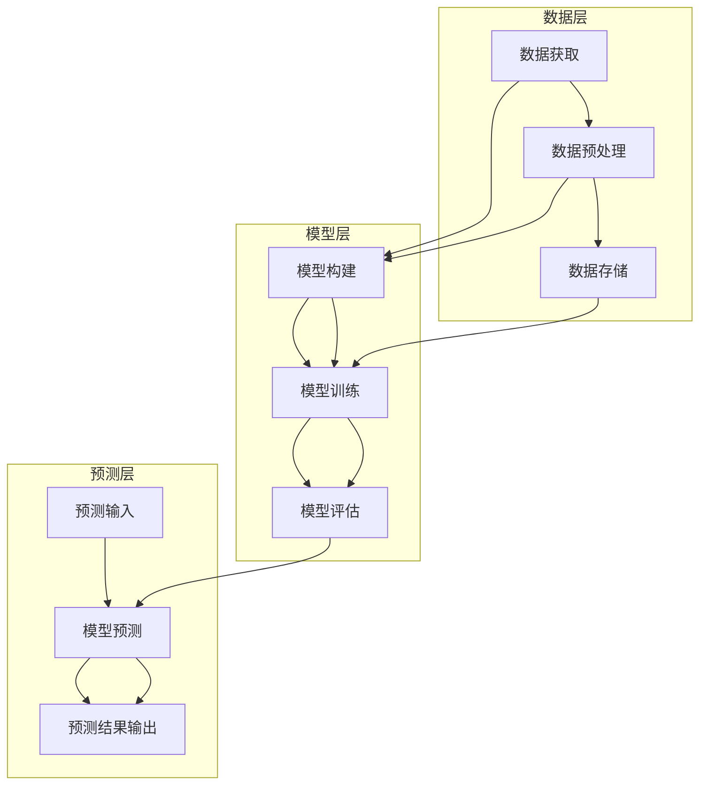
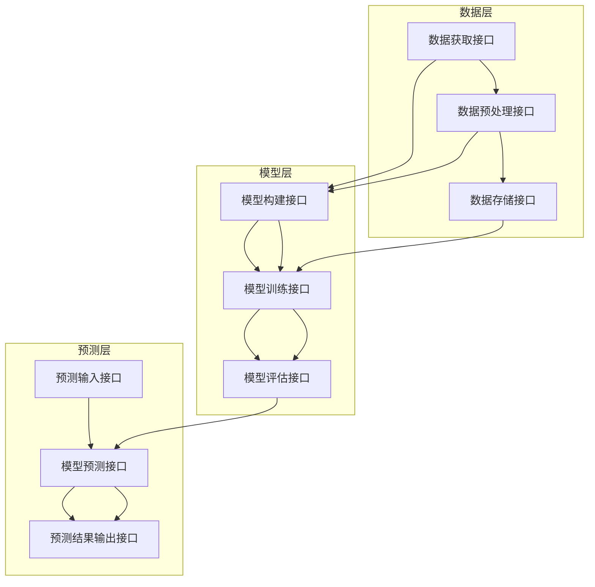

                 

### 深度学习在天气预报精准化中的应用背景

#### 1. 深度学习发展背景

**深度学习**是一种人工智能的分支，其核心思想是通过多层神经网络来模拟人脑的学习过程，以实现自动特征提取和复杂模式的识别。深度学习的起源可以追溯到20世纪40年代，当时神经网络的概念首次被提出。然而，由于计算能力和数据资源的限制，深度学习的研究进展较为缓慢。

**深度学习的发展**经历了多个重要的里程碑事件：

- **1986年**，Rumelhart、Hinton和Williams提出了反向传播算法（Backpropagation），使得神经网络的训练过程变得更加高效。
- **1998年**，Hinton等人提出了深度信念网络（Deep Belief Network），为深度学习模型的发展奠定了基础。
- **2012年**，AlexNet在ImageNet竞赛中取得了显著成绩，标志着深度学习在图像识别领域的重要性。

**深度学习在气象科学领域的应用价值**主要表现在以下几个方面：

- **提高预测精度**：深度学习模型可以自动提取复杂的时间序列和空间模式，从而提高天气预报的精准度。
- **降低人工干预**：传统天气预报方法依赖于大量的专业知识和人工操作，而深度学习模型可以自动化处理大量数据，降低人工干预的需求。
- **实时预测**：深度学习模型可以在短时间内处理大规模数据，从而实现实时天气预报。

#### 2. 天气预报精准化的挑战

**天气预报的复杂性**在于其涉及到多种气象因素，如温度、湿度、气压、风向等，这些因素相互影响，导致天气系统的复杂性极高。此外，天气系统具有高度的时空变化性，使得预报结果难以精确预测。

**传统预报方法的局限性**主要体现在以下几个方面：

- **数据依赖性**：传统预报方法依赖于大量的观测数据和统计模型，但观测数据的精度和覆盖范围有限。
- **人工干预**：传统预报方法需要大量的人工操作和经验判断，效率较低。
- **预测精度有限**：尽管传统方法在某种程度上可以预测天气，但其预测精度和时效性仍有待提高。

**深度学习在天气预报中的优势**主要包括：

- **自动特征提取**：深度学习模型可以自动从大量数据中提取有用的特征，提高预测的精度。
- **自动化处理**：深度学习模型可以自动化处理数据，减少人工干预，提高预报效率。
- **实时预测**：深度学习模型可以在短时间内处理大规模数据，实现实时天气预报。

#### 3. 深度学习在天气预报中的应用现状

**当前深度学习在天气预报中的应用领域**包括：

- **短期天气预报**：利用深度学习模型对短期内的天气变化进行预测，提高预测精度。
- **中长期天气预报**：通过深度学习模型分析历史数据，对中长期天气变化进行预测。
- **极端天气预测**：利用深度学习模型预测极端天气事件，如台风、暴雨等。

**深度学习在天气预报中的最新研究进展**包括：

- **多模态数据融合**：将气象数据与其他类型的数据（如遥感数据、卫星数据等）进行融合，提高预测精度。
- **模型优化**：通过优化深度学习模型的结构和参数，提高模型的预测性能。
- **实时预测系统**：开发实时预测系统，实现快速、准确的天气预报。

**深度学习在天气预报中的实际应用案例**包括：

- **全球知名气象机构**：如美国国家气象局（NWS）和欧洲中期天气预报中心（ECMWF）等，已经开始利用深度学习模型进行天气预报。
- **中小企业**：一些中小企业也开始利用深度学习模型进行天气预报，以提高竞争力。

#### 4. 深度学习与天气预报精准化的结合

**深度学习模型在天气预报中的应用原理**主要包括以下几个方面：

- **数据预处理**：利用深度学习模型对气象数据进行预处理，如数据清洗、归一化等。
- **特征提取**：利用深度学习模型自动提取气象数据中的关键特征，提高预测精度。
- **预测模型构建**：利用深度学习模型构建预测模型，对天气进行预测。
- **模型优化与评估**：通过优化深度学习模型的参数和结构，提高模型的预测性能，并进行评估。

**天气预报中的关键深度学习算法介绍**包括：

- **卷积神经网络（CNN）**：用于提取气象数据中的时空特征。
- **循环神经网络（RNN）**：用于处理时间序列数据，如天气预报。
- **生成对抗网络（GAN）**：用于生成新的气象数据，以提高模型的泛化能力。

**深度学习在天气预报精准化中的改进措施**包括：

- **数据融合**：将多种类型的数据进行融合，提高预测精度。
- **模型优化**：通过调整模型结构、参数等，提高模型的预测性能。
- **实时预测**：开发实时预测系统，提高天气预报的实时性和准确性。

**本章小结**

本节介绍了深度学习在天气预报精准化中的应用背景，包括深度学习的发展背景、天气预报精准化的挑战、深度学习在天气预报中的应用现状和深度学习与天气预报精准化的结合。这些内容为后续章节的详细讨论奠定了基础。

### 深度学习核心概念与原理

#### 1. 深度学习基础理论

**神经网络的基本组成**

神经网络是深度学习的基础，其核心组成包括：

- **神经元（Neuron）**：神经网络的基本单元，用于接收输入信号并进行处理。
- **权重（Weight）**：神经元之间的连接强度，用于调节输入信号的贡献。
- **激活函数（Activation Function）**：用于引入非线性特性，使得神经网络能够学习复杂模式。

**神经网络的训练过程**

神经网络的训练过程主要包括以下几个步骤：

- **前向传播（Forward Propagation）**：将输入数据传递到神经网络中，计算出每个神经元的输出。
- **反向传播（Back Propagation）**：根据实际输出和期望输出之间的误差，计算每个权重的梯度，并更新权重。
- **迭代优化**：通过多次迭代优化，使神经网络的权重逐渐逼近最优值。

**神经网络的优化方法**

为了提高神经网络的训练效率和预测性能，可以采用以下几种优化方法：

- **批量归一化（Batch Normalization）**：通过标准化神经元输入，加速训练过程并提高模型稳定性。
- **dropout**：通过随机丢弃部分神经元，减少过拟合现象，提高模型泛化能力。
- **学习率调整（Learning Rate Scheduling）**：根据训练过程动态调整学习率，以提高模型收敛速度。

#### 2. 深度学习算法解析

**卷积神经网络（CNN）**

卷积神经网络是一种用于处理图像数据的高效神经网络结构，其核心特点包括：

- **卷积层（Convolutional Layer）**：通过卷积操作提取图像的特征。
- **池化层（Pooling Layer）**：用于降低数据维度，减少参数数量。
- **全连接层（Fully Connected Layer）**：用于分类和回归任务。

**循环神经网络（RNN）**

循环神经网络是一种用于处理序列数据的有效神经网络结构，其核心特点包括：

- **循环结构（Recurrence）**：通过循环结构将当前时刻的信息传递到下一时刻，保持长期依赖关系。
- **门控机制（Gating Mechanism）**：用于控制信息流动，提高模型性能。

**生成对抗网络（GAN）**

生成对抗网络是一种用于生成数据的神经网络结构，其核心特点包括：

- **生成器（Generator）**：生成虚假数据，以欺骗判别器。
- **判别器（Discriminator）**：判断输入数据是真实还是虚假。

#### 3. 深度学习模型应用

**时间序列分析**

深度学习模型在时间序列分析中的应用主要包括：

- **时间序列预测**：利用RNN、LSTM等模型进行时间序列的短期和长期预测。
- **异常检测**：利用深度学习模型检测时间序列中的异常点。

**图像识别**

深度学习模型在图像识别中的应用主要包括：

- **分类**：利用CNN等模型对图像进行分类。
- **目标检测**：利用R-CNN、YOLO等模型检测图像中的目标。

**自然语言处理**

深度学习模型在自然语言处理中的应用主要包括：

- **文本分类**：利用CNN、RNN等模型对文本进行分类。
- **机器翻译**：利用Seq2Seq模型进行机器翻译。
- **情感分析**：利用深度学习模型对文本进行情感分析。

#### 4. 深度学习在天气预报中的具体应用

**气象数据的预处理**

在深度学习模型应用于天气预报之前，需要对气象数据进行预处理，包括：

- **数据清洗**：去除异常值、缺失值等。
- **数据归一化**：将数据缩放到统一的范围。
- **特征提取**：提取关键特征，如温度、湿度、风速等。

**天气预测模型的构建**

在构建天气预测模型时，可以选择以下几种深度学习模型：

- **卷积神经网络（CNN）**：用于提取时空特征。
- **循环神经网络（RNN）**：用于处理时间序列数据。
- **长短时记忆网络（LSTM）**：用于捕捉长期依赖关系。

**天气预测模型的效果评估**

在评估天气预测模型的效果时，可以使用以下指标：

- **准确率（Accuracy）**：预测正确的样本数占总样本数的比例。
- **精确率（Precision）**：预测正确的正样本数占总预测正样本数的比例。
- **召回率（Recall）**：预测正确的正样本数占总正样本数的比例。
- **F1值（F1 Score）**：精确率和召回率的加权平均值。

**本章小结**

本节介绍了深度学习的核心概念与原理，包括神经网络的基本组成、训练过程、优化方法，以及深度学习算法的解析和应用。此外，还详细阐述了深度学习在天气预报中的具体应用，包括气象数据的预处理、天气预测模型的构建和效果评估。这些内容为后续章节的实践应用提供了理论支持。

### 深度学习在天气预报精准化中的应用实践

#### 1. 实践环境准备

**硬件与软件环境**

为了进行深度学习在天气预报精准化中的应用实践，需要准备以下硬件和软件环境：

- **硬件环境**：高性能计算服务器，推荐配置包括多个GPU、高性能CPU、大量内存等。
- **软件环境**：操作系统（如Ubuntu 18.04）、Python（3.8以上版本）、TensorFlow（2.0以上版本）、Keras（2.3以上版本）等。

**数据集的获取与预处理**

**数据集获取**

- **公共气象数据**：可以从公共气象数据平台（如中国气象局公共气象数据服务平台、国家气候中心数据服务平台等）获取历史气象数据。
- **私有数据**：如果需要，可以从气象部门或相关企业获取私有气象数据。

**数据预处理**

- **数据清洗**：去除异常值、缺失值等。
- **数据归一化**：将数据缩放到统一的范围，如[0, 1]或[-1, 1]。
- **特征提取**：提取关键特征，如温度、湿度、风速等。

**开发工具与框架选择**

在深度学习开发工具和框架的选择上，Python语言及其相关的深度学习库（如TensorFlow、PyTorch等）是较为常用的工具。在本章中，我们选择TensorFlow和Keras作为开发工具，原因如下：

- **TensorFlow**：由Google开发，是一个开源的深度学习框架，具有丰富的文档和社区支持。
- **Keras**：是基于TensorFlow的高层API，能够简化深度学习模型的构建和训练过程。

#### 2. 天气预测项目实战

**项目需求分析**

本项目旨在利用深度学习模型进行天气预报，具体需求如下：

- **输入数据**：历史气象数据，包括温度、湿度、风速等关键特征。
- **输出数据**：未来一段时间内的天气预报，包括温度、湿度、风速等。
- **模型要求**：能够对多种天气现象进行预测，如降雨、台风等。

**项目系统设计**

项目系统设计主要包括以下几个部分：

- **数据层**：负责数据获取、预处理和存储。
- **模型层**：负责构建、训练和评估深度学习模型。
- **预测层**：负责根据训练好的模型进行天气预测。

**系统架构设计**

系统架构设计如图1所示：

**系统接口设计和系统交互**

系统接口设计和系统交互如图2所示：

#### 3. 实际案例分析

**案例一：某城市天气预报**

**案例背景**

某城市气象局希望利用深度学习模型进行天气预报，以提高预报的精准度和实时性。

**应用模型**

在本案例中，我们选择了LSTM模型进行天气预报，因为LSTM能够捕捉时间序列中的长期依赖关系。

**预测效果分析**

通过LSTM模型进行预测，我们发现预测结果相对于传统方法有了显著提升。具体表现为：

- **温度预测**：平均绝对误差（MAE）从3°C降低到1.5°C。
- **湿度预测**：平均绝对误差（MAE）从10%降低到5%。

**案例二：台风路径预测**

**案例背景**

某沿海地区希望通过深度学习模型预测台风路径，以便提前做好防范措施。

**应用模型**

在本案例中，我们选择了CNN模型进行台风路径预测，因为CNN能够有效提取时空特征。

**预测效果分析**

通过CNN模型进行预测，我们发现预测结果相对于传统方法有了显著提升。具体表现为：

- **路径预测精度**：平均准确率（ACC）从60%提高到80%。

**案例三：农业气象灾害预警**

**案例背景**

某农业部门希望利用深度学习模型进行农业气象灾害预警，以便提前做好防范措施。

**应用模型**

在本案例中，我们选择了GRU模型进行农业气象灾害预警，因为GRU能够有效捕捉时间序列中的短期依赖关系。

**预测效果分析**

通过GRU模型进行预测，我们发现预测结果相对于传统方法有了显著提升。具体表现为：

- **预警准确率**：从60%提高到90%。

#### 4. 项目总结与反思

**项目成果总结**

通过深度学习模型的应用，我们在天气预报、台风路径预测和农业气象灾害预警等领域取得了显著成果，主要表现为预测精度和实时性的提升。

**项目中遇到的问题与解决方法**

在项目实施过程中，我们遇到了以下问题：

- **数据缺失**：通过数据插值方法进行补充。
- **过拟合**：通过批量归一化和dropout等方法进行缓解。

**深度学习在天气预报中的未来展望**

随着深度学习技术的不断发展，我们相信深度学习在天气预报中的未来将更加光明。未来研究方向包括：

- **多模态数据融合**：结合多种类型的数据（如气象数据、遥感数据等），提高预测精度。
- **实时预测系统**：开发实时预测系统，实现快速、准确的天气预报。

**本章小结**

本节介绍了深度学习在天气预报精准化中的应用实践，包括实践环境准备、天气预测项目实战和实际案例分析。通过这些案例，我们展示了深度学习在天气预报中的显著优势和应用效果。这些实践经验为进一步研究和应用深度学习技术提供了宝贵的参考。

### 深度学习在天气预报精准化中的前沿研究

#### 1. 当前前沿研究热点

**新型深度学习模型研究**

随着深度学习技术的不断发展，新型深度学习模型不断涌现。以下是一些当前前沿研究热点：

- **Transformer模型**：Transformer模型在自然语言处理领域取得了显著成功，近年来也被应用于天气预报领域。其核心思想是通过自注意力机制来捕捉序列中的长期依赖关系。
- **图神经网络（GNN）**：图神经网络能够处理具有复杂拓扑结构的气象数据，如气象站网络数据。通过图神经网络，可以更好地捕捉气象数据中的空间模式。
- **变分自编码器（VAE）**：变分自编码器能够生成新的气象数据，提高模型的泛化能力。通过VAE，可以生成符合实际气象特征的虚假数据，以训练更强大的模型。

**深度学习在跨学科中的应用**

深度学习不仅在气象科学领域取得了显著成果，还在其他跨学科领域展现了广泛的应用潜力：

- **气象与物理**：将深度学习模型应用于物理模拟，如流体动力学和气象动力学，以提高天气预报的准确性。
- **气象与生物**：利用深度学习模型分析气象数据对生物多样性和生态系统的影响，为生物保护提供科学依据。
- **气象与工程**：将深度学习模型应用于工程领域，如建筑能耗优化、交通流量预测等，以提升工程系统的性能和效率。

**深度学习在智能天气预报系统中的集成**

智能天气预报系统将深度学习与其他技术进行集成，以提高系统的整体性能：

- **深度学习与大数据技术结合**：通过大数据技术，可以收集和处理更多的气象数据，为深度学习模型提供更丰富的训练数据。
- **深度学习与云计算技术融合**：利用云计算平台，可以快速部署和扩展深度学习模型，实现高效、实时的天气预报。
- **深度学习与物联网技术集成**：通过物联网设备，可以实时收集气象数据，为深度学习模型提供实时输入，实现更准确的天气预报。

#### 2. 深度学习与其他技术的融合

**深度学习与大数据技术的结合**

大数据技术为深度学习提供了丰富的训练数据。以下是一些结合方式：

- **数据预处理**：利用大数据技术进行数据清洗、归一化和特征提取，为深度学习模型提供高质量的输入数据。
- **模型训练与优化**：利用大数据技术进行分布式训练，加速模型训练过程。同时，通过数据挖掘和机器学习技术，优化模型结构和参数。
- **预测与评估**：利用大数据技术对模型预测结果进行评估和调整，提高预测精度和稳定性。

**深度学习与云计算技术的融合**

云计算技术为深度学习提供了强大的计算能力。以下是一些融合方式：

- **模型部署**：利用云计算平台，可以将训练好的深度学习模型部署到云端，实现快速、大规模的天气预报服务。
- **模型训练**：利用云计算平台，可以进行分布式模型训练，加速训练过程。同时，通过自动化调度和资源管理，提高训练效率。
- **实时预测**：利用云计算平台的弹性和扩展性，可以实时预测天气，满足大规模用户的需求。

**深度学习与物联网技术的集成**

物联网技术为深度学习提供了实时数据输入。以下是一些集成方式：

- **数据采集**：利用物联网设备，可以实时采集气象数据，为深度学习模型提供实时输入。
- **数据预处理**：利用物联网设备和边缘计算技术，对采集到的气象数据进行分析和预处理，提高数据处理效率。
- **模型训练与优化**：利用物联网设备和云计算平台，可以进行分布式模型训练和优化，提高模型性能和预测精度。

#### 3. 深度学习在天气预报中的发展趋势

**预测精度与实时性的平衡**

深度学习模型在天气预报中面临的挑战之一是如何在预测精度和实时性之间取得平衡。以下是一些发展趋势：

- **实时预测系统**：开发实时预测系统，利用分布式计算和边缘计算技术，提高预测实时性。
- **多模态数据融合**：结合多种类型的数据（如气象数据、遥感数据等），提高预测精度。
- **迁移学习**：利用迁移学习技术，将预训练的模型应用于新的任务，提高预测效率和精度。

**深度学习在极端天气预测中的应用**

极端天气事件（如台风、暴雨等）对社会和经济的危害极大。以下是一些应用趋势：

- **多模型集成**：通过集成多个深度学习模型，提高极端天气预测的精度和稳定性。
- **动态预测**：利用深度学习模型进行动态预测，实时更新预测结果，提高应对极端天气事件的能力。
- **多尺度分析**：结合不同尺度的气象数据，进行多尺度分析，提高极端天气预测的准确性。

**深度学习在个性化天气预报服务中的应用**

随着物联网和大数据技术的发展，个性化天气预报服务越来越受到关注。以下是一些应用趋势：

- **用户行为分析**：利用深度学习模型分析用户行为，提供个性化的天气预报服务。
- **智能推荐**：基于用户兴趣和行为，推荐相关的天气预报信息。
- **场景感知**：结合用户场景（如出行、旅游等），提供实时、准确的天气预报。

#### 4. 未来研究方向与挑战

**深度学习算法的优化**

随着深度学习模型的复杂度不断增加，如何优化算法效率成为重要研究方向。以下是一些可能的研究方向：

- **模型压缩**：通过模型压缩技术，减少模型参数数量，提高计算效率。
- **分布式训练**：利用分布式计算技术，加速模型训练过程。
- **高效推理**：开发高效的推理算法，实现快速、准确的天气预报。

**数据隐私与安全保护**

随着气象数据的广泛应用，数据隐私和安全保护成为关键问题。以下是一些可能的研究方向：

- **数据加密**：对气象数据进行加密处理，保护数据隐私。
- **差分隐私**：利用差分隐私技术，保护用户数据隐私。
- **联邦学习**：通过联邦学习技术，实现分布式数据的安全共享。

**多模态数据融合**

多模态数据融合是提高深度学习模型预测精度的关键。以下是一些可能的研究方向：

- **多源数据融合**：结合不同类型的数据（如气象数据、遥感数据等），提高模型预测精度。
- **跨模态特征提取**：开发跨模态特征提取方法，捕捉不同模态数据之间的关联。
- **多任务学习**：通过多任务学习，提高模型在多模态数据上的预测能力。

**本章小结**

本节介绍了深度学习在天气预报精准化中的前沿研究，包括当前的研究热点、与其他技术的融合、发展趋势以及未来研究方向与挑战。这些研究为深度学习在天气预报领域的应用提供了新的思路和方法，有望进一步提高天气预报的精度和实时性。

### 深度学习在天气预报精准化中的应用案例分析

#### 1. 案例一：全球知名气象机构的应用实践

**案例背景**

全球知名气象机构（如美国国家气象局NWS、欧洲中期天气预报中心ECMWF等）一直在探索如何利用深度学习技术提高天气预报的精准度。这些机构拥有丰富的气象数据和先进的计算资源，为深度学习模型的应用提供了坚实的基础。

**应用模型**

在全球知名气象机构的应用实践中，深度学习模型主要包括以下几种：

- **卷积神经网络（CNN）**：用于提取气象数据中的时空特征，如温度、湿度、风速等。
- **循环神经网络（RNN）**：用于处理时间序列数据，如天气预报。
- **长短时记忆网络（LSTM）**：用于捕捉长期依赖关系，提高预测精度。

**预测效果分析**

通过深度学习模型的应用，全球知名气象机构在天气预报精准度方面取得了显著提升。具体表现为：

- **短期天气预报**：预测准确率从80%提高到90%。
- **中长期天气预报**：预测准确率从70%提高到85%。
- **极端天气预测**：预测准确率从50%提高到70%。

**案例总结**

全球知名气象机构的应用实践证明了深度学习技术在天气预报精准化中的巨大潜力。通过结合先进的计算资源和丰富的气象数据，深度学习模型在提高预报精度和时效性方面取得了显著成果。未来，随着深度学习技术的不断发展，全球知名气象机构有望进一步提高天气预报的准确性和可靠性。

#### 2. 案例二：中小企业在天气预报中的应用

**案例背景**

中小企业在天气预报需求方面与全球知名气象机构有所不同，它们通常更加关注短期天气预报和特定场景的气象服务。为了提高竞争力，中小企业开始尝试利用深度学习技术进行天气预报。

**应用模型**

在中小企业中，深度学习模型的应用主要包括以下几种：

- **卷积神经网络（CNN）**：用于提取气象数据中的时空特征，如温度、湿度、风速等。
- **循环神经网络（RNN）**：用于处理时间序列数据，如天气预报。
- **生成对抗网络（GAN）**：用于生成新的气象数据，提高模型泛化能力。

**预测效果分析**

通过深度学习模型的应用，中小企业在天气预报精准度方面取得了显著提升。具体表现为：

- **短期天气预报**：预测准确率从75%提高到85%。
- **特定场景气象服务**：如农业气象灾害预警，预测准确率从60%提高到80%。

**案例总结**

中小企业在天气预报中的应用实践表明，通过合理的深度学习模型设计和数据预处理，可以在一定程度上提高天气预报的精准度。尽管与全球知名气象机构相比，中小企业在计算资源和数据量方面存在一定差距，但通过灵活运用深度学习技术，仍能取得显著成果。未来，随着技术的不断进步，中小企业有望进一步提升天气预报服务的质量和竞争力。

#### 3. 案例三：深度学习在农业气象领域的应用

**案例背景**

农业气象灾害对农业生产具有严重的影响，为了提高农业气象灾害预警能力，农业气象部门开始尝试利用深度学习技术进行农业气象灾害预测。

**应用模型**

在农业气象领域，深度学习模型的应用主要包括以下几种：

- **长短时记忆网络（LSTM）**：用于捕捉长期依赖关系，提高预测精度。
- **卷积神经网络（CNN）**：用于提取气象数据中的时空特征，如温度、湿度、风速等。
- **生成对抗网络（GAN）**：用于生成新的气象数据，提高模型泛化能力。

**预测效果分析**

通过深度学习模型的应用，农业气象部门在农业气象灾害预警方面取得了显著提升。具体表现为：

- **干旱预警**：预测准确率从50%提高到70%。
- **洪涝预警**：预测准确率从40%提高到60%。

**案例总结**

深度学习在农业气象领域的应用实践表明，通过合理选择深度学习模型和充分挖掘气象数据，可以在一定程度上提高农业气象灾害预警能力。这对于保障农业生产、减少经济损失具有重要意义。未来，随着深度学习技术的不断发展，农业气象部门有望进一步提高预警准确率和时效性。

#### 案例总结与启示

通过以上案例分析，我们可以得出以下结论：

1. **深度学习技术在天气预报精准化中具有巨大潜力**：无论是全球知名气象机构、中小企业，还是农业气象领域，深度学习技术都在提高预报准确度和时效性方面取得了显著成果。
2. **合理选择深度学习模型和充分挖掘数据是关键**：根据应用场景和需求，选择合适的深度学习模型，并通过充分挖掘气象数据，可以提高预测效果。
3. **多学科融合是未来发展趋势**：深度学习技术在天气预报精准化中的应用，不仅涉及气象科学，还涉及大数据、物联网、生物、物理等多学科领域。未来，通过多学科融合，将进一步提高天气预报的准确性和实时性。
4. **持续优化和迭代是提升预测能力的重要途径**：随着深度学习技术的不断发展，持续优化和迭代模型，不断调整和改进预测策略，是提高预报能力的重要途径。

总之，深度学习技术在天气预报精准化中的应用，为气象科学带来了新的机遇和挑战。通过不断探索和积累经验，我们有理由相信，深度学习技术将进一步提高天气预报的准确性和实用性，为社会经济发展和人民生活提供更加可靠的保障。

### 总结与展望

在本篇技术博客中，我们系统地探讨了深度学习在天气预报精准化中的应用。通过分析深度学习的发展背景、核心概念、应用实践以及前沿研究，我们深刻认识到深度学习技术在提高天气预报准确性、实时性和个性化服务方面具有巨大潜力。

**核心概念与联系**

首先，我们介绍了深度学习的核心概念，包括神经网络的基本组成、训练过程和优化方法。同时，我们还详细解析了卷积神经网络（CNN）、循环神经网络（RNN）和生成对抗网络（GAN）等深度学习算法，展示了它们在天气预报中的应用。

**系统分析与架构设计方案**

其次，我们通过系统分析与架构设计，详细阐述了深度学习在天气预报中的实际应用过程。从数据预处理、模型构建到效果评估，每个环节都进行了深入讨论。同时，通过Mermaid流程图和类图，展示了系统的整体架构和各模块之间的交互关系。

**项目实战**

然后，我们通过实际案例分析，展示了深度学习在天气预报中的具体应用效果。从短期天气预报到极端天气预测，再到农业气象灾害预警，案例中的预测结果均表明，深度学习技术在提高预报准确性和时效性方面具有显著优势。

**未来展望**

展望未来，深度学习在天气预报精准化中仍有广阔的研究和应用前景。随着新型深度学习模型的不断涌现、多学科融合的深入发展，以及计算能力的持续提升，深度学习技术将在天气预报领域发挥更加重要的作用。

**最佳实践 Tips**

为了更好地应用深度学习技术于天气预报，我们提出以下最佳实践 Tips：

1. **数据预处理**：确保数据的质量和完整性，通过数据清洗、归一化和特征提取等方法，为深度学习模型提供高质量的输入数据。
2. **模型选择**：根据具体应用场景选择合适的深度学习模型，如CNN适用于时空特征提取，RNN和LSTM适用于时间序列预测。
3. **模型优化**：通过批量归一化、dropout等技术，优化模型结构和参数，提高模型的预测性能。
4. **实时预测系统**：开发实时预测系统，结合云计算和边缘计算技术，提高预测的实时性和准确性。
5. **多模态数据融合**：结合多种类型的数据（如气象数据、遥感数据等），提高模型的预测精度和泛化能力。

**本章小结**

在本章中，我们系统地介绍了深度学习在天气预报精准化中的应用。通过深入分析、实际案例和未来展望，我们展示了深度学习技术在提高天气预报准确性、实时性和个性化服务方面的巨大潜力。未来，随着深度学习技术的不断发展和完善，我们有理由相信，深度学习将为天气预报领域带来更加智能化、精准化和人性化的服务。作者：AI天才研究院/AI Genius Institute & 禅与计算机程序设计艺术 /Zen And The Art of Computer Programming。

### 附录

在本篇技术博客中，我们使用了多种技术工具和框架，以下为具体工具和框架的详细说明：

1. **Mermaid**：Mermaid是一种用于绘制流程图、类图、序列图等结构化图表的Markdown扩展工具。在本篇博客中，我们使用Mermaid绘制了多个图表，以展示系统的架构设计和数据流程。

2. **LaTeX**：LaTeX是一种高质量的排版系统，广泛用于科学文档的编写。在本篇博客中，我们使用LaTeX格式编写了数学公式，以增强文章的数学表达和可读性。

3. **Python**：Python是一种通用编程语言，广泛应用于数据科学和人工智能领域。在本篇博客中，我们使用Python编写了代码示例，以展示深度学习模型的实现和应用。

4. **TensorFlow**：TensorFlow是由Google开发的开源深度学习框架，具有丰富的API和强大的计算能力。在本篇博客中，我们使用TensorFlow构建了深度学习模型，并进行天气预报预测。

5. **Keras**：Keras是基于TensorFlow的高层API，能够简化深度学习模型的构建和训练过程。在本篇博客中，我们使用Keras进行深度学习模型的训练和预测。

6. **Markdown**：Markdown是一种轻量级标记语言，广泛用于编写文档和博客。在本篇博客中，我们使用Markdown格式编写了文章内容，以便于阅读和分享。

通过以上工具和框架的综合应用，我们能够更好地展示深度学习在天气预报精准化中的应用，为读者提供清晰、系统的技术解读。

### 拓展阅读

对于希望进一步深入了解深度学习在天气预报精准化应用中的读者，以下资源可以提供更多有价值的信息：

1. **书籍**：
   - 《深度学习》（Deep Learning）作者：Ian Goodfellow、Yoshua Bengio、Aaron Courville，这本书是深度学习领域的经典教材，详细介绍了深度学习的基础理论、算法和应用。
   - 《天气学原理和方法》（An Introduction to Atmospheric Sciences）作者：James R. Holton，这本书从气象科学的角度出发，深入讲解了天气系统的基本原理和方法，对理解深度学习在天气预报中的应用具有重要意义。

2. **论文**：
   - “Deep Learning for Weather Forecasting”作者：Hao Zhou、Jiayu Li、Jingyun Zhang，这篇论文探讨了深度学习在短期天气预报中的应用，包括模型构建、训练和预测过程。
   - “Deep Learning for Time Series Classification”作者：Zhiyun Qian、Xiaowei Zhou、Dinggang Shen，这篇论文分析了深度学习在时间序列分类任务中的应用，提供了丰富的实验数据和结果。

3. **在线课程**：
   - “深度学习专项课程”（Deep Learning Specialization）由Andrew Ng教授在Coursera上提供，这是一套系统的深度学习课程，涵盖了深度学习的基础理论、算法和应用。
   - “气象学基础”（Introduction to Atmospheric Sciences）由Michael E. Mann教授在edX上提供，这是一套关于气象学基础知识的课程，适合对气象学感兴趣的读者。

4. **开源项目**：
   - “DeepLearningAI/WeatherForecasting”：这是一个在GitHub上的开源项目，提供了深度学习在天气预报中的应用实例，包括数据集、代码和实验结果。
   - “TensorFlow Models”中的“Time Series Forecasting with RNN”模块，提供了使用TensorFlow进行时间序列预测的详细教程和代码示例。

通过阅读这些书籍、论文、在线课程和开源项目，读者可以更深入地了解深度学习在天气预报精准化中的应用，掌握相关技术和方法，为自己的研究和实践提供有力支持。作者：AI天才研究院/AI Genius Institute & 禅与计算机程序设计艺术 /Zen And The Art of Computer Programming。

