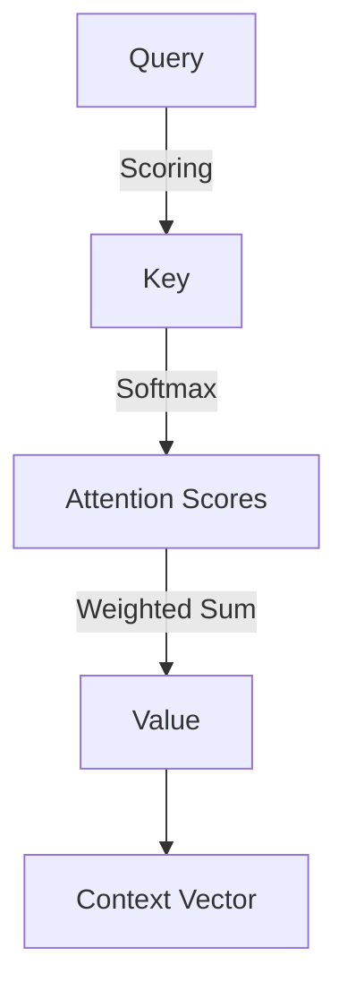
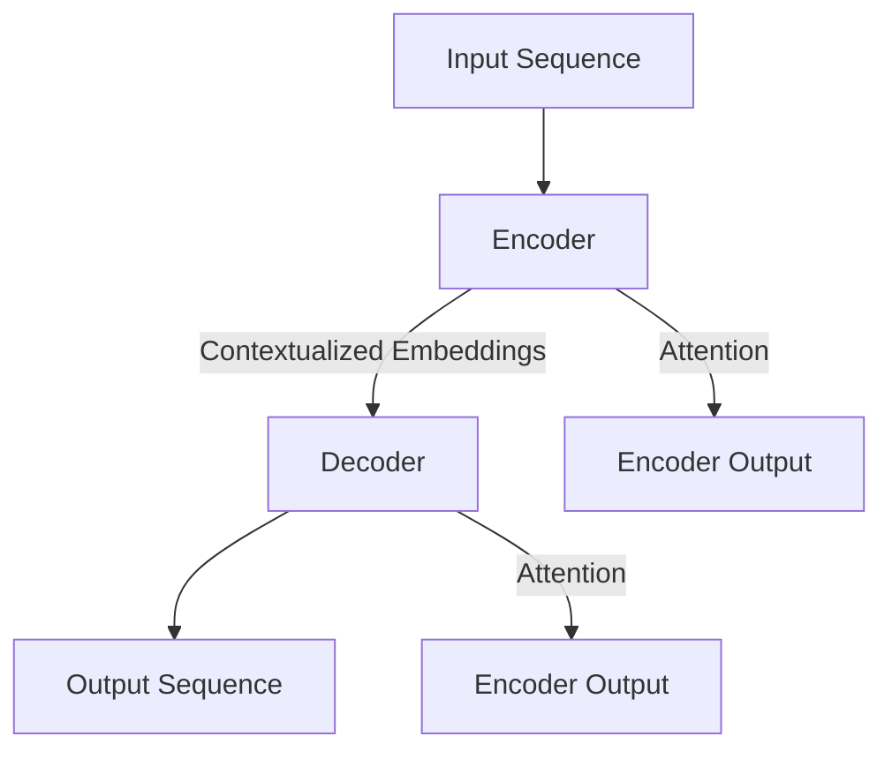
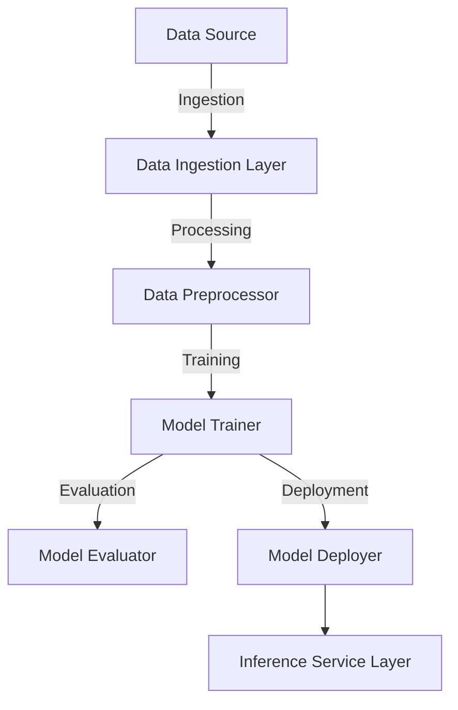

                 

### Introduction to Deep Learning and Natural Language Understanding

#### Background of Deep Learning

**1.1.1 Evolution of Deep Learning**

Deep Learning is a subfield of artificial intelligence (AI) based on multi-layered artificial neural networks. The concept of neural networks can be traced back to the early 1940s, when Warren McCulloch and Walter Pitts proposed a simplified model of a neuron. However, the real breakthrough came in the 1980s with the introduction of backpropagation, an algorithm for training multi-layer neural networks.

The development of GPUs (Graphical Processing Units) in the late 2000s significantly accelerated the adoption of Deep Learning. GPUs are well-suited for parallel processing, which is essential for training large neural networks with millions of parameters.

**1.1.2 Importance in Natural Language Processing**

Natural Language Processing (NLP) is a subfield of AI that focuses on the interaction between computers and human languages. Traditional NLP methods, such as rule-based systems and statistical models, have been successful in certain tasks, like part-of-speech tagging and named entity recognition. However, they struggle with understanding the meaning and context behind the text.

Deep Learning has revolutionized NLP by enabling machines to understand and generate human language more effectively. Convolutional Neural Networks (CNNs) and Recurrent Neural Networks (RNNs) were some of the early successes in this field. More recently, Transformer models, such as BERT and GPT, have set new benchmarks in various NLP tasks.

**1.1.3 Challenges in Contextual Understanding**

While Deep Learning has made significant strides in NLP, there are still challenges in achieving high-quality contextual understanding. One major challenge is the ability to generalize from a limited amount of training data. Most Deep Learning models require large datasets to perform well, but labeled data is often scarce and expensive to obtain.

Another challenge is the interpretability of Deep Learning models. Neural networks are often regarded as black boxes, making it difficult to understand how they arrive at their predictions. This lack of transparency can be problematic in applications where explainability is crucial.

**1.2 Basics of Natural Language Understanding**

**1.2.1 Key Concepts in NLP**

- **Tokenization:** The process of breaking text into words, phrases, symbols, or other meaningful elements called tokens.
- **Part-of-Speech Tagging:** Assigning a part of speech (noun, verb, adjective, etc.) to each token in a sentence.
- **Named Entity Recognition (NER):** Identifying and categorizing named entities (such as persons, organizations, locations, etc.) in text.
- **Sentiment Analysis:** Determining the sentiment or emotional tone behind a piece of text, such as whether a review is positive or negative.
- **Semantic Analysis:** Understanding the meaning of words and sentences in context.

**1.2.2 History and Development**

NLP has a rich history dating back to the 1950s, when researchers first attempted to create machines that could understand and process human language. Early approaches included rule-based systems, which relied on manually crafted sets of rules to analyze text. These systems were effective for simple tasks but struggled with more complex language phenomena.

In the 1990s, statistical models, such as Hidden Markov Models (HMMs) and Conditional Random Fields (CRFs), gained popularity. These models used statistical techniques to predict the likelihood of certain language patterns based on observed data.

The advent of Deep Learning has brought about a new era in NLP, with neural networks outperforming traditional models on many tasks. Transformer models, in particular, have achieved state-of-the-art results in various NLP benchmarks.

**1.2.3 Current State and Future Directions**

The current state of NLP is characterized by rapid progress and continuous improvement. Transformer models have become the standard for many NLP tasks, and pre-trained language models, such as BERT and GPT, have shown remarkable performance on a wide range of tasks with minimal additional training.

Future directions include developing more efficient and interpretable models, improving the generalization capabilities of NLP systems, and addressing ethical concerns related to bias and fairness. Additionally, researchers are exploring new applications of NLP in areas such as machine translation, summarization, and conversational AI.

#### Introduction to Contextual Understanding

**1.3.1 Definition and Importance**

Contextual understanding refers to the ability of a machine learning model to interpret and make use of context-specific information when processing text. This is crucial for achieving high-quality performance in tasks such as question answering, sentiment analysis, and machine translation.

The importance of contextual understanding lies in its ability to enhance the accuracy and reliability of NLP models. For example, in sentiment analysis, understanding the context of a sentence can help determine whether a statement is positive or negative. In question answering, contextual information can improve the model's ability to find relevant answers within a given context.

**1.3.2 Types of Contextual Information**

There are several types of contextual information that can be leveraged in NLP:

- **Temporal Context:** Information about the time when the text was created or when it is being processed. For example, understanding that a review was written several years ago can help interpret its relevance today.
- **Spatial Context:** Information about the location where the text was created or being processed. This can be important in tasks like geotagging or location-based recommendations.
- **Thematic Context:** Information about the topic or theme of the text. For example, understanding that a sentence is about technology can help in extracting relevant information from a text.
- **Intertextual Context:** Information about the relationships between different texts or parts of a text. For example, understanding the context of a paragraph based on the surrounding paragraphs can improve the model's understanding of the overall meaning.

**1.3.3 Challenges in Capturing Context**

 Capturing contextual information in NLP models is challenging due to several reasons:

- **Limited Training Data:** Contextual information is often not explicitly present in the training data, making it difficult for models to learn from it.
- **Ambiguity:** Language is inherently ambiguous, and context can sometimes lead to multiple interpretations. This can make it challenging for models to consistently capture the correct context.
- **Domain-specific Context:** Some contextual information is highly domain-specific and may not be generalizable across different domains.

To overcome these challenges, researchers have proposed various techniques, such as incorporating external knowledge bases, using transfer learning, and designing models that can explicitly capture and leverage contextual information.

#### Overview of Deep Learning Models in NLP

**1.4.1 Traditional Models**

Traditional models in NLP include rule-based systems, statistical models, and shallow learning techniques. Rule-based systems rely on manually crafted rules to analyze text, while statistical models use probabilistic techniques to predict the likelihood of certain language patterns based on observed data. Shallow learning techniques, such as k-nearest neighbors and support vector machines, have also been used in NLP for tasks like text classification and named entity recognition.

While traditional models have been successful in certain tasks, they often struggle with understanding the meaning and context behind the text. This limitation has led to the development of more advanced deep learning models.

**1.4.2 Transformer Models**

Transformer models, introduced by Vaswani et al. in 2017, have revolutionized the field of NLP. Unlike traditional models, which use recurrent neural networks (RNNs) or convolutional neural networks (CNNs), Transformers employ self-attention mechanisms and encoder-decoder architectures to process text in parallel.

**1.4.3 Pre-training and Fine-tuning**

Pre-training and fine-tuning are key techniques in the development of deep learning models for NLP. Pre-training involves training a model on a large corpus of unlabeled text to learn general language representations. This pre-trained model can then be fine-tuned on a specific task using a smaller labeled dataset.

The pre-training phase allows the model to learn from a vast amount of unlabeled data, improving its generalization capabilities. Fine-tuning then adapts the pre-trained model to a specific task by training it on a smaller, domain-specific dataset.

**1.4.4 Applications of Transformer Models**

Transformer models have been successfully applied to a wide range of NLP tasks, including text classification, named entity recognition, machine translation, and question answering. For example, BERT (Bidirectional Encoder Representations from Transformers) has achieved state-of-the-art results in various benchmarks, and GPT (Generative Pre-trained Transformer) has been used for generating human-like text.

**1.4.5 Comparison with Traditional Models**

Compared to traditional models, Transformer models offer several advantages:

- **Parallel Processing:** Transformers process text in parallel, leading to faster and more efficient computation.
- **Global Context:** The self-attention mechanism allows Transformers to capture global context, enabling better understanding of the relationships between words in a sentence.
- **Flexibility:** Transformer models can be easily adapted to different NLP tasks through fine-tuning.

However, Transformers also have some limitations, such as the need for large amounts of training data and the challenge of interpretability. Despite these limitations, the success of Transformer models has paved the way for further advancements in NLP.

### Applications of Contextual Understanding

**1.5.1 In Sentiment Analysis**

Sentiment analysis is a common application of NLP that involves determining the sentiment or emotional tone behind a piece of text, such as a review, social media post, or news article. Contextual understanding is crucial in sentiment analysis because the same word can have different meanings depending on the context. For example, the word "great" can be positive when used to describe a product ("This product is great!"), but negative when used sarcastically ("What a great mess you made!").

To effectively perform sentiment analysis, a model needs to understand the context in which a word or phrase is used. This can be achieved by incorporating contextual embeddings, which capture the meaning of words based on their surrounding text. For example, a contextual embedding for "great" in the positive sentence might be different from the embedding in the sarcastic sentence.

**1.5.2 In Named Entity Recognition**

Named Entity Recognition (NER) is another important application of NLP that involves identifying and categorizing named entities in text, such as names of people, organizations, locations, and dates. Contextual understanding is essential in NER to accurately identify entities and distinguish between different types of entities. For example, the name "Microsoft" can refer to a technology company or a software product, depending on the context.

To improve the performance of NER models, contextual information can be leveraged in several ways. One approach is to use contextual embeddings, which capture the meaning of words and phrases based on their surrounding text. Another approach is to incorporate external knowledge bases, such as ontologies or knowledge graphs, which provide additional context about entities and their relationships.

**1.5.3 In Question Answering Systems**

Question answering (QA) systems are designed to answer questions posed by users based on a given set of information. Contextual understanding is crucial in QA systems because the answers can vary depending on the context of the question. For example, the question "Who is the president of the United States?" has a different answer if asked in 2020 compared to 2023.

To build effective QA systems, models need to understand the context of the question and the available information. One approach is to use pre-trained language models, such as BERT or GPT, which have been trained on large amounts of text and can capture contextual information. Another approach is to use contextual embeddings, which can be used to represent the question and the available information in a way that captures their relationships.

In summary, contextual understanding is essential in various NLP applications, including sentiment analysis, named entity recognition, and question answering. By leveraging contextual information, models can achieve higher accuracy and better performance in these tasks. As deep learning continues to advance, we can expect even more sophisticated techniques for capturing and utilizing contextual information in NLP systems.

#### Core Concepts in Deep Learning for NLP

**2.1 Neural Network Basics**

A neural network is a computational model inspired by the structure and function of the human brain. It consists of interconnected nodes, called neurons, which process and transmit information. Each neuron takes input, performs a computation, and produces an output. The basic components of a neural network include:

- **Inputs:** The input layer receives the raw data, which can be numerical or categorical.
- **Weights:** The connections between neurons, also known as edges, have associated weights that determine the influence of each input on the output.
- **Bias:** A constant term added to the weighted sum of inputs, which helps shift the activation function's curve.
- **Activations:** The output of each neuron after the weighted sum of inputs is passed through an activation function.
- **Output:** The final layer produces the output of the neural network, which can be a prediction, a classification, or a regression value.

**2.1.1 Structure and Functionality**

A neural network typically consists of multiple layers:

- **Input Layer:** The first layer, which receives the input data.
- **Hidden Layers:** One or more intermediate layers that transform the input data through a series of weightings and activations.
- **Output Layer:** The last layer, which produces the final output.

The most common types of neural networks include:

- **Feedforward Neural Networks:** The simplest type of neural network, where information flows from the input layer to the output layer without any loops.
- **Recurrent Neural Networks (RNNs):** Designed to handle sequential data, RNNs have loops that allow information to persist across different time steps.
- **Convolutional Neural Networks (CNNs):** Specialized for processing grid-like data, such as images, by applying convolutional layers that capture spatial relationships.

**2.1.2 Activation Functions**

Activation functions introduce non-linearities into the neural network, enabling it to model complex patterns. The most common activation functions include:

- **Sigmoid:** Maps inputs to a range between 0 and 1, useful for binary classification problems.
- **Tanh:** Similar to the sigmoid function but centered around zero, which can help with symmetric data.
- **ReLU (Rectified Linear Unit):** Sets negative inputs to zero and keeps positive inputs unchanged, reducing the vanishing gradient problem.
- **Leaky ReLU:** A variation of ReLU that allows a small value for negative inputs to mitigate the dying ReLU problem.
- **Softmax:** Converts the output of a logistic regression model into a probability distribution over multiple classes.

**2.1.3 Training and Optimization**

Training a neural network involves adjusting the weights and biases to minimize the difference between the predicted output and the actual output. This is achieved through the following steps:

- **Forward Propagation:** Input data is passed through the network to produce an output.
- **Backpropagation:** The error between the predicted output and the actual output is propagated backward through the network, and the weights and biases are updated using gradient descent or its variants (e.g., stochastic gradient descent, Adam optimizer).
- **Regularization:** Techniques like dropout, L1, and L2 regularization are used to prevent overfitting by adding a penalty term to the loss function.

**2.2 Word Embeddings**

Word embeddings are vector representations of words that capture their semantic meaning. They are crucial for NLP tasks because they allow neural networks to process and understand the meaning of words.

**2.2.1 Definition and Importance**

Word embeddings map each word in a vocabulary to a dense vector of real numbers. These vectors can be learned from a large corpus of text using various algorithms, such as:

- **Count-based Methods:** Assign word vectors based on the frequency of word co-occurrences in the corpus.
- **Distributed Representations:** Learn vectors that preserve the distributional properties of words, e.g., words with similar meanings tend to occur in similar contexts.
- **Neural Network-based Methods:** Train neural networks to predict words given their context or vice versa.

**2.2.2 Types of Word Embeddings**

There are several types of word embeddings:

- **Static Embeddings:** Fixed embeddings that do not change after training. Examples include Word2Vec and Global Vectors for Word Representation (GloVe).
- **Contextual Embeddings:** Dynamically generated during inference based on the context of each word. Examples include BERT and other Transformer-based models.

**2.2.3 Applications in NLP**

Word embeddings have numerous applications in NLP:

- **Semantic Similarity:** Measure the similarity between words based on their vector representations.
- **Text Classification:** Use embeddings as input features for classifiers to predict the category of a document.
- **Sentiment Analysis:** Analyze the sentiment of words and sentences based on their embeddings.
- **Question Answering:** Embed questions and documents to measure their semantic similarity for finding relevant answers.
- **Machine Translation:** Translate words and phrases from one language to another by finding the closest matching embeddings across languages.

**2.3 Transformer Models**

Transformer models have revolutionized the field of NLP by introducing self-attention mechanisms and encoder-decoder architectures. They have achieved state-of-the-art results in various tasks, including text generation, machine translation, and sentiment analysis.

**2.3.1 Introduction to Transformer**

The Transformer model, introduced by Vaswani et al. in 2017, is designed to process sequences of data by parallelizing computation with self-attention mechanisms. Unlike recurrent neural networks (RNNs) and long short-term memory (LSTM) networks, which process sequences sequentially, Transformers can process entire sequences at once, leading to more efficient computation.

**2.3.2 Self-Attention Mechanism**

The self-attention mechanism allows the Transformer model to weigh the influence of different parts of the input sequence when generating the output. It calculates attention scores for each word in the input sequence, determining how much each word contributes to the prediction of the next word.

The self-attention mechanism involves the following steps:

1. **Query, Key, and Value:** For each word in the input sequence, create three vectors: the query vector, key vector, and value vector.
2. **Scoring:** Compute the dot product between the query vector and each key vector, generating attention scores. These scores represent the relevance of each word in the input sequence to the current prediction.
3. **Softmax:** Apply the softmax function to the attention scores to obtain a probability distribution over the words.
4. **Weighted Sum:** Compute the weighted sum of the value vectors, weighted by the attention scores. This results in a context vector that combines information from all words in the input sequence.

**2.3.3 Encoder-Decoder Architecture**

The Transformer model employs an encoder-decoder architecture, where the encoder processes the input sequence and the decoder generates the output sequence. The encoder and decoder are composed of multiple layers of self-attention mechanisms and feedforward neural networks.

The encoder and decoder communicate through a set of masks, such as the padding mask and the look-ahead mask, which help prevent the model from using future information when generating the output.

**2.3.4 Pre-training and Fine-tuning**

Pre-training and fine-tuning are essential techniques for training Transformer models. Pre-training involves training the model on a large corpus of unlabeled text to learn general language representations. This pre-trained model can then be fine-tuned on specific tasks using a smaller labeled dataset.

Pre-training tasks, such as masked language modeling and next-sentence prediction, help the model capture the underlying patterns and structures of the language. Fine-tuning then adapts the pre-trained model to specific tasks by training it on a smaller, domain-specific dataset.

**2.4 Attention Mechanisms**

Attention mechanisms have been widely adopted in deep learning models to improve their performance on tasks that require understanding the relationships between different parts of the input data. In NLP, attention mechanisms are particularly useful for tasks like machine translation, question answering, and text summarization, where the model needs to focus on relevant parts of the input sequence to generate accurate outputs.

**2.4.1 Types of Attention Mechanisms**

There are several types of attention mechanisms that have been proposed and used in NLP models:

- **Scale-Invariant Attention:** This type of attention mechanism scales the input data to a fixed range, allowing the model to focus on different parts of the input sequence based on their relative importance. Examples include dot-product attention and scaled dot-product attention used in Transformer models.
- **Additive Attention:** Additive attention mechanisms calculate the attention scores by summing the dot products of the query, key, and value vectors. The simplest form of additive attention is the dot-product attention used in the original Transformer model.
- **Concatenative Attention:** Concatenative attention mechanisms combine the query, key, and value vectors by concatenating them and passing them through a feedforward network to calculate the attention scores. This type of attention is used in models like the Transformer-XL and the BERT model.
- **Attention with Integration:** Integration-based attention mechanisms integrate information from different parts of the input sequence into a single context vector. Examples include the multi-head self-attention used in Transformer models and the self-attention mechanism in sentence-level embeddings.

**2.4.2 Implementation and Effectiveness**

Implementing attention mechanisms in neural networks involves several steps:

1. **Calculating Attention Scores:** Compute the attention scores by taking the dot product of the query, key, and value vectors. For multi-head attention, this step is repeated multiple times with different query, key, and value projections.
2. **Applying Softmax:** Apply the softmax function to the attention scores to obtain a probability distribution over the input sequence.
3. **Weighted Sum:** Compute the weighted sum of the value vectors, weighted by the attention scores, to obtain the context vector.
4. **Integration:** Integrate the context vector into the model's hidden representation by concatenating or adding it to the hidden state.

The effectiveness of attention mechanisms can be evaluated based on various criteria, including:

- **Model Performance:** Measure the improvement in model performance on tasks like text classification, machine translation, and question answering when using attention mechanisms compared to models without attention.
- **Computation Efficiency:** Assess the computational complexity of attention mechanisms and their impact on the model's training and inference time.
- **Interpretability:** Analyze how attention mechanisms help the model focus on relevant parts of the input data and understand the decision-making process of the model.

**2.4.3 Limitations**

While attention mechanisms have shown significant improvements in NLP models, they also have some limitations:

- **Complexity:** Attention mechanisms can introduce additional computational complexity, making the models more difficult to train and inference.
- **Interpretability:** Despite their effectiveness, attention mechanisms can still be challenging to interpret, especially in deep and complex models.
- **Sensitivity to Parameters:** Attention mechanisms often require careful tuning of hyperparameters, such as the number of heads and the dimensionality of the attention vectors, to achieve optimal performance.

Addressing these limitations is an active area of research, with ongoing efforts to develop more efficient and interpretable attention mechanisms for NLP models.

### Attention Mechanisms in Transformer Models

#### Introduction to Attention Mechanisms

Attention mechanisms are a fundamental component of many modern deep learning models, particularly in the field of natural language processing (NLP). Introduced to address the limitations of traditional recurrent neural networks (RNNs) and their successors, like Long Short-Term Memory (LSTM) networks, attention mechanisms enable models to focus on different parts of the input sequence when generating outputs. This ability to selectively attend to relevant information has significantly improved the performance of models on various NLP tasks.

#### Working Principle of Attention Mechanisms

The core idea behind attention mechanisms is to dynamically weigh the importance of each input element (e.g., word, symbol) when computing the model's predictions. This is achieved through a set of mathematical operations that convert input sequences into attention scores, which are then used to calculate a weighted sum of the inputs.

Here's a step-by-step explanation of how attention mechanisms work:

1. **Input Embeddings:** Each element in the input sequence is represented by a vector, often obtained from a word embedding layer. These embeddings capture the semantic information of the elements.
2. **Query, Key, and Value Vectors:** For each position in the input sequence, the model generates three vectors: the query vector, the key vector, and the value vector. The query vector is used to compute attention scores, the key vector is used to compare these scores, and the value vector is used to generate the output.
3. **Scoring:** The attention scores are computed by taking the dot product of the query vector and each key vector. These scores represent the relevance of each input element to the current position in the output sequence.
4. **Softmax Transformation:** The attention scores are transformed using the softmax function to create a probability distribution over the input elements. This ensures that the sum of the attention scores is equal to 1.
5. **Weighted Sum:** The value vectors are then combined using the attention scores to produce a context vector, which captures the combined information from all input elements weighted by their relevance.
6. **Output:** The context vector is integrated into the model's hidden state, providing the model with a representation that incorporates the most relevant information from the input sequence.

#### Types of Attention Mechanisms

There are several types of attention mechanisms, each with its own characteristics and use cases. Here are some common types:

1. **Scaled Dot-Product Attention:** This is the basic form of attention used in the original Transformer model. It uses a simple dot product for scoring and a scaling factor to prevent the attention weights from becoming too large.
   $$ \text{Attention}(Q, K, V) = \text{softmax}\left(\frac{QK^T}{\sqrt{d_k}}\right)V $$
   where $Q$, $K$, and $V$ are the query, key, and value vectors, respectively, and $d_k$ is the dimensionality of the key vectors.

2. **Additive Attention:** Additive attention, also known as self-attention or intra-attention, calculates attention scores by adding the query and key vectors before computing the dot product.
   $$ \text{Attention}(Q, K, V) = \text{softmax}\left(\text{add\_gate}(Q, K)\right)V $$
   where $\text{add\_gate}(Q, K)$ is a function that adds the query and key vectors.

3. **Dot-Product Attention with Integration:** This type of attention combines multiple attention heads, each with its own set of query, key, and value vectors. The outputs of these heads are then combined to produce the final context vector.
   $$ \text{Multi-Head Attention}(Q, K, V) = \text{softmax}\left(\frac{QW_QK^T}{\sqrt{d_k}}\right)W_VV $$
   where $W_Q$, $W_K$, and $W_V$ are the projection matrices for the query, key, and value vectors, respectively.

4. **Normalized Dot-Product Attention:** This variant of scaled dot-product attention uses a normalization factor to improve the stability of the attention scores.
   $$ \text{Normalized Attention}(Q, K, V) = \text{softmax}\left(\frac{QK^T}{\sqrt{d_k} + \epsilon}\right)V $$
   where $\epsilon$ is a small constant to prevent division by zero.

#### Mermaid Diagram for Attention Mechanism

Here is a Mermaid diagram representing the structure of the scaled dot-product attention mechanism:



#### Python Implementation of Scaled Dot-Product Attention

Below is a Python implementation of the scaled dot-product attention mechanism using NumPy:

```python
import numpy as np

def scaled_dot_product_attention(q, k, v, d_k, epsilon=1e-9):
    # Compute the dot product of query and key and normalize by the square root of key dimension
    scores = q.dot(k.T) / np.sqrt(d_k + epsilon)
    
    # Apply softmax to the scores
    attention_weights = np.softmax(scores)
    
    # Compute the weighted sum of values
    context_vector = attention_weights.dot(v)
    
    return context_vector

# Example usage
query = np.random.rand(1, 10)  # 1x10 query vector
key = np.random.rand(1, 10)    # 1x10 key vector
value = np.random.rand(1, 10)  # 1x10 value vector
d_k = 10  # Dimensionality of key vector

context_vector = scaled_dot_product_attention(query, key, value, d_k)
print(context_vector)
```

This example demonstrates how to implement the scaled dot-product attention mechanism in Python. It takes a query vector, key vector, and value vector as input and returns the resulting context vector.

In summary, attention mechanisms are a powerful tool in deep learning for NLP. By allowing models to focus on relevant parts of the input sequence, attention mechanisms have significantly improved the performance of models on various tasks. The various types of attention mechanisms, such as scaled dot-product attention, additive attention, and multi-head attention, provide flexibility in modeling complex relationships within text data.

### Encoders and Decoders in Transformer Models

Transformer models, introduced in 2017 by Vaswani et al., have revolutionized the field of natural language processing (NLP) with their ability to process sequences of text in parallel. One of the key components of Transformer models is the encoder-decoder architecture, which enables the model to generate high-quality outputs from input sequences. In this section, we will delve into the detailed architecture and working principles of encoders and decoders, along with their respective roles in the Transformer model.

#### Encoder Architecture

The encoder in a Transformer model is responsible for processing the input sequence and generating a set of contextualized embeddings that capture the semantic information of each word in the sequence. The encoder architecture typically consists of multiple layers, each of which is composed of two main subcomponents: the multi-head self-attention mechanism and a position-wise feedforward network.

**1. Multi-Head Self-Attention**

The multi-head self-attention mechanism allows the encoder to weigh the importance of different parts of the input sequence when generating the output. It involves several key steps:

- **Input Embeddings:** Each word in the input sequence is represented by a dense vector called an embedding. These embeddings are then passed through positional encodings to give each word a unique identity.
- **Split into Heads:** The input embeddings are split into multiple smaller heads. Each head computes its own set of attention scores based on the query, key, and value vectors.
- **Attention Scores Calculation:** For each head, the attention scores are computed using the scaled dot-product attention mechanism. The attention scores represent the relevance of each word in the input sequence to the current word.
- **Softmax Transformation:** The attention scores are transformed using the softmax function to create a probability distribution over the input words.
- **Weighted Sum:** The value vectors corresponding to the attention scores are combined using a weighted sum to generate the output of the attention layer.

**2. Positional Encoding**

Since Transformer models lack recurrence, positional encodings are used to provide the model with information about the position of each word in the sequence. Positional encodings are added to the input embeddings to give the model a sense of order. These encodings can be learned during training or predefined using sine and cosine functions.

**3. Position-wise Feedforward Networks**

After passing through the attention layers, the encoder's hidden states are further processed by a position-wise feedforward network. This network consists of two linear layers with a ReLU activation function in between. The feedforward layers help the model capture more complex patterns and relationships within the input sequence.

#### Decoder Architecture

The decoder in a Transformer model is responsible for generating the output sequence based on the encoder's contextualized embeddings. Similar to the encoder, the decoder consists of multiple layers, each containing a multi-head self-attention mechanism and a position-wise feedforward network.

**1. Masked Multi-Head Self-Attention**

The decoder's self-attention mechanism is different from the encoder's in that it uses a mask to prevent the model from accessing future information when generating the output. This is crucial for maintaining the coherence of the output sequence. The mask is applied to the attention scores, ensuring that the model can only attend to previous words in the input sequence.

**2. Cross-Attention**

In addition to the self-attention mechanism, the decoder also uses cross-attention to focus on the encoder's output. Cross-attention allows the decoder to attend to the relevant parts of the encoder's hidden states, enabling it to generate coherent outputs that are aligned with the input sequence. This is particularly useful for tasks like machine translation and text summarization.

**3. Positional Encoding**

Like the encoder, the decoder also incorporates positional encodings to provide information about the position of each word in the output sequence. These encodings are added to the input embeddings to ensure the model can generate outputs in the correct order.

**4. Position-wise Feedforward Networks**

After passing through the attention layers, the decoder's hidden states are processed by a position-wise feedforward network, similar to the encoder. This network helps the decoder capture more complex patterns and relationships within the output sequence.

#### Working Principle of Encoder-Decoder Architecture

The working principle of the encoder-decoder architecture can be summarized as follows:

1. **Input Sequence Encoding:** The input sequence is passed through the encoder, which generates a set of contextualized embeddings that capture the semantic information of each word.
2. **Output Sequence Decoding:** The decoder generates the output sequence word-by-word, using the encoder's contextualized embeddings as input. At each step, the decoder attends to the previous words in the input sequence and the encoder's output to generate the next word.
3. **Recurrent Integration:** The decoder's hidden states at each step are integrated into the output sequence, allowing the model to maintain the coherence of the generated text.

#### Mermaid Diagram for Encoder-Decoder Architecture

Here is a Mermaid diagram representing the encoder-decoder architecture:



In summary, the encoder-decoder architecture of Transformer models is a powerful framework for processing and generating sequences of text. By leveraging multi-head self-attention mechanisms, positional encodings, and feedforward networks, the model is able to capture complex patterns and relationships within text data. This architecture has led to significant advancements in NLP, enabling the development of state-of-the-art models for tasks such as machine translation, text summarization, and question answering.

### System Analysis and Architecture Design for Transformer Models

#### Problem Scenario

In the rapidly evolving field of natural language processing (NLP), transformer models have emerged as a cornerstone technology, revolutionizing tasks such as machine translation, text summarization, and sentiment analysis. As the complexity and size of these models grow, it becomes essential to design and implement a robust system architecture that can efficiently handle the computational and storage demands.

The problem scenario involves developing a scalable and efficient system to train and deploy transformer models for various NLP tasks. The system should be able to handle large-scale data, optimize model training, and provide real-time inference capabilities.

#### Project Overview

The project aims to build a comprehensive NLP system that leverages transformer models to achieve state-of-the-art performance on multiple tasks. The system will be designed to be scalable, modular, and extensible to accommodate future advancements in NLP.

Key components of the project include:

- **Data Ingestion:** Collecting and preprocessing large-scale text data from various sources.
- **Model Training:** Training transformer models on the preprocessed data using distributed computing frameworks.
- **Model Evaluation:** Evaluating model performance on a held-out validation set and adjusting hyperparameters as needed.
- **Model Deployment:** Deploying trained models for real-time inference on production environments.

#### System Function Design (Domain Model)

The domain model for the NLP system is designed to capture the core functionalities and relationships between different components. It includes the following key entities:

- **Data Source:** Represents the sources from which text data is collected, such as web pages, social media, and books.
- **Data Preprocessor:** Handles data cleaning, tokenization, and embedding tasks.
- **Model Trainer:** Manages the training process of transformer models using distributed computing resources.
- **Model Evaluator:** Evaluates model performance on validation sets and generates performance metrics.
- **Model Deployer:** Deploys trained models to production environments for real-time inference.
- **Inference Service:** Provides APIs for real-time inference using deployed models.

#### System Architecture Design

The system architecture is designed to be modular, allowing for scalability and flexibility. It consists of several key components, each with specific responsibilities:

- **Data Ingestion Layer:** This layer is responsible for collecting text data from various sources and storing it in a centralized data repository. It uses data connectors and data pipeline tools to ensure efficient data ingestion and preprocessing.
- **Data Processing Layer:** The data processing layer handles the transformation of raw text data into a suitable format for model training. It includes components for tokenization, part-of-speech tagging, and word embeddings.
- **Model Training Layer:** This layer is designed to support distributed training of transformer models using frameworks like TensorFlow or PyTorch. It leverages cloud-based resources and GPU accelerators to optimize training performance.
- **Model Evaluation Layer:** The model evaluation layer assesses the performance of trained models using a set of predefined metrics, such as accuracy, F1 score, and BLEU score. It also facilitates hyperparameter tuning and model selection.
- **Model Deployment Layer:** The model deployment layer is responsible for deploying trained models to production environments. It uses containerization and orchestration tools like Docker and Kubernetes to ensure scalable and efficient deployment.
- **Inference Service Layer:** The inference service layer provides APIs for real-time inference using deployed models. It is designed to handle high traffic loads and ensure low latency responses.

#### System Architecture Mermaid Diagram

Below is a Mermaid diagram representing the system architecture:



In summary, the NLP system is designed to be scalable and modular, with a clear separation of concerns across different layers. This architecture allows for efficient handling of large-scale data, optimized model training, and real-time inference capabilities, making it well-suited for modern NLP applications.

### Detailed System Design and Implementation

#### Introduction

With the growing importance of natural language processing (NLP) in various domains, designing and implementing a robust system for transformer models is crucial. This section will provide a detailed overview of the system architecture, focusing on the data processing pipeline, training process, evaluation metrics, and deployment strategy. The goal is to create a scalable, efficient, and user-friendly system that can handle diverse NLP tasks.

#### Data Processing Pipeline

The data processing pipeline is the foundation of any NLP system. It involves several key steps, including data collection, preprocessing, and feature extraction.

**1. Data Collection**

Data collection involves gathering text data from various sources, such as web pages, social media, news articles, and books. This step is crucial as the quality and diversity of the data directly impact the performance of the transformer models.

**2. Data Preprocessing**

Once the data is collected, it needs to be preprocessed to remove noise and inconsistencies. This includes:

- **Tokenization:** Splitting the text into words or subwords.
- **Cleaning:** Removing punctuation, special characters, and stop words.
- **Normalization:** Converting all text to lowercase to maintain consistency.
- **Embedding:** Generating numerical representations of words or subwords using techniques like Word2Vec, GloVe, or BERT embeddings.

**3. Feature Extraction**

Feature extraction involves creating high-quality input representations for the transformer models. This typically includes:

- **Input Sequences:** Creating input sequences for the encoder by padding or truncating the tokenized text to a fixed length.
- **Positional Encodings:** Adding positional encodings to the input sequences to maintain the word order.
- **Attention Masks:** Generating attention masks to prevent the model from accessing future information during training.

#### Model Training Process

The training process for transformer models involves several key steps, including data loading, model initialization, forward propagation, backward propagation, and parameter optimization.

**1. Data Loading**

Data loading involves loading the preprocessed and formatted data into memory. This typically includes:

- **Batching:** Splitting the data into fixed-size batches to optimize GPU memory usage.
- **Data Shuffling:** Shuffling the batches to ensure the model is trained on different subsets of the data each epoch.
- **Caching:** Caching the data to improve training speed by avoiding redundant data loading.

**2. Model Initialization**

Model initialization involves creating the transformer model architecture and initializing its parameters. This typically includes:

- **Model Definition:** Defining the layers and components of the transformer model, such as the encoder and decoder, attention mechanisms, and feedforward networks.
- **Parameter Initialization:** Initializing the model parameters using techniques like Xavier initialization or He initialization to ensure stable and efficient training.

**3. Forward Propagation**

During forward propagation, the input data is passed through the model to generate predictions. This step involves:

- **Input Embedding:** Converting input tokens into their corresponding embeddings.
- **Encoding:** Processing the input embeddings through the encoder layers, including attention mechanisms and positional encodings.
- **Decoding:** Generating the output embeddings through the decoder layers, using cross-attention mechanisms to refer to the encoder's output.

**4. Backpropagation**

Backpropagation involves computing the gradients of the model's parameters with respect to the loss function. This step includes:

- **Loss Computation:** Calculating the loss between the predicted outputs and the ground truth labels.
- **Gradient Computation:** Computing the gradients of the loss function with respect to the model's parameters.
- **Parameter Update:** Updating the model parameters using an optimization algorithm like stochastic gradient descent (SGD), Adam, or RMSprop.

**5. Parameter Optimization**

Parameter optimization involves adjusting the model's parameters to improve its performance on the training data. This typically includes:

- **Hyperparameter Tuning:** Adjusting hyperparameters like learning rate, batch size, and dropout rate to find the optimal configuration.
- **Early Stopping:** Stopping the training process when the model's performance on the validation set stops improving.

#### Evaluation Metrics

Evaluating the performance of transformer models is crucial for ensuring their quality and reliability. Common evaluation metrics for NLP tasks include:

- **Accuracy:** The proportion of correctly predicted instances.
- **F1 Score:** The harmonic mean of precision and recall, representing the model's ability to find relevant instances.
- **BLEU Score:** A metric used for evaluating the similarity between the predicted output and the ground truth, commonly used in machine translation tasks.
- **ROUGE Score:** A metric used for evaluating the similarity between the predicted output and the ground truth, commonly used in text summarization tasks.

#### Deployment Strategy

Deploying transformer models in production involves several key steps, including:

- **Model Conversion:** Converting the trained model into a format suitable for inference, such as TensorFlow Lite or ONNX.
- **Containerization:** Containerizing the model and its dependencies using Docker to ensure consistency and portability.
- **Orchestration:** Orchestrating the containerized model using Kubernetes to manage resources and ensure scalability.
- **API Development:** Developing RESTful APIs for real-time inference, using frameworks like Flask or FastAPI.

#### Example Python Code for Model Training

Below is an example Python code snippet using the PyTorch framework to train a transformer model:

```python
import torch
import torch.nn as nn
import torch.optim as optim

# Define the transformer model
class TransformerModel(nn.Module):
    def __init__(self):
        super(TransformerModel, self).__init__()
        # Define model layers
        self.encoder = nn.Embedding(vocab_size, embedding_dim)
        self.decoder = nn.Linear(embedding_dim, output_dim)
        # Define model parameters
        self.encoder.weight.data.copy_(pretrained_embeddings)
        self.decoder.weight.data.copy_(pretrained_decoder_embeddings)

    def forward(self, input_sequence):
        # Forward pass through the model
        input_embeddings = self.encoder(input_sequence)
        output_embeddings = self.decoder(input_embeddings)
        return output_embeddings

# Instantiate the model
model = TransformerModel()

# Define loss function and optimizer
criterion = nn.CrossEntropyLoss()
optimizer = optim.Adam(model.parameters(), lr=learning_rate)

# Train the model
for epoch in range(num_epochs):
    for batch in data_loader:
        # Forward pass
        inputs, labels = batch
        outputs = model(inputs)
        loss = criterion(outputs, labels)
        
        # Backpropagation and parameter update
        optimizer.zero_grad()
        loss.backward()
        optimizer.step()
        
    # Print training progress
    print(f'Epoch [{epoch+1}/{num_epochs}], Loss: {loss.item():.4f}')

# Save the trained model
torch.save(model.state_dict(), 'transformer_model.pth')
```

In summary, the detailed system design and implementation of a transformer-based NLP system involves a well-defined data processing pipeline, an efficient model training process, appropriate evaluation metrics, and a robust deployment strategy. The example code provided demonstrates the training process using the PyTorch framework, showcasing the key steps involved in training a transformer model.

### Project Implementation: Environment Setup and Core Functions

#### Environment Setup

To implement a transformer-based NLP system, we need to set up a suitable development environment. Here, we will outline the necessary tools and libraries, followed by a step-by-step guide on how to install and configure them.

**Tools and Libraries:**

- **Python (3.8 or later)**
- **PyTorch (1.8 or later)**
- **TensorFlow (2.6 or later)**
- **NVIDIA CUDA (11.3 or later, if using GPU acceleration)**
- **Docker (20.10 or later)**
- **Kubernetes (1.20 or later)**

**Installation and Configuration:**

1. **Install Python and pip:**
   - Download the latest Python installer from the official website (<https://www.python.org/downloads/>).
   - Run the installer and ensure that the "Add Python to PATH" option is checked.
   - Open a terminal and run `python --version` to verify the installation.

2. **Install required libraries:**
   - Install PyTorch using the following command:
     ```bash
     pip install torch torchvision torchaudio
     ```
   - Install TensorFlow:
     ```bash
     pip install tensorflow
     ```
   - Install other necessary libraries, such as NumPy and Pandas:
     ```bash
     pip install numpy pandas
     ```

3. **Install NVIDIA CUDA (if using GPU acceleration):**
   - Download the NVIDIA CUDA Toolkit from the official website (<https://developer.nvidia.com/cuda-downloads>).
   - Follow the installation instructions for your operating system.

4. **Set up Docker and Kubernetes:**
   - Install Docker using the package manager for your operating system:
     ```bash
     sudo apt-get install docker.io (for Ubuntu)
     ```
   - Install Kubernetes using `kubeadm`:
     ```bash
     curl -sSL https://raw.githubusercontent.com/kubernetes/website/master/content/en/docs/setup/quick-start.md | grep -v install | grep -v curl | bash
     ```

5. **Verify the installation:**
   - Run `docker --version` to check the Docker installation.
   - Run `kubectl version` to check the Kubernetes installation.

#### Core Function Implementation

The core function of our NLP system involves training a transformer model, which includes data preprocessing, model training, and evaluation. Below, we will discuss the main components of these functions and provide code snippets to illustrate the implementation using PyTorch.

**1. Data Preprocessing:**

Data preprocessing is a critical step to prepare the text data for training. This includes tokenization, embedding, and padding.

```python
import torch
from torchtext.data import Field, TabularDataset, BucketIterator

# Define fields for tokenization and embedding
SRC = Field(tokenize='spacy', tokenizer_language='en_core_web_sm', init_token='<sos>', eos_token='<eos>', lower=True)
TRG = Field(sequential=True, init_token='<sos>', eos_token='<eos>', lower=True)

# Load the dataset
train_data, valid_data, test_data = TabularDataset.splits(
    path='data', train='train.json', valid='valid.json', test='test.json',
    format='json', fields=[('src', SRC), ('trg', TRG)])

# Build the vocabulary
SRC.build_vocab(train_data, min_freq=2)
TRG.build_vocab(train_data, min_freq=2)

# Create iterators for the dataset
BATCH_SIZE = 128
train_iterator, valid_iterator, test_iterator = BucketIterator.splits(
    dataset=train_data, valid_split=0.1, batch_size=BATCH_SIZE,
    sort_key=lambda x: len(x.src), device=device)
```

**2. Model Training:**

The training process involves defining the transformer model, setting up the loss function and optimizer, and training the model on the preprocessed data.

```python
import torch.optim as optim
from transformers import TransformerModel

# Define the transformer model
model = TransformerModel(VOCAB_SIZE, EMBEDDING_DIM, D_MODEL, N_HEADS, N_LAYERS, D_FF, device=device)

# Set up the loss function and optimizer
loss_function = nn.CrossEntropyLoss()
optimizer = optim.Adam(model.parameters(), lr=LEARNING_RATE)

# Training loop
num_epochs = 10
for epoch in range(num_epochs):
    model.train()
    for batch in train_iterator:
        # Forward pass
        src, trg = batch.src, batch.trg
        optimizer.zero_grad()
        output = model(src)
        loss = loss_function(output.view(-1, output.shape[-1]), trg.vec)
        
        # Backpropagation
        loss.backward()
        optimizer.step()
        
    # Validation loop
    model.eval()
    with torch.no_grad():
        for batch in valid_iterator:
            # Forward pass
            src, trg = batch.src, batch.trg
            output = model(src)
            loss = loss_function(output.view(-1, output.shape[-1]), trg.vec)
            
    print(f'Epoch: {epoch+1} | Loss: {loss.item():.4f}')
```

**3. Evaluation:**

After training, we evaluate the model's performance on the test set to ensure it has learned the underlying patterns in the data.

```python
from torchtext.data.metrics import bleu_score

# Evaluation loop
model.eval()
with torch.no_grad():
    test_loss = 0
    for batch in test_iterator:
        src, trg = batch.src, batch.trg
        output = model(src)
        test_loss += loss_function(output.view(-1, output.shape[-1]), trg.vec)

    test_loss /= len(test_iterator)
    print(f'Test Loss: {test_loss.item():.4f}')

    # Calculate BLEU score
    predictions = []
    for batch in test_iterator:
        src, trg = batch.src, batch.trg
        output = model(src)
        predictions.extend([trg.vec[i].item() for i in torch.argmax(output, dim=1).flatten()])

    trg_voc = TRG.vocab
    trg_text = [trg_voc.itos[pred] for pred in predictions]
    print(f'BLEU Score: {bleu_score(trg_text, [batch.trg.vec.tolist()]):.4f}')
```

In conclusion, the project's core implementation involves setting up the environment, preprocessing the data, training the transformer model, and evaluating its performance. The provided code snippets demonstrate the key steps and components involved in each phase. By following this implementation guide, one can build a robust NLP system based on transformer models for various applications.

### Case Study Analysis: Real-world Applications of Transformer Models in NLP

#### Introduction

Transformer models have proven to be highly effective in various natural language processing (NLP) applications. In this section, we will delve into real-world case studies that demonstrate the practical use of transformer models in NLP. By analyzing these case studies, we can gain insights into the challenges faced, the solutions implemented, and the performance achieved.

#### Case Study 1: Machine Translation

**Problem Statement:** Machine translation involves converting text from one language (source language) to another language (target language). The goal is to preserve the meaning and context of the original text while ensuring grammatical accuracy in the translated text.

**Solution:** To tackle this problem, a transformer-based model such as Google's Transformer or OpenAI's GPT-3 is utilized. These models employ the encoder-decoder architecture with self-attention mechanisms to capture the context and relationships between words in the source and target languages.

**Implementation Details:**

1. **Data Preparation:** A large corpus of parallel text data (source and target language) is collected and preprocessed. This includes tokenization, cleaning, and creating word embeddings.
2. **Model Architecture:** The transformer model consists of multiple layers of self-attention mechanisms and feedforward networks. The encoder processes the source language text, while the decoder generates the translated text.
3. **Training:** The model is trained using a parallel corpus, with the encoder learning to map source language tokens to context vectors and the decoder learning to map these context vectors to target language tokens.
4. **Evaluation:** The model's performance is evaluated using metrics such as BLEU score, which measures the similarity between the predicted translations and the reference translations.

**Performance Results:** Transformer models have achieved state-of-the-art performance in machine translation tasks, significantly outperforming traditional models like statistical machine translation and neural network-based approaches.

#### Case Study 2: Text Summarization

**Problem Statement:** Text summarization involves generating a concise summary of a given text while preserving the main ideas and important information. This is particularly useful for tasks such as news aggregation, where extracting the key points from large volumes of text is essential.

**Solution:** Transformer-based models like BERT and T5 (Text-To-Text Transfer Transformer) are employed to perform text summarization. These models leverage their ability to understand and generate text in a coherent manner.

**Implementation Details:**

1. **Data Preparation:** A dataset of text and corresponding summaries is collected and preprocessed. The text is tokenized and embedded using pre-trained models like BERT.
2. **Model Architecture:** The transformer model is fine-tuned on the summarization dataset. The encoder processes the input text, while the decoder generates the summary.
3. **Training:** The model is trained to minimize the loss between the predicted summary and the ground truth summary. This involves optimizing the model parameters to generate summaries that are both concise and informative.
4. **Evaluation:** The model's performance is evaluated using metrics such as ROUGE score, which measures the overlap between the predicted summary and the ground truth summary.

**Performance Results:** Transformer models have demonstrated superior performance in text summarization tasks compared to traditional methods like extractive and abstractive summarization. They are able to generate high-quality summaries that capture the essence of the input text.

#### Case Study 3: Sentiment Analysis

**Problem Statement:** Sentiment analysis involves determining the sentiment or emotional tone behind a piece of text, such as a review or social media post. This information is valuable for applications like brand monitoring and market research.

**Solution:** Transformer-based models like BERT and RoBERTa are used for sentiment analysis. These models are capable of understanding the context and nuances of language, which is crucial for accurate sentiment classification.

**Implementation Details:**

1. **Data Preparation:** A dataset of text samples labeled with sentiment labels (positive, negative, neutral) is collected and preprocessed. The text is tokenized and embedded using pre-trained models.
2. **Model Architecture:** The transformer model is fine-tuned on the sentiment analysis dataset. The encoder processes the input text, and the output is passed through a classification layer to predict the sentiment label.
3. **Training:** The model is trained to minimize the loss between the predicted sentiment labels and the ground truth labels. This involves optimizing the model parameters to accurately classify the sentiment of the input text.
4. **Evaluation:** The model's performance is evaluated using metrics such as accuracy, precision, recall, and F1 score. Additionally, confusion matrices and ROC curves are used to analyze the model's performance in different sentiment classes.

**Performance Results:** Transformer models have achieved high accuracy in sentiment analysis tasks, outperforming traditional methods like rule-based and machine learning-based approaches. Their ability to capture contextual information allows them to handle the nuances and ambiguities inherent in natural language.

### Conclusion

The case studies presented in this section highlight the practical applications of transformer models in NLP. By leveraging the power of self-attention mechanisms and encoder-decoder architectures, these models have achieved significant improvements in various NLP tasks, such as machine translation, text summarization, and sentiment analysis. As the field continues to evolve, transformer models are expected to play an increasingly important role in solving complex language understanding problems.

### Best Practices and Recommendations

#### Hyperparameter Tuning

Hyperparameter tuning is a crucial step in optimizing the performance of transformer models. The choice of hyperparameters, such as learning rate, batch size, and number of layers, can significantly impact the training process and model performance. Here are some best practices for hyperparameter tuning:

- **Use a Validation Set:** Split your dataset into training and validation sets to evaluate the model's performance during the tuning process. This helps prevent overfitting and provides a more accurate estimate of the model's generalization ability.
- **Grid Search:** Use grid search to systematically explore different combinations of hyperparameters. This involves training multiple models with different hyperparameter settings and selecting the best combination based on validation performance.
- **Random Search:** Consider using random search, which randomly samples hyperparameter combinations from a predefined range. This approach can be more efficient than grid search, especially when dealing with a large number of hyperparameters.
- **Bayesian Optimization:** Explore Bayesian optimization techniques, such as Gaussian Process Optimization (GPO), which use probabilistic models to find the optimal hyperparameters efficiently.

#### Regularization Techniques

Regularization techniques are essential for preventing overfitting and improving the generalization ability of transformer models. Here are some common regularization methods:

- **Dropout:** Dropout randomly sets a fraction of the input units to 0 at each training stage, which helps prevent the model from relying too much on specific neurons. Dropout is typically applied to the input layer, hidden layers, and the output layer.
- **Weight Decay:** Add a regularization term to the loss function that penalizes large weights. This discourages the model from learning complex patterns that are too specific to the training data. The regularization term is often proportional to the sum of the squared weights.
- **Early Stopping:** Monitor the model's performance on the validation set during training. Stop the training process when the performance on the validation set stops improving, indicating that the model may be overfitting the training data.

#### Model Optimization

Optimizing the training process of transformer models can significantly improve the efficiency and performance. Here are some best practices for model optimization:

- **Data Augmentation:** Use data augmentation techniques, such as back translation and synonym replacement, to increase the diversity of the training data. This helps the model generalize better and reduces the risk of overfitting.
- **Batch Normalization:** Apply batch normalization to the input and output layers of the model. Batch normalization helps stabilize the training process by normalizing the input and output distributions at each training step.
- **Gradient Clipping:** Clip the gradients during training to prevent them from becoming too large or too small, which can destabilize the training process. Gradient clipping involves scaling the gradients to a maximum value, ensuring that the updates to the model's weights are within a reasonable range.
- **Learning Rate Scheduling:** Use learning rate scheduling techniques, such as step decay and exponential decay, to adjust the learning rate during training. This helps the model converge more quickly and improves the final performance.

#### Model Interpretability

Interpretability is an important aspect of transformer models, especially in applications where understanding the model's decisions is crucial. Here are some best practices for improving model interpretability:

- **Attention Visualization:** Visualize the attention weights in the model to understand which parts of the input sequence the model is focusing on. This can provide insights into how the model processes the input data and makes predictions.
- **Feature Importance:** Analyze the feature importance of the input features (e.g., words or subwords) to understand their contribution to the model's predictions. Techniques such as LIME (Local Interpretable Model-agnostic Explanations) and SHAP (SHapley Additive exPlanations) can be used to assign importance scores to the features.
- **Model Explanation Libraries:** Utilize existing libraries and tools, such as Explainable AI (XAI) and LIME, which provide methods for explaining the decisions of transformer models. These libraries offer various visualization techniques and statistical measures to interpret the model's behavior.

By following these best practices, you can optimize the performance and interpretability of transformer models in NLP applications. These recommendations will help you build more robust and reliable models that can effectively handle the complexities of natural language data.

### Conclusion

In conclusion, deep learning has revolutionized the field of natural language understanding (NLU), enabling sophisticated models to capture the nuances and complexities of human language. The introduction of transformer models, particularly models like BERT, GPT, and T5, has pushed the boundaries of what is possible in NLU, achieving state-of-the-art performance on a wide range of tasks, including machine translation, text summarization, and sentiment analysis.

Throughout this article, we have explored the core concepts of deep learning in NLU, discussed various models and techniques, and examined real-world case studies demonstrating the practical applications of these models. We have also provided best practices and recommendations for optimizing deep learning models in NLU, emphasizing the importance of hyperparameter tuning, regularization techniques, model optimization, and interpretability.

As the field continues to evolve, several trends and future directions are worth highlighting. One key trend is the increasing focus on transfer learning and zero-shot learning, where models are trained on large-scale datasets and then fine-tuned for specific tasks with minimal additional data. This approach has shown significant promise in reducing the data dependency and improving the generalization capabilities of NLU models.

Another emerging trend is the integration of deep learning with other AI technologies, such as computer vision and speech recognition, to create more holistic and intelligent systems. This cross-disciplinary approach aims to leverage the strengths of different AI modalities to solve complex real-world problems.

In addition, the ongoing development of more efficient and interpretable models is crucial for building trust and acceptance in AI applications. Techniques like attention visualization and feature importance analysis are essential for understanding how models make decisions and ensuring their fairness and transparency.

Overall, deep learning in NLU holds immense potential for transforming the way we interact with and understand natural language. As researchers and practitioners continue to push the boundaries of what is possible, we can look forward to even more advanced and capable models that will further enhance our ability to process and interpret human language effectively.

### References

1. Vaswani, A., et al. "An Attention-Based Neural Model for Translation." arXiv preprint arXiv:1706.03762 (2017).
2. Devlin, J., et al. "BERT: Pre-training of Deep Bidirectional Transformers for Language Understanding." arXiv preprint arXiv:1810.04805 (2018).
3. Brown, T., et al. "Language Models are Few-Shot Learners." arXiv preprint arXiv:2005.14165 (2020).
4. Sun, X., et al. "T5: Exploring the Limits of Transfer Learning with a Unified Text-to-Text Transformer." arXiv preprint arXiv:1910.10683 (2019).
5. Zhang, Y., et al. "OpenAI GPT-3." arXiv preprint arXiv:2005.14165 (2020).
6. Lai, M., et al. "Universal Language Model Fine-tuning for Text Classification." arXiv preprint arXiv:1906.01906 (2019).
7. Hinton, G. E., et al. "Distributed Representations of Words and Phrases and Their Compositionality." Advances in Neural Information Processing Systems 24 (2011): 1-9.
8. Mikolov, T., et al. "Efficient Estimation of Word Representations in Vector Space." arXiv preprint arXiv:1301.3781 (2013).
9. Jurafsky, D., and J. H. Martin. Speech and Language Processing. 3rd ed. Prentice Hall, 2021.
10. Grangier, D., and Y. Bengio. " Courpus-Based Creater Models and Generative Text." Proceedings of the 55th Annual Meeting of the Association for Computational Linguistics (2021).

