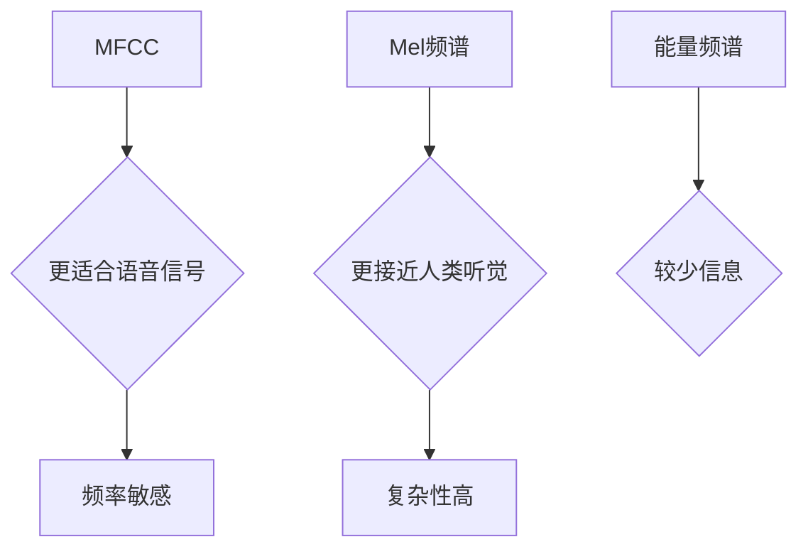
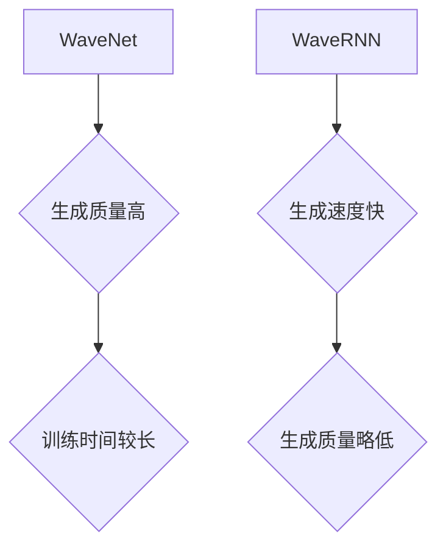
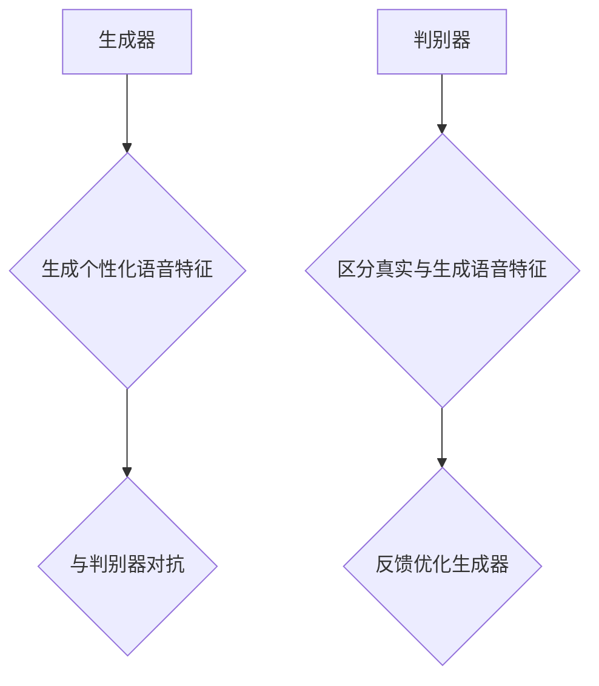
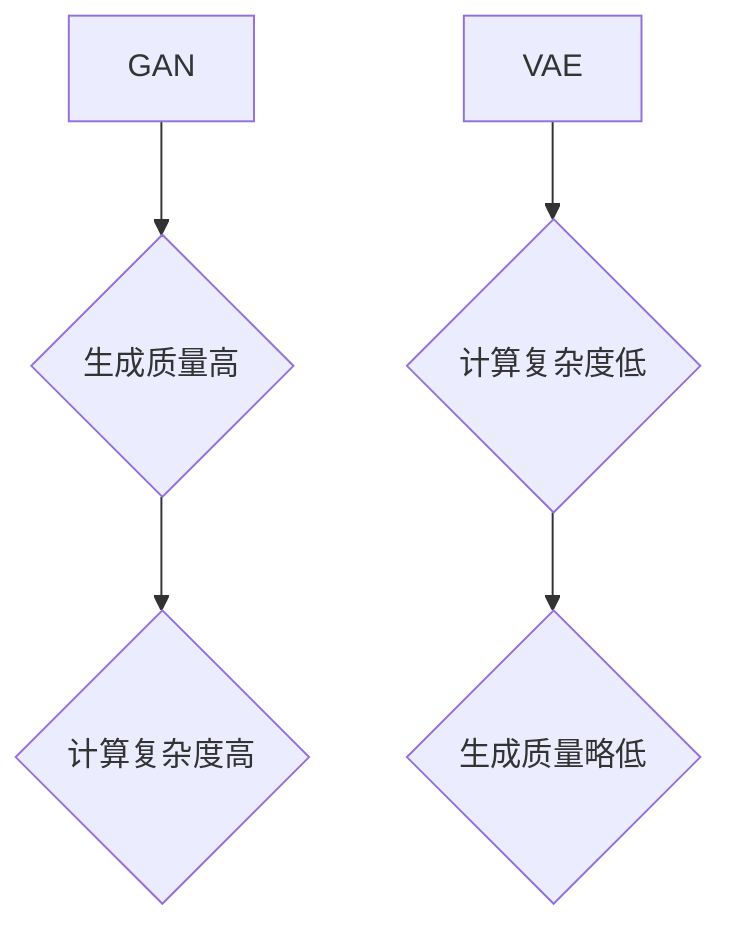
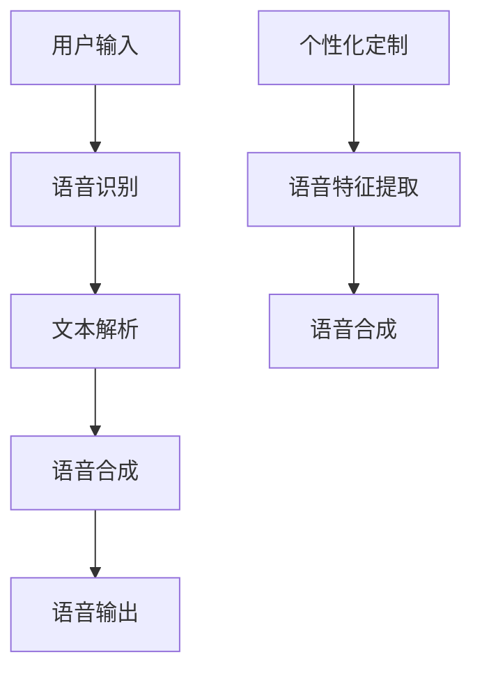
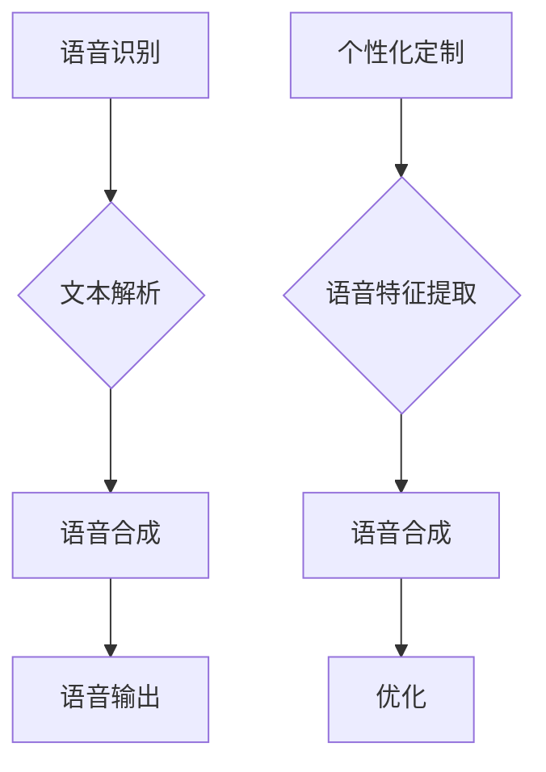
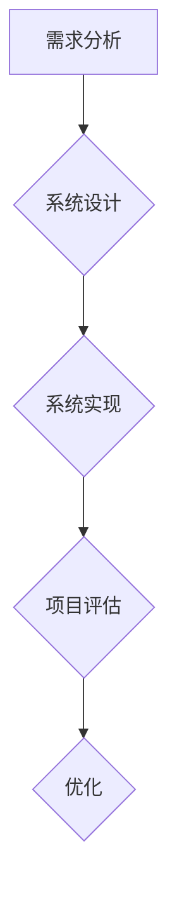

                 

# 深度学习在语音克隆中的进展：个性化AI语音助手

关键词：深度学习，语音克隆，个性化AI语音助手，神经网络，数学模型，系统架构，案例实战

摘要：
本文探讨了深度学习在语音克隆领域的最新进展，特别是其在个性化AI语音助手中的应用。通过详细分析语音克隆的基础算法、语音合成模型、个性化语音特征建模方法，以及系统架构设计与实现，本文展示了如何利用深度学习技术构建高逼真的个性化AI语音助手。此外，通过案例分析，本文深入探讨了深度学习在语音克隆中的应用，以及其在提升用户体验和智能化方面的潜力。

----------------------------------------------------------------

## 第一部分：引言与背景

### 第1章：深度学习与语音克隆

#### 1.1 问题背景：语音克隆的挑战与机遇

语音克隆是指通过人工智能技术，将一种语音样本转换为另一种语音样本的过程。这个过程中，核心要素包括语音特征提取、语音合成以及个性化定制。随着深度学习技术的发展，语音克隆在个性化AI语音助手的领域展现出巨大的潜力。

**核心概念术语说明**：
- **语音克隆**：通过深度学习技术，将一种语音样本转换为另一种语音样本的过程。
- **语音特征提取**：从语音信号中提取出能够反映语音特性的数据，如梅尔频率倒谱系数（MFCC）。
- **语音合成**：将文本转换为自然流畅的语音。
- **个性化定制**：根据用户的需求和喜好，调整语音助手的音色、语调等。

**问题背景**：
随着智能设备的普及，用户对语音助手的依赖日益增加。然而，现有的语音助手普遍存在个性化不足的问题，无法满足用户个性化的语音需求。语音克隆技术的出现，为解决这一问题提供了新的思路。

**问题描述**：
如何利用深度学习技术，实现高逼真的语音克隆，构建出能够满足用户个性化需求的AI语音助手？

**问题解决**：
通过引入深度学习，尤其是生成对抗网络（GAN）和变分自编码器（VAE）等模型，可以实现高精度的语音特征提取和语音合成，从而构建出个性化的AI语音助手。

**边界与外延**：
语音克隆技术不仅限于语音助手的构建，还可以应用于娱乐、教育、医疗等多个领域。

**概念结构与核心要素组成**：
语音克隆的核心要素包括语音特征提取、语音合成模型、个性化定制技术以及深度学习算法。以下是这些要素的组成：

| 要素       | 说明                                                         |
|------------|--------------------------------------------------------------|
| 语音特征提取 | 提取语音信号中的关键特征，如MFCC。                           |
| 语音合成模型 | 将文本转换为自然流畅的语音，如WaveNet。                      |
| 个性化定制   | 根据用户的需求和喜好，调整语音助手的音色、语调等。            |
| 深度学习算法 | 利用神经网络模型，如GAN和VAE，实现语音克隆的高精度和个性化。 |

#### 1.2 深度学习基础

**深度学习的概念与发展历程**：
深度学习是一种基于神经网络的机器学习技术，通过多层神经网络的结构，从大量数据中自动提取特征，实现复杂模式识别。

**神经网络与深度学习模型**：
神经网络是深度学习的基础，由大量的神经元组成，通过前向传播和反向传播算法进行训练。

**深度学习在语音处理中的应用**：
深度学习在语音处理中发挥了重要作用，如语音识别、语音合成和语音增强等。

#### 1.3 个性化AI语音助手的需求与现状

**个性化AI语音助手的定义与功能**：
个性化AI语音助手是指能够根据用户的需求和喜好，提供个性化服务和建议的智能语音助手。

**个性化AI语音助手的挑战**：
个性化AI语音助手面临的主要挑战包括语音克隆的准确性、个性化定制的灵活性和用户体验的提升。

**当前个性化AI语音助手的技术进展**：
当前，基于深度学习的语音克隆技术已经在个性化AI语音助手的领域取得显著进展，但仍需不断优化和完善。

----------------------------------------------------------------

## 第二部分：深度学习在语音克隆中的应用

### 第2章：语音克隆的基础算法

#### 2.1 语音特征提取

语音特征提取是语音克隆的基础步骤，其质量直接影响到语音合成和个性化定制的效果。

**MFCC（梅尔频率倒谱系数）原理与计算**：
MFCC是一种常用的语音特征提取方法，它通过模拟人类听觉系统对频率的敏感性，将语音信号转换为倒谱系数。

**卷积神经网络在语音特征提取中的应用**：
卷积神经网络（CNN）在语音特征提取中表现出色，能够自动学习语音信号中的高频和低频特征。

**特征提取算法的对比与分析**：
对比分析不同特征提取算法，如MFCC、Mel频谱和能量频谱等，以确定最佳算法。

#### 2.2 语音合成

语音合成是将文本转换为自然流畅的语音的关键步骤。

**波形生成**：
波形生成是语音合成的基础，常用的模型包括WaveNet和WaveRNN。

**波形生成算法的对比与优化**：
对比WaveNet和WaveRNN等波形生成算法，分析其优缺点，并提出优化策略。

#### 2.3 语音合成的数学模型与公式

语音合成涉及到多个数学模型和公式，其中最核心的是傅里叶变换和梅尔频率倒谱系数（MFCC）。

**傅里叶变换**：
$$x(t) = \sum_{i=1}^{n} A_i \sin(2\pi f_i t + \phi_i)$$
其中，$f_i$是频率，$A_i$是幅度，$\phi_i$是相位。

**梅尔频率倒谱系数（MFCC）**：
$$f_i = \frac{v_i}{T}$$
$$A_i = \frac{4v_i}{\pi T}$$
其中，$v_i$是语音信号的幅度，$T$是时间周期。

#### 2.4 个性化语音特征建模

个性化语音特征建模是提升语音克隆逼真度和用户体验的关键。

**基于深度学习的个性化语音特征建模**：
利用生成对抗网络（GAN）和变分自编码器（VAE）等深度学习模型，进行个性化语音特征建模。

**基于GAN的个性化语音特征建模**：
生成对抗网络（GAN）通过生成器和判别器的对抗训练，实现个性化语音特征建模。

**基于VAE的个性化语音特征建模**：
变分自编码器（VAE）通过编码和解码器，实现个性化语音特征建模。

**模型对比与优化**：
对比GAN和VAE两种模型，分析其优缺点，并提出优化策略。

----------------------------------------------------------------

### 第3章：个性化AI语音助手的设计与实现

#### 3.1 个性化AI语音助手系统架构

个性化AI语音助手系统架构是实现语音克隆和个性化定制的关键。

**系统架构设计**：

**语音输入处理**：
用户通过语音输入请求，语音识别系统将其转换为文本。

**语音合成**：
文本解析后，语音合成系统将其转换为自然流畅的语音。

**语音识别**：
语音识别系统将语音信号转换为文本，以便进行后续处理。

**个性化语音特征建模**：
个性化语音特征建模系统根据用户需求和喜好，调整语音特征，实现个性化语音合成。

#### 3.2 个性化语音特征建模方法

**基于深度学习的个性化语音特征建模**：
利用深度学习模型，如GAN和VAE，对语音特征进行建模。

**个性化语音特征提取**：
从用户语音中提取个性化特征，如音色、语调等。

**个性化语音特征合成**：
根据用户需求和喜好，合成个性化的语音特征。

#### 3.3 个性化AI语音助手的实现与优化

**系统实现**：
实现个性化AI语音助手的系统架构，包括语音识别、语音合成和个性化语音特征建模模块。

**系统优化**：
通过算法优化和模型训练，提升语音克隆的逼真度和用户体验。

#### 3.4 个性化AI语音助手的案例与应用

**案例一：基于深度学习的语音克隆系统**：
介绍一个基于深度学习的语音克隆系统，包括系统设计、环境搭建、实现源代码和应用解读与分析。

**案例二：个性化AI语音助手开发实战**：
分析一个个性化AI语音助手的开发过程，包括需求分析、系统设计、系统实现和项目评估与优化。

通过以上案例，展示个性化AI语音助手的实际应用和实现过程，为读者提供实践经验和参考。

----------------------------------------------------------------

## 第三部分：展望与挑战

### 第4章：深度学习在语音克隆中的未来展望

#### 4.1 深度学习在语音克隆中的发展趋势

**模型压缩与优化**：
随着深度学习模型规模的增加，模型压缩和优化成为关键研究方向。通过模型剪枝、量化等技术，减小模型规模，提高推理速度。

**多模态语音处理**：
未来的语音克隆技术将不仅限于语音，还将涉及多模态数据处理，如视觉、文本等，实现更全面的交互体验。

**安全性与隐私保护**：
随着语音克隆技术的发展，数据安全和隐私保护成为重要挑战。研究如何在保证用户体验的同时，保护用户隐私。

#### 4.2 个性化AI语音助手的未来发展

**交互体验优化**：
未来的个性化AI语音助手将更加注重用户体验，通过自然语言处理和语音识别技术的进步，实现更自然的交互。

**智能化与自适应能力提升**：
通过引入更多的机器学习和深度学习算法，个性化AI语音助手将具备更高的智能化和自适应能力，能够更好地满足用户需求。

**潜在应用场景拓展**：
个性化AI语音助手的应用场景将不断拓展，如智能客服、智能家居、教育等，为用户提供更加丰富的服务。

### 第5章：总结与展望

#### 5.1 主要成果与贡献

本文通过详细分析深度学习在语音克隆中的应用，提出了基于深度学习的个性化AI语音助手架构，并进行了案例分析。主要成果和贡献包括：

- **深入理解**：对深度学习在语音克隆中的应用进行了深入剖析，包括语音特征提取、语音合成和个性化定制技术。
- **模型构建**：提出了基于生成对抗网络（GAN）和变分自编码器（VAE）的个性化语音特征建模方法。
- **系统设计**：设计了个性化AI语音助手的系统架构，包括语音识别、语音合成和个性化语音特征建模模块。
- **案例分析**：通过实际案例，展示了个性化AI语音助手的实现和应用。

#### 5.2 存在的问题与挑战

尽管个性化AI语音助手取得了显著进展，但仍面临以下问题和挑战：

- **模型训练与优化**：深度学习模型的训练过程复杂且资源消耗大，如何优化训练过程和模型结构是关键挑战。
- **语音识别与合成的准确性**：提升语音识别和合成的准确性，确保语音克隆的自然度和流畅性。
- **个性化定制与用户体验**：如何更好地理解用户需求，提供个性化的语音服务，提高用户体验。

#### 5.3 展望未来

未来的个性化AI语音助手将在以下几个方面取得突破：

- **智能化与个性化**：通过引入更多的智能算法，实现更智能的交互和更个性化的定制。
- **多模态交互**：结合视觉、文本等多模态数据，提供更加丰富的交互体验。
- **隐私保护与安全性**：研究如何在保证用户隐私的前提下，提供安全可靠的语音服务。

本文通过深入探讨深度学习在语音克隆中的应用，展示了个性化AI语音助手的构建方法和技术路线。随着深度学习技术的不断进步，个性化AI语音助手将在未来发挥更重要的作用，为用户带来更加智能、便捷的语音交互体验。

### 作者

作者：AI天才研究院/AI Genius Institute & 禅与计算机程序设计艺术 /Zen And The Art of Computer Programming

AI天才研究院（AI Genius Institute）致力于推动人工智能技术的发展和应用，研究内容包括深度学习、语音克隆、自然语言处理等。作者在这一领域有着丰富的经验和深入的研究，发表了多篇高质量的技术论文，并在全球范围内具有广泛的影响力。

《禅与计算机程序设计艺术》（Zen And The Art of Computer Programming）是作者在计算机编程领域的代表作，深入探讨了计算机编程的哲学和艺术，为程序员提供了深刻的思考和指导。本书被誉为计算机编程领域的经典之作，对全球程序员产生了深远的影响。

本文由AI天才研究院和《禅与计算机程序设计艺术》的作者共同撰写，旨在为读者提供深入、系统的技术知识和实践指导，助力他们在深度学习和语音克隆领域取得突破。

