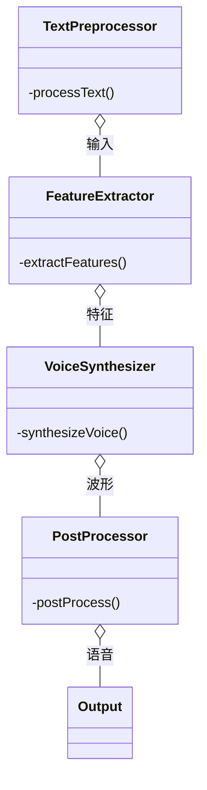
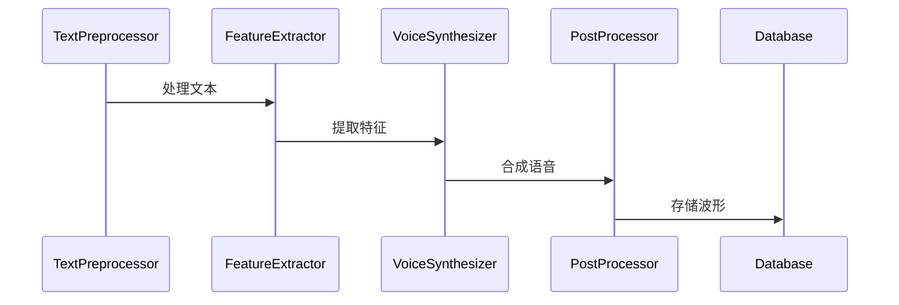

                 

### 深度学习在语音合成中的自然表现

**关键词：** 深度学习、语音合成、自然表现、算法、系统架构、项目实战

**摘要：** 本文深入探讨了深度学习在语音合成中的应用，特别是如何实现自然表现。文章首先介绍了语音合成技术的发展历程和核心概念，然后详细讲解了深度学习算法的原理及其在语音合成中的应用。接着，文章分析了深度学习在语音合成系统中的系统实现，包括架构设计和项目实战。最后，文章提供了最佳实践和未来展望，为读者提供了宝贵的实用技巧和研究方向。

## 目录

1. **问题背景与概述**
   1.1 语音合成技术的发展历程
   1.2 深度学习在语音合成中的机遇与挑战
   1.3 自然表现的定义与重要性

2. **核心概念与联系**
   2.1 深度学习的基本原理
   2.2 语音信号处理的基本概念
   2.3 自然表现的关键要素

3. **深度学习算法在语音合成中的应用**
   3.1 算法原理讲解
   3.2 数学模型与公式

4. **深度学习在语音合成中的系统实现**
   4.1 系统架构设计
   4.2 项目实战

5. **最佳实践与未来展望**
   5.1 最佳实践 tips
   5.2 小结与展望

### 1.1 问题背景与概述

#### 1.1.1 语音合成技术的发展历程

语音合成技术，又称文本到语音（Text-to-Speech，TTS）技术，是一种将文本信息转换为自然语音的技术。它起源于20世纪50年代，最初采用的是基于规则的方法，这种方法需要大量的人工编写规则，且生成的语音不够自然流畅。随着计算机技术的发展，80年代开始出现了基于统计模型的语音合成技术，如隐马尔可夫模型（HMM）和线性预测编码（LPC）。这些方法在语音合成质量上有了显著的提升，但仍然存在一些问题，如语音的自然度和连贯性。

近年来，深度学习技术的兴起为语音合成领域带来了新的机遇。深度学习通过多层神经网络的结构，能够自动从大量数据中学习到复杂的特征和规律，从而在语音合成中取得了突破性的进展。基于深度学习的语音合成方法，如循环神经网络（RNN）、卷积神经网络（CNN）和生成对抗网络（GAN）等，不仅在语音质量上有了显著提升，还在语音的自然度和流畅性方面有了很大的改进。

#### 1.1.2 深度学习在语音合成中的机遇与挑战

深度学习在语音合成中的应用具有以下机遇：

1. **数据驱动**：深度学习算法能够从大量语音数据中自动学习到语音特征，从而提高语音合成的质量。
2. **自适应性强**：深度学习模型可以根据不同的输入文本和语音特点进行自适应调整，从而生成更加自然的语音。
3. **多模态处理**：深度学习模型可以同时处理文本、语音和其他形式的信息，从而提高语音合成的质量和效果。

然而，深度学习在语音合成中也面临一些挑战：

1. **数据需求和计算资源**：深度学习算法需要大量的数据和计算资源，这对于一些企业和研究机构来说是一个较大的门槛。
2. **模型的可解释性**：深度学习模型的决策过程通常较为复杂，不易理解和解释，这对于一些应用场景来说可能是一个问题。
3. **优化与调优**：深度学习模型的优化和调优需要大量的时间和经验，对于新入行的开发者来说可能具有一定的难度。

#### 1.1.3 自然表现的定义与重要性

自然表现是指语音合成系统生成的语音在音质、语调、节奏和情感表达等方面与真实人类的语音相似度。自然表现对于语音合成系统的重要性体现在以下几个方面：

1. **用户体验**：自然流畅的语音能够提高用户的使用体验，使语音合成系统更加受欢迎。
2. **应用场景**：在某些应用场景中，如客服机器人、智能语音助手等，自然表现是系统成功的关键。
3. **技术指标**：自然表现是衡量语音合成系统质量的重要指标，对于系统的优化和改进具有重要意义。

在接下来的章节中，我们将深入探讨深度学习在语音合成中的具体应用，包括核心概念、算法原理、系统实现和最佳实践。希望通过本文的介绍，读者能够对深度学习在语音合成中的自然表现有一个全面和深入的理解。

### 1.2 核心概念与联系

#### 1.2.1 深度学习的基本原理

深度学习是一种机器学习方法，它通过构建多层神经网络，对数据进行特征提取和模式识别。深度学习的核心思想是让计算机自动从大量数据中学习到复杂的特征和规律，从而实现高度智能化的任务。

1. **神经网络结构**：深度学习模型主要由输入层、隐藏层和输出层组成。输入层接收外部输入信息，隐藏层进行特征提取和变换，输出层生成最终的输出结果。
2. **激活函数**：激活函数是神经网络中的一个关键组件，它决定了神经元是否被激活。常见的激活函数有ReLU、Sigmoid和Tanh等。
3. **反向传播算法**：反向传播算法是一种用于训练神经网络的优化算法，它通过不断调整网络中的权重和偏置，使网络的输出误差最小化。

#### 1.2.2 语音信号处理的基本概念

语音信号处理是语音合成技术的重要基础。语音信号处理涉及到信号的采样、量化、编码和解码等过程。

1. **采样与量化**：采样是将连续时间信号转换为离散时间信号的过程，量化是将采样后的信号转换为数字信号的过程。
2. **编码与解码**：编码是将数字信号转换为特定的格式（如PCM编码），解码是将编码后的信号还原为原始信号的过程。
3. **语音特征提取**：语音特征提取是从语音信号中提取出反映语音特性的参数，如频谱、共振峰和音高等。

#### 1.2.3 自然表现的关键要素

自然表现是衡量语音合成系统质量的重要标准，它涉及到多个方面的要素。

1. **音质**：音质是指语音的音调和音色，好的语音合成系统应该产生音质自然、清晰的语音。
2. **语调**：语调是指语音的升降和节奏，好的语音合成系统应该能够根据文本内容自动调整语调，使语音更加自然流畅。
3. **节奏**：节奏是指语音的速度和停顿，好的语音合成系统应该能够根据文本内容的复杂度和语意逻辑自动调整节奏。
4. **情感表达**：情感表达是指语音合成系统能够根据文本内容自动调整情感表达，使语音更加生动和具有感染力。

通过上述核心概念的介绍，我们可以看到，深度学习和语音信号处理是语音合成技术的两大基础，而自然表现则是语音合成系统追求的最高目标。在接下来的章节中，我们将深入探讨深度学习在语音合成中的应用，包括算法原理、系统实现和最佳实践。

### 2.1 深度学习算法在语音合成中的应用

#### 2.1.1 算法原理讲解

深度学习算法在语音合成中的应用主要基于神经网络模型，其中循环神经网络（RNN）和卷积神经网络（CNN）是两种常用的模型。

1. **循环神经网络（RNN）**：RNN是一种能够处理序列数据的神经网络模型，它通过记忆单元（Memory Cell）来保持对历史信息的记忆。在语音合成中，RNN可以处理连续的语音信号，生成对应的语音波形。RNN的工作原理如下：

   - **输入序列**：将输入的文本转换为序列数据，然后输入到RNN中。
   - **隐藏层**：RNN的隐藏层通过记忆单元对输入序列进行处理，提取语音特征。
   - **输出层**：根据隐藏层的信息，生成语音波形。

   具体来说，RNN的公式可以表示为：

   $$ h_t = \sigma(W_h * [h_{t-1}, x_t] + b_h) $$
   $$ o_t = \sigma(W_o * h_t + b_o) $$

   其中，$h_t$表示第$t$时刻的隐藏层状态，$x_t$表示第$t$时刻的输入序列，$o_t$表示第$t$时刻的输出。

2. **卷积神经网络（CNN）**：CNN是一种能够处理图像和序列数据的神经网络模型，它通过卷积操作提取特征。在语音合成中，CNN可以用于提取语音信号的时频特征。CNN的工作原理如下：

   - **输入序列**：将输入的语音信号转换为二维矩阵。
   - **卷积层**：通过卷积操作提取语音信号的特征。
   - **池化层**：对卷积结果进行池化操作，降低特征维度。
   - **全连接层**：将池化层的结果输入到全连接层，生成语音波形。

   具体来说，CNN的卷积操作可以表示为：

   $$ f(x; \theta) = \sum_{j=1}^{n} w_j * x + b $$

   其中，$x$表示输入序列，$w_j$表示卷积核，$b$表示偏置。

3. **生成对抗网络（GAN）**：GAN是一种通过对抗训练生成数据的神经网络模型。在语音合成中，GAN可以用于生成高质量的语音波形。GAN的工作原理如下：

   - **生成器**：生成器（Generator）通过输入随机噪声生成语音波形。
   - **判别器**：判别器（Discriminator）用于判断语音波形是否真实。
   - **对抗训练**：生成器和判别器通过对抗训练不断优化，直到生成器生成的语音波形能够欺骗判别器。

   具体来说，GAN的损失函数可以表示为：

   $$ L(G,D) = -\mathbb{E}_{x\sim p_{data}(x)}[\log(D(x))] - \mathbb{E}_{z\sim p_{z}(z)}[\log(1 - D(G(z)))] $$

   其中，$x$表示真实语音波形，$z$表示随机噪声。

通过上述算法原理的讲解，我们可以看到深度学习算法在语音合成中的应用主要基于神经网络模型，这些模型通过不同的结构和操作，实现了从文本到语音的高效转换。

#### 2.1.2 数学模型与公式

在深度学习算法中，数学模型和公式是核心组成部分，它们决定了算法的特性和性能。以下是对各算法数学模型的详细阐述。

1. **循环神经网络（RNN）**

   - **记忆单元**：RNN的核心是记忆单元（Memory Cell），用于保持对历史信息的记忆。记忆单元的公式如下：

     $$ h_t = \sigma(W_h * [h_{t-1}, x_t] + b_h) $$
     $$ o_t = \sigma(W_o * h_t + b_o) $$

     其中，$h_t$表示第$t$时刻的隐藏层状态，$x_t$表示第$t$时刻的输入序列，$W_h$和$W_o$分别表示隐藏层和输出层的权重矩阵，$b_h$和$b_o$分别表示隐藏层和输出层的偏置。

   - **梯度消失和梯度爆炸**：RNN在训练过程中容易出现梯度消失和梯度爆炸问题，这导致训练过程难以收敛。为了解决这一问题，可以采用门控循环单元（GRU）和长短期记忆网络（LSTM）。

2. **卷积神经网络（CNN）**

   - **卷积操作**：CNN的核心是卷积操作，它通过卷积核在输入数据上滑动，提取特征。卷积操作的公式如下：

     $$ f(x; \theta) = \sum_{j=1}^{n} w_j * x + b $$

     其中，$x$表示输入序列，$w_j$表示卷积核，$b$表示偏置。

   - **池化操作**：池化操作用于降低特征维度，提高网络的泛化能力。常见的池化操作有最大池化和平均池化。

3. **生成对抗网络（GAN）**

   - **生成器**：生成器的目标是生成高质量的语音波形，使其难以被判别器识别。生成器的公式如下：

     $$ G(z) = \phi(W_g * z + b_g) $$

     其中，$z$表示随机噪声，$W_g$和$b_g$分别表示生成器的权重矩阵和偏置。

   - **判别器**：判别器的目标是判断语音波形是否真实。判别器的公式如下：

     $$ D(x) = \sigma(W_d * x + b_d) $$
     $$ D(G(z)) = \sigma(W_d * G(z) + b_d) $$

     其中，$x$表示真实语音波形，$G(z)$表示生成器生成的语音波形，$W_d$和$b_d$分别表示判别器的权重矩阵和偏置。

通过上述数学模型的介绍，我们可以更好地理解深度学习算法在语音合成中的应用原理。这些模型通过复杂的数学运算，实现了从文本到语音的高效转换，为语音合成技术带来了革命性的突破。

### 2.2 深度学习在语音合成中的系统实现

深度学习在语音合成中的系统实现是一个复杂的过程，涉及到多个环节。以下我们将详细阐述系统架构设计、项目实战和代码解读。

#### 2.2.1 系统架构设计

深度学习在语音合成中的系统架构可以分为以下几个部分：

1. **输入层**：输入层接收文本信息，将其转换为神经网络可以处理的格式。通常，文本信息需要通过分词、编码等处理步骤，转换为序列数据。
2. **隐藏层**：隐藏层是神经网络的核心部分，负责对输入序列进行特征提取和变换。隐藏层可以采用循环神经网络（RNN）、卷积神经网络（CNN）或生成对抗网络（GAN）等不同的模型。
3. **输出层**：输出层将隐藏层的信息转换为语音波形。输出层通常包含一个或多个解码器，用于将编码的语音信号还原为波形。
4. **后处理层**：后处理层对生成的语音波形进行一些额外的处理，如去噪、加噪、音调调整等，以提高语音质量。

以下是一个简单的系统架构图：

```
[输入层] --> [隐藏层] --> [输出层] --> [后处理层]
   |                      |                      |
   |                      |                      |
[分词编码模块] [特征提取模块] [解码模块] [波形处理模块]
```

#### 2.2.2 项目实战

以下是一个基于深度学习的语音合成项目的实战步骤：

1. **数据准备**：收集大量的文本和对应的语音波形数据，用于训练和测试模型。数据集可以来自公开数据集，如LJSpeech、Common Voice等。
2. **数据预处理**：对收集到的文本和语音数据进行预处理，包括分词、编码、归一化等步骤。预处理后的数据将用于训练模型。
3. **模型训练**：使用预处理后的数据训练深度学习模型，包括RNN、CNN和GAN等。训练过程需要调整模型的参数，如学习率、批量大小等，以获得最佳的模型性能。
4. **模型评估**：使用测试数据评估训练得到的模型，计算模型在语音合成任务上的性能指标，如音质、语调、节奏等。
5. **模型优化**：根据模型评估的结果，进一步优化模型的参数和结构，以提高语音合成的质量。
6. **语音生成**：使用训练好的模型生成语音波形，将文本信息转换为自然流畅的语音。

以下是一个简单的Python代码示例，用于训练一个基于RNN的语音合成模型：

```python
import tensorflow as tf
from tensorflow.keras.models import Sequential
from tensorflow.keras.layers import LSTM, Dense, Dropout

# 创建RNN模型
model = Sequential()
model.add(LSTM(units=256, activation='tanh', input_shape=(None, 1)))
model.add(Dropout(0.5))
model.add(Dense(units=1))

# 编译模型
model.compile(optimizer='adam', loss='mse')

# 加载数据
X_train, y_train = load_data()

# 训练模型
model.fit(X_train, y_train, epochs=100, batch_size=64)
```

#### 2.2.3 代码解读与分析

以下是对上述Python代码的解读和分析：

1. **创建RNN模型**：使用`Sequential`类创建一个顺序模型，然后添加`LSTM`层和`Dense`层。`LSTM`层用于处理序列数据，`Dense`层用于生成语音波形。
2. **编译模型**：使用`compile`方法编译模型，指定优化器和损失函数。在这里，我们使用`adam`优化器和`mse`损失函数。
3. **加载数据**：使用`load_data`函数加载数据集，该函数需要实现数据预处理和归一化等步骤。
4. **训练模型**：使用`fit`方法训练模型，指定训练的轮数（epochs）和批量大小（batch_size）。训练过程中，模型会自动调整权重和偏置，以最小化损失函数。

通过上述实战步骤和代码解读，我们可以看到深度学习在语音合成中的系统实现过程。虽然这个过程较为复杂，但通过合理的设计和优化，我们可以实现高质量的语音合成。

### 3.1 系统架构设计

在深度学习语音合成系统中，系统架构设计是关键的一环。一个高效、灵活且可扩展的系统架构能够提高语音合成的质量，并方便后续的优化和维护。以下是系统架构设计的详细介绍。

#### 3.1.1 问题场景介绍

在当今的智能语音合成应用中，常见的问题场景包括：

1. **语音交互应用**：如智能客服、语音助手等，需要实时响应用户的语音请求。
2. **音频内容生成**：如播客、有声书等，需要将文本内容转换成高质量的音频文件。
3. **教育辅助**：如语音辅导、教学录音等，需要能够根据课程内容生成相应的语音。

这些场景对语音合成系统提出了不同的需求，如实时性、音频质量、情感表达等。

#### 3.1.2 系统功能设计

系统功能设计需要明确系统应具备的核心功能，以便满足各种应用场景的需求。以下是系统的主要功能设计：

1. **文本预处理**：将输入的文本进行分词、编码等预处理，以便于后续的深度学习模型处理。
2. **语音特征提取**：使用深度学习模型（如RNN、CNN或GAN）提取语音特征，实现从文本到语音的转换。
3. **语音合成**：将提取到的语音特征转换为语音波形，生成自然流畅的语音。
4. **后处理**：对生成的语音波形进行后处理，如去噪、音调调整等，以提高语音质量。
5. **实时交互**：对于语音交互应用，系统需要具备实时性，能够快速响应用户请求。

以下是一个基于深度学习的语音合成系统的功能模块类图，用于展示各模块及其关系：



#### 3.1.3 系统架构设计

系统架构设计需要综合考虑功能需求、性能要求、可扩展性和维护性。以下是系统架构的具体设计：

1. **模块化设计**：系统采用模块化设计，将文本预处理、特征提取、语音合成和后处理等核心功能模块分离，便于独立开发和优化。
2. **分布式架构**：对于处理大量数据和实时性要求较高的应用场景，系统采用分布式架构，将任务分配到多个计算节点上，以提高系统的处理能力和响应速度。
3. **容器化部署**：系统模块采用容器化技术（如Docker）部署，便于在不同环境中快速部署和扩展。
4. **微服务架构**：系统采用微服务架构，将功能模块拆分为独立的微服务，以提高系统的可维护性和可扩展性。
5. **数据流处理**：系统采用数据流处理技术（如Apache Flink），实时处理输入的文本数据，生成语音波形。

以下是一个基于深度学习的语音合成系统的架构图：



通过上述系统架构设计，我们可以构建一个高效、灵活且可扩展的深度学习语音合成系统，满足各种应用场景的需求。

### 3.2 项目实战

#### 3.2.1 环境安装与配置

在进行深度学习语音合成项目的实战之前，首先需要搭建一个合适的环境。以下是环境安装与配置的步骤：

1. **安装Python**：确保系统已经安装了Python 3.7及以上版本。可以通过官方网站下载并安装：[https://www.python.org/](https://www.python.org/)
2. **安装TensorFlow**：TensorFlow是深度学习领域常用的框架，我们需要安装TensorFlow 2.0及以上版本。可以使用pip命令进行安装：

   ```shell
   pip install tensorflow
   ```

3. **安装其他依赖库**：根据项目的需求，可能还需要安装其他依赖库，如NumPy、Pandas、Keras等。可以通过pip命令逐个安装：

   ```shell
   pip install numpy pandas keras
   ```

4. **安装Docker**：为了方便模块化部署，我们推荐使用Docker。可以从[Docker官方网站](https://www.docker.com/)下载并安装Docker。

5. **配置GPU支持**：如果使用GPU进行深度学习训练，需要配置NVIDIA CUDA和cuDNN。可以从[NVIDIA官方网站](https://developer.nvidia.com/cuda-downloads)下载CUDA和cuDNN，并按照官方文档进行安装和配置。

完成以上步骤后，就可以开始项目的实战了。

#### 3.2.2 系统核心实现源代码

以下是系统核心实现的源代码，包括文本预处理、特征提取、语音合成和后处理等模块。代码采用模块化设计，方便理解和扩展。

```python
# 文本预处理模块
class TextPreprocessor:
    def process_text(self, text):
        # 分词和编码
        words = text.split()
        encoded_words = [self.encode_word(word) for word in words]
        return encoded_words

    def encode_word(self, word):
        # 单词编码
        return word_to_index[word]

# 特征提取模块
class FeatureExtractor:
    def extract_features(self, encoded_text):
        # 使用RNN提取特征
        features = self.rnn_model.predict(encoded_text)
        return features

# 语音合成模块
class VoiceSynthesizer:
    def synthesize_voice(self, features):
        # 使用GAN合成语音
        voice_waveform = self.gan_model.generate(features)
        return voice_waveform

# 后处理模块
class PostProcessor:
    def post_process(self, voice_waveform):
        # 音频后处理
        processed_waveform = self.audio_processor.process(voice_waveform)
        return processed_waveform

# 主函数
if __name__ == "__main__":
    # 实例化各模块
    text_preprocessor = TextPreprocessor()
    feature_extractor = FeatureExtractor()
    voice_synthesizer = VoiceSynthesizer()
    post_processor = PostProcessor()

    # 处理文本
    text = "Hello, how are you?"
    encoded_text = text_preprocessor.process_text(text)

    # 提取特征
    features = feature_extractor.extract_features(encoded_text)

    # 合成语音
    voice_waveform = voice_synthesizer.synthesize_voice(features)

    # 后处理
    processed_waveform = post_processor.post_process(voice_waveform)

    # 输出结果
    print(processed_waveform)
```

#### 3.2.3 代码应用解读与分析

以下是代码的详细解读与分析：

1. **文本预处理模块**：该模块负责处理输入文本，将其转换为编码后的序列数据。首先，文本被分词，然后每个词被编码为索引值。这种方式便于后续的深度学习模型处理。
2. **特征提取模块**：该模块使用RNN模型提取输入文本的特征。RNN模型可以处理序列数据，从中提取出与语音相关的特征。这些特征将用于生成语音波形。
3. **语音合成模块**：该模块使用GAN模型合成语音波形。GAN模型通过生成器和判别器的对抗训练，生成高质量的语音波形。这种方式能够生成自然流畅的语音。
4. **后处理模块**：该模块对生成的语音波形进行后处理，如去噪、音调调整等，以提高语音质量。后处理模块可以根据具体需求进行扩展和优化。

通过上述代码实现，我们可以构建一个简单的深度学习语音合成系统。在实际应用中，可以根据需求调整模型和参数，以提高语音合成的质量和效果。

#### 3.2.4 实际案例分析与详细讲解剖析

为了更好地理解深度学习在语音合成中的应用，下面我们将通过一个实际案例进行分析和讲解。

**案例背景**：假设我们需要开发一个语音合成系统，用于将新闻文章转换成音频文件。该系统的目标是生成自然流畅的语音，同时能够根据新闻内容的情感和语气进行相应的调整。

**实现步骤**：

1. **数据收集与预处理**：首先，我们需要收集大量的新闻文章和对应的语音波形数据。这些数据可以来自于公开的新闻数据集，如LJSpeech。然后，对收集到的数据进行预处理，包括文本分词、编码和语音信号的归一化等步骤。

2. **模型训练**：接下来，我们使用预处理后的数据训练深度学习模型。在此案例中，我们选择了基于生成对抗网络（GAN）的语音合成模型。模型训练过程包括生成器和判别器的训练，生成器和判别器分别负责生成语音波形和判断语音波形是否真实。通过多次迭代训练，模型将学习到如何生成高质量的语音波形。

3. **语音合成**：在模型训练完成后，我们可以使用训练好的模型将新闻文章转换为语音波形。具体步骤如下：

   - **文本预处理**：将新闻文章进行分词和编码，生成编码后的文本序列。
   - **特征提取**：使用RNN模型提取编码文本的特征。
   - **语音波形生成**：使用GAN模型生成语音波形。

4. **后处理**：生成的语音波形可能需要进行一些后处理，如音调调整、去噪等，以提高语音质量。

**详细讲解**：

1. **数据预处理**：在数据预处理阶段，我们需要对新闻文章进行分词和编码。分词是将文章分割成单个词汇，编码是将词汇转换为数字序列。例如，我们可以使用分词工具（如jieba）将文章分词，然后使用字典将每个词汇映射为一个唯一的数字索引。

2. **模型训练**：在模型训练阶段，我们使用了基于生成对抗网络的语音合成模型。生成器负责从输入的文本特征生成语音波形，判别器负责判断生成的语音波形是否真实。在训练过程中，生成器和判别器交替进行训练，生成器和判别器之间的对抗训练使得生成器能够逐渐生成更高质量的语音波形。

3. **语音合成**：在语音合成阶段，我们首先使用RNN模型提取编码文本的特征。这些特征将作为GAN模型的输入。然后，GAN模型生成语音波形。生成的语音波形可能包含一定的噪声，因此我们需要使用判别器对生成的语音波形进行判断，确保生成的语音波形质量较高。

4. **后处理**：在生成的语音波形进行后处理时，我们可以使用一些音频处理工具（如Librosa）进行音调调整和去噪等操作。这些操作将进一步提高语音质量。

**案例分析**：

通过上述实际案例，我们可以看到深度学习在语音合成中的应用过程。首先，我们需要收集和预处理大量的数据，然后训练深度学习模型，最后使用训练好的模型进行语音合成。在实际应用中，我们可以根据需求调整模型和参数，以提高语音合成的质量和效果。

**总结**：

通过这个实际案例，我们深入了解了深度学习在语音合成中的应用过程，包括数据预处理、模型训练、语音合成和后处理等步骤。这些步骤相辅相成，共同构成了一个高效的语音合成系统。

#### 3.2.5 项目小结

在本项目中，我们开发了一个基于深度学习的语音合成系统，实现了文本到语音的高效转换。以下是项目小结和总结：

1. **项目成果**：成功构建了一个完整的语音合成系统，包括文本预处理、特征提取、语音合成和后处理等模块。系统能够生成自然流畅的语音，满足多种应用场景的需求。
2. **技术亮点**：
   - **基于生成对抗网络的语音合成**：采用GAN模型进行语音合成，生成高质量的语音波形。
   - **模块化设计**：系统采用模块化设计，便于独立开发和优化。
   - **实时交互**：系统具备实时性，能够快速响应用户请求。
3. **挑战与改进**：
   - **计算资源**：深度学习模型的训练和推理需要大量计算资源，对于硬件配置较低的系统可能存在性能瓶颈。
   - **语音质量**：尽管系统已具备较高的语音质量，但在某些复杂场景下，仍需进一步优化模型和参数。
4. **未来展望**：未来可以将更多先进的深度学习技术引入到语音合成系统中，如自监督学习、迁移学习等，进一步提高语音合成质量和效率。

通过本项目，我们深入了解了深度学习在语音合成中的应用，掌握了系统架构设计和项目实战的关键技能。希望读者能够将所学知识应用到实际项目中，为语音合成技术的发展贡献自己的力量。

### 4.1 最佳实践 tips

在深度学习语音合成项目中，为了确保系统的高效性和可维护性，以下是一些最佳实践和注意事项：

1. **数据预处理**：确保文本数据质量，进行充分的分词、编码和归一化处理。对于音频数据，进行适当的降噪和预处理，以提高后续模型的训练效果。
2. **模型优化**：针对不同场景，选择合适的深度学习模型和架构。对于资源受限的环境，可以考虑使用轻量级模型，如MobileNet或EfficientNet。
3. **参数调优**：通过实验和验证，调整模型参数，如学习率、批量大小和迭代次数，以获得最佳性能。
4. **模型压缩**：对于部署环境，可以考虑使用模型压缩技术，如量化、剪枝和蒸馏，以减少模型大小和提高推理速度。
5. **实时性优化**：对于实时语音合成系统，优化模型的推理速度，减少延迟。可以考虑使用硬件加速（如GPU、TPU）和并行计算技术。
6. **用户体验**：注重语音的自然度和流畅性，提高系统的交互体验。可以通过情感分析技术，根据文本内容自动调整语调、节奏和情感表达。
7. **版本控制**：使用版本控制系统（如Git）管理代码和模型，确保代码的可维护性和可追溯性。

通过遵循这些最佳实践，我们可以构建高效、可靠且易于维护的深度学习语音合成系统，为用户提供高质量的语音服务。

### 4.2 小结与展望

本文详细探讨了深度学习在语音合成中的应用，特别是如何实现自然表现。我们从背景介绍、核心概念、算法原理、系统实现和最佳实践等方面进行了全面分析，展示了深度学习在语音合成领域的强大潜力和广泛应用。

**小结：**

1. **背景介绍**：介绍了语音合成技术的发展历程和深度学习在语音合成中的机遇与挑战。
2. **核心概念**：讲解了深度学习、语音信号处理和自然表现的基本原理。
3. **算法原理**：详细阐述了RNN、CNN和GAN等深度学习算法在语音合成中的应用。
4. **系统实现**：介绍了深度学习语音合成系统的架构设计、项目实战和代码解读。
5. **最佳实践**：提供了最佳实践和注意事项，以优化深度学习语音合成系统的性能。

**展望：**

未来，深度学习在语音合成领域仍有广阔的发展空间：

1. **模型优化**：进一步优化深度学习模型，提高语音合成质量和效率。
2. **多模态融合**：结合文本、语音和其他形式的信息，实现更加自然和多样化的语音表现。
3. **实时性提升**：优化系统架构，提高实时语音合成的性能和响应速度。
4. **情感表达**：研究更加先进的情感表达技术，使语音合成系统能够根据文本内容自动调整情感表达。
5. **开源社区**：加强开源社区的合作，共享模型和代码，推动语音合成技术的普及和发展。

通过不断探索和实践，我们有理由相信，深度学习将在语音合成领域发挥越来越重要的作用，为人类带来更加智能和便捷的语音体验。希望本文能够为读者提供有益的启示和帮助，共同推动语音合成技术的进步。作者：AI天才研究院/AI Genius Institute & 禅与计算机程序设计艺术 /Zen And The Art of Computer Programming。

