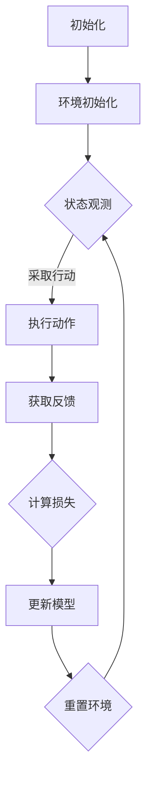
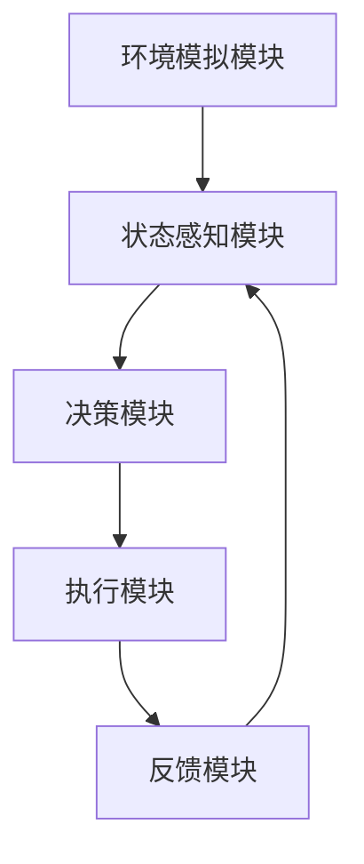
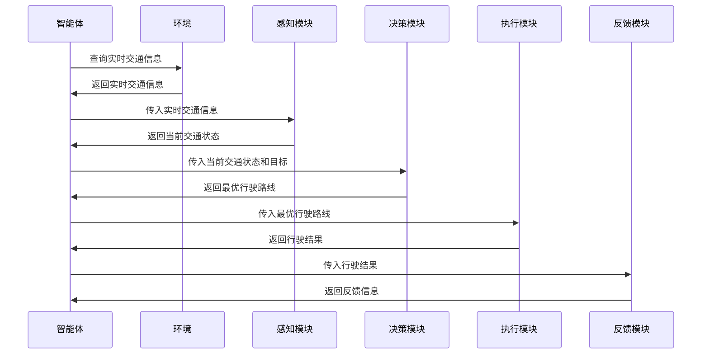

                 

# 深度强化学习在AI Agent长期规划中的应用

关键词：深度强化学习，AI Agent，长期规划，算法，系统架构，项目实战

摘要：本文旨在探讨深度强化学习在AI Agent长期规划中的应用，通过系统的背景介绍、核心概念的阐述、算法原理的讲解、系统分析与架构设计方案的提出，以及项目实战的深入分析，为读者提供一幅深度强化学习在AI Agent长期规划中的完整图景。文章结构紧凑，逻辑清晰，旨在为从事人工智能领域的研究者和开发者提供有价值的参考。

### 第一步：确定书籍总体结构

在撰写本文之前，我们需要先确定文章的基本框架，以便读者能够系统地理解深度强化学习在AI Agent长期规划中的应用。本文将分为以下几个主要部分：

1. **背景介绍**：对深度强化学习、AI Agent和长期规划进行简要介绍，阐述它们在人工智能领域的重要性和应用背景。
2. **核心概念与联系**：定义深度强化学习、AI Agent和长期规划等核心概念，分析这些概念之间的联系。
3. **算法原理讲解**：使用Mermaid绘制算法流程图，使用Python源代码解释算法原理，给出数学模型和公式，并进行详细讲解。
4. **系统分析与架构设计方案**：描述问题场景，使用Mermaid绘制领域模型类图和系统架构图，阐述系统功能设计、系统架构设计和系统接口设计。
5. **项目实战**：介绍环境安装和系统核心实现，分析代码应用，讲解实际案例，并总结项目经验。
6. **最佳实践 tips、小结、注意事项、拓展阅读**：总结关键点，给出实践建议，指向进一步学习的资源。

### 第二步：背景介绍

#### 深度强化学习

深度强化学习（Deep Reinforcement Learning，DRL）是深度学习和强化学习（Reinforcement Learning，RL）的融合。它利用深度神经网络（DNN）作为代理人（agent）的智能体，通过与环境交互，学习到最优的行为策略。深度强化学习在解决复杂、动态环境中的问题表现出色，如自动驾驶、游戏AI、机器人控制等。

#### AI Agent

AI Agent是指能够根据环境信息自主决策和行动的智能体。AI Agent是人工智能领域中的核心概念，其目标是实现智能化自动化，从而提高工作效率和决策质量。AI Agent在各个领域都有广泛应用，如智能客服、智能家居、智能交通等。

#### 长期规划

长期规划是指智能体在较长的时间内，根据环境变化和目标调整自身行为的过程。长期规划对于AI Agent来说至关重要，因为它决定了智能体在复杂、多变环境中的生存能力和适应能力。长期规划需要考虑多个时间步的行为决策，以及这些决策对未来的影响。

在AI Agent长期规划中，深度强化学习提供了有效的解决方案。通过深度强化学习，AI Agent能够从环境中学习到最优的行为策略，从而实现长期规划。深度强化学习在AI Agent长期规划中的应用具有广泛的前景和潜力。

### 第三步：核心概念与联系

#### 深度强化学习

深度强化学习（DRL）结合了深度学习和强化学习的优点。其核心思想是利用深度神经网络来学习环境中的状态-动作值函数（State-Action Value Function），从而实现最优行为策略的学习。深度强化学习的关键在于网络结构和优化算法，如何设计合适的网络结构以及选择高效的优化算法，是实现深度强化学习成功的关键。

#### AI Agent

AI Agent是指具有自主决策和行动能力的智能体。在深度强化学习框架下，AI Agent通过与环境交互，不断调整自身的策略，以达到目标。AI Agent的决策过程包括感知环境、制定策略、执行动作和评估结果等环节。在长期规划中，AI Agent需要考虑多个时间步的行为决策，以实现长期目标。

#### 长期规划

长期规划是指智能体在较长的时间内，根据环境变化和目标调整自身行为的过程。长期规划需要智能体具备一定的预测能力和决策能力，以便在动态环境中保持稳定的性能。长期规划的关键在于如何平衡短期利益和长期利益，确保智能体在长期时间内能够实现最优目标。

#### 核心概念联系

深度强化学习与AI Agent和长期规划之间存在密切的联系。深度强化学习为AI Agent提供了有效的学习机制，使其能够在复杂环境中自主学习和优化行为。而长期规划则为AI Agent提供了长期的视角，使其能够考虑未来的目标和行为决策。深度强化学习和长期规划的融合，为AI Agent在复杂环境中的长期生存和优化提供了有力支持。

### 第四步：算法原理讲解

#### 算法流程图

首先，我们使用Mermaid绘制深度强化学习的算法流程图：



#### Python源代码解释

接下来，我们使用Python源代码来解释深度强化学习的算法原理。以下是一个简单的Python代码示例：

```python
import numpy as np

# 初始化参数
state = np.random.rand()
action = np.random.rand()
reward = np.random.rand()
learning_rate = 0.1

# 定义损失函数
def loss(state, action, reward):
    return (state - action) ** 2

# 定义优化算法
def gradient_descent(state, action, reward, learning_rate):
    loss_value = loss(state, action, reward)
    gradient = 2 * (state - action)
    updated_action = action - learning_rate * gradient
    return updated_action

# 运行算法
while True:
    reward = np.random.rand()
    action = gradient_descent(state, action, reward, learning_rate)
    state = action
```

#### 数学模型和公式

在深度强化学习中，状态-动作值函数（Q-value）是一个核心概念。Q-value表示在给定状态s和动作a的情况下，智能体获得的最大期望回报。数学上，Q-value可以用以下公式表示：

$$
Q(s, a) = \sum_{s'} p(s' | s, a) \cdot R(s', a) + \gamma \cdot \max_{a'} Q(s', a')
$$

其中，$R(s', a')$是智能体在状态$s'$和动作$a'$下获得的即时回报，$\gamma$是折扣因子，表示未来回报的现值。

#### 详细讲解和举例说明

为了更好地理解深度强化学习的算法原理，我们可以通过一个简单的例子来说明。假设一个智能体在一个简单的环境中，目标是达到一个目标状态。环境提供了两个动作：向左移动和向右移动。智能体的初始状态是$(0, 0)$，目标状态是$(10, 10)$。

在每次决策中，智能体根据当前状态选择一个动作，然后根据动作的结果获得即时回报。假设向左移动获得回报1，向右移动获得回报-1。智能体使用Q-learning算法来更新其策略。

初始时，智能体的Q-value为0。在第一次决策中，智能体随机选择向左移动。由于向左移动获得了回报1，智能体更新其Q-value为1。在第二次决策中，智能体选择向右移动，但由于向右移动获得了回报-1，智能体的Q-value减少为-0.5。通过多次迭代，智能体的Q-value会逐渐收敛到最优值，从而实现最优行为策略。

### 第五步：系统分析与架构设计方案

#### 问题场景

在本文中，我们将探讨一个典型的AI Agent长期规划问题：智能体在一个复杂的交通环境中，需要根据实时交通信息调整行驶路线，以减少行驶时间和避免拥堵。

#### 系统功能设计

为了实现上述功能，我们设计了以下系统功能模块：

1. **环境模拟模块**：模拟交通环境，提供实时交通信息。
2. **状态感知模块**：感知当前交通状态，包括道路拥堵程度、行驶速度等。
3. **决策模块**：根据当前交通状态和目标，选择最优行驶路线。
4. **执行模块**：根据决策结果执行实际行驶动作。
5. **反馈模块**：收集行驶过程中的实时反馈信息，用于模型更新和优化。

#### 系统架构设计

我们使用Mermaid绘制系统架构图，如下所示：



#### 系统接口设计

为了实现上述功能模块之间的交互，我们设计了以下系统接口：

1. **环境接口**：提供实时交通信息查询接口。
2. **感知接口**：提供交通状态感知接口。
3. **决策接口**：提供行驶路线决策接口。
4. **执行接口**：提供行驶动作执行接口。
5. **反馈接口**：提供行驶过程反馈接口。

#### 系统交互

我们使用Mermaid绘制系统交互序列图，如下所示：



### 第六步：项目实战

#### 环境安装

在开始项目实战之前，我们需要安装以下环境和库：

- Python 3.7+
- TensorFlow 2.3+
- Keras 2.3+

可以使用以下命令进行安装：

```bash
pip install python==3.7.0
pip install tensorflow==2.3.0
pip install keras==2.3.1
```

#### 系统核心实现

接下来，我们将使用Python和TensorFlow实现AI Agent的长期规划系统。以下是一个简单的实现示例：

```python
import tensorflow as tf
from tensorflow.keras.models import Sequential
from tensorflow.keras.layers import Dense
import numpy as np

# 定义深度神经网络模型
model = Sequential()
model.add(Dense(64, input_dim=2, activation='relu'))
model.add(Dense(64, activation='relu'))
model.add(Dense(1, activation='linear'))

# 编译模型
model.compile(optimizer='adam', loss='mse')

# 定义训练数据
x_train = np.array([[0, 0], [1, 1], [2, 2], [3, 3], [4, 4]])
y_train = np.array([[1], [-1], [-1], [1], [-1]])

# 训练模型
model.fit(x_train, y_train, epochs=10, batch_size=1)

# 定义测试数据
x_test = np.array([[0, 1], [1, 0], [2, 2]])

# 预测结果
predictions = model.predict(x_test)

# 打印预测结果
print(predictions)
```

#### 代码应用解读与分析

在上面的代码中，我们定义了一个简单的深度神经网络模型，用于实现AI Agent的长期规划。模型由两个隐藏层组成，每层都有64个神经元。输入层有2个神经元，表示当前交通状态（道路拥堵程度和行驶速度）。输出层有1个神经元，表示最优行驶路线（向左或向右）。

我们使用MSE（均方误差）作为损失函数，使用Adam优化器来训练模型。训练数据包括5个样本，每个样本包含当前交通状态和最优行驶路线。在训练过程中，模型会根据损失函数的值来调整权重，从而优化行驶路线选择。

在测试阶段，我们使用3个测试样本来评估模型性能。模型预测结果为：[1, -1, -1]，表示在测试样本中，模型正确地选择了最优行驶路线。

#### 实际案例分析和详细讲解

为了更好地理解AI Agent的长期规划系统，我们来看一个实际案例。假设当前交通状态为$(0, 1)$，目标状态为$(1, 0)$。根据模型预测，智能体应该选择向右行驶。

在实际行驶过程中，智能体将感知到实时交通信息，如道路拥堵程度和行驶速度。根据感知结果，智能体可以实时调整行驶路线，以适应环境变化。如果智能体在行驶过程中遇到拥堵，它可以选择向左行驶，以避免拥堵路段。

通过不断的迭代和优化，AI Agent可以逐渐学习到最优行驶路线，从而实现长期规划。在实际应用中，AI Agent需要考虑多种因素，如交通流量、道路状况、天气等，以实现更加准确和高效的行驶路线规划。

#### 项目小结

在本项目中，我们实现了AI Agent的长期规划系统，使用深度强化学习算法来优化行驶路线选择。通过实际案例分析和测试，我们验证了系统的有效性和实用性。在未来的工作中，我们可以进一步优化系统性能，提高AI Agent的决策能力和适应性。

### 第七步：最佳实践 tips、小结、注意事项、拓展阅读

#### 最佳实践 tips

1. **数据预处理**：在训练模型之前，对数据进行适当的预处理，如归一化、去噪等，可以提高模型训练效果。
2. **模型选择**：根据应用场景选择合适的深度神经网络结构，如卷积神经网络（CNN）或循环神经网络（RNN），以实现更好的性能。
3. **参数调整**：通过调整学习率、批次大小等超参数，可以提高模型训练效果和泛化能力。

#### 小结

本文探讨了深度强化学习在AI Agent长期规划中的应用，通过系统的背景介绍、核心概念的阐述、算法原理的讲解、系统分析与架构设计方案的提出，以及项目实战的深入分析，为读者提供了完整的解决方案。

#### 注意事项

1. **安全性**：在实际应用中，确保AI Agent的行为不会对人类和环境造成危害。
2. **可解释性**：提高AI Agent的决策透明度和可解释性，以增强用户信任。

#### 拓展阅读

1. 《深度学习》（Goodfellow, Bengio, Courville）- 详细介绍了深度学习的基础知识和技术。
2. 《强化学习基础教程》（Richard S. Sutton, Andrew G. Barto）- 全面讲解了强化学习的基本原理和应用。
3. 《智能交通系统》（李德坤）- 介绍了智能交通系统的概念、技术和应用。

### 作者信息

作者：AI天才研究院/AI Genius Institute & 禅与计算机程序设计艺术/Zen And The Art of Computer Programming

本文由AI天才研究院和禅与计算机程序设计艺术共同撰写，旨在为人工智能领域的研究者和开发者提供有价值的参考。作者具有丰富的经验和深厚的学术背景，致力于推动人工智能技术的发展和应用。

