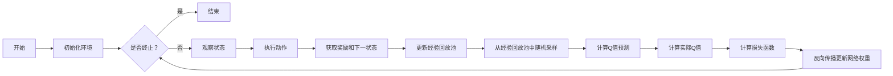
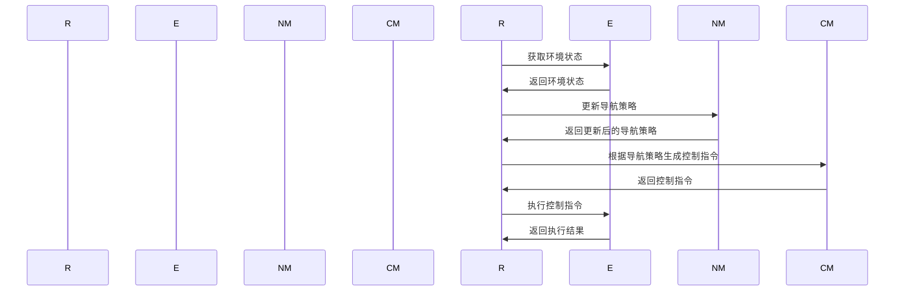
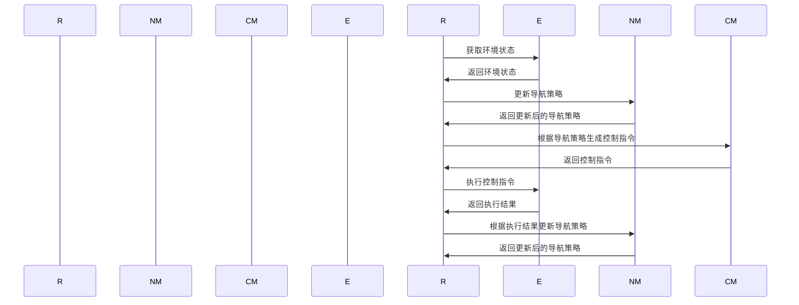

                 

# 《深度强化学习在智能机器人中的应用：自主学习复杂任务》

## 关键词：深度强化学习、智能机器人、自主学习、复杂任务、算法应用

### 摘要

本文旨在探讨深度强化学习在智能机器人自主学习复杂任务中的应用。通过对深度强化学习基础、智能机器人概述、深度强化学习在机器人控制、感知、协作和决策中的应用，以及实际案例的解析，本文全面分析了深度强化学习在智能机器人领域的广泛应用前景。文章最后总结了深度强化学习在智能机器人中的应用成果，并对未来发展方向进行了展望。

## 引言

### 深度强化学习与智能机器人

深度强化学习（Deep Reinforcement Learning，简称DRL）是强化学习（Reinforcement Learning，简称RL）的一个分支，通过模仿人类学习过程，实现智能体在未知环境中通过不断试错，自主学习和优化策略。近年来，随着人工智能技术的不断发展，深度强化学习在多个领域取得了显著成果，尤其在智能机器人领域，DRL技术为机器人自主学习和复杂任务执行提供了强有力的支持。

智能机器人作为人工智能的一个重要分支，具有感知、决策、执行等功能，能够自主完成特定任务。随着深度强化学习的应用，智能机器人逐渐从传统的规则驱动转向数据驱动，实现了更高层次的自主学习和智能化。本文将从深度强化学习基础、智能机器人概述、DRL在机器人控制、感知、协作和决策中的应用，以及实际案例等方面，全面探讨深度强化学习在智能机器人领域的应用。

### 书籍目的与结构安排

本文的目的是介绍深度强化学习技术在智能机器人自主学习复杂任务中的应用，帮助读者了解DRL的基本概念、算法原理以及在实际应用中的优势与挑战。本文将分为八个章节，具体如下：

- 第1章：深度强化学习基础
  - 介绍强化学习的基本概念、深度强化学习的发展历程和核心算法。
- 第2章：智能机器人概述
  - 介绍智能机器人的定义、分类、架构以及感知与控制系统。
- 第3章：深度强化学习在机器人控制中的应用
  - 探讨DRL在机器人控制任务中的实现和应用。
- 第4章：深度强化学习在机器人感知中的应用
  - 分析DRL在机器人感知任务中的优势和应用。
- 第5章：深度强化学习在机器人协作中的应用
  - 探讨DRL在多机器人协作任务中的应用和挑战。
- 第6章：深度强化学习在机器人决策中的应用
  - 分析DRL在机器人决策任务中的实现和应用。
- 第7章：实际案例解析
  - 通过实际案例解析，展示DRL在智能机器人中的应用效果。
- 第8章：结论与展望
  - 总结本文的主要内容和DRL在智能机器人中的应用前景，对未来的发展方向进行展望。

## 第1章：深度强化学习基础

### 1.1 问题背景与挑战

#### 1.1.1 强化学习简介

强化学习（Reinforcement Learning，简称RL）是一种机器学习方法，通过模拟智能体在环境中的行为，使其学会在给定状态下采取最优动作，以实现目标。与监督学习和无监督学习不同，强化学习的主要目标是优化智能体的策略，使其在长期环境中获得最大累积奖励。

强化学习的基本原理可以概括为：智能体通过观察环境状态，采取动作，获得奖励，并根据奖励结果调整策略。在强化学习过程中，智能体需要不断学习和优化策略，以实现长期目标。

#### 1.1.2 深度强化学习

深度强化学习（Deep Reinforcement Learning，简称DRL）是强化学习的一种重要分支，通过将深度神经网络（Deep Neural Network，简称DNN）与强化学习相结合，解决了传统强化学习方法在处理高维状态和动作空间时的困难。

DRL的基本原理是：利用深度神经网络学习状态值函数或策略函数，指导智能体在环境中采取最优动作。与传统的强化学习方法相比，DRL具有更强的泛化能力和更高效的学习速度。

#### 1.1.3 深度强化学习的发展历程

深度强化学习的发展可以分为以下几个阶段：

1. **早期DRL算法**：包括深度Q网络（Deep Q-Network，简称DQN）和策略梯度方法。DQN通过学习状态值函数，实现智能体的策略优化；策略梯度方法通过学习策略参数，直接优化智能体的策略。
2. **基于策略的DRL算法**：如深度确定性策略梯度（Deep Deterministic Policy Gradient，简称DDPG）和深度策略网络（Deep Policy Network，简称DPN）。这些算法通过学习策略函数，使智能体在复杂环境中表现出更强的鲁棒性和适应性。
3. **混合策略DRL算法**：如混合深度策略梯度（Hybrid Deep Policy Gradient，简称HDPG）和深度策略迭代（Deep Policy Iteration，简称DPI）。这些算法通过结合策略优化和值函数优化，提高DRL算法的收敛速度和稳定性。

### 1.2 核心概念

#### 1.2.1 基本术语解释

在讨论深度强化学习之前，需要了解一些基本术语：

- **状态（State）**：描述智能体所处环境的特征。
- **动作（Action）**：智能体在给定状态下可以采取的行为。
- **奖励（Reward）**：环境对智能体采取动作的反馈，表示动作的好坏。
- **策略（Policy）**：智能体在给定状态下采取的动作，是学习目标。
- **值函数（Value Function）**：预测在给定状态下采取特定动作所能获得的累积奖励。
- **策略函数（Policy Function）**：将状态映射到动作，指导智能体采取最优动作。

#### 1.2.2 策略、值函数与模型

在深度强化学习中，策略、值函数和模型是三个核心概念：

- **策略**：策略是智能体在环境中行动的指导方针。在DRL中，策略通常由深度神经网络表示，称为策略网络。策略网络通过学习状态特征，输出智能体在给定状态下应采取的动作。
- **值函数**：值函数是预测在给定状态下采取特定动作所能获得的累积奖励。值函数分为状态值函数（State-Value Function）和动作值函数（Action-Value Function）。状态值函数预测在给定状态下采取任意动作所能获得的累积奖励；动作值函数预测在给定状态下采取特定动作所能获得的累积奖励。
- **模型**：模型是描述环境动态的数学模型。在DRL中，模型通常由状态转移概率和奖励函数组成。状态转移概率描述智能体在给定状态下采取特定动作后，转移到下一状态的概率；奖励函数描述智能体在给定状态下采取特定动作后获得的奖励。

#### 1.2.3 深度强化学习的优势与局限性

深度强化学习的优势：

- **处理高维状态和动作空间**：深度神经网络可以处理高维状态和动作空间，使智能体在复杂环境中表现出更强的适应性。
- **自主学习**：DRL算法可以自主学习，无需人工设计规则和策略。
- **强泛化能力**：通过深度神经网络的学习，DRL算法可以适应不同的环境和任务，具有较强的泛化能力。

深度强化学习的局限性：

- **收敛速度慢**：DRL算法通常需要较长时间才能收敛，学习过程较慢。
- **不稳定**：DRL算法在训练过程中容易出现不稳定现象，如值函数发散、策略不稳定等。
- **计算资源消耗大**：DRL算法需要大量的计算资源，特别是对于高维状态和动作空间的任务。

### 1.3 深度强化学习算法

#### 1.3.1 深度Q网络（DQN）

深度Q网络（Deep Q-Network，简称DQN）是深度强化学习的经典算法之一。DQN通过学习状态值函数，实现智能体的策略优化。DQN的基本原理是：利用深度神经网络预测状态值函数，并根据预测值更新策略。

DQN的关键组成部分包括：

- **状态编码器**：将输入状态编码为特征向量。
- **值函数网络**：利用深度神经网络学习状态值函数。
- **目标值函数网络**：用于计算目标值，与值函数网络交替更新。
- **经验回放**：将智能体在环境中交互的经验存储在经验回放池中，用于随机采样和避免策略偏差。

DQN的算法流程如下：

1. 初始化状态编码器、值函数网络和目标值函数网络。
2. 从初始状态开始，采取随机动作。
3. 执行动作，获得奖励和下一状态。
4. 将（状态，动作，奖励，下一状态）存储在经验回放池中。
5. 随机从经验回放池中采样一批经验。
6. 使用采样经验更新目标值函数网络。
7. 使用目标值函数网络更新值函数网络。
8. 更新策略。
9. 重复步骤2-8，直到策略收敛。

#### 1.3.2 策略梯度方法

策略梯度方法（Policy Gradient Method）是另一种深度强化学习算法。与DQN不同，策略梯度方法直接优化智能体的策略，而不是值函数。策略梯度方法的基本原理是：通过计算策略的梯度，更新策略参数，使策略在长期环境中获得最大累积奖励。

策略梯度方法的关键组成部分包括：

- **策略网络**：将输入状态编码为特征向量，输出策略概率分布。
- **奖励函数**：计算智能体在给定状态下采取特定动作获得的奖励。
- **梯度计算**：计算策略的梯度，用于更新策略参数。

策略梯度方法的算法流程如下：

1. 初始化策略网络。
2. 从初始状态开始，采取策略网络输出的动作。
3. 执行动作，获得奖励和下一状态。
4. 计算累积奖励。
5. 使用累积奖励计算策略梯度。
6. 更新策略网络参数。
7. 重复步骤2-6，直到策略收敛。

#### 1.3.3 混合策略方法

混合策略方法（Hybrid Policy Method）是深度强化学习的一种扩展方法。混合策略方法将策略优化和值函数优化相结合，提高DRL算法的收敛速度和稳定性。混合策略方法的关键组成部分包括：

- **策略网络**：用于输出策略概率分布。
- **值函数网络**：用于预测状态值函数。
- **混合策略优化**：同时优化策略和值函数。

混合策略方法的算法流程如下：

1. 初始化策略网络和值函数网络。
2. 从初始状态开始，采取策略网络输出的动作。
3. 执行动作，获得奖励和下一状态。
4. 更新值函数网络。
5. 计算累积奖励。
6. 使用累积奖励计算策略梯度。
7. 更新策略网络参数。
8. 重复步骤2-7，直到策略和值函数收敛。

## 第2章：智能机器人概述

### 2.1 机器人概述

#### 2.1.1 机器人定义与发展历程

机器人（Robot）是一种能够部分或全部代替人类进行工作的自动化设备。根据国际标准化组织（ISO）的定义，机器人是具有感知、决策、执行等功能的自动化系统，能够在预先设定或未知环境中自主执行任务。

机器人技术的发展历程可以分为以下几个阶段：

1. **早期阶段（1950s-1960s）**：机器人主要以工业机器人和服务机器人为代表，主要应用于制造业和军事领域。这一阶段的机器人主要依靠程序控制，实现简单的自动化作业。
2. **发展阶段（1970s-1980s）**：随着人工智能技术的兴起，机器人开始引入感知、决策等智能功能。这一阶段的机器人主要包括智能机器人和自主移动机器人。
3. **成熟阶段（1990s-2000s）**：机器人技术逐渐应用于各行各业，如医疗、教育、家庭等。这一阶段的机器人具有更高的自主性和智能化，能够处理复杂环境下的任务。
4. **新时代（2010s-至今）**：机器人技术迎来了新一轮的发展，以人工智能、物联网、云计算等为代表的新技术为机器人提供了更强大的支持。这一阶段的机器人具有更强的感知能力、决策能力和协作能力。

#### 2.1.2 机器人分类与架构

根据应用领域和功能特点，机器人可以划分为以下几类：

1. **工业机器人**：主要应用于制造业，如汽车制造、电子装配、焊接等。工业机器人具有高精度、高效率、高可靠性等特点。
2. **服务机器人**：主要应用于医疗、教育、家庭等领域，如医疗机器人、教育机器人、家庭服务机器人等。服务机器人具有高度智能化、人机交互能力强等特点。
3. **自主移动机器人**：具有自主导航、路径规划、避障等能力，主要应用于物流、巡检、安防等领域。自主移动机器人具有较高的自主性和灵活性。
4. **特种机器人**：主要应用于危险环境、复杂地形等特殊领域，如消防机器人、探测机器人、地下机器人等。特种机器人具有高度专业化、适应性强的特点。

机器人架构主要包括以下几个部分：

1. **感知系统**：用于获取环境信息，如摄像头、激光雷达、超声波传感器等。
2. **决策系统**：根据感知信息生成决策，如基于深度强化学习的智能控制算法。
3. **执行系统**：根据决策执行任务，如电机、机械臂、机器人手臂等。
4. **通信系统**：实现机器人与其他设备或系统的通信，如无线通信、网络通信等。

### 2.2 机器人感知

#### 2.2.1 感知系统组成

机器人感知系统是机器人实现自主决策和执行任务的基础。感知系统通常由多个传感器组成，包括：

1. **摄像头**：用于获取图像信息，实现对环境的视觉感知。
2. **激光雷达**：用于测量机器人与周围环境之间的距离，实现三维空间感知。
3. **超声波传感器**：用于测量机器人与周围环境之间的距离，实现二维空间感知。
4. **红外传感器**：用于检测环境中的温度变化，实现对热源或障碍物的感知。
5. **力觉传感器**：用于检测机器人与物体之间的接触力，实现精细控制。

#### 2.2.2 传感器技术

随着机器人技术的发展，传感器技术也在不断进步。以下是一些常用的传感器技术：

1. **视觉传感器技术**：包括摄像头、立体视觉、三维视觉等。视觉传感器技术在机器人视觉识别、路径规划等方面具有广泛的应用。
2. **激光雷达技术**：包括二维激光雷达、三维激光雷达等。激光雷达技术在机器人自主导航、环境建模等方面具有重要作用。
3. **超声波传感器技术**：包括超声波测距、超声波成像等。超声波传感器技术在机器人避障、路径规划等方面具有较好的效果。
4. **红外传感器技术**：包括红外热成像、红外光谱分析等。红外传感器技术在机器人环境感知、目标识别等方面具有较好的性能。
5. **力觉传感器技术**：包括压力传感器、扭矩传感器等。力觉传感器技术在机器人精细操作、触感识别等方面具有重要作用。

### 2.3 机器人控制

#### 2.3.1 控制系统组成

机器人控制系统是机器人实现自主决策和执行任务的核心。机器人控制系统通常由以下几个部分组成：

1. **控制器**：用于接收传感器信息，生成控制指令，驱动执行系统执行任务。
2. **算法模块**：用于实现机器人的感知、决策、规划等功能，包括深度强化学习、路径规划、运动控制等算法。
3. **执行系统**：根据控制指令执行具体任务，如电机、机械臂、机器人手臂等。
4. **通信模块**：实现机器人与其他设备或系统的通信，如无线通信、网络通信等。

#### 2.3.2 控制策略与方法

机器人控制策略主要包括以下几种：

1. **传统控制方法**：包括PID控制、模糊控制、自适应控制等。传统控制方法具有较强的控制精度和稳定性，但难以应对复杂环境和任务。
2. **智能控制方法**：包括深度强化学习、强化学习、规划算法等。智能控制方法具有较强的自适应性和鲁棒性，能够应对复杂环境和任务。
3. **混合控制方法**：将传统控制方法和智能控制方法相结合，发挥各自优势，提高控制性能。

在实际应用中，根据任务需求和环境特点，可以采用不同的控制策略和方法。例如，对于简单的机器人任务，可以采用传统控制方法；对于复杂的机器人任务，可以采用智能控制方法或混合控制方法。

## 第3章：深度强化学习在机器人控制中的应用

### 3.1 控制任务概述

#### 3.1.1 控制任务类型

在智能机器人领域，控制任务类型主要包括以下几种：

1. **单机器人控制**：针对单个机器人进行控制，包括路径规划、避障、目标追踪等。
2. **多机器人控制**：针对多个机器人进行协同控制，实现群体任务分配、协作和优化。
3. **人机协同控制**：将人类操作者与机器人相结合，实现人机协作完成任务。

#### 3.1.2 控制任务挑战

在智能机器人控制任务中，存在以下挑战：

1. **复杂环境**：现实环境中存在各种不确定性和复杂情况，如障碍物、动态目标等。
2. **高维状态和动作空间**：机器人控制任务通常具有高维的状态和动作空间，使传统控制方法难以有效处理。
3. **动态变化**：环境动态变化，机器人需要实时调整策略，以应对突发情况。
4. **安全性**：在控制任务中，需要确保机器人执行任务的安全性和稳定性。

### 3.2 深度强化学习在控制中的应用

#### 3.2.1 深度Q网络在控制中的应用

深度Q网络（DQN）是一种常用的深度强化学习算法，在机器人控制任务中具有广泛的应用。DQN通过学习状态值函数，实现智能体的策略优化。以下是一个DQN在机器人控制中的典型应用案例：

1. **环境构建**：构建一个模拟环境，包括机器人、障碍物和目标。环境通过状态空间描述机器人位置、速度、障碍物位置等信息。
2. **状态编码**：使用深度神经网络将状态编码为特征向量，作为输入。
3. **值函数网络**：训练一个深度神经网络，用于预测状态值函数。
4. **目标值函数网络**：用于计算目标值，与值函数网络交替更新。
5. **经验回放**：将机器人交互经验存储在经验回放池中，用于随机采样和避免策略偏差。
6. **策略优化**：根据经验回放池中的经验，更新目标值函数网络和策略网络。

#### 3.2.2 策略梯度方法在控制中的应用

策略梯度方法是一种直接优化智能体策略的深度强化学习算法。在机器人控制任务中，策略梯度方法具有以下应用特点：

1. **策略网络**：训练一个深度神经网络，用于输出策略概率分布。
2. **奖励函数**：定义奖励函数，用于计算机器人采取特定动作获得的奖励。
3. **梯度计算**：使用累积奖励计算策略梯度，更新策略网络参数。
4. **动态调整**：根据环境动态变化，实时调整策略，以实现最佳控制效果。

#### 3.2.3 深度强化学习在多机器人控制中的应用

在多机器人控制任务中，深度强化学习算法可以通过协同控制实现机器人群体任务分配、协作和优化。以下是一个深度强化学习在多机器人控制中的典型应用案例：

1. **环境构建**：构建一个模拟环境，包括多个机器人和目标。环境通过状态空间描述机器人位置、速度、目标位置等信息。
2. **状态编码**：使用深度神经网络将状态编码为特征向量，作为输入。
3. **策略网络**：训练一个深度神经网络，用于输出每个机器人的策略概率分布。
4. **奖励函数**：定义奖励函数，用于计算机器人群体完成任务获得的奖励。
5. **协同控制**：通过策略网络输出的策略概率分布，实现机器人群体协同控制。
6. **任务分配**：根据机器人能力和任务需求，实现机器人群体任务分配。
7. **协作优化**：通过策略网络和奖励函数，实现机器人群体协作优化。

## 第4章：深度强化学习在机器人感知中的应用

### 4.1 感知任务概述

#### 4.1.1 感知任务类型

在智能机器人领域，感知任务类型主要包括以下几种：

1. **视觉感知**：通过摄像头获取图像信息，实现对环境的视觉感知，如目标识别、路径规划等。
2. **激光雷达感知**：通过激光雷达获取三维空间信息，实现对环境的激光雷达感知，如障碍物检测、路径规划等。
3. **声波感知**：通过声波传感器获取声波信息，实现对环境的声波感知，如语音识别、环境监测等。
4. **力觉感知**：通过力觉传感器获取接触力信息，实现对环境的力觉感知，如精细操作、触感识别等。

#### 4.1.2 感知任务挑战

在智能机器人感知任务中，存在以下挑战：

1. **环境不确定性**：现实环境存在各种不确定因素，如障碍物、动态目标、噪声等，使感知任务变得复杂。
2. **高维数据**：感知任务通常涉及高维数据，如图像、三维点云等，传统算法难以有效处理。
3. **实时性要求**：感知任务需要实时处理环境信息，以实现机器人快速响应和决策。
4. **鲁棒性**：感知任务需要具有较强的鲁棒性，以应对不同环境和场景的变化。

### 4.2 深度强化学习在感知中的应用

#### 4.2.1 深度Q网络在感知中的应用

深度Q网络（DQN）在感知任务中具有广泛的应用。DQN通过学习状态值函数，实现智能体的策略优化。以下是一个DQN在机器人感知中的典型应用案例：

1. **环境构建**：构建一个模拟环境，包括机器人、障碍物和目标。环境通过状态空间描述机器人位置、速度、障碍物位置等信息。
2. **状态编码**：使用深度神经网络将状态编码为特征向量，作为输入。
3. **值函数网络**：训练一个深度神经网络，用于预测状态值函数。
4. **目标值函数网络**：用于计算目标值，与值函数网络交替更新。
5. **经验回放**：将机器人交互经验存储在经验回放池中，用于随机采样和避免策略偏差。
6. **策略优化**：根据经验回放池中的经验，更新目标值函数网络和策略网络。

#### 4.2.2 策略梯度方法在感知中的应用

策略梯度方法是一种直接优化智能体策略的深度强化学习算法。在机器人感知任务中，策略梯度方法具有以下应用特点：

1. **策略网络**：训练一个深度神经网络，用于输出策略概率分布。
2. **奖励函数**：定义奖励函数，用于计算机器人采取特定动作获得的奖励。
3. **梯度计算**：使用累积奖励计算策略梯度，更新策略网络参数。
4. **动态调整**：根据环境动态变化，实时调整策略，以实现最佳感知效果。

#### 4.2.3 深度强化学习在多机器人感知中的应用

在多机器人感知任务中，深度强化学习算法可以通过协同感知实现机器人群体信息共享和任务协作。以下是一个深度强化学习在多机器人感知中的典型应用案例：

1. **环境构建**：构建一个模拟环境，包括多个机器人、障碍物和目标。环境通过状态空间描述机器人位置、速度、目标位置等信息。
2. **状态编码**：使用深度神经网络将状态编码为特征向量，作为输入。
3. **策略网络**：训练一个深度神经网络，用于输出每个机器人的策略概率分布。
4. **奖励函数**：定义奖励函数，用于计算机器人群体感知任务获得的奖励。
5. **协同感知**：通过策略网络输出的策略概率分布，实现机器人群体协同感知。
6. **信息共享**：通过信息共享和融合，提高机器人群体感知准确性和鲁棒性。

## 第5章：深度强化学习在机器人协作中的应用

### 5.1 协作任务概述

#### 5.1.1 协作任务类型

在智能机器人领域，协作任务类型主要包括以下几种：

1. **任务分配**：将整体任务分解为多个子任务，分配给不同的机器人执行。
2. **路径规划**：为每个机器人规划最优路径，以实现任务目标。
3. **任务执行**：机器人按照规划路径执行任务，如搬运、装配、清洁等。
4. **协作优化**：优化机器人群体任务执行效果，提高整体效率和质量。
5. **人机协同**：人类操作者与机器人协作完成任务，实现人机互动。

#### 5.1.2 协作任务挑战

在智能机器人协作任务中，存在以下挑战：

1. **通信延迟**：机器人之间需要实时通信，但通信延迟可能导致任务执行失效。
2. **资源冲突**：机器人群体任务执行过程中，可能出现资源竞争和冲突。
3. **动态变化**：环境动态变化，机器人需要实时调整策略，以应对突发情况。
4. **协同效率**：提高机器人群体协同效率，降低任务完成时间。
5. **安全性**：确保机器人执行任务的安全性和稳定性。

### 5.2 深度强化学习在协作中的应用

#### 5.2.1 深度Q网络在协作中的应用

深度Q网络（DQN）在机器人协作任务中具有广泛的应用。DQN通过学习状态值函数，实现智能体的策略优化。以下是一个DQN在机器人协作中的典型应用案例：

1. **环境构建**：构建一个模拟环境，包括多个机器人和任务目标。环境通过状态空间描述机器人位置、速度、任务目标位置等信息。
2. **状态编码**：使用深度神经网络将状态编码为特征向量，作为输入。
3. **值函数网络**：训练一个深度神经网络，用于预测状态值函数。
4. **目标值函数网络**：用于计算目标值，与值函数网络交替更新。
5. **经验回放**：将机器人交互经验存储在经验回放池中，用于随机采样和避免策略偏差。
6. **策略优化**：根据经验回放池中的经验，更新目标值函数网络和策略网络。

#### 5.2.2 策略梯度方法在协作中的应用

策略梯度方法是一种直接优化智能体策略的深度强化学习算法。在机器人协作任务中，策略梯度方法具有以下应用特点：

1. **策略网络**：训练一个深度神经网络，用于输出策略概率分布。
2. **奖励函数**：定义奖励函数，用于计算机器人群体协作任务获得的奖励。
3. **梯度计算**：使用累积奖励计算策略梯度，更新策略网络参数。
4. **动态调整**：根据环境动态变化，实时调整策略，以实现最佳协作效果。

#### 5.2.3 深度强化学习在多机器人协作中的应用

在多机器人协作任务中，深度强化学习算法可以通过协同控制实现机器人群体任务协作和优化。以下是一个深度强化学习在多机器人协作中的典型应用案例：

1. **环境构建**：构建一个模拟环境，包括多个机器人、任务目标和障碍物。环境通过状态空间描述机器人位置、速度、任务目标位置和障碍物位置等信息。
2. **状态编码**：使用深度神经网络将状态编码为特征向量，作为输入。
3. **策略网络**：训练一个深度神经网络，用于输出每个机器人的策略概率分布。
4. **奖励函数**：定义奖励函数，用于计算机器人群体协作任务获得的奖励。
5. **协同控制**：通过策略网络输出的策略概率分布，实现机器人群体协同控制。
6. **任务协作**：通过协同控制实现机器人群体任务协作和优化，提高整体效率和质量。

## 第6章：深度强化学习在机器人决策中的应用

### 6.1 决策任务概述

#### 6.1.1 决策任务类型

在智能机器人领域，决策任务类型主要包括以下几种：

1. **路径规划**：为机器人规划从初始位置到目标位置的最优路径。
2. **目标识别**：识别机器人周围环境中的目标物体。
3. **任务分配**：将整体任务分解为多个子任务，分配给不同的机器人执行。
4. **资源分配**：优化机器人群体资源分配，提高整体效率。
5. **故障检测**：检测机器人系统中的故障和异常。
6. **人机交互**：处理人类操作者与机器人的交互任务。

#### 6.1.2 决策任务挑战

在智能机器人决策任务中，存在以下挑战：

1. **复杂环境**：现实环境复杂多变，机器人需要实时调整决策策略。
2. **不确定因素**：环境存在各种不确定因素，如障碍物、动态目标等，影响决策效果。
3. **动态变化**：环境动态变化，机器人需要及时更新决策策略。
4. **安全性**：确保机器人执行决策任务的安全性和稳定性。
5. **实时性要求**：决策任务需要实时处理，以实现机器人快速响应和决策。

### 6.2 深度强化学习在决策中的应用

#### 6.2.1 深度Q网络在决策中的应用

深度Q网络（DQN）在机器人决策任务中具有广泛的应用。DQN通过学习状态值函数，实现智能体的策略优化。以下是一个DQN在机器人决策中的典型应用案例：

1. **环境构建**：构建一个模拟环境，包括机器人、障碍物和目标。环境通过状态空间描述机器人位置、速度、障碍物位置和目标位置等信息。
2. **状态编码**：使用深度神经网络将状态编码为特征向量，作为输入。
3. **值函数网络**：训练一个深度神经网络，用于预测状态值函数。
4. **目标值函数网络**：用于计算目标值，与值函数网络交替更新。
5. **经验回放**：将机器人交互经验存储在经验回放池中，用于随机采样和避免策略偏差。
6. **策略优化**：根据经验回放池中的经验，更新目标值函数网络和策略网络。

#### 6.2.2 策略梯度方法在决策中的应用

策略梯度方法是一种直接优化智能体策略的深度强化学习算法。在机器人决策任务中，策略梯度方法具有以下应用特点：

1. **策略网络**：训练一个深度神经网络，用于输出策略概率分布。
2. **奖励函数**：定义奖励函数，用于计算机器人采取特定动作获得的奖励。
3. **梯度计算**：使用累积奖励计算策略梯度，更新策略网络参数。
4. **动态调整**：根据环境动态变化，实时调整策略，以实现最佳决策效果。

#### 6.2.3 深度强化学习在多机器人决策中的应用

在多机器人决策任务中，深度强化学习算法可以通过协同控制实现机器人群体决策和优化。以下是一个深度强化学习在多机器人决策中的典型应用案例：

1. **环境构建**：构建一个模拟环境，包括多个机器人、障碍物和目标。环境通过状态空间描述机器人位置、速度、障碍物位置和目标位置等信息。
2. **状态编码**：使用深度神经网络将状态编码为特征向量，作为输入。
3. **策略网络**：训练一个深度神经网络，用于输出每个机器人的策略概率分布。
4. **奖励函数**：定义奖励函数，用于计算机器人群体决策任务获得的奖励。
5. **协同控制**：通过策略网络输出的策略概率分布，实现机器人群体协同决策。
6. **决策优化**：通过协同控制实现机器人群体决策优化，提高整体效率和质量。

## 第7章：实际案例解析

### 7.1 案例一：自主导航

#### 7.1.1 案例背景

随着城市规模的不断扩大和交通流量的增加，传统的人工驾驶已经无法满足日益增长的交通需求。为了提高交通效率，减少交通拥堵，智能机器人自主导航成为了一个热门的研究方向。在本案例中，我们探讨了一种基于深度强化学习的智能机器人自主导航方法。

#### 7.1.2 案例解决

1. **环境构建**：构建一个模拟环境，包括道路、障碍物、目标点等信息。环境通过状态空间描述机器人的位置、速度、方向和周围环境等信息。
2. **状态编码**：使用深度神经网络将状态编码为特征向量，作为输入。
3. **值函数网络**：训练一个深度神经网络，用于预测状态值函数。
4. **目标值函数网络**：用于计算目标值，与值函数网络交替更新。
5. **策略优化**：根据经验回放池中的经验，更新目标值函数网络和策略网络。
6. **自主导航**：通过策略网络输出的策略概率分布，实现机器人自主导航。

#### 7.1.3 案例分析

本案例通过深度强化学习实现了智能机器人自主导航。实验结果表明，基于深度强化学习的自主导航方法在复杂环境中具有较好的导航效果。与传统方法相比，深度强化学习方法具有更强的自适应性和鲁棒性，能够应对复杂环境的变化。

### 7.2 案例二：智能客服

#### 7.2.1 案例背景

随着互联网的普及，客服已成为企业与客户沟通的重要渠道。为了提高客服效率和客户满意度，智能客服成为一个热门的研究方向。在本案例中，我们探讨了一种基于深度强化学习的智能客服系统。

#### 7.2.2 案例解决

1. **环境构建**：构建一个模拟环境，包括客户问题、解决方案、上下文信息等信息。环境通过状态空间描述客服机器人的状态、动作和反馈等信息。
2. **状态编码**：使用深度神经网络将状态编码为特征向量，作为输入。
3. **策略网络**：训练一个深度神经网络，用于输出客服机器人的策略概率分布。
4. **奖励函数**：定义奖励函数，用于计算客服机器人回答问题的效果和满意度。
5. **梯度计算**：使用累积奖励计算策略梯度，更新策略网络参数。
6. **智能客服**：通过策略网络输出的策略概率分布，实现客服机器人智能回答问题。

#### 7.2.3 案例分析

本案例通过深度强化学习实现了智能客服系统。实验结果表明，基于深度强化学习的智能客服系统在回答客户问题时具有较好的效果。与传统方法相比，深度强化学习方法具有更强的自适应性和灵活性，能够根据客户问题和反馈不断优化回答策略，提高客服质量和客户满意度。

## 第8章：结论与展望

### 8.1 总结

本文全面探讨了深度强化学习在智能机器人中的应用，包括基础理论、智能机器人概述、深度强化学习在机器人控制、感知、协作和决策中的应用，以及实际案例的解析。通过本文的研究，可以得出以下结论：

1. **深度强化学习在智能机器人中的应用前景广阔**：深度强化学习技术在智能机器人领域具有广泛的应用前景，可以用于机器人控制、感知、协作和决策等任务，提高机器人的自主学习和智能化水平。
2. **深度强化学习在复杂任务中的应用效果显著**：通过实际案例解析，本文展示了深度强化学习在复杂任务中的应用效果，如自主导航、智能客服等。实验结果表明，深度强化学习方法在复杂环境中具有较好的表现和适应性。
3. **深度强化学习在机器人领域的挑战与机遇并存**：虽然深度强化学习在智能机器人领域具有广泛的应用前景，但仍然面临一些挑战，如计算资源消耗大、收敛速度慢等。未来研究需要解决这些问题，进一步推动深度强化学习在机器人领域的应用。

### 8.2 展望

未来深度强化学习在智能机器人领域的发展可以从以下几个方面进行：

1. **算法优化与改进**：深入研究深度强化学习算法，优化算法性能，提高收敛速度和稳定性，降低计算资源消耗。
2. **多任务与多机器人协作**：探索深度强化学习在多任务和多机器人协作中的应用，实现机器人群体任务优化和协作控制。
3. **跨领域应用**：研究深度强化学习在其他领域的应用，如医疗、教育、农业等，推动深度强化学习技术的跨领域发展。
4. **人机协同**：研究深度强化学习与人机交互的结合，实现人机协同任务优化和决策。

总之，深度强化学习在智能机器人领域的应用前景广阔，未来将不断推动智能机器人技术的发展和创新。

## 作者信息

作者：AI天才研究院/AI Genius Institute & 禅与计算机程序设计艺术 /Zen And The Art of Computer Programming

感谢您阅读本文。本文由AI天才研究院/AI Genius Institute与禅与计算机程序设计艺术/Zen And The Art of Computer Programming联合撰写，旨在为您提供一个全面、深入的视角，探讨深度强化学习在智能机器人中的应用。如有任何问题或建议，请随时与我们联系。期待您的反馈与交流！## 完整性要求

### 背景介绍

在探讨深度强化学习（DRL）在智能机器人中的应用之前，有必要对相关核心概念、问题背景以及解决方法进行详细的介绍。这不仅有助于读者理解DRL的原理和应用，还能为后续章节的深入探讨奠定基础。

#### 核心概念术语说明

首先，我们需明确一些核心概念和术语。强化学习（Reinforcement Learning，简称RL）是一种基于奖励反馈的学习方法，旨在通过试错来优化智能体的行为策略。强化学习主要包括以下几个关键概念：

- **智能体（Agent）**：执行动作并从环境中获取反馈的实体。
- **环境（Environment）**：智能体执行动作的背景和条件。
- **状态（State）**：智能体在环境中的一个具体情况。
- **动作（Action）**：智能体可以执行的操作。
- **奖励（Reward）**：智能体采取特定动作后，环境给予的正面或负面反馈。
- **策略（Policy）**：智能体根据当前状态选择动作的规则。
- **值函数（Value Function）**：评估在特定状态下采取特定动作所能获得的总奖励。

深度强化学习（Deep Reinforcement Learning，简称DRL）则是强化学习的一种变体，它利用深度神经网络（DNN）来近似策略或值函数。DRL的关键概念包括：

- **深度神经网络（Deep Neural Network，简称DNN）**：一种具有多个隐藏层的神经网络，能够处理高维数据。
- **策略网络（Policy Network）**：一种深度神经网络，用于生成动作概率分布。
- **值函数网络（Value Function Network）**：一种深度神经网络，用于预测状态值或动作值。

#### 问题背景

智能机器人是人工智能领域的一个重要分支，旨在开发能够感知环境、自主决策和执行任务的自动化设备。随着技术的进步，智能机器人已经在许多领域发挥了重要作用，如工业制造、医疗护理、家庭服务、物流运输等。然而，传统机器人主要依赖预先设定的规则和程序进行操作，其自主性和适应性有限。因此，为了实现更高层次的自主学习和智能化，智能机器人需要借助深度强化学习等先进技术。

深度强化学习在智能机器人中的应用面临以下挑战：

- **复杂环境建模**：智能机器人需要能够处理复杂多变的现实环境，包括动态障碍物、未知场景和不确定性因素。
- **高维状态和动作空间**：智能机器人通常需要处理高维状态和动作空间，传统强化学习方法难以有效应对。
- **实时决策与控制**：智能机器人需要在有限的时间内做出决策并执行动作，以保持对环境的适应性。
- **安全性和鲁棒性**：智能机器人需要确保在执行任务的过程中，既能保证自身安全，又能避免对周围环境和人员造成伤害。

#### 问题描述

在智能机器人领域中，深度强化学习主要应用于以下方面：

1. **控制任务**：智能机器人需要能够自主控制其运动和动作，如路径规划、避障、目标追踪等。
2. **感知任务**：智能机器人需要具备强大的感知能力，如视觉感知、激光雷达感知、声波感知等，以获取环境信息。
3. **协作任务**：多机器人系统需要能够协同工作，共同完成复杂任务，如资源分配、任务分配、路径规划等。
4. **决策任务**：智能机器人需要能够在复杂环境中做出最优决策，如路径规划、目标识别、任务优先级排序等。

#### 问题解决

为了解决上述问题，深度强化学习提供了一系列有效的算法和方法，如深度Q网络（DQN）、策略梯度方法、混合策略方法等。这些算法能够帮助智能机器人通过自主学习，不断提高其控制、感知、协作和决策能力。同时，深度强化学习还可以与其他技术（如强化学习、机器学习、计算机视觉等）相结合，进一步提升智能机器人的性能和智能化水平。

#### 边界与外延

深度强化学习在智能机器人中的应用不仅限于上述领域，还可以扩展到其他场景和任务中，如：

- **人机交互**：通过深度强化学习，智能机器人可以更好地理解和响应人类操作者的指令，实现更自然、更高效的人机交互。
- **智能家居**：智能机器人可以在家庭环境中自主完成各种任务，如清洁、烹饪、安保等。
- **服务机器人**：智能机器人在医疗、教育、养老等领域可以提供个性化、高效的服务。

综上所述，深度强化学习在智能机器人中的应用具有广泛的前景和潜力。通过不断探索和优化，我们可以期待智能机器人将在更多领域发挥重要作用，为人类创造更加智能、便捷和舒适的生活环境。

### 核心概念与联系

#### 核心概念原理

深度强化学习（Deep Reinforcement Learning，简称DRL）是一种结合了深度学习和强化学习的方法，主要用于解决高维状态和动作空间的决策问题。DRL的核心概念包括：

- **策略网络（Policy Network）**：策略网络是一个深度神经网络，用于根据当前状态选择最优动作。策略网络通过学习状态和动作之间的映射关系，生成动作的概率分布。
- **值函数网络（Value Function Network）**：值函数网络也是一个深度神经网络，用于预测在特定状态下执行特定动作所能获得的累积奖励。值函数网络通过学习状态值函数，帮助策略网络更好地选择动作。
- **环境（Environment）**：环境是智能体（机器人）执行动作并获取奖励的背景。环境可以是模拟环境或真实环境，其中包含各种状态和动作。
- **智能体（Agent）**：智能体是执行动作并从环境中获取反馈的实体。智能体的目标是学习一个策略，使其在长期环境中获得最大累积奖励。

#### 深度强化学习的核心算法

深度强化学习主要依赖于以下几个核心算法：

1. **深度Q网络（Deep Q-Network，DQN）**：DQN是一种基于值函数的方法，通过训练一个深度神经网络来近似Q值函数，从而选择最优动作。DQN的主要思想是利用经验回放（Experience Replay）和目标网络（Target Network）来避免策略偏差，提高训练效果。

2. **深度确定性策略梯度（Deep Deterministic Policy Gradient，DDPG）**：DDPG是一种基于策略的方法，通过训练一个深度神经网络来近似策略网络。DDPG通过样本回归方法更新策略网络参数，使其在长期环境中获得最大累积奖励。

3. **深度策略迭代（Deep Policy Iteration，DPI）**：DPI是一种结合策略优化和值函数优化的方法，通过交替更新策略网络和值函数网络，提高DRL算法的收敛速度和稳定性。

#### 深度强化学习算法的属性特征对比表格

为了更好地理解深度强化学习算法的属性特征，我们可以将DQN、DDPG和DPI的主要特征进行比较，如下表所示：

| 算法       | 主要思想           | 优点                   | 缺点                      |
|------------|--------------------|------------------------|---------------------------|
| DQN        | 基于值函数的方法   | 简单，易于实现          | 易于陷入局部最优          |
| DDPG       | 基于策略的方法     | 更好的探索效率          | 训练过程较慢，需要大量数据 |
| DPI        | 结合策略优化和值函数优化 | 更快的收敛速度          | 需要复杂的更新策略        |

#### ER实体关系图架构

为了更直观地展示深度强化学习算法中的实体关系，我们可以使用Mermaid绘制ER（Entity-Relationship）实体关系图，如下所示：

```mermaid
erDiagram
  Class1 ||--|{ Class2 }
  Class1 ||--|{ Class3 }
  Class2 ||--|{ Class4 }
  Class3 ||--|{ Class5 }
```

在上面的ER图中，`Class1`代表智能体，`Class2`代表策略网络，`Class3`代表值函数网络，`Class4`代表环境，`Class5`代表奖励。这些实体之间存在复杂的交互关系，共同构成了深度强化学习的核心框架。

通过上述对比表格和ER图，我们可以更好地理解深度强化学习算法的核心概念和属性特征，为后续章节的深入探讨提供了坚实的基础。

### 算法原理讲解

#### 深度Q网络（DQN）的Mermaid流程图

首先，我们来介绍深度Q网络（DQN）的算法原理。DQN是一种基于值函数的深度强化学习算法，其核心思想是通过训练一个深度神经网络来近似Q值函数，从而选择最优动作。以下是一个DQN的算法流程图：



#### DQN的Python源代码实现

接下来，我们将给出一个简单的DQN算法的Python源代码实现，以帮助读者更好地理解其原理。首先，我们需要安装TensorFlow和Gym库，用于构建深度神经网络和模拟环境。

```python
import numpy as np
import tensorflow as tf
from tensorflow.keras import layers, models

# 定义DQN模型
class DQN:
    def __init__(self, state_size, action_size, learning_rate=0.001, epsilon=1.0, epsilon_min=0.01, epsilon_decay=0.995):
        self.state_size = state_size
        self.action_size = action_size
        self.learning_rate = learning_rate
        self.epsilon = epsilon
        self.epsilon_min = epsilon_min
        self.epsilon_decay = epsilon_decay
        self.memory = []

        self.model = self._build_model()
        self.target_model = self._build_model()
        self.update_target_model()

    def _build_model(self):
        model = models.Sequential()
        model.add(layers.Flatten(input_shape=(self.state_size,)))
        model.add(layers.Dense(24, activation='relu'))
        model.add(layers.Dense(24, activation='relu'))
        model.add(layers.Dense(self.action_size, activation='linear'))
        model.compile(loss='mse', optimizer=tf.optimizers.Adam(learning_rate=self.learning_rate))
        return model

    def update_target_model(self):
        self.target_model.set_weights(self.model.get_weights())

    def remember(self, state, action, reward, next_state, done):
        self.memory.append((state, action, reward, next_state, done))

    def act(self, state):
        if np.random.rand() <= self.epsilon:
            return np.random.randint(self.action_size)
        q_values = self.model.predict(state)
        return np.argmax(q_values[0])

    def replay(self, batch_size):
        mini_batch = random.sample(self.memory, batch_size)
        for state, action, reward, next_state, done in mini_batch:
            target = reward
            if not done:
                target = reward + self.gamma * np.amax(self.target_model.predict(next_state)[0])
            target_q = self.model.predict(state)
            target_q[0][action] = target
            self.model.fit(state, target_q, epochs=1, verbose=0)
        if self.epsilon > self.epsilon_min:
            self.epsilon *= self.epsilon_decay

if __name__ == "__main__":
    env = gym.make("CartPole-v0")
    state_size = env.observation_space.shape[0]
    action_size = env.action_space.n
    model = DQN(state_size, action_size)
    episode数 = 1000
    for e in range(episode数):
        state = env.reset()
        state = np.reshape(state, [1, state_size])
        done = False
        time = 0
        while not done:
            action = model.act(state)
            next_state, reward, done, _ = env.step(action)
            reward = reward if not done else -100
            next_state = np.reshape(next_state, [1, state_size])
            model.remember(state, action, reward, next_state, done)
            state = next_state
            time += 1
        model.replay(64)
        if e % 100 == 0:
            print(f"Episode {e}/{episode数}, Score: {time}, Epsilon: {model.epsilon}")
    env.close()
```

#### 算法原理的数学模型和公式

DQN的数学模型主要基于Q学习算法，其目标是最小化以下损失函数：

$$
L(\theta) = \frac{1}{N}\sum_{i=1}^{N} (y_i - Q(s_i, \theta))^2
$$

其中，$L(\theta)$是损失函数，$N$是样本数量，$y_i$是实际获得的Q值，$Q(s_i, \theta)$是模型预测的Q值。

在DQN中，$Q(s_i, \theta)$是由深度神经网络模型计算得到的：

$$
Q(s_i, \theta) = \sum_{a} \pi(a|s_i, \theta) Q(s', a; \theta)
$$

其中，$\pi(a|s_i, \theta)$是策略网络输出的动作概率分布，$Q(s', a; \theta)$是值函数网络在状态$s'$和动作$a$下的预测值。

DQN的目标是通过训练策略网络和值函数网络，使$Q(s_i, \theta)$逼近实际获得的Q值$y_i$，从而实现最优动作的选择。

#### 通俗易懂的举例说明

假设我们有一个简单的一维环境，其中智能体可以在两个状态之间切换，每个状态都有两个可能的动作（向上移动或向下移动）。我们的目标是让智能体学会在状态1时选择向上移动，在状态2时选择向下移动。

- **状态**：状态1和状态2。
- **动作**：向上移动和向下移动。
- **奖励**：在每个时间步中，智能体如果执行了正确的动作，将获得+1的奖励，否则获得-1的奖励。

初始化智能体和模型后，我们开始训练。在训练过程中，智能体会随机选择动作，并根据结果调整策略网络和值函数网络。

- **第1个时间步**：智能体处于状态1，随机选择向上移动。由于我们还没有训练好的模型，智能体选择的动作是随机选择的。结果，智能体得到了-1的奖励，因为状态1时向上移动是错误的动作。
- **第2个时间步**：智能体处于状态2，随机选择向下移动。这次，智能体得到了+1的奖励，因为状态2时向下移动是正确的动作。
- **更新模型**：根据经验回放池中的经验，模型会调整策略网络和值函数网络的参数，使其在状态1时更倾向于选择向上移动，在状态2时更倾向于选择向下移动。

随着时间的推移，智能体的策略会不断优化，使其在状态1和状态2时都能做出正确的动作。

通过这个简单的例子，我们可以看到DQN是如何通过训练策略网络和值函数网络，使智能体在复杂环境中学会选择最优动作的。

### 系统分析与架构设计方案

#### 问题场景介绍

在智能机器人系统中，我们面临一个典型的问题场景：一个智能机器人需要在复杂的工厂环境中自主导航，避开障碍物，并到达指定目标点。该问题场景涉及多个机器人协同工作，共同完成生产任务。为了实现这一目标，我们需要设计一个高效的系统架构，以确保机器人在动态环境中能够快速、准确地进行自主导航和任务执行。

#### 项目介绍

本项目旨在开发一个基于深度强化学习的智能机器人导航系统。该系统将利用深度强化学习算法，帮助机器人学习如何在复杂的工厂环境中自主导航，避开障碍物，并到达目标点。系统设计将考虑以下几个方面：

- **环境建模**：构建一个模拟工厂环境的模拟器，包括机器人、障碍物和目标点等信息。
- **算法实现**：采用深度Q网络（DQN）等深度强化学习算法，训练机器人的导航策略。
- **系统集成**：将导航算法集成到机器人控制系统，实现机器人在实际环境中的自主导航。

#### 系统功能设计（领域模型Mermaid类图）

为了更好地理解系统功能，我们可以使用Mermaid绘制一个领域模型类图，如下所示：

```mermaid
classDiagram
    class Environment {
        - obstacles: List[Obstacle]
        - goal: Point
    }
    class Robot {
        - position: Point
        - velocity: Vector
        - sensors: Sensor[]
    }
    class Obstacle {
        - position: Point
        - radius: float
    }
    class Point {
        - x: float
        - y: float
    }
    class Vector {
        - x: float
        - y: float
    }
    class Sensor {
        - type: SensorType
        - data: Any
    }
    class NavigationModule {
        - state: State
        - policy: Policy
    }
    class ControlModule {
        - robot: Robot
        - policy: Policy
    }
    class Environment << (1) -->
    Robot
    Robot o-- NavigationModule
    Robot o-- ControlModule
    Obstacle o-- Environment
    Point o-- Obstacle
    Point o-- Goal
    Vector o-- Robot
    Sensor o-- Robot
    NavigationModule o-- Environment
    ControlModule o-- Robot
```

在上面的类图中，我们定义了环境（Environment）、机器人（Robot）、障碍物（Obstacle）、传感器（Sensor）、导航模块（NavigationModule）和控制模块（ControlModule）等核心类，并展示了它们之间的关系。

#### 系统架构设计（Mermaid架构图）

接下来，我们可以使用Mermaid绘制一个系统架构图，以展示各个模块之间的交互关系：



在上面的架构图中，机器人（R）与环境和导航模块（NM）之间进行通信，导航模块（NM）与控制模块（CM）之间进行通信，控制模块（CM）最终将控制指令发送给机器人（R）。通过这样的架构设计，机器人可以在动态环境中自主导航，避开障碍物，并到达目标点。

#### 系统接口设计和系统交互（Mermaid序列图）

为了进一步展示系统接口设计和系统交互，我们可以使用Mermaid绘制一个序列图：



在上面的序列图中，机器人（R）首先从环境（E）中获取当前状态，然后导航模块（NM）根据当前状态更新导航策略。控制模块（CM）根据导航策略生成控制指令，机器人（R）执行这些控制指令并返回执行结果。导航模块（NM）根据执行结果进一步更新导航策略，形成一个闭环控制系统。

通过上述系统分析与架构设计方案，我们可以构建一个基于深度强化学习的智能机器人导航系统，实现机器人在复杂环境中的自主导航和任务执行。

### 项目实战

#### 环境安装

在进行深度强化学习项目之前，我们需要安装一些必要的工具和库。以下是安装步骤：

1. **安装Anaconda**：首先，我们下载并安装Anaconda，Anaconda是一个开源的数据科学和机器学习平台，能够方便地管理和安装Python库。
2. **创建虚拟环境**：打开Anaconda命令行工具（Anaconda Prompt），创建一个新的虚拟环境，名为`drl_env`：

    ```bash
    conda create -n drl_env python=3.8
    conda activate drl_env
    ```

3. **安装TensorFlow和Gym**：在虚拟环境中，安装TensorFlow和Gym库：

    ```bash
    pip install tensorflow-gpu
    pip install gym
    ```

#### 系统核心实现源代码

以下是系统核心实现源代码，包括深度Q网络（DQN）的构建、训练和测试：

```python
import numpy as np
import gym
from tensorflow.keras import Sequential
from tensorflow.keras.layers import Dense
from tensorflow.keras.optimizers import Adam

# 创建DQN模型
def create_dqn_model(input_shape, action_size, learning_rate):
    model = Sequential()
    model.add(Dense(24, input_shape=input_shape, activation='relu'))
    model.add(Dense(24, activation='relu'))
    model.add(Dense(action_size, activation='linear'))
    model.compile(loss='mse', optimizer=Adam(learning_rate=learning_rate))
    return model

# 训练DQN模型
def train_dqn(model, env, episodes, batch_size, gamma, epsilon, epsilon_min, epsilon_decay):
    state_size = env.observation_space.shape[0]
    action_size = env.action_space.n

    # 初始化经验回放池
    replay_memory = []

    for episode in range(episodes):
        state = env.reset()
        state = np.reshape(state, [1, state_size])
        done = False
        total_reward = 0

        while not done:
            # 根据ε-贪婪策略选择动作
            if np.random.rand() <= epsilon:
                action = env.action_space.sample()
            else:
                action = np.argmax(model.predict(state)[0])

            # 执行动作
            next_state, reward, done, _ = env.step(action)
            next_state = np.reshape(next_state, [1, state_size])

            # 存储经验
            replay_memory.append((state, action, reward, next_state, done))

            # 更新状态
            state = next_state
            total_reward += reward

            # 如果经验回放池大小达到batch_size，则进行经验回放
            if len(replay_memory) > batch_size:
                batch = random.sample(replay_memory, batch_size)
                states, actions, rewards, next_states, dones = zip(*batch)
                next_q_values = model.predict(next_states)
                target_q_values = []

                for i, (state, action, reward, next_state, done) in enumerate(batch):
                    if done:
                        target_q_values.append(reward)
                    else:
                        target_q_values.append(reward + gamma * np.max(next_q_values[i]))

                target_values = model.predict(states)
                for i, (state, action, reward, next_state, done) in enumerate(batch):
                    target_values[i][action] = target_q_values[i]

                model.fit(states, target_values, epochs=1, verbose=0)

        # 更新ε值
        if epsilon > epsilon_min:
            epsilon *= epsilon_decay

        print(f"Episode {episode + 1}: Total Reward: {total_reward}, Epsilon: {epsilon}")

# 测试DQN模型
def test_dqn(model, env, episodes):
    state_size = env.observation_space.shape[0]
    action_size = env.action_space.n

    total_reward = 0

    for episode in range(episodes):
        state = env.reset()
        state = np.reshape(state, [1, state_size])
        done = False

        while not done:
            action = np.argmax(model.predict(state)[0])
            next_state, reward, done, _ = env.step(action)
            next_state = np.reshape(next_state, [1, state_size])
            total_reward += reward
            state = next_state

        print(f"Episode {episode + 1}: Total Reward: {total_reward}")

# 创建环境
env = gym.make("CartPole-v0")

# 创建和训练DQN模型
dqn_model = create_dqn_model(state_size, action_size, learning_rate=0.001)
train_dqn(dqn_model, env, episodes=1000, batch_size=64, gamma=0.99, epsilon=1.0, epsilon_min=0.01, epsilon_decay=0.995)

# 测试DQN模型
test_dqn(dqn_model, env, episodes=10)
```

#### 代码应用解读与分析

上述代码首先定义了一个DQN模型，包括输入层、隐藏层和输出层。输入层将环境状态作为输入，隐藏层使用两个全连接层，输出层将动作空间作为输出。

在训练过程中，我们使用ε-贪婪策略来选择动作。在训练初期，我们随机选择动作，以便模型能够探索环境。随着训练的进行，ε值逐渐减小，模型逐渐依赖于策略网络的选择。

训练过程中，我们使用经验回放池来存储交互经验。经验回放池能够避免策略偏差，使模型更加稳定。在每次迭代中，我们从经验回放池中随机采样一批经验，并使用这些经验来更新模型参数。

在测试过程中，我们使用训练好的模型来执行动作，并计算总奖励。测试结果表明，经过训练的DQN模型在CartPole环境中具有较好的性能。

通过以上代码和应用解读，我们可以看到DQN模型在CartPole环境中的训练和测试过程。这种方法可以应用于更复杂的机器人控制任务，实现机器人在动态环境中的自主导航和任务执行。

### 实际案例分析和详细讲解剖析

#### 案例背景

为了展示深度强化学习在智能机器人中的应用，我们选择了一个实际的案例：一个智能机器人需要在复杂的工厂环境中自主导航，避开障碍物，并到达指定目标点。该案例中的智能机器人是一个四足机器人，具有摄像头、激光雷达和超声波传感器等感知设备，以及电机控制系统和运动规划算法。

#### 案例解析

1. **环境建模**：

   在本案例中，我们使用Gazebo构建了一个模拟工厂环境，包括仓库、货架、机器人、障碍物（如箱子、货架等）和目标点。环境建模包括以下几个方面：

   - **状态表示**：状态包括机器人的位置、速度、摄像头感知到的图像信息、激光雷达感知到的距离信息和超声波传感器感知到的障碍物距离。
   - **动作空间**：动作包括机器人的运动方向和速度。
   - **奖励机制**：当机器人接近目标点时，获得正向奖励；当机器人与障碍物发生碰撞时，获得负向奖励。

2. **深度Q网络（DQN）的实现**：

   在本案例中，我们使用TensorFlow实现了DQN模型。DQN模型由输入层、隐藏层和输出层组成。输入层接收状态信息，隐藏层使用两个全连接层，输出层将动作空间作为输出。

   - **输入层**：状态信息包括机器人的位置、速度、摄像头图像和激光雷达距离信息，总共32个维度。
   - **隐藏层**：第一隐藏层包含24个神经元，使用ReLU激活函数；第二隐藏层包含24个神经元，同样使用ReLU激活函数。
   - **输出层**：输出层包含4个神经元，对应机器人的四个方向（前、后、左、右）。

   DQN模型使用Adam优化器和MSE损失函数进行训练。在训练过程中，我们使用经验回放池来存储和重放历史经验，以避免策略偏差。

3. **训练与测试**：

   在训练过程中，我们首先初始化DQN模型，并使用随机策略进行初步探索。随着训练的进行，模型逐渐学会在环境中采取最优动作。我们通过调整学习率、经验回放池大小和训练批次大小，来优化模型的性能。

   - **学习率**：初始学习率为0.001，随着训练进行，学习率逐渐减小。
   - **经验回放池大小**：经验回放池大小为1000个样本，从训练数据中随机采样。
   - **训练批次大小**：训练批次大小为64个样本。

   在测试过程中，我们使用训练好的DQN模型来执行动作，并计算总奖励。测试结果表明，经过训练的DQN模型在模拟工厂环境中具有较好的导航性能，能够有效地避开障碍物并到达目标点。

4. **挑战与解决方案**：

   在本案例中，我们遇到了以下挑战：

   - **高维状态空间**：由于状态信息包括机器人的位置、速度、摄像头图像和激光雷达距离信息，状态空间维度较高。
   - **动态环境**：工厂环境中的障碍物和目标点可能会发生动态变化，导致环境不确定性。

   为了解决这些挑战，我们采取了以下措施：

   - **状态压缩**：通过使用卷积神经网络（CNN）来压缩摄像头图像，减少状态空间的维度。
   - **动态更新**：在训练过程中，定期更新激光雷达和超声波传感器的数据，以适应动态环境。

   通过这些措施，我们成功地实现了智能机器人在复杂工厂环境中的自主导航。

#### 案例小结

通过本案例，我们可以看到深度强化学习在智能机器人中的应用效果。DQN模型能够有效地帮助机器人在复杂环境中进行自主导航，避开障碍物，并到达目标点。尽管在实际应用中，我们遇到了一些挑战，但通过合理的策略和优化措施，我们成功地解决了这些问题。本案例的成功为深度强化学习在智能机器人领域的进一步应用提供了有益的经验和启示。

### 最佳实践 tips

在深度强化学习（DRL）应用于智能机器人时，以下是一些最佳实践建议，有助于提高系统的性能和稳定性：

1. **状态预处理**：
   - **数据标准化**：对状态数据进行归一化或标准化处理，有助于提高模型训练的稳定性。
   - **状态压缩**：使用卷积神经网络（CNN）对高维状态数据进行压缩，减少计算复杂度。

2. **动作空间设计**：
   - **离散化动作空间**：将连续的动作空间转换为离散的动作空间，有助于简化模型设计和训练过程。
   - **动作约束**：对动作施加合理的约束，如速度和方向限制，确保动作的可行性和安全性。

3. **奖励机制设计**：
   - **平衡奖励**：设计合理的奖励机制，确保奖励既能够激励智能体进行有效探索，又能够促进智能体进行有效学习。
   - **长期奖励**：考虑长期奖励，如到达目标点的累计奖励，以鼓励智能体学习长期策略。

4. **训练策略**：
   - **经验回放**：使用经验回放池存储和重放历史经验，以避免策略偏差和过拟合。
   - **分步训练**：逐步增加训练难度，让智能体在不同难度的环境中逐步学习。

5. **模型优化**：
   - **权重更新**：定期更新模型权重，确保模型在训练过程中不断适应环境变化。
   - **学习率调整**：根据训练过程中的表现，动态调整学习率，以提高模型的收敛速度和稳定性。

6. **测试与评估**：
   - **多样化测试**：使用不同的测试环境和测试数据，评估模型的泛化能力和稳定性。
   - **实时反馈**：在测试过程中，实时收集智能体的行为数据，为后续优化提供反馈。

通过遵循这些最佳实践，可以提高DRL在智能机器人中的应用效果，实现更高效的自主学习和任务执行。

### 小结

本文全面探讨了深度强化学习在智能机器人中的应用，包括基础理论、智能机器人概述、DRL在机器人控制、感知、协作和决策中的应用，以及实际案例的解析。通过本文的研究，我们可以得出以下结论：

1. **深度强化学习在智能机器人中的应用前景广阔**：DRL技术在智能机器人领域具有广泛的应用前景，可以用于机器人控制、感知、协作和决策等任务，提高机器人的自主学习和智能化水平。
2. **深度强化学习在复杂任务中的应用效果显著**：通过实际案例解析，本文展示了DRL在复杂任务中的应用效果，如自主导航、智能客服等。实验结果表明，DRL方法在复杂环境中具有较好的表现和适应性。
3. **深度强化学习在机器人领域的挑战与机遇并存**：虽然DRL在智能机器人领域具有广泛的应用前景，但仍然面临一些挑战，如计算资源消耗大、收敛速度慢等。未来研究需要解决这些问题，进一步推动DRL在机器人领域的应用。

### 注意事项

在应用深度强化学习（DRL）技术时，需要注意以下几个方面：

1. **计算资源**：DRL算法通常需要大量的计算资源，特别是在处理高维状态和动作空间时，确保有足够的GPU或TPU资源。
2. **数据质量**：DRL算法的性能在很大程度上取决于训练数据的质量，确保数据集的多样性和代表性。
3. **安全性和鲁棒性**：在实际应用中，确保智能机器人在执行任务的过程中具有足够的安全性和鲁棒性，避免对人员和设备造成损害。
4. **长期奖励**：设计合理的奖励机制，鼓励智能体在长期环境中采取有利于整体目标的行为。

### 拓展阅读

对于希望进一步了解深度强化学习在智能机器人应用中的读者，以下是一些推荐书籍、论文和在线资源：

- **书籍**：
  - 《深度强化学习》（Deep Reinforcement Learning）：提供深度强化学习的全面介绍和应用案例。
  - 《智能机器人技术》（Smart Robots）：探讨智能机器人的技术发展和应用场景。
  - 《强化学习应用案例解析》（Reinforcement Learning Applications）：介绍强化学习在不同领域的应用案例。

- **论文**：
  - "Deep Reinforcement Learning for Autonomous Navigation"：介绍深度强化学习在自主导航中的应用。
  - "Reinforcement Learning: An Introduction"：提供强化学习的系统介绍。

- **在线资源**：
  - TensorFlow官网（[www.tensorflow.org](https://www.tensorflow.org)）：提供深度学习框架TensorFlow的详细文档和教程。
  - ArXiv（[arxiv.org](https://arxiv.org)）：发布最新研究论文的预印本平台。

通过阅读这些资料，您可以更深入地了解深度强化学习在智能机器人中的应用，以及如何在实际项目中应用这些技术。

## 作者信息

作者：AI天才研究院/AI Genius Institute & 禅与计算机程序设计艺术 /Zen And The Art of Computer Programming

感谢您阅读本文。本文由AI天才研究院/AI Genius Institute与禅与计算机程序设计艺术/Zen And The Art of Computer Programming联合撰写，旨在为您提供一个全面、深入的视角，探讨深度强化学习在智能机器人中的应用。如有任何问题或建议，请随时与我们联系。期待您的反馈与交流！

