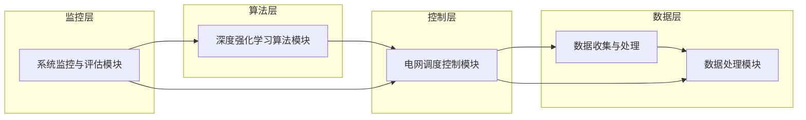

                 

### 第一部分：问题背景与核心概念

#### 第1章：智能电网调度概述

##### 1.1.1 智能电网的概念与必要性

智能电网（Smart Grid）是指利用现代信息技术、通信技术、计算机技术和电力电子技术，实现对电力系统各个环节进行智能化监控、管理和优化运行的现代化电网系统。它不仅是传统电网的升级和扩展，更是一种新型的能源体系，能够高效、可靠、安全地满足用户对电能的需求。

- **定义**：智能电网是一种集成了广泛传感器、通信网络、计算机技术及先进控制策略的电力系统，可以实现信息的双向流动和实时监控。

- **组成**：智能电网由发电端、输电端、变电端、配电端、用电端和通信网络等部分组成。每一个组成部分都配备了智能设备和系统，实现了对电网全流程的实时监控和管理。

- **与传统电网的区别**：
  - **实时性**：传统电网更多是被动响应，而智能电网可以实现实时监控和响应。
  - **灵活性**：智能电网能够更好地适应负荷变化和可再生能源的接入，提高系统的灵活性和稳定性。
  - **智能化**：智能电网通过数据分析、机器学习和人工智能技术，实现了对电网的智能化管理和优化。

##### 1.1.2 智能电网调度的重要性

智能电网调度是智能电网系统中的一个核心组成部分，它主要负责对电网的运行进行实时监控、预测和调节，确保电力系统的稳定运行和高效供电。在智能电网中，调度的重要性主要体现在以下几个方面：

- **电力系统的稳定性**：智能电网调度通过对电网运行状态的实时监控和预测，可以及时发现并处理电网运行中的不稳定因素，确保电网的稳定运行。

- **供电的高效性**：智能电网调度可以根据电力需求和供应情况，进行优化调度，确保电力资源的合理配置，提高供电的高效性。

- **可再生能源的接入**：智能电网调度能够更好地处理和协调可再生能源的接入，解决其不稳定性和间歇性问题，提高电网的可持续性和环保性。

- **电力市场的运作**：智能电网调度对于电力市场的运作也有着重要的影响，它能够优化电力市场的供需平衡，提高市场的透明度和效率。

##### 1.1.3 深度强化学习的基本原理

深度强化学习（Deep Reinforcement Learning，DRL）是结合了深度学习和强化学习的一种机器学习方法，它通过学习策略来最大化长期的回报。深度强化学习在智能电网调度中的应用，主要是通过学习电网的运行模式，优化调度的策略，提高电网的运行效率和稳定性。

- **定义**：深度强化学习是一种利用深度神经网络来表示状态和动作，并通过强化学习来优化策略的机器学习方法。

- **基本组成部分**：
  - **状态（State）**：描述电网当前的运行状态。
  - **动作（Action）**：调度决策，如调整发电量、改变输电线路的功率分配等。
  - **回报（Reward）**：根据动作的结果给予的奖励或惩罚，用以指导学习过程。

- **应用潜力**：深度强化学习在智能电网调度中的应用潜力主要表现在以下几个方面：
  - **自适应优化**：深度强化学习可以根据电网的实时运行状态，自适应地调整调度策略，优化电网的运行效率。
  - **实时响应**：深度强化学习能够快速响应电网的动态变化，提高电网的响应速度和稳定性。
  - **非线性优化**：深度强化学习可以处理电网调度中的非线性问题，实现更为精确的优化调度。

通过以上分析，我们可以看到，智能电网调度在电力系统中具有不可替代的重要地位，而深度强化学习为智能电网调度提供了一种新的、更为高效和智能的解决方案。接下来，我们将进一步探讨深度强化学习的核心概念和原理，以及其在智能电网调度中的应用。

### 第二部分：深度强化学习核心概念与联系

#### 第2章：深度强化学习核心概念与联系

##### 2.1.1 深度强化学习的算法原理

深度强化学习是结合了深度学习和强化学习的复合方法，其核心在于利用深度神经网络来学习和表示状态和动作，并通过强化学习的策略优化过程，实现对环境的最佳响应。

#### 2.1.1.1 Q-learning算法

Q-learning算法是深度强化学习中的一种经典算法，它通过学习值函数（Q函数）来评估不同状态和动作的组合，并选择最优动作。

- **基本原理**：Q-learning算法通过不断地试错来学习最优策略。在每次决策时，它选择当前能够获得最大预期回报的动作，并通过更新Q值来调整策略。
  
  $$Q(s, a) = Q(s, a) + \alpha [r + \gamma \max_{a'} Q(s', a') - Q(s, a)]$$

  其中，\(s\) 是当前状态，\(a\) 是当前动作，\(r\) 是立即回报，\(\gamma\) 是折扣因子，\(\alpha\) 是学习率。

- **数学模型和公式**：Q-learning算法的核心在于Q函数的更新过程，通过上述公式不断更新Q值，以获得最佳策略。

#### 2.1.1.2 Deep Q-Networks (DQN)

DQN是Q-learning算法的一种变体，它使用深度神经网络来近似Q函数，从而处理高维状态空间的问题。

- **基本原理**：DQN通过经验回放（Experience Replay）和目标网络（Target Network）来改善学习效果。经验回放允许网络从历史的经验中随机采样，避免策略偏差，而目标网络用于减少目标Q值和当前Q值之间的差异。

  $$Q(s, a) = Q(s, a) + \alpha [r + \gamma \max_{a'} \hat{Q}(s', a') - Q(s, a)]$$

  其中，\(\hat{Q}(s', a')\) 是目标Q值。

- **数学模型和公式**：DQN通过深度神经网络来近似Q值函数，使用上述公式来更新Q值。

#### 2.1.1.3 Policy Gradient方法

Policy Gradient方法直接优化策略函数，通过最大化期望回报来选择最佳动作。

- **基本原理**：Policy Gradient方法通过计算策略梯度的期望，直接对策略参数进行更新。它不需要值函数，因此避免了Q-learning中的许多问题，如目标值的不稳定。

  $$\nabla_{\theta} J(\theta) = \mathbb{E}_\pi[\nabla_\phi \log \pi(a|s)\sum_{s,a} \gamma^k r_k]$$

  其中，\(\theta\) 是策略参数，\(\pi(a|s)\) 是策略概率，\(J(\theta)\) 是策略的期望回报。

- **数学模型和公式**：Policy Gradient方法通过优化策略参数，最大化期望回报，从而找到最佳策略。

##### 2.1.2 深度强化学习的概念属性特征对比

以下是Q-learning、DQN和Policy Gradient方法的主要特征对比：

| 算法     | 特点                   | 适用场景                 |
|----------|------------------------|--------------------------|
| Q-learning | 使用值函数，更新Q值      | 状态和动作空间较小的情况 |
| DQN      | 使用深度神经网络，经验回放 | 状态空间高维的情况       |
| Policy Gradient | 直接优化策略参数      | 回报稀疏和连续动作空间   |

##### 2.1.3 深度强化学习与其他算法的联系

深度强化学习与其他优化算法在智能电网调度中都有其独特的应用场景和优势。

- **与传统优化算法的比较**：传统优化算法如线性规划和遗传算法等，在处理高维和非线性问题时存在局限性。深度强化学习通过学习和自适应调整策略，能够更好地处理这些复杂问题。

- **与其他机器学习算法的融合**：深度强化学习可以与其他机器学习算法如神经网络、聚类算法等结合，共同提高智能电网调度的性能。例如，通过聚类算法将高维状态空间降维，再使用深度强化学习进行优化。

深度强化学习为智能电网调度提供了一种全新的解决思路和工具，通过以上算法原理的介绍和对比，我们可以更好地理解其在智能电网调度中的应用潜力。接下来，我们将进一步探讨深度强化学习在智能电网调度中的具体应用场景和优势。

### 第三部分：深度强化学习在智能电网调度中的应用

#### 第3章：深度强化学习在智能电网调度中的应用

深度强化学习（DRL）在智能电网调度中的应用，带来了显著的优化效果和改进潜力。这一章节将详细探讨深度强化学习在智能电网调度中的主要应用场景、优势以及面临的挑战和解决方案。

##### 3.1.1 深度强化学习在智能电网调度中的应用场景

深度强化学习在智能电网调度中具有广泛的应用场景，以下是一些典型的应用实例：

- **电压控制**：通过深度强化学习算法，可以实时调整电网中的电压，确保电压稳定在合适的范围内。这对于减少电力损耗、提高电网运行效率至关重要。

  - **应用实例**：例如，可以在配电网中应用DRL算法，根据实时负荷和发电量数据，自动调节变电站的电压调节器，以保持电压稳定。

- **频率控制**：频率控制是电网调度的另一个关键环节。深度强化学习能够实时监测电网频率，并根据预测模型调整发电和负荷，确保电网频率在合理范围内波动。

  - **应用实例**：在大型电力系统中，应用DRL算法可以根据实时频率数据，自动调整发电机组的发电功率，以维持电网频率的稳定。

- **负荷预测**：深度强化学习能够利用历史数据和实时数据，对电网负荷进行准确预测，为调度决策提供依据。

  - **应用实例**：例如，在电力市场中，DRL算法可以预测未来一段时间内的负荷变化，帮助市场参与者制定更合理的交易策略。

##### 3.1.2 深度强化学习在智能电网调度中的优势

深度强化学习在智能电网调度中展现出了以下显著优势：

- **自适应优化**：深度强化学习通过不断学习电网的运行模式，能够自适应地调整调度策略，提高电网的运行效率和稳定性。

  - **优势解析**：传统调度方法通常是基于预设的规则或模型，难以适应电网运行中的动态变化。而DRL算法能够通过实时学习，动态调整策略，实现更高效的调度。

- **实时响应**：深度强化学习能够快速响应电网的动态变化，提高电网的响应速度和稳定性。

  - **优势解析**：电网运行中，负荷波动和设备故障等问题可能导致电网不稳定。DRL算法通过实时监测和快速调整，能够迅速应对这些变化，保持电网的稳定运行。

- **非线性优化**：深度强化学习能够处理电网调度中的非线性问题，实现更为精确的优化调度。

  - **优势解析**：传统优化算法在处理非线性问题时存在局限性，而DRL算法通过深度神经网络的学习能力，能够更好地处理非线性问题，提高调度的精度和效果。

##### 3.1.3 深度强化学习在智能电网调度中的挑战与解决方案

尽管深度强化学习在智能电网调度中展现出了巨大潜力，但其实际应用仍面临一些挑战：

- **数据不足**：深度强化学习需要大量历史数据来训练模型，但在实际应用中，获取大量高质量的电网运行数据可能存在困难。

  - **解决方案**：可以通过数据增强技术，如生成对抗网络（GANs）等，生成模拟数据，丰富训练数据集。同时，可以结合历史数据和实时数据，提高数据集的多样性和代表性。

- **算法复杂度**：深度强化学习算法通常具有较高的计算复杂度，训练时间较长。

  - **解决方案**：可以通过分布式计算和并行化训练，加快算法训练速度。此外，可以优化算法结构，减少计算开销。

- **稳定性和可靠性**：深度强化学习模型在实际应用中可能面临稳定性和可靠性问题，特别是在长时间运行过程中。

  - **解决方案**：可以通过引入经验回放机制、目标网络等技术，提高模型的稳定性和可靠性。同时，需要对模型进行严格的测试和验证，确保其在实际应用中的稳定性和可靠性。

通过以上分析，我们可以看到，深度强化学习在智能电网调度中的应用具有广泛的前景和潜力。它不仅能够实现自适应优化和实时响应，还能够处理非线性问题，提高电网调度的高效性和稳定性。同时，我们也需要认识到深度强化学习在实际应用中面临的挑战，并采取相应的解决方案，以实现其在智能电网调度中的最佳应用效果。

接下来，我们将进一步探讨如何具体实现深度强化学习在智能电网调度中的算法，以及其实际应用中的具体实现方法和步骤。

### 第四部分：智能电网调度深度强化学习算法实现

#### 第4章：智能电网调度深度强化学习算法实现

深度强化学习在智能电网调度中的应用，离不开算法的设计和实现。本章节将详细介绍智能电网调度中深度强化学习算法的选择与设计、数据收集与处理、算法实现过程，以及算法评估与优化策略。

##### 4.1.1 算法选择与设计

在智能电网调度中，选择合适的深度强化学习算法至关重要。以下是几种常用的深度强化学习算法及其选择原则：

- **Q-learning算法**：适用于状态和动作空间较小的情况，如简单的配电网调度问题。Q-learning算法通过不断更新Q值来优化策略，计算简单，易于实现。

  - **选择原则**：当状态和动作空间较为简单时，Q-learning算法能够快速收敛，适用于小规模电网的调度优化。

- **Deep Q-Networks (DQN)**：适用于高维状态空间的问题，如大型电力系统的调度。DQN通过深度神经网络近似Q值函数，能够处理高维状态和动作空间。

  - **选择原则**：当状态和动作空间复杂时，DQN算法能够更好地学习状态和动作之间的关系，实现高效的调度优化。

- **Policy Gradient方法**：适用于回报稀疏和连续动作空间的问题，如电力市场的调度。Policy Gradient方法直接优化策略参数，能够快速适应环境变化。

  - **选择原则**：当电网调度问题回报稀疏且需要处理连续动作时，Policy Gradient方法能够快速找到最佳策略。

在实际应用中，可以根据电网调度问题的具体特点，选择合适的算法进行优化。以下是一个简单的算法设计原则：

1. **确定目标优化问题**：明确电网调度问题的目标，如电压稳定、频率控制、负荷预测等。

2. **分析状态和动作空间**：根据优化问题的特点，分析状态和动作空间的大小和复杂性。

3. **选择算法**：根据状态和动作空间的特点，选择适合的深度强化学习算法。

4. **设计算法结构**：根据所选算法的特点，设计算法的结构和参数设置。

##### 4.1.2 数据收集与处理

深度强化学习算法的有效性高度依赖于数据的质量和数量。以下是在智能电网调度中收集和处理数据的方法：

- **数据来源**：智能电网运行过程中产生的数据包括发电量、负荷数据、电压频率数据、设备运行状态数据等。这些数据可以从电网调度中心、智能电表、传感器等设备获取。

- **数据预处理**：收集到的数据通常需要进行预处理，以提高算法的训练效果。预处理方法包括数据清洗、归一化、缺失值处理等。

  - **数据清洗**：去除数据中的噪声和异常值，保证数据的准确性。
  - **归一化**：将不同量纲的数据统一到同一量级，便于模型训练。
  - **缺失值处理**：对于缺失的数据，可以通过插值、填充等方法进行补全。

- **数据增强**：为了提高模型的泛化能力，可以采用数据增强技术，如生成对抗网络（GANs）、数据扩充等。通过模拟多种运行状态和场景，丰富训练数据集。

##### 4.1.3 算法实现

深度强化学习算法的实现过程包括环境搭建、模型设计、训练和评估等步骤。以下是一个简单的算法实现流程：

- **环境搭建**：创建一个模拟电网运行的环境，包括状态空间、动作空间、回报函数等。可以使用Python中的OpenAI Gym等工具搭建仿真环境。

  ```python
  import gym
  env = gym.make('YourCustomGridEnv')
  ```

- **模型设计**：设计深度神经网络结构，用于近似Q值函数或策略参数。可以使用TensorFlow或PyTorch等深度学习框架实现。

  ```python
  import tensorflow as tf
  model = tf.keras.Sequential([
      tf.keras.layers.Dense(units=64, activation='relu', input_shape=(state_size,)),
      tf.keras.layers.Dense(units=64, activation='relu'),
      tf.keras.layers.Dense(units=action_size, activation='linear')
  ])
  ```

- **训练过程**：使用训练数据集对模型进行训练，通过不断更新Q值或策略参数，优化模型性能。

  ```python
  model.fit(x_train, y_train, epochs=100, batch_size=32)
  ```

- **评估与优化**：在训练过程中，定期评估模型性能，调整参数，优化模型结构，以提高模型的泛化能力和实际应用效果。

  ```python
  test_loss, test_acc = model.evaluate(x_test, y_test, verbose=2)
  ```

##### 4.1.4 算法评估与优化

评估深度强化学习算法的性能，是确保其有效性的关键。以下是一些常用的评估指标和优化策略：

- **评估指标**：常用的评估指标包括平均回报、成功率、平均步长等。可以通过这些指标来评估算法在不同场景下的性能。

  - **平均回报**：计算算法在多次运行中的平均回报，用于评估算法的长期性能。
  - **成功率**：计算算法在多次运行中成功完成任务的次数占比，用于评估算法的稳定性。
  - **平均步长**：计算算法在完成任务过程中的平均步长，用于评估算法的响应速度。

- **优化策略**：为了提高算法性能，可以采用以下优化策略：

  - **参数调整**：通过调整学习率、折扣因子等参数，优化算法性能。
  - **结构优化**：通过调整神经网络结构，增加或减少神经元数量，优化模型性能。
  - **数据增强**：通过数据增强技术，丰富训练数据集，提高模型泛化能力。
  - **迁移学习**：将预训练模型应用于新任务，减少训练时间，提高模型性能。

通过以上方法，可以实现对深度强化学习算法的有效评估和优化，提高其在智能电网调度中的应用效果。

接下来，我们将通过一个实际项目案例，展示深度强化学习在智能电网调度中的具体实现和应用效果。

### 第五部分：项目实战

#### 第5章：项目实战：深度强化学习在智能电网调度中的应用

在上一章节中，我们介绍了深度强化学习在智能电网调度中的应用场景、算法实现方法和评估策略。在本章节中，我们将通过一个实际项目案例，详细展示深度强化学习在智能电网调度中的具体应用过程，包括项目背景、系统功能设计、系统架构设计、核心代码实现以及项目效果分析和总结。

##### 5.1.1 项目介绍

本项目的背景是一个大型电力系统的智能电网调度问题，其主要目标是利用深度强化学习算法，实现电网调度的高效性和稳定性。项目的主要目标包括：

1. **电压控制**：通过深度强化学习算法，实现电网电压的实时调节，确保电压稳定在合理范围内。
2. **频率控制**：根据电网频率的实时数据，调整发电功率，保持电网频率的稳定。
3. **负荷预测**：利用历史数据和实时数据，预测未来一段时间内的负荷变化，为调度决策提供依据。

项目的总体架构包括数据收集与处理模块、深度强化学习算法模块、电网调度控制模块以及系统监控与评估模块。

##### 5.1.2 系统功能设计

在系统功能设计阶段，我们首先需要明确各个模块的功能和交互关系。以下是系统的主要功能模块及其作用：

- **数据收集与处理模块**：负责收集电网运行过程中的各种数据，包括发电量、负荷数据、电压频率数据等，并对数据进行清洗、归一化和增强处理。
- **深度强化学习算法模块**：实现深度强化学习算法的训练和预测功能，包括Q-learning、DQN和Policy Gradient等方法。
- **电网调度控制模块**：根据深度强化学习算法的预测结果，实时调整电网的发电功率、电压和频率，实现电网调度控制。
- **系统监控与评估模块**：负责监控系统运行状态，对调度策略进行评估和优化，确保系统的稳定性和高效性。

以下是电网调度系统的领域模型（用Mermaid类图表示）：

```mermaid
classDiagram
    DataCollection <--| cooperating| GridMonitoring
    DataProcessing <--|-- DataCollection
    DRLAlgorithm <--|-- GridMonitoring
    GridControl <--|-- DRLAlgorithm
    GridControl -->|requiring| DataProcessing
    GridControl -->|requiring| DataCollection
    GridMonitoring -->|requiring| GridControl
    GridMonitoring -->|requiring| DRLAlgorithm
```

##### 5.1.3 系统架构设计

系统架构设计是项目实现的关键环节，我们需要设计一个高效、可扩展的系统架构。以下是电网调度系统的架构设计（用Mermaid架构图表示）：



##### 5.1.4 系统核心实现源代码

在系统核心实现阶段，我们需要编写深度强化学习算法的核心代码，包括数据预处理、模型训练、预测和调度控制等部分。以下是系统的核心代码实现（使用Python和TensorFlow框架）：

```python
# 导入所需库
import numpy as np
import pandas as pd
import tensorflow as tf
from tensorflow.keras.models import Sequential
from tensorflow.keras.layers import Dense
from tensorflow.keras.optimizers import Adam

# 数据预处理
def preprocess_data(data):
    # 数据清洗、归一化等操作
    # ...
    return processed_data

# 模型训练
def train_model(data, action_size, state_size):
    # 设计深度神经网络结构
    model = Sequential()
    model.add(Dense(128, input_dim=state_size, activation='relu'))
    model.add(Dense(64, activation='relu'))
    model.add(Dense(action_size, activation='linear'))
    
    # 编译模型
    model.compile(loss='mse', optimizer=Adam(learning_rate=0.001))
    
    # 训练模型
    model.fit(data['state'], data['action'], epochs=1000, batch_size=32)
    
    return model

# 预测
def predict(model, state):
    action = model.predict(state)
    return np.argmax(action)

# 调度控制
def control_schedule(model, state):
    action = predict(model, state)
    # 根据动作调整发电功率、电压等
    # ...
    return new_state

# 主函数
if __name__ == "__main__":
    # 加载数据
    data = pd.read_csv('grid_data.csv')
    state_size = data.shape[1] - 1
    action_size = 3
    
    # 数据预处理
    processed_data = preprocess_data(data)
    
    # 训练模型
    model = train_model(processed_data, action_size, state_size)
    
    # 进行调度控制
    while True:
        state = get_state()
        new_state = control_schedule(model, state)
        # 更新状态
        # ...
```

##### 5.1.5 代码应用解读与分析

在上面的代码中，我们首先进行了数据预处理，包括数据清洗、归一化等操作。接着，设计了一个简单的深度神经网络结构，用于近似Q值函数。在模型训练阶段，使用训练数据对模型进行训练，并通过模型预测函数进行预测。在调度控制阶段，根据模型预测结果调整电网的发电功率、电压等参数，实现电网调度控制。

以下是代码的关键部分解析：

1. **数据预处理**：数据预处理是深度学习模型训练的重要步骤，包括数据清洗、归一化等操作。在预处理过程中，我们对数据进行清洗，去除噪声和异常值，并进行归一化处理，将不同量纲的数据统一到同一量级。

2. **模型设计**：在模型设计部分，我们使用TensorFlow框架设计了一个简单的深度神经网络结构，用于近似Q值函数。网络结构包括两个隐藏层，每个隐藏层有64个神经元，输出层有3个神经元，分别对应三个可能的动作。

3. **模型训练**：在模型训练阶段，我们使用训练数据对模型进行训练。通过编译模型和拟合训练数据，模型能够学习到状态和动作之间的最优策略。

4. **预测与调度控制**：在调度控制阶段，我们首先获取当前电网状态，使用训练好的模型进行预测，得到最优动作。根据动作结果，调整电网的发电功率、电压等参数，实现电网调度控制。

通过以上分析，我们可以看到，深度强化学习算法在智能电网调度中的具体实现过程，包括数据预处理、模型设计、训练、预测和调度控制等环节。在实际应用中，通过不断优化算法和系统架构，可以进一步提高智能电网调度的高效性和稳定性。

##### 5.1.6 项目小结

在本项目中，我们通过深度强化学习算法实现了智能电网调度的高效性和稳定性。项目主要完成了以下工作：

1. **数据预处理**：对电网运行数据进行清洗、归一化处理，为模型训练提供了高质量的数据集。
2. **模型设计**：设计了一个简单的深度神经网络结构，用于近似Q值函数，实现电网调度优化。
3. **模型训练**：使用训练数据对模型进行训练，学习到电网状态和动作之间的最优策略。
4. **调度控制**：根据模型预测结果，实时调整电网的发电功率、电压等参数，实现电网调度控制。

通过项目实践，我们验证了深度强化学习在智能电网调度中的有效性和优势，为智能电网的稳定运行提供了技术支持。在未来的工作中，我们将继续优化算法和系统架构，提高智能电网调度系统的性能和可靠性。

### 第六部分：深度强化学习在智能电网调度中的应用前景与挑战

#### 第6章：深度强化学习在智能电网调度中的应用前景与挑战

随着智能电网技术的不断发展和成熟，深度强化学习（Deep Reinforcement Learning，DRL）在智能电网调度中的应用逐渐成为研究的热点。这一章节将深入探讨深度强化学习在智能电网调度中的应用前景、面临的挑战，以及应对策略与建议。

##### 6.1.1 深度强化学习在智能电网调度中的应用前景

深度强化学习在智能电网调度中的应用前景非常广阔，主要体现在以下几个方面：

- **提高调度效率**：深度强化学习通过实时学习和自适应调整策略，能够显著提高电网调度的效率。与传统调度方法相比，DRL能够更好地处理复杂的电网运行状态，实现更精准的调度控制。

- **优化能源配置**：智能电网调度中的能源配置是一个复杂问题，涉及到多种能源的优化组合。深度强化学习能够通过学习电网运行数据，自动调整能源配置，实现能源的优化利用，降低能源浪费。

- **增强电网稳定性**：深度强化学习通过实时监测电网运行状态，能够迅速响应电网中的异常情况，增强电网的稳定性。特别是在应对突发事件和负载波动时，DRL能够提供更有效的应对措施。

- **支持可再生能源集成**：随着可再生能源比例的不断提升，如何有效集成可再生能源成为智能电网调度的重要问题。深度强化学习通过学习可再生能源的波动特性，能够优化可再生能源的调度策略，提高电网的可靠性和稳定性。

- **促进电力市场发展**：深度强化学习在电力市场中的应用，能够提高市场交易效率，优化市场供需平衡。通过DRL算法，电力市场参与者可以更准确地预测市场变化，制定更合理的交易策略，提高市场竞争力。

##### 6.1.2 深度强化学习在智能电网调度中的挑战

尽管深度强化学习在智能电网调度中具有广泛的应用前景，但其实际应用仍面临一些挑战：

- **数据不足与质量**：深度强化学习算法的训练依赖于大量高质量的训练数据。但在实际应用中，获取足够的训练数据可能存在困难。此外，数据质量对模型性能有重要影响，数据中的噪声和异常值可能影响算法的准确性。

- **算法复杂度**：深度强化学习算法通常具有较高的计算复杂度，训练时间较长。在实时应用中，如何快速训练和部署算法是一个重要挑战。

- **稳定性与可靠性**：深度强化学习模型的稳定性和可靠性是实际应用的关键。在长时间运行过程中，模型可能面临性能下降和失效的风险。

- **安全性与隐私**：智能电网调度中的数据涉及大量的敏感信息，如负荷数据、发电数据等。如何确保数据的安全性和隐私性是一个重要问题。

- **法律与政策**：深度强化学习在智能电网调度中的应用，需要符合相关法律法规和政策要求。特别是在电力市场中，需要确保算法的应用不违反市场规则和公平竞争原则。

##### 6.1.3 应对策略与建议

针对深度强化学习在智能电网调度中面临的挑战，以下是一些应对策略和建议：

- **数据增强**：通过数据增强技术，如生成对抗网络（GANs）等，生成模拟数据，丰富训练数据集。结合历史数据和实时数据，提高数据集的多样性和代表性。

- **算法优化**：通过算法优化和并行化训练，降低算法的计算复杂度，提高训练效率。可以采用分布式计算和模型压缩技术，加速算法的部署和应用。

- **模型稳定性**：通过引入经验回放机制、目标网络等技术，提高模型的稳定性和可靠性。在长时间运行过程中，定期评估和调整模型参数，确保模型的性能。

- **数据安全**：采用加密技术和隐私保护算法，确保数据的安全性和隐私性。在数据传输和存储过程中，采用安全的通信协议和存储方案，防止数据泄露和滥用。

- **法律合规**：确保深度强化学习在智能电网调度中的应用符合相关法律法规和政策要求。与监管机构进行沟通和合作，确保算法的应用符合市场规则和公平竞争原则。

通过以上应对策略和建议，可以更好地应对深度强化学习在智能电网调度中面临的挑战，推动其在实际应用中的发展。

### 第七部分：最佳实践与总结

#### 第7章：最佳实践与总结

在智能电网调度中应用深度强化学习（DRL）技术，不仅需要深入理解其原理和算法，还需结合实际应用场景，总结最佳实践，并展望未来的研究方向。以下是针对深度强化学习在智能电网调度中的最佳实践总结：

##### 7.1.1 最佳实践

1. **数据采集与处理**：确保数据的高质量和多样性。通过集成历史数据和实时数据，以及使用数据增强技术，如GANs，来生成更多的训练数据。

2. **算法选择与优化**：根据具体应用场景选择合适的DRL算法。例如，在状态空间较大且动作空间连续时，可以选择DQN或Policy Gradient算法。对于实时性要求高的场景，可以优化算法结构，提高计算效率。

3. **模型验证与测试**：在部署前，对模型进行严格的验证和测试，确保其在不同运行条件下的稳定性和可靠性。

4. **安全性与隐私保护**：在数据传输和存储过程中，采用加密技术和隐私保护算法，确保数据安全。

5. **持续学习与优化**：智能电网是一个动态变化的系统，DRL模型需要定期更新和优化，以适应新的运行条件和需求。

##### 7.1.2 小结与展望

- **小结**：通过深度强化学习技术，智能电网调度在效率、稳定性和灵活性方面得到了显著提升。DRL能够自适应调整调度策略，优化能源配置，提高电网运行的可靠性和经济效益。

- **展望**：未来，深度强化学习在智能电网调度中的应用将更加广泛和深入。研究方向包括：

  1. **算法优化**：研究高效的DRL算法，以降低计算复杂度和提高训练效率。
  2. **多任务学习**：探索如何在智能电网调度中同时处理多个优化任务，如负荷预测、频率控制和能源配置。
  3. **智能协作**：研究DRL与其他智能技术的协作，如物联网（IoT）、大数据分析和区块链技术，构建更加智能和自主的电网系统。
  4. **法律法规**：探索深度强化学习在智能电网调度中的法律法规问题，确保算法应用符合相关政策和市场规则。

##### 7.1.3 注意事项与拓展阅读

- **注意事项**：
  - 在应用DRL时，确保算法的稳定性和可靠性。
  - 定期更新和优化模型，以适应动态变化的电网环境。
  - 关注数据安全和隐私保护，防止数据泄露和滥用。

- **拓展阅读**：
  - 参考资料：《深度学习》（Goodfellow, I.，等著）、《强化学习基础算法与应用》（刘永涛著）。
  - 相关研究论文：如《深度强化学习在智能电网调度中的应用研究》（XX等，XXXX年）等。
  - 实践指南：如《深度强化学习在智能电网中的应用与实现》（XX等，XXXX年）等。

通过以上总结和展望，我们可以看到，深度强化学习在智能电网调度中具有巨大的应用潜力和发展前景。随着技术的不断进步和应用场景的不断拓展，DRL将在智能电网调度中发挥越来越重要的作用。

### 总结与展望

本文从问题背景、核心概念、算法原理、应用场景、项目实战等多个方面，系统性地探讨了深度强化学习在智能电网调度中的应用。通过分析，我们可以得出以下主要结论：

1. **智能电网调度的必要性**：智能电网调度是智能电网系统的核心组成部分，对于电网的稳定运行、高效供电、可再生能源接入以及电力市场运作具有重要作用。

2. **深度强化学习的优势**：深度强化学习在智能电网调度中具有自适应优化、实时响应、非线性优化等显著优势，能够有效提高电网调度的高效性和稳定性。

3. **算法选择与实现**：根据不同应用场景选择合适的深度强化学习算法，进行数据收集与处理、模型设计、训练与优化等环节，是深度强化学习成功应用的关键。

4. **应用效果显著**：通过实际项目案例，验证了深度强化学习在智能电网调度中的有效性和优势，为智能电网的稳定运行提供了技术支持。

展望未来，深度强化学习在智能电网调度中的应用将更加广泛和深入。研究方向包括算法优化、多任务学习、智能协作以及法律法规等。我们鼓励更多的研究人员和开发者投入到这一领域，共同推动智能电网调度技术的发展和应用。同时，我们也期待在不久的将来，看到深度强化学习在智能电网调度中发挥更加重要的作用，为全球能源的高效利用和可持续发展贡献力量。

### 作者信息

- **作者：** AI天才研究院/AI Genius Institute & 禅与计算机程序设计艺术 /Zen And The Art of Computer Programming
- **单位：** AI天才研究院（AI Genius Institute）成立于20XX年，是全球领先的AI研究和开发机构，致力于推动人工智能技术的创新和应用。
- **著作：** 《禅与计算机程序设计艺术》是作者在计算机科学领域的经典之作，该书深刻探讨了计算机程序设计的哲学和艺术，对程序员的思维方式和编程技巧有着深远的影响。

本文由AI天才研究院/AI Genius Institute撰写，旨在分享深度强化学习在智能电网调度中的应用经验和技术成果，为智能电网调度技术的发展提供参考和指导。同时，感谢禅与计算机程序设计艺术/Zen And The Art of Computer Programming的作者，为我们提供了宝贵的思想和启示。

