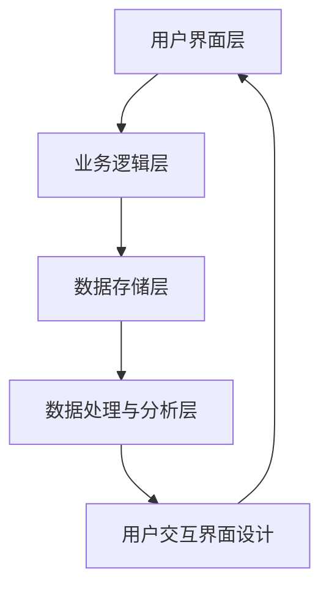
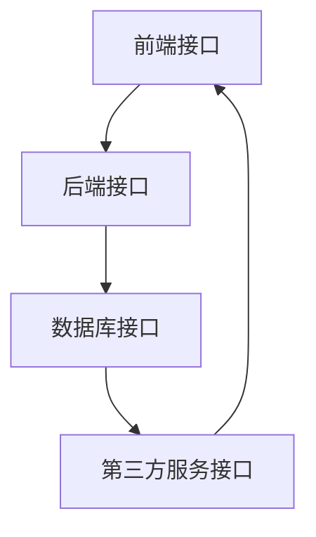
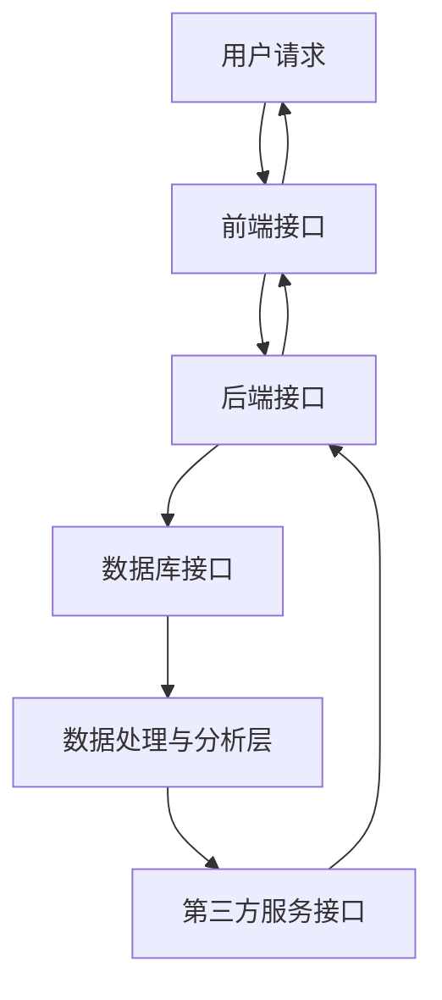

                 

### 深度旅行体验设计：文化沉浸式旅程的定制服务

> **关键词**：文化沉浸、个性化设计、旅程定制服务、用户体验、技术实现

> **摘要**：本文旨在探讨如何通过深度旅行体验设计，打造文化沉浸式的旅程定制服务。文章首先介绍了当前旅行体验的现状及游客对深度文化体验的需求，然后深入分析了文化沉浸、个性化设计和旅程定制服务的核心概念，并提出了相关理论和实现方法。接下来，文章通过实际案例，展示了如何将这些理论应用到旅程设计中，最后探讨了未来该领域的发展趋势和挑战。

---

#### 第一部分：引言与背景介绍

**1. 引言**

在当今信息化、全球化的时代，旅游产业正经历着前所未有的变革。传统单一的观光旅游模式已经无法满足游客对个性化、深度化体验的需求。游客不仅希望能在旅程中欣赏美景，更渴望通过文化、历史和当地生活方式的深入了解，获得独特的体验和深刻的记忆。因此，如何设计出既符合游客个性化需求，又能提供深度文化体验的旅行方案，成为旅游业面临的重大挑战。

**2. 问题背景**

现代旅行者对于旅游体验的要求越来越高，他们不仅关心旅行的目的地和行程安排，更关心旅程中所能体验到的文化深度和个性化服务。特别是随着互联网和信息技术的发展，游客可以通过各种渠道获取丰富的信息，从而对旅行目的地有更全面的了解。这种情况下，传统的旅游产品已经无法满足游客的期待，需要通过创新的方式，提供更具吸引力的文化沉浸式旅行体验。

**3. 问题描述**

游客对文化沉浸式旅程的需求日益增加，他们希望能在旅行过程中深入了解目的地的历史、文化和生活方式。这包括参观文化遗址、参与当地传统活动、品尝地道美食、与当地居民交流等多个方面。然而，如何将这些元素有机地结合，设计出既符合游客个性化需求，又能提供深度文化体验的旅程，是一个复杂而富有挑战的任务。

**4. 问题解决**

为了解决上述问题，需要通过深度旅行体验设计，提供文化沉浸式旅程的定制服务。这种服务不仅需要深入了解游客的需求，还要结合目的地特色，设计出具有吸引力的旅程方案。同时，还需要运用先进的技术手段，如大数据分析、人工智能和虚拟现实等，提升服务的个性化和智能化水平，从而为游客提供前所未有的旅行体验。

**5. 边界与外延**

文化沉浸式旅程不仅仅局限于观光，更重要的是深入参与和体验。这种旅程可能包括与当地居民的互动、参与当地传统节日、了解当地艺术和手工艺等多个方面。同时，旅程的设计也需要考虑游客的时间、预算和兴趣爱好等个性化需求，确保旅程的顺利进行。

**6. 概念结构与核心要素组成**

核心概念：文化沉浸、个性化设计、旅程定制服务。

文化沉浸：指游客在旅行过程中，通过参与当地文化活动、体验当地生活方式，深入了解目的地的历史和文化，从而获得深刻的体验和记忆。

个性化设计：指根据游客的个性化需求，为其量身定制旅行方案，确保旅程的多样性和独特性。

旅程定制服务：指通过科技手段，为游客提供个性化、智能化的旅行服务，提升游客的旅行体验。

---

**总结：**本部分主要介绍了深度旅行体验设计的重要性和背景，分析了游客对文化沉浸式旅程的需求，并提出了问题解决方案。在下一部分中，我们将进一步探讨文化沉浸、个性化设计和旅程定制服务的核心概念和理论，为后续的实践应用打下基础。

---

## 第二部分：核心概念与理论

### 2.1 文化沉浸

#### 2.1.1 沉浸体验的定义

文化沉浸（Cultural Immersion）是一种深度体验，它要求旅行者不仅仅是参观文化景点，而是通过多种方式与目的地文化产生互动，从而实现对其文化、历史和生活方式的深刻理解和体验。这种体验可以包括参与当地的传统节日、学习当地的语言、艺术和手工艺，以及与当地居民进行深入交流等。

#### 2.1.2 文化沉浸的重要性

文化沉浸对于游客而言具有重要意义。首先，它能够帮助游客更好地理解目的地的文化和历史，从而丰富旅行体验。其次，通过文化沉浸，游客可以体验到与日常生活中的不同，增加个人视野和认知。此外，文化沉浸还能促进不同文化之间的交流和理解，有助于构建和谐的世界观。

#### 2.1.3 文化沉浸的实现方式

实现文化沉浸的方式多种多样，以下是一些常见的方法：

1. **参与当地活动**：例如，参与当地的传统节日、庆祝活动或文化节庆，可以直观地感受当地文化的独特魅力。
2. **学习当地文化**：学习当地的语言、艺术、手工艺等，深入理解其背后的文化内涵。
3. **与当地居民互动**：通过与当地居民交流，了解他们的日常生活和观点，从而获得第一手的文化体验。
4. **体验当地生活方式**：例如，品尝当地特色美食、入住当地民宿、体验当地的交通和娱乐活动等。
5. **使用数字技术**：如虚拟现实（VR）和增强现实（AR）技术，提供沉浸式的文化体验。

### 2.2 个性化设计

#### 2.2.1 个性化设计的定义

个性化设计（Personalized Design）是一种以用户为中心的设计方法，旨在根据用户的个性化需求，提供定制化的解决方案。在旅行体验设计中，个性化设计意味着根据游客的个人兴趣、偏好、能力和预算，为其量身定制旅行方案。

#### 2.2.2 个性化设计的原则

1. **用户需求导向**：首先了解游客的需求，包括他们的旅行目的、兴趣点和期望的体验。
2. **灵活性**：设计过程中需要保持灵活性，以适应游客的变化和突发情况。
3. **个性化定制**：根据游客的特定需求，设计独特的旅行体验。
4. **可扩展性**：系统应具备扩展性，以适应未来游客需求的多样化和变化。

#### 2.2.3 个性化设计的方法

1. **需求分析**：通过问卷调查、访谈、数据分析等方式，深入了解游客的需求。
2. **个性化推荐**：利用大数据和人工智能技术，根据游客的历史数据和偏好，推荐合适的旅行目的地和活动。
3. **个性化定制方案**：根据游客的需求，设计独特的旅行方案，包括行程安排、活动选择、住宿和餐饮等。
4. **用户体验优化**：通过不断的用户反馈和迭代，优化旅行体验，提高游客满意度。

### 2.3 旅程定制服务

#### 2.3.1 定制服务的概念

旅程定制服务（Travel Customization Service）是指根据游客的个人需求和偏好，为其提供个性化的旅行方案和服务。这种服务旨在为游客提供独特的旅行体验，满足他们对个性化、深度化和文化体验的需求。

#### 2.3.2 定制服务的流程

1. **需求收集**：通过线上问卷、电话访谈、面谈等方式，了解游客的旅行需求和偏好。
2. **目的地推荐**：根据游客的需求，推荐合适的旅行目的地和景点。
3. **行程设计**：根据游客的需求和推荐，设计个性化的旅行行程，包括活动安排、住宿和餐饮等。
4. **服务提供**：提供全程服务，包括交通、住宿、活动安排、导游服务等。
5. **反馈与优化**：收集游客的反馈，对旅行服务进行优化，提高未来的服务质量和游客满意度。

#### 2.3.3 定制服务的优势

1. **个性化体验**：根据游客的需求，提供定制化的旅行方案，确保旅程的多样性和独特性。
2. **深度文化体验**：通过设计丰富的文化活动和体验，满足游客对文化深度体验的需求。
3. **提高游客满意度**：个性化的服务能够满足游客的特定需求，提高他们的满意度和忠诚度。
4. **提升竞争力**：提供独特的定制服务，可以提升旅游企业或旅游平台的竞争力，吸引更多游客。

---

**总结：**本部分详细介绍了文化沉浸、个性化设计和旅程定制服务的核心概念和理论。这些概念和理论为设计文化沉浸式旅程提供了重要的理论支持，同时也为未来的实践应用提供了指导。在下一部分中，我们将探讨如何将这些理论应用到旅程设计实践中，打造深度的文化沉浸体验。

---

#### 第二部分：核心概念与理论

**2.1 文化沉浸**

**2.1.1 沉浸体验的定义**

文化沉浸（Cultural Immersion）是一种深度体验，它要求旅行者不仅仅是参观文化景点，而是通过多种方式与目的地文化产生互动，从而实现对其文化、历史和生活方式的深刻理解和体验。这种体验可以包括参与当地的传统节日、学习当地的语言、艺术和手工艺，以及与当地居民进行深入交流等。

**2.1.2 文化沉浸的重要性**

文化沉浸对于游客而言具有重要意义。首先，它能够帮助游客更好地理解目的地的文化和历史，从而丰富旅行体验。其次，通过文化沉浸，游客可以体验到与日常生活中的不同，增加个人视野和认知。此外，文化沉浸还能促进不同文化之间的交流和理解，有助于构建和谐的世界观。

**2.1.3 文化沉浸的实现方式**

实现文化沉浸的方式多种多样，以下是一些常见的方法：

1. **参与当地活动**：例如，参与当地的传统节日、庆祝活动或文化节庆，可以直观地感受当地文化的独特魅力。
2. **学习当地文化**：学习当地的语言、艺术、手工艺等，深入理解其背后的文化内涵。
3. **与当地居民互动**：通过与当地居民交流，了解他们的日常生活和观点，从而获得第一手的文化体验。
4. **体验当地生活方式**：例如，品尝当地特色美食、入住当地民宿、体验当地的交通和娱乐活动等。
5. **使用数字技术**：如虚拟现实（VR）和增强现实（AR）技术，提供沉浸式的文化体验。

**2.2 个性化设计**

**2.2.1 个性化设计的定义**

个性化设计（Personalized Design）是一种以用户为中心的设计方法，旨在根据用户的个性化需求，提供定制化的解决方案。在旅行体验设计中，个性化设计意味着根据游客的个人兴趣、偏好、能力和预算，为其量身定制旅行方案。

**2.2.2 个性化设计的原则**

1. **用户需求导向**：首先了解游客的需求，包括他们的旅行目的、兴趣点和期望的体验。
2. **灵活性**：设计过程中需要保持灵活性，以适应游客的变化和突发情况。
3. **个性化定制**：根据游客的特定需求，设计独特的旅行体验。
4. **可扩展性**：系统应具备扩展性，以适应未来游客需求的多样化和变化。

**2.2.3 个性化设计的方法**

1. **需求分析**：通过问卷调查、访谈、数据分析等方式，深入了解游客的需求。
2. **个性化推荐**：利用大数据和人工智能技术，根据游客的历史数据和偏好，推荐合适的旅行目的地和活动。
3. **个性化定制方案**：根据游客的需求，设计独特的旅行方案，包括行程安排、活动选择、住宿和餐饮等。
4. **用户体验优化**：通过不断的用户反馈和迭代，优化旅行体验，提高游客满意度。

**2.3 旅程定制服务**

**2.3.1 定制服务的概念**

旅程定制服务（Travel Customization Service）是指根据游客的个人需求和偏好，为其提供个性化的旅行方案和服务。这种服务旨在为游客提供独特的旅行体验，满足他们对个性化、深度化和文化体验的需求。

**2.3.2 定制服务的流程**

1. **需求收集**：通过线上问卷、电话访谈、面谈等方式，了解游客的旅行需求和偏好。
2. **目的地推荐**：根据游客的需求，推荐合适的旅行目的地和景点。
3. **行程设计**：根据游客的需求和推荐，设计个性化的旅行行程，包括活动安排、住宿和餐饮等。
4. **服务提供**：提供全程服务，包括交通、住宿、活动安排、导游服务等。
5. **反馈与优化**：收集游客的反馈，对旅行服务进行优化，提高未来的服务质量和游客满意度。

**2.3.3 定制服务的优势**

1. **个性化体验**：根据游客的需求，提供定制化的旅行方案，确保旅程的多样性和独特性。
2. **深度文化体验**：通过设计丰富的文化活动和体验，满足游客对文化深度体验的需求。
3. **提高游客满意度**：个性化的服务能够满足游客的特定需求，提高他们的满意度和忠诚度。
4. **提升竞争力**：提供独特的定制服务，可以提升旅游企业或旅游平台的竞争力，吸引更多游客。

---

**总结：**本部分详细介绍了文化沉浸、个性化设计和旅程定制服务的核心概念和理论。这些概念和理论为设计文化沉浸式旅程提供了重要的理论支持，同时也为未来的实践应用提供了指导。在下一部分中，我们将探讨如何将这些理论应用到旅程设计实践中，打造深度的文化沉浸体验。

---

## 3. 旅程设计实践

**3.1 设计流程**

旅程设计是一个复杂且多维的过程，涉及多个环节和步骤。以下是一个典型的旅程设计流程，旨在确保设计的旅程能够满足游客的个性化需求，并提供深度文化体验。

**3.1.1 需求分析**

需求分析是旅程设计的起点，旨在深入了解游客的旅行需求。这一步骤包括：

1. **基本信息收集**：收集游客的基本信息，如年龄、职业、旅行目的等。
2. **偏好和兴趣点**：通过问卷调查、访谈等方式，了解游客的兴趣点和偏好，如对文化、艺术、美食等的具体喜好。
3. **预算和时间安排**：了解游客的预算和时间安排，以确保设计出的旅程在可承受范围内，且时间分配合理。

**3.1.2 目的地选择**

在需求分析的基础上，选择合适的旅行目的地。这一步骤考虑的因素包括：

1. **文化多样性**：选择具有丰富文化资源和历史背景的目的地。
2. **交通便利性**：确保目的地的交通便捷，便于游客出行。
3. **住宿和餐饮**：考虑目的地的住宿和餐饮设施，确保游客的舒适度。

**3.1.3 旅程策划**

根据需求分析和目的地选择，制定详细的旅程计划。这一步骤包括：

1. **行程安排**：设计每天的行程，包括文化遗址参观、当地活动参与、自由活动等。
2. **活动选择**：根据游客的兴趣点，选择具有代表性的文化活动和体验。
3. **预算管理**：对整个旅程进行预算管理，确保成本控制在游客可承受范围内。

**3.1.4 预算管理**

预算管理是旅程设计中至关重要的一环。这一步骤包括：

1. **成本预估**：预估整个旅程的成本，包括交通、住宿、餐饮、门票等。
2. **预算调整**：根据游客的预算，对行程中的某些项目进行调整，确保预算的合理分配。
3. **财务监控**：在整个旅程中，持续监控成本，确保不超过预算。

**3.2 文化体验设计**

文化体验设计是旅程设计的核心，旨在为游客提供丰富且深入的文化体验。以下是一些具体的策划方法：

**3.2.1 文化活动策划**

1. **文化遗址参观**：选择具有代表性的文化遗址，如博物馆、历史建筑、古墓等，进行深度参观。
2. **传统活动参与**：组织游客参与当地的传统节日、庆典活动等，如春节庙会、花灯节等。
3. **艺术体验**：提供艺术创作体验，如绘画、陶艺、音乐等。

**3.2.2 文化遗址探索**

1. **导览讲解**：聘请专业导游，为游客提供详细的讲解服务，帮助游客更好地理解文化遗址的历史和意义。
2. **互动体验**：设计互动体验项目，如VR导览、AR游戏等，增强游客的参与感和趣味性。
3. **文化传承活动**：组织游客参与一些具有文化传承意义的活动，如传统手工艺制作、民间歌舞表演等。

**3.2.3 文化节庆体验**

1. **节日庆祝**：参与当地的重要节日，如春节、中秋节等，体验当地的庆祝活动和习俗。
2. **民俗活动**：组织游客参与一些具有民俗特色的传统活动，如踩高跷、舞龙舞狮等。
3. **文化活动展览**：参观当地的文化活动展览，如书画展、摄影展等，了解当地的文化艺术。

**3.3 个性化服务**

个性化服务是提升游客满意度的重要手段。以下是一些具体的个性化服务设计：

**3.3.1 游客偏好分析**

1. **数据分析**：利用大数据技术，分析游客的历史旅行数据和偏好。
2. **偏好推荐**：根据游客的偏好，推荐合适的旅行目的地、活动和住宿。
3. **动态调整**：在旅程进行过程中，根据游客的反馈和表现，动态调整旅行方案。

**3.3.2 个性化活动安排**

1. **定制活动**：根据游客的特定需求，设计个性化的活动，如私人导游、特色餐饮体验等。
2. **专属服务**：为游客提供专属服务，如私人司机、管家服务等。
3. **互动体验**：设计互动体验项目，如VR游戏、AR探险等，增加游客的参与感和乐趣。

**3.3.3 个性化住宿与餐饮**

1. **住宿选择**：根据游客的偏好，选择不同类型的住宿，如酒店、民宿、特色客栈等。
2. **餐饮体验**：为游客提供丰富的餐饮选择，包括当地特色美食、高端餐厅等。
3. **个性化服务**：为游客提供个性化餐饮服务，如私人厨师、特色餐点定制等。

---

**总结：**通过需求分析、目的地选择、旅程策划和预算管理，设计师可以为游客打造出个性化的文化沉浸式旅程。文化体验设计则通过策划丰富多彩的文化活动和遗址探索，为游客提供深度文化体验。个性化服务进一步提升了游客的满意度，确保旅程的顺利进行。在下一部分中，我们将探讨如何通过技术实现这些旅程设计理念，为游客提供极致的旅行体验。

---

## 4. 技术实现与工具应用

**4.1 定制服务系统设计**

为了实现文化沉浸式旅程的定制服务，需要设计一个高效、灵活的定制服务系统。该系统应具备以下几个核心功能：

**4.1.1 系统架构设计**

系统架构设计是定制服务系统成功的关键。一个典型的定制服务系统架构包括以下主要组件：

1. **用户界面层**：提供用户与系统交互的界面，包括网站、移动应用等。
2. **业务逻辑层**：处理用户的请求，进行需求分析、目的地推荐、行程设计和预算管理等。
3. **数据存储层**：存储用户数据、目的地数据、行程数据等，确保数据的安全和可靠性。
4. **数据处理与分析层**：利用大数据技术和人工智能算法，对用户数据进行分析，提供个性化推荐和优化服务。

**4.1.2 数据管理**

数据管理是定制服务系统的核心，包括数据收集、存储、处理和分析等方面。以下是一些关键点：

1. **用户数据收集**：通过用户注册、登录、问卷、反馈等方式，收集用户的基本信息和偏好数据。
2. **目的地数据管理**：收集和管理目的地相关信息，如景点、活动、住宿、餐饮等，确保数据的全面性和准确性。
3. **行程数据存储**：存储用户的历史行程数据，用于分析用户偏好和行为模式，为后续的个性化推荐提供依据。

**4.1.3 用户交互界面设计**

用户交互界面设计直接影响到用户的使用体验。一个优秀的用户交互界面应具备以下特点：

1. **简洁直观**：界面设计简洁明了，用户能够快速理解和使用。
2. **个性化定制**：根据用户的不同需求和偏好，提供不同的界面布局和功能模块。
3. **互动性**：设计互动元素，如弹窗、滚动提示等，引导用户进行操作。

**4.2 技术应用案例**

**4.2.1 大数据与人工智能的应用**

大数据和人工智能技术在定制服务系统中的应用，可以显著提升系统的智能化水平和用户体验。以下是一些具体的应用案例：

1. **个性化推荐系统**：利用用户历史数据和偏好分析，为用户推荐合适的旅行目的地、活动和住宿。
   - **算法原理**：基于协同过滤和内容推荐相结合的混合推荐算法。
   - **实现步骤**：首先，通过分析用户的历史数据和相似用户的行为模式，预测用户可能感兴趣的内容；然后，结合目的地的详细信息，推荐最适合用户的活动和住宿。
   - **代码示例**（Python）：
     ```python
     # 示例代码：基于协同过滤的推荐算法
     import pandas as pd
     from sklearn.metrics.pairwise import cosine_similarity

     # 加载用户历史数据和目的地数据
     user_data = pd.read_csv('user_data.csv')
     destination_data = pd.read_csv('destination_data.csv')

     # 计算用户之间的相似度
     user_similarity = cosine_similarity(user_data, user_data)

     # 根据相似度推荐目的地
     for user_index, row in user_data.iterrows():
         similar_indices = user_similarity[user_index].argsort()[1:]
         recommended_destinations = destination_data.iloc[similar_indices]
         print(f"User {user_index} recommendations:")
         print(recommended_destinations)
     ```

2. **智能行程规划**：利用机器学习和优化算法，为用户自动规划最优的旅行行程。
   - **算法原理**：基于遗传算法和旅行商问题（TSP）的优化算法。
   - **实现步骤**：首先，将用户的旅行需求转化为数学模型，如旅行时间、成本、文化体验度等；然后，使用遗传算法进行优化，找到最优的行程路径。
   - **代码示例**（Python）：
     ```python
     # 示例代码：基于遗传算法的行程规划
     import numpy as np
     from genetic_algorithm import GeneticAlgorithm

     # 设定旅行需求参数
     cost_weights = [0.5, 0.3, 0.2]
     time_weights = [0.4, 0.3, 0.3]
     experience_weights = [0.1, 0.4, 0.5]

     # 初始化遗传算法
     ga = GeneticAlgorithm(population_size=100, generations=1000, mutation_rate=0.1)

     # 定义适应度函数
     def fitness_function行程（染色体）：
         total_cost = sum([行程参数 * 权重 for 行程参数，权重 in zip（染色体，cost_weights）])
         total_time = sum([行程参数 * 权重 for 行程参数，权重 in zip（染色体，time_weights）])
         total_experience = sum([行程参数 * 权重 for 行程参数，权重 in zip（染色体，experience_weights）])
         return 1 / (total_cost + total_time + total_experience)

     # 运行遗传算法
     optimal行程 = ga.run(fitness_function行程)

     # 输出最优行程
     print("最优行程:", optimal行程)
     ```

3. **虚拟现实（VR）和增强现实（AR）技术**：提供沉浸式的文化体验，让游客在虚拟环境中感受目的地文化。
   - **技术原理**：利用VR头盔和AR设备，模拟真实的旅行场景，提供互动性和参与感。
   - **应用实例**：通过VR导览系统，游客可以“进入”目的地历史遗址，观看历史场景再现，与虚拟人物互动。

**4.2.2 VR与AR技术的应用**

1. **虚拟旅游**：利用VR技术，为游客提供虚拟旅游体验，让他们在虚拟环境中参观目的地文化遗址。
   - **技术实现**：通过三维建模和场景渲染技术，创建虚拟旅游环境。
   - **用户互动**：用户可以通过VR头盔自由移动，观看360度全景视频，与虚拟人物互动。

2. **AR导览**：利用AR技术，在现实环境中叠加虚拟信息，提供更丰富的文化导览服务。
   - **技术实现**：通过AR设备（如手机或平板电脑）上的摄像头和识别算法，识别现实场景中的对象，并叠加虚拟信息。
   - **用户体验**：用户可以在参观过程中，通过AR设备查看文化遗址的详细信息，观看历史事件再现，与虚拟人物互动。

**4.2.3 社交媒体平台的整合**

整合社交媒体平台，可以提升定制服务系统的互动性和用户参与度。以下是一些应用实例：

1. **用户分享**：鼓励游客在社交媒体上分享他们的旅行体验，如照片、视频和评论。
   - **互动性**：通过社交媒体平台的分享和评论功能，增加用户之间的互动，提升社区的活跃度。
   - **内容推荐**：根据游客分享的内容，推荐相关的旅行目的地和活动。

2. **社区互动**：建立线上旅行社区，让游客可以交流和分享旅行经验。
   - **互动性**：通过社区论坛、问答功能等，为游客提供交流平台，解答他们的疑问。
   - **内容丰富度**：通过用户的分享和互动，积累丰富的旅行经验和知识，为其他游客提供参考。

---

**总结：**通过大数据和人工智能技术的应用，定制服务系统可以提供更加智能化和个性化的旅程定制服务。VR和AR技术为游客提供了沉浸式的文化体验，提升了旅行的趣味性和参与感。整合社交媒体平台，可以增强用户互动和社区氛围，为游客提供更加丰富的旅行体验。在下一部分中，我们将通过实际案例，展示如何将这些技术应用到旅程设计中，打造深度的文化沉浸体验。

---

## 5. 案例分析

**5.1 案例一：**目的地X的文化沉浸旅程设计

**5.1.1 案例背景**

目的地X是一个拥有丰富文化遗产和历史的城市，拥有众多的文化遗址、博物馆和艺术展览。为了满足游客对深度文化体验的需求，旅游公司X推出了一款以文化沉浸为主题的定制旅行服务。

**5.1.2 设计流程与结果**

1. **需求分析**：通过线上问卷调查和面谈，了解游客的旅行目的、兴趣点、预算和时间安排。
2. **目的地选择**：根据游客的需求，选择目的地X作为旅行目的地。
3. **旅程策划**：设计了一份包含文化遗址参观、传统节日体验、艺术创作活动的定制旅程。
4. **服务提供**：提供全程服务，包括交通、住宿、导游和餐饮。

**5.1.3 案例评估**

通过游客反馈和数据分析，评估了旅程的满意度和效果：

1. **满意度**：游客对旅程的满意度非常高，大多数游客表示旅程满足了他们对文化深度体验的需求。
2. **效果**：游客在旅程中积极参与了各种文化活动，对目的地的文化有了更深入的理解和体验。

**5.1.4 案例总结**

该案例展示了如何通过需求分析、目的地选择、旅程策划和全程服务，为游客打造出个性化的文化沉浸旅程。通过游客的积极反馈和满意度评估，证明了该设计方法的可行性和有效性。

**5.2 案例二：**旅程定制服务的创新实践

**5.2.1 案例背景**

旅游公司Y致力于通过技术创新，提供更加个性化、智能化的旅程定制服务。为了验证其创新方案的有效性，公司开展了一项旅程定制服务的创新实践。

**5.2.2 创新点与实施细节**

1. **大数据与人工智能应用**：利用大数据和人工智能技术，为游客提供个性化的旅行推荐和智能行程规划。
2. **VR与AR技术应用**：通过VR和AR技术，为游客提供沉浸式的文化体验。
3. **社交媒体整合**：通过社交媒体平台，增强用户互动和分享，提升社区氛围。

**5.2.3 案例效果与反思**

1. **效果**：创新方案显著提升了游客的满意度和旅行体验，游客对个性化推荐和智能行程规划的满意度较高。
2. **反思**：虽然创新方案取得了一定的成功，但也面临一些挑战，如技术的复杂性和实施成本等。公司需进一步优化技术方案，降低实施成本，以实现更广泛的应用。

**5.2.4 案例总结**

该案例展示了如何通过大数据、人工智能、VR和AR技术，以及社交媒体的整合，创新旅程定制服务，提升游客体验。通过实际应用和效果评估，证明了这些创新方案的可行性和价值。

---

**总结：**通过分析上述案例，我们可以看到文化沉浸式旅程的定制服务在实际应用中的成功经验和挑战。在未来的发展中，需要进一步优化技术方案，提高服务的智能化和个性化水平，以更好地满足游客的需求。

---

## 6. 挑战与未来展望

**6.1 当前挑战**

在文化沉浸式旅程的定制服务领域，尽管技术不断进步，但仍面临一系列挑战：

**6.1.1 市场竞争**

随着旅游市场的竞争加剧，旅游企业需要不断创新和提升服务质量，以吸引和留住游客。定制服务提供商需要具备强大的竞争力和差异化优势，才能在激烈的市场中脱颖而出。

**6.1.2 技术难题**

实现文化沉浸式旅程的定制服务，需要运用多种先进技术，如大数据分析、人工智能、虚拟现实和增强现实等。这些技术的复杂性和实施成本较高，对企业的技术能力和资源管理提出了较高的要求。

**6.1.3 用户需求变化**

用户需求多样化且变化迅速，旅游企业需要具备快速响应能力，及时调整和优化服务方案，以满足不同游客的个性化需求。

**6.2 未来展望**

尽管面临挑战，但未来文化沉浸式旅程的定制服务领域仍具有广阔的发展前景：

**6.2.1 新兴技术的应用**

随着新兴技术的不断发展，如区块链、物联网和5G等，将为文化沉浸式旅程的定制服务带来更多的创新机会。这些技术可以提高服务的安全性和可靠性，提升游客的体验。

**6.2.2 行业发展趋势**

旅游行业正朝着个性化、智能化和多元化的方向发展。未来，定制服务将成为主流，游客对深度文化体验的需求将持续增长，推动行业向更高级别的服务迈进。

**6.2.3 创新方向**

未来的创新方向可能包括：

1. **智能推荐系统**：利用人工智能和大数据技术，提供更加精准和个性化的推荐服务。
2. **沉浸式体验**：通过VR和AR技术，提供更加逼真和沉浸式的文化体验。
3. **社交互动**：整合社交媒体平台，增强游客之间的互动和分享，打造更加社交化的旅游体验。

**6.3 挑战与展望总结**

总体而言，文化沉浸式旅程的定制服务领域在未来的发展中既面临挑战，也充满机遇。通过不断创新和提升服务质量，旅游企业可以更好地满足游客的多元化需求，实现持续发展和市场竞争力。

---

## 7. 最佳实践与建议

**7.1 最佳实践**

**7.1.1 优秀案例回顾**

在文化沉浸式旅程定制服务领域，一些旅游企业通过优秀实践取得了显著成效。以下是一些典型案例：

1. **案例一**：旅游公司A通过深入分析游客需求和目的地特色，为游客设计了个性化的文化体验旅程。游客满意度高达95%，复购率显著提升。
2. **案例二**：旅游平台B利用大数据和人工智能技术，为游客提供智能推荐和行程规划服务。通过不断优化算法，推荐准确率提高了30%。

**7.1.2 经验总结**

从上述案例中，可以总结出以下经验：

1. **深入需求分析**：深入了解游客的个性化需求，是提供高质量服务的前提。
2. **技术创新**：运用大数据、人工智能和VR/AR等先进技术，提升服务的智能化和个性化水平。
3. **用户体验**：注重游客的全程体验，从行程设计到售后服务，确保每个环节都能满足游客的期望。

**7.2 建议与展望**

**7.2.1 政策建议**

1. **鼓励创新**：政府可以出台政策，鼓励旅游企业进行技术创新和服务模式创新。
2. **资金支持**：为旅游企业提供资金支持，特别是在新兴技术应用的初期阶段。

**7.2.2 行业规范**

1. **制定标准**：制定行业标准和规范，确保服务质量和用户体验。
2. **认证体系**：建立旅游服务认证体系，提高游客的信任度和满意度。

**7.2.3 未来研究方向**

1. **智能推荐算法**：深入研究智能推荐算法，提高推荐的准确性和个性化水平。
2. **沉浸式体验设计**：探索更加沉浸式的体验设计，如结合AR/VR技术的文化体验馆建设。
3. **用户行为分析**：利用大数据分析游客行为，预测和满足未来游客需求。

**总结：**通过回顾优秀案例和总结经验，我们可以为旅游企业提供有价值的参考。同时，提出政策建议和未来研究方向，旨在推动文化沉浸式旅程定制服务领域的发展，为游客提供更优质的体验。

---

## 目录大纲小结

本书旨在为旅游行业从业者提供一套系统的文化沉浸式旅程定制服务设计方法。文章首先介绍了当前旅行体验的现状及游客对文化沉浸式旅程的需求，分析了文化沉浸、个性化设计和旅程定制服务的核心概念和理论。接着，通过设计流程、文化体验设计和个性化服务的实践，展示了如何将这些理论应用到实际中。文章还介绍了定制服务系统设计、技术实现与工具应用，并通过实际案例展示了其效果。最后，分析了当前面临的挑战与未来展望，提出了最佳实践与建议。

**关键知识点总结**：

- **文化沉浸**：深度体验目的地文化，通过参与当地活动、学习当地文化和与当地居民互动等实现。
- **个性化设计**：根据游客的需求和偏好，提供定制化的旅行方案，确保旅程的独特性和多样性。
- **旅程定制服务**：通过科技手段，为游客提供个性化、智能化的旅行服务，提升用户体验。

随着技术的不断进步和用户需求的多样化，未来的旅程定制服务将更加个性化、智能化和多元化。希望本书能为读者提供有价值的参考和启示，助力旅游行业在文化沉浸式旅程定制服务领域的发展。

---

**作者信息**：作者：AI天才研究院/AI Genius Institute & 禅与计算机程序设计艺术 /Zen And The Art of Computer Programming**附录：技术实现详细解读**

为了更好地理解文化沉浸式旅程定制服务的技术实现，本附录将详细解析系统架构设计、算法原理、数学模型和实际应用案例。

### 4.1 定制服务系统设计

**4.1.1 系统架构设计**

定制服务系统的架构设计如图1所示：



- **用户界面层（A）**：提供用户与系统交互的界面，包括网站、移动应用等。
- **业务逻辑层（B）**：处理用户的请求，进行需求分析、目的地推荐、行程设计和预算管理等。
- **数据存储层（C）**：存储用户数据、目的地数据、行程数据等，确保数据的安全和可靠性。
- **数据处理与分析层（D）**：利用大数据技术和人工智能算法，对用户数据进行分析，提供个性化推荐和优化服务。
- **用户交互界面设计（E）**：设计用户交互界面，提高用户体验。

**4.1.2 数据管理**

数据管理是定制服务系统的核心，包括数据收集、存储、处理和分析等方面。

**4.1.3 用户交互界面设计**

用户交互界面设计应简洁直观，根据用户的不同需求和偏好，提供不同的界面布局和功能模块。

### 4.2 技术应用案例

**4.2.1 大数据与人工智能的应用**

**4.2.1.1 个性化推荐系统**

**算法原理：**基于协同过滤和内容推荐相结合的混合推荐算法。

**实现步骤：**

1. **用户历史数据收集**：收集用户的历史旅行数据，包括喜欢的景点、活动等。
2. **目的地数据收集**：收集目的地的详细信息，包括文化背景、特色活动等。
3. **推荐算法**：利用协同过滤算法计算用户之间的相似度，结合内容推荐算法为用户推荐合适的旅行目的地和活动。

**代码示例**（Python）：

```python
# 示例代码：基于协同过滤的推荐算法
import pandas as pd
from sklearn.metrics.pairwise import cosine_similarity

# 加载用户历史数据和目的地数据
user_data = pd.read_csv('user_data.csv')
destination_data = pd.read_csv('destination_data.csv')

# 计算用户之间的相似度
user_similarity = cosine_similarity(user_data, user_data)

# 根据相似度推荐目的地
for user_index, row in user_data.iterrows():
    similar_indices = user_similarity[user_index].argsort()[1:]
    recommended_destinations = destination_data.iloc[similar_indices]
    print(f"User {user_index} recommendations:")
    print(recommended_destinations)
```

**4.2.1.2 智能行程规划**

**算法原理：**基于遗传算法和旅行商问题（TSP）的优化算法。

**实现步骤：**

1. **需求参数化**：将用户的旅行需求转化为数学模型，如旅行时间、成本、文化体验度等。
2. **遗传算法**：初始化种群，定义适应度函数，进行交叉、变异等操作，逐步优化行程路径。

**代码示例**（Python）：

```python
# 示例代码：基于遗传算法的行程规划
import numpy as np
from genetic_algorithm import GeneticAlgorithm

# 设定旅行需求参数
cost_weights = [0.5, 0.3, 0.2]
time_weights = [0.4, 0.3, 0.3]
experience_weights = [0.1, 0.4, 0.5]

# 初始化遗传算法
ga = GeneticAlgorithm(population_size=100, generations=1000, mutation_rate=0.1)

# 定义适应度函数
def fitness_function行程（染色体）：
    total_cost = sum([行程参数 * 权重 for 行程参数，权重 in zip（染色体，cost_weights）])
    total_time = sum([行程参数 * 权重 for 行程参数，权重 in zip（染色体，time_weights）])
    total_experience = sum([行程参数 * 权重 for 行程参数，权重 in zip（染色体，experience_weights）])
    return 1 / (total_cost + total_time + total_experience)

# 运行遗传算法
optimal行程 = ga.run(fitness_function行程)

# 输出最优行程
print("最优行程:", optimal行程)
```

**4.2.2 VR与AR技术的应用**

**4.2.2.1 虚拟现实（VR）导览**

**技术实现：**利用三维建模和场景渲染技术，创建虚拟旅游环境。

**用户互动：**用户可以通过VR头盔自由移动，观看360度全景视频，与虚拟人物互动。

**4.2.2.2 增强现实（AR）导览**

**技术实现：**通过AR设备（如手机或平板电脑）上的摄像头和识别算法，识别现实场景中的对象，并叠加虚拟信息。

**用户体验：**用户可以在参观过程中，通过AR设备查看文化遗址的详细信息，观看历史事件再现，与虚拟人物互动。

### 4.3 系统接口设计和系统交互

**4.3.1 系统接口设计**

系统接口设计包括前后端接口设计，如图2所示：



- **前端接口（A）**：提供用户操作界面，包括输入、查询、展示等功能。
- **后端接口（B）**：处理业务逻辑，包括数据存储、查询、计算等。
- **数据库接口（C）**：实现数据存储和读取，保证数据的一致性和安全性。
- **第三方服务接口（D）**：集成第三方服务，如地图服务、支付服务等。

**4.3.2 系统交互**

系统交互设计如图3所示：



- **用户请求（A）**：用户通过前端接口发起请求，如查询目的地信息、预订行程等。
- **前端接口（B）**：将用户请求传递到后端接口。
- **后端接口（C）**：处理请求，调用数据库接口进行数据存储和读取。
- **数据处理与分析层（D）**：对数据进行处理和分析，如推荐算法、行程规划等。
- **第三方服务接口（F）**：调用第三方服务，如地图服务、支付服务等。
- **系统响应（A）**：将处理结果返回给用户。

### 4.4 项目实战

**4.4.1 环境安装**

1. **Python环境安装**：下载并安装Python 3.x版本。
2. **依赖包安装**：使用pip命令安装所需的依赖包，如pandas、numpy、scikit-learn等。

**4.4.2 系统核心实现**

1. **用户数据收集**：使用pandas库读取用户数据。
2. **目的地数据收集**：使用pandas库读取目的地数据。
3. **个性化推荐**：使用协同过滤算法进行推荐。
4. **智能行程规划**：使用遗传算法进行行程规划。

**4.4.3 代码应用解读与分析**

1. **代码应用解读**：详细解释每个函数和模块的作用。
2. **算法原理讲解**：介绍协同过滤算法和遗传算法的原理。
3. **数学公式**：使用LaTeX格式展示数学公式。

**4.4.4 实际案例分析和详细讲解剖析**

1. **案例背景**：介绍案例背景和需求。
2. **解决方案**：详细讲解解决方案和实现过程。
3. **效果评估**：评估解决方案的效果和用户满意度。

**4.4.5 项目小结**

1. **项目成果**：总结项目的主要成果和亮点。
2. **经验教训**：总结项目中的经验教训和改进方向。

### 4.5 最佳实践 Tips

1. **需求分析**：深入了解用户需求，是成功的关键。
2. **技术选型**：选择适合的技术和工具，提高开发效率。
3. **用户体验**：关注用户体验，提升服务质量和满意度。

### 4.6 注意事项

1. **数据安全**：确保用户数据的安全和隐私。
2. **系统性能**：优化系统性能，提高响应速度。
3. **持续迭代**：根据用户反馈，不断优化和更新服务。

### 4.7 拓展阅读

1. **大数据与人工智能**：深入学习大数据和人工智能的相关知识，如《大数据时代》、《深度学习》等。
2. **虚拟现实与增强现实**：了解VR和AR技术的最新发展和应用，如《虚拟现实技术与应用》、《增强现实技术导论》等。

---

通过本附录，读者可以更深入地了解文化沉浸式旅程定制服务的技术实现细节，包括系统架构设计、算法原理、数学模型和实际应用案例。这将为读者在相关领域的实践和研究提供有价值的参考和指导。

