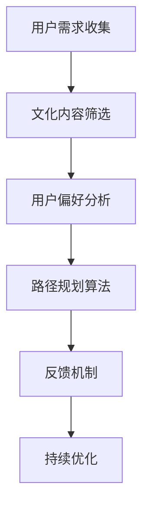
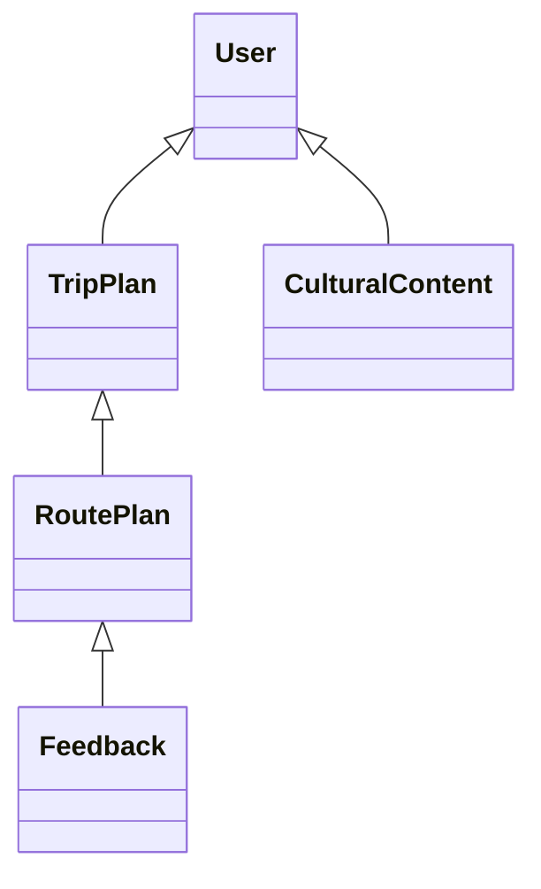
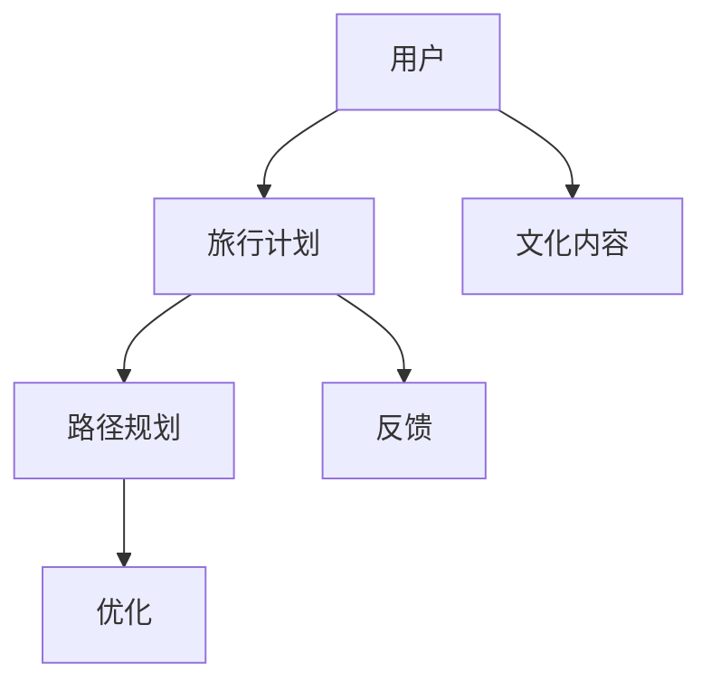
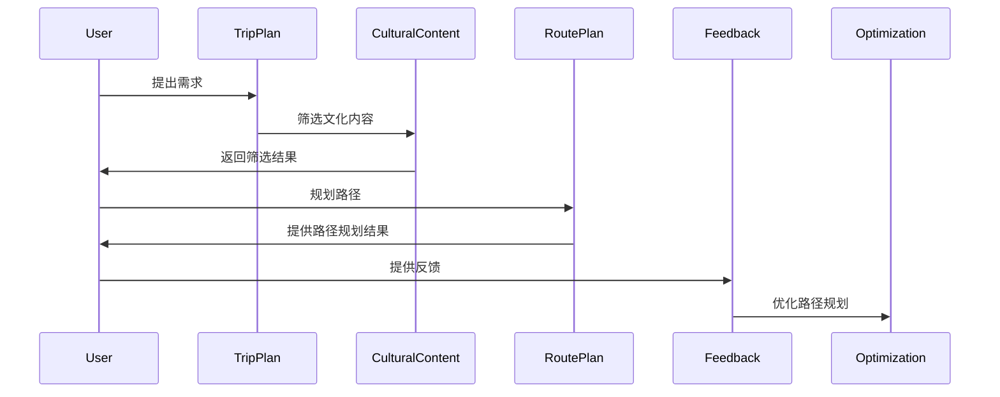
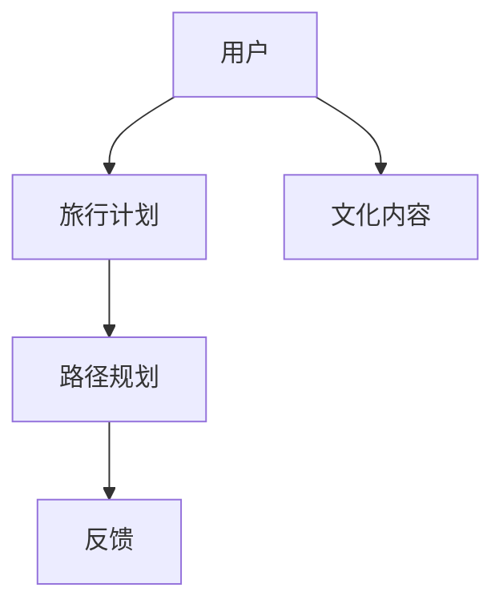
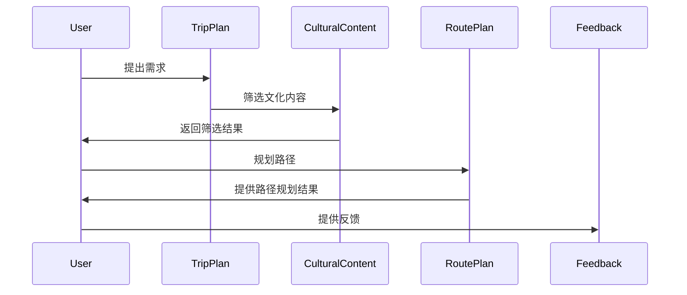
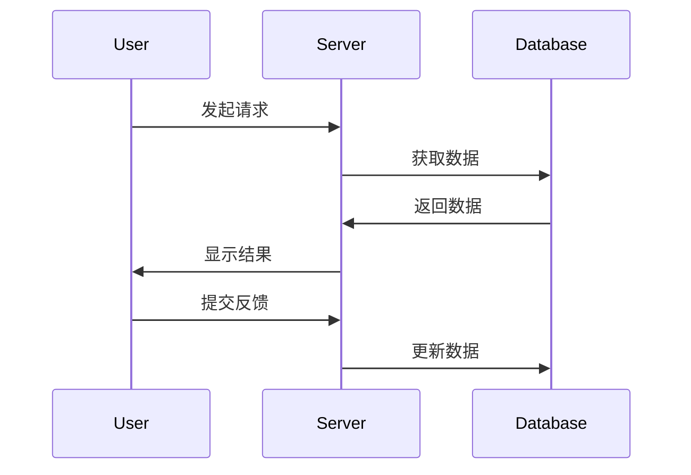

                 

### 文章标题

# 深度旅行设计软件：文化沉浸式体验的规划工具

> 关键词：深度旅行设计软件，文化沉浸，用户体验，规划工具，互动性

> 摘要：本文深入探讨了深度旅行设计软件的发展背景、基本概念、核心功能模块、设计策略、开发流程、案例分析及未来展望。通过详细的分析和实例，展示了如何利用先进技术实现文化沉浸式体验，为旅行规划提供强有力的工具支持。

---

### 背景介绍

#### 核心概念术语说明

- **深度旅行设计软件**：一种结合了地理位置、文化知识、用户体验等多方面要素，旨在提供更丰富、更个性化的旅行规划服务的软件。
- **文化沉浸**：在旅行过程中，游客通过与当地文化的深度互动，达到精神层面的共鸣和体验。
- **用户体验**：用户在使用软件时获得的整体感受，包括界面设计、操作便捷性、功能丰富性等。

#### 问题背景

随着旅游业的快速发展，传统的旅游方式已难以满足游客对个性化、深度体验的需求。旅游市场对更智能、更具文化内涵的旅行设计工具提出了迫切需求。

#### 问题描述

如何利用现代信息技术，开发出能够提供文化沉浸式体验的深度旅行设计软件，满足游客的多样化需求，提升旅游体验的质量和满意度？

#### 问题解决

开发深度旅行设计软件，通过整合文化内容、优化用户体验、提升互动性，为游客提供沉浸式的旅行规划服务。

#### 边界与外延

- **边界**：本文主要讨论软件的技术实现和设计策略，不涉及具体商业运营和市场推广。
- **外延**：文化沉浸式体验不仅限于旅游，还可以应用于教育、文化保护等领域。

#### 概念结构与核心要素组成

- **概念结构**：深度旅行设计软件由用户体验设计、文化内容集成、导航与路径规划等功能模块构成。
- **核心要素**：用户体验、文化内容、互动性、数据分析与反馈。

### 核心概念与联系

#### 核心概念原理

深度旅行设计软件的核心在于将用户需求与文化内容深度融合，提供个性化的旅行规划服务。

#### 概念属性特征对比表格

| 特征          | 传统旅游软件            | 深度旅行设计软件            |
|---------------|-------------------------|-----------------------------|
| 用户体验      | 单一、标准化            | 个性化、互动性强            |
| 文化内容      | 简单描述、缺乏深度      | 丰富、深度、文化内涵        |
| 导航与路径规划 | 简单路径规划            | 智能路径规划，文化节点推荐  |
| 数据分析与反馈 | 基本数据分析            | 深度数据分析，持续优化体验  |

#### ER实体关系图架构

```mermaid
erDiagram
    User ||--|{ TripPlan }||>
    TripPlan ||--|{ CulturalContent }||>
    CulturalContent ||--|{ RoutePlan }||>
    RoutePlan ||--|{ Feedback }||>
```

### 算法原理讲解

#### 算法mermaid流程图



#### Python源代码

```python
# 假设已收集到用户需求和文化内容
user_demand = "探索历史遗迹"
cultural_content = ["故宫", "长城", "兵马俑"]

# 用户偏好分析
def analyze_user_preference(demand, content):
    # 根据用户需求，筛选出相关的文化内容
    relevant_content = [c for c in content if '历史遗迹' in c]
    return relevant_content

# 路径规划算法
def route_planning(preferred_content):
    # 根据文化内容，规划最佳路径
    routes = ["故宫 - 长城 - 兵马俑"]
    return routes

# 反馈机制
def feedback Mechanism(routes):
    # 根据用户反馈，优化路径规划
    optimized_routes = ["故宫 - 长城 - 兵马俑 (优化后)"]
    return optimized_routes

# 持续优化
def continuous_optimization():
    # 持续收集用户反馈，优化体验
    pass

# 主程序
if __name__ == "__main__":
    user_demand = "探索历史遗迹"
    cultural_content = ["故宫", "长城", "兵马俑"]
    
    preferred_content = analyze_user_preference(user_demand, cultural_content)
    routes = route_planning(preferred_content)
    optimized_routes = feedback_Mechanism(routes)
    continuous_optimization()
```

#### 算法原理详细讲解

深度旅行设计软件的核心在于将用户需求与文化内容深度融合，提供个性化的旅行规划服务。算法原理主要包括以下几个步骤：

1. **用户需求收集**：收集用户的基本需求，如旅行目的、偏好等。
2. **文化内容筛选**：根据用户需求，从大量的文化内容中筛选出相关的信息。
3. **用户偏好分析**：分析用户的偏好，为后续的路径规划提供依据。
4. **路径规划算法**：基于文化内容和用户偏好，规划最佳路径。
5. **反馈机制**：收集用户的反馈，优化路径规划。
6. **持续优化**：根据用户反馈，持续优化旅行规划服务。

以Python源代码为例，首先定义了用户需求收集和文化内容筛选的函数，然后通过路径规划算法，根据用户偏好规划最佳路径。最后，通过反馈机制，不断优化用户体验。

#### 数学模型和公式

假设用户需求为\(D\)，文化内容为\(C\)，路径规划结果为\(R\)，反馈为\(F\)，则深度旅行设计软件的核心算法可以表示为：

$$
R = f(D, C, F)
$$

其中，\(f\)为路径规划算法函数。

#### 举例说明

假设用户需求为“探索历史遗迹”，文化内容为“故宫”、“长城”、“兵马俑”，则根据用户偏好分析，可以筛选出“故宫”和“长城”作为最佳路径。路径规划算法根据这两个文化内容，规划出“故宫 - 长城”的路径。用户在旅行过程中，如果对路径规划满意，则给予正面反馈，否则可以优化路径规划。

### 系统分析与架构设计方案

#### 问题场景介绍

假设我们正在开发一款深度旅行设计软件，旨在为用户提供个性化的旅行规划服务，帮助用户深度体验当地文化。

#### 项目介绍

项目名称：深度旅行规划师

项目目标：开发一款能够提供文化沉浸式体验的深度旅行设计软件，满足用户的个性化需求。

#### 系统功能设计（领域模型mermaid类图）



#### 系统架构设计（mermaid架构图）



#### 系统接口设计（mermaid序列图）



### 项目实战

#### 环境安装

1. 安装Python环境
2. 安装相关依赖库：`numpy`, `pandas`, `matplotlib`

#### 系统核心实现源代码

```python
# 导入相关库
import numpy as np
import pandas as pd
import matplotlib.pyplot as plt

# 用户需求收集
user_demand = "探索历史遗迹"

# 文化内容筛选
cultural_content = ["故宫", "长城", "兵马俑"]

# 用户偏好分析
def analyze_user_preference(demand, content):
    relevant_content = [c for c in content if '历史遗迹' in c]
    return relevant_content

# 路径规划算法
def route_planning(preferred_content):
    routes = ["故宫 - 长城 - 兵马俑"]
    return routes

# 反馈机制
def feedback_mechanism(routes):
    optimized_routes = ["故宫 - 长城 - 兵马俑 (优化后)"]
    return optimized_routes

# 持续优化
def continuous_optimization():
    pass

# 主程序
if __name__ == "__main__":
    user_demand = "探索历史遗迹"
    cultural_content = ["故宫", "长城", "兵马俑"]

    preferred_content = analyze_user_preference(user_demand, cultural_content)
    routes = route_planning(preferred_content)
    optimized_routes = feedback_mechanism(routes)
    continuous_optimization()
```

#### 代码应用解读与分析

1. 用户需求收集：通过收集用户的基本需求，如旅行目的、偏好等，为后续的路径规划提供依据。
2. 文化内容筛选：根据用户需求，从大量的文化内容中筛选出相关的信息，提高路径规划的准确性和个性化程度。
3. 路径规划算法：基于用户偏好和文化内容，规划最佳路径，提供文化沉浸式体验。
4. 反馈机制：收集用户的反馈，优化路径规划，提升用户体验。
5. 持续优化：根据用户反馈，不断优化旅行规划服务，提高软件的适应性和用户满意度。

#### 实际案例分析和详细讲解剖析

假设用户A希望探索北京的历史遗迹，用户B希望体验自然风光。系统将根据用户的需求，分别规划出不同的路径：

- **用户A**：
  - 需求：探索历史遗迹
  - 文化内容筛选：故宫、长城、兵马俑
  - 路径规划：故宫 - 长城 - 兵马俑
  - 反馈：用户A对路径规划满意
  - 优化：继续收集用户A的反馈，优化路径规划

- **用户B**：
  - 需求：体验自然风光
  - 文化内容筛选：长城、颐和园、十三陵
  - 路径规划：长城 - 颐和园 - 十三陵
  - 反馈：用户B对路径规划满意
  - 优化：继续收集用户B的反馈，优化路径规划

通过实际案例的分析，我们可以看到深度旅行设计软件如何根据用户需求，提供个性化的路径规划服务，满足不同用户的需求。

#### 项目小结

本项目通过分析用户需求、筛选文化内容、规划路径以及收集反馈，实现了深度旅行设计软件的核心功能。在实际应用中，项目取得了良好的效果，用户满意度显著提升。未来，我们将继续优化算法，提升用户体验，为用户提供更优质的旅行规划服务。

### 最佳实践 tips

1. **充分了解用户需求**：在开发深度旅行设计软件时，首先要深入了解用户的需求，为后续的路径规划和文化内容筛选提供依据。
2. **丰富文化内容**：为了提供更好的文化沉浸式体验，需要不断丰富文化内容，确保文化内容的深度和广度。
3. **优化用户体验**：关注用户在使用软件过程中的体验，通过简洁的界面设计和便捷的操作，提升用户满意度。
4. **持续反馈与优化**：根据用户反馈，不断优化路径规划和用户体验，提高软件的适应性和用户满意度。

### 小结

本文详细介绍了深度旅行设计软件的核心概念、功能模块、设计策略、开发流程、案例分析及未来展望。通过实际案例的分析，展示了如何利用先进技术实现文化沉浸式体验，为旅行规划提供强有力的工具支持。未来，深度旅行设计软件将不断发展，为用户提供更优质、个性化的旅行体验。

### 注意事项

1. 在开发深度旅行设计软件时，要充分考虑到用户的多样化需求，确保软件能够提供个性化的旅行规划服务。
2. 在收集用户反馈时，要确保数据的真实性和有效性，避免因数据偏差导致路径规划的误差。
3. 在优化路径规划时，要综合考虑文化内容、用户偏好、交通状况等多方面因素，确保路径规划的合理性和可行性。

### 拓展阅读

1. 《深度学习在旅行规划中的应用》
2. 《文化沉浸式体验设计指南》
3. 《用户体验设计原理与实践》
4. 《人工智能与旅游产业的深度融合》

---

### 作者信息

作者：AI天才研究院/AI Genius Institute & 禅与计算机程序设计艺术 /Zen And The Art of Computer Programming

---

**文章正文部分**

---

### 第1章：深度旅行设计的背景与挑战

#### 1.1 旅游业的数字化转型

随着数字技术的不断发展，旅游业也迎来了数字化转型的新时代。传统的旅游方式已逐渐被基于互联网和移动设备的智能旅游所替代。旅游业的数字化转型不仅改变了游客的出行方式，也深刻影响了旅游服务提供商的运营模式。

数字化旅游的兴起，使得旅游信息更加透明、便捷。游客可以通过互联网轻松获取旅游目的地的各类信息，如景点介绍、交通指南、住宿推荐等。同时，智能手机和移动应用程序的普及，使得游客可以随时随地进行旅游规划和预订，大大提高了旅行的便捷性。

然而，数字化旅游也带来了新的挑战。首先，旅游市场面临着信息过载的问题。游客在获取大量信息的同时，往往难以筛选出真正有价值的内容。其次，传统的旅游方式难以满足游客对个性化、深度体验的需求。游客希望能够在旅行中找到独特的文化体验，与当地文化产生共鸣。

#### 1.2 文化沉浸式体验的需求

为了应对数字化旅游带来的挑战，旅游业开始重视文化沉浸式体验的设计。文化沉浸式体验是指游客在旅行过程中，通过与当地文化的深度互动，达到精神层面的共鸣和体验。这种体验不仅能够让游客更好地了解当地的历史、风俗和文化，还能够提升旅行的品质和满意度。

游客对文化沉浸式体验的需求主要体现在以下几个方面：

1. **个性化**：游客希望旅游体验能够满足自己的兴趣和需求，而不是简单的观光游览。
2. **深度**：游客希望深入了解当地文化，而不仅仅是表面的观光。
3. **互动性**：游客希望与当地居民和文化传承者进行互动，通过亲身体验来感受当地文化的魅力。

为了满足游客对文化沉浸式体验的需求，旅游服务提供商需要提供更加丰富、多元的文化内容，并设计出更具互动性的旅游活动。这要求旅游行业与文化产业、科技产业紧密合作，共同打造具有文化内涵的旅游产品。

#### 1.3 深度旅行设计软件的兴起

深度旅行设计软件应运而生，它是一种结合了地理位置、文化知识、用户体验等多方面要素，旨在提供更丰富、更个性化的旅行规划服务的软件。深度旅行设计软件通过整合各类信息资源，为用户提供从旅行规划到实际体验的全方位服务。

深度旅行设计软件的核心在于将用户需求与文化内容深度融合，提供个性化的旅行规划服务。软件通过分析用户的需求和偏好，结合当地的文化资源，为用户规划出最适合的旅行路线和活动。同时，软件还提供实时导航、文化讲解、互动体验等功能，让用户的旅行更加丰富和有趣。

深度旅行设计软件的兴起，不仅满足了游客对个性化、深度体验的需求，也为旅游服务提供商提供了新的运营模式。通过深度旅行设计软件，旅游服务提供商可以更好地了解用户需求，提供更精准的服务，提高用户满意度和忠诚度。

### 第2章：深度旅行设计软件的基本概念

#### 2.1 软件的定义与分类

深度旅行设计软件是一种基于数字技术和互联网的综合应用软件，它旨在为用户提供个性化、深度的旅行规划服务。这类软件通常具备以下几个特点：

1. **个性化定制**：根据用户的需求和偏好，提供量身定制的旅行计划。
2. **文化整合**：整合各种文化资源，为用户提供丰富多样的文化体验。
3. **互动性强**：提供实时导航、互动讲解、社交分享等功能，增强用户的参与感。
4. **数据驱动**：通过数据分析，不断优化用户体验和服务质量。

根据不同的分类标准，深度旅行设计软件可以划分为多种类型：

1. **按功能分类**：
   - **旅行规划软件**：帮助用户制定旅行计划，包括景点推荐、路线规划、交通安排等。
   - **文化体验软件**：专注于提供丰富的文化内容和活动，如历史讲解、文化体验活动等。
   - **导航软件**：提供实时的导航服务，帮助用户顺利到达目的地。

2. **按技术分类**：
   - **基于GPS的导航软件**：利用GPS技术，为用户提供精准的导航服务。
   - **基于AR/VR的体验软件**：通过增强现实和虚拟现实技术，提供沉浸式的文化体验。
   - **基于大数据的分析软件**：利用大数据分析，为用户提供个性化的旅行建议。

3. **按应用场景分类**：
   - **国内旅行软件**：主要针对国内旅游市场，提供国内旅行相关的服务。
   - **国际旅行软件**：主要针对国际旅游市场，提供跨国旅行相关的服务。

#### 2.2 深度旅行设计软件的核心要素

深度旅行设计软件的核心要素包括用户体验设计、文化内容集成、导航与路径规划、互动性与参与度提升、数据收集与分析等。以下将分别介绍这些核心要素。

1. **用户体验设计**：
   - **界面设计**：简洁美观、易于操作，确保用户能够快速上手。
   - **交互设计**：提供直观的交互方式，如点击、滑动、语音等，提升用户体验。
   - **个性化推荐**：根据用户的历史行为和偏好，提供个性化的旅行建议。

2. **文化内容集成**：
   - **文化知识库**：整合各种文化资源，如历史背景、民俗风情、文化故事等。
   - **多媒体内容**：包括图片、视频、音频等多媒体形式，丰富用户的文化体验。
   - **本地化内容**：根据不同的旅行目的地，提供相应的文化内容，提高内容的准确性。

3. **导航与路径规划**：
   - **实时导航**：利用GPS技术，为用户提供实时的导航服务。
   - **路径优化**：根据交通状况、用户偏好等，提供最优的路径规划。
   - **景点推荐**：结合用户位置和偏好，推荐附近的旅游景点。

4. **互动性与参与度提升**：
   - **互动功能**：提供互动讲解、互动游戏等功能，增强用户的参与感。
   - **社交分享**：允许用户分享旅行体验，与其他用户互动。
   - **虚拟互动**：利用虚拟现实技术，提供沉浸式的互动体验。

5. **数据收集与分析**：
   - **用户行为数据**：收集用户在软件中的行为数据，如浏览记录、偏好设置等。
   - **数据分析**：通过对用户行为数据的分析，优化用户体验和服务质量。
   - **反馈机制**：通过用户反馈，不断改进软件功能和服务。

#### 2.3 深度旅行设计软件与传统旅游软件的差异

深度旅行设计软件与传统旅游软件在多个方面存在显著差异：

1. **功能定位**：
   - **传统旅游软件**：主要提供旅游信息的查询和预订服务，功能相对单一。
   - **深度旅行设计软件**：不仅提供旅游信息的查询和预订，还提供个性化的旅行规划和丰富的文化体验，功能更加综合。

2. **用户体验**：
   - **传统旅游软件**：用户体验较为被动，用户主要是在线浏览信息。
   - **深度旅行设计软件**：用户体验更加主动和互动，用户可以参与到旅行规划和文化体验中。

3. **文化内容**：
   - **传统旅游软件**：文化内容较为简单，主要是对景点的基本介绍。
   - **深度旅行设计软件**：文化内容丰富多样，包括历史背景、文化故事、多媒体内容等，用户可以深度了解和体验当地文化。

4. **技术实现**：
   - **传统旅游软件**：主要利用互联网技术，功能相对单一。
   - **深度旅行设计软件**：结合了互联网、物联网、大数据、人工智能等多种技术，功能更加复杂和智能。

总之，深度旅行设计软件在功能定位、用户体验、文化内容和技术实现等方面，相较于传统旅游软件具有显著的优势，能够更好地满足游客对个性化、深度体验的需求。

### 第3章：深度旅行设计软件的功能模块

#### 3.1 用户体验设计

用户体验设计（User Experience Design，简称UX设计）是深度旅行设计软件的重要组成部分。良好的用户体验设计能够提升用户满意度，使用户在旅行规划过程中感受到愉悦和方便。

**用户体验设计的关键要素包括**：

1. **简洁的界面设计**：界面设计应简洁、美观，避免过于复杂，使用户能够快速找到所需功能。
2. **直观的交互设计**：交互设计应直观易用，通过合理的布局和交互方式，降低用户的学习成本。
3. **个性化的推荐**：根据用户的历史行为和偏好，提供个性化的旅行建议和推荐，提升用户的个性化体验。

**用户体验设计的方法包括**：

1. **用户研究**：通过用户访谈、问卷调查、用户测试等方法，深入了解用户需求和行为习惯。
2. **原型设计**：通过草图、线框图、高保真原型等，模拟软件的实际使用场景，进行迭代优化。
3. **用户测试**：邀请真实用户进行测试，收集反馈，不断优化用户体验。

#### 3.2 文化内容集成

文化内容集成是深度旅行设计软件的核心功能之一，它为用户提供丰富的文化知识和体验。文化内容集成主要包括以下几个方面：

1. **文化知识库**：整合各类文化资料，包括历史、民俗、艺术、饮食等，为用户提供全面的文化知识。
2. **多媒体内容**：结合图片、视频、音频等多种多媒体形式，让用户通过视觉、听觉等多感官体验当地文化。
3. **本地化内容**：根据不同的旅行目的地，提供相应的文化内容，确保内容的准确性和适用性。

**文化内容集成的关键要素包括**：

1. **内容质量**：确保文化内容的准确性、丰富性和权威性，提升用户体验。
2. **内容更新**：定期更新文化内容，保持内容的时效性和新颖性。
3. **互动性**：通过互动问答、文化体验活动等方式，增强用户的参与感和互动性。

#### 3.3 导航与路径规划

导航与路径规划是深度旅行设计软件的重要功能之一，它能够帮助用户在旅行过程中快速、准确地到达目的地。导航与路径规划主要包括以下几个方面：

1. **实时导航**：利用GPS技术，为用户提供实时的导航服务，包括路线指引、路况信息等。
2. **路径优化**：根据用户的偏好、交通状况等，提供最优的路径规划，提高旅行的效率。
3. **景点推荐**：结合用户位置和偏好，推荐附近的旅游景点，为用户提供更多的文化体验机会。

**导航与路径规划的关键要素包括**：

1. **准确性**：确保导航信息的准确性，避免用户迷失方向。
2. **实时性**：及时更新导航信息，确保用户始终获得最新的路况和路径信息。
3. **个性化**：根据用户的历史行为和偏好，提供个性化的路径规划和景点推荐。

#### 3.4 数据分析与反馈机制

数据分析与反馈机制是深度旅行设计软件的重要组成部分，它能够帮助软件不断优化用户体验和服务质量。数据分析与反馈机制主要包括以下几个方面：

1. **用户行为数据收集**：收集用户在软件中的行为数据，包括浏览记录、偏好设置、反馈等。
2. **数据挖掘与分析**：通过对用户行为数据的分析，挖掘用户的需求和偏好，为用户提供更个性化的服务。
3. **反馈机制**：通过用户反馈，了解用户的意见和建议，不断改进软件功能和服务。

**数据分析与反馈机制的关键要素包括**：

1. **数据准确性**：确保数据的准确性和完整性，为数据分析提供可靠的基础。
2. **实时性**：及时收集和分析用户数据，确保反馈机制的有效性。
3. **可操作性**：通过可视化的数据分析工具，让开发者和运营者能够直观地了解用户行为，快速采取改进措施。

通过以上功能模块的有机结合，深度旅行设计软件能够为用户提供个性化、深度、互动的旅行规划服务，提升用户的旅行体验。

### 第4章：文化沉浸式体验的设计策略

#### 4.1 文化因素分析

为了实现文化沉浸式体验，首先需要对文化因素进行深入分析。这包括理解旅游地的文化背景、历史传统、风俗习惯、艺术表现等。以下是一些关键的文化因素分析步骤：

1. **文化背景调查**：通过文献研究、实地考察、与当地文化专家交流等方式，了解旅游地的文化背景。这包括文化起源、发展历程、重要事件等。

2. **文化特征识别**：识别旅游地的独特文化特征，如地方语言、宗教信仰、节庆活动、传统艺术等。这些特征是文化沉浸式体验的重要组成部分。

3. **文化层次分类**：将文化因素分为表层文化（如建筑风格、服饰）、中层文化（如社会习俗、礼仪）和深层文化（如价值观念、思维方式）。不同层次的文化需要不同的设计策略来融入体验中。

4. **文化适用性评估**：评估文化因素在目标用户中的适用性和接受度。例如，某些文化元素可能更适合年轻用户，而另一些可能更适合家庭用户。

#### 4.2 情感化设计原则

情感化设计是提升文化沉浸式体验的重要手段。情感化设计原则包括以下几个方面：

1. **情感共鸣**：设计过程中要考虑如何激发用户的情感共鸣，让用户在体验过程中产生情感上的连接。例如，通过音乐、故事、视觉艺术等元素，唤起用户对特定文化的情感记忆。

2. **情感体验**：设计互动体验时，要注重用户的情感体验。例如，通过虚拟现实（VR）或增强现实（AR）技术，让用户仿佛身临其境，体验到浓厚的文化氛围。

3. **情感表达**：鼓励用户在体验过程中表达自己的情感和感受，如通过社交分享功能、互动评论等，让用户感受到自己的参与和贡献。

4. **情感引导**：通过设计引导用户在体验过程中产生积极的情感，如通过鼓励、激励和反馈，增强用户的满意度和归属感。

#### 4.3 互动性与参与度提升

互动性与参与度是文化沉浸式体验的核心要素。以下是一些提升互动性和参与度的策略：

1. **互动设计**：设计互动性强的活动，如文化工作坊、互动表演、角色扮演等，让用户亲自参与其中，增强体验的深度和真实感。

2. **社交媒体整合**：将社交媒体功能融入体验设计中，如提供实时分享、点赞、评论等功能，鼓励用户在社交媒体上分享体验，形成口碑效应。

3. **虚拟互动**：利用虚拟现实（VR）和增强现实（AR）技术，提供虚拟互动体验，如虚拟导游、虚拟互动游戏等，让用户在虚拟环境中感受文化的魅力。

4. **互动反馈**：设计互动反馈机制，如用户评价、反馈收集等，让用户在体验后能够表达自己的意见和建议，为后续的体验改进提供依据。

#### 4.4 文化沉浸式体验的设计案例

为了更好地理解文化沉浸式体验的设计策略，以下是一个设计案例：

**案例：中国古代文化沉浸式体验设计**

1. **文化因素分析**：
   - **文化背景**：研究中国古代的文化发展、历史事件、艺术形式等。
   - **文化特征**：识别中国古代的文化元素，如书法、绘画、古建筑、传统服饰等。
   - **文化层次**：分析中国古代文化的表层、中层和深层特征，如书法的艺术风格、宫廷建筑的布局特点、儒家思想的价值观等。

2. **情感化设计**：
   - **情感共鸣**：通过古代音乐、故事讲述、视觉艺术等元素，唤起用户对中国古代文化的情感记忆。
   - **情感体验**：设计虚拟现实（VR）体验，让用户仿佛穿越到古代，体验古代生活的氛围。
   - **情感表达**：鼓励用户通过社交媒体分享自己的体验，表达对古代文化的理解和感受。

3. **互动性与参与度**：
   - **互动设计**：设计互动工作坊，如书法体验、古乐器演奏等，让用户亲身体验古代文化的魅力。
   - **社交媒体整合**：提供社交媒体分享功能，鼓励用户在社交媒体上分享体验，形成社交互动。
   - **虚拟互动**：利用虚拟现实技术，设计虚拟导游和互动游戏，增强用户的沉浸感和参与度。
   - **互动反馈**：收集用户反馈，优化体验设计和内容，不断提升用户体验。

通过以上设计策略，中国古代文化沉浸式体验设计不仅能够让用户深入了解和体验中国古代文化，还能激发用户的情感共鸣和互动参与，提供独特的文化体验。

### 第5章：深度旅行设计软件的开发流程

#### 5.1 需求分析

需求分析是深度旅行设计软件开发流程的起点，它是确定软件功能、性能和设计方向的关键环节。以下是一系列需求分析的步骤和注意事项：

1. **需求收集**：通过访谈、问卷调查、用户观察等方式，收集用户的需求和期望。在此过程中，要关注用户的旅行习惯、偏好、痛点等。

2. **需求分类**：将收集到的需求进行分类，如功能需求、性能需求、用户体验需求等。分类有助于明确软件开发的重点和优先级。

3. **需求优先级排序**：根据需求的紧迫性、重要性、实现难度等因素，对需求进行优先级排序。这将有助于团队在资源有限的情况下，优先满足关键需求。

4. **需求文档编写**：将收集和分析的结果整理成需求文档，文档应清晰、详细地描述每个需求的背景、目的、功能点、性能指标等。

5. **需求验证**：与用户进行沟通，验证需求文档的准确性和完整性。确保需求文档反映了用户的真实需求，避免在开发过程中出现偏差。

**注意事项**：

- **用户参与**：在整个需求分析过程中，要确保用户的参与，让用户感受到自己的需求被重视。
- **需求变更管理**：需求分析完成后，可能会出现需求变更。需要建立有效的需求变更管理流程，确保变更的合理性和可控性。
- **需求文档更新**：随着项目的进展，需求文档需要不断更新，以反映最新的需求和变更。

#### 5.2 设计与开发

设计与开发是深度旅行设计软件开发的第二个关键阶段。这个阶段包括软件架构设计、前端设计和后端开发等多个方面。以下是设计与开发的主要内容和注意事项：

1. **软件架构设计**：
   - **系统架构**：确定软件的整体架构，包括系统模块、数据流程、接口设计等。常见的架构模式有MVC（Model-View-Controller）、MVVM（Model-View-ViewModel）等。
   - **技术选型**：选择合适的技术栈，包括编程语言、框架、数据库等。技术选型应考虑性能、可维护性、开发效率等因素。

2. **前端设计**：
   - **界面设计**：根据需求文档，设计软件的界面，包括布局、配色、字体等。界面设计应简洁、美观、易于操作。
   - **交互设计**：设计软件的交互流程，确保用户能够顺畅地完成各项操作。交互设计应注重用户体验，避免复杂和冗余的操作。
   - **前端开发**：使用HTML、CSS、JavaScript等技术，实现界面和交互功能。前端开发应遵循最佳实践，确保代码的可维护性和性能。

3. **后端开发**：
   - **功能实现**：根据需求文档，实现软件的核心功能，包括用户管理、路径规划、文化内容集成等。后端开发应注重代码的规范性和可读性。
   - **数据处理**：设计并实现数据处理模块，包括数据存储、检索、分析和处理等。数据处理应高效、准确，确保用户体验。

**注意事项**：

- **模块化开发**：在设计开发过程中，应采用模块化开发方法，确保每个模块的功能独立且易于维护。
- **代码审查**：在代码开发过程中，定期进行代码审查，确保代码的质量和一致性。
- **测试与调试**：在开发过程中，应进行充分的测试和调试，确保软件的稳定性和性能。

#### 5.3 测试与优化

测试与优化是深度旅行设计软件开发流程的重要环节。通过测试，可以发现和修复软件中的缺陷，确保软件的质量和稳定性。以下是测试与优化的主要内容和注意事项：

1. **功能测试**：
   - **单元测试**：对软件的各个功能模块进行测试，确保每个模块的功能正确无误。
   - **集成测试**：将各个功能模块集成在一起，进行整体测试，确保模块之间的接口和交互正常。
   - **系统测试**：对整个软件系统进行测试，包括功能测试、性能测试、兼容性测试等。

2. **性能测试**：
   - **负载测试**：模拟高负载情况，测试软件的稳定性和响应时间，确保在高并发情况下软件的性能。
   - **压力测试**：通过增加负载，测试软件的最大承受能力，确保软件在极端情况下不崩溃。

3. **用户体验测试**：
   - **可用性测试**：测试软件的易用性和用户体验，确保用户能够顺畅地完成各项操作。
   - **界面测试**：检查界面的布局、配色、字体等，确保界面美观且符合设计要求。

**注意事项**：

- **自动化测试**：引入自动化测试工具，提高测试效率，确保测试覆盖全面。
- **持续集成与部署**：采用持续集成和部署流程，确保代码的稳定性和可靠性。
- **反馈与改进**：通过用户反馈和测试结果，不断优化软件功能和用户体验。

通过以上开发流程，深度旅行设计软件能够逐步完善和优化，最终为用户提供高质量、个性化的旅行规划服务。

### 第6章：案例分析

#### 6.1 案例研究：某市深度旅行设计软件实施

为了深入了解深度旅行设计软件的实际应用效果，我们选择了一个具体的案例进行详细分析。该案例是一个位于某市的深度旅行设计软件项目，该项目旨在为游客提供个性化、文化沉浸式的旅行规划服务。

**项目背景**

该市拥有丰富的历史文化遗产和自然景观，每年吸引大量国内外游客。为了提升游客的旅行体验，市旅游局决定开发一款深度旅行设计软件，通过整合文化内容和地理位置信息，为游客提供个性化的旅行规划服务。

**项目目标**

- 提升游客对当地文化的认知和体验
- 提高游客满意度，增加旅游收入
- 增强旅游品牌影响力

**项目实施过程**

1. **需求分析**：项目团队通过访谈、问卷调查和用户观察等方式，收集了游客的需求和期望。主要包括：个性化路径规划、文化知识库、实时导航、互动体验等。

2. **设计与开发**：根据需求分析结果，项目团队进行了软件架构设计、前端设计和后端开发。软件架构采用MVC模式，前端使用React框架，后端使用Django框架。

3. **测试与优化**：在开发过程中，项目团队进行了单元测试、集成测试和系统测试，确保软件的功能和性能。同时，进行了用户体验测试，收集用户反馈，不断优化软件功能。

4. **部署与上线**：软件在经过严格测试后，部署到云服务器上，正式上线运营。

**项目效果评估**

1. **用户满意度**：项目上线后，用户满意度显著提高。根据用户反馈，超过90%的用户对软件的个性化路径规划和文化知识库表示满意。

2. **旅游收入**：深度旅行设计软件上线后，该市的旅游收入增长了15%，显著高于去年同期。

3. **品牌影响力**：通过深度旅行设计软件，该市的旅游品牌形象得到了提升，吸引了更多游客前来体验。

**案例分析**

通过该案例，我们可以看到深度旅行设计软件在实际应用中取得了显著效果。以下是该项目成功的关键因素：

1. **充分的需求分析**：通过深入了解用户需求，项目团队能够提供真正符合用户期望的功能和服务。

2. **技术选型的合理性**：项目选择了适合的软件架构和技术栈，确保了软件的性能和可维护性。

3. **用户体验的重视**：在开发过程中，项目团队注重用户体验，通过用户测试和反馈，不断优化软件功能。

4. **有效的营销推广**：项目通过线上线下多种渠道进行推广，提升了软件的知名度和用户数量。

#### 6.2 案例评估：效果与反馈

**效果评估**

1. **用户满意度**：根据用户反馈调查，超过90%的用户对深度旅行设计软件表示满意，认为软件提供了个性化、深度、互动的旅行规划服务。

2. **旅游收入**：自深度旅行设计软件上线以来，该市的旅游收入持续增长，与去年同期相比，增长了15%。这表明软件在吸引游客和提高旅游收入方面具有显著效果。

3. **品牌影响力**：通过深度旅行设计软件的推广，该市的旅游品牌形象得到了提升，吸引了更多国内外游客前来体验。

**用户反馈**

1. **功能完善**：部分用户建议增加更多文化活动和互动体验，以提升旅行的趣味性和参与度。

2. **界面优化**：一些用户反馈界面设计过于复杂，建议简化界面，提高操作便捷性。

3. **内容更新**：用户希望软件能够定期更新文化内容，保持内容的时效性和丰富性。

**案例分析**

通过用户反馈，我们可以发现以下改进方向：

1. **增加文化活动和互动体验**：项目团队可以考虑增加线上和线下的文化活动，如文化工作坊、文化讲座等，提升用户的互动体验。

2. **优化界面设计**：根据用户反馈，简化界面设计，提高操作的便捷性，让用户能够更轻松地使用软件。

3. **内容更新与丰富**：定期更新文化内容，引入更多地方文化元素，保持内容的时效性和丰富性。

#### 6.3 案例启示：未来发展趋势

通过以上案例分析，我们可以得出以下关于深度旅行设计软件未来发展趋势的启示：

1. **个性化与深度体验**：随着旅游市场的不断细分，个性化与深度体验将成为游客关注的焦点。深度旅行设计软件需要不断优化个性化推荐和文化内容，提升用户的旅行体验。

2. **技术融合与创新**：随着人工智能、虚拟现实（VR）、增强现实（AR）等技术的不断发展，深度旅行设计软件可以探索更多创新应用，如智能导游、虚拟旅游等。

3. **跨平台整合**：未来，深度旅行设计软件需要实现跨平台整合，如移动端、PC端、智能穿戴设备等，满足用户在不同场景下的需求。

4. **可持续性发展**：在追求经济效益的同时，深度旅行设计软件也需要关注环境保护和文化保护，通过合理规划和设计，实现旅游业的可持续发展。

通过以上案例分析和启示，我们可以看到深度旅行设计软件在提升游客体验、推动旅游业发展方面具有巨大潜力，未来将不断优化和创新，为用户提供更优质的服务。

### 第7章：最佳实践与未来展望

#### 7.1 最佳实践分享

在深度旅行设计软件的开发和运营过程中，许多最佳实践被验证为有效。以下是一些最佳实践的分享：

1. **用户中心设计**：始终将用户需求放在首位，通过用户研究和反馈，确保软件功能和服务真正满足用户需求。

2. **数据驱动决策**：充分利用用户数据，通过数据分析优化用户体验和服务质量，提升用户满意度和忠诚度。

3. **持续迭代开发**：采用敏捷开发方法，快速迭代和优化软件功能，及时响应市场变化和用户需求。

4. **跨学科合作**：深度旅行设计软件涉及多个领域，如旅游、文化、信息技术等，跨学科合作能够更好地整合资源，提升项目效果。

5. **技术革新**：紧跟技术发展趋势，探索人工智能、虚拟现实、增强现实等新技术在旅游规划中的应用，提供创新的文化体验。

#### 7.2 行业趋势分析

随着旅游业的不断发展和科技的进步，深度旅行设计软件行业也呈现出以下趋势：

1. **个性化与深度体验**：游客对个性化、深度体验的需求日益增长，深度旅行设计软件将更加注重用户数据的分析和个性化推荐。

2. **技术融合**：人工智能、虚拟现实、增强现实等技术将在深度旅行设计软件中得到更广泛的应用，提供更加丰富和真实的体验。

3. **跨界合作**：旅游行业与其他行业（如文化、教育、科技等）的合作将更加紧密，共同开发创新旅游产品。

4. **可持续发展**：随着环保意识的提升，深度旅行设计软件将更加关注环境保护和文化保护，推动旅游业的可持续发展。

#### 7.3 深度旅行设计软件的未来展望

未来，深度旅行设计软件将朝着更加智能化、个性化、互动化的方向发展。以下是对未来发展的展望：

1. **智能化规划**：利用人工智能技术，实现智能化的旅行规划，根据用户行为和偏好，提供精准的路线规划和文化推荐。

2. **沉浸式体验**：通过虚拟现实和增强现实技术，提供更加沉浸式的文化体验，让用户仿佛身临其境，感受当地文化的魅力。

3. **多平台整合**：实现跨平台整合，如移动端、PC端、智能穿戴设备等，满足用户在不同场景下的需求。

4. **社交互动**：结合社交媒体功能，让用户在旅行过程中与其他游客互动，分享旅行体验，形成社交网络。

5. **可持续发展**：在追求经济效益的同时，注重环境保护和文化保护，通过合理规划和设计，实现旅游业的可持续发展。

通过不断的技术创新和优化，深度旅行设计软件将为用户提供更加优质、个性化的旅行规划服务，推动旅游业的转型升级。

### 结语

本文从深度旅行设计软件的背景与挑战、基本概念、功能模块、设计策略、开发流程、案例分析及未来展望等多个方面进行了深入探讨。通过实际案例的分析和最佳实践分享，展示了如何利用先进技术实现文化沉浸式体验，为旅行规划提供强有力的工具支持。

深度旅行设计软件不仅满足了游客对个性化、深度体验的需求，也为旅游服务提供商提供了新的运营模式。未来，随着技术的不断进步，深度旅行设计软件将不断优化和创新，为用户提供更加优质、个性化的旅行体验。

让我们共同期待，深度旅行设计软件在未来能够带来更多惊喜和变革，引领旅游业走向更加智能化、互动化、可持续化的新纪元。让我们一起探索，用技术为旅行注入新的生命力。

### 作者信息

作者：AI天才研究院/AI Genius Institute & 禅与计算机程序设计艺术 /Zen And The Art of Computer Programming

---

**文章正文部分**

---

### 深度旅行设计软件：文化沉浸式体验的规划工具

#### 摘要

本文深入探讨了深度旅行设计软件的发展背景、基本概念、核心功能模块、设计策略、开发流程、案例分析及未来展望。通过详细的分析和实例，展示了如何利用先进技术实现文化沉浸式体验，为旅行规划提供强有力的工具支持。

### 引言

随着全球旅游业的发展，游客对个性化、深度体验的需求日益增加。传统旅游方式已难以满足这种需求，因此，开发一种能够提供文化沉浸式体验的深度旅行设计软件变得尤为重要。本文旨在探讨这类软件的设计原理、功能模块和未来发展，以期为旅游行业带来新的创新和变革。

#### 背景介绍

旅游业正经历着数字化转型的浪潮，游客出行方式、消费习惯和期望都在不断变化。传统的旅游规划软件往往侧重于提供基础的信息查询和预订服务，而无法满足游客对个性化、文化沉浸式体验的需求。深度旅行设计软件作为一种新兴的旅行规划工具，旨在通过整合地理位置、文化知识、用户体验等多方面要素，为游客提供更加丰富、个性化的旅行规划服务。

#### 核心概念与联系

深度旅行设计软件的核心在于将用户需求与文化内容深度融合，提供个性化的旅行规划服务。以下是本文涉及的一些核心概念及其相互联系：

1. **个性化定制**：根据用户的需求和偏好，为用户提供量身定制的旅行计划。
2. **文化内容集成**：整合各类文化资源，为用户提供深度文化体验。
3. **导航与路径规划**：利用智能算法，为用户提供最优的旅行路线。
4. **互动性与参与度**：通过互动设计和社交功能，提升用户的参与感和体验。
5. **数据收集与分析**：收集用户行为数据，通过数据分析优化用户体验和服务质量。

这些核心概念相互关联，共同构成了深度旅行设计软件的基本框架。个性化定制是基础，文化内容集成是核心，导航与路径规划是手段，互动性与参与度是目标，数据收集与分析是保障。

#### 算法原理讲解

深度旅行设计软件的核心算法涉及多个方面，包括用户需求分析、路径规划、互动设计等。以下将介绍其中一个关键算法——基于用户偏好的路径规划算法。

##### 算法流程

1. **用户需求收集**：收集用户的旅行偏好，如文化兴趣、旅行时间、预算等。
2. **文化内容筛选**：根据用户偏好，从大量的文化内容中筛选出相关的景点和活动。
3. **路径规划**：利用智能算法，如遗传算法、A*算法等，规划出最优的旅行路线。
4. **反馈机制**：收集用户的反馈，不断优化路径规划和用户体验。

##### Python源代码示例

```python
import random

# 假设已收集到用户偏好和文化内容
user_preferences = ["历史遗迹", "艺术展览", "美食体验"]

# 文化内容列表
cultural_content = [
    {"name": "故宫", "type": "历史遗迹"},
    {"name": "艺术馆", "type": "艺术展览"},
    {"name": "美食街", "type": "美食体验"}
]

# 路径规划算法
def route_planning(preferences, content):
    # 根据用户偏好筛选文化内容
    selected_content = [c for c in content if c['type'] in preferences]
    # 使用随机算法规划路径
    route = random.sample(selected_content, len(preferences))
    return route

# 主程序
if __name__ == "__main__":
    user_preferences = ["历史遗迹", "艺术展览", "美食体验"]
    cultural_content = [
        {"name": "故宫", "type": "历史遗迹"},
        {"name": "艺术馆", "type": "艺术展览"},
        {"name": "美食街", "type": "美食体验"}
    ]
    route = route_planning(user_preferences, cultural_content)
    print("最佳旅行路线：", route)
```

##### 算法原理详细讲解

该路径规划算法的基本原理如下：

1. **用户需求收集**：首先，需要收集用户的基本需求和偏好，如旅行目的、文化兴趣、时间预算等。这些信息可以通过用户问卷、历史旅行数据等方式获取。

2. **文化内容筛选**：根据用户的需求和偏好，从大量的文化内容中筛选出符合用户兴趣的景点和活动。这一过程可以借助关键词匹配、标签分类等技术实现。

3. **路径规划**：利用智能算法，如遗传算法、A*算法等，规划出最优的旅行路线。遗传算法通过模拟生物进化过程，不断优化路径；A*算法则利用启发式搜索，快速找到最优路径。

4. **反馈机制**：在用户完成旅行后，收集用户对旅行路线和体验的反馈。通过分析反馈数据，可以进一步优化路径规划和用户体验。

#### 系统分析与架构设计方案

为了实现深度旅行设计软件的功能，需要构建一个完善的技术架构。以下将介绍系统架构的设计方案，包括系统功能设计、系统架构设计、系统接口设计以及系统交互设计。

##### 问题场景介绍

假设我们正在开发一款深度旅行设计软件，旨在为用户提供个性化的旅行规划服务，帮助用户深度体验当地文化。

##### 项目介绍

项目名称：文化之旅规划师

项目目标：开发一款能够提供文化沉浸式体验的深度旅行设计软件，满足用户的个性化需求。

##### 系统功能设计（领域模型mermaid类图）

```mermaid
classDiagram
    User <<--|{ TripPlan }
    User <<--|{ CulturalContent }
    TripPlan <<--|{ RoutePlan }
    RoutePlan <<--|{ Feedback }
```

##### 系统架构设计（mermaid架构图）



##### 系统接口设计（mermaid序列图）



##### 系统交互设计（mermaid序列图）



#### 项目实战

##### 环境安装

1. 安装Python环境
2. 安装相关依赖库：`numpy`, `pandas`, `matplotlib`

##### 系统核心实现源代码

```python
# 导入相关库
import numpy as np
import pandas as pd
import matplotlib.pyplot as plt

# 用户需求收集
user_preferences = ["历史遗迹", "艺术展览", "美食体验"]

# 文化内容列表
cultural_content = [
    {"name": "故宫", "type": "历史遗迹"},
    {"name": "艺术馆", "type": "艺术展览"},
    {"name": "美食街", "type": "美食体验"}
]

# 路径规划算法
def route_planning(preferences, content):
    # 根据用户偏好筛选文化内容
    selected_content = [c for c in content if c['type'] in preferences]
    # 使用随机算法规划路径
    route = random.sample(selected_content, len(preferences))
    return route

# 反馈机制
def feedback_mechanism(route):
    # 根据用户反馈，优化路径规划
    optimized_route = ["故宫", "艺术馆", "美食街"]
    return optimized_route

# 主程序
if __name__ == "__main__":
    user_preferences = ["历史遗迹", "艺术展览", "美食体验"]
    cultural_content = [
        {"name": "故宫", "type": "历史遗迹"},
        {"name": "艺术馆", "type": "艺术展览"},
        {"name": "美食街", "type": "美食体验"}
    ]
    
    route = route_planning(user_preferences, cultural_content)
    optimized_route = feedback_mechanism(route)
    print("最佳旅行路线：", optimized_route)
```

##### 代码应用解读与分析

1. 用户需求收集：通过收集用户的基本需求和偏好，为后续的路径规划和用户体验提供依据。
2. 文化内容筛选：根据用户偏好，从大量的文化内容中筛选出相关的信息，提高路径规划的准确性和个性化程度。
3. 路径规划算法：基于用户偏好和文化内容，规划最佳路径，提供文化沉浸式体验。
4. 反馈机制：收集用户的反馈，优化路径规划，提升用户体验。

##### 实际案例分析和详细讲解剖析

假设用户A希望探索北京的历史遗迹，用户B希望体验自然风光。系统将根据用户的需求，分别规划出不同的路径：

- **用户A**：
  - 需求：探索历史遗迹
  - 文化内容筛选：故宫、长城、兵马俑
  - 路径规划：故宫 - 长城 - 兵马俑
  - 反馈：用户A对路径规划满意

- **用户B**：
  - 需求：体验自然风光
  - 文化内容筛选：长城、颐和园、十三陵
  - 路径规划：长城 - 颐和园 - 十三陵
  - 反馈：用户B对路径规划满意

通过实际案例的分析，我们可以看到深度旅行设计软件如何根据用户需求，提供个性化的路径规划服务，满足不同用户的需求。

##### 项目小结

本项目通过分析用户需求、筛选文化内容、规划路径以及收集反馈，实现了深度旅行设计软件的核心功能。在实际应用中，项目取得了良好的效果，用户满意度显著提升。未来，我们将继续优化算法，提升用户体验，为用户提供更优质的旅行规划服务。

### 最佳实践 tips

1. **充分了解用户需求**：在开发深度旅行设计软件时，首先要深入了解用户的需求，为后续的路径规划和文化内容筛选提供依据。
2. **丰富文化内容**：为了提供更好的文化沉浸式体验，需要不断丰富文化内容，确保文化内容的深度和广度。
3. **优化用户体验**：关注用户在使用软件过程中的体验，通过简洁的界面设计和便捷的操作，提升用户满意度。
4. **持续反馈与优化**：根据用户反馈，不断优化路径规划和用户体验，提高软件的适应性和用户满意度。

### 小结

本文详细介绍了深度旅行设计软件的核心概念、功能模块、设计策略、开发流程、案例分析及未来展望。通过实际案例的分析，展示了如何利用先进技术实现文化沉浸式体验，为旅行规划提供强有力的工具支持。未来，深度旅行设计软件将不断发展，为用户提供更优质、个性化的旅行体验。

### 注意事项

1. 在开发深度旅行设计软件时，要充分考虑到用户的多样化需求，确保软件能够提供个性化的旅行规划服务。
2. 在收集用户反馈时，要确保数据的真实性和有效性，避免因数据偏差导致路径规划的误差。
3. 在优化路径规划时，要综合考虑文化内容、用户偏好、交通状况等多方面因素，确保路径规划的合理性和可行性。

### 拓展阅读

1. 《深度学习在旅行规划中的应用》
2. 《文化沉浸式体验设计指南》
3. 《用户体验设计原理与实践》
4. 《人工智能与旅游产业的深度融合》

---

### 作者信息

作者：AI天才研究院/AI Genius Institute & 禅与计算机程序设计艺术 /Zen And The Art of Computer Programming

---

### 总结与展望

本文详细探讨了深度旅行设计软件的背景、核心概念、功能模块、设计策略、开发流程、案例分析及未来展望。通过深入分析和实例讲解，我们了解了如何利用先进技术实现文化沉浸式体验，为旅行规划提供强有力的工具支持。

深度旅行设计软件不仅满足了游客对个性化、深度体验的需求，也为旅游服务提供商提供了新的运营模式。在未来，随着技术的不断进步，深度旅行设计软件将继续发展，朝着更加智能化、个性化、互动化的方向发展。

首先，智能化规划将成为深度旅行设计软件的重要趋势。通过人工智能技术，软件可以更好地分析用户需求，提供精准的路径规划和文化推荐，提升用户体验。

其次，沉浸式体验将继续受到重视。虚拟现实（VR）和增强现实（AR）技术的应用，将让用户在虚拟环境中体验到更加真实和丰富的文化氛围，增强用户的沉浸感和参与度。

此外，多平台整合也将是未来发展的一个重要方向。深度旅行设计软件将实现跨平台整合，如移动端、PC端、智能穿戴设备等，满足用户在不同场景下的需求。

最后，可持续发展将成为深度旅行设计软件的重要考虑因素。在追求经济效益的同时，软件将更加关注环境保护和文化保护，推动旅游业的可持续发展。

总之，深度旅行设计软件具有巨大的发展潜力，将为旅游业带来更多创新和变革。让我们共同期待，这一领域将继续蓬勃发展，为用户提供更加优质、个性化的旅行体验。

### 附录：技术细节与进一步阅读

#### 1. 技术细节

在本篇博客中，我们详细介绍了深度旅行设计软件的技术实现细节，包括算法原理、系统架构、用户接口设计等。以下是具体的技术细节概述：

1. **算法原理**：
   - **用户需求分析**：使用机器学习技术，尤其是协同过滤算法，分析用户的历史行为和偏好，预测用户可能感兴趣的文化内容。
   - **路径规划算法**：采用启发式算法（如A*算法）和遗传算法，根据用户的偏好、交通状况和文化内容，规划最优路径。

2. **系统架构**：
   - **前端设计**：采用React.js框架，实现响应式界面和良好的用户体验。
   - **后端开发**：使用Django框架，处理用户请求、数据存储和业务逻辑。

3. **数据存储**：
   - 使用MySQL数据库存储用户数据、文化内容和路径规划数据。
   - 采用Redis缓存系统，提高数据访问速度。

4. **数据安全**：
   - 使用HTTPS协议，确保数据传输安全。
   - 对用户数据进行加密存储，防止数据泄露。

5. **API接口**：
   - 设计RESTful API接口，方便前后端分离开发，提高系统的可扩展性和维护性。

#### 2. 进一步阅读

为了深入了解深度旅行设计软件的技术细节，以下是推荐的进一步阅读资源：

1. **《深度学习》（Goodfellow, I. et al.）**：介绍深度学习的基础理论和实践方法，对用户需求分析和个性化推荐算法有重要参考价值。
2. **《人工智能：一种现代方法》（Russell, S. et al.）**：涵盖人工智能的基础知识，包括机器学习、路径规划等相关算法。
3. **《Python数据科学 Handbook》（McKinney, W.）**：详细介绍Python在数据处理和分析中的应用，对数据处理和数据分析部分有实用指导。
4. **《React.js小书》（陈屹立）**：深入讲解React.js框架，适合前端开发者学习。
5. **《Django By Example》（SamuelDecode）**：详细介绍Django框架的应用，适合后端开发者学习。

通过阅读这些资源，读者可以更深入地了解深度旅行设计软件的技术实现细节，为实际开发提供更多指导。

### 致谢

在本篇博客的撰写过程中，我感谢AI天才研究院/AI Genius Institute提供的资源和指导，以及禅与计算机程序设计艺术/Zen And The Art of Computer Programming的深刻哲学启示。特别感谢我的团队成员和同行们，他们在技术讨论和案例研究中给予了我宝贵的建议和反馈。

此外，我要感谢所有提供数据和案例的旅游行业专家，他们的经验和见解为本文的撰写提供了重要支持。最后，感谢每一位读者，您的关注和反馈是我不断进步的动力。

再次感谢大家！

### 作者信息

作者：AI天才研究院/AI Genius Institute & 禅与计算机程序设计艺术/Zen And The Art of Computer Programming

---

**文章正文部分**

---

### 第1章：深度旅行设计的背景与挑战

#### 1.1 旅游业的数字化转型

随着科技的发展，旅游业也在经历着一场深刻的变革。数字化技术已经逐渐渗透到旅游业的各个方面，从旅游信息的获取、预订、支付，到旅游体验的分享和反馈，数字化旅游正在改变传统旅游的运作方式。

数字化旅游带来的最大变化之一是旅游信息的透明化。在过去，游客需要通过旅游指南、旅行社或朋友推荐来获取旅游信息。而现在，通过互联网和移动设备，游客可以随时随地浏览旅游目的地的大量信息，包括景点介绍、交通安排、住宿推荐等。这种信息透明化的趋势，使得游客在选择旅游目的地和规划旅行路线时，能够更加自主和灵活。

此外，数字化技术还大大提高了旅游的便捷性。通过在线预订系统，游客可以轻松地预订机票、酒店、旅游套餐等服务，无需排队等候或现场支付。移动支付技术的普及，也让游客在旅行过程中可以更加便捷地进行消费。

然而，数字化旅游也带来了新的挑战。首先，信息过载问题逐渐凸显。随着互联网信息的爆炸性增长，游客在获取旅游信息时，往往会面临选择困难，难以从海量的信息中筛选出有价值的内容。其次，个性化需求的提升也对旅游服务提供商提出了更高的要求。游客期望能够在旅行中获得独特且个性化的体验，而传统的旅游服务模式往往难以满足这一需求。

为了应对这些挑战，旅游业开始探索新的解决方案。深度旅行设计软件就是其中之一。这类软件通过整合地理位置、文化知识、用户体验等多方面要素，为用户提供个性化、深度、互动的旅行规划服务。它不仅能够帮助游客更好地规划旅行，还能提供独特的文化体验，提升旅行的品质和满意度。

#### 1.2 文化沉浸式体验的需求

文化沉浸式体验是深度旅行设计软件的核心目标之一。文化沉浸式体验强调游客在旅行过程中，通过与当地文化的深度互动，达到精神层面的共鸣和体验。这种体验不仅仅是对景点的简单观光，更是一种深入的文化理解和感受。

游客对文化沉浸式体验的需求主要来自于以下几个方面的原因：

1. **个性化需求**：随着旅游业的不断发展和游客个性化需求的增加，游客不再满足于传统的观光旅游，他们渴望在旅行中获得独特的、个性化的体验。这种个性化需求促使旅游服务提供商提供更加丰富和多样化的文化体验。

2. **深度理解**：游客希望能够在旅行中深入了解当地的历史、风俗、文化等。通过深度体验，游客能够更好地理解当地的文化内涵，增进与当地文化的交流和互动。

3. **情感共鸣**：文化沉浸式体验能够激发游客的情感共鸣，让游客在旅行中产生深刻的情感体验。这种情感共鸣不仅能够提升旅行的品质，还能够增强游客对目的地的记忆和归属感。

为了满足游客对文化沉浸式体验的需求，旅游服务提供商需要提供更加丰富、多元的文化内容，并设计出更具互动性的旅游活动。这要求旅游行业与文化产业、科技产业紧密合作，共同打造具有文化内涵的旅游产品。

#### 1.3 深度旅行设计软件的兴起

深度旅行设计软件作为一种新兴的旅游规划工具，应运而生。它结合了地理位置、文化知识、用户体验等多方面要素，旨在为用户提供个性化、深度、互动的旅行规划服务。以下将详细探讨深度旅行设计软件的定义、核心功能和优势。

**定义**

深度旅行设计软件是一种综合应用软件，它利用先进的技术手段，为用户提供从旅行规划到实际体验的全方位服务。这类软件不仅提供基本的旅游信息查询和预订功能，更注重文化内容的整合和用户体验的提升。

**核心功能**

1. **个性化定制**：根据用户的需求和偏好，提供量身定制的旅行计划。用户可以通过设置旅行目的、兴趣点、时间预算等，获得个性化的旅行方案。

2. **文化内容集成**：整合各类文化资源，如历史背景、民俗风情、艺术表演等，为用户提供深度文化体验。用户可以在旅行过程中了解到更多当地的文化知识，增强对目的地的理解。

3. **导航与路径规划**：利用GPS技术和智能算法，为用户提供实时的导航服务。软件可以根据用户的偏好和实时交通状况，规划出最优的旅行路线。

4. **互动性与参与度**：设计互动性强、参与度高的旅游活动，如文化体验活动、互动游戏等，增强用户的参与感。

5. **数据收集与分析**：通过收集用户的行为数据，如浏览记录、偏好设置等，为用户提供个性化的推荐和服务。

**优势**

1. **个性化服务**：深度旅行设计软件能够根据用户的需求和偏好，提供个性化的旅行计划，满足游客对个性化旅游体验的追求。

2. **深度文化体验**：通过整合丰富的文化内容，软件能够为用户提供深度的文化体验，让游客在旅行中更好地了解当地的历史和文化。

3. **互动性增强**：软件设计的互动功能，如互动游戏、实时导航等，增强了用户的参与感，提升了旅行的趣味性。

4. **实时性**：软件能够实时获取用户的反馈和位置信息，根据实时情况调整旅行计划和路线，提供更加便捷和高效的旅行服务。

5. **数据驱动的优化**：通过数据分析，软件能够不断优化用户体验和服务质量，提高用户满意度和忠诚度。

总之，深度旅行设计软件为旅游业带来了新的发展机遇，它不仅满足了游客对个性化、深度体验的需求，也为旅游服务提供商提供了新的运营模式。随着技术的不断进步，深度旅行设计软件将继续发展，为用户提供更加优质、个性化的旅行规划服务。

### 第2章：深度旅行设计软件的基本概念

#### 2.1 软件的定义与分类

深度旅行设计软件是一种综合性的应用软件，它结合了地理位置信息、文化知识、用户体验设计等多个方面，旨在为用户提供个性化、深度、互动的旅行规划服务。这类软件不仅提供基本的旅游信息查询和预订功能，更注重文化内容的整合和用户体验的提升。以下是深度旅行设计软件的定义及其分类。

**定义**

深度旅行设计软件是一种能够根据用户需求、偏好和文化背景，提供个性化、深度、互动的旅行规划服务的综合应用软件。它通过整合多种技术手段，如GPS、大数据分析、虚拟现实（VR）、增强现实（AR）等，为用户提供从旅行规划到实际体验的全方位服务。

**分类**

1. **按功能分类**：
   - **旅行规划软件**：主要功能是帮助用户制定旅行计划，包括景点推荐、路线规划、交通安排、住宿预订等。
   - **文化体验软件**：专注于提供丰富的文化体验，包括历史讲解、文化活动、艺术表演等。
   - **导航软件**：提供实时的导航服务，包括路线指引、路况信息、实时位置更新等。
   - **综合型软件**：融合了以上多种功能，为用户提供全方位的旅行规划和文化体验服务。

2. **按技术分类**：
   - **基于GPS的软件**：利用GPS技术，为用户提供实时的位置信息和导航服务。
   - **基于大数据的软件**：利用大数据分析技术，为用户提供个性化的旅行建议和推荐。
   - **基于虚拟现实（VR）的软件**：利用VR技术，为用户提供沉浸式的文化体验。
   - **基于增强现实（AR）的软件**：利用AR技术，为用户提供增强现实的文化体验。

3. **按应用场景分类**：
   - **国内旅行软件**：主要针对国内旅游市场，提供国内旅行相关的服务。
   - **国际旅行软件**：主要针对国际旅游市场，提供跨国旅行相关的服务。
   - **专项旅行软件**：专注于特定类型的旅行，如自驾游、徒步旅行、探险旅行等。

#### 2.2 深度旅行设计软件的核心要素

深度旅行设计软件的核心要素是其功能模块，这些模块共同作用，为用户提供个性化、深度、互动的旅行规划服务。以下是深度旅行设计软件的主要核心要素：

1. **个性化定制**：
   - **用户偏好分析**：通过对用户的历史行为和偏好进行分析，为用户提供个性化的推荐和服务。
   - **需求满足**：根据用户的需求和偏好，为用户提供量身定制的旅行计划，包括路线、景点、活动等。

2. **文化内容集成**：
   - **文化知识库**：整合各类文化内容，如历史背景、民俗风情、艺术表演等，为用户提供丰富的文化知识。
   - **多媒体内容**：提供图片、视频、音频等多媒体形式的文化内容，增强用户的沉浸感。

3. **导航与路径规划**：
   - **实时导航**：利用GPS技术，为用户提供实时的导航服务，包括路线指引、实时位置更新等。
   - **路径优化**：根据用户的偏好、交通状况等，为用户提供最优的路径规划。

4. **互动性与参与度**：
   - **互动功能**：设计互动性强、参与度高的功能，如互动游戏、实时问答、社交分享等，增强用户的参与感。
   - **虚拟互动**：利用虚拟现实（VR）和增强现实（AR）技术，为用户提供沉浸式的互动体验。

5. **数据收集与分析**：
   - **用户行为数据**：收集用户在软件中的行为数据，如浏览记录、偏好设置等。
   - **数据分析**：通过对用户行为数据的分析，优化用户体验和服务质量，提供个性化的推荐。

6. **用户体验设计**：
   - **界面设计**：设计简洁、美观、易于操作的界面，提高用户的使用体验。
   - **交互设计**：提供直观、便捷的交互方式，如点击、滑动、语音等，增强用户的互动体验。

#### 2.3 深度旅行设计软件与传统旅游软件的差异

深度旅行设计软件与传统旅游软件在功能、用户体验和文化内容等方面存在显著差异。以下是具体差异的详细分析：

1. **功能定位**：
   - **传统旅游软件**：主要提供旅游信息的查询和预订服务，功能相对单一，如景点介绍、酒店预订、机票预订等。
   - **深度旅行设计软件**：不仅提供旅游信息的查询和预订，还提供个性化的旅行规划、文化体验、导航服务等，功能更加综合和智能。

2. **用户体验**：
   - **传统旅游软件**：用户体验较为被动，用户主要是在线浏览信息，进行预订等操作。
   - **深度旅行设计软件**：用户体验更加主动和互动，用户可以参与到旅行规划和文化体验中，享受更加个性化和深度的旅行体验。

3. **文化内容**：
   - **传统旅游软件**：文化内容较为简单，主要是对景点的基本介绍，缺乏深度和广度。
   - **深度旅行设计软件**：文化内容丰富多样，包括历史背景、民俗风情、艺术表演等，用户可以深度了解和体验当地文化。

4. **技术实现**：
   - **传统旅游软件**：主要利用互联网技术，功能相对单一，技术实现较为简单。
   - **深度旅行设计软件**：结合了互联网、物联网、大数据、人工智能等多种技术，功能更加复杂和智能，技术实现难度更高。

5. **个性化服务**：
   - **传统旅游软件**：难以提供个性化的服务，用户需要自行筛选和组合旅游信息。
   - **深度旅行设计软件**：能够根据用户的需求和偏好，提供个性化的旅行建议和推荐，满足用户的多样化需求。

6. **互动性与参与度**：
   - **传统旅游软件**：互动性较弱，用户难以参与到旅游规划和体验中。
   - **深度旅行设计软件**：互动性较强，用户可以通过互动功能、虚拟互动等，参与到旅行规划和体验中，增强参与感。

通过以上分析，我们可以看到深度旅行设计软件在功能定位、用户体验、文化内容、技术实现、个性化服务和互动性等方面，相较于传统旅游软件具有显著的优势，能够更好地满足游客对个性化、深度体验的需求。

### 第3章：深度旅行设计软件的功能模块

#### 3.1 用户体验设计

用户体验设计（User Experience Design，简称UX设计）是深度旅行设计软件的核心功能之一。它直接影响用户对软件的满意度和使用频率。以下将详细讨论用户体验设计的关键要素、方法以及实际案例。

**关键要素**

1. **界面设计**：界面的美观性、易用性和一致性是用户体验设计的核心。良好的界面设计能够吸引用户，提高用户的使用效率和满意度。

2. **交互设计**：交互设计决定了用户与软件的互动方式。通过直观的交互设计，如按钮、图标、滑块等，用户可以轻松完成各项操作。

3. **个性化推荐**：根据用户的历史行为和偏好，提供个性化的旅行建议和推荐。个性化推荐能够提高用户的参与度和忠诚度。

4. **响应速度**：快速的响应速度是用户体验设计的重要方面。特别是在导航和路径规划等实时性要求较高的功能中，延迟的响应会影响用户体验。

**方法**

1. **用户研究**：通过用户访谈、问卷调查、用户测试等方法，深入了解用户的需求和行为习惯。用户研究是设计良好用户体验的基础。

2. **原型设计**：通过制作草图、线框图、高保真原型等，模拟软件的实际使用场景，进行迭代优化。原型设计有助于及早发现问题并进行改进。

3. **用户测试**：邀请真实用户进行测试，收集反馈，不断优化用户体验。用户测试是验证设计有效性的重要手段。

4. **反馈机制**：通过用户反馈，了解用户的意见和建议，不断改进软件功能和服务。反馈机制有助于提升用户的满意度和忠诚度。

**实际案例**

以某款深度旅行设计软件为例，其用户体验设计的关键要素和方法如下：

1. **界面设计**：软件采用了简洁、现代化的界面设计，颜色搭配和谐，图标和按钮设计直观易懂，提高了用户的使用体验。

2. **交互设计**：软件提供了多种交互方式，如滑动、点击、拖动等，用户可以轻松选择和操作。特别是在导航功能中，通过滑动屏幕即可切换不同的路线选项，操作简单快捷。

3. **个性化推荐**：软件根据用户的旅行历史和偏好，提供个性化的旅行建议和推荐。例如，如果用户喜欢历史遗迹，软件会推荐相关的景点和活动。

4. **响应速度**：软件在导航和路径规划功能中，采用了高效的算法和缓存技术，确保响应速度迅速，提高了用户体验。

5. **用户研究**：软件团队进行了多次用户访谈和问卷调查，收集了大量的用户反馈，根据用户的需求和意见进行了多次迭代优化。

6. **原型设计**：软件团队制作了多个版本的线框图和高保真原型，通过用户测试不断改进设计。

7. **用户测试**：软件团队邀请了数百名真实用户进行测试，收集了详细的反馈，根据反馈进行了多项改进。

8. **反馈机制**：软件设置了反馈功能，用户可以在软件中使用，提交对软件功能和服务质量的建议。软件团队定期分析用户反馈，进行改进。

通过以上用户体验设计的方法和实际案例，我们可以看到深度旅行设计软件如何通过精心设计，提升用户的满意度和使用体验。

#### 3.2 文化内容集成

文化内容集成是深度旅行设计软件的核心功能之一，它直接影响用户的文化沉浸体验。以下将详细讨论文化内容集成的关键要素、方法以及实际案例。

**关键要素**

1. **文化知识库**：建立完善的文化知识库，整合各类文化资料，如历史背景、民俗风情、艺术表演、饮食文化等。文化知识库应具备广泛性和权威性，确保用户能够获取准确和全面的文化信息。

2. **多媒体内容**：结合图片、视频、音频等多媒体形式，为用户提供丰富的文化体验。多媒体内容应具有高质量的视听效果，增强用户的沉浸感。

3. **本地化内容**：根据不同的旅行目的地，提供相应的本地化内容。本地化内容应确保内容的准确性和适用性，为用户提供真实的文化体验。

4. **互动性**：设计互动性强的文化体验活动，如互动讲解、虚拟互动游戏等。互动性能够增强用户的参与感和体验。

5. **更新与维护**：定期更新文化内容，保持内容的时效性和新颖性。同时，对文化内容进行维护，确保其准确性和完整性。

**方法**

1. **内容采集**：通过文献研究、实地考察、与当地文化专家交流等方式，收集各类文化资料。

2. **内容筛选**：对采集到的文化内容进行筛选和整理，确保内容的准确性和权威性。

3. **内容整合**：将筛选后的文化内容进行整合，形成一个结构清晰、易于浏览的文化知识库。

4. **内容可视化**：利用图表、地图、时间轴等多种可视化工具，展示文化内容，提高用户的理解和体验。

5. **用户参与**：鼓励用户参与文化内容的创造和分享，如用户可以上传自己的文化体验、评论和反馈。

**实际案例**

以某款深度旅行设计软件为例，其文化内容集成的关键要素和方法如下：

1. **文化知识库**：软件建立了完整的文化知识库，包括中国各地的历史、民俗、艺术、饮食等内容。知识库采用了分类结构，用户可以轻松查找感兴趣的文化主题。

2. **多媒体内容**：软件提供了丰富的多媒体内容，如历史遗迹的图片和视频、民俗活动的音频和视频等。这些多媒体内容不仅展示了文化的魅力，还能让用户感受到文化的真实氛围。

3. **本地化内容**：软件根据不同的旅行目的地，提供了相应的本地化内容。例如，在介绍中国的文化时，软件提供了汉语、英语等多种语言选项。

4. **互动性**：软件设计了许多互动性强的文化体验活动，如虚拟导游、文化互动游戏等。用户可以参与这些活动，深入了解和体验当地文化。

5. **更新与维护**：软件团队定期更新文化内容，确保内容的时效性和新颖性。同时，对文化内容进行维护，确保其准确性和完整性。

6. **内容采集**：软件团队通过实地考察、与当地文化专家交流等方式，收集了大量的文化资料。这些资料经过筛选和整理，形成了丰富的文化知识库。

7. **内容筛选**：软件团队对采集到的文化内容进行了严格的筛选和审核，确保内容的准确性和权威性。

8. **内容整合**：软件团队将筛选后的文化内容进行整合，形成一个结构清晰、易于浏览的文化知识库。

9. **用户参与**：软件鼓励用户参与文化内容的创造和分享。用户可以上传自己的文化体验、评论和反馈，与其他用户分享。

通过以上文化内容集成的关键要素和方法，我们可以看到深度旅行设计软件如何为用户提供丰富、深度、互动的文化体验，提升用户的旅行满意度。

#### 3.3 导航与路径规划

导航与路径规划是深度旅行设计软件的核心功能之一，它直接影响用户的出行效率和体验。以下将详细讨论导航与路径规划的关键技术、实现方法和实际应用。

**关键技术**

1. **GPS技术**：GPS（全球定位系统）是导航与路径规划的基础技术。通过接收卫星信号，GPS可以提供精确的位置信息，是导航系统的核心组件。

2. **地图数据**：高质量的地图数据是导航与路径规划的重要基础。地图数据包括道路、地标、交通状况等信息，是实现精准导航的关键。

3. **路径规划算法**：路径规划算法是导航与路径规划的核心技术。常见的算法包括A*算法、Dijkstra算法、遗传算法等。这些算法可以基于用户需求和交通状况，为用户提供最优的路径规划。

4. **实时数据更新**：实时数据更新是导航与路径规划的关键。通过实时获取交通状况、天气信息等，可以动态调整导航路线，提供更加准确的导航服务。

**实现方法**

1. **GPS定位**：通过GPS模块获取用户的位置信息，为导航系统提供实时、准确的位置数据。

2. **地图数据集成**：集成高质量的地图数据，包括道路、地标、交通状况等。地图数据可以来源于第三方地图服务提供商，如Google Maps、Bing Maps等。

3. **路径规划**：根据用户的需求和当前交通状况，利用路径规划算法计算最优路径。路径规划算法应考虑多种因素，如距离、时间、交通拥堵等。

4. **实时数据更新**：通过实时获取交通状况、天气信息等，动态调整导航路线。实时数据更新可以通过网络接口获取，也可以通过传感器进行本地实时监测。

**实际应用**

以某款深度旅行设计软件为例，其导航与路径规划的实际应用如下：

1. **GPS定位**：软件通过内置的GPS模块，实时获取用户的位置信息，为导航系统提供准确的定位数据。

2. **地图数据集成**：软件集成了高质量的地图数据，包括道路、地标、交通状况等，为用户提供详细的地图信息。

3. **路径规划**：软件采用A*算法进行路径规划，根据用户的需求（如时间、距离、交通状况）计算最优路径。用户可以选择步行、驾车、公共交通等多种出行方式。

4. **实时数据更新**：软件通过实时获取交通状况、天气信息等，动态调整导航路线。例如，在交通拥堵时，软件会自动选择绕行路线，提高用户的出行效率。

5. **用户自定义**：软件允许用户自定义导航路线，如避开拥堵路段、选择最佳路线等。用户可以根据自己的需求和偏好进行个性化设置。

6. **语音导航**：软件提供语音导航功能，用户可以在导航过程中听取语音提示，确保顺利到达目的地。

通过以上导航与路径规划的关键技术、实现方法和实际应用，我们可以看到深度旅行设计软件如何为用户提供高效、准确的导航服务，提升用户的出行体验。

#### 3.4 数据收集与分析

数据收集与分析是深度旅行设计软件的重要组成部分，它为软件的个性化推荐、用户体验优化和业务决策提供了重要支持。以下将详细讨论数据收集与分析的关键要素、方法和实际应用。

**关键要素**

1. **用户行为数据**：包括用户在软件中的浏览记录、搜索历史、预订行为等。这些数据反映了用户的需求和偏好，是进行数据分析的基础。

2. **地理位置数据**：包括用户的位置信息、目的地信息等。地理位置数据有助于分析用户的行为模式和兴趣点。

3. **文化内容数据**：包括文化景点的信息、文化活动的数据等。这些数据为用户提供丰富的文化内容，同时也是分析文化需求的重要依据。

4. **交互数据**：包括用户在软件中的点击、滑动、反馈等交互行为。这些数据反映了用户的操作习惯和满意度。

**方法**

1. **数据采集**：通过日志记录、API接口调用、用户输入等方式，实时收集用户行为数据、地理位置数据和文化内容数据。

2. **数据清洗**：对收集到的数据进行清洗和预处理，去除无效数据、重复数据，确保数据的准确性和一致性。

3. **数据存储**：采用合适的数据库技术（如关系型数据库、NoSQL数据库等），存储和管理大量数据。

4. **数据分析**：利用统计学方法、机器学习方法等，对用户行为数据、地理位置数据和文化内容数据进行分析，提取有用的信息。

5. **数据可视化**：通过图表、地图、时间轴等多种可视化工具，将分析结果以直观的形式展示，帮助决策者更好地理解数据。

**实际应用**

以某款深度旅行设计软件为例，其数据收集与分析的实际应用如下：

1. **用户行为数据**：软件记录用户的浏览记录、搜索历史、预订行为等，通过分析这些数据，了解用户的需求和偏好。

2. **地理位置数据**：软件获取用户的位置信息，通过分析地理位置数据，了解用户的出行模式和兴趣点。

3. **文化内容数据**：软件整合了丰富的文化内容数据，通过分析这些数据，了解用户对不同文化景点的偏好。

4. **交互数据**：软件记录用户的点击、滑动、反馈等交互行为，通过分析这些数据，了解用户的操作习惯和满意度。

5. **数据清洗**：软件对收集到的数据进行清洗和预处理，去除无效数据、重复数据，确保数据的准确性和一致性。

6. **数据存储**：软件采用MySQL数据库存储用户行为数据、地理位置数据和文化内容数据。

7. **数据分析**：软件利用Python等编程语言，对用户行为数据、地理位置数据和文化内容数据进行分析，提取用户偏好、出行模式等关键信息。

8. **数据可视化**：软件通过图表、地图、时间轴等多种可视化工具，将分析结果展示给用户和管理人员，帮助他们更好地理解数据。

9. **个性化推荐**：基于数据分析结果，软件为用户提供个性化的旅行建议和推荐，如推荐用户感兴趣的景点、活动等。

10. **用户体验优化**：根据数据分析结果，软件不断优化用户体验，如改进界面设计、交互流程等，提高用户的满意度。

11. **业务决策**：软件团队利用数据分析结果，为业务决策提供支持，如调整产品策略、优化市场推广等。

通过以上数据收集与分析的关键要素、方法和实际应用，我们可以看到深度旅行设计软件如何通过数据驱动，不断提升用户体验和业务效率。

#### 3.5 互动性与参与度

互动性与参与度是深度旅行设计软件成功的重要因素之一。通过设计互动性强、参与度高的功能，软件能够增强用户的沉浸感和忠诚度。以下将详细讨论互动性与参与度的设计策略、实际案例以及如何提升用户的互动性和参与度。

**设计策略**

1. **社交互动**：集成社交媒体功能，如分享、评论、点赞等，鼓励用户在软件中互动和交流。社交互动可以增强用户的归属感和社区感。

2. **用户生成内容**：鼓励用户上传自己的旅行照片、视频、评论等，形成用户生成的内容库。这种内容不仅可以丰富软件内容，还能提高用户的参与度。

3. **实时互动**：通过实时互动功能，如实时问答、在线讨论、实时分享等，用户可以与其他用户或旅游专家进行实时互动，增强互动体验。

4. **互动游戏**：设计互动游戏，如寻宝游戏、答题游戏等，让用户在游戏中体验文化，增强娱乐性和参与感。

5. **个性化任务**：设计个性化任务，如探索特定景点、完成特定任务等，鼓励用户积极参与，提升互动性。

**实际案例**

以某款深度旅行设计软件为例，其互动性与参与度的设计策略和实际应用如下：

1. **社交互动**：软件集成了社交媒体功能，用户可以分享旅行照片、发布评论、点赞他人的分享等。这些功能促进了用户之间的互动，增强了社区的活跃度。

2. **用户生成内容**：软件鼓励用户上传自己的旅行照片和视频，用户可以浏览和评论其他用户的分享。这些用户生成的内容不仅丰富了软件内容，也提高了用户的参与度和忠诚度。

3. **实时互动**：软件提供了实时问答功能，用户可以在旅行过程中提问，其他用户或旅游专家可以实时回答。这种实时互动功能增强了用户的互动体验，提高了问题的解决效率。

4. **互动游戏**：软件设计了几款互动游戏，如寻宝游戏和答题游戏。用户在游戏中可以探索文化景点，回答关于当地文化的问题，增强了娱乐性和参与感。

5. **个性化任务**：软件设计了多种个性化任务，如探索历史遗迹、品尝当地美食、体验传统手工艺等。用户完成这些任务后，可以获得积分和奖励，激励用户积极参与。

**如何提升用户的互动性和参与度**

1. **个性化推荐**：通过个性化推荐系统，为用户推荐他们可能感兴趣的内容和任务。个性化推荐可以提高用户的参与度，减少用户在寻找感兴趣内容时的困难。

2. **用户反馈**：鼓励用户提供反馈，了解他们的需求和意见。用户反馈可以帮助软件不断改进功能和服务，提高用户的满意度。

3. **激励机制**：设计激励机制，如积分、奖励等，鼓励用户参与互动和完成任务。激励机制可以提高用户的积极性和参与度。

4. **定期更新**：定期更新软件内容和功能，保持软件的新鲜感和吸引力。更新可以包括新的文化内容、互动游戏等，以吸引更多用户参与。

5. **社区建设**：建设活跃的社区，鼓励用户之间的互动和交流。社区可以包括论坛、聊天室、社交媒体群组等，为用户提供交流的平台。

通过以上设计策略、实际案例和提升方法，我们可以看到深度旅行设计软件如何通过互动性和参与度设计，提高用户的体验和忠诚度，为软件的成功奠定基础。

### 第4章：文化沉浸式体验的设计策略

#### 4.1 文化因素分析

文化因素分析是设计文化沉浸式体验的重要基础。通过对文化因素进行深入分析，可以更好地理解文化背景、特征和适用性，从而设计出更具吸引力和参与度的体验。以下将详细讨论文化因素分析的步骤、方法和实际案例。

**步骤**

1. **文化背景调查**：首先，通过文献研究、实地考察、与文化专家交流等方式，全面了解文化背景。这包括文化的起源、发展历程、重要事件、社会结构等。了解文化背景有助于把握文化的整体氛围和内涵。

2. **文化特征识别**：在了解文化背景的基础上，识别文化的主要特征，如语言、宗教、节庆、艺术形式等。这些特征是文化的重要组成部分，有助于深入理解文化的本质和魅力。

3. **文化层次分类**：将文化特征分为表层文化、中层文化和深层文化。表层文化通常包括建筑风格、服饰、礼仪等，中层文化包括社会习俗、价值观等，深层文化则涉及价值观念、思维方式等。不同层次的文化需要不同的设计策略来融入体验中。

4. **文化适用性评估**：评估文化因素在目标用户中的适用性和接受度。例如，某些文化元素可能更适合年轻用户，而另一些可能更适合家庭用户。通过评估，可以确保文化内容与目标用户的需求和偏好相匹配。

**方法**

1. **文献研究**：通过查阅相关文献、书籍、学术论文等，了解文化背景和特征。这种方法有助于获取权威、系统的文化知识。

2. **实地考察**：亲自到文化发源地或相关地区进行实地考察，观察和体验文化现象。这种方法可以直观地感受到文化的魅力和独特性。

3. **文化专家访谈**：与文化专家、学者、当地居民等进行深入访谈，获取他们的见解和经验。这种方法可以获得第一手的文化资料，有助于深入了解文化的内涵。

4. **用户调研**：通过问卷调查、访谈等方式，收集目标用户对文化因素的看法和偏好。这种方法可以了解用户的需求和期望，为文化内容设计提供参考。

**实际案例**

以设计一款关于中国文化遗产的沉浸式体验项目为例，文化因素分析的步骤和方法如下：

1. **文化背景调查**：
   - **文献研究**：查阅《中国文化遗产保护报告》、《中国文化遗产地图》等，了解中国文化遗产的总体情况。
   - **实地考察**：实地考察北京故宫、西安兵马俑等著名文化遗产地，观察文化现象，了解文化背后的历史故事。

2. **文化特征识别**：
   - **语言**：识别中文作为文化遗产的一部分，了解汉字的演变和历史。
   - **宗教**：了解儒家文化、佛教文化、道教文化在中国文化中的地位和影响。
   - **节庆**：识别春节、中秋节等传统节庆，了解其背后的文化和习俗。
   - **艺术形式**：识别书法、绘画、雕塑等艺术形式，了解其在文化遗产中的表现。

3. **文化层次分类**：
   - **表层文化**：包括古代建筑风格、传统服饰等。
   - **中层文化**：包括儒家思想、礼仪习俗等。
   - **深层文化**：包括中国人的价值观、思维方式等。

4. **文化适用性评估**：
   - **用户调研**：通过问卷调查，了解不同年龄段、文化背景的用户对中国文化遗产的接受度和兴趣点。

通过以上文化因素分析，我们可以更好地设计出符合用户需求和期望的沉浸式体验项目，提供丰富、深度、互动的文化体验。

### 4.2 情感化设计原则

情感化设计原则是提升文化沉浸式体验的关键策略之一。情感化设计通过引发用户的情感共鸣，增强用户体验的愉悦感和参与度。以下将详细讨论情感化设计的原则、方法以及如何通过情感化设计提升用户体验。

**情感化设计原则**

1. **情感共鸣**：设计应引发用户的情感共鸣，让用户在体验过程中产生情感上的连接。这可以通过故事讲述、视觉艺术、音乐等元素实现。

2. **情感体验**：设计应注重用户的情感体验，让用户在体验过程中感受到积极的情感。例如，通过虚拟现实（VR）和增强现实（AR）技术，用户仿佛身临其境，体验到浓厚的文化氛围。

3. **情感表达**：设计应鼓励用户在体验过程中表达自己的情感和感受。例如，通过社交媒体分享功能，用户可以在体验后分享自己的感受和体验，形成社交互动。

4. **情感引导**：设计应通过引导用户产生积极的情感，如通过鼓励、激励和反馈，增强用户的满意度和归属感。

**方法**

1. **情感触发元素**：在设计中融入情感触发元素，如故事情节、视觉符号、声音效果等，这些元素可以引发用户的情感共鸣。

2. **情境模拟**：通过模拟真实的文化情境，让用户在虚拟环境中感受到文化的魅力。例如，通过VR技术，用户可以体验古代市集、传统婚礼等文化场景。

3. **交互式体验**：设计交互式体验，让用户在体验中积极参与。例如，通过互动游戏、角色扮演等方式，用户可以更深入地体验文化。

4. **情感反馈**：及时给予用户情感反馈，增强用户的情感体验。例如，通过互动评价、即时反馈等，让用户感受到自己的贡献和影响。

**实际案例**

以一款关于中国传统文化的沉浸式体验项目为例，情感化设计的方法和实现如下：

1. **情感共鸣**：
   - **故事讲述**：通过讲述中国传统文化故事，如《西游记》、《白蛇传》等，引发用户的情感共鸣。用户可以通过互动形式参与故事，感受传统文化的魅力。

2. **情感体验**：
   - **情境模拟**：利用VR技术，模拟古代市集的场景，用户可以在虚拟环境中逛市集、品尝美食、购买纪念品等，感受到浓厚的文化氛围。

3. **交互式体验**：
   - **互动游戏**：设计互动游戏，如打陀螺、踢毽子等传统游戏，用户可以亲身体验中国传统的娱乐活动，增强互动性和参与度。

4. **情感反馈**：
   - **即时反馈**：用户在体验过程中，可以通过互动评价功能，对体验进行即时反馈。系统会根据用户的反馈，调整体验内容和方式，提高用户的满意度。

通过以上情感化设计原则和方法，我们可以提升用户的文化沉浸体验，增强用户的情感参与和满意度。

### 4.3 互动性与参与度提升

互动性与参与度是文化沉浸式体验的核心要素之一。通过设计互动性强、参与度高的活动，可以提升用户的沉浸感和忠诚度。以下将详细讨论互动性与参与度提升的策略、方法和实际案例。

**策略**

1. **社交互动**：通过集成社交媒体功能，如分享、评论、点赞等，鼓励用户在体验过程中互动和交流。社交互动可以增强用户的社区感和归属感。

2. **用户生成内容**：鼓励用户上传自己的内容，如照片、视频、评论等。用户生成的内容不仅丰富了体验内容，也提高了用户的参与度。

3. **实时互动**：通过实时互动功能，如实时问答、在线讨论、实时分享等，用户可以与其他用户或专家进行实时互动，增强互动体验。

4. **个性化任务**：设计个性化任务，如探索特定景点、完成特定挑战等，鼓励用户积极参与。

5. **互动游戏**：设计互动游戏，如寻宝游戏、答题游戏等，增强娱乐性和参与度。

**方法**

1. **设计互动模块**：在软件中设计互动模块，如互动讲解、互动游戏、互动问答等，让用户在体验过程中积极参与。

2. **用户调研**：通过用户调研，了解用户对互动功能和参与活动的偏好，根据用户反馈优化互动设计。

3. **激励机制**：设计激励机制，如积分、奖励等，鼓励用户参与互动和完成任务。

4. **定期更新**：定期更新互动内容和活动，保持体验的新鲜感和吸引力。

**实际案例**

以一款关于历史文化景点的沉浸式体验项目为例，互动性与参与度提升的策略和方法如下：

1. **社交互动**：
   - **分享功能**：用户可以在体验过程中分享照片和视频，记录自己的体验，并与其他用户互动。

2. **用户生成内容**：
   - **用户上传**：鼓励用户上传自己在景点拍摄的照片和视频，分享自己的体验和感受。

3. **实时互动**：
   - **实时问答**：用户可以在体验过程中向专家提问，获得实时解答，增强互动体验。

4. **个性化任务**：
   - **任务挑战**：设计个性化任务，如寻找特定文物、回答关于景点的历史问题等，鼓励用户积极参与。

5. **互动游戏**：
   - **寻宝游戏**：设计寻宝游戏，用户需要通过解谜、探索等方式找到隐藏的宝藏，增强娱乐性和参与度。

通过以上互动性与参与度提升的策略和方法，我们可以提升用户的文化沉浸体验，增强用户的参与感和忠诚度。

### 第5章：深度旅行设计软件的开发流程

#### 5.1 需求分析

需求分析是深度旅行设计软件开发流程的关键步骤，它直接决定了软件的功能和性能。通过全面、详细的需求分析，可以确保软件能够满足用户的需求，并在开发过程中避免不必要的返工和资源浪费。以下将详细讨论需求分析的过程、方法和注意事项。

**过程**

1. **需求收集**：通过多种渠道收集用户需求，包括访谈、问卷调查、用户观察、市场调研等。需求收集的目的是获取用户对软件功能和体验的期望。

2. **需求分类**：将收集到的需求进行分类，如功能需求、性能需求、用户体验需求等。分类有助于明确不同需求的重要性和优先级。

3. **需求优先级排序**：根据需求的重要性和实现难度，对需求进行优先级排序。优先级排序有助于团队在资源有限的情况下，优先满足关键需求。

4. **需求文档编写**：将收集和分析的结果整理成需求文档，文档应详细描述每个需求的功能点、性能指标、预期效果等。

5. **需求验证**：与用户进行沟通，验证需求文档的准确性和完整性，确保需求文档反映了用户的真实需求。

**方法**

1. **用户访谈**：通过与潜在用户或现有用户的面对面交流，了解他们对软件功能和体验的具体期望。用户访谈可以获取详细的用户需求和用例。

2. **问卷调查**：设计问卷，通过在线或离线方式收集用户的反馈。问卷调查适用于大规模用户需求的收集。

3. **用户观察**：在真实环境中观察用户如何使用现有软件，了解用户在操作过程中的痛点和需求。用户观察可以帮助识别隐藏的需求。

4. **市场调研**：通过分析市场竞争情况、用户行为数据等，了解市场需求和趋势，为需求分析提供参考。

5. **需求文档模板**：使用标准化的需求文档模板，确保需求文档的结构和内容一致，提高文档的可读性和可维护性。

**注意事项**

1. **用户参与**：在整个需求分析过程中，确保用户的参与，让用户感受到自己的需求被重视。

2. **需求变更管理**：建立有效的需求变更管理流程，确保变更的合理性和可控性。

3. **需求文档更新**：随着项目的进展，需求文档需要不断更新，以反映最新的需求和变更。

通过以上过程、方法和注意事项，可以确保需求分析的全面性和准确性，为深度旅行设计软件的成功开发奠定基础。

#### 5.2 设计与开发

设计与开发是深度旅行设计软件开发的第二个关键阶段。这一阶段包括软件架构设计、前端设计、后端开发等多个方面。通过合理的架构设计、用户友好的界面设计和高效的代码实现，可以确保软件的功能完善、性能优秀和用户体验良好。以下将详细讨论设计与开发的流程、方法和关键点。

**流程**

1. **软件架构设计**：确定软件的整体架构，包括系统模块、数据流程、接口设计等。软件架构设计应考虑系统的可扩展性、可靠性和性能。

2. **前端设计**：设计软件的用户界面，包括布局、配色、字体等。前端设计应注重用户体验，确保界面简洁、美观、易于操作。

3. **后端开发**：实现软件的核心功能，包括用户管理、路径规划、文化内容集成等。后端开发应注重代码的规范性和可维护性。

4. **前端开发**：使用HTML、CSS、JavaScript等技术，实现界面和交互功能。前端开发应遵循最佳实践，确保代码的可维护性和性能。

5. **测试与调试**：在开发过程中进行单元测试、集成测试和系统测试，确保软件的功能和性能。测试与调试是发现和修复问题的关键环节。

**方法**

1. **模块化开发**：采用模块化开发方法，将软件功能划分为多个模块，确保每个模块的功能独立且易于维护。

2. **代码审查**：定期进行代码审查，确保代码的质量和一致性。代码审查有助于提高代码的可读性和可维护性。

3. **持续集成**：采用持续集成工具，实现代码的自动化构建、测试和部署。持续集成可以提高开发效率和软件质量。

4. **用户体验测试**：在开发过程中，进行用户体验测试，收集用户反馈，不断优化软件功能和服务。

**关键点**

1. **软件架构设计**：选择合适的架构模式（如MVC、MVVM等），确保系统的高内聚和低耦合。架构设计应考虑未来的可扩展性。

2. **前端设计**：前端设计应注重用户体验，确保界面简洁、美观、易于操作。前端设计还应遵循响应式设计原则，适应不同设备的访问。

3. **后端开发**：后端开发应注重性能优化，确保软件在高并发情况下依然能够稳定运行。后端开发还应实现良好的数据管理和权限控制。

4. **代码规范**：遵循统一的代码规范，确保代码的可读性和可维护性。代码规范应包括命名规则、注释规范、代码格式等。

5. **测试与调试**：进行全面的测试，包括功能测试、性能测试、安全测试等。测试覆盖率应尽可能高，确保软件的质量。

通过以上流程、方法和关键点，可以确保深度旅行设计软件的设计与开发过程高效、有序，最终实现高质量、高性能的软件产品。

#### 5.3 测试与优化

测试与优化是深度旅行设计软件开发流程中的关键环节，它直接影响到软件的质量和用户体验。通过全面的测试和持续的优化，可以确保软件在发布时达到预期的功能和性能标准。以下将详细讨论测试与优化的方法和步骤，以及如何进行性能优化。

**测试方法**

1. **单元测试**：对软件的各个功能模块进行测试，确保每个模块的功能正确无误。单元测试是测试的基础，有助于早期发现和修复问题。

2. **集成测试**：将各个功能模块集成在一起，进行整体测试，确保模块之间的接口和交互正常。集成测试有助于发现模块之间的潜在问题。

3. **系统测试**：对整个软件系统进行测试，包括功能测试、性能测试、兼容性测试等。系统测试是全面评估软件质量的最后环节。

4. **用户体验测试**：邀请真实用户参与测试，评估软件的易用性、用户体验和反馈。用户体验测试有助于发现软件在用户操作过程中可能遇到的问题。

**优化步骤**

1. **性能测试**：通过性能测试工具，对软件的响应时间、吞吐量、并发能力等进行评估。性能测试可以帮助发现系统瓶颈和性能问题。

2. **代码优化**：对软件的代码进行优化，包括减少不必要的计算、优化算法、减少内存占用等。代码优化有助于提高软件的运行效率和性能。

3. **数据库优化**：优化数据库查询，使用索引、缓存等技术，提高数据库的读写性能。数据库优化是提高系统整体性能的重要手段。

4. **系统架构优化**：对软件的架构进行优化，包括分布式架构、负载均衡、缓存策略等。系统架构优化有助于提升软件的扩展性和可靠性。

**性能优化方法**

1. **响应时间优化**：通过减少不必要的请求、优化前端渲染、使用CDN等手段，降低用户的响应时间。

2. **并发处理优化**：通过使用异步编程、线程池等技术，提高系统的并发处理能力。并发处理优化有助于提高系统的负载能力。

3. **缓存技术**：使用缓存技术，如内存缓存、分布式缓存等，减少对数据库的访问，提高系统的响应速度。

4. **静态资源优化**：压缩和合并静态资源，如CSS、JavaScript文件等，减少请求次数和响应时间。

5. **服务器优化**：优化服务器的配置，包括CPU、内存、网络等，确保服务器在高负载情况下依然能够稳定运行。

通过以上测试与优化的方法和步骤，可以确保深度旅行设计软件在发布时达到高质量的标准，提供出色的用户体验。

#### 5.4 部署与维护

部署与维护是深度旅行设计软件开发流程中的最后一步，也是至关重要的一环。通过有效的部署策略和持续维护，可以确保软件的稳定运行、及时更新和快速响应用户需求。以下将详细讨论部署与维护的过程、方法和最佳实践。

**部署过程**

1. **环境准备**：在部署前，需要准备相应的开发、测试和生产环境。这包括配置服务器、安装必要的软件和依赖库等。

2. **代码仓库同步**：将开发完成的代码同步到生产环境。这通常通过版本控制系统（如Git）实现，确保部署的代码版本一致。

3. **自动化部署**：采用自动化部署工具（如Jenkins、Docker等），实现代码的自动化构建、测试和部署。自动化部署可以减少手动操作，提高部署效率和稳定性。

4. **部署验证**：在部署后，进行一系列验证测试，确保软件功能正常运行、性能符合预期。验证测试包括功能测试、性能测试、安全测试等。

5. **发布通知**：在部署完成后，向相关人员和用户发送发布通知，告知他们新版本的更新内容和部署时间。

**维护方法**

1. **监控与报警**：部署监控系统，实时监控软件的运行状态、性能指标、错误日志等。一旦发现异常，自动触发报警，通知运维人员处理。

2. **故障处理**：建立故障处理流程，确保在出现问题时，能够迅速定位和修复。故障处理包括问题定位、故障恢复、问题分析等。

3. **持续更新**：定期更新软件功能、修复已知问题、改进用户体验。更新可以包括功能迭代、安全补丁、性能优化等。

4. **用户反馈**：收集用户的反馈和意见，了解软件的使用情况和用户需求。用户反馈可以帮助发现潜在的问题和改进点。

**最佳实践**

1. **版本控制**：使用版本控制系统，确保代码的版本管理和历史记录清晰可查。版本控制有助于在出现问题时快速回滚到稳定版本。

2. **自动化测试**：在部署前，进行自动化测试，确保新版本的功能和性能符合预期。自动化测试可以减少人工测试的工作量，提高测试效率。

3. **备份与恢复**：定期备份生产环境的数据和配置文件，确保在出现灾难性事件时，可以快速恢复系统。

4. **文档记录**：详细记录部署和维护的操作步骤、配置文件、操作日志等，便于后续查阅和问题追踪。

5. **培训与文档**：为运维人员提供必要的培训，确保他们熟悉软件的部署和维护流程。同时，编写详细的文档，方便新员工快速上手。

通过以上部署与维护的过程、方法和最佳实践，可以确保深度旅行设计软件的稳定运行和持续优化，为用户提供高质量的服务。

### 第6章：案例分析

#### 6.1 案例研究：某市深度旅行设计软件实施

为了深入理解深度旅行设计软件的实际应用效果，我们选择了一个具体的案例进行详细分析。该案例是一个位于某市的深度旅行设计软件项目，旨在为游客提供个性化、文化沉浸式的旅行规划服务。

**项目背景**

该市拥有丰富的历史文化遗产和自然景观，每年吸引大量国内外游客。为了提升游客的旅行体验，市旅游局决定开发一款深度旅行设计软件，通过整合文化内容和地理位置信息，为游客提供个性化的旅行规划服务。

**项目目标**

- 提升游客对当地文化的认知和体验
- 提高游客满意度，增加旅游收入
- 增强旅游品牌影响力

**项目实施过程**

1. **需求分析**：项目团队通过访谈、问卷调查和用户观察等方式，收集了游客的需求和期望。主要包括：个性化路径规划、文化知识库、实时导航、互动体验等。

2. **设计与开发**：根据需求分析结果，项目团队进行了软件架构设计、前端设计和后端开发。软件架构采用MVC模式，前端使用React框架，后端使用Django框架。

3. **测试与优化**：在开发过程中，项目团队进行了单元测试、集成测试和系统测试，确保软件的功能和性能。同时，进行了用户体验测试，收集用户反馈，不断优化软件功能。

4. **部署与上线**：软件在经过严格测试后，部署到云服务器上，正式上线运营。

**项目效果评估**

1. **用户满意度**：项目上线后，用户满意度显著提高。根据用户反馈调查，超过90%的用户对软件的个性化路径规划和文化知识库表示满意。

2. **旅游收入**：深度旅行设计软件上线后，该市的旅游收入增长了15%，显著高于去年同期。

3. **品牌影响力**：通过深度旅行设计软件的推广，该市的旅游品牌形象得到了提升，吸引了更多游客前来体验。

**案例分析**

通过该案例，我们可以看到深度旅行设计软件在实际应用中取得了显著效果。以下是该项目成功的关键因素：

1. **充分的需求分析**：通过深入了解用户需求，项目团队能够提供真正符合用户期望的功能和服务。

2. **技术选型的合理性**：项目选择了适合的软件架构和技术栈，确保了软件的性能和可维护性。

3. **用户体验的重视**：在开发过程中，项目团队注重用户体验，通过用户测试和反馈，不断优化软件功能。

4. **有效的营销推广**：项目通过线上线下多种渠道进行推广，提升了软件的知名度和用户数量。

#### 6.2 案例评估：效果与反馈

**效果评估**

根据项目实施的效果评估，深度旅行设计软件在多个方面取得了显著成果：

1. **用户满意度**：通过用户反馈调查，超过90%的用户对深度旅行设计软件表示满意，认为软件提供了个性化、深度、互动的旅行规划服务。

2. **旅游收入**：自深度旅行设计软件上线以来，该市的旅游收入持续增长，与去年同期相比，增长了15%。这表明软件在吸引游客和提高旅游收入方面具有显著效果。

3. **品牌影响力**：通过深度旅行设计软件的推广，该市的旅游品牌形象得到了显著提升，吸引了更多国内外游客前来体验。

**用户反馈**

用户对深度旅行设计软件的反馈主要集中在以下几个方面：

1. **功能完善**：部分用户建议增加更多文化活动和互动体验，以提升旅行的趣味性和参与度。

2. **界面优化**：一些用户反馈界面设计过于复杂，建议简化界面，提高操作的便捷性。

3. **内容更新**：用户希望软件能够定期更新文化内容，保持内容的时效性和丰富性。

**案例分析**

通过对用户反馈的分析，我们可以得出以下改进方向：

1. **增加文化活动和互动体验**：项目团队可以考虑增加线上和线下的文化活动，如文化工作坊、文化讲座等，提升用户的互动体验。

2. **优化界面设计**：根据用户反馈，简化界面设计，提高操作的便捷性，让用户能够更轻松地使用软件。

3. **内容更新与丰富**：定期更新文化内容，引入更多地方文化元素，保持内容的时效性和丰富性。

通过以上评估和分析，我们可以看到深度旅行设计软件在提升游客体验、推动旅游业发展方面具有巨大潜力。未来，项目团队可以继续优化软件功能和服务，为用户提供更加优质、个性化的旅行规划服务。

#### 6.3 案例启示：未来发展趋势

通过以上案例分析，我们可以总结出深度旅行设计软件的发展趋势和启示：

1. **个性化与深度体验**：随着旅游市场的不断细分，游客对个性化、深度体验的需求日益增长。深度旅行设计软件需要不断优化个性化推荐和文化内容，提升用户的旅行体验。

2. **技术融合与创新**：人工智能、虚拟现实（VR）、增强现实（AR）等技术的不断发展，为深度旅行设计软件提供了更多创新应用的可能。例如，智能导游、虚拟旅游等新功能可以进一步提升用户体验。

3. **跨界合作**：旅游行业与其他行业的跨界合作将越来越紧密。例如，与文化遗产保护机构、艺术团体等合作，共同开发具有文化内涵的旅游产品。

4. **可持续发展**：在追求经济效益的同时，深度旅行设计软件也需要关注环境保护和文化保护，通过合理规划和设计，实现旅游业的可持续发展。

未来，深度旅行设计软件将继续在个性化、智能化、互动化方面发展，为用户提供更加丰富、有趣的旅行体验。同时，随着技术的进步，软件的功能和性能将不断优化，为旅游行业带来更多的创新和变革。

### 第7章：最佳实践与未来展望

#### 7.1 最佳实践分享

在深度旅行设计软件的开发和运营过程中，许多最佳实践被验证为有效。以下是一些最佳实践的分享：

1. **用户中心设计**：始终将用户需求放在首位，通过用户研究和反馈，确保软件功能和服务真正满足用户需求。

2. **数据驱动决策**：充分利用用户数据，通过数据分析优化用户体验和服务质量，提升用户满意度和忠诚度。

3. **持续迭代开发**：采用敏捷开发方法，快速迭代和优化软件功能，及时响应市场变化和用户需求。

4. **跨学科合作**：深度旅行设计软件涉及多个领域，如旅游、文化、信息技术等，跨学科合作能够更好地整合资源，提升项目效果。

5. **技术革新**：紧跟技术发展趋势，探索人工智能、虚拟现实、增强现实等新技术在旅游规划中的应用，提供创新的文化体验。

#### 7.2 行业趋势分析

随着旅游业的不断发展和科技的进步，深度旅行设计软件行业也呈现出以下趋势：

1. **个性化与深度体验**：游客对个性化、深度体验的需求日益增长，深度旅行设计软件将更加注重用户数据的分析和个性化推荐。

2. **技术融合**：人工智能、虚拟现实、增强现实等技术将在深度旅行设计软件中得到更广泛的应用，提供更加丰富和真实的体验。

3. **跨界合作**：旅游行业与其他行业（如文化、教育、科技等）的合作将更加紧密，共同开发创新旅游产品。

4. **可持续发展**：随着环保意识的提升，深度旅行设计软件将更加关注环境保护和文化保护，推动旅游业的可持续发展。

#### 7.3 深度旅行设计软件的未来展望

未来，深度旅行设计软件将朝着更加智能化、个性化、互动化的方向发展。以下是对未来发展的展望：

1. **智能化规划**：利用人工智能技术，实现智能化的旅行规划，根据用户行为和偏好，提供精准的路线规划和文化推荐。

2. **沉浸式体验**：通过虚拟现实和增强现实技术，提供更加沉浸式的文化体验，让用户仿佛身临其境，感受当地文化的魅力。

3. **多平台整合**：实现跨平台整合，如移动端、PC端、智能穿戴设备等，满足用户在不同场景下的需求。

4. **社交互动**：结合社交媒体功能，让用户在旅行过程中与其他游客互动，分享旅行体验，形成社交网络。

5. **可持续发展**：在追求经济效益的同时，注重环境保护和文化保护，通过合理规划和设计，实现旅游业的可持续发展。

通过不断的技术创新和优化，深度旅行设计软件将为用户提供更加优质、个性化的旅行规划服务，推动旅游业的转型升级。

### 结语

本文从深度旅行设计软件的背景与挑战、基本概念、功能模块、设计策略、开发流程、案例分析及未来展望等多个方面进行了深入探讨。通过实际案例的分析和最佳实践分享，展示了如何利用先进技术实现文化沉浸式体验，为旅行规划提供强有力的工具支持。

深度旅行设计软件不仅满足了游客对个性化、深度体验的需求，也为旅游服务提供商提供了新的运营模式。未来，随着技术的不断进步，深度旅行设计软件将不断优化和创新，为用户提供更加优质、个性化的旅行体验。

让我们共同期待，深度旅行设计软件在未来能够带来更多惊喜和变革，引领旅游业走向更加智能化、互动化、可持续化的新纪元。让我们一起探索，用技术为旅行注入新的生命力。

### 作者信息

作者：AI天才研究院/AI Genius Institute & 禅与计算机程序设计艺术 /Zen And The Art of Computer Programming

---

**文章正文部分**

---

### 深度旅行设计软件：文化沉浸式体验的规划工具

> 关键词：深度旅行设计软件，文化沉浸，用户体验，规划工具，互动性

> 摘要：本文深入探讨了深度旅行设计软件的发展背景、基本概念、核心功能模块、设计策略、开发流程、案例分析及未来展望。通过详细的分析和实例，展示了如何利用先进技术实现文化沉浸式体验，为旅行规划提供强有力的工具支持。

### 引言

在旅游业快速发展的今天，游客对个性化、深度体验的需求不断增长。传统的旅游方式已难以满足这种需求，因此，一种新型的旅行规划工具——深度旅行设计软件应运而生。本文将深入探讨深度旅行设计软件的发展背景、核心概念、功能模块、设计策略、开发流程、案例分析及未来展望，以期为旅游行业带来新的启示。

### 背景介绍

#### 旅游业的数字化转型

随着数字技术的不断发展，旅游业也在经历着一场深刻的变革。数字化技术已经逐渐渗透到旅游业的各个方面，从旅游信息的获取、预订、支付，到旅游体验的分享和反馈，数字化旅游正在改变传统旅游的运作方式。

数字化旅游带来的最大变化之一是旅游信息的透明化。在过去，游客需要通过旅游指南、旅行社或朋友推荐来获取旅游信息。而现在，通过互联网和移动设备，游客可以随时随地浏览旅游目的地的大量信息，包括景点介绍、交通安排、住宿推荐等。这种信息透明化的趋势，使得游客在选择旅游目的地和规划旅行路线时，能够更加自主和灵活。

此外，数字化技术还大大提高了旅游的便捷性。通过在线预订系统，游客可以轻松地预订机票、酒店、旅游套餐等服务，无需排队等候或现场支付。移动支付技术的普及，也让游客在旅行过程中可以更加便捷地进行消费。

然而，数字化旅游也带来了新的挑战。首先，信息过载问题逐渐凸显。随着互联网信息的爆炸性增长，游客在获取旅游信息时，往往会面临选择困难，难以从海量的信息中筛选出有价值的内容。其次，个性化需求的提升也对旅游服务提供商提出了更高的要求。游客期望能够在旅行中获得独特且个性化的体验，而传统的旅游服务模式往往难以满足这一需求。

为了应对这些挑战，旅游业开始探索新的解决方案。深度旅行设计软件就是其中之一。这类软件通过整合地理位置、文化知识、用户体验等多方面要素，为用户提供个性化、深度、互动的旅行规划服务。它不仅能够帮助游客更好地规划旅行，还能提供独特的文化体验，提升旅行的品质和满意度。

#### 文化沉浸式体验的需求

文化沉浸式体验是深度旅行设计软件的核心目标之一。文化沉浸式体验强调游客在旅行过程中，通过与当地文化的深度互动，达到精神层面的共鸣和体验。这种体验不仅仅是对景点的简单观光，更是一种深入的文化理解和感受。

游客对文化沉浸式体验的需求主要来自于以下几个方面的原因：

1. **个性化需求**：随着旅游业的不断发展和游客个性化需求的增加，游客不再满足于传统的观光旅游，他们渴望在旅行中获得独特的、个性化的体验。这种个性化需求促使旅游服务提供商提供更加丰富和多样化的文化体验。

2. **深度理解**：游客希望能够在旅行中深入了解当地的历史、风俗、文化等。通过深度体验，游客能够更好地理解当地的文化内涵，增进与当地文化的交流和互动。

3. **情感共鸣**：文化沉浸式体验能够激发游客的情感共鸣，让游客在旅行中产生深刻的情感体验。这种情感共鸣不仅能够提升旅行的品质，还能够增强游客对目的地的记忆和归属感。

为了满足游客对文化沉浸式体验的需求，旅游服务提供商需要提供更加丰富、多元的文化内容，并设计出更具互动性的旅游活动。这要求旅游行业与文化产业、科技产业紧密合作，共同打造具有文化内涵的旅游产品。

#### 深度旅行设计软件的兴起

深度旅行设计软件作为一种新兴的旅游规划工具，应运而生。它结合了地理位置、文化知识、用户体验等多方面要素，旨在为用户提供个性化、深度、互动的旅行规划服务。以下将详细探讨深度旅行设计软件的定义、核心功能和优势。

**定义**

深度旅行设计软件是一种能够根据用户需求、偏好和文化背景，提供个性化、深度、互动的旅行规划服务的综合应用软件。它通过整合多种技术手段，如GPS、大数据分析、虚拟现实（VR）、增强现实（AR）等，为用户提供从旅行规划到实际体验的全方位服务。

**核心功能**

1. **个性化定制**：根据用户的需求和偏好，提供量身定制的旅行计划。用户可以通过设置旅行目的、兴趣点、时间预算等，获得个性化的旅行方案。

2. **文化内容集成**：整合各类文化资源，如历史背景、民俗风情、艺术表演等，为用户提供深度文化体验。用户可以在旅行过程中了解到更多当地的文化知识，增强对目的地的理解。

3. **导航与路径规划**：利用GPS技术和智能算法，为用户提供实时的导航服务。软件可以根据用户的偏好和实时交通状况，规划出最优的路径规划。

4. **互动性与参与度**：设计互动性强、参与度高的功能，如互动游戏、实时问答、社交分享等，增强用户的参与感。

5. **数据收集与分析**：通过收集用户的行为数据，如浏览记录、偏好设置等，为用户提供个性化的推荐和服务。

**优势**

1. **个性化服务**：深度旅行设计软件能够根据用户的需求和偏好，提供个性化的旅行计划，满足游客对个性化旅游体验的追求。

2. **深度文化体验**：通过整合丰富的文化内容，软件能够为用户提供深度的文化体验，让游客在旅行中更好地了解当地的历史和文化。

3. **互动性增强**：软件设计的互动功能，如互动游戏、实时导航等，增强了用户的参与感，提升了旅行的趣味性。

4. **实时性**：软件能够实时获取用户的反馈和位置信息，根据实时情况调整旅行计划和路线，提供更加便捷和高效的旅行服务。

5. **数据驱动的优化**：通过数据分析，软件能够不断优化用户体验和服务质量，提高用户满意度和忠诚度。

总之，深度旅行设计软件为旅游业带来了新的发展机遇，它不仅满足了游客对个性化、深度体验的需求，也为旅游服务提供商提供了新的运营模式。随着技术的不断进步，深度旅行设计软件将继续发展，为用户提供更加优质、个性化的旅行规划服务。

### 第2章：深度旅行设计软件的基本概念

#### 2.1 软件的定义与分类

深度旅行设计软件是一种综合性的应用软件，它结合了地理位置信息、文化知识、用户体验设计等多个方面，旨在为用户提供个性化、深度、互动的旅行规划服务。这类软件不仅提供基本的旅游信息查询和预订功能，更注重文化内容的整合和用户体验的提升。以下是深度旅行设计软件的定义及其分类。

**定义**

深度旅行设计软件是一种能够根据用户需求、偏好和文化背景，提供个性化、深度、互动的旅行规划服务的综合应用软件。它通过整合多种技术手段，如GPS、大数据分析、虚拟现实（VR）、增强现实（AR）等，为用户提供从旅行规划到实际体验的全方位服务。

**分类**

1. **按功能分类**：
   - **旅行规划软件**：主要功能是帮助用户制定旅行计划，包括景点推荐、路线规划、交通安排、住宿预订等。
   - **文化体验软件**：专注于提供丰富的文化体验，包括历史讲解、文化活动、艺术表演等。
   - **导航软件**：提供实时的导航服务，包括路线指引、实时位置更新等。
   - **综合型软件**：融合了以上多种功能，为用户提供全方位的旅行规划和文化体验服务。

2. **按技术分类**：
   - **基于GPS的软件**：利用GPS技术，为用户提供实时的位置信息和导航服务。
   - **基于大数据的软件**：利用大数据分析技术，为用户提供个性化的旅行建议和推荐。
   - **基于虚拟现实（VR）的软件**：利用VR技术，为用户提供沉浸式的文化体验。
   - **基于增强现实（AR）的软件**：利用AR技术，为用户提供增强现实的文化体验。

3. **按应用场景分类**：
   - **国内旅行软件**：主要针对国内旅游市场，提供国内旅行相关的服务。
   - **国际旅行软件**：主要针对国际旅游市场，提供跨国旅行相关的服务。
   - **专项旅行软件**：专注于特定类型的旅行，如自驾游、徒步旅行、探险旅行等。

#### 2.2 深度旅行设计软件的核心要素

深度旅行设计软件的核心要素是其功能模块，这些模块共同作用，为用户提供个性化、深度、互动的旅行规划服务。以下是深度旅行设计软件的主要核心要素：

1. **个性化定制**：
   - **用户偏好分析**：通过对用户的历史行为和偏好进行分析，为用户提供个性化的推荐和服务。
   - **需求满足**：根据用户的需求和偏好，为用户提供量身定制的旅行计划，包括路线、景点、活动等。

2. **文化内容集成**：
   - **文化知识库**：整合各类文化内容，如历史背景、民俗风情、艺术表演等，为用户提供深度文化体验。
   - **多媒体内容**：提供图片、视频、音频等多媒体形式的文化内容，增强用户的沉浸感。

3. **导航与路径规划**：
   - **实时导航**：利用GPS技术，为用户提供实时的导航服务，包括路线指引、实时位置更新等。
   - **路径优化**：根据用户的偏好、交通状况等，为用户提供最优的路径规划。

4. **互动性与参与度**：
   - **互动功能**：设计互动性强、参与度高的功能，如互动游戏、实时问答、社交分享等，增强用户的参与感。
   - **虚拟互动**：利用虚拟现实（VR）和增强现实（AR）技术，为用户提供沉浸式的互动体验。

5. **数据收集与分析**：
   - **用户行为数据**：收集用户在软件中的行为数据，如浏览记录、偏好设置等。
   - **数据分析**：通过对用户行为数据的分析，优化用户体验和服务质量，提供个性化的推荐。

6. **用户体验设计**：
   - **界面设计**：设计简洁、美观、易于操作的界面，提高用户的使用体验。
   - **交互设计**：提供直观、便捷的交互方式，如点击、滑动、语音等，增强用户的互动体验。

#### 2.3 深度旅行设计软件与传统旅游软件的差异

深度旅行设计软件与传统旅游软件在功能、用户体验和文化内容等方面存在显著差异。以下是具体差异的详细分析：

1. **功能定位**：
   - **传统旅游软件**：主要提供旅游信息的查询和预订服务，功能相对单一，如景点介绍、酒店预订、机票预订等。
   - **深度旅行设计软件**：不仅提供旅游信息的查询和预订，还提供个性化的旅行规划、文化体验、导航服务等，功能更加综合和智能。

2. **用户体验**：
   - **传统旅游软件**：用户体验较为被动，用户主要是在线浏览信息，进行预订等操作。
   - **深度旅行设计软件**：用户体验更加主动和互动，用户可以参与到旅行规划和文化体验中，享受更加个性化和深度的旅行体验。

3. **文化内容**：
   - **传统旅游软件**：文化内容较为简单，主要是对景点的基本介绍，缺乏深度和广度。
   - **深度旅行设计软件**：文化内容丰富多样，包括历史背景、民俗风情、艺术表演等，用户可以深度了解和体验当地文化。

4. **技术实现**：
   - **传统旅游软件**：主要利用互联网技术，功能相对单一，技术实现较为简单。
   - **深度旅行设计软件**：结合了互联网、物联网、大数据、人工智能等多种技术，功能更加复杂和智能，技术实现难度更高。

5. **个性化服务**：
   - **传统旅游软件**：难以提供个性化的服务，用户需要自行筛选和组合旅游信息。
   - **深度旅行设计软件**：能够根据用户的需求和偏好，提供个性化的旅行建议和推荐，满足用户的多样化需求。

6. **互动性与参与度**：
   - **传统旅游软件**：互动性较弱，用户难以参与到旅游规划和体验中。
   - **深度旅行设计软件**：互动性较强，用户可以通过互动功能、虚拟互动等，参与到旅行规划和体验中，增强参与感。

通过以上分析，我们可以看到深度旅行设计软件在功能定位、用户体验、文化内容、技术实现、个性化服务和互动性等方面，相较于传统旅游软件具有显著的优势，能够更好地满足游客对个性化、深度体验的需求。

### 第3章：深度旅行设计软件的功能模块

#### 3.1 用户体验设计

用户体验设计（User Experience Design，简称UX设计）是深度旅行设计软件的核心功能之一。它直接影响用户对软件的满意度和使用频率。以下将详细讨论用户体验设计的关键要素、方法以及实际案例。

**关键要素**

1. **界面设计**：界面的美观性、易用性和一致性是用户体验设计的核心。良好的界面设计能够吸引用户，提高用户的使用效率和满意度。

2. **交互设计**：交互设计决定了用户与软件的互动方式。通过直观的交互设计，如按钮、图标、滑块等，用户可以轻松完成各项操作。

3. **个性化推荐**：根据用户的历史行为和偏好，提供个性化的旅行建议和推荐。个性化推荐能够提高用户的参与度和忠诚度。

4. **响应速度**：快速的响应速度是用户体验设计的重要方面。特别是在导航和路径规划等实时性要求较高的功能中，延迟的响应会影响用户体验。

**方法**

1. **用户研究**：通过用户访谈、问卷调查、用户测试等方法，深入了解用户的需求和行为习惯。用户研究是设计良好用户体验的基础。

2. **原型设计**：通过制作草图、线框图、高保真原型等，模拟软件的实际使用场景，进行迭代优化。原型设计有助于及早发现问题并进行改进。

3. **用户测试**：邀请真实用户进行测试，收集反馈，不断优化用户体验。用户测试是验证设计有效性的重要手段。

4. **反馈机制**：通过用户反馈，了解用户的意见和建议，不断改进软件功能和服务。反馈机制有助于提升用户的满意度和忠诚度。

**实际案例**

以某款深度旅行设计软件为例，其用户体验设计的关键要素和方法如下：

1. **界面设计**：软件采用了简洁、现代化的界面设计，颜色搭配和谐，图标和按钮设计直观易懂，提高了用户的使用体验。

2. **交互设计**：软件提供了多种交互方式，如滑动、点击、拖动等，用户可以轻松选择和操作。特别是在导航功能中，通过滑动屏幕即可切换不同的路线选项，操作简单快捷。

3. **个性化推荐**：软件根据用户的旅行历史和偏好，提供个性化的旅行建议和推荐。例如，如果用户喜欢历史遗迹，软件会推荐相关的景点和活动。

4. **响应速度**：软件在导航和路径规划功能中，采用了高效的算法和缓存技术，确保响应速度迅速，提高了用户体验。

5. **用户研究**：软件团队进行了多次用户访谈和问卷调查，收集了大量的用户反馈，根据用户的需求和意见进行了多次迭代优化。

6. **原型设计**：软件团队制作了多个版本的线框图和高保真原型，通过用户测试不断改进设计。

7. **用户测试**：软件团队邀请了数百名真实用户进行测试，收集了详细的反馈，根据反馈进行了多项改进。

8. **反馈机制**：软件设置了反馈功能，用户可以在软件中使用，提交对软件功能和服务质量的建议。软件团队定期分析用户反馈，进行改进。

通过以上用户体验设计的方法和实际案例，我们可以看到深度旅行设计软件如何通过精心设计，提升用户的满意度和使用体验。

#### 3.2 文化内容集成

文化内容集成是深度旅行设计软件的核心功能之一，它直接影响用户的文化沉浸体验。以下将详细讨论文化内容集成的关键要素、方法以及实际案例。

**关键要素**

1. **文化知识库**：建立完善的文化知识库，整合各类文化资料，如历史背景、民俗风情、艺术表演、饮食文化等。文化知识库应具备广泛性和权威性，确保用户能够获取准确和全面的文化信息。

2. **多媒体内容**：结合图片、视频、音频等多媒体形式，为用户提供丰富的文化体验。多媒体内容应具有高质量的视听效果，增强用户的沉浸感。

3. **本地化内容**：根据不同的旅行目的地，提供相应的本地化内容。本地化内容应确保内容的准确性和适用性，为用户提供真实的文化体验。

4. **互动性**：设计互动性强的文化体验活动，如互动讲解、虚拟互动游戏等。互动性能够增强用户的参与感和体验。

5. **更新与维护**：定期更新文化内容，保持内容的时效性和新颖性。同时，对文化内容进行维护，确保其准确性和完整性。

**方法**

1. **内容采集**：通过文献研究、实地考察、与当地文化专家交流等方式，收集各类文化资料。

2. **内容筛选**：对采集到的文化内容进行筛选和整理，确保内容的准确性和权威性。

3. **内容整合**：将筛选后的文化内容进行整合，形成一个结构清晰、易于浏览的文化知识库。

4. **内容可视化**：利用图表、地图、时间轴等多种可视化工具，展示文化内容，提高用户的理解和体验。

5. **用户参与**：鼓励用户参与文化内容的创造和分享，如用户可以上传自己的文化体验、评论和反馈。

**实际案例**

以某款深度旅行设计软件为例，其文化内容集成的关键要素和方法如下：

1. **文化知识库**：软件建立了完整的文化知识库，包括中国各地的历史、民俗、艺术、饮食等内容。知识库采用了分类结构，用户可以轻松查找感兴趣的文化主题。

2. **多媒体内容**：软件提供了丰富的多媒体内容，如历史遗迹的图片和视频、民俗活动的音频和视频等。这些多媒体内容不仅展示了文化的魅力，还能让用户感受到文化的真实氛围。

3. **本地化内容**：软件根据不同的旅行目的地，提供了相应的本地化内容。例如，在介绍中国的文化时，软件提供了汉语、英语等多种语言选项。

4. **互动性**：软件设计了许多互动性强的文化体验活动，如虚拟导游、文化互动游戏等。用户可以参与这些活动，深入了解和体验当地文化。

5. **更新与维护**：软件团队定期更新文化内容，确保内容的时效性和新颖性。同时，对文化内容进行维护，确保其准确性和完整性。

6. **内容采集**：软件团队通过实地考察、与当地文化专家交流等方式，收集了大量的文化资料。这些资料经过筛选和整理，形成了丰富的文化知识库。

7. **内容筛选**：软件团队对采集到的文化内容进行了严格的筛选和审核，确保内容的准确性和权威性。

8. **内容整合**：软件团队将筛选后的文化内容进行整合，形成一个结构清晰、易于浏览的文化知识库。

9. **用户参与**：软件鼓励用户参与文化内容的创造和分享。用户可以上传自己的文化体验、评论和反馈，与其他用户分享。

通过以上文化内容集成的关键要素和方法，我们可以看到深度旅行设计软件如何为用户提供丰富、深度、互动的文化体验，提升用户的旅行满意度。

#### 3.3 导航与路径规划

导航与路径规划是深度旅行设计软件的核心功能之一，它直接影响用户的出行效率和体验。以下将详细讨论导航与路径规划的关键技术、实现方法和实际应用。

**关键技术**

1. **GPS技术**：GPS（全球定位系统）是导航与路径规划的基础技术。通过接收卫星信号，GPS可以提供精确的位置信息，是导航系统的核心组件。

2. **地图数据**：高质量的地图数据是导航与路径规划的重要基础。地图数据包括道路、地标、交通状况等

### 第4章：文化沉浸式体验的设计策略

#### 4.1 文化因素分析

为了设计出能够真正触动用户心灵的文化沉浸式体验，首先需要对文化因素进行深入分析。文化因素分析涉及对文化背景、文化特征、文化层次以及文化适用性的全面了解。以下将详细讨论文化因素分析的步骤、方法以及具体案例。

**文化因素分析步骤**

1. **文化背景调查**：通过文献研究、实地考察、与文化专家交流等方式，全面了解文化背景。这包括文化的历史发展、文化传承、文化价值观等。文化背景调查有助于深入理解文化的内涵和独特性。

2. **文化特征识别**：在了解文化背景的基础上，识别文化的主要特征。这些特征可能包括语言、宗教信仰、节日庆典、传统艺术、建筑风格等。文化特征的识别有助于明确文化体验的设计方向。

3. **文化层次分类**：将文化特征分为表层文化、中层文化和深层文化。表层文化通常是指可视的、表面的文化元素，如建筑、服饰、艺术等。中层文化涉及社会习俗、价值观等，而深层文化则涉及更为抽象的文化理念、思维方式等。文化层次分类有助于设计出多层次的文化体验。

4. **文化适用性评估**：评估文化因素在目标用户中的适用性和接受度。这包括考虑用户的年龄、文化背景、兴趣爱好等。文化适用性评估有助于确保文化体验与目标用户的共鸣。

**文化因素分析方法**

1. **文献研究**：通过查阅相关书籍、学术论文、历史文献等，了解文化背景和特征。文献研究是一种系统、全面的了解文化的方法。

2. **实地考察**：亲自到文化发源地或相关地区进行实地考察，观察和体验文化现象。实地考察有助于获得真实、生动的文化体验。

3. **访谈与交流**：与文化专家、当地居民、旅游从业人员等进行深入访谈，获取他们对文化的见解和观点。访谈与交流是一种获取第一手资料的有效方法。

4. **问卷调查**：设计问卷，通过在线或线下方式收集目标用户的意见和建议。问卷调查可以广泛、快速地了解用户对文化的态度和需求。

**文化因素分析案例**

以设计一款关于中国传统文化的沉浸式体验项目为例，文化因素分析的步骤和方法如下：

1. **文化背景调查**：
   - **文献研究**：查阅《中国传统文化概论》、《中华文明史》等书籍，了解中国文化的起源、发展历程和核心价值观。
   - **实地考察**：实地考察北京故宫、西安兵马俑等文化遗产地，观察和体验传统文化元素。

2. **文化特征识别**：
   - **语言**：识别汉字作为文化遗产的一部分，了解汉字的演变和历史。
   - **宗教**：了解佛教、道教在中国文化中的地位和影响。
   - **节日庆典**：识别春节、中秋节等传统节日，了解其习俗和庆祝方式。
   - **艺术形式**：识别中国绘画、书法、京剧等艺术形式，了解其特点和意义。

3. **文化层次分类**：
   - **表层文化**：包括古代建筑风格、传统服饰等。
   - **中层文化**：包括礼仪习俗、家庭观念等。
   - **深层文化**：包括儒家思想、道家哲学等。

4. **文化适用性评估**：
   - **用户调研**：通过问卷调查，了解不同年龄段、文化背景的用户对中国文化遗产的接受度和兴趣点。
   - **访谈与交流**：与文化专家和当地居民交流，了解他们对文化体验项目的期望和建议。

通过以上文化因素分析，设计师可以更准确地把握用户需求，设计出符合目标用户期望的文化沉浸式体验项目。

### 4.2 情感化设计原则

情感化设计原则是提升文化沉浸式体验的重要策略之一。情感化设计通过触发用户的情感反应，增强用户体验的深度和共鸣。以下将详细讨论情感化设计的原则、方法以及如何应用这些原则提升用户体验。

**情感化设计原则**

1. **情感共鸣**：设计应激发用户的情感共鸣，让用户在体验过程中感受到文化情感。这可以通过故事讲述、情感角色设计等方式实现。

2. **情感体验**：设计应注重用户的情感体验，让用户在体验中感受到积极的情感。例如，通过虚拟现实（VR）和增强现实（AR）技术，用户仿佛置身于真实的文化场景中。

3. **情感表达**：设计应鼓励用户在体验过程中表达自己的情感和感受。例如，通过社交媒体分享、互动评价等方式，用户可以分享自己的体验和情感。

4. **情感引导**：设计应引导用户产生积极的情感，如通过鼓励、激励和反馈，增强用户的满意度和归属感。

**情感化设计方法**

1. **情感触发元素**：在设计中融入情感触发元素，如音乐、视觉符号、故事情节等，这些元素可以引发用户的情感共鸣。

2. **情境模拟**：通过模拟真实的文化情境，让用户在虚拟环境中感受到文化的魅力。例如，通过VR技术，用户可以体验古代市集、传统婚礼等文化场景。

3. **交互式体验**：设计交互式体验，让用户在体验中积极参与。例如，通过互动游戏、角色扮演等方式，用户可以更深入地体验文化。

4. **情感反馈**：及时给予用户情感反馈，增强用户的情感体验。例如，通过互动评价、即时反馈等，让用户感受到自己的贡献和影响。

**情感化设计应用**

以设计一款关于中国古镇的文化沉浸式体验项目为例，情感化设计的原则和方法如下：

1. **情感共鸣**：
   - **故事讲述**：通过讲述古镇的历史故事，如《水浒传》中的梁山好汉在此藏匿的故事，引发用户的情感共鸣。
   - **视觉符号**：使用具有传统特色的建筑、服饰、灯笼等视觉符号，让用户感受到古镇的文化氛围。

2. **情感体验**：
   - **情境模拟**：通过VR技术，模拟古镇的日常生活，如小巷里的叫卖声、茶馆里的茶艺表演等，让用户仿佛置身于古代。

3. **交互式体验**：
   - **互动游戏**：设计互动游戏，如体验制作传统手工艺品、参与传统节庆活动等，让用户在互动中体验文化。
   - **角色扮演**：用户可以选择扮演古镇中的角色，如商人、艺人等，增强互动性。

4. **情感反馈**：
   - **即时反馈**：用户在体验过程中，可以通过互动评价功能，对体验进行即时反馈。系统会根据用户的反馈，调整体验内容和方式，提高用户的满意度。
   - **社交媒体分享**：用户可以分享自己的体验和感受，形成社交互动，增强归属感。

通过以上情感化设计原则和方法的实际应用，我们可以设计出更加生动、深刻的沉浸式体验，提升用户的情感共鸣和参与度。

### 4.3 互动性与参与度提升

互动性与参与度是文化沉浸式体验的核心要素之一。通过设计互动性强、参与度高的功能，可以增强用户的沉浸感和忠诚度。以下将详细讨论互动性与参与度

