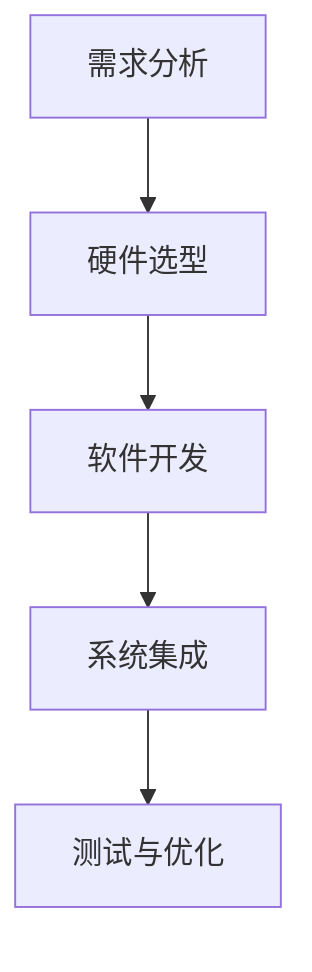
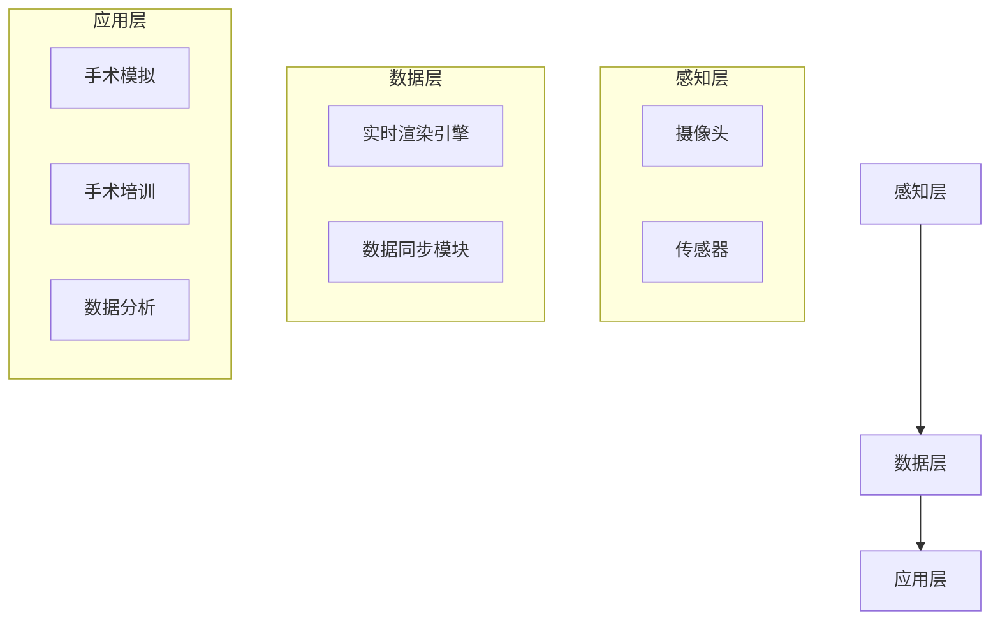
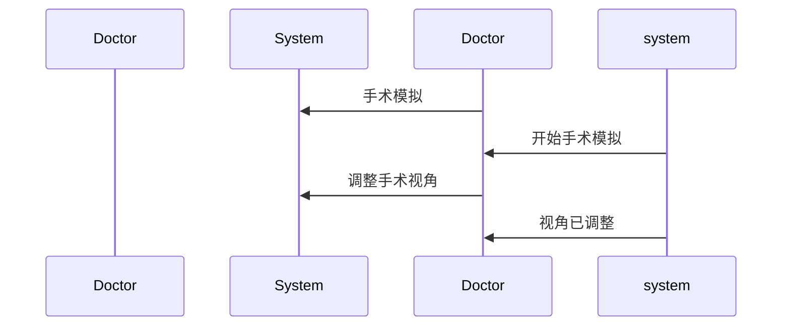

                 


### 混合现实体验实验室建设：虚拟与现实交融的研究中心创立

关键词：混合现实、实验室建设、研究中心、虚拟与现实融合

摘要：本文旨在深入探讨混合现实体验实验室的建设过程，以及如何创建一个专注于虚拟与现实交融的研究中心。文章将围绕混合现实的基本概念、技术实现、系统架构设计、实际项目实战等多个方面，通过逻辑清晰、结构紧凑的分析，为读者提供全面的指导和建议。

## 引言与背景

### 混合现实：虚拟与现实的交汇

混合现实（Mixed Reality，简称MR）是虚拟现实（Virtual Reality，VR）和增强现实（Augmented Reality，AR）的延伸，它不仅将数字内容叠加到真实世界中，还能够与用户进行互动，使其感觉如同真实存在的环境。MR技术的发展，源于计算机图形学、传感器技术、实时渲染算法等领域的进步。随着硬件设备的不断升级和算法的优化，MR正在逐渐从实验室走向市场，成为多个行业的重要技术支撑。

### 混合现实实验室建设：挑战与机遇

建设一个混合现实实验室，面临着诸多技术挑战，如高性能计算、数据同步、实时交互等。然而，这些挑战也带来了巨大的市场机遇。MR技术在医疗、教育、娱乐、军事等多个领域都有广泛应用前景，为企业和社会创造了巨大的价值。因此，投资建设混合现实实验室，不仅能够提升企业的技术实力，还能够开拓新的业务领域，具有很高的战略价值。

### 本书概述

本文将分为四个主要部分，首先介绍混合现实的基本概念和理论，接着探讨混合现实的技术实现和系统架构设计，然后通过实际项目实战，展示实验室建设的全过程，最后总结最佳实践，并提出未来发展趋势。

## 核心概念与理论

### 混合现实的定义与特点

混合现实（MR）是一种能够将数字内容与现实世界融合在一起，并允许用户与之互动的技术。与虚拟现实（VR）和增强现实（AR）相比，MR不仅将虚拟元素叠加到真实环境中，还能够与用户产生深层次的互动。以下是MR与VR、AR的主要区别：

| 特点 | 混合现实（MR） | 虚拟现实（VR） | 增强现实（AR） |
| --- | --- | --- | --- |
| 环境交互 | 深度交互 | 有限的交互 | 视觉上的叠加 |
| 内容融合 | 完全融合 | 完全虚拟 | 部分虚拟，部分现实 |
| 用户感知 | 感知与现实无缝融合 | 感知完全虚拟 | 感知部分虚拟，部分现实 |

### 核心理论与原则

混合现实的核心理论包括以下几个方面：

1. **感知融合**：通过传感器技术，捕捉现实环境中的视觉、听觉、触觉等信息，与虚拟内容进行融合，使用户感受到真实的交互体验。
2. **实时渲染**：利用高性能计算和实时渲染算法，实现虚拟内容与现实环境的同步更新，确保用户在互动过程中看到的是动态变化的场景。
3. **数据同步**：通过云计算和边缘计算等技术，实现大规模数据的实时传输和处理，保证虚拟内容与现实环境的同步性。

### 关键概念的关系与整合

为了更好地理解混合现实，我们需要了解其核心概念之间的关系，并如何进行整合。以下是混合现实的关键概念及其关系：

| 关键概念 | 描述 | 关系 |
| --- | --- | --- |
| **感知融合** | 捕获和融合现实与虚拟环境的信息。 | 是MR的基础。 |
| **实时渲染** | 在虚拟环境中进行实时渲染，实现逼真的视觉效果。 | 依赖于感知融合，是其实现的手段。 |
| **数据同步** | 保证虚拟内容与现实环境的同步更新。 | 与感知融合和实时渲染密切相关，是关键保障。 |

以下是一个Mermaid ER图，展示了混合现实的关键概念及其关系：

```mermaid
erDiagram
  感知融合 ||--|{ 实时渲染 }|
  感知融合 ||--|{ 数据同步 }|
  实时渲染 ||--|{ 感知融合 }|
  数据同步 ||--|{ 感知融合 }|
```

通过上述ER图，我们可以清晰地看到各个关键概念之间的联系和作用，有助于理解混合现实的工作原理。

## 技术实现与案例分析

### 硬件与软件要求

要建设一个混合现实实验室，首先需要具备相应的硬件和软件资源。以下是硬件和软件的要求：

**硬件要求**：

1. **高性能计算机**：用于处理复杂的计算任务，包括实时渲染、数据同步等。
2. **传感器设备**：包括摄像头、麦克风、红外传感器等，用于捕捉现实环境中的信息。
3. **显示设备**：如头戴式显示器（HMD）、交互设备等，用于展示虚拟内容和实现用户交互。
4. **网络设备**：包括交换机、路由器等，用于构建高速、稳定的网络环境。

**软件要求**：

1. **操作系统**：Linux或Windows，具有良好的兼容性和稳定性。
2. **开发环境**：如Unity、Unreal Engine等，用于创建和开发虚拟内容。
3. **实时渲染引擎**：如Vulkan、DirectX等，用于实现高效的图形渲染。
4. **传感器驱动程序**：用于支持各种传感器设备的采集和传输。

### 开发过程与工作流程

混合现实实验室的建设过程可以分为以下几个步骤：

1. **需求分析**：明确实验室的建设目标和需求，包括功能、性能、用户交互等方面。
2. **硬件选型**：根据需求选择合适的硬件设备，并进行配置和测试。
3. **软件开发**：使用开发工具和软件环境，编写应用程序，实现所需的功能。
4. **系统集成**：将各个硬件和软件组件整合在一起，实现协同工作。
5. **测试与优化**：对系统进行全面测试，并根据测试结果进行优化，确保系统的稳定性和性能。

以下是一个使用Mermaid绘制的MR实验室开发工作流程图：



### 案例分析

为了更好地理解混合现实实验室的建设过程，我们来看一个实际的案例——一家医疗公司建设的混合现实实验室，用于外科手术的模拟和培训。

**项目背景**：

该公司希望利用混合现实技术，为外科医生提供一个逼真的手术模拟平台，以提高手术技能和减少手术风险。

**项目介绍**：

该实验室包括以下几个关键部分：

1. **感知融合**：使用高精度摄像头和传感器，捕捉手术室的环境信息，包括光线、温度、湿度等。
2. **实时渲染**：使用Unity引擎，将虚拟手术场景实时渲染到头戴式显示器上，实现与医生的实时交互。
3. **数据同步**：通过云计算平台，将虚拟手术数据和实际手术数据同步，确保虚拟场景与现实环境的同步更新。

**系统功能设计**：

该实验室的主要功能包括：

1. **手术模拟**：医生可以在虚拟环境中进行手术操作，模拟真实的手术过程。
2. **手术培训**：医生可以通过虚拟场景进行手术技能的练习和培训。
3. **数据分析和反馈**：系统会实时记录手术操作数据，并进行分析和反馈，帮助医生改进手术技巧。

**系统架构设计**：

该实验室的系统架构包括以下几个部分：

1. **感知层**：包括摄像头、传感器等，用于捕捉现实环境信息。
2. **数据层**：包括实时渲染引擎、数据同步模块等，用于处理和传输数据。
3. **应用层**：包括手术模拟、手术培训、数据分析等功能模块，为医生提供操作平台。

以下是一个Mermaid绘制的系统架构图：



### 系统接口设计与交互

在混合现实实验室的建设中，系统接口设计和交互设计是至关重要的一环。以下是该系统的接口设计和交互设计：

**接口设计**：

1. **感知层接口**：用于传感器和摄像头的数据采集和传输。
2. **数据层接口**：用于实时渲染引擎和数据同步模块之间的数据交互。
3. **应用层接口**：用于医生与虚拟手术场景的交互。

**交互设计**：

1. **手势交互**：医生可以通过手势与虚拟场景进行交互，如操作手术工具、调整手术视角等。
2. **语音交互**：医生可以通过语音指令与系统进行交互，如启动手术模拟、查询手术数据等。

以下是一个使用Mermaid绘制的交互序列图：



### 实际项目实战

#### 环境安装

为了实现混合现实实验室，首先需要在服务器上安装相应的软件和配置环境。以下是一个简单的安装步骤：

1. 安装操作系统：选择Linux或Windows操作系统，并进行基本配置。
2. 安装开发环境：安装Unity、Unreal Engine等开发工具。
3. 安装实时渲染引擎：安装Vulkan、DirectX等实时渲染引擎。
4. 安装传感器驱动程序：安装摄像头、传感器等设备的驱动程序。

#### 系统核心实现

以下是一个简单的Python代码示例，用于实现混合现实实验室的核心功能：

```python
import cv2
import numpy as np

# 摄像头初始化
cap = cv2.VideoCapture(0)

while True:
    # 读取摄像头帧数据
    ret, frame = cap.read()
    
    # 转换为灰度图像
    gray = cv2.cvtColor(frame, cv2.COLOR_BGR2GRAY)
    
    # 显示图像
    cv2.imshow('Frame', gray)
    
    if cv2.waitKey(1) & 0xFF == ord('q'):
        break

# 释放摄像头资源
cap.release()
cv2.destroyAllWindows()
```

#### 代码应用解读与分析

上述Python代码实现了一个简单的摄像头捕捉功能，用于获取实时视频帧数据。以下是代码的解读和分析：

1. **摄像头初始化**：使用`cv2.VideoCapture(0)`初始化摄像头设备，0表示默认的摄像头。
2. **读取摄像头帧数据**：使用`cap.read()`读取摄像头帧数据，并将数据存储在`frame`变量中。
3. **灰度图像转换**：使用`cv2.cvtColor(frame, cv2.COLOR_BGR2GRAY)`将BGR格式图像转换为灰度图像。
4. **显示图像**：使用`cv2.imshow('Frame', gray)`显示灰度图像。
5. **释放摄像头资源**：在程序结束时，使用`cap.release()`释放摄像头资源。

#### 实际案例分析

以下是一个实际的混合现实项目案例——基于Unity引擎的虚拟手术模拟平台。

**项目场景**：

一个医疗公司开发了一款虚拟手术模拟平台，用于外科医生进行手术技能的练习和培训。平台主要包括以下几个模块：

1. **手术模拟**：医生可以在虚拟环境中进行手术操作，模拟真实的手术过程。
2. **手术培训**：医生可以通过虚拟场景进行手术技能的练习和培训。
3. **数据分析和反馈**：系统会实时记录手术操作数据，并进行分析和反馈，帮助医生改进手术技巧。

**项目实现**：

1. **场景搭建**：使用Unity引擎搭建虚拟手术场景，包括手术室、手术设备、患者模型等。
2. **交互设计**：通过Unity的UI系统设计交互界面，包括手术操作按钮、数据展示界面等。
3. **实时渲染**：使用Unity的实时渲染引擎，实现虚拟手术场景的渲染和更新。
4. **数据采集**：使用Unity的物理引擎和传感器数据，实时采集手术操作数据，如手术工具的位置、角度等。
5. **数据分析**：使用Python等编程语言，对手术操作数据进行处理和分析，生成反馈报告。

**项目小结**：

该项目实现了基于混合现实的虚拟手术模拟平台，通过实时渲染和数据分析，为外科医生提供了一个逼真的手术训练环境。项目的成功实施，不仅提高了医生的操作技能，还减少了手术风险，具有重要的临床意义。

### 最佳实践与注意事项

在混合现实实验室的建设过程中，以下是几个最佳实践和注意事项：

1. **性能优化**：在硬件和软件选择上，要充分考虑性能优化，确保系统的稳定性和响应速度。
2. **安全性保障**：在数据传输和处理过程中，要确保数据的安全性和隐私性，采取加密和权限控制等措施。
3. **用户培训**：定期对用户进行培训，提高他们对混合现实技术的理解和操作能力，确保系统的有效使用。
4. **持续更新**：随着技术的不断发展，要不断更新实验室的软硬件设备，保持系统的先进性和竞争力。

### 拓展阅读

1. **《混合现实技术：理论与实践》**：详细介绍了混合现实技术的理论基础和实践应用，适合对混合现实技术感兴趣的读者。
2. **《Unity 2020 从入门到精通》**：全面讲解了Unity引擎的使用方法，适合从事虚拟现实和增强现实开发的工程师。
3. **《计算机视觉与图像处理》**：深入探讨了计算机视觉和图像处理的相关技术，有助于理解混合现实实验室中的感知融合技术。

## 总结

本文通过逻辑清晰、结构紧凑的分析，深入探讨了混合现实体验实验室的建设过程，以及如何创建一个专注于虚拟与现实交融的研究中心。从核心概念和理论，到技术实现和系统架构设计，再到实际项目实战，我们系统地介绍了混合现实技术的发展和应用。希望通过本文，读者能够对混合现实技术有更深入的了解，并在实践中取得更好的成果。

### 作者信息

作者：AI天才研究院/AI Genius Institute & 禅与计算机程序设计艺术 /Zen And The Art of Computer Programming

