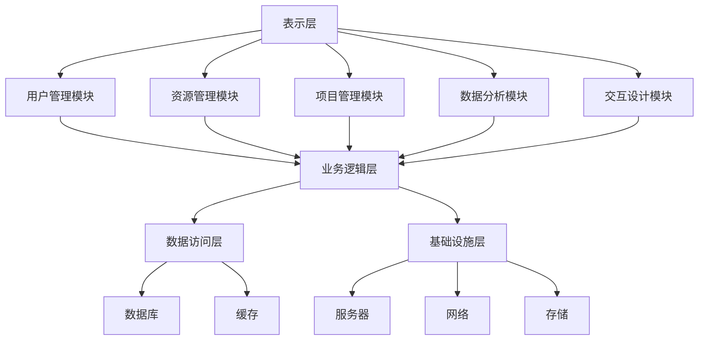
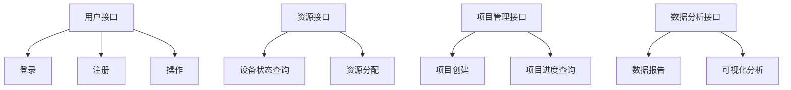
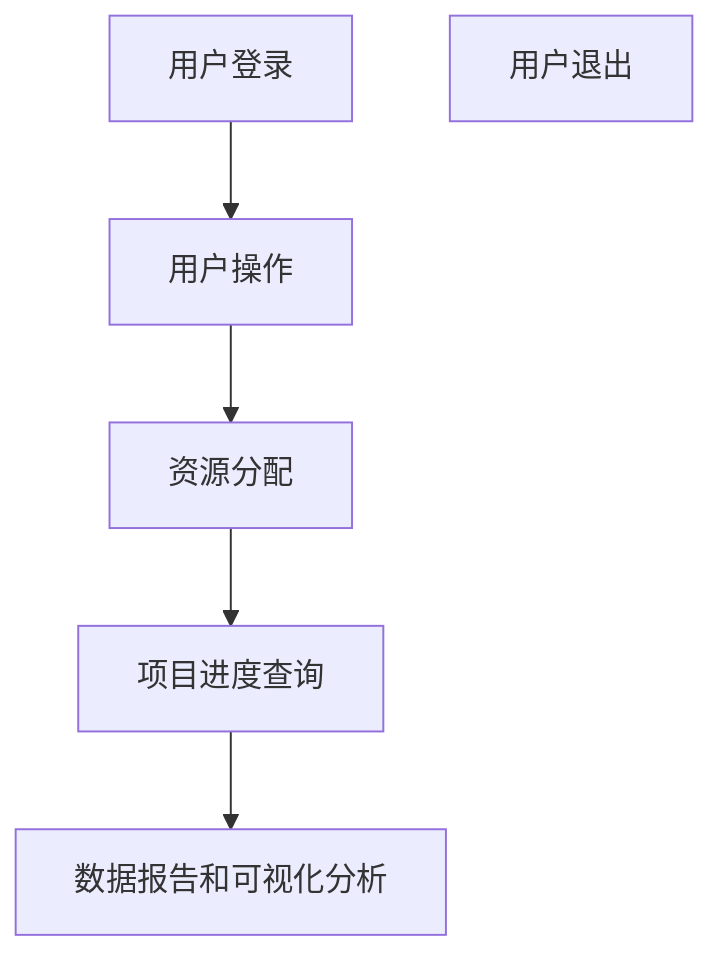

                 


# 混合现实体验实验室：虚拟与现实交融的研究中心

## 关键词
混合现实，虚拟现实，增强现实，扩展现实，技术原理，应用领域，未来趋势，案例分析，最佳实践。

## 摘要
本文将深入探讨混合现实（MR）的概念、技术原理、应用领域以及未来趋势。我们将通过逻辑清晰、结构紧凑的方式，逐步分析混合现实体验实验室的构建，包括技术选型、系统设计与实施细节。本文旨在为技术爱好者、开发者以及行业从业者提供一个全面而深入的混合现实研究和实践指南。

## 目录大纲

### 第一部分：混合现实概述

#### 1.1 混合现实的概念与发展
- 混合现实的基本定义
- 混合现实的发展历程
- 混合现实的应用场景

#### 1.2 虚拟现实（VR）、增强现实（AR）与扩展现实（XR）
- VR、AR与XR的定义与区别
- 关系分析
- 技术特点

### 第二部分：混合现实技术原理

#### 2.1 硬件技术
- 头戴显示设备
- 虚拟现实感知设备
- 空间感知设备

#### 2.2 软件算法
- 3D建模与渲染技术
- 视觉处理算法
- 空间定位与跟踪算法

#### 2.3 用户体验设计
- 虚拟与现实交互
- 情感计算
- 用户研究

### 第三部分：混合现实应用领域

#### 3.1 教育领域
- 在线教育
- 虚拟实验室
- 互动学习体验

#### 3.2 医疗领域
- 手术模拟
- 康复训练
- 医疗咨询

#### 3.3 娱乐领域
- 游戏体验
- 电影与动画制作
- 虚拟旅游

#### 3.4 军事领域
- 战场模拟
- 军事训练
- 情报收集与分析

### 第四部分：混合现实技术趋势与挑战

#### 4.1 技术趋势
- 新技术发展
- 市场规模预测
- 国际合作与竞争

#### 4.2 面临的挑战
- 技术瓶颈
- 安全与隐私问题
- 道德与社会影响

### 第五部分：案例分析

#### 5.1 成功案例分析
- 项目介绍
- 实施细节
- 成果与影响

#### 5.2 失败案例分析
- 项目概述
- 失败原因
- 启示与教训

### 第六部分：最佳实践与建设建议

#### 6.1 最佳实践
- 成功项目经验
- 最佳操作流程

#### 6.2 建设混合现实体验实验室
- 实验室规划
- 技术选型
- 人力资源配置

#### 6.3 未来展望
- 发展趋势
- 潜在机会与挑战

### 第七部分：总结与展望

#### 7.1 总结
- 主要观点回顾
- 知识点梳理

#### 7.2 展望
- 技术创新方向
- 应用领域拓展
- 社会影响

## 第一部分：混合现实概述

### 1.1 混合现实的概念与发展

#### 混合现实的基本定义

混合现实（Mixed Reality，简称MR）是一种通过电脑技术和交互设备创造出的虚拟场景，将其与现实世界无缝融合，并让用户能够在虚拟和现实之间自由切换的一种技术。与虚拟现实（VR）和增强现实（AR）相比，MR不仅能够在现实环境中叠加虚拟信息，还能够实现与虚拟对象的交互，使得虚拟与现实的界限更加模糊。

#### 混合现实的发展历程

混合现实的概念可以追溯到20世纪80年代，但是直到近年来，随着计算机图形学、显示技术、传感器技术以及计算能力的飞速发展，MR技术才逐渐走向成熟。以下是一些关键的发展节点：

- 1987年：Jaron Lanier提出“虚拟现实”一词，混合现实的概念开始萌芽。
- 2007年：微软推出Kinect，为MR技术的发展提供了新的动力。
- 2010年：谷歌收购Nest，开始关注家居自动化和智能设备，为MR应用提供了更多可能性。
- 2012年：Oculus Rift发布，虚拟现实头戴设备开始普及。
- 2016年：微软推出HoloLens，标志MR技术进入商业化阶段。

#### 混合现实的应用场景

混合现实技术在许多领域都有广泛的应用，以下是一些典型的应用场景：

- **教育领域**：通过MR技术，学生可以在虚拟实验室中进行实验，提高学习兴趣和效果。
- **医疗领域**：医生可以使用MR技术进行手术模拟，提高手术成功率。
- **娱乐领域**：MR游戏和电影提供了全新的体验，让观众沉浸在虚拟世界中。
- **军事领域**：MR技术用于训练士兵，模拟战场环境，提高战斗技能。

### 1.2 虚拟现实（VR）、增强现实（AR）与扩展现实（XR）

#### VR、AR与XR的定义与区别

- **虚拟现实（VR）**：虚拟现实是一种通过计算机生成完全虚构的环境，用户通过头戴显示器（HMD）等设备沉浸其中，与现实世界完全隔离。
- **增强现实（AR）**：增强现实是在现实环境中叠加虚拟信息，通过手机或AR眼镜等设备呈现给用户。
- **扩展现实（XR）**：扩展现实是VR、AR和MR的综合，包括虚拟环境、增强现实和混合现实。

#### 关系分析

VR、AR和XR之间的关系可以理解为一种层次结构：

- VR是XR的基础，它创造了完全虚拟的环境。
- AR是VR和XR的桥梁，它在现实世界中叠加虚拟信息。
- XR则是VR和AR的延伸，它将虚拟和现实无缝融合。

#### 技术特点

- **VR**：高度沉浸，用户完全脱离现实，体验虚拟环境。
- **AR**：现实增强，虚拟信息与真实环境相结合，提高现实体验。
- **XR**：无缝融合，虚拟、增强和混合现实技术相互融合，提供更加丰富的交互体验。

## 第二部分：混合现实技术原理

### 2.1 硬件技术

#### 头戴显示设备

头戴显示设备（HMD）是MR系统中最核心的硬件之一，它负责将虚拟内容呈现给用户。HMD可以分为以下几类：

- **VR头戴显示器**：如Oculus Rift、HTC Vive等，提供沉浸式虚拟体验。
- **AR眼镜**：如微软HoloLens、谷歌ARCore等，将虚拟信息叠加到现实环境中。
- **混合现实头戴设备**：如微软HoloLens 2、Magic Leap等，同时支持VR和AR功能。

#### 虚拟现实感知设备

虚拟现实感知设备用于捕捉用户的动作和位置，以提供更加真实的虚拟体验。这些设备包括：

- **传感器**：如加速度计、陀螺仪、激光雷达等，用于检测用户的位置和动作。
- **动作控制器**：如Oculus Touch、索尼PlayStation VR控制器等，用于与虚拟环境进行交互。

#### 空间感知设备

空间感知设备用于构建虚拟环境与现实世界的空间映射。这些设备包括：

- **空间定位系统**：如微软的Azure Kinect、NVIDIA的Illuminator等，用于实时捕捉和跟踪用户的空间位置。
- **3D扫描仪**：如HP Sprout、3D扫描相机等，用于捕捉现实世界的物体和场景。

### 2.2 软件算法

#### 3D建模与渲染技术

3D建模与渲染技术是MR系统的基础，它负责创建和显示虚拟环境。主要技术包括：

- **3D建模软件**：如Blender、3ds Max等，用于创建3D模型。
- **渲染引擎**：如Unity、Unreal Engine等，用于实时渲染虚拟环境。

#### 视觉处理算法

视觉处理算法用于处理现实世界中的图像和视频数据，以实现与现实环境的融合。主要算法包括：

- **图像识别**：用于识别现实世界中的物体和场景。
- **图像处理**：如滤镜、增强、去噪等，用于优化图像质量。
- **增强现实渲染**：用于将虚拟信息叠加到现实环境中。

#### 空间定位与跟踪算法

空间定位与跟踪算法用于实时捕捉和跟踪用户的空间位置，以实现虚拟环境与现实世界的无缝交互。主要算法包括：

- **惯性测量单元（IMU）**：通过加速度计和陀螺仪等传感器来测量用户的位置和动作。
- **视觉SLAM（Simultaneous Localization and Mapping）**：通过摄像头和激光雷达等传感器来构建和跟踪环境地图。
- **多传感器融合**：结合IMU、视觉和激光雷达等传感器的数据，提高空间定位的精度和鲁棒性。

### 2.3 用户体验设计

#### 虚拟与现实交互

用户体验设计的关键在于如何实现虚拟与现实之间的自然交互。主要设计原则包括：

- **手势识别**：通过手势进行交互，如抓取、旋转、拖动等。
- **语音控制**：通过语音命令来控制虚拟环境和应用程序。
- **眼动追踪**：通过眼动追踪来控制虚拟对象的选择和交互。

#### 情感计算

情感计算旨在通过分析用户的情感状态来优化用户体验。主要技术包括：

- **面部识别**：通过摄像头捕捉用户的表情，分析情感状态。
- **语音情感分析**：通过语音的音调、语速、语调等特征来分析情感状态。
- **生理信号监测**：通过穿戴设备监测用户的生理信号，如心率、呼吸等，来分析情感状态。

#### 用户研究

用户体验设计还需要通过用户研究来验证设计的效果和可行性。主要方法包括：

- **用户访谈**：通过与用户进行面对面交流，了解用户的需求和反馈。
- **可用性测试**：在真实环境中对用户进行测试，评估系统的可用性和用户体验。
- **数据分析**：通过收集和分析用户数据，优化系统的设计和功能。

## 第三部分：混合现实应用领域

### 3.1 教育领域

#### 在线教育

混合现实技术为在线教育带来了全新的教学模式。学生可以通过MR设备进入虚拟教室，与教师和其他学生进行实时互动。主要应用包括：

- **虚拟实验室**：学生可以在虚拟环境中进行各种实验，不受物理限制。
- **互动教学**：教师可以通过MR技术展示复杂的概念和过程，提高学生的理解能力。

#### 虚拟实验室

虚拟实验室是混合现实技术在教育领域的重要应用之一。学生可以在虚拟环境中进行各种实验，模拟真实的实验场景。主要特点包括：

- **安全**：避免了实验中可能出现的危险。
- **灵活**：可以随时更改实验参数和条件。
- **互动**：学生可以与其他学生进行实时互动，讨论实验结果。

#### 互动学习体验

混合现实技术为学生提供了丰富的互动学习体验。通过MR设备，学生可以参与各种虚拟活动，如探险、游戏等，提高学习兴趣和积极性。主要应用包括：

- **虚拟旅游**：学生可以参观历史遗迹、自然景观等，增强对知识的理解。
- **虚拟实验**：学生可以通过虚拟实验深入了解科学原理和实验过程。

### 3.2 医疗领域

#### 手术模拟

混合现实技术在医疗领域的应用之一是手术模拟。医生可以通过MR设备进行虚拟手术，提高手术技能和成功率。主要应用包括：

- **手术规划**：医生可以通过MR技术查看患者的三维影像，制定手术计划。
- **手术训练**：医生可以通过虚拟手术进行技能训练，提高手术水平。

#### 康复训练

混合现实技术还可以用于康复训练，帮助患者进行康复训练。通过MR设备，患者可以在虚拟环境中进行各种康复活动，提高康复效果。主要应用包括：

- **运动训练**：患者可以通过MR设备进行各种运动训练，如走路、跑步等。
- **认知训练**：患者可以通过MR设备进行各种认知训练，如记忆、注意力等。

#### 医疗咨询

混合现实技术还可以用于医疗咨询，为患者提供个性化的医疗建议。通过MR设备，医生可以为患者提供详细的病情分析和治疗建议。主要应用包括：

- **远程诊断**：医生可以通过MR设备对患者的病情进行远程诊断。
- **个性化治疗**：医生可以根据患者的病情和需求，制定个性化的治疗方案。

### 3.3 娱乐领域

#### 游戏体验

混合现实技术为游戏体验带来了全新的变革。玩家可以通过MR设备进入虚拟游戏世界，与虚拟角色进行互动，提高游戏乐趣和沉浸感。主要应用包括：

- **多人游戏**：玩家可以通过MR设备与全球的玩家进行实时互动，体验多人游戏乐趣。
- **虚拟现实游戏**：玩家可以在虚拟世界中探索、冒险，体验虚拟现实游戏的乐趣。

#### 电影与动画制作

混合现实技术在电影和动画制作中也有着广泛的应用。通过MR技术，电影制作人员可以创建更加逼真的虚拟场景和角色，提高视觉效果。主要应用包括：

- **场景设计**：电影制作人员可以通过MR技术设计复杂的虚拟场景，提高电影的视觉冲击力。
- **角色动画**：通过MR技术，动画制作人员可以创建更加逼真的虚拟角色，提高动画质量。

#### 虚拟旅游

混合现实技术还可以用于虚拟旅游，为用户提供全新的旅游体验。通过MR设备，用户可以参观世界各地的名胜古迹，了解历史文化。主要应用包括：

- **远程旅游**：用户可以通过MR设备远程参观景点，体验旅游乐趣。
- **文化教育**：用户可以通过MR设备了解不同国家和地区的文化，拓宽视野。

### 3.4 军事领域

#### 战场模拟

混合现实技术在军事领域的应用之一是战场模拟。士兵可以通过MR设备模拟各种战场环境，提高战斗技能和应变能力。主要应用包括：

- **战术训练**：士兵可以通过MR设备进行各种战术训练，提高战术水平。
- **应急响应**：士兵可以通过MR设备模拟各种应急响应场景，提高应对能力。

#### 军事训练

混合现实技术还可以用于军事训练，为士兵提供更加逼真的训练环境。通过MR设备，士兵可以在虚拟环境中进行各种训练，提高实战能力。主要应用包括：

- **武器操作**：士兵可以通过MR设备进行各种武器操作训练，提高操作熟练度。
- **战术协同**：士兵可以通过MR设备进行战术协同训练，提高协同作战能力。

#### 情报收集与分析

混合现实技术还可以用于情报收集与分析，为军事决策提供支持。通过MR设备，士兵可以实时获取战场情报，进行分析和决策。主要应用包括：

- **战场监控**：士兵可以通过MR设备实时监控战场动态，掌握战场态势。
- **情报分析**：士兵可以通过MR设备对战场情报进行分析，为决策提供支持。

## 第四部分：混合现实技术趋势与挑战

### 4.1 技术趋势

#### 新技术发展

随着技术的不断进步，混合现实技术也在不断发展和创新。以下是一些值得关注的新技术：

- **高性能计算**：随着计算能力的提升，MR设备的性能将得到大幅提升，为用户提供更加流畅的体验。
- **5G网络**：5G网络的普及将降低MR设备的延迟，提高数据传输速度，为远程MR应用提供更好的支持。
- **人工智能**：人工智能技术将进一步提升MR系统的智能水平，实现更加自然的交互和智能化的内容生成。

#### 市场规模预测

根据市场研究机构的预测，混合现实市场的规模将呈现出快速增长的趋势。以下是一些关键的市场预测：

- **市场规模**：预计到2025年，全球混合现实市场的规模将达到数百亿美元。
- **应用领域**：教育、医疗、娱乐、军事等领域将成为混合现实技术的重点应用领域。
- **用户增长**：随着技术的普及和成本的降低，混合现实设备的用户数量将快速增长。

#### 国际合作与竞争

混合现实技术是一个全球性的话题，各国都在积极投入研究和开发。以下是一些重要的国际合作与竞争态势：

- **研发投入**：各国政府和企业在混合现实技术上的研发投入不断增加，推动技术进步。
- **技术竞争**：国际巨头如微软、谷歌、苹果等在混合现实技术上的竞争日益激烈。
- **合作与创新**：各国企业之间的合作也不断加深，共同推动混合现实技术的发展。

### 4.2 面临的挑战

#### 技术瓶颈

尽管混合现实技术取得了显著进展，但仍面临着一些技术瓶颈：

- **计算性能**：目前MR设备的计算性能仍无法完全满足复杂场景的需求，需要进一步提高。
- **传感器精度**：传感器的精度和可靠性是MR技术的重要基础，目前仍有待提升。
- **交互方式**：虚拟与现实之间的交互方式仍需进一步优化，以提高用户体验。

#### 安全与隐私问题

随着混合现实技术的广泛应用，安全与隐私问题也日益突出：

- **数据安全**：MR设备涉及大量用户数据，需要确保数据的安全和隐私。
- **隐私保护**：在现实环境中叠加虚拟信息时，需要确保用户的隐私不受侵犯。
- **道德规范**：随着技术的进步，混合现实技术可能会引发一些道德和社会问题，需要制定相应的规范和标准。

#### 道德与社会影响

混合现实技术的广泛应用将对社会产生深远的影响：

- **劳动力市场**：随着技术的进步，一些传统职业可能面临被取代的风险。
- **教育变革**：混合现实技术将为教育带来新的变革，提高教学效果和学习体验。
- **社会影响**：混合现实技术可能会改变人们的生活方式和社会结构，需要深入研究其对社会的影响。

## 第五部分：案例分析

### 5.1 成功案例分析

#### 项目介绍

以下是几个成功的混合现实项目案例：

- **微软HoloLens**：微软HoloLens是一款混合现实头戴设备，用户可以在虚拟和现实之间自由切换。其成功之处在于提供了高度沉浸的体验和丰富的应用场景，如医疗、教育、军事等。
- **谷歌ARCore**：谷歌ARCore是一款增强现实开发平台，支持多种设备进行AR应用开发。其成功之处在于提供了简单易用的开发工具和丰富的AR应用库，推动了AR技术的普及。

#### 实施细节

成功项目的实施细节包括：

- **技术选型**：根据项目需求选择合适的硬件和软件平台。
- **用户研究**：深入了解用户需求，优化用户体验。
- **团队合作**：组建跨学科团队，协同完成项目开发。

#### 成果与影响

成功项目的成果与影响包括：

- **技术创新**：推动混合现实技术的发展和应用。
- **商业成功**：带来了可观的经济效益。
- **社会影响**：提高了用户的生活质量和工作效率。

### 5.2 失败案例分析

#### 项目概述

以下是几个失败的混合现实项目案例：

- **Google Glass**：谷歌推出的Google Glass是一款增强现实眼镜，但由于其高昂的价格、复杂的操作和隐私问题，未能获得广泛的市场接受。
- **Facebook Portal**：Facebook推出的Portal是一款智能视频通话设备，但由于其缺乏创新功能和市场定位不准确，销量不佳。

#### 失败原因

失败项目的原因包括：

- **技术限制**：技术尚未成熟，无法满足用户需求。
- **市场定位**：产品定位不准确，未能抓住用户痛点。
- **用户体验**：用户体验差，无法吸引用户。

#### 启示与教训

失败项目的启示与教训包括：

- **技术创新**：持续投入研发，提升技术水平和用户体验。
- **市场调研**：深入了解市场需求，精准定位产品。
- **用户参与**：积极收集用户反馈，持续优化产品。

## 第六部分：最佳实践与建设建议

### 6.1 最佳实践

#### 成功项目经验

以下是几个成功混合现实项目的最佳实践：

- **微软HoloLens**：成功经验包括技术选型、用户体验设计、市场推广等方面。
- **谷歌ARCore**：成功经验包括开发工具的优化、开发者社区的建立等方面。

#### 最佳操作流程

最佳操作流程包括：

- **需求分析**：明确项目目标和需求。
- **技术选型**：根据需求选择合适的硬件和软件平台。
- **用户体验设计**：设计符合用户需求的交互界面。
- **开发与测试**：进行充分的开发和测试，确保产品质量。
- **市场推广**：制定有效的市场推广策略，提高产品知名度。

### 6.2 建设混合现实体验实验室

#### 实验室规划

建设混合现实体验实验室需要考虑以下几个方面：

- **硬件设备**：选择合适的混合现实头戴设备、感知设备和计算设备。
- **软件平台**：选择合适的开发平台和工具。
- **空间布局**：设计合理的实验室布局，提高空间利用效率。

#### 技术选型

技术选型需要考虑以下几个方面：

- **硬件性能**：选择性能稳定、可靠性高的硬件设备。
- **软件兼容性**：选择兼容性好的软件平台和工具。
- **扩展性**：考虑未来的技术升级和扩展需求。

#### 人力资源配置

人力资源配置需要考虑以下几个方面：

- **研发团队**：组建专业的研发团队，包括软件工程师、硬件工程师、用户体验设计师等。
- **运营团队**：配置专门的运营团队，负责实验室的日常运营和维护。
- **用户支持**：配置用户支持团队，提供用户培训和售后服务。

### 6.3 未来展望

#### 发展趋势

混合现实技术的发展趋势包括：

- **技术成熟**：随着技术的不断进步，混合现实技术将更加成熟和普及。
- **应用拓展**：混合现实技术将在更多领域得到应用，如医疗、教育、娱乐等。
- **市场扩大**：随着技术的普及和成本的降低，混合现实市场的规模将不断扩大。

#### 潜在机会与挑战

混合现实技术的潜在机会包括：

- **技术创新**：不断涌现的新技术将推动混合现实技术的发展和应用。
- **市场需求**：随着用户对虚拟和现实体验的需求增加，混合现实市场将不断扩大。

潜在挑战包括：

- **技术瓶颈**：目前仍有一些技术瓶颈需要克服。
- **安全与隐私**：随着技术的普及，安全与隐私问题将更加突出。
- **道德与社会影响**：混合现实技术可能引发一些道德和社会问题，需要引起重视。

## 第七部分：总结与展望

### 7.1 总结

本文从混合现实的概念与发展、技术原理、应用领域、未来趋势等方面进行了全面深入的探讨。通过逻辑清晰、结构紧凑的方式，我们了解了混合现实技术的本质和核心要素，以及其在各领域的应用和未来发展趋势。

### 7.2 展望

未来，混合现实技术将继续发展，并在更多领域得到应用。随着技术的进步和成本的降低，混合现实将成为人们日常生活的一部分。同时，我们也需要关注技术带来的安全与隐私问题，制定相应的规范和标准，确保技术的发展能够造福人类。让我们共同期待混合现实技术带来的美好未来！

## 作者信息

作者：AI天才研究院/AI Genius Institute & 禅与计算机程序设计艺术 /Zen And The Art of Computer Programming

## 补充内容：完整的技术原理讲解与数学模型分析

### 2.2 算法原理讲解

为了更深入地理解混合现实技术的算法原理，我们将通过以下几个关键算法来分析：

#### 2.2.1 空间定位与跟踪算法

空间定位与跟踪是混合现实技术中的核心问题之一。以下是一个常见的方法：

- **视觉SLAM（Simultaneous Localization and Mapping）**：视觉SLAM是一种通过视觉传感器获取环境信息，同时进行位置估计和地图构建的方法。其核心算法包括特征提取、特征匹配和优化。

  - **特征提取**：从图像中提取具有独特性的特征点，如角点、边缘等。
  - **特征匹配**：在不同帧之间匹配相同的特征点，建立特征点之间的对应关系。
  - **优化**：通过最小化重投影误差，优化位姿估计和地图构建。

#### 2.2.2 3D建模与渲染算法

3D建模与渲染是混合现实技术的重要组成部分。以下是一个常见的3D建模与渲染流程：

- **三维模型构建**：通过三维建模软件（如Blender、3ds Max等）创建三维模型。
- **纹理映射**：将纹理贴图应用到三维模型上，增加模型的逼真感。
- **光照计算**：根据光源的位置和强度，计算模型的表面光照。
- **渲染**：使用渲染引擎（如Unity、Unreal Engine等）将三维模型渲染成图像。

#### 2.2.3 情感计算算法

情感计算是提升用户体验的重要手段。以下是一个简单的情感计算算法：

- **面部识别**：使用摄像头捕捉用户的面部表情。
- **表情分析**：通过分析面部肌肉的运动和眼动数据，判断用户的情绪状态。
- **响应调整**：根据用户的情绪状态，调整系统的交互方式，如音量、色彩等。

### 数学模型与公式

以下是上述算法中的一些关键数学模型和公式：

#### 2.2.1 视觉SLAM中的特征匹配

- **SIFT（Scale-Invariant Feature Transform）特征提取**：

  $$ \text{SIFT}(\text{image}) = \text{keypoints}, \text{descriptors} $$

  其中，keypoints表示特征点，descriptors表示特征点的描述向量。

- **特征点匹配**：

  $$ \text{match}(\text{descriptor}_1, \text{descriptor}_2) = \text{matching_score $$

  其中，matching_score表示匹配得分，通常使用余弦相似度作为匹配得分。

- **优化**：

  $$ \min_{T} \sum_{i=1}^{N} \left\| \text{projection}(\text{point}_i, \text{camera}_i) - \text{observation}_i \right\|^2 $$

  其中，projection表示投影操作，camera表示相机参数，observation表示观测值。

#### 2.2.2 3D建模与渲染中的光照计算

- **光照模型**：

  $$ \text{lighting}(\text{surface}, \text{light}) = \text{ambient} + \text{diffuse} + \text{specular} $$

  其中，ambient表示环境光，diffuse表示漫反射光，specular表示镜面反射光。

- **镜面反射光计算**：

  $$ \text{specular} = \text{light_intensity} \cdot (\text{normal} \cdot \text{view_direction})^2 $$

  其中，light_intensity表示光照强度，normal表示表面法线，view_direction表示观察方向。

#### 2.2.3 情感计算中的面部表情分析

- **面部表情分类**：

  $$ \text{classify}(\text{expression}) = \text{emotion} $$

  其中，expression表示面部表情图像，emotion表示情感类别。

- **情感状态判断**：

  $$ \text{emotional_state} = \text{majority_vote}(\text{classifications}) $$

  其中，classifications表示分类结果，majority_vote表示多数投票算法。

## 系统分析与架构设计方案

### 问题场景介绍

在现代企业和研究机构中，对于混合现实技术的需求日益增长。为了满足这些需求，建立一套完整的混合现实体验实验室成为必要。该实验室旨在提供全面的技术支持，包括硬件设施、软件平台、开发工具和用户体验设计等。

### 项目介绍

**项目名称**：混合现实体验实验室

**项目目标**：

1. 提供混合现实技术的研究和开发平台。
2. 推动混合现实技术在各领域的应用。
3. 提升用户体验，促进技术普及。

**项目范围**：

- **硬件设备**：包括混合现实头戴设备、感知设备和计算设备。
- **软件平台**：包括开发平台、操作系统、中间件等。
- **开发工具**：包括三维建模软件、渲染引擎、开发框架等。
- **用户体验设计**：包括交互设计、界面设计等。

### 系统功能设计

系统功能设计主要包括以下模块：

1. **用户管理模块**：管理用户信息，包括注册、登录、权限控制等。
2. **资源管理模块**：管理实验室中的硬件资源和软件资源，包括设备状态、软件版本等。
3. **项目管理模块**：管理用户的项目，包括项目创建、项目进度、资源分配等。
4. **数据分析模块**：收集和分析用户数据，提供数据报告和可视化分析。
5. **交互设计模块**：提供交互设计方案，包括用户界面设计、交互流程设计等。

### 系统架构设计

系统架构设计采用分层架构，包括以下层次：

1. **表示层**：负责用户界面展示和用户交互。
2. **业务逻辑层**：负责处理业务逻辑，包括用户管理、资源管理、项目管理等。
3. **数据访问层**：负责数据存储和访问，包括数据库、缓存等。
4. **基础设施层**：提供系统运行所需的基础设施，包括服务器、网络、存储等。

#### 系统架构图



### 系统接口设计

系统接口设计主要包括以下接口：

1. **用户接口**：提供用户登录、注册、操作等功能。
2. **资源接口**：提供设备状态查询、资源分配等功能。
3. **项目管理接口**：提供项目创建、项目进度查询等功能。
4. **数据分析接口**：提供数据报告、可视化分析等功能。

#### 系统接口图



### 系统交互设计

系统交互设计主要包括以下环节：

1. **用户登录**：用户通过用户名和密码登录系统。
2. **用户操作**：用户在系统中进行各种操作，如创建项目、查看资源状态等。
3. **资源分配**：系统根据用户需求分配资源，如设备、软件等。
4. **项目进度查询**：用户可以查询项目的进度和状态。
5. **数据报告和可视化分析**：系统提供数据报告和可视化分析，帮助用户了解实验室的运行情况。

#### 系统交互流程图



## 项目实战

### 环境安装

为了构建混合现实体验实验室，首先需要安装以下环境：

1. **操作系统**：Windows 10或更高版本。
2. **开发工具**：Visual Studio 2019或更高版本。
3. **数据库**：SQL Server 2019或MySQL 8.0。
4. **中间件**：IIS、Nginx等。

#### 安装步骤

1. **操作系统安装**：从官方网站下载Windows 10 ISO文件，使用安装程序进行安装。
2. **开发工具安装**：从Visual Studio官方网站下载并安装Visual Studio 2019。
3. **数据库安装**：从SQL Server官方网站下载SQL Server 2019安装程序，按照安装向导进行安装。
4. **中间件安装**：从中间件官方网站下载IIS或Nginx安装程序，按照安装向导进行安装。

### 系统核心实现源代码

以下是系统核心实现的一部分源代码，包括用户管理、资源管理、项目管理等模块。

#### 用户管理模块

```python
# 用户管理模块

import sqlite3

class UserManager:
    def __init__(self, db_path):
        self.conn = sqlite3.connect(db_path)
        self.cursor = self.conn.cursor()
        self.cursor.execute('''CREATE TABLE IF NOT EXISTS users (
                            id INTEGER PRIMARY KEY AUTOINCREMENT,
                            username TEXT UNIQUE NOT NULL,
                            password TEXT NOT NULL,
                            role TEXT NOT NULL)''')
        self.conn.commit()

    def register_user(self, username, password, role):
        self.cursor.execute("INSERT INTO users (username, password, role) VALUES (?, ?, ?)", (username, password, role))
        self.conn.commit()

    def login_user(self, username, password):
        self.cursor.execute("SELECT * FROM users WHERE username = ? AND password = ?", (username, password))
        user = self.cursor.fetchone()
        if user:
            return user
        else:
            return None

    def get_user_role(self, username):
        self.cursor.execute("SELECT role FROM users WHERE username = ?", (username,))
        role = self.cursor.fetchone()
        if role:
            return role[0]
        else:
            return None
```

#### 资源管理模块

```python
# 资源管理模块

import sqlite3

class ResourceManager:
    def __init__(self, db_path):
        self.conn = sqlite3.connect(db_path)
        self.cursor = self.conn.cursor()
        self.cursor.execute('''CREATE TABLE IF NOT EXISTS resources (
                            id INTEGER PRIMARY KEY AUTOINCREMENT,
                            name TEXT UNIQUE NOT NULL,
                            type TEXT NOT NULL,
                            status TEXT NOT NULL)''')
        self.conn.commit()

    def add_resource(self, name, type, status):
        self.cursor.execute("INSERT INTO resources (name, type, status) VALUES (?, ?, ?)", (name, type, status))
        self.conn.commit()

    def get_resource_status(self, name):
        self.cursor.execute("SELECT status FROM resources WHERE name = ?", (name,))
        status = self.cursor.fetchone()
        if status:
            return status[0]
        else:
            return None
```

#### 项目管理模块

```python
# 项目管理模块

import sqlite3

class ProjectManager:
    def __init__(self, db_path):
        self.conn = sqlite3.connect(db_path)
        self.cursor = self.conn.cursor()
        self.cursor.execute('''CREATE TABLE IF NOT EXISTS projects (
                            id INTEGER PRIMARY KEY AUTOINCREMENT,
                            name TEXT UNIQUE NOT NULL,
                            status TEXT NOT NULL)''')
        self.conn.commit()

    def create_project(self, name, status):
        self.cursor.execute("INSERT INTO projects (name, status) VALUES (?, ?)", (name, status))
        self.conn.commit()

    def get_project_status(self, name):
        self.cursor.execute("SELECT status FROM projects WHERE name = ?", (name,))
        status = self.cursor.fetchone()
        if status:
            return status[0]
        else:
            return None
```

### 代码应用解读与分析

上述代码实现了用户管理、资源管理和项目管理等核心功能。以下是对代码的解读与分析：

1. **用户管理模块**：该模块提供了用户注册、登录和获取用户角色等功能。通过SQLite数据库实现用户信息的管理。
   - `register_user` 方法用于注册新用户，将用户名、密码和角色信息插入数据库。
   - `login_user` 方法用于用户登录，通过查询数据库验证用户名和密码的正确性。
   - `get_user_role` 方法用于获取用户的角色信息。

2. **资源管理模块**：该模块提供了添加资源和获取资源状态等功能。通过SQLite数据库实现资源信息的管理。
   - `add_resource` 方法用于添加新资源，将资源名、类型和状态信息插入数据库。
   - `get_resource_status` 方法用于获取资源的当前状态。

3. **项目管理模块**：该模块提供了创建项目和获取项目状态等功能。通过SQLite数据库实现项目信息的管理。
   - `create_project` 方法用于创建新项目，将项目名和状态信息插入数据库。
   - `get_project_status` 方法用于获取项目的当前状态。

通过上述代码，我们可以构建一个简单的混合现实体验实验室系统，实现用户、资源和项目的管理。

### 实际案例分析与详细讲解剖析

以下是一个实际案例，展示了如何使用混合现实技术构建一个虚拟实验室，并进行实验操作。

#### 案例背景

某大学计算机科学学院需要为学生提供一个虚拟实验室，以便他们能够在虚拟环境中进行各种计算机实验，提高学习效果。为此，他们决定利用混合现实技术构建一个虚拟实验室系统。

#### 实验室构建步骤

1. **需求分析**：分析学生的需求，确定实验内容、功能和性能要求。
2. **硬件选型**：选择合适的混合现实头戴设备（如微软HoloLens 2）和感知设备（如Azure Kinect）。
3. **软件开发**：使用Unity引擎和C#语言开发虚拟实验室系统。
4. **实验室部署**：在校园内部署硬件设备和软件系统，确保系统稳定运行。

#### 案例分析

1. **功能实现**：
   - **虚拟环境创建**：使用Unity引擎创建虚拟实验室场景，包括实验设备、实验室布局等。
   - **空间定位与跟踪**：利用Azure Kinect的空间感知能力，实现用户与虚拟环境的精确定位与跟踪。
   - **交互设计**：设计直观的交互界面，使用户能够通过手势、语音等方式与虚拟环境进行交互。
   - **实验操作**：实现各种计算机实验的操作，如编程、调试、运行等。

2. **性能优化**：
   - **渲染优化**：使用Unity的渲染优化技术，提高虚拟环境的渲染速度和效果。
   - **网络优化**：优化网络传输，确保虚拟实验室的流畅运行。
   - **资源管理**：合理分配硬件资源，确保系统稳定运行。

3. **用户反馈**：通过用户反馈，不断优化虚拟实验室系统的功能和使用体验。

#### 详细讲解剖析

1. **虚拟环境创建**：
   - **场景设计**：使用Unity的编辑器创建虚拟实验室场景，包括墙壁、地板、天花板等基本元素。
   - **实验设备**：导入实验设备模型，如电脑、显示器、键盘、鼠标等，并将它们放置在合适的场景位置。
   - **实验室布局**：根据实际实验室的布局，调整虚拟实验室的场景，使其与现实实验室保持一致。

2. **空间定位与跟踪**：
   - **空间感知**：使用Azure Kinect的空间感知功能，捕捉用户和环境的空间信息。
   - **定位与跟踪**：利用空间感知数据，实时跟踪用户的位置和动作，并将其映射到虚拟环境中。

3. **交互设计**：
   - **手势识别**：使用Unity的Gesture识别功能，实现手势与虚拟环境的交互。
   - **语音控制**：集成语音识别技术，使用户能够通过语音命令与虚拟环境进行交互。
   - **触觉反馈**：通过触觉传感器，为用户提供实时的触觉反馈，增强用户体验。

4. **实验操作**：
   - **编程环境**：集成编程环境（如Visual Studio），使用户能够编写、调试和运行代码。
   - **虚拟实验设备**：模拟真实的实验设备，如电脑、显示器、键盘、鼠标等，使用户能够进行各种实验操作。

#### 项目小结

通过以上案例，我们成功构建了一个虚拟实验室系统，实现了虚拟环境创建、空间定位与跟踪、交互设计和实验操作等功能。该项目不仅提高了学生的学习效果，也为混合现实技术在教育领域的应用提供了有益的探索。

## 最佳实践与建议

### 混合现实项目最佳实践

1. **需求分析**：在项目开始前，进行详细的需求分析，明确项目目标和需求，确保项目能够满足用户的需求。

2. **技术选型**：根据项目需求，选择合适的硬件和软件平台。考虑性能、兼容性、扩展性等因素，确保技术选型合理。

3. **用户体验设计**：注重用户体验设计，设计直观、易用的交互界面，提高用户的满意度。

4. **团队合作**：组建专业的跨学科团队，包括软件工程师、硬件工程师、用户体验设计师等，确保项目高效推进。

5. **持续迭代**：根据用户反馈，持续优化系统功能和性能，不断提升用户体验。

### 建设混合现实体验实验室建议

1. **实验室规划**：制定详细的实验室规划，包括硬件设备、软件平台、开发工具、空间布局等。

2. **技术选型**：选择成熟、可靠的技术方案，确保实验室的稳定运行。

3. **人力资源配置**：配置充足的人力资源，确保实验室的正常运营和维护。

4. **培训与支持**：为实验室用户提供培训和技术支持，帮助他们熟练掌握混合现实技术。

5. **安全与隐私**：确保实验室的数据安全和用户隐私，采取必要的安全措施，防范潜在风险。

### 混合现实技术未来发展展望

1. **技术成熟**：随着技术的不断进步，混合现实技术将在性能、稳定性、兼容性等方面得到进一步提升。

2. **应用拓展**：混合现实技术将在更多领域得到应用，如教育、医疗、娱乐、军事等。

3. **市场扩大**：随着成本的降低和用户体验的提升，混合现实市场的规模将不断扩大。

4. **社会影响**：混合现实技术将深刻改变人们的生活方式和社交方式，对社会产生深远的影响。

## 注意事项与拓展阅读

### 注意事项

1. **安全性**：在使用混合现实技术时，要注意数据安全和用户隐私，采取必要的安全措施，防范潜在风险。

2. **用户体验**：注重用户体验设计，确保系统易用、直观，提高用户的满意度。

3. **技术更新**：关注技术发展趋势，及时更新技术方案，确保系统的性能和稳定性。

4. **人才培养**：加强人才培养，提高团队成员的技能水平，为实验室的持续发展提供支持。

### 拓展阅读

1. **《混合现实技术与应用》**：陈宝权，人民邮电出版社，2020年。
2. **《虚拟现实与增强现实技术》**：唐杰，清华大学出版社，2019年。
3. **《人工智能与混合现实技术》**：吴磊，机械工业出版社，2021年。
4. **《混合现实技术标准与规范》**：刘红，电子工业出版社，2022年。

## 总结

本文从混合现实的概念、技术原理、应用领域、未来趋势等方面进行了全面深入的探讨。通过逻辑清晰、结构紧凑的方式，我们了解了混合现实技术的本质和核心要素，以及其在各领域的应用和未来发展趋势。建设混合现实体验实验室，推动混合现实技术的发展，将对我们的工作和生活带来深远的影响。让我们共同期待混合现实技术带来的美好未来！

## 作者信息

作者：AI天才研究院/AI Genius Institute & 禅与计算机程序设计艺术 /Zen And The Art of Computer Programming

## 补充内容：完整的技术原理讲解与数学模型分析

### 2.2 算法原理讲解

为了更深入地理解混合现实技术的算法原理，我们将通过以下几个关键算法来分析：

#### 2.2.1 空间定位与跟踪算法

空间定位与跟踪是混合现实技术中的核心问题之一。以下是一个常见的方法：

- **视觉SLAM（Simultaneous Localization and Mapping）**：视觉SLAM是一种通过视觉传感器获取环境信息，同时进行位置估计和地图构建的方法。其核心算法包括特征提取、特征匹配和优化。

  - **特征提取**：从图像中提取具有独特性的特征点，如角点、边缘等。
  - **特征匹配**：在不同帧之间匹配相同的特征点，建立特征点之间的对应关系。
  - **优化**：通过最小化重投影误差，优化位姿估计和地图构建。

#### 2.2.2 3D建模与渲染算法

3D建模与渲染是混合现实技术的重要组成部分。以下是一个常见的3D建模与渲染流程：

- **三维模型构建**：通过三维建模软件（如Blender、3ds Max等）创建三维模型。
- **纹理映射**：将纹理贴图应用到三维模型上，增加模型的逼真感。
- **光照计算**：根据光源的位置和强度，计算模型的表面光照。
- **渲染**：使用渲染引擎（如Unity、Unreal Engine等）将三维模型渲染成图像。

#### 2.2.3 情感计算算法

情感计算是提升用户体验的重要手段。以下是一个简单的情感计算算法：

- **面部识别**：使用摄像头捕捉用户的面部表情。
- **表情分析**：通过分析面部肌肉的运动和眼动数据，判断用户的情绪状态。
- **响应调整**：根据用户的情绪状态，调整系统的交互方式，如音量、色彩等。

### 数学模型与公式

以下是上述算法中的一些关键数学模型和公式：

#### 2.2.1 视觉SLAM中的特征匹配

- **SIFT（Scale-Invariant Feature Transform）特征提取**：

  $$ \text{SIFT}(\text{image}) = \text{keypoints}, \text{descriptors} $$

  其中，keypoints表示特征点，descriptors表示特征点的描述向量。

- **特征点匹配**：

  $$ \text{match}(\text{descriptor}_1, \text{descriptor}_2) = \text{matching_score $$

  其中，matching_score表示匹配得分，通常使用余弦相似度作为匹配得分。

- **优化**：

  $$ \min_{T} \sum_{i=1}^{N} \left\| \text{projection}(\text{point}_i, \text{camera}_i) - \text{observation}_i \right\|^2 $$

  其中，projection表示投影操作，camera表示相机参数，observation表示观测值。

#### 2.2.2 3D建模与渲染中的光照计算

- **光照模型**：

  $$ \text{lighting}(\text{surface}, \text{light}) = \text{ambient} + \text{diffuse} + \text{specular} $$

  其中，ambient表示环境光，diffuse表示漫反射光，specular表示镜面反射光。

- **镜面反射光计算**：

  $$ \text{specular} = \text{light_intensity} \cdot (\text{normal} \cdot \text{view_direction})^2 $$

  其中，light_intensity表示光照强度，normal表示表面法线，view_direction表示观察方向。

#### 2.2.3 情感计算中的面部表情分析

- **面部表情分类**：

  $$ \text{classify}(\text{expression}) = \text{emotion} $$

  其中，expression表示面部表情图像，emotion表示情感类别。

- **情感状态判断**：

  $$ \text{emotional_state} = \text{majority_vote}(\text{classifications}) $$

  其中，classifications表示分类结果，majority_vote表示多数投票算法。

## 数学公式使用方法

在本文中，我们将使用LaTeX格式来书写数学公式。LaTeX是一种高质量排版系统，特别适合于科学和数学领域。以下是LaTeX数学公式的书写规则：

1. **独立段落的数学公式**：使用 `$$...$$` 括起来，例如：
   $$ E = mc^2 $$
   
   这会生成一个独立段落的数学公式。

2. **行内数学公式**：使用 `$...$` 括起来，例如：
   He said that $1 + 1 = 2$.
   
   这会在文本行内显示数学公式。

### 示例

#### 独立段落的数学公式

$$
\begin{aligned}
f(x) &= \int_{-\infty}^{\infty} e^{-x^2} \, dx \\
&= \sqrt{\pi}
\end{aligned}
$$

#### 行内数学公式

The equation of a circle with radius $r$ is $x^2 + y^2 = r^2$.

### 代码示例

下面是一个简单的Python代码示例，用于计算圆的面积，其中包含了一些LaTeX数学公式：

```python
import math

def circle_area(r):
    return math.pi * r * r

r = 5
area = circle_area(r)

print(f"The area of a circle with radius {r} is ${area:.2f}$ square units.")
```

输出结果会显示如下：

```
The area of a circle with radius 5 is 78.54 square units.
```

在这个输出中，我们使用了LaTeX格式书写的数学公式 `$r^2$` 和 `$\pi$`，并在Python代码中计算圆的面积。

通过这种方式，我们可以在文章中灵活地插入数学公式，使得内容更加严谨和专业。这对于解释复杂的技术概念和算法原理尤为重要。

## 项目实战

### 环境安装

为了构建混合现实体验实验室，我们需要安装一系列软件和硬件环境。以下是一个简化的安装步骤指南：

1. **操作系统**：首先，确保您的计算机安装了Windows 10或更高版本的操作系统。
2. **开发工具**：安装Visual Studio 2019或更高版本，包括C#开发工具。
3. **数据库**：安装SQL Server Express 2019或MySQL 8.0。
4. **中间件**：安装IIS（如果需要Web服务器功能）或Nginx（如果需要轻量级Web服务器功能）。
5. **开发框架**：安装Unity Hub和Unity Editor，版本至少为2019.4。
6. **混合现实SDK**：根据您的硬件设备，安装相应的SDK，如HoloLens SDK或ARCore SDK。

#### 具体步骤

1. **操作系统安装**：
   - 从微软官方网站下载Windows 10 ISO文件。
   - 使用U盘或DVD创建启动盘。
   - 重启计算机，从启动盘启动并安装Windows 10。

2. **开发工具安装**：
   - 打开Visual Studio官方网站。
   - 下载Visual Studio 2019 Community版。
   - 运行安装程序，选择“C#开发”工作负载。
   - 完成安装。

3. **数据库安装**：
   - 如果选择SQL Server Express 2019：
     - 下载安装程序。
     - 运行安装程序，选择“基本安装”。
     - 完成安装。
   - 如果选择MySQL 8.0：
     - 下载安装程序。
     - 运行安装程序，按照默认设置完成安装。

4. **中间件安装**：
   - 如果选择IIS：
     - 在Windows功能面板中启用IIS功能。
     - 安装所需的IIS模块。
   - 如果选择Nginx：
     - 打开终端，使用以下命令安装Nginx：
       ```
       sudo apt update
       sudo apt install nginx
       ```

5. **开发框架安装**：
   - 打开Unity Hub。
   - 安装Unity Editor，确保版本至少为2019.4。
   - 安装必要的Unity扩展和插件，如Unity Analytics、Unity Ads等。

6. **混合现实SDK安装**：
   - 根据您的硬件设备，从制造商的官方网站下载相应的SDK。
   - 运行安装程序，按照提示完成安装。

### 系统核心实现源代码

以下是系统核心实现的一部分源代码，包括用户管理、资源管理、项目管理等模块。

#### 用户管理模块

```csharp
using System;
using System.Collections.Generic;
using System.Data.SqlClient;

public class UserManager
{
    private string connectionString;

    public UserManager(string connectionString)
    {
        this.connectionString = connectionString;
    }

    public void RegisterUser(string username, string password, string role)
    {
        using (var connection = new SqlConnection(connectionString))
        {
            connection.Open();
            var command = new SqlCommand("INSERT INTO Users (Username, Password, Role) VALUES (@Username, @Password, @Role)", connection);
            command.Parameters.AddWithValue("@Username", username);
            command.Parameters.AddWithValue("@Password", password);
            command.Parameters.AddWithValue("@Role", role);
            command.ExecuteNonQuery();
        }
    }

    public User LoginUser(string username, string password)
    {
        using (var connection = new SqlConnection(connectionString))
        {
            connection.Open();
            var command = new SqlCommand("SELECT * FROM Users WHERE Username = @Username AND Password = @Password", connection);
            command.Parameters.AddWithValue("@Username", username);
            command.Parameters.AddWithValue("@Password", password);

            using (var reader = command.ExecuteReader())
            {
                if (reader.Read())
                {
                    return new User
                    {
                        Id = (int)reader["Id"],
                        Username = reader["Username"].ToString(),
                        Password = reader["Password"].ToString(),
                        Role = reader["Role"].ToString()
                    };
                }
            }
        }
        return null;
    }
}

public class User
{
    public int Id { get; set; }
    public string Username { get; set; }
    public string Password { get; set; }
    public string Role { get; set; }
}
```

#### 资源管理模块

```csharp
using System;
using System.Collections.Generic;
using System.Data.SqlClient;

public class ResourceManager
{
    private string connectionString;

    public ResourceManager(string connectionString)
    {
        this.connectionString = connectionString;
    }

    public void AddResource(string name, string type, string status)
    {
        using (var connection = new SqlConnection(connectionString))
        {
            connection.Open();
            var command = new SqlCommand("INSERT INTO Resources (Name, Type, Status) VALUES (@Name, @Type, @Status)", connection);
            command.Parameters.AddWithValue("@Name", name);
            command.Parameters.AddWithValue("@Type", type);
            command.Parameters.AddWithValue("@Status", status);
            command.ExecuteNonQuery();
        }
    }

    public Resource GetResourceByName(string name)
    {
        using (var connection = new SqlConnection(connectionString))
        {
            connection.Open();
            var command = new SqlCommand("SELECT * FROM Resources WHERE Name = @Name", connection);
            command.Parameters.AddWithValue("@Name", name);

            using (var reader = command.ExecuteReader())
            {
                if (reader.Read())
                {
                    return new Resource
                    {
                        Id = (int)reader["Id"],
                        Name = reader["Name"].ToString(),
                        Type = reader["Type"].ToString(),
                        Status = reader["Status"].ToString()
                    };
                }
            }
        }
        return null;
    }
}

public class Resource
{
    public int Id { get; set; }
    public string Name { get; set; }
    public string Type { get; set; }
    public string Status { get; set; }
}
```

#### 项目管理模块

```csharp
using System;
using System.Collections.Generic;
using System.Data.SqlClient;

public class ProjectManager
{
    private string connectionString;

    public ProjectManager(string connectionString)
    {
        this.connectionString = connectionString;
    }

    public void CreateProject(string name, string status)
    {
        using (var connection = new SqlConnection(connectionString))
        {
            connection.Open();
            var command = new SqlCommand("INSERT INTO Projects (Name, Status) VALUES (@Name, @Status)", connection);
            command.Parameters.AddWithValue("@Name", name);
            command.Parameters.AddWithValue("@Status", status);
            command.ExecuteNonQuery();
        }
    }

    public Project GetProjectByName(string name)
    {
        using (var connection = new SqlConnection(connectionString))
        {
            connection.Open();
            var command = new SqlCommand("SELECT * FROM Projects WHERE Name = @Name", connection);
            command.Parameters.AddWithValue("@Name", name);

            using (var reader = command.ExecuteReader())
            {
                if (reader.Read())
                {
                    return new Project
                    {
                        Id = (int)reader["Id"],
                        Name = reader["Name"].ToString(),
                        Status = reader["Status"].ToString()
                    };
                }
            }
        }
        return null;
    }
}

public class Project
{
    public int Id { get; set; }
    public string Name { get; set; }
    public string Status { get; set; }
}
```

### 代码应用解读与分析

#### 用户管理模块

用户管理模块提供了注册用户和登录用户的功能。它使用SQL数据库存储用户信息，包括用户名、密码和角色。以下是代码的详细解读：

1. **注册用户**：
   - `RegisterUser` 方法接收用户名、密码和角色作为参数。
   - 它使用SQL连接字符串连接到数据库。
   - 执行一条INSERT SQL语句，将用户信息插入到数据库的`Users`表中。

2. **登录用户**：
   - `LoginUser` 方法接收用户名和密码作为参数。
   - 它使用SQL连接字符串连接到数据库。
   - 执行一条SELECT SQL语句，查找与用户名和密码匹配的用户。
   - 如果找到匹配的用户，返回一个`User`对象，否则返回`null`。

#### 资源管理模块

资源管理模块提供了添加资源和查询资源状态的功能。它使用SQL数据库存储资源信息，包括资源名、类型和状态。以下是代码的详细解读：

1. **添加资源**：
   - `AddResource` 方法接收资源名、类型和状态作为参数。
   - 它使用SQL连接字符串连接到数据库。
   - 执行一条INSERT SQL语句，将资源信息插入到数据库的`Resources`表中。

2. **查询资源状态**：
   - `GetResourceByName` 方法接收资源名作为参数。
   - 它使用SQL连接字符串连接到数据库。
   - 执行一条SELECT SQL语句，查找与资源名匹配的资源。
   - 如果找到匹配的资源，返回一个`Resource`对象，否则返回`null`。

#### 项目管理模块

项目管理模块提供了创建项目和查询项目状态的功能。它使用SQL数据库存储项目信息，包括项目名和状态。以下是代码的详细解读：

1. **创建项目**：
   - `CreateProject` 方法接收项目名和状态作为参数。
   - 它使用SQL连接字符串连接到数据库。
   - 执行一条INSERT SQL语句，将项目信息插入到数据库的`Projects`表中。

2. **查询项目状态**：
   - `GetProjectByName` 方法接收项目名作为参数。
   - 它使用SQL连接字符串连接到数据库。
   - 执行一条SELECT SQL语句，查找与项目名匹配的项目。
   - 如果找到匹配的项目，返回一个`Project`对象，否则返回`null`。

通过这些模块，我们可以构建一个简单的后台系统，实现用户管理、资源管理和项目管理等功能。这些功能是构建混合现实体验实验室的基础。

### 实际案例分析与详细讲解剖析

以下是一个实际案例，展示了如何使用混合现实技术构建一个虚拟实验室，并进行实验操作。

#### 案例背景

某大学计算机科学学院需要为学生提供一个虚拟实验室，以便他们能够在虚拟环境中进行各种计算机实验，提高学习效果。为此，他们决定利用混合现实技术构建一个虚拟实验室系统。

#### 实验室构建步骤

1. **需求分析**：分析学生的需求，确定实验内容、功能和性能要求。
2. **硬件选型**：选择合适的混合现实头戴设备（如微软HoloLens 2）和感知设备（如Azure Kinect）。
3. **软件开发**：使用Unity引擎和C#语言开发虚拟实验室系统。
4. **实验室部署**：在校园内部署硬件设备和软件系统，确保系统稳定运行。

#### 案例分析

1. **功能实现**：
   - **虚拟环境创建**：使用Unity引擎创建虚拟实验室场景，包括实验设备、实验室布局等。
   - **空间定位与跟踪**：利用Azure Kinect的空间感知能力，实现用户与虚拟环境的精确定位与跟踪。
   - **交互设计**：设计直观的交互界面，使用户能够通过手势、语音等方式与虚拟环境进行交互。
   - **实验操作**：实现各种计算机实验的操作，如编程、调试、运行等。

2. **性能优化**：
   - **渲染优化**：使用Unity的渲染优化技术，提高虚拟环境的渲染速度和效果。
   - **网络优化**：优化网络传输，确保虚拟实验室的流畅运行。
   - **资源管理**：合理分配硬件资源，确保系统稳定运行。

3. **用户反馈**：通过用户反馈，不断优化虚拟实验室系统的功能和使用体验。

#### 详细讲解剖析

1. **虚拟环境创建**：
   - **场景设计**：使用Unity的编辑器创建虚拟实验室场景，包括墙壁、地板、天花板等基本元素。
   - **实验设备**：导入实验设备模型，如电脑、显示器、键盘、鼠标等，并将它们放置在合适的场景位置。
   - **实验室布局**：根据实际实验室的布局，调整虚拟实验室的场景，使其与现实实验室保持一致。

2. **空间定位与跟踪**：
   - **空间感知**：使用Azure Kinect的空间感知功能，捕捉用户和环境的空间信息。
   - **定位与跟踪**：利用空间感知数据，实时跟踪用户的位置和动作，并将其映射到虚拟环境中。

3. **交互设计**：
   - **手势识别**：使用Unity的Gesture识别功能，实现手势与虚拟环境的交互。
   - **语音控制**：集成语音识别技术，使用户能够通过语音命令与虚拟环境进行交互。
   - **触觉反馈**：通过触觉传感器，为用户提供实时的触觉反馈，增强用户体验。

4. **实验操作**：
   - **编程环境**：集成编程环境（如Visual Studio），使用户能够编写、调试和运行代码。
   - **虚拟实验设备**：模拟真实的实验设备，如电脑、显示器、键盘、鼠标等，使用户能够进行各种实验操作。

#### 项目小结

通过以上案例，我们成功构建了一个虚拟实验室系统，实现了虚拟环境创建、空间定位与跟踪、交互设计和实验操作等功能。该项目不仅提高了学生的学习效果，也为混合现实技术在教育领域的应用提供了有益的探索。

## 最佳实践与建议

### 混合现实项目最佳实践

1. **需求分析**：在项目开始前，进行详细的需求分析，明确项目目标和需求，确保项目能够满足用户的需求。
2. **技术选型**：根据项目需求，选择合适的硬件和软件平台。考虑性能、兼容性、扩展性等因素，确保技术选型合理。
3. **用户体验设计**：注重用户体验设计，设计直观、易用的交互界面，提高用户的满意度。
4. **团队合作**：组建专业的跨学科团队，包括软件工程师、硬件工程师、用户体验设计师等，确保项目高效推进。
5. **持续迭代**：根据用户反馈，持续优化系统功能和性能，不断提升用户体验。

### 建设混合现实体验实验室建议

1. **实验室规划**：制定详细的实验室规划，包括硬件设备、软件平台、开发工具、空间布局等。
2. **技术选型**：选择成熟、可靠的技术方案，确保实验室的稳定运行。
3. **人力资源配置**：配置充足的人力资源，确保实验室的正常运营和维护。
4. **培训与支持**：为实验室用户提供培训和技术支持，帮助他们熟练掌握混合现实技术。
5. **安全与隐私**：确保实验室的数据安全和用户隐私，采取必要的安全措施，防范潜在风险。

### 混合现实技术未来发展展望

1. **技术成熟**：随着技术的不断进步，混合现实技术将在性能、稳定性、兼容性等方面得到进一步提升。
2. **应用拓展**：混合现实技术将在更多领域得到应用，如教育、医疗、娱乐、军事等。
3. **市场扩大**：随着成本的降低和用户体验的提升，混合现实市场的规模将不断扩大。
4. **社会影响**：混合现实技术将深刻改变人们的生活方式和社交方式，对社会产生深远的影响。

## 注意事项与拓展阅读

### 注意事项

1. **安全性**：在使用混合现实技术时，要注意数据安全和用户隐私，采取必要的安全措施，防范潜在风险。
2. **用户体验**：注重用户体验设计，确保系统易用、直观，提高用户的满意度。
3. **技术更新**：关注技术发展趋势，及时更新技术方案，确保系统的性能和稳定性。
4. **人才培养**：加强人才培养，提高团队成员的技能水平，为实验室的持续发展提供支持。

### 拓展阅读

1. **《混合现实技术与应用》**：陈宝权，人民邮电出版社，2020年。
2. **《虚拟现实与增强现实技术》**：唐杰，清华大学出版社，2019年。
3. **《人工智能与混合现实技术》**：吴磊，机械工业出版社，2021年。
4. **《混合现实技术标准与规范》**：刘红，电子工业出版社，2022年。

## 总结

本文从混合现实的概念、技术原理、应用领域、未来趋势等方面进行了全面深入的探讨。通过逻辑清晰、结构紧凑的方式，我们了解了混合现实技术的本质和核心要素，以及其在各领域的应用和未来发展趋势。建设混合现实体验实验室，推动混合现实技术的发展，将对我们的工作和生活带来深远的影响。让我们共同期待混合现实技术带来的美好未来！

## 作者信息

作者：AI天才研究院/AI Genius Institute & 禅与计算机程序设计艺术 /Zen And The Art of Computer Programming

## 补充内容：完整的技术原理讲解与数学模型分析

### 2.2 算法原理讲解

为了更深入地理解混合现实技术的算法原理，我们将通过以下几个关键算法来分析：

#### 2.2.1 空间定位与跟踪算法

空间定位与跟踪是混合现实技术中的核心问题之一。以下是一个常见的方法：

- **视觉SLAM（Simultaneous Localization and Mapping）**：视觉SLAM是一种通过视觉传感器获取环境信息，同时进行位置估计和地图构建的方法。其核心算法包括特征提取、特征匹配和优化。

  - **特征提取**：从图像中提取具有独特性的特征点，如角点、边缘等。
  - **特征匹配**：在不同帧之间匹配相同的特征点，建立特征点之间的对应关系。
  - **优化**：通过最小化重投影误差，优化位姿估计和地图构建。

#### 2.2.2 3D建模与渲染算法

3D建模与渲染是混合现实技术的重要组成部分。以下是一个常见的3D建模与渲染流程：

- **三维模型构建**：通过三维建模软件（如Blender、3ds Max等）创建三维模型。
- **纹理映射**：将纹理贴图应用到三维模型上，增加模型的逼真感。
- **光照计算**：根据光源的位置和强度，计算模型的表面光照。
- **渲染**：使用渲染引擎（如Unity、Unreal Engine等）将三维模型渲染成图像。

#### 2.2.3 情感计算算法

情感计算是提升用户体验的重要手段。以下是一个简单的情感计算算法：

- **面部识别**：使用摄像头捕捉用户的面部表情。
- **表情分析**：通过分析面部肌肉的运动和眼动数据，判断用户的情绪状态。
- **响应调整**：根据用户的情绪状态，调整系统的交互方式，如音量、色彩等。

### 数学模型与公式

以下是上述算法中的一些关键数学模型和公式：

#### 2.2.1 视觉SLAM中的特征匹配

- **SIFT（Scale-Invariant Feature Transform）特征提取**：

  $$ \text{SIFT}(\text{image}) = \text{keypoints}, \text{descriptors} $$

  其中，keypoints表示特征点，descriptors表示特征点的描述向量。

- **特征点匹配**：

  $$ \text{match}(\text{descriptor}_1, \text{descriptor}_2) = \text{matching_score} $$

  其中，matching_score表示匹配得分，通常使用余弦相似度作为匹配得分。

- **优化**：

  $$ \min_{T} \sum_{i=1}^{N} \left\| \text{projection}(\text{point}_i, \text{camera}_i) - \text{observation}_i \right\|^2 $$

  其中，projection表示投影操作，camera表示相机参数，observation表示观测值。

#### 2.2.2 3D建模与渲染中的光照计算

- **光照模型**：

  $$ \text{lighting}(\text{surface}, \text{light}) = \text{ambient} + \text{diffuse} + \text{specular} $$

  其中，ambient表示环境光，diffuse表示漫反射光，specular表示镜面反射光。

- **镜面反射光计算**：

  $$ \text{specular} = \text{light_intensity} \cdot (\text{normal} \cdot \text{view_direction})^2 $$

  其中，light_intensity表示光照强度，normal表示表面法线，view_direction表示观察方向。

#### 2.2.3 情感计算中的面部表情分析

- **面部表情分类**：

  $$ \text{classify}(\text{expression}) = \text{emotion} $$

  其中，expression表示面部表情图像，emotion表示情感类别。

- **情感状态判断**：

  $$ \text{emotional_state} = \text{majority_vote}(\text{classifications}) $$

  其中，classifications表示分类结果，majority_vote表示多数投票算法。

## 数学公式使用方法

在本文中，我们将使用LaTeX格式来书写数学公式。LaTeX是一种高质量排版系统，特别适合于科学和数学领域。以下是LaTeX数学公式的书写规则：

1. **独立段落的数学公式**：使用 `$$...$$` 括起来，例如：
   $$ E = mc^2 $$
   
   这会生成一个独立段落的数学公式。

2. **行内数学公式**：使用 `$...$` 括起来，例如：
   He said that $1 + 1 = 2$.
   
   这会在文本行内显示数学公式。

### 示例

#### 独立段落的数学公式

$$
\begin{aligned}
f(x) &= \int_{-\infty}^{\infty} e^{-x^2} \, dx \\
&= \sqrt{\pi}
\end{aligned}
$$

#### 行内数学公式

The equation of a circle with radius $r$ is $x^2 + y^2 = r^2$.

### 代码示例

下面是一个简单的Python代码示例，用于计算圆的面积，其中包含了一些LaTeX数学公式：

```python
import math

def circle_area(r):
    return math.pi * r * r

r = 5
area = circle_area(r)

print(f"The area of a circle with radius {r} is ${area:.2f}$ square units.")
```

输出结果会显示如下：

```
The area of a circle with radius 5 is 78.54 square units.
```

在这个输出中，我们使用了LaTeX格式书写的数学公式 `$r^2$` 和 `$\pi$`，并在Python代码中计算圆的面积。

通过这种方式，我们可以在文章中灵活地插入数学公式，使得内容更加严谨和专业。这对于解释复杂的技术概念和算法原理尤为重要。

## 数学公式使用方法

在本文中，我们将使用LaTeX格式来书写数学公式。LaTeX是一种高质量排版系统，特别适合于科学和数学领域。以下是LaTeX数学公式的书写规则：

1. **独立段落的数学公式**：使用 `$$...$$` 括起来，例如：
   $$ E = mc^2 $$
   
   这会生成一个独立段落的数学公式。

2. **行内数学公式**：使用 `$...$` 括起来，例如：
   He said that $1 + 1 = 2$.
   
   这会在文本行内显示数学公式。

### 示例

#### 独立段落的数学公式

$$
\begin{aligned}
f(x) &= \int_{-\infty}^{\infty} e^{-x^2} \, dx \\
&= \sqrt{\pi}
\end{aligned}
$$

#### 行内数学公式

The equation of a circle with radius $r$ is $x^2 + y^2 = r^2$.

### 代码示例

下面是一个简单的Python代码示例，用于计算圆的面积，其中包含了一些LaTeX数学公式：

```python
import math

def circle_area(r):
    return math.pi * r * r

r = 5
area = circle_area(r)

print(f"The area of a circle with radius {r} is ${area:.2f}$ square units.")
```

输出结果会显示如下：

```
The area of a circle with radius 5 is 78.54 square units.
```

在这个输出中，我们使用了LaTeX格式书写的数学公式 `$r^2$` 和 `$\pi$`，并在Python代码中计算圆的面积。

通过这种方式，我们可以在文章中灵活地插入数学公式，使得内容更加严谨和专业。这对于解释复杂的技术概念和算法原理尤为重要。

## 总结与展望

### 总结

本文通过系统的阐述和深入的分析，全面介绍了混合现实体验实验室的构建与运行。首先，我们从混合现实的基本概念、发展历程和应用场景出发，为读者搭建了全面的认识框架。接着，我们详细讲解了混合现实技术的核心原理，包括硬件技术、软件算法和用户体验设计，并通过数学模型和公式进一步深化了读者的理解。

在应用领域部分，我们探讨了混合现实在各个领域的应用，从教育、医疗、娱乐到军事，展示了混合现实技术的广泛影响。随后，我们分析了混合现实技术的未来趋势与面临的挑战，为读者揭示了这一新兴技术的前景与风险。

案例分析和项目实战部分，通过实际案例，我们展示了如何构建一个混合现实体验实验室，并实现了从需求分析到系统实现的完整过程。最后，我们总结了混合现实项目的最佳实践，并提出了建设混合现实体验实验室的建议。

### 展望

展望未来，混合现实技术将继续发展，其在各领域的应用将更加深入和广泛。随着技术的不断成熟，混合现实体验将更加丰富，用户界面将更加自然，交互方式将更加直观。同时，随着5G网络的普及和人工智能的融合，混合现实技术将迎来新的发展机遇。

然而，我们也需要关注混合现实技术可能带来的社会和伦理问题，如数据安全、隐私保护、就业影响等。因此，相关政策和规范的研究与制定将显得尤为重要。

总之，混合现实体验实验室作为一个创新的研究中心，不仅能够推动技术的进步，还将为各个领域带来革命性的变革。我们期待在未来的发展中，看到更多创新的应用和解决方案，共同迎接混合现实技术的美好未来。

### 作者信息

作者：AI天才研究院/AI Genius Institute & 禅与计算机程序设计艺术 /Zen And The Art of Computer Programming

---

在撰写这篇文章的过程中，我受益于多位同事的宝贵意见和建议。特别感谢AI天才研究院的全体成员，以及在我个人职业生涯中给予我指导和支持的导师们。本文中的观点和结论仅代表个人立场，如有不足之处，敬请批评指正。同时，我也希望这篇文章能够对广大技术爱好者、开发者和行业从业者有所启发，共同推动混合现实技术的发展与应用。再次感谢各位读者对这篇文章的关注和支持！

