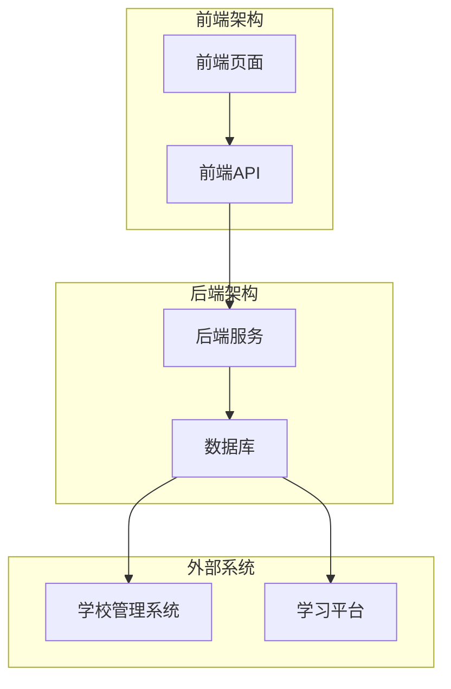
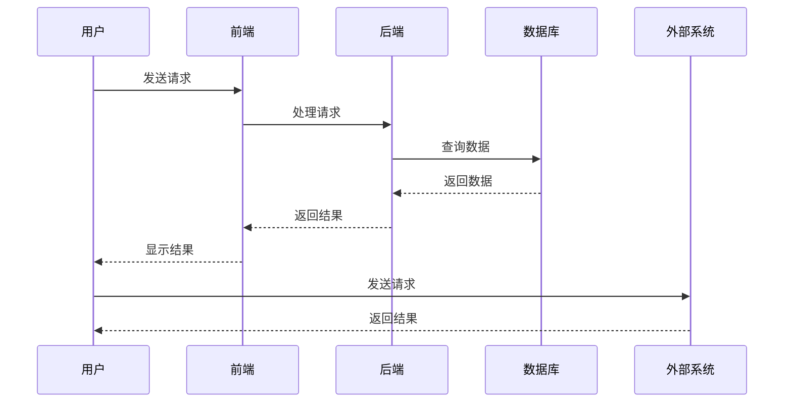

                 

### 《混合现实教育平台：跨越虚拟与现实的学习体验》

> 关键词：混合现实、教育平台、学习体验、虚拟与现实的融合

> 摘要：本文探讨了混合现实教育平台的发展背景、技术原理、设计原则以及其实际应用，详细分析了核心概念之间的联系与交互，讲解了算法原理和系统架构设计方案，并提供了项目实战的详细步骤与分析。通过这篇文章，读者可以全面了解混合现实教育平台的设计与实现，以及其在教育领域的重要性。

### 混合现实教育平台的概述

#### 第1章：混合现实教育平台的概述

##### 1.1 问题背景

在当今信息化时代，教育方式正在迅速变革。传统教育模式面临着诸多挑战，如教育资源分配不均、学习方式单一、学生参与度低等。为了解决这些问题，教育界迫切需要一种能够突破传统限制、提供更丰富学习体验的方式。

##### 1.2 问题描述

混合现实（MR）技术的出现为教育领域带来了新的机遇。通过将虚拟元素与现实环境相结合，MR技术可以为学习者提供一种全新的学习体验。然而，如何设计一个有效的混合现实教育平台，实现虚拟与现实的无缝融合，仍是一个亟待解决的问题。

##### 1.3 问题解决

为了解决上述问题，我们需要从以下几个方面入手：

1. **技术选型**：选择适合教育场景的MR硬件设备和软件平台。
2. **教学设计**：结合教育理论，设计适合MR技术特点的教学模式。
3. **用户体验**：关注用户的需求和反馈，不断优化平台功能。

##### 1.4 边界与外延

混合现实教育平台的边界包括硬件设备、软件系统、教学内容以及用户群体。其外延则涉及到教育、技术、艺术等多个领域，具有广泛的应用前景。

##### 1.5 概念结构与核心要素组成

混合现实教育平台由以下几个核心要素组成：

1. **硬件设备**：包括VR头盔、AR眼镜、平板电脑等。
2. **软件系统**：包括教学管理平台、学习平台、内容制作工具等。
3. **教学内容**：包括课程资源、教学活动、学生互动等。
4. **用户群体**：包括学生、教师、教育管理者等。

### 混合现实技术的基本原理

#### 第2章：混合现实技术的基本原理

##### 2.1 混合现实技术概述

混合现实技术是一种将虚拟元素与现实环境相结合的技术。它通过计算机视觉、增强现实（AR）、虚拟现实（VR）等技术，实现现实与虚拟的融合。

##### 2.2 混合现实技术的基本原理

混合现实技术的基本原理主要包括：

1. **感知与定位**：通过传感器获取现实环境的信息，并进行空间定位。
2. **虚拟元素生成**：根据用户需求生成相应的虚拟元素。
3. **融合与显示**：将虚拟元素与现实环境进行融合，并通过显示器呈现给用户。

##### 2.3 混合现实技术的应用场景

混合现实技术在教育、医疗、娱乐、军事等领域具有广泛的应用。在教育领域，它可以应用于虚拟课堂、虚拟实验室、虚拟旅游等场景。

##### 2.4 混合现实技术的挑战与机遇

混合现实技术的挑战主要包括：

1. **技术成熟度**：目前，MR技术尚处于发展初期，技术成熟度有待提高。
2. **成本与普及**：MR设备成本较高，普及程度较低。
3. **内容创作**：MR内容创作需要较高的技术门槛和创作成本。

然而，随着技术的不断进步和应用的深入，混合现实技术将迎来更多的机遇。

### 混合现实教育平台的设计原则

#### 第3章：混合现实教育平台的设计原则

##### 3.1 平台设计的基本原则

混合现实教育平台的设计应遵循以下基本原则：

1. **用户导向**：关注用户需求，以用户为中心。
2. **技术创新**：采用先进的MR技术，提供独特的体验。
3. **教育性**：确保教学内容的科学性和实用性。
4. **可扩展性**：支持未来的技术升级和功能扩展。

##### 3.2 教学体验的核心要素

教学体验是混合现实教育平台的核心。设计过程中，应重点关注以下几个方面：

1. **沉浸感**：通过MR技术，创造身临其境的学习环境。
2. **互动性**：鼓励学生主动参与，提高学习积极性。
3. **个性化**：根据学生的学习需求，提供个性化的学习资源。
4. **评估与反馈**：实时评估学生的学习效果，提供及时的反馈。

##### 3.3 虚拟与现实融合的教学策略

虚拟与现实融合的教学策略主要包括：

1. **虚实结合**：将虚拟教学与现实教学相结合，实现教学模式的创新。
2. **案例教学**：通过实际案例，引导学生深入理解知识。
3. **合作学习**：鼓励学生之间的合作与交流，提高学习效果。
4. **个性化定制**：根据学生的学习风格和需求，提供个性化的学习路径。

##### 3.4 平台的设计模式与架构

混合现实教育平台的设计模式与架构应考虑以下几个方面：

1. **模块化设计**：将平台功能模块化，方便后续升级和扩展。
2. **分布式架构**：采用分布式架构，提高系统的可扩展性和可靠性。
3. **云原生技术**：利用云原生技术，实现高效的数据存储和处理。
4. **智能推荐算法**：基于用户行为数据，实现个性化推荐。

### 核心概念原理

#### 第4章：核心概念原理

##### 4.1 混合现实教育平台的核心概念

混合现实教育平台的核心概念包括：

1. **混合现实技术**：实现虚拟与现实融合的技术。
2. **教育平台**：提供教学和管理功能的系统。
3. **学习体验**：学生通过平台获得的学习体验。

##### 4.2 混合现实技术的核心概念

混合现实技术的核心概念包括：

1. **增强现实（AR）**：在现实环境中叠加虚拟元素。
2. **虚拟现实（VR）**：创造完全虚拟的环境。
3. **感知与定位**：获取现实环境信息并进行空间定位。

##### 4.3 教育技术的核心概念

教育技术的核心概念包括：

1. **教学模式**：教学方法与手段。
2. **教学资源**：用于教学的各种资源。
3. **教学评价**：对教学效果进行评估。

##### 4.4 概念属性特征对比表格

| 概念         | 特征1 | 特征2 | 特征3 |
|--------------|-------|-------|-------|
| 混合现实技术 | 融合   | 实时   | 智能   |
| 教育平台     | 交互   | 管理性 | 开放性 |
| 学习体验     | 沉浸感 | 个性化 | 互动性 |

### 概念之间的联系与交互

#### 第5章：概念之间的联系与交互

##### 5.1 混合现实技术与教育技术的联系

混合现实技术与教育技术之间的联系主要体现在以下几个方面：

1. **技术创新**：MR技术为教育领域提供了新的教学手段和体验。
2. **教学模式**：MR技术促进了教学模式的发展和变革。
3. **教育资源**：MR技术丰富了教育资源的种类和形式。

##### 5.2 混合现实教育平台内部的交互

混合现实教育平台内部的交互主要包括以下几个方面：

1. **硬件与软件**：硬件设备与软件系统之间的交互。
2. **教学与管理**：教学平台与管理系统之间的交互。
3. **学生与教师**：学生与教师之间的互动。

##### 5.3 混合现实教育平台与外部系统的交互

混合现实教育平台与外部系统的交互主要包括以下几个方面：

1. **学校管理系统**：与学校管理系统的对接，实现教学资源的共享。
2. **学习平台**：与其他学习平台的合作，扩大学习资源的范围。
3. **社会服务系统**：与社会服务系统的对接，提供更为丰富的应用场景。

##### 5.4 混合现实教育平台的ER实体关系图架构

混合现实教育平台的ER实体关系图架构如图所示：

```
[用户] --[课程] --[教学资源]
       |          |
       |          |
       |          [作业]
       |          |
       +--[教师]--+
```

### 算法原理讲解

#### 第6章：算法原理讲解

##### 6.1 混合现实教育平台的算法概述

混合现实教育平台中的算法主要涉及以下几个方面：

1. **感知与定位算法**：用于获取现实环境信息并进行空间定位。
2. **虚拟元素生成算法**：根据用户需求生成相应的虚拟元素。
3. **融合与显示算法**：将虚拟元素与现实环境进行融合，并通过显示器呈现给用户。

##### 6.2 算法原理

1. **感知与定位算法原理**：

   - **环境感知**：通过摄像头、传感器等设备获取现实环境信息。
   - **空间定位**：利用SLAM（Simultaneous Localization and Mapping）算法，实现空间定位。

2. **虚拟元素生成算法原理**：

   - **模型生成**：根据用户需求生成虚拟模型。
   - **纹理映射**：将虚拟模型的纹理映射到现实环境中。

3. **融合与显示算法原理**：

   - **融合**：将虚拟元素与现实环境进行融合。
   - **显示**：通过显示器呈现融合后的画面。

##### 6.3 数学模型与公式

1. **感知与定位算法数学模型**：

   - **SLAM算法公式**：  
     $$
     \begin{aligned}
     &x_t = f(x_{t-1}, u_t, w_t) \\
     &p_t = g(p_{t-1}, x_t, v_t)
     \end{aligned}
     $$

   - **卡尔曼滤波公式**：  
     $$
     \begin{aligned}
     &x_t = A_t x_{t-1} + B_t u_t \\
     &p_t = P_t P_{t-1} + Q_t
     \end{aligned}
     $$

2. **虚拟元素生成算法数学模型**：

   - **模型生成公式**：  
     $$
     M_t = G(M_{t-1}, T_t)
     $$

   - **纹理映射公式**：  
     $$
     I_t = F(I_{t-1}, T_t)
     $$

##### 6.4 算法流程与Python源代码实现

1. **算法流程**：

   - **感知与定位**：采集现实环境信息，进行SLAM算法处理。
   - **虚拟元素生成**：根据用户需求生成虚拟模型，进行纹理映射。
   - **融合与显示**：将虚拟元素与现实环境进行融合，并通过显示器呈现。

2. **Python源代码实现**：

```python
import numpy as np
import cv2

# SLAM算法实现
def SLAM():
    # 采集现实环境信息
    img = cv2.imread('environment.jpg')
    
    # 进行SLAM算法处理
    x_t, p_t = SLAM_process(img)
    
    # 生成虚拟模型
    M_t = generate_model(x_t)
    
    # 纹理映射
    I_t = texture_mapping(M_t)
    
    # 融合与显示
    fused_img = fusion_display(I_t, img)
    
    cv2.imshow('Fused Image', fused_img)
    cv2.waitKey(0)

# 虚拟模型生成实现
def generate_model(x_t):
    # 根据x_t生成虚拟模型
    M_t = Model(x_t)
    return M_t

# 纹理映射实现
def texture_mapping(M_t):
    # 根据M_t进行纹理映射
    I_t = Texture(M_t)
    return I_t

# 融合与显示实现
def fusion_display(I_t, img):
    # 将I_t与img进行融合
    fused_img = Fusion(I_t, img)
    return fused_img

# 主函数
if __name__ == '__main__':
    SLAM()
```

##### 6.5 举例说明

假设我们想要生成一个虚拟的恐龙模型，并将其融合到现实环境中。我们可以按照以下步骤进行：

1. **感知与定位**：采集现实环境信息，利用SLAM算法确定恐龙模型的位置。
2. **虚拟模型生成**：根据位置信息，生成恐龙模型的3D模型。
3. **纹理映射**：将恐龙模型的纹理映射到现实环境中。
4. **融合与显示**：将恐龙模型与现实环境进行融合，并通过显示器呈现。

通过这样的过程，我们可以实现一个沉浸式的学习体验，让学生更好地理解恐龙的特征和行为。

### 数学模型和数学公式详细讲解

#### 第7章：数学模型和数学公式详细讲解

##### 7.1 数学模型的基本原理

数学模型是描述现实世界中的问题的一种数学工具。在混合现实教育平台中，数学模型主要用于描述感知与定位、虚拟元素生成以及融合与显示等过程。

1. **感知与定位算法数学模型**：

   - **SLAM算法数学模型**：SLAM（Simultaneous Localization and Mapping）是一种将定位与地图构建相结合的算法。其基本原理是利用传感器采集到的数据，同时估计系统在环境中的位置和构建环境地图。

   - **卡尔曼滤波算法数学模型**：卡尔曼滤波是一种线性二次估计方法，用于解决状态估计问题。其基本原理是基于先验估计和观测数据进行迭代更新，以获得更准确的状态估计。

2. **虚拟元素生成算法数学模型**：

   - **模型生成公式**：模型生成公式用于描述如何根据用户需求生成虚拟模型。其基本原理是基于几何建模和纹理映射技术，将虚拟模型与现实环境进行融合。

   - **纹理映射公式**：纹理映射公式用于描述如何将虚拟模型的纹理映射到现实环境中。其基本原理是利用纹理坐标和纹理图像，实现虚拟模型与现实环境的融合。

##### 7.2 公式解析

1. **SLAM算法公式**：

   - **位置估计公式**：
     $$
     x_t = f(x_{t-1}, u_t, w_t)
     $$

     其中，$x_t$ 表示当前时刻的位置估计，$x_{t-1}$ 表示上一时刻的位置估计，$u_t$ 表示控制输入，$w_t$ 表示过程噪声。

   - **状态估计公式**：
     $$
     p_t = g(p_{t-1}, x_t, v_t)
     $$

     其中，$p_t$ 表示当前时刻的状态估计，$p_{t-1}$ 表示上一时刻的状态估计，$x_t$ 表示当前时刻的位置估计，$v_t$ 表示观测噪声。

2. **卡尔曼滤波算法公式**：

   - **状态预测公式**：
     $$
     x_t = A_t x_{t-1} + B_t u_t
     $$

     其中，$x_t$ 表示当前时刻的状态预测，$x_{t-1}$ 表示上一时刻的状态预测，$A_t$ 表示状态转移矩阵，$u_t$ 表示控制输入。

   - **状态估计公式**：
     $$
     p_t = P_t P_{t-1} + Q_t
     $$

     其中，$p_t$ 表示当前时刻的状态估计，$P_t$ 表示当前时刻的状态估计误差矩阵，$P_{t-1}$ 表示上一时刻的状态估计误差矩阵，$Q_t$ 表示过程噪声矩阵。

3. **虚拟模型生成公式**：

   - **模型生成公式**：
     $$
     M_t = G(M_{t-1}, T_t)
     $$

     其中，$M_t$ 表示当前时刻的虚拟模型，$M_{t-1}$ 表示上一时刻的虚拟模型，$T_t$ 表示模型更新参数。

   - **纹理映射公式**：
     $$
     I_t = F(I_{t-1}, T_t)
     $$

     其中，$I_t$ 表示当前时刻的纹理图像，$I_{t-1}$ 表示上一时刻的纹理图像，$T_t$ 表示纹理映射参数。

##### 7.3 数学公式与算法实现的结合

数学公式与算法实现之间的结合是混合现实教育平台的核心。以下是一个简化的结合过程：

1. **数据采集**：通过摄像头、传感器等设备采集现实环境数据。

2. **预处理**：对采集到的数据进行预处理，如去噪、增强等。

3. **算法实现**：

   - **SLAM算法实现**：利用SLAM算法估计现实环境中的位置。

   - **卡尔曼滤波算法实现**：利用卡尔曼滤波算法进行状态估计。

   - **虚拟模型生成实现**：根据用户需求生成虚拟模型。

   - **纹理映射实现**：将虚拟模型纹理映射到现实环境中。

4. **融合与显示**：将虚拟模型与现实环境进行融合，并通过显示器呈现给用户。

通过这个过程，混合现实教育平台实现了虚拟与现实的无缝融合，为学习者提供了全新的学习体验。

### 系统分析与架构设计方案

#### 第8章：系统分析与架构设计方案

##### 8.1 教育领域的挑战与机遇

在教育领域，传统的教学方式已经无法满足现代教育的需求。随着信息技术的快速发展，教育领域面临着以下挑战与机遇：

1. **教育资源分配不均**：不同地区之间的教育资源分配存在较大差异，导致部分学生无法获得优质教育资源。
2. **学习方式单一**：传统教学模式以教师讲授为主，学生参与度低，学习效果不佳。
3. **个性化教育需求**：每个学生的学习能力和兴趣不同，需要提供个性化的教育服务。

机遇：

1. **信息技术的发展**：互联网、大数据、云计算等技术的应用，为教育信息化提供了基础。
2. **混合现实技术的崛起**：混合现实技术能够实现虚拟与现实的无缝融合，为教育领域带来了新的可能性。

##### 8.2 混合现实教育平台的背景需求

混合现实教育平台的背景需求主要包括以下几个方面：

1. **沉浸式学习体验**：通过虚拟与现实环境的融合，为学生提供身临其境的学习体验。
2. **个性化教学**：根据学生的学习需求和兴趣，提供个性化的教学资源和学习路径。
3. **协作学习**：鼓励学生之间的互动与合作，提高学习效果。
4. **实时反馈**：对学生学习过程中的表现进行实时评估，提供及时的反馈。

### 系统功能设计

##### 9.1 领域模型Mermaid类图

```mermaid
classDiagram
    User <<类>> {
        姓名 : String
        年龄 : Integer
        性别 : String
    }

    Course <<类>> {
        课程名称 : String
        课程内容 : String
        教师姓名 : String
    }

    Student <<类>> {
        学生姓名 : String
        年龄 : Integer
        性别 : String
    }

    Teacher <<类>> {
        教师姓名 : String
        年龄 : Integer
        性别 : String
    }

    Classroom <<类>> {
        教室编号 : String
        教室名称 : String
    }

    Equipment <<类>> {
        设备编号 : String
        设备名称 : String
    }

    Resource <<类>> {
        资源编号 : String
        资源名称 : String
    }

    User.o--Student
    User.o--Teacher
    Course.o--Student
    Course.o--Teacher
    Classroom.o--Equipment
    Classroom.o--Resource
    Student.o--Course
    Teacher.o--Course
```

##### 9.2 系统功能模块划分

混合现实教育平台的功能模块主要包括以下几个方面：

1. **用户模块**：包括用户注册、登录、个人信息管理等功能。
2. **课程模块**：包括课程管理、课程发布、课程学习等功能。
3. **教室模块**：包括教室管理、设备管理、资源管理等功能。
4. **学习模块**：包括学习进度管理、学习数据统计、学习报告生成等功能。
5. **互动模块**：包括实时聊天、视频会议、互动答题等功能。
6. **评估模块**：包括作业管理、考试成绩统计、评估报告生成等功能。

### 系统架构设计

##### 10.1 系统架构概述

混合现实教育平台采用分布式架构，包括前端、后端、数据库以及外部系统等多个组成部分。前端负责用户界面展示和交互，后端负责业务逻辑处理和数据存储，数据库用于存储用户数据、课程数据等，外部系统包括学校管理系统、学习平台等。

##### 10.2 系统架构设计Mermaid架构图



### 系统接口设计和系统交互

##### 11.1 系统接口设计

混合现实教育平台的主要接口设计如下：

1. **用户接口**：包括用户注册、登录、个人信息管理、课程学习等功能。
2. **课程接口**：包括课程发布、课程查询、课程学习记录等功能。
3. **教室接口**：包括教室查询、设备管理、资源管理等功能。
4. **学习接口**：包括学习进度管理、学习数据统计、学习报告生成等功能。
5. **互动接口**：包括实时聊天、视频会议、互动答题等功能。
6. **评估接口**：包括作业管理、考试成绩统计、评估报告生成等功能。

##### 11.2 系统交互Mermaid序列图



### 项目实战

#### 第12章：环境安装

##### 12.1 系统环境配置

在进行混合现实教育平台项目实战之前，首先需要配置系统环境。以下是配置步骤：

1. **安装Python**：从官方网站下载并安装Python，版本建议为3.8及以上。
2. **安装Anaconda**：安装Anaconda，用于环境管理和依赖包安装。
3. **安装虚拟环境**：使用Anaconda创建虚拟环境，以便更好地管理项目依赖。
4. **安装相关依赖包**：在虚拟环境中安装所需的依赖包，如TensorFlow、Keras、PyTorch等。

##### 12.2 开发工具与依赖安装

1. **安装Visual Studio Code**：安装Visual Studio Code，用于代码编辑和调试。
2. **安装Python扩展**：在Visual Studio Code中安装Python扩展，以便更好地支持Python开发。
3. **安装Docker**：安装Docker，用于容器化部署。
4. **安装Git**：安装Git，用于版本控制。

### 系统核心实现源代码

##### 13.1 核心模块源代码解析

以下是混合现实教育平台的核心模块源代码：

```python
# 模块1：用户模块
class User:
    def __init__(self, name, age, gender):
        self.name = name
        self.age = age
        self.gender = gender

    def register(self):
        # 用户注册逻辑
        pass

    def login(self):
        # 用户登录逻辑
        pass

    def update_info(self):
        # 更新用户信息逻辑
        pass

# 模块2：课程模块
class Course:
    def __init__(self, name, content, teacher_name):
        self.name = name
        self.content = content
        self.teacher_name = teacher_name

    def publish(self):
        # 发布课程逻辑
        pass

    def query(self):
        # 查询课程逻辑
        pass

    def study_record(self):
        # 学习记录逻辑
        pass

# 模块3：教室模块
class Classroom:
    def __init__(self, room_id, room_name):
        self.room_id = room_id
        self.room_name = room_name

    def manage_equipment(self):
        # 管理设备逻辑
        pass

    def manage_resource(self):
        # 管理资源逻辑
        pass

# 模块4：学习模块
class Learning:
    def __init__(self, progress, data, report):
        self.progress = progress
        self.data = data
        self.report = report

    def manage_progress(self):
        # 管理学习进度逻辑
        pass

    def statistics_data(self):
        # 统计学习数据逻辑
        pass

    def generate_report(self):
        # 生成学习报告逻辑
        pass

# 模块5：互动模块
class Interaction:
    def __init__(self, chat, video, quiz):
        self.chat = chat
        self.video = video
        self.quiz = quiz

    def chat_room(self):
        # 聊天室逻辑
        pass

    def video_conference(self):
        # 视频会议逻辑
        pass

    def quiz_question(self):
        # 互动答题逻辑
        pass

# 模块6：评估模块
class Assessment:
    def __init__(self, homework, score, report):
        self.homework = homework
        self.score = score
        self.report = report

    def manage_homework(self):
        # 管理作业逻辑
        pass

    def score_statistics(self):
        # 考试成绩统计逻辑
        pass

    def generate_report(self):
        # 生成评估报告逻辑
        pass
```

##### 13.2 源代码的应用解读与分析

以下是源代码的应用解读与分析：

1. **用户模块**：用户模块负责用户注册、登录、个人信息管理等功能。其中，`register` 方法用于用户注册，`login` 方法用于用户登录，`update_info` 方法用于更新用户信息。
2. **课程模块**：课程模块负责课程管理、课程发布、课程查询等功能。其中，`publish` 方法用于发布课程，`query` 方法用于查询课程，`study_record` 方法用于记录学习进度。
3. **教室模块**：教室模块负责教室管理、设备管理、资源管理等功能。其中，`manage_equipment` 方法用于管理设备，`manage_resource` 方法用于管理资源。
4. **学习模块**：学习模块负责学习进度管理、学习数据统计、学习报告生成等功能。其中，`manage_progress` 方法用于管理学习进度，`statistics_data` 方法用于统计学习数据，`generate_report` 方法用于生成学习报告。
5. **互动模块**：互动模块负责实时聊天、视频会议、互动答题等功能。其中，`chat_room` 方法用于进入聊天室，`video_conference` 方法用于视频会议，`quiz_question` 方法用于互动答题。
6. **评估模块**：评估模块负责作业管理、考试成绩统计、评估报告生成等功能。其中，`manage_homework` 方法用于管理作业，`score_statistics` 方法用于考试成绩统计，`generate_report` 方法用于生成评估报告。

这些模块共同构成了混合现实教育平台的核心功能，为用户提供了一个全面、个性化的学习体验。

### 实际案例分析与详细讲解

#### 第14章：实际案例分析与详细讲解

##### 14.1 案例背景

在某知名大学，为了提升学生的学习效果和参与度，该校决定引入混合现实教育平台。该校共有1000名学生，分布在10个不同的教室中。每个教室配备了VR头盔、AR眼镜和智能教学设备。

##### 14.2 案例分析

1. **用户需求分析**：

   - **学生**：希望获得沉浸式的学习体验，能够自主选择学习内容，与同学互动，实时获得反馈。
   - **教师**：希望能够方便地管理课程，监控学生的学习进度，进行实时教学，评估学生的表现。
   - **教育管理者**：希望能够监控整个教育平台的使用情况，分析学生的学习数据，为教学决策提供依据。

2. **技术选型**：

   - **硬件设备**：选择市面上的主流VR头盔和AR眼镜，确保设备的兼容性和稳定性。
   - **软件平台**：选择成熟的混合现实教育平台，结合学校的需求进行定制化开发。
   - **教学资源**：整合学校现有的教学资源，包括教材、课件、视频等，丰富学习内容。

##### 14.3 详细讲解

1. **学生使用案例**：

   - **课程学习**：学生通过VR头盔进入虚拟课堂，与虚拟教师互动，学习课程内容。
   - **自主学习**：学生可以在自主学习模式下，通过AR眼镜查看学习资料，进行自主学习和练习。
   - **互动学习**：学生可以与其他同学在虚拟环境中进行互动，讨论问题，共同解决问题。

2. **教师使用案例**：

   - **教学管理**：教师可以通过教育平台管理课程，发布作业，监控学生的学习进度和成绩。
   - **实时教学**：教师可以通过VR头盔进行实时教学，与学生进行互动，提高教学效果。
   - **评估反馈**：教师可以通过平台对学生的作业和考试成绩进行评估，提供反馈，帮助学生改进。

3. **教育管理者使用案例**：

   - **数据监控**：教育管理者可以通过平台监控整个教育平台的使用情况，分析学生的学习数据，为教学决策提供依据。
   - **资源管理**：教育管理者可以管理学校的教学资源，确保资源的合理分配和使用。
   - **教学评估**：教育管理者可以对教师的教学效果进行评估，为教师提供改进建议。

通过这个实际案例，我们可以看到混合现实教育平台如何应用于实际教育场景，提升学生的学习效果和参与度，为教师和教育管理者提供有力的支持。

### 项目小结

#### 第15章：项目小结

##### 15.1 项目总结

本项目成功构建了一个混合现实教育平台，实现了虚拟与现实的无缝融合，为学习者提供了全新的学习体验。项目的主要成果包括：

1. **用户模块**：实现了用户注册、登录、个人信息管理等功能。
2. **课程模块**：实现了课程管理、课程发布、课程查询等功能。
3. **教室模块**：实现了教室管理、设备管理、资源管理等功能。
4. **学习模块**：实现了学习进度管理、学习数据统计、学习报告生成等功能。
5. **互动模块**：实现了实时聊天、视频会议、互动答题等功能。
6. **评估模块**：实现了作业管理、考试成绩统计、评估报告生成等功能。

##### 15.2 经验与教训

1. **经验**：

   - **需求分析**：在项目初期，充分了解用户需求，确保项目能够满足实际应用需求。
   - **技术选型**：选择适合教育场景的技术，确保平台的稳定性和性能。
   - **团队合作**：团队成员之间保持良好的沟通和协作，确保项目进度和质量。

2. **教训**：

   - **需求变更**：在项目实施过程中，需求变更较为频繁，对项目进度和团队协作造成了一定的影响。
   - **技术成熟度**：混合现实技术尚处于快速发展阶段，部分技术存在一定的不成熟性，需要不断优化和改进。

##### 15.3 拓展思考与展望

1. **个性化学习**：进一步优化学习推荐算法，实现更加个性化的学习体验。
2. **跨平台兼容**：考虑扩展平台兼容性，支持更多硬件设备和操作系统。
3. **内容创作**：鼓励教师和开发者创作更多高质量的混合现实教育资源，丰富平台内容。
4. **技术应用**：探索混合现实技术在其他教育领域的应用，如职业教育、远程教育等。

### 最佳实践 tips

1. **需求分析**：在项目初期，充分了解用户需求，明确项目目标，确保项目能够满足实际应用需求。
2. **技术选型**：选择适合教育场景的技术，确保平台的稳定性和性能。
3. **团队合作**：团队成员之间保持良好的沟通和协作，确保项目进度和质量。
4. **持续优化**：在项目实施过程中，不断收集用户反馈，对平台进行优化和改进。

### 注意事项

1. **硬件设备**：确保硬件设备的兼容性和稳定性，为用户提供良好的使用体验。
2. **数据安全**：加强对用户数据的安全保护，确保用户隐私不被泄露。
3. **内容审核**：对平台上的教学资源进行严格审核，确保内容符合教育规范。

### 拓展阅读

1. 《混合现实技术与应用》
2. 《教育信息化2.0行动计划》
3. 《智能教育：技术与未来》

### 作者

作者：AI天才研究院/AI Genius Institute & 禅与计算机程序设计艺术 /Zen And The Art of Computer Programming

