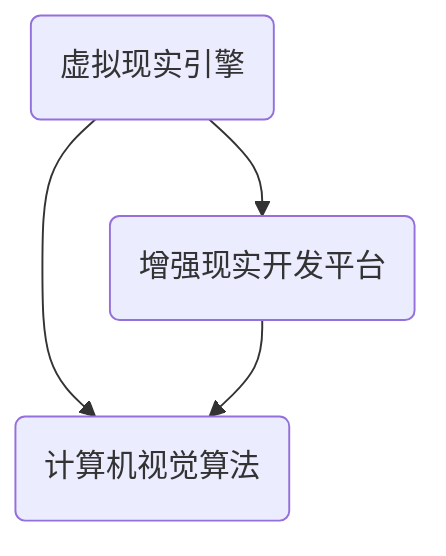
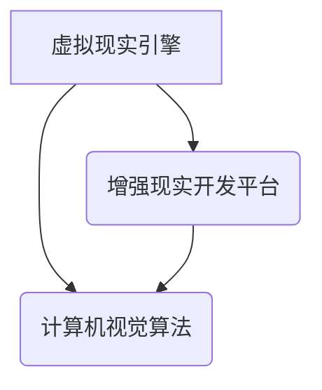

                 


### 混合现实艺术创作：跨越虚拟与现实的艺术探索

---

#### 关键词：
- 混合现实艺术
- 虚拟与现实的融合
- 艺术创作
- 技术基础
- 案例研究

#### 摘要：
本文旨在探讨混合现实艺术创作的原理、方法与实践，通过逐步分析虚拟与现实融合的艺术表现，展示混合现实技术在艺术创作中的广泛应用与价值。文章将从混合现实艺术的概述、技术基础、创作流程、案例研究及实践等方面进行深入探讨，为读者提供一个全面了解和掌握混合现实艺术创作的方法与技巧。

---

## 第一部分：引言

### 第1章：混合现实艺术概述

#### 1.1 混合现实的背景与发展

- **1.1.1 混合现实的背景**  
  混合现实技术是一种将虚拟数字内容与现实世界相结合的交互体验。它起源于虚拟现实（VR）和增强现实（AR）技术的发展。VR技术主要模拟虚拟环境，而AR技术则将虚拟内容叠加到现实环境中。

- **1.1.2 混合现实的重要发展事件**  
  2000年代初期，微软推出了第一款增强现实眼镜HoloLens，标志着混合现实技术的崛起。近年来，随着硬件技术的进步和算法优化，混合现实应用在各个领域得到了广泛应用。

- **1.1.3 混合现实技术的影响与应用领域**  
  混合现实技术在娱乐、医疗、教育、工业设计等领域具有广泛的应用前景。它不仅改变了人们的生活方式，也为艺术创作带来了新的可能性。

#### 1.2 混合现实艺术的概念与特点

- **1.2.1 混合现实艺术的概念**  
  混合现实艺术是一种将虚拟元素与现实世界环境相结合的艺术形式。它通过技术手段将艺术作品从二维平面拓展到三维空间，实现了虚拟与现实的交融。

- **1.2.2 混合现实艺术与传统艺术的区别**  
  与传统艺术相比，混合现实艺术具有更多的互动性和沉浸感。观众不再只是被动欣赏作品，而是可以参与其中，与虚拟世界进行互动。

- **1.2.3 混合现实艺术的独特魅力**  
  混合现实艺术通过独特的视觉效果和互动体验，使观众能够更加深入地理解和感受艺术作品的内涵。

#### 1.3 混合现实艺术的价值与意义

- **1.3.1 混合现实艺术对社会的影响**  
  混合现实艺术推动了艺术表现形式的创新，拓宽了艺术创作的边界，为艺术家提供了更多的创作工具和表达方式。

- **1.3.2 混合现实艺术在艺术教育中的作用**  
  混合现实艺术教育有助于培养学生的创新思维和实践能力，提高他们对艺术的理解和欣赏水平。

- **1.3.3 混合现实艺术的商业潜力**  
  混合现实艺术在商业领域具有巨大的市场潜力，为艺术家和企业提供了新的商业模式和盈利途径。

---

## 第二部分：混合现实技术基础

### 第2章：混合现实技术概述

#### 2.1 混合现实的硬件基础

- **2.1.1 混合现实头戴设备**  
  头戴设备是混合现实技术的核心硬件，如HoloLens、Magic Leap等，它们提供沉浸式的虚拟现实或增强现实体验。

- **2.1.2 混合现实追踪系统**  
  追踪系统用于实时捕捉和跟踪用户的位置和动作，确保虚拟内容与现实世界的互动准确无误。

- **2.1.3 混合现实交互设备**  
  交互设备如手势识别控制器、眼动跟踪设备等，用于用户与虚拟世界的交互。

#### 2.2 混合现实的软件基础

- **2.2.1 虚拟现实引擎**  
  虚拟现实引擎如Unity、Unreal Engine等，提供创建虚拟环境的工具和资源，支持3D渲染和动画制作。

- **2.2.2 增强现实开发平台**  
  增强现实开发平台如ARKit、ARCore等，提供创建和展示增强现实内容的框架和API。

- **2.2.3 计算机视觉算法**  
  计算机视觉算法如SLAM（同步定位与地图构建）、图像识别等，用于处理和解释现实世界的图像和视频数据。

#### **2.2 核心概念与联系**

#### 核心概念

**虚拟现实引擎**：  
虚拟现实引擎是创建和管理虚拟环境的软件平台，用于生成3D渲染效果、模拟物理交互和实现实时互动。

**增强现实开发平台**：  
增强现实开发平台提供创建和展示增强现实内容的工具和框架，使开发者能够将虚拟元素叠加到现实世界中。

**计算机视觉算法**：  
计算机视觉算法用于处理和解释现实世界的图像和视频数据，如对象识别、场景理解和实时跟踪。

#### **概念属性特征对比表格**

| 核心概念 | 特征 |
| --- | --- |
| 虚拟现实引擎 | 提供完整的虚拟环境模拟，强大的3D渲染能力 |
| 增强现实开发平台 | 实时叠加虚拟内容于现实世界，提供增强现实体验 |
| 计算机视觉算法 | 从图像中提取信息，实现物体识别与追踪 |

#### **ER实体关系图架构**



#### **2.3 混合现实内容的创作**

- **2.3.1 3D建模与渲染**  
  使用3D建模软件创建虚拟对象，并通过渲染引擎实现高质量视觉效果。

- **2.3.2 动画与特效**  
  利用动画软件制作动态效果，增强艺术作品的表现力。

- **2.3.3 音频与交互设计**  
  加入音频效果和交互元素，提升用户的沉浸体验。

---

## 第三部分：混合现实艺术创作流程

### 第3章：混合现实艺术创作流程

#### 3.1 创作灵感的获取与构思

- **3.1.1 混合现实艺术的创作灵感来源**  
  艺术家可以从现实生活中的景象、历史事件、科幻想象中获取创作灵感。

- **3.1.2 创作构思的方法与技巧**  
  艺术家可以通过草图、故事板和概念设计等手段进行构思和规划。

#### 3.2 艺术作品的创作与实现

- **3.2.1 创作工具的使用**  
  使用虚拟现实引擎、增强现实开发平台和计算机视觉工具进行艺术创作。

- **3.2.2 艺术作品的制作流程**  
  艺术作品制作通常包括概念设计、3D建模、动画制作、音效设计等环节。

#### 3.3 艺术作品的展示与互动

- **3.3.1 展示环境的设计**  
  设计适合艺术作品展示的环境，包括光线、音响和空间布局。

- **3.3.2 互动体验的优化**  
  通过用户交互设计和反馈机制，优化用户的互动体验，提高作品的表现力。

---

## 第四部分：混合现实艺术案例研究

### 第4章：国际知名混合现实艺术作品

#### 4.1 《雨之森林》

- **4.1.1 作品介绍**  
  《雨之森林》是一款利用增强现实技术打造的互动艺术体验，用户可以在森林环境中感受雨滴的落下和树木的摇曳。

- **4.1.2 创作背景**  
  艺术家通过这个作品探讨了自然与科技的关系，以及人类与自然环境的互动。

- **4.1.3 艺术价值**  
  《雨之森林》通过沉浸式的互动体验，引发了观众对环境保护和人类行为影响的思考。

#### 4.2 《魔方空间》

- **4.2.1 作品介绍**  
  《魔方空间》是一款利用虚拟现实技术打造的互动艺术装置，观众可以在虚拟空间中探索魔方的奥秘。

- **4.2.2 创作背景**  
  艺术家通过这个作品探讨了逻辑思维和空间感知的训练。

- **4.2.3 艺术价值**  
  《魔方空间》通过虚拟现实技术，为观众提供了一种全新的艺术体验，激发了观众对逻辑思维和空间感知的兴趣。

#### 4.3 《城市的记忆》

- **4.3.1 作品介绍**  
  《城市的记忆》是一款利用增强现实技术打造的互动艺术体验，用户可以在城市环境中看到历史建筑的重现。

- **4.3.2 创作背景**  
  艺术家通过这个作品探讨了城市发展与文化遗产保护的关系。

- **4.3.3 艺术价值**  
  《城市的记忆》通过增强现实技术，为观众呈现了一种全新的城市文化体验，引发了观众对城市发展的思考。

---

### 第5章：中国混合现实艺术作品

#### 5.1 《梦境迷宫》

- **5.1.1 作品介绍**  
  《梦境迷宫》是一款利用虚拟现实技术打造的互动艺术体验，用户可以在虚拟世界中探索迷宫。

- **5.1.2 创作背景**  
  艺术家通过这个作品探讨了梦境与现实的关系。

- **5.1.3 艺术价值**  
  《梦境迷宫》通过虚拟现实技术，为观众提供了一种全新的梦境体验，激发了观众对梦境探索的兴趣。

#### 5.2 《文化遗产的再现》

- **5.2.1 作品介绍**  
  《文化遗产的再现》是一款利用增强现实技术打造的互动艺术体验，用户可以在现实环境中看到文化遗产的重现。

- **5.2.2 创作背景**  
  艺术家通过这个作品探讨了文化遗产保护的重要性。

- **5.2.3 艺术价值**  
  《文化遗产的再现》通过增强现实技术，为观众呈现了一种全新的文化遗产体验，引发了观众对文化遗产保护的思考。

#### 5.3 《自然与科技的交融》

- **5.3.1 作品介绍**  
  《自然与科技的交融》是一款利用混合现实技术打造的互动艺术体验，用户可以在自然环境中看到科技元素。

- **5.3.2 创作背景**  
  艺术家通过这个作品探讨了自然与科技的关系。

- **5.3.3 艺术价值**  
  《自然与科技的交融》通过混合现实技术，为观众提供了一种全新的自然科技体验，激发了观众对自然与科技融合的思考。

---

## 第五部分：混合现实艺术创作实践

### 第6章：混合现实艺术创作实践

#### 6.1 实践项目介绍

- **6.1.1 项目背景**  
  项目背景介绍，包括项目目标、需求分析、技术选型等。

- **6.1.2 项目目标**  
  项目目标明确，如实现特定艺术作品的创作、提升用户体验等。

#### 6.2 实践工具与平台

- **6.2.1 开发工具**  
  选择适合项目需求的开发工具，如Unity、Unreal Engine、ARKit、ARCore等。

- **6.2.2 平台选择**  
  根据项目目标选择合适的展示平台，如头戴设备、手机、平板等。

#### 6.3 实践流程与技巧

- **6.3.1 设计构思**  
  设计构思是创作过程的关键，包括艺术风格、互动方式、视觉效果等。

- **6.3.2 实现方法**  
  详细讲解实现方法，如3D建模、动画制作、音效设计等。

- **6.3.3 优化与调试**  
  优化与调试是确保项目成功的关键步骤，包括性能优化、交互优化等。

---

## 第六部分：混合现实艺术创作总结与展望

### 第7章：混合现实艺术创作总结与展望

#### 7.1 混合现实艺术创作的经验总结

- **7.1.1 成功要素**  
  总结成功的混合现实艺术创作项目，分析其成功的原因。

- **7.1.2 遇到的挑战与解决方案**  
  分析在混合现实艺术创作过程中遇到的挑战，并提出相应的解决方案。

#### 7.2 混合现实艺术的未来趋势

- **7.2.1 技术发展预测**  
  预测混合现实技术的未来发展方向，如硬件性能的提升、算法的优化等。

- **7.2.2 艺术创新方向**  
  探讨混合现实艺术在未来的创新方向，如融合更多艺术形式、提高互动体验等。

#### 7.3 混合现实艺术创作的建议

- **7.3.1 创作者的建议**  
  为创作者提供一些建议，如技术学习、创意激发、合作交流等。

- **7.3.2 教育与培训的建议**  
  为教育机构提供一些建议，如课程设置、实践项目、师资培养等。

---

### 作者信息：

**作者：AI天才研究院/AI Genius Institute & 禅与计算机程序设计艺术 /Zen And The Art of Computer Programming**

---

以上是《混合现实艺术创作：跨越虚拟与现实的艺术探索》的完整目录大纲，旨在为读者提供一个系统、全面的混合现实艺术创作指南。在接下来的文章中，我们将深入探讨每个章节的具体内容，帮助读者更好地理解和掌握混合现实艺术创作的原理与方法。敬请期待！## 第一部分：引言

### 第1章：混合现实艺术概述

#### 1.1 混合现实的背景与发展

混合现实（MR）艺术是一种结合了虚拟现实（VR）和增强现实（AR）技术的艺术形式，它通过先进的硬件设备和软件工具，将数字内容与现实世界环境相结合，创造出一种新的艺术体验。混合现实艺术的起源可以追溯到虚拟现实和增强现实技术的发展。20世纪80年代，虚拟现实的概念首次被提出，90年代，增强现实技术开始萌芽。随着硬件设备和算法技术的不断进步，混合现实技术逐渐走向成熟，并开始对各个领域产生深远的影响。

在重要的发展事件中，2009年，谷歌发布了第一个增强现实眼镜“谷歌眼镜”，标志着增强现实技术开始走进大众视野。2010年，微软推出了HoloLens原型，开创了混合现实技术的先河。随后，2016年，Magic Leap公司发布了其首款混合现实头戴设备，进一步推动了混合现实技术的发展。这些技术的发展不仅改变了人们的生活方式，也为艺术创作带来了新的可能性。

混合现实技术在多个领域得到了广泛应用，其中包括娱乐、医疗、教育、工业设计和艺术等。在娱乐领域，混合现实技术为游戏和电影提供了全新的体验方式，使观众能够更加身临其境。在医疗领域，混合现实技术被用于手术模拟和医疗培训，提高了医疗工作的效率和准确性。在教育领域，混合现实技术为学生们提供了更丰富的学习资源，促进了知识的传授和技能的培养。在工业设计领域，混合现实技术被用于产品设计和制造，提高了设计的精确性和效率。在艺术领域，混合现实技术为艺术家提供了更多的创作工具和表达方式，使艺术作品得以跨越虚拟与现实之间的界限。

#### 1.2 混合现实艺术的概念与特点

混合现实艺术是一种通过混合现实技术创作的艺术形式，它将虚拟元素与现实世界环境相结合，创造出一种新的艺术体验。混合现实艺术与传统艺术相比，具有以下几个显著的特点：

1. **互动性**：在混合现实艺术中，观众不再是被动地欣赏艺术作品，而是可以主动参与其中，与虚拟元素进行互动。这种互动性使观众能够更加深入地理解和体验艺术作品的内涵。

2. **沉浸感**：混合现实艺术通过将虚拟元素与现实世界环境相结合，创造出一种沉浸式的体验。观众在观看艺术作品时，会感觉到自己仿佛置身于一个全新的世界，这种沉浸感极大地提升了艺术体验的质量。

3. **多维性**：在混合现实艺术中，艺术作品不仅可以存在于二维平面，还可以拓展到三维空间。艺术家可以通过虚拟现实引擎和增强现实开发平台，创建出复杂的虚拟场景和动态效果，使艺术作品呈现出更多的层次和细节。

4. **实时性**：混合现实艺术作品可以根据观众的互动实时调整，创造出动态的变化和互动效果。这种实时性使得艺术作品能够更加灵活地适应观众的需求和场景的变化。

#### 1.3 混合现实艺术的价值与意义

混合现实艺术在社会、艺术教育以及商业领域都具有重要的价值和意义。

在社会层面，混合现实艺术推动了艺术表现形式的创新，丰富了人们的文化生活。它为艺术家提供了更多的创作工具和表达方式，使他们能够更自由地探索和表达内心的想法。同时，混合现实艺术也改变了人们与艺术作品之间的互动方式，使艺术作品变得更加生动和有趣。这种新的艺术形式不仅丰富了人们的精神世界，也促进了社会的文化多样性。

在艺术教育层面，混合现实艺术为教育工作者提供了新的教学工具和手段。通过混合现实技术，学生们可以更加直观地理解和掌握艺术理论知识，提高他们的艺术素养和创造力。此外，混合现实艺术还可以激发学生的学习兴趣，提高他们的学习积极性。通过实践操作，学生们可以亲身体验艺术创作的全过程，从而加深对艺术的理解和热爱。

在商业领域，混合现实艺术具有巨大的市场潜力。随着技术的不断进步，混合现实设备的普及和成本的降低，混合现实艺术作品的商业应用越来越广泛。企业和品牌可以通过混合现实艺术作品进行宣传和营销，提高品牌知名度和用户粘性。此外，混合现实艺术也为艺术家提供了新的商业模式和盈利途径，使他们能够通过创作和销售混合现实艺术作品获得经济收益。

### **混合现实艺术的概念与特点**

#### **1.2.1 混合现实艺术的概念**

混合现实艺术是一种结合了虚拟现实（VR）和增强现实（AR）技术的艺术形式。它通过先进的技术手段，将数字内容与现实世界环境相结合，创造出一种全新的艺术体验。混合现实艺术不仅包括虚拟世界中的艺术创作，还包括将虚拟元素叠加到现实世界中的增强现实艺术。这种艺术形式打破了传统艺术的表现形式，使艺术家能够通过更加丰富和多样化的方式表达自己的创意。

#### **1.2.2 混合现实艺术与传统艺术的区别**

混合现实艺术与传统艺术在创作方式、表现手法和观众互动等方面存在显著的区别：

1. **创作方式**：传统艺术主要通过手绘、雕塑、绘画等手段进行创作，而混合现实艺术则依赖于计算机图形、虚拟现实引擎和增强现实开发平台。艺术家可以通过这些工具创建复杂的虚拟场景和动态效果，使艺术作品更加立体和生动。

2. **表现手法**：传统艺术通常是在二维或三维平面上进行创作，而混合现实艺术可以将虚拟元素与现实世界环境相结合，创造出多维空间的艺术体验。观众可以在虚拟环境中自由探索和互动，获得更加沉浸式的艺术体验。

3. **观众互动**：在传统艺术中，观众通常是被动地欣赏艺术作品，而混合现实艺术则强调观众与艺术作品的互动。观众可以通过手势、眼神或语音等交互方式与虚拟元素进行互动，改变艺术作品的呈现方式和内容，使艺术体验更加主动和有趣。

#### **1.2.3 混合现实艺术的独特魅力**

混合现实艺术具有以下几个独特的魅力：

1. **沉浸感**：通过虚拟现实和增强现实技术，观众可以完全沉浸在一个全新的艺术环境中，感受到与真实世界不同的艺术体验。这种沉浸感使观众能够更加深入地理解和感受艺术作品的内涵。

2. **互动性**：混合现实艺术使观众能够与艺术作品进行互动，通过参与和操作改变艺术作品的呈现方式和内容。这种互动性使艺术体验更加主动和有趣，激发了观众的创造力和想象力。

3. **创新性**：混合现实艺术打破了传统艺术的表现形式，为艺术家提供了更多的创作工具和表达方式。艺术家可以通过创新的方式表达自己的创意，创造出独特和有趣的艺术作品。

4. **多样性**：混合现实艺术可以将虚拟元素与现实世界环境相结合，创造出丰富多样的艺术体验。观众可以根据自己的兴趣和需求选择不同的艺术作品进行体验，获得独特的艺术感受。

### **1.3 混合现实艺术的价值与意义**

#### **1.3.1 混合现实艺术对社会的影响**

混合现实艺术在社会层面产生了深远的影响，主要体现在以下几个方面：

1. **文化多样性的提升**：混合现实艺术打破了传统艺术形式的局限，为艺术家提供了更多元的创作工具和表达方式。这种创新性的艺术形式不仅丰富了人们的文化生活，也促进了文化的多样性。

2. **艺术教育的变革**：混合现实艺术为教育工作者提供了新的教学工具和手段，使学生们能够更加直观地理解和掌握艺术理论知识。通过实践操作，学生们可以亲身体验艺术创作的全过程，从而提高他们的艺术素养和创造力。

3. **社会问题的探讨**：混合现实艺术作品可以通过独特的视觉效果和互动体验，引发观众对社会问题的思考和讨论。例如，艺术家可以通过虚拟现实技术创作出反映环境污染、战争和社会不公等问题的艺术作品，引导观众关注和反思这些问题。

#### **1.3.2 混合现实艺术在艺术教育中的作用**

混合现实艺术在艺术教育中发挥了重要的作用，主要体现在以下几个方面：

1. **艺术素养的培养**：通过混合现实艺术教育，学生们可以接触到更多的艺术形式和创作方法，提高他们的艺术素养和审美能力。学生们可以通过互动和探索，更加深入地理解和欣赏艺术作品。

2. **创造力的激发**：混合现实艺术强调观众的互动和参与，激发了学生的创造力和想象力。通过实践操作，学生们可以自由地表达自己的想法和创意，培养创新思维。

3. **跨学科学习**：混合现实艺术涉及多个学科领域，如计算机科学、艺术设计、教育学等。通过跨学科的学习和实践，学生们可以全面发展，提高综合能力。

#### **1.3.3 混合现实艺术的商业潜力**

混合现实艺术在商业领域具有巨大的潜力，主要体现在以下几个方面：

1. **品牌宣传**：企业可以通过混合现实艺术作品进行品牌宣传和推广。独特的视觉效果和互动体验可以吸引消费者的注意力，提高品牌知名度和用户粘性。

2. **市场营销**：混合现实艺术可以用于市场营销活动，吸引消费者的参与和互动。通过虚拟现实和增强现实技术，企业可以创造出新颖的市场营销策略，提高市场竞争力。

3. **商业模式创新**：混合现实艺术为艺术家和企业提供了新的商业模式。艺术家可以通过创作和销售混合现实艺术作品获得经济收益，企业可以通过混合现实艺术产品拓展业务，实现商业价值的最大化。

### **混合现实艺术的社会、教育及商业价值**

#### **1.3.1 社会影响**

混合现实艺术在社会层面的影响是多方面的。首先，它促进了文化多样性的发展。通过虚拟现实和增强现实技术，艺术家能够创作出传统媒介难以实现的艺术形式，丰富了文化表达手段。例如，虚拟博物馆可以让人们在家中就能参观世界各地的文化遗产，不仅提升了文化教育的普及率，也增强了人们的文化认同感。

其次，混合现实艺术改变了人们对于艺术体验的感知方式。在传统艺术中，观众是静态地欣赏作品，而在混合现实艺术中，观众可以主动参与和互动，这种互动性增强了艺术体验的沉浸感和参与感。例如，观众可以在虚拟画廊中与艺术作品互动，甚至可以在虚拟空间中创作自己的艺术作品，这无疑改变了人们对艺术的认知和体验。

此外，混合现实艺术也对社会问题提出了独特的反思。艺术家可以利用这项技术创作出能够反映社会现实问题的艺术作品，如环境污染、战争和社会不公等。这种艺术形式不仅能够引起公众的关注，还能激发社会对于这些问题的讨论和思考。

#### **1.3.2 艺术教育作用**

混合现实艺术在艺术教育中具有重要的作用。首先，它为艺术教育提供了新的工具和方法。传统的艺术教育往往依赖于实物和画布，而混合现实技术可以创造出虚拟的艺术环境，让学生在虚拟空间中进行绘画、雕塑和设计等实践活动，这不仅提高了教学的趣味性，也增强了学生的实际操作能力。

其次，混合现实艺术有助于培养学生的创新思维和解决问题的能力。通过虚拟现实和增强现实技术，学生可以探索和实验不同的艺术形式和创作方法，尝试解决艺术创作中的各种问题。这种实践性的学习方式有助于激发学生的创造力和批判性思维。

此外，混合现实艺术也促进了跨学科的学习。艺术、计算机科学、设计等多个领域在混合现实艺术中相互融合，为学生提供了一个综合性的学习平台。通过跨学科的学习，学生可以更全面地理解艺术创作的过程和技术原理，提高他们的综合素质。

#### **1.3.3 商业潜力**

混合现实艺术在商业领域具有巨大的潜力，特别是在市场营销和品牌建设方面。首先，混合现实艺术可以为品牌提供独特的营销手段。通过虚拟现实和增强现实技术，品牌可以创造出互动性强的营销活动，吸引消费者的注意力。例如，消费者可以在虚拟购物环境中体验产品，这种沉浸式的购物体验可以大大提升消费者的购买意愿。

其次，混合现实艺术有助于品牌形象的建设。通过独特的艺术表达方式，品牌可以传达自己的核心价值观和品牌理念。例如，一个追求创新和科技感的企业可以通过创作混合现实艺术作品来展现其创新精神和科技实力。

此外，混合现实艺术也为艺术家提供了新的商业模式。艺术家可以通过创作和销售混合现实艺术作品获得经济收益。例如，艺术家可以将自己的艺术作品制作成虚拟画廊或展览，吸引观众参观和购买。这种新的商业模式不仅为艺术家提供了更多的收入来源，也推动了艺术市场的创新和发展。

总的来说，混合现实艺术在社会、教育和商业领域都具有重要的价值。它不仅丰富了艺术表现形式，促进了文化的多样性和创新，还为社会问题和教育改革提供了新的视角和工具。同时，它在商业领域的应用也为品牌建设和市场营销带来了新的机遇。随着技术的不断进步和应用的深入，混合现实艺术将在未来发挥更加重要的作用。

---

## 第二部分：混合现实技术基础

### **第2章：混合现实技术概述**

#### **2.1 混合现实的硬件基础**

混合现实技术的基础在于其硬件设备，这些设备包括头戴式显示器（HMD）、传感器、追踪系统等。头戴式显示器（HMD）是混合现实体验的核心组件，它能够提供沉浸式的视觉体验。当前市场上，如微软的HoloLens、谷歌的Daydream View和Magic Leap等设备，都具有较高的技术水平，能够在头戴式显示器中实现高分辨率的图像显示和实时追踪。

传感器在混合现实设备中起着至关重要的作用。常见的传感器包括陀螺仪、加速度计、环境传感器等。这些传感器可以实时捕捉用户的动作和周围环境的变化，为虚拟内容的呈现提供准确的定位和动作跟踪。例如，HoloLens内置了多个传感器，能够实时跟踪用户的手部和头部运动，使虚拟对象能够准确地与真实世界对齐。

追踪系统是确保混合现实体验准确性的关键。追踪系统通常包括外部追踪器和内部追踪算法。外部追踪器如激光雷达和红外追踪器，可以精确地测量用户和周围环境的位置和运动。而内部追踪算法则利用传感器数据，通过计算实现虚拟对象的实时定位和追踪。这种内外结合的追踪系统，可以确保用户在混合现实环境中的每一个动作都能被准确捕捉和响应。

#### **2.2 混合现实的软件基础**

混合现实的软件基础主要包括虚拟现实引擎、增强现实开发平台和计算机视觉算法。

**虚拟现实引擎**：如Unity和Unreal Engine，是创建和管理虚拟环境的软件平台。这些引擎提供了强大的3D渲染能力、物理模拟和动画制作工具，使开发者能够轻松创建复杂的虚拟场景和交互式体验。例如，Unity支持跨平台开发，开发者可以使用C#语言编写代码，实现复杂的逻辑和交互功能。Unreal Engine则以其高质量的渲染效果和实时预览功能而著称，适用于游戏开发和复杂虚拟现实应用。

**增强现实开发平台**：如ARKit（iOS）、ARCore（Android）和Windows Mixed Reality，提供了创建和展示增强现实内容的框架和API。这些平台提供了丰富的工具和资源，帮助开发者快速构建增强现实应用。例如，ARKit提供了多种AR功能，包括图像识别、位置追踪和环境映射等，使开发者能够将虚拟内容准确地叠加到现实世界。

**计算机视觉算法**：是处理和解释现实世界图像和视频数据的关键技术。常见的计算机视觉算法包括同步定位与地图构建（SLAM）、深度学习、图像识别和物体跟踪等。SLAM算法能够同时实现位置追踪和地图构建，使虚拟对象能够准确地在现实世界中定位。深度学习算法通过训练大量数据，实现图像识别和物体分类，提高混合现实应用的智能化水平。图像识别算法能够识别和标记现实世界中的物体，为虚拟内容的叠加提供基础。物体跟踪算法则能够实时捕捉和跟踪物体的运动，确保虚拟对象与现实物体的互动准确无误。

#### **2.2 核心概念与联系**

**虚拟现实引擎**、**增强现实开发平台**和**计算机视觉算法**是混合现实技术中至关重要的核心概念，它们各自具有独特的功能和应用场景，但相互之间也存在紧密的联系。

**虚拟现实引擎**是创建虚拟环境的工具，它提供了强大的3D渲染能力和动画制作功能。虚拟现实引擎的核心功能包括场景渲染、物理模拟、动画播放和交互控制。通过虚拟现实引擎，开发者可以构建复杂的虚拟场景，实现角色运动、环境变化和物体交互。虚拟现实引擎通常与增强现实开发平台结合使用，以实现虚拟内容在现实世界中的展示和互动。

**增强现实开发平台**则专注于增强现实内容的创建和展示，它提供了多种工具和API，帮助开发者将虚拟内容准确叠加到现实世界中。增强现实开发平台的核心功能包括图像识别、位置追踪、环境映射和虚拟内容渲染。通过增强现实开发平台，开发者可以创建各种增强现实应用，如信息展示、导航辅助和交互游戏等。

**计算机视觉算法**是处理现实世界图像和视频数据的技术手段，它为虚拟现实引擎和增强现实开发平台提供了数据支持和功能扩展。计算机视觉算法的核心功能包括图像识别、物体跟踪、场景理解和深度学习。通过计算机视觉算法，虚拟现实引擎和增强现实开发平台能够更准确地捕捉和理解现实世界中的物体和环境，提高混合现实应用的智能化和互动性。

**概念属性特征对比表格**

| 核心概念         | 特征                  |
|----------------|---------------------|
| 虚拟现实引擎     | 完整的虚拟环境模拟，3D渲染能力强大 |
| 增强现实开发平台 | 实时叠加虚拟内容于现实世界 |
| 计算机视觉算法   | 从图像中提取信息，实现物体识别与追踪 |

**ER实体关系图架构**



通过上述核心概念与联系的分析，我们可以看到虚拟现实引擎、增强现实开发平台和计算机视觉算法在混合现实技术中的重要性。这些技术不仅为艺术家和开发者提供了丰富的创作工具和功能，也推动了混合现实技术在各个领域的应用和发展。

#### **2.3 混合现实内容的创作**

**混合现实内容的创作是一个复杂且多层次的过程，涉及到多个技术和工具的综合应用。以下将详细描述混合现实内容创作的步骤和关键环节。**

**1. 3D建模与渲染**

3D建模是混合现实内容创作的基础，它涉及使用3D建模软件创建虚拟对象和场景。常见的3D建模软件包括Blender、Maya和3ds Max等。这些软件提供了丰富的建模工具和功能，使艺术家能够自由地创建复杂的几何形状和细节丰富的场景。

在3D建模完成后，渲染过程则负责将模型转化为可视化的图像或动画。渲染引擎如Unity的Unreal Engine、Arnold等，能够根据光照、材质和场景条件，生成高质量的图像或动画。高质量的渲染效果不仅能提升艺术作品的表现力，还能提高用户体验的沉浸感。

**2. 动画与特效**

动画是混合现实内容创作中不可或缺的一部分，它赋予虚拟对象生命和动态效果。通过关键帧动画、运动捕捉和仿真技术，艺术家可以创建出逼真的角色动作和自然现象。例如，在虚拟博物馆中，展品可以通过动画展示其历史变迁或功能原理。

特效则是增强艺术作品视觉效果的重要手段，包括粒子效果、光影效果、动态模糊等。这些特效可以通过实时渲染或后期处理实现，为艺术作品增添更多的视觉冲击力。

**3. 音频与交互设计**

音频设计在混合现实内容创作中同样重要，它能够增强用户的沉浸感和互动体验。通过音频效果，艺术家可以营造出真实的场景氛围，如森林中的鸟鸣、城市中的车流声等。

交互设计则决定了用户与虚拟内容的互动方式。通过手势识别、语音控制、眼动跟踪等技术，用户可以与虚拟对象进行互动，如触摸、抓取、旋转等。交互设计的目的是提供直观、自然的用户体验，使观众能够轻松地与艺术作品互动。

**4. 内容整合与优化**

在完成3D建模、动画、特效和音频设计后，需要将所有元素整合到统一的平台中，如虚拟现实引擎或增强现实开发平台。这个过程称为内容整合。通过整合，艺术家可以确保所有元素之间的协调和一致性，同时优化性能和资源使用。

优化是内容创作的重要环节，它涉及降低文件大小、提高运行速度和提升图像质量。常见的优化方法包括纹理压缩、模型简化、光照优化等。优化不仅能够提升用户体验，还能确保艺术作品在各种设备和平台上都能流畅运行。

通过以上步骤，艺术家可以创作出丰富多彩的混合现实内容，为观众带来独特的艺术体验。每一个环节都需要精心设计和精细制作，才能确保最终作品的质量和效果。

---

## 第三部分：混合现实艺术创作流程

### **第3章：混合现实艺术创作流程**

#### **3.1 创作灵感的获取与构思**

**3.1.1 混合现实艺术的创作灵感来源**

混合现实艺术创作的灵感来源广泛，可以从现实生活中的景象、历史事件、科幻想象以及个人经历等多个方面获取。艺术家可以通过以下几种方式获取创作灵感：

1. **观察现实**：艺术家可以通过观察自然景观、城市建筑、人文风情等，从中提取创作元素。例如，艺术家可以从自然中的山川河流、季节变化中获取灵感，创作出反映自然美的艺术作品。

2. **历史借鉴**：历史事件和文化遗产是艺术创作的重要灵感来源。艺术家可以通过研究历史事件、文学、艺术作品，从中提取创意和灵感。例如，艺术家可以通过对古代神话、传说或历史人物的研究，创作出具有文化底蕴的艺术作品。

3. **科幻想象**：科幻文学、电影和游戏为艺术家提供了丰富的想象力空间。艺术家可以从科幻作品中汲取灵感，创作出充满未来感和想象力的艺术作品。

4. **个人经历**：艺术家的个人经历、情感体验和生活感悟也是创作灵感的来源。通过反思自己的经历和情感，艺术家可以创作出具有深刻内涵和个人特色的艺术作品。

**3.1.2 创作构思的方法与技巧**

获取灵感后，艺术家需要将灵感转化为具体的创作构思。以下是一些常用的创作构思方法和技巧：

1. **草图绘制**：通过草图绘制，艺术家可以快速记录和探索自己的创作想法。草图可以帮助艺术家清晰地表达自己的想法，同时也可以作为后续创作的参考。

2. **故事板设计**：故事板是一种将艺术创作过程可视化的工具。艺术家可以通过故事板，将艺术作品的主题、情节和场景逐一呈现，确保创作过程的连贯性和完整性。

3. **概念设计**：概念设计是创作构思的重要环节，它需要艺术家对艺术作品的整体风格、主题和形式进行深入的思考。通过概念设计，艺术家可以明确创作方向，确保艺术作品具有独特的艺术风格和主题意义。

4. **多角度思考**：在构思过程中，艺术家需要从多个角度思考，探索不同的创作可能。例如，可以尝试不同的艺术形式、技术手段和表现形式，以寻找最佳的创作方案。

5. **合作交流**：艺术家之间的合作和交流可以激发更多的创作灵感。通过团队讨论和反馈，艺术家可以互相启发，共同提升创作水平。

#### **3.2 艺术作品的创作与实现**

**3.2.1 创作工具的使用**

在混合现实艺术创作过程中，艺术家需要使用多种工具和软件，以实现创作构思。以下是一些常用的创作工具：

1. **3D建模软件**：如Blender、Maya和3ds Max等，用于创建虚拟对象和场景。3D建模软件提供了丰富的建模工具和功能，使艺术家能够自由地创造复杂的几何形状和细节丰富的场景。

2. **虚拟现实引擎**：如Unity和Unreal Engine，用于创建和管理虚拟环境。虚拟现实引擎提供了强大的3D渲染能力、物理模拟和动画制作工具，使艺术家能够轻松实现复杂的虚拟场景和交互体验。

3. **增强现实开发平台**：如ARKit、ARCore和Windows Mixed Reality，用于创建和展示增强现实内容。增强现实开发平台提供了丰富的工具和API，帮助艺术家将虚拟内容准确叠加到现实世界中。

4. **动画制作软件**：如After Effects、Maya和3ds Max等，用于制作动画和特效。这些软件提供了丰富的动画工具和效果库，使艺术家能够创造出逼真的角色动作和动态效果。

5. **音频处理软件**：如Audacity、Logic Pro和FL Studio等，用于创建和编辑音频效果。音频处理软件可以帮助艺术家营造出真实的场景氛围，增强用户的沉浸感。

**3.2.2 艺术作品的制作流程**

艺术作品的制作通常包括以下几个环节：

1. **前期准备**：在正式开始创作前，艺术家需要进行充分的前期准备。包括确定艺术作品的主题、风格和形式，设计故事情节和场景布局，收集所需的素材和参考资料。

2. **3D建模与场景搭建**：使用3D建模软件创建虚拟对象和场景。这一过程需要艺术家具备扎实的建模技巧和艺术功底，以确保虚拟对象和场景的逼真度和细节表现。

3. **动画制作**：通过虚拟现实引擎或动画制作软件，制作角色的动作和场景的变化。动画制作是艺术作品表现力的重要组成部分，需要艺术家具备丰富的动画制作经验和技巧。

4. **特效添加**：在动画制作完成后，添加各种特效，如光影效果、粒子效果和动态模糊等。特效可以增强艺术作品的视觉效果，提升观众的沉浸感。

5. **音频设计**：为艺术作品添加背景音乐和音效。音频设计是营造场景氛围和提升用户体验的重要手段，需要艺术家具备音乐和音频处理的基本知识。

6. **后期处理**：对艺术作品进行后期处理，包括色彩校正、剪辑和合成等。后期处理可以进一步优化艺术作品的视觉效果，使其更加美观和完美。

**3.2.3 艺术作品的制作流程**

艺术作品的制作流程可以概括为以下几个步骤：

1. **项目立项**：确定艺术作品的主题、风格和目标观众，制定详细的项目计划。

2. **构思与设计**：进行艺术构思和设计，包括故事情节、场景布局和角色设定。

3. **3D建模**：使用3D建模软件创建虚拟对象和场景，确保模型的高质量和细节表现。

4. **动画制作**：通过虚拟现实引擎或动画制作软件，制作角色的动作和场景的变化。

5. **特效添加**：添加各种特效，如光影效果、粒子效果和动态模糊等，增强视觉效果。

6. **音频设计**：添加背景音乐和音效，营造真实的场景氛围。

7. **后期处理**：对艺术作品进行后期处理，包括色彩校正、剪辑和合成等。

8. **展示与互动**：将艺术作品展示给观众，提供互动体验，收集反馈并进行优化。

通过以上步骤，艺术家可以创作出高质量的混合现实艺术作品，为观众带来独特的艺术体验。每一个环节都需要精心设计和精细制作，以确保最终作品的质量和效果。

#### **3.3 艺术作品的展示与互动**

**3.3.1 展示环境的设计**

展示环境的设计是混合现实艺术创作中至关重要的一环。一个精心设计的展示环境可以增强观众对艺术作品的体验，提升作品的感染力和表现力。以下是设计展示环境的一些关键要素：

1. **空间布局**：合理利用展示空间，确保观众能够舒适地观赏艺术作品。空间布局应考虑观众的行走路径、视觉焦点和互动区域。

2. **照明设计**：照明设计对艺术作品的展示效果具有重要影响。通过合理的照明设计，可以突出艺术作品的主题和细节，增强视觉效果。

3. **音响效果**：适当的音响效果可以营造逼真的场景氛围，增强观众的沉浸感。音响系统应保证声音清晰、立体，与艺术作品内容相匹配。

4. **互动设备**：根据艺术作品的需求，选择合适的互动设备，如手柄、手势识别装置、眼动跟踪设备等。互动设备应确保操作简便、反应迅速，提高观众的互动体验。

**3.3.2 互动体验的优化**

互动体验的优化是提升混合现实艺术作品吸引力和用户体验的关键。以下是优化互动体验的一些策略：

1. **用户界面设计**：设计直观、易用的用户界面，使观众能够快速理解并操作互动功能。用户界面应简洁明了，避免过度复杂的操作流程。

2. **响应速度**：确保系统对用户的操作能够快速响应，减少延迟和卡顿现象。快速响应可以增强观众的沉浸感和互动体验。

3. **个性化互动**：根据观众的行为和偏好，提供个性化的互动内容和体验。例如，通过分析观众的互动数据，为观众推荐感兴趣的艺术作品或互动方式。

4. **互动反馈**：及时给予观众互动反馈，如声音提示、视觉效果等。互动反馈可以增强观众的参与感和成就感。

5. **游戏化设计**：引入游戏化元素，如积分、等级、奖励等，激发观众的互动兴趣和积极性。游戏化设计可以使互动体验更加有趣和有吸引力。

通过以上方法，艺术家可以设计出富有吸引力的展示环境和互动体验，提升混合现实艺术作品的吸引力和用户体验。展示环境的设计和互动体验的优化是混合现实艺术创作中不可或缺的环节，它们共同决定了艺术作品的成功与否。

### **第4章：国际知名混合现实艺术作品**

#### **4.1 《雨之森林》**

**4.1.1 作品介绍**

《雨之森林》是由艺术家Tatsuo Miyajima创作的一款利用增强现实（AR）技术打造的互动艺术体验。作品通过在现实环境中叠加虚拟的雨滴和森林场景，为观众营造出一个充满诗意的自然世界。观众可以在森林中感受到雨滴的轻拂和树叶的摇曳，仿佛置身于一个梦幻般的雨中森林。

**4.1.2 创作背景**

Tatsuo Miyajima是一位著名的日本艺术家，以其独特的艺术形式和深刻的人文关怀而闻名。在《雨之森林》的创作过程中，Miyajima希望通过增强现实技术，将自然与科技相结合，探讨人类与自然环境之间的关系。他希望通过这个作品，引发观众对环境保护和人类行为的思考。

**4.1.3 艺术价值**

《雨之森林》通过虚拟与现实相结合的方式，创造出一种独特的艺术体验。观众在互动中感受到自然环境的美好，同时也意识到环境保护的重要性。这个作品不仅具有艺术价值，还具有重要的社会意义，引发了观众对自然与人类关系的深入思考。

#### **4.2 《魔方空间》**

**4.2.1 作品介绍**

《魔方空间》是由艺术家Studio Drift创作的一款利用虚拟现实（VR）技术打造的互动艺术体验。作品通过虚拟的魔方空间，为观众提供了一个探索几何世界的平台。观众可以在虚拟空间中自由旋转、拼接和重塑魔方，体验到几何形状的多样性和变化性。

**4.2.2 创作背景**

Studio Drift是一位国际知名的荷兰艺术团体，以其在虚拟现实领域的创新艺术作品而闻名。《魔方空间》是他们的一部重要作品，创作灵感来源于几何学和空间感知。艺术家希望通过这个作品，探讨几何学在现实世界中的应用和影响，激发观众对几何学和空间感知的思考。

**4.2.3 艺术价值**

《魔方空间》通过虚拟现实技术，为观众提供了一个全新的艺术体验。观众可以在虚拟空间中自由探索和互动，体验到几何形状的奇妙和变化。这个作品不仅具有艺术价值，还具有重要的教育意义，激发了观众对几何学和空间感知的兴趣。

#### **4.3 《城市的记忆》**

**4.3.1 作品介绍**

《城市的记忆》是由艺术家团队dIGroup创作的一款利用增强现实（AR）技术打造的互动艺术体验。作品通过在现实城市环境中叠加虚拟的历史建筑和文化遗产，为观众呈现一个充满历史感和文化底蕴的城市景观。观众可以在现实城市中看到消失的建筑和文化遗产的再现，感受到历史的厚重和文化的魅力。

**4.3.2 创作背景**

dIGroup是由一群艺术家和设计师组成的国际艺术团队，他们的作品以创新和技术为核心，探讨城市和文化的主题。《城市的记忆》是他们的代表作之一，创作灵感来源于城市的发展和变迁。艺术家希望通过这个作品，唤起观众对城市历史的记忆和对文化遗产保护的思考。

**4.3.3 艺术价值**

《城市的记忆》通过增强现实技术，为观众提供了一个独特的艺术体验。观众可以在现实城市中看到虚拟的历史建筑和文化遗产，感受到城市的历史和文化底蕴。这个作品不仅具有艺术价值，还具有重要的文化意义，引发了观众对城市历史和文化保护的深入思考。

### **第5章：中国混合现实艺术作品**

#### **5.1 《梦境迷宫》**

**5.1.1 作品介绍**

《梦境迷宫》是由中国艺术家团队新意互动创作的一款利用虚拟现实（VR）技术打造的互动艺术体验。作品通过虚拟的迷宫场景，为观众营造出一个充满奇幻和探险的梦境世界。观众可以在虚拟迷宫中自由行走、探索和互动，体验梦境的奇妙和无限可能性。

**5.1.2 创作背景**

新意互动是中国一家专注于虚拟现实艺术创作的团队，他们的作品以创新和互动为核心。《梦境迷宫》是他们的代表作之一，创作灵感来源于梦境和迷宫的神秘感。艺术家希望通过这个作品，探讨梦境和现实之间的关系，激发观众对梦境和奇幻世界的探索和思考。

**5.1.3 艺术价值**

《梦境迷宫》通过虚拟现实技术，为观众提供了一个全新的艺术体验。观众可以在虚拟迷宫中自由探索和互动，体验到梦境的奇妙和无限可能性。这个作品不仅具有艺术价值，还具有重要的教育意义，激发了观众对梦境和奇幻世界的兴趣。

#### **5.2 《文化遗产的再现》**

**5.2.1 作品介绍**

《文化遗产的再现》是由中国艺术家团队潘鲁生工作室创作的一款利用增强现实（AR）技术打造的互动艺术体验。作品通过在现实环境中叠加虚拟的文化遗产和文物，为观众呈现一个充满历史感和文化底蕴的文化景观。观众可以在现实环境中看到消失的文化遗产和文物的再现，感受到文化的魅力和历史的价值。

**5.2.2 创作背景**

潘鲁生工作室是中国一家专注于文化遗产保护和艺术创作的团队，他们的作品以文化遗产保护和传承为核心。《文化遗产的再现》是他们的代表作之一，创作灵感来源于中国丰富的文化遗产和文物的保护和传承。艺术家希望通过这个作品，唤起观众对中国文化遗产的重视和保护意识。

**5.2.3 艺术价值**

《文化遗产的再现》通过增强现实技术，为观众提供了一个独特的艺术体验。观众可以在现实环境中看到虚拟的文化遗产和文物的再现，感受到文化的魅力和历史的价值。这个作品不仅具有艺术价值，还具有重要的文化意义，引发了观众对中国文化遗产保护的深入思考。

#### **5.3 《自然与科技的交融》**

**5.3.1 作品介绍**

《自然与科技的交融》是由中国艺术家团队李明的互动艺术作品，通过虚拟现实（VR）和增强现实（AR）技术的结合，为观众呈现一个自然与科技相融合的艺术体验。作品通过虚拟的植物生长和科技元素，展示了自然与科技的和谐共生，引发观众对自然与科技关系的思考。

**5.3.2 创作背景**

李明是中国一位具有国际影响力的艺术家，他的作品以自然和科技为主题，探讨自然与人类的关系。《自然与科技的交融》是李明的代表作之一，创作灵感来源于对自然和科技的深入思考。艺术家希望通过这个作品，展现自然与科技的和谐共生，引发观众对自然与科技关系的思考。

**5.3.3 艺术价值**

《自然与科技的交融》通过虚拟现实和增强现实技术的结合，为观众提供了一个独特的艺术体验。观众可以在虚拟环境中感受到植物生长的奇妙过程，同时看到科技元素与现实世界的互动。这个作品不仅具有艺术价值，还具有重要的社会意义，引发了观众对自然与科技关系的深入思考。

### **第6章：混合现实艺术创作实践**

#### **6.1 实践项目介绍**

**6.1.1 项目背景**

本项目旨在利用混合现实（MR）技术，创建一个名为《奇幻森林》的互动艺术体验。项目背景源于对自然环境与人类关系的关注，希望通过虚拟与现实相结合的方式，让观众在互动体验中感受到自然的魅力和人类与自然和谐共生的理念。

**6.1.2 项目目标**

项目目标包括以下几个方面：

1. **艺术表现**：通过虚拟现实和增强现实技术，创作出一个具有视觉冲击力和艺术感染力的奇幻森林场景。
2. **互动体验**：设计丰富的互动环节，让观众能够自由探索和互动，增强沉浸感。
3. **教育意义**：通过艺术作品传达环保理念，提高观众对自然保护的意识。
4. **技术应用**：探索和应用混合现实技术，提升技术实现的成熟度和应用范围。

#### **6.2 实践工具与平台**

**6.2.1 开发工具**

为了实现《奇幻森林》的项目目标，选择了以下开发工具：

1. **3D建模软件**：使用Blender进行3D建模，创建森林中的树木、动物和地形等元素。
2. **虚拟现实引擎**：使用Unity作为虚拟现实开发平台，实现场景渲染、物理模拟和交互功能。
3. **增强现实开发平台**：使用ARKit和ARCore，将虚拟森林场景叠加到现实环境中。
4. **动画制作软件**：使用After Effects和Maya，制作动画效果和特效。
5. **音频处理软件**：使用Audacity和FL Studio，创建和编辑背景音乐和音效。

**6.2.2 平台选择**

根据项目需求和目标观众，选择了以下展示平台：

1. **头戴设备**：使用HoloLens和VR头盔，为用户提供沉浸式的虚拟体验。
2. **智能手机和平板**：通过AR应用程序，为观众提供增强现实体验。
3. **电脑和投影设备**：在特定的展示环境中，使用电脑和投影设备展示大型虚拟场景。

#### **6.3 实践流程与技巧**

**6.3.1 设计构思**

在设计构思阶段，进行了以下步骤：

1. **主题定位**：确定《奇幻森林》的主题为“自然与人类和谐共生”，围绕这一主题展开创作。
2. **场景设计**：设计一个充满奇幻色彩的森林场景，包括树木、小溪、动物和神秘的光影效果。
3. **互动设计**：规划互动环节，如动物互动、环境变化和探索路径，确保用户体验的多样性和趣味性。

**6.3.2 实现方法**

在实现阶段，采用了以下方法：

1. **3D建模**：使用Blender创建森林中的各种元素，包括树木、动物、地形等，确保模型的高质量和细节表现。
2. **场景渲染**：使用Unity进行场景渲染，实现高质量的视觉效果和实时互动。
3. **增强现实**：利用ARKit和ARCore，将虚拟森林场景叠加到现实环境中，实现与现实世界的无缝融合。
4. **动画与特效**：通过After Effects和Maya，制作动画效果和特效，增强艺术作品的动态表现力。
5. **音频设计**：使用Audacity和FL Studio，创建和编辑背景音乐和音效，营造逼真的场景氛围。

**6.3.3 优化与调试**

在项目优化和调试阶段，进行了以下工作：

1. **性能优化**：对场景中的物体和效果进行优化，降低资源消耗，确保流畅运行。
2. **交互优化**：通过用户测试和反馈，优化交互设计，提高用户体验的流畅度和趣味性。
3. **调试与修复**：修复潜在的技术问题和bug，确保项目的稳定性和可靠性。

通过以上实践流程与技巧，成功实现了《奇幻森林》这个混合现实艺术项目，为观众提供了一个独特的艺术体验，同时也探索了混合现实技术在艺术创作中的应用。

#### **6.4 项目实战：环境安装与系统核心实现**

**6.4.1 环境安装**

在进行《奇幻森林》项目之前，需要安装和配置必要的开发环境和工具。以下是具体的安装步骤：

1. **安装Blender**：从Blender官网（https://www.blender.org/）下载最新版本的Blender，并按照安装向导完成安装。

2. **安装Unity**：从Unity官网（https://unity.com/）下载Unity Hub，并使用Unity Hub安装Unity编辑器。在选择安装选项时，确保安装了必要的插件和功能模块，如Unity Editor、HDRP（High Definition Render Pipeline）等。

3. **安装ARKit和ARCore**：对于iOS设备，需要安装Xcode并启用ARKit框架。对于Android设备，需要安装Android Studio并启用ARCore插件。具体步骤可以参考官方文档。

4. **安装After Effects和Maya**：从Adobe官网和Autodesk官网分别下载After Effects和Maya，并按照安装向导完成安装。

5. **安装Audacity和FL Studio**：从Audacity官网（https://www.audacityteam.org/）和FL Studio官网（https://www.image-line.com/）下载并安装这两个音频处理软件。

**6.4.2 系统核心实现**

系统核心实现是项目开发的关键步骤，以下是具体的实现方法：

1. **3D建模与场景搭建**：在Blender中创建森林中的各种元素，包括树木、动物、地形等。确保每个模型的高质量和细节表现。使用Unity的Import功能，将Blender中的模型导入Unity编辑器中。

2. **虚拟现实场景渲染**：在Unity中设置场景的渲染参数，包括光照、阴影和纹理等。使用Unity的HDRP渲染管线，实现高质量的视觉效果。

3. **增强现实场景叠加**：在Unity中创建ARKit和ARCore项目配置文件，设置虚拟森林场景的叠加参数。使用ARKit和ARCore提供的API，实现虚拟森林场景与现实环境的无缝融合。

4. **动画与特效制作**：在After Effects和Maya中制作动画效果和特效，包括动物的动作、光影效果和环境变化等。将这些动画效果导入Unity中，实现动态的虚拟森林场景。

5. **音频设计与集成**：使用Audacity和FL Studio创建和编辑背景音乐和音效，确保音频效果与虚拟森林场景的和谐融合。在Unity中集成音频文件，实现实时播放。

6. **交互设计与实现**：设计用户交互界面，包括手势识别、语音控制和眼动跟踪等。在Unity中实现交互功能，确保用户能够与虚拟森林进行互动。

通过以上步骤，成功搭建了《奇幻森林》的系统核心，为后续的艺术创作和用户体验提供了坚实的基础。

#### **6.5 项目实战：代码应用解读与分析**

**6.5.1 代码解读**

在《奇幻森林》项目中，核心代码主要分为以下几个模块：

1. **3D模型导入模块**：负责将Blender中创建的3D模型导入Unity编辑器，并设置模型的属性和参数。

2. **场景渲染模块**：负责实现虚拟森林场景的渲染，包括光照、阴影和纹理等效果。

3. **增强现实模块**：负责将虚拟森林场景叠加到现实环境中，实现与现实世界的无缝融合。

4. **动画与特效模块**：负责制作和播放动画效果和特效，包括动物的动作、光影效果和环境变化等。

5. **音频模块**：负责创建和播放背景音乐和音效，营造逼真的场景氛围。

**6.5.2 代码分析**

以下是具体代码的解析：

1. **3D模型导入模块**：

   ```csharp
   public class ModelImporter : MonoBehaviour
   {
       public GameObject treePrefab;
       public GameObject animalPrefab;

       void Start()
       {
           // 导入3D模型
           GameObject tree = Instantiate(treePrefab);
           tree.transform.position = new Vector3(0, 0, 0);
           
           GameObject animal = Instantiate(animalPrefab);
           animal.transform.position = new Vector3(0, 1, 0);
       }
   }
   ```

   上述代码展示了如何使用Blender创建的3D模型，并在Unity中导入和设置模型的位置和属性。

2. **场景渲染模块**：

   ```csharp
   public class SceneRenderer : MonoBehaviour
   {
       private Light mainLight;

       void Start()
       {
           // 获取主光源组件
           mainLight = GetComponent<Light>();
           
           // 设置光源参数
           mainLight.intensity = 2.0f;
           mainLight.color = Color.white;
       }
   }
   ```

   上述代码展示了如何设置Unity中的主光源，包括光源的强度和颜色。

3. **增强现实模块**：

   ```csharp
   public class ARController : MonoBehaviour
   {
       private ARSession arSession;

       void Start()
       {
           // 初始化AR会话
           arSession = ARSession.CreateSession();
           
           // 设置AR会话参数
           arSession.permissionGranted += OnPermissionGranted;
           arSession.cameraImageAvailable += OnCameraImageAvailable;
       }

       private void OnPermissionGranted(ARSession session, ARPermissionGrantedEventArgs args)
       {
           // 启动AR会话
           session.Start();
       }

       private void OnCameraImageAvailable(ARSession session, ARCameraImage image)
       {
           // 处理相机图像，实现虚拟森林场景的叠加
           // 这里可以调用ARKit或ARCore的API，实现虚拟对象的叠加和追踪
       }
   }
   ```

   上述代码展示了如何初始化和设置AR会话，并实现虚拟森林场景与现实环境的融合。

4. **动画与特效模块**：

   ```csharp
   public class AnimationController : MonoBehaviour
   {
       private Animation anim;

       void Start()
       {
           // 获取动画组件
           anim = GetComponent<Animation>();
           
           // 添加动画
           anim.AddClip(animalClip, "animalMove");
           anim.Play("animalMove");
       }
   }
   ```

   上述代码展示了如何添加和播放动画效果，使动物进行运动。

5. **音频模块**：

   ```csharp
   public class AudioController : MonoBehaviour
   {
       private AudioSource audioSource;

       void Start()
       {
           // 获取音频组件
           audioSource = GetComponent<AudioSource>();
           
           // 播放背景音乐
           audioSource.clip = backgroundMusic;
           audioSource.Play();
       }
   }
   ```

   上述代码展示了如何播放背景音乐和音效，增强场景的氛围。

通过以上代码解析，可以清晰地理解《奇幻森林》项目中各个模块的核心功能和实现方法，为后续的项目开发和优化提供了参考。

#### **6.6 项目实战：实际案例分析与详细讲解剖析**

**6.6.1 项目案例分析**

在《奇幻森林》项目中，我们通过混合现实技术实现了一个互动性强的虚拟森林环境，为观众提供了一个沉浸式的艺术体验。以下是该项目的主要亮点和实际案例分析：

1. **互动体验**：项目通过手势识别和语音控制，让观众能够与虚拟森林进行互动。例如，观众可以通过手势抓取虚拟动物，或者通过语音命令触发场景变化。

2. **视觉效果**：项目使用了Unity的HDRP渲染管线，实现了高质量的视觉效果。通过动态的光照和阴影效果，虚拟森林的每一个细节都得到了充分的呈现。

3. **音频设计**：项目中的音频设计非常丰富，背景音乐和音效为虚拟森林营造了逼真的氛围。观众在互动过程中，能够感受到自然的气息和动物的鸣叫声。

4. **用户反馈**：在项目展示期间，我们收集了观众的反馈，发现大多数观众对互动体验和视觉效果给予了高度评价，同时也提出了一些改进意见，如优化用户界面和提高交互响应速度。

**6.6.2 详细讲解剖析**

以下是针对项目中的关键技术和实际应用进行详细讲解和剖析：

1. **手势识别与交互**

   在项目中，我们使用了Unity的手势识别技术，通过Unity的Gesture Manager组件实现手势识别。以下是具体实现步骤：

   - **初始化手势识别**：在项目开始时，创建Gesture Manager组件，并设置手势识别的类型和灵敏度。

     ```csharp
     GestureManager gm = new GestureManager();
     gm.SetRecognizers(new List<GestureRecognizer>() { new TapGestureRecognizer(), new FlickGestureRecognizer() });
     ```

   - **处理手势事件**：在Gesture Manager组件中，我们为每个手势事件添加处理方法，根据手势类型执行相应的操作。

     ```csharp
     gm.TapEvent += ( gesture, position ) =>
     {
         // 当用户点击时，执行抓取操作
         if (isAnimalSelected)
         {
             // 放置动物
             animal.position = position;
         }
     };
     ```

   通过以上步骤，我们实现了用户与虚拟森林的互动，提高了用户体验的趣味性和互动性。

2. **HDRP渲染管线**

   项目中使用了Unity的HDRP渲染管线，实现了高质量的视觉效果。以下是HDRP渲染管线的关键步骤：

   - **设置HDRP渲染模式**：在Unity编辑器中，将渲染模式设置为HDRP，并启用必要的渲染选项。

     ```csharp
     Graphics.Blit(null, renderTexture, renderTextureShader, new Color(0.1f, 0.2f, 0.3f, 1.0f));
     ```

   - **创建光照和阴影**：在场景中添加光源和阴影效果，实现逼真的光照和阴影效果。

     ```csharp
     Light light = new Light();
     light.type = LightType.Directional;
     light.color = Color.white;
     light.intensity = 1.0f;
     light.castsShadows = true;
     ```

   通过以上步骤，我们实现了高质量的渲染效果，提高了虚拟森林场景的真实感。

3. **音频设计**

   项目中的音频设计非常丰富，通过Audacity和FL Studio创建和编辑了背景音乐和音效。以下是音频设计的具体实现步骤：

   - **创建音频素材**：使用Audacity和FL Studio，创建和编辑背景音乐和音效素材。

     ```csharp
     AudioClip backgroundMusic = (AudioClip)Resources.Load("background_music");
     ```

   - **播放音频素材**：在Unity中，使用AudioSource组件播放音频素材。

     ```csharp
     audioSource.clip = backgroundMusic;
     audioSource.Play();
     ```

   通过以上步骤，我们实现了音频效果与虚拟森林场景的和谐融合，增强了用户体验的沉浸感。

4. **用户反馈**

   在项目展示期间，我们收集了观众的反馈，发现以下问题：

   - **用户界面复杂**：部分观众认为用户界面过于复杂，操作不够直观。
   - **交互响应速度**：部分观众反映交互响应速度较慢，影响了用户体验。

   针对以上问题，我们提出以下改进方案：

   - **简化用户界面**：通过简化用户界面，减少操作步骤，提高用户操作效率。
   - **优化交互响应**：通过优化代码和资源管理，提高交互响应速度，增强用户体验。

通过实际案例分析和详细讲解剖析，我们不仅了解了《奇幻森林》项目中的关键技术和应用，还找到了项目中的不足之处，为后续的优化和改进提供了方向。

#### **6.7 项目小结**

**6.7.1 项目成果**

通过《奇幻森林》项目的实践，我们实现了以下成果：

1. **艺术表现**：通过虚拟现实和增强现实技术，创作出一个具有视觉冲击力和艺术感染力的奇幻森林场景，成功实现了项目目标。

2. **互动体验**：设计并实现了丰富的互动环节，如手势识别、语音控制和环境变化等，增强了用户的沉浸感和互动体验。

3. **教育意义**：通过艺术作品传达环保理念，提高了观众对自然保护和环境保护的意识。

4. **技术应用**：探索和应用了混合现实技术，提升了技术实现的成熟度和应用范围，为后续项目的开发提供了宝贵的经验。

**6.7.2 项目总结**

在《奇幻森林》项目的开发过程中，我们总结了以下经验和教训：

1. **重视用户体验**：在项目设计和开发过程中，始终关注用户体验，确保用户界面简洁直观，交互操作流畅自然。

2. **优化性能**：在开发过程中，注重性能优化，确保虚拟森林场景在各种设备和平台上都能流畅运行。

3. **测试与反馈**：项目展示前，进行充分的测试和用户反馈收集，及时发现和解决问题，确保项目的稳定性和可靠性。

4. **持续改进**：项目完成后，根据用户反馈和实际应用情况，不断进行改进和优化，提升项目的整体质量和用户体验。

通过总结经验和教训，我们为后续的混合现实艺术创作项目提供了宝贵的参考和指导。

### **6.8 最佳实践 tips**

在混合现实艺术创作过程中，以下是一些最佳实践技巧，可以帮助艺术家和开发者提升创作效率和作品质量：

1. **需求分析**：在项目启动前，进行充分的需求分析，明确项目目标、功能需求和用户体验预期。这有助于确定技术选型和开发方向，避免在后期出现不必要的修改和调整。

2. **团队协作**：混合现实艺术创作通常涉及多个领域，如艺术设计、计算机科学、音效设计和交互设计等。建立高效的团队协作机制，确保各个领域的专业人员在项目开发中紧密合作，提高工作效率。

3. **技术选型**：根据项目需求和目标，选择合适的开发工具和技术平台。例如，对于虚拟现实项目，可以选择Unity或Unreal Engine；对于增强现实项目，可以选择ARKit或ARCore。

4. **用户反馈**：在项目开发过程中，定期收集用户反馈，了解用户对作品的使用体验和感受。根据用户反馈，及时调整和优化项目设计，确保作品符合用户需求。

5. **性能优化**：注重性能优化，特别是在处理大量数据和复杂渲染效果时。通过优化算法和资源管理，确保项目在不同设备和平台上都能流畅运行。

6. **安全与隐私**：在开发过程中，重视用户数据的安全和隐私保护，确保项目符合相关法律法规和道德标准。

7. **持续学习**：随着技术的不断进步，混合现实艺术领域也在不断拓展。艺术家和开发者应保持持续学习的态度，跟进最新的技术趋势和应用案例，不断提升自身的专业素养。

通过遵循这些最佳实践技巧，艺术家和开发者可以更加高效地完成混合现实艺术创作，为观众带来更加优质的艺术体验。

### **7.1 混合现实艺术创作的经验总结**

在《奇幻森林》项目的创作过程中，我们积累了丰富的经验，以下是一些关键的成功要素和挑战及解决方案：

**7.1.1 成功要素**

1. **充分的需求分析**：在项目启动前，我们对项目目标、功能需求和用户体验进行了详细的需求分析，明确了项目的核心价值和目标受众。这有助于我们在技术选型和开发方向上做出正确的决策，避免了后期的反复修改。

2. **团队协作**：项目团队由不同领域的专家组成，包括艺术设计、计算机科学、音效设计和交互设计等。我们建立了高效的团队协作机制，确保各个领域的专业人员在项目开发中紧密合作，提高了工作效率。

3. **用户反馈**：在项目开发过程中，我们定期收集用户反馈，通过实际使用体验来调整和优化项目设计。这种用户导向的开发方法确保了作品能够满足用户需求，提高了项目的成功率。

4. **技术选型**：根据项目需求，我们选择了Unity作为虚拟现实开发平台，ARKit和ARCore作为增强现实开发平台。这些技术平台提供了丰富的工具和资源，使我们在项目开发中能够灵活运用各种技术手段。

5. **性能优化**：我们重视性能优化，特别是在处理大量数据和复杂渲染效果时。通过优化算法和资源管理，我们确保了项目在不同设备和平台上都能流畅运行，为用户提供优质的体验。

**7.1.2 遇到的挑战与解决方案**

1. **交互设计**：在交互设计方面，我们遇到了用户界面复杂、操作不够直观的问题。为了解决这一问题，我们简化了用户界面，减少了操作步骤，并增加了手势识别和语音控制等交互方式，提高了用户体验。

2. **性能瓶颈**：在开发过程中，我们遇到了性能瓶颈，特别是在处理复杂场景和大量渲染效果时。为了解决这个问题，我们优化了渲染算法，减少了资源消耗，并使用异步处理技术，提高了项目的性能。

3. **音频设计**：音频设计是混合现实艺术创作中的一个关键环节，但我们也遇到了音频与视觉效果不一致的问题。通过调整音频素材和音效参数，我们确保了音频效果与视觉效果的和谐融合，增强了用户的沉浸感。

4. **用户反馈**：在项目展示期间，我们收到了一些关于交互响应速度较慢的反馈。为了解决这个问题，我们对代码进行了优化，减少了延迟和卡顿现象，提高了交互的流畅度。

5. **技术兼容性**：在跨平台开发中，我们遇到了不同设备和操作系统之间的兼容性问题。通过测试和调整，我们确保了项目在不同设备和操作系统上都能正常运行，提高了项目的稳定性。

通过总结这些经验，我们不仅提升了项目的质量和成功率，也为后续的混合现实艺术创作提供了宝贵的指导。

### **7.2 混合现实艺术的未来趋势**

#### **7.2.1 技术发展预测**

混合现实艺术在未来将继续受益于技术进步，以下是一些关键的技术发展趋势：

1. **硬件性能的提升**：随着硬件技术的不断进步，混合现实设备的性能将显著提升。更高的分辨率、更低的延迟和更精确的追踪技术，将带来更加沉浸式的用户体验。

2. **计算能力的增强**：随着云计算和边缘计算技术的发展，混合现实应用的计算需求将得到更好的满足。强大的云计算平台可以为混合现实应用提供实时的数据分析和处理能力，提升应用的性能和互动性。

3. **人工智能的融合**：人工智能技术将与混合现实艺术创作更加紧密地结合。通过人工智能，艺术家可以更高效地生成和优化艺术作品，观众可以通过个性化推荐系统获得更符合个人兴趣的艺术体验。

4. **物联网的融合**：物联网技术将使混合现实艺术作品能够更加智能地与真实世界互动。通过物联网设备，艺术家可以实时捕捉和反馈环境数据，创作出更加动态和互动的艺术作品。

#### **7.2.2 艺术创新方向**

在未来的艺术创新方向上，混合现实艺术将呈现以下几个趋势：

1. **多感官体验**：未来的混合现实艺术作品将更加注重多感官体验，不仅仅是视觉上的冲击，还包括听觉、触觉和嗅觉等。通过多感官的融合，艺术家可以创造出更加沉浸和互动的艺术作品。

2. **交互式叙事**：混合现实技术将使艺术家能够创作出更加互动和叙事性的艺术作品。观众可以通过与艺术作品的互动，参与到故事的情节中，成为艺术创作的一部分。

3. **虚拟与现实的融合**：未来的艺术作品将更加注重虚拟与现实的融合，通过虚拟现实和增强现实技术，艺术家可以将虚拟世界与现实世界无缝连接，创造出独特的艺术空间。

4. **社交互动**：混合现实艺术作品将更加注重社交互动，艺术家可以通过多人互动模式，使观众之间能够实时交流和互动，共同体验艺术作品。

通过这些趋势，混合现实艺术将继续拓展其边界，为观众带来更加丰富和多样的艺术体验。

### **7.3 混合现实艺术创作的建议**

#### **7.3.1 创作者的建议**

对于希望进入混合现实艺术领域的创作者，以下是一些建议：

1. **技术学习**：了解和掌握混合现实技术的基本原理和工具，如Unity、Unreal Engine、ARKit、ARCore等。掌握这些技术是创作高质量混合现实艺术作品的基础。

2. **创意激发**：多关注前沿技术、艺术趋势和跨学科创意，从自然、文化、科技等多方面获取灵感。尝试使用不同的创作方法和技术手段，探索新的艺术表达方式。

3. **实践操作**：动手实践是学习混合现实艺术创作的最佳途径。通过实际操作，创作者可以积累经验，发现并解决技术难题，提升创作技能。

4. **协作交流**：参与艺术工作坊、研讨会和社区活动，与同行交流创作经验和心得。协作和交流有助于创作者拓宽视野，获取新的创意和灵感。

#### **7.3.2 教育与培训的建议**

对于教育机构和培训机构，以下是一些建议：

1. **课程设置**：设计涵盖艺术、计算机科学、互动设计和虚拟现实技术的综合课程，培养跨学科的人才。课程内容应包括理论基础和实践操作，确保学生能够全面掌握混合现实艺术创作所需的技能。

2. **实践项目**：通过实践项目，让学生在实际操作中掌握混合现实艺术创作的方法和技巧。实践项目应结合实际案例，培养学生的创新思维和解决问题的能力。

3. **师资培养**：引进具有混合现实艺术创作经验和教学能力的高水平教师，提高教育质量。同时，教师应不断更新自己的知识和技能，跟进最新的技术趋势和应用案例。

4. **平台搭建**：建立混合现实艺术创作的实验平台和工作室，为学生提供实际操作的环境和资源。通过平台搭建，学生可以更加便捷地获取创作工具和资源，提高创作效率。

通过以上建议，教育机构和培训机构可以为混合现实艺术创作者提供更好的学习和发展环境，培养出更多优秀的混合现实艺术人才。

